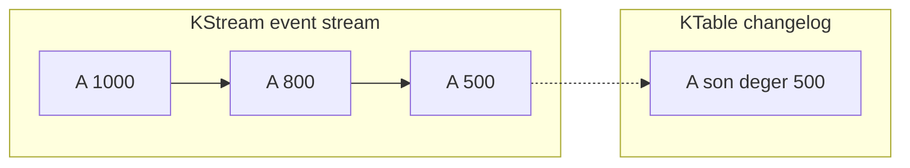
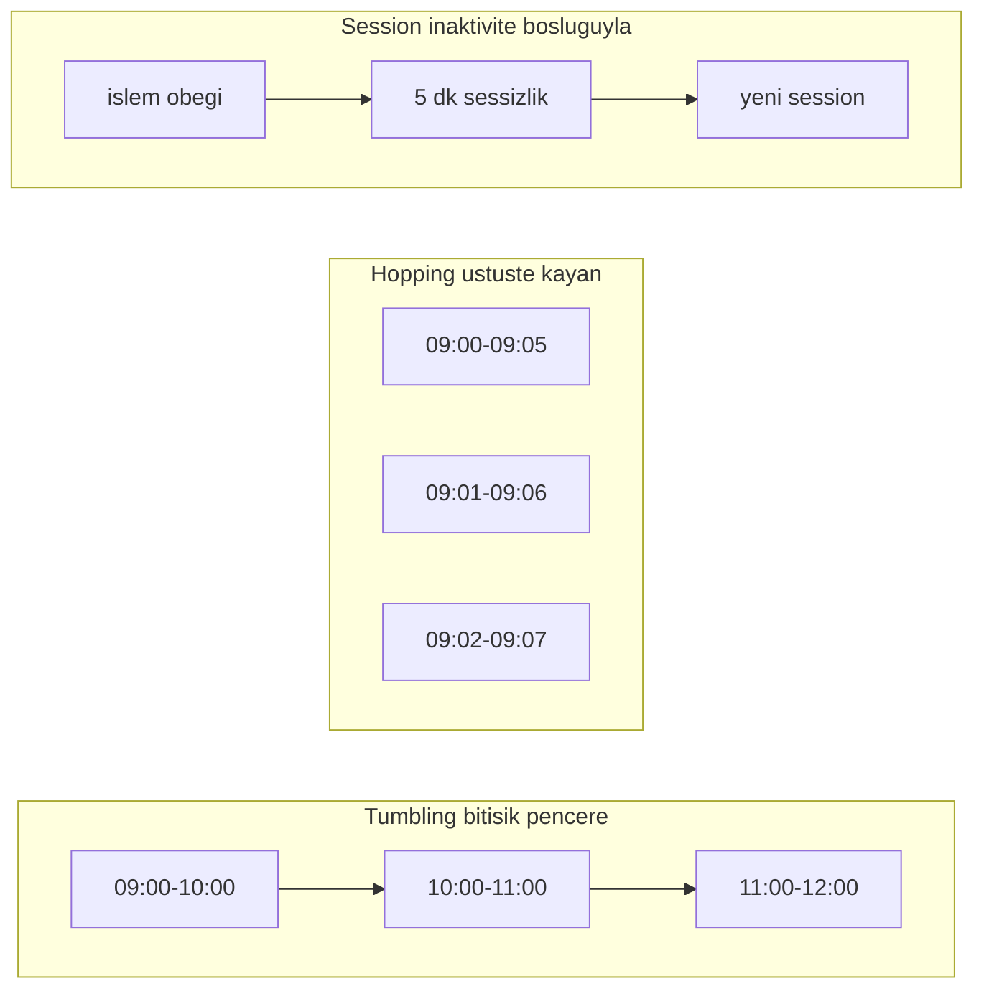
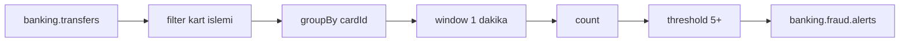
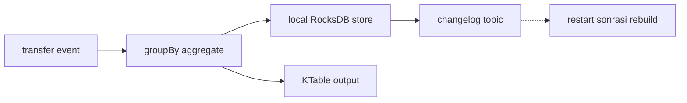

# Topic 6.5 — Kafka Streams: Real-Time Stream Processing

```admonish info title="Bu bölümde"
- KStream (event log), KTable (changelog) ve GlobalKTable (full replica) — hangisi ne zaman kullanılır
- Stateless (filter/map/branch) ve stateful (count/aggregate) operasyonların ayrımı, state'in nerede tutulduğu
- Windowing üçlüsü: tumbling, hopping, session — banking fraud kuralına göre doğru seçim
- State store'un local RocksDB + changelog topic ile nasıl fault-tolerant olduğu
- exactly-once V2, interactive queries ve gerçek zamanlı fraud detection pipeline tasarımı
```

## Hedef

Kafka Streams ile **continuous stream processing** öğrenmek: KStream/KTable/GlobalKTable, stateless ve stateful operations, windowing, join semantics, state store, exactly-once processing, interactive queries. Banking için **real-time fraud detection** ve **transaction enrichment** pipeline'ları kurabilmek.

## Süre

Okuma: ~2 saat • Kendini Sına: 45 dk • Pratik (opsiyonel): 3-4 saat • Toplam: ~2.5 saat (+ pratik)

## Önbilgi

- Topic 6.1-6.4 bitti (Kafka arch, producer, consumer, Spring Kafka)
- Idempotency + exactly-once kavramları biliniyor
- Banking domain: transfer event, fraud rule, account state

---

## Kavramlar

### 1. Stream processing ne, neden Kafka Streams

Bir kart işlemi geldiği **anda** fraud skorunu üretmek istiyorsun — sabahki batch job'u beklemek banking'de kabul edilemez. Kafka Streams tam bu **continuous stream processing** ihtiyacı için var.

Banking'de sürekli veri işleme ihtiyaçları tipik olarak şunlar:

- Real-time fraud detection (transaction geldiğinde anlık skor)
- Transaction enrichment (transfer + FX rate + customer info join)
- Aggregation (per-account daily totals, rolling windows)
- Anomaly detection (Z-score, threshold breaches)

Bu ihtiyaca üç farklı yöntemle cevap verilebilir; latency-complexity takası seçimini belirler:

| Yöntem | Latency | Complexity | Banking Adoption |
|---|---|---|---|
| Batch (Spring Batch) | Saatler | Düşük | EOD jobs (Phase 5) |
| Reactive consumer + DB | Saniyeler | Orta | Yaygın |
| **Stream processing** | Milisaniye | Yüksek | Modern banking |

**Kafka Streams** bir library — broker değil, senin **client uygulaman** içinde çalışır ve Spring Boot'a JAR olarak deploy edilir. Bu, Flink/Spark gibi ayrı cluster kurmadan stream processing yapabilmek demek.

```admonish tip title="Kafka Streams mı, Flink mi?"
Kafka Streams bir kütüphanedir: Spring Boot içinde çalışır, deployment basittir, real-time fraud detection ve event enrichment için idealdir. Flink/Spark ise ayrı cluster ister — daha güçlüdür ama operasyonel yük getirir. Banking pratiği: fraud ve enrichment için Kafka Streams, ağır analytics için Flink.
```

### 2. KStream — event stream

Bir hesabın "olan biten her şeyini" kaydetmek istiyorsan **KStream** kullanırsın: her record bağımsız, immutable, append-only bir **event**'tir.

```java
KStream<String, TransferEvent> transfers = builder.stream(
    "banking.transfers",
    Consumed.with(Serdes.String(), transferEventSerde())
);
```

Her transfer, KStream'in ayrı bir record'u — birbirini ezmez, hepsi log'da durur:

```
Time: 10:00:01 → Transfer(A→B, 100 TL)
Time: 10:00:05 → Transfer(C→D, 500 TL)
Time: 10:00:08 → Transfer(A→E, 200 TL)
```

### 3. KTable — changelog stream

Bir entity'nin **son halini** takip etmek istiyorsan **KTable** kullanırsın: aynı key ile gelen yeni record, eskisini güncelleyen bir changelog'dur.

```java
KTable<String, AccountBalance> balances = builder.table(
    "banking.account-balances",
    Consumed.with(Serdes.String(), accountBalanceSerde())
);
```

A hesabı için iki record gelirse, KTable'da sadece **sonuncusu** kalır; eski değer tarihte kaybolur:

```
Time: 10:00:01 → AccountBalance(A, 1000 TL)
Time: 10:00:05 → AccountBalance(A, 800 TL)    ← A'nın son hali
Time: 10:00:10 → AccountBalance(B, 500 TL)
```

Mental model olarak fark net: KStream "transferleri logla" (event log), KTable "balance'lar nereye geldi" (current state). Aynı topic'i iki farklı gözle okumanın yolu bu.



### 4. GlobalKTable — full replicate

Küçük bir lookup tablosunu (BIN listesi, currency listesi) her instance'ta hazır bulundurmak istiyorsan **GlobalKTable** kullanırsın: read-only, tüm instance'larda tam kopya.

```java
GlobalKTable<String, CustomerInfo> customers = builder.globalTable(
    "banking.customer-info",
    Consumed.with(Serdes.String(), customerInfoSerde())
);
```

Stream-table join'lerde çok kullanışlıdır çünkü foreign key ile lookup yapmak için re-partition gerekmez. Tuzak burada başlar: tablo memory'de tutulur.

<mark>GlobalKTable her instance'ın memory'sinde tam kopya tutulur — sadece küçük lookup tabloları için kullan, büyük tablolar OOM'a götürür.</mark>

### 5. Stateless operations

Stateless operasyonlar hiç state tutmaz: her record'a bağımsız uygulanır, restart'ta yeniden inşa edilecek bir şey yoktur. Üç temel araç: `filter`, `map/mapValues`, `branch`.

**filter** — belirli koşulu geçen record'ları ayırır. 10000+ TL transfer'leri ayrı topic'e:

```java
transfers
    .filter((k, v) -> v.getAmount().compareTo(new BigDecimal("10000")) > 0)
    .to("banking.transfers.high-value");
```

**mapValues** — value'yu dönüştürür (key sabit). Transfer'i FX rate ile zenginleştir:

```java
KStream<String, EnrichedTransfer> enriched = transfers
    .mapValues(event -> EnrichedTransfer.builder()
        .from(event.getFromAccount())
        .to(event.getToAccount())
        .amount(event.getAmount())
        .fxRate(fxService.getCurrentRate(event.getCurrency()))
        .build());
```

Buradaki `fxService` lokal bir cache olmalı, canlı bir DB/HTTP çağrısı değil. Sebep kritik bir kural:

<mark>Stream operasyonlarının lambda'sı içinde asla external call (DB, HTTP) yapma — her event'te roundtrip throughput'u öldürür.</mark>

Enrichment için doğru yol GlobalKTable join veya state store'dur (bkz. Bölüm 9).

**branch** — stream'i koşullara göre birden fazla stream'e böler. Currency'e göre routing:

```java
Map<String, KStream<String, TransferEvent>> branches = transfers
    .split(Named.as("by-currency-"))
    .branch((k, v) -> "TRY".equals(v.getCurrency()), Branched.as("try"))
    .branch((k, v) -> "USD".equals(v.getCurrency()), Branched.as("usd"))
    .defaultBranch(Branched.as("other"));

branches.get("by-currency-try").to("banking.transfers.try");
branches.get("by-currency-usd").to("banking.transfers.usd");
```

### 6. Stateful operations

Stateful operasyonlar önceki record'ları "hatırlar" — count, aggregate, join gibi. State **local RocksDB**'de disk üzerinde tutulur ve `Materialized.as(...)` ile isimlendirilir.

**groupBy + count** — her account için kümülatif transfer sayısı:

```java
KTable<String, Long> transferCountByAccount = transfers
    .groupBy((key, event) -> event.getFromAccount(),
        Grouped.with(Serdes.String(), transferEventSerde()))
    .count(Materialized.as("transfer-count-store"));

transferCountByAccount.toStream().to("banking.account.transfer-counts");
```

**aggregate** — custom accumulator ile daha zengin özet (total volume, avg, max):

```java
KTable<String, AccountStatistics> stats = transfers
    .groupBy((k, v) -> v.getFromAccount(), Grouped.with(Serdes.String(), transferEventSerde()))
    .aggregate(
        AccountStatistics::empty,
        (key, event, agg) -> agg.addTransfer(event),
        Materialized.<String, AccountStatistics, KeyValueStore<Bytes, byte[]>>as("account-stats")
            .withValueSerde(accountStatsSerde())
    );
```

`groupBy` genelde re-partition tetikler (yeni key'e göre veri yeniden dağıtılır); bunu bilinçli tasarla.

### 7. Windowing — time-bounded aggregation

"Son 1 dakikada kaç işlem" gibi sorular zaman sınırı ister; **windowing** aggregation'ı zaman kutularına böler. Üç tür var, her biri farklı bir banking sorusuna cevap verir.

**Tumbling window** — bitişik, çakışmayan sabit pencereler (`09:00-10:00`, `10:00-11:00`):

```java
KTable<Windowed<String>, Long> hourlyCount = transfers
    .groupBy((k, v) -> v.getFromAccount(), Grouped.with(Serdes.String(), transferEventSerde()))
    .windowedBy(TimeWindows.ofSizeWithNoGrace(Duration.ofHours(1)))
    .count();
```

**Hopping window** — sabit boyut ama üst üste binen, kayan pencereler:

```java
TimeWindows.ofSizeAndGrace(Duration.ofMinutes(5), Duration.ZERO)
    .advanceBy(Duration.ofMinutes(1));   // 5 dk pencere, her dakika yenisi başlar
```

**Session window** — inaktivite boşluğuyla tanımlanır; belirtilen süre hareket yoksa yeni session başlar:

```java
SessionWindows.ofInactivityGapWithNoGrace(Duration.ofMinutes(5));
```



```admonish tip title="Doğru window'u seç"
Banking eşlemesi net: 1 dakikada 5+ işlem fraud kuralı → tumbling; her dakika kontrol edilen kayan 5 dk fraud penceresi → hopping; kullanıcı 5 dk hareketsizse app session bitti → session. Kuralın zaman semantiği window türünü belirler.
```

### 8. Banking örnek — Real-time fraud detection

**Kural:** Aynı karttan **1 dakika içinde 5+ transaction** → fraud alert. Bu, bir stream topology'sinin klasik source → transform → sink akışıdır:



Önce source'tan oku ve sadece kart işlemlerini bırak:

```java
KStream<String, TransferEvent> cardTransactions = builder
    .stream("banking.transfers",
        Consumed.with(Serdes.String(), transferEventSerde()))
    .filter((k, v) -> v.getCardId() != null);
```

Ardından cardId'ye göre grupla ve 1 dakikalık tumbling window'da say — bu adım state store'a yazar:

```java
KTable<Windowed<String>, Long> txPerCardPerMinute = cardTransactions
    .groupBy((k, v) -> v.getCardId().toString(),
        Grouped.with(Serdes.String(), transferEventSerde()))
    .windowedBy(TimeWindows.ofSizeWithNoGrace(Duration.ofMinutes(1)))
    .count(Materialized.as("tx-count-per-card-per-minute"));
```

Son olarak eşiği geçenleri alert'e çevir ve alerts topic'ine yaz:

```java
txPerCardPerMinute.toStream()
    .filter((windowedKey, count) -> count >= 5)
    .map((windowedKey, count) -> toFraudAlert(windowedKey, count))
    .to("banking.fraud.alerts", Produced.with(Serdes.String(), fraudAlertSerde()));
```

Çıktı anlık üretilir; downstream consumer (alert-service) müşteriye SMS atar veya kartı geçici bloke eder:

```
banking.fraud.alerts:
  Time 10:00:30 → FraudAlert(card-X, count=6, HIGH)
  Time 10:01:45 → FraudAlert(card-Y, count=12, CRITICAL)
```

<details>
<summary>Tam kod: FraudDetectionTopology (~70 satır)</summary>

```java
@Configuration
@EnableKafkaStreams
public class FraudDetectionTopology {

    @Bean
    public KStream<String, TransferEvent> fraudPipeline(StreamsBuilder builder) {

        // 1. Source stream
        KStream<String, TransferEvent> transfers = builder.stream(
            "banking.transfers",
            Consumed.with(Serdes.String(), transferEventSerde())
        );

        // 2. Filter card transactions only
        KStream<String, TransferEvent> cardTransactions = transfers
            .filter((k, v) -> v.getCardId() != null);

        // 3. Group by cardId, window 1 minute
        KTable<Windowed<String>, Long> txPerCardPerMinute = cardTransactions
            .groupBy((k, v) -> v.getCardId().toString(),
                Grouped.with(Serdes.String(), transferEventSerde()))
            .windowedBy(TimeWindows.ofSizeWithNoGrace(Duration.ofMinutes(1)))
            .count(Materialized.as("tx-count-per-card-per-minute"));

        // 4. Filter > 5 + emit alert
        KStream<String, FraudAlert> fraudAlerts = txPerCardPerMinute
            .toStream()
            .filter((windowedKey, count) -> count >= 5)
            .map((windowedKey, count) -> {
                UUID cardId = UUID.fromString(windowedKey.key());
                Instant windowStart = windowedKey.window().startTime();
                Instant windowEnd = windowedKey.window().endTime();

                FraudAlert alert = FraudAlert.builder()
                    .alertId(UUID.randomUUID())
                    .cardId(cardId)
                    .ruleCode("HIGH_FREQUENCY_TRANSACTIONS")
                    .severity(count >= 10 ? "CRITICAL" : "HIGH")
                    .score(Math.min(count * 10, 100))
                    .windowStart(windowStart)
                    .windowEnd(windowEnd)
                    .transactionCount(count.intValue())
                    .detectedAt(Instant.now())
                    .build();

                return KeyValue.pair(cardId.toString(), alert);
            });

        // 5. Sink to alerts topic
        fraudAlerts.to("banking.fraud.alerts",
            Produced.with(Serdes.String(), fraudAlertSerde()));

        return transfers;
    }

    @Bean
    public KafkaStreamsConfiguration kStreamsConfig() {
        Map<String, Object> props = new HashMap<>();
        props.put(StreamsConfig.APPLICATION_ID_CONFIG, "banking-fraud-detection");
        props.put(StreamsConfig.BOOTSTRAP_SERVERS_CONFIG, "kafka:9092");
        props.put(StreamsConfig.DEFAULT_KEY_SERDE_CLASS_CONFIG, Serdes.String().getClass().getName());
        props.put(StreamsConfig.PROCESSING_GUARANTEE_CONFIG, StreamsConfig.EXACTLY_ONCE_V2);
        props.put(StreamsConfig.COMMIT_INTERVAL_MS_CONFIG, 1000);
        props.put(StreamsConfig.STATE_DIR_CONFIG, "/var/lib/kafka-streams");
        props.put(StreamsConfig.NUM_STREAM_THREADS_CONFIG, 3);
        return new KafkaStreamsConfiguration(props);
    }
}
```

</details>

### 9. Stream-table join (enrichment)

Bir transfer event'ini müşteri bilgisiyle zenginleştirmek istiyorsan, DB çağrısı yerine bir **stream-table join** kullanırsın — lookup verisi zaten memory'de hazır durur.

```java
KStream<String, TransferEvent> transfers = builder.stream("banking.transfers");
GlobalKTable<String, AccountInfo> accounts = builder.globalTable("banking.account-info");

KStream<String, EnrichedTransfer> enriched = transfers.leftJoin(
    accounts,
    (transferKey, transferValue) -> transferValue.getFromAccount(),   // foreign key extractor
    (transferValue, accountInfo) -> EnrichedTransfer.builder()
        .transfer(transferValue)
        .fromAccountName(accountInfo != null ? accountInfo.getName() : "UNKNOWN")
        .fromAccountTier(accountInfo != null ? accountInfo.getTier() : "STANDARD")
        .build()
);

enriched.to("banking.transfers.enriched");
```

`leftJoin` sayesinde eşleşmeyen kayıtlar da (accountInfo `null`) düşmeden geçer — banking'de eksik lookup'ı sessizce kaybetmek istemezsin.

### 10. Stream-stream join

İki ayrı stream'de paralel akan olayları eşlemek istiyorsan (transfer ve onun fraud score'u genelde ayrı akar), bir **JoinWindows** ile stream-stream join yaparsın.

```java
KStream<String, TransferEvent> transfers = builder.stream("banking.transfers");
KStream<String, FraudScore> scores = builder.stream("banking.fraud.scores");

KStream<String, ScoredTransfer> joined = transfers.join(
    scores,
    (transfer, score) -> new ScoredTransfer(transfer, score),
    JoinWindows.ofTimeDifferenceWithNoGrace(Duration.ofMinutes(5))
);
```

5 dakika içinde aynı key ile iki stream'de görünen event'ler eşleşir. Bu pencere state store'da tutulur, dolayısıyla genişliği doğrudan disk maliyetidir.

```admonish warning title="Join window'u dar tut"
`JoinWindows.ofTimeDifferenceWithNoGrace(Duration.ofDays(1))` gibi geniş bir pencere, 24 saatlik join state'i RocksDB'de tutar — disk ve restore süresi patlar. Kuralın gerçekten ihtiyaç duyduğu en dar realistic window'u seç.
```

### 11. State store — local persistent state

Stateful operasyonlar (`count`, `aggregate`, `join`) state'i **local RocksDB**'de tutar — her instance kendi task'inin state'ini diskte taşır.

```
/var/lib/kafka-streams/
  banking-fraud-detection/
    0_0/        ← Stream task 0_0
      tx-count-per-card-per-minute/
        rocksdb/
          ...
```

Peki instance çökerse local disk'teki state ne olur? İşte fault-tolerance'ın kalbi burada:

<mark>Her state store otomatik bir changelog topic'e (`<app-id>-<store>-changelog`) yazılır; crash sonrası state bu changelog replay edilerek rebuild edilir.</mark>



Yani local RocksDB hız içindir, changelog topic dayanıklılık içindir — ikisi birlikte "hem hızlı hem kayıpsız" state sağlar.

### 12. Exactly-once processing

Fraud detection'da duplicate alert müşteriyi rahatsız eder, kaçan alert para kaybettirir — bu yüzden **exactly-once** garantisi banking'de opsiyonel değildir.

```java
props.put(StreamsConfig.PROCESSING_GUARANTEE_CONFIG, StreamsConfig.EXACTLY_ONCE_V2);
```

Kafka Streams read → process → write üçlüsünü tek atomic transaction yapar: input offset commit, state store update ve output publish hep birlikte olur ya hiç olmaz. Crash → rollback, restart → kaldığı yerden.

<mark>exactly-once V2 olmadan pipeline crash sonrası duplicate alert veya kayıp alert üretir.</mark>

```admonish tip title="Banking için exactly-once şart"
Para hareketleri ve fraud alert'lerinde her zaman `EXACTLY_ONCE_V2` kullan. At-least-once ile duplicate, at-most-once ile kayıp riski doğar; ikisi de banking'de kabul edilemez. Bedeli hafif latency artışıdır ve buna değer.
```

### 13. Interactive queries

State store'daki veriyi DB'ye gitmeden, uygulama içinden okumak istiyorsan **interactive queries** kullanırsın — bir kartın anlık dakika sayısını doğrudan store'dan çekersin.

Önce store handle'ını al:

```java
ReadOnlyWindowStore<String, Long> store = streams.store(
    StoreQueryParameters.fromNameAndType(
        "tx-count-per-card-per-minute",
        QueryableStoreTypes.windowStore()));
```

Sonra ilgili zaman aralığını fetch et ve topla:

```java
Instant now = Instant.now();
try (WindowStoreIterator<Long> iter =
        store.fetch(cardId.toString(), now.minus(1, ChronoUnit.MINUTES), now)) {
    long total = 0;
    while (iter.hasNext()) total += iter.next().value;
    return total;
}
```

Bunu bir REST endpoint'e bağlarsan read model elde edersin: DB sorgulamadan anlık veriler.

```java
@GetMapping("/cards/{id}/transaction-count")
public Long getCount(@PathVariable UUID id) {
    return queryService.getCurrentMinuteCount(id);
}
```

```admonish warning title="Restart sırasında store unavailable"
Kafka Streams instance restart olduğunda state store changelog'dan rebuild edilir — bu süreçte interactive query 5-10 dakika unavailable olabilir. UI/API çağrıları timeout yer. `KafkaStreams.State.RUNNING` kontrolü içeren bir health check ile guard'la.
```

<details>
<summary>Tam kod: FraudQueryService (~30 satır)</summary>

```java
@Component
public class FraudQueryService {

    @Autowired
    private StreamsBuilderFactoryBean factoryBean;

    public Long getCurrentMinuteCount(UUID cardId) {
        KafkaStreams streams = factoryBean.getKafkaStreams();

        ReadOnlyWindowStore<String, Long> store = streams.store(
            StoreQueryParameters.fromNameAndType(
                "tx-count-per-card-per-minute",
                QueryableStoreTypes.windowStore())
        );

        Instant now = Instant.now();
        Instant oneMinuteAgo = now.minus(1, ChronoUnit.MINUTES);

        try (WindowStoreIterator<Long> iter = store.fetch(
            cardId.toString(), oneMinuteAgo, now)) {

            long total = 0;
            while (iter.hasNext()) {
                total += iter.next().value;
            }
            return total;
        }
    }
}
```

</details>

### 14. Topology + processor API

Yüksek seviye DSL bir custom windowing veya punctuator-based time trigger'a yetmezse, low-level **Processor API**'ye inersin — state store ve zamanlamayı elle yönetirsin.

`init` içinde store'u bağla ve periyodik bir punctuator kur:

```java
@Override
public void init(ProcessorContext<String, FraudAlert> context) {
    this.context = context;
    this.store = context.getStateStore("fraud-state");
    context.schedule(Duration.ofMinutes(1), PunctuationType.WALL_CLOCK_TIME,
        this::punctuate);   // her dakika periyodik kontrol
}
```

`process` her event'te state'i günceller:

```java
@Override
public void process(Record<String, TransferEvent> record) {
    AggregateState state = store.get(record.key());
    if (state == null) state = AggregateState.empty();
    store.put(record.key(), state.addEvent(record.value(), record.timestamp()));
}
```

Punctuator ise store'u tarayıp alert şartını sağlayanları forward eder — DSL'in veremediği "duvar saatine göre her dakika kontrol et" davranışı.

<details>
<summary>Tam kod: FraudProcessor (~35 satır)</summary>

```java
public class FraudProcessor implements Processor<String, TransferEvent, String, FraudAlert> {

    private ProcessorContext<String, FraudAlert> context;
    private KeyValueStore<String, AggregateState> store;

    @Override
    public void init(ProcessorContext<String, FraudAlert> context) {
        this.context = context;
        this.store = context.getStateStore("fraud-state");

        // Punctuator — periodic check (her dakika)
        context.schedule(Duration.ofMinutes(1), PunctuationType.WALL_CLOCK_TIME, ts -> {
            try (KeyValueIterator<String, AggregateState> iter = store.all()) {
                while (iter.hasNext()) {
                    KeyValue<String, AggregateState> entry = iter.next();
                    if (entry.value.shouldAlert(ts)) {
                        context.forward(new Record<>(entry.key, entry.value.toAlert(), ts));
                        store.put(entry.key, entry.value.reset());
                    }
                }
            }
        });
    }

    @Override
    public void process(Record<String, TransferEvent> record) {
        AggregateState state = store.get(record.key());
        if (state == null) state = AggregateState.empty();
        state = state.addEvent(record.value(), record.timestamp());
        store.put(record.key(), state);
    }
}
```

</details>

### 15. Spring Kafka Streams entegrasyonu

Spring, `@EnableKafkaStreams` ile `StreamsBuilderFactoryBean`'i otomatik yaratır ve topology bean'lerini auto-discover eder — sen sadece config ve topology'yi yazarsın.

```yaml
spring:
  kafka:
    streams:
      application-id: banking-fraud-detection
      bootstrap-servers: kafka:9092
      properties:
        default.key.serde: org.apache.kafka.common.serialization.Serdes$StringSerde
        default.value.serde: org.apache.kafka.common.serialization.Serdes$ByteArraySerde
        processing.guarantee: exactly_once_v2
        commit.interval.ms: 1000
        num.stream.threads: 3
        state.dir: /var/lib/kafka-streams
```

```java
@SpringBootApplication
@EnableKafkaStreams
public class FraudDetectionApplication {
    public static void main(String[] args) {
        SpringApplication.run(FraudDetectionApplication.class, args);
    }
}
```

### 16. ksqlDB — alternative

Java yazmadan, SQL ile stream processing yapmak isteyen analyst'lar için **ksqlDB** vardır — altında yine Kafka Streams çalışır.

```sql
CREATE STREAM transfers (
    transfer_id VARCHAR KEY,
    card_id VARCHAR,
    amount DECIMAL(19, 4),
    currency VARCHAR
) WITH (KAFKA_TOPIC='banking.transfers', VALUE_FORMAT='AVRO');

CREATE TABLE fraud_alerts AS
SELECT
    card_id,
    COUNT(*) AS tx_count,
    WINDOWSTART AS window_start
FROM transfers
WINDOW TUMBLING (SIZE 1 MINUTE)
GROUP BY card_id
HAVING COUNT(*) >= 5
EMIT CHANGES;
```

Banking pratiği: prototyping ve keşif için ksqlDB, production deployment için Java tarafında Kafka Streams.

### 17. Banking pattern — multi-stage fraud pipeline

Gerçek fraud detection tek kural değil; her kural ayrı bir stream operation olan çok aşamalı bir pipeline'dır:

```
Stage 1: Raw transfer stream
  ↓
Stage 2: Enrichment (account info via global table)
  ↓
Stage 3: Rule 1 — high frequency (1 min, 5+ tx)
Stage 4: Rule 2 — cumulative amount (24h, 100k+ TL)
Stage 5: Rule 3 — foreign destination (first time)
  ↓
Stage 6: Score aggregation (weighted sum)
  ↓
Stage 7: Threshold filter (score > 70)
  ↓
Output: banking.fraud.alerts
```

Her kural bir score üretir, `merge` ile birleşir, toplam skor eşiği geçince alert olur:

```java
@Bean
public KStream<String, TransferEvent> fraudTopology(StreamsBuilder builder) {
    KStream<String, TransferEvent> raw = builder.stream("banking.transfers");
    GlobalKTable<String, AccountInfo> accounts = builder.globalTable("banking.accounts");

    KStream<String, EnrichedTransfer> enriched = raw.leftJoin(accounts, ...);

    KStream<String, FraudScore> highFreqScore = applyHighFrequencyRule(enriched);
    KStream<String, FraudScore> cumScore = applyCumulativeAmountRule(enriched);
    KStream<String, FraudScore> foreignScore = applyForeignDestRule(enriched);

    KStream<String, FraudScore> totalScore = highFreqScore.merge(cumScore).merge(foreignScore);

    totalScore
        .filter((k, score) -> score.getTotal() > 70)
        .mapValues(score -> FraudAlert.from(score))
        .to("banking.fraud.alerts");

    return raw;
}
```

### 18. Banking anti-pattern'leri

Mülakatta "bu kodda ne yanlış?" sorusunun cephaneliği burası. Altı klasik:

**Anti-pattern 1: `mapValues` lambda'da external call** — her event = DB roundtrip = throughput felaket. GlobalKTable join veya state store kullan.

```java
.mapValues(event -> {
    AccountInfo info = accountRepository.findById(event.getAccountId());   // DB call
    return enrichWith(event, info);
})
```

**Anti-pattern 2: GlobalKTable'a büyük data** — 10M müşteri × 5KB = instance başına 50GB memory. Selective field, küçük lookup tablosu tut.

**Anti-pattern 3: `EXACTLY_ONCE_V2` yokken duplicate** — fraud pipeline'da duplicate/kayıp alert. Banking'de her zaman exactly-once.

**Anti-pattern 4: State store rebuild beklenmeden interactive query** — restart sonrası 5-10 dk store unavailable, çağrılar timeout. Health check ile guard.

**Anti-pattern 5: Stream-stream join window çok geniş** — `Duration.ofDays(1)` = dev RocksDB state. Realistic window seç.

**Anti-pattern 6: Topology'i runtime'da değiştirmek** — Kafka Streams topology `start()` sonrası immutable. Değişiklik = rebalance + state loss. Schema/topology değişikliği release-driven olmalı.

---

## Önemli olabilecek araştırma kaynakları

- "Kafka Streams in Action" (Bill Bejeck)
- Confluent Kafka Streams documentation
- Apache Kafka KIP-129 (exactly-once)
- ksqlDB documentation
- Spring Kafka Streams reference
- "Designing Event-Driven Systems" (Ben Stopford)

---

## Kendini Sına

Aşağıdaki soruları önce **cevaba bakmadan** kendi cümlelerinle yanıtlamayı dene — hepsi TR bank mülakatlarında karşına çıkabilecek tarzda. Takıldığın soru olursa ilgili Kavramlar başlığına dön, sonra tekrar dene.

**S1. KStream, KTable ve GlobalKTable arasındaki fark nedir? Birer banking örneğiyle hangisini ne zaman seçersin?**

<details>
<summary>Cevabı göster</summary>

KStream bir event stream'dir: her record bağımsız, immutable bir olay — "transferleri logla" gibi append-only akışlar için (banking.transfers). KTable bir changelog'dur: aynı key ile gelen yeni record eskisini günceller, yani entity'nin son halini tutar — hesap bakiyesi gibi current state için.

GlobalKTable ise bir KTable'ın her instance'ta tam kopyasıdır: read-only lookup ve re-partition gerektirmeyen join'ler için (BIN listesi, currency listesi). Seçim kuralı: olay akışı → KStream, güncellenen state → KTable, küçük ve her yerde lazım olan lookup → GlobalKTable.

</details>

**S2. Tumbling, hopping ve session window arasındaki fark nedir? Her biri için bir banking senaryosu ver.**

<details>
<summary>Cevabı göster</summary>

Tumbling: bitişik, çakışmayan sabit pencereler — `09:00-10:00`, `10:00-11:00`. Bir olay tek pencereye düşer. Örnek: "1 dakikada 5+ işlem" fraud kuralı. Hopping: sabit boyut ama üst üste binen, kayan pencereler (5 dk boyut, her dakika yeni pencere) — bir olay birden çok pencerede sayılır. Örnek: her dakika kontrol edilen kayan 5 dk fraud penceresi.

Session: sabit boyut yok; inaktivite boşluğuyla tanımlanır. Belirtilen süre hareket olmazsa yeni session başlar. Örnek: kullanıcı 5 dk hareketsizse banking app session'ı bitti. Kuralın zaman semantiği (sabit dilim mi, kayan mı, aktivite bazlı mı) window türünü belirler.

</details>

**S3. Kafka Streams'te state store nasıl fault-tolerant olur? Instance çökerse local RocksDB'deki state ne olur?**

<details>
<summary>Cevabı göster</summary>

Her stateful operasyon (count, aggregate, join) state'i local RocksDB'de disk üzerinde tutar — hız için. Fault-tolerance ise her state store'a otomatik eşlik eden bir changelog topic'ten (`<app-id>-<store>-changelog`) gelir: store'a yapılan her değişiklik aynı anda bu compacted topic'e yazılır.

Instance çökünce local RocksDB kaybolabilir, ama state changelog topic'te durmaya devam eder. Restart olduğunda (veya task başka instance'a taşındığında) Kafka Streams changelog'u replay ederek state'i rebuild eder. Yani local RocksDB dayanıklılık kaynağı değildir; asıl güvence broker'daki changelog topic'in replication'ıdır.

</details>

**S4. exactly-once V2 nasıl çalışır ve banking'de neden kritiktir?**

<details>
<summary>Cevabı göster</summary>

`PROCESSING_GUARANTEE_CONFIG = EXACTLY_ONCE_V2` ile Kafka Streams read → process → write üçlüsünü tek bir atomic transaction'a sarar: input topic offset commit'i, state store update'i ve output topic publish'i ya hep birlikte olur ya hiç olmaz. Crash olursa transaction rollback olur, restart'ta işlem kaldığı yerden tekrarlanır — ama yarı işlenmiş bir sonuç dışarı sızmaz.

Banking'de kritik çünkü at-least-once duplicate alert üretir (müşteriye ikinci kez SMS, gereksiz kart bloğu), at-most-once ise alert kaybettirir (fraud gözden kaçar). İkisi de kabul edilemez; exactly-once ikisini de önler, karşılığında hafif latency artışı getirir.

</details>

**S5. `mapValues` lambda'sı içinde DB çağrısı yapmak neden felakettir? Enrichment'i doğru nasıl yaparsın?**

<details>
<summary>Cevabı göster</summary>

Stream operasyonları her record için çalışır; lambda içinde bir DB veya HTTP çağrısı yaparsan her event'te bir network roundtrip olur. Yüksek throughput'lu bir transfer stream'inde bu, saniyede binlerce senkron çağrı demektir — latency patlar, throughput çöker, external sistem de yük altında kalır.

Doğru yol lookup verisini stream'in yanına getirmektir: küçük referans tabloları için GlobalKTable ile stream-table join (`leftJoin`), veya önceden materialize edilmiş bir state store. Böylece enrichment memory'deki veriden yapılır, canlı bir I/O çağrısı olmadan.

</details>

**S6. Stream-table join ile stream-stream join arasındaki fark nedir? Her biri hangi banking senaryosunda kullanılır?**

<details>
<summary>Cevabı göster</summary>

Stream-table join bir event akışını (KStream) durağan/yavaş değişen bir lookup'la (KTable veya GlobalKTable) zenginleştirir. Zaman penceresi yoktur: event geldiğinde tablonun o anki hali okunur. Örnek: transfer event'ini müşteri adı ve tier bilgisiyle enrich etmek.

Stream-stream join iki event akışını bir `JoinWindows` zaman penceresi içinde eşler — her iki taraf da akan olaylardır ve state store'da tutulur. Örnek: paralel akan transfer ve fraud score stream'lerini 5 dk içinde aynı key ile birleştirmek. Pencere genişliği doğrudan RocksDB disk maliyeti olduğundan olabildiğince dar tutulur.

</details>

**S7. Interactive query, instance restart sırasında neden unavailable olur? Bunu nasıl handle edersin?**

<details>
<summary>Cevabı göster</summary>

Interactive query, local state store'dan okur. Instance restart olduğunda (veya bir task rebalance ile başka instance'a taşındığında) o store'un changelog topic'ten rebuild edilmesi gerekir; store'a yeniden RUNNING olana kadar erişilemez. Büyük store'larda bu 5-10 dakika sürebilir ve bu süreçte query'ler boş sonuç döner veya timeout yer.

Handle etmek için `KafkaStreams.State.RUNNING` durumunu kontrol eden bir health check koyarsın: store hazır değilse endpoint 503/retry-after döndürür, sağlık kontrolü instance'ı trafiğe geç açar. Kritik okumalar için ayrıca standby replica (`num.standby.replicas`) ile rebuild süresini kısaltabilirsin.

</details>

**S8. Aynı bean içinde 1M kayıtlık bir listeyi tek stream operation lambda'sında işlemek yerine, Kafka Streams neden per-record ölçeklenir? Re-partition ne zaman devreye girer?**

<details>
<summary>Cevabı göster</summary>

Kafka Streams veriyi topic partition'larına göre paralel task'lere böler; her record küçük, bağımsız birim olarak akar ve state local tutulduğundan tek dev bir in-memory koleksiyon yönetmek gerekmez. Ölçek, partition sayısı ve stream thread sayısıyla yatay büyür.

Re-partition, `groupBy` veya `selectKey` ile record'un key'i değiştiğinde devreye girer: aynı yeni key'e sahip tüm record'ların aynı task'e gitmesi için Kafka Streams araya bir internal repartition topic ekler. Bu doğru aggregation için gereklidir ama ekstra I/O demektir; gereksiz key değişikliğinden kaçınmak performans açısından önemlidir.

</details>

---

## Tamamlama kriterleri

- [ ] KStream, KTable ve GlobalKTable farkını banking örneğiyle anlatabiliyorum
- [ ] Stateless vs stateful operasyon ayrımını ve state'in nerede tutulduğunu biliyorum
- [ ] Tumbling / hopping / session window'u banking kuralına göre seçebiliyorum
- [ ] State store'un changelog topic ile nasıl fault-tolerant olduğunu açıklayabiliyorum
- [ ] exactly-once V2'nin atomic read-process-write garantisini ve banking'de neden kritik olduğunu biliyorum
- [ ] Gerçek zamanlı fraud detection pipeline'ını (window + count + threshold alert) tahtada çizebilirim
- [ ] Stream-table (enrichment) ve stream-stream join farkını biliyorum
- [ ] Interactive query'nin restart sırasında neden unavailable olduğunu ve nasıl handle edileceğini biliyorum
- [ ] (Opsiyonel) "Pratik yapmak istersen" bölümündeki testleri yazdım ve Claude-verify prompt'uyla doğrulattım

---

## Defter notları

1. "KStream vs KTable vs GlobalKTable kullanım farkı banking örneği: ____."
2. "Stateless vs stateful operation — state store nerede tutulur: ____."
3. "Tumbling / Hopping / Session window banking örneği: ____."
4. "Stream-stream join window genişliği — realistic değerleri: ____."
5. "GlobalKTable OOM tuzağı, lookup table size limit: ____."
6. "exactly_once_v2 atomic read-process-write: ____."
7. "State store local RocksDB + changelog topic backup: ____."
8. "Interactive query restart sırasında unavailable handling: ____."
9. "Processor API ile DSL arasında karar (low-level vs high-level): ____."
10. "Banking real-time fraud detection 5+ tx/1dk pattern Java code: ____."

```admonish success title="Bölüm Özeti"
- KStream event log'dur (her record bağımsız event), KTable changelog'dur (key'in son hali); GlobalKTable her instance'ta tam kopyadır, sadece küçük lookup için
- Stateless operasyonlar (filter/map/branch) state tutmaz; stateful olanlar (count/aggregate/join) local RocksDB state store kullanır
- Windowing üçlüsü: tumbling (bitişik dilim), hopping (üst üste kayan), session (inaktivite boşluğu) — fraud kuralı tipik olarak 1 dk tumbling
- Her state store otomatik changelog topic'e yazılır; crash sonrası state bu changelog replay edilerek rebuild edilir — fault-tolerance buradan gelir
- exactly-once V2 read-process-write'ı tek atomic transaction yapar; fraud detection'da duplicate ve missed alert'i önler
- Real-time fraud pipeline: source → filter → windowed count → threshold filter → alert sink, hepsi Kafka Streams DSL ile
```

---

## Pratik yapmak istersen

Kavramları koda dökmek istersen aşağıdaki iki ek hazır: test yazma rehberi TopologyTestDriver ile fraud detection ve window kapanması için örnek testler içerir; Claude-verify prompt'u ile yazdığın Kafka Streams kodunu banking-grade perspektiften denetletebilirsin.

> Süre: bu bölüm opsiyoneldir, testleri kurup çalıştırmak ~3-4 saat sürer. Tamamlanma göstergesi: TopologyTestDriver ile fraud detection unit test'lerini yeşile aldın, en az bir TestContainers integration test'i uçtan uca alert üretti ve Claude-verify prompt'unun her maddesine PASS/FAIL/EKSIK verebiliyorsun.

<details>
<summary>Test yazma rehberi</summary>

### Test 6.5.1 — TopologyTestDriver (unit test)

```java
class FraudDetectionTopologyTest {

    private TopologyTestDriver driver;
    private TestInputTopic<String, TransferEvent> inputTopic;
    private TestOutputTopic<String, FraudAlert> outputTopic;

    @BeforeEach
    void setUp() {
        StreamsBuilder builder = new StreamsBuilder();
        new FraudDetectionTopology().fraudPipeline(builder);
        Topology topology = builder.build();

        Properties props = new Properties();
        props.put(StreamsConfig.APPLICATION_ID_CONFIG, "test-fraud");
        props.put(StreamsConfig.BOOTSTRAP_SERVERS_CONFIG, "dummy:9092");

        driver = new TopologyTestDriver(topology, props);

        inputTopic = driver.createInputTopic("banking.transfers",
            Serdes.String().serializer(), transferEventSerde().serializer());
        outputTopic = driver.createOutputTopic("banking.fraud.alerts",
            Serdes.String().deserializer(), fraudAlertSerde().deserializer());
    }

    @AfterEach
    void tearDown() {
        driver.close();
    }

    @Test
    void shouldNotAlertWhenLessThan5TransactionsInWindow() {
        UUID cardId = UUID.randomUUID();
        Instant base = Instant.parse("2025-01-01T10:00:00Z");

        for (int i = 0; i < 4; i++) {
            inputTopic.pipeInput(cardId.toString(),
                TransferEvent.builder().cardId(cardId).amount(BigDecimal.TEN).build(),
                base.plusSeconds(i * 10));
        }

        List<KeyValue<String, FraudAlert>> alerts = outputTopic.readKeyValuesToList();
        assertThat(alerts).isEmpty();
    }

    @Test
    void shouldAlertWhenFiveTransactionsInOneMinute() {
        UUID cardId = UUID.randomUUID();
        Instant base = Instant.parse("2025-01-01T10:00:00Z");

        for (int i = 0; i < 5; i++) {
            inputTopic.pipeInput(cardId.toString(),
                TransferEvent.builder().cardId(cardId).amount(BigDecimal.TEN).build(),
                base.plusSeconds(i * 10));
        }

        // Window kapanması için time advance
        driver.advanceWallClockTime(Duration.ofMinutes(2));

        List<KeyValue<String, FraudAlert>> alerts = outputTopic.readKeyValuesToList();
        assertThat(alerts).hasSize(1);
        FraudAlert alert = alerts.get(0).value;
        assertThat(alert.getCardId()).isEqualTo(cardId);
        assertThat(alert.getTransactionCount()).isEqualTo(5);
        assertThat(alert.getRuleCode()).isEqualTo("HIGH_FREQUENCY_TRANSACTIONS");
    }

    @Test
    void shouldEscalateToCriticalAt10Transactions() {
        UUID cardId = UUID.randomUUID();
        Instant base = Instant.parse("2025-01-01T10:00:00Z");

        for (int i = 0; i < 10; i++) {
            inputTopic.pipeInput(cardId.toString(),
                TransferEvent.builder().cardId(cardId).amount(BigDecimal.TEN).build(),
                base.plusSeconds(i * 5));
        }

        driver.advanceWallClockTime(Duration.ofMinutes(2));

        List<KeyValue<String, FraudAlert>> alerts = outputTopic.readKeyValuesToList();
        assertThat(alerts).hasSize(1);
        assertThat(alerts.get(0).value.getSeverity()).isEqualTo("CRITICAL");
    }
}
```

### Test 6.5.2 — Integration with TestContainers

```java
@SpringBootTest
@Testcontainers
class FraudDetectionIT {

    @Container
    static KafkaContainer kafka = new KafkaContainer(...);

    @Test
    void endToEndFraudDetection() throws Exception {
        UUID cardId = UUID.randomUUID();

        for (int i = 0; i < 5; i++) {
            kafkaTemplate.send("banking.transfers", cardId.toString(),
                TransferEvent.builder().cardId(cardId).amount(BigDecimal.TEN).build());
        }

        // Consume fraud alerts
        KafkaConsumer<String, FraudAlert> consumer = createTestConsumer("banking.fraud.alerts");

        await().atMost(30, SECONDS).untilAsserted(() -> {
            ConsumerRecords<String, FraudAlert> records = consumer.poll(Duration.ofSeconds(2));
            assertThat(records).isNotEmpty();

            FraudAlert alert = records.iterator().next().value();
            assertThat(alert.getCardId()).isEqualTo(cardId);
        });
    }
}
```

</details>

<details>
<summary>Claude-verify prompt</summary>

```
Kafka Streams kodumu banking-grade kriterlere göre değerlendir:

1. Stream / table tip seçimi:
   - Event stream için KStream?
   - State/changelog için KTable?
   - Read-only lookup için GlobalKTable (küçük data)?

2. Stateless operations:
   - filter, map, mapValues banking örneği uygun mu?
   - mapValues içinde external call (DB) YAPILMIYOR mu?

3. Stateful operations:
   - groupBy + count/aggregate pattern doğru mu?
   - Materialized.as ile state store named mi?

4. Windowing:
   - Tumbling vs Hopping vs Session uygun seçilmiş mi?
   - Window size banking kuralına uygun (1 dk fraud, 24h cumulative)?

5. Joins:
   - Stream-table (enrichment) için GlobalKTable veya KTable?
   - Stream-stream join window realistic mi?

6. Exactly-once:
   - processing.guarantee=EXACTLY_ONCE_V2 aktif mi?
   - Duplicate event test edildi mi?

7. State store + interactive queries:
   - Local RocksDB state store?
   - Interactive query REST endpoint?
   - Restart sırasında store unavailable handling?

8. Banking fraud pipeline:
   - Multi-rule pipeline (high freq + cumulative + foreign)?
   - Score aggregation + threshold filter?
   - Alert event yayını?

9. Anti-pattern:
   - mapValues içinde DB call?
   - Büyük GlobalKTable (OOM riski)?
   - exactly_once_v2 yok?
   - Çok geniş join window?

10. Test:
    - TopologyTestDriver unit test?
    - TestInputTopic / TestOutputTopic kullanımı?
    - advanceWallClockTime ile window kapanması?
    - TestContainers ile integration test?

Her madde için PASS / FAIL / EKSIK işaretle.
```

</details>
