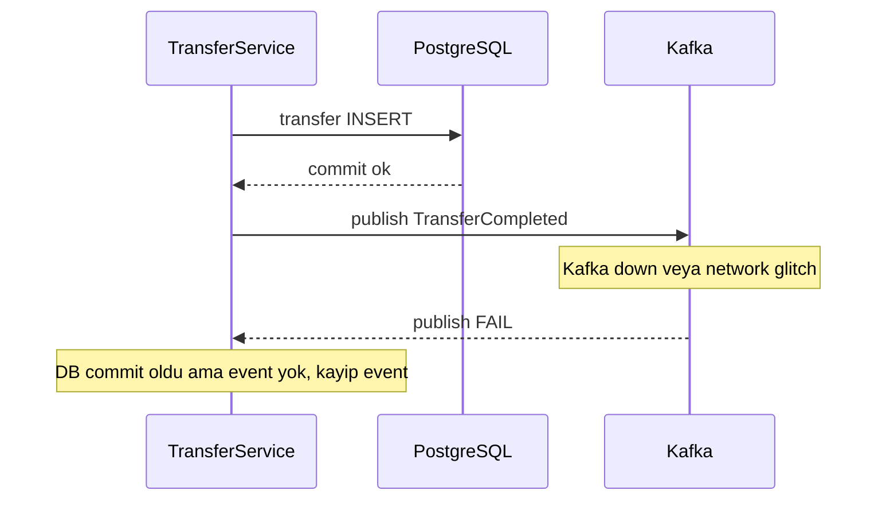
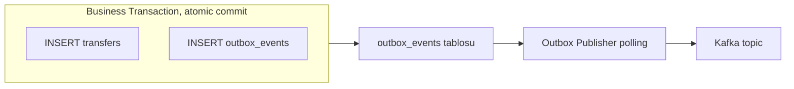
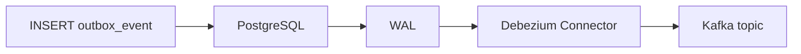

# Topic 6.6 — Outbox Pattern & CDC

```admonish info title="Bu bölümde"
- **Dual-write problem**: DB commit oldu ama event yayınlanamadı — banking'de neden kayıp event kabul edilemez, 3 patolojik senaryo
- **Outbox pattern**: business insert + event insert aynı DB transaction'ında → atomicity garantisi, publisher event'i eventual olarak Kafka'ya taşır
- Polling publisher: `@Scheduled` + `@SchedulerLock` + `FOR UPDATE SKIP LOCKED` ile multi-instance safe yayın
- **CDC / Debezium**: WAL streaming ile ~ms latency, `EventRouter` ile topic routing; polling vs CDC trade-off
- Consumer idempotency (outbox ID = key), eventual consistency UX etkisi ve banking anti-pattern'leri
```

## Hedef

Banking'in en kritik integration pattern'lerinden birini kavramak: **dual-write problem**'i ve **outbox pattern** ile atomik çözümü. DB transfer'i ile Kafka event publish'i tek atomicity garantisi altında birleştirmek. CDC (Change Data Capture) ile Debezium kullanımı, polling publisher pattern ve eventual consistency trade-off'larını sebep–sonuç olarak anlatabilmek.

## Süre

Okuma: 2 saat • Kendini Sına: 45 dk • Pratik (opsiyonel): ~4 saat • Toplam: ~2.5 saat (+ pratik)

## Önbilgi

- Topic 6.1-6.5 bitti (Kafka core + Streams)
- Phase 1-2: transfer service, transaction management, JPA
- Phase 4'teki Oracle migration (PostgreSQL veya Oracle outbox tablosu)

---

## Kavramlar

### 1. Dual-write problem — kabul edilemez senaryo

Bir işlemde iki ayrı sisteme (DB + Kafka) yazman gerektiğinde, ikisini tek bir atomicity altında birleştiremezsin — işte problem burada başlar. Klasik banking transfer endpoint'i domain'i DB'ye yazar, sonra event'i Kafka'ya publish eder:

```java
@Service
public class TransferService {
    private final AccountRepository accountRepo;
    private final TransferRepository transferRepo;
    private final KafkaTemplate<String, TransferEvent> kafkaTemplate;

    @Transactional
    public Transfer execute(TransferRequest req) {
        Account from = accountRepo.findById(req.fromAccountId).orElseThrow();
        Account to = accountRepo.findById(req.toAccountId).orElseThrow();
        from.withdraw(req.amount);
        to.deposit(req.amount);
        accountRepo.save(from);
        accountRepo.save(to);

        Transfer transfer = new Transfer(req);
        transferRepo.save(transfer);
```

Buraya kadar her şey tek `@Transactional` içinde. Sorun bir sonraki satırda: Kafka publish DB transaction'ının **dışında** ayrı bir ağ çağrısıdır.

```java
        // Kafka publish — DB commit'ten AYRI işlem (dual-write)
        kafkaTemplate.send("banking.transfers", transfer.getId(),
            new TransferCompletedEvent(transfer));
        return transfer;
    }
}
```

Bu iki yazma birbirinden bağımsız başarısız olabilir. Üç patolojik senaryoyu tek tek görelim.

**Senaryo A — DB commit OK, Kafka publish FAIL:** DB commit oldu, ardından network glitch veya Kafka down. Method exception fırlatır, caller error alır. Para hareket etti ama event yayınlanmadı — notification gitmez, audit eksik kalır. Banking audit'te kayıp event ciddi sorundur.



**Senaryo B — Kafka publish OK, DB commit FAIL:** `@Transactional` açık, `kafkaTemplate.send()` async publish yapar (Kafka transactional değil). Domain logic devam eder, son adımda constraint violation exception fırlar. `@Transactional` rollback eder, DB unchanged — ama Kafka'ya event çoktan **gitti**. Notification "transfer tamamlandı" der, oysa transfer DB'de yok; müşteri panikler, support yığılır.

**Senaryo C — Both OK, ack lost in transit:** DB commit ✓, Kafka publish ✓, ama Kafka ack network'te kayboldu. Producer retry yapar → duplicate publish. Bu tek senaryo **idempotent producer** ile çözülür (Topic 6.2); A ve B senaryolarını ise çözemez.

<mark>Dual-write banking için kabul edilemez; DB yazması ile event yayınının atomik olması şarttır.</mark>

### 2. Outbox pattern — atomicity garantisi

Çözüm zekicedir: Kafka'yı transaction'a sokmak yerine event'i de aynı DB transaction'ında bir tabloya yaz. **Outbox pattern**'in prensibi tek `@Transactional` içinde **iki tabloya birden yazmaktır**: domain table (`transfers`) ve outbox table (`outbox_events`).

Ayrı bir **publisher process** outbox'ı poll'lar, Kafka'ya gönderir, satırı `PUBLISHED` işaretler. Yayın artık DB commit'ine bağlı, ayrı bir dual-write değil.



Garantiler doğrudan DB transaction'ından gelir:

- DB commit ✓ → outbox event ✓ → eventually Kafka'ya gider
- DB commit FAIL → outbox event yok → Kafka'ya gidemez (dual-write'ın B senaryosu imkansız)
- Kafka publish fail → outbox `PENDING` kalır → sonraki poll'da tekrar denenir (A senaryosu kendini iyileştirir)

<mark>Outbox'ta atomicity DB transaction'ından gelir; Kafka publish ise eventual consistency'dir (saniyeler).</mark>

### 3. Outbox schema

Outbox tablosu event'in yaşam döngüsünü taşır: kimliği, tipi, payload'ı ve publish durumu. PostgreSQL örneği:

```sql
CREATE TABLE outbox_events (
    id              UUID PRIMARY KEY DEFAULT gen_random_uuid(),
    aggregate_type  VARCHAR(100) NOT NULL,
    aggregate_id    VARCHAR(100) NOT NULL,
    event_type      VARCHAR(100) NOT NULL,
    payload         JSONB NOT NULL,
    created_at      TIMESTAMP WITH TIME ZONE NOT NULL DEFAULT NOW(),
    status          VARCHAR(20) NOT NULL DEFAULT 'PENDING',
    published_at    TIMESTAMP WITH TIME ZONE,
    failure_count   INT DEFAULT 0,
    last_error      TEXT,
    CONSTRAINT chk_outbox_status CHECK (status IN ('PENDING', 'PUBLISHED', 'FAILED'))
);

-- Partial index: sadece PENDING kayıtlar (publisher hızlı bulsun)
CREATE INDEX idx_outbox_pending
    ON outbox_events(status, created_at)
    WHERE status = 'PENDING';

-- Cleanup için
CREATE INDEX idx_outbox_published_at
    ON outbox_events(published_at)
    WHERE status = 'PUBLISHED';
```

Önemli kolonlar:

- `aggregate_type` (örn. `"Transfer"`): hangi domain entity
- `aggregate_id`: entity ID'si (Kafka partition key olarak da kullan)
- `event_type` (örn. `"TransferCompleted"`): event tipi
- `payload`: serialized event (JSON, Avro)
- `failure_count` + `last_error`: retry ve hata takibi
- `status`: lifecycle (`PENDING` → `PUBLISHED` / `FAILED`)

Partial index yalnızca `PENDING` satırları indeksler; tablo milyonlara çıksa da publisher'ın "işlenecek event" sorgusu hızlı kalır.

### 4. Service tarafı — same transaction

Business logic ile outbox insert'i **tek `@Transactional`** içinde olmalı; atomicity'nin geldiği yer burasıdır. Transfer'den sonra 2 outbox event (Transfer + Audit) aynı transaction'da yazılır:

```java
@Transactional   // Spring tx
public Transfer execute(TransferRequest req) {
    // Domain operation
    Account from = accountRepo.findById(req.fromAccountId).orElseThrow();
    Account to = accountRepo.findById(req.toAccountId).orElseThrow();
    from.withdraw(req.amount);
    to.deposit(req.amount);
    accountRepo.save(from);
    accountRepo.save(to);
    Transfer transfer = transferRepo.save(new Transfer(req));

    // Outbox event — same transaction
    outboxRepo.save(new OutboxEvent("Transfer", transfer.getId().toString(),
        "TransferCompleted", serializeAsJson(TransferCompletedEvent.from(transfer)),
        OutboxStatus.PENDING));
```

Aynı transaction'da ikinci bir event (Audit) daha yazılır; `serializeAsJson` helper'ı JSON serileştirmeyi tek yerde toplar. Biri fail olursa `transfers` insert dahil **tüm işlem rollback** olur — kısmi outbox mümkün değildir.

<details>
<summary>Tam kod: TransferService same-transaction outbox (~58 satır)</summary>

```java
@Service
@Slf4j
public class TransferService {

    private final AccountRepository accountRepo;
    private final TransferRepository transferRepo;
    private final OutboxRepository outboxRepo;
    private final ObjectMapper objectMapper;

    @Transactional   // Spring tx
    public Transfer execute(TransferRequest req) {
        // 1. Domain operation
        Account from = accountRepo.findById(req.fromAccountId).orElseThrow();
        Account to = accountRepo.findById(req.toAccountId).orElseThrow();
        from.withdraw(req.amount);
        to.deposit(req.amount);
        accountRepo.save(from);
        accountRepo.save(to);

        Transfer transfer = transferRepo.save(new Transfer(req));

        // 2. Outbox event — same transaction
        TransferCompletedEvent event = TransferCompletedEvent.from(transfer);
        outboxRepo.save(new OutboxEvent(
            "Transfer",
            transfer.getId().toString(),
            "TransferCompleted",
            serializeAsJson(event),
            OutboxStatus.PENDING
        ));

        // 3. Audit event — same transaction
        AuditEvent audit = AuditEvent.builder()
            .actorId(req.getUserId())
            .action("TRANSFER_EXECUTED")
            .resourceId(transfer.getId().toString())
            .occurredAt(Instant.now())
            .build();
        outboxRepo.save(new OutboxEvent(
            "Audit",
            transfer.getId().toString(),
            "AuditLog",
            serializeAsJson(audit),
            OutboxStatus.PENDING
        ));

        log.info("Transfer executed: id={}, outbox events queued: 2", transfer.getId());
        return transfer;
    }

    private String serializeAsJson(Object event) {
        try {
            return objectMapper.writeValueAsString(event);
        } catch (JsonProcessingException e) {
            throw new IllegalStateException("Failed to serialize event", e);
        }
    }
}
```

</details>

### 5. Polling publisher

Scheduled bir task outbox'ı poll'lar, `PENDING` event'leri Kafka'ya gönderir ve `PUBLISHED` işaretler. Çok basit görünse de multi-instance güvenliği kritik. Method imzası bunu üç anotasyonla sağlar:

```java
@Scheduled(fixedDelay = 1000)   // her 1 sn
@SchedulerLock(name = "outboxPublisher", lockAtMostFor = "5m")
@Transactional
public void publishPending() {
    List<OutboxEvent> pending = outboxRepo.findPendingForUpdate(BATCH_SIZE);
    if (pending.isEmpty()) return;
    // ... her event için sync send + status update
}
```

Loop içinde her event sync olarak (`.get(10, SECONDS)`) gönderilir; başarıda `PUBLISHED`, hatada `failure_count++` ve `last_error` yazılır. `failure_count >= 10` olunca event `FAILED` işaretlenir ve ops'a alert gider.

Multi-instance güvenliği native query'deki `FOR UPDATE SKIP LOCKED` ile gelir — kilitli satırları atlar, farklı publisher'lar farklı event'leri işler:

```java
public interface OutboxRepository extends JpaRepository<OutboxEvent, UUID> {

    @Query(value = """
        SELECT * FROM outbox_events
        WHERE status = 'PENDING'
        ORDER BY created_at
        FOR UPDATE SKIP LOCKED
        LIMIT :batchSize
        """, nativeQuery = true)
    List<OutboxEvent> findPendingForUpdate(@Param("batchSize") int batchSize);
}
```

```admonish warning title="Publisher multi-instance tuzağı"
3 app instance çalışıyor ve ne `@SchedulerLock` ne de `FOR UPDATE SKIP LOCKED` var: 3 publisher aynı `PENDING` satırları okur, aynı event'i 3 kez publish eder, DB'de lock contention yaşanır. `@SchedulerLock` (Topic 5.6) gereksiz eşzamanlı run'ı kısar, `SKIP LOCKED` (Topic 4.6) ise kalan concurrency'de her satırı tek publisher'a düşürür. İkisi birlikte multi-instance güvenliğini verir.
```

<details>
<summary>Tam kod: OutboxPublisher polling + failure handling (~56 satır)</summary>

```java
@Component
@Slf4j
public class OutboxPublisher {

    private final OutboxRepository outboxRepo;
    private final KafkaTemplate<String, String> kafkaTemplate;
    private final MeterRegistry registry;
    private static final int BATCH_SIZE = 100;

    @Scheduled(fixedDelay = 1000)   // her 1 sn
    @SchedulerLock(name = "outboxPublisher", lockAtMostFor = "5m")
    @Transactional
    public void publishPending() {
        List<OutboxEvent> pending = outboxRepo.findPendingForUpdate(BATCH_SIZE);
        if (pending.isEmpty()) return;

        log.debug("Publishing {} pending outbox events", pending.size());

        for (OutboxEvent event : pending) {
            String topic = "banking." + event.getAggregateType().toLowerCase() +
                          "." + camelToKebab(event.getEventType());
            String partitionKey = event.getAggregateId();

            try {
                SendResult<String, String> result = kafkaTemplate
                    .send(topic, partitionKey, event.getPayload())
                    .get(10, TimeUnit.SECONDS);   // sync send

                event.setStatus(OutboxStatus.PUBLISHED);
                event.setPublishedAt(Instant.now());
                outboxRepo.save(event);

                registry.counter("outbox.published", "topic", topic).increment();

                log.debug("Published outbox event: id={}, topic={}, partition={}, offset={}",
                    event.getId(), topic,
                    result.getRecordMetadata().partition(),
                    result.getRecordMetadata().offset());

            } catch (Exception e) {
                log.error("Failed to publish outbox event: id={}", event.getId(), e);
                event.setFailureCount(event.getFailureCount() + 1);
                event.setLastError(e.getMessage());

                if (event.getFailureCount() >= 10) {
                    event.setStatus(OutboxStatus.FAILED);
                    notifier.alertOps("Outbox event permanent failure: " + event.getId());
                }
                outboxRepo.save(event);

                registry.counter("outbox.failed", "topic", topic).increment();
            }
        }
    }
}
```

</details>

### 6. CDC — Debezium alternatifi

Polling publisher manueldir ve ~1 saniye latency taşır. Aynı işi otomatik ve düşük gecikmeyle yapmanın yolu **CDC (Change Data Capture)** — veritabanının transaction log'unu doğrudan okumak. **Debezium** bu işin standart aracıdır:

- PostgreSQL **WAL** (Write-Ahead Log), MySQL **binlog**, Oracle **redo log** okur
- Her INSERT/UPDATE/DELETE'i Kafka event'ine çevirir



**Avantaj:** latency ~ms (polling 1 sn'ye karşı), sürekli DB poll overhead'i yok. **Dezavantaj:** operate edilecek bir Kafka Connect cluster gerektirir — ek altyapı ve monitoring.

### 7. Debezium setup — PostgreSQL

CDC için önce PostgreSQL'de logical replication'ı açman gerekir. `postgresql.conf`:

```
wal_level = logical
max_wal_senders = 4
max_replication_slots = 4
```

Restart sonrası outbox tablosu için bir publication yarat:

```sql
CREATE PUBLICATION dbz_outbox_publication FOR TABLE outbox_events;
```

Sonra Kafka Connect + Debezium connector'ı ayağa kaldırırsın. `docker-compose.yml`:

```yaml
services:
  kafka-connect:
    image: debezium/connect:2.5
    ports: ["8083:8083"]
    environment:
      BOOTSTRAP_SERVERS: kafka:9092
      GROUP_ID: connect-cluster
      CONFIG_STORAGE_TOPIC: connect-configs
      OFFSET_STORAGE_TOPIC: connect-offsets
      STATUS_STORAGE_TOPIC: connect-status
```

Connector config'i `/connectors` endpoint'ine POST edilir. Kritik kısım `EventRouter` transform'u — outbox satırlarını `aggregate_type` alanına göre Kafka topic'lerine route eder:

```json
{
  "name": "outbox-connector",
  "config": {
    "connector.class": "io.debezium.connector.postgresql.PostgresConnector",
    "database.hostname": "postgres",
    "database.dbname": "banking",
    "topic.prefix": "banking-dbz",
    "plugin.name": "pgoutput",
    "publication.name": "dbz_outbox_publication",
    "table.include.list": "public.outbox_events",
    "transforms": "outbox",
    "transforms.outbox.type": "io.debezium.transforms.outbox.EventRouter",
    "transforms.outbox.table.field.event.key": "aggregate_id",
    "transforms.outbox.table.field.event.payload": "payload",
    "transforms.outbox.route.by.field": "aggregate_type",
    "transforms.outbox.route.topic.replacement": "banking.${routedByValue}"
  }
}
```

Sonuç otomatik topic routing:

```
outbox_events.aggregate_type='Transfer' → banking.transfer
outbox_events.aggregate_type='Audit'    → banking.audit
```

Polling publisher'a hiç gerek kalmaz; INSERT anında Debezium event'i doğru topic'e taşır.

### 8. Polling vs CDC trade-off

İki yaklaşımı aynı kriterlerde karşılaştıralım:

| Kriter | Polling Publisher | CDC (Debezium) |
|---|---|---|
| Latency | 1-5 sn (poll interval) | ~ms (WAL streaming) |
| Setup complexity | Düşük (Spring scheduled) | Yüksek (Kafka Connect) |
| Operational overhead | DB poll | Connector monitoring |
| DB load | Sürekli poll (light) | WAL read (very light) |
| Recovery | Manuel restart | Built-in connector |
| Multi-instance safe | ShedLock / SKIP LOCKED | Otomatik (Connect cluster) |
| Banking adoption | Yaygın (basit) | Modern banking trend |

```admonish tip title="Pratik tavsiye"
**Polling ile başla** — bir günde implement edersin, harici altyapı gerektirmez. Ölçek veya latency sorunu doğunca **CDC'ye geç** — modern infra'da Debezium ~ms latency ve daha az DB load verir. İki yaklaşım aynı outbox tablosu üzerinde çalışır, geçiş yıkıcı değildir.
```

### 9. Eventual consistency — banking impact

Outbox pattern eventual consistency getirir; bunu UX tasarımında hesaba katmalısın. DB commit senkron ve atomiktir, ama Kafka'ya taşınma (~1 sn polling / ~ms CDC) ve consumer işleme (~ms) gecikmelidir.

```
User: POST /transfers (transfer 100 TL)
Server: 201 Created (DB commit ~50ms)
User: GET /accounts/A/balance (50ms sonra)
Server: balance düşmüş (immediate consistency)

Notification SMS: ~2-5 saniye sonra gelir (eventual)
Audit log: ~2-5 saniye sonra (eventual)
```

Yani transfer ekranı **immediate success** gösterir (DB'den), ama notification badge 2-5 sn sonra düşer. Banking kullanıcısı bu gecikmeyi hisseder; optimistic UI + final reconcile ile tasarla.

### 10. Multi-event same transaction

Bir transfer çoğu zaman tek bir consumer'a değil, birden fazlasına gitmelidir: notification (SMS), audit (regulatory log), fraud check (real-time). Outbox bunu zarif çözer — aynı transaction'da **3 ayrı outbox event** yazarsın:

```java
@Transactional
public Transfer execute(TransferRequest req) {
    Transfer t = doTransfer(req);

    // 3 farklı event — hepsi same TX
    outboxRepo.save(toOutbox("Transfer", t.getId(), "TransferCompleted", new TransferCompletedEvent(t)));
    outboxRepo.save(toOutbox("Audit", t.getId(), "AuditLog", new AuditLogEvent(t)));
    outboxRepo.save(toOutbox("Notification", t.getToAccountId(), "NotificationRequest", new NotificationRequest(t)));

    return t;
}
```

3 ayrı consumer 3 ayrı topic'i tüketir; hepsi tek DB commit'ine atomic bağlıdır. Transfer rollback olursa üç event de yazılmaz.

### 11. Outbox event ID = idempotency key

Eventual delivery duplicate riski taşır (retry, at-least-once). Çözüm: outbox `id`'sini consumer'a header olarak taşı ve consumer tarafında dedup et. Her outbox satırının unique `id`'si doğal bir idempotency key'dir:

```java
@KafkaListener(topics = "banking.transfer")
@Transactional
public void consume(@Payload TransferCompletedEvent event,
                    @Header("eventId") String outboxEventId) {
    if (processedRepo.existsByEventId(UUID.fromString(outboxEventId))) {
        return;   // duplicate
    }
    notificationService.send(event);
    processedRepo.save(new ProcessedEvent(UUID.fromString(outboxEventId), "notification-service"));
}
```

`processed_events` tablosu görülen event ID'lerini tutar; aynı event iki kez gelse ikincisi sessizce atlanır.

### 12. Cleanup — outbox büyümesin

Published event'ler süresiz durursa tablo şişer, `PENDING` sorgusu yavaşlar, publisher latency'si artar. Scheduled bir job eski `PUBLISHED` kayıtları temizler:

```java
@Scheduled(cron = "0 0 4 * * *")
@Transactional
public void cleanupOldEvents() {
    int deleted = outboxRepo.deleteByStatusAndPublishedAtBefore(
        OutboxStatus.PUBLISHED,
        Instant.now().minus(7, ChronoUnit.DAYS)
    );
    log.info("Cleaned up {} old outbox events", deleted);
}
```

Banking retention: `PUBLISHED` → 7-30 gün sonra delete (event zaten Kafka'da + audit DB'de). `FAILED` → manuel review için süresiz kalır.

### 13. Multi-tenant outbox

Multi-tenant banking'de her tenant'ın event'lerini ayırman gerekir — schema'ya `tenant_id` ekle ve index'i tenant bazlı yap:

```sql
CREATE TABLE outbox_events (
    id UUID PRIMARY KEY,
    tenant_id VARCHAR(50) NOT NULL,
    ...
);

CREATE INDEX idx_outbox_pending_tenant
    ON outbox_events(tenant_id, status, created_at)
    WHERE status = 'PENDING';
```

Her tenant'ın event'leri ayrı topic veya partition'a yönlendirilebilir; publisher tenant bazlı poll'lar.

### 14. Idempotent producer + Outbox kombine

Outbox publisher Kafka'ya gönderirken idempotent producer'ı da açarsan, ack-lost durumundaki duplicate'ler broker seviyesinde dedup'lanır:

```yaml
spring:
  kafka:
    producer:
      acks: all
      properties:
        enable.idempotence: true
```

Outbox event ID'sini `messageKey` olarak kullanırsan, aynı event 2 kez gönderilse bile broker aynı key'i dedup eder — polling'in "publish oldu mu belirsiz" durumu güvene alınır.

### 15. Outbox + transactional producer (advanced)

Daha ileri bir kurulumda publisher, DB update'i ile Kafka publish'i tek chained transaction'da çalıştırabilir:

```java
@Transactional   // BOTH DB and Kafka tx (chained)
public void publishPending() {
    List<OutboxEvent> pending = outboxRepo.findPendingForUpdate(100);
    for (OutboxEvent event : pending) {
        kafkaTemplate.send(...);
        event.setStatus(OutboxStatus.PUBLISHED);
        outboxRepo.save(event);
    }
}
```

`ChainedKafkaTransactionManager` DB + Kafka transaction'larını zincirler. Güçlüdür ama kurulumu karmaşıktır; çoğu banking için idempotent producer + polling yeterlidir.

### 16. Banking örnek — full TransferService + Outbox

Parçaları birleştiren production-benzeri örnek. `TransferService` idempotency check, locking, domain logic ve 3 outbox event'i tek transaction'da yürütür; outbox insert'i `OutboxEventService`'e delege eder:

```java
@Transactional
public Transfer execute(TransferRequest req, UUID userId) {
    if (transferRepo.existsByIdempotencyKey(req.idempotencyKey())) {
        return transferRepo.findByIdempotencyKey(req.idempotencyKey()).orElseThrow();
    }
    Account from = accountRepo.findByIdAndLock(req.fromAccountId()).orElseThrow();
    Account to = accountRepo.findByIdAndLock(req.toAccountId()).orElseThrow();
    from.withdraw(req.amount(), req.currency());
    to.deposit(req.amount(), req.currency());
    Transfer transfer = transferRepo.save(new Transfer(req, userId));
    // ... 3 outbox event (Transfer, Audit, Notification)
}
```

Kritik detay `OutboxEventService`'in `PROPAGATION_MANDATORY` kullanmasıdır: bu metod **caller'ın açık transaction'ında olmak zorundadır**, yoksa exception fırlar. Böylece outbox insert'i asla business transaction dışında çalışamaz.

<details>
<summary>Tam kod: TransferService + OutboxEventService (~75 satır)</summary>

```java
@Service
@Slf4j
public class TransferService {

    private final AccountRepository accountRepo;
    private final TransferRepository transferRepo;
    private final OutboxEventService outboxEventService;

    @Transactional
    public Transfer execute(TransferRequest req, UUID userId) {
        // Validate idempotency
        if (transferRepo.existsByIdempotencyKey(req.idempotencyKey())) {
            return transferRepo.findByIdempotencyKey(req.idempotencyKey()).orElseThrow();
        }

        // Domain
        Account from = accountRepo.findByIdAndLock(req.fromAccountId()).orElseThrow();
        Account to = accountRepo.findByIdAndLock(req.toAccountId()).orElseThrow();
        from.withdraw(req.amount(), req.currency());
        to.deposit(req.amount(), req.currency());

        Transfer transfer = new Transfer(req, userId);
        transfer = transferRepo.save(transfer);
        accountRepo.save(from);
        accountRepo.save(to);

        // Outbox events
        outboxEventService.publish(
            "Transfer", transfer.getId().toString(), "TransferCompleted",
            new TransferCompletedEvent(transfer)
        );
        outboxEventService.publish(
            "Audit", transfer.getId().toString(), "AuditLog",
            new AuditLogEvent("TRANSFER_EXECUTED", userId, transfer.getId(), Instant.now())
        );
        outboxEventService.publish(
            "Notification", transfer.getToAccountId().toString(), "NotificationRequest",
            new NotificationRequest("TRANSFER_RECEIVED", transfer.getToAccountId(),
                transfer.getAmount(), transfer.getCurrency())
        );

        log.info("Transfer executed: id={}, outbox events: 3", transfer.getId());
        return transfer;
    }
}

@Service
public class OutboxEventService {

    private final OutboxRepository outboxRepo;
    private final ObjectMapper objectMapper;

    @Transactional(propagation = Propagation.MANDATORY)   // caller's tx içinde olmak ZORUNDA
    public void publish(String aggregateType, String aggregateId,
                        String eventType, Object payload) {
        try {
            String json = objectMapper.writeValueAsString(payload);
            outboxRepo.save(new OutboxEvent(
                UUID.randomUUID(),
                aggregateType,
                aggregateId,
                eventType,
                json,
                OutboxStatus.PENDING,
                Instant.now()
            ));
        } catch (JsonProcessingException e) {
            throw new IllegalStateException("Event serialization failed", e);
        }
    }
}
```

</details>

### 17. Banking anti-pattern'leri

Mülakatta "bu tasarımda ne yanlış?" sorusunun cephaneliği burası. Yedi klasik:

**Anti-pattern 1 — Dual-write (outbox YOK):** DB write + direct Kafka publish. Veri tutarsızlığı kaçınılmaz; banking için yasak.

**Anti-pattern 2 — Publish'i `@TransactionalEventListener(AFTER_COMMIT)` ile yapmak:** Listener transaction'dan **sonra** çalışır, yani Kafka publish artık transaction korumasında değildir. Publish fail olursa event kaybolur — outbox tablosu tercih edilmeli.

```admonish warning title="AFTER_COMMIT publish neden outbox değildir"
`@TransactionalEventListener(AFTER_COMMIT)` commit başarılıysa çalışır, ama içindeki `kafkaTemplate.send(...)` transaction dışıdır. App bu iki adım arasında crash olursa (commit oldu, listener çalışmadı) event kalıcı olarak kaybolur — retry mekanizması yoktur. Outbox tablosunda ise `PENDING` satır diskte durur, publisher bir sonraki turda tekrar dener. Durability farkı budur.
```

**Anti-pattern 3 — Polling publisher tekil instance varsayımı:** ShedLock/SKIP LOCKED yoksa 3 instance concurrent publish eder → duplicate + lock contention. Çözüm: `@SchedulerLock` + `FOR UPDATE SKIP LOCKED`.

**Anti-pattern 4 — Cleanup yok:** Tablo büyür → sorgu yavaşlar → publisher latency artar. Scheduled cleanup şart.

**Anti-pattern 5 — Payload denormalized (sadece ID):** `{"transferId": "..."}` yazarsan consumer detay için tekrar DB'ye gider. <mark>Outbox payload self-contained olmalı — full event, consumer'ın lookup yapmasına gerek kalmamalı.</mark>

**Anti-pattern 6 — Ordering varsayımı:** `created_at` order ile poll'lansa da Kafka publish sırası garanti değildir. Consumer event ordering'e güvenmemeli; idempotent producer dedup'a güvenmeli.

**Anti-pattern 7 — Payload'da sensitive data:** `{"cardPan": "4111-1111-1111-1234"}` gibi PAN yazmak outbox tablosunu PCI-DSS scope'una sokar. <mark>Outbox event'inde ham PAN/PII yasak — tokenize edilmiş data + encrypted DB column kullan.</mark>

---

## Önemli olabilecek araştırma kaynakları

- "Microservices Patterns" (Chris Richardson) — Saga + Outbox chapter
- Debezium documentation
- Confluent blog — Outbox pattern deep dives
- "Designing Event-Driven Systems" (Ben Stopford)
- Apache Kafka Connect documentation
- PostgreSQL logical replication docs

---

## Kendini Sına

Aşağıdaki soruları önce **cevaba bakmadan** kendi cümlelerinle yanıtlamayı dene — hepsi TR bank mülakatlarında karşına çıkabilecek tarzda. Takıldığın soruda ilgili Kavramlar başlığına dön, sonra tekrar dene.

**S1. Dual-write problem nedir? Üç patolojik senaryosunu banking örneğiyle anlat.**

<details>
<summary>Cevabı göster</summary>

Dual-write, bir işlemde iki ayrı sisteme (DB + Kafka) yazman gerekip bunları tek atomicity altında birleştirememendir. Senaryo A: DB commit oldu ama Kafka publish fail (network/Kafka down) → para hareket etti, event yok, notification ve audit eksik. Senaryo B: Kafka publish gitti ama DB commit rollback oldu (constraint violation) → notification "transfer tamamlandı" der ama transfer DB'de yok. Senaryo C: ikisi de OK ama ack kayboldu → producer retry → duplicate publish.

C senaryosu idempotent producer ile çözülür; A ve B çözülemez ve banking için kabul edilemezdir. Bu yüzden DB write ile event yayınının atomik olması gerekir.

</details>

**S2. Outbox pattern dual-write'ı nasıl çözer? Atomicity nereden gelir?**

<details>
<summary>Cevabı göster</summary>

Outbox, Kafka'yı transaction'a sokmak yerine event'i de aynı DB transaction'ında bir `outbox_events` tablosuna yazar. Business insert + event insert tek `@Transactional` içindedir — biri fail olursa ikisi de rollback olur. Ayrı bir publisher process outbox'ı poll'lar, Kafka'ya gönderir ve satırı `PUBLISHED` işaretler.

Atomicity DB transaction'ından gelir: DB commit fail → outbox event yok → Kafka'ya gidemez (B senaryosu imkansız). Kafka publish fail → satır `PENDING` kalır → sonraki poll'da tekrar denenir (A senaryosu kendini iyileştirir). Kafka yayını artık eventual consistency'dir, atomicity değil.

</details>

**S3. Polling publisher'ı multi-instance ortamda güvenli yapan iki mekanizma nedir?**

<details>
<summary>Cevabı göster</summary>

Birincisi `FOR UPDATE SKIP LOCKED` native query: bir publisher `PENDING` satırları kilitler, `SKIP LOCKED` diğer publisher'ların kilitli satırları atlamasını sağlar — böylece her event yalnızca bir publisher'a düşer, duplicate publish olmaz. İkincisi `@SchedulerLock` (ShedLock): aynı anda birden fazla scheduled run'ı engelleyerek gereksiz DB yükünü kısar.

İkisi birlikte olmadan 3 instance aynı satırları okur, aynı event'i 3 kez publish eder ve DB'de lock contention yaşanır. Ayrıca method `@Transactional` olmalı ki lock + status update tek transaction'da atomik kalsın.

</details>

**S4. CDC (Debezium) ile polling publisher arasındaki trade-off nedir? Banking'de hangisiyle başlarsın?**

<details>
<summary>Cevabı göster</summary>

Polling publisher `@Scheduled` bir job'dır: kurulumu basit (bir günde), harici altyapı gerektirmez, ama 1-5 sn latency taşır ve sürekli DB poll eder. CDC/Debezium ise PostgreSQL WAL'ı (veya MySQL binlog / Oracle redo log) okur: ~ms latency, çok düşük DB load, built-in recovery — ama operate edilecek bir Kafka Connect cluster ve connector monitoring gerektirir.

Pratik tavsiye: polling ile başla, ölçek/latency sorunu doğunca CDC'ye geç. İkisi de aynı outbox tablosu üzerinde çalıştığı için geçiş yıkıcı değildir. Debezium'un `EventRouter` transform'u satırları `aggregate_type`'a göre otomatik topic'lere route eder, polling publisher'a gerek bırakmaz.

</details>

**S5. `@TransactionalEventListener(AFTER_COMMIT)` ile Kafka publish neden outbox'ın yerini tutmaz?**

<details>
<summary>Cevabı göster</summary>

`AFTER_COMMIT` listener'ı transaction commit olduktan **sonra** çalışır, yani içindeki `kafkaTemplate.send(...)` artık transaction korumasında değildir. App commit ile listener arasında crash olursa event kalıcı olarak kaybolur — herhangi bir retry mekanizması yoktur.

Outbox tablosunda ise event `PENDING` satır olarak diskte durur; publish fail olsa bile publisher sonraki turda tekrar dener. Fark durability'dir: outbox event'i kaybetmez, AFTER_COMMIT publish edebilir. Banking'de kayıp event kabul edilemez olduğu için outbox tercih edilir.

</details>

**S6. Consumer tarafında duplicate event'leri nasıl idempotent hale getirirsin?**

<details>
<summary>Cevabı göster</summary>

Outbox `id`'sini consumer'a header (örn. `eventId`) olarak taşırsın; bu her event'in doğal ve unique idempotency key'idir. Consumer önce `processed_events` tablosunda bu ID'nin var olup olmadığını kontrol eder — varsa sessizce return eder (duplicate). Yoksa business işlemi yapar ve ID'yi `processed_events`'e yazar.

Bu gerekir çünkü delivery at-least-once'tır: retry, ack-lost veya publisher tekrarı yüzünden aynı event birden fazla gelebilir. Ayrıca outbox event ID'sini Kafka `messageKey` yapıp idempotent producer açarsan, broker seviyesinde de bir dedup katmanı eklenir.

</details>

**S7. Outbox pattern hangi eventual consistency'yi getirir ve bunun banking UX'ine etkisi nedir?**

<details>
<summary>Cevabı göster</summary>

DB commit senkron ve atomiktir (~50 ms), ama event'in Kafka'ya taşınması (~1 sn polling / ~ms CDC) ve consumer işlemesi gecikmelidir. Sonuç: transfer sonrası bakiye sorgusu anında güncel görünür (immediate consistency, DB'den), ama SMS notification ve audit log 2-5 sn sonra gelir (eventual).

UX'e etkisi: transfer ekranı immediate success gösterir, notification badge birkaç saniye gecikir. Bunu optimistic UI + final reconcile ile tasarlarsın. Kullanıcı bu gecikmeyi hissettiği için, "işlem tamamlandı" ile "bildirim geldi" arasındaki boşluğu UI'da yönetmek gerekir.

</details>

---

## Tamamlama kriterleri

- [ ] "Kendini Sına" bölümündeki tüm soruları cevaba bakmadan açıklayabiliyorum
- [ ] Dual-write problem'in 3 patolojik senaryosunu banking örneğiyle anlatabiliyorum
- [ ] Outbox pattern'in atomicity'yi DB transaction'ından nasıl aldığını çizebiliyorum
- [ ] Polling publisher'ı multi-instance safe yapan `SKIP LOCKED` + `@SchedulerLock` ikilisini açıklayabiliyorum
- [ ] Polling vs CDC (Debezium) trade-off'unu ve banking için seçim gerekçesini söyleyebiliyorum
- [ ] Debezium `EventRouter` ile topic routing ve PostgreSQL logical replication setup'ını biliyorum
- [ ] Consumer idempotency'yi outbox event ID + `processed_events` ile tasarlayabiliyorum
- [ ] Eventual consistency'nin banking UX'ine etkisini (immediate balance vs delayed SMS) açıklayabiliyorum
- [ ] 7 banking anti-pattern'ini (özellikle AFTER_COMMIT, denormalized payload, sensitive data) sayabiliyorum
- [ ] (Opsiyonel) "Pratik yapmak istersen" bölümündeki testleri yazdım ve Claude-verify prompt'uyla doğrulattım

---

## Defter notları

1. "Dual-write problem 3 patolojik senaryosu: ____."
2. "Outbox pattern atomicity DB transaction'ından gelir — neden: ____."
3. "Polling vs CDC trade-off + banking için seçim: ____."
4. "FOR UPDATE SKIP LOCKED multi-instance publisher için neden gerekli: ____."
5. "PROPAGATION_MANDATORY OutboxEventService'te neden: ____."
6. "@TransactionalEventListener AFTER_COMMIT neden outbox'ın yerini tutmaz: ____."
7. "Outbox event ID = consumer idempotency key: ____."
8. "Banking eventual consistency UX impact (transfer immediate, SMS delayed): ____."
9. "Debezium EventRouter Kafka topic routing pattern: ____."
10. "Outbox payload self-contained (denormalized DEĞİL) neden: ____."

```admonish success title="Bölüm Özeti"
- **Dual-write problem**: DB + Kafka'ya ayrı yazmak atomik değildir; 3 senaryodan A (DB ok, publish fail) ve B (publish ok, DB rollback) banking için kabul edilemez, sadece C (ack-lost) idempotent producer ile çözülür
- **Outbox pattern** atomicity'yi DB transaction'ından alır: business insert + event insert tek `@Transactional`; publisher outbox'ı Kafka'ya eventual olarak taşır, yayın artık dual-write değildir
- Polling publisher `@Scheduled` + `@SchedulerLock` + `FOR UPDATE SKIP LOCKED` ile multi-instance safe olur; failure_count + threshold ile permanent-failure alert
- **CDC (Debezium)** WAL streaming ile ~ms latency ve düşük DB load verir; `EventRouter` `aggregate_type`'a göre otomatik topic routing yapar — polling ile başla, ölçekte CDC'ye geç
- Consumer idempotency outbox event ID + `processed_events` dedup ile; eventual consistency UX'te immediate balance vs delayed notification olarak yönetilir
- Anti-pattern'ler: `AFTER_COMMIT` publish (durability yok), denormalized payload (consumer lookup), sensitive data (PCI-DSS), cleanup'sız şişen tablo, tekil-instance varsayımı
```

---

## Pratik yapmak istersen

Kavramları koda dökmek istersen aşağıdaki iki ek hazır: test yazma rehberi same-transaction outbox, rollback, publisher davranışı ve multi-instance dedup için örnek testler içerir; Claude-verify prompt'u ile yazdığın outbox kodunu banking-grade perspektiften denetletebilirsin. Uçtan uca bir egzersiz (`outbox_events` migration → TransferService entegrasyonu → polling publisher → Debezium setup → consumer idempotency → end-to-end test) yaklaşık 4-5 saat sürer.

<details>
<summary>Test yazma rehberi</summary>

### Test 6.6.1 — Outbox event in same transaction

Amaç: TransferService execute edince 3 outbox event'in atomik oluştuğunu ve mid-execution failure'da hepsinin rollback olduğunu kanıtlamak.

```java
@SpringBootTest
@Testcontainers
@Transactional
class TransferServiceOutboxIT {

    @Container @ServiceConnection
    static PostgreSQLContainer<?> postgres = new PostgreSQLContainer<>("postgres:16");

    @Autowired TransferService transferService;
    @Autowired OutboxRepository outboxRepo;

    @Test
    void shouldCreate3OutboxEventsAtomically() {
        TransferRequest req = createValidRequest();
        Transfer transfer = transferService.execute(req, UUID.randomUUID());

        List<OutboxEvent> events = outboxRepo.findByAggregateId(transfer.getId().toString());
        assertThat(events).hasSize(3);

        Set<String> types = events.stream().map(OutboxEvent::getEventType).collect(Collectors.toSet());
        assertThat(types).containsExactlyInAnyOrder(
            "TransferCompleted", "AuditLog", "NotificationRequest"
        );
        assertThat(events).allMatch(e -> e.getStatus() == OutboxStatus.PENDING);
    }

    @Test
    @Rollback
    void shouldRollbackOutboxOnFailure() {
        TransferRequest req = createRequestThatWillFail();

        assertThatThrownBy(() -> transferService.execute(req, UUID.randomUUID()))
            .isInstanceOf(InsufficientFundsException.class);

        // Transfer YOK + outbox YOK (rollback)
        assertThat(transferRepo.count()).isEqualTo(0);
        assertThat(outboxRepo.count()).isEqualTo(0);
    }
}
```

### Test 6.6.2 — Publisher behavior

Amaç: publisher'ın `PENDING` event'leri yayınlayıp `PUBLISHED` işaretlediğini, Kafka fail'de retry ettiğini, 10 denemeden sonra `FAILED` yaptığını ve multi-instance'ta duplicate üretmediğini doğrulamak.

```java
@SpringBootTest
@Testcontainers
class OutboxPublisherIT {

    @Container static PostgreSQLContainer<?> postgres = ...;
    @Container static KafkaContainer kafka = ...;

    @Autowired OutboxPublisher publisher;
    @Autowired OutboxRepository outboxRepo;
    @Autowired KafkaTemplate<String, String> kafkaTemplate;

    @Test
    void shouldPublishPendingEventsAndMarkAsPublished() throws Exception {
        OutboxEvent event = createPendingEvent();
        outboxRepo.save(event);

        publisher.publishPending();

        OutboxEvent updated = outboxRepo.findById(event.getId()).orElseThrow();
        assertThat(updated.getStatus()).isEqualTo(OutboxStatus.PUBLISHED);
        assertThat(updated.getPublishedAt()).isNotNull();

        KafkaConsumer<String, String> consumer = createTestConsumer("banking.transfer.transfer-completed");
        ConsumerRecords<String, String> records = consumer.poll(Duration.ofSeconds(5));
        assertThat(records).isNotEmpty();
    }

    @Test
    void shouldRetryOnKafkaFailure() throws Exception {
        kafka.stop();
        OutboxEvent event = createPendingEvent();
        outboxRepo.save(event);

        publisher.publishPending();

        OutboxEvent updated = outboxRepo.findById(event.getId()).orElseThrow();
        assertThat(updated.getStatus()).isEqualTo(OutboxStatus.PENDING);
        assertThat(updated.getFailureCount()).isEqualTo(1);
        assertThat(updated.getLastError()).isNotBlank();
    }

    @Test
    void shouldMarkAsFailedAfter10Attempts() throws Exception {
        kafka.stop();
        OutboxEvent event = createPendingEvent();
        event.setFailureCount(9);
        outboxRepo.save(event);

        publisher.publishPending();

        OutboxEvent updated = outboxRepo.findById(event.getId()).orElseThrow();
        assertThat(updated.getStatus()).isEqualTo(OutboxStatus.FAILED);
    }

    @Test
    void multipleInstancesShouldNotPublishDuplicates() throws Exception {
        for (int i = 0; i < 100; i++) {
            outboxRepo.save(createPendingEvent());
        }

        // 5 concurrent publishers
        ExecutorService exec = Executors.newFixedThreadPool(5);
        for (int i = 0; i < 5; i++) {
            exec.submit(() -> publisher.publishPending());
        }
        exec.shutdown();
        exec.awaitTermination(10, TimeUnit.SECONDS);

        Long publishedCount = countKafkaMessages("banking.transfer.transfer-completed");
        assertThat(publishedCount).isEqualTo(100);   // duplicate yok (SKIP LOCKED)
    }
}
```

### Bonus — End-to-end akış

TransferService execute → outbox 3 event → 3 consumer (notification, audit, fraud) tüketir → side effects (SMS, log, score). TestContainers + PostgreSQL + Kafka full integration ile kur; her consumer'ın outbox ID header'ıyla idempotent olduğunu ayrıca test et.

</details>

<details>
<summary>Claude-verify prompt</summary>

```
Outbox pattern kodumu banking-grade kriterlere göre değerlendir. Eksikleri 
işaretle, kod yazma:

1. Service tarafı:
   - Transfer execute outbox event same transaction'da mı?
   - @Transactional ile atomic guarantee?
   - 3 farklı event (Transfer/Audit/Notification) tek tx'te?
   - PROPAGATION_MANDATORY OutboxEventService'te?

2. Outbox tablosu:
   - aggregate_type + aggregate_id + event_type + payload?
   - status enum (PENDING/PUBLISHED/FAILED)?
   - Partial index on PENDING?
   - failure_count + last_error error tracking?

3. Publisher:
   - Polling @Scheduled + @SchedulerLock?
   - FOR UPDATE SKIP LOCKED multi-instance safe?
   - Batch size makul (100)?
   - Failure retry + permanent failure threshold?

4. Anti-pattern:
   - Dual-write (kafka publish service'te direct) yok mu?
   - @TransactionalEventListener AFTER_COMMIT pattern kullanılmamış mı?
   - Outbox payload sensitive data içeriyor mu? (Olmamalı)
   - Outbox cleanup job var mı?

5. CDC (Debezium):
   - Debezium alternative değerlendirildi mi?
   - PostgreSQL logical replication + publication setup yapıldı mı?
   - EventRouter ile topic routing?

6. Consumer side:
   - Outbox event ID idempotency key olarak kullanılıyor mu?
   - processed_events tablosunda dedup?

7. Banking specific:
   - 3 farklı consumer için 3 ayrı outbox event?
   - Eventual consistency UX impact düşünülmüş mü?

8. Test:
   - Same transaction outbox creation test?
   - Rollback → outbox empty test?
   - Multi-instance publisher → no duplicates test?
   - Kafka down → retry + failure count test?

9. Performance:
   - Outbox tablosu cleanup scheduled?
   - Index PENDING-only?
   - Publisher batch size optimization?

10. Banking ops:
    - FAILED event'ler için alert ops?
    - Manuel resolution workflow?

Her madde için PASS / FAIL / EKSIK işaretle, kanıt göster, kod yazma.
```

</details>
