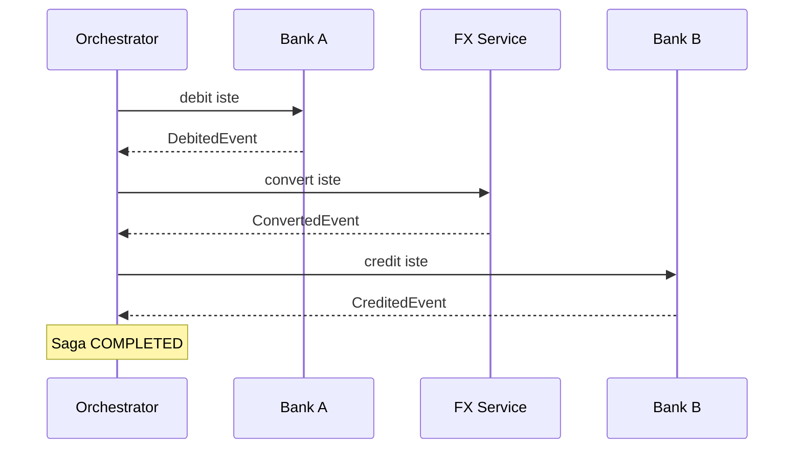
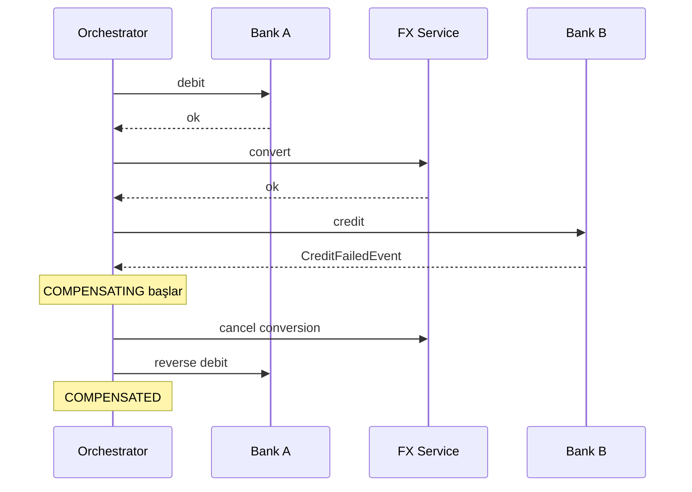
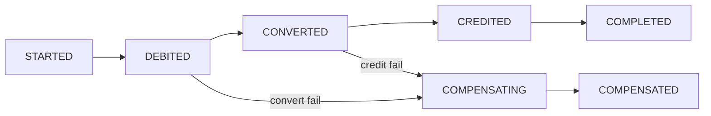
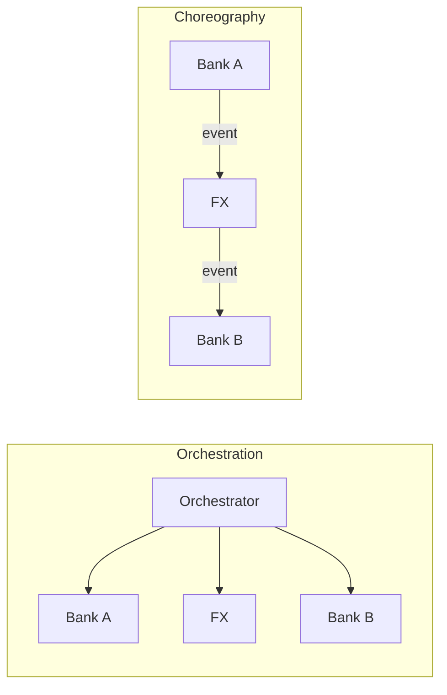

# Topic 6.7 — Saga Pattern

```admonish info title="Bu bölümde"
- 2PC (Two-Phase Commit) neden modern banking için yasak: blocking, coordinator SPOF, performans, vendor lock-in
- Saga pattern'in özü: distributed transaction'ı **local transaction** zincirine bölmek + fail'de **compensating action**
- Orchestration (central coordinator, state machine) vs choreography (event-driven) seçimi ve banking karar matrisi
- Compensating action tasarımı: idempotent, ters sıra, audit trail, semantic compensation
- Cross-bank transfer saga'nın ucdan uca implementasyonu: state persistence, Kafka orchestrator, stuck saga recovery, TCC alternatifi
```

## Hedef

Distributed transaction problemini Saga pattern ile çözmek. 2PC'nin neden production banking için yetersiz olduğunu, orchestration vs choreography seçimini, compensating action tasarımını kavramak. Banking cross-bank transfer örneğini (Bank A debit → FX → Bank B credit) hem Spring State Machine hem Kafka orchestrator ile çizebilmek; stuck saga recovery ve async API pattern'ini banking standardıyla oturtmak.

## Süre

Okuma: 2 saat • Kendini Sına: 45 dk • Pratik (opsiyonel): 4-5 saat • Toplam: ~3 saat (+ pratik)

## Önbilgi

- Topic 6.1-6.6 bitti — Kafka, producer, consumer, Streams, Outbox biliyorsun
- Phase 2 (transactions) + Phase 4 (locking) — ACID kavramları oturmuş
- Idempotent consumer pattern (Topic 6.3) — compensation idempotency için temel
- Phase 7'de microservice decomposition gelecek; burası o temelin distributed-transaction ayağı

---

## Kavramlar

### 1. Distributed transaction problemi — atomicity nereye kayboldu

Tek DB'de `BEGIN; ... COMMIT` atomiktir; sıkıntı işi birden fazla servise böldüğün an başlar. Somut senaryo: **cross-bank transfer** (TR Bank A → German Bank B).

Beş adım var, her biri farklı bir yerde yaşıyor:

1. Bank A'da debit (TRY hesap, kendi DB)
2. FX conversion (TCMB rate, kendi state)
3. Bank B'de credit (EUR hesap, uzak DB — başka kurum)
4. SWIFT confirmation (external network)
5. Audit log (kendi DB)

Tek DB'de bu beş adımı tek transaction'a sarabilirdin. Burada **beş farklı transactional boundary** var; ortak bir `COMMIT` yok. Adım 3 fail ederse adım 1 çoktan commit olmuş, para A'dan çıkmıştır. İşte çözmemiz gereken problem tam olarak bu: **atomicity'yi tek DB olmadan nasıl taklit ederiz?**

### 2. 2PC (Two-Phase Commit) — neden banking için yasak

İlk akla gelen çözüm 2PC'dir: bir **coordinator** tüm participant'lara önce "hazır mısın?" diye sorar, hepsi evet derse "commit et" der. İki fazlı olduğu için 2PC.

```
Phase 1 (Prepare):
  Coordinator → Participant 1, 2, 3: "hazır mısın?"
  Hepsi "evet" derse → Phase 2'ye geç

Phase 2 (Commit):
  Coordinator → Hepsi: "COMMIT"
  Veya birinden "hayır" → Hepsi: "ROLLBACK"
```

Pratikte **XA distributed transaction** ile implement edilir. Kağıt üzerinde atomicity sağlar ama banking için dört ölümcül sorunu vardır:

1. **Blocking:** Phase 1'de tüm participant'lar kaynakları kilitler (DB row lock) ve Phase 2 gelene kadar bekler. Yavaş bir participant tüm sistemi tutar.
2. **Coordinator SPOF:** Coordinator Phase 1 sonrası çökerse participant'lar *uncertain state*'te asılı kalır — manuel müdahale gerekir.
3. **Performance + scalability:** Her participant'a network roundtrip; coordinator throughput bottleneck olur. 5 saniyelik transfer 30 saniyeye çıkar.
4. **Vendor lock-in:** XA destekleyen DB + transaction manager şart; cloud-native değil.

Sonuç net: <mark>2PC modern banking'de yasaktır, yeni sistemler Saga kullanır</mark>. Sadece eski legacy sistemlerde kalıntı olarak görülür.

### 3. Saga pattern — local transaction'lar zinciri

2PC "hepsini birden kilitle" derken, Saga tersini yapar: hiç global lock tutma, işi **N ayrı local transaction**'a böl. **Saga**, bir distributed transaction'ı sırayla çalışan local transaction'lar dizisidir; bir adım fail ederse öncekiler **compensating action** ile geri alınır.

Üç kural:

- Distributed transaction'ı **N adıma böl**
- Her adım **local transaction** — atomik ve hızlı, global lock yok
- Bir adım fail → **compensating action** ile öncekileri ters sırada geri al

Cross-bank transfer'in happy path'i, her adım kendi local transaction'ı olarak:

```
Step 1: Bank A'da debit                  (local tx, ~50ms)
Step 2: FX conversion (TCMB rate)         (~10ms)
Step 3: Bank B'de credit (SWIFT)          (~50ms)
Step 4: Audit log                         (~10ms)
Step 5: Notification                      (~20ms)
= Total ~140ms, blocking lock yok
```

Adımlar birbirini tetikler; hiçbir aşamada beş kaynağı aynı anda kilitlemezsin.



**Failure senaryosu — Step 3 (Bank B credit) fail:** Step 1 ve 2 çoktan commit oldu, geri sarmak için compensation gerekir.

```
Step 1: Bank A debit       ✓
Step 2: FX conversion      ✓
Step 3: Bank B credit      ✗ FAIL
  ↓ compensate
Compensate Step 2: FX cancel (no-op or logged)
Compensate Step 1: Bank A'ya reverse credit
```

Net etki: sistem eski state'ine döndü. Ama dikkat — bu bir rollback *değil*: audit trail'de hem orijinal debit hem reversal görünür.



### 4. Orchestration — central coordinator

Saga'yı koordine etmenin iki yolu var; birincisi **orchestration**: merkezi bir orchestrator her adımı sırayla çağırır, cevabı bekler, sonraki adıma karar verir. Akış tek yerde toplanır.

```
[Orchestrator] → Bank A: debit
[Orchestrator] ← debit OK
[Orchestrator] → FX: convert
[Orchestrator] ← FX rate
[Orchestrator] → Bank B: credit
[Orchestrator] ← Bank B FAIL
[Orchestrator] → FX: cancel
[Orchestrator] → Bank A: reverse debit
```

Orchestrator aslında bir **state machine**'dir — her adım bir state, her transition bir action:

```
STARTED → DEBITED → CONVERTED → CREDITED → COMPLETED
                     ↓ fail
                  COMPENSATING → COMPENSATED
```

**Avantajlar:** flow tek yerde ve görünür (state machine'i UI'da izlersin, debug kolay); recovery basit (state DB'de, orchestrator crash → restart kaldığı yerden).

**Dezavantajlar:** orchestrator tüm servisleri bilmek zorunda (coupling); orchestrator down → saga durur (HA replica gerekir); state persistence şart (stateful).

### 5. Spring State Machine ile orchestration

Orchestration'ı elle if-else state kontrolüyle yazmak kırılgandır; Spring State Machine state'leri ve transition'ları deklaratif tanımlatır. Önce state ve event enum'ları:

```java
public enum TransferState {
    STARTED, DEBITED, CONVERTED, CREDITED, COMPLETED,
    COMPENSATING, COMPENSATED, FAILED
}

public enum TransferEvent {
    DEBIT_OK, DEBIT_FAILED, CONVERT_OK, CONVERT_FAILED,
    CREDIT_OK, CREDIT_FAILED, COMPLETE, FAIL, COMPENSATE_OK
}
```

State config'de her state'e bir action bağlanır; happy path state'leri normal, `COMPENSATING` ayrı bir action, üç sonuç ise `end` state:

```java
states.withStates()
    .initial(TransferState.STARTED)
    .state(TransferState.DEBITED, debitedAction())
    .state(TransferState.CONVERTED, convertedAction())
    .state(TransferState.CREDITED, creditedAction())
    .state(TransferState.COMPENSATING, compensateAction())
    .end(TransferState.COMPLETED)
    .end(TransferState.COMPENSATED)
    .end(TransferState.FAILED);
```

Transition'lar happy path'i (`DEBIT_OK`, `CONVERT_OK`, ...) ve compensation yollarını (`CONVERT_FAILED`, `CREDIT_FAILED` → `COMPENSATING`) ayrı ayrı çizer. Örneğin CREDITED'a giden happy path ve compensation tetikleyicileri:

```java
transitions
    .withExternal()
        .source(TransferState.CONVERTED).target(TransferState.CREDITED).event(TransferEvent.CREDIT_OK)
    .and().withExternal()
        .source(TransferState.CREDITED).target(TransferState.COMPLETED).event(TransferEvent.COMPLETE)
    // compensation
    .and().withExternal()
        .source(TransferState.CONVERTED).target(TransferState.COMPENSATING).event(TransferEvent.CREDIT_FAILED)
    .and().withExternal()
        .source(TransferState.COMPENSATING).target(TransferState.COMPENSATED).event(TransferEvent.COMPENSATE_OK);
```

İşin kalbi `compensateAction`: hangi state'te fail edildiyse ona göre geri alma adımlarını **ters sırada** tetikler. Bu switch, "son adımdan ilk adıma" mantığını kodlar:

```java
@Bean
public Action<TransferState, TransferEvent> compensateAction() {
    return context -> {
        TransferContext ctx = context.getExtendedState().get("ctx", TransferContext.class);
        switch (ctx.getCurrentState()) {
            case CREDITED:   // en ileri: üçünü de geri al
                bankBService.reverseCredit(ctx.getBankBTransactionId());
                fxService.cancelConversion(ctx.getFxConversionId());
                bankAService.reverseDebit(ctx.getBankATransactionId());
                break;
            case CONVERTED:  // FX + debit geri al
                fxService.cancelConversion(ctx.getFxConversionId());
                bankAService.reverseDebit(ctx.getBankATransactionId());
                break;
            case DEBITED:    // sadece debit geri al
                bankAService.reverseDebit(ctx.getBankATransactionId());
                break;
        }
        sagaStateRepo.markCompensated(ctx.getSagaId());
    };
}
```

<details>
<summary>Tam kod: TransferSagaConfig state machine (~90 satır)</summary>

```java
public enum TransferState {
    STARTED, DEBITED, CONVERTED, CREDITED, COMPLETED,
    COMPENSATING, COMPENSATED, FAILED
}

public enum TransferEvent {
    DEBIT_OK, DEBIT_FAILED,
    CONVERT_OK, CONVERT_FAILED,
    CREDIT_OK, CREDIT_FAILED,
    COMPLETE, FAIL,
    COMPENSATE_OK
}

@Configuration
@EnableStateMachineFactory
public class TransferSagaConfig extends StateMachineConfigurerAdapter<TransferState, TransferEvent> {

    @Override
    public void configure(StateMachineStateConfigurer<TransferState, TransferEvent> states) throws Exception {
        states.withStates()
            .initial(TransferState.STARTED)
            .state(TransferState.DEBITED, debitedAction())
            .state(TransferState.CONVERTED, convertedAction())
            .state(TransferState.CREDITED, creditedAction())
            .state(TransferState.COMPENSATING, compensateAction())
            .end(TransferState.COMPLETED)
            .end(TransferState.COMPENSATED)
            .end(TransferState.FAILED);
    }

    @Override
    public void configure(StateMachineTransitionConfigurer<TransferState, TransferEvent> transitions) throws Exception {
        transitions
            // Happy path
            .withExternal()
                .source(TransferState.STARTED).target(TransferState.DEBITED).event(TransferEvent.DEBIT_OK)
            .and().withExternal()
                .source(TransferState.DEBITED).target(TransferState.CONVERTED).event(TransferEvent.CONVERT_OK)
            .and().withExternal()
                .source(TransferState.CONVERTED).target(TransferState.CREDITED).event(TransferEvent.CREDIT_OK)
            .and().withExternal()
                .source(TransferState.CREDITED).target(TransferState.COMPLETED).event(TransferEvent.COMPLETE)

            // Compensation paths
            .and().withExternal()
                .source(TransferState.STARTED).target(TransferState.FAILED).event(TransferEvent.DEBIT_FAILED)
            .and().withExternal()
                .source(TransferState.DEBITED).target(TransferState.COMPENSATING).event(TransferEvent.CONVERT_FAILED)
            .and().withExternal()
                .source(TransferState.CONVERTED).target(TransferState.COMPENSATING).event(TransferEvent.CREDIT_FAILED)
            .and().withExternal()
                .source(TransferState.COMPENSATING).target(TransferState.COMPENSATED).event(TransferEvent.COMPENSATE_OK);
    }

    @Bean
    public Action<TransferState, TransferEvent> debitedAction() {
        return context -> {
            TransferContext ctx = context.getExtendedState().get("ctx", TransferContext.class);
            log.info("Saga DEBITED for transfer {}", ctx.getTransferId());
            // Next step: FX conversion request
            fxService.requestConversionAsync(ctx);
        };
    }

    @Bean
    public Action<TransferState, TransferEvent> compensateAction() {
        return context -> {
            TransferContext ctx = context.getExtendedState().get("ctx", TransferContext.class);

            // Determine compensation steps based on current state
            switch (ctx.getCurrentState()) {
                case CREDITED:
                    // Step 3 başarılı, subsequent fail. Geri al
                    bankBService.reverseCredit(ctx.getBankBTransactionId());
                    fxService.cancelConversion(ctx.getFxConversionId());
                    bankAService.reverseDebit(ctx.getBankATransactionId());
                    break;
                case CONVERTED:
                    fxService.cancelConversion(ctx.getFxConversionId());
                    bankAService.reverseDebit(ctx.getBankATransactionId());
                    break;
                case DEBITED:
                    bankAService.reverseDebit(ctx.getBankATransactionId());
                    break;
            }

            sagaStateRepo.markCompensated(ctx.getSagaId());
        };
    }
}
```

</details>

Bu state machine'i bir görsel olarak düşün — happy path yatay ilerler, herhangi bir fail dallanıp compensation koluna sapar:



### 6. Saga state persistence — neden DB zorunlu

Orchestrator'ın en kritik özelliği: state'i kaybetmemesi. <mark>Saga state her zaman DB'de saklanmalı, asla in-memory değil</mark> — orchestrator crash olursa restart sonrası kaldığı yerden devam etmeli.

```sql
CREATE TABLE saga_states (
    saga_id UUID PRIMARY KEY,
    saga_type VARCHAR(50) NOT NULL,
    current_state VARCHAR(50) NOT NULL,
    transfer_id UUID,
    context JSONB NOT NULL,
    created_at TIMESTAMPTZ NOT NULL,
    updated_at TIMESTAMPTZ NOT NULL,
    completed_at TIMESTAMPTZ,
    CONSTRAINT chk_saga_state CHECK (current_state IN (
        'STARTED', 'DEBITED', 'CONVERTED', 'CREDITED', 'COMPLETED',
        'COMPENSATING', 'COMPENSATED', 'FAILED'
    ))
);

CREATE INDEX idx_saga_pending ON saga_states(current_state, updated_at)
    WHERE current_state NOT IN ('COMPLETED', 'COMPENSATED', 'FAILED');

CREATE INDEX idx_saga_stuck ON saga_states(updated_at)
    WHERE current_state NOT IN ('COMPLETED', 'COMPENSATED', 'FAILED');
```

`context` JSONB'de transfer parametreleri ve ara ID'ler (bankATransactionId, fxConversionId, ...) durur. `idx_saga_stuck` partial index ise Section 11'deki recovery scheduler için — sadece bitmemiş saga'ları hızlı tarar.

### 7. Choreography — event-driven

Orchestration'ın alternatifi **choreography**: merkezi koordinatör yoktur; her servis bir event yayınlar, ilgili servis onu dinler, kendi adımını yapar, kendi event'ini yayınlar. Koordinasyon event akışının kendisinden doğar.

```
Bank A: TransferRequested al → debit → DebitedEvent yayınla (Kafka)
FX:     DebitedEvent al       → convert → ConvertedEvent yayınla
Bank B: ConvertedEvent al     → credit → CreditedEvent veya CreditFailedEvent
Bank A: CreditFailedEvent al  → reverseDebit → DebitReversedEvent
```

**Avantajlar:** orchestrator yok, servisler bağımsız (decoupling); linear scalability; coordinator olmadığı için SPOF yok.

**Dezavantajlar:** flow dağınık, event'leri trace etmek zor (visibility düşük); debugging için distributed tracing/observability şart; event bağımlılıkları büyüdükçe cyclic complexity artar.



### 8. Orchestration vs Choreography — karar matrisi

İkisi arasında seçim bir trade-off'tur; banking'de kriter genelde **visibility** ile **decoupling** arasındaki denge olur.

| Kriter | Orchestration | Choreography |
|---|---|---|
| Flow visibility | Yüksek (state machine) | Düşük (dağınık event) |
| Service coupling | Orchestrator central | Düşük |
| Recovery | State machine'den | Event sourcing / replay |
| Debugging | Kolay | Distributed tracing şart |
| SPOF | Orchestrator | Yok |
| Scalability | Coordinator bottleneck | Linear |
| Banking adoption | TR bankalarında yaygın | Modern startup'larda |

**Banking pratiği:** mission-critical cross-bank transfer → orchestration (visibility kritik). Internal event'ler (audit, notification) → choreography (decoupling). Gerçek sistemlerde ikisinin karışımı (mixed approach) yaygındır.

### 9. Compensating action — beş kural

Saga'nın kalbi compensation'dır ve doğru tasarlamak sanıldığından incedir. Temel prensip: <mark>compensation her zaman ters sırada çalışır — son başarılı adımdan ilk adıma doğru</mark>. Beş kural bunu tamamlar.

**Kural 1 — Idempotent.** Network retry veya partial failure yüzünden compensation iki kez çağrılabilir; iki çağrı tek çağrıyla aynı sonucu vermeli, yoksa double credit olur.

```java
public void reverseDebit(UUID transactionId) {
    if (reversedTxRepo.existsByOriginalTxId(transactionId)) {
        log.warn("Already reversed: {}", transactionId);
        return;   // idempotent guard
    }
    BankATransaction original = bankATxRepo.findById(transactionId).orElseThrow();
    bankAService.credit(original.getAccountId(), original.getAmount());
    reversedTxRepo.save(new ReversedTransaction(transactionId, Instant.now()));
}
```

**Kural 2 — Commutative (mümkünse).** Compensation sırası esnek olabilirse cleanup'ı paralelleştirebilirsin. Strict sıra şart değilse bunu kullan.

**Kural 3 — Local atomic.** Her compensation kendi transaction'ında çalışır. Compensation'ın kendisi de fail edebilir — bu durumda gerekirse outer compensation / retry devreye girer.

**Kural 4 — Audit trail.** Compensation'ı asla "sil" gibi düşünme; bir compensation da regülatör için loglanacak bir olaydır.

```java
public void reverseDebit(UUID transactionId) {
    // ... reversal logic
    auditService.log(AuditEvent.builder()
        .action("DEBIT_REVERSED")
        .resourceId(transactionId)
        .reason("Saga compensation")
        .build());
}
```

**Kural 5 — Semantic compensation.** Bazen "geri alma" fiziksel olarak mümkün değildir. Gönderilen bir SMS'i geri alamazsın — bunun yerine yeni bir adımla telafi edersin: ikinci bir SMS at ("Önceki bildirim geçersiz, transfer iptal edildi"). Buna semantic compensation denir; banking'de sıkça gerekir.

### 10. Banking örnek — Cross-bank Transfer Saga (Kafka orchestrator)

Şimdi Section 4-9'daki her şeyi Kafka tabanlı bir orchestrator'da birleştirelim. Orchestrator entry point (`initiate`) saga state'i STARTED olarak yazar ve ilk adımı (Bank A debit) tetikler:

```java
public UUID initiate(CrossBankTransferRequest req) {
    UUID sagaId = UUID.randomUUID();
    TransferContext context = TransferContext.builder()
        .sagaId(sagaId).transferRequest(req).build();

    SagaState state = SagaState.builder()
        .sagaId(sagaId).sagaType("CROSS_BANK_TRANSFER")
        .currentState("STARTED").context(serializer.toJson(context))
        .createdAt(Instant.now()).updatedAt(Instant.now()).build();
    sagaRepo.save(state);

    kafka.send("bank-a.debit-requested", sagaId.toString(),
        new DebitRequest(sagaId, req.getFromAccount(), req.getAmount()));
    return sagaId;
}
```

Her adım bir `@KafkaListener`. Happy path listener'ları aynı kalıbı izler: state'i DB'de ilerlet, sonraki adımı yayınla. Örnek — debit tamamlandı, FX conversion tetikle:

```java
@KafkaListener(topics = "bank-a.debit-completed", groupId = "saga-orchestrator")
@Transactional
public void onDebitCompleted(DebitCompletedEvent event, Acknowledgment ack) {
    SagaState state = sagaRepo.findById(event.getSagaId()).orElseThrow();
    TransferContext ctx = serializer.fromJson(state.getContext());
    ctx.setBankATransactionId(event.getTransactionId());
    state.setContext(serializer.toJson(ctx));
    state.setCurrentState("DEBITED");
    sagaRepo.save(state);

    kafka.send("fx.convert-requested", event.getSagaId().toString(),
        new ConvertRequest(event.getSagaId(), ctx.getTransferRequest().getCurrency(),
                          "EUR", ctx.getTransferRequest().getAmount()));
    ack.acknowledge();
}
```

Compensation'ın kilit noktası credit fail listener'ıdır: state COMPENSATING'e geçer, sonra Step 2 (FX cancel) ve Step 1 (reverse debit) **ters sırada** yayınlanır:

```java
@KafkaListener(topics = "bank-b.credit-failed", groupId = "saga-orchestrator")
@Transactional
public void onCreditFailed(CreditFailedEvent event, Acknowledgment ack) {
    SagaState state = sagaRepo.findById(event.getSagaId()).orElseThrow();
    TransferContext ctx = serializer.fromJson(state.getContext());
    state.setCurrentState("COMPENSATING");
    sagaRepo.save(state);
    log.warn("Credit failed, compensating: saga={}, reason={}", event.getSagaId(), event.getReason());

    kafka.send("fx.cancel-requested", event.getSagaId().toString(),
        new CancelConversionRequest(event.getSagaId(), ctx.getFxConversionId()));
    kafka.send("bank-a.reverse-debit-requested", event.getSagaId().toString(),
        new ReverseDebitRequest(event.getSagaId(), ctx.getBankATransactionId()));
    ack.acknowledge();
}
```

Compensation tamamlanınca saga COMPENSATED olur ve müşteri bilgilendirilir. Debit'in en baştan fail ettiği durumda ise compensation yok — geri alacak bir şey yoktur, saga doğrudan FAILED'e geçer.

<details>
<summary>Tam kod: CrossBankTransferSaga (~175 satır)</summary>

```java
@Service
@Slf4j
public class CrossBankTransferSaga {

    private final KafkaTemplate<String, Object> kafka;
    private final SagaStateRepository sagaRepo;
    private final TransferContextSerializer serializer;

    // Entry point — orchestrator init
    public UUID initiate(CrossBankTransferRequest req) {
        UUID sagaId = UUID.randomUUID();

        TransferContext context = TransferContext.builder()
            .sagaId(sagaId)
            .transferRequest(req)
            .build();

        SagaState state = SagaState.builder()
            .sagaId(sagaId)
            .sagaType("CROSS_BANK_TRANSFER")
            .currentState("STARTED")
            .context(serializer.toJson(context))
            .createdAt(Instant.now())
            .updatedAt(Instant.now())
            .build();
        sagaRepo.save(state);

        // Step 1: Bank A debit
        kafka.send("bank-a.debit-requested", sagaId.toString(),
            new DebitRequest(sagaId, req.getFromAccount(), req.getAmount()));

        log.info("Saga initiated: id={}, from={}, to={}, amount={}",
            sagaId, req.getFromAccount(), req.getToAccount(), req.getAmount());

        return sagaId;
    }

    @KafkaListener(topics = "bank-a.debit-completed", groupId = "saga-orchestrator")
    @Transactional
    public void onDebitCompleted(DebitCompletedEvent event, Acknowledgment ack) {
        SagaState state = sagaRepo.findById(event.getSagaId()).orElseThrow();
        TransferContext ctx = serializer.fromJson(state.getContext());

        ctx.setBankATransactionId(event.getTransactionId());
        state.setContext(serializer.toJson(ctx));
        state.setCurrentState("DEBITED");
        state.setUpdatedAt(Instant.now());
        sagaRepo.save(state);

        // Step 2: FX conversion
        kafka.send("fx.convert-requested", event.getSagaId().toString(),
            new ConvertRequest(event.getSagaId(), ctx.getTransferRequest().getCurrency(),
                              "EUR", ctx.getTransferRequest().getAmount()));

        ack.acknowledge();
    }

    @KafkaListener(topics = "bank-a.debit-failed", groupId = "saga-orchestrator")
    @Transactional
    public void onDebitFailed(DebitFailedEvent event, Acknowledgment ack) {
        SagaState state = sagaRepo.findById(event.getSagaId()).orElseThrow();
        state.setCurrentState("FAILED");
        state.setUpdatedAt(Instant.now());
        state.setCompletedAt(Instant.now());
        sagaRepo.save(state);

        // No compensation — Step 1 zaten failed, geri alacak bir şey yok

        // Müşteri bilgilendir
        notifyCustomer(event.getSagaId(), "DEBIT_FAILED", event.getReason());

        ack.acknowledge();
    }

    @KafkaListener(topics = "fx.convert-completed", groupId = "saga-orchestrator")
    @Transactional
    public void onConvertCompleted(ConvertCompletedEvent event, Acknowledgment ack) {
        SagaState state = sagaRepo.findById(event.getSagaId()).orElseThrow();
        TransferContext ctx = serializer.fromJson(state.getContext());

        ctx.setFxConversionId(event.getConversionId());
        ctx.setConvertedAmount(event.getConvertedAmount());
        state.setContext(serializer.toJson(ctx));
        state.setCurrentState("CONVERTED");
        state.setUpdatedAt(Instant.now());
        sagaRepo.save(state);

        // Step 3: Bank B credit
        kafka.send("bank-b.credit-requested", event.getSagaId().toString(),
            new CreditRequest(event.getSagaId(), ctx.getTransferRequest().getToAccount(),
                            event.getConvertedAmount(), "EUR"));

        ack.acknowledge();
    }

    @KafkaListener(topics = "fx.convert-failed", groupId = "saga-orchestrator")
    @Transactional
    public void onConvertFailed(ConvertFailedEvent event, Acknowledgment ack) {
        SagaState state = sagaRepo.findById(event.getSagaId()).orElseThrow();
        TransferContext ctx = serializer.fromJson(state.getContext());

        state.setCurrentState("COMPENSATING");
        state.setUpdatedAt(Instant.now());
        sagaRepo.save(state);

        // Compensate Step 1
        kafka.send("bank-a.reverse-debit-requested", event.getSagaId().toString(),
            new ReverseDebitRequest(event.getSagaId(), ctx.getBankATransactionId()));

        ack.acknowledge();
    }

    @KafkaListener(topics = "bank-b.credit-completed", groupId = "saga-orchestrator")
    @Transactional
    public void onCreditCompleted(CreditCompletedEvent event, Acknowledgment ack) {
        SagaState state = sagaRepo.findById(event.getSagaId()).orElseThrow();
        TransferContext ctx = serializer.fromJson(state.getContext());

        ctx.setBankBTransactionId(event.getTransactionId());
        state.setContext(serializer.toJson(ctx));
        state.setCurrentState("COMPLETED");
        state.setUpdatedAt(Instant.now());
        state.setCompletedAt(Instant.now());
        sagaRepo.save(state);

        // Async: audit + notification (no need to wait)
        kafka.send("audit.log-requested", event.getSagaId().toString(),
            new AuditLogRequest("CROSS_BANK_TRANSFER_COMPLETED", ctx));

        kafka.send("notification.send-requested", event.getSagaId().toString(),
            new NotificationRequest(ctx.getTransferRequest().getCustomerId(),
                                   "Transfer completed", ctx));

        log.info("Saga completed: id={}", event.getSagaId());
        ack.acknowledge();
    }

    @KafkaListener(topics = "bank-b.credit-failed", groupId = "saga-orchestrator")
    @Transactional
    public void onCreditFailed(CreditFailedEvent event, Acknowledgment ack) {
        SagaState state = sagaRepo.findById(event.getSagaId()).orElseThrow();
        TransferContext ctx = serializer.fromJson(state.getContext());

        state.setCurrentState("COMPENSATING");
        state.setUpdatedAt(Instant.now());
        sagaRepo.save(state);

        log.warn("Credit failed, starting compensation: saga={}, reason={}",
            event.getSagaId(), event.getReason());

        // Compensate: Step 2 + Step 1 (reverse order)
        kafka.send("fx.cancel-requested", event.getSagaId().toString(),
            new CancelConversionRequest(event.getSagaId(), ctx.getFxConversionId()));

        kafka.send("bank-a.reverse-debit-requested", event.getSagaId().toString(),
            new ReverseDebitRequest(event.getSagaId(), ctx.getBankATransactionId()));

        ack.acknowledge();
    }

    @KafkaListener(topics = "bank-a.reverse-debit-completed", groupId = "saga-orchestrator")
    @Transactional
    public void onReverseDebitCompleted(ReverseDebitCompletedEvent event, Acknowledgment ack) {
        SagaState state = sagaRepo.findById(event.getSagaId()).orElseThrow();
        state.setCurrentState("COMPENSATED");
        state.setUpdatedAt(Instant.now());
        state.setCompletedAt(Instant.now());
        sagaRepo.save(state);

        notifyCustomer(event.getSagaId(), "COMPENSATED", "Transfer iptal edildi, paranız iade edildi.");

        log.info("Saga compensated: id={}", event.getSagaId());
        ack.acknowledge();
    }
}
```

</details>

### 11. Timeout handling — stuck saga recovery

Bir adım bekleniyor ama event hiç gelmiyorsa (servis çöktü, mesaj kayboldu) saga sonsuza kadar asılı kalır. Bu yüzden bitmemiş saga'ları periyodik tarayan bir scheduler şarttır. Detection basit: belli süredir güncellenmemiş, terminal olmayan state'teki saga'ları bul.

```java
@Scheduled(fixedDelay = 60000)   // her dakika
@SchedulerLock(name = "stuckSagaCheck")
public void checkStuckSagas() {
    Instant cutoff = Instant.now().minus(Duration.ofMinutes(5));
    List<SagaState> stuck = sagaRepo.findStuck(cutoff);

    for (SagaState saga : stuck) {
        log.warn("Stuck saga: id={}, state={}", saga.getSagaId(), saga.getCurrentState());
        triggerCompensation(saga);
    }
}
```

Trigger tarafı state machine'in `compensateAction`'ıyla aynı mantığı taşır — hangi state'te takıldıysa ona göre ters sıralı compensation event'leri yayınlar ve ops'a alarm verir:

```java
private void triggerCompensation(SagaState saga) {
    TransferContext ctx = serializer.fromJson(saga.getContext());
    switch (saga.getCurrentState()) {
        case "DEBITED":
            kafka.send("bank-a.reverse-debit-requested", saga.getSagaId().toString(),
                new ReverseDebitRequest(saga.getSagaId(), ctx.getBankATransactionId()));
            break;
        case "CONVERTED":
            kafka.send("fx.cancel-requested", ...);
            kafka.send("bank-a.reverse-debit-requested", ...);
            break;
        case "CREDITED":
            kafka.send("bank-b.reverse-credit-requested", ...);
            kafka.send("fx.cancel-requested", ...);
            kafka.send("bank-a.reverse-debit-requested", ...);
            break;
    }
    saga.setCurrentState("COMPENSATING");
    saga.setUpdatedAt(Instant.now());
    sagaRepo.save(saga);
    alerts.notifyOps("Stuck saga compensation triggered: " + saga.getSagaId());
}
```

Banking pratiği: stuck timeout 5-15 dakika arası, SLA'na göre ayarla.

### 12. TCC (Try-Confirm-Cancel) — alternatif pattern

Saga "önce yap, gerekirse geri al" der; TCC ise "önce rezerve et, sonra kesinleştir ya da bırak" der. Üç faz vardır:

1. **Try:** kaynağı reserve et (hold)
2. **Confirm:** reserved'ı finalize et
3. **Cancel:** reserved'ı release et

```java
String holdId = accountService.holdBalance(fromId, amount);   // Try

accountService.confirmHold(holdId);   // Confirm (step OK)
accountService.releaseHold(holdId);   // Cancel (step FAIL)
```

Banking'in klasik TCC örneği kart authorization'dır: authorization = kartta amount hold (Try), capture = held → actual debit (Confirm), void = held → release (Cancel).

TCC daha sıkı consistency verir çünkü kaynak baştan rezerve edilir; ama Saga'dan daha rigid ve daha karmaşıktır. Adoption pratiği: booking/reservation (otel, uçak) → TCC; banking transfer → Saga.

### 13. Saga monitoring + observability

Banking için saga'nın görünür olması bir lüks değil, zorunluluktur — para hareketini izleyemezsen debug edemezsin. Transition ve duration metric'leri Micrometer ile toplanır:

```java
public void recordTransition(String sagaType, String fromState, String toState) {
    registry.counter("saga.transition", "type", sagaType,
        "from", fromState, "to", toState).increment();
}

public void recordDuration(String sagaType, String finalState, Duration duration) {
    registry.timer("saga.duration", "type", sagaType,
        "outcome", finalState).record(duration);
}
```

Grafana dashboard'da izlenecekler: saga success rate, saga p99 duration, state distribution (her state'te kaç saga), stuck saga count. Ucdan uca izlenebilirlik için OpenTelemetry trace eklenir (Phase 7 + 9).

### 14. Banking anti-pattern'leri

Mülakatta "bu tasarımda ne yanlış?" sorusunun cephaneliği burası. Yedi klasik:

**Anti-pattern 1: 2PC kullanmak.** `@Transactional("xaTransactionManager")` ile Bank A debit + Bank B credit'i tek XA transaction'a sarmak. Blocking, SPOF, performans katili — banking için yasak, Saga kullan.

**Anti-pattern 2: Saga state in-memory.** `Map<UUID, SagaState>` gibi bir ConcurrentHashMap'te tutmak. App restart → saga kayıp. DB-persistent şart.

**Anti-pattern 3: Compensation idempotent değil.** Guard'sız `reverseDebit` → duplicate compensation → double credit → state bozulur.

**Anti-pattern 4: Saga timeout yok.** Bir adım takılınca saga sonsuza kadar PENDING kalır. Stuck monitoring + auto-compensation şart.

**Anti-pattern 5: Saga'yı sync HTTP yapmak.** Debit + FX + credit + audit + notification'ı ardışık blocking call olarak çalıştırmak = kullanıcı ekranda 5+ saniye bekler, timeout riski. Saga async olmalı:

```java
@PostMapping("/cross-bank-transfers")
public ResponseEntity<SagaCreatedResponse> initiate(@RequestBody CrossBankTransferRequest req) {
    UUID sagaId = crossBankSaga.initiate(req);
    return ResponseEntity.accepted()   // 202 Accepted
        .body(new SagaCreatedResponse(sagaId, "/sagas/" + sagaId));
}

@GetMapping("/sagas/{id}")
public SagaStatusResponse getStatus(@PathVariable UUID id) {
    SagaState state = sagaRepo.findById(id).orElseThrow();
    return new SagaStatusResponse(state.getCurrentState(), ...);
}
```

202 Accepted + status polling — banking standardı.

**Anti-pattern 6: Compensation order yanlış.** Step 3 fail'de önce Step 1 sonra Step 2'yi geri almak. Doğrusu ters sıra: son başarılı adımdan ilk adıma (önce FX cancel, sonra reverse debit).

**Anti-pattern 7: Saga event'lerini non-idempotent handle etmek.** Event 2 kez gelirse handler duplicate işlem yapar. Idempotent consumer pattern (Topic 6.3) uygula.

```admonish warning title="2PC'yi Saga sanma"
Cross-bank transfer'da Bank A ve Bank B genelde *farklı kurumlar*dır — ortak bir XA coordinator zaten kuramazsın. 2PC teknik olarak imkansız değilse bile blocking lock + coordinator SPOF banking SLA'sını öldürür. "Distributed transaction" kelimesini duyduğun an refleksin 2PC değil Saga olmalı.
```

```admonish tip title="Compensation her zaman ters sırada"
Reverse debit'i FX cancel'dan önce yaparsan, FX kaydı hâlâ "aktif" görünürken parayı iade etmiş olursun — audit trail'de tutarsızlık. Kural sabit: en son başarılı adımdan başla, ilk adıma doğru geri sar. State machine'de bunu `switch(currentState)` ile kodlarsın.
```

```admonish warning title="In-memory saga = production'da kayıp para"
Saga state'ini bellekte tutan bir orchestrator, deploy veya crash anında yarım kalmış tüm transfer'leri unutur — ne complete eder ne compensate eder. Para "arada" asılı kalır. `saga_states` tablosu + stuck saga scheduler bu senaryonun tek gerçek çözümüdür.
```

---

## Önemli olabilecek araştırma kaynakları

- "Microservices Patterns" (Chris Richardson) — Saga chapter
- "Designing Data-Intensive Applications" (Kleppmann) — distributed transaction
- Vaughn Vernon — implementing DDD with saga
- Eventuate Tram framework documentation
- Spring State Machine reference

---

## Kendini Sına

Aşağıdaki soruları önce **cevaba bakmadan** kendi cümlelerinle yanıtlamayı dene — hepsi TR bank mülakatlarında karşına çıkabilecek tarzda. Takıldığında ilgili Kavramlar başlığına dön, sonra tekrar dene.

**S1. 2PC (Two-Phase Commit) neden modern banking'de tercih edilmez? En az üç sebep say.**

<details>
<summary>Cevabı göster</summary>

2PC atomicity'yi sağlar ama bedeli banking için ölümcüldür. Bir: blocking — Phase 1'de tüm participant'lar kaynakları (DB row lock) kilitler ve Phase 2 gelene kadar bekler, en yavaş participant tüm sistemi tutar. İki: coordinator SPOF — coordinator Phase 1 sonrası çökerse participant'lar uncertain state'te asılı kalır ve manuel müdahale gerekir. Üç: performans ve scalability — her participant'a network roundtrip, coordinator throughput bottleneck olur. Dört: vendor lock-in — XA destekleyen DB + transaction manager şart, cloud-native değil.

Ek olarak cross-bank transfer'da Bank A ve Bank B farklı kurumlardır; ortak bir XA coordinator kurmak zaten pratik değildir. Bu yüzden modern banking 2PC yerine Saga kullanır.

</details>

**S2. Saga pattern nedir? 2PC'den temel farkı ne?**

<details>
<summary>Cevabı göster</summary>

Saga, bir distributed transaction'ı sırayla çalışan **local transaction'lar** dizisine böler. Her adım atomik ve hızlıdır, kendi DB'sinde commit olur; global bir lock veya coordinator yoktur. Bir adım fail ederse önceki adımlar **compensating action** ile ters sırada geri alınır.

2PC'den farkı temeldir: 2PC "hepsini birden kilitle, sonra hepsini birden commit et" der (pessimistic, blocking). Saga ise "her adımı ayrı ayrı commit et, sorun çıkarsa geri al" der (optimistic, non-blocking). Saga tam atomicity garanti etmez — arada başkaları ara state'i görebilir — ama banking için gereken eventual consistency + audit trail'i çok daha ölçeklenebilir şekilde sağlar.

</details>

**S3. Orchestration ile choreography arasındaki fark nedir? Hangi banking senaryosunda hangisini seçersin?**

<details>
<summary>Cevabı göster</summary>

Orchestration'da merkezi bir orchestrator (genelde bir state machine) her adımı sırayla çağırır ve akışı tek yerden yönetir. Choreography'de merkez yoktur; her servis event yayınlar, ilgili servis dinler ve kendi adımını yapıp yeni event yayınlar — koordinasyon event akışından doğar.

Trade-off: orchestration yüksek visibility ve kolay recovery verir ama orchestrator coupling + SPOF getirir. Choreography düşük coupling ve linear scalability verir ama flow dağınık olduğu için debugging distributed tracing ister. Banking pratiği: mission-critical cross-bank transfer → orchestration (visibility kritik); internal event'ler (audit, notification) → choreography (decoupling). Genelde ikisinin karışımı kullanılır.

</details>

**S4. Compensating action nedir? Beş kuralını say, özellikle idempotency neden şart?**

<details>
<summary>Cevabı göster</summary>

Compensating action, başarılı bir saga adımının etkisini geri alan işlemdir — reverse debit, cancel conversion gibi. Bir rollback değildir: orijinal işlem ve reversal ikisi de audit trail'de kalır.

Beş kural: (1) idempotent — network retry veya partial failure yüzünden iki kez çağrılabilir, guard yoksa double credit olur; (2) commutative — mümkünse sıra esnek olsun, cleanup paralelleşebilsin; (3) local atomic — her compensation kendi transaction'ında; (4) audit trail — compensation da loglanır, silinmez; (5) semantic compensation — geri alınamayan işlemler (gönderilen SMS) için yeni bir telafi adımı at. Idempotency şart çünkü Kafka retry / at-least-once delivery yüzünden aynı compensation event'i tekrar gelebilir; guard'sız her tekrar hesaba fazladan credit yazar.

</details>

**S5. Compensation neden ters sırada (son adımdan ilk adıma) yapılmalı?**

<details>
<summary>Cevabı göster</summary>

Çünkü adımlar birbirine bağımlıdır ve geri alma bu bağımlılığı ters yönde takip etmeli. Cross-bank transfer'da sıra debit → convert → credit. Step 3 (credit) fail ederse, önce Step 2'yi (FX conversion cancel), sonra Step 1'i (reverse debit) geri alırsın.

Ters yapıp önce reverse debit çekersen, FX kaydı hâlâ "aktif" görünürken parayı iade etmiş olursun — audit trail'de tutarsızlık ve reconciliation ekibine kabus. State machine'de bu mantık `switch(currentState)` ile kodlanır: CREDITED'te üçünü, CONVERTED'te ikisini, DEBITED'te sadece debit'i geri al. Aynı ters-sıra mantığı stuck saga recovery'de de kullanılır.

</details>

**S6. Saga state neden in-memory değil DB-persistent olmalı? Stuck saga nasıl handle edilir?**

<details>
<summary>Cevabı göster</summary>

Orchestrator bir deploy, restart veya crash yaşadığında yarım kalmış tüm saga'ları hatırlamalı — aksi halde transfer "arada" asılı kalır, ne complete olur ne compensate. In-memory `Map` bunu kaybeder; state her transition'da `saga_states` tablosuna yazılırsa restart sonrası kaldığı yerden devam edilir.

Stuck saga (adım bekleniyor ama event gelmiyor) için periyodik bir scheduler kullanılır: belli süredir (banking'de tipik 5-15 dk) güncellenmemiş, terminal olmayan state'teki saga'ları partial index ile bulur, mevcut state'e göre ters sıralı compensation event'lerini tetikler ve ops'a alarm verir. Böylece hiçbir transfer sonsuza kadar PENDING kalmaz.

</details>

**S7. TCC (Try-Confirm-Cancel) ile Saga arasındaki fark nedir? Banking'de hangisi nerede kullanılır?**

<details>
<summary>Cevabı göster</summary>

Saga "önce işlemi yap, gerekirse compensating action ile geri al" der. TCC ise üç fazlıdır: önce kaynağı **reserve** et (Try / hold), sonra ya **finalize** et (Confirm) ya da **release** et (Cancel). Fark: TCC kaynağı baştan rezerve ettiği için daha sıkı consistency verir ama daha rigid ve karmaşıktır; Saga daha esnek ama ara state'te tutarsızlık pencereleri olabilir.

Banking adoption: kart authorization klasik bir TCC'dir — authorization = amount hold (Try), capture = actual debit (Confirm), void = release (Cancel). Genel olarak booking/reservation senaryoları (otel, uçak koltuğu) TCC'ye yatkındır. Cross-bank transfer gibi "yap ve gerekirse geri al" akışları ise Saga ile modellenir.

</details>

**S8. Cross-bank transfer'ı sync HTTP ile yapmak neden anti-pattern? Doğru API tasarımı nedir?**

<details>
<summary>Cevabı göster</summary>

Sync HTTP'de debit + FX + credit + audit + notification ardışık blocking call olur; her biri saniyeler sürebildiğinden kullanıcı ekranda 5+ saniye bekler, HTTP timeout ve kötü deneyim riski doğar. Ayrıca uzun süre açık kalan bağlantı ve state, hata anında belirsizlik yaratır.

Doğru tasarım async'tir: `POST /cross-bank-transfers` saga'yı `initiate()` eder ve hemen **202 Accepted** + saga ID + status URL döner. Müşteri veya UI `GET /sagas/{id}` ile durumu poll eder (STARTED, DEBITED, ..., COMPLETED / COMPENSATED). Saga arka planda Kafka event'leriyle ilerler. Bu 202 + status polling kalıbı banking'de standarttır; ek olarak saga event'leri idempotent consumer ile handle edilmeli ki duplicate delivery çift işlem yapmasın.

</details>

---

## Tamamlama kriterleri

- [ ] 2PC'nin banking için neden yasak olduğunu (blocking, SPOF, performans, vendor lock-in) 2 dakikada anlatabiliyorum
- [ ] Saga'nın "local transaction zinciri + compensation" özünü ve 2PC'den farkını açıklayabiliyorum
- [ ] Orchestration vs choreography karar matrisini ve banking'de hangisinin nerede kullanıldığını biliyorum
- [ ] Compensating action'ın beş kuralını sayabiliyorum, idempotency ve ters sıranın neden şart olduğunu açıklayabiliyorum
- [ ] Cross-bank transfer saga'yı state machine (STARTED → ... → COMPLETED / COMPENSATED) olarak tahtada çizebiliyorum
- [ ] Saga state persistence'in neden DB-backed zorunlu olduğunu ve stuck saga recovery'nin nasıl çalıştığını anlatabiliyorum
- [ ] TCC vs Saga farkını ve banking adoption'ını (kart authorization vs transfer) biliyorum
- [ ] Async 202 Accepted + status polling pattern'ini ve sync HTTP saga anti-pattern'ini açıklayabiliyorum
- [ ] (Opsiyonel) "Pratik yapmak istersen" bölümündeki testleri yazdım ve Claude-verify prompt'uyla doğrulattım

---

## Defter notları

1. "2PC banking için yetersiz olmasının 4 sebebi: ____."
2. "Saga vs 2PC temel farkı (blocking vs non-blocking, local tx): ____."
3. "Orchestration vs choreography karar kriterleri: ____."
4. "Compensating action 5 kuralı (idempotent, commutative, local atomic, audit, semantic): ____."
5. "Compensation neden ters sırada — son adımdan ilk adıma: ____."
6. "Semantic compensation banking örneği (SMS geri alınamaz): ____."
7. "Saga state persistence neden DB-backed zorunlu: ____."
8. "Stuck saga timeout banking SLA için (5-15 dk) + recovery scheduler: ____."
9. "TCC vs Saga banking adoption (kart authorization vs transfer): ____."
10. "Async HTTP 202 + status polling pattern banking için: ____."

```admonish success title="Bölüm Özeti"
- 2PC modern banking'de yasak: blocking lock, coordinator SPOF, performans/scalability, vendor lock-in — "distributed transaction" deyince refleks Saga olmalı
- Saga = distributed transaction'ı local transaction zincirine bölmek; her adım kendi DB'sinde commit, fail'de compensating action ile ters sıra geri alma
- Orchestration (central state machine, yüksek visibility) vs choreography (event-driven, düşük coupling); banking'de mission-critical → orchestration, internal event → choreography
- Compensating action beş kural: idempotent, commutative, local atomic, audit trail, semantic compensation — ve her zaman ters sırada
- Saga state DB-persistent olmalı (crash-safe), stuck saga scheduler bitmemiş saga'ları 5-15 dk sonra otomatik compensate eder
- Saga async çalışır: HTTP 202 Accepted + status polling, idempotent consumer; sync HTTP saga ve in-memory state production'da para kaybettirir
```

---

## Pratik yapmak istersen

Kavramları koda dökmek istersen aşağıdaki iki ek hazır: test yazma rehberi happy path, compensation, stuck saga recovery ve idempotent compensation için örnek testler içerir; Claude-verify prompt'u ile yazdığın saga kodunu banking-grade perspektiften denetletebilirsin.

<details>
<summary>Test yazma rehberi</summary>

### Test 6.7.1 — Happy path

`initiate()` çağır, sonra Bank A / FX / Bank B success event'lerini sırayla simulate et, her adımda state'in ilerlediğini ve sonunda COMPLETED olduğunu doğrula.

```java
@SpringBootTest
@Testcontainers
class CrossBankTransferSagaIT {

    @Container @ServiceConnection static PostgreSQLContainer<?> postgres = ...;
    @Container static KafkaContainer kafka = ...;

    @Autowired CrossBankTransferSaga saga;
    @Autowired SagaStateRepository sagaRepo;
    @Autowired KafkaTemplate<String, Object> template;

    @Test
    void shouldCompleteSuccessfulSaga() {
        UUID sagaId = saga.initiate(createValidRequest());

        template.send("bank-a.debit-completed", sagaId.toString(),
            new DebitCompletedEvent(sagaId, UUID.randomUUID()));
        await().atMost(5, SECONDS).untilAsserted(() ->
            assertThat(sagaRepo.findById(sagaId).orElseThrow().getCurrentState()).isEqualTo("DEBITED"));

        template.send("fx.convert-completed", sagaId.toString(),
            new ConvertCompletedEvent(sagaId, UUID.randomUUID(), new BigDecimal("250.00")));
        await().atMost(5, SECONDS).untilAsserted(() ->
            assertThat(sagaRepo.findById(sagaId).orElseThrow().getCurrentState()).isEqualTo("CONVERTED"));

        template.send("bank-b.credit-completed", sagaId.toString(),
            new CreditCompletedEvent(sagaId, UUID.randomUUID()));
        await().atMost(5, SECONDS).untilAsserted(() ->
            assertThat(sagaRepo.findById(sagaId).orElseThrow().getCurrentState()).isEqualTo("COMPLETED"));
    }
}
```

### Test 6.7.2 — Compensation

Debit + Convert success, sonra credit fail → COMPENSATING; reverse-debit completed → COMPENSATED.

```java
@Test
void shouldCompensateOnCreditFailure() {
    UUID sagaId = saga.initiate(createValidRequest());
    template.send("bank-a.debit-completed", sagaId.toString(), new DebitCompletedEvent(...));
    template.send("fx.convert-completed", sagaId.toString(), new ConvertCompletedEvent(...));
    await().atMost(5, SECONDS).untilAsserted(() ->
        assertThat(sagaRepo.findById(sagaId).orElseThrow().getCurrentState()).isEqualTo("CONVERTED"));

    template.send("bank-b.credit-failed", sagaId.toString(),
        new CreditFailedEvent(sagaId, "Insufficient funds at Bank B"));
    await().atMost(5, SECONDS).untilAsserted(() ->
        assertThat(sagaRepo.findById(sagaId).orElseThrow().getCurrentState()).isEqualTo("COMPENSATING"));

    template.send("bank-a.reverse-debit-completed", sagaId.toString(),
        new ReverseDebitCompletedEvent(sagaId));
    await().atMost(5, SECONDS).untilAsserted(() -> {
        SagaState state = sagaRepo.findById(sagaId).orElseThrow();
        assertThat(state.getCurrentState()).isEqualTo("COMPENSATED");
        assertThat(state.getCompletedAt()).isNotNull();
    });
}
```

### Test 6.7.3 — Stuck saga recovery

Eski timestamp'li DEBITED bir saga'yı DB'ye koy, scheduler'ı çalıştır, COMPENSATING'e geçtiğini doğrula.

```java
@Test
void stuckSagaShouldTriggerCompensation() {
    SagaState stuck = SagaState.builder()
        .sagaId(UUID.randomUUID())
        .sagaType("CROSS_BANK_TRANSFER")
        .currentState("DEBITED")
        .updatedAt(Instant.now().minus(10, ChronoUnit.MINUTES))   // 10 dk eski
        .build();
    sagaRepo.save(stuck);

    stuckSagaScheduler.checkStuckSagas();

    await().atMost(5, SECONDS).untilAsserted(() ->
        assertThat(sagaRepo.findById(stuck.getSagaId()).orElseThrow().getCurrentState())
            .isEqualTo("COMPENSATING"));
}
```

### Test 6.7.4 — Idempotent compensation

Aynı `reverseDebit`'i iki kez çağır, bakiyenin sadece bir kez tersine döndüğünü doğrula (double credit olmamalı).

```java
@Test
void duplicateCompensationShouldNotDoubleReverse() {
    UUID txId = setupDebitedTransaction();

    bankAService.reverseDebit(txId);
    bankAService.reverseDebit(txId);   // duplicate call

    BigDecimal finalBalance = accountRepo.getBalance(testAccountId);
    assertThat(finalBalance).isEqualByComparingTo(initialBalance);   // not 2x
}
```

</details>

<details>
<summary>Claude-verify prompt</summary>

```
Saga pattern kodumu banking-grade kriterlere göre değerlendir. Eksikleri işaretle, kod yazma:

1. 2PC kullanılmamış mı?
   - XA transaction manager YOK?
   - Saga pattern tercih edilmiş?

2. Saga state persistence:
   - saga_states tablosu DB'de?
   - State machine değişimleri DB'ye yazılıyor mu?
   - Restart sonrası state recovery mümkün mü?

3. Orchestration vs choreography:
   - Mission-critical (cross-bank) için orchestration tercih edilmiş mi?
   - Internal events için choreography uygun mu?

4. Compensation:
   - Tüm compensation action idempotent mi?
   - Audit trail compensation log'lanıyor mu?
   - Compensation order doğru (reverse order)?

5. Timeout handling:
   - Stuck saga detection scheduler var mı?
   - Auto-compensation trigger?
   - Ops alert?

6. Async pattern:
   - HTTP endpoint 202 Accepted dönüyor mu?
   - Status polling endpoint var mı?
   - Sync HTTP saga (5+ saniye) anti-pattern'i YOK?

7. Banking specific:
   - Cross-bank transfer saga 4-5 step orchestrated mi?
   - FX conversion middle step?
   - Bank A debit, Bank B credit compensation order doğru?

8. Spring State Machine veya custom orchestrator:
   - State transitions explicit?
   - Action'lar her transition'da?

9. Monitoring:
   - SagaMetrics counter + timer?
   - Stuck saga gauge?
   - Grafana dashboard?

10. Anti-pattern:
    - In-memory saga state?
    - Compensation idempotent değil?
    - Saga timeout yok?
    - Sync HTTP saga?
    - 2PC kullanılmış?

Her madde için PASS / FAIL / EKSIK işaretle, kanıt göster, kod yazma.
```

</details>
