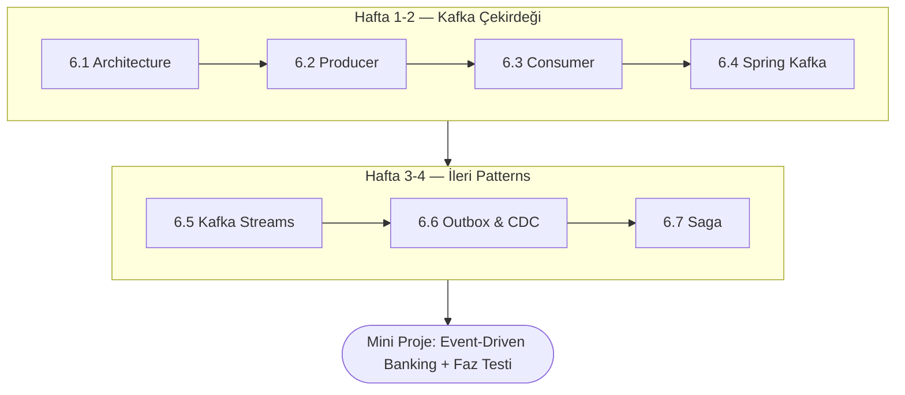
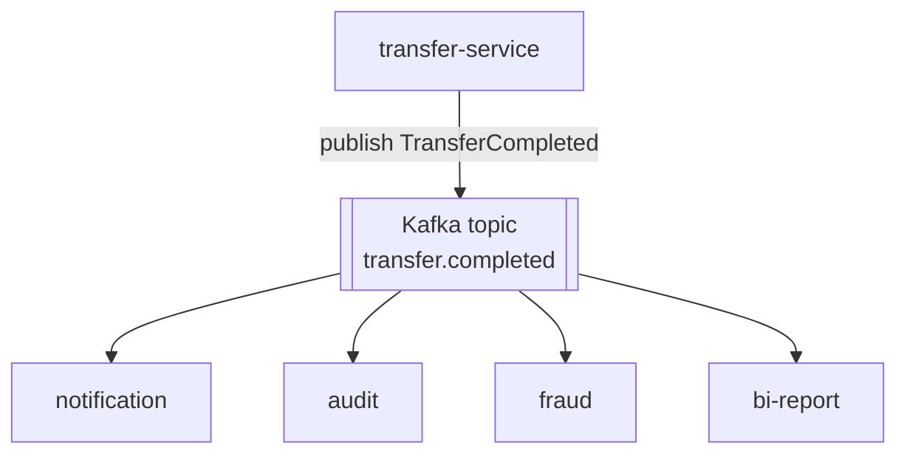

<div class="phase-cover-kicker">Altıncı Bölüm</div>

# Faz 6 — Messaging & Events (Kafka odaklı)

<div class="phase-cover-meta">
<div><strong>Süre</strong> 3-4 hafta</div>
<div><strong>Topic</strong> 7 konu + mini proje</div>
<div><strong>Çıktı</strong> Event-driven core-banking</div>
<div><strong>Ön koşul</strong> Faz 1-5 tamamlandı</div>
</div>

```admonish info title="Bu fazda ne öğreneceksin?"
Synchronous monolitik `core-banking`'i **event-driven mimariye** taşıyacaksın: Kafka cluster
mimarisi, producer (idempotence, transactions), consumer (group, offset, rebalancing), Spring Kafka,
Kafka Streams, outbox pattern ve saga. Fazın sonunda bir transfer `TransferCompleted` event'i yayınlayacak,
notification/audit/fraud servisleri onu bağımsız tüketecek.
```

## Fazın haritası



## Genel bakış

Bu faza geldiğinde elinde **monolitik core-banking** uygulaması var (Faz 1-5):
- Hesaplar açılıyor, transfer'ler yapılıyor.
- Tüm işlemler synchronous: bir HTTP request, bir DB transaction.
- Notification (SMS/Email), audit log, fraud detection — hepsi aynı transaction içinde, ya da bir cron job ile sonra.

**Problem:**
- Transfer başarılı, ama SMS gateway down → kullanıcı SMS almıyor, tüm transfer rollback olsun mu? Hayır.
- Audit servisi yavaş → transfer endpoint'i 2 saniyede dönüyor, müşteri "tıkanma" yaşıyor.
- Fraud detection için elindeki tüm transaction'ları batch ile gece tarayan job var — gerçek zamanlı kart bloklayamıyorsun.
- 5 farklı downstream sistem var: notification, audit, fraud, BI raporlama, regülatör raporlaması. Her biri için transfer servisinde ayrı bir kod parçası tutmak istemiyorsun.

**Çözüm:** **Event-driven mimari**. Transfer tamamlandığında bir `TransferCompleted` event'i yayınla. İlgilenen her servis bağımsız tüketsin.



Her consumer **kendi hızında** tüketir, kendi DB'sine yazar, kendi hatasını yönetir.

## TR bankacılığında durum

TR bankalarında mesajlaşma altyapısı şu spektrumda:

| Eski (legacy) | Geçiş dönemi | Modern |
|---|---|---|
| **IBM MQ** (yaygın) | IBM MQ + Kafka karışık | Kafka (Confluent veya open-source) |
| **WebSphere MQ** | TIBCO EMS | Kafka + Kafka Connect |
| **TIBCO Rendezvous** | RabbitMQ | Kafka Streams + ksqlDB |
| **MSMQ** (eski Windows) | ActiveMQ | Kafka + Schema Registry |

**Senin için gerçek:**
- Mid-level bir TR bankında mülakata girersen **Kafka** sorulur. Resmi modernizasyon yönü.
- Mevcut core sistemi büyük ihtimalle **IBM MQ** üstünde çalışır. "IBM MQ kullandın mı?" sorusuna "Kafka biliyorum, MQ konseptini de biliyorum, gerektiğinde öğreneceğim" diyebilirsin.
- Yeni geliştirilen mikroservis tarafı **Kafka** ile yapılır (Spring Kafka).
- ESB (Enterprise Service Bus) miras kodlar IBM Integration Bus veya WSO2 olabilir — bunu Faz 7-12'de değil, iş başında öğrenirsin.

Bu fazda **Kafka'ya derinlemesine** odaklanıyoruz çünkü:
1. Mid-level pozisyon başvurularında en sık görülen requirement.
2. Modern banking projelerinin omurgası.
3. Concept'leri (broker, partition, offset, consumer group) öğrendiğinde IBM MQ veya RabbitMQ da %70 anlaşılır.

## Bu fazda öğreneceklerin

### Konseptler
- Kafka cluster mimarisi (broker, topic, partition, replica, ISR)
- Producer (acks, idempotence, transactions, exactly-once)
- Consumer (consumer group, offset, rebalancing, partition assignment)
- Spring Kafka entegrasyonu (`@KafkaListener`, KafkaTemplate, DLT)
- Kafka Streams (stateful stream processing, windowing)
- Outbox pattern (dual-write problem çözümü)
- Saga pattern (distributed transaction'a alternatif)

### Pratik
- Docker compose ile lokal Kafka cluster (3 broker, Schema Registry)
- TransferCompleted event'i publish eden producer
- Notification, audit, fraud — üç ayrı consumer
- Outbox tablosu ve scheduled publisher
- Kafka Streams ile gerçek zamanlı fraud scoring
- DLT (Dead Letter Topic) + retry mekanizması
- Idempotent consumer pattern (DB processed event IDs)

### Banking domain kazanımları
- Event-driven mimari ne zaman kullanılır, ne zaman aşırıya kaçar
- "At-least-once" delivery'nin banking için anlamı (idempotency olmadan duplicate transfer riski)
- "Exactly-once" sloganın gerçek hayatta tanımı (transactional producer + read_committed consumer)
- Cross-bank transfer (Saga) — para A bankadan çıktı, B bankada credit fail etti, ne olur?

## Süre

Tahmini toplam: **~25-30 saat** (3-4 hafta, günde 2-3 saat).

| Topic | Süre |
|---|---|
| 01 Kafka Architecture | 3 saat (okuma + setup) |
| 02 Producer | 3-4 saat |
| 03 Consumer | 3-4 saat |
| 04 Spring Kafka | 4-5 saat |
| 05 Kafka Streams | 3-4 saat |
| 06 Outbox & CDC | 3-4 saat |
| 07 Saga | 3 saat |
| Mini-project | 6-8 saat |
| PHASE_TEST | 1 saat |

## Önbilgi

- Faz 1-5 tamamlanmış olmalı (core-banking üzerinden ilerliyoruz)
- Docker compose ile servis ayağa kaldırma alışkanlığı (Faz 2'de PostgreSQL ile yapıldı)
- Spring Boot 3 + Java 21 ortamı çalışıyor
- `@Transactional` ve transaction lifecycle bilgisi (Faz 2)

## Önemli felsefe — junior'ı mid'e taşıyan kavrayış

Kafka, "mesaj kuyruğu" değildir. **Distributed commit log**'dur. Bu farkı içselleştirmen lazım:

| Klasik MQ (RabbitMQ, IBM MQ) | Kafka |
|---|---|
| Mesaj okunduktan sonra silinir | Mesaj diskte kalır (retention period boyunca) |
| Consumer tek bir mesaj alır | Consumer offset'ten okur, geri sarabilir |
| Broker mesaj sırasını yönetir | Sıra partition içinde garantili, partition'lar arası garanti yok |
| Queue veya Topic-Subscription | Topic + Partition + Consumer Group |
| Push veya Pull seçeneği | Pull only (consumer kontrolde) |

**Banking için neden Kafka:**
- **Replay capability**: Audit servisini yeniden başlatıp geçmiş 7 günü tekrar tüketebilirsin. MQ ile imkansız.
- **Multiple consumers**: Aynı event'i 5 farklı servis tüketebilir, her biri kendi offset'ini tutar.
- **High throughput**: Saniyede 100k+ event banking için gerekli olabilir (kart işlemleri).
- **Ordered within partition**: AccountId'ye göre partition'larsan, **aynı hesabın** event'leri sıralı işlenir.

## Konum (klasör yapısı)

```
06-messaging/
├── README.md                       ← bu dosya
├── 01-kafka-architecture/
│   └── README.md
├── 02-producer/
│   └── README.md
├── 03-consumer/
│   └── README.md
├── 04-spring-kafka/
│   └── README.md
├── 05-kafka-streams/
│   └── README.md
├── 06-outbox-cdc/
│   └── README.md
├── 07-saga/
│   └── README.md
├── mini-project/
│   └── README.md
└── PHASE_TEST.md
```

## Başla

→ [01-kafka-architecture/](01-kafka-architecture/index.md)
