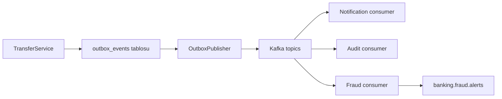
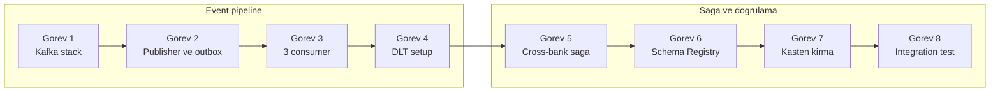
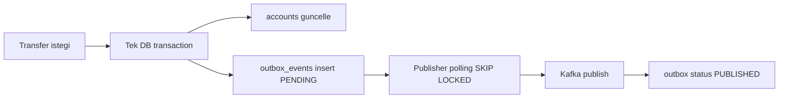
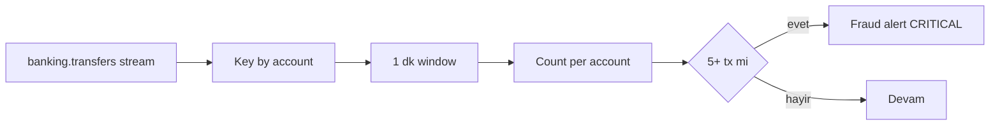

# Phase 6 Mini-Project — Event-Driven Banking Platform

```admonish info title="Bu projede"
- `core-banking`'i **event-driven architecture**'a evrilirken transfer event'ini **outbox pattern** ile publish ediyor, dual-write veri kaybını ortadan kaldırıyorsun
- 3 paralel consumer (notification, audit, fraud) yazıp **idempotent consumer** + DLT + retry ile production-grade hale getiriyorsun
- **Kafka Streams** ile real-time fraud detection kuruyorsun: 5+ tx/dk → CRITICAL alert
- Cross-bank **Saga** orchestrator'ını async API + compensation + stuck recovery ile inşa ediyorsun
- 5 kasten kırma senaryosu (dual-write, consumer crash, publisher race, exactly-once, compensation) üretip düzeltiyor, 15+ integration test ile kanıtlıyorsun
```

## Hedef

Phase 6'nın 7 topic'inde Kafka internals, outbox, consumer pattern'leri, Kafka Streams ve Saga çalıştın. Bu projede hepsini tek serviste birleştirip `core-banking`'i event-driven bir platforma taşıyorsun. Yeni teori yok, **synthesis** var — bir adımda takılırsan ilgili topic'e dön, oku, düzelt.

Sonunda elinde production-grade bir referans implementation olacak: acks=all + idempotence + transactional producer, `exactly_once_v2`, DLT + retry, idempotent consumer (`processed_events`), ShedLock ile multi-instance-safe outbox publisher, async API + status polling.

```admonish tip title="Süre ve önbilgi"
8-12 gün ayır (günde 2-3 saat). Başlamadan önce: Phase 6'nın 7 topic'i (6.1-6.7) bitmiş, defter notların yazılmış olmalı. Transfer/account domain Phase 1-5'ten hazır; outbox pattern (Topic 6.6) ve Saga (Topic 6.7) detaylı bildiğin konular. Buradaki işin çoğu **birleştirme** + 5 kasten kırma reprodüksiyonu.
```

---

## Mimari

Tek bir DB transaction'ı outbox'a yazar; publisher outbox'ı Kafka'ya taşır; üç bağımsız consumer aynı event akışını paralel tüketir. Producer ile consumer'lar arasındaki tek bağ Kafka topic'idir — servisler birbirini tanımaz.



---

## Acceptance criteria (bitirme şartları)

Başlamadan bir kez oku, bitince tek tek işaretle.

- [ ] Kafka KRaft stack docker-compose ile çalışıyor, healthcheck passing
- [ ] Schema Registry + Kafka UI erişilebilir
- [ ] Transfer endpoint → outbox 3 event → Kafka publish chain
- [ ] 3 consumer service (notification, audit, fraud) mesajları işliyor
- [ ] Idempotent consumer pattern (`processed_events`) — duplicate skip
- [ ] DLT setup ile error recovery + ops alert
- [ ] Kafka Streams ile real-time fraud detection (5+ tx/dk)
- [ ] Cross-bank Saga orchestration (4 step + compensation)
- [ ] Outbox pattern ile dual-write çözümü
- [ ] Multi-instance OutboxPublisher (SKIP LOCKED, no duplicates)
- [ ] `exactly_once_v2` aktif
- [ ] 5 kasten kırma reprodüksiyonu + fix
- [ ] 15+ integration test passing
- [ ] Async API + status polling (cross-bank)
- [ ] Stuck saga recovery scheduler

---

## Adım adım build plan

Sekiz görev var: ilk dördü event pipeline'ını kurar, son dördü distributed transaction ve doğrulamayı sağlar.



### Görev 1 — Kafka stack docker-compose (yarım gün)

**Ne yapacaksın:** KRaft mode Kafka + Schema Registry + Kafka UI'ı compose ile ayağa kaldırıp 7 topic yaratacaksın. **Neden:** Tüm event backbone bunun üstünde çalışacak; ZooKeeper'sız KRaft modern ve tek-node lokal için en sade kurulum.

Compose'un kalbi Kafka broker'ının KRaft env bloğu — broker ve controller rolünü aynı node üstlenir, auto topic creation kapalı (topic'leri bilerek yaratacaksın):

```yaml
kafka:
  image: confluentinc/cp-kafka:7.5.0
  environment:
    KAFKA_NODE_ID: 1
    KAFKA_PROCESS_ROLES: 'broker,controller'
    KAFKA_CONTROLLER_QUORUM_VOTERS: '1@kafka:9093'
    KAFKA_AUTO_CREATE_TOPICS_ENABLE: 'false'
    KAFKA_OFFSETS_TOPIC_REPLICATION_FACTOR: 1
    CLUSTER_ID: 'banking-cluster-001'
```

Schema Registry (`8081`) ve Kafka UI (`8090`) servisleri broker'a bağlanır. Tam compose aşağıda.

<details>
<summary>Tam kod: docker-compose.kafka.yml (~54 satır)</summary>

```yaml
# docker-compose.kafka.yml
services:
  kafka:
    image: confluentinc/cp-kafka:7.5.0
    container_name: banking-kafka
    environment:
      KAFKA_NODE_ID: 1
      KAFKA_PROCESS_ROLES: 'broker,controller'
      KAFKA_LISTENERS: 'PLAINTEXT://0.0.0.0:9092,CONTROLLER://0.0.0.0:9093'
      KAFKA_ADVERTISED_LISTENERS: 'PLAINTEXT://kafka:9092'
      KAFKA_INTER_BROKER_LISTENER_NAME: 'PLAINTEXT'
      KAFKA_CONTROLLER_QUORUM_VOTERS: '1@kafka:9093'
      KAFKA_CONTROLLER_LISTENER_NAMES: 'CONTROLLER'
      KAFKA_LISTENER_SECURITY_PROTOCOL_MAP: 'CONTROLLER:PLAINTEXT,PLAINTEXT:PLAINTEXT'
      KAFKA_AUTO_CREATE_TOPICS_ENABLE: 'false'
      KAFKA_OFFSETS_TOPIC_REPLICATION_FACTOR: 1
      KAFKA_TRANSACTION_STATE_LOG_REPLICATION_FACTOR: 1
      KAFKA_TRANSACTION_STATE_LOG_MIN_ISR: 1
      KAFKA_GROUP_INITIAL_REBALANCE_DELAY_MS: 0
      CLUSTER_ID: 'banking-cluster-001'
    ports:
      - "9092:9092"
    healthcheck:
      test: kafka-broker-api-versions --bootstrap-server localhost:9092
      interval: 10s
      timeout: 5s
      retries: 5

  schema-registry:
    image: confluentinc/cp-schema-registry:7.5.0
    container_name: banking-schema-registry
    depends_on:
      kafka:
        condition: service_healthy
    environment:
      SCHEMA_REGISTRY_HOST_NAME: schema-registry
      SCHEMA_REGISTRY_KAFKASTORE_BOOTSTRAP_SERVERS: kafka:9092
      SCHEMA_REGISTRY_LISTENERS: http://0.0.0.0:8081
    ports:
      - "8081:8081"

  kafka-ui:
    image: provectuslabs/kafka-ui:latest
    container_name: banking-kafka-ui
    depends_on:
      - kafka
    environment:
      KAFKA_CLUSTERS_0_NAME: banking
      KAFKA_CLUSTERS_0_BOOTSTRAPSERVERS: kafka:9092
      KAFKA_CLUSTERS_0_SCHEMAREGISTRY: http://schema-registry:8081
    ports:
      - "8090:8080"
```

</details>

Stack ayağa kalkınca 4 banking topic'i (10 partition) + 3 DLT topic'i yaratıyorsun:

```bash
docker compose -f docker-compose.kafka.yml up -d && sleep 30

for topic in banking.transfers banking.audit banking.notifications banking.fraud.alerts; do
    docker exec banking-kafka kafka-topics --bootstrap-server localhost:9092 \
        --create --topic $topic --partitions 10 --replication-factor 1 \
        --config min.insync.replicas=1
done

for topic in banking.transfers.DLT banking.audit.DLT banking.notifications.DLT; do
    docker exec banking-kafka kafka-topics --bootstrap-server localhost:9092 \
        --create --topic $topic --partitions 3 --replication-factor 1
done
```

Kontrol noktası: `kafka-topics --list` 7 topic gösteriyor, healthcheck yeşil, Kafka UI (`http://localhost:8090`) topic'leri listeliyor.

### Görev 2 — TransferEventPublisher + Outbox (1.5 gün)

**Ne yapacaksın:** `TransferService`'i outbox tablosuna 3 event yazacak şekilde refactor edip polling'li `OutboxPublisher`'ı ekleyeceksin. **Neden:** DB'ye yaz + Kafka'ya gönder ayrı iki işlemdir (**dual-write**); biri başarılı olup diğeri başarısız olursa veri tutarsızlaşır. **Outbox pattern** bu iki yazmayı tek DB transaction'ına indirger.

Akış şu: transfer ve outbox event'leri tek transaction'da commit olur, publisher outbox'ı ayrı süreçte Kafka'ya taşır.



```admonish warning title="Dual-write neden veri kaybettirir"
`transferRepo.save()` sonra `kafkaTemplate.send()` çağırırsan, save commit olup send öncesi Kafka düşerse: transfer DB'de var, event Kafka'da yok. Notification/audit/fraud hiç tetiklenmez. Bu senaryoyu Görev 7.1'de bilerek reproduce edeceksin.
```

Önce outbox migration'ı — `status` üstünde partial index polling'i hızlandırır:

```sql
CREATE TABLE outbox_events (
    id              UUID PRIMARY KEY DEFAULT gen_random_uuid(),
    aggregate_type  VARCHAR(100) NOT NULL,
    aggregate_id    VARCHAR(100) NOT NULL,
    event_type      VARCHAR(100) NOT NULL,
    payload         JSONB NOT NULL,
    created_at      TIMESTAMP WITH TIME ZONE NOT NULL DEFAULT NOW(),
    status          VARCHAR(20) NOT NULL DEFAULT 'PENDING',
    published_at    TIMESTAMP WITH TIME ZONE,
    failure_count   INT DEFAULT 0,
    last_error      TEXT,
    CONSTRAINT chk_outbox_status CHECK (status IN ('PENDING', 'PUBLISHED', 'FAILED'))
);

CREATE INDEX idx_outbox_pending ON outbox_events(status, created_at) WHERE status = 'PENDING';
```

`TransferService`'in kritik bloğu: domain değişikliği ile 3 outbox event'i <mark>aynı `@Transactional` içinde</mark> yazılır — atomicity DB transaction'ından gelir, ekstra koordinasyona gerek yoktur.

```java
Transfer transfer = transferRepo.save(new Transfer(req, userId));

// Outbox events — aynı transaction
outboxEventService.publish("Transfer", transfer.getId().toString(),
    "TransferCompleted", new TransferCompletedEvent(transfer));
outboxEventService.publish("Audit", transfer.getId().toString(),
    "AuditLog", new AuditLogEvent("TRANSFER_EXECUTED", userId, transfer.getId()));
outboxEventService.publish("Notification", transfer.getToAccountId().toString(),
    "NotificationRequest", new NotificationRequest(transfer));
```

<details>
<summary>Tam kod: TransferService.execute (~38 satır)</summary>

```java
@Service
@Slf4j
public class TransferService {

    private final AccountRepository accountRepo;
    private final TransferRepository transferRepo;
    private final OutboxEventService outboxEventService;

    @Transactional
    public Transfer execute(TransferRequest req, UUID userId) {
        // Idempotency check
        if (transferRepo.existsByIdempotencyKey(req.idempotencyKey())) {
            return transferRepo.findByIdempotencyKey(req.idempotencyKey()).orElseThrow();
        }

        // Domain
        Account from = accountRepo.findByIdAndLock(req.fromAccountId()).orElseThrow();
        Account to = accountRepo.findByIdAndLock(req.toAccountId()).orElseThrow();
        from.withdraw(req.amount(), req.currency());
        to.deposit(req.amount(), req.currency());
        accountRepo.save(from);
        accountRepo.save(to);

        Transfer transfer = transferRepo.save(new Transfer(req, userId));

        // Outbox events — same transaction
        outboxEventService.publish("Transfer", transfer.getId().toString(),
            "TransferCompleted", new TransferCompletedEvent(transfer));
        outboxEventService.publish("Audit", transfer.getId().toString(),
            "AuditLog", new AuditLogEvent("TRANSFER_EXECUTED", userId, transfer.getId()));
        outboxEventService.publish("Notification", transfer.getToAccountId().toString(),
            "NotificationRequest", new NotificationRequest(transfer));

        return transfer;
    }
}
```

</details>

`OutboxPublisher` (Topic 6.6'da detaylı kod) PENDING satırları poll eder; multi-instance güvenliği için **ShedLock** ile scheduler'ı tek instance'a kilitler, satır seçiminde `FOR UPDATE SKIP LOCKED` kullanır. Başarılı publish sonrası satır `PUBLISHED` olur.

Kontrol noktası: rollback test (transfer fail → outbox 0 event) ve happy path (transfer success → outbox 3 event PENDING → publisher → 3 event PUBLISHED) geçiyor.

### Görev 3 — 3 Consumer Service (2 gün)

**Ne yapacaksın:** Notification, audit ve fraud consumer'larını yazacaksın; ilk ikisi idempotent, üçüncüsü Kafka Streams tabanlı. **Neden:** Aynı event akışını bağımsız üç servis paralel tüketir — biri yavaşlarsa diğerleri etkilenmez. Ama <mark>Kafka at-least-once teslim eder: aynı mesaj tekrar gelebilir</mark>, bu yüzden yan etkiyi tekilleştirmek zorundasın.

```admonish tip title="Idempotent consumer anahtarı"
**Outbox event ID'si consumer tarafında idempotency key'dir.** Her consumer group işlediği event ID'yi `processed_events`'e yazar; aynı ID ikinci kez gelirse işlemeden `ack` eder. Böylece SMS iki kez gitmez, audit iki kez yazılmaz. Offset commit `MANUAL_IMMEDIATE` olmalı ki ack kontrolü sende kalsın.
```

`NotificationConsumer`'ın kritik bloğu: önce `processed_events` kontrolü, sonra yan etki, sonra kayıt + ack. `X-Trace-Id` header'ı MDC'ye taşınır ki tüm consumer log'ları korelasyona girsin:

```java
if (processedRepo.existsByEventIdAndConsumerGroup(eventId, "notification-service")) {
    ack.acknowledge();
    return;
}
notificationService.sendTransferNotification(event);
processedRepo.save(new ProcessedEvent(eventId, "notification-service"));
ack.acknowledge();
```

<details>
<summary>Tam kod: NotificationConsumer (~37 satır)</summary>

```java
@Component
@Slf4j
public class NotificationConsumer {

    private final NotificationService notificationService;
    private final ProcessedEventRepository processedRepo;

    @KafkaListener(
        topics = "banking.transfer.transfer-completed",
        groupId = "notification-service",
        containerFactory = "kafkaListenerContainerFactory"
    )
    @Transactional
    public void consume(
        @Payload TransferCompletedEvent event,
        @Header(value = "X-Trace-Id", required = false) String traceId,
        Acknowledgment ack
    ) {
        MDC.put("traceId", traceId);
        try {
            UUID eventId = event.getId();

            if (processedRepo.existsByEventIdAndConsumerGroup(eventId, "notification-service")) {
                ack.acknowledge();
                return;
            }

            notificationService.sendTransferNotification(event);
            processedRepo.save(new ProcessedEvent(eventId, "notification-service"));

            ack.acknowledge();
        } finally {
            MDC.clear();
        }
    }
}
```

</details>

`AuditConsumer` aynı iskeleti daha sade uygular — event ID kontrolü + kayıt + ack:

```java
@KafkaListener(topics = "banking.audit.audit-log", groupId = "audit-service")
@Transactional
public void consume(@Payload AuditLogEvent event, Acknowledgment ack) {
    if (auditRepo.existsByEventId(event.getId())) {
        ack.acknowledge();
        return;
    }
    auditRepo.save(AuditRecord.from(event));
    ack.acknowledge();
}
```

`FraudConsumer` **Kafka Streams** ile (Topic 6.5). Transfer stream'ini account'a göre key'ler, 1 dakikalık window'da sayar; eşiği aşan account'a CRITICAL alert üretir. Topology:



Kontrol noktası: aynı event iki kez gönderilince notification/audit tek kez işleniyor; 1 dakikada 5+ transfer yapan account için `banking.fraud.alerts`'e CRITICAL alert düşüyor; `X-Trace-Id` consumer log'larında görünüyor.

### Görev 4 — DLT setup (yarım gün)

**Ne yapacaksın:** `DefaultErrorHandler` + Dead Letter Topic + DLT monitor consumer kuracaksın. **Neden:** Zehirli bir mesaj (deserialize edilemeyen, sürekli fail eden) main partition'ı sonsuza kadar tıkar. **DLT** başarısız mesajı yan kanala alır, ana akış devam eder, ops ekibi haberdar olur.

`DltMonitor` üç DLT topic'ini dinler, kaydı saklar ve alert atar:

```java
@KafkaListener(topics = {"banking.transfers.DLT", "banking.audit.DLT", "banking.notifications.DLT"})
public void onDlt(ConsumerRecord<String, String> record) {
    log.error("DLT message: topic={}, value={}", record.topic(), record.value());
    dlqRepo.save(new DeadLetterRecord(record.topic(), record.value()));
    notifier.alertOps("DLT: " + record.topic());
}
```

Kontrol noktası: invalid event gönder → 3 retry → DLT'ye route → `DltMonitor` kaydeder → ops alert tetiklenir.

### Görev 5 — Cross-bank Saga (2 gün)

**Ne yapacaksın:** Cross-bank transfer için persistent state'li bir **Saga** orchestrator'ı, async API ve compensation flow ile yazacaksın. **Neden:** Farklı bankalar arası transferde tek DB transaction'ı yok; 2PC banking'de kabul edilmez (kilitler, kırılganlık). Saga her adımı ayrı local transaction yapar, hata olursa **compensation** ile geri sarar.

```admonish warning title="Saga state persistent olmalı"
**In-memory saga state banking'de yasaktır** — instance restart olunca yürüyen tüm saga'lar kaybolur. State `saga_states` tablosunda tutulur; her Kafka listener state'i ilerletir, stuck saga recovery scheduler timeout'a düşen saga'ları yakalar.
```

API async: `POST` hemen `202 Accepted` + status URL döner, işlem arkada yürür; client status'u polling'le öğrenir. Bu banking UX'inde eventual consistency'nin doğru sunumudur.

```java
@PostMapping
public ResponseEntity<SagaCreatedResponse> initiate(
        @Valid @RequestBody CrossBankTransferRequest req) {
    UUID sagaId = saga.initiate(req);
    return ResponseEntity.accepted()
        .body(new SagaCreatedResponse(sagaId, "/v1/sagas/" + sagaId));
}

@GetMapping("/{sagaId}/status")
public SagaStatusResponse getStatus(@PathVariable UUID sagaId) {
    SagaState state = sagaRepo.findById(sagaId).orElseThrow();
    return new SagaStatusResponse(state.getCurrentState(), state.getUpdatedAt());
}
```

Full implementation (Topic 6.7'de detaylı): `SagaStateRepository`, `CrossBankTransferSaga` orchestrator, 6 Kafka listener (4 step + compensation), stuck saga recovery scheduler (5 dk timeout), mock external bank servisleri (Bank A, Bank B, FX, Audit, Notification).

Kontrol noktası: `saga_states` migration uygulandı; happy path (4 step tamamlanır, status COMPLETED) ve compensation path (bir step fail → önceki step'ler geri sarılır) testleri geçiyor; stuck saga scheduler timeout'a düşen saga'yı yakalıyor.

### Görev 6 — Schema Registry + Avro (1 gün, opsiyonel ileri)

**Ne yapacaksın:** 4 event için Avro schema tanımlayıp Schema Registry'e register eder, producer/consumer'ı Avro serializer'a taşırsın. **Neden:** JSON'da schema garantisi yok — bozuk bir field production'da consumer'ı kırar. Avro + Schema Registry schema evolution'ı (backward-compatible field ekleme) compile-time garanti eder.

```bash
mvn avro:schema
```

Kontrol noktası (opsiyonel): 4 Avro schema (TransferCompleted, AuditLog, NotificationRequest, FraudAlert) register edildi; producer + consumer Avro serializer kullanıyor; backward-compatible field ekleme testi geçiyor.

### Görev 7 — Kasten kırma görevleri (1 gün)

**Ne yapacaksın:** 5 patolojik senaryoyu önce bug'lı yazıp reproduce edecek, sonra pattern ile düzelteceksin. **Neden:** Banking'de deneyim = bug'la dans. Production'da göreceğin veri kaybı ve mükerrer işlemleri burada kontrollü ortamda üretip teşhis edersen, "neden bu pattern şart" sorusuna kanıtla cevap verirsin. Her biri için **defterine** before/after notu düş.

**7.1 — Dual-write reproduction:** Önce outbox olmadan `transferRepo.save()` + `kafkaTemplate.send()` yaz. Kafka'yı durdur → transfer DB'de var, event Kafka'da yok. Veri kaybı reproduce oldu. Outbox ekle → fix.

**7.2 — Consumer crash mid-processing:** Consumer event'i aldı, %50 işledi, crash. Offset commit yok → restart'ta yeniden işler. Idempotency olmadan SMS 2 kez gider. `processed_events` ekle → fix.

**7.3 — Exactly-once test:** `producer.send` sonrası network glitch retry → consumer 2 mesaj alır. `processing.guarantee=exactly_once_v2` ekle → consumer tek mesaj görür. <mark>`exactly_once_v2` transactional producer + read_committed consumer + idempotent consumer üçlüsüdür.</mark>

**7.4 — Outbox publisher race:** 3 publisher instance, `findByStatus(PENDING)` lock'suz → üçü aynı event'i alır → Kafka'ya 3 kez gönderir. <mark>`FOR UPDATE SKIP LOCKED` her event'in tek instance'a düşmesini garanti eder</mark> → fix sonrası her event bir kez publish edilir.

**7.5 — Saga compensation idempotency:** `reverseDebit` check'siz → network retry → compensation 2 kez → double credit. `reversedTxRepo` check ekle → idempotent compensation.

Kontrol noktası: 5 reprodüksiyon + fix tamamlandı; her birinin before/after notu defterinde; her biri için "banking'de neden bu pattern şart" tek cümleyle yazılı.

### Görev 8 — Integration test suite (1 gün)

**Ne yapacaksın:** `@SpringBootTest` + `@Testcontainers` (KafkaContainer + PostgreSQLContainer) ile 15+ integration test yazacaksın. **Neden:** Event-driven akış mock'la doğrulanamaz — gerçek Kafka + gerçek Postgres olmadan idempotency, DLT routing ve saga davranışı kanıtlanmaz.

<details>
<summary>Test senaryoları (15+ test)</summary>

- `TransferService` outbox test (Görev 2)
- `OutboxPublisher` publish test (Görev 2)
- `NotificationConsumer` idempotency test (Görev 3)
- `AuditConsumer` test
- `FraudConsumer` Kafka Streams `TopologyTestDriver` test
- DLT routing test (Görev 4)
- `CrossBankSaga` happy path test
- `CrossBankSaga` compensation test
- End-to-end: HTTP transfer → outbox → 3 consumer → side effects
- 5 kasten kırma senaryosunun (Görev 7) reprodüksiyon + fix testleri

</details>

Kontrol noktası: `mvn verify` 15+ test'i geçiyor, end-to-end test HTTP transfer'den 3 consumer'ın side effect'ine kadar tüm zinciri doğruluyor.

---

## Pratik desteği

Projeyi bitirdim dediğin an, aşağıdaki prompt'la Claude'a kapsamlı bir audit yaptır — kör noktalarını böyle yakalarsın.

<details>
<summary>Claude-verify prompt (mini-project bütünü için)</summary>

```
Event-driven banking project'imi banking-grade kriterlere göre değerlendir.
Her madde için PASS / FAIL / EKSIK işaretle, kanıt göster (file path veya code reference):

1. Kafka setup:
   - KRaft mode (no ZooKeeper)?
   - Schema Registry mevcut?
   - acks=all + idempotence + min.insync.replicas=2?

2. Outbox pattern:
   - TransferService 3 event same TX'te?
   - OutboxPublisher polling + ShedLock + SKIP LOCKED?
   - Failure handling + permanent failure threshold?
   - Cleanup scheduled?

3. Consumer pattern:
   - Idempotent consumer (processed_events)?
   - Manuel offset commit (MANUAL_IMMEDIATE)?
   - DefaultErrorHandler + DLT?
   - Header propagation (X-Trace-Id)?
   - CooperativeStickyAssignor?

4. Kafka Streams:
   - exactly_once_v2?
   - 1 dk window fraud detection?
   - State store + interactive query?

5. Saga:
   - State persistent (DB)?
   - 6 Kafka listener (4 step + compensation)?
   - Idempotent compensation?
   - Async API (202 + status polling)?
   - Stuck saga recovery?

6. Kasten kırma reproduction:
   - Dual-write data loss reproduced + fixed?
   - Consumer mid-crash → duplicate reproduced + fixed (idempotency)?
   - Publisher race → duplicate reproduced + fixed (SKIP LOCKED)?
   - Compensation duplicate reproduced + fixed?

7. Integration tests:
   - TestContainers Kafka + Postgres + Schema Registry?
   - 15+ test passing?
   - End-to-end HTTP → outbox → Kafka → consumer test?

8. Banking specific:
   - PII (cardPan, TC No) payload'da YOK?
   - Outbox event ID = consumer idempotency key?
   - Eventual consistency UX impact düşünülmüş?

9. Monitoring:
   - Producer/consumer/saga metrics?
   - DLT alert ops?
   - Grafana dashboard?

10. Anti-pattern:
    - Dual-write var mı?
    - Auto-commit?
    - Saga state in-memory?
    - 2PC kullanılmış mı?
    - exactly_once_v2 yok?

Her madde için PASS / FAIL / EKSIK işaretle, kanıt göster (file path veya code reference).
```

</details>

---

## Defter notları (20 madde)

Her maddenin boşluğunu kendi deneyiminle doldur — bunlar mülakatta sorulacak sorular.

1. "Dual-write probleminin 3 patolojik senaryosu — canlı reproduce ettim: ____."
2. "Outbox pattern atomicity DB transaction'ından gelir — açıklama: ____."
3. "Outbox publisher FOR UPDATE SKIP LOCKED multi-instance neden gerekli: ____."
4. "@Transactional outbox event creation — caller's tx içinde MANDATORY: ____."
5. "Idempotent consumer processed_events pattern + cleanup TTL: ____."
6. "exactly_once_v2 = transactional producer + read_committed consumer + idempotent consumer: ____."
7. "CooperativeStickyAssignor STW pause kazancı: ____."
8. "DefaultErrorHandler + DLT vs @RetryableTopic non-blocking trade-off: ____."
9. "Kafka Streams real-time fraud detection — production vs Phase 4 PL/SQL alternative: ____."
10. "Saga orchestration vs choreography banking için karar matrisi: ____."
11. "2PC vs Saga — neden 2PC banking için yasak: ____."
12. "Compensating action 5 kuralı (idempotent, audit, semantic, order, local-atomic): ____."
13. "Saga stuck timeout banking SLA için ne kadar (rakam): ____."
14. "Async HTTP 202 + status polling banking UX impact: ____."
15. "Multi-instance publisher fairness (SKIP LOCKED) + integration test sonucu: ____."
16. "Kafka Streams state store local RocksDB + changelog backup: ____."
17. "Schema Registry + Avro vs JSON without schema — banking için fark: ____."
18. "Outbox event ID = consumer idempotency key — pattern detayı: ____."
19. "Eventual consistency UX (transfer immediate, notification delayed) — kullanıcı feedback'i: ____."
20. "TR bank batch (Phase 5) + event-driven (Phase 6) hybrid mimari: ____."

---

```admonish success title="Proje Tamamlama Kriterleri"
- Kafka KRaft stack docker-compose ile çalışıyor, Schema Registry + Kafka UI erişilebilir, 7 topic yaratıldı
- Transfer endpoint → outbox 3 event (same TX) → OutboxPublisher (ShedLock + SKIP LOCKED) → Kafka publish chain çalışıyor
- 3 consumer (notification, audit, fraud) mesajları işliyor; idempotent consumer pattern duplicate'i skip ediyor; DLT + ops alert kurulu
- Kafka Streams real-time fraud detection (5+ tx/dk → CRITICAL) ve cross-bank Saga (4 step + compensation + async API + stuck recovery) çalışıyor
- `exactly_once_v2` aktif; 5 kasten kırma reprodüksiyonu (dual-write, consumer crash, publisher race, exactly-once, compensation) + fix dokümante
- `mvn verify` 15+ integration test'i geçiyor; end-to-end HTTP → outbox → Kafka → consumer testi yeşil
```
