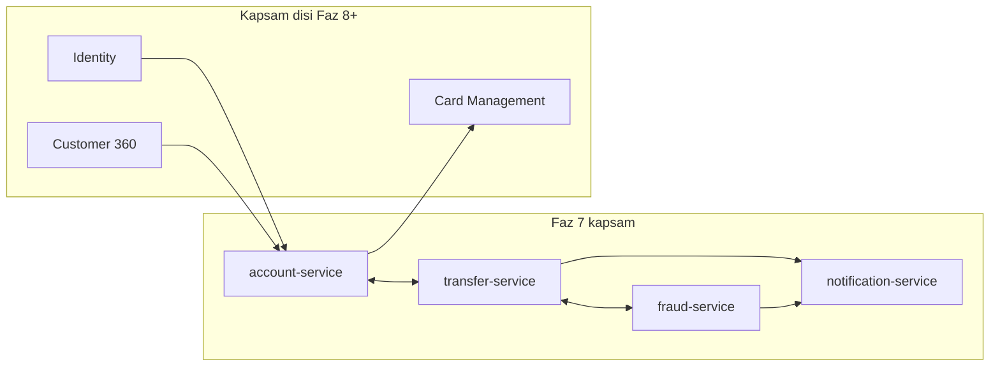
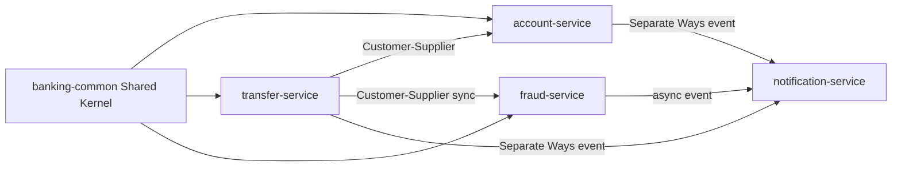
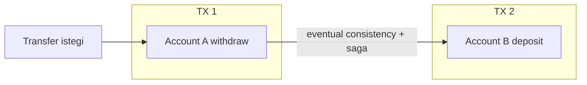
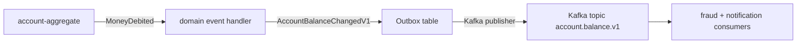

# Topic 7.1 — DDD Strategic Design: Bounded Context, Context Map, Aggregate

```admonish info title="Bu bölümde"
- Stratejik DDD ile taktiksel DDD farkı ve bir kodun "ayrı bounded context" olduğunu ele veren 5 gösterge
- Banking bounded context haritası: account, transfer, fraud, notification + kapsam dışı context'ler
- Context map ilişki tipleri banking örnekleriyle: Shared Kernel, Customer-Supplier, Conformist, ACL, Partnership, Separate Ways
- Aggregate transaction boundary: bir transaction = bir aggregate, transfer neden iki ayrı TX ister
- Domain event vs integration event ayrımı ve TR bankasında sık görülen DDD anti-pattern'leri
```

## Hedef

Faz 1'de tek bir `core-banking` monolitinde gördüğün domain'i (account, transfer, ledger, fraud, notification) **stratejik DDD** lensiyle yeniden okumak. Bounded context'lerin sınırlarını bulmak, aralarındaki ilişkileri tipleri ile adlandırmak (context map), aggregate root'ların gerçek **transaction boundary** anlamını kavramak. Bu topic, Faz 7'nin **mimari temelidir** — buradaki kararlar 02-08 topic'lerinin nasıl çıkacağını belirler.

## Süre

Okuma: 2.5 saat • Kendini Sına: 45 dk • Pratik (opsiyonel): 4-5 saat • Toplam: ~3.5 saat (+ pratik)

## Önbilgi

- Faz 1.1 — Hexagonal architecture bitirilmiş (port/adapter ayrımı net)
- Faz 2 — JPA + transaction yönetimi pratik var (`@Transactional` kullandın)
- Eric Evans'ın DDD'sinden Faz 1'de **kavramları** gördün — burada **stratejik tarafa** geçiyoruz
- "Bounded context" terimini duydun; bu topic'te onu **yaşayacaksın**

---

## Kavramlar

### 1. Stratejik DDD vs Taktiksel DDD — fark

"Bu kodu hangi servise koymalıyım?" sorusu taktiksel değil, **stratejik** bir sorudur; ayrımı görmeden başlayalım. Faz 1'de **taktiksel** DDD'ye dokunduk: entity, value object, aggregate, domain event, repository. Bunlar tek bir bounded context **içinde** kod yazma kuralları.

**Stratejik DDD** ise bir üst seviyedir ve dört soruyu cevaplar:

- Büyük domain'i **nasıl parçalayacaksın**?
- Parçalar (bounded context) arasında **nasıl ilişki kuracaksın**?
- Hangi parça hangi takıma ait olur (Conway's Law)?
- Hangi parça **microservice** olarak ayrılır?

Sıralama önemli: microservice mimarisi stratejik DDD'nin **sonucudur**. Önce bounded context'leri bul, sonra "bu context'ler hangi servisler olur?" diye sor.

> Eric Evans (DDD Blue Book, 2003): "Strategic design is about decisions that are global and structural. Tactical design is about expressing the model in code."

---

### 2. Bounded Context — tanım ve sınırlar

Aynı `Account` kelimesi kimlik ekibinde "login bilgisi", ledger ekibinde "para tutan defter" demekse, tek modelde birleştirmeye çalışmak felakettir; işte bunun panzehiri bounded context.

**Bounded context:** Bir modelin **anlamlı, tutarlı, sınırlı** olduğu bağlam. Sınırın ötesinde aynı kelime farklı anlama gelebilir. Banking'de `Account` kelimesinin beş yüzü:

| Bounded context | "Account" ne demek |
|---|---|
| **Core Banking (vadesiz hesap)** | Bakiyesi olan, debit/credit edilen ledger objesi. ID + currency + balance + status. |
| **Authentication / Kimlik** | Login bilgisi. username + password hash + MFA secret + last login. |
| **CRM / Customer 360** | Müşterinin "ana hesabı" — tüm hesapların referansını taşır, marketing tagi var. |
| **Card Management** | Kart ile ilişkili "card account" — limit, dönem, ödenmemiş tutar. |
| **Loan / Kredi** | Kredi hesabı — anapara, faiz, ödeme planı. |

Aynı kelime, beş farklı anlam. Bunları **tek bir modelde** birleştirmeye çalışırsan `Account` class'ı 47 field'lı dev bir nesneye şişer, "credit dedi → kredi ödemesi mi, para yatırma mı?" sorusu netleşmez ve her takım aynı sınıfta birbirine çarpar.

**Çözüm:** Her context'in **kendi `Account`'u**, kendi terminolojisi, kendi modeli olsun; birbirleriyle konuşurken araya bir **çevirmen (mapping/ACL)** girsin.

#### Bounded context'in pratik göstergeleri

Bir kodun ayrı bir bounded context olduğunu şu beş işaretten anlarsın:

1. **Ubiquitous language farklı.** Bir takım "transfer", diğeri "havale", üçüncüsü "EFT" diyor.
2. **Aynı kelimenin field'ları/davranışı farklı.** `Customer` bir tarafta `kyc_status`, diğer tarafta `marketing_segment` taşır.
3. **Lifecycle bağımsız.** Bir context değişince diğeri deploy edilmek zorunda kalmamalı.
4. **Sahiplik farklı.** Farklı takım, farklı PO, farklı SLA.
5. **Veri tutarlılığı sınırı.** Bir transaction bir context içinde tamamlanmalı; context'ler arası `@Transactional` zaten çalışmaz.

<mark>Bu göstergelerin en az üçüne birden "evet" diyebiliyorsan, ayrı bir bounded context olarak modellemek güçlü ihtimaldir.</mark>

---

### 3. Banking için bounded context haritası

Faz 7'de dört servise ve onları çevreleyen kapsam dışı context'lere odaklanıyoruz. Önce haritanın kuş bakışı hâli:



**Faz 7'de implement edilecek 4 context:**

1. **Account / Core Banking Ledger** — vadesiz hesap, balance, double-entry ledger
2. **Transfer Orchestration** — para hareketinin orchestration'ı, idempotency, saga
3. **Fraud Risk** — kural motoru, skor, decision (APPROVE/REJECT/REVIEW)
4. **Notification Delivery** — SMS/email/push template + gönderim

**Out of scope (Faz 8+):** Customer / KYC / 360, Card management, Loan / Kredi, Authentication / IAM, Reporting / Data warehouse.

---

### 4. Ubiquitous Language — bounded context içinde

Her context'in **kendi sözlüğü** olmalı; bir servise dokunmadan önce o servisin kelimelerini bilmen gerekir. Banking'de dört context'in gerçek sözlükleri:

**Account / Core Banking dilinde:**

- **Hesap (Account):** Para tutan ledger objesi. ID, currency, balance, status (ACTIVE/FROZEN/CLOSED).
- **Bakiye (Balance):** Hesabın anlık parası. `Money` value object.
- **Journal Line (hesap hareketi):** Bir debit veya credit kaydı. Hep çift gelir.
- **Journal Entry (hesap defteri):** Bir transaction'ın iki tarafını (DEBIT + CREDIT) birleştiren atomic kayıt.
- **Status:** ACTIVE, FROZEN (geçici dondurma), CLOSED (kalıcı kapama).

**Transfer Orchestration dilinde:**

- **Transfer:** İki hesap arası para hareketi talebi. ID, fromAccount, toAccount, amount, currency, status.
- **Status:** PENDING, FRAUD_CHECK, EXECUTED, REJECTED, COMPENSATING, COMPENSATED, FAILED.
- **Saga:** Transfer'in yaşam döngüsünü yöneten state machine.
- **Compensation:** Başarısız adımı geri alma — reverse journal entry.
- **Idempotency Key:** Aynı transfer'in iki kez işlenmesini engelleyen, client-sağlayan UUID.
- **Hold:** Onay sırasında bakiyenin mantıksal olarak "kilitlenmesi" — formal kayıt değil.

**Fraud Risk dilinde:**

- **Risk Score:** 0-100 arası, transfer'in riskini özetler.
- **Rule:** Bir karar kuralı — "günlük 50.000 TRY üstü → MANUAL REVIEW".
- **Decision:** APPROVE, REJECT, REVIEW.
- **Velocity:** Belirli aralıkta işlem sayısı (örn. son 5 dk'da 10 transfer).
- **Blacklist / Whitelist:** Engellenmiş hesap/IBAN/IP listesi / müşterinin beyan ettiği güvenilir alıcılar.

**Notification dilinde:**

- **Channel:** SMS, EMAIL, PUSH, IN_APP.
- **Template:** Parametrize mesaj — "{name}, {amount} {currency} transfer onaylandı".
- **Delivery Attempt:** Bir kanaldan gönderme denemesi; başarı/başarısızlık + zaman.
- **Quiet Hours / Opt-out:** Bildirim istenmeyen zaman aralığı / kanal bazlı ya da tam vazgeçme.

**Tuzak:** "Transfer" kelimesi Account context'te de geçer (bir journal entry'nin sebebi), ama orada sadece bir **referanstır** (transferId UUID). Account, transfer'in business logic'ini bilmez — işte bu sınır.

---

### 5. Context Map — ilişki tipleri

İki context'i ayırdıktan sonra "bunlar birbiriyle nasıl konuşacak?" sorusu kalır; context map bu ilişkiyi bir **isimle** etiketler. Eric Evans'ın standart pattern'lerinden banking'de en çok işine yarayacakları görelim.

#### 5.1. Shared Kernel (Paylaşılan Çekirdek)

İki context **aynı küçük model parçasını paylaşır** — sıkı bağlanma. Banking örneği: `Money`, `Currency`, `AccountId` value object'leri her serviste aynı anlamlıdır; bunları bir `banking-common` Maven module/JAR'ında toplarsın.

**Risk:** Shared kernel'i her iki takım da koordine ederek değiştirmek zorunda. O yüzden küçük tutulur: sadece **stabil value object'ler** (`Money`, `Currency`, `ErrorCode`, `IdempotencyKey`). Domain logic asla shared kernel'da olmaz.

#### 5.2. Customer-Supplier

Bir context **müşteri** (downstream), diğeri **tedarikçi** (upstream); tedarikçi müşterinin ihtiyaçlarını dikkate alır. Banking örneği: `account-service` (supplier), `transfer-service` (customer). Account-service breaking change yaparken transfer-service'i uyarır, takvim koordine eder. İşaret: aynı şirkette iki takım, iyi iletişim, ortak sprint.

#### 5.3. Conformist

Müşteri context, tedarikçinin modelini **olduğu gibi** kabul eder — adapter yok. Banking örneği: bir TR bankası **MASAK** raporlama sistemine veri yollar; MASAK'ın formatı bellidir, banka kabul etmek zorundadır, kendi şartını dayatamaz. **Risk:** Tedarikçi değişirse müşteri patlar; kaçınabilirsen kaçın.

#### 5.4. Anti-Corruption Layer (ACL) — banking için çok önemli

Müşteri context, tedarikçinin "kirli" modelini kendine sokmaz; araya bir **çevirmen katman** koyar. Bu, banking'de en sık lazım olan pattern'dir çünkü TR bankalarında **legacy core banking** (COBOL mainframe, AS/400, Hogan vb.) hâlâ canlıdır ve modeli berbattır (her field 12 karakter, hesap numarası "ACCT-" prefix'li, currency "TR" yerine "TRL").

Önce kendi temiz domain'in — legacy'nin hiçbir izi yok:

```java
// === transfer-service domain (clean) ===
public class Transfer {
    private final TransferId id;
    private final Money amount;       // BigDecimal + Currency
    private final AccountId from;
    private final AccountId to;
    // ...
}
```

ACL bir `@Component`; içine legacy client'ı ve mapper'ları alır. Kirli çeviri mantığı bu sınıfta hapsolur:

```java
@Component
class LegacyHogonTransferAdapter {
    private final HogonClient hogonClient;
    private final HogonCurrencyMapper currencyMapper;  // "TR" → "TRY"
    private final HogonAccountMapper accountMapper;    // "ACCT-12345" → AccountId
    // ...
}
```

`send()` iki yönlü çeviri yapar: clean domain → legacy request, sonra legacy response → clean domain. Domain bu satırların hiçbirini görmez:

```java
    public LegacyTransferResponse send(Transfer transfer) {
        HogonTransferRequest req = new HogonTransferRequest();
        req.setFromAcct(accountMapper.toLegacy(transfer.getFrom()));  // "ACCT-12345"
        req.setToAcct(accountMapper.toLegacy(transfer.getTo()));
        req.setAmt(transfer.getAmount().amount().toPlainString());
        req.setCcy(currencyMapper.toLegacy(transfer.getAmount().currency()));  // "TRL"

        var resp = hogonClient.executeTransfer(req);
        return toClean(resp);   // "00"→SUCCESS, "01"→PENDING
    }
```

<details>
<summary>Tam kod: LegacyHogonTransferAdapter (~40 satır)</summary>

```java
// === transfer-service domain (clean) ===
public class Transfer {
    private final TransferId id;
    private final Money amount;       // BigDecimal + Currency
    private final AccountId from;
    private final AccountId to;
    // ...
}

// === ACL — legacy çevirmeni ===
@Component
class LegacyHogonTransferAdapter {
    private final HogonClient hogonClient;
    private final HogonCurrencyMapper currencyMapper;  // "TR" → "TRY"
    private final HogonAccountMapper accountMapper;    // "ACCT-12345" → AccountId

    public LegacyTransferResponse send(Transfer transfer) {
        // Bizim clean domain'imizden legacy formatına çevir
        HogonTransferRequest legacyReq = new HogonTransferRequest();
        legacyReq.setFromAcct(accountMapper.toLegacy(transfer.getFrom()));  // "ACCT-12345"
        legacyReq.setToAcct(accountMapper.toLegacy(transfer.getTo()));
        legacyReq.setAmt(transfer.getAmount().amount().toPlainString());     // string
        legacyReq.setCcy(currencyMapper.toLegacy(transfer.getAmount().currency()));  // "TRL"
        legacyReq.setTrxDt(LocalDate.now().format(DateTimeFormatter.ofPattern("yyyyMMdd")));

        var legacyResp = hogonClient.executeTransfer(legacyReq);

        // Legacy response'u clean domain'e çevir
        return new LegacyTransferResponse(
            new TransferReference(legacyResp.getTrxRef()),
            mapStatus(legacyResp.getStatusCd()),  // "00"→SUCCESS, "01"→PENDING
            Instant.parse(legacyResp.getProcDt())
        );
    }
}
```

</details>

Mid-level mülakatta klasik soru: "ACL ne zaman lazım?" Cevap: legacy entegrasyon, üçüncü parti API (BKM, FAST, Visa), ya da başka bir bounded context'in çirkin/değişken modeli.

```admonish warning title="ACL banking kuralı"
Her external entegrasyon (3rd party, legacy, başka context) için mutlaka bir ACL kur. Kirli model domain'e SIZAMAZ — sızarsa dış sistemin her değişikliği senin domain modelini bozar ve bu bağı geri sökmek yıllar alır.
```

#### 5.5. Open Host Service (OHS) + Published Language

Bir context birden fazla müşteri tarafından kullanılacaksa standart bir protokol + dil yayınlar. Banking örneği: `account-service`, `/v1/accounts` API'sini OpenAPI 3 ile publish eder; hangi consumer'ın (transfer-service, batch, reporting) kullandığını bilmez, sadece stable contract sunar. Published Language genelde OpenAPI 3 (REST), AsyncAPI (event), Protobuf (gRPC) veya Avro (Kafka) olur.

#### 5.6. Partnership

İki context **karşılıklı bağımlıdır** — birlikte başarılı ya da birlikte başarısız olur, takımlar gerçekten ortak çalışır. Banking örneği: `transfer-service` ile `account-service`. Transfer, hesabı debit etmeden başarılı sayılamaz; hesap, transfer'i bilmeden balance güncellemez. İki takım aynı sprintte koordine olur.

#### 5.7. Separate Ways

İki context birbirinden **bağımsız** — hiç entegrasyon yok, paralel iki dünya. Banking örneği: `notification-service` ile `card-management` doğrudan konuşmaz. Karşılaştıkları tek yer Kafka event'idir; notification kart eventlerini dinler ama kart yönetimi notification'ı bilmez.

#### 5.8. Big Ball of Mud

Anti-pattern: context sınırı yok, her şey her şeye bağlı — tipik monolitin sonu. Faz 1-6 monolitimiz **küçük olduğu için** ball-of-mud değil, ama kontrolsüz büyüseydi olurdu.

#### 5.9. Banking için pratik context map

Yukarıdaki tipleri dört servisimize giydirince harita şöyle çıkar — okları ilişki tipiyle etiketlemek zorunludur:



Haritanın kenarında görünmeyen ama gerçek hayatta mutlaka çıkan ACL'ler: `transfer-service → legacy-core-bank-acl` (eski Hogan hâlâ varsa), `fraud-service → external-blacklist-acl` (3rd party sağlayıcı), `notification-service → sms-provider-acl` (İletimerkezi vb.).

---

### 6. Aggregate — derinlemesine

Faz 1'de aggregate'i "consistency boundary" diye gördük; şimdi bir soru üzerinden derinleşelim: bir transfer iki hesabı değiştirir, bunu tek `@Transactional` ile yapmak neden yanlış?

#### 6.1. Aggregate boundary kuralı (Vaughn Vernon)

> Bir transaction içinde sadece **BİR** aggregate değiştirilir.

İlk refleksin `transferMoney()` içinde iki account'u da güncellemek olur:

```java
// ❌ Aggregate kuralını ihlal ediyor
@Transactional
public void transfer(AccountId from, AccountId to, Money amount) {
    Account fromAcc = accountRepo.findById(from);   // aggregate 1
    Account toAcc   = accountRepo.findById(to);     // aggregate 2
    fromAcc.withdraw(amount);
    toAcc.deposit(amount);
    accountRepo.save(fromAcc);
    accountRepo.save(toAcc);
}
```

Monolit'te bu **çalışır** (DB transaction iki row'u atomik değiştirir), ama üç sebeple kötüdür: iki account aynı anda başka transfer'lere girerse **deadlock** riski doğar (Faz 3); her aggregate'in kendi state'inden sorumlu olma ruhu erozyona uğrar; ve iki account farklı servislerde olsaydı bu kodu zaten yazamazdın (distributed transaction yok).

Doğru yaklaşımda her aggregate **ayrı transaction**'da değişir ve her biri kendi domain event'ini üretir:

```java
// ✓ Her aggregate ayrı transaction
@Transactional
public void debitFromAccount(AccountId from, Money amount, TransferId tid) {
    Account fromAcc = accountRepo.findById(from);
    fromAcc.withdraw(amount, tid);  // domain event üretir
    accountRepo.save(fromAcc);
    eventPublisher.publish(new MoneyDebited(from, amount, tid));  // Outbox via Faz 6
}

@Transactional
public void creditToAccount(AccountId to, Money amount, TransferId tid) {
    Account toAcc = accountRepo.findById(to);
    toAcc.deposit(amount, tid);
    accountRepo.save(toAcc);
    eventPublisher.publish(new MoneyCredited(to, amount, tid));
}
```

<mark>Kural net: bir transaction içinde yalnızca tek bir aggregate değiştirilir.</mark> İki operasyon ayrı TX olduğu için aralarında **eventual consistency** vardır; tutarlılığı saga (Topic 7.7) garanti eder. Akışı görsel olarak:



Mülakat follow-up: "İki account'u aynı anda atomik güncelleyemiyorsan, para bir an için 'kayıp' değil mi?" Cevap: evet, **transit state**'tedir. Çift girişli sistemde bunun için özel bir "in-transit" (suspense) hesap açılır: from → suspense credit, sonra suspense → to credit. Suspense her zaman 0'a dönmek zorundadır; muhasebe günsonu kontrol eder.

#### 6.2. Aggregate'in microservice ile ilişkisi

Servis granularity'sini aggregate'e mi, bounded context'e mi bağlayacağın kritik bir karardır. İki yaklaşım var:

**Service per aggregate:** Her aggregate kendi servisinde (account-service → Account, card-service → Card). Saf ama aşırıya kaçar: 50 aggregate = 50 servis = operasyonel kâbus.

**Service per bounded context:** Bir servis, bir context'in **tüm aggregate'lerini** içerir (account-service → Account + JournalEntry; transfer-service → Transfer + IdempotencyKey).

Banking'de tercih: **service per bounded context**. <mark>Bounded context sayısı ile microservice sayısı birebir eşit olmak zorunda değildir</mark> — servis granularity'si aggregate'ten iri olmalı (detay Topic 7.2).

#### 6.3. Aggregate root içinde child entity, ama dışarıya direct erişim YOK

Child entity'lere hep aggregate root üzerinden dokunulur; dışarıya asla direkt expose edilmez:

```java
public class Transfer {  // aggregate root
    private TransferId id;
    private List<SagaStep> sagaSteps;  // child entity'ler

    // ✓ External code Transfer üzerinden SagaStep'lere erişir
    public void recordStepCompleted(SagaStepType type) {
        sagaSteps.stream()
            .filter(s -> s.getType() == type)
            .findFirst()
            .ifPresent(SagaStep::markCompleted);
    }

    // ❌ External code'a SagaStep'leri direkt expose etme
    // public List<SagaStep> getSagaSteps() { return sagaSteps; }
}
```

Pratik sonuç: repository sadece aggregate root için olur (`TransferRepository` var, **`SagaStepRepository` YOK**).

---

### 7. Domain Event — bounded context'ler arası iletişim

Bir context "bende şu oldu" bilgisini diğerine nasıl duyurur? En sağlıklı yol **domain event**'tir: "domain'de bir şey oldu" mesajı.

```java
// account-service domain'de
public class Account {
    public void withdraw(Money amount, TransferId tid) {
        if (balance.isLessThan(amount)) {
            throw new InsufficientFundsException();
        }
        balance = balance.subtract(amount);
        events.add(new MoneyDebited(id, amount, tid, Instant.now()));
    }
}
```

İyi bir event'in üç özelliği: **past tense** (`MoneyDebited` — oldu, command değil), **immutable** (bir kez yayılır), **self-contained** (alıcı başka servise sormadan iş yapabilsin diye yeterli context taşır). Banking'de tipik event'ler: `AccountOpened`, `MoneyDebited`, `MoneyCredited`, `TransferRequested`, `TransferExecuted`, `TransferRejected`, `FraudCheckCompleted`, `NotificationSent`.

#### Domain event ↔ integration event farkı

- **Domain event:** Aggregate içinde üretilir, **aynı** bounded context'te dinlenir.
- **Integration event:** Bir context'ten diğerine **kasten** yayınlanan cross-context kontrat.

Kritik pratik: aggregate domain event'lerini dışarı sızdırma; araya bir dönüştürücü (Outbox publisher, Faz 6) koy:



Niye dönüşüm? Domain event'in field'ları refactor'la değişir; integration event ise **versionlu kontrattır** (V1, V2) ve eski consumer'ları bozmaz; ayrıca internal state (örn. `versionNumber`) dış dünyaya sızmamalıdır.

---

### 8. Banking — gerçek bir context map egzersizi

Şimdi kâğıt-kalem sırası sende. Aşağıdaki 8 sistem bir TR bankasında yan yana yaşar: **Core Banking**, **Card Management**, **Customer 360**, **Loan / Kredi**, **Transfer / Payment Hub**, **Fraud Risk Engine**, **Notification Hub**, **Reporting / DWH**.

Bu 8 context arasındaki ilişkilerin bir çözümü şöyle olabilir:

| From | To | İlişki tipi | Neden |
|---|---|---|---|
| Customer 360 | Account | Customer-Supplier | Account, müşteri ID'sini Customer 360'tan alır |
| Account | Transfer | Customer-Supplier | Transfer, account API'sini kullanır |
| Transfer | Fraud | Customer-Supplier (sync) | Transfer, fraud onayı için bekler |
| Transfer | Notification | Separate Ways (event) | Async event ile, doğrudan bağ yok |
| Account | Notification | Separate Ways (event) | Account balance change → event |
| Card | Account | Partnership | Card transaction = account hareketi (sıkı koordine) |
| Loan | Account | Partnership | Kredi ödemesi = account debit (sıkı koordine) |
| Reporting | All | Conformist (event consumer) | Tüm sistemler event yayar, reporting kabul eder |
| Core | Legacy Hogan | ACL | Legacy modeli korunmaz, çevrilir |

Bu tabloyu defterine **3 kez** çiz; her çizimde bir ilişki tipini kendine sözlü açıkla. Bu egzersizi yapmadan Topic 7.2'ye geçme.

---

### 9. Anti-pattern'ler

Mülakatta "bu tasarımda ne yanlış?" sorusunun cephaneliği burasıdır; altı klasiği tanı.

**9.1. Distributed Big Ball of Mud:** Servisleri ayırdın ama her servis her servise sync REST atıyor. Sonuç monolitten kötü: bir servis düşünce hepsi düşer, üstüne network gecikmesi eklenir. Çözüm: iletişimin %70+'ı async event-driven (Kafka), sync sadece gerçekten şartsa (örn. fraud check transfer'i bloke etmeli).

**9.2. Shared Database:** İki servis aynı DB'yi paylaşır → schema değişikliği koordine gerektirir → aslında microservice değil, kodu ayrılmış monolit. Bilinçli istisna: **Reporting / DWH** için operational → analytical read-only ETL erişimi; ama bu özel bir karardır, varsayılan değil.

**9.3. Entity Service:** Bir servis sadece bir entity'yi CRUD'lar, domain logic taşımaz (anemic service). Müşteri kaydetmek "DB satırı eklemek" değil bir business operation'dır (KYC, doğrulama). Banking'de servis tasarımı **business capability** odaklı olmalı, entity odaklı değil — "customer-service" değil, "customer-onboarding-service" + "customer-360-service".

**9.4. God Service:** Bir servis 3000 endpoint, 50 aggregate yönetiyor — monolit'in eşiti. Kural: bir servis bir two-pizza team'e (5-9 kişi) sığmalı; sığmıyorsa böl.

**9.5. Synchronous Saga:** Saga'yı tüm sync REST çağrıları olarak yazmak; ilk adım yavaşsa zincir yavaş. Çözüm: saga adımları event-driven (Kafka), durum DB'de persist.

**9.6. Aggregate Reaching:** Bir aggregate'in içinden başka aggregate'in ID'sini alıp **direkt** repository ile sorgulamak:

```java
// ❌ Aggregate boundary kıran
public class Transfer {
    private AccountId fromAccountId;
    private final AccountRepository accountRepo;  // Domain'de repository YOK

    public boolean canExecute() {
        Account from = accountRepo.findById(fromAccountId);  // ❌
        return from.getBalance().isGreaterThan(amount);
    }
}
```

Çözüm: orchestrate etmek application service'in işidir, aggregate'in değil:

```java
public class ExecuteTransferService {
    public void execute(Transfer transfer) {
        Account from = accountRepo.findById(transfer.getFromAccountId());
        from.withdraw(transfer.getAmount(), transfer.getId());  // aggregate kendi state'ini yönetir
        // ...
    }
}
```

---

## Önemli olabilecek araştırma kaynakları

- "Domain-Driven Design" Eric Evans — özellikle 2. ve 3. kısım (strategic)
- "Implementing Domain-Driven Design" Vaughn Vernon — pragmatik versiyon, "Effective Aggregate Design" makaleleri
- "Domain-Driven Design Distilled" Vaughn Vernon — kısa, hızlı tekrar
- "Building Microservices" Sam Newman (2. baskı) — Bölüm 2-3 (modeling, decomposition)
- "Strategic Monoliths and Microservices" Vaughn Vernon
- DDD-Crew GitHub: bounded context canvas, context mapping templates
- Martin Fowler — "BoundedContext", "ContextMap" wiki sayfaları
- Eric Evans — "DDD Reference" (kısa PDF, ücretsiz)
- Greg Young — Event Sourcing makaleleri (domain event'leri derinleştirmek için)
- "Context Mapping" — DDD Europe konuşmaları (YouTube)

---

## Kendini Sına

Aşağıdaki soruları önce **cevaba bakmadan** kendi cümlelerinle yanıtlamayı dene — hepsi TR bank mülakatlarında karşına çıkabilecek tarzda. Takıldığın soruda ilgili Kavramlar başlığına dön, sonra tekrar dene.

**S1. Bounded context nedir ve microservice ile ilişkisi nedir? "Bounded context = microservice" her zaman doğru mu?**

<details>
<summary>Cevabı göster</summary>

Bounded context, bir modelin anlamlı ve tutarlı olduğu sınırdır; sınırın dışında aynı kelime farklı anlam kazanır (banking'de `Account` beş context'te beş farklı model). Microservice mimarisi stratejik DDD'nin **sonucudur**: önce bounded context'leri bulursun, sonra "bunlar hangi servisler olur?" dersin.

Birebir eşitlik zorunlu değildir. Genelde bir servis, bir bounded context'in **tüm aggregate'lerini** içerir (service per bounded context), çünkü aggregate granularity çok incedir — 50 aggregate'i 50 servise bölmek operasyonel kâbus olur. Yani bounded context sayısı ile servis sayısı yakın olur ama servis granularity'si aggregate'ten iridir.

</details>

**S2. Banking'de aynı `Account` kelimesinin farklı context'lerde farklı anlamı olmasının pratik sonucu nedir, bunu nasıl adreslersin?**

<details>
<summary>Cevabı göster</summary>

Beş anlamı (ledger objesi, login bilgisi, CRM ana hesabı, card account, kredi hesabı) tek modelde birleştirirsen `Account` 47 field'lı dev bir nesneye şişer, "credit → kredi ödemesi mi para yatırma mı?" belirsizleşir ve her takım aynı sınıfta çakışır.

Adresleme: her context'in kendi `Account`'u, kendi ubiquitous language'ı ve kendi modeli olur. Context'ler konuşurken araya bir mapping/ACL katmanı girer; kimse diğerinin modelini içine almaz. Bir context'in içinde başka context'in kavramı sadece referans olarak (örn. `accountId` UUID) taşınır, tam model olarak değil.

</details>

**S3. Context map ilişki tiplerini banking örnekleriyle ayırt et: Shared Kernel, Customer-Supplier, Partnership, Conformist, Separate Ways.**

<details>
<summary>Cevabı göster</summary>

**Shared Kernel:** iki context aynı küçük modeli paylaşır — `banking-common` içindeki `Money`, `Currency`, `AccountId`. Sadece stabil value object'ler; domain logic asla. **Customer-Supplier:** upstream/downstream ilişkisi, tedarikçi müşteriyi önemser — account-service (supplier) ↔ transfer-service (customer). **Partnership:** karşılıklı bağımlılık, birlikte batar/çıkar — transfer ↔ account aynı sprintte koordine.

**Conformist:** müşteri, tedarikçinin modelini olduğu gibi kabul eder, adapter yok — banka MASAK formatını kabul etmek zorunda. **Separate Ways:** hiç doğrudan entegrasyon yok — notification ile card-management sadece Kafka event'inde dolaylı karşılaşır. Customer-Supplier ile Partnership farkı: ilkinde yön ve öncelik nettir (biri hizmet verir), Partnership'te iki taraf da eşit derecede birbirine bağımlıdır.

</details>

**S4. Anti-Corruption Layer (ACL) ne zaman gereklidir? Banking'de tipik bir örnek ver.**

<details>
<summary>Cevabı göster</summary>

ACL, kendi temiz domain'ini bir başkasının "kirli" veya değişken modelinden yalıtmak için araya konulan çevirmen katmandır. Gerektiği yerler: legacy sistem entegrasyonu, üçüncü parti API (BKM, FAST, Visa, blacklist sağlayıcı) ve senin modeline uymayan başka bir bounded context.

Klasik banking örneği legacy core banking'tir (COBOL/AS-400/Hogan): hesap numarası "ACCT-" prefix'li, currency "TRL", tutar string. `LegacyHogonTransferAdapter` gibi bir `@Component`, clean `Transfer` domain'ini legacy request'e ve legacy response'u tekrar clean domain'e çevirir. Kural: her external entegrasyon için ACL şarttır; kirli model domain'e sızarsa dış sistemin her değişikliği senin core modelini bozar.

</details>

**S5. Aggregate boundary kuralını açıkla: bir transfer neden iki hesabı tek `@Transactional` ile değiştirmemeli? Sınırı nasıl çizersin?**

<details>
<summary>Cevabı göster</summary>

Kural (Vaughn Vernon): bir transaction içinde sadece bir aggregate değiştirilir. Bir transfer iki hesabı (iki aggregate) etkiler; ikisini tek `@Transactional` ile güncellemek monolit'te çalışsa da yanlıştır — aynı anda başka transfer'lerle deadlock riski doğar, her aggregate'in kendi state'inden sorumlu olma ruhu bozulur ve iki hesap farklı servislerde olsaydı (distributed transaction yok) bu kodu zaten yazamazdın.

Sınırı çizerken: `withdraw` ve `deposit` ayrı transaction'larda çalışır, her biri kendi domain event'ini (`MoneyDebited`, `MoneyCredited`) üretir. Aralarında eventual consistency vardır; tutarlılığı saga garanti eder. Para bir an "transit state"tedir — çift girişli sistemde bunun için suspense (in-transit) hesap kullanılır ve günsonu 0'a dönmesi kontrol edilir.

</details>

**S6. Domain event ile integration event arasındaki fark nedir? Neden ikisini ayırırsın?**

<details>
<summary>Cevabı göster</summary>

Domain event aggregate içinde üretilir ve **aynı** bounded context içinde dinlenir; integration event ise bir context'ten diğerine **kasten** yayınlanan cross-context kontrattır. Aggregate'in domain event'ini doğrudan dışarı sızdırmazsın; araya bir dönüştürücü (Outbox publisher) koyarsın.

Ayırmanın üç sebebi var: domain event'in field'ları refactor'la sık değişir, integration event ise versionlu kontrattır (V1, V2) ve eski consumer'ları bozmamalıdır; ayrıca internal state (örn. `versionNumber`) dış dünyaya sızmamalıdır. Yani `MoneyDebited` (domain) → `AccountBalanceChangedV1` (integration) → Outbox → Kafka topic → consumer'lar zinciri kurulur.

</details>

**S7. Shared Kernel'da neyi paylaşırsın, neyi paylaşmazsın? Riski nedir?**

<details>
<summary>Cevabı göster</summary>

Sadece **stabil value object'leri** paylaşırsın: `Money`, `Currency`, `AccountId`, `TransferId`, `ErrorCode`, `IdempotencyKey` gibi. Bunlar bir `banking-common` module/JAR'ında toplanır ve içinde hiçbir framework bağımlılığı (Spring, JPA) olmaz — sadece JDK + belki Bean Validation.

Paylaşmadıkların: domain logic (Account veya Transfer aggregate), servise özel davranış, sık değişen modeller. Risk: shared kernel'ı her iki takım da koordine ederek değiştirmek zorunda kalır, yani sıkı bağlanma yaratır. Bu yüzden mümkün olduğunca küçük tutulur; büyürse "distributed monolith"e doğru kayarsın.

</details>

**S8. Bir aggregate'in içinden başka aggregate'in repository'sine erişmek neden yanlış? Alternatifi nedir?**

<details>
<summary>Cevabı göster</summary>

Buna "aggregate reaching" denir: `Transfer` aggregate'inin içine `AccountRepository` enjekte edip `accountRepo.findById(...)` çağırmak. Yanlış çünkü domain nesnesi altyapıya (repository, DB) bağımlı hâle gelir, aggregate sınırı delinir ve tek transaction'da birden fazla aggregate'i çekip değiştirme kapısı açılır — hem test edilemez hem de eventual consistency modelini bozar.

Alternatif: orchestration application service'in sorumluluğudur. `ExecuteTransferService` gerekli aggregate'i repository'den çeker, sonra `from.withdraw(...)` ile aggregate'in kendi metodunu çağırır — aggregate yalnızca kendi state'ini yönetir, başka aggregate'i sorgulamaz. Repository'ler sadece aggregate root için tanımlanır (`TransferRepository` var, child için `SagaStepRepository` yok).

</details>

---

## Tamamlama kriterleri

- [ ] "Kendini Sına" bölümündeki tüm soruları cevaba bakmadan açıklayabiliyorum
- [ ] Stratejik DDD ile taktiksel DDD farkını ve "microservice bir sonuçtur" cümlesini anlatabiliyorum
- [ ] Bir kodun ayrı bir bounded context olduğunu gösteren 5 işaretten en az üçünü sayabiliyorum
- [ ] Banking bounded context haritasını (account, transfer, fraud, notification + kapsam dışı) çizebiliyorum
- [ ] Context map ilişki tiplerini (Shared Kernel, Customer-Supplier, Conformist, ACL, Partnership, Separate Ways) banking örnekleriyle eşleştirebiliyorum
- [ ] ACL'in ne zaman gerekli olduğunu legacy örneğiyle açıklayabiliyorum
- [ ] Aggregate transaction boundary kuralını (bir TX = bir aggregate) ve transfer'in neden iki ayrı TX gerektirdiğini 2 dakikada anlatabiliyorum
- [ ] Domain event ile integration event farkını ve neden ayırdığımızı açıklayabiliyorum
- [ ] Bounded context vs microservice ilişkisini ve neden birebir eşit olmadığını ayırt edebiliyorum
- [ ] 8-context banking egzersizini kâğıt-kalem 3 kez çizdim ve her ilişki tipini sözlü açıkladım

---

## Defter notları

Aşağıdaki cümleleri **kendi kelimelerinle** doldur:

1. "Bir bounded context'in başka bir bounded context'ten farklı olduğunu gösteren 3 işaret: ____."
2. "Banking'de aynı kelimenin (`Account`) farklı context'lerde farklı anlamı olmasının pratik sonucu ____. Bunu adresleyen yaklaşım ____."
3. "Anti-Corruption Layer (ACL) ne zaman lazım? Cevabım ____. Banking'de tipik ACL örneği ____."
4. "Shared Kernel ile diğer ilişki tiplerinin farkı ____. Banking-common'da neyi paylaşırım, neyi paylaşmam ____."
5. "Aggregate boundary kuralı (one aggregate per transaction) banking'de neden önemli? ____. İhlal edersem ____."
6. "Domain event ve integration event'in farkı ____. Niye ikisini ayırırım ____."
7. "Bounded context = microservice eşitliği her zaman doğru mu? Cevabım ____ çünkü ____."
8. "Conway's Law banking'de pratiğe nasıl yansır? Örnek: ____."
9. "Customer-Supplier ile Partnership farkı ____. Banking'de tipik örnekleri ____."
10. "Aggregate'in içinden başka aggregate'in repository'sine erişmenin neden yanlış olduğunu, alternatifiyle açıkla: ____."

```admonish success title="Bölüm Özeti"
- Stratejik DDD, domaini bounded context'lere böler; microservice bu bölümün **sonucudur**, sebebi değil — önce context'i bul, sonra servisi çıkar
- Bounded context bir anlam sınırıdır: aynı `Account` beş context'te beş farklı model; 5 göstergeden en az üçü eşleşiyorsa ayrı context olarak modelle
- Context map ilişki tipleri bilinçli seçilir: `banking-common` Shared Kernel, transfer↔account Customer-Supplier/Partnership, legacy için ACL, notification Separate Ways
- Aggregate kuralı: bir transaction'da tek aggregate; transfer iki hesabı iki ayrı TX'te değiştirir, aralarında eventual consistency + saga vardır
- Aggregate domain event içeride yayılır, dışarıya versiyonlu integration event olarak çıkar (Outbox); internal state sızmaz
- Bounded context ≠ microservice birebir; servis granularity bounded context seviyesindedir, aggregate'ten iridir
```

---

## Pratik yapmak istersen

Kavramları koda ve modele dökmek istersen aşağıdaki iki ek hazır: test yazma rehberi ArchUnit ile mimari kural testleri, aggregate boundary ve domain event testleri içerir; Claude-verify prompt'u ile yaptığın bounded context tespitini ve context map'i banking-grade perspektiften denetletebilirsin.

<details>
<summary>Test yazma rehberi</summary>

### Test 7.1.1 — Bounded context "leak" test'i (ArchUnit)

ArchUnit ile mimari kuralları compile-time'da kontrol et:

```xml
<dependency>
    <groupId>com.tngtech.archunit</groupId>
    <artifactId>archunit-junit5</artifactId>
    <version>1.3.0</version>
    <scope>test</scope>
</dependency>
```

```java
@AnalyzeClasses(packages = "com.mavibank.banking", importOptions = ImportOption.DoNotIncludeTests.class)
class BoundedContextArchTest {

    // Account context, transfer/fraud/notification context'in domain'ine bağımlı olmamalı
    @ArchTest
    static final ArchRule accountShouldNotDependOnOtherContexts =
        noClasses().that().resideInAPackage("..account.domain..")
            .should().dependOnClassesThat().resideInAnyPackage(
                "..transfer.domain..",
                "..fraud.domain..",
                "..notification.domain.."
            );

    // Banking-common (shared kernel) hiçbir context'e bağımlı olmamalı
    @ArchTest
    static final ArchRule commonShouldNotDependOnContexts =
        noClasses().that().resideInAPackage("..common..")
            .should().dependOnClassesThat().resideInAnyPackage(
                "..account..",
                "..transfer..",
                "..fraud..",
                "..notification.."
            );

    // Banking-common'da Spring annotation YOK
    @ArchTest
    static final ArchRule commonShouldNotUseSpring =
        noClasses().that().resideInAPackage("..common..")
            .should().dependOnClassesThat().resideInAPackage("org.springframework..");

    // Account context, transfer context'in private API'sini import etmemeli
    @ArchTest
    static final ArchRule transferShouldNotLeakInternals =
        classes().that().resideInAPackage("..transfer.application.service..")
            .should().notBePublic();
}
```

Bu test'leri çalıştır, fail eden noktaları gör — hangi paket nereye sızıyor, düzelt.

### Test 7.1.2 — Aggregate boundary kural'ı test'i

```java
class AggregateTransactionBoundaryTest {

    @Test
    void debitAndCreditShouldBeInSeparateTransactions() {
        // Spring @Transactional propagation REQUIRES_NEW kullanılıyor mu?
        var debitMethod = ReflectionUtils.findMethod(DebitService.class, "debit", ...);
        var ann = AnnotationUtils.findAnnotation(debitMethod, Transactional.class);

        assertThat(ann).isNotNull();
        assertThat(ann.propagation()).isEqualTo(Propagation.REQUIRES_NEW);
    }
}
```

### Test 7.1.3 — Domain event yayılma test'i

```java
@Test
void withdrawShouldRaiseMoneyDebitedEvent() {
    Account account = AccountTestBuilder.anAccount()
        .withCurrency("TRY").withBalance("1000.00").build();
    TransferId tid = TransferId.generate();

    account.withdraw(Money.of("100.00", "TRY"), tid);

    List<DomainEvent> events = account.pullEvents();
    assertThat(events).hasSize(1);
    assertThat(events.get(0))
        .isInstanceOf(MoneyDebited.class)
        .satisfies(e -> {
            var debited = (MoneyDebited) e;
            assertThat(debited.amount()).isEqualTo(Money.of("100.00", "TRY"));
            assertThat(debited.transferId()).isEqualTo(tid);
        });
}
```

### Test 7.1.4 — Ubiquitous language consistency review

Bu hassas: kodu okuyarak ubiquitous language'a uymayan terim ararsın. Manuel review test'idir, `docs/code-review-checklist.md` olarak yaz:

> PR review checklist:
> - account context'inde "Transfer" class'ı var mı? (Olmamalı, sadece TransferId referansı)
> - transfer context'inde "Balance" değişkeni var mı? (Olmamalı, account servisine sor)
> - notification context'inde "Account" alanı var mı? (Olmamalı, sadece accountId referansı)

### Bonus — kâğıt-kalem context map çıktısı

En değerli pratik koda dökmeden önce modellemektir. Şu çıktıları üret: `docs/context-map.png` (veya `.drawio`) — account, transfer, fraud, notification + kapsam dışı customer/card/legacy-core, her ilişki bir pattern ile etiketli; `docs/ubiquitous-language.md` — her context için ayrı bölüm, aynı terim iki context'te varsa farkı vurgulanmış; `docs/adr/0007-bounded-context-identification.md` — context ve ilişki kararları gerekçeli.

</details>

<details>
<summary>Claude-verify prompt</summary>

```
Aşağıdaki banking projemi DDD strategic design kriterleri ile değerlendir. Phase 7'nin
ilk topic'inde bounded context tespiti ve context map çizimi yaptım. SADECE eksikleri
işaretle, kod yazma:

1. Bounded context tespiti:
   - 4 context tanımlı mı (account, transfer, fraud, notification)?
   - Her context'in ubiquitous language sözlüğü docs/ubiquitous-language.md'de var mı?
   - Aynı terim iki context'te farklı anlamda kullanılırsa explicit belirtilmiş mi?
   - Out-of-scope context'ler (customer, card, loan) işaretli mi?

2. Context map:
   - docs/context-map.{png,drawio,md} dosyası var mı?
   - Her ilişki bir context-mapping pattern ile etiketli mi (Customer-Supplier, ACL,
     Shared Kernel, Separate Ways, Partnership)?
   - Sync vs async iletişim ayrımı var mı?
   - Legacy/external ACL ihtimalleri belirtilmiş mi?

3. Shared kernel:
   - banking-common module oluşturulmuş mu?
   - banking-common'da Spring/JPA dependency YOK mu?
   - Money, Currency, AccountId, TransferId, ErrorCode burada mı?
   - Domain logic (Account aggregate, Transfer aggregate) banking-common'da DEĞİL mi?

4. Aggregate boundary:
   - ExecuteTransferService iki aggregate'i ayrı transaction'da mı güncelliyor?
   - @Transactional(propagation = REQUIRES_NEW) kullanılıyor mu?
   - Aggregate'in içinden başka aggregate'in repository'sine erişim YOK mu?
   - Domain event (MoneyDebited, MoneyCredited) aggregate içinde yayılıyor mu?

5. ArchUnit testleri:
   - Bounded context leak test'leri var mı?
   - banking-common Spring kullanmama test'i var mı?
   - Test'ler geçiyor mu?

6. ADR:
   - 0007-bounded-context-identification.md var mı?
   - Context-mapping kararları gerekçeli mi?

7. Domain event vs integration event:
   - Aggregate domain event yayar, ama dış servise gönderilen event ayrı (integration
     event) mi?
   - Integration event versionlu (V1) mi?

Her madde için PASS / FAIL / EKSIK işaretle, kanıt göster (dosya yolu). Kod yazma.
```

</details>

---

Tamamlandı → [02-service-decomposition/](../02-service-decomposition/index.md)
