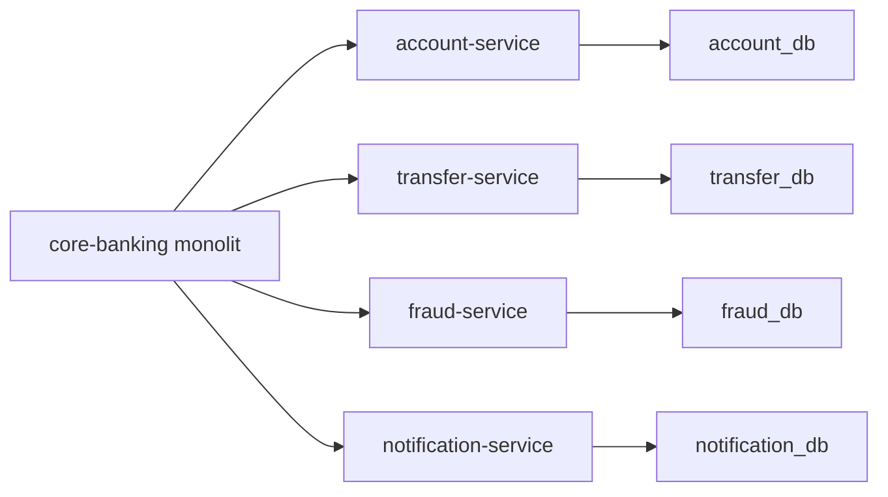
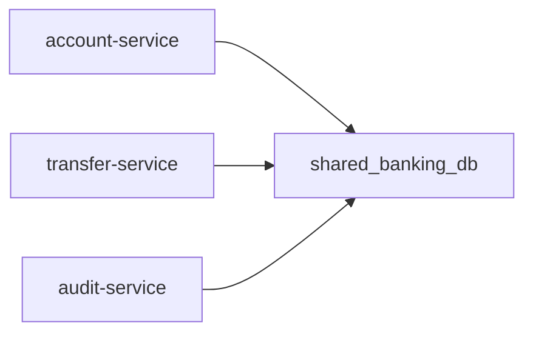
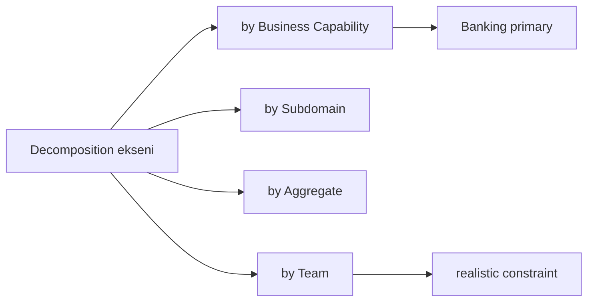
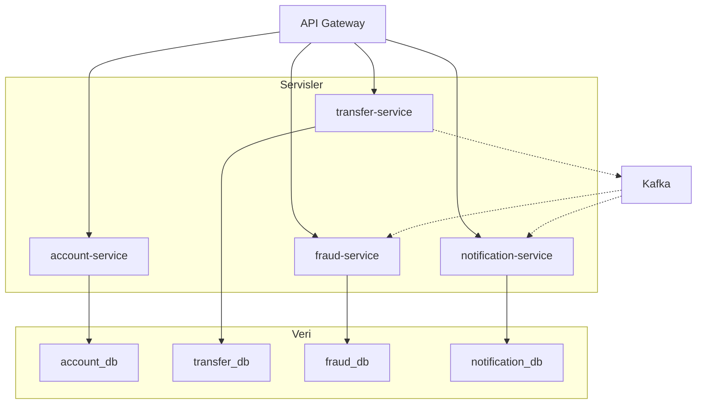

# Topic 7.2 — Service Decomposition

```admonish info title="Bu bölümde"
- Bir modülü "microservice olarak ayır" mı "monolit içinde birleşik tut" mu — 11 kriterli karar matrisi
- Banking 4-servis (account, transfer, fraud, notification) ayrımının **why**'ı: her servisin scaling, stability ve coupling gerekçesi
- Database per service prensibi, data sovereignty ve shared DB anti-pattern'inin neden banking'de yasak olduğu
- 10 servise bölüp hâlâ monolit acısı çekmek: distributed monolith tuzağı, belirtileri ve çıkış yolu
- Strangler Fig ile kademeli migration, shared library yönetimi ve aggregate'ı bölmeme kuralı
```

## Hedef

Monolit'i microservice'lere bölme **stratejilerini** öğrenmek. Hangi servisi ayır, hangisini birleştir kararını **gerekçeli** verebilmek. Banking 4-servis (account, transfer, fraud, notification) bölüşümünün **why**'ını anlamak. Database per service, shared library yönetimi ve distributed monolith anti-pattern'inden kaçınmayı kavramak.

## Süre

Okuma: 1.5 saat • Kendini Sına: 30 dk • Pratik (opsiyonel): 2-3 saat • Toplam: ~2.5 saat (+ pratik)

## Önbilgi

- Topic 7.1 (DDD Strategic) bitti — bounded context, ubiquitous language, context map
- Phase 1-6 boyunca `core-banking` monolit'i (`AccountController`, `TransferService`, vb.) yazıldı
- Phase 6 outbox + Kafka event'ler hazır (decomposition'a kritik altyapı)

---

## Kavramlar

### 1. Decomposition kararı — kriter matrisi

Monoliti neye göre böleceğin belirsizse her modülü tek tek "ayrılmayı hak ediyor mu?" diye sınamalısın. **Decomposition kararı** = bir feature/modülün ayrı bir microservice mi olacağı yoksa monolit içinde mi kalacağı sorusu. Cevabı hisle değil, kriter matrisiyle verirsin.

| Kriter | Microservice ayır | Birleşik tut |
|---|---|---|
| Ayrı team (Conway's Law) | ✓ | — |
| Ayrı release cycle | ✓ | — |
| Ayrı scalability needs | ✓ | — |
| Bağımsız deploy gerekli | ✓ | — |
| Yüksek coupling (sürekli birlikte değişir) | — | ✓ |
| Aynı transaction boundary | — | ✓ |
| Latency hassas (sync call) | — | ✓ |
| Farklı tech stack ihtiyacı | ✓ | — |
| Domain'in stabil çekirdek parçası | ? | bağımlı |
| External dependency (vendor) | ✓ (ACL) | — |
| Düşük volume + basit logic | — | ✓ |

Karar kuralı basit: 3+ "✓" → microservice; 3+ "Birleşik" → modüler monolit; karışıksa tartış ve **erkenden ayırma**.

```admonish tip title="Erken ayırmanın maliyeti"
Sınırların yanlış çizildiğini ancak domain oturunca anlarsın. Emin değilken monolit içinde modül olarak tut — modülü servise terfi ettirmek, iki servisi geri birleştirmekten çok daha ucuzdur.
```

### 2. Banking — neden 4 servis

Kriter matrisini `core-banking` monolitine uygulayınca 4 servis çıkar. Her birinin ayrılma gerekçesi farklı; ezberleme, **why**'ını kavra.

#### account-service

Sorumluluğu **Account aggregate** (open, close, balance, status), double-entry ledger (JournalEntry + JournalLine) ve balance reconciliation. Dışa REST `/accounts` CRUD, içe gRPC `debit` / `credit` / `getBalance` verir.

Neden ayrı:
- **Scaling pattern:** Read-heavy (10:1 read:write) — caching + replica ister
- **Stability:** Account domain çok stabil, nadiren değişir
- **Authority:** Bakiyenin tek kaynağı; her servis buraya referans verir
- **Performance critical:** Her transfer buraya çağrı yapacak → düşük latency şart

Tech: Spring Boot + Postgres, HikariCP optimized (Phase 2), internal gRPC, external REST.

#### transfer-service

Sorumluluğu **Transfer aggregate** orchestration'ı: Idempotency-Key handling, saga coordinator (cross-bank), account ve fraud servislerini çağırma, outbox event publish (Phase 6).

Neden ayrı:
- **Volatility:** Transfer logic sık değişir (yeni transfer tipleri, regulatory)
- **Saga state:** Stateful ve dedicated
- **Compute heavy:** Multi-step orchestration
- **Business critical:** Ayrı release & monitoring gerekir

Tech: Spring Boot + Postgres, saga orchestrator (Topic 6.7), Kafka producer (outbox).

#### fraud-service

Sorumluluğu fraud rule engine, Kafka Streams real-time scoring, transfer-service'ten sync `scoreTransfer(...)` çağrısı, async event-based scoring ve alert generation.

Neden ayrı:
- **Different scaling:** CPU-heavy rule evaluation
- **Different tech:** Kafka Streams stateful
- **ML potential:** Sonradan ML model eklenebilir, ayrı stack
- **Compliance:** Fraud team ayrı, ayrı release control

Tech: Spring Boot + Kafka Streams, read replica (account info), stateful state store (RocksDB).

#### notification-service

Sorumluluğu SMS/email/push gateway entegrasyonu, Kafka consumer notification queue, idempotent delivery, template management, retry + DLT.

Neden ayrı:
- **External dependency:** Birden çok SMS gateway sağlayıcısı
- **Independent failure:** SMS gateway down → diğer servisler etkilenmesin
- **High throughput:** Parallel consumer thread'ler
- **Simple domain:** Stateless processing

Tech: Spring Boot + Kafka consumer, ResilientExternalGateway (Topic 7.5).

### 3. Hangi feature'ları ayırma — banking örnek

Aynı matrisi 4 servisin ötesindeki modüllere uygulayınca bazıları servis, bazıları shared library ya da aggregate içi kalır. Karar netliği için iki listeye ayır.

Ayır:
- **Authentication** → auth-service ya da Keycloak (vendor, generic subdomain)
- **Audit** → audit-service (centralized regulatory)
- **Reporting** → reporting-service (read replica, CQRS)
- **Customer KYC** → customer-service (compliance ekibi)

Birleşik tut:
- **Money + Currency** value object'leri → shared library (`banking-commons`)
- **Account + JournalEntry + JournalLine** → account-service içinde (aggregate boundary)
- **TransferRequest + Transfer + IdempotencyKey** → transfer-service içinde

Tuzak: "her şey servis olsun" cazip gelir; oysa bir value object'i ya da aggregate'ı bölmek sadece complexity ekler, hiçbir bağımsızlık kazandırmaz.

### 4. Database per service

Servisleri böldün ama hâlâ tek DB'yi paylaşıyorlarsa hiçbir şey kazanmadın. **Database per service** = her servis kendi DB schema'sını sahiplenir, başka servis o schema'ya doğrudan dokunamaz.

```
account-service      → account_db       accounts, journal_entries, journal_lines
transfer-service     → transfer_db      transfers, saga_states, idempotency_keys, outbox_events
fraud-service        → fraud_db         fraud_rules, fraud_scores, fraud_alerts + Kafka Streams state
notification-service → notification_db  notification_log, processed_events
audit-service        → audit_db         audit_records (regulatory immutable)
```

Bu ayrım **data sovereignty** kazandırır — her servis kendi schema'sını bağımsız migrate ve evolve eder:



Faydaları dört başlıkta toplanır: her schema değişikliği sadece o servisi etkiler, bir DB down olunca sadece bir servis düşer (failure isolation), ve gerekirse polyglot persistence (fraud için Cassandra, audit için BigQuery) serbest kalır.

<mark>Her servis kendi DB'sini sahiplenir; başka bir servisin tablosuna doğrudan JOIN atmak yasaktır.</mark>

#### Cross-service data access

Peki bir servis başka servisin verisine ihtiyaç duyunca ne yapar? İki yol var.

Yöntem 1 — sync HTTP/gRPC call: veriyi anlık, network üzerinden iste.

```java
@Service
public class TransferService {
    @Autowired AccountServiceClient accountClient;

    public Transfer execute(TransferRequest req) {
        Account from = accountClient.getById(req.fromAccountId());   // network call
        // ...
    }
}
```

Trade-off: latency + failure cascade riski. Resilience4j (Topic 7.5) ile mitigate edilir.

Yöntem 2 — async event + local read model: veriyi event'le dinle, kendi DB'nde tut.

```java
// account-service publishes
kafka.send("banking.accounts.updated", accountUpdatedEvent);

// transfer-service consumer + own read model
@KafkaListener("banking.accounts.updated")
public void onAccountUpdated(AccountUpdatedEvent event) {
    accountReadModel.upsert(event);   // local DB
}
```

Trade-off: eventual consistency ve local read model bakım maliyeti. Banking pratiğinde seçim ihtiyaca göre: real-time critical (debit/credit) → sync gRPC + circuit breaker; reference data (account info gösterimi) → local read model; bulk/reporting → CQRS read replica.

### 5. Anti-pattern: Shared database

Database per service'in tam tersi, en yaygın hatadır: birden çok servis tek DB'yi paylaşır.



Sorun şu: bir schema değişikliği **tüm** servisleri etkiler, release cycle'lar birbirine kilitlenir, data sovereignty kaybolur ve elinde adı "microservice" olan bir distributed monolith kalır.

```admonish warning title="Shared DB banking için yasak"
Tek DB'yi paylaşan servisler bağımsız deploy edilemez — biri schema değiştirdiğinde diğerleri kırılır. Banking'de her servis kendi DB'sine sahiptir; veri paylaşımı sadece API veya event üzerinden yapılır, asla ortak tablo üzerinden.
```

### 6. Distributed monolith — büyük tuzak

3 yıl önce monolittin, bugün 10 servise böldün — ama hâlâ aynı acıyı çekiyorsan bir **distributed monolith** ürettin demektir. Bu, microservice'in avantajını (bağımsız deploy) vermeyen ama distributed sistemin tüm complexity'sini getiren en pahalı tuzaktır.

Belirtileri:
- Bir feature için 5+ servis aynı anda deploy
- Bir servisin fail'i diğer 9'unu düşürüyor
- Cross-service sync HTTP call zinciri (5+ hop)
- Shared library version mismatch hell
- Cross-service transaction (manuel orchestration veya 2PC)

Sebepleri genelde ya yanlış decomposition (yanlış sınırlar), ya sync HTTP'nin aşırı kullanımı, ya shared DB / shared mutable state, ya da zorla dayatılan versioned shared library'dir.

Çözüm: bounded context'leri yeniden çiz (DDD strategic), sync HTTP'yi async event'e taşı (Topic 6.6 outbox), resilience pattern uygula (Topic 7.5) ve API versioning + contract testing (Topic 12.5) ekle.

```admonish warning title="Servis sayısı başarı ölçütü değildir"
"10 microservice'imiz var" demek mühendislik zaferi değildir. Ölçüt bağımsız deploy edilebilirliktir: bir servisi tek başına deploy edip diğerlerini bozmuyorsan microservice'sin; edemiyorsan distributed monolith.
```

### 7. Shared library vs duplication

Money, Currency, AccountId gibi kavramlar her serviste geçer. Bunları paylaşmak (shared library) mı yoksa her serviste kopyalamak (duplication) mı? Yanlış karar ya drift ya version-lock acısı doğurur.

Yaklaşım A — **shared library**: ortak kod tek Maven module'de.

```
banking-commons (Maven module)
├── Money.java
├── Currency.java
├── AccountId.java
└── pom.xml (versioned)

account-service  → banking-commons:1.2.0
transfer-service → banking-commons:1.2.0
fraud-service    → banking-commons:1.2.0
```

Avantajı tek kaynak + type safety; dezavantajı version coordination — her upgrade tüm servisleri etkiler.

Yaklaşım B — **duplication**: her serviste kendi kopyası.

```
account-service/Money.java
transfer-service/Money.java   (kopya)
fraud-service/Money.java      (kopya)
```

Avantajı servislerin bağımsız evolve edebilmesi; dezavantajı drift riski ve bug fix'in N kez tekrarı.

Pragmatik banking kararı: stable value object'ler (Money, Currency) → shared library; domain entity'ler (Account, Transfer) → her servisin kendi tanımı (DDD bounded context); DTO/event format → published language (Avro schema registry).

<mark>banking-commons minimal kalır: sadece truly stable value object'ler girer, domain logic asla.</mark>

### 8. Cross-service contract

İki servis konuşuyorsa aralarında bir **contract** vardır — bir tarafın değişikliği diğerini kırmamalıdır. Contract'ın üç tipi banking'de üç farklı yerde kullanılır.

REST OpenAPI spec — public sync API için, generated client + server stub üretir:

```yaml
openapi: 3.0.0
info: { title: Account Service }
paths:
  /accounts/{id}:
    get:
      responses:
        "200":
          content:
            application/json:
              schema: { $ref: "#/components/schemas/Account" }
```

gRPC .proto — internal sync call için, type-safe code generation:

```protobuf
syntax = "proto3";
service AccountService {
  rpc GetById (GetAccountRequest) returns (Account);
  rpc Debit (DebitRequest) returns (DebitResponse);
}
```

Avro/Protobuf event schema — async event için, Schema Registry (Phase 6) producer/consumer compatibility'yi denetler:

```json
{
  "type": "record",
  "name": "TransferCompleted",
  "fields": []
}
```

Banking pratiği net: internal sync → gRPC, public sync → REST OpenAPI, async event → Avro + Schema Registry.

### 9. Contract testing

Contract'ı yazmak yetmez; provider değişikliğinin consumer'ı kırmadığını **garanti** etmen gerekir. Contract testing bunu CI'da yapar: Spring Cloud Contract veya Pact ile (Phase 12 Topic 5) provider değişikliği önce test gate'inden geçer. Provider consumer'ı sessizce kıramaz.

### 10. Decomposition strategies

Monoliti hangi eksende böleceğin dört stratejiden birine dayanır; banking pratiği bunları harmanlar.



**Strategy 1 — by Business Capability:** İş yetkinliği ekseninde böl (account management, transfer, card, loan, KYC, audit, fraud, notification). En yaygın strateji ve DDD bounded context ile birebir uyumlu.

**Strategy 2 — by Subdomain:** Eric Evans DDD ekseni. Core subdomain (lending algorithms, fraud detection) → own implementation; supporting (customer mgmt, KYC) → kendi yapımı veya partial vendor; generic (auth, logging) → vendor (Auth0, Datadog).

**Strategy 3 — by Aggregate:** Her aggregate ayrı servis (1:1). Aşırı granular — micro-microservice'ler, operational nightmare. Kaçın.

**Strategy 4 — by Team:** Conway's Law — sistem organizasyon yapısını yansıtır, team başına servis. Banking'de realistic constraint; team size 5-9 (two-pizza rule).

Pragmatik karar: **business capability primary**, team constraint realistic düzeltici olarak devreye girer.

### 11. Strangler Fig pattern — kademeli migration

Banking'de monolitten "big bang" rewrite regulatory ve business continuity nedeniyle imkânsızdır. **Strangler Fig** = eski sistemi bir gecede değil, yeni servisleri etrafına sararak kademeli boğma pattern'i.

```
Phase 0: Monolit (legacy core banking)
Phase 1: API Gateway koy, traffic monolit'e route
         + Yeni feature → microservice, Gateway route
Phase 2: Eski feature'ları kademeli migrate — read-only first (CQRS-like),
         sonra write path, sonra monolitte o özelliği decommission
Phase 3: Monolit küçülür, sonunda tamamen decommission
```

Gerçek bir banking timeline'ı:

```
2020: Legacy core banking (COBOL on mainframe)
2022: API Gateway. Yeni mobile API → microservice, eski branch terminal → legacy
2024: Account read → microservice. Account write → hâlâ legacy
2025: Transfer microservice. Legacy decommission hedefi 2027
```

<mark>Banking'de big-bang rewrite yasaktır; Strangler Fig regulatory tarafından fiilen zorunlu kılınır.</mark>

### 12. Service boundaries — neyi birleşik tut

Microservice bir yarış değil; bazı şeyler bölünürse zarar görür. En kritik kural aggregate consistency boundary'sidir: **Account + JournalEntry + JournalLine tek aggregate'tir**, aynı DB ve aynı transaction'da kalmalıdır.

```java
@Transactional
public Transfer execute(...) {
    Account from = accountRepo.findByIdAndLock(...);
    Account to   = accountRepo.findByIdAndLock(...);

    journalEntryRepo.save(new JournalEntry(...));
    journalLineRepo.save(new JournalLine(from, DEBIT, amount));
    journalLineRepo.save(new JournalLine(to, CREDIT, amount));
    accountRepo.save(from);
    accountRepo.save(to);
}
```

Bunu iki servise (`account-service` + `journal-service`) bölersen tek transaction'ı distributed transaction'a çevirirsin — saga, 2PC, tutarlılık acısı. İkinci kural coupling'dir: iki modül her PR'da birlikte değişiyorsa aslında **aynı domain**'dir, birleşik tut.

<mark>Aggregate consistency boundary'sini iki servise bölme — atomik double-entry'yi distributed transaction'a düşürürsün.</mark>

### 13. Service granularity — sweet spot

Servis boyutunda iki uç da tehlikelidir. Çok büyük (monolit) tüm sorunları taşır, hiçbir avantaj vermez. Çok küçük (**nano-service**) operational nightmare doğurur: 100 servis = 100 K8s deployment, 100 CI pipeline, 100 monitoring config.

Banking için sweet spot:
- 4-12 service
- Her servis 5-9 developer kapsamında (two-pizza)
- Her servis 1-2 aggregate
- Her servis bağımsız deploy edilebilir ve kendi DB'sine sahip

```admonish tip title="Doğru boyutu sınama"
Bir servisi "tek başına anlamlı bir iş yapıyor mu ve tek team sahiplenebiliyor mu?" diye sorgula. `user-name-service` + `user-email-service` + `user-phone-service` üçü tek `customer-service` olmalıdır — attribute başına servis nano-service anti-pattern'idir.
```

### 14. Banking örnek — full decomposition map

Her şeyi bir araya koyunca resim şudur: API Gateway trafiği 4 servise dağıtır, her servis kendi DB'sine sahiptir, servisler arası async akış Kafka üzerinden gider.



Kenarda external bileşenler durur: Keycloak (OAuth2/OIDC), Schema Registry, gözlemlenebilirlik (Prometheus + Grafana + Jaeger) ve outbox CDC için Kafka Connect + Debezium.

### 15. Banking anti-pattern'leri

"Bu tasarımda ne yanlış?" sorusunun cephaneliği burasıdır. Yedi klasik:

**Anti-pattern 1 — Shared DB across services:** Ortak DB coupling ve deploy interdependence doğurur. Yasak (Bölüm 5).

**Anti-pattern 2 — Sync HTTP chain (3+ hop):** `Gateway → transfer → account → fraud → KKB` gibi 5 sync call zinciri; bir tanesi fail → tümü fail, round-trip × N. Çözüm: bazı çağrıları async event'e çevir, local read model kullan.

**Anti-pattern 3 — Distributed monolith:** 10 servis ama hepsi aynı release cycle'da, sync HTTP heavy, shared library lock. Microservice avantajı yok, complexity var (Bölüm 6).

**Anti-pattern 4 — Nano-service:** `user-name-service`, `user-email-service`, `user-phone-service` gibi attribute başına servis. Çözüm: tek `customer-service`.

**Anti-pattern 5 — Big-bang decomposition:** Bir gecede monolitten 10 servise. Banking için yasak; Strangler Fig zorunlu (Bölüm 11).

**Anti-pattern 6 — Tek developer'ın 5 servisi:** Conway's Law'a aykırı. Servis sınırları team sınırını yansıtmalı.

**Anti-pattern 7 — DB in service container:** Postgres'i uygulama container'ının içine koymak servisi stateful yapar, scale imkânsızlaşır. DB ayrı managed olmalı (RDS, Cloud SQL).

---

## Önemli olabilecek araştırma kaynakları

- "Microservices Patterns" (Chris Richardson) — Chapter 2 (Decomposition)
- "Building Microservices" (Sam Newman, 2nd Ed)
- "Monolith to Microservices" (Sam Newman) — Strangler Fig detayları
- Martin Fowler — microservices makaleleri
- Eric Evans DDD blue book — strategic design bölümü
- Vaughn Vernon — Strategic DDD
- Netflix tech blog — decomposition hikâyeleri

---

## Kendini Sına

Aşağıdaki soruları önce **cevaba bakmadan** kendi cümlelerinle yanıtlamayı dene — hepsi TR bank mülakatlarında karşına çıkabilecek tarzda. Takıldığın soru olursa ilgili Kavramlar başlığına dön, sonra tekrar dene.

**S1. Distributed monolith nedir, belirtileri neler ve nasıl kaçınırsın?**

<details>
<summary>Cevabı göster</summary>

Distributed monolith, monoliti servislere böldüğün halde bağımsız deploy edilebilirlik kazanamadığın durumdur — microservice'in avantajını vermez ama distributed sistemin tüm complexity'sini getirir. Belirtileri: bir feature için 5+ servisin aynı anda deploy edilmesi, bir servisin fail'inin diğerlerini düşürmesi, 5+ hop'luk sync HTTP zincirleri, shared library version mismatch ve cross-service transaction.

Sebepleri yanlış decomposition (yanlış sınırlar), aşırı sync HTTP, shared DB/shared state ve dayatılan versioned shared library'dir. Kaçınmak için bounded context'leri DDD ile yeniden çiz, sync HTTP'yi async event'e (outbox) taşı, resilience pattern ekle ve API versioning + contract testing uygula. Ölçüt tektir: bir servisi diğerlerini bozmadan tek başına deploy edebiliyor musun?

</details>

**S2. Her microservice neden kendi DB'sine sahip olmalı? Shared DB'nin sakıncası ne?**

<details>
<summary>Cevabı göster</summary>

Database per service, her servisin kendi schema'sını sahiplenmesi ve başka servisin oraya doğrudan dokunamamasıdır. Bu data sovereignty kazandırır: her servis kendi schema'sını bağımsız migrate ve evolve eder, bir schema değişikliği sadece o servisi etkiler, bir DB down olunca sadece bir servis düşer (failure isolation) ve gerekirse polyglot persistence serbesttir.

Shared DB'nin sakıncası şu: tek schema'yı paylaşan servisler bağımsız deploy edilemez — biri tabloyu değiştirince diğerleri kırılır, release cycle'lar birbirine kilitlenir ve elinde bir distributed monolith kalır. Bu yüzden banking'de shared DB yasaktır; veri paylaşımı sadece API veya event üzerinden yapılır, asla ortak tablo üzerinden.

</details>

**S3. Monolitten microservice'e geçerken neyi MUTLAKA bölmemelisin?**

<details>
<summary>Cevabı göster</summary>

Aggregate consistency boundary'sini bölmemelisin. Banking'de Account + JournalEntry + JournalLine tek bir aggregate'tir ve double-entry invariant'ı (toplam debit = toplam credit) tek bir atomik transaction'da korunmalıdır. Bunu `account-service` + `journal-service` diye bölersen tek `@Transactional`'ı distributed transaction'a çevirirsin — saga, 2PC ve tutarlılık acısı başlar.

İkinci olarak sürekli birlikte değişen modülleri bölmemelisin: iki modül her PR'da birlikte değişiyorsa aslında aynı domain'dir, yüksek coupling vardır, birleşik tutulmalıdır. Genel kural: aynı transaction boundary'sini, aynı aggregate'ı ve latency-hassas sync bağımlılığı olan parçaları birleşik tut.

</details>

**S4. Banking'de account, transfer, fraud ve notification neden ayrı servis? Her birinin gerekçesi ne?**

<details>
<summary>Cevabı göster</summary>

account-service ayrıdır çünkü read-heavy (10:1) scaling ister, domain çok stabildir ve bakiyenin tek authority'sidir — her transfer buraya düşük latency'yle çağrı yapar. transfer-service ayrıdır çünkü logic sık değişir (volatility), stateful saga tutar, compute-heavy orchestration yapar ve ayrı release/monitoring ister.

fraud-service ayrıdır çünkü CPU-heavy rule evaluation farklı scaling ister, Kafka Streams stateful farklı bir stack'tir, sonradan ML modeli eklenebilir ve compliance ekibi ayrı release control ister. notification-service ayrıdır çünkü external SMS gateway bağımlılığı vardır, o gateway down olunca diğer servisleri etkilememesi gerekir (independent failure), high-throughput parallel processing yapar ve domain'i basit/stateless'tir.

</details>

**S5. Bir servis başka servisin verisine ihtiyaç duyunca hangi stratejileri kullanırsın, ne zaman hangisi?**

<details>
<summary>Cevabı göster</summary>

Üç strateji var. Sync HTTP/gRPC call anlık veriyi network üzerinden ister; latency ve failure cascade riski taşır, circuit breaker (Resilience4j) ile mitigate edilir. Async event + local read model, veriyi Kafka event'iyle dinleyip kendi DB'nde tutar; eventual consistency ve read model bakım maliyeti getirir. CQRS read replica, bulk ve reporting için ayrı bir okuma modeli sunar.

Banking'de seçim ihtiyaca göredir: real-time critical işler (debit/credit) → sync gRPC + circuit breaker; reference data gösterimi (account info) → async event + local read model; bulk/reporting → CQRS read replica. Kural: para hareketi kadar kritik olmayan referans veriyi sync çağrıyla çekme, event'le lokal tut.

</details>

**S6. Strangler Fig pattern nedir ve banking'de neden zorunludur?**

<details>
<summary>Cevabı göster</summary>

Strangler Fig, monoliti bir gecede yeniden yazmak yerine yeni servisleri etrafına sararak kademeli boğma pattern'idir. Önce API Gateway konur ve trafik monolite route edilir; yeni feature'lar microservice olarak yazılır; eski feature'lar kademeli migrate edilir (önce read-only/CQRS-like, sonra write path); her migrate edilen özellik monolitten decommission edilir; monolit küçülüp sonunda tamamen kaldırılır.

Banking'de zorunludur çünkü big-bang rewrite regulatory ve business continuity ile çelişir — canlı para sisteminde bir gecede geçiş yapıp riski göze alamazsın. Regulatory parallel-run, rollback ve kademeli geçiş ister; bu da fiilen Strangler Fig demektir. Tipik timeline yıllara yayılır (ör. 2020 legacy, 2022 gateway, 2025 transfer servisi, 2027 legacy decommission).

</details>

**S7. Shared library (banking-commons) yönetiminde neyi paylaşır, neyi paylaşmazsın?**

<details>
<summary>Cevabı göster</summary>

Sadece truly stable value object'leri paylaşırsın: Money, Currency, AccountId gibi nadiren değişen, domain logic içermeyen tipler `banking-commons` module'üne girer. Bu tek kaynak + type safety verir, kopya drift'ini önler. banking-commons'ı minimal tutmak kritiktir — içine domain logic girerse her upgrade tüm servisleri version-lock'a sokar ve distributed monolith'e katkı yapar.

Paylaşmadıkların: domain entity'leri (Account, Transfer) her servisin kendi bounded context'inde ayrı tanımlanır — aynı isim farklı serviste farklı anlam taşıyabilir. DTO/event formatları shared library yerine published language olarak Avro schema registry ile yönetilir. Alternatif duplication yaklaşımı servisleri bağımsız evolve ettirir ama bug fix'i N kez tekrarlatır; bu yüzden sadece stable value object'lerde shared library, gerisinde ayrık tanım tercih edilir.

</details>

**S8. Nano-service anti-pattern'i nedir ve service granularity sweet spot'u nerede?**

<details>
<summary>Cevabı göster</summary>

Nano-service, servisleri gereğinden aşırı küçük parçalamaktır — örneğin `user-name-service`, `user-email-service`, `user-phone-service` gibi attribute başına servis. Sonuç operational nightmare'dir: 100 servis = 100 K8s deployment, 100 CI pipeline, 100 monitoring config; hiçbir servis tek başına anlamlı bir iş yapmaz. Çözüm bunları tek `customer-service`'te toplamaktır.

Sweet spot banking için 4-12 servistir: her servis 5-9 developer kapsamında (two-pizza rule), 1-2 aggregate içerir, bağımsız deploy edilebilir ve kendi DB'sine sahiptir. Doğru boyutu sınamak için sor: bu servis tek başına anlamlı bir iş yapıyor mu ve tek bir team sahiplenebiliyor mu? İki uç da (monolit ve nano-service) kaçınılmalıdır.

</details>

---

## Tamamlama kriterleri

- [ ] Decomposition kriter matrisini kullanarak bir modülün "ayır vs birleşik tut" kararını gerekçelendirebiliyorum
- [ ] Banking 4-servis ayrımının her birinin rasyonelini (scaling, stability, coupling) söyleyebiliyorum
- [ ] Database per service'in 4 avantajını ve shared DB'nin neden yasak olduğunu açıklayabiliyorum
- [ ] Cross-service data access 3 stratejisini (sync gRPC, async event, CQRS) ne zaman seçeceğimi biliyorum
- [ ] Distributed monolith'in belirtilerini ve çözümünü sayabiliyorum
- [ ] Strangler Fig'in neden banking için zorunlu olduğunu anlatabiliyorum
- [ ] Aggregate consistency boundary'sinin (account + journal) neden bölünmemesi gerektiğini açıklayabiliyorum
- [ ] Nano-service anti-pattern'ini ve service granularity sweet spot'unu tanımlayabiliyorum
- [ ] (Opsiyonel) "Pratik yapmak istersen" bölümündeki ArchUnit testlerini yazdım ve Claude-verify prompt'uyla doğrulattım

---

## Defter notları

1. "Service ayır vs birleşik tut karar matrisi (11 kriter): ____."
2. "Banking 4-servis (account/transfer/fraud/notification) ayrım rasyoneli + her birinin scaling pattern: ____."
3. "Database per service prensibinin 4 avantajı: ____."
4. "Cross-service data access stratejileri (sync gRPC, async event, CQRS) ne zaman hangisi: ____."
5. "Distributed monolith belirtileri ve çözümü: ____."
6. "Strangler Fig pattern banking regulatory için neden zorunlu: ____."
7. "Shared library yönetimi — minimal scope kararı (ne paylaşılır, ne paylaşılmaz): ____."
8. "Decomposition strategy (capability vs subdomain vs aggregate vs team) banking için seçim: ____."
9. "Nano-service vs right-sized service operational cost: ____."
10. "Aggregate consistency boundary neden bölünmez (account + journal): ____."

```admonish success title="Bölüm Özeti"
- Decomposition kararı hisle değil kriter matrisiyle verilir: ayrı team/release/scaling/deploy → ayır; aynı transaction/aggregate + yüksek coupling → birleşik tut
- Banking 4 servise bölünür (account, transfer, fraud, notification) ve her birinin gerekçesi farklıdır — scaling, stability, volatility, compliance ekseninde
- Database per service şarttır: her servis kendi schema'sını sahiplenir, data sovereignty + failure isolation kazanır; shared DB banking'de yasaktır
- Distributed monolith en pahalı tuzaktır — 10 servis ama bağımsız deploy edilemiyorsa microservice değil; çözüm doğru sınır + async event
- Aggregate consistency boundary (account + journal) bölünmez; big-bang rewrite yerine Strangler Fig kademeli migration zorunludur
- banking-commons minimal kalır (sadece stable value object), granularity sweet spot 4-12 servistir; nano-service operational nightmare doğurur
```

---

## Pratik yapmak istersen

Bu topic çoğunlukla **architecture decision** olduğundan pratiği de tasarım denetimi üzerine kuruludur. Aşağıdaki iki ek hazır: test yazma rehberi decomposition kararlarını ArchUnit ile koda döker (cross-service dependency ve cycle detection), Claude-verify prompt'u ise tasarladığın decomposition'ı banking-grade perspektiften denetletir.

<details>
<summary>Test yazma rehberi</summary>

Decomposition kararları koda dökülünce sınanabilir hale gelir. ArchUnit (Topic 12.4) ile servis sınırlarını CI'da zorlarsın: bir servis izinsiz başka servise bağımlı hale gelirse test kırılır.

```java
@AnalyzeClasses(packages = "com.mavibank.banking")
public class ServiceDecompositionTest {

    @ArchTest
    static final ArchRule modules_should_be_independent =
        slices().matching("com.mavibank.banking.(*)..")
            .should().notDependOnEachOther()
            .ignoreDependency(...)
            .check(classes);

    @ArchTest
    static final ArchRule no_cycles_between_services =
        slices().matching("com.mavibank.banking.(*)..")
            .should().beFreeOfCycles();

    @ArchTest
    static final ArchRule account_service_should_not_depend_on_transfer =
        noClasses().that().resideInAPackage("..account..")
            .should().dependOnClassesThat().resideInAPackage("..transfer..");
}
```

CI'da bu testlerden biri fail ederse cross-service dependency istemsiz sızmış demektir.

> Tamamlanma ölçütü: `slices().notDependOnEachOther()` yeşil (servisler birbirine sızmıyor), `beFreeOfCycles()` yeşil (döngü yok) ve en az bir yönlü kural (ör. account → transfer'e bağımlı olmasın) yazılmış olmalı. Bonus: shared DB'ye erişimi de bir ArchUnit kuralıyla engelle — bir servis başka servisin repository package'ına bağımlı olmamalı.

</details>

<details>
<summary>Claude-verify prompt</summary>

```
Microservice decomposition tasarımımı banking-grade kriterlere göre değerlendir.
Eksikleri işaretle, kod yazma:

1. Servis ayrımı:
   - Business capability ekseninde mi?
   - Her servis bir bounded context'i implement ediyor mu?
   - Aggregate'lar service içinde mi (split yok)?

2. Database per service:
   - Her servisin kendi schema'sı (veya DB) mı?
   - Shared DB anti-pattern yok mu?
   - Servis başka servisin tablosuna doğrudan erişiyor mu (olmamalı)?

3. Shared library:
   - banking-commons minimal (sadece stable value object)?
   - Domain logic shared library'de YOK?
   - Version management strategy var mı?

4. Cross-service communication:
   - Real-time critical için sync gRPC + circuit breaker?
   - Reference data için async event + read model?
   - Reporting için CQRS?

5. Strangler fig:
   - Big-bang migration anti-pattern'inden kaçınılmış mı?
   - Sprint-by-sprint / parallel-run plan var mı?

6. Anti-pattern detection:
   - Distributed monolith risk değerlendirmesi yapıldı mı?
   - Sync HTTP chain 3+ hop var mı?
   - Nano-service yok mu (her servis substantial)?

7. Service granularity:
   - 4-12 service sweet spot içinde mi?
   - Her servis 1-2 aggregate?

8. Conway's Law:
   - Team yapısı servis sınırlarını yansıtıyor mu?
   - Team size 5-9 (two-pizza)?

9. ArchUnit:
   - Cross-service dependency test'leri yazılmış mı?
   - Cycle detection var mı?

10. Banking-specific:
    - Account aggregate consistency boundary (account + journal) korunmuş mu?
    - Audit centralized (regulatory)?
    - Fraud isolated (compliance team)?

Her madde için PASS / FAIL / EKSIK işaretle, kanıt göster, kod yazma.
```

</details>
