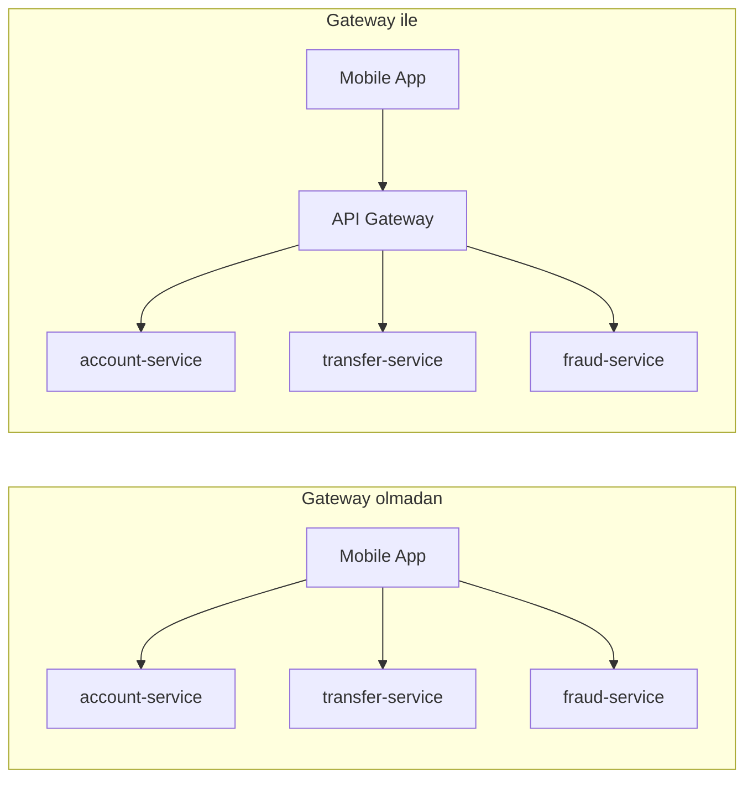
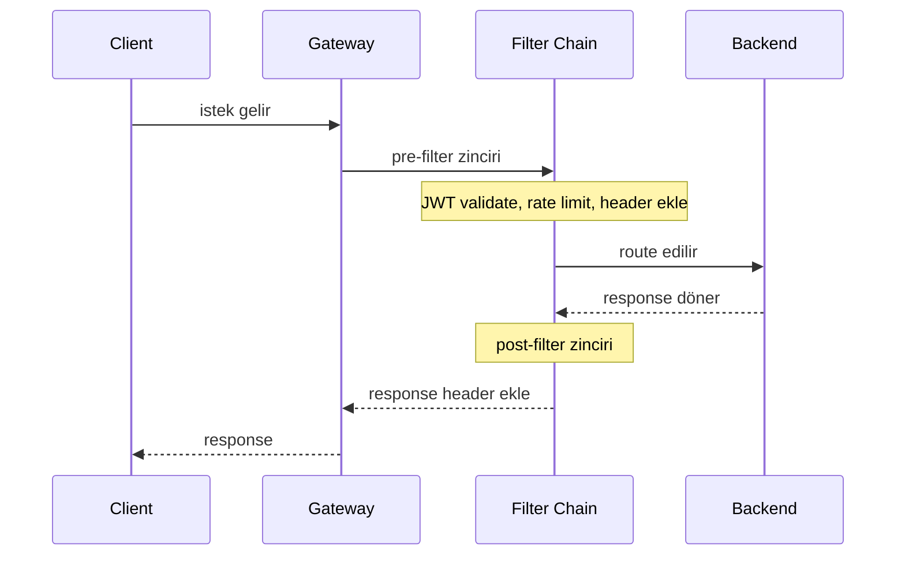
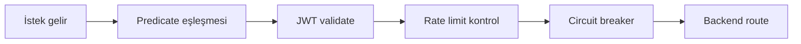

# Topic 7.3 — API Gateway: Spring Cloud Gateway

```admonish info title="Bu bölümde"
- API Gateway pattern: tek entry point, cross-cutting concern soyutlaması ve neden banking'de zorunlu olduğu
- Spring Cloud Gateway'in reactive (Netty) mimarisi ve route tanımı — predicate + filter ayrımı
- JWT authentication filter, Redis-backed rate limiting ve header propagation'ın gateway'de nasıl kurulduğu
- Circuit breaker, retry ve banking'e özel `IdempotencyKeyFilter` ile dayanıklılık
- TR bank mülakatının klasiği: auth gateway'de mi backend'de mi, gateway'in sorumluluk sınırı nerede
```

## Hedef

API Gateway pattern'ini Spring Cloud Gateway ile production-grade implement etmek. Routing, predicates, filters, JWT validation, Redis rate limiting, circuit breaker, retry, header propagation, observability. Banking için **tek entry point** + **cross-cutting concern** soyutlama.

## Süre

Okuma: 2 saat • Kendini Sına: 45 dk • Pratik (opsiyonel): 3-4 saat • Toplam: ~2.5 saat (+ pratik)

## Önbilgi

- Topic 7.1-7.2 bitti (DDD, decomposition)
- Phase 8'in JWT/OAuth2 conceptlerine genel aşinalık (detay Phase 8'de)
- Reactive programming basic (Mono, Flux)

---

## Kavramlar

### 1. API Gateway pattern — neden

Mobil uygulaman account, transfer, fraud ve notification servislerini ayrı ayrı mı çağırsın? Gateway olmadan cevap "evet"tir ve her client tüm servislerin URL'ini, auth'unu, rate limit'ini tek tek bilmek zorunda kalır.



**Gateway olmadan** her client her servisin adresini bilir (tight coupling); auth, rate limit, CORS ve versioning her serviste ayrı ayrı implement edilir. Bir servis taşındığında tüm client'lar kırılır.

**API Gateway** ise tek giriş noktasıdır: cross-cutting concern'leri (auth, rate limit, logging, CORS) tek yerde toplar, internal endpoint'leri gizler (service hiding), versioning + routing yapar ve backend'in serbestçe evrilmesine izin verir.

<mark>Gateway sadece cross-cutting concern içindir; business logic her zaman backend'de kalır.</mark>

Banking'de pratikte zorunludur — TR bankalarındaki "Open Banking" API'leri gateway üzerinden dışa açılır.

### 2. Spring Cloud Gateway vs alternatives

Piyasada birden fazla gateway var; hangisini seçtiğin ekosistemine bağlıdır.

| Gateway | Banking Adoption | Tech |
|---|---|---|
| **Spring Cloud Gateway** | ✓ Yüksek (Spring ekosistemde) | Java, Netty reactive |
| Kong | OK | Lua + Nginx |
| AWS API Gateway | Cloud-native | Managed |
| Apigee | Enterprise | Google managed |
| Zuul (Netflix) | Deprecated | Eski Spring projeleri |

Bu kursta **Spring Cloud Gateway** — Spring Boot + Java + reactive (Project Reactor). Zaten Spring stack kullanıyorsan aynı dil, aynı test araçları, aynı config.

### 3. Setup

Gateway'i ayağa kaldırmak iki starter bağımlılığı ile başlar:

```xml
<dependency>
    <groupId>org.springframework.cloud</groupId>
    <artifactId>spring-cloud-starter-gateway</artifactId>
</dependency>
<dependency>
    <groupId>org.springframework.cloud</groupId>
    <artifactId>spring-cloud-starter-loadbalancer</artifactId>
</dependency>
```

Standalone bir Spring Boot application yeterli:

```java
@SpringBootApplication
public class ApiGatewayApplication {
    public static void main(String[] args) {
        SpringApplication.run(ApiGatewayApplication.class, args);
    }
}
```

```admonish warning title="Reactive stack — servlet ile karıştırma"
Spring Cloud Gateway **reactive** stack (Netty) üzerinde çalışır ve Spring Web Servlet (Tomcat) ile **uyumsuzdur**. Gateway'i her zaman ayrı, standalone bir Spring Boot application olarak tut; aynı module'e `spring-boot-starter-web` eklersen context ayağa kalkmaz.
```

### 4. Route definition — YAML

Bir isteğin hangi servise gideceğini **route** tanımlar. En basit route bir path eşleşince backend'e yönlendirir:

```yaml
spring:
  cloud:
    gateway:
      routes:
        - id: account-service
          uri: lb://account-service
          predicates:
            - Path=/v1/accounts/**
          filters:
            - name: StripPrefix
              args:
                parts: 0
```

Transfer route'u method kısıtı ekler ve path'i backend'in beklediği forma yeniden yazar (`RewritePath`):

```yaml
        - id: transfer-service
          uri: lb://transfer-service
          predicates:
            - Path=/v1/transfers/**
            - Method=POST,GET
          filters:
            - name: RewritePath
              args:
                regexp: /v1/transfers/(?<segment>.*)
                replacement: /transfers/${segment}
```

Internal route'lar ise header ile korunur — sadece `X-Internal-Token` taşıyan istekler eşleşir:

```yaml
        - id: fraud-service-internal
          uri: lb://fraud-service
          predicates:
            - Path=/internal/v1/fraud/**
            - Header=X-Internal-Token, .*
```

**Anahtar kavramlar:**

- **`id`:** Unique route identifier
- **`uri`:** Backend destination. `lb://` prefix → Spring Cloud LoadBalancer (service discovery)
- **`predicates`:** Match conditions (Path, Method, Header, Query, Cookie, Host)
- **`filters`:** Request/response transformation

### 5. Predicates — match conditions

**Predicate** bir route'un ne zaman eşleşeceğini belirleyen koşuldur; bir route'ta birden fazlası AND ile birleşir.

```yaml
predicates:
  - Path=/v1/accounts/**
  - Method=GET,POST
  - Header=Authorization, Bearer.*
  - Query=tenant
  - Cookie=session, .*
  - Host=api.banking.com
  - After=2024-01-01T00:00:00+03:00[Europe/Istanbul]
  - Before=2025-12-31T23:59:59+03:00[Europe/Istanbul]
  - Between=2024-06-01T00:00:00+03:00[Europe/Istanbul],2024-09-01T00:00:00+03:00[Europe/Istanbul]
  - RemoteAddr=192.168.1.0/24
  - Weight=group-a, 80
```

Banking örnekleri:
- **Production traffic:** `Host=api.banking.com`
- **Internal traffic:** `Path=/internal/**` + `Header=X-Internal-Token`
- **Beta features:** `Header=X-Feature-Flag, beta` (canary)

### 6. Filters — request/response transformation

**Filter** eşleşen isteği backend'e göndermeden önce (pre) veya response dönerken (post) dönüştürür. İstek gateway'e girer, pre-filter zincirinden geçer, route edilir, sonra post-filter zincirinden geçip client'a döner:



Hazır filter'lar YAML ile deklaratif tanımlanır:

```yaml
filters:
  - AddRequestHeader=X-Gateway-Route, account
  - AddResponseHeader=X-Response-Time, "${nanosTime}"
  - StripPrefix=1
  - RewritePath=/v1/(?<segment>.*), /$\{segment}
  - SetRequestHeader=X-Tenant-Id, default
  - PreserveHostHeader
  - RemoveRequestHeader=X-Internal-Debug
  - RemoveResponseHeader=Server
```

Karmaşık mantık için (JWT validate, idempotency kontrolü) custom filter'lar Java DSL ile daha güçlüdür.

### 7. Java DSL alternative

YAML deklaratif ama kısıtlı; custom filter'ları zincirlemek istediğinde Java DSL programatik esneklik verir. account route'u JWT + rate limiter + circuit breaker filter'larını fluent API ile bağlar:

```java
@Configuration
public class RoutesConfig {
    
    @Bean
    public RouteLocator routes(RouteLocatorBuilder builder) {
        return builder.routes()
            .route("account-service", r -> r
                .path("/v1/accounts/**")
                .filters(f -> f
                    .filter(new JwtAuthenticationFilter())
                    .requestRateLimiter(c -> c
                        .setRateLimiter(redisRateLimiter())
                        .setKeyResolver(userKeyResolver()))
                    .circuitBreaker(c -> c
                        .setName("accountServiceCB")
                        .setFallbackUri("forward:/fallback/account")))
                .uri("lb://account-service"))
            // ...
```

Transfer route'u ek olarak banking-specific `IdempotencyKeyFilter` ekler; public route ise sadece `stripPrefix(1)` uygular. Tam kod aşağıda:

<details>
<summary>Tam kod: RoutesConfig Java DSL (~38 satır)</summary>

```java
@Configuration
public class RoutesConfig {
    
    @Bean
    public RouteLocator routes(RouteLocatorBuilder builder) {
        return builder.routes()
            .route("account-service", r -> r
                .path("/v1/accounts/**")
                .filters(f -> f
                    .filter(new JwtAuthenticationFilter())
                    .requestRateLimiter(c -> c
                        .setRateLimiter(redisRateLimiter())
                        .setKeyResolver(userKeyResolver()))
                    .circuitBreaker(c -> c
                        .setName("accountServiceCB")
                        .setFallbackUri("forward:/fallback/account")))
                .uri("lb://account-service"))
            
            .route("transfer-service", r -> r
                .path("/v1/transfers/**")
                .and().header("Authorization", "Bearer.*")
                .filters(f -> f
                    .filter(new IdempotencyKeyFilter())   // banking-specific
                    .filter(new JwtAuthenticationFilter())
                    .requestRateLimiter(c -> c
                        .setRateLimiter(strictRedisRateLimiter())
                        .setKeyResolver(userKeyResolver())))
                .uri("lb://transfer-service"))
            
            .route("public-info", r -> r
                .path("/v1/public/**")
                .filters(f -> f.stripPrefix(1))
                .uri("lb://public-info-service"))
            
            .build();
    }
}
```

</details>

```admonish tip title="YAML mı Java DSL mi"
Basit routing için YAML oku-yaz kolaylığı verir; feature-flag, custom filter zinciri veya koşullu route mantığı gerektiğinde Java DSL'e geç. İkisini karıştırabilirsin — hazır route'lar YAML'da, karmaşık olanlar DSL'de.
```

### 8. Load balancing

`uri: lb://account-service` yazınca gateway Spring Cloud LoadBalancer'ı devreye alır; `lb://` prefix'i "bu bir servis adı, discovery'den çöz" demektir.

```yaml
spring:
  cloud:
    loadbalancer:
      cache:
        enabled: true
        ttl: 5s
      health-check:
        interval: 10s
```

Service discovery'den (Topic 7.4) instance listesi alır ve round-robin (veya custom strategy) ile dağıtır. Cache açık tutmak her istekte discovery sorgusunu engeller.

### 9. JWT Authentication Filter

Her isteği kim yapıyor? Gateway her protected route'ta JWT'yi doğrular ve doğrulanmış kimliği downstream'e taşır. `AbstractGatewayFilterFactory` extend eden custom filter, validator'ı constructor'dan alır:

```java
@Component
public class JwtAuthenticationFilter extends AbstractGatewayFilterFactory<JwtAuthenticationFilter.Config> {
    
    private final JwtValidator jwtValidator;
    
    public JwtAuthenticationFilter(JwtValidator jwtValidator) {
        super(Config.class);
        this.jwtValidator = jwtValidator;
    }
```

`apply` içinde önce `Authorization` header'ı kontrol edilir; yoksa veya `Bearer ` ile başlamıyorsa 401 döner:

```java
    @Override
    public GatewayFilter apply(Config config) {
        return (exchange, chain) -> {
            String authHeader = exchange.getRequest().getHeaders().getFirst(HttpHeaders.AUTHORIZATION);
            
            if (authHeader == null || !authHeader.startsWith("Bearer ")) {
                return unauthorized(exchange);
            }
            String token = authHeader.substring(7);
```

Token validate edilir, claim'ler çıkarılır, required role kontrol edilir; başarılıysa kimlik header olarak eklenip chain devam eder:

```java
            try {
                Claims claims = jwtValidator.validate(token);
                String userId = claims.getSubject();
                String tenant = claims.get("tenant", String.class);
                List<String> roles = claims.get("roles", List.class);
                
                if (config.getRequiredRole() != null && !roles.contains(config.getRequiredRole())) {
                    return forbidden(exchange);
                }
                
                ServerHttpRequest mutated = exchange.getRequest().mutate()
                    .header("X-User-Id", userId)
                    .header("X-Tenant-Id", tenant != null ? tenant : "default")
                    .header("X-User-Roles", String.join(",", roles))
                    .build();
                return chain.filter(exchange.mutate().request(mutated).build());
            } catch (ExpiredJwtException e) {
                return unauthorized(exchange, "Token expired");
            } catch (JwtException e) {
                return unauthorized(exchange, "Invalid token");
            }
        };
    }
```

Kritik nokta downstream propagation: kimlik bir kez gateway'de doğrulanır, `X-User-Id` / `X-Tenant-Id` / `X-User-Roles` header'larıyla backend'e geçirilir. <mark>Backend, JWT'yi yeniden doğrulamaz; gateway'in eklediği X-User-Id header'ına güvenir.</mark>

Tam filter (`unauthorized`, `forbidden` helper'ları ve `Config`) aşağıda:

<details>
<summary>Tam kod: JwtAuthenticationFilter (~70 satır)</summary>

```java
@Component
public class JwtAuthenticationFilter extends AbstractGatewayFilterFactory<JwtAuthenticationFilter.Config> {
    
    private final JwtValidator jwtValidator;
    
    public JwtAuthenticationFilter(JwtValidator jwtValidator) {
        super(Config.class);
        this.jwtValidator = jwtValidator;
    }
    
    @Override
    public GatewayFilter apply(Config config) {
        return (exchange, chain) -> {
            String authHeader = exchange.getRequest().getHeaders().getFirst(HttpHeaders.AUTHORIZATION);
            
            if (authHeader == null || !authHeader.startsWith("Bearer ")) {
                return unauthorized(exchange);
            }
            
            String token = authHeader.substring(7);
            
            try {
                Claims claims = jwtValidator.validate(token);
                
                String userId = claims.getSubject();
                String tenant = claims.get("tenant", String.class);
                List<String> roles = claims.get("roles", List.class);
                
                // Required role check (config'ten)
                if (config.getRequiredRole() != null && !roles.contains(config.getRequiredRole())) {
                    return forbidden(exchange);
                }
                
                // Propagate to downstream
                ServerHttpRequest mutated = exchange.getRequest().mutate()
                    .header("X-User-Id", userId)
                    .header("X-Tenant-Id", tenant != null ? tenant : "default")
                    .header("X-User-Roles", String.join(",", roles))
                    .build();
                
                return chain.filter(exchange.mutate().request(mutated).build());
            } catch (ExpiredJwtException e) {
                return unauthorized(exchange, "Token expired");
            } catch (JwtException e) {
                return unauthorized(exchange, "Invalid token");
            }
        };
    }
    
    private Mono<Void> unauthorized(ServerWebExchange exchange) {
        return unauthorized(exchange, "Authentication required");
    }
    
    private Mono<Void> unauthorized(ServerWebExchange exchange, String reason) {
        exchange.getResponse().setStatusCode(HttpStatus.UNAUTHORIZED);
        exchange.getResponse().getHeaders().add(HttpHeaders.WWW_AUTHENTICATE, "Bearer");
        return exchange.getResponse().setComplete();
    }
    
    private Mono<Void> forbidden(ServerWebExchange exchange) {
        exchange.getResponse().setStatusCode(HttpStatus.FORBIDDEN);
        return exchange.getResponse().setComplete();
    }
    
    @Data
    public static class Config {
        private String requiredRole;
    }
}
```

</details>

Route'ta kullanımı — `requiredRole` config ile:

```yaml
filters:
  - name: JwtAuthentication
    args:
      requiredRole: customer
```

### 10. Rate limiting — Redis-backed

Bir kullanıcı saniyede 1000 istek atarsa ne olur? Rate limiting bunu sınırlar ve gateway bunu **Redis-backed** yapar — çünkü birden fazla gateway instance'ı sayacı paylaşmak zorundadır (in-memory sayaç instance'lar arası tutarsız kalır).

```xml
<dependency>
    <groupId>org.springframework.boot</groupId>
    <artifactId>spring-boot-starter-data-redis-reactive</artifactId>
</dependency>
```

`RequestRateLimiter` filter'ı token bucket algoritması kullanır — `replenishRate` saniyede eklenen token, `burstCapacity` bucket'ın maksimumu (ani yük):

```yaml
filters:
  - name: RequestRateLimiter
    args:
      redis-rate-limiter.replenishRate: 10        # 10 token/saniye
      redis-rate-limiter.burstCapacity: 20         # max 20 token (burst)
      redis-rate-limiter.requestedTokens: 1        # her request 1 token
      key-resolver: "#{@userKeyResolver}"
```

**Key resolver** kime göre limit uygulanacağını çözer — user varsa user'a, yoksa IP'ye göre:

```java
@Bean
public KeyResolver userKeyResolver() {
    return exchange -> {
        String userId = exchange.getRequest().getHeaders().getFirst("X-User-Id");
        if (userId == null) {
            // Anonymous user — IP-based
            String ip = exchange.getRequest().getRemoteAddress().getAddress().getHostAddress();
            return Mono.just("ip:" + ip);
        }
        return Mono.just("user:" + userId);
    };
}

@Bean
public KeyResolver tenantKeyResolver() {
    return exchange -> {
        String tenant = exchange.getRequest().getHeaders().getFirst("X-Tenant-Id");
        return Mono.just("tenant:" + tenant);
    };
}
```

Banking'de limitler endpoint tipine göre ayarlanır:
- **User-level:** 10 req/sec (normal)
- **VIP user:** 100 req/sec
- **Anonymous (login attempt):** 5 req/min (brute force protection)
- **Internal services:** 1000 req/sec

Limit aşıldığında gateway backend'e hiç gitmeden HTTP 429 döner.

```admonish warning title="Login endpoint'i brute force için ayrı limitle"
Public login/auth path'ini normal API ile aynı limitte tutma. Login'e `ipKeyResolver` + düşük `replenishRate` (5 req/min gibi) uygula ki credential stuffing saldırıları gateway'de kesilsin — bu banking'de denetim gerektiren bir kontroldür.
```

### 11. Circuit Breaker filter (Resilience4j)

Backend servis çökerse her istek timeout'a kadar bekleyip thread tüketir; **circuit breaker** hata oranı eşiği aşınca devreyi açar ve istekleri anında fallback'e yönlendirir.

```xml
<dependency>
    <groupId>org.springframework.cloud</groupId>
    <artifactId>spring-cloud-starter-circuitbreaker-reactor-resilience4j</artifactId>
</dependency>
```

Filter route'a bağlanır ve bir `fallbackUri` verir:

```yaml
filters:
  - name: CircuitBreaker
    args:
      name: accountServiceCB
      fallbackUri: forward:/fallback/account
```

Circuit breaker davranışı ayrı config'te tanımlanır — sliding window, failure threshold, open state süresi:

```yaml
resilience4j:
  circuitbreaker:
    instances:
      accountServiceCB:
        slidingWindowSize: 100
        failureRateThreshold: 50
        waitDurationInOpenState: 30s
        permittedNumberOfCallsInHalfOpenState: 3
```

Fallback handler client'a düzgün bir ProblemDetail (RFC 7807) döner, ham 500 değil:

```java
@RestController
@RequestMapping("/fallback")
public class FallbackController {
    
    @GetMapping("/account")
    public Mono<ResponseEntity<ProblemDetail>> accountFallback() {
        ProblemDetail problem = ProblemDetail.forStatusAndDetail(
            HttpStatus.SERVICE_UNAVAILABLE,
            "Account service is temporarily unavailable. Please retry."
        );
        problem.setType(URI.create("https://api.mavibank.com/problems/service-unavailable"));
        problem.setTitle("Service Unavailable");
        problem.setProperty("code", "ACCOUNT_SERVICE_DOWN");
        
        return Mono.just(ResponseEntity.status(HttpStatus.SERVICE_UNAVAILABLE)
            .contentType(MediaType.APPLICATION_PROBLEM_JSON)
            .body(problem));
    }
}
```

Resilience4j detayları Phase 7 Topic 5'te işlenir.

### 12. Retry filter

Geçici network hatalarında (bir instance'ın anlık düşmesi gibi) isteği otomatik tekrarlamak isteriz — ama körlemesine değil:

```yaml
filters:
  - name: Retry
    args:
      retries: 3
      statuses: BAD_GATEWAY, SERVICE_UNAVAILABLE, GATEWAY_TIMEOUT
      methods: GET, HEAD
      backoff:
        firstBackoff: 100ms
        maxBackoff: 1000ms
        factor: 2
        basedOnPreviousValue: false
```

Retry default olarak yalnızca **GET, HEAD** için açıktır. <mark>POST/PUT retry yalnızca Idempotency-Key varsa güvenlidir; aksi halde duplicate transfer riski doğar.</mark>

Banking'de POST retry istiyorsan koşul nettir: sadece `Idempotency-Key` header'ı taşıyan istekler retry edilebilir, bunu custom bir filter zorlar (sıradaki konu).

### 13. Custom IdempotencyKeyFilter — banking pattern

Bir transfer isteği ağda kaybolur ve client tekrar denerse iki kez para gider mi? Banking'de `/v1/transfers` POST'unda `Idempotency-Key` **zorunludur** ve bunu gateway daha backend'e ulaşmadan doğrular:

```java
@Component
public class IdempotencyKeyFilter extends AbstractGatewayFilterFactory<Object> {
    
    @Override
    public GatewayFilter apply(Object config) {
        return (exchange, chain) -> {
            HttpMethod method = exchange.getRequest().getMethod();
            
            if (HttpMethod.POST.equals(method) || HttpMethod.PUT.equals(method)) {
                String idempotencyKey = exchange.getRequest().getHeaders().getFirst("Idempotency-Key");
                
                if (idempotencyKey == null) {
                    return badRequest(exchange, "Idempotency-Key header required for POST/PUT");
                }
                try {
                    UUID.fromString(idempotencyKey);
                } catch (IllegalArgumentException e) {
                    return badRequest(exchange, "Invalid Idempotency-Key format (must be UUID)");
                }
            }
            return chain.filter(exchange);
        };
    }
```

POST/PUT'ta key yoksa 400, key UUID değilse yine 400; GET geçer. Tam filter (`badRequest` helper dâhil) aşağıda:

<details>
<summary>Tam kod: IdempotencyKeyFilter (~32 satır)</summary>

```java
@Component
public class IdempotencyKeyFilter extends AbstractGatewayFilterFactory<Object> {
    
    @Override
    public GatewayFilter apply(Object config) {
        return (exchange, chain) -> {
            HttpMethod method = exchange.getRequest().getMethod();
            
            if (HttpMethod.POST.equals(method) || HttpMethod.PUT.equals(method)) {
                String idempotencyKey = exchange.getRequest().getHeaders().getFirst("Idempotency-Key");
                
                if (idempotencyKey == null) {
                    return badRequest(exchange, "Idempotency-Key header required for POST/PUT");
                }
                
                try {
                    UUID.fromString(idempotencyKey);
                } catch (IllegalArgumentException e) {
                    return badRequest(exchange, "Invalid Idempotency-Key format (must be UUID)");
                }
            }
            
            return chain.filter(exchange);
        };
    }
    
    private Mono<Void> badRequest(ServerWebExchange exchange, String message) {
        exchange.getResponse().setStatusCode(HttpStatus.BAD_REQUEST);
        return exchange.getResponse().setComplete();
    }
}
```

</details>

Bu, Phase 1'deki idempotency öğretisinin gateway katmanındaki karşılığıdır — format kontrolü burada, gerçek deduplication backend'de.

### 14. Logging filter — request tracing

Bir isteğin tüm servisler boyunca izini sürmek için ortak bir `X-Request-Id` gerekir. `GlobalFilter` tüm route'larda çalışır; ilk iş request id üretmek veya var olanı pass-through etmek:

```java
@Component
public class LoggingFilter implements GlobalFilter, Ordered {
    
    private static final Logger log = LoggerFactory.getLogger(LoggingFilter.class);
    
    @Override
    public Mono<Void> filter(ServerWebExchange exchange, GatewayFilterChain chain) {
        String requestId = exchange.getRequest().getHeaders().getFirst("X-Request-Id");
        if (requestId == null) {
            requestId = UUID.randomUUID().toString();
            ServerHttpRequest mutated = exchange.getRequest().mutate()
                .header("X-Request-Id", requestId)
                .header("X-Trace-Id", requestId)   // OpenTelemetry için de
                .build();
            exchange = exchange.mutate().request(mutated).build();
        }
```

Request loglanır ve `beforeCommit` ile response commit olmadan hemen önce süre + status loglanıp header eklenir:

```java
        final String finalRequestId = requestId;
        long startTime = System.currentTimeMillis();
        
        log.info("[{}] {} {} ", requestId,
            exchange.getRequest().getMethod(), exchange.getRequest().getURI());
        
        ServerHttpResponse response = exchange.getResponse();
        response.beforeCommit(() -> {
            long duration = System.currentTimeMillis() - startTime;
            log.info("[{}] {} {} - {} ({}ms)", finalRequestId,
                exchange.getRequest().getMethod(), exchange.getRequest().getURI(),
                response.getStatusCode(), duration);
            response.getHeaders().add("X-Request-Id", finalRequestId);
            response.getHeaders().add("X-Response-Time", duration + "ms");
            return Mono.empty();
        });
        
        return chain.filter(exchange);
    }
```

`getOrder()` filter'ın chain'deki sırasını verir; `-1` döndürerek logging'i her route için en başta çalıştırırız. Tam filter aşağıda:

<details>
<summary>Tam kod: LoggingFilter (~47 satır)</summary>

```java
@Component
public class LoggingFilter implements GlobalFilter, Ordered {
    
    private static final Logger log = LoggerFactory.getLogger(LoggingFilter.class);
    
    @Override
    public Mono<Void> filter(ServerWebExchange exchange, GatewayFilterChain chain) {
        String requestId = exchange.getRequest().getHeaders().getFirst("X-Request-Id");
        if (requestId == null) {
            requestId = UUID.randomUUID().toString();
            ServerHttpRequest mutated = exchange.getRequest().mutate()
                .header("X-Request-Id", requestId)
                .header("X-Trace-Id", requestId)   // OpenTelemetry için de
                .build();
            exchange = exchange.mutate().request(mutated).build();
        }
        
        final String finalRequestId = requestId;
        long startTime = System.currentTimeMillis();
        
        log.info("[{}] {} {} ", 
            requestId, 
            exchange.getRequest().getMethod(), 
            exchange.getRequest().getURI());
        
        ServerHttpResponse response = exchange.getResponse();
        response.beforeCommit(() -> {
            long duration = System.currentTimeMillis() - startTime;
            log.info("[{}] {} {} - {} ({}ms)",
                finalRequestId,
                exchange.getRequest().getMethod(),
                exchange.getRequest().getURI(),
                response.getStatusCode(),
                duration);
            response.getHeaders().add("X-Request-Id", finalRequestId);
            response.getHeaders().add("X-Response-Time", duration + "ms");
            return Mono.empty();
        });
        
        return chain.filter(exchange);
    }
    
    @Override
    public int getOrder() {
        return -1;   // ilk çalış (logging her route için)
    }
}
```

</details>

### 15. CORS configuration

Web ve mobil uygulaman farklı origin'lerden çağrı yapar; hangi origin'lere izin verileceğini gateway merkezi tanımlar:

```yaml
spring:
  cloud:
    gateway:
      globalcors:
        cors-configurations:
          '[/**]':
            allowed-origins:
              - https://www.banking.com
              - https://mobile.banking.com
            allowed-methods: [GET, POST, PUT, PATCH, DELETE, OPTIONS]
            allowed-headers: [Authorization, Content-Type, X-Trace-Id, Idempotency-Key]
            exposed-headers: [X-Request-Id, X-Response-Time]
            allow-credentials: true
            max-age: 3600
```

<mark>allowed-origins wildcard banking'de yasaktır; sadece bilinen domain'ler whitelist edilir.</mark> Wide-open CORS + `allow-credentials` kombinasyonu CSRF kapısı açar.

### 16. Header propagation downstream

Backend servisler gateway'in koyduğu bağlamı bekler — kaynak, kimlik, tenant. `default-filters` tüm route'lara ortak header'lar ekler:

```yaml
spring:
  cloud:
    gateway:
      default-filters:
        - AddRequestHeader=X-Source, api-gateway
        - PreserveHostHeader
```

`X-User-Id` ve `X-Tenant-Id` JWT'den extract edilip (Bölüm 9) downstream'e propagate edilir; backend bu değerleri authenticated context olarak kullanır.

### 17. Banking örnek — full gateway

Şimdi tüm parçaları birleştir: her route kendi predicate + filter kombinasyonuyla gelir. İstek pipeline'ı katman katman ilerler:



Account API — customer role, gevşek rate limit, circuit breaker:

```yaml
spring:
  cloud:
    gateway:
      default-filters:
        - AddRequestHeader=X-Source, api-gateway
        - DedupeResponseHeader=Access-Control-Allow-Origin
      routes:
        - id: account-api
          uri: lb://account-service
          predicates:
            - Path=/v1/accounts/**
          filters:
            - name: JwtAuthentication
              args:
                requiredRole: customer
            - name: RequestRateLimiter
              args:
                redis-rate-limiter.replenishRate: 100
                redis-rate-limiter.burstCapacity: 200
                key-resolver: "#{@userKeyResolver}"
            - name: CircuitBreaker
              args:
                name: accountServiceCB
                fallbackUri: forward:/fallback/account
```

Transfer API — sensitive, sıkı rate limit + `IdempotencyKey` zorunlu:

```yaml
        - id: transfer-api
          uri: lb://transfer-service
          predicates:
            - Path=/v1/transfers/**
          filters:
            - name: IdempotencyKey
            - name: JwtAuthentication
              args:
                requiredRole: customer
            - name: RequestRateLimiter
              args:
                redis-rate-limiter.replenishRate: 10
                redis-rate-limiter.burstCapacity: 20
                key-resolver: "#{@userKeyResolver}"
            - name: CircuitBreaker
              args:
                name: transferServiceCB
                fallbackUri: forward:/fallback/transfer
```

Auth (Keycloak) — public path, IP-based brute force koruması:

```yaml
        - id: auth
          uri: http://keycloak:8080
          predicates:
            - Path=/auth/**
          filters:
            - StripPrefix=1
            - name: RequestRateLimiter
              args:
                redis-rate-limiter.replenishRate: 5
                redis-rate-limiter.burstCapacity: 10
                key-resolver: "#{@ipKeyResolver}"   # brute force protection
```

Internal API (mTLS, JWT yok), admin API (admin role) ve resilience4j / management config tam listing'de:

<details>
<summary>Tam kod: full gateway application.yml (~115 satır)</summary>

```yaml
spring:
  cloud:
    gateway:
      default-filters:
        - AddRequestHeader=X-Source, api-gateway
        - DedupeResponseHeader=Access-Control-Allow-Origin
      
      routes:
        # Account API — customer endpoint
        - id: account-api
          uri: lb://account-service
          predicates:
            - Path=/v1/accounts/**
          filters:
            - name: JwtAuthentication
              args:
                requiredRole: customer
            - name: RequestRateLimiter
              args:
                redis-rate-limiter.replenishRate: 100
                redis-rate-limiter.burstCapacity: 200
                key-resolver: "#{@userKeyResolver}"
            - name: CircuitBreaker
              args:
                name: accountServiceCB
                fallbackUri: forward:/fallback/account
        
        # Transfer API — sensitive, sıkı rate limit
        - id: transfer-api
          uri: lb://transfer-service
          predicates:
            - Path=/v1/transfers/**
          filters:
            - name: IdempotencyKey
            - name: JwtAuthentication
              args:
                requiredRole: customer
            - name: RequestRateLimiter
              args:
                redis-rate-limiter.replenishRate: 10
                redis-rate-limiter.burstCapacity: 20
                key-resolver: "#{@userKeyResolver}"
            - name: CircuitBreaker
              args:
                name: transferServiceCB
                fallbackUri: forward:/fallback/transfer
        
        # Auth (Keycloak) — public path
        - id: auth
          uri: http://keycloak:8080
          predicates:
            - Path=/auth/**
          filters:
            - StripPrefix=1
            - name: RequestRateLimiter
              args:
                redis-rate-limiter.replenishRate: 5
                redis-rate-limiter.burstCapacity: 10
                key-resolver: "#{@ipKeyResolver}"   # brute force protection
        
        # Internal API — JWT yok, mTLS şart
        - id: internal-api
          uri: lb://account-service
          predicates:
            - Path=/internal/v1/accounts/**
            - Header=X-Internal-Token, .*
          filters:
            - name: InternalTokenAuthentication
        
        # Admin API — high privilege
        - id: admin-api
          uri: lb://admin-service
          predicates:
            - Path=/admin/v1/**
          filters:
            - name: JwtAuthentication
              args:
                requiredRole: admin
            - name: RequestRateLimiter
              args:
                redis-rate-limiter.replenishRate: 50
                redis-rate-limiter.burstCapacity: 100
                key-resolver: "#{@userKeyResolver}"
      
      globalcors:
        cors-configurations:
          '[/**]':
            allowed-origins:
              - https://www.banking.com
              - https://mobile.banking.com
            allowed-methods: [GET, POST, PUT, PATCH, DELETE]
            allowed-headers: "*"
            allow-credentials: true

resilience4j:
  circuitbreaker:
    configs:
      default:
        slidingWindowSize: 100
        failureRateThreshold: 50
        waitDurationInOpenState: 30s
        permittedNumberOfCallsInHalfOpenState: 3
    instances:
      accountServiceCB:
        baseConfig: default
      transferServiceCB:
        baseConfig: default
        failureRateThreshold: 30   # daha sıkı (critical service)

management:
  endpoints:
    web:
      exposure:
        include: gateway, health, metrics, prometheus
```

</details>

Dikkat et: transfer servisi kritik olduğu için `failureRateThreshold` 30'a çekilir (daha erken açılan devre), internal endpoint JWT yerine mTLS + internal token ile korunur.

### 18. Observability — metrics + tracing

Gateway tüm trafiğin geçtiği yer olduğu için gözlemlenebilirliğin de merkezi; metric'leri açmak tek satır:

```yaml
spring:
  cloud:
    gateway:
      metrics:
        enabled: true
  application:
    name: api-gateway

management:
  metrics:
    tags:
      application: api-gateway
```

Otomatik gelen metric'ler:
- `spring.cloud.gateway.requests` (counter)
- `gateway.routes.count` (gauge)
- `gateway.requests.seconds` (timer with percentiles)

```admonish tip title="Trace propagation'ı ihmal etme"
`LoggingFilter`'ın ürettiği `X-Request-Id` / `X-Trace-Id`'yi tüm downstream servislere taşı; böylece bir müşteri şikâyetini gateway'den backend'e kadar tek id ile takip edebilirsin. OpenTelemetry tracing detayı Phase 9 Topic 3'te.
```

### 19. Banking anti-pattern'leri

Gateway güçlü olduğu kadar suistimale de açık; yedi klasik hata:

**Anti-pattern 1: Gateway'i business logic için kullanmak**

```java
.filter((exchange, chain) -> {
    // ❌ Business decision in gateway
    if (isHighRiskCountry(getCountry(exchange))) {
        return chain.filter(exchange.mutate().header("X-Fraud-Flag", "true").build());
    }
})
```

Gateway sadece cross-cutting concern; fraud/business kararı backend'de kalır.

**Anti-pattern 2: Tüm cross-cutting'i gateway'e yığmak** — Gateway SPOF'tur. Domain validation ve business rule backend'in kendi sorumluluğudur, gateway'e taşıma.

**Anti-pattern 3: Gateway sync chain (4+ hop)**

```
Gateway → A → B → C → D
```

5 hop sync = latency × 5, failure olasılığı × 5. Async event'e taşı veya service mesh ile direct call yap.

**Anti-pattern 4: Hard-coded route URI'leri**

```yaml
uri: http://account-service:8081
```

Environment başına config patlar; her zaman service discovery (`lb://`) kullan.

**Anti-pattern 5: `allowed-origins: ["*"]`** — Wide-open CORS → CSRF riski (Bölüm 15).

**Anti-pattern 6: Backend'de authentication'ı tekrarlamak** — Gateway JWT validate ettikten sonra backend'in tekrar validate etmesi duplicate work + inconsistency doğurur. Doğrusu: backend gateway'in verdiği `X-User-Id` header'ına güvenir; internal endpoint'ler mTLS ile korunur (JWT bypass senaryosu için).

**Anti-pattern 7: Public ve internal endpoint aynı port'ta** — Gateway external trafik içindir; internal service-to-service çağrı gateway'i bypass etmeli veya ayrı internal gateway kullanılmalı.

```admonish warning title="Gateway SPOF'tur — tek instance çalıştırma"
Tüm trafik gateway'den geçtiği için gateway düşerse her şey düşer. Production'da en az 3 replica + Kubernetes HPA (autoscaling) ile çalıştır, health check'leri açık tut ve gateway'i mümkün olduğunca stateless (state Redis'te) sakla.
```

---

## Önemli olabilecek araştırma kaynakları

- Spring Cloud Gateway reference (current 4.x)
- Project Reactor documentation (Mono/Flux)
- "Cloud Native Spring in Action" — gateway chapter
- Resilience4j + Spring Cloud Gateway integration docs
- Redis rate limiter algorithm (token bucket)
- "Building Microservices" (Sam Newman) — gateway chapter

---

## Kendini Sına

Aşağıdaki soruları önce **cevaba bakmadan** kendi cümlelerinle yanıtlamayı dene — hepsi TR bank mülakatlarında karşına çıkabilecek tarzda. Takıldığın soru olursa ilgili Kavramlar başlığına dön, sonra tekrar dene.

**S1. API Gateway'in temel sorumlulukları nedir? Business logic neden gateway'de olmaz?**

<details>
<summary>Cevabı göster</summary>

Dört temel sorumluluk: tek entry point (client tüm servislerin URL'ini bilmez), cross-cutting concern soyutlama (auth, rate limit, CORS, logging tek yerde), service hiding (internal endpoint'ler dışa expose değil) ve backend evolution + versioning + routing esnekliği.

Business logic gateway'de olmaz çünkü gateway bir SPOF'tur ve tüm trafiğin geçtiği kritik katmandır; oraya fraud kararı veya domain validation koyarsan hem gateway şişer hem de business kuralı test edilmesi zor, ölçeklenmesi ayrı bir yerde kalır. Gateway sadece "her istekte tekrar eden teknik işler" içindir; para/hesap kararları backend domain'inde kalır.

</details>

**S2. Predicate ile Filter arasındaki fark nedir?**

<details>
<summary>Cevabı göster</summary>

Predicate bir route'un **eşleşme koşuludur**: Path, Method, Header, Host, Query, RemoteAddr gibi kriterlerle "bu istek bu route'a uyar mı?" sorusunu cevaplar. Bir route'taki birden fazla predicate AND ile birleşir; hiçbiri eşleşmezse istek o route'a gitmez.

Filter ise eşleşen istek üzerinde **dönüştürme** yapar: pre-filter backend'e gitmeden önce (JWT validate, header ekle, rate limit), post-filter response dönerken (header ekle, süre logla) çalışır. Kısaca predicate "hangi route", filter "o route'ta ne yapılacak" sorusudur.

</details>

**S3. Authentication gateway'de mi yoksa backend service'lerde mi yapılmalı? Backend'in hâlâ neye ihtiyacı var?**

<details>
<summary>Cevabı göster</summary>

JWT doğrulaması gateway'de tek kez yapılmalı: gateway token'ı validate eder, claim'lerden `X-User-Id`, `X-Tenant-Id`, `X-User-Roles` header'larını çıkarıp downstream'e propagate eder. Backend bu header'lara güvenir ve JWT'yi yeniden validate etmez — aksi halde duplicate work ve tutarsızlık (farklı validation kütüphaneleri, farklı clock skew) doğar.

Ama bu "backend hiç güvenlik düşünmesin" demek değildir. Backend'in internal endpoint'leri mTLS ile korunmalı ki biri gateway'i bypass edip doğrudan servise `X-User-Id: admin` header'ıyla vuramasın. Yani external trafikte auth gateway'in, internal trafikte network-level güven (mTLS) backend'in sorumluluğudur.

</details>

**S4. Spring Cloud Gateway neden reactive (Netty) çalışır ve bu ne kısıtlar getirir?**

<details>
<summary>Cevabı göster</summary>

Gateway I/O-bound bir iştir: çoğunlukla istekleri backend'e proxy'ler ve response bekler. Reactive (Netty, Project Reactor) model bloklamayan I/O ile az sayıda thread üzerinde binlerce eşzamanlı bağlantıyı taşır — thread-per-request servlet modeline göre gateway yükünde çok daha verimli.

Kısıtı şudur: reactive stack, Spring Web Servlet (Tomcat) ile aynı context'te çalışmaz. Gateway'i standalone bir Spring Boot application olarak tutmalısın; `spring-boot-starter-web` eklersen uygulama ayağa kalkmaz. Filter kodun da `Mono`/`Flux` döndürmeli, blocking call (JDBC, `RestTemplate`) filter içinde event-loop'u kilitler.

</details>

**S5. Rate limiter neden in-memory değil Redis-backed olmalı? replenishRate ve burstCapacity ne yapar?**

<details>
<summary>Cevabı göster</summary>

Production'da gateway tek instance değildir; 3+ replica arkasında load balancer vardır. In-memory sayaç her instance'ta ayrı tutulur, yani "10 req/sec" limiti aslında instance sayısı kadar katlanır ve tutarsız olur. Redis paylaşılan tek sayaç sağlar; hangi instance'a düşerse düşsün token bucket aynı yerden okunur.

Token bucket'ta `replenishRate` saniyede kaç token eklendiğidir (sürekli izin verilen hız), `burstCapacity` bucket'ın tutabileceği maksimum token'dır (ani yük toleransı). Örneğin replenishRate 10 + burstCapacity 20 ile normalde saniyede 10 istek geçer ama bir anlık patlamada 20'ye kadar tolere edilir; aşınca istek backend'e gitmeden 429 döner.

</details>

**S6. Retry filter'ı neden default sadece GET/HEAD için açık? Banking'de POST retry nasıl güvenli hale gelir?**

<details>
<summary>Cevabı göster</summary>

GET ve HEAD idempotent'tir: aynı isteği iki kez göndermek yan etki yaratmaz, sadece aynı sonucu okur. POST/PUT ise genelde idempotent değildir — bir transfer POST'unu retry edersen ilk istek backend'e ulaşıp işlendiyse ama response kaybolduysa, retry ikinci bir transfer yaratır. Yani körlemesine POST retry duplicate para hareketi riskidir.

Banking'de POST retry ancak `Idempotency-Key` ile güvenli olur: client her mantıksal işlem için sabit bir key üretir, backend bu key'i görünce daha önce işlenmişse aynı sonucu döner, yeni işlem yaratmaz. Gateway tarafında `IdempotencyKeyFilter` POST/PUT'ta bu header'ı zorunlu kılar; böylece retry edilse bile duplicate oluşmaz.

</details>

**S7. Circuit breaker OPEN duruma geçince ne olur? Fallback nasıl davranmalı?**

<details>
<summary>Cevabı göster</summary>

Circuit breaker sliding window içindeki hata oranını izler; `failureRateThreshold` aşılınca (örneğin son 100 çağrının %50'si fail) devre OPEN olur. OPEN durumda gateway backend'e hiç gitmez, isteği anında fallback'e yönlendirir — böylece çöken servise yığılan istekler thread ve connection tüketmez, sistem "fail fast" yapar. `waitDurationInOpenState` sonunda HALF_OPEN'a geçip birkaç deneme çağrısıyla servisin toparlanıp toparlanmadığını yoklar.

Fallback ham 500 değil, anlamlı bir yanıt dönmeli: banking'de ProblemDetail (RFC 7807) ile HTTP 503, açıklayıcı mesaj ve bir error code (`ACCOUNT_SERVICE_DOWN`). Böylece client "geçici, tekrar dene" olduğunu anlar ve düzgün bir hata ekranı gösterir.

</details>

**S8. Gateway'in SPOF (single point of failure) olması ne demek? Nasıl azaltılır?**

<details>
<summary>Cevabı göster</summary>

Tüm external trafik gateway'den geçtiği için gateway düşerse hiçbir istek backend'e ulaşamaz — tek bir bileşenin arızası tüm sistemi durdurur. Bu yüzden gateway'in kendisi yüksek erişilebilir olmalı.

Azaltma: en az 3 replica çalıştır ve önüne bir L4/L7 load balancer koy; Kubernetes'te HPA ile yük altında otomatik ölçekle. Gateway'i stateless tut — rate limit sayacı gibi state'i Redis'te sakla ki replica'lar birbirinin yerine geçebilsin. Health check'leri açık tut ki sağlıksız instance trafikten çıkarılsın. Ayrıca tüm cross-cutting'i gateway'e yığmaktan kaçın; ne kadar hafif kalırsa o kadar dayanıklı olur.

</details>

---

## Tamamlama kriterleri

- [ ] "Kendini Sına" bölümündeki tüm soruları cevaba bakmadan açıklayabiliyorum
- [ ] API Gateway'in temel sorumluluklarını ve business logic sınırını anlatabiliyorum
- [ ] Predicate vs filter farkını ve `lb://` service discovery entegrasyonunu açıklayabiliyorum
- [ ] `JwtAuthenticationFilter` akışını (validate → header propagate) ve backend'in header'a güvenmesini biliyorum
- [ ] Redis rate limiter token bucket (replenishRate + burstCapacity) ve key resolver mantığını anlatabiliyorum
- [ ] Circuit breaker + fallback ProblemDetail ile retry'ın neden GET/HEAD olduğunu açıklayabiliyorum
- [ ] `IdempotencyKeyFilter` banking pattern'ini ve neden POST/PUT'ta zorunlu olduğunu biliyorum
- [ ] Gateway anti-pattern'lerini (business logic, wildcard CORS, duplicate auth, sync chain, SPOF) sayabiliyorum
- [ ] (Opsiyonel) "Pratik yapmak istersen" testlerini yazdım ve Claude-verify prompt'uyla doğrulattım

---

## Defter notları

1. "API Gateway temel sorumlulukları (entry point, cross-cutting, service hiding, evolution): ____."
2. "Spring Cloud Gateway reactive (Netty) — servlet ile uyumsuzluk sebebi: ____."
3. "Predicate vs Filter farkı: ____."
4. "JWT validation gateway'de yapılır, backend `X-User-Id` header'ına güvenir — internal endpoint neyle korunur: ____."
5. "Redis rate limiter token bucket: replenishRate ____, burstCapacity ____; neden in-memory değil: ____."
6. "Circuit breaker OPEN davranışı + fallback ProblemDetail 503: ____."
7. "IdempotencyKeyFilter banking POST/PUT zorunluluğu, retry ile ilişkisi: ____."
8. "Public (login, ipKeyResolver) vs internal (mTLS) vs admin (role) endpoint ayrımı: ____."
9. "Gateway business logic anti-pattern + neden yanlış: ____."
10. "Gateway SPOF mitigation (3+ replica, HPA, stateless + Redis): ____."

```admonish success title="Bölüm Özeti"
- API Gateway tek entry point'tir: cross-cutting concern'ler (auth, rate limit, CORS, logging) tek yerde toplanır, business logic backend'de kalır
- Route = predicate (eşleşme koşulu) + filter (dönüştürme); `uri: lb://` ile service discovery üzerinden load balance edilir
- JWT gateway'de validate edilir, `X-User-Id` / `X-Tenant-Id` header olarak propagate edilir; backend bu header'a güvenir, yeniden doğrulamaz — internal endpoint mTLS ile korunur
- Rate limiting Redis-backed token bucket'tır (replenishRate + burstCapacity), key resolver ile per-user / per-IP / per-tenant uygulanır
- Dayanıklılık üçlüsü: circuit breaker + fallback (ProblemDetail 503), retry (GET/HEAD), banking-özel `IdempotencyKeyFilter` (POST/PUT)
- Reactive (Netty) stack servlet ile karışmaz; gateway SPOF olduğu için 3+ replica + stateless + observability (metrics, X-Request-Id tracing) şarttır
```

---

## Pratik yapmak istersen

Kavramları koda dökmek istersen aşağıdaki iki ek hazır: test yazma rehberi JWT validation, rate limiting, circuit breaker ve idempotency davranışları için WebTestClient tabanlı örnek testler içerir; Claude-verify prompt'u ile yazdığın gateway kodunu banking-grade perspektiften denetletebilirsin.

<details>
<summary>Test yazma rehberi</summary>

```java
@SpringBootTest(webEnvironment = SpringBootTest.WebEnvironment.RANDOM_PORT)
@AutoConfigureWebTestClient
@Testcontainers
class ApiGatewayIT {
    
    @Container
    static GenericContainer<?> redis = new GenericContainer<>("redis:7-alpine")
        .withExposedPorts(6379);
    
    @DynamicPropertySource
    static void redisProps(DynamicPropertyRegistry registry) {
        registry.add("spring.data.redis.host", redis::getHost);
        registry.add("spring.data.redis.port", () -> redis.getMappedPort(6379));
    }
    
    @Autowired WebTestClient webClient;
    
    @MockBean AccountServiceClient accountServiceClient;
    
    @Test
    void shouldReturn401WithoutAuthHeader() {
        webClient.get().uri("/v1/accounts/123")
            .exchange()
            .expectStatus().isUnauthorized();
    }
    
    @Test
    void shouldReturn401WithInvalidToken() {
        webClient.get().uri("/v1/accounts/123")
            .header("Authorization", "Bearer invalid.token.here")
            .exchange()
            .expectStatus().isUnauthorized();
    }
    
    @Test
    void shouldRouteValidRequestToAccountService() {
        String validJwt = generateValidJwt("user-123", "customer");
        
        webClient.get().uri("/v1/accounts/123")
            .header("Authorization", "Bearer " + validJwt)
            .exchange()
            .expectStatus().isOk();
        
        // Verify backend received correct headers
        verify(accountServiceClient).getAccount(eq("123"), 
            argThat(headers -> 
                headers.getFirst("X-User-Id").equals("user-123") &&
                headers.getFirst("X-Tenant-Id") != null
            ));
    }
    
    @Test
    void shouldRateLimitAfterThreshold() throws InterruptedException {
        String validJwt = generateValidJwt("user-spam", "customer");
        
        // 20 request hızlı gönder
        int successCount = 0;
        int rateLimitedCount = 0;
        for (int i = 0; i < 20; i++) {
            EntityExchangeResult<byte[]> result = webClient.get().uri("/v1/accounts/123")
                .header("Authorization", "Bearer " + validJwt)
                .exchange()
                .returnResult(byte[].class);
            
            if (result.getStatus().value() == 200) successCount++;
            else if (result.getStatus().value() == 429) rateLimitedCount++;
        }
        
        // Banking: 10 token + 10 burst = 20 success max, sonra 429
        assertThat(successCount).isLessThanOrEqualTo(20);
        assertThat(rateLimitedCount).isGreaterThan(0);
    }
    
    @Test
    void shouldReject403WhenRoleMismatch() {
        String validJwt = generateValidJwt("user-123", "customer");   // no "admin" role
        
        webClient.get().uri("/admin/v1/users")
            .header("Authorization", "Bearer " + validJwt)
            .exchange()
            .expectStatus().isForbidden();
    }
    
    @Test
    void shouldRequireIdempotencyKeyOnTransferPost() {
        String validJwt = generateValidJwt("user-123", "customer");
        
        webClient.post().uri("/v1/transfers")
            .header("Authorization", "Bearer " + validJwt)
            .bodyValue(Map.of("amount", "100", "currency", "TRY"))
            .exchange()
            .expectStatus().isBadRequest();
    }
    
    @Test
    void shouldFallbackWhenBackendDown() {
        when(accountServiceClient.getAccount(any(), any()))
            .thenReturn(Mono.error(new ConnectException("Connection refused")));
        
        String validJwt = generateValidJwt("user-123", "customer");
        
        // 100 fail request → circuit breaker opens
        for (int i = 0; i < 100; i++) {
            webClient.get().uri("/v1/accounts/123")
                .header("Authorization", "Bearer " + validJwt)
                .exchange();
        }
        
        // Circuit OPEN → instant fallback
        webClient.get().uri("/v1/accounts/123")
            .header("Authorization", "Bearer " + validJwt)
            .exchange()
            .expectStatus().isEqualTo(HttpStatus.SERVICE_UNAVAILABLE)
            .expectHeader().contentType(MediaType.APPLICATION_PROBLEM_JSON);
    }
}
```

> Test kapsamı hedefi: JWT validation senaryoları (header yok / invalid / expired / role mismatch), rate limit threshold (aynı kullanıcıdan burst → 429), IdempotencyKey zorunluluğu (POST without key → 400) ve circuit breaker open davranışı (backend down → instant fallback ProblemDetail). Redis'i Testcontainers ile ayağa kaldır ki rate limiter gerçek Redis'e karşı çalışsın. Tamamladığında: filter chain'in her katmanını (auth, rate limit, idempotency, circuit breaker) en az bir test ile doğrulamış olmalısın.

</details>

<details>
<summary>Claude-verify prompt</summary>

```
API Gateway implementation'ımı banking-grade kriterlere göre değerlendir.
Eksikleri işaretle, kod yazma:

1. Routing:
   - Path predicate doğru mu?
   - Method, Header predicate'leri uygun mu?
   - lb:// ile service discovery integration?

2. Filters:
   - JwtAuthentication tüm protected route'larda?
   - IdempotencyKeyFilter POST/PUT için?
   - Header propagation (X-User-Id, X-Tenant-Id, X-Trace-Id)?

3. Rate limiting:
   - Redis-backed (in-memory DEĞİL)?
   - Per-user + per-IP key resolver?
   - Endpoint-specific limits (login sıkı, normal API gevşek)?

4. Circuit breaker:
   - Her backend service için tanımlı?
   - Fallback URI ile ProblemDetail response?
   - Sliding window + failure threshold makul?

5. CORS:
   - allowed-origins explicit (wildcard YOK)?
   - Banking domain'leri whitelisted?

6. Observability:
   - GlobalFilter ile request logging?
   - X-Request-Id otomatik üretim/propagate?
   - Micrometer metrics?
   - OpenTelemetry tracing entegre?

7. Banking-specific:
   - IdempotencyKeyFilter banking pattern?
   - Internal endpoint'ler ayrı route + mTLS?
   - Admin endpoint role-based access?
   - Public endpoint (login) brute force protection?

8. Anti-pattern:
   - Business logic gateway'de?
   - Hard-coded URIs?
   - Backend service'lerde duplicate auth?
   - Wildcard CORS?
   - Sync HTTP chain 4+ hop?

9. Performance:
   - Reactive (Netty) — servlet (Tomcat) mix yok mu?
   - Load balancer cache aktif?

10. Test:
    - WebTestClient ile filter chain test?
    - JWT validation senaryoları?
    - Rate limit threshold test?
    - Circuit breaker open behavior?

Her madde için PASS / FAIL / EKSIK işaretle, kanıt göster, kod yazma.
```

</details>
