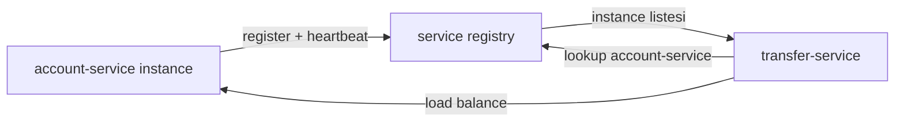
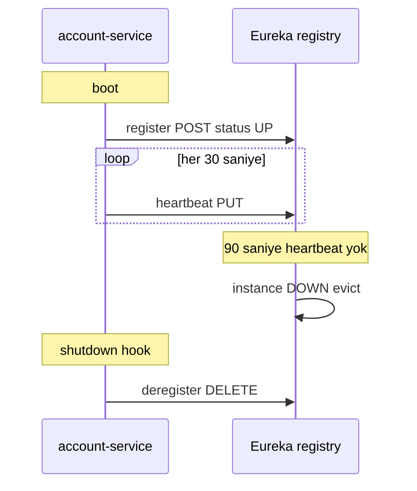
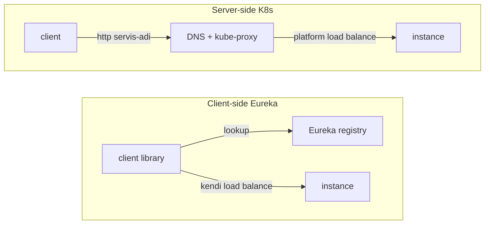

# Topic 7.4 — Service Discovery

```admonish info title="Bu bölümde"
- Service discovery problemi: pod'lar gelip giderken, IP'ler değişirken bir servis diğerini nasıl bulur
- Client-side discovery (Eureka): register + heartbeat + eviction lifecycle ve `@LoadBalanced` client lookup
- Server-side discovery (Kubernetes DNS): ClusterIP + kube-proxy ile kod ve library olmadan discovery
- Zone-aware load balancing, Spring Boot Actuator health check ve K8s liveness/readiness probe entegrasyonu
- Banking karar matrisi (K8s vs Eureka vs Consul vs Istio), service-to-service auth ve mTLS
```

## Hedef

Microservice'lerin **birbirini dinamik olarak bulma** mekanizmalarını kavramak: client-side discovery (Eureka), server-side discovery (K8s DNS / load balancer), Consul ve service mesh. Spring Cloud LoadBalancer entegrasyonu, zone-aware routing, health check ve instance eviction'ı sebep-sonuç olarak anlamak. En önemlisi: banking deployment'ında hangi yaklaşımı neden seçeceğini gerekçeli savunabilmek.

## Süre

Okuma: 1.5 saat • Kendini Sına: 30 dk • Pratik (opsiyonel): 2-3 saat • Toplam: ~2 saat (+ pratik)

## Önbilgi

- Topic 7.1-7.3 bitti (DDD, decomposition, API gateway)
- Container kavramlarına (Docker) aşinasın; Phase 11 K8s basics bunun devamı
- HTTP client (WebClient / RestTemplate) ve Spring Boot config biliyorsun

---

## Kavramlar

### 1. Service discovery problemi

Bir microservice başka bir servisi çağıracaksa önce onun **adresini bilmesi** gerekir; sabit bir adres yazmak ilk bakışta en kolay yol gibi görünür. `transfer-service`, `account-service`'i çağırmak istiyor ve config'e URL'i gömüyoruz:

```yaml
account-service:
  url: http://account-service-instance-1:8081
```

Bu K8s'te ilk deploy'da patlar. Pod'lar restart olur, IP'leri değişir; auto-scaling 1 replica'yı 5'e çıkarır ama hard-coded URL hâlâ tek instance'ı gösterir. <mark>Production'da servis adresini hardcode etme; pod'lar gelip gider, IP'ler her deploy'da değişir</mark>.

Çözüm bir **service registry** etrafında döner: servisler açılırken **kendilerini register** eder, client'lar çağrı anında registry'den **dinamik lookup** yapar. Böylece instance sayısı değişse de client doğru adres listesini alır ve arasında load balance eder.



### 2. Üç temel yaklaşım

Discovery'nin "kim lookup yapıyor, kim load balance ediyor" sorusuna verdiği cevaba göre üç ana model var; hepsinin banking'de yeri farklıdır.

**Client-side discovery (Eureka):** Servisler registry'e register olur, **client** registry'den instance listesini çeker ve **load balancing'i kendisi** yapar. Java/Spring dünyasında klasik.

**Server-side discovery (AWS ELB, Nginx, K8s):** Servisler bir health check endpoint expose eder; **load balancer** registry rolündedir. Client sadece LB'ye konuşur, instance seçimini bilmez.

**DNS-based (Kubernetes):** K8s Service objesi bir DNS adı sunar; **DNS resolution** cluster-internal IP'ye çözer, kube-proxy pod'lar arasında dağıtır. Server-side'ın en yaygın modern hâli.

Dördüncü olarak **Consul (HashiCorp)** service discovery + KV store + service mesh'i birleştirir; multi-data-center için öne çıkar. Bu bölümde ağırlık Eureka ve K8s'te.

### 3. Eureka — client-side discovery

Eureka, Netflix OSS'ten gelen ve Spring ile native çalışan client-side registry'dir; bare metal veya Eureka-merkezli ekiplerde hâlâ yaygın. İki parçası var: **Eureka Server** (registry'nin kendisi) ve her serviste çalışan **Eureka Client**.

#### Eureka Server

Server bağımlılığı ve tek annotation ile ayağa kalkar:

```xml
<dependency>
    <groupId>org.springframework.cloud</groupId>
    <artifactId>spring-cloud-starter-netflix-eureka-server</artifactId>
</dependency>
```

```java
@SpringBootApplication
@EnableEurekaServer
public class EurekaServerApplication {
    public static void main(String[] args) {
        SpringApplication.run(EurekaServerApplication.class, args);
    }
}
```

Server kendisini register etmez ve başka registry'den fetch yapmaz; UI `http://localhost:8761`'de açılır:

```yaml
server:
  port: 8761

eureka:
  client:
    register-with-eureka: false   # server kendini register etmiyor
    fetch-registry: false
  instance:
    hostname: eureka-server

spring:
  application:
    name: eureka-server
```

Tek node Eureka bir tuzaktır: registry düşerse tüm discovery düşer. <mark>Tek node'lu discovery server bir SPOF'tur; Eureka'yı 3+ peer-aware node olarak cluster'la</mark>. Peer'ler birbirine replicate eder, bir node down olsa diğerleri devam eder:

```yaml
eureka:
  client:
    service-url:
      defaultZone: http://eureka-1:8761/eureka,http://eureka-2:8761/eureka,http://eureka-3:8761/eureka
```

#### Eureka Client (her servis)

Her servis client bağımlılığını ekler ve registry'e nasıl register olacağını config'ler. Metadata (zone, version, tenant) sonradan zone-aware routing ve trafik yönetimi için kritik:

```xml
<dependency>
    <groupId>org.springframework.cloud</groupId>
    <artifactId>spring-cloud-starter-netflix-eureka-client</artifactId>
</dependency>
```

```yaml
spring:
  application:
    name: account-service

eureka:
  client:
    service-url:
      defaultZone: http://eureka-server:8761/eureka/
    register-with-eureka: true
    fetch-registry: true
  instance:
    prefer-ip-address: true   # K8s'te IP based
    instance-id: ${spring.application.name}:${random.value}
    lease-renewal-interval-in-seconds: 30   # heartbeat aralığı
    lease-expiration-duration-in-seconds: 90   # 3 kaçan heartbeat = dead
    metadata-map:
      zone: ${ZONE:default}
      version: ${app.version:1.0.0}
      tenant: ${TENANT:default}
```

#### Registration lifecycle

Buradaki lifecycle'ı ezberle — mülakatta "30 sn / 90 sn" rakamları sık sorulur. Servis boot'ta register olur, her 30 saniyede heartbeat gönderir, 90 saniye heartbeat gelmezse registry instance'ı DOWN işaretleyip düşürür, düzgün shutdown'da ise kendini deregister eder:



Register isteğinin gövdesi instance'ın kimliğini ve metadata'sını taşır:

```json
{
  "instanceId": "account-service:abc123",
  "hostName": "account-service-pod-1",
  "ipAddr": "10.0.0.5",
  "port": 8081,
  "status": "UP",
  "metadata": { "zone": "tr", "version": "1.0.0" }
}
```

```admonish warning title="Eviction gecikmesi"
90 saniyelik eviction penceresi Eureka'nın bilinen gölge tarafıdır: bir instance crash olduğunda (düzgün deregister edemeden), registry onu 3 kaçan heartbeat dolana kadar hâlâ UP sanır ve o adrese trafik gönderebilir. Bu yüzden production'da tek başına eviction'a güvenme; client-side retry ve circuit breaker (Topic 7.5) ile ölü instance'ı client tarafında da kısa devreye al.
```

#### Client lookup

Client tarafında sihir `@LoadBalanced` ile başlar: bu builder ile üretilen WebClient, URL'deki host'u bir servis adı olarak kabul eder ve registry'den gerçek instance'a çözer:

```java
@Bean
@LoadBalanced
public WebClient.Builder webClientBuilder() {
    return WebClient.builder();
}

public Mono<Account> getAccount(UUID id) {
    return webClientBuilder.baseUrl("http://account-service").build()
        .get().uri("/accounts/{id}", id)
        .retrieve()
        .bodyToMono(Account.class);
}
```

`http://account-service` içindeki `account-service` bir DNS host değil, **servis adıdır**. Spring Cloud LoadBalancer Eureka registry'den o servisin instance listesini alır ve aralarında dağıtır.

### 4. Kubernetes Service — DNS-based discovery

K8s'te discovery **platformun içinde built-in** gelir; genelde Eureka'ya hiç gerek kalmaz. Bir `Service` objesi tanımlarsın, K8s onun için otomatik bir DNS adı ve sabit bir ClusterIP üretir:

```yaml
apiVersion: v1
kind: Service
metadata:
  name: account-service
  namespace: banking
spec:
  selector:
    app: account-service
  ports:
    - port: 8081
      targetPort: 8081
  type: ClusterIP
```

K8s DNS aynı servise üç isimden erişim verir; namespace'e göre kısalır:

- `account-service.banking.svc.cluster.local` (FQDN)
- `account-service.banking` (kısa, farklı namespace)
- `account-service` (aynı namespace içinde)

Client kodu artık trivial — sadece servis adına HTTP çağrısı, ne Eureka ne library:

```java
webClient.baseUrl("http://account-service:8081")
    .get().uri("/accounts/123")
    .retrieve()...
```

Bu ad ClusterIP'ye resolve olur, kube-proxy da arkadaki pod'lara load balance eder. **Eureka yok, discovery library yok, sadece DNS.** Bu sadeliği yakalamak K8s'in service discovery'de tercih edilme sebebidir.

Service tipi, servisin kimlere görünür olacağını belirler:

```yaml
type: ClusterIP    # sadece cluster içi (default)
type: NodePort     # node IP + yüksek port ile dışarı
type: LoadBalancer # cloud provider LB
type: ExternalName # DNS alias
```

Banking pratiği: internal service-to-service çağrılar `ClusterIP`; dışa açılan API gateway için `LoadBalancer`.

### 5. Spring Cloud LoadBalancer

Client-side load balancing'i somut olarak yapan katman Spring Cloud LoadBalancer'dır ve güzel yanı **discovery-agnostic** olmasıdır. Aynı `@LoadBalanced` builder Eureka registry ile de K8s discovery client ile de çalışır — Spring Boot hangisinin classpath'te olduğunu autodetect eder:

```java
@Bean
@LoadBalanced
public WebClient.Builder webClientBuilder() {
    return WebClient.builder()
        .filter(new RetryFilter())
        .filter(new TracingFilter());
}

@Bean
public AccountServiceClient accountServiceClient(WebClient.Builder builder) {
    return new AccountServiceClient(builder.baseUrl("http://account-service").build());
}
```

Default strategy `RoundRobinLoadBalancer`'dır; `RandomLoadBalancer` da hazır gelir, weighted/sticky gibi custom stratejiler yazılabilir. Strateji override'ı bir config bean ile yapılır:

```java
@Configuration
public class LoadBalancerConfig {

    @Bean
    public ReactorLoadBalancer<ServiceInstance> randomLoadBalancer(
            Environment environment,
            LoadBalancerClientFactory factory) {
        String name = environment.getProperty(LoadBalancerClientFactory.PROPERTY_NAME);
        return new RandomLoadBalancer(
            factory.getLazyProvider(name, ServiceInstanceListSupplier.class),
            name);
    }
}
```

### 6. Zone-aware load balancing

Multi-AZ deployment'ta her çağrı rastgele bir instance'a giderse trafik boşuna availability zone'lar arası dolaşır; her cross-AZ hop latency ekler. Zone-aware load balancing **çağıranla aynı zone'daki** instance'ı tercih ederek bunu keser:

```yaml
spring:
  cloud:
    loadbalancer:
      zone: ${ZONE:default}   # env'den gelen zone
```

Bunun çalışması için instance'lar da register olurken zone metadata'sını yayınlamalı:

```yaml
eureka:
  instance:
    metadata-map:
      zone: ${ZONE:default}
```

LoadBalancer caller zone == instance zone eşleşmesini tercih eder; aynı zone'da instance yoksa cross-zone'a fallback yapar. Banking pratiği: AWS multi-AZ veya GCP multi-region setup'ta cross-AZ latency'den 1-2 ms tasarruf, yük altında anlamlı fark yaratır.

### 7. Health check entegrasyonu

Registry'nin işe yaraması, **ölü instance'ların otomatik temizlenmesine** bağlıdır; bunu health check sağlar. Spring Boot Actuator `/actuator/health` endpoint'i UP dönmeyince instance registry'den çıkarılır:

```yaml
management:
  endpoints:
    web:
      exposure:
        include: health, info
  endpoint:
    health:
      show-details: never
      probes:
        enabled: true   # liveness ve readiness ayrı
  health:
    livenessstate:
      enabled: true
    readinessstate:
      enabled: true
```

<mark>Health check'siz registration ölü instance'lara trafik gönderir ve isteklerin sessizce fail olmasına yol açar</mark>. Banking'de "sağlıklı" tanımı sadece process ayakta demek değildir; asıl bağımlılıklar da erişilebilir olmalı. Custom health indicator ile bunu doğrularsın:

```java
@Component
public class DatabaseHealthIndicator implements HealthIndicator {

    private final JdbcTemplate jdbc;

    @Override
    public Health health() {
        try {
            jdbc.queryForObject("SELECT 1 FROM dual", Integer.class);
            return Health.up().withDetail("database", "reachable").build();
        } catch (Exception e) {
            return Health.down(e).withDetail("database", "unreachable").build();
        }
    }
}
```

Banking'de tipik custom indicator'lar: database connectivity, Kafka producer health, external service erişimi (KKB, TCMB) ve disk space.

### 8. K8s probes (Phase 11 preview)

K8s tarafında health check üç ayrı probe'a bölünür ve her birinin farklı bir aksiyonu vardır; bu ayrımı bilmek slow-start Spring Boot servislerini doğru deploy etmek için şart:

```yaml
livenessProbe:
  httpGet:
    path: /actuator/health/liveness
    port: 8081
  failureThreshold: 3
  periodSeconds: 10

readinessProbe:
  httpGet:
    path: /actuator/health/readiness
    port: 8081
  failureThreshold: 1
  periodSeconds: 5

startupProbe:
  httpGet:
    path: /actuator/health/liveness
    port: 8081
  failureThreshold: 30
  periodSeconds: 10
```

Aksiyonların anlamı:

- **Liveness fail:** Pod restart edilir (process takıldı)
- **Readiness fail:** Trafikten çıkarılır, Service endpoints'ten remove (geçici meşguliyet)
- **Startup:** Yavaş başlayan servise (Spring Boot 30-60 sn) ekstra grace period tanır

```admonish tip title="Liveness ve readiness'i karıştırma"
Liveness "pod'u öldür-yeniden başlat" der, readiness "trafik gönderme ama bekle" der. DB bağlantısı geçici koptuğunda readiness DOWN yapıp trafiği kesmek doğrudur; ama aynı durumda liveness'i DOWN yaparsan pod boş yere restart döngüsüne girer. Kısacası: kalıcı hatalar liveness, geçici hatalar readiness.
```

### 9. Consul

HashiCorp Consul, service discovery'yi tek başına değil; KV store ve service mesh ile birlikte sunar. Spring Boot ile config'i Eureka'ya benzer, farkı health check'i Consul'ün kendisinin poll etmesidir:

```yaml
spring:
  cloud:
    consul:
      host: consul-server
      port: 8500
      discovery:
        service-name: account-service
        health-check-path: /actuator/health
        health-check-interval: 10s
        tags:
          - zone=${ZONE}
          - version=${app.version}
```

Avantajları: multi-data-center desteği, config ve discovery'yi birleştiren KV store, ve Connect ile service mesh. Banking pratiği: multi-region setup için ideal, çoğu zaman K8s ile birlikte konumlanır.

### 10. Service mesh (Istio, Linkerd)

Service mesh, discovery'nin de ötesinde service-to-service iletişimi bir **abstraction layer'a** taşır. Her pod'un yanına bir sidecar proxy koyar; trafik uygulama kodundan çıkıp proxy üzerinden akar:

```
Service A -> [sidecar proxy] -> [sidecar proxy] -> Service B
             (mTLS, retry, circuit breaker, tracing)
```

Kazanç: mTLS otomatik, retry ve circuit breaker kodda değil proxy'de, canary/blue-green gibi traffic shaping ve built-in observability. Banking'de modern ekipler Istio'ya yatırım yapıyor; yine de Spring Cloud stack'i hâlâ çok yaygın.

### 11. Banking karar matrisi

Doğru seçim tek bir "en iyi" değil, deployment ortamına bağlıdır; matris karar için pratik bir kısayol:

| Senaryo | Önerilen |
|---|---|
| K8s deployment | K8s Service (DNS) |
| K8s + multi-region | Consul veya Istio |
| Legacy bare metal | Eureka |
| Java-only ecosystem | Eureka veya K8s |
| Polyglot (Go, Python, Java) | Consul, K8s, Istio |
| Modern startup | Istio + K8s |

Ortalama banking gerçeği: **K8s + Spring Cloud LoadBalancer** (Eureka'sız) en yaygın kombinasyon. İki yaklaşımın farkını bir arada görmek istersen:



### 12. Banking örnek — full setup

Şimdi parçaları birleştirelim. Tipik bir core-banking repo'sunda modüller ve (opsiyonel) Eureka server şöyle durur:

```
core-banking/
├── eureka-server/             (opsiyonel, K8s'te yok)
├── api-gateway/
├── account-service/
├── transfer-service/
├── fraud-service/
└── notification-service/
```

`account-service` K8s-native config'inde Eureka'ya hiç değinmez; kritik kısım health/probe ve metrics exposure'dır:

```yaml
spring:
  application:
    name: account-service

server:
  port: 8081
```

Management bloğu prometheus metriklerini ve ayrı liveness/readiness probe'larını açar — bunlar K8s'in servisi doğru yönetmesi için gerekli:

```yaml
management:
  endpoints:
    web:
      exposure:
        include: health, info, metrics, prometheus
  endpoint:
    health:
      show-details: when_authorized
      probes:
        enabled: true
  health:
    livenessstate:
      enabled: true
    readinessstate:
      enabled: true
```

`transfer-service` tarafında ise `@LoadBalanced` builder ile bir client kurar; `baseUrl("http://account-service")` içindeki ad K8s DNS (veya Eureka) ile resolve olur:

```java
@Bean
@LoadBalanced
public WebClient.Builder loadBalancedWebClient() {
    return WebClient.builder()
        .defaultHeaders(headers -> headers.set("X-Source", "transfer-service"));
}

@Bean
public WebClient accountServiceClient(WebClient.Builder builder) {
    return builder.baseUrl("http://account-service").build();  // servis adı resolve
}
```

Client kullanımında dikkat edilecek nokta, user token'ın downstream'e taşınmasıdır (bir sonraki bölüm):

```java
public Mono<AccountDto> getAccount(UUID id, String userToken) {
    return accountServiceClient.get()
        .uri("/accounts/{id}", id)
        .header(HttpHeaders.AUTHORIZATION, "Bearer " + userToken)
        .retrieve()
        .bodyToMono(AccountDto.class);
}
```

<details>
<summary>Tam kod: transfer-service WebClient setup (~35 satır)</summary>

```java
@Configuration
public class WebClientConfig {

    @Bean
    @LoadBalanced
    public WebClient.Builder loadBalancedWebClient() {
        return WebClient.builder()
            .defaultHeaders(headers -> {
                headers.set("X-Source", "transfer-service");
            });
    }

    @Bean
    public WebClient accountServiceClient(WebClient.Builder builder) {
        return builder
            .baseUrl("http://account-service")   // servis adı, K8s DNS resolve
            .build();
    }
}

@Service
public class AccountServiceClient {

    private final WebClient accountServiceClient;

    public Mono<AccountDto> getAccount(UUID id, String userToken) {
        return accountServiceClient.get()
            .uri("/accounts/{id}", id)
            .header(HttpHeaders.AUTHORIZATION, "Bearer " + userToken)
            .retrieve()
            .bodyToMono(AccountDto.class);
    }
}
```

</details>

### 13. Service-to-service authentication

Discovery servisi bulur ama "bu çağrı yetkili mi" sorusunu cevaplamaz; internal çağrılarda iki auth kalıbı var. **User token propagation** yaklaşımında `transfer-service`, kullanıcının JWT'sini `account-service`'e olduğu gibi geçer:

```java
public Mono<AccountDto> debit(UUID accountId, BigDecimal amount, String userToken) {
    return accountServiceClient.post()
        .uri("/accounts/{id}/debit", accountId)
        .header(HttpHeaders.AUTHORIZATION, "Bearer " + userToken)
        .bodyValue(new DebitRequest(amount))
        .retrieve()
        .bodyToMono(AccountDto.class);
}
```

Böylece backend servis kullanıcının yetkisiyle işlem yapar; **authorization korunur**. İkinci kalıp **client credentials**: servis kendi adına, kullanıcı yetkisi gerektirmeyen internal işler için bir service token alır:

```java
@Service
public class FraudServiceClient {

    private final WebClient fraudServiceClient;
    private final OAuth2ClientService oauth2Service;

    public Mono<FraudScore> scoreTransfer(TransferEvent transfer) {
        return oauth2Service.getServiceToken()
            .flatMap(token -> fraudServiceClient.post()
                .uri("/score")
                .header(HttpHeaders.AUTHORIZATION, "Bearer " + token)
                .bodyValue(transfer)
                .retrieve()
                .bodyToMono(FraudScore.class));
    }
}
```

Kural: kullanıcı bağlamı gereken işte token propagation, saf internal işte client credentials.

```admonish tip title="Discovery kimliği değil, yalnızca konumu çözer"
Sık yapılan bir kafa karışıklığı: "servisi discovery ile buldum, artık güvenli." Discovery sadece "account-service nerede" sorusunu cevaplar; "bu çağıran yetkili mi" sorusunu değil. Registry'e register olabilen her pod internal ağdadır ama bu onu güvenilir yapmaz. Auth (token propagation, client credentials, mTLS) discovery'den tamamen ayrı bir katmandır ve banking'de ihmal edilemez.
```

### 14. mTLS (mutual TLS)

Banking'de servisler arası trafiğin şifreli **ve** çift taraflı doğrulanmış olması çoğunlukla zorunludur. En temiz yol service mesh (Istio) ile otomatik mTLS'tir; Spring Boot'ta manuel de yapılabilir:

```yaml
server:
  ssl:
    enabled: true
    key-store: classpath:account-service-keystore.p12
    key-store-password: ${KS_PWD}
    key-store-type: PKCS12
    client-auth: need   # mTLS — client sertifikası zorunlu
    trust-store: classpath:banking-truststore.p12
    trust-store-password: ${TS_PWD}
```

`client-auth: need` server'ın client sertifikasını da doğrulamasını sağlar. Detay Phase 8 (Security) konusu.

### 15. Banking anti-pattern'leri

Mülakatta "bu setup'ta ne yanlış" sorusunun cephaneliği burası — altı klasik hata:

**1 — Production'da hard-coded IP.** `account-service.url: http://10.0.0.5:8081` yazarsan pod restart'ında IP değişir ve 5xx yağar. Çözüm: servis adı üzerinden discovery.

**2 — Discovery server SPOF.** Tek node Eureka fail olursa registry gider, tüm discovery çöker. Çözüm: Eureka cluster (3+ peer-aware node) veya highly available K8s native.

**3 — Health check'siz registration.** Ölü instance registry'de kalır, trafik gider, istekler fail olur. Çözüm: Actuator health endpoint + registry entegrasyonu zorunlu.

**4 — K8s içinde hem Eureka hem K8s Service.** İki paralel discovery mekanizması lookup kaosu ve kafa karışıklığı doğurur. <mark>K8s içinde tek bir discovery mekanizması seç — Eureka ile K8s Service'i aynı anda kullanma</mark>. K8s'te K8s Service, bare metal'de Eureka.

**5 — Servis adını versiyonla değiştirme.** `account-service` → `account-service-v2` Eureka'ya ayrı entry açar ve client'ı zorunlu coupling'e sokar. Versioning URL path'inde olmalı (`/v1/`, `/v2/`).

**6 — Service-to-service çağrıyı public gateway'den geçirme.** İç çağrıyı external gateway'e yollamak gereksiz round-trip ve auth check ekler; internal servisler cluster network'ünde birbirine doğrudan gitmeli.

---

## Önemli olabilecek araştırma kaynakları

- Spring Cloud Netflix Eureka documentation
- Spring Cloud LoadBalancer reference
- Spring Cloud Kubernetes documentation
- Consul official documentation
- Istio service discovery docs
- "Microservices Patterns" (Chris Richardson) — service discovery chapter

---

## Kendini Sına

Aşağıdaki soruları önce **cevaba bakmadan** kendi cümlelerinle yanıtlamayı dene — hepsi microservice mülakatlarında karşına çıkabilecek tarzda. Takıldığın soruda ilgili Kavramlar başlığına dön, sonra tekrar dene.

**S1. Client-side ve server-side discovery arasındaki fark nedir? DNS-based (K8s) bu ikisinden hangisine girer?**

<details>
<summary>Cevabı göster</summary>

Client-side'da (Eureka) instance listesini registry'den çeken ve aralarında load balancing yapan taraf **client'ın kendisidir**; client discovery library taşır ve akıllıdır. Server-side'da bu iş client'tan alınır: client tek bir sabit adrese (load balancer / service) konuşur, instance seçimini ve load balancing'i **aradaki altyapı** yapar; client "dumb" kalır.

DNS-based K8s Service server-side'ın bir çeşididir: client sadece `http://account-service` der, K8s DNS bunu bir ClusterIP'ye çözer ve kube-proxy pod'lara dağıtır. Client ne registry sorgular ne de load balance eder — mantık platformda yaşar.

</details>

**S2. Bir servisin adresini config'e hardcode etmek neden çalışmaz? Doğrusu ne?**

<details>
<summary>Cevabı göster</summary>

K8s'te pod'lar ephemeral'dır: restart olduklarında IP'leri değişir, auto-scaling instance sayısını değiştirir. `http://10.0.0.5:8081` gibi sabit bir adres ilk pod restart'ında geçersizleşir ve 5xx üretir; ayrıca 5 replica varken tek instance'ı gösterdiği için load balancing de yapılamaz.

Doğrusu servis **adı** üzerinden discovery: `http://account-service` yazarsın, çözümü registry (Eureka) veya platform (K8s DNS) çalışma anında dinamik yapar. Böylece instance'lar gelip gitse de client her zaman güncel ve dağıtılmış bir hedefe ulaşır.

</details>

**S3. Eureka'da register + heartbeat + eviction lifecycle nasıl işler? 30 ve 90 saniye ne anlama gelir?**

<details>
<summary>Cevabı göster</summary>

Servis boot olunca Eureka'ya `POST` ile register olur ve status UP alır. Sonra `lease-renewal-interval-in-seconds` (default 30 sn) aralığında heartbeat (`PUT`) gönderir; bu "hâlâ ayaktayım" sinyalidir. Registry, `lease-expiration-duration-in-seconds` (default 90 sn) boyunca heartbeat almazsa — yani yaklaşık 3 kaçan heartbeat — instance'ı DOWN işaretleyip registry'den evict eder.

Düzgün shutdown'da servis bir shutdown hook ile `DELETE` çağırıp kendini deregister eder, böylece 90 sn beklenmeden temizlenir. Bu gecikme Eureka'nın bilinen bir gölge tarafıdır: crash olan instance 90 sn'ye kadar registry'de kalıp trafik alabilir; bu yüzden health check ve client-side retry önemlidir.

</details>

**S4. K8s'te service discovery için neden genelde Eureka'ya gerek yoktur? DNS nasıl çalışır?**

<details>
<summary>Cevabı göster</summary>

Çünkü K8s discovery'yi platform seviyesinde built-in sunar. Bir `Service` objesi tanımladığında K8s otomatik olarak ona kararlı bir DNS adı ve sabit bir ClusterIP verir; `selector`'a uyan pod'ları endpoint olarak takip eder. Client sadece `http://account-service:8081` der.

DNS bu adı üç biçimde çözer: `account-service` (aynı namespace), `account-service.banking` (kısa) ve `account-service.banking.svc.cluster.local` (FQDN). Ad ClusterIP'ye resolve olur, kube-proxy de arkadaki sağlıklı pod'lara load balance eder. Sonuç: ne Eureka server, ne client library, ne de register kodu gerekir — sadece DNS.

</details>

**S5. Eureka tek node'la çalıştırılırsa risk nedir, nasıl önlenir?**

<details>
<summary>Cevabı göster</summary>

Tek node Eureka bir single point of failure'dır: registry düşerse hiçbir servis diğerini lookup edemez ve tüm inter-service iletişim çöker — bir bankada bu doğrudan kesinti demektir.

Önlem, Eureka'yı **peer-aware cluster** olarak çalıştırmaktır: 3+ node, her biri `defaultZone` içinde diğer peer'lerin adreslerini taşır ve registry'i birbirine replicate eder. Bir node down olsa diğerleri servis vermeye devam eder. Alternatif olarak K8s native discovery'ye geçmek de bu sorunu ortadan kaldırır, çünkü control plane zaten highly available'dır.

</details>

**S6. `@LoadBalanced` WebClient nasıl çalışır? Aynı kod Eureka ile de K8s ile de çalışabilir mi?**

<details>
<summary>Cevabı göster</summary>

`@LoadBalanced`, WebClient.Builder'a Spring Cloud LoadBalancer'ı devreye sokan bir interceptor ekler. Bu builder'la üretilen client `http://account-service` gördüğünde `account-service`'i DNS host olarak değil bir **servis adı** olarak yorumlar: discovery client'tan o servisin instance listesini alır, strateji (default round-robin) ile birini seçer ve gerçek adrese çağrı yapar.

Evet, aynı kod her iki ortamda çalışır çünkü Spring Cloud LoadBalancer discovery-agnostic'tir. Classpath'te Eureka client varsa instance listesini Eureka'dan, Spring Cloud Kubernetes varsa K8s API'sinden alır; uygulama kodu değişmez, sadece bağımlılık ve config değişir.

</details>

**S7. Health check service discovery'yi nasıl temizler? Liveness ile readiness arasındaki fark nedir?**

<details>
<summary>Cevabı göster</summary>

Registry veya platform, instance'ın health endpoint'ini izler; endpoint UP dönmediğinde instance registry'den / Service endpoints'ten çıkarılır, böylece trafik ölü instance'a gitmez. Banking'de `HealthIndicator` ile DB, Kafka, external servis erişimini de kontrol edip "gerçekten sağlıklı mı" sorusunu cevaplarsın.

Liveness ve readiness ayrı sorular sorar. **Liveness** "process kurtarılamaz durumda mı" — fail olursa K8s pod'u restart eder. **Readiness** "şu an istek alabilir mi" — fail olursa pod trafikten çıkarılır ama öldürülmez. DB geçici koparsa readiness DOWN yapıp trafiği kesmek doğrudur; aynı durumda liveness'i DOWN yaparsan pod boşuna restart döngüsüne girer.

</details>

**S8. Zone-aware load balancing nedir ve banking multi-AZ deployment'ında neden önemlidir?**

<details>
<summary>Cevabı göster</summary>

Zone-aware load balancing, çağrıyı yapan servisle **aynı availability zone**'daki instance'ı tercih eder; o zone'da sağlıklı instance yoksa cross-zone'a fallback yapar. Bunun için hem çağıranın kendi zone'unu (`spring.cloud.loadbalancer.zone`) bilmesi hem de instance'ların register olurken `metadata-map.zone` yayınlaması gerekir.

Banking'de önemi latency ve maliyettir: multi-AZ (AWS) veya multi-region (GCP) setup'ta her cross-AZ hop birkaç ms ekler ve bazı cloud sağlayıcılarda cross-AZ trafik ücretlendirilir. Yüksek hacimli servis-servis çağrılarında aynı zone tercihi hem gecikmeyi hem faturayı düşürür; zone tamamen düşse fallback devreye girdiği için availability'den ödün verilmez.

</details>

---

## Tamamlama kriterleri

- [ ] Client-side, server-side ve DNS-based discovery arasındaki farkı örnekle anlatabiliyorum
- [ ] Servis adresini neden hardcode etmediğimi ve doğrusunu söyleyebiliyorum
- [ ] Eureka register + heartbeat (30 sn) + eviction (90 sn) lifecycle'ını çizebiliyorum
- [ ] K8s Service DNS discovery'yi (FQDN formatı, ClusterIP, kube-proxy) açıklayabiliyorum
- [ ] `@LoadBalanced` WebClient'ın Eureka ve K8s ile nasıl çalıştığını biliyorum
- [ ] Health check + auto-eviction ve liveness vs readiness ayrımını kavradım
- [ ] Zone-aware load balancing'i banking multi-AZ için gerekçelendirebiliyorum
- [ ] Service-to-service auth (token propagation vs client credentials) ve mTLS'i biliyorum
- [ ] Banking karar matrisini (K8s vs Eureka vs Consul vs Istio) savunabiliyorum
- [ ] (Opsiyonel) "Pratik yapmak istersen" bölümündeki setup'ı denedim ve Claude-verify prompt'uyla doğrulattım

---

```admonish success title="Bölüm Özeti"
- Service discovery, ephemeral pod'lar ve değişen IP'ler dünyasında servislerin birbirini dinamik bulmasıdır — adres asla hardcode edilmez, servis adı üzerinden lookup yapılır
- Client-side (Eureka): servis register + 30 sn heartbeat + 90 sn eviction; client registry'den instance listesini alıp kendisi load balance eder — SPOF olmaması için 3+ peer cluster şart
- Server-side / DNS-based (K8s): Service objesi + ClusterIP + kube-proxy ile discovery platformda built-in; ne Eureka ne library, sadece `http://account-service`
- Spring Cloud LoadBalancer discovery-agnostic'tir: aynı `@LoadBalanced` kod hem Eureka hem K8s ile çalışır; zone-aware routing multi-AZ latency'yi kısar
- Health check ölü instance'ları registry'den temizler; liveness pod'u restart eder, readiness sadece trafikten çıkarır
- Banking ortalaması K8s + Spring Cloud LoadBalancer'dır; kaçınılacaklar: hard-coded IP, tek node discovery, health check'siz registration ve K8s içinde Eureka + K8s Service ikili discovery
```

---

## Pratik yapmak istersen

Kavramları eline bulaştırmak istersen aşağıdaki iki ek hazır: uygulama rehberi Eureka setup'ından K8s Service alternatifine kadar adım adım bir laboratuvar; Claude-verify prompt'u ise kurduğun discovery setup'ını banking-grade perspektiften denetletmeni sağlar.

<details>
<summary>Uygulama rehberi</summary>

> Süre: her adım 30-45 dk arası; toplam yarım gün. Her adımın "bitti" tanımını yanında verdim — o gözlemi yakaladıysan geç.

### Adım 1 — Eureka server ayağa kaldır

`eureka-server` adında bir Maven modülü aç, `@EnableEurekaServer` ekle, port 8761. `http://localhost:8761` UI'ının açılması yeterli.

**Bitti tanımı:** UI açılıyor ve (henüz) kayıtlı instance yok.

### Adım 2 — 4 servisi Eureka'ya register et

account, transfer, fraud, notification servislerine Eureka client config'i ekle (`register-with-eureka: true`, doğru `service-url`).

**Bitti tanımı:** Dördü de Eureka UI'da UP olarak görünüyor; birini kapatınca ~90 sn içinde registry'den düşüyor.

### Adım 3 — Gateway'den `lb://account-service` çağrısı

API Gateway route'unda `uri: lb://account-service` kullan. Servis adının resolve olduğunu ve trafiğin backend'e ulaştığını doğrula.

**Bitti tanımı:** Bir backend instance'ı kapatıp başkasını açtığında çağrı otomatik olarak ayakta olan instance'a düşüyor (failover).

### Adım 4 — K8s Service alternatifi

minikube veya kind ile bir cluster kur. account-service için `Deployment` + `Service` yaml yaz. Başka bir pod'dan test et:

```bash
kubectl exec -it <bir-pod> -- curl http://account-service:8081/actuator/health
```

İstersen Spring Cloud Kubernetes dependency ekleyip discovery'i K8s-based yap.

**Bitti tanımı:** `curl` başka pod'dan `{"status":"UP"}` dönüyor — Eureka olmadan sadece DNS ile.

### Adım 5 — Health check + auto-eviction

Bir `DatabaseHealthIndicator` yaz. DB'yi durdur, health'in DOWN olduğunu ve instance'ın registry'den (veya Service endpoints'ten) düştüğünü gözlemle.

**Bitti tanımı:** DB down → health DOWN → instance ~90 sn içinde registry'den evict oluyor.

### Adım 6 — Zone-aware load balancing

İki zone simüle et: bir account-service instance `zone=tr`, biri `zone=eu`. transfer-service'i `zone=tr` config'le ve çağrıların tr instance'ına tercihen gittiğini doğrula.

**Bitti tanımı:** Normalde çağrılar tr instance'ına gidiyor; tr instance'ı kapatınca eu'ya fallback yapıyor.

</details>

<details>
<summary>Claude-verify prompt</summary>

```
Service discovery setup'ımı banking-grade kriterlere göre değerlendir.
Her madde için PASS / FAIL / EKSIK işaretle, kanıt göster, kod yazma:

1. Discovery seçimi:
   - K8s'te K8s Service + DNS mı kullanılıyor (Eureka değil)?
   - Eureka kullanılıyorsa cluster mı (3+ node, peer-aware)?
   - Bare metal'de Eureka uygun bir seçim mi?

2. Service registration:
   - spring.application.name explicit mi?
   - Health check endpoint expose edilmiş mi?
   - K8s için prefer-ip-address set mi?
   - Metadata (zone, version, tenant) var mı?

3. Client-side load balancing:
   - @LoadBalanced WebClient.Builder kullanılmış mı?
   - http://service-name (veya lb://) URL formatı mı?
   - Load balancing stratejisi (round-robin, random) bilinçli mi?

4. Health check:
   - Actuator /health expose ediliyor mu?
   - Custom health indicator (DB, Kafka) var mı?
   - K8s liveness vs readiness ayrı yapılandırılmış mı?

5. Zone-aware:
   - Multi-AZ deployment'ta zone preference var mı?
   - metadata.zone set edilmiş mi?

6. Service-to-service auth:
   - User token propagation (authorization korunuyor) var mı?
   - Client credentials (service-to-service trust) uygun yerde mi?
   - mTLS veya OAuth2 kullanılıyor mu?

7. Anti-pattern:
   - Hard-coded IP/URL var mı?
   - Discovery server SPOF (tek node) riski var mı?
   - Health check'siz registration var mı?
   - K8s içinde ikili discovery (Eureka + K8s Service) var mı?

8. Test/gözlem:
   - Service registration doğrulanmış mı?
   - Load balancer resolution doğrulanmış mı?
   - Failover (instance down) test edilmiş mi?
```

</details>
