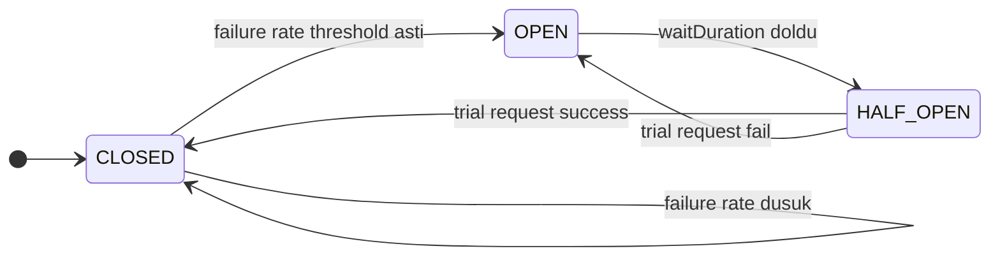
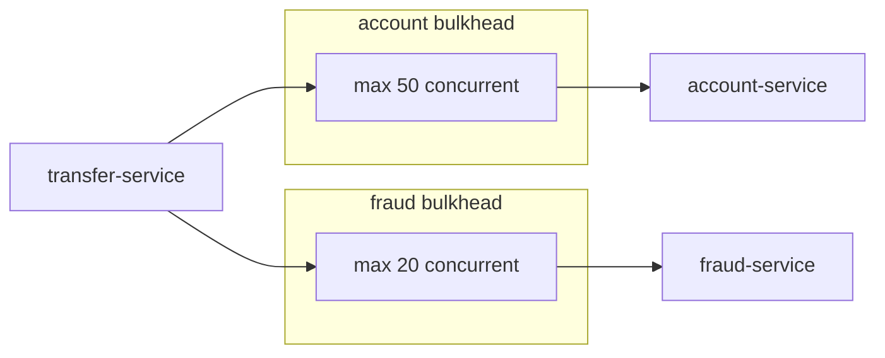
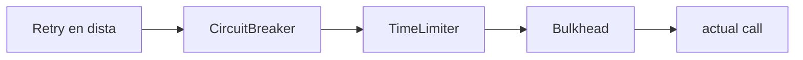
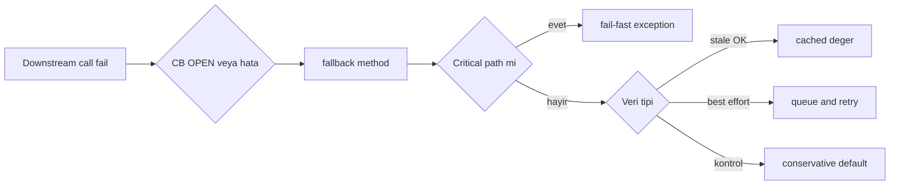

# Topic 7.5 — Resilience4j: Circuit Breaker, Retry, Bulkhead, RateLimiter, TimeLimiter, Fallback

```admonish info title="Bu bölümde"
- Distributed sistem patolojileri — cascading failure, retry storm, timeout cascade — ve Resilience4j ile nasıl kesildikleri
- Circuit Breaker 3 state (CLOSED / OPEN / HALF_OPEN), failure threshold ve `ignoreExceptions` ile business hataların ayrılması
- Retry (exponential backoff + idempotency), Bulkhead (semaphore/threadpool), TimeLimiter, RateLimiter — banking config'leriyle tek tek
- Composition order: `Retry → CircuitBreaker → TimeLimiter → Bulkhead → call` sırası ve neden bu sırada
- 4 fallback stratejisi (fail-fast, cached, queue, degraded) ve critical vs non-critical path kararı
```

## Hedef

Microservice'ler arası çağrılarda **resilience pattern**'leri uygulamak. Cascading failure, timeout cascade, retry storm gibi distributed sistem patolojilerini Resilience4j ile önlemek. Banking için **transfer-service → account-service** gibi critical path'lerde fail-safe pattern tasarlayabilmek.

## Süre

Okuma: 2 saat • Kendini Sına: 45 dk • Pratik (opsiyonel): 3-4 saat • Toplam: ~2.5 saat (+ pratik)

## Önbilgi

- Topic 7.1-7.4 bitti (microservice architecture)
- Phase 3 (concurrency) — bulkhead concept'i görüldü
- Phase 6 (Kafka) — retry, DLT pattern'leri biliniyor

---

## Kavramlar

### 1. Neden resilience patterns gerekli

Tek bir yavaş servis, önlem yoksa tüm sistemi çökertir — resilience pattern'lerin varlık sebebi bu üç patolojidir.

#### Cascading failure

**Cascading failure**, bir downstream servisin yavaşlamasının upstream'lere zincirleme yayılıp tüm sistemi kilitlemesidir.

```
account-service yavaşladı (500ms → 5s)
   ↓
transfer-service'in thread pool dolu (50 thread × 5s = 250s wait)
   ↓
gateway timeout (30s)
   ↓
external client retry → yeni request'ler pool'u daha da doldurur
   ↓
TÜM SİSTEM ÇÖKÜYOR
```

Bir servis yavaşladı diye hepsi patlar; çünkü thread'ler o yavaş çağrıda bloke kalır.

#### Retry storm

**Retry storm**, naive retry'ın zaten zorlanan bir backend'e yükü katlayarak death spiral yaratmasıdır.

```
account-service 5xx döndü
transfer-service: "retry 3 kez" → 3x request load → backend daha yavaş
yeni request'ler de retry → 9x load → death spiral
```

Hatalı servise "daha çok vur" demek onu tamamen düşürür.

#### Timeout cascade

**Timeout cascade**, her katmanın aynı timeout değerini kullanması yüzünden kimsenin doğru anda pes edememesidir.

```
gateway 30s • transfer-service 30s • account-service 30s • DB 30s
DB tam 30s'te timeout verir, ama üstteki herkes hâlâ bekliyor
```

Çözüm: timeout'lar aşağıdan yukarı **azalan** olmalı (bkz. bölüm 7). <mark>Her timeout seviyesi bir altındakinden uzun olmalı</mark> — aksi halde alt katman pes ederken üst katman hâlâ boşuna bekler.

### 2. Resilience4j — 6 ana pattern

Resilience4j, bu patolojilerin her birine karşılık gelen altı **pattern**'i annotation ile sunar; her pattern bir savunma katmanıdır.

| Pattern | Amaç |
|---|---|
| **Circuit Breaker** | Backend down → fail-fast, recovery period |
| **Retry** | Transient hata → otomatik yeniden dene |
| **Bulkhead** | Resource isolation (thread/semaphore limit) |
| **TimeLimiter** | Max execution time, cancel |
| **RateLimiter** | Outbound request rate limit |
| **Fallback** | Failure'da graceful degradation |

Spring Boot 3 için üç bağımlılık yeterli — AOP starter annotation'ları çalıştırır, reactor entegrasyonu `Mono`/`Flux` içindir:

```xml
<dependency>
    <groupId>io.github.resilience4j</groupId>
    <artifactId>resilience4j-spring-boot3</artifactId>
</dependency>
<dependency>
    <groupId>io.github.resilience4j</groupId>
    <artifactId>resilience4j-reactor</artifactId>
</dependency>
<dependency>
    <groupId>org.springframework.boot</groupId>
    <artifactId>spring-boot-starter-aop</artifactId>
</dependency>
```

### 3. Circuit Breaker — state machine

Elektrik sigortası gibi düşün: backend down'a giderse **Circuit Breaker** devreyi açıp anlık fail eder, böylece hem çağıranı hem düşen backend'i korur.

Üç state ve aralarındaki geçişler şöyle işler:



- **CLOSED:** Normal. Request'ler geçer, failure rate izlenir.
- **OPEN:** Threshold aşıldı. Tüm request'ler **anında fail** (`CallNotPermittedException`), backend'e hiç gitmez.
- **HALF_OPEN:** Wait duration sonrası **sınırlı trial request**. Success → CLOSED, fail → OPEN.

Config'in ilk yarısı sliding window ve threshold'u tanımlar — kaç call'a bakılacağı ve hangi fail oranında OPEN'a geçileceği:

```yaml
resilience4j:
  circuitbreaker:
    configs:
      default:
        slidingWindowType: COUNT_BASED   # veya TIME_BASED
        slidingWindowSize: 100            # son 100 call'a bak
        minimumNumberOfCalls: 10          # min 10 call sonra değerlendir
        failureRateThreshold: 50          # %50 fail → OPEN
```

İkinci yarı recovery davranışını ve hangi exception'ların sayılacağını belirler. `automaticTransitionFromOpenToHalfOpenEnabled` olmadan HALF_OPEN'a geçiş için bir çağrı beklenir:

```yaml
        slowCallDurationThreshold: 2s
        slowCallRateThreshold: 100        # disabled
        waitDurationInOpenState: 30s      # 30s OPEN, sonra HALF_OPEN
        permittedNumberOfCallsInHalfOpenState: 5
        automaticTransitionFromOpenToHalfOpenEnabled: true
        recordExceptions:
          - org.springframework.web.reactive.function.client.WebClientResponseException
          - java.io.IOException
          - java.util.concurrent.TimeoutException
        ignoreExceptions:
          - com.mavibank.banking.account.exception.AccountNotFoundException
          - com.mavibank.banking.account.exception.InsufficientFundsException
    instances:
      accountService:
        baseConfig: default
      fraudService:
        baseConfig: default
        failureRateThreshold: 70   # daha gevşek
```

Kritik satır `ignoreExceptions`: <mark>business exception'lar circuit breaker'ı asla tetiklememeli</mark>. `InsufficientFundsException` backend down demek değildir; kullanıcının bakiyesi yetersizdir. CB bunu sayarsa her yetersiz bakiye "backend down" olarak yorumlanır ve sistem gereksiz yere CB-open olur.

```admonish warning title="recordExceptions vs ignoreExceptions"
`recordExceptions` = teknik hatalar (5xx, IO, timeout) — CB bunları sayar. `ignoreExceptions` = business hatalar (yetersiz bakiye, hesap bulunamadı) — CB bunları hiç görmez. İkisini karıştırmak, tamamen sağlıklı bir servisi 4xx business hataları yüzünden OPEN'a düşürür.
```

### 4. Circuit Breaker banking örneği — critical vs non-critical

Fallback method'u seçerken tek soru var: bu veri yanlış olursa para kaybeder miyim? Cevaba göre critical path fail-fast yapar, non-critical cached değere düşer.

Önce `getBalance` — CB annotation'ı ve fallback pointer'ı ile korunur:

```java
@Service
public class AccountServiceClient {

    private final WebClient accountServiceClient;

    @CircuitBreaker(name = "accountService", fallbackMethod = "fallbackGetBalance")
    public Mono<Money> getBalance(UUID accountId) {
        return accountServiceClient.get()
            .uri("/accounts/{id}/balance", accountId)
            .retrieve()
            .bodyToMono(Money.class);
    }
```

Balance **critical**'dır — mock bir değer döndürmek yanlış transfer kararı demektir. Bu yüzden fallback fail-fast yapar:

```java
    public Mono<Money> fallbackGetBalance(UUID accountId, Throwable t) {
        log.warn("Account service unavailable for {}: {}", accountId, t.getMessage());
        // Banking: critical data — fail-fast, mock data DON'T
        return Mono.error(new ServiceUnavailableException(
            "Cannot retrieve balance — account service unavailable. Please retry."));
    }
```

Display name gibi **non-critical** veride ise stale/cached değer tolere edilir — kullanıcı bir isim yerine cache görse dünya yıkılmaz:

```java
    // Non-critical: cached value OK
    public Mono<AccountInfo> fallbackGetAccountInfo(UUID accountId, Throwable t) {
        return Mono.justOrEmpty(accountInfoCache.get(accountId))
            .switchIfEmpty(Mono.error(new ServiceUnavailableException("No cached data")));
    }
}
```

Tuzak: kolaylık olsun diye critical path'e mock data koymak. `Money.of("0")` döndüren bir fallback, "bakiye sıfır" diyerek meşru transferleri reddeder veya tersini yapar.

<details>
<summary>Tam kod: AccountServiceClient CB + fallback (~37 satır)</summary>

```java
@Service
public class AccountServiceClient {

    private final WebClient accountServiceClient;

    @CircuitBreaker(name = "accountService", fallbackMethod = "fallbackGetBalance")
    public Mono<Money> getBalance(UUID accountId) {
        return accountServiceClient.get()
            .uri("/accounts/{id}/balance", accountId)
            .retrieve()
            .bodyToMono(Money.class);
    }

    public Mono<Money> fallbackGetBalance(UUID accountId, Throwable t) {
        log.warn("Account service unavailable for {}: {}", accountId, t.getMessage());
        // Banking: critical data — fail-fast, mock data DON'T
        return Mono.error(new ServiceUnavailableException(
            "Cannot retrieve balance — account service unavailable. Please retry."));
    }

    @CircuitBreaker(name = "accountService", fallbackMethod = "fallbackGetAccountInfo")
    public Mono<AccountInfo> getAccountInfo(UUID accountId) {
        return accountServiceClient.get()
            .uri("/accounts/{id}/info", accountId)
            .retrieve()
            .bodyToMono(AccountInfo.class);
    }

    // Non-critical: cached value OK
    public Mono<AccountInfo> fallbackGetAccountInfo(UUID accountId, Throwable t) {
        log.warn("Falling back to cached account info: {}", accountId);
        return Mono.justOrEmpty(accountInfoCache.get(accountId))
            .switchIfEmpty(Mono.error(new ServiceUnavailableException("No cached data")));
    }
}
```

</details>

### 5. Retry — transient hatalar için

**Retry**, geçici (transient) bir hatanın kendiliğinden düzelebileceği durumlar içindir — bir 503 veya network glitch, ikinci denemede geçebilir.

Config'te iki liste kritik: sadece transient hataları retry et, business hatalarını asla:

```yaml
resilience4j:
  retry:
    configs:
      default:
        maxAttempts: 3
        waitDuration: 500ms
        enableExponentialBackoff: true
        exponentialBackoffMultiplier: 2
        retryExceptions:
          - org.springframework.web.reactive.function.client.WebClientResponseException$ServiceUnavailable
          - java.net.ConnectException
          - java.util.concurrent.TimeoutException
        ignoreExceptions:
          - com.mavibank.banking.account.exception.InsufficientFundsException
          - com.mavibank.banking.common.exception.ValidationException
    instances:
      accountService:
        baseConfig: default
      fraudService:
        baseConfig: default
        maxAttempts: 2   # fraud non-blocking, daha az retry
```

Annotation olarak CB ile birlikte kullanılır (sıra önemli, bkz. bölüm 9):

```java
@CircuitBreaker(name = "accountService", fallbackMethod = "fallbackGetBalance")
@Retry(name = "accountService")
public Mono<Money> getBalance(UUID accountId) { ... }
```

Kurallar net: `retryExceptions` yalnızca 5xx/network; `ignoreExceptions` business hataları (retry sonuçlarını değiştirmez); `enableExponentialBackoff` ile 500ms → 1s → 2s; `maxAttempts` banking için 3-5, fazlası retry storm.

#### Retry only idempotent operations

Retry'ın gizli tuzağı yan etkidir: **GET, HEAD, PUT, DELETE idempotent** olduğu için güvenle retry edilir; **POST değildir** — retry duplicate transfer yaratabilir.

Banking pattern: POST retry **sadece** `Idempotency-Key` ile yapılır, backend bu key ile dedup eder:

```java
@Retry(name = "transferService")
public Mono<Transfer> postTransfer(TransferRequest req) {
    return transferServiceClient.post()
        .uri("/transfers")
        .header("Idempotency-Key", req.getIdempotencyKey().toString())   // dedup
        .bodyValue(req)
        .retrieve()
        .bodyToMono(Transfer.class);
}
```

```admonish warning title="POST retry = duplicate riski"
Idempotency-Key olmadan retry edilen bir POST /transfers, network hatası "geç dönen başarı"yı gizlerse aynı transferi iki kez işler. Müşteri iki kez borçlanır. Kural: POST retry yalnızca backend dedup garantisiyle.
```

### 6. Bulkhead — resource isolation

**Bulkhead** adı geminin su geçirmez bölmelerinden gelir: bir bölme delinse gemi batmaz. Amaç, bir yavaş servisin tüm thread'leri tüketip diğer çağrıları da düşürmesini engellemektir.

Çözüm servis başına ayrı bir izin havuzu ayırmaktır — biri dolsa diğeri etkilenmez:



#### Semaphore Bulkhead — async/reactive için

Reactive kodda **semaphore bulkhead** kullanılır: eşzamanlı çağrı sayısını sayar, limit dolunca kısa bekler, sonra fail eder.

```yaml
resilience4j:
  bulkhead:
    instances:
      accountService:
        maxConcurrentCalls: 50      # max 50 concurrent
        maxWaitDuration: 100ms      # 100ms bekle, sonra fail
      fraudService:
        maxConcurrentCalls: 20
```

```java
@Bulkhead(name = "accountService", type = Bulkhead.Type.SEMAPHORE)
@CircuitBreaker(name = "accountService", fallbackMethod = "fallback")
public Mono<Money> getBalance(UUID id) { ... }
```

Sonuç: account-service slow olsa 51. request hemen `BulkheadFullException` alır; fraud-service ayrı bulkhead'de olduğu için hiç etkilenmez.

#### ThreadPool Bulkhead — blocking call için

Blocking (reactive olmayan) çağrılarda **threadpool bulkhead** kullanılır — ayrı bir thread pool + queue tahsis eder:

```yaml
resilience4j:
  thread-pool-bulkhead:
    instances:
      legacyService:
        maxThreadPoolSize: 10
        coreThreadPoolSize: 5
        queueCapacity: 20
```

```java
@Bulkhead(name = "legacyService", type = Bulkhead.Type.THREADPOOL)
public CompletableFuture<Response> callLegacy(Request req) { ... }
```

Banking için: legacy CBS (blocking JDBC vb.) için threadpool bulkhead; reactive WebClient çağrıları için semaphore.

### 7. TimeLimiter — max execution time

Fraud-service düşünüp transfer'in sonsuza dek beklememesi için **TimeLimiter** bir çağrıya maksimum süre koyar ve aşınca iptal eder.

```yaml
resilience4j:
  timelimiter:
    instances:
      accountService:
        timeoutDuration: 3s
        cancelRunningFuture: true
```

```java
@TimeLimiter(name = "accountService")
@CircuitBreaker(name = "accountService", fallbackMethod = "fallback")
public CompletableFuture<Money> getBalance(UUID id) {
    return accountServiceClient.get()...toFuture();
}
```

Reactive kodda annotation yerine doğrudan `Mono.timeout` de kullanılabilir:

```java
public Mono<Money> getBalance(UUID id) {
    return accountServiceClient.get()
        .uri("/accounts/{id}/balance", id)
        .retrieve()
        .bodyToMono(Money.class)
        .timeout(Duration.ofSeconds(3));
}
```

En kritik nokta timeout hiyerarşisidir — her katman bir altındakinden **uzun** olmalı:

```
Client → Gateway:                   60s (user max wait)
Gateway → transfer-service:         30s
transfer-service → account-service:  5s
account-service → DB:                3s
```

Aksi halde: DB 4s'te döner ama account-service 3s'te zaten timeout vermiştir → boşa iş; üst katmanlar da yanlış anda pes eder.

```admonish tip title="Bottom-up timeout tasarımı"
Timeout'ları banking SLO'larından başlayıp aşağıdan yukarı hesapla: önce DB'nin makul üst sınırı, üstüne servis işleme payı, üstüne gateway. Böylece hata her zaman en alttaki katmandan başlar ve yukarı doğru temiz propagate olur.
```

### 8. RateLimiter — outbound rate limit

Inbound (gateway) rate limit Topic 7.3'teydi. **RateLimiter** burada **outbound** içindir: dış bir API'nin quota'sını aşıp key'inin suspend olmasını engeller.

Örnek: TCMB FX API'si dakikada sınırlı çağrı kabul eder.

```yaml
resilience4j:
  ratelimiter:
    instances:
      tcmbFxApi:
        limitForPeriod: 100         # 100 call
        limitRefreshPeriod: 60s     # her 60 saniyede
        timeoutDuration: 500ms      # 500ms bekle, sonra fail
```

Limit aşılınca cached FX rate'e düşmek makul bir fallback — kur birkaç saniye stale olabilir:

```java
@RateLimiter(name = "tcmbFxApi", fallbackMethod = "cachedFxRate")
public Mono<FxRate> getFxRate(Currency from, Currency to) {
    return tcmbClient.get()...
}

public Mono<FxRate> cachedFxRate(Currency from, Currency to, Throwable t) {
    return Mono.justOrEmpty(fxCache.get(from, to))
        .switchIfEmpty(Mono.error(new ServiceUnavailableException("No cached FX rate")));
}
```

### 9. Composition order — kritik

Birden fazla pattern birleşince **sıra davranışı belirler** — yanlış sıra CB'yi hiç tetiklenmez hale getirebilir.



Annotation olarak dıştan içe aynı sırayla yazılır:

```java
@Retry(name = "x")
@CircuitBreaker(name = "x", fallbackMethod = "fallback")
@TimeLimiter(name = "x")
@Bulkhead(name = "x")
public CompletableFuture<Account> getAccount(UUID id) { ... }
```

Neden bu sıra: <mark>Retry her zaman en dışta olmalı</mark>. CB OPEN'ken retry no-op olur (boşuna backend'i dövmez); CB CLOSED'ken bir fail retry'ı tetikler. TimeLimiter bulkhead'in dışında ki timeout'lar CB için sayılabilsin.

Yanlış sıranın klasik örneği — CB retry'ın içinde kalırsa CB hiç devreye giremez:

```java
@CircuitBreaker
@Retry           // ❌ retry CB'nin içinde, CB tetiklenmeden retry döner
public ...
```

### 10. Fallback strategies — banking

Fallback tek tip değildir; verinin kritikliğine göre dört strateji arasından seçim yaparsın. Karar akışı şöyle işler:



**Strategy 1 — Fail-fast (critical path):** Balance, debit gibi yanlış olamayacak verilerde. <mark>Critical path'te mock data fallback yasaktır</mark> — yanlış bakiye yanlış karar demektir.

```java
public Mono<Money> fallbackGetBalance(UUID id, Throwable t) {
    return Mono.error(new ServiceUnavailableException("..."));
}
```

**Strategy 2 — Cached value (non-critical):** Display name, geçmiş gibi stale tolere edilen verilerde.

```java
public Mono<AccountInfo> fallbackGetAccountInfo(UUID id, Throwable t) {
    return Mono.justOrEmpty(cache.get(id))
        .switchIfEmpty(Mono.just(AccountInfo.unknown()));
}
```

**Strategy 3 — Queue and retry later:** Notification gibi best-effort işlerde; kuyruğa atıp scheduled job ile sonra dene.

```java
public Mono<Void> fallbackSendNotification(NotificationRequest req, Throwable t) {
    pendingNotificationRepo.save(new PendingNotification(req));
    return Mono.empty();
}
```

**Strategy 4 — Degrade functionality (conservative default):** Fraud service down'da güvenli varsayıma geç. Burası **fail-closed** kararıdır: emin olamıyorsan büyük tutarları riskli say.

```java
public Mono<FraudScore> fallbackFraudCheck(TransferRequest req, Throwable t) {
    log.warn("Fraud service down — applying conservative default");
    if (req.getAmount().compareTo(LARGE_AMOUNT_THRESHOLD) > 0) {
        return Mono.just(FraudScore.HIGH_RISK);   // safe default
    }
    return Mono.just(FraudScore.UNKNOWN_BUT_PROCEED);
}
```

```admonish tip title="Fail-open mı fail-closed mı?"
Servis down'ken "geçir" (fail-open) mı "reddet/kısıtla" (fail-closed) mı kararı işin niteliğine bağlıdır. Display name → fail-open (cache/unknown ile devam). Fraud check ve büyük tutar → fail-closed (conservative HIGH_RISK). Banking'de para riski arttıkça terazi fail-closed'a kayar.
```

### 11. Bulk operation patterns

Cross-service bulk çağrılarda hepsini aynı anda ateşlemek downstream'i ezer; reactive'de `flatMap` concurrency parametresi bunu bounded tutar.

```java
public Mono<List<AccountInfo>> getAccountsInfo(List<UUID> accountIds) {
    return Flux.fromIterable(accountIds)
        .flatMap(this::getAccountInfo, 10)   // max 10 concurrent
        .collectList()
        .timeout(Duration.ofSeconds(30));
}
```

`flatMap(_, concurrency)` paralel ama sınırlı çalışır — bulkhead pattern'in reactive karşılığı.

### 12. Banking örnek — full TransferService

Şimdi hepsini bir transfer akışında birleştirelim: fraud check, debit, credit, save, best-effort notification. Ana orkestrasyon `Mono` zinciri ile akar:

```java
@Transactional
public Mono<Transfer> execute(TransferRequest req, UUID userId) {
    return validateRequest(req)
        .flatMap(v -> fraudClient.scoreTransfer(req, userId))
        .filter(score -> !score.isHighRisk())
        .switchIfEmpty(Mono.error(new HighRiskTransferException()))
        .flatMap(score -> accountClient.debit(req.fromAccountId(), req.amount(), userId))
        .flatMap(debited -> accountClient.credit(req.toAccountId(), req.amount(), userId))
        .flatMap(credited -> saveTransfer(req, userId));
}
```

Downstream client'ta üç pattern birleşir — sıra bölüm 9'daki kurala uyar; debit critical olduğu için fallback fail-fast yapar:

```java
@CircuitBreaker(name = "accountService", fallbackMethod = "fallbackDebit")
@Retry(name = "accountService")
@Bulkhead(name = "accountService", type = Bulkhead.Type.SEMAPHORE)
public Mono<Account> debit(UUID accountId, Money amount, String userToken) {
    return accountServiceClient.post()
        .uri("/accounts/{id}/debit", accountId)
        .header("Idempotency-Key", UUID.randomUUID().toString())
        .bodyValue(new DebitRequest(amount))
        .retrieve()
        .bodyToMono(Account.class)
        .timeout(Duration.ofSeconds(5));
}
```

Fraud client ise conservative default fallback kullanır — down'ken büyük tutarı HIGH_RISK sayar:

```java
public Mono<FraudScore> fallbackScoreTransfer(TransferRequest req, String userToken, Throwable t) {
    log.warn("Fraud service unavailable — conservative default");
    if (req.getAmount().compareTo(new BigDecimal("10000")) > 0) {
        return Mono.just(FraudScore.HIGH_RISK);
    }
    return Mono.just(FraudScore.PROCEED_WITH_CAUTION);
}
```

<details>
<summary>Tam kod: TransferService + AccountServiceClient + FraudServiceClient (~85 satır)</summary>

```java
@Service
public class TransferService {

    private final AccountServiceClient accountClient;
    private final FraudServiceClient fraudClient;
    private final NotificationServiceClient notificationClient;

    @Transactional
    public Mono<Transfer> execute(TransferRequest req, UUID userId) {
        return validateRequest(req)
            .flatMap(v -> fraudClient.scoreTransfer(req, userId))
            .filter(score -> !score.isHighRisk())
            .switchIfEmpty(Mono.error(new HighRiskTransferException()))
            .flatMap(score -> accountClient.debit(req.fromAccountId(), req.amount(), userId))
            .flatMap(debited -> accountClient.credit(req.toAccountId(), req.amount(), userId))
            .flatMap(credited -> saveTransfer(req, userId))
            .flatMap(transfer -> {
                // Notification — best effort
                return notificationClient.send(NotificationRequest.from(transfer))
                    .timeout(Duration.ofSeconds(2))
                    .onErrorResume(e -> {
                        log.warn("Notification failed, will retry async", e);
                        pendingNotificationRepo.save(new PendingNotification(transfer));
                        return Mono.empty();
                    })
                    .thenReturn(transfer);
            });
    }
}

@Service
public class AccountServiceClient {

    @CircuitBreaker(name = "accountService", fallbackMethod = "fallbackDebit")
    @Retry(name = "accountService")
    @Bulkhead(name = "accountService", type = Bulkhead.Type.SEMAPHORE)
    public Mono<Account> debit(UUID accountId, Money amount, String userToken) {
        return accountServiceClient.post()
            .uri("/accounts/{id}/debit", accountId)
            .header(HttpHeaders.AUTHORIZATION, "Bearer " + userToken)
            .header("Idempotency-Key", UUID.randomUUID().toString())
            .bodyValue(new DebitRequest(amount))
            .retrieve()
            .onStatus(HttpStatusCode::is4xxClientError, response ->
                Mono.error(new ClientErrorException(response.statusCode().value())))
            .bodyToMono(Account.class)
            .timeout(Duration.ofSeconds(5));
    }

    public Mono<Account> fallbackDebit(UUID accountId, Money amount, String userToken, Throwable t) {
        if (t instanceof CallNotPermittedException) {
            log.error("Account service circuit OPEN, cannot debit: {}", accountId);
        }
        // Banking: critical path, no mock fallback
        return Mono.error(new ServiceUnavailableException("Account service unavailable"));
    }
}

@Service
public class FraudServiceClient {

    @CircuitBreaker(name = "fraudService", fallbackMethod = "fallbackScoreTransfer")
    @Retry(name = "fraudService")
    @TimeLimiter(name = "fraudService")
    public Mono<FraudScore> scoreTransfer(TransferRequest req, String userToken) {
        return fraudServiceClient.post()
            .uri("/score")
            .header(HttpHeaders.AUTHORIZATION, "Bearer " + userToken)
            .bodyValue(req)
            .retrieve()
            .bodyToMono(FraudScore.class);
    }

    public Mono<FraudScore> fallbackScoreTransfer(TransferRequest req, String userToken, Throwable t) {
        log.warn("Fraud service unavailable — conservative default");
        if (req.getAmount().compareTo(new BigDecimal("10000")) > 0) {
            return Mono.just(FraudScore.HIGH_RISK);
        }
        return Mono.just(FraudScore.PROCEED_WITH_CAUTION);
    }
}
```

</details>

### 13. Metrics, health ve event listener

Pattern'leri ekledin ama görünürlük yoksa CB'nin ne zaman OPEN olduğunu fark edemezsin — Resilience4j Micrometer ile otomatik metric üretir.

```yaml
management:
  endpoints:
    web:
      exposure:
        include: health, metrics, prometheus, circuitbreakers
```

Önemli otomatik metric'ler (Grafana'da CB state, failure rate, retry count, bulkhead saturation panelleri kurulur):

- `resilience4j_circuitbreaker_state` (gauge)
- `resilience4j_circuitbreaker_calls` (counter, tags: kind=successful/failed/ignored)
- `resilience4j_retry_calls` (counter, kind=successful_with_retry/...)
- `resilience4j_bulkhead_available_concurrent_calls` (gauge)
- `resilience4j_ratelimiter_available_permissions` (gauge)

CB OPEN'a geçince ops'a alert atmak için state transition listener kurulur:

```java
@PostConstruct
public void setup() {
    registry.getAllCircuitBreakers().forEach(cb ->
        cb.getEventPublisher().onStateTransition(event -> {
            log.warn("CB {} state: {} → {}", cb.getName(),
                event.getStateTransition().getFromState(),
                event.getStateTransition().getToState());
            if (event.getStateTransition().getToState() == State.OPEN) {
                notifier.alertOps("Circuit breaker OPEN: " + cb.getName());
            }
        }));
}
```

Health indicator ile CB durumu `/actuator/health`'e yansır; OPEN olan bir CB instance'ı "DOWN" gösterebilir ve K8s readiness probe onu traffic'ten çıkarır:

```yaml
management:
  health:
    circuitbreakers:
      enabled: true
```

### 14. Banking anti-pattern'leri

Mülakatta "bu kodda ne yanlış?" cephaneliği — sekiz klasik.

**1. Aggressive retry:** `maxAttempts: 10`, `waitDuration: 0ms` → 10x yük, no backoff, backend ezilir. Doğrusu 3 attempt + exponential backoff.

**2. Generic exception retry:** `retryExceptions: [Exception]` → business hatalar da retry edilir. `InsufficientFunds` retry etmek anlamsız, sonuç değişmez.

**3. Critical path'te mock fallback:** `fallbackGetBalance` → `Money.of("0")` → yanlış bakiye → yanlış karar → müşteri kaybı.

**4. CB olmadan downstream call:** Backend slow → tüm thread'ler tükenir → cascading failure. Her external call'da CB zorunlu.

**5. Bulkhead yok, shared pool:** Tek slow servis tüm app'ı yavaşlatır. Per-service bulkhead mandatory.

**6. TimeLimiter cascade yok:** DB → service → gateway hep 30s. Doğrusu bottom-up: DB 3s, service 5s, gateway 30s.

**7. Business exception CB tetikler:** `recordExceptions: [InsufficientFundsException]` → yetersiz bakiye "backend down" sayılır, CB gereksiz OPEN olur. `ignoreExceptions`'da olmalı.

**8. Non-idempotent POST retry:** `POST /transfers` retry → duplicate transfer. Çözüm: yalnızca `Idempotency-Key` + backend dedup.

---

## Önemli olabilecek araştırma kaynakları

- Resilience4j documentation (current 2.x)
- "Release It!" (Michael Nygard) — stability patterns
- Spring Cloud Circuit Breaker
- Hystrix (legacy) vs Resilience4j karşılaştırması
- Netflix tech blog — circuit breaker original

---

## Kendini Sına

Aşağıdaki soruları önce **cevaba bakmadan** kendi cümlelerinle yanıtlamayı dene — hepsi TR bank mülakatlarında karşına çıkabilecek tarzda. Takıldığın soruda ilgili Kavramlar başlığına dön, sonra tekrar dene.

**S1. Circuit Breaker'ın üç state'ini (CLOSED, OPEN, HALF_OPEN) ve aralarındaki geçiş koşullarını anlat.**

<details>
<summary>Cevabı göster</summary>

CLOSED normal durumdur: request'ler geçer, failure rate izlenir. Failure rate `failureRateThreshold`'u aşınca CB OPEN'a geçer — bu state'te tüm çağrılar backend'e hiç gitmeden `CallNotPermittedException` ile anında fail eder, böylece düşen backend nefes alır.

`waitDurationInOpenState` dolunca CB HALF_OPEN'a geçer ve sınırlı sayıda trial request'e izin verir. Bu trial'lar başarılıysa CB CLOSED'a döner; biri bile fail ederse tekrar OPEN'a döner ve wait duration yeniden başlar. Özet: CLOSED → OPEN (threshold) → HALF_OPEN (waitDuration) → CLOSED veya OPEN (trial sonucu).

</details>

**S2. `@Retry @CircuitBreaker @TimeLimiter @Bulkhead` — bu composition order neden bu sırada? Retry içte olsaydı ne olurdu?**

<details>
<summary>Cevabı göster</summary>

Sıra dıştan içe `Retry → CircuitBreaker → TimeLimiter → Bulkhead → call` olmalı. Retry en dışta olduğu için CB OPEN'ken retry no-op olur — boşuna backend'i dövmez, hemen fallback'e düşer. CB CLOSED'ken ise bir fail retry'ı tetikler. TimeLimiter bulkhead'in dışındadır ki timeout'lar CB tarafından failure olarak sayılabilsin.

Retry CB'nin içinde olsaydı (`@CircuitBreaker` dışta, `@Retry` içte), her başarısız çağrı önce retry'larını tüketir, CB ancak retry'lar bittikten sonra tek bir fail görürdü. Bu, CB'nin failure rate'i doğru saymasını engeller ve retry storm'u CB koruması olmadan backend'e taşır.

</details>

**S3. `recordExceptions` ile `ignoreExceptions` farkı nedir? `InsufficientFundsException` hangisinde olmalı ve neden?**

<details>
<summary>Cevabı göster</summary>

`recordExceptions` CB'nin failure olarak saydığı teknik hatalardır (5xx, IOException, TimeoutException). `ignoreExceptions` ise CB'nin tamamen görmezden geldiği hatalardır — genelde business exception'lar. Bir çağrı ignore edilen bir exception fırlatırsa CB için ne başarı ne başarısızlık sayılır.

`InsufficientFundsException` kesinlikle `ignoreExceptions`'da olmalı. Yetersiz bakiye backend'in down olduğu anlamına gelmez; backend gayet sağlıklı çalışıp doğru cevabı vermiştir. Eğer bunu record edersen, çok sayıda yetersiz-bakiye işlemi CB'yi OPEN'a düşürür ve sağlıklı servisi gereksiz yere devre dışı bırakırsın.

</details>

**S4. Bir servis down'ken "fail-open" ve "fail-closed" ne demek? Banking'de fraud-service down olursa hangisini seçersin?**

<details>
<summary>Cevabı göster</summary>

Fail-open, koruma/kontrol servisi down'ken işlemi yine de geçirmektir; fail-closed ise emniyet tarafında kalıp reddetmek/kısıtlamaktır. Karar işin risk profiline bağlıdır: düşük riskli, kullanıcı deneyimi odaklı işlerde (display name) fail-open makuldür, cache veya "unknown" ile devam edersin.

Fraud-service için karar risk tutarına göre değişir ama ağırlık fail-closed'dadır. Küçük tutarlarda `PROCEED_WITH_CAUTION` ile fail-open yaklaşımı kabul edilebilir; büyük tutarlarda conservative default olarak `HIGH_RISK` döndürüp işlemi bloklarsın (fail-closed). Banking'de para riski arttıkça terazi fail-closed'a kayar — fraud kontrolsüz büyük transfer geçirmektense reddetmek yeğdir.

</details>

**S5. `failureRateThreshold` ve `waitDurationInOpenState` değerlerini nasıl belirlersin? "50 ve 30s" nereden geliyor?**

<details>
<summary>Cevabı göster</summary>

Ezber değer yoktur; downstream'in gerçek hata dağılımından ve SLO'dan türetilir. `failureRateThreshold`'u normal baseline hata oranının belirgin üstüne koyarsın — sağlıklı bir servis %1-2 hata veriyorsa %50 makul bir "gerçekten bozuldu" sinyalidir. Çok düşük (örn. %10) tutarsan geçici dalgalanmalarda CB gereksiz açılır; çok yüksek tutarsan çökmeyi geç fark edersin. `minimumNumberOfCalls` de önemli: az call'da threshold hesaplama gürültülü olur.

`waitDurationInOpenState` backend'in toparlanması için makul süredir. Çok kısa (birkaç saniye) tutarsan CB daha iyileşmemiş backend'e trial gönderip tekrar açılır (flapping); çok uzun (dakikalar) tutarsan iyileşmiş servisi gereksiz yere kapalı tutarsın. 15-60s tipik banking aralığıdır; fraud gibi non-critical'da threshold'u gevşetip (%70) daha toleranslı davranabilirsin.

</details>

**S6. POST bir çağrıyı neden gelişigüzel retry edemezsin? Banking'de doğru pattern nedir?**

<details>
<summary>Cevabı göster</summary>

POST idempotent değildir: aynı isteği iki kez göndermek iki ayrı kayıt/işlem yaratabilir. Network hatası çoğu zaman belirsizdir — istek backend'e ulaşıp işlendi ama cevap dönerken mi koptu, yoksa hiç ulaşmadı mı bilemezsin. Körlemesine retry edersen "cevabı kaybolmuş ama işlenmiş" bir transfer'i ikinci kez işlersin, müşteri iki kez borçlanır. GET/PUT/DELETE idempotent olduğu için bu risk onlarda yoktur.

Doğru pattern: POST retry yalnızca `Idempotency-Key` ile yapılır. İstemci her mantıksal işlem için bir key üretir, header'da gönderir; backend bu key'i saklar ve aynı key ikinci kez gelirse işlemi tekrarlamadan ilk sonucu döner. Böylece retry güvenli hale gelir — dedup sorumluluğu backend'dedir.

</details>

**S7. Semaphore bulkhead ile threadpool bulkhead arasındaki fark nedir? Hangisini ne zaman kullanırsın?**

<details>
<summary>Cevabı göster</summary>

Semaphore bulkhead sadece eşzamanlı çağrı sayısını sayan hafif bir sayaçtır; çağrı, çağıranın kendi thread'inde çalışır, ekstra thread yaratmaz. Reactive/async kod (WebClient, `Mono`/`Flux`) için doğru seçim budur — reactive dünyada zaten bloke eden thread yoktur, sadece concurrency'yi sınırlarsın.

Threadpool bulkhead ise ayrı bir thread pool + queue tahsis eder ve çağrıyı o havuza offload eder. Blocking çağrılar için gereklidir (legacy CBS, blocking JDBC): çağrıyı çağıranın thread'inden izole eder, böylece yavaş bir blocking call ana thread'leri tüketmez. Bedeli ekstra thread'ler ve context-switch maliyetidir. Kural: reactive → semaphore, blocking → threadpool.

</details>

**S8. Banking timeout hierarchy neden "bottom-up" tasarlanır? Tüm katmanlar 30s olsaydı ne olurdu?**

<details>
<summary>Cevabı göster</summary>

Her katmanın timeout'u bir altındakinden uzun olmalı: DB 3s, account-service 5s, gateway 30s, client 60s. Böylece hata her zaman en alttaki (soruna en yakın) katmandan başlar ve yukarı doğru temiz, anlamlı bir hata olarak propagate olur. Alt katman pes ederken üst katmanın hâlâ bekliyor olması garanti edilir.

Tüm katmanlar 30s olsaydı timeout cascade yaşanırdı: DB tam 30s'te timeout verir ama account-service, gateway ve client de aynı anda 30s'lerini doldurmuş olur — kimse doğru anda pes edemez, herkes maksimum süreyi boşa harcar ve kullanıcı 30s+ bekledikten sonra belirsiz bir hata alır. Ayrıca DB 31s'te dönseydi account-service zaten timeout vermiş olacağı için o iş boşa gitmiş olurdu.

</details>

---

## Tamamlama kriterleri

- [ ] Circuit Breaker 3 state'i ve geçiş koşullarını (CLOSED → OPEN → HALF_OPEN) 2 dakikada anlatabiliyorum
- [ ] `recordExceptions` vs `ignoreExceptions` kararını banking business exception örneğiyle açıklayabiliyorum
- [ ] Composition order'ı (Retry → CB → TimeLimiter → Bulkhead) ve neden Retry'ın en dışta olduğunu biliyorum
- [ ] 4 fallback stratejisini (fail-fast, cached, queue, degraded) ve critical vs non-critical kararını sayabiliyorum
- [ ] Banking timeout hierarchy'yi (DB < service < gateway) bottom-up gerekçesiyle çizebiliyorum
- [ ] POST retry + Idempotency-Key kuralını ve neden gerekli olduğunu açıklayabiliyorum
- [ ] Semaphore vs threadpool bulkhead farkını ve ne zaman hangisini kullanacağımı biliyorum
- [ ] 8 anti-pattern'i tanıyıp her birinin neden yanlış olduğunu söyleyebiliyorum

---

## Defter notları

1. "Cascading failure ve retry storm distributed sistem patolojileri: ____."
2. "CircuitBreaker state machine (CLOSED → OPEN → HALF_OPEN): ____."
3. "recordExceptions vs ignoreExceptions banking için karar: ____."
4. "Retry exponential backoff banking için neden gerekli: ____."
5. "Bulkhead semaphore vs ThreadPool farkı: ____."
6. "Banking timeout hierarchy (DB → service → gateway): ____."
7. "RateLimiter external API quota koruma (TCMB örneği): ____."
8. "Composition order (Retry dışta) — neden: ____."
9. "Fallback strategy decision (critical vs non-critical): ____."
10. "Anti-pattern: business exception CB triggerlıyor — neden yanlış: ____."

```admonish success title="Bölüm Özeti"
- Circuit Breaker backend down'da fail-fast yapar: CLOSED → OPEN (failure threshold) → HALF_OPEN (waitDuration) → trial ile CLOSED veya OPEN
- `ignoreExceptions` ile business hatalar (InsufficientFunds, AccountNotFound) CB'yi tetiklemez — yoksa her yetersiz bakiye "backend down" sayılır ve sistem gereksiz OPEN olur
- Composition order `Retry → CircuitBreaker → TimeLimiter → Bulkhead → call`; Retry en dışta olmalı ki CB OPEN'ken retry no-op olsun
- Retry yalnızca transient hatalarda + exponential backoff; POST retry sadece Idempotency-Key ile (backend dedup) — yoksa duplicate transfer
- Fallback critical path'te fail-fast (mock yasak), non-critical'de cached/degraded; fraud down → conservative HIGH_RISK (fail-closed)
- Timeout hierarchy bottom-up (DB < service < gateway) ve Bulkhead per-service — cascading failure'ı kesen iki temel kalkan
```

---

## Pratik yapmak istersen

Kavramları koda dökmek istersen aşağıdaki iki ek hazır: test yazma rehberi circuit breaker OPEN geçişi, business exception ayrımı, retry ve fallback davranışları için örnek testler içerir; Claude-verify prompt'u ile yazdığın resilience kodunu banking-grade perspektiften denetletebilirsin.

<details>
<summary>Test yazma rehberi</summary>

Bu testleri yazmak istersen kabaca 1 saat ayır. Tamamlandığında şunları göstermiş olursun: CB failure sonrası OPEN'a geçiyor, business exception CB'yi tetiklemiyor, retry sadece transient hatada çalışıyor, CB OPEN'ken fallback devreye giriyor.

```java
@SpringBootTest
class AccountServiceClientResilienceTest {

    @Autowired AccountServiceClient client;
    @Autowired CircuitBreakerRegistry cbRegistry;

    @MockBean WebClient.Builder webClientBuilder;

    @Test
    void shouldOpenCircuitBreakerAfterFailures() {
        when(webClient.get()).thenThrow(new RuntimeException("Service down"));

        for (int i = 0; i < 100; i++) {
            assertThatThrownBy(() -> client.getBalance(UUID.randomUUID()).block());
        }

        CircuitBreaker cb = cbRegistry.circuitBreaker("accountService");
        assertThat(cb.getState()).isEqualTo(CircuitBreaker.State.OPEN);
    }

    @Test
    void shouldNotTriggerCBOnBusinessException() {
        when(webClient.get()).thenReturn(Mono.error(new InsufficientFundsException()));

        for (int i = 0; i < 100; i++) {
            assertThatThrownBy(() -> client.getBalance(UUID.randomUUID()).block());
        }

        CircuitBreaker cb = cbRegistry.circuitBreaker("accountService");
        assertThat(cb.getState()).isEqualTo(CircuitBreaker.State.CLOSED);   // ignoreExceptions
    }

    @Test
    void shouldRetryTransientErrorsThenFail() {
        AtomicInteger calls = new AtomicInteger();
        when(webClient.get()).thenAnswer(inv -> {
            calls.incrementAndGet();
            return Mono.error(new WebClientResponseException(503, "Service Unavailable", null, null, null));
        });

        assertThatThrownBy(() -> client.getBalance(UUID.randomUUID()).block());

        assertThat(calls.get()).isEqualTo(3);   // 3 retry attempts
    }

    @Test
    void shouldFallbackWhenCBOpens() {
        CircuitBreaker cb = cbRegistry.circuitBreaker("accountService");
        cb.transitionToOpenState();   // force OPEN

        StepVerifier.create(client.getBalance(UUID.randomUUID()))
            .expectError(ServiceUnavailableException.class)
            .verify();
    }
}
```

Bonus deneyler: (1) Bulkhead — `maxConcurrentCalls: 50` ile 100 paralel request gönder, 50 success + 50 `BulkheadFullException` say. (2) TimeLimiter — backend'i kasten 5s uyut, `timeoutDuration: 3s` ile timeout + fallback gözlemle. (3) Composition — dört annotation'ı birleştirip CB OPEN'ken retry'ın no-op olduğunu doğrula.

</details>

<details>
<summary>Claude-verify prompt</summary>

Yazdığın kodu bu prompt ile denetletebilirsin — her madde için PASS / FAIL / EKSIK işareti ister.

```
Resilience4j implementation'ımı banking-grade kriterlere göre değerlendir.
Her madde için PASS / FAIL / EKSIK işaretle, kanıt göster, kod yazma:

1. Circuit Breaker:
   - Her external call'da var mı?
   - failureRateThreshold makul (50-70%)?
   - waitDurationInOpenState (15-60s)?
   - ignoreExceptions banking business exception'ları (InsufficientFunds, vb.)?
   - Health indicator + state transition alert?

2. Retry:
   - 3-5 maxAttempts (10+ DEĞİL)?
   - Exponential backoff?
   - retryExceptions sadece transient (5xx, network)?
   - ignoreExceptions business hatalar?
   - POST retry sadece Idempotency-Key ile?

3. Bulkhead:
   - Her service için ayrı (shared pool DEĞİL)?
   - maxConcurrentCalls realistic?
   - Semaphore vs ThreadPool karar gerekçeli?

4. TimeLimiter:
   - Banking timeout hierarchy (DB < service < gateway)?
   - Reactive Mono.timeout veya @TimeLimiter?

5. RateLimiter:
   - External API quota koruma (TCMB, Visa)?
   - Cached fallback rate limit aşımında?

6. Composition order:
   - Retry → CB → TimeLimiter → Bulkhead → call (en dıştan içe)?
   - Annotation sırası doğru?

7. Fallback strategies:
   - Critical path (balance) → fail-fast (no mock)?
   - Non-critical (display name) → cached value?
   - Fraud service down → conservative default (HIGH_RISK)?
   - Notification down → queue + retry async?

8. Metrics + monitoring:
   - Micrometer + Prometheus integration?
   - CB state Grafana dashboard?
   - Event listener + alert on OPEN?

9. Banking-specific:
   - Critical path identify edilmiş (transfer balance check)?
   - Conservative defaults (high amount → HIGH_RISK)?

10. Anti-pattern:
    - Aggressive retry (10+)? Generic exception retry?
    - Mock data fallback critical path'te?
    - CB olmadan downstream call? Business exception CB triggerlıyor?
```

</details>
