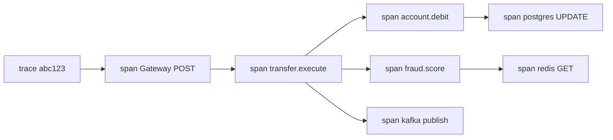
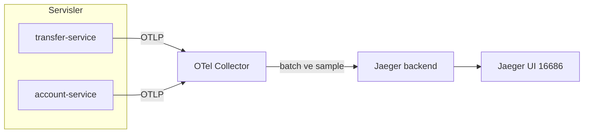
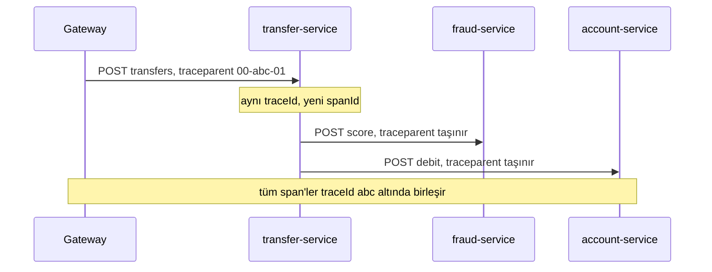
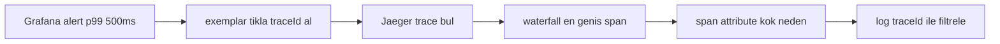

# Topic 7.6 — Distributed Tracing: OpenTelemetry + Jaeger

```admonish info title="Bu bölümde"
- Bir transfer 4-5 servisi gezerken "hangi hop yavaş" sorusunu **trace + span** ile cevaplamak
- OpenTelemetry standardı, W3C `traceparent` header'ı ve cross-service context propagation
- Spring Boot 3 + Micrometer Tracing ile zero-code auto-instrumentation, ne zaman manuel span
- Sampling stratejileri (head-based vs tail-based) ve production maliyet kararı
- Banking'in iki kırmızı çizgisi: span attribute'larda PII yok, span name'de high-cardinality yok
```

## Hedef

Microservice'ler arası request flow'unu **end-to-end trace** etmek. OpenTelemetry standard API/SDK, trace propagation (W3C traceparent), span context, baggage, sampling stratejileri. Spring Boot 3 Micrometer Tracing entegrasyonu. Banking senaryosu: bir transfer request'inin birden çok servisten geçişini Jaeger UI'da takip etmek.

## Süre

Okuma: 2 saat • Kendini Sına: 45 dk • Pratik (opsiyonel): 2 saat • Toplam: ~3 saat (+ pratik)

## Önbilgi

- Topic 7.1-7.5 bitti — microservice architecture, servisler arası HTTP çağrıları
- Phase 1'de basit `X-Trace-Id` filter'ı gördün (Topic 1.7)
- Phase 9 (Observability) tracing'i detaylandırır; burası temeli

---

## Kavramlar

### 1. Distributed tracing problemi

Monolit'te bir stack trace her şeyi anlatır; mikroservice'te request 10+ hop gezer ve tek bir yerde "resmin tamamı" yoktur. Bir transfer şu yolu izler:

```
POST /v1/transfers → [Gateway] → [transfer-service]
  → [account-service] [fraud-service] [audit-service]
  → [DB] → [Kafka] → [notification-service] → [SMS gateway]
```

"Transfer yavaş" şikayeti geldiğinde cevaplaman gereken sorular şunlar: Hangi hop yavaş? Network mi, DB mi, business logic mi? Hangi servisin hangi versiyonu? Cross-service correlation nasıl kurulur?

**Distributed tracing** = bir request'in tüm servisler boyunca akışının end-to-end kaydı. Tek bir request'i bir uçtan diğerine, her hop'un süresiyle birlikte görürsün.

### 2. Trace, Span, Context

Tracing'in tüm sözlüğü üç kavrama iner; önce bunları netleştirmeden ilerlemek anlamsız. **Trace**, bir request'in tam yaşam döngüsüdür ve tek bir unique `traceId` ile tanımlanır.

**Span**, trace içindeki bir iş birimidir — bir method call, bir DB query, bir external request. Her span şunları taşır:

- `spanId` (unique) ve `parentSpanId` (hiyerarşi için)
- `traceId` (hangi trace'e ait)
- `startTime`, `endTime`
- `attributes` (tag'ler), `events` (log noktaları), `status` (OK / ERROR)

Bir trace, span'lerin bir ağacıdır — parent-child ilişkileriyle. Aşağıdaki diyagram tek bir `traceId`'nin nasıl bir span hiyerarşisine dağıldığını gösterir:



Görselleştirildiğinde bu ağaç bir **timeline / waterfall** olur: her span'in başlangıcı ve süresi yatay bir bar. Bottleneck'i gözle görürsün — en geniş bar en yavaş iştir.

### 3. OpenTelemetry (OTel) — modern standard

Eskiden herkes farklı bir tracing kütüphanesi kullanıyordu; bu, vendor kilidi ve uyumsuzluk demekti. **OpenTelemetry**, 2021'de OpenTracing (sadece API spec'i) ile OpenCensus'un (Google, metric + trace) birleşmesiyle doğan vendor-neutral standarttır.

OTel stack'i katmanlıdır:

- **API:** Vendor-neutral arayüzler (`Tracer`, `Span`)
- **SDK:** Implementasyon — sampling, processor, exporter
- **OTLP** (OpenTelemetry Protocol): Binary, gRPC veya HTTP taşıma
- **Collector:** Aggregator; span'leri toplar, işler, backend'e route eder
- **Backend:** Jaeger, Zipkin, Tempo, Datadog...

Bu ayrımın pratik değeri şu: kodun sadece OTel API'sine bağımlıdır, backend'i Jaeger'dan Tempo'ya kod değiştirmeden geçirebilirsin. Span'lerin servislerden backend'e akışı şöyle işler:



### 4. Spring Boot 3 + Micrometer Tracing

Spring Boot 3, eski Sleuth'un yerine **Micrometer Tracing** kullanır; OTel bridge'iyle birlikte kurulum birkaç dependency'den ibarettir.

```xml
<dependency>
    <groupId>org.springframework.boot</groupId>
    <artifactId>spring-boot-starter-actuator</artifactId>
</dependency>
<dependency>
    <groupId>io.micrometer</groupId>
    <artifactId>micrometer-tracing-bridge-otel</artifactId>
</dependency>
<dependency>
    <groupId>io.opentelemetry</groupId>
    <artifactId>opentelemetry-exporter-otlp</artifactId>
</dependency>
```

Config'de örnekleme oranını ve OTLP endpoint'ini verirsin. `probability: 1.0` dev'de her request'i trace eder; production'da bunu düşürürsün.

```yaml
management:
  tracing:
    sampling:
      probability: 1.0   # %100 trace (dev). Production: 0.1
  otlp:
    tracing:
      endpoint: http://otel-collector:4318/v1/traces
      compression: gzip
      timeout: 30s

spring:
  application:
    name: transfer-service
```

Bunu kurduğunda **auto-instrumentation** devreye girer — hiç kod yazmadan span üretilir:

- HTTP server (gelen request → root span)
- HTTP client (WebClient, RestTemplate → child span)
- JDBC (database call'ları)
- Kafka (producer / consumer)
- Reactive (Project Reactor)

Yani trace ve span'lerin çoğu otomatik doğar. Manuel iş, ancak business-critical bir span eklemek istediğinde başlar.

### 5. W3C traceparent — trace propagation

Auto-instrumentation güzel ama tek bir servisin span'i tek başına işe yaramaz; span'lerin aynı `traceId` altında birleşmesi için **context'in servisler arası taşınması** gerekir. Standart, **W3C Trace Context**'tir ve `traceparent` HTTP header'ı üzerinden çalışır.

```
traceparent: 00-{trace-id-32hex}-{parent-span-id-16hex}-{trace-flags-2hex}

Örnek:
traceparent: 00-4a1b2c3d5e6f7a8b9c0d1e2f3a4b5c6d-00f067aa0ba902b7-01
            │  │                                │                │
            │  trace-id (32 hex = 16 byte)      parent span id   flags (sampled=01)
            version (00)
```

`tracestate` header'ı ise vendor-specific ek veriyi taşır (örn. `dd=...,nr=...`). Servis A, aldığı `traceparent`'taki `traceId`'yi korur, kendi span'i için yeni bir `spanId` üretir ve downstream'e aktarır:



Spring Boot 3 + Micrometer, WebClient/RestTemplate çağrılarında bu header'ı **otomatik** ekler. Tehlike, otomasyonun dışına çıktığın anda başlar. <mark>Manuel bir HttpClient veya raw okHttp/HttpURLConnection ile downstream'i çağırırken traceparent header'ını elle eklemeyi unutursan, o noktada trace kopar ve downstream yeni bir root trace açar</mark> — Jaeger'da tek request iki ayrı trace olarak görünür.

#### Kafka trace propagation

HTTP dışında Kafka da context taşır. Producer, span context'i record header'ına yazar:

```java
producer.send(record);  // header'a otomatik eklenir:
// traceparent = 00-abc...-def...-01
// X-Trace-Id  = abc...   (legacy uyumluluk)
```

Consumer tarafında header'dan context restore edilir ve consume span'i aynı trace'e bağlanır:

```java
@KafkaListener(topics = "banking.transfers")
public void onMessage(@Payload Event e,
                      @Header("traceparent") String traceparent) {
    // OTel context restore edilir, span parent'a linklenir
}
```

Spring Kafka + Micrometer Tracing bunu da otomatik propagate eder; async chain tek bir trace olarak görünür.

### 6. Manual span — domain-specific instrumentation

Auto-instrumentation çoğu zaman yeter, ama bazen "transfer.execute 250ms sürdü" gibi **business-anlamlı** bir span'i explicit görmek istersin. `Tracer`'ı inject edip span'i elle açarsın. Önce span'i kur ve domain attribute'larını ekle:

```java
Span span = tracer.spanBuilder("transfer.execute")
    .setAttribute("transfer.amount", req.getAmount().toString())
    .setAttribute("transfer.currency", req.getCurrency())
    .startSpan();
```

Sonra span'i current context'e taşı (`makeCurrent`), işi çalıştır, success/error durumunu işle ve `doFinally` ile mutlaka kapat:

```java
try (Scope scope = span.makeCurrent()) {
    return doExecute(req)
        .doOnSuccess(t -> span.setStatus(StatusCode.OK))
        .doOnError(e -> {
            span.recordException(e);
            span.setStatus(StatusCode.ERROR, e.getMessage());
        })
        .doFinally(sig -> span.end());
}
```

Kritik nokta: reactive akışta `span.end()` mutlaka `doFinally`'de olmalı, yoksa span hiç kapanmaz ve trace yarım kalır.

<details>
<summary>Tam kod: manuel span TransferService (~28 satır)</summary>

```java
@Service
public class TransferService {

    private final Tracer tracer;

    public Mono<Transfer> execute(TransferRequest req) {
        return Mono.deferContextual(ctx -> {
            Span span = tracer.spanBuilder("transfer.execute")
                .setAttribute("transfer.amount", req.getAmount().toString())
                .setAttribute("transfer.currency", req.getCurrency())
                .setAttribute("transfer.from_account", req.getFromAccountId().toString())
                .startSpan();

            try (Scope scope = span.makeCurrent()) {
                return doExecute(req)
                    .doOnSuccess(transfer -> {
                        span.setAttribute("transfer.id", transfer.getId().toString());
                        span.setStatus(StatusCode.OK);
                    })
                    .doOnError(e -> {
                        span.recordException(e);
                        span.setStatus(StatusCode.ERROR, e.getMessage());
                    })
                    .doFinally(signalType -> span.end());
            }
        });
    }
}
```

</details>

Banking'de manuel span koyacağın tipik yerler: `transfer.execute`, `fraud.score`, `account.balance_check`, `kyc.verify`, `tcmb.fx_rate_fetch`.

### 7. @Observed annotation — Spring Boot 3.2+

Yukarıdaki boilerplate'i her method'a yazmak yorucudur; **`@Observed`** aynı işi tek satırda yapar. Span'i otomatik yaratır, exception'ı kaydeder, duration'ı ölçer.

```java
@Observed(name = "transfer.execute",
          contextualName = "execute-transfer",
          lowCardinalityKeyValues = {"operation", "transfer"})
public Mono<Transfer> execute(TransferRequest req) {
    return doExecute(req);
}
```

`@Observed` çalışması için `ObservedAspect` bean'inin registered olması gerekir. Temizliği için manuel span'e tercih edilir; manuel span'i yalnızca `@Observed`'ın yetmediği ince kontrol durumlarında kullan.

### 8. Span attributes — semantic conventions

Attribute isimlerini keyfi seçersen her servis farklı yazar ve query zorlaşır; OpenTelemetry **semantic conventions** ile standart isimler tanımlar. HTTP, DB ve messaging için hazır konvansiyonlar var:

```java
span.setAttribute("http.method", "POST");
span.setAttribute("http.status_code", 201);
span.setAttribute("db.system", "postgresql");
span.setAttribute("db.statement", "SELECT * FROM accounts WHERE id = ?");
span.setAttribute("messaging.system", "kafka");
span.setAttribute("messaging.destination", "banking.transfers");
```

Domain'e özel attribute'ları da tutarlı bir prefix ile ekle (`banking.*`):

```java
span.setAttribute("banking.transfer.amount", amount.toString());
span.setAttribute("banking.account.id", accountId.toString());
span.setAttribute("banking.currency", "TRY");
```

Konvansiyona uymak, Jaeger/Tempo query'lerini ve dashboard'ları tüm servislerde ortak dil haline getirir.

### 9. PII uyarısı — banking için kritik

Tracing UI'ı organizasyonda geniş bir kitle görür: devops, on-call, hatta contractor'lar. Bu yüzden span'ler bir data leak yüzeyidir ve banking'de en sert kuralı buraya koyarız.

```java
// YANLIS — PII leak
span.setAttribute("user.tc_kimlik", "12345678901");
span.setAttribute("user.full_name", "Ali Veli");
span.setAttribute("card.pan", "4111-1111-1111-1234");
span.setAttribute("account.balance", "150000.00");

// DOGRU — internal ID veya redacted
span.setAttribute("user.id", uuid);
span.setAttribute("account.id", uuid);
span.setAttribute("transfer.amount", "AMOUNT_REDACTED");   // veya bucket
```

<mark>Span attribute'larına TC kimlik, kart PAN'ı, tam isim veya bakiye gibi PII koymak KVKK ve PCI-DSS ihlalidir</mark> — internal UUID'ler serbesttir, ama gerçek kişisel/finansal veri asla.

```admonish warning title="PII redaction'ı otomatikleştir"
"Herkes dikkat etsin" bir kontrol mekanizması değildir. `SpanProcessor` seviyesinde bir redaction katmanı ekle: bilinen hassas attribute anahtarlarını (`*.tc_kimlik`, `card.pan`, `*.balance`) export'tan önce maskele veya drop et. Bir de CI'da span attribute isimlerini tarayan bir lint/test tut.
```

### 10. Sampling — production maliyet kararı

Her request'i trace etmek dev'de tatlıdır, production'da pahalıdır: volume × span sayısı × storage × query maliyeti. Kaba bir hesap: 1000 req/sec × trace başına 10 span × 100 byte ≈ 1 MB/sec ≈ 86 GB/gün.

**Head-based sampling** en yaygın ve en ucuz yöntemdir: karar request'in başında verilir.

```yaml
management:
  tracing:
    sampling:
      probability: 0.1   # %10 sampled, %90 dropped
```

Basit ve ucuz ama körlemesine: error veya slow request'ler de sadece %10 ihtimalle yakalanır — asıl ilgilendiğin kritik trace'ler kaçabilir.

**Tail-based sampling** bu körlüğü çözer: tüm span'ler önce Collector'a gider, karar orada verilir. Collector "error veya slow ise tut, normal ise büyük oranda at" der.

```yaml
# OTel Collector config
processors:
  tail_sampling:
    decision_wait: 10s
    policies:
      - name: errors-policy
        type: status_code
        status_code: {status_codes: [ERROR]}
      - name: slow-policy
        type: latency
        latency: {threshold_ms: 1000}
      - name: probabilistic-policy
        type: probabilistic
        probabilistic: {sampling_percentage: 5}
```

Error + slow → %100, normal → %5. Banking için ideal, çünkü "ilginç" trace'leri garantiyle yakalar. Maliyeti: Collector'ın karar için tüm span'leri 10s buffer'da tutması gerekir.

```admonish tip title="Head + tail combo — modern banking stack"
Pratikte ikisini birleştir: App head'de %100 gönderir (tüm span'ler Collector'a), Collector tail ile keep/drop kararını verir. App tarafı basit kalır, "hangi trace ilginç" kararı merkezî ve akıllı olur. Yaygın ve dengeli bir kurulumdur.
```

### 11. Custom sampler — per-endpoint

Bazen "genel %10 ama transfer ve fraud operasyonları %100" gibi asimetrik bir politika istersin; custom bir `Sampler` bean'i ile operasyon adına göre karar verirsin.

```java
@Bean
public Sampler customSampler() {
    return Sampler.parentBased(new Sampler() {
        @Override
        public SamplingResult shouldSample(Context ctx, String traceId,
                String name, SpanKind kind, Attributes attrs, List<LinkData> links) {
            if (name.startsWith("transfer.") || name.startsWith("fraud.")) {
                return SamplingResult.recordAndSample();   // %100
            }
            return probabilisticFallback(0.1).shouldSample(...);   // diğer %10
        }
    });
}
```

Kritik operasyonlar (transfer, fraud) her zaman sampled, gerisi %10. `parentBased` wrapper'ı, bir trace zaten sampled'sa child'ların da sampled kalmasını sağlar — trace'in yarısı kaybolmaz.

### 12. Jaeger UI workflow

Tüm bu span'ler bir yerde toplanıp aranabilmeli; Jaeger, açık kaynak dünyasının en yaygın backend + UI'ıdır. `all-in-one` image'ı ile tek container'da kalkar.

```yaml
# docker-compose.yml
jaeger:
  image: jaegertracing/all-in-one:1.55
  environment:
    COLLECTOR_OTLP_ENABLED: "true"
  ports:
    - "16686:16686"   # UI
    - "4318:4318"     # OTLP HTTP
    - "4317:4317"     # OTLP gRPC
```

`http://localhost:16686`'da service dropdown'dan `transfer-service`, operation'dan `POST /v1/transfers` seçip "Find Traces" dersin. Trace detayında waterfall timeline, span hiyerarşisi, attribute'lar ve highlight edilmiş error'lar görünür.

Banking diagnostic akışı tipik olarak şöyle işler: Grafana alert'i traceId'ye, o da Jaeger'a, o da kök nedene götürür.



### 13. Trace + log + metric correlation

Tracing tek başına değil, **logging ve metrics ile üçlü** çalışır; asıl güç bu üçünü birbirine linkleyebilmektir. Log tarafında Logback pattern'ine `traceId` ve `spanId` gömersin:

```yaml
logging:
  pattern:
    level: "%5p [${spring.application.name:},%X{traceId:-},%X{spanId:-}]"
```

Böylece her log satırı hangi trace'e ait olduğunu taşır:

```
2025-05-13T10:30:00Z INFO [transfer-service,abc123,def456] TransferService - Processing transfer
```

`traceId` ile Loki/Elasticsearch'te log ararsın, aynı `traceId` ile Jaeger'da trace'i açarsın — iki dünya birbirine bağlanır.

Metric tarafında **exemplars** aynı köprüyü kurar: Prometheus histogram'ına örnek trace ID'leri iliştirilir.

```yaml
management:
  metrics:
    distribution:
      percentiles-histogram:
        http.server.requests: true
```

Grafana panelinde p99 spike'ının üstündeki dot'a tıklarsın, trace ID'yi alır, Jaeger'a atlarsın. Banking observability'nin klasik akışı budur: panelde spike → exemplar → Jaeger → root cause.

### 14. Baggage — cross-cutting context

`traceId`/`spanId` otomatik propagate olur, ama bazen "bu tenant premium mı" gibi **application-defined** bir bilgiyi de tüm downstream'e taşımak istersin; bunun aracı **baggage**'dır.

```java
Baggage.builder()
    .put("tenant", "tr")
    .put("user-tier", "premium")
    .build()
    .makeCurrent();

// downstream serviste:
String tenant = Baggage.current().getEntryValue("tenant");
```

Banking'de tipik kullanım multi-tenant context propagation'dır. Ama tehlikesi net: baggage tüm span'lere propagate olur **ve HTTP header'ına yazılır**. Bu yüzden içine PII koyma, payload'ı şişirme — yalnızca küçük, internal context (tenant ID, user tier) taşı.

### 15. Banking örnek — full transfer trace

Şimdi her şeyi birleştiren gerçek bir trace'e bakalım. Waterfall'da her span'in girinti derinliği parent-child ilişkisini, süresi de maliyeti gösterir. Kısaltılmış hali:

```
[Gateway] POST /v1/transfers (280ms)
├── auth-filter (8ms)
└── transfer-service POST /transfers (260ms)
    └── transfer.execute (250ms)
        ├── fraud.score (45ms)          → fraud-service HTTP
        ├── account.debit (60ms)        → SELECT FOR UPDATE 8ms
        ├── account.credit (55ms)
        └── outbox.publish (10ms)
```

Bu waterfall'dan üç diagnostic okuma çıkar: `account.debit` içindeki `SELECT FOR UPDATE` 8ms — lock contention işareti; ayrıca notification async koludur, kullanıcıya transfer 280ms'te döner, SMS sonra gider.

<details>
<summary>Tam trace ağacı: transfer end-to-end (~40 satır)</summary>

```
traceId: 4a1b2c3d5e6f7a8b9c0d1e2f3a4b5c6d

[Gateway] POST /v1/transfers (totalDuration: 280ms)
├── auth-filter (8ms)
│   └── jwt.validate (3ms)
├── rate-limit (1ms)
│   └── redis.GET (1ms)
└── route to transfer-service (270ms)
    └── transfer-service.HTTP POST /transfers (260ms)
        ├── transfer.execute (250ms)
        │   ├── idempotency.check (5ms)
        │   │   └── postgres SELECT (3ms)
        │   ├── fraud.score (45ms)
        │   │   └── fraud-service.HTTP POST /score (40ms)
        │   │       └── fraud.compute_score (35ms)
        │   │           └── redis.GET account-info (2ms)
        │   ├── account.debit (60ms)
        │   │   └── account-service.HTTP POST /accounts/A/debit (55ms)
        │   │       ├── postgres SELECT FOR UPDATE (8ms)
        │   │       ├── postgres UPDATE (10ms)
        │   │       └── journal_line.insert (8ms)
        │   ├── account.credit (55ms)
        │   ├── transfer.save (15ms)
        │   │   └── postgres INSERT (12ms)
        │   └── outbox.publish (10ms)
        │       └── postgres INSERT outbox (6ms)
        └── http_response_to_gateway (5ms)

Async (parent linked):
[outbox publisher] (linked to original trace)
├── postgres SELECT FOR UPDATE outbox (10ms)
└── kafka.publish (15ms)

[notification-service] consumer (linked)
├── kafka.consume (1ms)
├── notification.send (200ms)
│   └── sms-gateway.HTTP POST (180ms)
└── postgres INSERT processed_event (5ms)
```

</details>

### 16. Banking anti-pattern'leri

Mülakatta "bu tracing setup'ında ne yanlış" sorusunun cephaneliği burasıdır; yedi klasik hata.

**1 — Production'da %100 sampling:** Storage ve maliyet patlar. %1-10 head-based + error'lar için tail-based kullan.

**2 — Her method'da manuel span:** Auto-instrumentation zaten çoğunu üretir; manuel span'i yalnızca business-critical noktalara koy. Otomatik span'in üstüne elle span açmak gürültü ve maliyettir.

**3 — Span attribute'ında PII:** KVKK + PCI-DSS ihlali. Yasak. (Bölüm 9.)

**4 — High-cardinality span name:** Span adına path parametresi gömmek cardinality'yi patlatır.

```java
span.setSpanName("GET /accounts/123e4567-...");   // YANLIS — her ID yeni span adı
// DOGRU:
span.setSpanName("GET /accounts/{id}");
span.setAttribute("account.id", id.toString());
```

<mark>Span name'e UUID veya hesap numarası gibi değişken değer koyma; template kullan (`/accounts/{id}`) ve değişkeni attribute'a taşı</mark> — aksi halde backend'de milyonlarca farklı operasyon adı oluşur.

**5 — Reactive'de sync span context kaybı:** Reactive `Mono` içinde düz `Span.makeCurrent()` context'i kaybedebilir. Banking pratiği: `Mono.deferContextual` + Micrometer Observation.

**6 — Cross-service propagation eksik:** Service A'ya gelen `traceparent`, Service B'ye gitmezse trace kopar. Spring Boot 3 + Micrometer otomatik yapar; custom HTTP client'ta header'ı elle eklemek zorundasın.

**7 — Async'te parent span lost:** `@Async` veya manuel Kafka publish/consume'da context kaybolabilir. Spring Kafka + Tracing built-in çözer; manuel async için context'i elle propagate et.

```admonish warning title="En sık iki propagation hatası"
İki hata trace'i sessizce koparır: (1) custom/manuel HTTP client'ta `traceparent` header'ını eklemeyi unutmak, (2) `@Async` veya manuel thread'e geçerken OTel context'i taşımamak. İkisinde de kod çalışır, hata log'u yoktur — sadece Jaeger'da bir request iki ayrı trace olur. Manuel HTTP/async yazdığın her yerde propagation'ı explicit test et.
```

---

## Önemli olabilecek araştırma kaynakları

- OpenTelemetry official documentation
- "Mastering Distributed Tracing" — Yuri Shkuro (Jaeger author)
- Spring Boot 3 Tracing reference
- Micrometer Tracing — Sleuth migration guide
- W3C Trace Context spec
- Jaeger / Tempo / Zipkin karşılaştırmaları

---

## Kendini Sına

Aşağıdaki soruları önce **cevaba bakmadan** kendi cümlelerinle yanıtlamayı dene — hepsi distributed tracing mülakatlarında karşına çıkabilecek tarzda. Takıldığında ilgili Kavramlar başlığına dön, sonra tekrar dene.

**S1. Trace ile span arasındaki fark nedir? Bir transfer request'inde bunları nasıl eşleştirirsin?**

<details>
<summary>Cevabı göster</summary>

Trace bir request'in tüm yaşam döngüsüdür ve tek bir unique `traceId` ile tanımlanır; span ise o trace içindeki tek bir iş birimidir (method call, DB query, external HTTP). Bir trace, span'lerin `parentSpanId` ile bağlanmış bir ağacıdır.

Transfer örneğinde: tüm istek bir trace'tir (`traceId: abc123`). Gateway'in POST'u root span, `transfer.execute` onun child'ı, `account.debit` ve `fraud.score` onun child'ları, `postgres UPDATE` ise `account.debit`'in child'ıdır. Waterfall'da bu hiyerarşi girintiyle, süreler bar genişliğiyle görünür — en geniş bar bottleneck'tir.

</details>

**S2. W3C traceparent header'ı hangi alanlardan oluşur ve cross-service propagation nasıl çalışır?**

<details>
<summary>Cevabı göster</summary>

`traceparent` dört alan taşır: `version-traceid-parentspanid-flags`, örneğin `00-4a1b...5c6d-00f067aa0ba902b7-01`. traceId 32 hex (16 byte), parent span id 16 hex (8 byte), flags'te `01` sampled demektir.

Propagation'da servis A, gelen `traceparent`'taki `traceId`'yi korur, kendi işi için yeni bir `spanId` üretir ve downstream çağrısına yeni bir `traceparent` (aynı traceId, yeni parent span id) yazar. Böylece tüm servislerin span'leri aynı `traceId` altında birleşir. Spring Boot 3 + Micrometer bunu WebClient/RestTemplate'te otomatik yapar; `tracestate` header'ı ise vendor-specific ek veriyi taşır.

</details>

**S3. Manuel bir HttpClient ile downstream servisi çağırırken traceparent header'ını eklemeyi unutursan ne olur? Nasıl fark eder ve nasıl önlersin?**

<details>
<summary>Cevabı göster</summary>

Trace o noktada kopar. Downstream servis gelen request'te `traceparent` bulamadığı için yeni bir root trace açar; sonuç olarak Jaeger'da tek bir kullanıcı request'i iki ayrı, birbiriyle ilişkisiz trace olarak görünür. Kod hatasız çalışır, exception yoktur — sadece end-to-end görünürlük sessizce kaybolur.

Fark etmesi zordur çünkü log'da iz bırakmaz; en iyi savunma bir integration test'tir: downstream çağrının gerçekten `traceparent` header'ı taşıdığını assert et. Önlemek için mümkünse auto-instrumented client (WebClient/RestTemplate) kullan; ille manuel client gerekiyorsa `Span.current().getSpanContext()`'ten header'ı elle üretip ekle ve bunu her manuel client noktasında yap.

</details>

**S4. Head-based ve tail-based sampling arasındaki fark nedir? Banking için hangisini neden seçersin?**

<details>
<summary>Cevabı göster</summary>

Head-based sampling kararı request'in başında verir (örn. `probability: 0.1` → %10 tut, %90 at); basit ve ucuzdur ama körlemesinedir — error ve slow request'ler de sadece %10 ihtimalle yakalanır. Tail-based'de tüm span'ler önce Collector'a gider, karar orada verilir: Collector "error veya latency > 1s ise tut, normal ise %5 tut" gibi politikalar uygular.

Banking için tail-based (veya head+tail combo) ideal çünkü asıl ilgilendiğin "ilginç" trace'leri — hatalar ve yavaş işlemler — garantiyle yakalar. Bedeli, Collector'ın karar için span'leri birkaç saniye buffer'da tutmasıdır. Yaygın modern kurulum: app head'de %100 gönderir, Collector tail'de keep/drop kararını verir.

</details>

**S5. Span attribute'larına PII koymak neden banking'de kesin yasaktır? Neyi koyabilirsin, neyi koyamazsın?**

<details>
<summary>Cevabı göster</summary>

Tracing UI'ını organizasyonda geniş bir kitle görür — devops, on-call, contractor'lar. Span attribute'ları bu yüzden bir data leak yüzeyidir; TC kimlik, kart PAN'ı, tam isim veya bakiye koymak doğrudan KVKK ve PCI-DSS ihlalidir.

Koyabileceklerin internal, anlamsız ID'lerdir: `user.id` (UUID), `account.id` (UUID), `transfer.id`. Koyamayacakların gerçek kişisel/finansal veridir; miktar gibi alanları ya redact et (`AMOUNT_REDACTED`) ya da bucket'la. Doğru çözüm "herkes dikkat etsin" değil, export'tan önce bilinen hassas anahtarları maskeleyen bir `SpanProcessor` ve CI'da attribute isimlerini tarayan bir kontroldür.

</details>

**S6. Span name'e hesap ID'si gibi değişken bir değer koymak neden tehlikelidir? Doğrusu nedir?**

<details>
<summary>Cevabı göster</summary>

Span name high-cardinality olmamalıdır. `GET /accounts/123e4567-...` gibi her isteğe özel bir isim kullanırsan, her farklı UUID backend'de ayrı bir "operation" olur; milyonlarca benzersiz operasyon adı oluşur, storage ve index maliyeti patlar, UI'daki operation dropdown kullanılamaz hale gelir.

Doğrusu span name'i template'lemektir: `GET /accounts/{id}`. Değişken değeri span name'e değil, bir attribute'a koyarsın: `span.setAttribute("account.id", id.toString())`. Böylece operasyon adı düşük cardinality kalır, ama tekil isteği yine `account.id` ile arayabilirsin.

</details>

**S7. Kafka üzerinden geçen async bir chain'de (transfer publish → notification consume) trace tek parça kalır mı? Nasıl?**

<details>
<summary>Cevabı göster</summary>

Evet, kalabilir — çünkü context sadece HTTP değil, Kafka üzerinden de propagate edilir. Producer, span context'i record header'ına yazar (`traceparent`, ayrıca legacy uyumu için `X-Trace-Id`). Consumer bu header'dan context'i restore eder ve consume span'ini aynı trace'e (parent'a link'li olarak) bağlar.

Spring Kafka + Micrometer Tracing bunu otomatik yapar; `@KafkaListener` ile mesajı işlerken span aynı `traceId` altında görünür. Tuzak, manuel producer/consumer veya `@Async` kullandığın yerlerdir: orada context'i elle taşımazsan async kol parent span'ini kaybeder ve trace kopar.

</details>

**S8. Auto-instrumentation neredeyse her şeyi otomatik span'liyorsa manuel span'e ne zaman ihtiyaç duyarsın?**

<details>
<summary>Cevabı göster</summary>

Auto-instrumentation HTTP server/client, JDBC, Kafka ve reactive'i kapsar — teknik hop'ların hemen hepsini otomatik span'ler. Manuel span'e yalnızca **business-anlamlı** bir birimi explicit görmek istediğinde ihtiyaç duyarsın: `transfer.execute`, `fraud.score`, `kyc.verify` gibi. Bunlar tek bir teknik call'a denk gelmeyen, domain açısından anlamlı işlerdir.

Modern yolu `@Observed` annotation'ıdır — span'i yaratır, exception'ı kaydeder, duration'ı ölçer, boilerplate yok. Düz `Tracer` API'sini yalnızca `@Observed`'ın yetmediği ince kontrol durumlarında kullan. Anti-pattern, zaten otomatik span'lenen her method'un üstüne elle span açmaktır — bu sadece gürültü ve maliyet ekler.

</details>

---

## Tamamlama kriterleri

- [ ] Trace, span ve context kavramlarını ve waterfall görünümünü 2 dakikada anlatabiliyorum
- [ ] OpenTelemetry stack'ini (API, SDK, OTLP, Collector, backend) ve eski standartlardan farkını biliyorum
- [ ] W3C traceparent header formatını ve cross-service propagation'ı açıklayabiliyorum
- [ ] Auto-instrumentation ile manuel span (@Observed) arasında ne zaman hangisini seçeceğimi biliyorum
- [ ] Head-based vs tail-based sampling farkını ve banking kararını gerekçelendirebiliyorum
- [ ] Span attribute'larda PII yasağını (KVKK + PCI-DSS) ve redaction yaklaşımını anlatabiliyorum
- [ ] High-cardinality span name tuzağını ve template çözümünü biliyorum
- [ ] Kafka trace propagation ile async chain'in tek trace kalmasını açıklayabiliyorum
- [ ] Manuel HTTP client / @Async'te propagation kopması riskini ve önlemini biliyorum
- [ ] Log correlation (traceId in MDC) ve metric exemplars köprüsünü tarif edebiliyorum

---

## Defter notları

1. "Trace + Span + Context kavramları + waterfall view: ____."
2. "OpenTelemetry vs eski (OpenTracing, OpenCensus, vendor): ____."
3. "W3C traceparent header format ve cross-service propagation: ____."
4. "Auto-instrumentation vs manuel span (@Observed) ne zaman hangisi: ____."
5. "Sampling head-based vs tail-based banking için karar: ____."
6. "PII span attribute'larında tehlikesi (KVKK + PCI-DSS) ve redaction: ____."
7. "Span name template (low-cardinality) — high-cardinality tag tuzağı: ____."
8. "Exemplars Grafana → Jaeger link banking observability: ____."
9. "Kafka trace propagation header üzerinden async chain: ____."
10. "Baggage cross-cutting context — tenant propagation banking: ____."

```admonish success title="Bölüm Özeti"
- Distributed tracing bir request'in tüm servisler boyunca akışını kaydeder: trace = request'in yaşam döngüsü, span = içindeki tek iş birimi, hepsi tek `traceId` altında bir ağaç
- OpenTelemetry vendor-neutral standarttır (API + SDK + OTLP + Collector + backend); Spring Boot 3 + Micrometer Tracing HTTP/JDBC/Kafka'yı zero-code auto-instrument eder
- W3C `traceparent` header'ı context'i servisler arası taşır; kopmanın iki klasik sebebi manuel HTTP client'ta header'ı unutmak ve async'te context'i taşımamaktır
- Sampling maliyet kararıdır: production'da %100 yapma; head-based ucuz ama kör, tail-based error/slow'u garantiler, combo modern banking standardıdır
- Banking'in iki kırmızı çizgisi: span attribute'larda PII yok (KVKK + PCI-DSS), span name'de high-cardinality yok (path param'ı attribute'a taşı)
- Tracing tek başına değil: `traceId`'yi log MDC'sine göm ve metric exemplars ile bağla — Grafana spike → exemplar → Jaeger → log → root cause
```

---

## Pratik yapmak istersen

Kavramları koda dökmek istersen aşağıdaki iki ek hazır: test yazma rehberi tracing setup, cross-service propagation, PII kontrolü ve custom sampler için örnek testler içerir; Claude-verify prompt'u ile yazdığın tracing kurulumunu banking-grade perspektiften denetletebilirsin.

<details>
<summary>Test yazma rehberi</summary>

Testcontainers ile gerçek bir Jaeger container'ı kaldırıp, request sonrası trace'in export edildiğini Jaeger API'sinden doğrularsın. Temel iskelet:

```java
@SpringBootTest
@Testcontainers
class TracingIntegrationTest {

    @Container
    static GenericContainer<?> jaeger = new GenericContainer<>("jaegertracing/all-in-one:1.55")
        .withExposedPorts(16686, 4318);

    @DynamicPropertySource
    static void configureTracing(DynamicPropertyRegistry registry) {
        registry.add("management.otlp.tracing.endpoint",
            () -> "http://" + jaeger.getHost() + ":" + jaeger.getMappedPort(4318) + "/v1/traces");
        registry.add("management.tracing.sampling.probability", () -> "1.0");
    }
}
```

### Test 7.6.1 — Request için trace üretilmeli

```java
@Test
void shouldCreateTraceForRequest() throws Exception {
    webClient.post().uri("/v1/transfers")
        .header("Authorization", "Bearer ...")
        .bodyValue(createTransferRequest())
        .exchange()
        .expectStatus().isCreated();

    Thread.sleep(2000);   // async export'u bekle

    String response = restTemplate.getForObject(
        "http://" + jaeger.getHost() + ":" + jaeger.getMappedPort(16686) +
        "/api/traces?service=transfer-service&operation=POST%20/v1/transfers",
        String.class);

    assertThat(response).contains("transfer.execute");
    assertThat(response).contains("traceID");
}
```

### Test 7.6.2 — Cross-service propagation

Downstream servise giden request'in `traceparent` header'ı taşıdığını ve child span'in parent'a linklendiğini assert et. Bu, S3'teki "manuel client'ta header'ı unutma" tuzağını yakalayan testtir:

```java
@Test
void shouldPropagateTraceAcrossServices() {
    // 1. transfer-service'e request at
    // 2. account-service'e giden çağrının traceparent header'ını yakala (MockWebServer / WireMock)
    // 3. traceparent'taki traceId == root trace'in traceId'si olmalı
    // 4. child span'in parentSpanId'si root span'e işaret etmeli
}
```

### Test 7.6.3 — PII span attribute'larda olmamalı

```java
@Test
void shouldNotIncludePiiInSpanAttributes() {
    // Hassas alan içeren bir request at
    // Jaeger'dan trace'i çek
    // Hiçbir span'de tc_kimlik, card.pan, full_name, balance olmamalı
    assertThat(traceJson).doesNotContain("tc_kimlik", "card.pan", "full_name");
}
```

### Test 7.6.4 — Custom sampler davranışı

`transfer.*` operasyonlarının %100, diğerlerinin %10 sampled olduğunu doğrula. `probability`'yi 0'a çekip yalnızca custom sampler'ın recordAndSample dediği `transfer.*` span'lerinin export edildiğini gözlemle.

### Bonus — log correlation

Bir request at, log output'unu yakala (`OutputCaptureExtension`), log satırında MDC'den gelen `traceId`'nin göründüğünü ve aynı `traceId`'nin Jaeger trace'iyle eşleştiğini assert et.

</details>

<details>
<summary>Claude-verify prompt</summary>

```
Distributed tracing setup'ımı banking-grade kriterlere göre değerlendir.
Eksikleri işaretle, kod yazma:

1. OpenTelemetry setup:
   - Micrometer Tracing bridge + OTLP exporter var mı?
   - Spring Boot 3 native config mi?
   - OTLP collector endpoint configurable mı?

2. Auto-instrumentation:
   - HTTP server (incoming) trace'leniyor mu?
   - HTTP client (WebClient) child span yaratıyor mu?
   - JDBC ve Kafka producer/consumer span'leniyor mu?

3. Trace propagation:
   - W3C traceparent header cross-service taşınıyor mu?
   - Kafka header trace propagation var mı?
   - Manuel HTTP client / @Async noktalarında propagation kopması riski var mı?

4. Manuel span:
   - Kritik business operation (@Observed) instrument edilmiş mi?
   - Span attribute'lar semantic conventions'a uyuyor mu?
   - Domain attribute'lar tutarlı prefix'li mi (banking.transfer.amount)?

5. Sampling:
   - Production sampling rate makul mü (%1-10)?
   - Kritik operasyonlar %100 mü (custom sampler)?
   - Tail-based sampling düşünülmüş mü?

6. PII protection:
   - Span attribute'larda PII YOK mu (tc_no, card.pan, balance)?
   - Redaction bir SpanProcessor ile otomatik mi?
   - Internal ID (UUID) kullanımı OK mu?

7. Cardinality:
   - Span name template'li mi (path param yok)?
   - High-cardinality değerler attribute'a mı taşınmış?

8. Log & metric correlation:
   - Logback pattern'inde traceId + spanId var mı?
   - Prometheus exemplars enabled + Grafana'dan Jaeger link var mı?

9. Anti-pattern:
   - Production'da %100 sampling?
   - Her method'da manuel span?
   - Cross-service veya async propagation eksik?

10. Test coverage:
    - Trace üretimi testi?
    - Cross-service propagation testi (traceparent header)?
    - PII scan testi?
    - Custom sampler testi?

Her madde için PASS / FAIL / EKSIK işaretle, kanıt göster, kod yazma.
```

</details>
