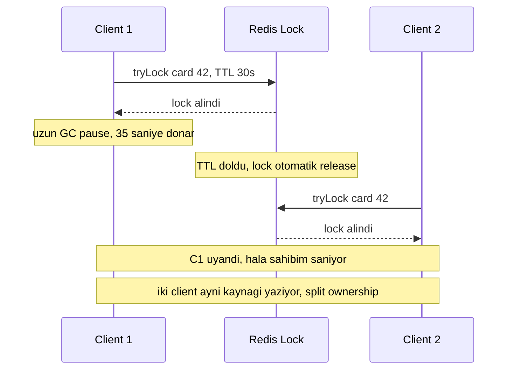
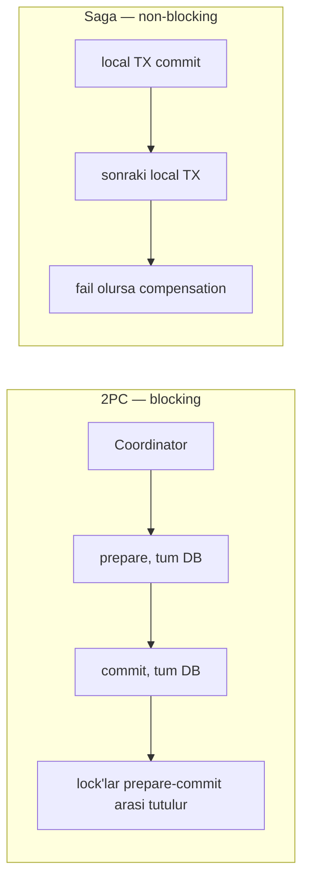
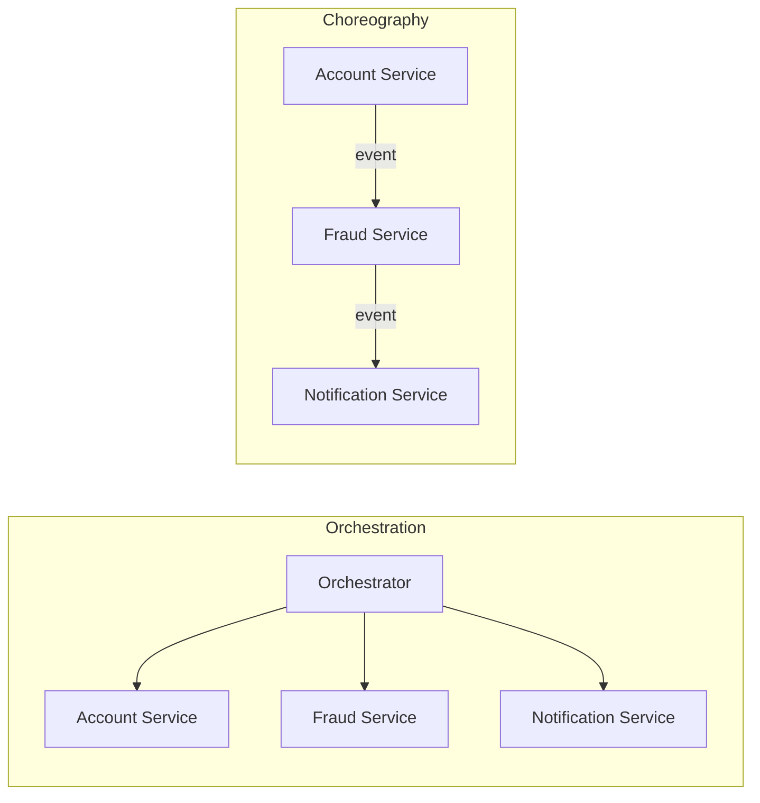
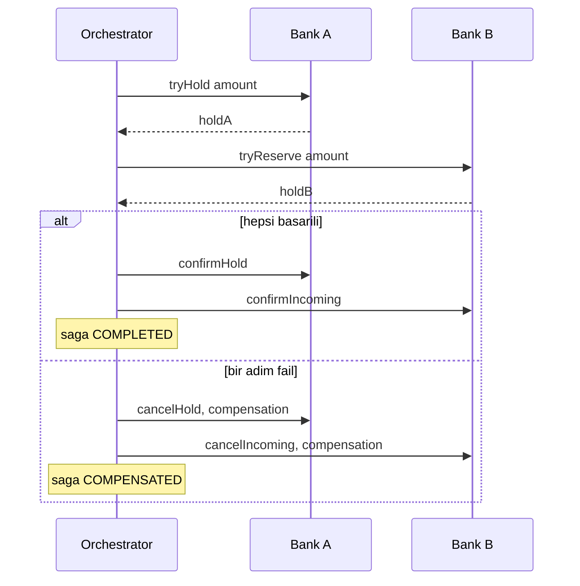

# Topic 7.7 — Distributed Locks & Transactions

```admonish info title="Bu bölümde"
- Redis SETNX/Redlock ile distributed lock kurmak — ve Kleppmann kritiğinin neden banking'de "DB-level lock primary, distributed lock advisory" dedirttiği
- ZooKeeper, ShedLock, `pg_advisory_lock` alternatifleri ve hangi ihtiyaca hangisinin oturduğu
- 2PC neden banking'de yasak; Saga'nın orchestration ile choreography farkı
- TCC Try-Confirm-Cancel pattern'ini banking kart authorization örneğiyle uçtan uca
- Cross-service idempotency ve compensating action'ı idempotent tasarlamak
```

## Hedef

Microservice ortamında **distributed lock** ve **distributed transaction** çözümlerini banking-grade seviyede uygulamak. Redis Redlock, ZooKeeper, ShedLock, `pg_advisory_lock` pattern'lerini; 2PC'nin neden production banking'de kötü olduğunu; alternatif olarak Saga (Phase 6'da temeli verildi) ve TCC'yi; cross-service idempotency'i hatasız anlatabilmek.

## Süre

Okuma: 2-2.5 saat • Kendini Sına: 45 dk • Pratik (opsiyonel): 3-4 saat • Toplam: ~3 saat (+ pratik)

## Önbilgi

- Topic 7.1-7.6 bitti (microservice architecture)
- Phase 4 Topic 6 (DB concurrency) — `SELECT FOR UPDATE`, `DBMS_LOCK`
- Phase 5 Topic 6 (Scheduling) — ShedLock
- Phase 6 Topic 7 (Saga pattern) — saga temeli, compensation kavramı

---

## Kavramlar

### 1. Distributed lock — ne zaman gerekir

Para A servisten çıktı, aynı kart için ikinci bir işlem paralel geldi, ikisi de bakiyeyi okudu ve ikisi de geçti — tek makinedeki `synchronized` bunu microservice sınırları ötesinde çözemez. **Distributed lock** tam bu "aynı kaynağa aynı anda tek işlem" ihtiyacını process'ler arası çözer.

Microservice'lerde mutex gereken beş tipik senaryo:

1. **Singleton job:** EOD reconciliation 3 instance'tan **tek**inde çalışsın
2. **Exclusive resource:** Bir kart için aynı anda **tek transaction**
3. **Race condition prevention:** Cross-service operation'da
4. **Cache stampede:** Çok thread aynı değeri compute etmesin → sadece 1
5. **Distributed singleton:** Service initialization'ı tek instance yapsın

Somut felaket senaryosu — lock olmadan bir singleton job:

```
3 instance EOD reconciliation job çalıştırıyor
Cron 23:55'te tetiklenir → 3 instance aynı anda başlar
   ↓ distributed lock yok
3 paralel run → duplicate işlem, mismatch report 3 kez yazılır → felaket
```

### 2. Single-machine vs distributed lock — neden zor

Tek makinede `ReentrantLock` güvenilirdir: JVM ownership'i takip eder, thread crash olursa lock durumunu bilir. Distributed lock ise network üzerinden konuşur ve bu her şeyi kırılgan yapar.

Distributed dünyada dört sorun aynı anda vardır: **process crash** (lock nasıl release olacak?), **network partition** (split-brain), **clock drift** (TTL belirsiz), **GC/process pause** (lock sahibi donarken TTL dolabilir). Bunlar "hard problems" — çözümü tam değil, mühendislik takası var.

Bu yüzden banking'in pragmatik duruşu net: **DB-level lock primary, distributed lock advisory**. Kritik para hareketinin tutarlılığı DB'nin ACID garantisinde yaşar; distributed lock çoğu zaman sadece "gereksiz paralel iş yapmayalım" için vardır.

### 3. Redis SETNX + TTL — temel distributed lock

En temel distributed lock: Redis'te bir anahtarı TTL'li olarak "yoksa yaz" (`setIfAbsent`) ile yaz. Anahtar yoksa yazılır, yani lock alınır; varsa reddedilir. Kilidi alan taraf bir **token** üretir ki sadece sahip serbest bırakabilsin.

```java
public Optional<String> tryLock(String key, Duration ttl) {
    String token = UUID.randomUUID().toString();
    Boolean acquired = redis.opsForValue().setIfAbsent(
        "lock:" + key, token, ttl
    );
    return Boolean.TRUE.equals(acquired) ? Optional.of(token) : Optional.empty();
}
```

Kritik nokta: `setIfAbsent(key, value, ttl)` — SETNX ve TTL **tek atomic operation**. Ayrı yaparsan SETNX ile TTL arasında app crash olur, lock sonsuza kalır.

Unlock'ta ise "önce GET et token'ı doğrula, sonra DEL et" iki ayrı komut olamaz — arada TTL dolup başkası lock alabilir. Bu yüzden check-and-delete'i **Lua script** ile atomik yaparız:

```java
public boolean unlock(String key, String token) {
    String script = """
        if redis.call('GET', KEYS[1]) == ARGV[1] then
            return redis.call('DEL', KEYS[1])
        else
            return 0
        end
    """;
    Long result = redis.execute(
        new DefaultRedisScript<>(script, Long.class),
        Collections.singletonList("lock:" + key),
        token
    );
    return result != null && result == 1L;
}
```

Üç fail-safe birlikte çalışır: **SETNX+TTL atomic** (lock sonsuza kalmaz), **token-based ownership** (yalnız sahip siler), **TTL** (sahip crash etse bile otomatik release).

<details>
<summary>Tam kod: RedisDistributedLock (~32 satır)</summary>

```java
@Service
public class RedisDistributedLock {

    private final StringRedisTemplate redis;

    public Optional<String> tryLock(String key, Duration ttl) {
        String token = UUID.randomUUID().toString();
        Boolean acquired = redis.opsForValue().setIfAbsent(
            "lock:" + key, token, ttl
        );
        return Boolean.TRUE.equals(acquired) ? Optional.of(token) : Optional.empty();
    }

    public boolean unlock(String key, String token) {
        // Lua script — atomic check-and-delete
        String script = """
            if redis.call('GET', KEYS[1]) == ARGV[1] then
                return redis.call('DEL', KEYS[1])
            else
                return 0
            end
        """;
        Long result = redis.execute(
            new DefaultRedisScript<>(script, Long.class),
            Collections.singletonList("lock:" + key),
            token
        );
        return result != null && result == 1L;
    }
}
```

</details>

Banking kullanımı — aynı kartla iki paralel işlemi seri hale getirmek:

```java
public void processCardTransaction(UUID cardId, BigDecimal amount) {
    Optional<String> token = lock.tryLock("card:" + cardId, Duration.ofSeconds(30));

    if (token.isEmpty()) {
        throw new ResourceBusyException(
            "Card transaction already in progress for: " + cardId);
    }
    try {
        cardService.processTransaction(cardId, amount);   // exclusive operation
    } finally {
        lock.unlock("card:" + cardId, token.get());
    }
}
```

İkinci paralel işlem `ResourceBusyException` alır ve retry eder.

### 4. Redlock — Redis cluster ve Kleppmann kritiği

Tek Redis instance fail edebilir. **Redlock**, birden çok bağımsız Redis instance'a quorum-based (çoğunluk) locking yaparak bunu çözmeye çalışır; Redisson kütüphanesi hazır bir implementasyon sunar:

```java
RLock lock = redisson.getLock("card:" + cardId);
if (lock.tryLock(0, 30, TimeUnit.SECONDS)) {
    try {
        // critical section
    } finally {
        lock.unlock();
    }
}
```

Ama Martin Kleppmann'ın ünlü kritiği şudur: Redlock asenkron network'te %100 güvenli değildir. Bir client lock'u alır, sonra uzun bir **GC pause**'a girer; bu sırada TTL dolar, lock release olur, ikinci client lock'u kapar. İlk client uyanınca hâlâ sahip olduğunu sanır — iki client aynı kaynağı yazar. Aynı problem clock drift ile de doğar.



Bu yüzden banking'de karar keskindir. <mark>Critical financial operation'da tutarlılığı distributed lock'a değil, DB-level lock ile idempotency'e emanet et; Redis lock yalnız advisory kalsın.</mark> Non-critical işler (cache invalidation, rate limit) için Redis SETNX zaten yeterlidir.

```admonish warning title="Lock TTL, iş bitmeden dolarsa"
`lock.tryLock("transfer:" + id, Duration.ofMinutes(5))` dedin ama iş 6 dakika sürdü. TTL doldu, lock release oldu, başka client aldı — orijinal client hâlâ çalışıyor. İki taraf aynı state'i yazar, tutarsızlık doğar. Fencing token (monoton artan sürüm) yardımcı olur ama tam çözüm yine kritik işi DB-level lock + idempotency'e taşımaktır.
```

### 5. ZooKeeper — ephemeral nodes

ZooKeeper, ZAB consensus protokolü ile strong consistency sunar; Apache Curator'ın `InterProcessMutex`'i kolay bir kilit verir:

```java
InterProcessMutex lock = new InterProcessMutex(client, "/banking/locks/eod-job");
if (lock.acquire(10, TimeUnit.SECONDS)) {
    try {
        eodReconciliationJob.run();
    } finally {
        lock.release();
    }
}
```

En değerli özelliği **ephemeral node**: client'ın bağlantısı koparsa node otomatik silinir, yani lock TTL tahminine gerek kalmadan release olur. Avantajları strong consistency, connection-based release ve multi-data-center desteğidir; dezavantajları ise ZooKeeper cluster'ı işletmenin operasyonel yükü ve Redis'e göre yüksek latency.

Banking pratiği: ZooKeeper banking'de yaygın değildir (eskiden Kafka için gerekirdi). Modern stack Kafka KRaft + Redis ya da DB lock ile idare eder.

### 6. ShedLock — scheduled job mutex (Phase 5 revisit)

Scheduled bir job'ın çok instance'ta paralel koşmasını engellemek için `@SchedulerLock` yeterlidir; JDBC-backed lock provider tek bir tabloyu kullanır:

```java
@Scheduled(cron = "0 55 23 * * *")
@SchedulerLock(name = "eodReconciliation", lockAtMostFor = "2h", lockAtLeastFor = "5m")
public void runEodReconciliation() { ... }
```

Lock durumu `shedlock` tablosunda tutulur (`name` PK, `lock_until`, `locked_at`, `locked_by`). `lockAtMostFor` job süresinin 2-3 katı olmalı — instance crash edip lock'u temizleyemezse bu süre sonunda otomatik serbest kalır. Banking'de "scheduled job tek instance garantisi" gereken hemen her yerde standart çözüm budur.

### 7. pg_advisory_lock — PostgreSQL native

Banking uygulaması zaten PostgreSQL kullanıyorsa, ekstra bir servise (Redis, ZK) hiç gerek kalmadan native distributed lock alınabilir. `pg_advisory_lock` session'a bağlıdır:

```sql
-- Session 1
SELECT pg_advisory_lock(12345);   -- lock number
-- ... work ...
SELECT pg_advisory_unlock(12345);

-- Session 2
SELECT pg_advisory_lock(12345);   -- session 1 unlock edene kadar bekler
```

Java tarafında `pg_try_advisory_lock` (non-blocking) ile temiz bir wrapper yazılır:

```java
public <T> T executeWithLock(long lockId, Supplier<T> action) {
    if (!tryLock(lockId)) {
        throw new IllegalStateException("Could not acquire lock: " + lockId);
    }
    try {
        return action.get();
    } finally {
        unlock(lockId);
    }
}
```

<details>
<summary>Tam kod: PostgresLockService (~28 satır)</summary>

```java
@Service
public class PostgresLockService {

    private final JdbcTemplate jdbc;

    public boolean tryLock(long lockId) {
        return Boolean.TRUE.equals(
            jdbc.queryForObject("SELECT pg_try_advisory_lock(?)", Boolean.class, lockId)
        );
    }

    public void unlock(long lockId) {
        jdbc.queryForObject("SELECT pg_advisory_unlock(?)", Boolean.class, lockId);
    }

    public <T> T executeWithLock(long lockId, Supplier<T> action) {
        if (!tryLock(lockId)) {
            throw new IllegalStateException("Could not acquire lock: " + lockId);
        }
        try {
            return action.get();
        } finally {
            unlock(lockId);
        }
    }
}
```

</details>

Avantajları: harici servis yok, session'a bağlı olduğu için connection drop = auto release, ve PostgreSQL'in ACID garantileri. Dezavantajları: tek DB instance'a bağımlılık ve uzun tutulan lock'un connection pool'u tüketmesi.

### 8. Distributed transaction problemi — 2PC neden yasak

Cross-service bir akışta ACID kaybolur. `@Transactional` yalnız tek DB'de geçerlidir; birden çok servis/DB üzerinden bir işlem parçalanınca ortadaki fail seni yarım bırakır:

```
account-service.debit(A) ✓
fraud-service.score(req) ✓
account-service.credit(B) ✗ FAIL
```

Klasik akademik çözüm **2PC (two-phase commit / XA)**: bir coordinator tüm katılımcılara "prepare" der, hepsi hazır olduğunu onaylayınca "commit" der. Sorun şudur: prepare ile commit arasında tüm katılımcılar lock'larını tutar ve coordinator'ı bekler.



<mark>2PC banking'de yasaktır: bir katılımcı yavaşlar ya da coordinator düşerse tüm sistem lock tutarak bloke olur, throughput çöker.</mark> Bunun yerine dört alternatif kullanılır: **Saga** (local TX zinciri + compensation), **TCC** (Try-Confirm-Cancel), **idempotent operations + outbox** (Phase 6 pattern), ve gerçekten gerekli ise resource-level lock.

### 9. Saga — orchestration vs choreography

Saga, cross-service işlemi bir dizi **local transaction**'a böler; her adım kendi DB'sinde hemen commit olur, bir adım fail olursa önceki adımların **compensating action**'ları çalışır. Phase 6'da temelini gördük; buradaki derinleşme koordinasyonun iki stilidir.

**Orchestration:** merkezi bir orchestrator adımları sırayla çağırır, state'i tutar, fail'de compensation'ı yönetir. **Choreography:** merkez yoktur; her servis bir event yayar, sonraki servis o event'i dinleyip kendi işini yapar ve yeni event üretir.



Takas nettir: orchestration akışı tek yerde okunur ve debug edilir kılar ama orchestrator bir merkezi bağımlılık olur; choreography servisleri gevşek bağlar ama akışı "event'leri kovalayarak" izlemek zorlaşır ve döngüsel bağımlılık riski doğar. Banking'de para hareketi gibi kritik, denetlenebilir olması gereken akışlarda **orchestration tercih edilir** — çünkü saga state'ini bir yerde, sorgulanabilir tutmak zorundasın.

Saga state neden bellekte değil DB'de tutulur? Çünkü orchestrator herhangi bir adımda crash edebilir; restart sonrası "hangi adımlar tamamlandı, neyi compensate etmeliyim" bilgisi kalıcı olmalı. State DB'de olmazsa yarım kalmış saga'yı kimse toparlayamaz.

### 10. TCC — Try-Confirm-Cancel

Saga'nın "önce yaz sonra geri al" yerine, TCC kaynağı **önce rezerve eder, sonra kesinleştirir ya da bırakır**. Üç faz vardır: **Try** (kaynağı hold et), **Confirm** (rezerveyi finalize et), **Cancel** (rezerveyi geri bırak). Kart authorization tam bu modeldir:

```
Authorization:
  Try: Kart X TL hold (reserved artar, available azalır)
  ...müşteri onaylar...
Capture (success):
  Confirm: Held → gerçek debit (balance azalır, reserved serbest)
Void (cancel):
  Cancel: Held serbest (debit yok, balance geri gelir)
```

Try fazı bakiyeyi düşürmez; sadece `availableBalance`'ı azaltıp `reservedBalance`'ı artırır ve bir `Hold` kaydı (expire zamanıyla) oluşturur:

```java
@Transactional
public String tryHoldBalance(UUID accountId, Money amount, UUID sagaId) {
    Account account = accountRepo.findByIdAndLock(accountId).orElseThrow();
    if (account.getAvailableBalance().isLessThan(amount)) {
        throw new InsufficientFundsException();
    }
    Hold hold = new Hold(UUID.randomUUID(), accountId, amount, sagaId,
        HoldStatus.PENDING, Instant.now().plus(15, ChronoUnit.MINUTES));
    holdRepo.save(hold);
    account.setReservedBalance(account.getReservedBalance().add(amount));
    accountRepo.save(account);
    return hold.getId().toString();
}
```

Confirm gerçek debit'i yapar, Cancel ise rezerveyi geri verir. İkisinin de ortak kritik detayı **status check ile early return**'dür:

```java
@Transactional
public void confirmHold(UUID holdId) {
    Hold hold = holdRepo.findById(holdId).orElseThrow();
    if (hold.getStatus() != HoldStatus.PENDING) return;   // idempotent
    Account account = accountRepo.findByIdAndLock(hold.getAccountId()).orElseThrow();
    account.setBalance(account.getBalance().subtract(hold.getAmount()));
    account.setReservedBalance(account.getReservedBalance().subtract(hold.getAmount()));
    accountRepo.save(account);
    hold.setStatus(HoldStatus.CONFIRMED);
    holdRepo.save(hold);
}
```

<mark>Her Confirm ve Cancel idempotent olmalı — aynı çağrı iki kez gelirse ikinci sefer status check'e takılıp hiçbir şey yapmamalı, yoksa double debit ya da double refund olur.</mark>

Peki müşteri hiç onaylamazsa hold sonsuza kalır mı? Hayır — bir scheduled job süresi geçen PENDING hold'ları bulup cancel eder. Cancel'in implement edilmemesi TCC'nin en tehlikeli anti-pattern'idir.

```java
@Scheduled(fixedDelay = 60000)
@SchedulerLock(name = "expireHolds")
public void expireOldHolds() {
    List<Hold> expired = holdRepo.findByStatusAndExpiresAtBefore(
        HoldStatus.PENDING, Instant.now());
    for (Hold hold : expired) {
        cancelHold(hold.getId());
        log.warn("Expired hold cancelled: {}", hold.getId());
    }
}
```

<details>
<summary>Tam kod: AccountService TCC — try/confirm/cancel/expiry (~72 satır)</summary>

```java
@Service
public class AccountService {

    @Transactional
    public String tryHoldBalance(UUID accountId, Money amount, UUID sagaId) {
        Account account = accountRepo.findByIdAndLock(accountId).orElseThrow();

        if (account.getAvailableBalance().isLessThan(amount)) {
            throw new InsufficientFundsException();
        }

        Hold hold = new Hold(
            UUID.randomUUID(),
            accountId,
            amount,
            sagaId,
            HoldStatus.PENDING,
            Instant.now().plus(15, ChronoUnit.MINUTES)   // expire after 15 min
        );
        holdRepo.save(hold);

        account.setReservedBalance(account.getReservedBalance().add(amount));
        accountRepo.save(account);

        return hold.getId().toString();
    }

    @Transactional
    public void confirmHold(UUID holdId) {
        Hold hold = holdRepo.findById(holdId).orElseThrow();
        if (hold.getStatus() != HoldStatus.PENDING) {
            return;   // idempotent
        }

        Account account = accountRepo.findByIdAndLock(hold.getAccountId()).orElseThrow();
        account.setBalance(account.getBalance().subtract(hold.getAmount()));
        account.setReservedBalance(account.getReservedBalance().subtract(hold.getAmount()));
        accountRepo.save(account);

        hold.setStatus(HoldStatus.CONFIRMED);
        holdRepo.save(hold);
    }

    @Transactional
    public void cancelHold(UUID holdId) {
        Hold hold = holdRepo.findById(holdId).orElseThrow();
        if (hold.getStatus() != HoldStatus.PENDING) {
            return;   // idempotent
        }

        Account account = accountRepo.findByIdAndLock(hold.getAccountId()).orElseThrow();
        account.setReservedBalance(account.getReservedBalance().subtract(hold.getAmount()));
        accountRepo.save(account);

        hold.setStatus(HoldStatus.CANCELLED);
        holdRepo.save(hold);
    }

    @Scheduled(fixedDelay = 60000)
    @SchedulerLock(name = "expireHolds")
    public void expireOldHolds() {
        List<Hold> expired = holdRepo.findByStatusAndExpiresAtBefore(
            HoldStatus.PENDING, Instant.now());

        for (Hold hold : expired) {
            cancelHold(hold.getId());
            log.warn("Expired hold cancelled: {}", hold.getId());
        }
    }
}
```

</details>

```admonish warning title="TCC Cancel implementation'ı unutulursa"
Try başarılı oldu, Confirm fail etti, ama Cancel implement edilmemiş → reserved balance sonsuza kalır, müşterinin parası "kilitli" görünür. Kural: Cancel her zaman implement edilir **ve** süresi geçen hold'ları temizleyen bir scheduled expiry job vardır. Bu ikisi TCC'nin olmazsa olmazıdır.
```

### 11. Cross-bank transfer — Saga + TCC kombine

Gerçek dünyada Saga ve TCC birlikte kullanılır: saga adımları TCC'nin try/confirm/cancel çağrılarıdır. TR Bank A → German Bank B transferini bir orchestrator yönetir. En başta idempotency check, sonra state kaydı, sonra Try fazı:

```java
public CrossBankTransfer execute(CrossBankTransferRequest req, UUID userId) {
    UUID sagaId = UUID.randomUUID();

    if (sagaRepo.existsByIdempotencyKey(req.getIdempotencyKey())) {
        return sagaRepo.findByIdempotencyKey(req.getIdempotencyKey()).orElseThrow();
    }
    SagaState saga = sagaRepo.save(SagaState.init(sagaId, req));

    try {
        String holdAId = bankA.tryHoldBalance(req.fromAccountId(), req.amount(), sagaId);
        saga.recordTry("BANK_A_HOLD", holdAId);

        FxRate fxRate = fxService.getCurrentRate(req.fromCurrency(), req.toCurrency());
        Money convertedAmount = fxRate.convert(req.amount());
        saga.recordTry("FX_RATE", fxRate.getId());

        String holdBId = bankB.tryReserveIncoming(req.toAccountId(), convertedAmount, sagaId);
        saga.recordTry("BANK_B_RESERVE", holdBId);
```

Her `recordTry` saga state'ine yazılır — bu, compensation'ın "neyi geri almam lazım" bilgisidir. Try'lar başarılıysa Confirm fazı gelir:

```java
        bankA.confirmHold(holdAId);
        bankB.confirmIncoming(holdBId);
        saga.markCompleted();
        return new CrossBankTransfer(sagaId, "COMPLETED", convertedAmount);
```

Herhangi bir adım patlarsa `catch` bloğu **kaydedilmiş try'ları ters çevirir**; bir compensation da fail ederse ops'a alert atılır (manuel müdahale gerekir):

```java
    } catch (Exception e) {
        log.error("Saga failed, compensating: {}", sagaId, e);
        saga.getTryRecords().forEach(record -> {
            try {
                switch (record.getType()) {
                    case "BANK_A_HOLD": bankA.cancelHold(record.getResourceId()); break;
                    case "BANK_B_RESERVE": bankB.cancelIncoming(record.getResourceId()); break;
                }
            } catch (Exception cancelException) {
                log.error("Compensation failed for {}", record, cancelException);
                alerts.notifyOps("Compensation failure: " + sagaId);
            }
        });
        saga.markCompensated();
        throw new CrossBankTransferFailedException(e.getMessage());
    } finally {
        sagaRepo.save(saga);
    }
}
```

Bu happy path + compensation akışını sequence olarak görmek en açık halidir:



<details>
<summary>Tam kod: CrossBankTransferOrchestrator (~57 satır)</summary>

```java
@Service
public class CrossBankTransferOrchestrator {

    public CrossBankTransfer execute(CrossBankTransferRequest req, UUID userId) {
        UUID sagaId = UUID.randomUUID();

        // Idempotency check (cross-service)
        if (sagaRepo.existsByIdempotencyKey(req.getIdempotencyKey())) {
            return sagaRepo.findByIdempotencyKey(req.getIdempotencyKey()).orElseThrow();
        }

        // Save initial state
        SagaState saga = sagaRepo.save(SagaState.init(sagaId, req));

        try {
            // Phase 1: Try
            String holdAId = bankA.tryHoldBalance(req.fromAccountId(), req.amount(), sagaId);
            saga.recordTry("BANK_A_HOLD", holdAId);

            FxRate fxRate = fxService.getCurrentRate(req.fromCurrency(), req.toCurrency());
            Money convertedAmount = fxRate.convert(req.amount());
            saga.recordTry("FX_RATE", fxRate.getId());

            String holdBId = bankB.tryReserveIncoming(req.toAccountId(), convertedAmount, sagaId);
            saga.recordTry("BANK_B_RESERVE", holdBId);

            // Phase 2: Confirm
            bankA.confirmHold(holdAId);
            bankB.confirmIncoming(holdBId);
            saga.markCompleted();

            return new CrossBankTransfer(sagaId, "COMPLETED", convertedAmount);

        } catch (Exception e) {
            log.error("Saga failed, compensating: {}", sagaId, e);

            // Phase 3: Cancel (compensation)
            saga.getTryRecords().forEach(record -> {
                try {
                    switch (record.getType()) {
                        case "BANK_A_HOLD": bankA.cancelHold(record.getResourceId()); break;
                        case "BANK_B_RESERVE": bankB.cancelIncoming(record.getResourceId()); break;
                    }
                } catch (Exception cancelException) {
                    log.error("Compensation failed for {}", record, cancelException);
                    alerts.notifyOps("Compensation failure: " + sagaId);
                }
            });

            saga.markCompensated();
            throw new CrossBankTransferFailedException(e.getMessage());
        } finally {
            sagaRepo.save(saga);
        }
    }
}
```

</details>

Adoption özeti: booking/reservation tarzı işler (otel, uçak, kart auth) → TCC; cross-bank transfer → Saga + TCC kombine.

### 12. Idempotency cross-service

Cross-service bir request iki kez gelebilir — network retry, async re-delivery, kullanıcının iki kez tıklaması. Backend bunu dedup etmezse iki transfer yaratır. Çözüm client'ın gönderdiği bir **Idempotency-Key**'i saklamak ve aynı key ikinci kez gelince kaydedilmiş cevabı döndürmektir.

```java
@PostMapping("/v1/transfers")
public Mono<ResponseEntity<Transfer>> transfer(
    @RequestHeader("Idempotency-Key") UUID idempotencyKey,
    @Valid @RequestBody TransferRequest req,
    @AuthenticationPrincipal Jwt jwt
) {
    return idempotencyService.checkAndExecute(
        idempotencyKey,
        () -> transferService.execute(req, UUID.fromString(jwt.getSubject()))
    ).map(transfer -> ResponseEntity.status(201).body(transfer));
}
```

Servis üç durumu ayırır: key **COMPLETED** ise saklanan response'u döndür; **IN_PROGRESS** ise "aynı anda işleniyor" hatası ver (concurrent aynı key'i blokla); **yeni** ise kaydet ve çalıştır. Çekirdek mantık:

```java
public <T> Mono<T> checkAndExecute(UUID idempotencyKey, Supplier<Mono<T>> action) {
    return Mono.fromCallable(() -> repo.findByKey(idempotencyKey))
        .flatMap(existing -> {
            if (existing.isPresent()) {
                IdempotencyRecord record = existing.get();
                if (record.getStatus() == IdempotencyStatus.COMPLETED) {
                    return Mono.just(deserializeResponse(record.getResponse()));
                } else {
                    return Mono.error(new IdempotencyInProgressException());
                }
            }
            repo.save(new IdempotencyRecord(idempotencyKey, IdempotencyStatus.IN_PROGRESS));
            return action.get()
                .doOnSuccess(result -> markCompleted(idempotencyKey, result))
                .doOnError(e -> markFailed(idempotencyKey, e));
        });
}
```

<mark>Para hareketi yaratan her POST bir Idempotency-Key taşımalı; retry'da ikinci çağrı yeni transfer değil, ilk işlemin saklanmış sonucunu almalı.</mark>

<details>
<summary>Tam kod: IdempotencyService.checkAndExecute (~35 satır)</summary>

```java
@Service
public class IdempotencyService {

    private final IdempotencyKeyRepository repo;

    public <T> Mono<T> checkAndExecute(UUID idempotencyKey, Supplier<Mono<T>> action) {
        return Mono.fromCallable(() -> repo.findByKey(idempotencyKey))
            .flatMap(existing -> {
                if (existing.isPresent()) {
                    // Already processed — return stored response
                    IdempotencyRecord record = existing.get();
                    if (record.getStatus() == IdempotencyStatus.COMPLETED) {
                        return Mono.just(deserializeResponse(record.getResponse()));
                    } else {
                        // In progress
                        return Mono.error(new IdempotencyInProgressException());
                    }
                }

                // New request — record + execute
                repo.save(new IdempotencyRecord(idempotencyKey, IdempotencyStatus.IN_PROGRESS));

                return action.get()
                    .doOnSuccess(result -> {
                        IdempotencyRecord record = repo.findByKey(idempotencyKey).orElseThrow();
                        record.setStatus(IdempotencyStatus.COMPLETED);
                        record.setResponse(serializeResponse(result));
                        repo.save(record);
                    })
                    .doOnError(e -> {
                        IdempotencyRecord record = repo.findByKey(idempotencyKey).orElseThrow();
                        record.setStatus(IdempotencyStatus.FAILED);
                        record.setError(e.getMessage());
                        repo.save(record);
                    });
            });
    }
}
```

</details>

```admonish tip title="Idempotency-Key banking standardı"
`POST /v1/transfers` çağrısında `Idempotency-Key` header'ı **zorunludur** (Phase 1, Topic 1.5). Client bir UUID üretir, retry'da aynısını gönderir; server aynı key için ilk çağrının sonucunu tekrar döndürür. Compensation'lar da aynı disiplinle idempotent olmalı ki saga retry ederken çift geri alma olmasın.
```

### 13. Anti-pattern'ler

Mülakatta "bu tasarımda ne yanlış?" sorusunun cephaneliği. Yedi klasik:

**1 — 2PC banking için:** Bölüm 8'de anlatıldı, **YASAK**. Prepare-commit arası lock tutar, bloke eder.

**2 — Distributed lock'a aşırı güven:** Lock TTL iş bitmeden dolabilir; kritik işi lock'a değil DB-level lock + idempotency'e bağla.

**3 — Compensation idempotent değil:** Status check'siz bir cancel iki kez çağrılırsa double refund yapar. Fix: status check + early return.

```java
public void cancelHold(UUID holdId) {
    Hold hold = holdRepo.findById(holdId).orElseThrow();
    accountService.refundBalance(hold.getAccountId(), hold.getAmount());
    // ❌ status check yok → 2 kez çağrılırsa double refund
}
```

**4 — TCC Cancel implementation yok:** Try succeed, Confirm fail, Cancel eksik → reserved sonsuza kalır. Çözüm: Cancel her zaman + scheduled expiry.

**5 — Idempotency-Key olmadan POST retry:** `@Retry` ile sarılmış bir POST, key olmadan 2x transfer yaratır. Idempotency-Key zorunlu.

**6 — Lock granularity yanlış:** Çok geniş lock (`lock.acquire("account-service")`) tüm servisi serialize eder, throughput'u öldürür; çok dar lock (her field) race condition kaçırır. Doğrusu resource-level: `lock:card:{cardId}`, `lock:account:{accountId}`.

**7 — Network partition split-brain:** 3-node Redis cluster network split'te iki partition olur, her biri kendi lock'ını verir → dual ownership. Banking pragmatiği yine aynı: kritik operasyon DB-level lock (PostgreSQL ACID), distributed lock advisory.

---

## Önemli olabilecek araştırma kaynakları

- Martin Kleppmann's Redlock critique blog post
- "Designing Data-Intensive Applications" (Kleppmann) — Chapter 8 (Distributed Systems)
- Redisson documentation
- Apache Curator ZooKeeper recipes
- ShedLock GitHub
- PostgreSQL advisory locks documentation
- TCC pattern (Pat Helland — "Life Beyond Distributed Transactions")

---

## Kendini Sına

Aşağıdaki soruları önce **cevaba bakmadan** kendi cümlelerinle yanıtlamayı dene — hepsi TR bank mülakatlarında karşına çıkabilecek tarzda. Takıldığın soruda ilgili Kavramlar başlığına dön, sonra tekrar dene.

**S1. Redis Redlock neden tartışmalı? Kleppmann tam olarak neyi eleştiriyor ve banking bundan hangi pragmatik sonucu çıkarıyor?**

<details>
<summary>Cevabı göster</summary>

Redlock birden çok Redis instance'a quorum-based lock verir ama Kleppmann asenkron network'te bunun %100 güvenli olmadığını gösterir. Klasik senaryo: client lock'u alır, uzun bir GC pause'a girer, bu sırada TTL dolar ve lock release olur; ikinci client lock'u kapar; ilk client uyanınca hâlâ sahip olduğunu sanır — iki client aynı kaynağı yazar (split ownership). Clock drift de benzer sorunu doğurur.

Banking'in çıkardığı sonuç: kritik para hareketinin tutarlılığını distributed lock'a emanet etme. Distributed lock advisory (gereksiz paralel işi önleme) kalsın; gerçek tutarlılık DB-level lock + idempotency ile sağlansın. Fencing token yardımcı olur ama tam çözüm kritik işi ACID'e taşımaktır.

</details>

**S2. Saga state neden orchestrator'ın belleğinde değil, DB'de tutulur?**

<details>
<summary>Cevabı göster</summary>

Çünkü orchestrator herhangi bir adımda crash edebilir. Saga birden çok local transaction'dan oluşur ve adımlar arasında zaman geçer; orchestrator düşerse restart sonrası "hangi try'lar tamamlandı, şimdi neyi compensate etmeliyim" bilgisi kalıcı olmalıdır. State bellekte olsaydı crash ile kaybolur, yarım kalmış saga hiç kimse tarafından toparlanamaz; reserved balance'lar sonsuza kalır.

Bu yüzden her `recordTry` DB'ye yazılır ve compensation bu kayıtları okuyarak neyi ters çevireceğini bilir. Kalıcı state, ayrıca bir recovery job'ının yarım saga'ları bulup ileri/geri tamamlamasını mümkün kılar.

</details>

**S3. Saga orchestration ile choreography arasındaki fark nedir? Banking'de hangisini neden tercih edersin?**

<details>
<summary>Cevabı göster</summary>

Orchestration'da merkezi bir orchestrator adımları sırayla çağırır, state'i tutar ve fail'de compensation'ı yönetir. Choreography'de merkez yoktur; her servis bir event yayar, sonraki servis onu dinleyip kendi işini yapar ve yeni event üretir. Orchestration akışı tek yerde okunur ve debug edilir kılar ama orchestrator merkezi bir bağımlılık olur; choreography servisleri gevşek bağlar ama akışı event'leri kovalayarak izlemek zorlaşır, döngüsel bağımlılık riski doğar.

Banking'de para hareketi gibi denetlenebilir ve tek yerden izlenebilir olması gereken kritik akışlarda orchestration tercih edilir — saga state'ini sorgulanabilir bir yerde tutmak zorunda olduğun için merkezi koordinasyon doğal düşer.

</details>

**S4. Bir compensating action'ı tasarlarken en kritik özellik nedir ve neden? Örnek ver.**

<details>
<summary>Cevabı göster</summary>

En kritik özellik idempotency'dir: aynı compensation iki kez çağrılırsa ikinci çağrı hiçbir ek etki yapmamalıdır. Saga retry ederken, network re-delivery'de veya recovery job'ında aynı cancel birden çok kez tetiklenebilir; idempotent değilse double refund / double release olur.

Uygulaması status check + early return'dür: `cancelHold` önce hold'un durumunu okur, `PENDING` değilse hemen `return` eder. Böylece ilk çağrı rezerveyi geri verir ve status'u `CANCELLED` yapar; ikinci çağrı status'u `CANCELLED` görüp hiçbir şey yapmaz. Ayrıca cancel'ın kendisi mutlaka implement edilmiş olmalı ve süresi geçen hold'lar için bir scheduled expiry job bulunmalıdır.

</details>

**S5. 2PC banking'de neden yasak? Saga bu problemi nasıl çözüyor, ama karşılığında neyi feda ediyor?**

<details>
<summary>Cevabı göster</summary>

2PC'de coordinator önce tüm katılımcılara "prepare" der, hepsi onaylayınca "commit" der. Sorun: prepare ile commit arasında tüm katılımcılar lock'larını tutup coordinator'ı bekler. Bir katılımcı yavaşlar ya da coordinator düşerse sistem lock tutarak bloke olur, throughput çöker — banking'in yük altındaki dağıtık ortamında bu kabul edilemez.

Saga her adımı kendi local transaction'ında hemen commit eder, hiç uzun lock tutmaz (non-blocking); fail olursa compensation ile geri alır. Feda ettiği şey ise atomik izolasyon: saga adımlar arasında geçici olarak tutarsız bir ara state gösterir (para bir hesaptan çıktı, diğerine henüz girmedi) ve nihai tutarlılık compensation tamamlanınca oluşur. Yani strong isolation yerine eventual consistency alırsın.

</details>

**S6. Cross-service bir POST /transfers iki kez gelirse ne olmalı? Idempotency nasıl uygularsın ve concurrent aynı key'i nasıl ele alırsın?**

<details>
<summary>Cevabı göster</summary>

İki kez gelen aynı request tek bir transfer üretmeli. Client bir `Idempotency-Key` (UUID) gönderir ve retry'da aynısını yollar; server bu key'i bir tabloda saklar. Key COMPLETED ise saklanan response tekrar döndürülür (yeni işlem yapılmaz); key hiç yoksa IN_PROGRESS olarak kaydedilir ve iş çalıştırılır, bitince COMPLETED işaretlenir.

Concurrent aynı key sorunudur: ikinci request ilk henüz IN_PROGRESS'ken gelir. Bu durumda ikinci çağrı `IdempotencyInProgressException` alır (blokla/reddet), ilk işlem bitene kadar duplicate çalışmaz. Kayıt insert'i unique constraint ile korunur ki iki thread aynı anda "yeni request" sanmasın.

</details>

**S7. Aynı işi ShedLock, `pg_advisory_lock` ve ZooKeeper ile yapabilirsin. Bir banking uygulamasında hangisini ne zaman seçersin?**

<details>
<summary>Cevabı göster</summary>

ShedLock spesifik olarak scheduled job mutex içindir: `@SchedulerLock` ile EOD reconciliation gibi bir cron job'ın çok instance'ta paralel koşmasını engeller, mevcut DB'yi kullanır, `lockAtMostFor` ile crash'te otomatik release. `pg_advisory_lock` genel amaçlı distributed lock'tur ve uygulama zaten PostgreSQL kullanıyorsa ekstra servis olmadan çalışır; session'a bağlı olduğu için connection drop'ta auto release ve ACID garantisi verir.

ZooKeeper strong consistency ve ephemeral node ile bağlantı-tabanlı release sunar ama cluster işletmenin operasyonel yükü ve yüksek latency getirir; banking'de yaygın değildir. Pratik sıralama: scheduled job → ShedLock; genel lock ve PostgreSQL zaten varsa → `pg_advisory_lock`; sadece gerçekten strong consistency ve multi-DC şartsa → ZooKeeper.

</details>

**S8. Distributed lock granularity'sini yanlış seçmenin iki yönlü riski nedir? Network partition'da split-brain'e karşı banking ne yapar?**

<details>
<summary>Cevabı göster</summary>

Çok geniş lock (örn. `lock:account-service`) tüm servisi tek thread gibi serialize eder — throughput ölür. Çok dar lock (her field için ayrı) ise ilişkili state'i korumaz, race condition kaçar. Doğrusu resource-level lock'tur: `lock:card:{cardId}`, `lock:account:{accountId}` — sadece gerçekten çakışan işlemler serialize olur.

Network partition'da 3-node Redis cluster ikiye bölünürse her partition kendi lock'ını verebilir → aynı kaynak için dual ownership (split-brain). Banking bunu distributed lock'la çözmeye çalışmaz; kritik operasyonun tutarlılığını DB-level lock ve PostgreSQL'in ACID garantilerine bağlar, distributed lock'u yalnız advisory katmanda tutar. Böylece split-brain olsa bile iki taraf DB'de aynı satırı aynı anda tutarsız güncelleyemez.

</details>

---

## Tamamlama kriterleri

- [ ] "Kendini Sına" bölümündeki tüm soruları cevaba bakmadan açıklayabiliyorum
- [ ] Redis SETNX + Lua atomic release mekanizmasını ve token-based ownership'i anlatabiliyorum
- [ ] Redlock controversy + Kleppmann kritiği + banking'in "DB-level primary" kararını gerekçelendirebiliyorum
- [ ] `pg_advisory_lock`, ShedLock ve ZooKeeper arasında hangi işe hangisi seçimini yapabiliyorum
- [ ] TCC Try-Confirm-Cancel'ı kart authorization örneğiyle çizebiliyorum ve Cancel + expiry job'ın neden şart olduğunu biliyorum
- [ ] Saga orchestration vs choreography farkını ve saga state'in neden DB'de olduğunu açıklayabiliyorum
- [ ] Compensating action'ı idempotent tasarlamayı (status check + early return) gösterebiliyorum
- [ ] Cross-service Idempotency-Key pattern'ini ve concurrent same-key davranışını anlatabiliyorum
- [ ] 2PC'nin neden yasak, lock granularity ve split-brain anti-pattern'lerini sayabiliyorum

---

## Defter notları

1. "Distributed lock 5 kullanım senaryosu (singleton, exclusive, race, cache stampede, init): ____."
2. "Redis SETNX + TTL atomic + Lua atomic release detayı: ____."
3. "Redlock controversy + Kleppmann kritiği + banking pragmatik kararı: ____."
4. "`pg_advisory_lock` vs Redis vs ZooKeeper vs ShedLock tercih: ____."
5. "TCC Try-Confirm-Cancel banking örneği (kart authorization): ____."
6. "TCC Cancel implementation eksik + expiry job anti-pattern: ____."
7. "Idempotency cross-service Idempotency-Key pattern + concurrent same-key: ____."
8. "Saga orchestration vs choreography + saga state neden DB'de: ____."
9. "2PC neden yasak + Saga'nın feda ettiği (eventual consistency): ____."
10. "Lock granularity (resource-level vs service-wide) + network partition split-brain: ____."

```admonish success title="Bölüm Özeti"
- Distributed lock "aynı kaynağa aynı anda tek işlem"i process'ler arası çözer ama network + crash + GC pause + clock drift onu kırılgan yapar — banking'de kural: DB-level lock primary, distributed lock advisory
- Redis SETNX + TTL atomic + Lua atomic release + token-based ownership temel kilidi verir; Redlock cluster'a taşır ama Kleppmann kritiği kritik para hareketini lock'a emanet etmeyi yasaklar
- Aynı ihtiyaca farklı araçlar: scheduled job → ShedLock, PostgreSQL zaten varsa → `pg_advisory_lock`, strong consistency + multi-DC şartsa → ZooKeeper
- 2PC prepare-commit arası lock tutup bloke ettiği için banking'de yasak; Saga local TX zinciri + compensation ile non-blocking çözer ama strong isolation yerine eventual consistency alırsın
- TCC Try-Confirm-Cancel kaynağı önce rezerve edip sonra kesinleştirir; Cancel + scheduled expiry job şart, Confirm/Cancel status check ile idempotent olmalı
- Cross-service her para hareketi Idempotency-Key taşır; compensating action idempotent tasarlanır (status check + early return) — split-brain'de bile tutarlılık DB'nin ACID garantisinde yaşar
```

---

## Pratik yapmak istersen

Kavramları koda dökmek istersen aşağıdaki iki ek hazır: test yazma rehberi distributed lock, TCC hold pattern ve idempotency için örnek testler içerir; Claude-verify prompt'u ile yazdığın kodu banking-grade perspektiften denetletebilirsin. Uçtan uca kurmak istersen kabaca şu iskeleti hedefle: `RedisDistributedLock` + Lua release, `PostgresLockService`, TCC `AccountService` (tryHold/confirm/cancel + expiry), `CrossBankTransferOrchestrator` (Saga + TCC), `IdempotencyService` ve lock granularity karşılaştırması — üstüne 4+ integration test.

<details>
<summary>Test yazma rehberi</summary>

### Test 7.7.1 — Redis distributed lock (Lua release + concurrency)

Testcontainers ile gerçek Redis'e karşı: yalnız bir client lock alabilmeli, unlock sonrası bir başkası alabilmeli, TTL aşımında otomatik release olmalı, yanlış token reject edilmeli.

```java
@SpringBootTest
@Testcontainers
class DistributedLockTest {

    @Container
    static GenericContainer<?> redis = new GenericContainer<>("redis:7-alpine")
        .withExposedPorts(6379);

    @Autowired RedisDistributedLock lock;

    @Test
    void onlyOneClientShouldAcquireLock() {
        String key = "test-lock";
        Optional<String> token1 = lock.tryLock(key, Duration.ofSeconds(10));
        Optional<String> token2 = lock.tryLock(key, Duration.ofSeconds(10));

        assertThat(token1).isPresent();
        assertThat(token2).isEmpty();

        lock.unlock(key, token1.get());
        assertThat(lock.tryLock(key, Duration.ofSeconds(10))).isPresent();
    }

    @Test
    void wrongTokenUnlockShouldFail() {
        String key = "test-lock";
        lock.tryLock(key, Duration.ofSeconds(10)).orElseThrow();

        boolean released = lock.unlock(key, "wrong-token");
        assertThat(released).isFalse();
        assertThat(lock.tryLock(key, Duration.ofSeconds(10))).isEmpty();   // hala owner'da
    }

    @Test
    void ttlExpiryShouldReleaseLock() throws Exception {
        String key = "test-lock";
        lock.tryLock(key, Duration.ofSeconds(1));
        Thread.sleep(1500);
        assertThat(lock.tryLock(key, Duration.ofSeconds(10))).isPresent();
    }
}
```

Concurrency testi ile de doğrula: 100 thread aynı key için `tryLock` denesin, hepsi aynı anda başarılı olmasın (`successCount < threadCount`).

### Test 7.7.2 — pg_advisory_lock cross-session

İki ayrı DB session'ında aynı `lockId` için `pg_try_advisory_lock` — biri true, diğeri false dönmeli; ilk session unlock/disconnect edince ikinci alabilmeli.

### Test 7.7.3 — TCC Hold pattern

`tryHold` sonrası available azalır + reserved artar (balance sabit); `confirmHold` sonrası balance düşer + reserved sıfırlanır; `cancelHold` sonrası reserved geri verilir; duplicate confirm idempotent (balance bir kez düşer).

```java
@Test
void tryHoldShouldReserveBalance() {
    UUID accountId = createAccount("1000.00", "TRY");
    String holdId = accountService.tryHoldBalance(accountId, Money.of("100.00", "TRY"), UUID.randomUUID());

    Account account = accountRepo.findById(accountId).orElseThrow();
    assertThat(account.getAvailableBalance()).isEqualTo(Money.of("900.00", "TRY"));
    assertThat(account.getReservedBalance()).isEqualTo(Money.of("100.00", "TRY"));
    assertThat(account.getBalance()).isEqualTo(Money.of("1000.00", "TRY"));   // unchanged
}

@Test
void duplicateConfirmShouldBeIdempotent() {
    UUID accountId = createAccount("1000.00", "TRY");
    String holdId = accountService.tryHoldBalance(accountId, Money.of("100.00", "TRY"), UUID.randomUUID());

    accountService.confirmHold(UUID.fromString(holdId));
    accountService.confirmHold(UUID.fromString(holdId));   // duplicate

    Account account = accountRepo.findById(accountId).orElseThrow();
    assertThat(account.getBalance()).isEqualTo(Money.of("900.00", "TRY"));   // bir kez düştü
}
```

### Test 7.7.4 — Cross-bank Saga + TCC

Phase 6'daki saga'ya TCC uygula, external bank'ları mock'la. Happy path: iki hold + iki confirm → COMPLETED. Compensation path: bankB.confirmIncoming fail → bankA.cancelHold + bankB.cancelIncoming çağrılır, saga COMPENSATED, balance'lar başa döner.

### Test 7.7.5 — Idempotency middleware

Aynı `Idempotency-Key` iki kez → aynı response, tek transfer (duplicate yok). Concurrent aynı key → ikinci çağrı `IdempotencyInProgressException` veya ilk bitene kadar bekleme.

### Test 7.7.6 — Lock granularity (wide vs narrow)

1000 paralel card transaction: wide lock (`lock:card-service`) throughput'u tek-thread'e indirir; narrow lock (`lock:card:{cardId}`) farklı kartlar paralel ilerlediği için throughput yüksek kalır. İki senaryonun süresini ölç ve karşılaştır.

</details>

<details>
<summary>Claude-verify prompt</summary>

```
Distributed locks & transactions implementation'ımı banking-grade kriterlere göre
değerlendir. Eksikleri işaretle, kod yazma:

1. Redis distributed lock:
   - SETNX + TTL atomic mı (setIfAbsent)?
   - Token-based ownership (UUID)?
   - Lua script atomic release?
   - Critical operation için DB-level lock tercih edilmiş mi (Redis advisory)?

2. ZooKeeper / pg_advisory_lock:
   - Banking için pragmatik seçim gerekçesi var mı?
   - Connection-based release (crash'te auto release)?

3. ShedLock:
   - Scheduled job multi-instance mutex var mı?
   - lockAtMostFor job süresinin 2-3x'i mi?

4. TCC pattern:
   - Try / Confirm / Cancel hepsi implement edilmiş mi?
   - Cancel implementation eksik DEĞİL?
   - Expired hold auto-cancel scheduler var mı?
   - confirmHold / cancelHold idempotent (status check + early return)?

5. Idempotency cross-service:
   - Idempotency-Key header zorunlu POST/PUT'te?
   - checkAndExecute pattern (COMPLETED / IN_PROGRESS / new)?
   - Concurrent same-key handling (in-progress blocking)?

6. Saga + TCC kombine:
   - Cross-bank transfer 3-phase (try → confirm → cancel)?
   - Saga state DB'de tutuluyor mu (crash recovery)?
   - Orchestration vs choreography seçimi bilinçli mi?
   - Compensation idempotent mi?

7. Anti-pattern:
   - 2PC kullanılmış mı? (YASAK)
   - Distributed lock'a aşırı güven (critical op'lar için)?
   - Compensation idempotent değil?
   - TCC Cancel implementation eksik?
   - Idempotency-Key olmadan POST retry?

8. Lock granularity:
   - Resource-level (card, account) lock?
   - Wide lock (service-level) anti-pattern yok mu?

9. Network partition:
   - Split-brain durumunda davranış düşünülmüş mü?
   - Banking critical operations DB-level (ACID)?

10. Banking-specific:
    - Card authorization TCC pattern?
    - Cross-bank Saga + TCC kombine?
    - Hold expiry job?

Her madde için PASS / FAIL / EKSIK işaretle, kanıt göster, kod yazma.
```

</details>
