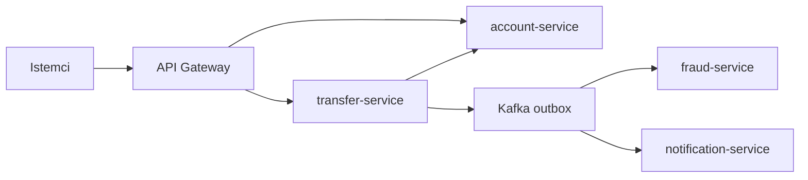
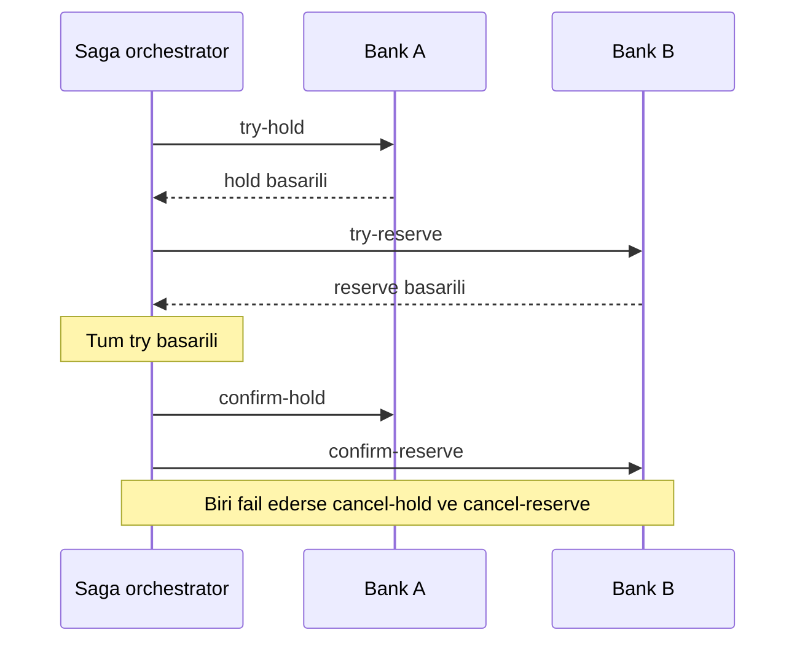
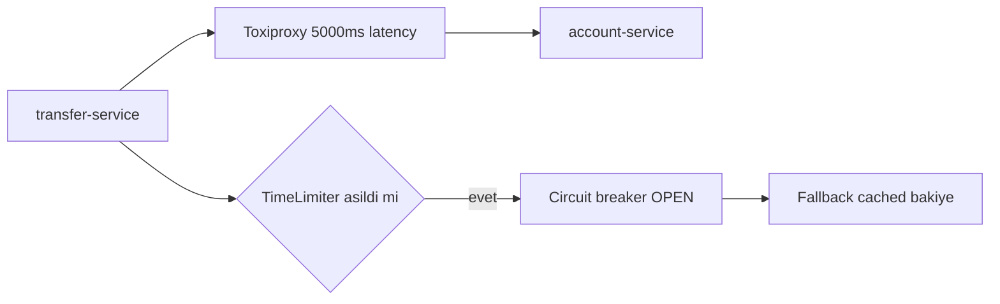

# Phase 7 Mini-Project — Microservices Split & Resilience

```admonish info title="Bu projede"
- `core-banking` monolitini **4 microservice'e** (account, transfer, fraud, notification) + bir **API Gateway**'e bölüyorsun
- Resilience4j ile her backend'e circuit breaker + retry + bulkhead + timeout + fallback ekliyor, banking timeout hiyerarşisi kuruyorsun
- OpenTelemetry ile Kafka dahil uçtan uca trace'i Jaeger'da **tek waterfall** olarak görüyorsun
- Saga + TCC ile cross-bank transfer'i 3 fazlı (try → confirm/cancel) hale getiriyorsun
- Toxiproxy ile 5 kasten kırma senaryosu üretip düzeltiyor, 25+ integration test + observability stack ile kanıtlıyorsun
```

## Hedef

Phase 7'nin 7 topic'inde microservice teorisini çalıştın; bu projede hepsini tek platformda birleştirip Phase 1-6'nın `core-banking` monolitini **production-grade** bir dağıtık sisteme dönüştürüyorsun. Yeni teori yok, **uygulama** var — bir adımda takılırsan ilgili topic'e dön, oku, düzelt.

Projenin sonunda elinde bir TR bank tech ekibinin **referans implementation** olarak alabileceği microservice platform olacak: mTLS + JWT propagation + circuit breaker + Jaeger'da uçtan uca trace + Saga/TCC.

```admonish tip title="Süre ve önbilgi"
10-15 gün ayır (günde 2-3 saat). Başlamadan önce: Phase 7'nin 7 topic'i (7.1-7.7) bitmiş, defter notların yazılmış olmalı. Phase 1-6'dan `core-banking` monolit + outbox + Kafka hazır ve `mvn test` yeşil olmalı. Buradaki işin çoğu **birleştirme** + saga/TCC ve kasten kırma reprodüksiyonları.
```

## Hedef mimari

Monolitten dört bağımsız servise geçiyorsun. Senkron çağrı sadece gateway → servis ve transfer → account arasında; fraud ve notification tamamen Kafka üzerinden asenkron besleniyor.



## Acceptance criteria (bitirme şartları)

Başlamadan bir kez oku, bitince tek tek işaretle.

- [ ] 4 microservice ayrı Maven module
- [ ] Database per service (4 schema)
- [ ] API Gateway + 5 route + JWT + rate limit + CB + IdempotencyKey
- [ ] K8s Service discovery (veya Eureka)
- [ ] Resilience4j: CB + Retry + Bulkhead + TimeLimiter + RateLimiter + Fallback per backend
- [ ] OpenTelemetry end-to-end trace Jaeger'da görünür
- [ ] Saga + TCC cross-bank transfer (Bank A hold → Bank B reserve → Confirm/Cancel)
- [ ] Outbox pattern (Phase 6) tüm servislerde
- [ ] Idempotency cross-service
- [ ] 5 kasten kırma senaryosu reproduced + fixed
- [ ] 25+ integration test passing
- [ ] Observability stack (Prometheus + Grafana + Jaeger + Loki)
- [ ] CB OPEN alert + p99 alert
- [ ] CI/CD pipeline 4 service için ayrı build

---

## Adım adım build plan

On görev var: ilk ikisi monoliti bölüyor, sonraki ikisi trafiği yönetiyor (gateway + discovery), beş-altı dayanıklılık ve gözlemlenebilirliği kuruyor, son dördü dağıtık işlemi (saga/TCC), kasten kırma kanıtlarını, testleri ve observability stack'i tamamlıyor.

```mermaid
flowchart LR
    subgraph Split["Split ve veri"]
        direction LR
        G1["Gorev 1<br/>Multi-module split"] --> G2["Gorev 2<br/>Database per service"]
    end
    subgraph Edge["Gateway ve discovery"]
        direction LR
        G3["Gorev 3<br/>API Gateway"] --> G4["Gorev 4<br/>Service discovery"]
    end
    subgraph Resil["Dayaniklilik ve iz"]
        direction LR
        G5["Gorev 5<br/>Resilience4j"] --> G6["Gorev 6<br/>OpenTelemetry"]
    end
    subgraph Dist["Dagitik islem ve kanit"]
        direction LR
        G7["Gorev 7<br/>Saga ve TCC"] --> G8["Gorev 8<br/>Kasten kirma"] --> G9["Gorev 9<br/>Integration test"] --> G10["Gorev 10<br/>Observability"]
    end
    G2 --> G3
    G4 --> G5
    G6 --> G7
```



### Görev 1 — Maven multi-module split (1 gün)

**Ne yapacaksın:** Monoliti 5 servis modülü (account, transfer, fraud, notification, gateway) + 2 kütüphane modülüne (banking-commons, banking-events) böleceksin. **Neden:** Bağımsız deploy edilebilirliğin ve **bounded context** izolasyonunun temeli modül sınırıdır; kod dağıtımını netleştirmeden dayanıklılık eklemek anlamsız.

Parent POM'un kalbi modül listesi ve Spring Cloud BOM import'u; sürümleri tek yerden yönetmek zorundasın:

```xml
<modules>
    <module>banking-commons</module>
    <module>banking-events</module>
    <module>account-service</module>
    <module>transfer-service</module>
    <module>fraud-service</module>
    <module>notification-service</module>
    <module>api-gateway</module>
</modules>
```

`banking-commons` Phase 1 value object'lerini (`Money`, `Currency`, `AccountId`, `OwnerId`, `TransferId`) minimal bağımlılıkla taşır; `banking-events` ise Avro schema'ları (`.avsc`) tutar ve `xjc` ile Java class generate eder. Monolit sınıflarını hedef servislere dağıtırken haritayı defterine yaz.

<details>
<summary>Tam kod: parent POM + klasör ağacı + sınıf dağıtım haritası (~90 satır)</summary>

```
core-banking-parent/
├── pom.xml (parent POM)
├── banking-commons/
│   └── src/main/java/.../{Money, Currency, AccountId, OwnerId, TransferId, ...}
├── banking-events/
│   └── src/main/java/.../{TransferCompletedEvent, AuditLogEvent, ...}
├── account-service/
│   ├── pom.xml (depends on banking-commons)
│   ├── src/
│   └── Dockerfile
├── transfer-service/
│   ├── pom.xml (depends on banking-commons, banking-events)
│   ├── src/
│   └── Dockerfile
├── fraud-service/
├── notification-service/
├── api-gateway/
├── eureka-server/ (optional)
├── docker-compose.yml
└── k8s/ (manifests)
```

```xml
<project>
    <modelVersion>4.0.0</modelVersion>
    <groupId>com.mavibank</groupId>
    <artifactId>core-banking-parent</artifactId>
    <version>1.0.0-SNAPSHOT</version>
    <packaging>pom</packaging>

    <properties>
        <java.version>21</java.version>
        <spring-cloud.version>2024.0.0</spring-cloud.version>
        <resilience4j.version>2.2.0</resilience4j.version>
    </properties>

    <modules>
        <module>banking-commons</module>
        <module>banking-events</module>
        <module>account-service</module>
        <module>transfer-service</module>
        <module>fraud-service</module>
        <module>notification-service</module>
        <module>api-gateway</module>
    </modules>

    <dependencyManagement>
        <dependencies>
            <dependency>
                <groupId>org.springframework.cloud</groupId>
                <artifactId>spring-cloud-dependencies</artifactId>
                <version>${spring-cloud.version}</version>
                <type>pom</type>
                <scope>import</scope>
            </dependency>
        </dependencies>
    </dependencyManagement>
</project>
```

```
banking-events/src/main/avro/
├── TransferCompletedEvent.avsc
├── AuditLogEvent.avsc
├── NotificationRequest.avsc
└── FraudAlert.avsc
```

```
Monolith                          →  Target service
─────────────────────────────────────────────────────
AccountController                 →  account-service
AccountService (use case)         →  account-service
JpaAccountRepository              →  account-service
AccountJpaEntity                  →  account-service
JournalEntry/Line                 →  account-service
Phase 4 PL/SQL packages           →  account-service
                                     (interest_pkg, eod_reconciliation_pkg)

TransferController                →  transfer-service
TransferService                   →  transfer-service
Phase 6 Saga (CrossBankTransferSaga) → transfer-service
OutboxPublisher (Phase 6)         →  transfer-service
IdempotencyKey handling           →  transfer-service

FraudDetectionTopology            →  fraud-service
Phase 4 fraud_check_pkg           →  fraud-service
FraudAlert                        →  fraud-service

NotificationConsumer (Phase 6)    →  notification-service
SMS/Email gateway client          →  notification-service

ApiGatewayApplication             →  api-gateway (new)
```

</details>

**Kontrol noktası**

- [ ] Multi-module Maven structure, `mvn install` çalışıyor
- [ ] 5 service module + 2 library module (banking-commons, banking-events)
- [ ] Mevcut monolit code 4 service'e taşındı, her servis kendi `application.yml`'inde
- [ ] Defterimde: hangi sınıf hangi servise gitti, gerekçe

### Görev 2 — Database per service (1 gün)

**Ne yapacaksın:** Her servise kendi schema'sını, kendi DB user'ını ve kendi Flyway migration'larını vereceksin; ArchUnit ile servisler arası entity import'unu compile-time yasaklayacaksın. **Neden:** Ortak DB en yaygın distributed-monolith anti-pattern'i; veri sahipliği bölünmezse servisler bağımsız evrilemez.

Lokal dev için tek DB içinde schema izolasyonu yeterli; production'da tamamen ayrı cluster'lar olur. Servis başına user + schema grant zorunlu:

```sql
CREATE SCHEMA account_db;
CREATE SCHEMA transfer_db;
CREATE SCHEMA fraud_db;
CREATE SCHEMA notification_db;

CREATE USER account_service WITH PASSWORD '...';
GRANT USAGE ON SCHEMA account_db TO account_service;
GRANT ALL PRIVILEGES ON ALL TABLES IN SCHEMA account_db TO account_service;
```

Mevcut `db/migration/` klasörünü servis bazlı böl — her servis kendi Flyway'i ile kendi schema'sını migrate eder. İzolasyonu bir ArchUnit test'i ile **kanıtla**; transfer paketi account'un persistence paketine bağımlı olamaz:

```java
@Test
void servicesShouldNotShareData() {
    noClasses().that().resideInAPackage("com.mavibank.transfer..")
        .should().dependOnClassesThat()
        .resideInAPackage("com.mavibank.account.adapter.out.persistence..")
        .check(classes);
}
```

<details>
<summary>Tam referans: servis bazlı migration ağacı (~20 satır)</summary>

```
account-service/src/main/resources/db/migration/
├── V1__create_accounts_table.sql
├── V2__create_journal_tables.sql
└── R__create_balance_summary_view.sql

transfer-service/src/main/resources/db/migration/
├── V1__create_transfers_table.sql
├── V2__create_idempotency_keys.sql
├── V3__create_outbox_events.sql
└── V4__create_saga_states.sql

fraud-service/src/main/resources/db/migration/
├── V1__create_fraud_rules.sql
├── V2__create_fraud_alerts.sql

notification-service/src/main/resources/db/migration/
├── V1__create_notification_log.sql
├── V2__create_processed_events.sql
```

</details>

**Kontrol noktası**

- [ ] 4 schema (account_db, transfer_db, fraud_db, notification_db)
- [ ] Migration'lar her servis kendi içinde, kendi Flyway'i ile
- [ ] Cross-service entity import YOK (ArchUnit kanıtı)
- [ ] Her servis kendi DB user'ı (production-like isolation)

### Görev 3 — API Gateway (1.5 gün)

**Ne yapacaksın:** Spring Cloud Gateway (reactive/Netty) ile tek giriş kapısı kuracaksın: 5 route, JWT doğrulama + header propagation, Redis rate limiter, per-backend circuit breaker + fallback, banking idempotency filter ve tracing. **Neden:** Auth, rate limit, CB ve logging gibi cross-cutting concern'leri her serviste tekrarlamak yerine kenarda tek yerde çözersin; downstream servisler saf iş mantığına odaklanır.

Topic 7.3 implementation'ını temel al. JwtAuthenticationFilter JWT'yi validate edip `X-User-Id`, `X-Tenant-Id`, `X-User-Roles` header'larını propagate eder; Redis rate limiter per-user (10 req/sec) + per-IP (5 req/min anonymous) + per-tenant çalışır. Her backend için circuit breaker, fallback URI'si ProblemDetail 503 döner. IdempotencyKeyFilter POST/PUT için `Idempotency-Key` header'ını zorunlu kılar.

**Kontrol noktası**

- [ ] Gateway Spring Boot project (Netty reactive), 5 route YAML
- [ ] JWT filter + header propagation (X-User-Id, X-Tenant-Id, X-User-Roles)
- [ ] Redis rate limiter + per-user + per-IP + per-tenant
- [ ] CB + fallback (her backend için), IdempotencyKeyFilter
- [ ] LoggingFilter + X-Request-Id, CORS banking domains
- [ ] 8+ integration test (WebTestClient)

### Görev 4 — Service Discovery (1 gün)

**Ne yapacaksın:** K8s Service (veya Eureka) ile servis keşfi kuracak, Actuator health probe'ları tanımlayacak ve servisler arası `@LoadBalanced` WebClient ile çağrı yapacaksın. **Neden:** Servisler dinamik olarak ölçeklenip yeniden başlar; sabit IP tutulamaz. İsimle çözümleme + sağlık kontrolü olmadan cross-service çağrı kırılgandır.

Banking için K8s native tercih (minikube/kind ile local cluster). Deployment 3 replica + Service ile cluster IP açar; K8s DNS `account-service` adını pod'a çözer. Servisler arası çağrı DNS adıyla WebClient üzerinden:

```java
@Bean
public WebClient accountServiceClient(WebClient.Builder builder) {
    return builder.baseUrl("http://account-service:8081").build();
}
```

Actuator ile liveness + readiness + startup probe tanımla ki K8s trafiği yalnızca hazır pod'lara yönlendirsin.

```admonish tip title="K8s DNS mi Eureka mı"
Banking'de K8s native service discovery genelde daha temizdir: ayrı bir Eureka cluster'ı işletmek, HA kurmak ve güncel tutmak operasyonel yük getirir. K8s zaten DNS + health + load balancing sağlıyorsa ikinci bir registry'yi çift bakım maliyeti olarak değerlendir. Kararını defterine gerekçesiyle yaz.
```

<details>
<summary>Tam kod: K8s Deployment + Service manifest (~27 satır)</summary>

```yaml
apiVersion: apps/v1
kind: Deployment
metadata:
  name: account-service
spec:
  replicas: 3
  template:
    spec:
      containers:
        - name: app
          image: banking/account-service:1.0.0
          ports:
            - containerPort: 8081

---
apiVersion: v1
kind: Service
metadata:
  name: account-service
spec:
  selector:
    app: account-service
  ports:
    - port: 8081
      targetPort: 8081
```

</details>

**Kontrol noktası**

- [ ] K8s manifests (Deployment + Service)
- [ ] Spring Boot Actuator health + liveness/readiness/startup probes
- [ ] Service-to-service @LoadBalanced WebClient
- [ ] minikube'da deploy + cross-service ping (transfer → account)

### Görev 5 — Resilience4j integration (1.5 gün)

**Ne yapacaksın:** Her backend için circuit breaker + retry + bulkhead + timelimiter + outbound rate limiter tanımlayıp banking'e uygun 4 fallback stratejisi yazacaksın. **Neden:** Dağıtık sistemde her uzak çağrı başarısız olabilir; koruma katmanı olmadan bir servisin yavaşlaması tüm zinciri çökertir (cascading failure).

Circuit breaker config'i per-backend ayarla: kritik business exception'ları `ignoreExceptions` ile dışarıda bırak — yetersiz bakiye bir arıza değil, normal iş sonucudur ve <mark>business exception'ları asla circuit breaker'a saydırma</mark>, yoksa CB gereksiz yere açılır:

```yaml
resilience4j:
  circuitbreaker:
    instances:
      accountService:
        baseConfig: default
        ignoreExceptions:
          - com.mavibank.banking.account.exception.AccountNotFoundException
          - com.mavibank.banking.account.exception.InsufficientFundsException
      fraudService:
        baseConfig: default
        failureRateThreshold: 70   # daha gevşek
```

Retry yalnızca transient exception'da (idempotent operasyonlarda) çalışsın. TimeLimiter'ı **bottom-up** banking hiyerarşisiyle kur — dıştaki her katman içtekinden gevşek: Client→Gateway 60s, Gateway→service 30s, service→service 5s, service→DB 3s. Outbound RateLimiter TCMB FX API'yi 100 req/min ile sınırlar (mock).

Fallback stratejileri iş kritikliğine göre ayrışır: balance gibi kritik veri **fail-fast**, display verisi **cached**, fraud **conservative default (HIGH_RISK)**, notification **queue + async retry**.

```admonish warning title="Composition sırası hayati"
Resilience4j dekoratörlerinin sarma sırası davranışı değiştirir. Doğru sıra <mark>Retry → CircuitBreaker → TimeLimiter → Bulkhead</mark>'tir: retry en dışta olmalı ki timeout/CB sonrası tekrar denesin; ters sırada retry, açık devreyi hiç görmeden boşa çalışır. Sırayı yanlış kurarsan test'te sessizce yanlış davranış alırsın.
```

**Kontrol noktası**

- [ ] 4 backend için CB + Retry + Bulkhead + TimeLimiter
- [ ] Composition order doğru (Retry → CB → TimeLimiter → Bulkhead)
- [ ] Banking timeout hierarchy (DB → service → gateway) bottom-up
- [ ] 4 fallback stratejisi implement (fail-fast / cached / conservative / queue)
- [ ] Event listener + Slack alert on CB OPEN
- [ ] Grafana dashboard Resilience4j metrics

### Görev 6 — OpenTelemetry tracing (1 gün)

**Ne yapacaksın:** Tüm servislere Micrometer Tracing + OTLP exporter ekleyip Jaeger'a bağlayacak, kritik business operasyonlarına custom span koyacak ve bir transfer'i uçtan uca izleyeceksin. **Neden:** 4 servis + Kafka arasında dağılmış bir isteğin nerede yavaşladığını log'larla bulamazsın; **distributed trace** tek bir request'in tüm hop'larını waterfall olarak gösterir.

Jaeger'ı docker-compose'a ekle (OTLP enabled), tüm servislerde OTLP endpoint'i ve dev için `sampling.probability: 1.0` ayarla:

```yaml
management:
  tracing:
    sampling.probability: 1.0   # dev
  otlp:
    tracing:
      endpoint: http://jaeger:4318/v1/traces
```

Kritik iş operasyonlarına `@Observed` ile custom span ekle ki trace'te iş adımları isimleriyle görünsün:

```java
@Observed(name = "transfer.execute")
public Mono<Transfer> execute(TransferRequest req) { ... }
```

Uçtan uca senaryo: User POST → Gateway → transfer-service → account-service (debit + credit) → outbox → notification-service (consume). Jaeger UI'da **tek trace** olarak, Kafka propagation dahil görünmeli. Log MDC'ye `traceId` bağla ki log ↔ trace korelasyonu kurulabilsin.

**Kontrol noktası**

- [ ] Jaeger docker-compose, 4 servis OTLP tracing enabled
- [ ] End-to-end transfer trace UI'da tek waterfall olarak görünür
- [ ] Custom @Observed business operations (transfer.execute, fraud.score)
- [ ] Kafka trace propagation çalışıyor
- [ ] Log MDC traceId entegrasyonu

### Görev 7 — Saga + TCC cross-bank (2 gün)

**Ne yapacaksın:** Phase 6'daki `CrossBankTransferSaga` orchestrator'a TCC (Try-Confirm-Cancel) pattern uygulayacak, mock bank-a/bank-b servisleri yazacak ve stuck saga recovery scheduler kuracaksın. **Neden:** İki farklı banka arasında dağıtık transaction'da 2PC ölçeklenmez; **saga + TCC** ile önce kaynakları rezerve edersin, hepsi başarılıysa confirm, biri düşerse tüm rezervasyonları cancel edersin — atomiklik yerine eventual tutarlılık.

Akış üç fazlı: her iki bankada da önce **try** (hold/reserve), hepsi başarılıysa **confirm**, herhangi biri başarısızsa **cancel**.



Orchestrator saga'yı başlatıp Bank A hold ile try fazını açar; her event handler bir sonraki adımı tetikler:

```java
public UUID initiate(CrossBankTransferRequest req) {
    UUID sagaId = UUID.randomUUID();
    SagaState saga = sagaRepo.save(SagaState.init(sagaId, req));
    kafka.send("bank-a.try-hold", sagaId.toString(),
        new TryHoldRequest(sagaId, req.fromAccountId(), req.amount()));
    return sagaId;
}
```

Tüm try'lar başarılı olunca confirm fazına, herhangi biri fail edince compensation'a (cancel) geçilir. TCC'nin banking'de en kritik kuralı: <mark>Cancel her zaman idempotent olmalı</mark> — aynı cancel iki kez gelse tek etki üretmeli, yoksa bir rezervasyonu iki kez serbest bırakırsın. Ayrıca mock `bank-a-service` / `bank-b-service` her biri `/try-hold`, `/confirm-hold`, `/cancel-hold` endpoint'lerini sunar; scheduled bir task 5 dakikadan eski PENDING saga'ları bulup compensation tetikler.

<details>
<summary>Tam kod: CrossBankTransferSaga orchestrator + mock bank controller (~75 satır)</summary>

```java
public class CrossBankTransferSaga {

    public UUID initiate(CrossBankTransferRequest req) {
        UUID sagaId = UUID.randomUUID();
        SagaState saga = sagaRepo.save(SagaState.init(sagaId, req));

        // Phase 1: Try (TCC) — Bank A hold
        kafka.send("bank-a.try-hold", sagaId.toString(),
            new TryHoldRequest(sagaId, req.fromAccountId(), req.amount()));

        return sagaId;
    }

    @KafkaListener(topics = "bank-a.try-hold.success")
    public void onBankAHoldSuccess(BankAHoldSuccessEvent event) {
        SagaState saga = sagaRepo.findById(event.getSagaId()).orElseThrow();
        saga.recordTry("BANK_A_HOLD", event.getHoldId());

        // Phase 1 cont: FX rate + Bank B reserve
        kafka.send("fx.try-quote", saga.getSagaId().toString(),
            new TryFxQuoteRequest(saga.getSagaId(), ...));
    }

    @KafkaListener(topics = "bank-b.reserve.success")
    public void onAllTrySuccess(BankBReserveSuccessEvent event) {
        SagaState saga = sagaRepo.findById(event.getSagaId()).orElseThrow();
        saga.recordTry("BANK_B_RESERVE", event.getReserveId());

        // Phase 2: Confirm all
        kafka.send("bank-a.confirm-hold", saga.getSagaId().toString(),
            new ConfirmHoldRequest(saga.getResourceId("BANK_A_HOLD")));
        kafka.send("bank-b.confirm-reserve", saga.getSagaId().toString(),
            new ConfirmReserveRequest(saga.getResourceId("BANK_B_RESERVE")));

        saga.setCurrentState("CONFIRMING");
        sagaRepo.save(saga);
    }

    @KafkaListener(topics = "saga.any-try.failure")
    public void onAnyTryFailure(TryFailureEvent event) {
        SagaState saga = sagaRepo.findById(event.getSagaId()).orElseThrow();
        saga.setCurrentState("COMPENSATING");
        sagaRepo.save(saga);

        // Phase 3: Cancel all reservations (idempotent)
        saga.getTryRecords().forEach(record -> {
            kafka.send(record.getCancelTopic(), saga.getSagaId().toString(),
                new CancelRequest(record.getResourceId()));
        });
    }
}
```

```java
@RestController
@RequestMapping("/internal/bank-a")
public class BankAController {

    @PostMapping("/try-hold")
    public Mono<HoldResponse> tryHold(@RequestBody HoldRequest req) {
        // TCC try implementation
    }

    @PostMapping("/confirm-hold")
    public Mono<Void> confirmHold(@RequestBody ConfirmRequest req) { ... }

    @PostMapping("/cancel-hold")
    public Mono<Void> cancelHold(@RequestBody CancelRequest req) { ... }
}
```

</details>

```admonish warning title="PII servisler arası taşınmaz"
Saga event'lerinde ve cross-service çağrılarda müşteri PII'ını (isim, TCKN, IBAN sahibi) taşıma — <mark>servisler arası yalnızca internal ID (accountId, sagaId) propagate et</mark>. PII'ın Kafka topic'lerinde ve trace span attribute'larında dolaşması hem KVKK riski hem de gereksiz coupling'dir.
```

**Kontrol noktası**

- [ ] CrossBankTransferSaga orchestrator + TCC pattern
- [ ] Mock bank-a-service + bank-b-service
- [ ] Happy path test geçiyor
- [ ] Compensation test geçiyor (Bank B reserve fail → Bank A cancel)
- [ ] Cancel idempotent (aynı cancel 2 kez → tek etki)
- [ ] Stuck saga recovery scheduler + async API (202) + status polling

### Görev 8 — Kasten kırma reproduction (1 gün)

**Ne yapacaksın:** 5 arıza senaryosunu kontrollü ortamda üretip, teşhis edip, düzeltip dokümante edeceksin. **Neden:** Banking'de deneyim = arızayla dans; production'da göreceğin failure'ları önce burada reprodükte etmezsen dayanıklılık kodunun gerçekten çalışıp çalışmadığını asla bilemezsin.

Ana senaryo Toxiproxy ile network latency: transfer-service'i account-service'e proxy üzerinden bağla, 5000ms gecikme enjekte et — TimeLimiter aşılmalı, circuit breaker OPEN'a düşmeli, fallback tetiklenmeli.



Toxiproxy'yi docker-compose'a ekle ve account-service'i proxy port'u üzerinden yönlendir:

```yaml
toxiproxy:
  image: ghcr.io/shopify/toxiproxy:2.7.0
  ports:
    - "8474:8474"
```

Beş senaryonun her biri için defterine before/after notu yaz:

1. **Network latency (Toxiproxy):** latency 5000ms / bandwidth limit / connection drop → CB OPEN + fallback.
2. **Backend kasten patlat:** account-service crash → CB OPEN → HALF_OPEN → CLOSED (recovery cycle).
3. **Saga compensation:** Bank B reserve fail → Bank A hold cancel; aynı cancel 2 kez → tek etki.
4. **Lock split-brain:** Redis cluster 2-node partition → her partition kendi lock'unu veriyor mu? (Bu yüzden banking'de kritik op DB-level lock kullanır.)
5. **Distributed trace gaps:** Async chain'de bir hop trace context propagate etmezse nasıl görünür? Manuel propagation'ı KAPAT, gör.

**Kontrol noktası**

- [ ] 5 kasten kırma senaryosu reproduced + fixed
- [ ] Toxiproxy network simulation çalışıyor
- [ ] Defterimde her senaryo için before/after notu

### Görev 9 — Integration test suite (1 gün)

**Ne yapacaksın:** `@SpringBootTest + TestContainers` ile 25+ integration test + contract test yazacaksın. **Neden:** Dağıtık sistemde tek servis unit test'i yetmez; asıl riskler servisler arası routing, resilience, trace propagation ve saga akışında — bunları ancak multi-container integration test yakalar.

Phase 1-6'dan gelen per-service unit test'leri koru. Integration test kapsamı: gateway → backend routing, service-to-service Resilience4j, end-to-end trace (Jaeger query), saga happy path + compensation, TCC try-confirm-cancel, cross-service idempotency, multi-instance ShedLock. Contract test'ler (Spring Cloud Contract, Phase 12'de detay): transfer-service consumer ↔ account-service provider, fraud-service contract.

**Kontrol noktası**

- [ ] Toplam 25+ integration test passing
- [ ] TestContainers multi-container setup
- [ ] Saga happy path + compensation + TCC test'leri
- [ ] Cross-service idempotency + ShedLock test'leri
- [ ] Contract test'ler (Phase 12 hazırlık)

### Görev 10 — Observability stack (yarım gün)

**Ne yapacaksın:** docker-compose ile Prometheus + Grafana + Jaeger + Loki + AlertManager stack'i kurup RED-method dashboard'ları ve alert'leri tanımlayacaksın. **Neden:** Production'da "çalışıyor mu?" sorusunun cevabı metric, trace ve log'dur; gözlemlenemeyen dağıtık sistem kör uçuştur.

Dashboard'lar: RED method per service (Rate, Errors, Duration), circuit breaker state per backend, saga success rate + p99 duration, rate limit 429 count, Kafka producer/consumer lag. Alert'ler: CB OPEN → Slack, p99 > 500ms → Slack, error rate > 1% → PagerDuty.

**Kontrol noktası**

- [ ] Prometheus + Grafana + Jaeger + Loki + AlertManager stack
- [ ] RED method dashboard per service + CB state + saga p99 panelleri
- [ ] CB OPEN alert + p99 > 500ms alert + error rate alert

---

## Pratik desteği

Projeyi bitirdim dediğin an, aşağıdaki prompt'la Claude'a kapsamlı bir audit yaptır — kör noktalarını böyle yakalarsın. Her madde için PASS / FAIL / EKSIK işareti ve kanıt (file path + code reference) iste.

<details>
<summary>Claude-verify prompt (mini-project bütünü için)</summary>

```
Phase 7 microservices mini-project'imi banking-grade kriterlere göre değerlendir
kapsamlı olarak. Eksiklerimi söyle, kanıt göster:

A. Architecture
   1. Bounded context'ler net (4 servis)?
   2. Database per service strict (shared DB anti-pattern yok)?
   3. ArchUnit cross-service dependency tests?

B. API Gateway
   1. Spring Cloud Gateway reactive (Netty)?
   2. JWT filter + header propagation?
   3. Redis rate limiter per-user + per-IP + per-tenant?
   4. CB + fallback per backend?
   5. IdempotencyKey filter banking?

C. Service Discovery
   1. K8s Service veya Eureka cluster?
   2. Spring Boot Actuator health endpoints?
   3. Service-to-service @LoadBalanced WebClient?

D. Resilience4j
   1. CB her external call'da + ignoreExceptions business?
   2. Retry transient only + Idempotency-Key for POST?
   3. Bulkhead per service?
   4. TimeLimiter banking hierarchy (DB → service → gateway)?
   5. RateLimiter outbound (TCMB)?
   6. Composition order (Retry → CB → TL → Bulkhead)?
   7. Fallback strategies banking-appropriate?

E. Distributed Tracing
   1. OpenTelemetry + OTLP exporter?
   2. Auto-instrumentation HTTP + DB + Kafka?
   3. Cross-service trace propagation (Kafka dahil)?
   4. Custom @Observed business operations?
   5. PII span attribute'larda YOK?
   6. Sampling production-appropriate?

F. Saga + TCC
   1. CrossBankTransferSaga orchestrator + TCC?
   2. Happy path + compensation test?
   3. Stuck saga recovery scheduler?
   4. Compensation idempotent?
   5. Async API (202 + status polling)?

G. Banking-specific
   1. PII cross-service propagation YOK (sadece internal ID)?
   2. mTLS service-to-service?
   3. Outbox pattern (Phase 6 entegre)?
   4. Idempotency cross-service?

H. Kasten kırma
   1. Network latency reproduction (Toxiproxy)?
   2. Backend crash → CB OPEN → fallback?
   3. Saga compensation reproduce + fix?
   4. 5 senaryo defterimde?

I. Testing
   1. 25+ integration test?
   2. TestContainers multi-container?
   3. Contract tests (Phase 12 hazırlık)?

J. Observability
   1. Prometheus + Grafana + Jaeger + Loki stack?
   2. RED method dashboard per service?
   3. CB OPEN alert + p99 alert?

K. Anti-pattern
   1. Distributed monolith risk değerlendirmesi?
   2. Sync HTTP chain 4+ hop var mı?
   3. Shared DB yok mu?
   4. Business exception CB trigger ediyor mu?
   5. POST retry Idempotency-Key olmadan?
   6. PII span attribute leak?

Her madde için PASS / FAIL / EKSIK işaretle, kanıt göster (file path + code reference).
```

</details>

<details>
<summary>Defter notları (25 madde) — her biri için cevabını yaz</summary>

1. "Monolith → 4 microservice split'in stratejik DDD bounded context rasyoneli: ____."
2. "Database per service prensibi + cross-service data access stratejisi: ____."
3. "banking-commons shared library yönetimi (Money, Currency, AccountId): ____."
4. "API Gateway 4 cross-cutting concerns (auth, rate limit, CB, logging): ____."
5. "Spring Cloud Gateway reactive (Netty) — servlet mix uyumsuzluğu: ____."
6. "JWT filter header propagation downstream (X-User-Id, X-Tenant-Id): ____."
7. "K8s Service discovery DNS-based vs Eureka karşılaştırması: ____."
8. "Spring Boot Actuator probes (liveness, readiness, startup) banking için: ____."
9. "Resilience4j composition order (Retry → CB → TimeLimiter → Bulkhead): ____."
10. "Banking timeout hierarchy bottom-up (DB → service → gateway): ____."
11. "ignoreExceptions banking business exception (InsufficientFunds): ____."
12. "Fallback strategy karar (fail-fast vs cached vs queue vs degraded): ____."
13. "OpenTelemetry end-to-end trace Jaeger UI'da waterfall: ____."
14. "Kafka trace propagation header üzerinden async chain: ____."
15. "Saga + TCC kombine cross-bank transfer 3-phase: ____."
16. "TCC Cancel idempotent compensation banking için zorunlu: ____."
17. "Stuck saga recovery scheduler timeout SLA: ____."
18. "Idempotency cross-service Idempotency-Key middleware: ____."
19. "Toxiproxy ile network failure simulation banking için faydası: ____."
20. "Backend crash → CB OPEN → fallback recovery cycle: ____."
21. "Distributed monolith 7 belirtisi + assessment'tan çıkan sonuç: ____."
22. "Async HTTP 202 + status polling banking UX impact: ____."
23. "mTLS service-to-service banking için neden gerekli: ____."
24. "Outbox pattern (Phase 6) tüm servislerde + Saga kombinasyon: ____."
25. "TR bank tech ekibinin bu mimariyi kullanabilirliği — eksik gördüğüm 3 nokta: ____."

</details>

---

## Tamamlama kriterleri (kendine sor)

- [ ] Phase 7'nin 7 topic'inde öğrendiğim her şey bu projede uygulandı
- [ ] 4 microservice ayrı Maven module + database per service çalışıyor
- [ ] API Gateway JWT + rate limit + CB + IdempotencyKey ile trafiği yönetiyor
- [ ] Resilience4j 4 backend'de CB + Retry + Bulkhead + TimeLimiter + Fallback ile aktif
- [ ] Uçtan uca transfer trace'i Jaeger'da tek waterfall (Kafka dahil) görünüyor
- [ ] Saga + TCC cross-bank transfer happy path + compensation test'leri geçiyor
- [ ] 5 kasten kırma senaryosu reproduced + fixed, defterimde before/after notlarıyla
- [ ] 25+ integration test passing, observability stack canlı dashboard gösteriyor
- [ ] Cevabı **rahatça** verebileceğim sorular: "Circuit breaker'ı hangi exception'da açtırmadın?", "Cross-bank transfer'i nasıl atomik yaptın?", "Trace'i Kafka üzerinden nasıl bağladın?", "Distributed monolith'ten nasıl kaçındın?"

Hepsi onaylı → Faz 7 PHASE_TEST'e geç → [PHASE_TEST.md](../PHASE_TEST.md)

```admonish success title="Proje Tamamlama Kriterleri"
- 4 microservice ayrı Maven module + database per service (4 schema, ArchUnit ile cross-service import kanıtı YOK)
- API Gateway 5 route + JWT propagation + Redis rate limiter + per-backend CB + IdempotencyKey filter ile çalışıyor
- Resilience4j her backend'de CB + Retry + Bulkhead + TimeLimiter + RateLimiter + 4 fallback stratejisi; composition sırası ve banking timeout hiyerarşisi doğru
- OpenTelemetry ile uçtan uca transfer trace'i Jaeger'da tek waterfall (Kafka propagation dahil); PII span attribute'larda yok
- Saga + TCC cross-bank transfer happy path + compensation + idempotent cancel test'leri geçiyor; stuck saga recovery scheduler aktif
- 5 kasten kırma senaryosu (Toxiproxy dahil) reproduced + fixed; 25+ integration test passing; Prometheus + Grafana + Jaeger + Loki stack canlı, CB OPEN + p99 alert'leri kurulu
```
