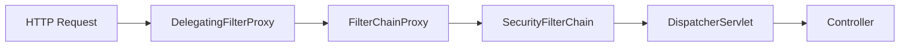
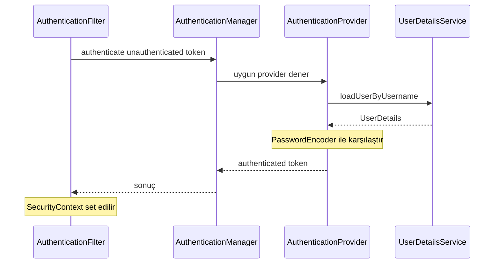
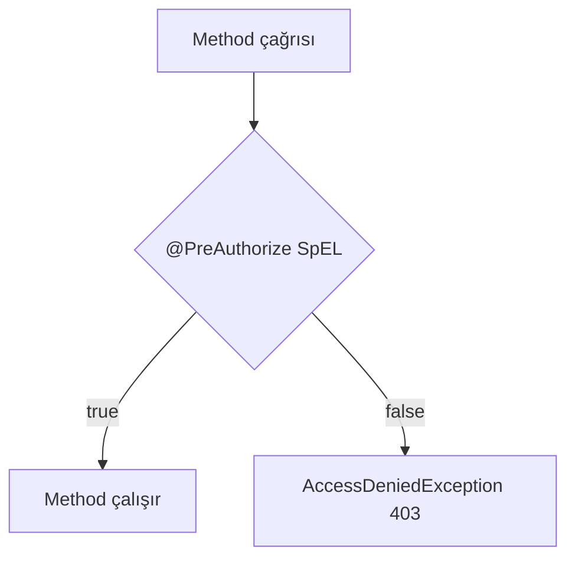
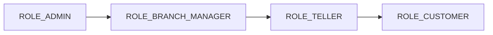

# Topic 8.1 — Spring Security 6 Architecture: Filter Chain, Method Security

```admonish info title="Bu bölümde"
- Spring Security 6'nın **component-based** konfigürasyonu: `SecurityFilterChain` bean neden `WebSecurityConfigurerAdapter`'ı öldürdü
- Filter chain mimarisi: bir HTTP request controller'a ulaşana kadar hangi filtrelerden geçer, "authentication erken, authorization geç"
- Authentication zinciri: `AuthenticationManager` → `AuthenticationProvider` → `UserDetailsService` — her birinin sorumluluğu
- Method security (`@PreAuthorize`, `@PostAuthorize`) ve SpEL ile iş kuralı düzeyinde yetkilendirme
- Banking'in bel kemiği: "müşteri sadece kendi hesabını görür" kuralı, 3 katmanlı defense-in-depth
```

## Hedef

Spring Security 6'nın filter chain mimarisini içselleştirmek ve modern (Spring Boot 3+) component-based konfigürasyonu yazabilmek. `AuthenticationManager`, `AuthenticationProvider`, `UserDetailsService`, `GrantedAuthority`, `AuthorizationManager` zincirini kavramak. Method security (`@PreAuthorize`, `@PostAuthorize`, `@Secured`, `@RolesAllowed`) ile iş kuralı düzeyinde yetki vermek. Banking için "müşteri sadece kendi hesabını görür" kuralını SpEL ile yazabilmek.

## Süre

Okuma: 2 saat • Kendini Sına: 45 dk • Pratik (opsiyonel): 3-4 saat • Toplam: ~2.5 saat (+ pratik)

## Önbilgi

- Spring Boot 3, Spring MVC, REST controller temel
- HTTP request/response, header, status code
- Hexagonal architecture (Faz 1)
- Banking domain (Account, OwnerId)

---

## Kavramlar

### 1. Spring Security ne yapar — büyük resim

Bir banking API'sinde ilk savunma hattı senin controller'ın değil, ondan önce duran güvenlik katmanıdır. Spring Security dört sorunu birden çözer: **authentication** ("Sen kimsin?" — password, token, certificate ile doğrulama), **authorization** ("Ne yapabilirsin?" — kaynağa/işleme yetki kontrolü), yaygın saldırılara karşı koruma (CSRF, session fixation, clickjacking, secure header'lar) ve OAuth2/OIDC/SAML/LDAP/JWT gibi standartlarla entegrasyon.

Mekanizması basit: bir HTTP isteği geldiğinde <mark>Spring Security controller'dan önce dokunur</mark> — kim olduğun belli olur, yetkin kontrol edilir, ancak sonra controller'a ulaşırsın. Eğer bu katmanı atlatabiliyorsan controller doğrudan request alıyor demektir; production'da bu affedilmez.

### 2. Spring Security 6 ile gelen değişiklikler

Spring Boot 3'e geçtiğinde eski `WebSecurityConfigurerAdapter` tabanlı config artık derlenmez — çünkü Spring Security 6'da **tamamen kaldırıldı**. Eski yaklaşım bir base class'ı extend edip `configure()` metodunu override etmeye dayanıyordu:

```java
// ❌ DEPRECATED in Spring Security 5.7, REMOVED in Spring Security 6.x
@Configuration
@EnableWebSecurity
public class SecurityConfig extends WebSecurityConfigurerAdapter {

    @Override
    protected void configure(HttpSecurity http) throws Exception {
        http.authorizeRequests()
            .antMatchers("/public/**").permitAll()
            .anyRequest().authenticated()
            .and().csrf().disable();
    }
}
```

Modern yaklaşım **component-based**: inheritance yerine bir `SecurityFilterChain` bean tanımlarsın. Aynı davranış, ama bean tabanlı ve lambda DSL ile:

```java
// ✅ MODERN — component-based, bean tabanlı
@Configuration
@EnableWebSecurity
public class SecurityConfig {

    @Bean
    SecurityFilterChain securityFilterChain(HttpSecurity http) throws Exception {
        http
            .authorizeHttpRequests(auth -> auth
                .requestMatchers("/public/**").permitAll()
                .anyRequest().authenticated()
            )
            .csrf(AbstractHttpConfigurer::disable);   // Banking REST API için sıklıkla
        return http.build();
    }
}
```

Değişen API'ler:

| Eski | Yeni |
|---|---|
| `WebSecurityConfigurerAdapter` extend | `SecurityFilterChain` bean'ı |
| `antMatchers` | `requestMatchers` |
| `authorizeRequests` | `authorizeHttpRequests` |
| Chain method `.and()` | Lambda DSL |
| `configure(HttpSecurity)` | Bean factory method |

Neden değişti: lambda DSL daha okunabilir, config daha test edilebilir, ve en önemlisi birden fazla security chain (REST API + Admin Panel) tek class'ta tanımlanabilir hale geldi.

### 3. Filter Chain — Spring Security'nin kalbi

Spring Security aslında bir **Servlet Filter** zinciridir; anlamadan config yazarsan neyin nereye takıldığını asla debug edemezsin. HTTP request önce Servlet container'a kayıtlı `DelegatingFilterProxy`'ye, oradan Spring Security'nin giriş noktası `FilterChainProxy`'ye, oradan senin tanımladığın **`SecurityFilterChain`**'e girer — ve ancak sonra `DispatcherServlet` üzerinden controller'a ulaşır:



`SecurityFilterChain` içinde onlarca filtre sırayla dizilidir. Bir request bu sıradan geçer; önemli olanları işaretledim:

1. `DisableEncodeUrlFilter`
2. `WebAsyncManagerIntegrationFilter`
3. `SecurityContextHolderFilter`
4. `HeaderWriterFilter`
5. `CsrfFilter`
6. `LogoutFilter`
7. `BearerTokenAuthenticationFilter` ← JWT burada
8. `UsernamePasswordAuthenticationFilter`
9. `RequestCacheAwareFilter`
10. `SecurityContextHolderAwareRequestFilter`
11. `AnonymousAuthenticationFilter`
12. `SessionManagementFilter`
13. `ExceptionTranslationFilter`
14. `AuthorizationFilter` ← `@PreAuthorize` burada değerlenir

Her filtre kendi sorumluluğunu çözer (örn. `CsrfFilter` CSRF token doğrular), sonra `chain.doFilter(req, res)` ile bir sonrakine geçirir — ya da hata varsa kısa devre yapıp `401`/`403` döner.

Banking implikasyonu: bir request controller'a ulaşmadan 10+ filtreden geçer. Mimarinin mantığı "**authentication erken, authorization geç**": kim olduğun zincirin başında tespit edilir (7-8. filtreler), yetkin ise en sonda (14. filtre) kontrol edilir.

### 4. SecurityContext ve SecurityContextHolder

Bir filtre seni authenticate ettikten sonra "kim olduğun" bilgisi bir yerde durmalı ki controller ve service'ler okuyabilsin — o yer **`SecurityContext`**'tir. Mevcut authenticated kullanıcının `Authentication`'ını taşır:

```java
public interface SecurityContext extends Serializable {
    Authentication getAuthentication();
    void setAuthentication(Authentication authentication);
}
```

`SecurityContext`'e erişim **`SecurityContextHolder`** üzerinden olur; bu bir thread-local storage'dır. Bir filtre authentication set eder, sonraki her kod okur:

```java
// Bir filter authentication yaptıktan sonra SecurityContext set eder
Authentication auth = new UsernamePasswordAuthenticationToken(principal, null, authorities);
SecurityContextHolder.getContext().setAuthentication(auth);

// Sonraki kodlar (controller, service) her yerden okuyabilir
Authentication current = SecurityContextHolder.getContext().getAuthentication();
String username = current.getName();
```

```admonish warning title="ThreadLocal tuzağı"
Her HTTP isteği bir thread'de işlenir ve `SecurityContext` o thread'e bağlıdır. `@Async` ile veya elle yeni bir thread açtığında SecurityContext kopyalanmaz — yeni thread'de "kim işlem yapıyor" bilgisi kaybolur. Çözüm: `MODE_INHERITABLETHREADLOCAL` veya `DelegatingSecurityContextRunnable`. Banking örneği: bir `@Async` audit log writer thread'inde işlemi yapan kullanıcının kimliği düşer.
```

Modern ve daha temiz alternatif: principal'ı thread-local'dan çekmek yerine metod parametresi olarak inject et. `@AuthenticationPrincipal` bunu sağlar:

```java
@GetMapping("/me")
public AccountResponse getMyAccount(@AuthenticationPrincipal Jwt jwt) {
    String customerId = jwt.getSubject();
    return service.findByOwner(customerId);
}
```

### 5. Authentication — kimliğini nasıl ispatlıyorsun

Bir kullanıcının kimliğini Spring Security'de **`Authentication`** interface'i temsil eder; hem authentication öncesi (ispatlanmamış) hem sonrası (ispatlanmış) durumu taşır:

```java
public interface Authentication extends Principal, Serializable {
    Collection<? extends GrantedAuthority> getAuthorities();   // roller, permission'lar
    Object getCredentials();                                    // password (auth sonrası null)
    Object getDetails();                                        // IP, session id...
    Object getPrincipal();                                      // user identity (genellikle UserDetails)
    boolean isAuthenticated();
    void setAuthenticated(boolean isAuthenticated);
    String getName();                                           // username
}
```

Concrete implementation'lar auth metoduna göre değişir: `UsernamePasswordAuthenticationToken` (form login), `BearerTokenAuthenticationToken` (JWT/opaque token), `OAuth2AuthenticationToken` (social login), `PreAuthenticatedAuthenticationToken` (mTLS, header-based).

Akış şöyle işler: bir `AuthenticationFilter` request'i yakalar, credential'ı çıkarır, ispatlanmamış bir token oluşturur ve **`AuthenticationManager`**'a verir. Manager (genellikle `ProviderManager`) provider'ları sırayla dener; bir **`AuthenticationProvider`** kullanıcıyı `UserDetailsService`'ten çeker, password'u karşılaştırır, ispatlanmış bir `Authentication` döner:



Son adımda filtre `SecurityContextHolder.getContext().setAuthentication(result)` yapar ve `chain.doFilter` ile controller'a doğru ilerler.

### 6. AuthenticationProvider, UserDetailsService, UserDetails

Zincirin en somut halkası "kullanıcıyı DB'den nasıl çekiyorsun" sorusudur; bunu **`UserDetailsService`** çözer:

```java
public interface UserDetailsService {
    UserDetails loadUserByUsername(String username) throws UsernameNotFoundException;
}
```

Banking implementasyonunda `username` genellikle TC No veya customer ID olur. Kullanıcıyı çeker, hesap durumunu kontrol eder (kilitli/pasif ise erken exception), ve yetkilerini kurar:

```java
@Service
public class BankingUserDetailsService implements UserDetailsService {

    private final CustomerRepository customerRepository;

    @Override
    public UserDetails loadUserByUsername(String username) {
        Customer customer = customerRepository.findByTcNo(username)
            .orElseThrow(() -> new UsernameNotFoundException("Müşteri bulunamadı"));

        if (customer.isLocked())  throw new LockedException("Hesap kilitli");
        if (!customer.isActive()) throw new DisabledException("Hesap aktif değil");

        return User.builder()
            .username(customer.getTcNo())
            .password(customer.getPasswordHash())
            .authorities(buildAuthorities(customer))
            .accountLocked(customer.isLocked())
            .disabled(!customer.isActive())
            .credentialsExpired(customer.isPasswordExpired())
            .build();
    }
}
```

Yetkiler iki türlüdür: rol (`ROLE_` prefix'li) ve permission (prefix'siz). `buildAuthorities` müşterinin segment'inden rolü, permission listesinden izinleri üretir:

```java
    private Collection<? extends GrantedAuthority> buildAuthorities(Customer customer) {
        List<GrantedAuthority> authorities = new ArrayList<>();
        authorities.add(new SimpleGrantedAuthority("ROLE_" + customer.getSegment().name()));
        customer.getPermissions().forEach(p ->
            authorities.add(new SimpleGrantedAuthority(p.getCode())));
        return authorities;
    }
```

<details>
<summary>Tam kod: BankingUserDetailsService (~40 satır)</summary>

```java
@Service
public class BankingUserDetailsService implements UserDetailsService {

    private final CustomerRepository customerRepository;
    private final PasswordEncoder passwordEncoder;

    @Override
    public UserDetails loadUserByUsername(String username) {
        // username = TC No veya customer ID
        Customer customer = customerRepository.findByTcNo(username)
            .orElseThrow(() -> new UsernameNotFoundException("Müşteri bulunamadı"));

        if (customer.isLocked()) {
            throw new LockedException("Hesap kilitli");
        }
        if (!customer.isActive()) {
            throw new DisabledException("Hesap aktif değil");
        }

        return User.builder()
            .username(customer.getTcNo())
            .password(customer.getPasswordHash())
            .authorities(buildAuthorities(customer))
            .accountLocked(customer.isLocked())
            .disabled(!customer.isActive())
            .credentialsExpired(customer.isPasswordExpired())
            .build();
    }

    private Collection<? extends GrantedAuthority> buildAuthorities(Customer customer) {
        List<GrantedAuthority> authorities = new ArrayList<>();
        // ROLE_CUSTOMER, ROLE_PRIVATE_BANKING, vs.
        authorities.add(new SimpleGrantedAuthority("ROLE_" + customer.getSegment().name()));
        // Permission'lar
        customer.getPermissions().forEach(p ->
            authorities.add(new SimpleGrantedAuthority(p.getCode())));
        return authorities;
    }
}
```

</details>

Dönen obje **`UserDetails`**'tir — Spring Security'nin kullandığı kullanıcı kontratı. Spring'in built-in `User` class'ı (yukarıda `User.builder()` ile kullandığımız) bu interface'i implement eder:

```java
public interface UserDetails extends Serializable {
    Collection<? extends GrantedAuthority> getAuthorities();
    String getPassword();
    String getUsername();
    boolean isAccountNonExpired();
    boolean isAccountNonLocked();
    boolean isCredentialsNonExpired();
    boolean isEnabled();
}
```

Gerçek authentication mantığını **`AuthenticationProvider`** yürütür — password karşılaştırması, token doğrulama gibi:

```java
public interface AuthenticationProvider {
    Authentication authenticate(Authentication authentication) throws AuthenticationException;
    boolean supports(Class<?> authentication);
}
```

Built-in provider'lar hazır gelir: `DaoAuthenticationProvider` (username/password, `UserDetailsService` kullanır), `JwtAuthenticationProvider` (JWT — Topic 8.3'te), `OAuth2LoginAuthenticationProvider` (social login). Standart bir username/password akışı için `AuthenticationManager`'ı `UserDetailsService` + `PasswordEncoder` ile kurman yeterli:

```java
@Bean
AuthenticationManager authenticationManager(HttpSecurity http,
                                           UserDetailsService uds,
                                           PasswordEncoder encoder) throws Exception {
    AuthenticationManagerBuilder builder = http.getSharedObject(AuthenticationManagerBuilder.class);
    builder.userDetailsService(uds).passwordEncoder(encoder);
    // İkinci provider eklemek istersen .authenticationProvider(...) zinciri
    return builder.build();
}
```

Not: UserDetails'ten dönen obje authentication sonrası şifreyi bellekte tutmamalı. Spring'in built-in `eraseCredentials` mekanizması bunu otomatik null'lar.

### 7. GrantedAuthority — yetki birimi

Yetkiyi Spring'e taşıyan en küçük birim **`GrantedAuthority`**'dir; tek metodu yetkinin string temsilini döner:

```java
public interface GrantedAuthority extends Serializable {
    String getAuthority();
}
```

Spring convention'ı iki tür ayırır: `ROLE_` prefix'li string bir **rol** (`ROLE_ADMIN`, `ROLE_CUSTOMER`), prefix'siz string bir **permission** (`account:read`, `transfer:execute`). İkisi arasındaki fark çağrı yönteminde: `hasRole("ADMIN")` otomatik olarak `ROLE_` ekleyip `ROLE_ADMIN` arar, `hasAuthority("account:read")` ise tam string'i arar.

### 8. AuthorizationManager — Spring Security 6'nın karar mekanizması

Spring Security 5'in `AccessDecisionManager` + `AccessDecisionVoter` üçlemesi karmaşıktı; 6'da yerini tek fonksiyonel interface **`AuthorizationManager`** aldı:

```java
public interface AuthorizationManager<T> {
    AuthorizationDecision check(Supplier<Authentication> authentication, T object);
}
```

Bunun gücü lambda DSL ile URL-level custom authorization yazabilmen. Banking'in klasik ihtiyacı — bir hesabı sadece sahibi görebilsin — burada bir `AuthorizationManager` bean'i ile çözülür:

```java
http.authorizeHttpRequests(auth -> auth
    .requestMatchers("/v1/admin/**").hasRole("ADMIN")
    .requestMatchers(HttpMethod.GET, "/v1/accounts/{id}").access(
        AuthorizationManagers.allOf(
            AuthenticatedAuthorizationManager.authenticated(),
            ownerAuthorizationManager()
        )
    )
    .anyRequest().authenticated()
);
```

Ownership kontrolünü yapan bean, path variable'daki `id`'yi ve `authentication.name`'i alıp servise sorar:

```java
@Bean
AuthorizationManager<RequestAuthorizationContext> ownerAuthorizationManager() {
    return (authentication, context) -> {
        String accountId = context.getVariables().get("id");
        String customerId = authentication.get().getName();
        boolean owns = accountOwnershipService.isOwner(customerId, accountId);
        return new AuthorizationDecision(owns);
    };
}
```

### 9. Method Security — @PreAuthorize, @PostAuthorize, @Secured, @RolesAllowed

URL-based authorization kaba kalır; iş kuralları çoğu zaman metod ve domain seviyesinde yaşar. **Method security** bunu çözer ve `@EnableMethodSecurity` ile aktive edilir:

```java
@Configuration
@EnableMethodSecurity   // default: prePostEnabled = true
public class MethodSecurityConfig {
}
```

En sık kullanacağın annotation **`@PreAuthorize`**'dur — metod çağrılmadan **önce** SpEL ifadesini değerlendirir, `false` ise `AccessDeniedException` (403) fırlatır:



SpEL sayesinde sadece rol değil, metod parametrelerine ve Spring bean'lerine de erişebilirsin:

```java
@Service
public class AccountQueryService {

    @PreAuthorize("hasRole('CUSTOMER')")
    public Account getById(AccountId id) { /* ... */ }

    // SpEL ile parametre erişimi
    @PreAuthorize("hasRole('CUSTOMER') and #ownerId == authentication.name")
    public List<Account> listByOwner(String ownerId) { /* ... */ }

    // SpEL ile bean çağrısı (BU GÜÇLÜ)
    @PreAuthorize("@accountAccessChecker.canAccess(authentication.name, #id)")
    public Account getAccount(AccountId id) { /* ... */ }
}
```

**`@PostAuthorize`** ise metod çalıştıktan **sonra** devreye girer ve `returnObject`'i kontrol eder — dönen hesabın sahibi current user mı?

```java
@PostAuthorize("returnObject.ownerId.value == authentication.name")
public Account getById(AccountId id) {
    return repository.findById(id).orElseThrow();
}
```

```admonish warning title="@PostAuthorize side effect tehlikesi"
`@PostAuthorize` metodu önce çalıştırır, sonra erişimi reddederse exception fırlatır. Metod DB'ye yazan bir side effect içeriyorsa, erişim reddedilse bile yazma çoktan olmuştur. Bu yüzden banking'de çoğunlukla `@PreAuthorize` tercih edilir — karar iş yapılmadan önce verilir.
```

Collection filtrelemek için **`@PreFilter`** ve **`@PostFilter`** vardır. `@PostFilter` dönen listeden current user'a ait olmayanları eler:

```java
@PostFilter("filterObject.ownerId.value == authentication.name")
public List<Account> getAllAccounts() {
    return repository.findAll();
}
```

Ama dikkat: `@PostFilter` tüm collection'ı önce DB'den çekip sonra bellekte filtreler — banking'de bu bir N+1 katastrofi olabilir. Doğrusu filtreyi DB query'sine taşımaktır (`findByOwner(...)`).

Daha eski `@Secured` ve `@RolesAllowed` sadece rol listesi alır, SpEL desteklemez:

```java
@Secured({"ROLE_ADMIN", "ROLE_TELLER"})  // OR mantığı
public void closeAccount(AccountId id) { /* ... */ }

@RolesAllowed("ROLE_ADMIN")  // JSR-250 (jakarta.annotation)
public void deleteCustomer(CustomerId id) { /* ... */ }
```

```admonish tip title="Banking standardı"
Banking'de `@PreAuthorize` standarttır: SpEL ile compliance kuralları, ownership kontrolü, tutar bazlı yetki gibi context-aware kararlar yazabilirsin. `@Secured`/`@RolesAllowed` sadece rol bilir, bu yüzden yetersiz kalır.
```

### 10. SpEL — Spring Expression Language ile güç

**SpEL**, `@PreAuthorize` içindeki ifade dilidir ve method security'nin gerçek gücü buradan gelir. Banking-relevant sözlük:

| İfade | Anlamı |
|---|---|
| `authentication` | Mevcut `Authentication` objesi |
| `authentication.name` | Username (genellikle customerId / TC No) |
| `authentication.principal` | `UserDetails` veya `Jwt` |
| `principal` | shortcut for `authentication.principal` |
| `hasRole('ADMIN')` | Role check |
| `hasAuthority('account:read')` | Permission check |
| `hasAnyRole('ADMIN', 'TELLER')` | OR |
| `permitAll`, `denyAll` | Built-in |
| `#paramName` | Method parametresi |
| `#paramName.field` | Parametre field'ı |
| `returnObject` | (PostAuthorize'da) return value |
| `@beanName.method(...)` | Spring bean method çağrısı |

Tipik banking kuralları — kendi hesabını sorgulama, transfer yetkisi, tutar bazlı ek onay:

```java
// Müşteri kendi hesabını sorgulayabilir
@PreAuthorize("#ownerId == authentication.name or hasRole('ADMIN')")
List<Account> findByOwner(String ownerId);

// Transfer initiator hesap sahibi olmalı, OR teller olmalı
@PreAuthorize(
    "@accountAccessChecker.canTransferFrom(authentication.name, #request.fromAccountId) " +
    "or hasRole('TELLER')"
)
Transfer execute(TransferRequest request);

// Yüksek tutarlı işlem için ek role
@PreAuthorize(
    "#amount.amount().compareTo(T(java.math.BigDecimal).valueOf(50000)) < 0 " +
    "or hasRole('SENIOR_TELLER')"
)
void approveLargeTransfer(Money amount);
```

En güçlü pattern `@beanName` çağrısıdır: SpEL runtime'da Spring container'dan bean'i çeker ve metodunu çalıştırır. Böylece karmaşık ownership + audit mantığını normal Java'da yazarsın:

```java
@Component("accountAccessChecker")
public class AccountAccessChecker {

    private final AccountRepository accountRepository;
    private final AuditLogger auditLogger;

    public boolean canAccess(String customerId, String accountId) {
        boolean owns = accountRepository.findById(new AccountId(UUID.fromString(accountId)))
            .map(a -> a.getOwnerId().value().toString().equals(customerId))
            .orElse(false);

        if (!owns) {
            auditLogger.logUnauthorizedAccess(customerId, accountId);
        }
        return owns;
    }

    public boolean canTransferFrom(String customerId, String fromAccountId) {
        // Aynı + ek kurallar (hesap aktif mi, daily limit aşıldı mı)
        return canAccess(customerId, fromAccountId);
    }
}
```

### 11. Banking için "müşteri sadece kendi hesabı" pattern'i

Bu, bir banking backend developer'ın yazacağı en sık yetki kuralıdır ve tek bir yerde değil, üç katmanda birden uygulanır — buna **defense-in-depth** denir. Katman 1 URL seviyesinde `AuthorizationManager` ile kaba savunma yapar:

```java
http.authorizeHttpRequests(auth -> auth
    .requestMatchers("/v1/accounts/{id}").access(ownerAccessManager())
    .requestMatchers("/v1/accounts").authenticated()
);
```

Katman 2 service seviyesinde method security ile iş kuralını dayatır — admin override dahil:

```java
@Service
public class GetAccountService implements GetAccountUseCase {

    @PreAuthorize("@accountAccessChecker.canAccess(authentication.name, #id.value().toString())")
    public Account execute(AccountId id) {
        return repository.findById(id).orElseThrow(() -> new AccountNotFoundException(id));
    }
}
```

Katman 3 DB query seviyesinde owner filter ile data-level izolasyon uygular. Query her zaman `ownerId` ile birlikte gider; bulunamayan hesap için **aynı 404** dönmek enumeration saldırısını da kapatır:

```java
public interface AccountRepository {
    Optional<Account> findByIdAndOwner(AccountId id, OwnerId owner);
}

@PreAuthorize("isAuthenticated()")
public Account execute(AccountId id, @AuthenticationPrincipal Jwt jwt) {
    OwnerId owner = new OwnerId(UUID.fromString(jwt.getSubject()));
    return repository.findByIdAndOwner(id, owner)
        .orElseThrow(() -> new AccountNotFoundException(id));  // 404 — enumeration koruması
}
```

Üç katmanın her biri farklı bir şeyi savunur: filter URL'i, method security business rule'u, DB query data-level isolation'ı. Bir katman atlanırsa diğeri yakalar. <mark>Banking security'de redundancy bir bug değil, feature'dır.</mark>

### 12. CSRF, CORS, secure headers

Yetkilendirmeyi doğru kursan bile browser tabanlı saldırılar açık kapı bırakabilir; üç mekanizma bunları kapatır. **CSRF** (Cross-Site Request Forgery) koruması cookie tabanlı session'lı uygulamalarda zorunludur (browser cookie'yi otomatik gönderir), ama JWT bearer token kullanan REST API'de disable edilebilir (browser `Authorization` header'ı otomatik eklemez):

```java
// REST API + JWT — CSRF disable
http.csrf(AbstractHttpConfigurer::disable);

// Web app + session cookie — CSRF enable (default)
http.csrf(csrf -> csrf
    .csrfTokenRepository(CookieCsrfTokenRepository.withHttpOnlyFalse())
);
```

**CORS** hangi origin'in API'ye erişebileceğini belirler; production'da `*` asla kullanılmaz:

```java
http.cors(cors -> cors.configurationSource(corsConfigurationSource()));

@Bean
CorsConfigurationSource corsConfigurationSource() {
    CorsConfiguration config = new CorsConfiguration();
    config.setAllowedOrigins(List.of("https://app.mavibank.com"));  // ASLA "*" production
    config.setAllowedMethods(List.of("GET", "POST", "PUT", "PATCH", "DELETE"));
    config.setAllowedHeaders(List.of("Authorization", "Content-Type", "Idempotency-Key"));
    config.setAllowCredentials(true);

    UrlBasedCorsConfigurationSource source = new UrlBasedCorsConfigurationSource();
    source.registerCorsConfiguration("/**", config);
    return source;
}
```

**Secure header'lar** clickjacking, downgrade ve bilgi sızıntısına karşı tarayıcı tarafında savunma kurar:

```java
http.headers(headers -> headers
    .contentSecurityPolicy(csp -> csp.policyDirectives("default-src 'self'"))
    .frameOptions(frame -> frame.deny())   // clickjacking
    .httpStrictTransportSecurity(hsts -> hsts.maxAgeInSeconds(31536000).includeSubDomains(true))
    .referrerPolicy(ref -> ref.policy(ReferrerPolicy.STRICT_ORIGIN_WHEN_CROSS_ORIGIN))
);
```

### 13. Multiple SecurityFilterChain — REST API + Admin panel

Gerçek bir banking uygulamasında farklı yollar farklı auth modelleri ister: customer REST API (`/v1/**`) JWT bearer token, admin web UI (`/admin/**`) form login + session, actuator (`/actuator/**`) basic auth. Spring Security 6'da her biri için ayrı bir `SecurityFilterChain` bean tanımlar, `@Order` ve `securityMatcher` ile ayırırsın.

Önce API chain: JWT resource server, stateless session, CSRF kapalı:

```java
@Bean
@Order(1)
SecurityFilterChain apiSecurityFilterChain(HttpSecurity http) throws Exception {
    http
        .securityMatcher("/v1/**")
        .authorizeHttpRequests(auth -> auth
            .requestMatchers("/v1/public/**").permitAll()
            .anyRequest().authenticated()
        )
        .oauth2ResourceServer(oauth2 -> oauth2.jwt(jwt -> jwt
            .jwtAuthenticationConverter(jwtAuthenticationConverter())
        ))
        .csrf(AbstractHttpConfigurer::disable)
        .sessionManagement(sm -> sm.sessionCreationPolicy(SessionCreationPolicy.STATELESS));
    return http.build();
}
```

Actuator chain basic auth ve kısıtlı erişim ister; web chain form login kullanır. `@Order` küçükten büyüğe eşleşir — daha spesifik matcher önce gelmeli:

```java
@Bean
@Order(2)
SecurityFilterChain actuatorSecurityFilterChain(HttpSecurity http) throws Exception {
    http
        .securityMatcher("/actuator/**")
        .authorizeHttpRequests(auth -> auth
            .requestMatchers("/actuator/health").permitAll()
            .anyRequest().hasRole("ACTUATOR_ADMIN")
        )
        .httpBasic(Customizer.withDefaults());
    return http.build();
}
```

<details>
<summary>Tam kod: Üç SecurityFilterChain (~50 satır)</summary>

```java
@Configuration
@EnableWebSecurity
public class SecurityConfig {

    @Bean
    @Order(1)
    SecurityFilterChain apiSecurityFilterChain(HttpSecurity http) throws Exception {
        http
            .securityMatcher("/v1/**")
            .authorizeHttpRequests(auth -> auth
                .requestMatchers("/v1/public/**").permitAll()
                .anyRequest().authenticated()
            )
            .oauth2ResourceServer(oauth2 -> oauth2.jwt(jwt -> jwt
                .jwtAuthenticationConverter(jwtAuthenticationConverter())
            ))
            .csrf(AbstractHttpConfigurer::disable)
            .sessionManagement(sm -> sm.sessionCreationPolicy(SessionCreationPolicy.STATELESS));
        return http.build();
    }

    @Bean
    @Order(2)
    SecurityFilterChain actuatorSecurityFilterChain(HttpSecurity http) throws Exception {
        http
            .securityMatcher("/actuator/**")
            .authorizeHttpRequests(auth -> auth
                .requestMatchers("/actuator/health").permitAll()
                .anyRequest().hasRole("ACTUATOR_ADMIN")
            )
            .httpBasic(Customizer.withDefaults());
        return http.build();
    }

    @Bean
    @Order(3)
    SecurityFilterChain webSecurityFilterChain(HttpSecurity http) throws Exception {
        http
            .securityMatcher("/admin/**")
            .authorizeHttpRequests(auth -> auth
                .anyRequest().hasRole("ADMIN")
            )
            .formLogin(Customizer.withDefaults())
            .logout(Customizer.withDefaults());
        return http.build();
    }
}
```

</details>

`@Order` sırası önemli: daha düşük number önce denenip eşleşir, `securityMatcher` de hangi chain'in hangi URL pattern'i savunduğunu belirler.

### 14. Role hierarchy — üstün rolün alt rolü kapsaması

Banking'de roller hiyerarşiktir: bir admin doğal olarak branch manager, teller ve customer'ın yapabildiği her şeyi yapabilmeli. **Role hierarchy** bunu tek yerde tanımlamanı sağlar, yoksa her `@PreAuthorize`'a `hasAnyRole('ADMIN', 'TELLER', ...)` yazmak zorunda kalırsın:



Hiyerarşiyi bir `RoleHierarchy` bean'inde tanımlar, method security expression handler'a bağlarsın:

```java
@Bean
static RoleHierarchy roleHierarchy() {
    return RoleHierarchyImpl.fromHierarchy("""
        ROLE_ADMIN > ROLE_BRANCH_MANAGER
        ROLE_BRANCH_MANAGER > ROLE_TELLER
        ROLE_TELLER > ROLE_CUSTOMER
        """);
}

@Bean
static MethodSecurityExpressionHandler methodSecurityExpressionHandler(RoleHierarchy roleHierarchy) {
    var handler = new DefaultMethodSecurityExpressionHandler();
    handler.setRoleHierarchy(roleHierarchy);
    return handler;
}
```

```admonish tip title="static olması şart"
Bu iki bean `static` olmalıdır. Method security altyapısı bean'leri container'ın erken bir fazında yükler; `static` olmayan bir bean init order sorununa yol açar ve hierarchy bazen hiç uygulanmaz. Kural: method security'yi besleyen config bean'leri `static` tut.
```

### 15. Anti-pattern'ler

Mülakatta "bu kodda ne yanlış?" sorusunun cephaneliği burasıdır. Birincisi ve en tehlikelisi frontend'e güvenmek:

```javascript
// ❌ Frontend "admin değilse butonu gizle"
if (user.role === 'ADMIN') {
    showDeleteButton();
}
```

Saldırgan Postman ile doğrudan API'ye istek atar; frontend kontrolü hiç çalışmaz. <mark>Yetki kontrolü her zaman backend'de olmalı</mark> — frontend sadece UX içindir, güvenlik için değil.

İkincisi: service içinde `SecurityContextHolder`'a doğrudan uzanmak. Test edilmesi zor, tight coupling doğurur, thread-local riski taşır:

```java
// ❌ Service'de
public Account getById(AccountId id) {
    Authentication auth = SecurityContextHolder.getContext().getAuthentication();
    String username = auth.getName();
    // ...
}

// ✅ Authentication'ı parametre olarak inject et
@PreAuthorize("isAuthenticated()")
public Account getById(AccountId id, @AuthenticationPrincipal Jwt jwt) {
    String customerId = jwt.getSubject();
    // ...
}
```

Diğer klasik tuzaklar:

- **Sadece role bazlı yetki:** Yetki context'e göre değişir — bir teller kendi şubesindeki müşteri için işlem yapabilir, başka şube için yapamaz. `hasRole('TELLER')` yetersizdir; `@checker.canHandle(authentication, #branchId)` doğrudur.
- **CSRF'i çıkar sonra unut:** JWT ile CSRF gerçekten gerekmez, ama sonradan session-based bir endpoint eklenip CSRF disable kalırsa vulnerable olursun. Stratejik karar ver ve dokümante et.
- **Custom auth filter ile tekerleği yeniden icat:** `OncePerRequestFilter` extend edip kendi yetkilendirmeni yazma; Spring'in DSL'i çok daha güçlü ve savaşta test edilmiş.
- **AuthenticationManager bean'i unutmak:** Spring Security 6'da `AuthenticationManager` otomatik bean değildir. Custom provider kullanıyorsan manuel bean tanımlamalısın, yoksa `@Autowired` başarısız olur.

En sinsi anti-pattern ise "permit all and authenticate later"dır:

```java
// ❌ Önce her şeyi aç, sonra her controller'da @PreAuthorize ekle
http.authorizeHttpRequests(auth -> auth.anyRequest().permitAll());
```

Bir metoda `@PreAuthorize` eklemeyi unutursan o endpoint sessizce public olur. Doğrusu **default DENY**: public olması gerekenleri explicit permitAll yap, gerisini `authenticated()` ile kapat:

```java
http.authorizeHttpRequests(auth -> auth
    .requestMatchers("/v1/public/**").permitAll()
    .anyRequest().authenticated()  // ← DEFAULT DENY
);
```

---

## Önemli olabilecek araştırma kaynakları

- "Spring Security Reference" — official documentation (uzun ama referans)
- "Spring Security in Action" Laurentiu Spilca (Manning kitabı)
- Spring Security GitHub samples (`spring-security-samples`)
- "Servlet Security Architecture" Spring docs — filter chain'i resimli anlatır
- "Method Security" Spring Security docs
- Baeldung Spring Security tutorial serisi (kapsamlı)
- Spring Security Lambda DSL migration guide
- "Why don't we have WebSecurityConfigurerAdapter anymore" — Spring blog
- ThreadLocal vs Context Propagation (Spring 6 / Project Reactor)
- "Role hierarchies in Spring Security" — Stack Overflow + Baeldung

---

## Kendini Sına

Aşağıdaki soruları önce **cevaba bakmadan** kendi cümlelerinle yanıtlamayı dene — hepsi TR bank mülakatlarında karşına çıkabilecek tarzda. Takıldığın soru olursa ilgili Kavramlar başlığına dön, sonra tekrar dene.

**S1. Spring Security 6'da `WebSecurityConfigurerAdapter` neden kaldırıldı, yerine ne geldi ve bu ne kazandırdı?**

<details>
<summary>Cevabı göster</summary>

Eski model bir base class'ı extend edip `configure(HttpSecurity)` metodunu override etmeye dayanıyordu; inheritance tabanlıydı ve tek class'ta tek konfigürasyon zorluyordu. Spring Security 6 bunu tamamen kaldırdı ve yerine `SecurityFilterChain` bean tanımlamayı (component-based) getirdi.

Kazanç üç yönlü: lambda DSL config'i daha okunabilir kılar, bean tabanlı olduğu için test edilebilirlik artar, ve en önemlisi birden fazla `SecurityFilterChain` bean'i (`@Order` + `securityMatcher` ile REST API + Admin + Actuator) tek class'ta yaşayabilir. Ayrıca `antMatchers` → `requestMatchers`, `authorizeRequests` → `authorizeHttpRequests` gibi API isimleri de değişti.

</details>

**S2. Bir HTTP request controller'a ulaşana kadar `SecurityFilterChain` içinde hangi başlıca filtrelerden geçer? "Authentication erken, authorization geç" ne demek?**

<details>
<summary>Cevabı göster</summary>

Request önce `DelegatingFilterProxy` ve `FilterChainProxy`'den geçer, sonra `SecurityFilterChain`'e girer. İçerideki kritik filtreler sırasıyla: `SecurityContextHolderFilter` (context'i yükler), `CsrfFilter`, authentication filtreleri (`BearerTokenAuthenticationFilter` JWT için, `UsernamePasswordAuthenticationFilter` form için), `ExceptionTranslationFilter` ve en sonda `AuthorizationFilter` (URL yetki kontrolü, `@PreAuthorize` burada değerlenir).

"Authentication erken, authorization geç" mimarinin mantığıdır: kim olduğun zincirin başlarında (7-8. filtreler) tespit edilip `SecurityContext`'e yazılır, ama neye yetkin olduğun en sonda (14. `AuthorizationFilter`) kontrol edilir. Böylece kimlik bir kez çözülür, yetki ise ihtiyaç anında değerlenir.

</details>

**S3. Authentication ile authorization arasındaki fark nedir? `AuthenticationManager → AuthenticationProvider → UserDetailsService` zincirinde her birinin sorumluluğu nedir?**

<details>
<summary>Cevabı göster</summary>

Authentication "sen kimsin?" sorusudur — kimliği doğrular (password, token, certificate). Authorization "ne yapabilirsin?" sorusudur — doğrulanmış kullanıcının bir kaynağa/işleme yetkisini kontrol eder. Önce authentication, sonra authorization gelir.

Zincirde `AuthenticationManager` (genellikle `ProviderManager`) orchestrator'dır: ispatlanmamış token'ı alır, uygun `AuthenticationProvider`'ları sırayla dener. `AuthenticationProvider` gerçek doğrulama mantığıdır — örneğin `DaoAuthenticationProvider` password'u `PasswordEncoder` ile karşılaştırır. `UserDetailsService` ise en alt halkadır: `loadUserByUsername` ile kullanıcıyı DB'den çeker ve `UserDetails` (username, password hash, authorities, hesap durumu) döner. Sonuç ispatlanmış bir `Authentication` olarak `SecurityContext`'e yazılır.

</details>

**S4. "Müşteri sadece kendi hesabını görebilir" kuralını `@PreAuthorize` ve SpEL ile nasıl yazarsın? Admin'in her hesaba erişimini nasıl eklersin?**

<details>
<summary>Cevabı göster</summary>

En güçlü yol bir SpEL bean çağrısıdır. `@Component("accountAccessChecker")` ile bir bean yazıp ownership mantığını normal Java'da kurarsın (`accountRepository`'den hesabı çek, `ownerId`'yi `authentication.name` ile karşılaştır), sonra `@PreAuthorize("@accountAccessChecker.canAccess(authentication.name, #id.value().toString())")` ile service metoduna bağlarsın.

Admin override'ı SpEL'de `or hasRole('ADMIN')` ekleyerek yaparsın: `@PreAuthorize("hasRole('ADMIN') or @accountAccessChecker.canAccess(...)")`. Böylece hesap sahibi VEYA admin geçer, başkası 403 alır. İdeali bunu tek başına bırakmamak: aynı kuralı DB query'sinde `findByIdAndOwner` ile de uygula (defense-in-depth).

</details>

**S5. `@PreAuthorize` ile `@PostAuthorize` arasındaki fark nedir, banking'de hangisi tercih edilir ve neden? `@PostFilter` neden performans tuzağı?**

<details>
<summary>Cevabı göster</summary>

`@PreAuthorize` metod çağrılmadan **önce** SpEL'i değerlendirir; `false` ise metot hiç çalışmaz. `@PostAuthorize` metod çalıştıktan **sonra** `returnObject`'i kontrol eder. Banking'de `@PreAuthorize` tercih edilir çünkü `@PostAuthorize` metodu önce çalıştırır: eğer metot DB'ye yazan bir side effect içeriyorsa, erişim reddedilse bile yazma çoktan olmuş olur.

`@PostFilter` bir collection'ı önce tamamen DB'den çeker, sonra bellekte eleman eleman filtreler. Banking'de bir müşterinin milyonlarca kaydın içinden kendi hesaplarını görmesi gerekiyorsa bu N+1 ve gereksiz veri çekme felaketidir. Doğrusu filtreyi DB query'sine taşımaktır (örn. `findByOwner(ownerId)`) — sadece gereken satırlar çekilir.

</details>

**S6. Role hierarchy ne sağlar, banking'de nasıl bir yapı kurarsın ve bean neden `static` olmalı?**

<details>
<summary>Cevabı göster</summary>

Role hierarchy üstün bir rolün alt rollerin yetkilerini otomatik kapsamasını sağlar. Banking'de tipik yapı `ROLE_ADMIN > ROLE_BRANCH_MANAGER > ROLE_TELLER > ROLE_CUSTOMER`'dır; böylece admin, teller'ın erişebildiği her endpoint'e ayrıca yetki tanımlamadan erişir. Bunu `RoleHierarchyImpl.fromHierarchy(...)` ile tanımlar, `DefaultMethodSecurityExpressionHandler`'a `setRoleHierarchy` ile bağlarsın.

`RoleHierarchy` ve `MethodSecurityExpressionHandler` bean'leri `static` olmalıdır. Method security altyapısı bu bean'leri container'ın çok erken bir fazında yükler; `static` olmazsa init order sorunu çıkar ve hierarchy bazen hiç devreye girmez. Kural: method security'yi besleyen config bean'lerini `static` tut.

</details>

**S7. Banking'de "müşteri sadece kendi hesabı" kuralını neden üç katmanda uygularsın? Her katman neyi savunur, bir katman atlanırsa ne olur?**

<details>
<summary>Cevabı göster</summary>

Buna defense-in-depth denir. Katman 1 URL seviyesinde bir `AuthorizationManager` ile hesap path'ini kaba savunur. Katman 2 service seviyesinde `@PreAuthorize` + SpEL bean ile iş kuralını (ownership + admin override) dayatır. Katman 3 DB query seviyesinde `findByIdAndOwner` ile data-level izolasyon uygular; bulunamayan hesap için aynı 404'ü döndürerek enumeration saldırısını da kapatır.

Amaç redundancy: bir katman unutulur veya bir refactor sırasında bypass edilirse (örn. yeni bir endpoint `@PreAuthorize` almadan eklenirse), alt katman hâlâ yakalar. Banking security'de bu tekrar bir bug değil, bilinçli bir feature'dır — tek bir savunma hattına asla güvenmezsin.

</details>

---

## Tamamlama kriterleri

- [ ] Spring Security 6'nın `SecurityFilterChain` bean modelinin `WebSecurityConfigurerAdapter`'ı neden replace ettiğini anlatabiliyorum
- [ ] Filter chain sırasını ve "authentication erken, authorization geç" mantığını açıklayabiliyorum
- [ ] Authentication zincirini (`AuthenticationManager → AuthenticationProvider → UserDetailsService`) her halkanın sorumluluğuyla çizebiliyorum
- [ ] `SecurityContextHolder`'ın ThreadLocal doğasını ve `@Async` tuzağını biliyorum
- [ ] Method security'yi (`@PreAuthorize` vs `@PostAuthorize`, `@PostFilter` performans tuzağı) doğru senaryoda seçebiliyorum
- [ ] SpEL ile ownership kuralı (`@accountAccessChecker.canAccess(...)`) ve admin override yazabiliyorum
- [ ] 3 katmanlı defense-in-depth'i (URL filter + method security + DB query) neyin savunduğuyla anlatabiliyorum
- [ ] Role hierarchy'nin ne sağladığını ve bean'lerin neden `static` olduğunu biliyorum
- [ ] Multiple `SecurityFilterChain` (api + actuator + admin) yapısını `@Order` + `securityMatcher` ile kurabiliyorum
- [ ] Default DENY, frontend'e güvenmeme, `SecurityContextHolder` yerine parametre injection anti-pattern'lerini tanıyorum

---

## Defter notları

1. "Spring Security 6'da `SecurityFilterChain` bean'i `WebSecurityConfigurerAdapter`'ı neden replace etti: ____."
2. "Bir HTTP request controller'a ulaşmadan önce geçtiği başlıca filter'lar (3 tanesini say): ____."
3. "`SecurityContext` neden ThreadLocal, ne tuzakları var: ____."
4. "Authentication zinciri: AuthenticationManager → AuthenticationProvider → UserDetailsService. Her birinin sorumluluğu: ____."
5. "`@PreAuthorize` vs `@PostAuthorize` farkı, banking'de hangisi tercih edilir neden: ____."
6. "`@PostFilter` neden performans tuzağı, alternatifi: ____."
7. "SpEL ifadesi içinde `@beanName.method(...)` nasıl çalışır: ____."
8. "Defense-in-depth 3 katman (URL filter, method security, DB query) — her biri neyi savunur: ____."
9. "Role hierarchy ne sağlar, banking'de örnek: ____."
10. "REST API'de CSRF neden disable edilir, ne zaman enable bırakılır: ____."

```admonish success title="Bölüm Özeti"
- Spring Security 6 component-based: `WebSecurityConfigurerAdapter` öldü, yerini `SecurityFilterChain` bean + lambda DSL aldı — çoklu chain aynı class'ta yaşayabilir
- Spring Security bir Servlet Filter zinciridir: request `DelegatingFilterProxy → FilterChainProxy → SecurityFilterChain` üzerinden 10+ filtreden geçip controller'a ulaşır, mantık "authentication erken, authorization geç"
- Authentication zinciri `AuthenticationManager → AuthenticationProvider → UserDetailsService`; sonuç `SecurityContext`'e yazılır, `@AuthenticationPrincipal` ile temiz inject edilir
- Method security bel kemiği `@PreAuthorize` + SpEL: parametre, `authentication.name` ve `@beanName` çağrısıyla ownership ve context-aware kurallar yazılır; `@PostAuthorize`/`@PostFilter` side effect ve performans tuzaklıdır
- "Müşteri sadece kendi hesabı" 3 katmanda savunulur (URL filter + method security + DB query) — defense-in-depth'te redundancy feature'dır
- Anti-pattern'ler: frontend'e güvenme, default permitAll, `SecurityContextHolder` bağımlılığı, custom auth filter — hepsi backend yetki kontrolünü zayıflatır
```

---

## Pratik yapmak istersen

Kavramları koda dökmek istersen aşağıdaki iki ek hazır: test yazma rehberi endpoint auth davranışı, `@PreAuthorize` ownership ve filter chain için örnek testler içerir; Claude-verify prompt'u ile yazdığın security konfigürasyonunu banking-grade perspektiften denetletebilirsin.

<details>
<summary>Test yazma rehberi</summary>

### Test 8.1.1 — `@WebMvcTest` ile endpoint auth davranışı

```java
@WebMvcTest(controllers = AccountController.class)
@Import(SecurityConfig.class)
class AccountControllerSecurityTest {

    @Autowired MockMvc mockMvc;
    @MockBean GetAccountUseCase getAccountUseCase;
    @MockBean AccountWebMapper mapper;

    @Test
    void unauthenticatedRequestShouldReturn401() throws Exception {
        mockMvc.perform(get("/v1/accounts/" + UUID.randomUUID()))
            .andExpect(status().isUnauthorized());
    }

    @Test
    @WithMockUser(username = "11111111110", roles = "CUSTOMER")
    void authenticatedRequestShouldPassAuthFilter() throws Exception {
        UUID accountId = UUID.randomUUID();
        Account account = AccountTestBuilder.anAccount()
            .withId(accountId)
            .withOwnerId(UUID.fromString("00000000-0000-0000-0000-000000000001"))
            .build();
        when(getAccountUseCase.execute(any())).thenReturn(account);
        when(mapper.toResponse(any())).thenReturn(new AccountResponse(...));

        // Bu çağrı 401 olmamalı (auth geçti), 200 veya 403 olabilir
        mockMvc.perform(get("/v1/accounts/" + accountId))
            .andExpect(status().is(anyOf(200, 403)));
    }

    @Test
    @WithMockUser(roles = "ADMIN")
    void adminCanAccessAnyAccount() throws Exception {
        // ...
    }
}
```

### Test 8.1.2 — `@PreAuthorize` integration

```java
@SpringBootTest
@AutoConfigureMockMvc
@Testcontainers
@ActiveProfiles("test")
class AccountAccessIntegrationTest {

    @Container @ServiceConnection
    static PostgreSQLContainer<?> postgres = new PostgreSQLContainer<>("postgres:16-alpine");

    @Autowired MockMvc mockMvc;
    @Autowired AccountRepository accountRepository;

    @Test
    @WithMockUser(username = "00000000-0000-0000-0000-000000000001", roles = "CUSTOMER")
    void customerCanAccessOwnAccount() throws Exception {
        UUID ownerId = UUID.fromString("00000000-0000-0000-0000-000000000001");
        Account account = Account.open(new OwnerId(ownerId), Currency.getInstance("TRY"));
        Account saved = accountRepository.save(account);

        mockMvc.perform(get("/v1/accounts/" + saved.getId().value()))
            .andExpect(status().isOk());
    }

    @Test
    @WithMockUser(username = "00000000-0000-0000-0000-000000000999", roles = "CUSTOMER")
    void customerCannotAccessOthersAccount() throws Exception {
        UUID otherOwnerId = UUID.fromString("00000000-0000-0000-0000-000000000001");
        Account account = Account.open(new OwnerId(otherOwnerId), Currency.getInstance("TRY"));
        Account saved = accountRepository.save(account);

        mockMvc.perform(get("/v1/accounts/" + saved.getId().value()))
            .andExpect(status().isForbidden());
    }

    @Test
    @WithMockUser(roles = "ADMIN")
    void adminCanAccessAnyAccount() throws Exception {
        UUID ownerId = UUID.randomUUID();
        Account account = Account.open(new OwnerId(ownerId), Currency.getInstance("TRY"));
        Account saved = accountRepository.save(account);

        mockMvc.perform(get("/v1/accounts/" + saved.getId().value()))
            .andExpect(status().isOk());
    }
}
```

### Test 8.1.3 — `AccountAccessCheckerTest`

```java
@ExtendWith(MockitoExtension.class)
class AccountAccessCheckerTest {

    @Mock AccountRepository accountRepository;
    @InjectMocks AccountAccessChecker checker;

    @Test
    void shouldReturnTrueWhenCustomerOwnsAccount() {
        UUID customerId = UUID.randomUUID();
        UUID accountId = UUID.randomUUID();
        Account account = AccountTestBuilder.anAccount()
            .withId(accountId)
            .withOwnerId(customerId)
            .build();
        when(accountRepository.findById(new AccountId(accountId)))
            .thenReturn(Optional.of(account));

        boolean result = checker.canAccess(customerId.toString(), accountId.toString());

        assertThat(result).isTrue();
    }

    @Test
    void shouldReturnFalseWhenAccountNotFound() {
        when(accountRepository.findById(any())).thenReturn(Optional.empty());
        boolean result = checker.canAccess(UUID.randomUUID().toString(), UUID.randomUUID().toString());
        assertThat(result).isFalse();
    }

    @Test
    void shouldReturnFalseWhenInvalidUuid() {
        boolean result = checker.canAccess("not-a-uuid", "also-not-a-uuid");
        assertThat(result).isFalse();
    }

    @Test
    void shouldReturnFalseWhenDifferentOwner() {
        UUID accountId = UUID.randomUUID();
        Account account = AccountTestBuilder.anAccount()
            .withId(accountId)
            .withOwnerId(UUID.randomUUID())   // different owner
            .build();
        when(accountRepository.findById(any())).thenReturn(Optional.of(account));

        boolean result = checker.canAccess(UUID.randomUUID().toString(), accountId.toString());

        assertThat(result).isFalse();
    }
}
```

### Test 8.1.4 — Filter chain davranışı

```java
@SpringBootTest
class SecurityFilterChainTest {

    @Autowired ApplicationContext context;

    @Test
    void shouldHaveSecurityFilterChainBean() {
        Map<String, SecurityFilterChain> beans = context.getBeansOfType(SecurityFilterChain.class);
        assertThat(beans).isNotEmpty();
    }

    @Test
    void shouldHavePasswordEncoderBean() {
        PasswordEncoder encoder = context.getBean(PasswordEncoder.class);
        assertThat(encoder).isInstanceOf(DelegatingPasswordEncoder.class);
    }

    @Test
    void shouldHaveUserDetailsServiceBean() {
        UserDetailsService uds = context.getBean(UserDetailsService.class);
        assertThat(uds).isNotNull();
    }
}
```

> Tamamlama ölçütü: "müşteri kendi hesabı 200, başkasınınki 403, admin her hesap 200" üçlüsü ve unauthenticated 401 testleri yeşil; ayrıca `AccountAccessChecker`'ın four-case unit test'i (owns / not found / invalid uuid / different owner) geçiyor.

</details>

<details>
<summary>Claude-verify prompt</summary>

```
Aşağıdaki Spring Security 6 yapılandırmamı banking-grade kriterlere göre değerlendir.
Sadece eksikleri ve yanlışları işaretle, kod yazma:

1. Modern Spring Security 6 syntax:
   - `WebSecurityConfigurerAdapter` extend ediyor mu? (Olmamalı - deprecated)
   - `SecurityFilterChain` bean tabanlı mı?
   - Lambda DSL kullanılıyor mu (auth -> auth.requestMatchers(...))?
   - `antMatchers` yerine `requestMatchers` mı?

2. Authentication zinciri:
   - `UserDetailsService` implementasyonu DB tabanlı mı?
   - `loadUserByUsername` exception handling doğru mu (UsernameNotFoundException)?
   - Account locked/disabled/credentials expired durumları handle ediliyor mu?
   - PasswordEncoder bean'i `DelegatingPasswordEncoder` mu (single algoritma değil)?

3. Authorization stratejisi:
   - Default `anyRequest().authenticated()` mu (permitAll değil)?
   - Public endpoint'ler explicit (actuator/health, swagger) belirtilmiş mi?
   - Method security `@EnableMethodSecurity` ile aktif mi?
   - `@PreAuthorize` kullanılıyor mu (deprecated `@Secured` değil)?

4. Banking ownership pattern:
   - Account erişim için SpEL bean (`@accountAccessChecker`) yazılmış mı?
   - `@PreAuthorize` ile method-level enforcement var mı?
   - DB query'sinde de owner filter (defense-in-depth) var mı?
   - Admin override (`hasRole('ADMIN') or ...`) yazılmış mı?

5. Role hierarchy:
   - `RoleHierarchy` bean tanımlanmış mı?
   - `MethodSecurityExpressionHandler` ile entegre edilmiş mi?
   - Banking role yapısı (ADMIN > BRANCH_MANAGER > TELLER > CUSTOMER) anlamlı mı?
   - Bean'ler `static` mi (init order için)?

6. SecurityContext kullanımı:
   - `SecurityContextHolder.getContext()` direkt kullanımı var mı? (Olmamalı, parametre injection tercih)
   - `@AuthenticationPrincipal` ile principal inject ediliyor mu?
   - ThreadLocal leak riski (e.g. @Async ile) farkındalığı var mı?

7. Multiple filter chain:
   - REST API, Actuator, Admin için ayrı chain'ler var mı?
   - `@Order` belirlenmiş mi?
   - `securityMatcher` ile chain selection yapılmış mı?

8. Session yönetimi:
   - REST API'de `SessionCreationPolicy.STATELESS` mi?
   - CSRF gerekiyor mu, gerekmiyor mu doğru karar verilmiş mi?

9. Secure headers:
   - HSTS, frameOptions DENY, contentTypeOptions ayarlanmış mı?
   - CORS config'i `*` değil, explicit allowed origin mi?

10. Anti-pattern kontrolü:
    - Frontend'e güvenip backend yetki kontrolü atlama YOK mu?
    - Custom filter ile yetki kontrolü (DSL atlama) YOK mu?
    - Default permitAll YOK mu?

11. Test:
    - `@WithMockUser` ile auth test edilmiş mi?
    - `@WebMvcTest` ile filter chain test'i yazılmış mı?
    - Account ownership için (own / other / admin) 3 senaryo test edilmiş mi?

Her madde için PASS / FAIL / EKSIK işaretle, kanıt göster (dosya yolu/method ismi).
```

</details>
