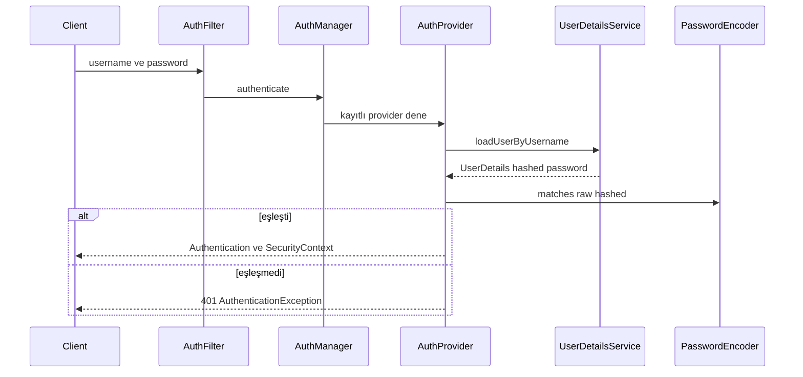
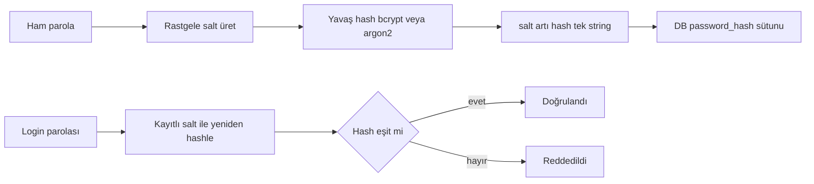
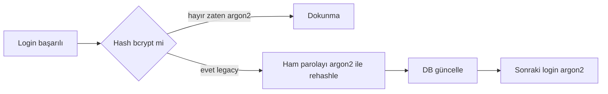
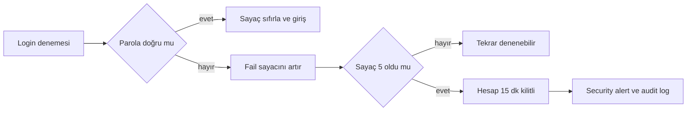

# Topic 8.2 — Authentication: UserDetails, Password Hashing, Policy, MFA

```admonish info title="Bu bölümde"
- Parola neden plain veya MD5 ile değil, salt'lı ve yavaş bir hash (BCrypt strength 12 / Argon2id) ile saklanır — banking work factor seçimi
- `UserDetailsService` ile DB entegrasyonu: username/email/phone flexible lookup + status checks (locked, suspended, expired)
- BDDK uyumlu password policy: length, complexity, history 5, HaveIBeenPwned k-anonymity breach check
- Brute force koruması: 5 fail → 15 dk account lockout, per-user + per-IP, distributed için Redis-backed
- MFA (TOTP primary + SMS OTP backup) login flow, session management ve 10 banking authentication anti-pattern'i
```

## Hedef

Spring Security 6 authentication mekanizmalarını banking-grade seviyede öğrenmek. BCrypt vs Argon2, password policy (BDDK uyumlu), brute force protection, MFA (TOTP + SMS OTP), session management ve credential storage best practices. Banking için **müşteri authentication** ve **internal employee authentication** akışlarını tasarlayabilmek.

## Süre

Okuma: 2-2.5 saat • Kendini Sına: 45 dk • Pratik (opsiyonel): 4-5 saat • Toplam: ~3 saat (+ pratik)

## Önbilgi

- Topic 8.1 (Spring Security Architecture) bitti — filter chain, `AuthenticationManager` biliyorsun
- Phase 1'in user/account model'i hazır
- Phase 7 (microservices) — auth-service için Keycloak alternative düşünüldü

---

## Kavramlar

### 1. Authentication (AuthN) vs Authorization (AuthZ)

İlk beş dakikada karıştırılan iki kavramı ayıralım; bu topic tamamen AuthN'a odaklı.

| Kavram | Anlamı | Banking örneği |
|---|---|---|
| **AuthN** | "Sen kimsin?" | Kullanıcı login (username + password + MFA) |
| **AuthZ** | "Ne yapabilirsin?" | Sadece kendi hesabını görebilir, başkasınınkine eremez |

AuthZ konusu Topic 8.4 + 8.5'te. Burada "kimsin?" sorusunun banking cevaplarını inşa edeceğiz.

### 2. Spring Security authentication flow

`@Transactional` gibi `login` de sihir gibi durur ama altında sıralı bir filter → manager → provider zinciri var; bu zinciri görmeden nereye müdahale edeceğini bilemezsin.



Kritik nokta: parola karşılaştırması **provider** içinde, `PasswordEncoder.matches(...)` ile yapılır. Bizim işimiz iki tarafı doğru kurmak — DB'den doğru `UserDetails`'i çekmek ve hash'i doğru algoritmayla saklamak.

### 3. UserDetailsService — DB entegrasyonu

DB'deki `User` entity'ni Spring Security'nin anladığı `UserDetails`'e çevirmek `UserDetailsService`'in işidir; banking'de bu çeviriye status kontrolleri de girer.

Önce esnek lookup + banking-critical status checks. Username email, phone veya TC No olabilir; kilit, suspend ve password expiry burada yakalanır:

```java
@Override
public UserDetails loadUserByUsername(String username) throws UsernameNotFoundException {
    // Banking: username = email veya phone veya TC No
    User user = userRepo.findByUsernameOrEmailOrPhone(username, username, username)
        .orElseThrow(() -> new UsernameNotFoundException("User not found"));

    if (loginAttemptService.isBlocked(username)) {
        throw new LockedException("Account is locked due to too many failed attempts");
    }
    if (user.getStatus() == UserStatus.SUSPENDED) {
        throw new DisabledException("Account is suspended");
    }
    if (user.getPasswordExpiresAt() != null && user.getPasswordExpiresAt().isBefore(Instant.now())) {
        throw new CredentialsExpiredException("Password expired, must reset");
    }
```

Sonra `UserDetails` nesnesini kur — hash'lenmiş parola ve authority'ler ile. `accountLocked` bayrağı `LoginAttemptService`'ten beslenir:

```java
    return org.springframework.security.core.userdetails.User.builder()
        .username(user.getUsername())
        .password(user.getPasswordHash())
        .authorities(mapAuthorities(user.getRoles(), user.getPermissions()))
        .accountLocked(loginAttemptService.isBlocked(username))
        .disabled(!user.isEnabled())
        .build();
}
```

`mapAuthorities` role ve permission'ları birleştirir: `ROLE_customer` gibi role prefix'i + `ACCOUNT_READ` gibi düz permission'lar. Tuzak: status check'leri atlarsan kilitli/suspend hesap login olur — banking'de kabul edilemez.

<details>
<summary>Tam kod: BankingUserDetailsService (~48 satır)</summary>

```java
@Service
public class BankingUserDetailsService implements UserDetailsService {

    private final UserRepository userRepo;
    private final LoginAttemptService loginAttemptService;

    @Override
    public UserDetails loadUserByUsername(String username) throws UsernameNotFoundException {
        // Banking: username = email veya phone veya TC No
        User user = userRepo.findByUsernameOrEmailOrPhone(username, username, username)
            .orElseThrow(() -> new UsernameNotFoundException("User not found"));

        // Account status checks (banking critical)
        if (loginAttemptService.isBlocked(username)) {
            throw new LockedException("Account is locked due to too many failed attempts");
        }
        if (user.getStatus() == UserStatus.SUSPENDED) {
            throw new DisabledException("Account is suspended");
        }
        if (user.getPasswordExpiresAt() != null && user.getPasswordExpiresAt().isBefore(Instant.now())) {
            throw new CredentialsExpiredException("Password expired, must reset");
        }

        return org.springframework.security.core.userdetails.User.builder()
            .username(user.getUsername())
            .password(user.getPasswordHash())
            .authorities(mapAuthorities(user.getRoles(), user.getPermissions()))
            .accountExpired(false)
            .accountLocked(loginAttemptService.isBlocked(username))
            .credentialsExpired(false)
            .disabled(!user.isEnabled())
            .build();
    }

    private Collection<? extends GrantedAuthority> mapAuthorities(Set<Role> roles, Set<Permission> permissions) {
        Set<GrantedAuthority> authorities = new HashSet<>();
        for (Role role : roles) {
            authorities.add(new SimpleGrantedAuthority("ROLE_" + role.getName()));
        }
        for (Permission perm : permissions) {
            authorities.add(new SimpleGrantedAuthority(perm.getName()));
        }
        return authorities;
    }
}
```

</details>

### 4. Password hashing — parola DB'de nasıl saklanmalı

Bu bölümün en önemli sorusu: bir parolayı DB'de nasıl saklarsın ki DB çalınsa bile açığa çıkmasın? Cevap plain de değil, MD5/SHA-1 de değil — salt'lı ve **kasıtlı yavaş** bir algoritma.

Fikir şu: her parola için rastgele bir salt üretilir, salt + parola birlikte hash'lenir ve `salt+hash` tek string olarak saklanır. Doğrulamada aynı salt ile yeniden hash'lenip karşılaştırılır:



<mark>Banking'de parola asla plain, MD5 veya SHA-1 ile saklanmaz — her zaman salt'lı ve adaptive-cost bir algoritma (BCrypt veya Argon2) kullanılır.</mark> Sebep: MD5/SHA-1 saniyede milyarlarca hesaplanır, saldırgan çalınan hash'i offline brute-force'lar.

Spring'de default **BCrypt**; salt'ı kendi üretir, `strength` ile maliyet ayarlanır:

```java
@Bean
public PasswordEncoder passwordEncoder() {
    return new BCryptPasswordEncoder(12);
}
```

BCrypt'in üç can alıcı özelliği: built-in salt (her hash unique), adaptive work factor (`strength` parametresi) ve sabit 60-karakter hash (storage öngörülebilir). Strength seçimi login UX ile güvenlik arasındaki takastır:

| Strength | Hash time (modern CPU) | Banking |
|---|---|---|
| 4 | <1ms | ❌ çok hızlı (brute force easy) |
| 10 | ~100ms | OK (default) |
| 12 | ~250ms | ✓ Banking standard |
| 14 | ~1s | Login UX kötü |
| 16+ | ~5s | DoS riski |

Banking pratiği: **strength 12**, ~200-300ms login bekleme kabul edilebilir. Storage tarafında BCrypt sabit uzunlukta olduğu için `CHAR(60)` yeterli:

```sql
CREATE TABLE users (
    id UUID PRIMARY KEY,
    username VARCHAR(100) UNIQUE NOT NULL,
    password_hash CHAR(60) NOT NULL,   -- BCrypt fixed-length
    password_changed_at TIMESTAMPTZ,
    password_expires_at TIMESTAMPTZ
);
```

### 5. Argon2 — modern alternative

BCrypt sağlam ama 1999'dan kalma; GPU/ASIC saldırılarına karşı OWASP 2023+ **Argon2id**'yi önerir çünkü memory-hard'dır (bol RAM ister, GPU paralelizmini kırar).

```java
@Bean
public PasswordEncoder passwordEncoder() {
    return new Argon2PasswordEncoder(
        16,    // saltLength bytes
        32,    // hashLength bytes
        1,     // parallelism (threads)
        4096,  // memory KB (4 MB)
        3      // iterations
    );
}
```

Parametre ayarı üretim ortamında ölçülür; banking laptop'larda ~250-500ms hash time hedeflenir. Seçimi netleştirmek için:

| Kriter | BCrypt | Argon2 |
|---|---|---|
| Yıl | 1999 | 2015 (PHC winner) |
| GPU resistance | Düşük | Yüksek |
| Memory-hard | No | Yes |
| Battle-tested | ✓✓✓ | ✓✓ |
| Banking adoption | Yaygın (legacy) | Yeni projeler |

Tuzak: Argon2 parametrelerini kopyala-yapıştır bırakma; sunucun zayıfsa yüksek memory login'i yavaşlatır, güçlüyse düşük parametre güvenliği zayıflatır — mutlaka ölç.

### 6. DelegatingPasswordEncoder — migration safe

Mevcut BCrypt hash'lerini bir gecede Argon2'ye çeviremezsin (ham parolalar elinde yok). **DelegatingPasswordEncoder** her hash'i `{algorithmId}hash` prefix'iyle etiketleyerek iki algoritmayı yan yana çalıştırır:

```java
@Bean
public PasswordEncoder passwordEncoder() {
    Map<String, PasswordEncoder> encoders = new HashMap<>();
    encoders.put("bcrypt", new BCryptPasswordEncoder(12));
    encoders.put("argon2", new Argon2PasswordEncoder(16, 32, 1, 4096, 3));

    DelegatingPasswordEncoder encoder = new DelegatingPasswordEncoder("argon2", encoders);
    encoder.setDefaultPasswordEncoderForMatches(encoders.get("bcrypt"));   // legacy compat
    return encoder;
}
```

Prefix hash'in hangi algoritmayla üretildiğini söyler, `matches` doğru encoder'a yönlenir:

```
{bcrypt}$2a$12$abcdefgh...
{argon2}$argon2id$v=19$m=4096,t=3,p=1$abc...
```

Yeni parolalar Argon2 ile hash'lenir; login'de eski BCrypt match'lenir. Asıl güzellik **rehash on login**: kullanıcı doğru parolayı girdiği an (ham parola elimizdeyken) hash'i sessizce Argon2'ye yükseltiriz.



Login success event'inde bu yükseltmeyi yapan listener:

```java
@Component
public class PasswordRehashListener {

    @EventListener
    public void onLoginSuccess(AuthenticationSuccessEvent event) {
        String username = event.getAuthentication().getName();
        User user = userRepo.findByUsername(username).orElseThrow();

        if (user.getPasswordHash().startsWith("{bcrypt}")) {     // legacy
            String rawPassword = ...;   // login event içinde erişilebilir
            String newHash = passwordEncoder.encode(rawPassword);   // default argon2
            user.setPasswordHash(newHash);
            userRepo.save(user);
            log.info("Password rehashed for user: {}", username);
        }
    }
}
```

Banking pratiği: 6-12 aylık rehash window aç; aktif kullanıcılar login oldukça hash'ler kademeli Argon2'ye geçer, sonunda kalan pasif hesaplar zorunlu reset'e yönlendirilir.

### 7. Password policy — BDDK uyumlu

Zayıf parola en güçlü hash'i bile anlamsız kılar; bu yüzden banking parolayı kabul etmeden önce sıkı bir policy'den geçirir. Önce sabitler ve length kontrolü:

```java
@Component
public class BankingPasswordPolicy {

    private static final int MIN_LENGTH = 12;
    private static final int MAX_LENGTH = 128;
    private static final int MIN_UPPERCASE = 1, MIN_LOWERCASE = 1, MIN_DIGIT = 1, MIN_SYMBOL = 1;

    public void validate(String password, UUID userId) {
        if (password.length() < MIN_LENGTH || password.length() > MAX_LENGTH) {
            throw new WeakPasswordException(
                "Password length must be between " + MIN_LENGTH + " and " + MAX_LENGTH);
        }
```

Sonra complexity — dört karakter grubunun her biri zorunlu:

```java
        if (countMatches(password, "[A-Z]") < MIN_UPPERCASE)
            throw new WeakPasswordException("At least " + MIN_UPPERCASE + " uppercase required");
        if (countMatches(password, "[a-z]") < MIN_LOWERCASE)
            throw new WeakPasswordException("At least " + MIN_LOWERCASE + " lowercase required");
        if (countMatches(password, "[0-9]") < MIN_DIGIT)
            throw new WeakPasswordException("At least " + MIN_DIGIT + " digit required");
        if (countMatches(password, "[^a-zA-Z0-9]") < MIN_SYMBOL)
            throw new WeakPasswordException("At least " + MIN_SYMBOL + " symbol required");
```

En kritik üç kontrol length/complexity'nin ötesinde: yaygın parola listesi, gerçek data breach (HaveIBeenPwned) ve parola geçmişi. Bir de sequential/repetitive pattern reddi:

```java
        if (CommonPasswords.contains(password))
            throw new WeakPasswordException("Password is too common");
        if (pwnedClient.isCompromised(password))    // HaveIBeenPwned k-anonymity
            throw new WeakPasswordException("This password has been found in data breaches");

        List<String> recentHashes = historyRepo.findLast5ByUserId(userId);   // no reuse
        for (String oldHash : recentHashes)
            if (passwordEncoder.matches(password, oldHash))
                throw new WeakPasswordException("Cannot reuse last 5 passwords");

        if (isSequential(password) || isRepetitive(password))
            throw new WeakPasswordException("Password contains predictable pattern");
    }
```

BDDK requirements (yaklaşık): minimum 8 char, complexity (4 grup), expiration 90 gün, history 5, common pattern yasağı. Tuzak: history check'i **hash** üzerinden yapılır (`matches`), eski parolaları plain saklamak yeni bir güvenlik açığı olur.

<details>
<summary>Tam kod: BankingPasswordPolicy (~85 satır)</summary>

```java
@Component
public class BankingPasswordPolicy {

    private static final int MIN_LENGTH = 12;
    private static final int MAX_LENGTH = 128;
    private static final int MIN_UPPERCASE = 1;
    private static final int MIN_LOWERCASE = 1;
    private static final int MIN_DIGIT = 1;
    private static final int MIN_SYMBOL = 1;

    private final HaveIBeenPwnedClient pwnedClient;
    private final PasswordHistoryRepository historyRepo;

    public void validate(String password, UUID userId) {
        if (password.length() < MIN_LENGTH || password.length() > MAX_LENGTH) {
            throw new WeakPasswordException(
                "Password length must be between " + MIN_LENGTH + " and " + MAX_LENGTH);
        }

        if (countMatches(password, "[A-Z]") < MIN_UPPERCASE) {
            throw new WeakPasswordException("At least " + MIN_UPPERCASE + " uppercase required");
        }
        if (countMatches(password, "[a-z]") < MIN_LOWERCASE) {
            throw new WeakPasswordException("At least " + MIN_LOWERCASE + " lowercase required");
        }
        if (countMatches(password, "[0-9]") < MIN_DIGIT) {
            throw new WeakPasswordException("At least " + MIN_DIGIT + " digit required");
        }
        if (countMatches(password, "[^a-zA-Z0-9]") < MIN_SYMBOL) {
            throw new WeakPasswordException("At least " + MIN_SYMBOL + " symbol required");
        }

        // Common password check (top 1M passwords)
        if (CommonPasswords.contains(password)) {
            throw new WeakPasswordException("Password is too common");
        }

        // HaveIBeenPwned check (k-anonymity)
        if (pwnedClient.isCompromised(password)) {
            throw new WeakPasswordException("This password has been found in data breaches");
        }

        // History check — last 5 passwords
        List<String> recentHashes = historyRepo.findLast5ByUserId(userId);
        for (String oldHash : recentHashes) {
            if (passwordEncoder.matches(password, oldHash)) {
                throw new WeakPasswordException("Cannot reuse last 5 passwords");
            }
        }

        // Common patterns
        if (isSequential(password) || isRepetitive(password)) {
            throw new WeakPasswordException("Password contains predictable pattern");
        }
    }

    private int countMatches(String input, String regex) {
        return (int) input.chars().filter(c -> String.valueOf((char) c).matches(regex)).count();
    }

    private boolean isSequential(String password) {
        // "12345", "abcde" → sequential
        for (int i = 0; i < password.length() - 4; i++) {
            char c = password.charAt(i);
            if (password.charAt(i+1) == c + 1 &&
                password.charAt(i+2) == c + 2 &&
                password.charAt(i+3) == c + 3 &&
                password.charAt(i+4) == c + 4) {
                return true;
            }
        }
        return false;
    }

    private boolean isRepetitive(String password) {
        // "aaaaaa", "11111" → repetitive
        for (int i = 0; i < password.length() - 4; i++) {
            char c = password.charAt(i);
            if (password.charAt(i+1) == c && password.charAt(i+2) == c &&
                password.charAt(i+3) == c && password.charAt(i+4) == c) {
                return true;
            }
        }
        return false;
    }
}
```

</details>

### 8. HaveIBeenPwned API — k-anonymity

"Bu parola daha önce sızmış mı?" sorusunu cevaplamak istersin ama parolayı üçüncü bir servise göndermeden. HaveIBeenPwned (HIBP) bunu **k-anonymity** ile çözer.

Parolanın SHA-1 hash'inin sadece **ilk 5 karakteri** gönderilir; server o prefix'le başlayan tüm hash'lerin suffix'lerini döner, eşleşmeyi client local'de arar:

```java
public boolean isCompromised(String password) {
    String sha1 = sha1Hex(password).toUpperCase();
    String prefix = sha1.substring(0, 5);
    String suffix = sha1.substring(5);

    String response = restTemplate.getForObject(
        "https://api.pwnedpasswords.com/range/" + prefix, String.class);

    return response.lines().anyMatch(line -> line.startsWith(suffix + ":"));
}
```

```admonish tip title="k-anonymity privacy guarantee"
API gerçek parolayı asla görmez — sadece 5 karakterlik SHA-1 prefix'i alır. Bu prefix 10^5 = 100.000 olası hash'i temsil eder, dolayısıyla server hangi parolayı sorguladığını bilemez. Banking'de her password set/change işleminde HIBP check zorunlu; compromised parola reddedilir.
```

<details>
<summary>Tam kod: HaveIBeenPwnedClient (~33 satır)</summary>

```java
@Component
public class HaveIBeenPwnedClient {

    private final RestTemplate restTemplate;

    public boolean isCompromised(String password) {
        String sha1 = sha1Hex(password).toUpperCase();
        String prefix = sha1.substring(0, 5);
        String suffix = sha1.substring(5);

        String response = restTemplate.getForObject(
            "https://api.pwnedpasswords.com/range/" + prefix,
            String.class
        );

        return response.lines().anyMatch(line -> line.startsWith(suffix + ":"));
    }

    private String sha1Hex(String input) {
        try {
            MessageDigest md = MessageDigest.getInstance("SHA-1");
            byte[] bytes = md.digest(input.getBytes(StandardCharsets.UTF_8));
            StringBuilder sb = new StringBuilder();
            for (byte b : bytes) {
                sb.append(String.format("%02x", b));
            }
            return sb.toString();
        } catch (NoSuchAlgorithmException e) {
            throw new IllegalStateException(e);
        }
    }
}
```

</details>

### 9. Brute force protection — account lockout

Sıkı hash + sıkı policy bile, saldırgan aynı hesaba sınırsız parola deneyebiliyorsa yetmez; bu yüzden banking'de brute force protection **şart**. Temel fikir: fail'leri say, eşiği aşınca hesabı geçici kilitle.



<mark>Banking standardı: 5 başarısız login denemesinden sonra hesap 15 dakika kilitlenir, kullanıcıya security alert gider ve olay immutable audit log'a yazılır.</mark>

Fail kaydı ve kilitleme mantığı — eşik aşılınca notification + audit tetiklenir:

```java
public void loginFailed(String username, String ip) {
    AttemptRecord record = attempts.computeIfAbsent(username, k -> new AttemptRecord());
    int count = record.count.incrementAndGet();
    record.lastAttemptAt = Instant.now();
    record.failedIps.add(ip);

    if (count >= MAX_ATTEMPTS) {   // 5
        record.lockedUntil = Instant.now().plus(LOCK_DURATION);   // 15 dk
        notificationService.sendSecurityAlert(username,
            "Multiple failed login attempts detected. Account locked for 15 minutes.");
        auditLog.log(SecurityEvent.builder()
            .type("ACCOUNT_LOCKED").username(username).ip(ip)
            .reason("MAX_FAILED_ATTEMPTS").build());
    }
}
```

Kilit sorgusu — süre dolduysa kayıt temizlenir, başarılı login sayacı sıfırlar:

```java
public boolean isBlocked(String username) {
    AttemptRecord record = attempts.get(username);
    if (record == null) return false;
    if (record.lockedUntil != null && record.lockedUntil.isAfter(Instant.now())) return true;
    if (record.lockedUntil != null) attempts.remove(username);   // lock expired
    return false;
}
```

```admonish warning title="In-memory yetmez"
Yukarıdaki `ConcurrentHashMap` tabanlı versiyon tek instance'ta çalışır. Multi-instance banking deployment'ında saldırgan her denemede farklı pod'a düşerse lockout hiç tetiklenmez. Distributed ortamda state **Redis-backed** olmalı — tek doğruluk kaynağı.
```

Redis versiyonu — atomic `increment` + TTL ile aynı davranış, tüm instance'lar paylaşır:

```java
public void loginFailed(String username) {
    String key = "login:attempts:" + username;
    Long count = redis.opsForValue().increment(key);
    redis.expire(key, Duration.ofMinutes(15));
    if (count >= 5) {
        redis.opsForValue().set("login:locked:" + username, "true", Duration.ofMinutes(15));
    }
}

public boolean isBlocked(String username) {
    return Boolean.TRUE.equals(redis.hasKey("login:locked:" + username));
}
```

<details>
<summary>Tam kod: LoginAttemptService in-memory (~58 satır)</summary>

```java
@Component
public class LoginAttemptService {

    private static final int MAX_ATTEMPTS = 5;
    private static final Duration LOCK_DURATION = Duration.ofMinutes(15);

    private final Map<String, AttemptRecord> attempts = new ConcurrentHashMap<>();

    public void loginFailed(String username, String ip) {
        AttemptRecord record = attempts.computeIfAbsent(username, k -> new AttemptRecord());

        int count = record.count.incrementAndGet();
        record.lastAttemptAt = Instant.now();
        record.failedIps.add(ip);

        if (count >= MAX_ATTEMPTS) {
            record.lockedUntil = Instant.now().plus(LOCK_DURATION);

            // Notify user (suspicious activity)
            notificationService.sendSecurityAlert(username,
                "Multiple failed login attempts detected. Account locked for 15 minutes.");

            // Audit log
            auditLog.log(SecurityEvent.builder()
                .type("ACCOUNT_LOCKED")
                .username(username)
                .ip(ip)
                .reason("MAX_FAILED_ATTEMPTS")
                .build());
        }
    }

    public void loginSucceeded(String username) {
        attempts.remove(username);
    }

    public boolean isBlocked(String username) {
        AttemptRecord record = attempts.get(username);
        if (record == null) return false;

        if (record.lockedUntil != null && record.lockedUntil.isAfter(Instant.now())) {
            return true;
        }

        // Lock duration expired
        if (record.lockedUntil != null) {
            attempts.remove(username);
        }
        return false;
    }

    private static class AttemptRecord {
        AtomicInteger count = new AtomicInteger();
        Instant lastAttemptAt;
        Instant lockedUntil;
        Set<String> failedIps = ConcurrentHashMap.newKeySet();
    }
}
```

</details>

### 10. IP-based protection

Tek hesaba değil, çok hesaba dağıtılmış saldırı (credential stuffing) per-user sayaçtan kaçar; bu yüzden per-IP sayaç da tutulur.

```java
public void loginFailed(String username, String ip) {
    // Per-user
    redis.opsForValue().increment("login:attempts:user:" + username);
    redis.expire("login:attempts:user:" + username, Duration.ofMinutes(15));

    // Per-IP (aynı IP'den birçok user'a saldırı)
    Long ipCount = redis.opsForValue().increment("login:attempts:ip:" + ip);
    redis.expire("login:attempts:ip:" + ip, Duration.ofMinutes(15));

    if (ipCount >= 50) {   // 50 fail from one IP → block IP
        redis.opsForValue().set("login:blocked:ip:" + ip, "true", Duration.ofHours(1));
        alerts.notifySecurityOps("Suspicious IP: " + ip);
    }
}
```

Banking pratiği: IP block + security ops alert + CAPTCHA enforcement. Tuzak: NAT/proxy arkasındaki kurumsal müşteriler tek IP'den gelebilir; eşiği agresif tutarsan meşru trafiği bloklarsın.

### 11. MFA (Multi-Factor Authentication)

Tek faktör (parola) çalınabilir; banking'de MFA BDDK gereği **zorunlu**. Üç faktör kategorisi vardır ve gerçek MFA en az ikisini birleştirir:

1. **Knowledge** — parola (bildiğin şey)
2. **Possession** — telefon (SMS OTP), security key (FIDO2) (sahip olduğun şey)
3. **Inherence** — biyometri (parmak izi, yüz) (olduğun şey)

**TOTP** (Time-based One-Time Password, RFC 6238) Google Authenticator/Authy gibi app'lerle çalışır; secret bir kez üretilir, QR ile app'e taşınır:

```java
@Component
public class TotpService {
    private final GoogleAuthenticator googleAuth = new GoogleAuthenticator();

    public String generateSecret() {
        return googleAuth.createCredentials().getKey();
    }
    public String generateQrCodeUrl(String username, String secret) {
        return GoogleAuthenticatorQRGenerator.getOtpAuthURL(
            "MaviBank", username, new GoogleAuthenticatorKey.Builder(secret).build());
    }
    public boolean validate(String secret, int totpCode) {
        return googleAuth.authorize(secret, totpCode);
    }
}
```

**SMS OTP** backup faktör olarak kullanılır. Kritik iki detay: OTP Redis'te kısa TTL (5 dk) ile tutulur ve karşılaştırma **timing-safe** yapılır (`MessageDigest.isEqual`):

```java
public void sendOtp(String phoneNumber) {
    String otp = generateOtp();
    redis.opsForValue().set("otp:" + phoneNumber, otp, Duration.ofMinutes(5));
    smsGateway.send(phoneNumber, "MaviBank OTP: " + otp + ". Geçerlilik 5 dakika.");
    auditLog.log("SMS_OTP_SENT", phoneNumber);   // sadece event, OTP değil
}

public boolean validate(String phoneNumber, String otp) {
    String stored = redis.opsForValue().get("otp:" + phoneNumber);
    if (stored == null) return false;
    boolean valid = MessageDigest.isEqual(
        stored.getBytes(StandardCharsets.UTF_8),
        otp.getBytes(StandardCharsets.UTF_8));   // timing-safe compare
    if (valid) redis.delete("otp:" + phoneNumber);
    return valid;
}
```

<mark>OTP hiçbir zaman log'a, exception mesajına veya URL'e yazılmaz — sadece "OTP sent" gibi bir event log'lanır.</mark> OTP üretimi de `SecureRandom` ile 6 haneli yapılır (`String.format("%06d", random.nextInt(1000000))`).

MFA login iki adımlıdır: `/auth/login` parolayı doğrulayıp bir challenge döner, `/auth/mfa/verify` kodu doğrulayıp token verir. Önce login adımı — MFA aktifse challenge Redis'e yazılır:

```java
@PostMapping("/auth/login")
public ResponseEntity<LoginResponse> login(@RequestBody LoginRequest req) {
    User user = authenticate(req.username(), req.password());

    if (user.isMfaEnabled()) {
        String challengeId = UUID.randomUUID().toString();
        redisTemplate.opsForValue().set(
            "mfa:challenge:" + challengeId, user.getId().toString(), Duration.ofMinutes(5));

        if (user.getMfaMethod() == MfaMethod.SMS) {
            smsOtpService.sendOtp(user.getPhone());
            return ResponseEntity.ok(LoginResponse.mfaRequired(
                challengeId, "SMS_OTP", "Kod " + user.getMaskedPhone() + "'a gönderildi"));
        } else if (user.getMfaMethod() == MfaMethod.TOTP) {
            return ResponseEntity.ok(LoginResponse.mfaRequired(
                challengeId, "TOTP", "Lütfen authenticator app'inizdeki kodu girin"));
        }
    }
    return ResponseEntity.ok(LoginResponse.success(tokenService.issueTokens(user)));
}
```

Sonra verify adımı — challenge geçerliyse method'a göre kod doğrulanır, challenge tek kullanımlık silinir:

```java
@PostMapping("/auth/mfa/verify")
public ResponseEntity<LoginResponse> verifyMfa(@RequestBody MfaVerifyRequest req) {
    String userIdStr = redisTemplate.opsForValue().get("mfa:challenge:" + req.challengeId());
    if (userIdStr == null)
        return ResponseEntity.status(401).body(LoginResponse.error("Challenge expired"));

    User user = userRepo.findById(UUID.fromString(userIdStr)).orElseThrow();
    boolean valid = switch (user.getMfaMethod()) {
        case SMS -> smsOtpService.validate(user.getPhone(), req.code());
        case TOTP -> totpService.validate(user.getMfaSecret(), Integer.parseInt(req.code()));
    };
    if (!valid) return ResponseEntity.status(401).body(LoginResponse.error("Invalid MFA code"));

    redisTemplate.delete("mfa:challenge:" + req.challengeId());
    return ResponseEntity.ok(LoginResponse.success(tokenService.issueTokens(user)));
}
```

Banking pratiği: TOTP primary, SMS OTP backup; modern alternatif olarak WhatsApp Business OTP de kullanılıyor.

<details>
<summary>Tam kod: SmsOtpService + AuthController MFA flow (~80 satır)</summary>

```java
@Component
public class SmsOtpService {

    private final SmsGatewayClient smsGateway;
    private final RedisTemplate<String, String> redis;

    public void sendOtp(String phoneNumber) {
        String otp = generateOtp();
        redis.opsForValue().set("otp:" + phoneNumber, otp, Duration.ofMinutes(5));

        smsGateway.send(phoneNumber,
            "MaviBank OTP: " + otp + ". Geçerlilik 5 dakika.");

        auditLog.log("SMS_OTP_SENT", phoneNumber);
    }

    public boolean validate(String phoneNumber, String otp) {
        String stored = redis.opsForValue().get("otp:" + phoneNumber);
        if (stored == null) return false;

        boolean valid = MessageDigest.isEqual(
            stored.getBytes(StandardCharsets.UTF_8),
            otp.getBytes(StandardCharsets.UTF_8)   // timing-safe comparison
        );

        if (valid) {
            redis.delete("otp:" + phoneNumber);
        }
        return valid;
    }

    private String generateOtp() {
        SecureRandom random = new SecureRandom();
        return String.format("%06d", random.nextInt(1000000));   // 6-digit
    }
}

@RestController
public class AuthController {

    @PostMapping("/auth/login")
    public ResponseEntity<LoginResponse> login(@RequestBody LoginRequest req) {
        // Step 1: Username + password
        User user = authenticate(req.username(), req.password());

        // Step 2: MFA challenge
        if (user.isMfaEnabled()) {
            String challengeId = UUID.randomUUID().toString();

            redisTemplate.opsForValue().set(
                "mfa:challenge:" + challengeId,
                user.getId().toString(),
                Duration.ofMinutes(5)
            );

            if (user.getMfaMethod() == MfaMethod.SMS) {
                smsOtpService.sendOtp(user.getPhone());
                return ResponseEntity.ok(LoginResponse.mfaRequired(
                    challengeId, "SMS_OTP", "Kod " + user.getMaskedPhone() + "'a gönderildi"));
            } else if (user.getMfaMethod() == MfaMethod.TOTP) {
                return ResponseEntity.ok(LoginResponse.mfaRequired(
                    challengeId, "TOTP", "Lütfen authenticator app'inizdeki kodu girin"));
            }
        }

        // No MFA — issue token
        return ResponseEntity.ok(LoginResponse.success(tokenService.issueTokens(user)));
    }

    @PostMapping("/auth/mfa/verify")
    public ResponseEntity<LoginResponse> verifyMfa(@RequestBody MfaVerifyRequest req) {
        String userIdStr = redisTemplate.opsForValue().get("mfa:challenge:" + req.challengeId());
        if (userIdStr == null) {
            return ResponseEntity.status(401).body(LoginResponse.error("Challenge expired"));
        }

        User user = userRepo.findById(UUID.fromString(userIdStr)).orElseThrow();

        boolean valid = switch (user.getMfaMethod()) {
            case SMS -> smsOtpService.validate(user.getPhone(), req.code());
            case TOTP -> totpService.validate(user.getMfaSecret(), Integer.parseInt(req.code()));
        };

        if (!valid) {
            return ResponseEntity.status(401).body(LoginResponse.error("Invalid MFA code"));
        }

        redisTemplate.delete("mfa:challenge:" + req.challengeId());

        return ResponseEntity.ok(LoginResponse.success(tokenService.issueTokens(user)));
    }
}
```

</details>

### 12. FIDO2 / WebAuthn — hardware key

Phishing'e tamamen dayanıklı en güçlü faktör **physical security key** (YubiKey, Touch ID). `webauthn4j` library Spring Security ile entegre olur; banking için ileri bir adım (Phase 8 sonrası), ama yol haritanda bulunsun.

### 13. Session management

MFA'yı geçtikten sonra oturumu nasıl yöneteceğin de bir güvenlik kararıdır. Spring Security session policy'sini `HttpSecurity` üzerinden kurarsın:

```java
http
    .sessionManagement(s -> s
        .sessionCreationPolicy(SessionCreationPolicy.STATELESS)   // banking JWT
        .maximumSessions(1)                                        // tek aktif device
        .maxSessionsPreventsLogin(false)                           // yeni login eskiyi kovar
        .expiredUrl("/login?expired"));
```

İki model var: **stateful session** eski modeldir — server `JSESSIONID` cookie tutar, sticky session veya Redis ister. **Stateless JWT** modern modeldir — server state'siz, kontrol token expiry ile yapılır. Banking modern tercihi stateless JWT'dir (detay Topic 8.3).

### 14. Concurrent session limit

Aynı hesabın birden çok cihazda açık olması banking'de risktir; tek device login zorlanır:

```yaml
spring:
  security:
    session:
      max-concurrent: 1
```

Yeni login gelince eski oturum invalidate edilir — çalınan bir oturum böylece kullanıcının bir sonraki login'inde ölür.

### 15. Session fixation protection

Saldırgan kurbanı bilinen bir session ID'yle login olmaya kandırırsa, login sonrası o ID'yi kullanarak oturumu ele geçirebilir. Koruma: login'de session ID'yi yenilemek.

```java
.sessionManagement(s -> s
    .sessionFixation().migrateSession());   // login sonrası yeni session ID
```

Spring Security'de default aktiftir; eski session ID'ler login sonrası geçersizleşir.

### 16. Banking örnek — full auth flow config

Şimdiye kadarki parçaları tek bir güvenlik konfigürasyonunda birleştirelim. Önce encoder ve provider — `DelegatingPasswordEncoder` + `hideUserNotFoundExceptions` ile username enumeration engellenir:

```java
@Bean
public PasswordEncoder passwordEncoder() {
    return new DelegatingPasswordEncoder("argon2", Map.of(
        "bcrypt", new BCryptPasswordEncoder(12),
        "argon2", new Argon2PasswordEncoder(16, 32, 1, 4096, 3)));
}

@Bean
public AuthenticationProvider daoAuthenticationProvider(
        UserDetailsService userDetailsService, PasswordEncoder passwordEncoder) {
    DaoAuthenticationProvider provider = new DaoAuthenticationProvider();
    provider.setUserDetailsService(userDetailsService);
    provider.setPasswordEncoder(passwordEncoder);
    provider.setHideUserNotFoundExceptions(true);   // username enumeration prevention
    return provider;
}
```

Sonra filter chain — stateless, lockout filter parola kontrolünden önce devrede:

```java
@Bean
public SecurityFilterChain filterChain(HttpSecurity http,
        LoginAttemptFilter attemptFilter, JwtAuthenticationFilter jwtFilter) throws Exception {
    http
        .csrf(c -> c.disable())   // stateless API
        .sessionManagement(s -> s.sessionCreationPolicy(SessionCreationPolicy.STATELESS))
        .authorizeHttpRequests(a -> a
            .requestMatchers("/auth/**", "/v1/public/**").permitAll()
            .requestMatchers("/admin/**").hasRole("admin")
            .anyRequest().authenticated())
        .addFilterBefore(attemptFilter, UsernamePasswordAuthenticationFilter.class)
        .addFilterBefore(jwtFilter, UsernamePasswordAuthenticationFilter.class);
    return http.build();
}
```

`LoginAttemptFilter`, kilitli hesabı parola karşılaştırmasına hiç ulaştırmadan 423 Locked döner — brute force'u en erken noktada keser.

<details>
<summary>Tam kod: BankingSecurityConfig + LoginAttemptFilter (~58 satır)</summary>

```java
@Configuration
public class BankingSecurityConfig {

    @Bean
    public PasswordEncoder passwordEncoder() {
        return new DelegatingPasswordEncoder("argon2", Map.of(
            "bcrypt", new BCryptPasswordEncoder(12),
            "argon2", new Argon2PasswordEncoder(16, 32, 1, 4096, 3)
        ));
    }

    @Bean
    public AuthenticationProvider daoAuthenticationProvider(
            UserDetailsService userDetailsService,
            PasswordEncoder passwordEncoder) {
        DaoAuthenticationProvider provider = new DaoAuthenticationProvider();
        provider.setUserDetailsService(userDetailsService);
        provider.setPasswordEncoder(passwordEncoder);
        provider.setHideUserNotFoundExceptions(true);   // username enumeration prevention
        return provider;
    }

    @Bean
    public SecurityFilterChain filterChain(HttpSecurity http,
                                            LoginAttemptFilter attemptFilter,
                                            JwtAuthenticationFilter jwtFilter) throws Exception {
        http
            .csrf(c -> c.disable())   // stateless API
            .sessionManagement(s -> s.sessionCreationPolicy(SessionCreationPolicy.STATELESS))
            .authorizeHttpRequests(a -> a
                .requestMatchers("/auth/**", "/v1/public/**").permitAll()
                .requestMatchers("/admin/**").hasRole("admin")
                .anyRequest().authenticated())
            .addFilterBefore(attemptFilter, UsernamePasswordAuthenticationFilter.class)
            .addFilterBefore(jwtFilter, UsernamePasswordAuthenticationFilter.class);
        return http.build();
    }
}

@Component
public class LoginAttemptFilter extends OncePerRequestFilter {

    private final LoginAttemptService attemptService;

    @Override
    protected void doFilterInternal(HttpServletRequest req, HttpServletResponse res, FilterChain chain)
            throws ServletException, IOException {
        if (req.getRequestURI().equals("/auth/login")) {
            String username = extractUsername(req);
            if (username != null && attemptService.isBlocked(username)) {
                res.setStatus(HttpStatus.LOCKED.value());
                res.getWriter().write("{\"error\":\"Account locked\"}");
                return;
            }
        }
        chain.doFilter(req, res);
    }
}
```

</details>

### 17. Authentication events + audit

Regülatör için "kim, ne zaman, nereden login oldu/olamadı" sorusu her zaman cevaplanabilir olmalı; Spring Security bunu event'lerle sunar. Success ve failure event'lerini dinleyip audit log'a yaz:

```java
@EventListener
public void onSuccess(AuthenticationSuccessEvent event) {
    String username = event.getAuthentication().getName();
    loginAttemptService.loginSucceeded(username);   // fail sayacını sıfırla
    auditLog.log(SecurityEvent.builder()
        .type("LOGIN_SUCCESS").username(username)
        .ip(getCurrentIp()).userAgent(getCurrentUserAgent()).build());
}

@EventListener
public void onFailure(AbstractAuthenticationFailureEvent event) {
    String username = event.getAuthentication().getName();
    loginAttemptService.loginFailed(username, getCurrentIp());   // sayacı artır
    auditLog.log(SecurityEvent.builder()
        .type("LOGIN_FAILURE").username(username)
        .ip(getCurrentIp()).reason(event.getException().getMessage()).build());
}
```

Banking pratiği: tüm authentication event'leri **immutable audit log**'a yazılır (KVKK + regulatory). Bu listener aynı zamanda lockout sayacını besleyen tek merkezdir — success sıfırlar, failure artırır.

### 18. Banking authentication anti-pattern'leri

Mülakatta "bu kodda ne yanlış?" sorusunun cephaneliği burası. On klasik:

**1. Plain MD5/SHA-1 hash:** `sha1(password)` yasak — hızlı hash = hızlı brute force. BCrypt veya Argon2 kullan.

**2. BCrypt strength 4-8:** Çok hızlı → brute force kolay. Banking strength **12+**.

**3. Salt elle ekleme:** `bcrypt(password + customSalt)` yanlış — BCrypt salt'ı zaten kendi üretir; custom salt bug + standart dışı.

**4. Brute force protection yok:**

```java
@PostMapping("/auth/login")
public LoginResponse login(LoginRequest req) {
    User user = userRepo.findByUsername(req.username()).orElseThrow();
    if (passwordEncoder.matches(req.password(), user.getPasswordHash())) return success(...);
    return failure();   // ❌ unlimited attempts → brute force açık
}
```

Banking: 5 fail → 15 dk lock + alert.

**5. MFA opsiyonel:** Banking'de MFA zorunlu olmalı; mobile banking için TOTP + biometric.

**6. SMS OTP plain text log'a:** `log.info("Sending OTP {} to {}", otp, phone)` yasak — OTP asla log'lanmaz, sadece "OTP sent" event'i.

**7. Username enumeration:** Farklı hata mesajları ("User not found" vs "Wrong password") user'ın var olduğunu açığa çıkarır. <mark>Banking'de her login hatası tek generic "Invalid credentials" mesajı döner; user'ın var olup olmadığı asla belli edilmez.</mark> Spring'de `hideUserNotFoundExceptions(true)` bunu sağlar.

**8. Password expiry yok:** 90 gün rotation BDDK gereği; `password_expires_at` field ile takip et.

**9. Password history yok:** Aynı parolanın tekrar tekrar kullanılması anti-pattern; son 5 hash karşılaştırılır.

**10. Reset token expiry yok:** `?token=abc123` sonsuza dek geçerliyse çalınınca felaket; 15 dakika TTL + one-time use zorunlu.

---

## Önemli olabilecek araştırma kaynakları

- OWASP Password Storage Cheat Sheet (2023)
- "Spring Security in Action" (Laurentiu Spilca)
- Argon2 RFC 9106
- BCrypt original paper (Niels Provos)
- HaveIBeenPwned API documentation
- BDDK güvenlik regülasyonları (TR specific)
- WebAuthn / FIDO2 specs
- Google Authenticator (TOTP) RFC 6238

---

## Kendini Sına

Aşağıdaki soruları önce **cevaba bakmadan** kendi cümlelerinle yanıtlamayı dene — hepsi TR bank mülakatlarında karşına çıkabilecek tarzda. Takıldığın soru olursa ilgili Kavramlar başlığına dön, sonra tekrar dene.

**S1. Parola DB'de neden plain veya MD5/SHA-1 ile değil, salt'lı yavaş bir hash ile saklanır?**

<details>
<summary>Cevabı göster</summary>

DB çalınırsa plain parolalar direkt açığa çıkar; hash bunu engeller ama MD5/SHA-1 saniyede milyarlarca hesaplandığı için saldırgan çalınan hash'i offline brute-force ya da rainbow table ile hızla kırar. BCrypt/Argon2 gibi algoritmalar kasıtlı olarak yavaştır (adaptive work factor), her kırma denemesi pahalı olur.

Salt ise her parolaya rastgele bir değer ekler: iki kullanıcı aynı parolayı seçse bile hash'leri farklı olur, dolayısıyla precomputed rainbow table işe yaramaz ve bir hash kırıldığında diğerleri etkilenmez. BCrypt/Argon2 salt'ı kendi üretip hash'in içine gömer, ayrıca saklaman gerekmez.

</details>

**S2. BCrypt vs Argon2 — banking için hangisini seçersin, work factor'ı nasıl belirlersin?**

<details>
<summary>Cevabı göster</summary>

BCrypt (1999) battle-tested ve legacy sistemlerde yaygın; strength 12 ile ~250ms hash time banking standardıdır. Argon2id (2015, PHC winner) memory-hard olduğu için GPU/ASIC saldırılarına daha dayanıklıdır ve OWASP 2023+ yeni projeler için bunu önerir. Yeni bir banking projesinde Argon2id, mevcut BCrypt tabanlı sistemde ise DelegatingPasswordEncoder ile kademeli geçiş mantıklıdır.

Work factor kopyala-yapıştır seçilmez, üretim donanımında ölçülerek belirlenir: BCrypt'te strength (12), Argon2'de memory/iterations/parallelism. Hedef ~250-500ms login hash time — yeterince yavaş ki brute force pahalı olsun, yeterince hızlı ki login UX bozulmasın ve yüksek memory DoS riski doğurmasın.

</details>

**S3. Mevcut BCrypt hash'lerinden Argon2'ye migration'ı nasıl güvenli yaparsın?**

<details>
<summary>Cevabı göster</summary>

Ham parolalar elimizde olmadığı için tüm hash'leri bir gecede çeviremeyiz. `DelegatingPasswordEncoder` çözümü her hash'i `{bcrypt}...` veya `{argon2}...` prefix'iyle etiketler; `matches` prefix'e göre doğru encoder'a yönlenir, böylece iki algoritma yan yana çalışır. Yeni parolalar default (argon2) ile hash'lenir, eski BCrypt hash'ler login'de hâlâ doğrulanır.

Kademeli geçiş **rehash on login** ile olur: kullanıcı doğru parolayı girdiği an (ham parola sadece o anda elimizdeyken) `AuthenticationSuccessEvent` listener'ında hash BCrypt ise Argon2 ile yeniden hash'lenip DB güncellenir. 6-12 aylık bir window'da aktif kullanıcılar geçer; kalan pasif hesaplar sonunda zorunlu password reset'e yönlendirilir.

</details>

**S4. Brute force protection için account lockout nasıl tasarlanır, neden Redis-backed olmalı?**

<details>
<summary>Cevabı göster</summary>

Temel mantık: her başarısız login'de sayaç artar, eşiği (banking'de 5) aşınca hesap belirli süre (15 dk) kilitlenir, kullanıcıya security alert gider ve olay immutable audit log'a yazılır; başarılı login sayacı sıfırlar. Kilitli hesap ideal olarak parola karşılaştırmasına hiç ulaşmadan bir filter'da 423 Locked ile kesilir. Ayrıca per-IP sayaç credential stuffing'i (çok hesaba dağıtılmış saldırı) yakalar — örneğin tek IP'den 50 fail → IP block + security ops alert.

Redis-backed olması şart çünkü in-memory (`ConcurrentHashMap`) sayaç tek instance'ta yaşar. Multi-instance banking deployment'ında saldırgan her denemede farklı pod'a düşerse hiçbir instance eşiğe ulaşamaz ve lockout hiç tetiklenmez. Redis atomic `increment` + TTL ile tüm instance'lar için tek doğruluk kaynağı olur.

</details>

**S5. Username enumeration nedir ve nasıl önlenir?**

<details>
<summary>Cevabı göster</summary>

Username enumeration, login/hata mesajlarının bir kullanıcının sistemde var olup olmadığını sızdırmasıdır. "User not found" ile "Wrong password" gibi farklı mesajlar döndürürsen, saldırgan hangi username'lerin gerçek olduğunu tespit edip hedefli brute force veya phishing yapar. Response süresi farkı bile (var olan user'da hash karşılaştırması yapılır, yoksa yapılmaz) enumeration'a kapı açar.

Önlem: her başarısız login için tek generic "Invalid credentials" mesajı dönmek — user var mı yok mu, parola mı yanlış belli edilmez. Spring Security'de `DaoAuthenticationProvider.setHideUserNotFoundExceptions(true)`, `UsernameNotFoundException`'ı `BadCredentialsException`'a çevirerek mesajları tektipleştirir. Timing farkını da azaltmak için var olmayan user'da bile dummy bir hash karşılaştırması yapılabilir.

</details>

**S6. Banking password policy (BDDK) neleri içerir, HaveIBeenPwned k-anonymity nasıl çalışır?**

<details>
<summary>Cevabı göster</summary>

BDDK uyumlu policy: minimum length (banking'de 12+), 4 grup complexity (uppercase, lowercase, digit, symbol), 90 gün expiration, history 5 (son 5 parola tekrar kullanılamaz — hash üzerinden `matches` ile kontrol edilir), yaygın parola listesi reddi ve sequential/repetitive pattern reddi. Bunlara ek olarak gerçek data breach kontrolü yapılır.

HaveIBeenPwned k-anonymity, parolayı hiç göndermeden breach kontrolü sağlar: parolanın SHA-1 hash'i alınır, sadece **ilk 5 karakteri** API'ye gönderilir. Server o prefix ile başlayan tüm hash'lerin suffix'lerini döner, client eşleşmeyi local'de arar. Prefix 100.000 olası hash'i temsil ettiği için server hangi parolayı sorguladığını bilemez — privacy korunur, compromised parola reddedilir.

</details>

**S7. MFA'daki 3 faktör nedir, TOTP ile SMS OTP farkı ne, OTP handling'de nelere dikkat edersin?**

<details>
<summary>Cevabı göster</summary>

Üç faktör kategorisi: knowledge (bildiğin — parola), possession (sahip olduğun — telefon/SMS OTP, security key/FIDO2), inherence (olduğun — biyometri). Gerçek MFA en az iki farklı kategoriyi birleştirir; banking'de BDDK gereği zorunludur. TOTP (RFC 6238) authenticator app'te offline üretilir, ağ gerektirmez ve SIM-swap saldırısına dayanıklıdır — bu yüzden primary tercih edilir. SMS OTP daha kullanışlı ama SIM-swap ve SS7 zafiyetlerine açıktır, backup faktör olarak kullanılır.

OTP handling'de kritik noktalar: OTP `SecureRandom` ile üretilir, Redis'te kısa TTL (5 dk) ile ve tek kullanımlık (doğrulanınca silinir) tutulur, karşılaştırma timing-safe (`MessageDigest.isEqual`) yapılır ve OTP asla log'a, exception mesajına veya URL'e yazılmaz — sadece "OTP sent" event'i log'lanır. MFA flow iki adımlıdır: parola doğrulanınca kısa ömürlü bir challenge üretilir, ikinci adımda kod doğrulanıp token verilir.

</details>

---

## Tamamlama kriterleri

- [ ] AuthN ile AuthZ farkını banking örneğiyle anlatabiliyorum
- [ ] Spring Security authentication flow'unu (Filter → Manager → Provider → UserDetailsService → PasswordEncoder) çizebiliyorum
- [ ] Parolanın neden salt'lı yavaş hash ile saklandığını, MD5/SHA-1'in neden yasak olduğunu açıklayabiliyorum
- [ ] BCrypt (strength 12) ve Argon2id arasındaki farkı ve work factor seçimini biliyorum
- [ ] DelegatingPasswordEncoder + rehash-on-login migration pattern'ini anlatabiliyorum
- [ ] BDDK password policy bileşenlerini (length, complexity, history, breach, pattern) ve HIBP k-anonymity'yi biliyorum
- [ ] Account lockout tasarımını (5 fail / 15 dk, per-user + per-IP, Redis-backed) ve neden Redis gerektiğini açıklayabiliyorum
- [ ] Username enumeration'ı ve `hideUserNotFoundExceptions` + generic error çözümünü biliyorum
- [ ] MFA 3 faktörü, TOTP vs SMS OTP farkını ve OTP handling kurallarını (timing-safe, TTL, no-log) sayabiliyorum
- [ ] Session management (stateless JWT, concurrent limit, fixation) ve 10 authentication anti-pattern'ini tanıyorum
- [ ] (Opsiyonel) "Pratik yapmak istersen" bölümündeki testleri yazdım ve Claude-verify prompt'uyla doğrulattım

---

## Defter notları

1. "Authentication vs Authorization farkı + banking örneği: ____."
2. "Spring Security authentication flow (Filter → Manager → Provider → UserDetailsService): ____."
3. "BCrypt vs Argon2 banking için seçim + work factor: ____."
4. "DelegatingPasswordEncoder migration pattern (rehash on login): ____."
5. "HaveIBeenPwned k-anonymity privacy guarantee: ____."
6. "Brute force protection 5/15 + per-IP block + neden Redis-backed: ____."
7. "MFA 3 factor (knowledge/possession/inherence) banking örneği: ____."
8. "TOTP vs SMS OTP + OTP handling (timing-safe, TTL, no-log): ____."
9. "Username enumeration prevention (generic error + hideUserNotFoundExceptions): ____."
10. "BDDK password policy compliance (length, complexity, expiration, history): ____."

```admonish success title="Bölüm Özeti"
- Parola asla plain/MD5/SHA-1 ile saklanmaz; salt built-in ve adaptive work factor'lu BCrypt (strength 12) veya memory-hard Argon2id kullanılır
- DelegatingPasswordEncoder `{id}hash` formatıyla legacy BCrypt'ten Argon2'ye rehash-on-login ile güvenli, kademeli migration sağlar
- BDDK password policy: min 12 char + 4 grup complexity + history 5 + HaveIBeenPwned k-anonymity breach check + sequential/repetitive pattern reddi
- Brute force koruması banking'de şart: 5 fail → 15 dk lock, per-user + per-IP, distributed için Redis-backed, security alert + immutable audit
- MFA zorunlu: TOTP primary + SMS OTP backup, challenge Redis'te 5 dk TTL, OTP timing-safe compare edilir ve asla log'lanmaz
- Username enumeration'ı `hideUserNotFoundExceptions` + generic "Invalid credentials" ile önle; tüm auth event'lerini immutable audit log'a yaz
```

---

## Pratik yapmak istersen

Kavramları koda dökmek istersen aşağıdaki iki ek hazır: test yazma rehberi weak password reject, account lockout, username enumeration ve full MFA flow için örnek testler içerir; Claude-verify prompt'u ile yazdığın authentication kodunu banking-grade perspektiften denetletebilirsin.

> Süre (opsiyonel): Testleri yazmak ~1-2 saat, kendi implementation'ını Claude-verify ile denetletmek ~30 dk. Tamamlanma göstergesi: `shouldRejectWeakPassword`, `shouldLockAccountAfter5FailedAttempts`, `shouldNotRevealUsernameExistence` ve `shouldRequireMfaWhenEnabled` testleri yeşil, ve Claude-verify çıktısında password hashing / brute force / MFA maddeleri PASS.

<details>
<summary>Test yazma rehberi</summary>

```java
@SpringBootTest
@AutoConfigureMockMvc
class AuthenticationIntegrationTest {

    @Container
    static GenericContainer<?> redis = new GenericContainer<>("redis:7-alpine")
        .withExposedPorts(6379);

    @Autowired MockMvc mockMvc;
    @Autowired UserRepository userRepo;
    @Autowired PasswordEncoder passwordEncoder;

    @Test
    void shouldRejectWeakPassword() throws Exception {
        mockMvc.perform(post("/auth/register")
            .contentType(MediaType.APPLICATION_JSON)
            .content("""
                {"username": "test", "password": "12345678"}
                """))
            .andExpect(status().isBadRequest())
            .andExpect(jsonPath("$.error").value(containsString("complexity")));
    }

    @Test
    void shouldHashPasswordWithArgon2() {
        String raw = "MyStr0ngP@ssw0rd!";
        String hash = passwordEncoder.encode(raw);

        assertThat(hash).startsWith("{argon2}");
        assertThat(passwordEncoder.matches(raw, hash)).isTrue();
        assertThat(passwordEncoder.matches("wrong", hash)).isFalse();
    }

    @Test
    void shouldLockAccountAfter5FailedAttempts() throws Exception {
        createTestUser("ali", "CorrectPassword!");

        for (int i = 0; i < 5; i++) {
            mockMvc.perform(post("/auth/login")
                .contentType(MediaType.APPLICATION_JSON)
                .content("""
                    {"username": "ali", "password": "WrongPassword!"}
                    """))
                .andExpect(status().isUnauthorized());
        }

        // 6th attempt → locked
        mockMvc.perform(post("/auth/login")
            .contentType(MediaType.APPLICATION_JSON)
            .content("""
                {"username": "ali", "password": "CorrectPassword!"}
                """))
            .andExpect(status().isLocked());
    }

    @Test
    void shouldNotRevealUsernameExistence() throws Exception {
        // Non-existent user
        mockMvc.perform(post("/auth/login")
            .contentType(MediaType.APPLICATION_JSON)
            .content("""
                {"username": "nonexistent", "password": "any"}
                """))
            .andExpect(status().isUnauthorized())
            .andExpect(jsonPath("$.error").value("Invalid credentials"));   // generic

        // Existing user, wrong password
        createTestUser("ali", "CorrectPassword!");
        mockMvc.perform(post("/auth/login")
            .contentType(MediaType.APPLICATION_JSON)
            .content("""
                {"username": "ali", "password": "wrong"}
                """))
            .andExpect(status().isUnauthorized())
            .andExpect(jsonPath("$.error").value("Invalid credentials"));   // same message
    }

    @Test
    void shouldRequireMfaWhenEnabled() throws Exception {
        User user = createUserWithMfa("ali", "CorrectPassword!", MfaMethod.TOTP);

        // Step 1: username + password
        MvcResult result = mockMvc.perform(post("/auth/login")
            .contentType(MediaType.APPLICATION_JSON)
            .content("""
                {"username": "ali", "password": "CorrectPassword!"}
                """))
            .andExpect(status().isOk())
            .andExpect(jsonPath("$.mfaRequired").value(true))
            .andExpect(jsonPath("$.challengeId").exists())
            .andReturn();

        String challengeId = JsonPath.read(result.getResponse().getContentAsString(), "$.challengeId");

        // Step 2: TOTP code
        String totpCode = generateValidTotpCode(user.getMfaSecret());

        mockMvc.perform(post("/auth/mfa/verify")
            .contentType(MediaType.APPLICATION_JSON)
            .content(String.format("""
                {"challengeId": "%s", "code": "%s"}
                """, challengeId, totpCode)))
            .andExpect(status().isOk())
            .andExpect(jsonPath("$.accessToken").exists());
    }
}
```

> Bonus deneyler: HaveIBeenPwned check'i bilinen bir leaked parola ("Password123!") ile test et, `isCompromised` true dönmeli. BCrypt strength 12 hash time'ını ölç (~250ms). Per-IP block için aynı IP'den 50 fail sonrası 423/blocked dönüşünü doğrula. Password history için son 5 parolayı reject eden case yaz.

</details>

<details>
<summary>Claude-verify prompt</summary>

```
Authentication implementation'ımı banking-grade kriterlere göre değerlendir.
Eksikleri işaretle, kod yazma:

1. Password hashing:
   - BCrypt strength 12+ veya Argon2?
   - DelegatingPasswordEncoder migration safe?
   - Rehash on login pattern var mı?

2. UserDetailsService:
   - Username + email + phone flexible lookup?
   - Status checks (locked, suspended, password expired)?
   - hideUserNotFoundExceptions=true username enumeration prevention?

3. Password policy:
   - Min 12 char + complexity (4 group)?
   - History 5 (no reuse)?
   - HaveIBeenPwned k-anonymity check?
   - Common pattern (sequential, repetitive) reject?

4. Brute force protection:
   - 5 fail → 15 dk lock?
   - Redis-backed (distributed)?
   - Per-user + per-IP tracking?
   - Audit log + alert?

5. MFA:
   - TOTP + SMS OTP support?
   - Challenge ID Redis 5 dk TTL?
   - Timing-safe OTP comparison?
   - OTP asla log'lanmaz?

6. Session management:
   - Stateless JWT (banking modern)?
   - Concurrent session limit 1?
   - Session fixation protection?

7. Audit:
   - AuthenticationEventListener?
   - Login success + failure event audit log?
   - Immutable storage?

8. Banking-specific:
   - BDDK password policy compliance?
   - Reset password 15 dk one-time token?
   - PII (TC No, phone) protection?

9. Anti-pattern:
   - MD5/SHA-1 password?
   - Strength < 10?
   - Username enumeration?
   - MFA opsiyonel?
   - OTP log'da?
   - Reset token expiry yok?

10. Test:
    - Weak password reject test?
    - Account lock after 5 fail test?
    - Generic error message (no enumeration) test?
    - MFA full flow test?

Her madde için PASS / FAIL / EKSIK işaretle, kanıt göster, kod yazma.
```

</details>
