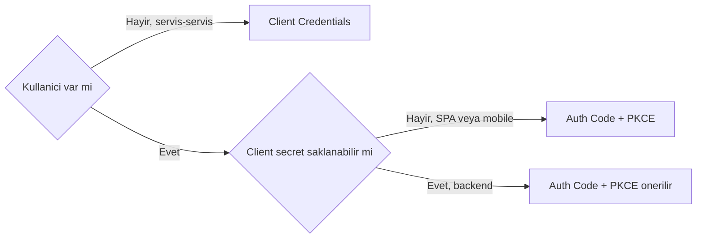
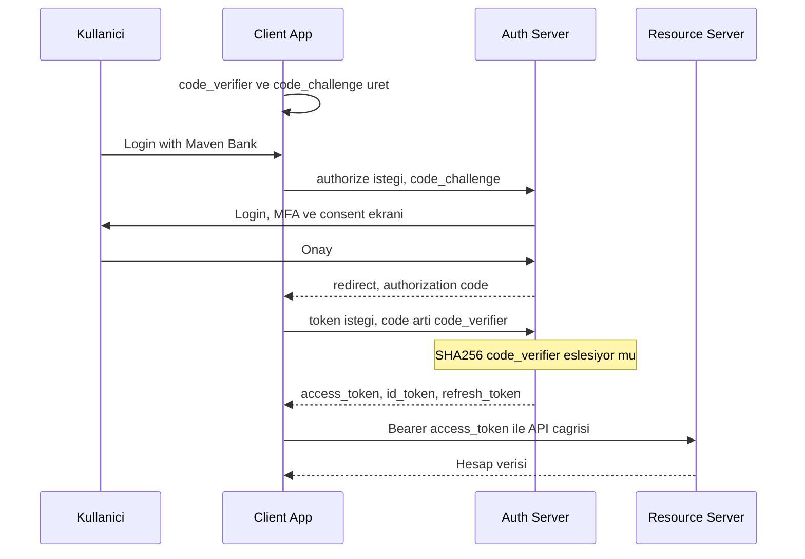
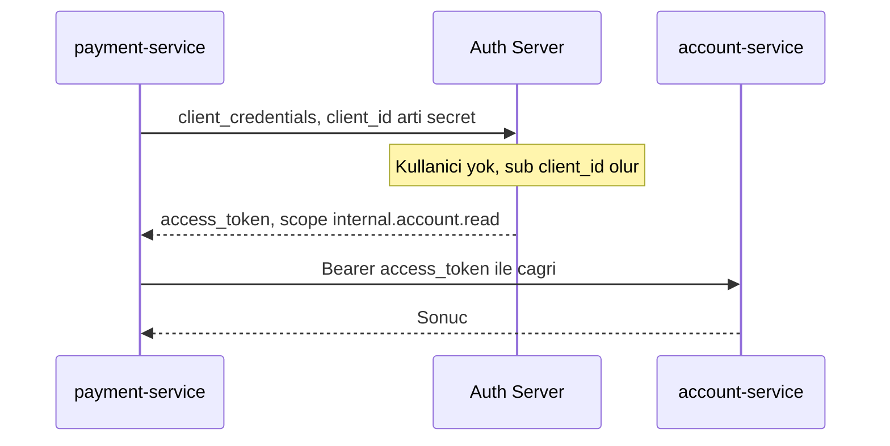
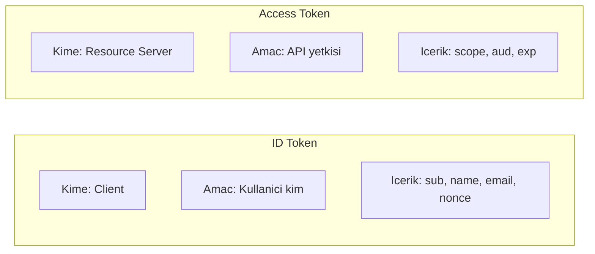

# Topic 8.4 — OAuth2 & OIDC: Authorization Framework

```admonish info title="Bu bölümde"
- OAuth 2.0 **authorization** ile OIDC **authentication** ayrımı ve dört rol (resource owner, client, resource server, auth server)
- 7 grant type — hangisini ne zaman: Authorization Code + PKCE, Client Credentials, ve neden Implicit/Password deprecated
- PKCE'nin code interception'a karşı nasıl çalıştığı ve OAuth 2.1'de neden zorunlu olduğu
- ID token vs access token farkı, OIDC scopes, discovery ve UserInfo endpoint
- Banking'e özgü katman: fine-grained scope tasarımı, FAPI, token introspection, RP-initiated logout ve 10 anti-pattern
```

## Hedef

OAuth 2.0 / OAuth 2.1 authorization framework ve OpenID Connect (OIDC) authentication layer'ı banking-grade derinlikte öğrenmek. Authorization Code + PKCE, Client Credentials, refresh flow, scopes; banking için Open Banking (BDDK 2020+) ve FAPI (Financial-grade API) standartları. Spring Authorization Server ile auth server, Spring Security OAuth2 Client ile third-party app tasarımını hatasız kurabilmek.

## Süre

Okuma: 2 saat • Kendini Sına: 45 dk • Pratik (opsiyonel): 2-3 saat • Toplam: ~3 saat (+ pratik)

## Önbilgi

- Topic 8.3 (JWT) bitti — imza, claim, doğrulama biliyorsun
- Topic 8.2 (Authentication) bitti
- HTTP redirect, query parameter, URL encoding temel seviyede oturmuş

---

## Kavramlar

### 1. OAuth 2.0 — ne olduğu, ne olmadığı

Kullanıcının parolasını üçüncü bir uygulamaya vermeden ona sınırlı yetki vermek istiyorsun; OAuth tam bu problemi çözer. **OAuth 2.0** bir *authorization framework*'tür: kullanıcı yerine başka bir uygulamanın **limited access** almasını sağlar.

Dikkat et — OAuth **authentication değildir**. "Kim olduğunu" kanıtlamak farklı bir iştir ve onun için üstüne **OIDC** katmanı eklenir. Bu ayrım bölümün bel kemiği; ID token vs access token konusuna gelince tekrar döneceğiz.

Somut banking senaryosu: Maven Bank müşterisi, "Hesap Yöneticisi" adlı bir third-party app'e (mint.com benzeri) hesabını okuma izni vermek istiyor.

```
Kullanıcı: Maven Bank müşterisi
Third-party app: "Hesap Yöneticisi"
İstek: "Maven Bank hesap verisi okuma" izni
```

Naive yaklaşım felakettir: üçüncü uygulamaya banka parolasını verirsen parola değişince app kırılır, app compromise olursa parola sızar, "hesap oku" demek istedin ama app "hesap aktar" da yapabilir.

OAuth'un çözümü parola yerine **access token**: sadece `account.read` scope'una sahip, 15 dakika ömürlü, istendiğinde revoke edilebilen ve **parolanın asla third-party'ye gitmediği** bir yetki belgesi.

### 2. OAuth 2.0 rolleri

Flow'ları anlamak için önce dört oyuncuyu tanı — her adımda bunlardan biri konuşur:

| Role | Banking karşılığı |
|---|---|
| **Resource Owner** | User (banking customer) |
| **Resource Server** | Banking API (`api.mavibank.com`) |
| **Client** | Third-party app (hesap yöneticisi) |
| **Authorization Server** | Banking auth (`auth.mavibank.com`) |

### 3. Grant types — hangisini ne zaman

**Grant type** = token'ın hangi akışla alındığı. Yanlış grant seçimi banking'de doğrudan güvenlik açığıdır, o yüzden önce haritayı gör:

| Grant Type | Banking Use Case | Status |
|---|---|---|
| **Authorization Code** | User flow (third-party web/mobile) | Standard |
| **Authorization Code + PKCE** | SPA, mobile, public client | OAuth 2.1 mandatory |
| **Client Credentials** | Service-to-service | Banking internal |
| **Refresh Token** | Token rotation | Standard |
| **Resource Owner Password** | User direct credentials | DEPRECATED |
| **Implicit** | SPA legacy | DEPRECATED (OAuth 2.1) |
| **Device Code** | TV, IoT, kiosk | Banking nadir |

Karar aslında iki soruya iner: kullanıcı var mı, client secret'ı güvenle saklayabiliyor mu?



Görüldüğü gibi modern cevap neredeyse her zaman **Authorization Code + PKCE** ya da **Client Credentials**. Deprecated grant'ları son bölümdeki anti-pattern'lerde deşeceğiz.

### 4. Authorization Code flow — adım adım

Kullanıcı akışının standardı bu; parolanın client'a hiç uğramadan token'a dönüşmesini sağlar. Akışın kalbi şu: kullanıcı auth server'da login olur, client sadece kısa ömürlü bir **authorization code** alır, sonra bunu **back-channel**'da (server-to-server) token'a çevirir.



Kritik ilk istek, kullanıcıyı auth server'a yönlendiren `authorize` çağrısıdır. `state` CSRF'e, `code_challenge` ise PKCE'ye hizmet eder:

```
GET https://auth.mavibank.com/oauth2/authorize
  ?response_type=code
  &client_id=hesap-yoneticisi
  &redirect_uri=https://hesapyoneticisi.com/callback
  &scope=account.read transactions.read
  &state=random_csrf_token
  &code_challenge=BASE64URL(SHA256(code_verifier))
  &code_challenge_method=S256
```

Kullanıcı login + MFA + consent'i geçince auth server, `redirect_uri`'ye tek kullanımlık, 30-60 sn TTL'li bir `code` ile geri döner. Client bu code'u back-channel'da token'a çevirir — burada `client_secret` ve `code_verifier` devreye girer:

```
POST https://auth.mavibank.com/oauth2/token
  Authorization: Basic base64(client_id:client_secret)
  Content-Type: application/x-www-form-urlencoded
  grant_type=authorization_code
  code=AUTH_CODE_xyz
  redirect_uri=https://hesapyoneticisi.com/callback
  code_verifier=ORIGINAL_VERIFIER
```

Cevapta banking için hepsi bir arada gelir — access, refresh ve (OIDC ise) id token:

```json
{
  "access_token": "eyJ...",
  "refresh_token": "eyJ...",
  "token_type": "Bearer",
  "expires_in": 900,
  "scope": "account.read transactions.read",
  "id_token": "eyJ..."
}
```

Artık client, `Authorization: Bearer eyJ...` header'ı ile `api.mavibank.com/v1/accounts`'a gidebilir. Parola hiçbir adımda third-party'ye uğramadı — OAuth'un tüm değeri bu.

### 5. PKCE — Proof Key for Code Exchange

Public client'ta (mobile/SPA) `client_secret` güvenle saklanamaz ve authorization code redirect sırasında **intercept** edilebilir; saldırgan code'u kapıp token'a çevirebilir. **PKCE** tam bu interception'ı öldürür.

Fikir basit ve zarif: client, flow başında rastgele bir sır üretir ve auth server'a sadece onun hash'ini gösterir, gerçek sırrı token isteğinde açıklar.

```
Step A (client başında):
  code_verifier = random 43-128 char
  code_challenge = BASE64URL(SHA256(code_verifier))

Step B (authorize request):
  Send: code_challenge

Step C (token request):
  Send: code_verifier

Auth server: SHA256(code_verifier) === code_challenge?
  Match  → token ver
  No match → reddet
```

Saldırgan authorization code'u çalsa bile `code_verifier` onda yoktur; hash tutmayacağı için token alamaz. İşte bu yüzden <mark>OAuth 2.1'de PKCE her authorization code flow için zorunludur</mark> — banking'de mobile ve SPA için istisnasız şart.

```admonish warning title="Public client'ta secret aramayı bırak"
Mobile/SPA public client'tır: binary reverse-engineer edilebilir, `client_secret` orada saklanamaz. Güvenliği secret değil, PKCE + exact redirect_uri sağlar. `code_challenge_method` daima `S256` olmalı; `plain` yöntemini kabul etme.
```

### 6. Client Credentials flow — service-to-service

Ortada kullanıcı yoksa — bir servis başka bir servisi çağırıyorsa — Authorization Code'un consent'i anlamsızdır. **Client Credentials** grant tam bu server-to-server senaryo içindir; client kendi kimliğiyle token alır.



İstek yalındır: kullanıcı yönlendirmesi yok, sadece client kimliği ve scope:

```
POST /oauth2/token
Authorization: Basic base64(client_id:client_secret)
Content-Type: application/x-www-form-urlencoded

grant_type=client_credentials
scope=internal.transfer.write
```

```json
{
  "access_token": "eyJ...",
  "expires_in": 300,
  "scope": "internal.transfer.write"
}
```

Kritik fark: token'daki `sub` bir user değil, **client_id**'dir. Banking'de `payment-service`'in `account-service`'i çağırması ya da internal scheduler'ın external API'ye gitmesi bu grant'la olur. Sıkı setup'larda banking bunu **mTLS** ile birleştirir (certificate-bound token) — token sadece client'ın sertifikasıyla gelen isteklerde geçerli olur.

### 7. OIDC — OpenID Connect

OAuth "bu client'a X scope verildi" der ama "kullanıcı kim, ne zaman authenticate oldu" sorusuna cevap vermez. **OIDC**, OAuth 2.0'ın üstüne oturan bir **identity layer**'dır ve bu boşluğu doldurur.

OIDC'nin taşıyıcısı **ID token**'dır — kullanıcının kimlik bilgisini tutan bir JWT. Access token API içindir, ID token ise client'ın "kullanıcım kim" bilgisi içindir:

```json
{
  "iss": "https://auth.mavibank.com",
  "sub": "user-123",
  "aud": "client-id",
  "exp": 1716003600,
  "iat": 1716000000,
  "auth_time": 1715999999,
  "nonce": "random",
  "name": "Ahmet Yılmaz",
  "email": "ahmet@example.com",
  "email_verified": true,
  "preferred_username": "ahmet_y"
}
```

Farkı bir kez daha netleştir: iki token, iki farklı hedef kitle. Access token resource server'a hitap eder ve yetki taşır; ID token client'a hitap eder ve kimlik taşır.



```admonish warning title="ID token'ı API'ye Bearer olarak gönderme"
ID token client'a "kullanıcı kim" demek içindir, resource server'a yetki kanıtı değildir. API çağrılarında daima **access token** kullan. ID token'ı resource server'a Bearer olarak yollamak yaygın ve tehlikeli bir karıştırmadır.
```

**OIDC scopes** ID token/UserInfo'ya hangi claim'lerin geleceğini belirler:

- `openid` — OIDC'yi enable eder (mandatory)
- `profile` — name, picture, vb.
- `email` — email + email_verified
- `phone` — phone_number
- `address` — addresses

Authorize isteği OAuth ile aynıdır, sadece `scope`'a `openid` ve bir `nonce` (replay koruması) eklenir:

```
GET /oauth2/authorize
  ?response_type=code
  &client_id=...
  &redirect_uri=...
  &scope=openid profile email account.read
  &state=...
  &nonce=...
  &code_challenge=...
  &code_challenge_method=S256
```

ID token'da olmayan ek claim'leri **UserInfo endpoint**'inden access token ile çekersin:

```
GET https://auth.mavibank.com/userinfo
Authorization: Bearer <access_token>

Response:
{ "sub": "user-123", "name": "Ahmet Yılmaz", "email": "ahmet@example.com", ... }
```

### 8. Discovery — `/.well-known/openid-configuration`

Her auth server'ın endpoint'lerini elle konfigüre etmek kırılgandır; OIDC bunu tek bir standart metadata endpoint'ine bağlar. Client bu URL'i okuyup tüm endpoint ve yetenekleri otomatik öğrenir:

```json
GET https://auth.mavibank.com/.well-known/openid-configuration

{
  "issuer": "https://auth.mavibank.com",
  "authorization_endpoint": "https://auth.mavibank.com/oauth2/authorize",
  "token_endpoint": "https://auth.mavibank.com/oauth2/token",
  "userinfo_endpoint": "https://auth.mavibank.com/userinfo",
  "jwks_uri": "https://auth.mavibank.com/.well-known/jwks.json",
  "revocation_endpoint": "https://auth.mavibank.com/oauth2/revoke",
  "introspection_endpoint": "https://auth.mavibank.com/oauth2/introspect",
  "end_session_endpoint": "https://auth.mavibank.com/logout",
  "response_types_supported": ["code", "id_token", "code id_token"],
  "id_token_signing_alg_values_supported": ["RS256", "ES256"],
  "scopes_supported": ["openid", "profile", "email", "account.read"],
  "grant_types_supported": ["authorization_code", "client_credentials", "refresh_token"],
  "code_challenge_methods_supported": ["S256"]
}
```

Spring'te tek bir `issuer-uri` config'i verdiğinde framework bu metadata'yı otomatik fetch eder — endpoint'leri elle yazmazsın.

### 9. Scopes — banking design

Banking'de "hesap oku" ile "para gönder" aynı kefeye konamaz; bu yüzden scope tasarımı **fine-grained** olmalı. Ne kadar dar scope, o kadar küçük patlama yarıçapı:

```
account.read              — Hesap bilgisi oku
account.balance.read      — Sadece balance
transactions.read         — Transaction history oku
transactions.read.recent  — Sadece son 30 gün
transfer.write            — Para transferi yap
transfer.write.eft        — Sadece EFT
card.read                 — Kart bilgisi
card.write                — Kart işlemi (blok/açma)
profile.read              — Kullanıcı profili
profile.write             — Profil güncelle (limited)
```

Pratik kurallar: her zaman **least privilege** (gereken en küçük scope) iste; `transfer.write` gibi hassas scope'lara ek MFA challenge koy; Open Banking (BDDK) için standart scope adlarına uy. Token ömrü de scope kadar önemli — <mark>access token TTL banking'de 5-15 dakikayı geçmemeli</mark>, uzun ömür çalınan token'ın zararını büyütür.

```admonish tip title="Consent = audit, banking compliance"
Kullanıcının onay verdiği scope listesini consent ekranında açıkça göster ve hangi scope'a onay verdiğini bir audit kaydına yaz. Regülatör "müşteri neye rıza gösterdi" diye sorduğunda kanıtın bu tablodur. Hassas scope'lar için (transfer.write) consent'e ek olarak step-up MFA iste.
```

### 10. Spring Authorization Server — banking auth server

Teoriyi koda dökelim. Spring, RFC-uyumlu bir auth server'ı tek starter ile verir:

```xml
<dependency>
    <groupId>org.springframework.boot</groupId>
    <artifactId>spring-boot-starter-oauth2-authorization-server</artifactId>
</dependency>
```

İki `SecurityFilterChain` gerekir. `@Order(1)` olan OAuth2/OIDC endpoint'lerini sarar; login gerektiğinde `/login`'e yönlendirir:

```java
@Bean
@Order(1)
public SecurityFilterChain authServerSecurityFilterChain(HttpSecurity http) throws Exception {
    OAuth2AuthorizationServerConfiguration.applyDefaultSecurity(http);
    http.getConfigurer(OAuth2AuthorizationServerConfigurer.class)
        .oidc(Customizer.withDefaults());
    http.exceptionHandling(e ->
        e.authenticationEntryPoint(new LoginUrlAuthenticationEntryPoint("/login")));
    return http.build();
}
```

`@Order(2)` olan ise normal form login ve `/.well-known/**` gibi public path'leri yönetir:

```java
@Bean
@Order(2)
public SecurityFilterChain defaultSecurityFilterChain(HttpSecurity http) throws Exception {
    http
        .authorizeHttpRequests(a -> a
            .requestMatchers("/login", "/error", "/.well-known/**").permitAll()
            .anyRequest().authenticated())
        .formLogin(Customizer.withDefaults());
    return http.build();
}
```

Asıl banking kararları `RegisteredClient`'ta yatar. `hesap-yoneticisi` bir user-facing client: Authorization Code + Refresh, PKCE zorunlu (`requireProofKey(true)`), consent zorunlu ve kısa token TTL:

```java
RegisteredClient hesapYoneticisi = RegisteredClient.withId(UUID.randomUUID().toString())
    .clientId("hesap-yoneticisi")
    .clientSecret("{bcrypt}$2a$10$...")
    .clientAuthenticationMethod(ClientAuthenticationMethod.CLIENT_SECRET_BASIC)
    .authorizationGrantType(AuthorizationGrantType.AUTHORIZATION_CODE)
    .authorizationGrantType(AuthorizationGrantType.REFRESH_TOKEN)
    .redirectUri("https://hesapyoneticisi.com/login/oauth2/code/mavibank")
    .scope(OidcScopes.OPENID).scope(OidcScopes.PROFILE)
    .scope("account.read").scope("transactions.read")
    .clientSettings(ClientSettings.builder()
        .requireAuthorizationConsent(true)
        .requireProofKey(true)                       // PKCE zorunlu
        .build())
    .tokenSettings(TokenSettings.builder()
        .accessTokenTimeToLive(Duration.ofMinutes(15))
        .refreshTokenTimeToLive(Duration.ofHours(1))
        .reuseRefreshTokens(false)                    // rotation
        .build())
    .build();
```

`payment-service` ise internal bir Client Credentials client'ı — user yok, sadece service scope ve 5 dakikalık token:

```java
RegisteredClient internalPayment = RegisteredClient.withId(UUID.randomUUID().toString())
    .clientId("payment-service")
    .clientSecret("{bcrypt}...")
    .clientAuthenticationMethod(ClientAuthenticationMethod.CLIENT_SECRET_BASIC)
    .authorizationGrantType(AuthorizationGrantType.CLIENT_CREDENTIALS)
    .scope("internal.account.read").scope("internal.transfer.write")
    .tokenSettings(TokenSettings.builder()
        .accessTokenTimeToLive(Duration.ofMinutes(5))
        .build())
    .build();
```

Son olarak imza anahtarı, issuer ve token'a banking claim'leri ekleyen customizer gerekir. `OAuth2TokenCustomizer` ile access token'a tenant, customer_id, MFA durumu gibi alanları enjekte edersin:

```java
@Bean
public OAuth2TokenCustomizer<JwtEncodingContext> jwtTokenCustomizer() {
    return context -> {
        if (context.getTokenType().getValue().equals(OAuth2TokenType.ACCESS_TOKEN.getValue())) {
            JwtClaimsSet.Builder claims = context.getClaims();
            if (context.getPrincipal().getPrincipal() instanceof User user) {
                claims.claim("tenant", user.getTenant());
                claims.claim("customer_id", user.getCustomerId());
                claims.claim("mfa_completed", user.isMfaCompleted());
            }
        }
    };
}
```

<details>
<summary>Tam kod: AuthServerConfig (~95 satır)</summary>

```java
@Configuration
@EnableWebSecurity
public class AuthServerConfig {

    @Bean
    @Order(1)
    public SecurityFilterChain authServerSecurityFilterChain(HttpSecurity http) throws Exception {
        OAuth2AuthorizationServerConfiguration.applyDefaultSecurity(http);
        http.getConfigurer(OAuth2AuthorizationServerConfigurer.class)
            .oidc(Customizer.withDefaults());
        http.exceptionHandling(e ->
            e.authenticationEntryPoint(new LoginUrlAuthenticationEntryPoint("/login")));
        return http.build();
    }

    @Bean
    @Order(2)
    public SecurityFilterChain defaultSecurityFilterChain(HttpSecurity http) throws Exception {
        http
            .authorizeHttpRequests(a -> a
                .requestMatchers("/login", "/error", "/.well-known/**").permitAll()
                .anyRequest().authenticated())
            .formLogin(Customizer.withDefaults());
        return http.build();
    }

    @Bean
    public RegisteredClientRepository registeredClientRepository() {
        RegisteredClient hesapYoneticisi = RegisteredClient.withId(UUID.randomUUID().toString())
            .clientId("hesap-yoneticisi")
            .clientSecret("{bcrypt}$2a$10$...")
            .clientAuthenticationMethod(ClientAuthenticationMethod.CLIENT_SECRET_BASIC)
            .authorizationGrantType(AuthorizationGrantType.AUTHORIZATION_CODE)
            .authorizationGrantType(AuthorizationGrantType.REFRESH_TOKEN)
            .redirectUri("https://hesapyoneticisi.com/login/oauth2/code/mavibank")
            .scope(OidcScopes.OPENID)
            .scope(OidcScopes.PROFILE)
            .scope("account.read")
            .scope("transactions.read")
            .clientSettings(ClientSettings.builder()
                .requireAuthorizationConsent(true)
                .requireProofKey(true)
                .build())
            .tokenSettings(TokenSettings.builder()
                .accessTokenTimeToLive(Duration.ofMinutes(15))
                .refreshTokenTimeToLive(Duration.ofHours(1))
                .reuseRefreshTokens(false)
                .build())
            .build();

        RegisteredClient internalPayment = RegisteredClient.withId(UUID.randomUUID().toString())
            .clientId("payment-service")
            .clientSecret("{bcrypt}...")
            .clientAuthenticationMethod(ClientAuthenticationMethod.CLIENT_SECRET_BASIC)
            .authorizationGrantType(AuthorizationGrantType.CLIENT_CREDENTIALS)
            .scope("internal.account.read")
            .scope("internal.transfer.write")
            .tokenSettings(TokenSettings.builder()
                .accessTokenTimeToLive(Duration.ofMinutes(5))
                .build())
            .build();

        return new InMemoryRegisteredClientRepository(hesapYoneticisi, internalPayment);
    }

    @Bean
    public JWKSource<SecurityContext> jwkSource() {
        RSAKey rsaKey = generateRsa();
        JWKSet jwkSet = new JWKSet(rsaKey);
        return new ImmutableJWKSet<>(jwkSet);
    }

    @Bean
    public AuthorizationServerSettings authorizationServerSettings() {
        return AuthorizationServerSettings.builder()
            .issuer("https://auth.mavibank.com")
            .build();
    }

    @Bean
    public OAuth2TokenCustomizer<JwtEncodingContext> jwtTokenCustomizer() {
        return context -> {
            if (context.getTokenType().getValue().equals(OAuth2TokenType.ACCESS_TOKEN.getValue())) {
                JwtClaimsSet.Builder claims = context.getClaims();
                Authentication principal = context.getPrincipal();

                if (principal.getPrincipal() instanceof User user) {
                    claims.claim("tenant", user.getTenant());
                    claims.claim("customer_id", user.getCustomerId());
                    claims.claim("mfa_completed", user.isMfaCompleted());
                }
            }
        };
    }
}
```

</details>

### 11. Spring Security OAuth2 Client — third-party app

Karşı taraf da lazım: banking auth ile login olan üçüncü taraf app. `issuer-uri` sayesinde tüm endpoint'ler discovery'den gelir; sen sadece client kaydını verirsin:

```yaml
spring:
  security:
    oauth2:
      client:
        registration:
          mavibank:
            client-id: hesap-yoneticisi
            client-secret: ${BANK_CLIENT_SECRET}
            authorization-grant-type: authorization_code
            redirect-uri: "{baseUrl}/login/oauth2/code/mavibank"
            scope: openid,profile,account.read,transactions.read
        provider:
          mavibank:
            issuer-uri: https://auth.mavibank.com
```

Security config'te `oauth2Login()` login akışını, `oidcUserService()` ise ID token'dan kullanıcı kurmayı sağlar:

```java
@Bean
public SecurityFilterChain filterChain(HttpSecurity http) throws Exception {
    http
        .authorizeHttpRequests(a -> a
            .requestMatchers("/", "/login").permitAll()
            .anyRequest().authenticated())
        .oauth2Login(o -> o
            .userInfoEndpoint(u -> u.oidcUserService(new OidcUserService())))
        .oauth2Client(Customizer.withDefaults());
    return http.build();
}
```

Login olduktan sonra resource server'ı çağırmak için `WebClient`'a OAuth2 filter takarsın — access token otomatik eklenir, yeniden alınır ve refresh edilir:

```java
@RestController
public class AccountController {

    private final WebClient webClient;

    public AccountController(OAuth2AuthorizedClientManager authorizedClientManager) {
        ServletOAuth2AuthorizedClientExchangeFilterFunction oauth2Filter =
            new ServletOAuth2AuthorizedClientExchangeFilterFunction(authorizedClientManager);
        oauth2Filter.setDefaultClientRegistrationId("mavibank");
        this.webClient = WebClient.builder()
            .filter(oauth2Filter)
            .baseUrl("https://api.mavibank.com")
            .build();
    }

    @GetMapping("/my-accounts")
    public Flux<Account> getAccounts(@RegisteredOAuth2AuthorizedClient("mavibank")
                                     OAuth2AuthorizedClient client) {
        return webClient.get().uri("/v1/accounts")
            .retrieve().bodyToFlux(Account.class);
    }
}
```

### 12. FAPI — Financial-grade API

Open Banking'de standart OAuth yetmez; para hareketleri için OpenID Foundation, **FAPI** adında sertleştirilmiş bir profil tanımlar. İki seviyesi vardır.

**FAPI Baseline** temel sertleştirme getirir: HTTPS zorunlu, Bearer token yalnızca Authorization header'da, audience validation strict.

**FAPI Advanced** ise banking'in üst segmenti için: mTLS client authentication, JWT-secured authorization request (**JAR** — imzalı istek), imzalı JWT response (**JARM**), PKCE zorunlu ve **certificate-bound access token**.

Certificate-bound token'ın mantığı Client Credentials'taki mTLS ile aynıdır — token bir sertifikaya çivilenir:

```
Token issued for Client A's certificate.
Resource server checks: does request come with Client A's mTLS cert?
  Match   → accept
  No match → reject (certificate-bound)
```

Türkiye'de BDDK Open Banking düzenlemeleri (2020 sonrası) bu profili giderek adopte ediyor.

### 13. Token introspection

JWT'yi resource server imzayla lokal doğrular; ama **opaque token** (JWT olmayan, anlamsız string) kendi başına doğrulanamaz. Bunun için auth server'a sorulur — **introspection**:

```
POST /oauth2/introspect
Authorization: Basic base64(client_id:client_secret)
Content-Type: application/x-www-form-urlencoded

token=opaque_token_xyz

Response:
{
  "active": true,
  "sub": "user-123",
  "scope": "account.read",
  "exp": 1716003600,
  "client_id": "hesap-yoneticisi",
  "username": "ahmet"
}
```

İkisi arasındaki takas nettir — lokal hız mı, anlık revocation mı:

| | JWT | Introspection |
|---|---|---|
| Validation | Local (signature) | Remote call |
| Revocation | Blocklist gerekli | Anlık |
| Latency | Sıfır | ~ms |
| Network | Independent | Auth server'a bağlı |
| Banking | Yaygın | Bazı durumlar |

Banking pratiği: çoğu zaman **JWT + blocklist**; anlık revocation ihtiyacı yüksek senaryolarda **introspection**.

### 14. Logout — OIDC RP-Initiated Logout

Token'ı silmek yetmez; SSO'da kullanıcı bir app'ten çıkınca tüm oturumların kapanması gerekir. OIDC bunu **RP-Initiated Logout** ile çözer — client (Relying Party) auth server'ı logout'a yönlendirir:

```
GET https://auth.mavibank.com/connect/logout
  ?id_token_hint=eyJ...
  &post_logout_redirect_uri=https://hesapyoneticisi.com/

Auth server:
  - Invalidate user session
  - Notify Relying Parties (back-channel logout)
  - Redirect to post_logout_redirect_uri
```

Asıl güç **back-channel logout**'ta: auth server, kullanıcının oturum açtığı tüm RP'lere bir logout token gönderip hepsini eşzamanlı düşürür:

```
POST https://hesapyoneticisi.com/logout/back-channel
Content-Type: application/x-www-form-urlencoded

logout_token=eyJ...
```

Banking için cluster-wide SSO logout, oturum ele geçirme riskini sınırladığı için önemlidir.

### 15. Banking — OAuth/OIDC anti-pattern'leri

"Bu tasarımda ne yanlış?" sorusunun cephaneliği burası. On klasik hatayı sırayla gör:

**1 — Resource Owner Password grant.** `grant_type=password` ile username/password doğrudan client'a gider; third-party parolayı öğrenir — OAuth'un tam karşı çıktığı şey. OAuth 2.1 deprecated.

**2 — Implicit grant.** `response_type=token` ile access token URL fragment'inde döner; browser history ve log'lara sızar. OAuth 2.1 deprecated — yerine Auth Code + PKCE.

**3 — PKCE'siz public client.** Mobile/SPA için PKCE olmadan code interception açık kalır.

**4 — `state` parametresi yok.** CSRF açığı. `state` random üretilmeli ve session ile verify edilmeli.

**5 — Wildcard redirect_uri.** `redirect_uri=https://*.example.com/cb` gibi bir kayıt, subdomain takeover ile token theft'e kapı açar. <mark>redirect_uri her zaman exact match olmalı, wildcard asla kabul edilmemeli</mark>.

**6 — Client secret'ı mobile app'te tutmak.** Reverse-engineer edilir; public client için secret değil, PKCE.

**7 — Uzun access token TTL.** Banking'de 5-15 dk max; ötesi çalınan token'ın penceresini büyütür.

**8 — Refresh token rotation yok.** `reuseRefreshTokens(false)` ile rotasyon (Topic 8.3).

**9 — Scope too broad.** Her şeyi kapsayan `account.write` yerine `transfer.write`, `card.write` gibi fine-grained scope'lar.

**10 — Audience check yok.** Resource server her istekte `aud` claim'ini doğrulamalı; <mark>aud doğrulaması olmayan bir resource server, başka bir client için üretilmiş token'ı kabul eder</mark>.

---

## Önemli olabilecek araştırma kaynakları

- RFC 6749 — OAuth 2.0
- RFC 7636 — PKCE
- RFC 8252 — OAuth for Native Apps
- OAuth 2.1 draft
- OpenID Connect Core 1.0
- FAPI specification (OpenID Foundation)
- BDDK Open Banking düzenlemeleri
- Spring Authorization Server docs

---

## Kendini Sına

Aşağıdaki soruları önce **cevaba bakmadan** kendi cümlelerinle yanıtlamayı dene — hepsi TR bank mülakatlarında karşına çıkabilecek tarzda. Takıldığın soruda ilgili Kavramlar başlığına dön, sonra tekrar dene.

**S1. OAuth 2.0 authorization ile OIDC authentication arasındaki fark nedir? Neden ikisi ayrı katman?**

<details>
<summary>Cevabı göster</summary>

OAuth 2.0 bir authorization framework'tür: "bu client'a şu scope'lar verildi, şu kaynaklara erişebilir" der ama kullanıcının kim olduğunu söylemez. OIDC ise OAuth'un üstüne oturan bir identity layer'dır ve "kullanıcı kim, ne zaman authenticate oldu" sorusuna cevap verir.

Taşıyıcıları da farklıdır: OAuth access token yetki taşır ve resource server'a hitap eder; OIDC ID token (JWT) kimlik taşır ve client'a hitap eder. Ayrı olmalarının sebebi ilgilerinin ayrı olması — bir servis-servis çağrısında kimliğe gerek yok, sadece OAuth yeterli; bir "banka ile login" akışında ise client'ın kullanıcıyı tanıması gerekir, orada OIDC devreye girer.

</details>

**S2. Authorization Code flow, Implicit grant'tan neden daha güvenli?**

<details>
<summary>Cevabı göster</summary>

Implicit grant'ta access token doğrudan URL fragment'inde (`response_type=token`) döner. Bu token browser history'sine, proxy log'larına, Referer header'larına sızabilir ve ömrü boyunca kullanılabilir. Authorization Code'da ise redirect'te dönen sadece kısa ömürlü (30-60 sn), tek kullanımlık bir `code`'dur — token değil.

Code, tokene ancak back-channel'da (server-to-server POST) çevrilir; access token hiç browser URL'ine girmez. PKCE eklendiğinde code çalınsa bile işe yaramaz. Bu yüzden OAuth 2.1 Implicit'i deprecate etti ve her yerde Auth Code + PKCE'yi standart yaptı.

</details>

**S3. PKCE neden zorunlu? Saldırgan authorization code'u intercept ederse ne olur?**

<details>
<summary>Cevabı göster</summary>

Public client'ta (mobile/SPA) client_secret güvenle saklanamaz, dolayısıyla code'u ele geçiren biri onu tokene çevirebilir. PKCE bunu engeller: client flow başında rastgele bir code_verifier üretir ve auth server'a sadece SHA256 hash'ini (code_challenge) gösterir; gerçek verifier'ı token isteğinde açıklar.

Saldırgan authorization code'u intercept etse bile code_verifier onda yoktur. Auth server `SHA256(code_verifier) == code_challenge` kontrolünü yapar, hash tutmayınca isteği reddeder — token verilmez. Bu koruma o kadar temel ki OAuth 2.1 PKCE'yi her authorization code flow için zorunlu kıldı; banking'de mobile ve SPA için istisnasız gereklidir. Method daima S256 olmalı, plain kabul edilmemeli.

</details>

**S4. ID token ile access token arasındaki fark nedir? ID token'ı resource server'a Bearer olarak göndermek neden yanlış?**

<details>
<summary>Cevabı göster</summary>

İki token, iki farklı hedef kitle. Access token resource server içindir ve yetki taşır — scope, aud, exp gibi claim'lerle "bu istek şuna erişebilir" der. ID token ise client içindir ve kimlik taşır — sub, name, email, nonce gibi claim'lerle "kullanıcın kim, ne zaman authenticate oldu" der.

ID token'ı API'ye Bearer olarak göndermek yanlıştır çünkü ID token bir yetki kanıtı değildir; audience'ı client'tır, resource server değil. Doğru desen: API çağrılarında daima access token, kullanıcı bilgisini göstermek için ID token. İkisini karıştırmak yaygın ve tehlikeli bir hatadır.

</details>

**S5. Client Credentials grant ne zaman kullanılır? Token'daki `sub` claim'i ne olur?**

<details>
<summary>Cevabı göster</summary>

Client Credentials, ortada kullanıcı olmayan server-to-server senaryolar içindir — bir servis kendi kimliğiyle başka bir servisi çağırır. Banking örneği: payment-service'in account-service'i çağırması ya da internal scheduler'ın external API'ye gitmesi. Redirect, consent, kullanıcı login'i yoktur; sadece client_id + client_secret ile token alınır.

Token'daki sub bir user değil, client_id'dir — çünkü işlemi bir kullanıcı değil, servisin kendisi yapıyor. Sıkı setup'larda bu grant mTLS ile birleştirilir (certificate-bound token): token yalnızca client'ın sertifikasıyla gelen isteklerde geçerli olur, çalınsa bile başka yerde kullanılamaz.

</details>

**S6. Wildcard redirect_uri neden tehlikeli? Auth server redirect_uri'yi nasıl doğrulamalı?**

<details>
<summary>Cevabı göster</summary>

`redirect_uri=https://*.example.com/cb` gibi bir wildcard kayıt, saldırganın kontrol ettiği bir subdomain'e (örneğin subdomain takeover ile ele geçirilmiş `evil.example.com`) authorization code'un yönlendirilmesine izin verebilir. Code oraya düşünce saldırgan onu tokene çevirir — token theft.

Doğru yaklaşım exact match: auth server, kayıtlı redirect_uri ile gelen değeri karakter karakter karşılaştırmalı, hiçbir wildcard veya prefix eşleşmesine izin vermemeli. Banking'de bu kural pazarlık konusu değildir; her registered client için tam URI'lar açıkça listelenir.

</details>

**S7. JWT ile token introspection arasındaki fark nedir? Banking'de hangisini ne zaman seçersin?**

<details>
<summary>Cevabı göster</summary>

JWT self-contained'dır: resource server imzayı lokal olarak (JWKS'teki public key ile) doğrular, auth server'a hiç gitmez — latency sıfır, network bağımsız. Bedeli ise revocation zorluğu: token geçerlilik süresi boyunca "geri alınamaz", ancak blocklist gibi ek bir mekanizma ile iptal edilebilir.

Introspection'da ise resource server her token için auth server'a `/introspect` çağrısı yapar. Avantajı anlık revocation (auth server "active: false" derse token o an ölür); dezavantajı her istekte remote call ve auth server'a bağımlılık. Banking pratiği: çoğu zaman JWT + blocklist yeterli; anlık revocation ihtiyacı yüksek, hassas senaryolarda (opaque token) introspection tercih edilir.

</details>

**S8. FAPI Advanced neyi ekler? Certificate-bound access token nasıl çalışır?**

<details>
<summary>Cevabı göster</summary>

FAPI Advanced, Open Banking'in üst güvenlik profilidir ve standart OAuth'un üstüne şunları ekler: mTLS client authentication, JWT-secured authorization request (JAR — imzalı istek), imzalı JWT response (JARM), zorunlu PKCE ve certificate-bound access token.

Certificate-bound token, token'ı client'ın mTLS sertifikasına çivilemektir: auth server token'ı Client A'nın sertifikası için üretir; resource server her istekte "bu istek Client A'nın mTLS sertifikasıyla mı geldi?" diye kontrol eder. Eşleşmezse token reddedilir. Böylece token çalınsa bile saldırganın sertifikası olmadığı için işe yaramaz. Türkiye'de BDDK Open Banking düzenlemeleri 2020 sonrası bu profili adopte etmektedir.

</details>

---

## Tamamlama kriterleri

- [ ] OAuth authorization vs OIDC authentication ayrımını ve dört rolü 2 dakikada anlatabiliyorum
- [ ] 7 grant type'tan hangisini ne zaman seçeceğimi (Auth Code + PKCE, Client Credentials) söyleyebiliyorum
- [ ] Authorization Code + PKCE flow'unun 7 adımını ve neden Implicit'ten güvenli olduğunu çizebiliyorum
- [ ] PKCE'nin code interception'ı nasıl engellediğini ve OAuth 2.1'de neden zorunlu olduğunu açıklayabiliyorum
- [ ] ID token vs access token farkını ve hangisinin API'ye gideceğini biliyorum
- [ ] OIDC scopes, discovery endpoint ve UserInfo'nun rolünü açıklayabiliyorum
- [ ] Banking fine-grained scope tasarımı + least privilege + sensitive scope MFA mantığını anlatabiliyorum
- [ ] Spring Authorization Server (RegisteredClient, PKCE, token TTL) ve OAuth2 Client konfigürasyonunu tarif edebiliyorum
- [ ] FAPI, token introspection ve RP-initiated logout'un banking'deki yerini biliyorum
- [ ] 10 anti-pattern'i (Implicit, Password grant, wildcard redirect_uri, uzun TTL, aud check yok) sayabiliyorum
- [ ] (Opsiyonel) "Pratik yapmak istersen" bölümündeki testleri yazdım ve Claude-verify prompt'uyla doğrulattım

---

## Defter notları

1. "OAuth authorization vs OIDC authentication ayrımı: ____."
2. "Authorization Code + PKCE flow 7 adım: ____."
3. "Client Credentials banking internal service-to-service, sub = ____."
4. "PKCE code_verifier + code_challenge anti-intercept mantığı: ____."
5. "ID token vs Access token: hedef kitle ve içerik farkı ____."
6. "Refresh token rotation `reuseRefreshTokens(false)`: ____."
7. "Discovery endpoint `/.well-known/openid-configuration` içeriği: ____."
8. "FAPI Advanced + mTLS + JAR + certificate-bound token (BDDK): ____."
9. "OAuth 2.1 deprecated grant'ler (Implicit, Password) sebebi: ____."
10. "Banking fine-grained scope tasarımı + wildcard redirect_uri neden yasak: ____."

```admonish success title="Bölüm Özeti"
- OAuth 2.0 **authorization** (client'a scope verir), OIDC ise üstüne oturan **authentication** katmanıdır (ID token ile kullanıcı kimliği); access token API'ye, ID token client'a gider
- Modern grant seçimi iki soruya iner — kullanıcı var mı, secret saklanabilir mi: cevap neredeyse her zaman **Authorization Code + PKCE** ya da **Client Credentials**
- **PKCE** code interception'ı öldürür (verifier'ın hash'i önce, kendisi sonra gösterilir) ve OAuth 2.1'de her authorization code flow için zorunludur
- Banking sertleştirmesi: fine-grained least-privilege scope, 5-15 dk access token TTL, refresh rotation, exact-match redirect_uri, resource server'da `aud` doğrulaması
- FAPI Advanced (mTLS, JAR/JARM, certificate-bound token), token introspection ve RP-initiated back-channel logout, Open Banking/BDDK dünyasının banking-grade ekstralarıdır
- Deprecated grant'lar (Implicit, Resource Owner Password) ve wildcard redirect_uri, mülakatta "bu tasarımda ne yanlış" cephaneliğinin klasikleridir
```

---

## Pratik yapmak istersen

Kavramları koda dökmek istersen aşağıdaki iki ek hazır: test yazma rehberi Authorization Code + PKCE, Client Credentials ve scope reddi için end-to-end testler içerir; Claude-verify prompt'u ile yazdığın OAuth2/OIDC implementasyonunu banking-grade perspektiften denetletebilirsin.

<details>
<summary>Test yazma rehberi</summary>

Aşağıdaki testler bir Spring Authorization Server'ı gerçek bir port üzerinde ayağa kaldırıp flow'ları uçtan uca doğrular. Amaç sadece "çalışıyor mu" değil, "PKCE'siz istek reddediliyor mu, scope kısıtı işliyor mu" gibi güvenlik davranışlarını kanıtlamak.

```java
@SpringBootTest(webEnvironment = RANDOM_PORT)
class OAuth2FlowTest {

    @LocalServerPort int port;

    @Test
    void authorizationCodeFlowWithPkce() throws Exception {
        String codeVerifier = generateCodeVerifier();
        String codeChallenge = sha256Base64Url(codeVerifier);

        String authUrl = "http://localhost:" + port + "/oauth2/authorize"
            + "?response_type=code"
            + "&client_id=hesap-yoneticisi"
            + "&redirect_uri=" + URLEncoder.encode("https://app.example.com/cb", UTF_8)
            + "&scope=openid+account.read"
            + "&state=test_state"
            + "&code_challenge=" + codeChallenge
            + "&code_challenge_method=S256";

        String authCode = simulateAuthorizationFlow(authUrl);

        ResponseEntity<Map> response = restTemplate.withBasicAuth("hesap-yoneticisi", "secret")
            .postForEntity("/oauth2/token",
                Map.of(
                    "grant_type", "authorization_code",
                    "code", authCode,
                    "redirect_uri", "https://app.example.com/cb",
                    "code_verifier", codeVerifier
                ), Map.class);

        assertThat(response.getStatusCode()).isEqualTo(HttpStatus.OK);
        Map body = response.getBody();
        assertThat(body).containsKeys("access_token", "id_token", "refresh_token");

        DecodedJWT access = JWT.decode((String) body.get("access_token"));
        assertThat(access.getAudience()).contains("hesap-yoneticisi");
        assertThat(access.getClaim("scope").asString()).contains("account.read");
    }

    @Test
    void shouldRejectAuthCodeWithoutPkceVerifier() {
        ResponseEntity<Map> response = restTemplate.withBasicAuth("hesap-yoneticisi", "secret")
            .postForEntity("/oauth2/token",
                Map.of(
                    "grant_type", "authorization_code",
                    "code", "valid_code",
                    "redirect_uri", "https://app.example.com/cb"
                ), Map.class);

        assertThat(response.getStatusCode()).isEqualTo(HttpStatus.BAD_REQUEST);
    }

    @Test
    void clientCredentialsFlow() {
        ResponseEntity<Map> response = restTemplate.withBasicAuth("payment-service", "secret")
            .postForEntity("/oauth2/token",
                Map.of("grant_type", "client_credentials",
                       "scope", "internal.transfer.write"), Map.class);

        assertThat(response.getStatusCode()).isEqualTo(HttpStatus.OK);
        DecodedJWT token = JWT.decode((String) response.getBody().get("access_token"));
        assertThat(token.getSubject()).isEqualTo("payment-service");
    }

    @Test
    void shouldRejectScopeNotInRegisteredClient() {
        String authUrl = "/oauth2/authorize"
            + "?response_type=code"
            + "&client_id=hesap-yoneticisi"
            + "&scope=transfer.write"
            + "...";

        ResponseEntity<String> response = restTemplate.getForEntity(authUrl, String.class);
        assertThat(response.getStatusCode()).isEqualTo(HttpStatus.BAD_REQUEST);
    }
}
```

> Not: `authorizationCodeFlowWithPkce` gerçek bir consent adımı gerektirir; testte bunu `simulateAuthorizationFlow` ile (session cookie + login form POST + consent POST) taklit edersin. `shouldRejectAuthCodeWithoutPkceVerifier`, `requireProofKey(true)` ayarının gerçekten devrede olduğunu kanıtlar. `shouldRejectScopeNotInRegisteredClient` ise registered client'a tanımlı olmayan scope'un reddedildiğini gösterir — least privilege'ın runtime karşılığı.

</details>

<details>
<summary>Claude-verify prompt</summary>

```
OAuth2 + OIDC implementation'ımı banking-grade kriterlere göre değerlendir.
Her madde için PASS / FAIL / EKSIK işaretle, kanıt göster, kod yazma:

1. Authorization Server:
   - Spring Authorization Server kullanıyor mu?
   - /.well-known/openid-configuration reachable?
   - JWKS endpoint key rotation destekli?

2. Grant types:
   - Authorization Code + PKCE (mandatory)?
   - Client Credentials (service-to-service)?
   - Refresh Token rotation?
   - Implicit / Resource Owner Password DEPRECATED yok?

3. PKCE:
   - requireProofKey(true) registered client'ta?
   - S256 challenge method?
   - Mobile/SPA için mandatory?

4. Scopes:
   - Fine-grained banking scope'lar (account.read, transfer.write)?
   - Least privilege?
   - Consent screen scope listele?

5. Token TTL:
   - Access 5-15 dakika?
   - Refresh 1-24 saat?
   - reuseRefreshTokens(false) — rotation?

6. OIDC:
   - openid scope ID token trigger?
   - ID token claim'leri (sub, aud, exp, iat, nonce)?
   - UserInfo endpoint çalışıyor mu?

7. Client config:
   - Public client (mobile) → client_secret YOK + PKCE şart?
   - Confidential client → client_secret + (optional) mTLS?
   - Exact redirect_uri match (wildcard YOK)?

8. State + nonce:
   - state parameter CSRF prevention?
   - nonce replay prevention?

9. FAPI alignment:
   - HTTPS mandatory?
   - Audience strict validation?
   - mTLS (banking üst seviye)?

10. Anti-pattern:
    - Implicit / Password grant YOK?
    - Wildcard redirect_uri YOK?
    - Long access TTL YOK?
    - PKCE'siz public client YOK?
    - state'siz authorize YOK?
```

</details>
