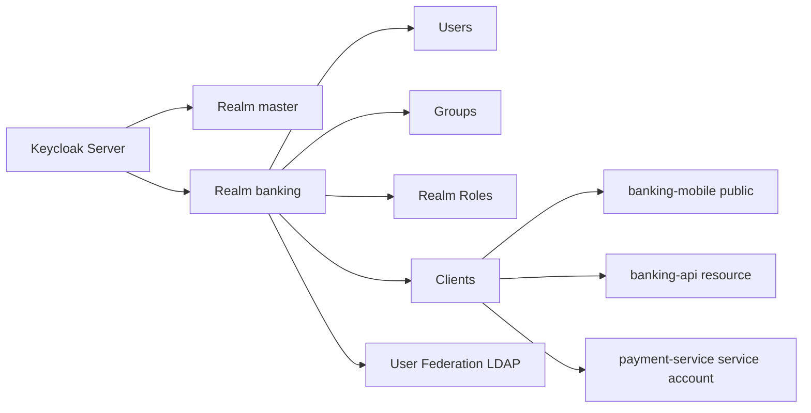
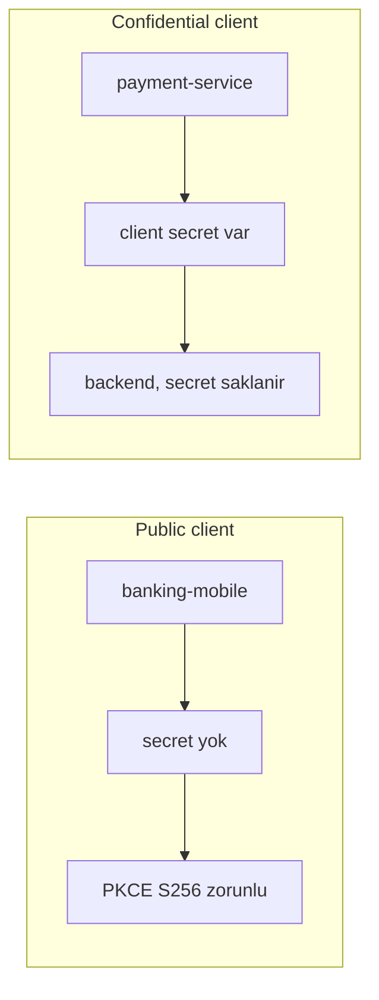
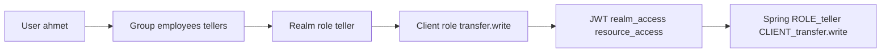
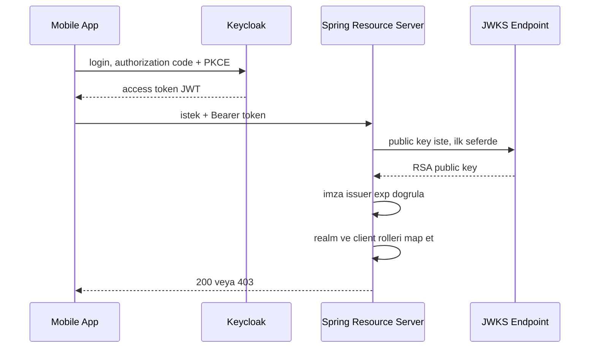

# Topic 8.5 — Keycloak: Production-grade IdP for Banking

```admonish info title="Bu bölümde"
- Keycloak hiyerarşisi: realm > client > role > user > group — banking için nasıl modellenir
- Public vs confidential client ayrımı ve mobile/SPA için PKCE S256 zorunluluğu
- Spring resource server bir Keycloak JWT'sini nasıl doğrular: issuer-uri, JWKS, realm/client role mapping
- User attribute → token mapper → custom claim (tenant, branch) akışı, uçtan uca
- Banking anti-pattern'leri: direct access grants, implicit flow, wildcard redirect, master realm'de customer
```

## Hedef

Keycloak'u banking-grade identity provider olarak kurmak, konfigüre etmek ve Spring Boot ile entegre etmek. Realm/client/role/group hiyerarşisini kurmak, federation (LDAP/AD), MFA, custom claim ve audit'i banking senaryolarına oturtmak. En kritik hedef: bir Spring resource server'ın Keycloak token'ını nasıl doğruladığını ve realm/client rollerini nasıl authority'ye çevirdiğini hatasız anlatabilmek.

## Süre

Okuma: 2 saat • Kendini Sına: 45 dk • Pratik (opsiyonel): 4 saat • Toplam: ~3 saat (+ pratik)

## Önbilgi

- Topic 8.4 (OAuth2/OIDC) bitti — authorization code flow, PKCE, JWT yapısı biliyorsun
- Docker rahat, temel Kubernetes kavramları var
- LDAP/AD temel bilgisi (federation bölümü için)

---

## Kavramlar

### 1. Keycloak — niye?

Kendi auth server'ını sıfırdan yazmak yerine hazır, savaş görmüş bir IdP kullanmanın gerekçesini netleştirelim. **Keycloak** açık kaynak bir identity provider'dır ve OAuth 2.0, OIDC, SAML 2.0'ı tek üründe verir.

**Build vs buy** takası nettir. Spring Authorization Server ile kurarsan tüm login UI, admin paneli, audit, federation'ı **kendin** yazarsın. Keycloak ise realm, user, role, MFA, social login, federation ve theme'leri **out-of-box** getirir — banking'in aylarca süren işini haftalara indirir.

Banking pratiğinde büyük bankalar sıklıkla **ForgeRock**, **Okta** veya **Ping Identity** kullanır; bazıları legacy kendi yapımlarını taşır. Mid-size bankalarda ise on-prem deployment ve açık kaynak avantajı sayesinde **Keycloak** yaygındır.

Keycloak'ın banking için kritik özellikleri: LDAP/AD federation, MFA (TOTP, WebAuthn), multi-realm (multi-tenant), cluster mode (HA, Infinispan replication), audit events, admin REST API ve customize edilebilir login theme'leri.

### 2. Keycloak hiyerarşisi

Keycloak'ın tüm konfigürasyonu bir ağaç yapısıdır; bu ağacı zihninde oturtmadan hiçbir ayar yerine oturmaz. En üstte **realm** vardır: izole bir tenant, kendi user/client/role havuzuyla. Banking için tek `banking` realm'i yeterlidir (retail vs corporate ayrımı istenirse ayrı realm'e bölünebilir).

Aşağıdaki diyagram banking realm'inin içini gösterir — user, group, role ve client'lar aynı realm altında yaşar:



Kilit kavramlar: **realm** izole tenant; **client** realm'e bağlanan uygulama (mobile app, API, service); **role** yetki etiketi; **group** kullanıcı organizasyonu; **user federation** dış dizini (LDAP/AD) Keycloak'a bağlar.

<mark>Master realm sadece Keycloak yönetimi içindir; banking customer'larını asla master realm'e koyma</mark>. Customer ve employee'ler her zaman ayrı `banking` realm'ine gider.

### 3. Local + production kurulum

Development için tek komutla ayağa kalkar; `start-dev` modu in-memory H2 kullanır ve HTTPS zorlamaz:

```bash
docker run -d --name keycloak \
  -p 8080:8080 \
  -e KEYCLOAK_ADMIN=admin \
  -e KEYCLOAK_ADMIN_PASSWORD=admin \
  quay.io/keycloak/keycloak:24.0 \
  start-dev
```

Production tamamen farklıdır: PostgreSQL backend, gerçek hostname ve TLS sertifikası şart. `start --optimized` build-time konfigürasyonu precompile eder:

```bash
docker run -d --name keycloak \
  -p 8443:8443 \
  -e KC_DB=postgres \
  -e KC_DB_URL=jdbc:postgresql://db:5432/keycloak \
  -e KC_DB_USERNAME=keycloak \
  -e KC_DB_PASSWORD=secret \
  -e KC_HOSTNAME=auth.mavibank.com \
  -e KC_HTTPS_CERTIFICATE_FILE=/etc/x509/https/tls.crt \
  -e KC_HTTPS_CERTIFICATE_KEY_FILE=/etc/x509/https/tls.key \
  quay.io/keycloak/keycloak:24.0 \
  start --optimized
```

Admin console: `https://auth.mavibank.com/admin/`.

### 4. Realm ayarları — banking

Realm oluşturmak Admin UI → "Add realm" → "banking" kadar basit; asıl iş banking-grade defaults'ları set etmektir. Kritik ayarları grupla düşün.

**Login ve email:** User registration ON (self-service için), email as username ON, SMTP config (email verification için). **Themes:** Login theme = "banking" (branding + KVKK consent).

**Token TTL'leri** banking için kısa tutulur — çalınan bir token'ın ömrü ne kadar kısaysa hasar o kadar sınırlıdır:

```admonish tip title="Banking token TTL değerleri"
Access token lifespan: 15 min • Refresh token lifespan: 60 min • SSO session idle: 30 min • SSO session max: 8 hours. Access token kısa (15 dk), refresh ile yenilenir; SSO session max ile bir oturum en fazla 8 saat yaşar.
```

**Security defenses:** Brute force detection ON, max login failures 5, wait time 15 min. Permanent lockout OFF — banking'de kilitlenen hesap manuel review ister, otomatik kalıcı kilit müşteri deneyimini bozar. **General:** SSL required = external requests (production).

### 5. Client'lar — public, resource server, confidential

Client, realm'e bağlanan her uygulamadır ve tipini doğru seçmek güvenliğin temelidir. İki ana tip vardır: **public client** (secret saklayamayan mobile/SPA) ve **confidential client** (secret saklayabilen backend).

<mark>Public client'ta client secret yoktur; bu yüzden mobile ve SPA için PKCE S256 authorization code interception'a karşı zorunludur</mark>. Confidential client ise secret ile kimliğini kanıtlar.



**banking-mobile (public, PKCE):** Mobile app için standard flow açık, geri kalan her şey kapalı. Direct access grants ve implicit flow banking'de kesinlikle KAPALI; redirect URI'lar exact match:

```
Client ID: banking-mobile
Client authentication: OFF        (public client)
Standard flow: ON
Direct access grants: OFF         (banking: KAPALI)
Implicit flow: OFF                (KAPALI)
Valid redirect URIs:
  com.mavibank.app://callback
  https://app.mavibank.com/callback
Advanced → Proof Key for Code Exchange: S256
Access Token Lifespan: 15 min
```

**banking-api (resource server):** Token doğrulayan API. Client authentication ON, Authorization ON (fine-grained yetkilendirme için). Standard flow ve direct access grants kapalı — bu client login yapmaz, sadece token doğrular:

```
Client ID: banking-api
Client authentication: ON
Authorization: ON                 (fine-grained)
Standard flow: OFF
Service accounts roles: ON        (optional, client_credentials için)
```

Resource server JWT validation `issuer-uri` ile otomatik yapılır — bunu Bölüm 10'da Spring tarafında bağlayacağız.

**payment-service (confidential, client credentials):** Servisten servise çağrı için, kullanıcı yok. Service account rolleri ile hangi API scope'larına erişebileceği belirlenir:

```
Client ID: payment-service
Client authentication: ON
Service account roles: ON         (client_credentials için)
Credentials → Secret: <copy>
Service Account Roles → Assign:
  - banking-api: internal.account.read
  - banking-api: internal.transfer.write
```

### 6. Roller ve gruplar — realm vs client vs composite

Rol, bir kullanıcının ne yapabileceğini söyleyen etikettir; Keycloak iki seviye rol verir ve ayrımı bilmek yetkilendirme tasarımının kalbidir.

**Realm role** cross-client'tır: `customer`, `teller`, `admin` — realm genelinde anlamlıdır. **Client role** client'a özeldir: `banking-api: account.read`, `banking-api: transfer.write` — sadece o API bağlamında. **Composite role** başka rolleri içine alır; büyük yetki setlerini tek isimle paketler.

Banking'de realm role + client role kombine kullanılır. `customer` realm rolü, `banking-api`'nin okuma client rollerini toplar; `teller` ise `customer` + yazma rollerinin composite'idir:

```
Realm role "customer":
  - banking-api: account.read
  - banking-api: transactions.read
  - banking-api: profile.read

Realm role "teller":  (composite)
  - customer
  - banking-api: card.write
  - banking-api: transfer.write
```

**Group**, kullanıcıları organize eder ve rolü toptan atamayı sağlar. Bir gruba rol assign edersen, her üyeye otomatik geçer — yeni teller'ı `employees/tellers` grubuna koyarsın, `teller` rolünü otomatik alır:

```
Groups:
├── customers
│   ├── retail
│   └── corporate
└── employees
    ├── tellers
    ├── managers
    └── admins
```

Aşağıdaki zincir, user'dan JWT'ye kadar yetkinin nasıl aktığını gösterir — grup üyeliği role, role JWT claim'lerine, onlar da Spring authority'lerine dönüşür:



### 7. User attributes + token mapper — custom claims

Banking, standart OIDC claim'lerinin ötesinde veri taşımak ister: hangi tenant, hangi şube, hangi customer_id. Bunun mekanizması **user attribute** + **token mapper** ikilisidir.

Önce user'a custom attribute eklenir — bunlar Keycloak'ta serbest key-value çiftleridir:

```
User: ahmet.yilmaz@mavibank.com
Attributes:
  tenant: TR
  branch: istanbul-1
  customer_id: cust-456
  kvkk_consent: 2024-01-15
```

Attribute tek başına JWT'ye girmez; onu claim'e çeviren şey **token mapper**'dır. Client scope üzerinde bir "User Attribute" mapper tanımlarsın:

```
Name: tenant-mapper
Mapper Type: User Attribute
User Attribute: tenant
Token Claim Name: tenant
Claim JSON Type: String
Add to access token: ON
Add to ID token: ON
```

Sonuç: access token'ın payload'ında custom claim belirir ve resource server bunu okuyabilir. İşte banking'in ihtiyaç duyduğu tenant/branch bağlamı:

```json
{
  "sub": "user-123",
  "tenant": "TR",
  "branch": "istanbul-1",
  "realm_access": { "roles": ["customer"] }
}
```

### 8. Authentication flows — banking MFA

Login'in nasıl yürüdüğü Keycloak'ta bir **authentication flow** ile tanımlanır: adım adım, koşullu bir zincir. Default browser flow cookie → identity provider → forms (username/password + conditional OTP) sırasını izler.

Banking daha fazlasını ister: risk bazlı MFA. Default flow'u kopyalayıp "Banking-MFA-Browser" oluşturur, araya risk assessment ve conditional WebAuthn eklersin:

```
Banking-MFA-Browser
├── Cookie [ALTERNATIVE]
└── Forms [ALTERNATIVE]
    ├── Username Password Form [REQUIRED]
    ├── Banking Risk Assessment [REQUIRED]     ← custom SPI
    ├── Conditional OTP [REQUIRED]
    └── Conditional WebAuthn [CONDITIONAL]     ← high-value işlem
```

Risk assessment adımı built-in değildir; **custom SPI** (Service Provider Interface) ile yazılır. Bir `Authenticator` implement eder, IP ve device fingerprint'ten risk skoru hesaplar. Çekirdek mantık risk skoruna göre dallanır:

```java
public void authenticate(AuthenticationFlowContext context) {
    String ip = context.getConnection().getRemoteAddr();
    UserModel user = context.getUser();
    int riskScore = riskService.evaluate(user, ip, userAgent);

    if (riskScore < 30) {
        context.success();     // Düşük risk, ekstra MFA atla
    } else if (riskScore < 70) {
        context.attempted();   // OTP zorla
    } else {
        context.failure(AuthenticationFlowError.ACCESS_DENIED);
        securityOps.alert("High-risk login: " + user.getUsername());
    }
}
```

`Authenticator` interface'i ayrıca `requiresUser()` ve `configuredFor()` gibi lifecycle method'ları ister; tam sınıf aşağıda katlı duruyor. Build edip Keycloak'ın `providers/` dizinine kopyalar, restart edersin.

<details>
<summary>Tam kod: BankingRiskAuthenticator (~31 satır)</summary>

```java
public class BankingRiskAuthenticator implements Authenticator {

    @Override
    public void authenticate(AuthenticationFlowContext context) {
        String ip = context.getConnection().getRemoteAddr();
        String userAgent = context.getHttpRequest().getHttpHeaders()
            .getRequestHeader("User-Agent").get(0);
        UserModel user = context.getUser();

        int riskScore = riskService.evaluate(user, ip, userAgent);

        if (riskScore < 30) {
            context.success();     // Low risk, skip extra MFA
        } else if (riskScore < 70) {
            context.attempted();   // Force OTP
        } else {
            context.failure(AuthenticationFlowError.ACCESS_DENIED);
            // Alert security
            securityOps.alert("High-risk login: " + user.getUsername());
        }
    }

    @Override
    public boolean requiresUser() { return true; }

    @Override
    public boolean configuredFor(KeycloakSession session, RealmModel realm, UserModel user) {
        return true;
    }
}
```

</details>

### 9. LDAP/AD federation

Banking employee'leri genellikle zaten Active Directory'de yaşar; onları Keycloak'a kopyalamak yerine **federation** ile bağlarsın. Admin → User Federation → Add → LDAP ile AD'yi user kaynağı yaparsın.

<mark>AD master ise Keycloak federation READ_ONLY olmalı</mark> — password ve profil değişikliği AD'de yapılır, Keycloak sadece okur. Yanlış edit mode iki dizini desync eder.

Kritik konfigürasyon: bağlantı, kimlik ve sync ayarları. Kerberos SSO için, pagination büyük dizinler için açılır:

```
Vendor: Active Directory
Connection URL: ldaps://ad.mavibank.com:636
Bind DN: CN=keycloak-svc,OU=ServiceAccounts,DC=mavibank,DC=com
Edit Mode: READ_ONLY              (AD master)
Users DN: OU=Employees,DC=mavibank,DC=com
Username LDAP attribute: sAMAccountName
UUID LDAP attribute: objectGUID
Allow Kerberos: ON                (SSO için)
Sync Settings:
  Periodic Full Sync: every 1 hour
  Periodic Changed Users Sync: every 5 min
```

Sonuç: banking employee kendi AD credential'ıyla Keycloak'a login olur, realm'de user olarak yansır. LDAP mapper'lar ile grup ve rol import'u da yapılabilir.

### 10. Spring Boot entegrasyon — resource server

Şimdi işin backend tarafı: Spring bir API'yi resource server yapıp Keycloak token'larını doğrular. Kritik nokta şudur — <mark>resource server her istekte Keycloak'a sormaz; JWT imzasını JWKS public key ile lokal doğrular</mark>, bu yüzden ölçeklenir.

Akış şöyledir: app Keycloak'tan token alır, API'ye Bearer olarak yollar, Spring imza/issuer/exp'i doğrular ve rolleri authority'ye çevirir:



Konfigürasyonun temeli `issuer-uri`'dir; Spring bundan JWKS URI'ını otomatik keşfeder. Aynı uygulama hem resource server (token doğrular) hem OAuth2 client (login yaptırır) olabilir:

```yaml
spring:
  security:
    oauth2:
      resourceserver:
        jwt:
          issuer-uri: https://auth.mavibank.com/realms/banking
      client:
        registration:
          banking-keycloak:
            client-id: banking-web
            authorization-grant-type: authorization_code
            scope: openid,profile,email
        provider:
          banking-keycloak:
            issuer-uri: https://auth.mavibank.com/realms/banking
```

Keycloak rolleri JWT'de standart Spring authority'si olarak gelmez; realm rolleri `realm_access.roles`, client rolleri `resource_access.banking-api.roles` altında iç içe durur. Bu yüzden custom bir `JwtAuthenticationConverter` yazarsın. Security filter chain önce endpoint yetkilerini bağlar:

```java
@Bean
public SecurityFilterChain filterChain(HttpSecurity http) throws Exception {
    http
        .authorizeHttpRequests(a -> a
            .requestMatchers("/admin/**").hasRole("admin")
            .requestMatchers("/teller/**").hasRole("teller")
            .anyRequest().authenticated())
        .oauth2ResourceServer(o -> o.jwt(j ->
            j.jwtAuthenticationConverter(keycloakJwtConverter())));
    return http.build();
}
```

Converter'ın kalbi iki bölümdür. Önce realm rollerini `realm_access` claim'inden çeker ve `ROLE_` prefix'iyle ekler:

```java
Map<String, Object> realmAccess = jwt.getClaim("realm_access");
if (realmAccess != null) {
    List<String> roles = (List<String>) realmAccess.get("roles");
    roles.forEach(r -> authorities.add(
        new SimpleGrantedAuthority("ROLE_" + r)));
}
```

Sonra client rollerini `resource_access.banking-api` altından çeker ve `CLIENT_` prefix'iyle ekler — bu ayrım sayesinde `hasRole("teller")` ile `hasAuthority("CLIENT_transfer.write")` farklı kontrollerdir:

```java
Map<String, Object> resourceAccess = jwt.getClaim("resource_access");
if (resourceAccess != null) {
    Map<String, Object> bankingApi = (Map<String, Object>) resourceAccess.get("banking-api");
    if (bankingApi != null) {
        List<String> clientRoles = (List<String>) bankingApi.get("roles");
        clientRoles.forEach(r -> authorities.add(
            new SimpleGrantedAuthority("CLIENT_" + r)));
    }
}
```

```admonish tip title="ROLE_ vs CLIENT_ prefix"
Spring'in `hasRole("admin")` çağrısı arka planda `ROLE_admin` authority'sini arar — prefix'i sen eklemezsen `hasRole` çalışmaz. Realm rollerine `ROLE_`, client rollerine `CLIENT_` vererek iki seviyeyi ayrı tutmak, `@PreAuthorize` ifadelerini okunur kılar.
```

Tam converter aşağıda; controller ise `@PreAuthorize` ile client role kontrolü yapar ve custom claim'leri `Jwt`'den okur:

```java
@PostMapping("/transfers")
@PreAuthorize("hasAuthority('CLIENT_transfer.write')")
public Transfer transfer(@RequestBody TransferRequest req,
                        @AuthenticationPrincipal Jwt jwt) {
    UUID userId = UUID.fromString(jwt.getSubject());
    String tenant = jwt.getClaimAsString("tenant");   // token mapper'dan gelen claim
    return transferService.transfer(req, userId, tenant);
}
```

<details>
<summary>Tam kod: KeycloakConfig converter (~50 satır)</summary>

```java
@Configuration
@EnableMethodSecurity
public class KeycloakConfig {

    @Bean
    public SecurityFilterChain filterChain(HttpSecurity http) throws Exception {
        http
            .authorizeHttpRequests(a -> a
                .requestMatchers("/admin/**").hasRole("admin")
                .requestMatchers("/teller/**").hasRole("teller")
                .anyRequest().authenticated())
            .oauth2ResourceServer(o -> o.jwt(j ->
                j.jwtAuthenticationConverter(keycloakJwtConverter())));
        return http.build();
    }

    private JwtAuthenticationConverter keycloakJwtConverter() {
        JwtAuthenticationConverter converter = new JwtAuthenticationConverter();
        converter.setJwtGrantedAuthoritiesConverter(jwt -> {
            Set<GrantedAuthority> authorities = new HashSet<>();

            Map<String, Object> realmAccess = jwt.getClaim("realm_access");
            if (realmAccess != null) {
                @SuppressWarnings("unchecked")
                List<String> roles = (List<String>) realmAccess.get("roles");
                if (roles != null) {
                    roles.forEach(r -> authorities.add(
                        new SimpleGrantedAuthority("ROLE_" + r)));
                }
            }

            Map<String, Object> resourceAccess = jwt.getClaim("resource_access");
            if (resourceAccess != null) {
                @SuppressWarnings("unchecked")
                Map<String, Object> bankingApi = (Map<String, Object>) resourceAccess.get("banking-api");
                if (bankingApi != null) {
                    @SuppressWarnings("unchecked")
                    List<String> clientRoles = (List<String>) bankingApi.get("roles");
                    if (clientRoles != null) {
                        clientRoles.forEach(r -> authorities.add(
                            new SimpleGrantedAuthority("CLIENT_" + r)));
                    }
                }
            }

            return authorities;
        });
        return converter;
    }
}
```

</details>

### 11. Audit + events

Banking'de "kim ne zaman ne yaptı" sorusu regülatördür, opsiyon değil. Keycloak event sistemi login/logout/token/password olaylarını kaydeder. Admin → Events → Config ile açılır:

```
Save Events: ON
Event types: LOGIN, LOGOUT, LOGIN_ERROR, REFRESH_TOKEN,
             UPDATE_PASSWORD, UPDATE_PROFILE
Expiration: 90 days              (regulatory)

Admin Events: ON
Include representation: ON        (tam değişiklik detayı)
```

Ama DB'ye yazmak yetmez; banking bunları gerçek zamanlı işlemek ister. Event listener SPI ile login event'lerini Kafka'ya, high-value action'ları SIEM'e, threshold aşan failed login'leri security ops alert'ine yönlendirirsin. Listener yoksa compliance gap doğar.

### 12. Theme — banking branding

Keycloak'ın default login ekranı banking için yetersizdir: logo yok, brand color yok, KVKK consent yok, Türkçe yok. Custom theme bunu çözer. Theme, Freemarker template + properties + resource dosyalarından oluşan bir dizin yapısıdır:

```
themes/banking/
├── login/
│   ├── login.ftl                  (Freemarker)
│   ├── messages/
│   │   ├── messages_tr.properties
│   │   └── messages_en.properties
│   ├── resources/css/styles.css
│   └── theme.properties
├── email/
│   └── html/email-verification.ftl
└── account/
```

Realm settings → Themes → Login Theme: "banking" ile aktive edilir. Banking için değeri: KVKK consent ekranı, Türkçe/İngilizce mesajlar ve brand identity.

### 13. HA deployment + performance

Production'da tek Keycloak node'u single point of failure'dır; banking HA cluster ister. Mimari: load balancer arkasında birden fazla node, aralarında Infinispan cache replication, altta PostgreSQL primary + replica.

Kubernetes'te Keycloak bir **StatefulSet** olarak koşar. En kritik iki ayar: `--cache-stack=kubernetes` (Infinispan'in K8s discovery'si) ve `JAVA_OPTS_APPEND` içindeki jgroups DNS query — node'lar birbirini bu headless service üzerinden bulur:

```yaml
args: ["start", "--optimized", "--cache-stack=kubernetes"]
env:
- name: JAVA_OPTS_APPEND
  value: "-Djgroups.dns.query=keycloak-headless.banking.svc.cluster.local"
```

Ayrıca health probe'lar `/health/ready` ve `/health/live` endpoint'lerine bağlanır. Tam StatefulSet manifest'i aşağıda katlı:

<details>
<summary>Tam kod: Keycloak StatefulSet (~48 satır)</summary>

```yaml
apiVersion: apps/v1
kind: StatefulSet
metadata:
  name: keycloak
spec:
  serviceName: keycloak-headless
  replicas: 3
  selector:
    matchLabels:
      app: keycloak
  template:
    metadata:
      labels:
        app: keycloak
    spec:
      containers:
      - name: keycloak
        image: quay.io/keycloak/keycloak:24.0
        args: ["start", "--optimized", "--cache-stack=kubernetes"]
        env:
        - name: KC_DB
          value: postgres
        - name: KC_DB_URL
          value: jdbc:postgresql://postgres:5432/keycloak
        - name: JAVA_OPTS_APPEND
          value: "-Djgroups.dns.query=keycloak-headless.banking.svc.cluster.local"
        - name: KC_HOSTNAME
          value: auth.mavibank.com
        - name: KC_HTTPS_CERTIFICATE_FILE
          value: /etc/tls/tls.crt
        - name: KC_HTTPS_CERTIFICATE_KEY_FILE
          value: /etc/tls/tls.key
        readinessProbe:
          httpGet:
            path: /health/ready
            port: 8080
        livenessProbe:
          httpGet:
            path: /health/live
            port: 8080
        resources:
          requests:
            memory: 1Gi
            cpu: 500m
          limits:
            memory: 2Gi
            cpu: 2
```

</details>

Performance tuning'in ana kolları: DB connection pool (`KC_DB_POOL_MIN_SIZE=10`, `KC_DB_POOL_MAX_SIZE=50`), JVM heap (`-Xms1g -Xmx2g`), Infinispan distributed-cache session için, resource server tarafında JWKS cache (Spring default 5 dk) ve production theme caching. Benchmark hedefi: login 200ms p99, token exchange 50ms p99.

### 14. Banking anti-pattern'leri

Bu bölüm mülakatta "bu Keycloak setup'ında ne yanlış?" sorusunun cephaneliğidir. Her birini banking bağlamında tanıman gerekir.

**1 — Direct access grants (password grant) açık:** Public client'ta password grant, OAuth 2.1'de deprecated; third-party kullanıcının şifresini öğrenir. **KAPAT.**

**2 — Implicit flow açık:** Token URL fragment'ine yazılır, browser history/log'a sızar. **KAPAT.**

**3 — Mobile/SPA'da PKCE kapalı:** Public client'ta authorization code interception'a açık kapı. Advanced → PKCE: S256 şart.

**4 — Wildcard redirect URI:** Subdomain takeover riski. Her zaman exact match.

**5 — Master realm'de customer:** Master sadece Keycloak admin içindir; customer'ı ayrı `banking` realm'ine koy.

```admonish warning title="Production'da kesinlikle yapma"
Default `admin/admin` credential (strong random + IP allowlist + admin MFA şart), HTTP allowed (SSL required = external/all olmalı), federation'da yanlış edit mode (AD master ise READ_ONLY), brute force detection OFF (banking'de ON, 5 fail / 15 dk), event listener yok (audit/SIEM compliance gap). Bunların her biri banking'de gerçek denetim bulgusudur.
```

---

## Önemli olabilecek araştırma kaynakları

- Keycloak Server Administration Guide
- Keycloak Securing Apps and Services
- Keycloak Developer Guide (SPI)
- Spring Security OAuth2 — Keycloak integration
- BDDK kimlik yönetimi requirements
- Keycloak community forums

---

## Kendini Sına

Aşağıdaki soruları önce **cevaba bakmadan** kendi cümlelerinle yanıtlamayı dene — hepsi banking mülakatlarında karşına çıkabilecek tarzda. Takıldığın soru olursa ilgili Kavramlar başlığına dön, sonra tekrar dene.

**S1. Keycloak'ta realm, client, role ve group arasındaki ilişkiyi banking modeliyle açıkla.**

<details>
<summary>Cevabı göster</summary>

Realm en üst izolasyon birimidir — kendi user, client, role havuzuyla bir tenant. Banking için tek `banking` realm'i kurulur. Client, bu realm'e bağlanan uygulamalardır: `banking-mobile` (public), `banking-api` (resource server), `payment-service` (confidential). Role yetki etiketidir: realm role (cross-client, örn. `teller`) ve client role (client'a özel, örn. `banking-api: transfer.write`).

Group ise kullanıcıları organize eder ve rolleri toptan atar. `employees/tellers` grubuna `teller` rolü assign edilir; gruba eklenen her yeni teller rolü otomatik alır. Zincir şudur: user → group → realm/client role → JWT claim → Spring authority.

</details>

**S2. Public client ile confidential client arasındaki fark nedir? Banking'de hangisini nerede kullanırsın?**

<details>
<summary>Cevabı göster</summary>

Public client secret saklayamayan uygulamalardır — mobile app ve SPA, çünkü kod kullanıcının cihazında çalışır ve secret sızar. Bu yüzden kimliklerini secret yerine PKCE S256 ile kanıtlarlar (`banking-mobile`). Confidential client ise secret'ı güvenle saklayabilen backend'lerdir; client secret ile kimliğini kanıtlar (`payment-service`, service-to-service client credentials).

Banking'de kural: mobile/web frontend = public + PKCE + exact redirect URI; backend servisleri ve service account'lar = confidential + secret. Public client'ta direct access grants ve implicit flow her zaman kapalıdır.

</details>

**S3. Bir Spring resource server, Keycloak'tan gelen bir JWT'yi nasıl doğrular? `issuer-uri` ne işe yarar?**

<details>
<summary>Cevabı göster</summary>

Resource server her istekte Keycloak'a sormaz — JWT'yi lokal doğrular, bu yüzden ölçeklenir. `issuer-uri` verildiğinde Spring, realm'in OIDC discovery endpoint'inden JWKS URI'ını otomatik keşfeder ve public key'i (RSA) ilk seferde çekip cache'ler (default 5 dk). Sonra her token için imzayı bu public key ile, ayrıca issuer ve expiry'yi kontrol eder.

Doğrulama geçince rolleri authority'ye çevirir. Keycloak rolleri iç içe durur: realm rolleri `realm_access.roles`, client rolleri `resource_access.banking-api.roles` altında. Custom bir `JwtAuthenticationConverter` bunları okuyup `ROLE_` ve `CLIENT_` prefix'li authority'lere map eder; `@PreAuthorize` bunları kullanır.

</details>

**S4. Realm role ile client role farkı nedir? Composite role'ü bir banking örneğiyle anlat.**

<details>
<summary>Cevabı göster</summary>

Realm role cross-client'tır, realm genelinde anlamlıdır (`customer`, `teller`, `admin`). Client role ise belirli bir client bağlamında anlamlıdır (`banking-api: account.read`, `banking-api: transfer.write`) — sadece o API için geçerli fine-grained yetki. JWT'de realm rolleri `realm_access`, client rolleri `resource_access` altında ayrı durur.

Composite role başka rolleri içine alır. Örnek: `customer` realm rolü `banking-api`'nin okuma client rollerini (account.read, transactions.read) toplar. `teller` ise composite'tir: `customer` + `banking-api: card.write` + `banking-api: transfer.write`. Böylece teller, customer'ın yaptığı her şeyi artı yazma yetkilerini alır.

</details>

**S5. Kendi Spring Authorization Server'ını yazmak yerine neden Keycloak? Bu build-vs-buy takasını banking için değerlendir.**

<details>
<summary>Cevabı göster</summary>

Kendi auth server'ını yazarsan login UI, admin paneli, user management, MFA, social login, LDAP federation, audit ve theme'lerin hepsini sıfırdan yazar ve bakımını üstlenirsin — banking'de bu aylarca süren, güvenlik-kritik bir yüktür. Keycloak bunların tümünü out-of-box verir; OAuth 2.0 + OIDC + SAML 2.0'ı tek üründe sunar.

Banking pratiğinde büyük bankalar ForgeRock/Okta/Ping tercih eder, mid-size bankalar açık kaynak ve on-prem deployment avantajıyla Keycloak kullanır. Build tercih edilirse genelde çok özel bir gereksinim veya legacy entegrasyon vardır; genel kural "kimlik yönetimini kendin yazma" yönündedir.

</details>

**S6. LDAP/AD federation'da neden READ_ONLY edit mode seçilir? Banking employee login'i nasıl işler?**

<details>
<summary>Cevabı göster</summary>

Banking employee'leri genellikle zaten Active Directory'de yaşar; onları kopyalamak yerine federation ile bağlarsın. AD master ise Keycloak sadece okuyucudur — bu yüzden edit mode READ_ONLY olmalıdır. Aksi halde password/profil değişikliği iki yerde farklılaşır ve dizinler desync olur; kullanıcı Keycloak'tan değil AD'den şifre değiştirir.

Login akışı: employee AD credential'ıyla Keycloak'a login olur, Keycloak bind DN ile AD'ye sorar, doğrulanınca user realm'de yansır (Kerberos açıksa SSO). Periodic sync (1 saat full, 5 dk changed) ile AD'deki değişiklikler Keycloak'a taşınır; LDAP mapper'lar ile grup ve rol import edilir.

</details>

**S7. User attribute → token mapper → JWT claim akışını anlat. Spring bu custom claim'i nasıl okur?**

<details>
<summary>Cevabı göster</summary>

Banking, tenant ve branch gibi standart OIDC dışı veriyi token'da taşımak ister. Önce user'a custom attribute eklenir (`tenant: TR`, `branch: istanbul-1`) — bunlar serbest key-value çiftleridir ve tek başına JWT'ye girmez. Onları claim'e çeviren şey token mapper'dır: client scope üzerinde "User Attribute" tipinde bir mapper tanımlarsın, `tenant` attribute'unu `tenant` claim'ine map eder ve access/ID token'a ekler.

Sonuç: JWT payload'ında `"tenant": "TR"` belirir. Spring tarafında bunu resource server otomatik doğrular ve controller'da `@AuthenticationPrincipal Jwt jwt` ile inject edip `jwt.getClaimAsString("tenant")` ile okursun — tenant-aware yetkilendirme ve audit için kullanılır.

</details>

**S8. Bir banking Keycloak setup'ında en kritik dört anti-pattern'i say ve her birinin doğrusunu belirt.**

<details>
<summary>Cevabı göster</summary>

Bir: direct access grants (password grant) açık olması — OAuth 2.1'de deprecated, third-party şifreyi öğrenir; kapat. İki: implicit flow açık — token URL fragment'ine yazılır, browser history/log'a sızar; kapat, authorization code + PKCE kullan. Üç: mobile/SPA public client'ta PKCE kapalı — authorization code interception riski; Advanced'da PKCE S256 zorunlu.

Dört: wildcard redirect URI — subdomain takeover'a açık kapı; her zaman exact match. Bunlara ek olarak master realm'de customer tutmak (ayrı `banking` realm'i kullan), default `admin/admin` credential, HTTP allowed ve brute force detection OFF de banking'de gerçek denetim bulgusudur.

</details>

---

## Defter notları (10 madde)

1. "Keycloak vs build-your-own (Spring Authorization Server) banking takası: ____."
2. "Realm + client + role + group hiyerarşisi banking modeli: ____."
3. "Public client PKCE + confidential client secret farkı: ____."
4. "Realm role vs client role banking örnek + composite: ____."
5. "User attribute → token mapper → JWT claim akışı: ____."
6. "Custom authentication flow + SPI risk assessment: ____."
7. "LDAP/AD federation READ_ONLY banking employee: ____."
8. "Spring resource server issuer-uri + JWKS + JwtAuthenticationConverter: ____."
9. "HA cluster Infinispan + PostgreSQL + StatefulSet deployment: ____."
10. "Banking anti-pattern (direct access grants, wildcard URI, master realm customer): ____."

```admonish success title="Bölüm Özeti"
- Keycloak hiyerarşisi: realm (izole tenant) > client (uygulama) > role (yetki) > group (organizasyon); master realm sadece admin, customer ayrı banking realm'inde
- Public client secret saklayamaz → PKCE S256 zorunlu (mobile/SPA); confidential client secret ile kimliğini kanıtlar (backend, service account)
- Realm role cross-client (`teller`), client role client'a özel (`banking-api: transfer.write`), composite role başka rolleri paketler
- Spring resource server JWT'yi Keycloak'a sormadan JWKS public key ile lokal doğrular; `issuer-uri` discovery'yi başlatır, custom converter realm/client rollerini `ROLE_`/`CLIENT_` authority'ye map eder
- User attribute → token mapper → custom claim (tenant, branch) akışı ile banking-spesifik veri JWT'ye taşınır ve controller `Jwt`'den okur
- Banking anti-pattern'leri: direct access grants ve implicit flow kapalı, PKCE açık, exact redirect URI, READ_ONLY federation, brute force ON, event listener zorunlu
```

---

## Pratik yapmak istersen

Kavramları koda dökmek istersen aşağıdaki iki ek hazır: test yazma rehberi Testcontainers ile Keycloak'ı ayağa kaldırıp token/rol/brute-force davranışlarını doğrulayan örnek testler içerir; Claude-verify prompt'u ile kurduğun Keycloak setup'ını banking-grade perspektiften denetletebilirsin.

<details>
<summary>Test yazma rehberi</summary>

Testcontainers'ın `KeycloakContainer`'ı realm import'uyla gerçek bir Keycloak ayağa kaldırır; `@DynamicPropertySource` ile issuer-uri'ı test'e bağlarsın.

```java
@SpringBootTest
@Testcontainers
class KeycloakIntegrationTest {

    @Container
    static KeycloakContainer keycloak = new KeycloakContainer("quay.io/keycloak/keycloak:24.0")
        .withRealmImportFile("/banking-realm.json");

    @DynamicPropertySource
    static void registerKeycloakProps(DynamicPropertyRegistry registry) {
        registry.add("spring.security.oauth2.resourceserver.jwt.issuer-uri",
            () -> keycloak.getAuthServerUrl() + "/realms/banking");
    }

    @Test
    void shouldAuthenticateWithKeycloakToken() throws Exception {
        String token = obtainKeycloakToken("ahmet", "password", "banking-web");
        mockMvc.perform(get("/v1/accounts/me")
            .header("Authorization", "Bearer " + token))
            .andExpect(status().isOk());
    }

    @Test
    void shouldRejectInsufficientRole() throws Exception {
        String customerToken = obtainKeycloakToken("ahmet", "password", "banking-web");
        mockMvc.perform(get("/admin/users")
            .header("Authorization", "Bearer " + customerToken))
            .andExpect(status().isForbidden());
    }

    @Test
    void shouldIncludeBankingClaimsInToken() throws Exception {
        String token = obtainKeycloakToken("ahmet", "password", "banking-web");
        DecodedJWT decoded = JWT.decode(token);
        assertThat(decoded.getClaim("tenant").asString()).isEqualTo("TR");
        assertThat(decoded.getClaim("branch").asString()).isEqualTo("istanbul-1");
    }

    @Test
    void shouldLockUserAfter5FailedAttempts() {
        for (int i = 0; i < 5; i++) {
            assertThatThrownBy(() ->
                obtainKeycloakToken("ahmet", "wrong-password", "banking-web"))
                .hasMessageContaining("invalid_grant");
        }
        // 6. deneme DOĞRU password'le bile fail etmeli (locked)
        assertThatThrownBy(() ->
            obtainKeycloakToken("ahmet", "password", "banking-web"))
            .hasMessageContaining("Account is not fully set up");
    }

    @Test
    void clientCredentialsFlow_paymentService() throws Exception {
        String token = obtainClientCredentialsToken("payment-service", "secret");
        DecodedJWT decoded = JWT.decode(token);
        assertThat(decoded.getSubject()).startsWith("service-account-payment-service");
    }
}
```

> Ne kanıtlarlar: token ile authentication (resource server doğrulaması çalışıyor), yetersiz rolde 403 (role mapping doğru), custom claim'lerin token'da olması (token mapper çalışıyor), 5 fail sonrası brute-force lockout ve payment-service client credentials flow (service account subject formatı).

</details>

<details>
<summary>Claude-verify prompt</summary>

```
Keycloak setup'ımı banking-grade kriterlere göre değerlendir. Her madde için
PASS / FAIL / EKSIK işaretle, kanıt göster, kod yazma:

1. Kurulum:
   - PostgreSQL backend (production)?
   - HTTPS + cert config?
   - HA cluster mode (Infinispan, --cache-stack=kubernetes)?
   - Health check endpoint (/health/ready, /health/live)?

2. Realm:
   - banking realm (master KULLANILMIYOR)?
   - SSL required: external/all?
   - Brute force detection ON (5 fail / 15 min)?
   - Token TTL (access 15 min, refresh 60 min)?

3. Client config:
   - banking-mobile public + PKCE S256?
   - Direct access grants OFF, Implicit OFF?
   - Exact redirect URI (no wildcard)?
   - banking-api resource server?
   - payment-service service account + role assign?

4. Roller + gruplar:
   - Realm roles (customer, teller, admin)?
   - Client roles (banking-api: ...)?
   - Composite roles banking için?
   - Groups (customers/retail, employees/tellers)?

5. User attributes + token mapper:
   - tenant, branch attribute → JWT claim?
   - Mapper ID + access token'a inject?

6. Authentication flow:
   - Custom banking MFA flow, OTP enforced?
   - Conditional WebAuthn high-value?
   - Risk-based authentication (custom SPI)?

7. LDAP/AD federation:
   - READ_ONLY (AD master)?
   - Periodic sync (1h full, 5min changed)?
   - Group import?

8. Audit:
   - Event listener kafka/SIEM'e push?
   - LOGIN, LOGOUT, LOGIN_ERROR save, 90-day retention?
   - Admin events full representation?

9. Spring integration:
   - oauth2ResourceServer.jwt() + issuer-uri?
   - JwtAuthenticationConverter realm + client role mapping (ROLE_/CLIENT_)?
   - @PreAuthorize role check?

10. Anti-pattern:
    - Direct access grants / Implicit OFF?
    - PKCE ON mobile/SPA, wildcard redirect YOK?
    - HTTP allowed YOK, master realm customer YOK?
    - Brute force ON, event listener VAR?
```

</details>
