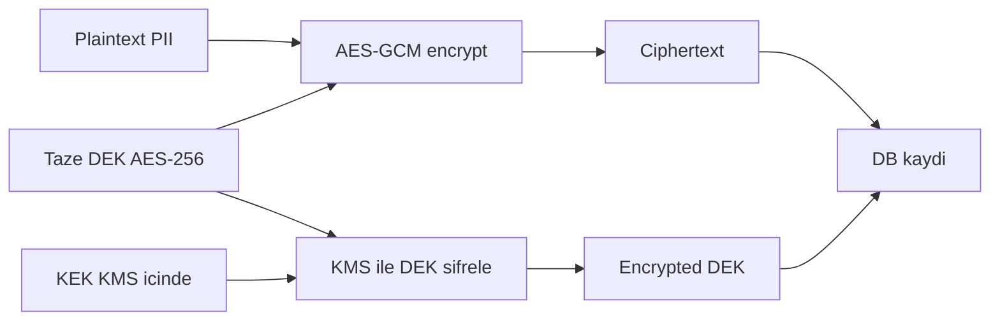
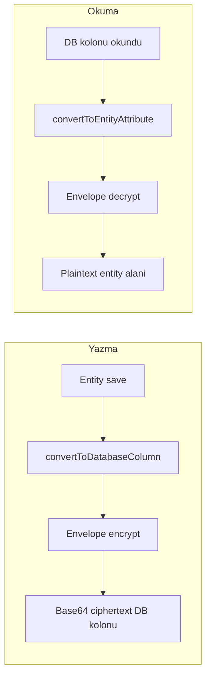
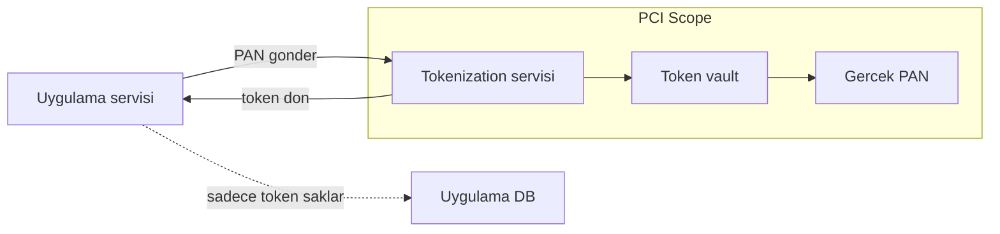
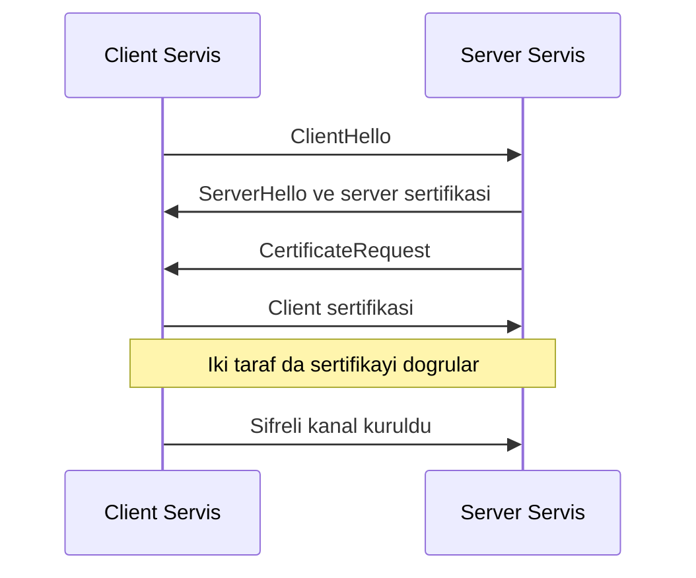

# Topic 8.6 — Encryption: At Rest, In Transit, Envelope, KMS

```admonish info title="Bu bölümde"
- Banking verisini nasıl sınıflandıracağın: TC No, PAN, CVV, şifre — hangisi encrypt, hangisi hash, hangisi tokenize
- AES-GCM (AEAD) neden banking standardı, IV reuse'un neden ölümcül olduğu
- Envelope encryption: DEK + KEK katmanı, KMS/Vault entegrasyonu, crypto-shredding
- Column-level encryption (JPA AttributeConverter) ve şifreli kolonda arama sorunu (blind index)
- Tokenization ile PCI scope azaltma, TLS/mTLS, ve 10 klasik encryption anti-pattern'i
```

## Hedef

Banking encryption pratiğini derinlemesine öğrenmek: column-level encryption (KVKK + PCI-DSS), envelope encryption (DEK + KEK), KMS integration (AWS KMS, HashiCorp Vault), tokenization, format-preserving encryption, TLS/mTLS, key rotation. Java/JCE/Bouncy Castle implementation.

## Süre

Okuma: 2-2.5 saat • Kendini Sına: 45 dk • Pratik (opsiyonel): 3-4 saat • Toplam: ~2.5 saat (+ pratik)

## Önbilgi

- Symmetric vs asymmetric crypto temel
- AES, RSA, SHA algoritmalarını duymuş ol
- Banking compliance: PCI-DSS, KVKK, BDDK

---

## Kavramlar

### 1. Encryption — neden banking için kritik

Bir müşterinin TC kimlik numarası veritabanında düz metin mi duracak? Duruyorsa sızan tek bir backup dosyası ya da meraklı bir DBA doğrudan KVKK ihlali demektir. Doğru soru "her şeyi şifreleyeyim mi" değil, **hangi verinin nasıl korunacağı** — bu da veri sınıflandırmasıyla başlar.

| Veri | Risk | Encryption gereği |
|---|---|---|
| TC kimlik no | KVKK + reputational | Column-level + KMS |
| Card PAN | PCI-DSS | Tokenization mandatory |
| Card CVV | PCI-DSS | Asla saklama (cardholder data) |
| Card expiry | PCI-DSS | Encrypt |
| Account balance | Internal | TLS in transit; rest OK |
| Customer email/phone | KVKK | Column-level |
| Transaction amount | Internal | TLS in transit |
| Password | OWASP | BCrypt/Argon2 hash (not encrypt) |
| Session token | OWASP | TLS only; opaque |

Dikkat: şifre asla encrypt edilmez, **hash**'lenir — encrypt reversible'dır, hash değil. Regülatörün beklentileri de bu sınıflandırmanın üstüne oturur:

**KVKK + BDDK requirements:**
- Sensitive PII at rest **encrypted**
- Key management separated from data
- Audit log encryption operations
- Key rotation **yıllık min**
- Crypto-shredding (key destroy = data destroy)

**PCI-DSS:**
- PAN encryption mandatory
- Key management documented
- Encryption keys themselves protected
- Annual key rotation
- Strong cryptography (AES-256, RSA 2048+)

### 2. Symmetric vs asymmetric

Doğru algoritma seçimi "hangisi daha güvenli" değil, "işi nerede yapıyorsun" sorusuyla belirlenir; ikisinin hız/kullanım profili tamamen farklıdır.

**Symmetric (AES):** Aynı key hem encrypt hem decrypt eder, çok hızlıdır (1-10 GB/s). Banking'de **column-level encryption** ve file encryption için kullanılır.

**Asymmetric (RSA, ECC):** Public key ile encrypt, private key ile decrypt; yavaştır (~1 MB/s). Banking'de **TLS handshake**, JWT signing, digital signature ve key exchange için kullanılır.

**Hybrid (envelope):** Data'yı symmetric ile, symmetric key'i asymmetric ile şifreler. En yaygın production pattern'idir ve §5'in konusudur.

### 3. AES — banking standard

**AES** bir block cipher'dır (128 bit block) ve banking'in fiili standardıdır. Key boyutu üç seçenek sunar: AES-128 (legacy), AES-192, ve **AES-256** — banking'de önerilen budur.

Asıl kritik karar mode seçimidir; yanlış mode, doğru key ile bile veriyi ele verir:

| Mode | Banking |
|---|---|
| **ECB** | ❌ NEVER (same plaintext → same ciphertext, pattern leak) |
| **CBC** | ✓ Eski. IV gerekli. Padding oracle attack risk. |
| **CTR** | ✓ Parallel. IV gerekli. |
| **GCM** | ✓✓ AEAD (Authenticated Encryption). Banking modern standard. |
| **CCM** | ✓ AEAD alternative. |
| **XTS** | Disk encryption (LUKS, FileVault). |

<mark>Banking'de encryption modu her zaman AEAD olmalı: GCM şifreleme ve bütünlüğü tek adımda verir, ayrı bir HMAC gerekmez.</mark>

### 4. AES-GCM örneği (Java JCE)

AES-GCM'i doğru kurmanın iki değişmez kuralı var: taze IV ve tag doğrulaması. Önce sabitler — 96-bit IV ve 128-bit tag GCM standardıdır:

```java
private static final int GCM_IV_LENGTH = 12;        // 96 bits — GCM standard
private static final int GCM_TAG_LENGTH = 128;      // bits
private static final SecureRandom RANDOM = new SecureRandom();
```

Encrypt tarafında her çağrıda `SecureRandom` ile taze IV üretilir; AAD (additional authenticated data) tenant/purpose gibi metadata'yı şifrelemeden bütünlük altına alır:

```java
byte[] iv = new byte[GCM_IV_LENGTH];
RANDOM.nextBytes(iv);                            // her encrypt'te taze IV

Cipher cipher = Cipher.getInstance("AES/GCM/NoPadding");
SecretKeySpec keySpec = new SecretKeySpec(key, "AES");
GCMParameterSpec gcmSpec = new GCMParameterSpec(GCM_TAG_LENGTH, iv);
cipher.init(Cipher.ENCRYPT_MODE, keySpec, gcmSpec);

if (aad != null) cipher.updateAAD(aad);          // authenticated but not encrypted
byte[] ciphertext = cipher.doFinal(plaintext);
```

Decrypt tarafında `AEADBadTagException` yakalanır: bu istisna ya ciphertext'in kurcalandığını ya da yanlış key'i işaret eder — ikisi de reddedilmelidir:

```java
cipher.init(Cipher.DECRYPT_MODE, keySpec, gcmSpec);
if (aad != null) cipher.updateAAD(aad);
try {
    return cipher.doFinal(data.ciphertext());
} catch (AEADBadTagException e) {
    // Integrity failure — tampering OR wrong key
    throw new IntegrityException("GCM authentication tag mismatch", e);
}
```

<details>
<summary>Tam kod: AesGcmEncryption (~50 satır)</summary>

```java
public class AesGcmEncryption {
    
    private static final int GCM_IV_LENGTH = 12;        // 96 bits — GCM standard
    private static final int GCM_TAG_LENGTH = 128;      // bits
    private static final SecureRandom RANDOM = new SecureRandom();
    
    public static EncryptedData encrypt(byte[] plaintext, byte[] key, byte[] aad) {
        try {
            byte[] iv = new byte[GCM_IV_LENGTH];
            RANDOM.nextBytes(iv);
            
            Cipher cipher = Cipher.getInstance("AES/GCM/NoPadding");
            SecretKeySpec keySpec = new SecretKeySpec(key, "AES");
            GCMParameterSpec gcmSpec = new GCMParameterSpec(GCM_TAG_LENGTH, iv);
            cipher.init(Cipher.ENCRYPT_MODE, keySpec, gcmSpec);
            
            if (aad != null) {
                cipher.updateAAD(aad);   // Authenticated but not encrypted
            }
            
            byte[] ciphertext = cipher.doFinal(plaintext);
            
            return new EncryptedData(iv, ciphertext);
        } catch (Exception e) {
            throw new EncryptionException("AES-GCM encrypt failed", e);
        }
    }
    
    public static byte[] decrypt(EncryptedData data, byte[] key, byte[] aad) {
        try {
            Cipher cipher = Cipher.getInstance("AES/GCM/NoPadding");
            SecretKeySpec keySpec = new SecretKeySpec(key, "AES");
            GCMParameterSpec gcmSpec = new GCMParameterSpec(GCM_TAG_LENGTH, data.iv());
            cipher.init(Cipher.DECRYPT_MODE, keySpec, gcmSpec);
            
            if (aad != null) {
                cipher.updateAAD(aad);
            }
            
            return cipher.doFinal(data.ciphertext());
        } catch (AEADBadTagException e) {
            // Integrity failure — tampering OR wrong key
            throw new IntegrityException("GCM authentication tag mismatch", e);
        } catch (Exception e) {
            throw new EncryptionException("AES-GCM decrypt failed", e);
        }
    }
}

public record EncryptedData(byte[] iv, byte[] ciphertext) {}
```

</details>

```admonish warning title="IV reuse — GCM'in ölümcül hatası"
AES-GCM'de aynı key ile aynı IV asla iki kez kullanılmaz. Aynı olursa saldırgan iki ciphertext'i XOR'layarak keystream'i geri çıkarır ve authentication da çöker — bu catastrophic failure'dır. Her encrypt için `SecureRandom` ile taze 12-byte IV üret; IV gizli değildir, ciphertext ile birlikte saklanır ama mutlaka unique olmalıdır.
```

```java
// ❌ WRONG — sabit IV
byte[] iv = "fixed_iv_12_".getBytes();

// ✓ CORRECT — her encrypt'te taze IV
byte[] iv = new byte[12];
new SecureRandom().nextBytes(iv);
```

### 5. Envelope encryption — KMS pattern

Tek bir master key ile tüm veriyi şifrelemek üç problemi birden doğurur: key sızarsa tüm data açılır, key rotation tüm veriyi yeniden şifreleme (massive re-encrypt) demektir ve application key yönetimi karmaşıklaşır. **Envelope encryption** bu düğümü iki katmanlı key ile çözer.

**Data Encryption Key (DEK):** Random AES-256, her kayıt için ayrı üretilir. **Key Encryption Key (KEK):** Master key, KMS'de yaşar, nadiren rotate olur. Akış şöyle işler:



Decrypt ters yönde: KMS `encrypted_DEK`'i çözer, DEK ile data açılır, DEK bellekten silinir. Bu tasarımın üç avantajı var — KMS sadece küçük DEK için çağrıldığından **performance** iyi, KEK rotate edilince yalnız kısa DEK'ler yeniden şifrelendiğinden **rotation** ucuz, KEK yok edilince tüm data okunamaz hale geldiğinden **crypto-shredding** bedavaya gelir.

<mark>KEK'i şifrelediği DEK'lerle asla aynı yerde tutma: KEK KMS ya da Vault'ta yaşar, veriden fiziksel olarak ayrı durur.</mark>

Encrypt method'unda sıra: taze DEK üret, veriyi DEK ile şifrele, DEK'i KEK ile (KMS) şifrele. `encryptionContext` AAD olarak tenant/purpose'u bağlar:

```java
// 1. Taze DEK üret
byte[] dek = new byte[32];   // 256-bit
random.nextBytes(dek);

// 2. Veriyi DEK ile şifrele (AES-GCM)
EncryptedData encrypted = AesGcmEncryption.encrypt(plaintext, dek, aad.getBytes(UTF_8));

// 3. DEK'i KEK ile şifrele (KMS)
EncryptResponse kmsResp = kmsClient.encrypt(EncryptRequest.builder()
    .keyId(kekId)
    .plaintext(SdkBytes.fromByteArray(dek))
    .encryptionContext(Map.of("purpose", "banking-pii"))
    .build());
byte[] encryptedDek = kmsResp.ciphertextBlob().asByteArray();
```

Kritik detay `finally` bloğunda: DEK yalnızca in-memory yaşamalı ve iş bitince `Arrays.fill(dek, (byte) 0)` ile sıfırlanmalı — bellekte kalan plain DEK bir heap dump'ta sızabilir. Decrypt tarafı simetriktir:

```java
// 1. KMS ile DEK'i çöz
DecryptResponse kmsResp = kmsClient.decrypt(DecryptRequest.builder()
    .ciphertextBlob(SdkBytes.fromByteArray(record.encryptedDek()))
    .keyId(record.kekId())
    .encryptionContext(Map.of("purpose", "banking-pii"))
    .build());
byte[] dek = kmsResp.plaintext().asByteArray();

// 2. Veriyi DEK ile çöz (finally'de dek sıfırlanır)
EncryptedData encrypted = new EncryptedData(record.iv(), record.ciphertext());
return AesGcmEncryption.decrypt(encrypted, dek, aad.getBytes(UTF_8));
```

<details>
<summary>Tam kod: EnvelopeEncryptionService (~65 satır)</summary>

```java
@Service
public class EnvelopeEncryptionService {
    
    private final KmsClient kmsClient;
    private final String kekId;
    private final SecureRandom random = new SecureRandom();
    
    public EncryptedRecord encrypt(byte[] plaintext, String aad) {
        // 1. Generate fresh DEK
        byte[] dek = new byte[32];   // 256-bit
        random.nextBytes(dek);
        
        try {
            // 2. Encrypt data with DEK (AES-GCM)
            EncryptedData encrypted = AesGcmEncryption.encrypt(
                plaintext, dek, aad.getBytes(UTF_8));
            
            // 3. Encrypt DEK with KEK (KMS)
            EncryptResponse kmsResp = kmsClient.encrypt(EncryptRequest.builder()
                .keyId(kekId)
                .plaintext(SdkBytes.fromByteArray(dek))
                .encryptionContext(Map.of("purpose", "banking-pii"))
                .build());
            
            byte[] encryptedDek = kmsResp.ciphertextBlob().asByteArray();
            
            return new EncryptedRecord(
                encrypted.iv(),
                encrypted.ciphertext(),
                encryptedDek,
                kekId);
        } finally {
            // 4. Zero DEK in memory
            Arrays.fill(dek, (byte) 0);
        }
    }
    
    public byte[] decrypt(EncryptedRecord record, String aad) {
        byte[] dek = null;
        try {
            // 1. KMS decrypt DEK
            DecryptResponse kmsResp = kmsClient.decrypt(DecryptRequest.builder()
                .ciphertextBlob(SdkBytes.fromByteArray(record.encryptedDek()))
                .keyId(record.kekId())
                .encryptionContext(Map.of("purpose", "banking-pii"))
                .build());
            
            dek = kmsResp.plaintext().asByteArray();
            
            // 2. Decrypt data with DEK
            EncryptedData encrypted = new EncryptedData(record.iv(), record.ciphertext());
            return AesGcmEncryption.decrypt(encrypted, dek, aad.getBytes(UTF_8));
        } finally {
            if (dek != null) {
                Arrays.fill(dek, (byte) 0);
            }
        }
    }
}

public record EncryptedRecord(
    byte[] iv, 
    byte[] ciphertext, 
    byte[] encryptedDek, 
    String kekId) {}
```

</details>

Aynı record'da birden çok işlem varsa her seferinde KMS'e gitmek pahalıdır; DEK'i kısa süre cache'leyebilirsin:

```java
@Service
public class DekCachingService {
    
    private final Cache<String, byte[]> dekCache;  // Caffeine
    private final KmsClient kmsClient;
    
    public DekCachingService() {
        this.dekCache = Caffeine.newBuilder()
            .maximumSize(1000)
            .expireAfterWrite(Duration.ofMinutes(5))   // Short!
            .build();
    }
    
    public byte[] getDek(String dekId, byte[] encryptedDek) {
        return dekCache.get(dekId, k -> kmsDecrypt(encryptedDek));
    }
}
```

```admonish tip title="DEK cache TTL'i kısa tut"
Cache hit hızlıdır, cache miss KMS call'a düşer — ama plain DEK'i bellekte tutmak saldırı yüzeyini büyütür. Banking'de TTL kısa olmalı (5-15 dk): rotation ve crypto-shred etkisinin makul sürede yansıması, plain DEK'in pencerede kalmaması için.
```

### 6. AWS KMS integration

KMS'i Spring'e bağlamak bir `KmsClient` bean'i ve KEK ARN'inden ibarettir; region ve credentials provider explicit verilir:

```java
@Configuration
public class KmsConfig {
    
    @Bean
    public KmsClient kmsClient() {
        return KmsClient.builder()
            .region(Region.EU_CENTRAL_1)
            .credentialsProvider(DefaultCredentialsProvider.create())
            .build();
    }
    
    @Bean
    public String bankingKekId() {
        return "arn:aws:kms:eu-central-1:123456789012:key/abc-def-...";
    }
}
```

KMS'in `generateDataKey` çağrısı §5'teki manuel DEK üretimini tek adıma indirir: aynı response'ta hem plain DEK hem encrypted DEK döner. Plain DEK'i in-app encrypt için kullanır, encrypted DEK'i store edersin:

```java
GenerateDataKeyResponse resp = kmsClient.generateDataKey(GenerateDataKeyRequest.builder()
    .keyId(kekId)
    .keySpec(DataKeySpec.AES_256)
    .encryptionContext(Map.of("tenant", "TR", "purpose", "pii"))
    .build());

byte[] plaintextDek = resp.plaintext().asByteArray();
byte[] encryptedDek = resp.ciphertextBlob().asByteArray();
```

### 7. HashiCorp Vault (alternatif KMS)

AWS KMS cloud-only'dir; Türk bankaları on-prem zorunluluğu nedeniyle sıklıkla Vault'un transit engine'ini kullanır. Transit, "encryption as a service" sunar — key hiçbir zaman Vault'tan çıkmaz:

```hcl
# Transit secret engine — encryption as service
vault secrets enable transit
vault write -f transit/keys/banking-pii \
  type=aes256-gcm96 \
  exportable=false \
  auto_rotate_period=8760h    # 1 year
```

Java tarafında `VaultTemplate` ile encrypt: plaintext ve context base64'lenir, dönen ciphertext `vault:v1:...` formatındadır ve key versiyonunu içinde taşır:

```java
public String encrypt(String plaintext) {
    Map<String, String> body = Map.of(
        "plaintext", Base64.getEncoder().encodeToString(plaintext.getBytes(UTF_8)),
        "context", Base64.getEncoder().encodeToString("banking-pii".getBytes(UTF_8))
    );
    VaultResponse response = vaultTemplate.write("transit/encrypt/banking-pii", body);
    return (String) response.getData().get("ciphertext");   // "vault:v1:base64ciphertext..."
}
```

Decrypt simetriktir; ciphertext'teki version bilgisi sayesinde eski key ile şifrelenmiş veri de rotation sonrası çözülebilir:

```java
public String decrypt(String ciphertext) {
    Map<String, String> body = Map.of(
        "ciphertext", ciphertext,
        "context", Base64.getEncoder().encodeToString("banking-pii".getBytes(UTF_8))
    );
    VaultResponse response = vaultTemplate.write("transit/decrypt/banking-pii", body);
    String base64Plain = (String) response.getData().get("plaintext");
    return new String(Base64.getDecoder().decode(base64Plain), UTF_8);
}
```

<details>
<summary>Tam kod: VaultEncryptionService (~28 satır)</summary>

```java
@Service
public class VaultEncryptionService {
    
    private final VaultTemplate vaultTemplate;
    
    public String encrypt(String plaintext) {
        Map<String, String> body = Map.of(
            "plaintext", Base64.getEncoder().encodeToString(plaintext.getBytes(UTF_8)),
            "context", Base64.getEncoder().encodeToString("banking-pii".getBytes(UTF_8))
        );
        
        VaultResponse response = vaultTemplate.write("transit/encrypt/banking-pii", body);
        return (String) response.getData().get("ciphertext");
        // "vault:v1:base64ciphertext..."
    }
    
    public String decrypt(String ciphertext) {
        Map<String, String> body = Map.of(
            "ciphertext", ciphertext,
            "context", Base64.getEncoder().encodeToString("banking-pii".getBytes(UTF_8))
        );
        
        VaultResponse response = vaultTemplate.write("transit/decrypt/banking-pii", body);
        String base64Plain = (String) response.getData().get("plaintext");
        return new String(Base64.getDecoder().decode(base64Plain), UTF_8);
    }
}
```

</details>

Vault'un avantajları: key vault'tan çıkmaz, auto-rotation built-in, audit log dahili, HA cluster mümkün. Trade-off nettir — AWS KMS cloud only, Vault on-prem çalışabildiği için Türk bankasında **Vault** yaygındır.

### 8. Column-level encryption — JPA AttributeConverter

Encryption'ı her service method'unda elle yapmak sürdürülemez; asıl istediğin, PII field'larının uygulama katmanında **transparent** şekilde şifrelenmesi. JPA'nın `AttributeConverter`'ı tam bunu verir: yazarken şifreler, okurken çözer, entity kodu hiçbir şeyin farkında olmaz.



Converter iki yön tanımlar: `convertToDatabaseColumn` envelope encrypt edip base64'ler, `convertToEntityAttribute` tersini yapar. Null güvenli olması şarttır:

```java
@Override
public String convertToDatabaseColumn(String plaintext) {
    if (plaintext == null) return null;
    EncryptedRecord record = encryptionService.encrypt(plaintext.getBytes(UTF_8), tenant);
    return Base64.getEncoder().encodeToString(serialize(record));
}

@Override
public String convertToEntityAttribute(String dbValue) {
    if (dbValue == null) return null;
    EncryptedRecord record = deserialize(Base64.getDecoder().decode(dbValue));
    return new String(encryptionService.decrypt(record, tenant), UTF_8);
}
```

Entity tarafında sadece `@Convert` annotation'ı yeter; `tcKimlik`, `email`, `phone` şifreli, `name` düz kalır:

```java
@Entity
public class Customer {
    @Id
    private UUID id;
    
    private String name;   // Plain
    
    @Convert(converter = EncryptedStringConverter.class)
    @Column(name = "tc_kimlik_encrypted")
    private String tcKimlik;
    
    @Convert(converter = EncryptedStringConverter.class)
    @Column(name = "email_encrypted")
    private String email;
    // ...
}
```

<details>
<summary>Tam kod: EncryptedStringConverter + Customer (~53 satır)</summary>

```java
@Converter
public class EncryptedStringConverter implements AttributeConverter<String, String> {
    
    private static EnvelopeEncryptionService encryptionService;
    private static String tenant;
    
    @Autowired
    public void setService(EnvelopeEncryptionService service) {
        EncryptedStringConverter.encryptionService = service;
    }
    
    @Override
    public String convertToDatabaseColumn(String plaintext) {
        if (plaintext == null) return null;
        
        EncryptedRecord record = encryptionService.encrypt(
            plaintext.getBytes(UTF_8), tenant);
        
        return Base64.getEncoder().encodeToString(serialize(record));
    }
    
    @Override
    public String convertToEntityAttribute(String dbValue) {
        if (dbValue == null) return null;
        
        EncryptedRecord record = deserialize(Base64.getDecoder().decode(dbValue));
        byte[] plaintext = encryptionService.decrypt(record, tenant);
        
        return new String(plaintext, UTF_8);
    }
}

@Entity
public class Customer {
    @Id
    private UUID id;
    
    private String name;   // Plain
    
    @Convert(converter = EncryptedStringConverter.class)
    @Column(name = "tc_kimlik_encrypted")
    private String tcKimlik;
    
    @Convert(converter = EncryptedStringConverter.class)
    @Column(name = "email_encrypted")
    private String email;
    
    @Convert(converter = EncryptedStringConverter.class)
    @Column(name = "phone_encrypted")
    private String phone;
    
    // ...
}
```

</details>

DB'de satır artık okunamaz — DBA `tc_kimlik` göremez, encryption application'da transparenttir:

```
id          | name        | tc_kimlik_encrypted              | email_encrypted
abc-123     | Ahmet       | base64(iv+ciphertext+enc_dek)    | base64(...)
```

Ama bir bedeli var: şifreli kolonda arama yapamazsın. `WHERE tc_kimlik = '12345678901'` çalışmaz, çünkü DB'deki değer her kayıtta farklı ciphertext'tir (GCM taze IV).

```admonish warning title="Şifreli kolonda arama tuzağı"
İki çözüm var, ikisinin de takası var. Deterministic encryption (aynı plaintext → aynı ciphertext) doğrudan aramayı mümkün kılar ama pattern leak riski taşır — aynı TC No'yu paylaşan kayıtlar görünür olur. Daha güvenlisi blind index: plaintext'in HMAC-SHA256'sını ayrı bir kolonda tutup lookup'ı onun üzerinden yapmak. Blind index arama sağlar ama sadece tam eşleşme (equality) destekler, LIKE/range sorgusu yapamazsın.
```

Blind index pratikte HMAC'i `@PrePersist`/`@PreUpdate` ile hesaplayıp searchable bir kolonda saklar:

```java
@Entity
public class Customer {
    @Convert(converter = EncryptedStringConverter.class)
    private String tcKimlik;        // GCM (different each time)
    
    @Column(name = "tc_kimlik_hash", length = 64)
    private String tcKimlikHash;    // HMAC-SHA256(tcKimlik, secret) — searchable
    
    @PrePersist
    @PreUpdate
    void computeHash() {
        if (tcKimlik != null) {
            tcKimlikHash = hmac(tcKimlik);
        }
    }
}
```

Sorgu artık plaintext'i değil, hash'i arar:

```java
public Optional<Customer> findByTcKimlik(String tcKimlik) {
    String hash = hmac(tcKimlik);
    return repo.findByTcKimlikHash(hash);
}
```

### 9. Tokenization — PCI-DSS

PAN (kart numarası) banking sistemlerinin en zehirli verisidir: PAN'e dokunan her servis PCI-DSS denetim kapsamına girer. Bu yüzden PAN **stored DEĞİL** — yerine geri döndürülemez bir **token** kullanılır, gerçek PAN sıkı korunan ayrı bir vault'ta yaşar.



<mark>PAN'i encrypt etmek yerine tokenize et: token vault dışındaki her sistem PCI scope'un dışına çıkar.</mark>

Tokenization ile encryption'ı karıştırma; ikisi farklı problemleri çözer:

| | Encryption | Tokenization |
|---|---|---|
| Reversibility | Key ile | Vault lookup |
| Output format | Random ciphertext | Format-preserving |
| Search | Hard | Direct |
| Scope | Any data | Mostly PAN |
| Compliance | PCI scope still | Reduces PCI scope |

Servis iki operasyon sunar: `tokenize` PAN'i alıp token döner, `detokenize` yalnız yetkili role için ters çevirir. Uygulama katmanı PAN'i hiç görmez, sadece token taşır:

```java
@Service
public class CardTokenizationService {
    
    private final VaultStorage vault;   // Strict access, dedicated service
    
    public String tokenize(String pan) {
        validatePan(pan);
        String token = generateToken();   // Random format-preserving
        vault.store(token, encrypt(pan));
        return token;
    }
    
    public String detokenize(String token) {
        // Sıkı access control — only payment processor service
        SecurityContext.requireRole("payment-processor");
        return decrypt(vault.retrieve(token));
    }
    
    private String generateToken() {
        return "tok_" + RandomStringUtils.randomAlphanumeric(16);   // tok_<16 random>
    }
}
```

Banking pratiği: tokenization service **ayrı microservice**, **ayrı network zone** ve **ayrı KMS key** ile izole edilir — böylece PAN yüzeyi tek bir sıkı korunan noktaya daralır.

### 10. Format-Preserving Encryption (FPE)

Bazı legacy card processor sistemleri girdi olarak 16 haneli PAN bekler; şifrelense bile çıktının 16 hane kalması gerekir. **FPE** tam bunu yapar — format korunur, sadece değer değişir:

```
PAN: 4532-1488-0343-6467  →  FPE encrypt  →  9876-5432-1098-7654
   (16 digits)                              (still 16 digits)
```

NIST 800-38G'nin **FF1** ve **FF3-1** modları standarttır. Banking'de nadir kullanılır (çoğunlukla legacy uyumluluk için); modern tasarımda tokenization daha yaygındır.

### 11. TLS — in transit

At-rest encryption veriyi diskte korur; in-transit encryption ise ağda korur. Banking için baseline **TLS 1.2 minimum**, **TLS 1.3 preferred**'dır:

```yaml
# Spring Boot application.yml
server:
  port: 8443
  ssl:
    enabled: true
    key-store: classpath:keystore.p12
    key-store-password: ${KEYSTORE_PASSWORD}
    key-store-type: PKCS12
    key-alias: banking-api
    protocol: TLS
    enabled-protocols: TLSv1.2,TLSv1.3
    ciphers: 
      - TLS_AES_256_GCM_SHA384
      - TLS_CHACHA20_POLY1305_SHA256
      - TLS_ECDHE_RSA_WITH_AES_256_GCM_SHA384
      - TLS_ECDHE_ECDSA_WITH_AES_256_GCM_SHA384
```

Banking'de config yeterli değil; TLS sertlik listesi de tutturulmalıdır:

- HSTS header (`Strict-Transport-Security`)
- TLS 1.0 / 1.1 disabled (deprecated)
- Weak ciphers disabled (RC4, 3DES, CBC mode)
- Forward secrecy (ECDHE)
- Certificate from trusted CA (or internal PKI)
- Certificate pinning mobile app'te
- OCSP stapling

### 12. mTLS — service-to-service

Normal TLS'te sadece client, server'ı doğrular. Servisler arası trafikte ise "karşı taraf gerçekten yetkili servis mi" sorusu kritiktir — **mTLS** iki tarafın da sertifika sunmasını zorunlu kılar:



Server tarafında `client-auth: need` ile client cert zorunlu kılınır:

```yaml
server:
  ssl:
    client-auth: need   # mTLS mandatory
    trust-store: classpath:truststore.jks
    trust-store-password: ${TRUSTSTORE_PASSWORD}
```

Client tarafı kendi key material'ını ve trust store'unu yükler:

```java
SSLContext sslContext = SSLContextBuilder.create()
    .loadKeyMaterial(clientKeyStore, keyPassword)
    .loadTrustMaterial(trustStore, null)
    .build();

WebClient webClient = WebClient.builder()
    .clientConnector(new ReactorClientHttpConnector(
        HttpClient.create().secure(s -> s.sslContext(sslContext))))
    .build();
```

Bu boilerplate'i elle yönetmek zahmetlidir; banking pratiğinde **service mesh (Istio, Linkerd)** mTLS'i ve cert rotation'ı otomatik yapar.

### 13. Key rotation

Bir key ne kadar uzun kullanılırsa, sızması durumunda açtığı pencere o kadar büyür. Key rotation bu pencereyi daraltmak, regülatör gereğini (yıllık min) karşılamak ve personel değişimlerini absorbe etmek için yapılır.

<mark>Banking'de key rotation opsiyonel değildir: en az yıllık, otomatik schedule ile zorunludur.</mark>

Rotation stratejisi kesintisiz olmalı: yeni key üretilir, yeni data yeni key'le şifrelenir, eski data arka planda lazy re-encrypt edilir, eski key yalnız decryption için tutulur ve audit tamamlanınca yok edilir:

```java
@Service
public class KeyRotationService {
    
    @Scheduled(cron = "0 0 2 * * SAT")   // Weekly batch
    public void rotateOldRecords() {
        List<EncryptedRecord> oldVersion = repo.findByKekId(oldKekId, limit: 1000);
        
        for (EncryptedRecord record : oldVersion) {
            byte[] plaintext = encryptionService.decryptWithKek(record, oldKekId);
            EncryptedRecord newRecord = encryptionService.encryptWithKek(plaintext, newKekId);
            repo.replace(record.id(), newRecord);
        }
    }
}
```

Envelope pattern'inde re-encrypt sadece kısa DEK'lere dokunur, tüm veriye değil. KMS ve Vault bunu daha da soyutlar — key version'ı kendi içlerinde yönetirler.

### 14. Crypto-shredding

KVKK silinme hakkı (GDPR right-to-be-forgotten) naif yolla imkansıza yakındır: bir kullanıcının tüm verisini backup'lardan, log'lardan ve replica'lardan gerçekten silemezsin. **Crypto-shredding** problemi tersine çevirir — veriyi silmek yerine onu okunamaz yaparsın.

Her kullanıcıya özel bir DEK kullanırsın; kullanıcı "beni sil" dediğinde DEK'i yok edersin. Backup'lar hâlâ orada durur ama artık decrypt edilemez:

```
User A's data encrypted with DEK_A
DEK_A encrypted with KEK
User A "delete me" → destroy DEK_A
  Backup'lar hala var ama decrypt edilemez
```

```admonish tip title="Crypto-shredding + envelope birlikte çalışır"
Envelope encryption zaten per-record DEK üretiyorsa crypto-shredding neredeyse bedavaya gelir: KVKK silinme talebinde ilgili DEK'i (veya KEK'i) imha etmek, dağınık tüm kopyaları tek hamlede okunamaz kılar. Bu yüzden KVKK/GDPR kapsamındaki sistemlerde envelope + per-user key güçlü bir standart pattern'dir.
```

### 15. Banking — encryption anti-pattern'leri

Mülakatta "bu kodda ne yanlış" sorusunun cephaneliği burasıdır. On klasik hatayı sırayla gör:

**Anti-pattern 1: ECB mode** — Aynı plaintext aynı ciphertext'i üretir, pattern görünür olur. Her zaman GCM kullan.

```java
Cipher.getInstance("AES/ECB/PKCS5Padding")   // ❌
```

**Anti-pattern 2: IV reuse** — GCM'de same key + same IV catastrophic'tir. Her encrypt'te taze IV.

**Anti-pattern 3: Hardcoded key** — Source code'daki key sızmış key demektir. KMS / Vault / env variable kullan.

```java
private static final String KEY = "my-secret-key-12";   // ❌
```

**Anti-pattern 4: Self-implemented crypto** — "Ben password ile XOR'larım" felakete davettir. Banking'de JCE / Bouncy Castle gibi battle-tested library şart.

**Anti-pattern 5: Encryption WITHOUT authentication** — CBC mode integrity vermez, padding oracle attack'a açıktır. AEAD (GCM) kullan.

**Anti-pattern 6: Weak random** — `Random` predictable'dır; key/IV/token üretiminde `SecureRandom` kullan.

```java
Random random = new Random();   // ❌ predictable
```

**Anti-pattern 7: Key + ciphertext same place** — Tüm yumurtalar aynı sepette: key ve data aynı yerde. KMS ile ayır.

**Anti-pattern 8: Algorithm string typo** — `"AES"` yazmak sessizce ECB'ye düşer. Her zaman explicit `"AES/GCM/NoPadding"` yaz.

```java
Cipher.getInstance("AES")   // → defaults to ECB!
```

**Anti-pattern 9: Key rotation yok** — Banking yıllık rotation minimum ister; schedule'ı otomatikleştir (§13).

**Anti-pattern 10: PAN encryption (tokenization yerine)** — PAN'i encrypt edip key'i aynı sistemde tutmak PCI scope'u hâlâ büyük bırakır. Tokenization ile PCI scope'u izole et (§9).

```admonish warning title="En sık iki üretim hatası"
Uygulamada en çok bu ikisi ısırır: `Cipher.getInstance("AES")` yazıp farkında olmadan ECB'ye düşmek, ve IV'yi sabit tutup GCM'i çökertmek. Kod review'da algoritma string'ini ve IV üretimini her zaman kontrol et — ikisi de "çalışıyor gibi görünür" ama veriyi ele verir.
```

---

## Önemli olabilecek araştırma kaynakları

- NIST SP 800-38D — GCM mode
- NIST SP 800-38G — FPE
- NIST SP 800-57 — Key management
- PCI-DSS v4 — Encryption requirements
- KVKK Tedbirler Rehberi
- AWS KMS Developer Guide
- HashiCorp Vault docs
- OWASP Cryptographic Storage Cheat Sheet
- Bouncy Castle JCE provider

---

## Kendini Sına

Aşağıdaki soruları önce **cevaba bakmadan** kendi cümlelerinle yanıtlamayı dene — hepsi TR bank mülakatlarında karşına çıkabilecek tarzda. Takıldığın soru olursa ilgili Kavramlar başlığına dön, sonra tekrar dene.

**S1. Envelope encryption nedir, hangi üç problemi çözer? Tek master key ile şifrelemeye göre farkı ne?**

<details>
<summary>Cevabı göster</summary>

Envelope encryption iki katmanlı key kullanır: her kayıt için random bir DEK (Data Encryption Key) veriyi şifreler, DEK'i de KMS'te duran KEK (Key Encryption Key) şifreler. Store edilen şey encrypted_data + encrypted_DEK'tir.

Tek master key üç problem doğurur: key sızarsa tüm data açılır, rotation tüm veriyi yeniden şifrelemeyi gerektirir, key yönetimi karmaşıklaşır. Envelope bunları çözer — KMS sadece küçük DEK için çağrıldığından performans iyi, KEK rotate edilince yalnız DEK'ler yeniden şifrelendiğinden rotation ucuz, KEK yok edilince tüm data okunamaz olduğundan crypto-shredding bedavaya gelir.

</details>

**S2. AES-GCM'de aynı key ile aynı IV'yi iki kez kullanmak neden catastrophic failure'dır?**

<details>
<summary>Cevabı göster</summary>

GCM bir stream cipher gibi çalışır: key + IV'den bir keystream türetir ve plaintext'i onunla XOR'lar. Aynı key + aynı IV aynı keystream'i üretir; iki ciphertext'i XOR'larsan keystream düşer ve iki plaintext'in XOR'u açığa çıkar — oradan plaintext'ler geri çözülebilir. Dahası GCM'in authentication mekanizması da IV tekrarında çöker, yani integrity garantisi de kaybolur.

Çözüm: her encrypt için `SecureRandom` ile taze 12-byte (96-bit) IV üret. IV gizli olmak zorunda değil, ciphertext ile birlikte saklanır; tek şart benzersiz olmasıdır.

</details>

**S3. Column-level encryption yaptın, `WHERE tc_kimlik = ?` sorgusu çalışmıyor. Neden, ve nasıl aranabilir hale getirirsin?**

<details>
<summary>Cevabı göster</summary>

GCM her encrypt'te taze IV kullandığından aynı TC No her kayıtta farklı ciphertext üretir; DB'deki değer plaintext'e eşit olmadığı gibi kendi içinde de deterministik değildir, bu yüzden equality sorgusu tutmaz.

İki çözüm var. Deterministic encryption (aynı plaintext → aynı ciphertext) doğrudan aramayı mümkün kılar ama pattern leak riski taşır — aynı değeri paylaşan satırlar görünür olur. Daha güvenlisi blind index: plaintext'in HMAC-SHA256'sını ayrı bir kolonda tutar, sorguyu hash üzerinden yaparsın. Blind index equality lookup verir ama LIKE/range desteklemez; HMAC secret'ı da KMS/Vault'ta korunmalıdır.

</details>

**S4. PAN saklaman gerekiyor. Encryption mı tokenization mı seçersin, ve tokenization PCI scope'u neden azaltır?**

<details>
<summary>Cevabı göster</summary>

PAN için tokenization seçilir. Encryption yaparsan PAN'e ve key'e dokunan her servis PCI-DSS denetim kapsamında kalır; ciphertext hâlâ "cardholder data" sayılır ve key'i tutan sistem de scope içindedir. Tokenization ise gerçek PAN'i sıkı korunan ayrı bir vault'ta tutar, uygulamaya sadece geri döndürülemez bir token verir.

Scope azalması buradan gelir: token vault dışındaki tüm servisler artık PAN görmediğinden PCI kapsamının dışına çıkar. PAN yüzeyi tek bir izole noktaya — ayrı microservice, ayrı network zone, ayrı KMS key — daralır. Detokenize işlemi role-based sıkı access control ile (ör. sadece payment-processor) korunur.

</details>

**S5. Key rotation neden zorunlu, ve mevcut şifreli veriyi bozmadan nasıl rotate edersin?**

<details>
<summary>Cevabı göster</summary>

Rotation zorunludur çünkü bir key ne kadar uzun yaşarsa sızması durumunda açtığı pencere o kadar büyür; ayrıca KVKK/PCI regülasyonu yıllık minimum rotation ister ve personel değişimleri de key değişimini gerektirir.

Kesintisiz strateji şöyle: yeni key (v2) üretilir, yeni data v2 ile şifrelenir, eski data arka planda batch ile lazy re-encrypt edilir, eski key yalnız decryption için tutulur, tüm veri taşınıp audit tamamlanınca eski key yok edilir. Envelope pattern bunu ucuzlatır — KEK rotate edilince tüm veri değil, yalnızca kısa DEK'ler yeniden şifrelenir. KMS ve Vault key version'ı kendi içinde yönettiğinden bu akışı büyük ölçüde soyutlar.

</details>

**S6. KVKK silinme hakkını, verinin backup ve replica'larda dağıldığı bir sistemde nasıl garanti edersin?**

<details>
<summary>Cevabı göster</summary>

Naif "tüm satırları sil" yaklaşımı çalışmaz: backup'lar, log'lar ve replica'lardaki kopyaları gerçekten silmek pratikte imkansızdır. Çözüm crypto-shredding: her kullanıcının verisini ona özel bir DEK ile şifreler, silme talebinde o DEK'i (veya kapsayan KEK'i) imha edersin.

Key yok olduğunda backup'lar fiziksel olarak yerinde kalsa bile içeriği artık decrypt edilemez, yani okunamaz — bu KVKK/GDPR açısından silme ile eşdeğer kabul edilir. Envelope encryption zaten per-record DEK ürettiğinden bu pattern neredeyse bedavaya gelir; bu yüzden KVKK kapsamındaki sistemlerde envelope + per-user key standart bir tercihtir.

</details>

**S7. Normal TLS ile mTLS arasındaki fark nedir, ve servisler arası trafikte neden mTLS istersin?**

<details>
<summary>Cevabı göster</summary>

Normal TLS'te yalnız client server'ı doğrular: server sertifika sunar, client onu güvenilir CA'ya karşı kontrol eder. mTLS'te ise iki taraf da sertifika sunar — server client cert ister (`client-auth: need`), client de kendi key material'ını sunar, ikisi de karşısındakini doğrular.

Servisler arası trafikte "karşı taraf gerçekten yetkili servis mi" sorusu kritiktir; ağa sızan bir aktör geçerli bir client cert olmadan bağlanamaz. Bu boilerplate'i elle yönetmek (cert dağıtımı, rotation) zahmetli olduğundan banking pratiğinde service mesh (Istio, Linkerd) mTLS'i ve cert rotation'ı otomatikleştirir.

</details>

---

## Tamamlama kriterleri

- [ ] "Kendini Sına" bölümündeki tüm soruları cevaba bakmadan açıklayabiliyorum
- [ ] Banking veri sınıflandırmasında hangi verinin encrypt / hash / tokenize edileceğini söyleyebilirim
- [ ] AES-GCM'in neden AEAD standardı olduğunu ve IV reuse'un neden catastrophic olduğunu anlatabilirim
- [ ] Envelope encryption'ı (DEK + KEK) tahtada çizip üç avantajını (performance, rotation, crypto-shred) sayabiliyorum
- [ ] Column-level encryption'ı AttributeConverter ile kurar, şifreli kolonda arama için blind index'i açıklayabilirim
- [ ] Tokenization vs encryption farkını ve tokenization'ın PCI scope'u neden azalttığını anlatabiliyorum
- [ ] TLS ve mTLS farkını, key rotation ve crypto-shredding pattern'lerini açıklayabilirim
- [ ] 10 encryption anti-pattern'inden en az yedisini örnekle söyleyebilirim
- [ ] (Opsiyonel) "Pratik yapmak istersen" bölümündeki testleri yazdım ve Claude-verify prompt'uyla doğrulattım

---

## Defter notları

1. "AES-256-GCM AEAD properties (encryption + integrity) banking sebebi: ____."
2. "IV reuse catastrophic failure GCM: ____."
3. "Envelope encryption DEK + KEK trade-off (performance, rotation, crypto-shred): ____."
4. "AWS KMS generateDataKey + encryption context: ____."
5. "JPA AttributeConverter column-level encryption transparent: ____."
6. "Blind index (HMAC) deterministic encryption pattern leak trade-off: ____."
7. "Tokenization vs encryption PCI scope reduction: ____."
8. "TLS 1.3 + forward secrecy + HSTS banking baseline: ____."
9. "mTLS service-to-service + service mesh (Istio/Linkerd): ____."
10. "Crypto-shredding KVKK silinme hakkı pattern: ____."

```admonish success title="Bölüm Özeti"
- Encryption veri sınıflandırmasıyla başlar: PII column-level encrypt, PAN tokenize, şifre hash — hepsi at-rest korumasının farklı araçları
- Banking standardı AES-256-GCM'dir çünkü AEAD şifreleme + bütünlüğü tek adımda verir; kural: her encrypt'te `SecureRandom` ile taze IV, asla reuse yok
- Envelope encryption (per-record DEK + KMS'teki KEK) performansı, ucuz rotation'ı ve crypto-shredding'i tek pattern'de birleştirir — KEK veriden fiziksel olarak ayrı yaşar
- Column-level encryption JPA AttributeConverter ile transparent'tır; şifreli kolonda arama blind index (HMAC) ister, deterministic encryption pattern leak riski taşır
- PAN için encryption değil tokenization: token vault dışındaki her sistem PCI scope'un dışına çıkar
- In transit için TLS 1.2+ (1.3 preferred) ve servisler arası mTLS; key rotation yıllık zorunlu, crypto-shredding KVKK silinme hakkını çözer
```

---

## Pratik yapmak istersen

Kavramları koda dökmek istersen aşağıdaki iki ek hazır: test yazma rehberi AES-GCM round-trip, tampering/AAD reddi, encrypted column ve blind index davranışları için örnek testler içerir; Claude-verify prompt'u ile yazdığın encryption kodunu banking-grade perspektiften denetletebilirsin.

<details>
<summary>Test yazma rehberi</summary>

```java
@Test
void aesGcmEncryptDecryptRoundTrip() {
    byte[] key = randomBytes(32);
    byte[] plaintext = "TC: 12345678901".getBytes(UTF_8);
    byte[] aad = "tenant=TR".getBytes(UTF_8);
    
    EncryptedData encrypted = AesGcmEncryption.encrypt(plaintext, key, aad);
    byte[] decrypted = AesGcmEncryption.decrypt(encrypted, key, aad);
    
    assertThat(decrypted).isEqualTo(plaintext);
}

@Test
void shouldFailWithDifferentAad() {
    byte[] key = randomBytes(32);
    byte[] plaintext = "data".getBytes();
    
    EncryptedData encrypted = AesGcmEncryption.encrypt(plaintext, key, "tenant=TR".getBytes());
    
    assertThatThrownBy(() ->
        AesGcmEncryption.decrypt(encrypted, key, "tenant=DE".getBytes()))
        .isInstanceOf(IntegrityException.class);
}

@Test
void shouldFailWithTamperedCiphertext() {
    byte[] key = randomBytes(32);
    EncryptedData encrypted = AesGcmEncryption.encrypt(
        "data".getBytes(), key, null);
    
    encrypted.ciphertext()[0] ^= 0x01;   // tamper
    
    assertThatThrownBy(() -> AesGcmEncryption.decrypt(encrypted, key, null))
        .isInstanceOf(IntegrityException.class);
}

@Test
void shouldUseFreshIvEachEncrypt() {
    byte[] key = randomBytes(32);
    byte[] plaintext = "same data".getBytes();
    
    EncryptedData e1 = AesGcmEncryption.encrypt(plaintext, key, null);
    EncryptedData e2 = AesGcmEncryption.encrypt(plaintext, key, null);
    
    assertThat(e1.iv()).isNotEqualTo(e2.iv());
    assertThat(e1.ciphertext()).isNotEqualTo(e2.ciphertext());
}

@Test
@Transactional
void customerEncryptedColumnsRoundTrip() {
    Customer c = new Customer();
    c.setName("Ahmet");
    c.setTcKimlik("12345678901");
    c.setEmail("ahmet@example.com");
    
    customerRepo.saveAndFlush(c);
    em.clear();
    
    // Raw DB query
    String rawTcKimlik = (String) em.createNativeQuery(
        "SELECT tc_kimlik_encrypted FROM customers WHERE id = :id")
        .setParameter("id", c.getId()).getSingleResult();
    
    assertThat(rawTcKimlik).doesNotContain("12345678901");   // Encrypted
    
    Customer loaded = customerRepo.findById(c.getId()).orElseThrow();
    assertThat(loaded.getTcKimlik()).isEqualTo("12345678901");   // Decrypted
}

@Test
void blindIndexLookup() {
    Customer c = new Customer();
    c.setTcKimlik("12345678901");
    customerRepo.saveAndFlush(c);
    
    Optional<Customer> found = customerService.findByTcKimlik("12345678901");
    
    assertThat(found).isPresent();
    assertThat(found.get().getId()).isEqualTo(c.getId());
}

@Test
void tokenizationRoundTrip() {
    String pan = "4532148803436467";
    
    String token = tokenizationService.tokenize(pan);
    
    assertThat(token).startsWith("tok_");
    assertThat(token).doesNotContain(pan);
    
    String detokenized = tokenizationService.detokenize(token);
    assertThat(detokenized).isEqualTo(pan);
}
```

> Tamamlama kriteri: AES-GCM round-trip + tampering + wrong-AAD reddi geçiyor, fresh IV her encrypt'te doğrulandı, encrypted column raw sorguda ciphertext dönüyor, blind index lookup ve tokenization round-trip yeşil. En az 8 integration test hedefle.

</details>

<details>
<summary>Claude-verify prompt</summary>

```
Encryption implementation'ımı banking-grade kriterlere göre değerlendir.
Eksikleri işaretle, kod yazma:

1. Algoritma:
   - AES-256-GCM (banking standard)?
   - ECB mode YOK?
   - CBC mode → tercih edilmiyor, GCM kullanılıyor mu?
   - SecureRandom (Math.random YOK)?

2. IV:
   - Her encrypt fresh IV?
   - 12-byte (96-bit) GCM standardı?
   - IV ciphertext ile birlikte stored?
   - IV reuse YOK?

3. Envelope encryption:
   - DEK random AES-256?
   - KEK KMS / Vault'ta?
   - DEK in-memory only (Arrays.fill zero out)?
   - Encryption context (AAD) tenant/purpose?

4. KMS integration:
   - AWS KMS / HashiCorp Vault?
   - KMS key permission IAM/policy?
   - Key not exportable?
   - Audit log enable?

5. Column-level:
   - JPA AttributeConverter @Convert?
   - Sensitive PII (TC, email, phone, address) encrypted?
   - Plain field DB'de YOK?

6. Searchable:
   - Blind index (HMAC) lookup?
   - Deterministic encryption pattern leak'i değerlendirildi mi?

7. Tokenization:
   - PAN encrypt yerine tokenization?
   - Token vault ayrı service?
   - Detokenize role-based?

8. TLS:
   - TLS 1.2 min, 1.3 preferred?
   - Weak cipher disabled?
   - HSTS header?
   - Certificate pinning mobile?

9. mTLS:
   - Service-to-service mTLS?
   - Cert rotation automated (service mesh)?

10. Key rotation + crypto-shredding:
    - Yıllık rotation scheduled?
    - Lazy re-encrypt batch?
    - Crypto-shred KVKK silinme hakkı?

11. Anti-pattern:
    - Hardcoded key YOK?
    - Self-implemented crypto YOK?
    - "AES" (default ECB) YOK?
    - IV reuse YOK?
    - PAN encryption yerine tokenization YOK?
    - Weak random YOK?

Her madde için PASS / FAIL / EKSIK işaretle, kanıt göster, kod yazma.
```

</details>
