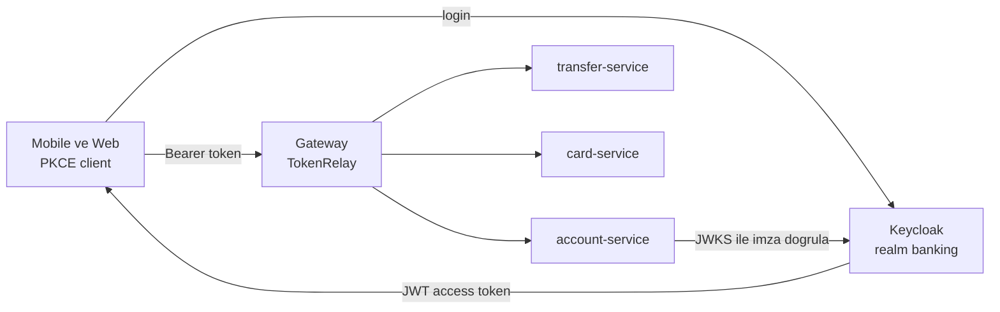
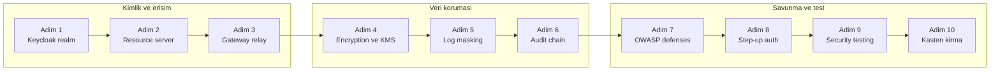
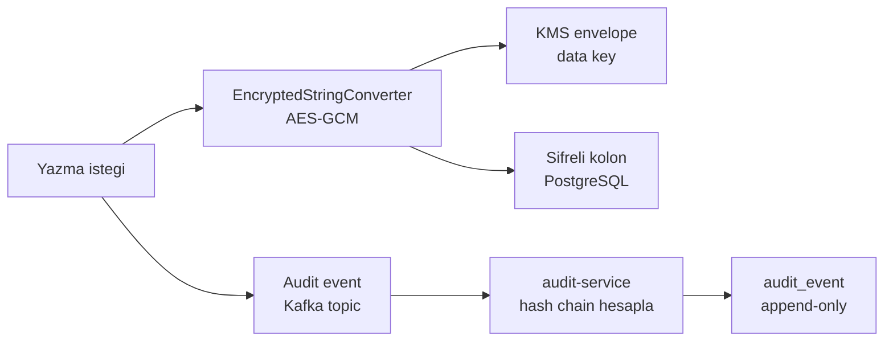

# Phase 8 Mini-Project — Banking Security Hardening (End-to-End)

```admonish info title="Bu projede"
- Phase 7'nin 4 microservice'ini Keycloak IdP + JWT resource server ile uçtan uca kimliklendiriyorsun
- `@PreAuthorize` + ownership check ile IDOR'u kapatıyor, column encryption + PAN tokenization ile PII'yi koruyorsun
- Tamper-proof audit hash chain + Kafka ile silinemez denetim izi kuruyorsun
- Step-up auth, log masking ve OWASP A01-A10 savunmalarını uygulayıp güvenlik başlıklarını sıkılaştırıyorsun
- OWASP ZAP pentest + 25+ güvenlik testi ile savunmayı kanıtlıyor, 8 kasten kırma senaryosunu reproduce edip düzeltiyorsun
```

## Hedef

Phase 7'de banking'i 4 servise böldün; Phase 8'in 7 topic'inde Spring Security, authentication, JWT, OAuth2, Keycloak, encryption ve OWASP çalıştın. Bu projede hepsini tek stack'te birleştirip servisleri **production-grade security hardening** ile bitiriyorsun. Yeni teori yok — **synthesis** var; bir adımda takılırsan ilgili topic'e geri dön, oku, düzelt.

Projenin sonunda banking stack'in şunlara sahip olacak: merkezi IdP + JWT doğrulama, method-level yetkilendirme + ownership, şifreli PII + tokenize PAN, silinemez audit, step-up MFA ve kanıtlanmış OWASP savunmaları.

```admonish tip title="Süre ve önbilgi"
10-12 gün ayır (günde ~3 saat). Başlamadan önce: Phase 7 mini-project (4 service split) bitmiş, Topic 8.2-8.7 tamamlanmış ve `mvn test` yeşil olmalı. Buradaki işin çoğu **birleştirme** + 8 kasten kırma senaryosu.
```

---

## Güvenlik mimarisi

Bir istek client'tan resource server'a kadar hangi güven sınırlarından geçiyor — önce resmi gör. Client token'ı **Keycloak**'tan (merkezi kimlik sağlayıcın, IdP) alır, gateway propagate eder, her servis kendi doğrulamasını yapar.



---

## Adım adım build plan

On adım var: ilk üçü kimlik ve erişimi kuruyor, ortadaki üçü veriyi koruyor, son dördü savunmayı sertleştirip test ediyor.



### Adım 1 — Keycloak realm + client tasarımı (1.5 gün)

**Ne yapacaksın:** Keycloak'ı ayağa kaldırıp "banking" realm'ini 6 client + 5 rol + custom MFA flow ile kuracaksın. **Neden:** Tüm servisler token doğrulamasını buraya yaslıyor — yanlış realm ayarı zincirin tamamını zehirler. **Nasıl:** docker-compose + realm config.

Compose'un güvenlik açısından kritik parçası hostname ve HTTP bayrakları — `KC_HTTP_ENABLED` yalnız dev'de açık, prod'da TLS zorunlu:

```yaml
keycloak:
  image: quay.io/keycloak/keycloak:24.0
  command: start
  environment:
    KC_HOSTNAME: auth.mavibank.local
    KC_HTTP_ENABLED: "true"          # sadece dev
    KC_HOSTNAME_STRICT: "false"
    KEYCLOAK_ADMIN_PASSWORD: ${KEYCLOAK_ADMIN_PASSWORD}
  ports: ['8180:8080']
```

<details>
<summary>Tam kod: docker-compose.yml Keycloak + Postgres (~30 satır)</summary>

```yaml
# docker-compose.yml
version: '3.8'
services:
  keycloak-postgres:
    image: postgres:16
    environment:
      POSTGRES_DB: keycloak
      POSTGRES_USER: keycloak
      POSTGRES_PASSWORD: ${KEYCLOAK_DB_PASSWORD}
    volumes: ['keycloak-pg:/var/lib/postgresql/data']

  keycloak:
    image: quay.io/keycloak/keycloak:24.0
    command: start
    environment:
      KC_DB: postgres
      KC_DB_URL: jdbc:postgresql://keycloak-postgres:5432/keycloak
      KC_DB_USERNAME: keycloak
      KC_DB_PASSWORD: ${KEYCLOAK_DB_PASSWORD}
      KC_HOSTNAME: auth.mavibank.local
      KC_HTTP_ENABLED: "true"          # dev only
      KC_HOSTNAME_STRICT: "false"
      KEYCLOAK_ADMIN: admin
      KEYCLOAK_ADMIN_PASSWORD: ${KEYCLOAK_ADMIN_PASSWORD}
    ports: ['8180:8080']
    depends_on: [keycloak-postgres]

volumes:
  keycloak-pg:
```

</details>

Realm "banking" ayarları: SSL Required `external`, brute force ON (5/15 dk), access token 15 dk / refresh 60 dk, SSO idle 30 dk / max 8 saat, email verification ON, login theme `banking-custom`.

Altı client'ı erişim tipine göre ayır — public+PKCE mobil/web, bearer-only resource, confidential teller, service-account internal servisler:

| Client ID | Type | Auth flow | Scopes |
|---|---|---|---|
| `banking-mobile` | public + PKCE S256 | Authorization Code | openid, profile, account.read, transactions.read, transfer.write, card.read |
| `banking-web` | public + PKCE S256 | Authorization Code | (same) |
| `banking-api` | bearer-only | (resource) | (resource for the above) |
| `teller-app` | confidential | Authorization Code | openid, profile, customer.read, transfer.write, ... |
| `payment-service` | confidential + service account | Client Credentials | internal.account.read, internal.transfer.write |
| `notification-service` | confidential + service account | Client Credentials | internal.notification.send |

Realm rolleri: `customer`, `teller`, `branch_manager`, `admin`, `compliance_officer`. **Composite role** `teller`, `banking-api` scope'larını (customer.read, transfer.write) içerir. User attributes mapper: `tenant`, `branch`, `customer_id`, `mfa_completed` → JWT claim. Custom flow `Banking-MFA-Browser`: Username/Password → Risk SPI → OTP.

Kontrol noktası: token endpoint'ten access token alabiliyorsun; JWT payload'ında `tenant`, `branch`, `customer_id` claim'leri görünüyor.

### Adım 2 — Resource server: Spring Security 6 + JWT (2 gün)

**Ne yapacaksın:** `account-service`, `transfer-service`, `card-service`, `notification-service` her birini stateless **resource server** yapacaksın — token'ı JWKS ile doğrulayan servis. **Neden:** Her servis JWT'yi bağımsız validate etmeli; imza, audience ve expiry burada tutulur. **Nasıl:** `issuer-uri` + `SecurityFilterChain` + `JwtAuthenticationConverter`.

Her serviste issuer ve audience'ı bağla:

```yaml
spring:
  security:
    oauth2:
      resourceserver:
        jwt:
          issuer-uri: http://auth.mavibank.local:8180/realms/banking
          audiences: [banking-api]
```

Filter chain'in özü: CSRF kapalı, session `STATELESS`, tüm istek authenticated, `oauth2ResourceServer` + banking güvenlik başlıkları (HSTS, CSP, X-Frame DENY):

```java
http
    .csrf(c -> c.disable())
    .sessionManagement(s -> s.sessionCreationPolicy(SessionCreationPolicy.STATELESS))
    .authorizeHttpRequests(a -> a
        .requestMatchers("/actuator/health").permitAll()
        .anyRequest().authenticated())
    .oauth2ResourceServer(o -> o.jwt(j ->
        j.jwtAuthenticationConverter(keycloakJwtConverter())));
```

**`JwtAuthenticationConverter`**, Keycloak'ın `realm_access.roles` claim'ini `ROLE_` prefix'li Spring authority'lerine map eder — method security bu authority'leri okur.

<details>
<summary>Tam kod: SecurityConfig filter chain + JwtAuthenticationConverter (~43 satır)</summary>

```java
@Configuration
@EnableMethodSecurity
public class SecurityConfig {

    @Bean
    public SecurityFilterChain filterChain(HttpSecurity http) throws Exception {
        http
            .csrf(c -> c.disable())
            .sessionManagement(s -> s.sessionCreationPolicy(SessionCreationPolicy.STATELESS))
            .authorizeHttpRequests(a -> a
                .requestMatchers("/actuator/health").permitAll()
                .anyRequest().authenticated())
            .oauth2ResourceServer(o -> o.jwt(j ->
                j.jwtAuthenticationConverter(keycloakJwtConverter())))
            .headers(h -> h
                .frameOptions(f -> f.deny())
                .contentTypeOptions(Customizer.withDefaults())
                .httpStrictTransportSecurity(hsts -> hsts
                    .includeSubDomains(true)
                    .maxAgeInSeconds(31536000)
                    .preload(true))
                .contentSecurityPolicy(csp -> csp
                    .policyDirectives("default-src 'none'; frame-ancestors 'none'"))
                .referrerPolicy(r -> r.policy(ReferrerPolicy.NO_REFERRER)));
        return http.build();
    }

    @Bean
    public JwtAuthenticationConverter keycloakJwtConverter() {
        JwtAuthenticationConverter converter = new JwtAuthenticationConverter();
        converter.setJwtGrantedAuthoritiesConverter(jwt -> {
            Set<GrantedAuthority> auth = new HashSet<>();
            Map<String, Object> realm = jwt.getClaim("realm_access");
            if (realm != null) {
                ((List<String>) realm.get("roles")).forEach(r ->
                    auth.add(new SimpleGrantedAuthority("ROLE_" + r)));
            }
            return auth;
        });
        return converter;
    }
}
```

</details>

Endpoint güvenliği rol + scope kombinasyonuyla — `@PreAuthorize` ile method-level:

```java
@PostMapping("/transfers")
@PreAuthorize("hasRole('customer') and hasAuthority('SCOPE_transfer.write')")
public Transfer transfer(@Valid @RequestBody TransferRequest req,
                        @AuthenticationPrincipal Jwt jwt) {
    UUID userId = UUID.fromString(jwt.getSubject());
    return transferService.transfer(req, userId);
}
```

Kontrol noktası: geçerli token 200 dönerken expired, wrong-audience ve tampered token'lar 401 alıyor. Detay için [Topic 8.1 — Spring Security Architecture](../01-spring-security-architecture/index.md) ve [Topic 8.3 — JWT](../03-jwt/index.md).

### Adım 3 — Gateway JWT propagation (0.5 gün)

**Ne yapacaksın:** Spring Cloud Gateway'i token'ı strip etmeden propagate edecek şekilde ayarlayacaksın (TokenRelay). **Neden:** Gateway bir güven sınırı değil, sadece bir yönlendirici. <mark>Gateway'in eklediği hiçbir claim'e güvenme; her resource server token'ı yeniden doğrular (no trust)</mark>. **Nasıl:** `TokenRelay` filtresi.

```yaml
spring:
  cloud:
    gateway:
      routes:
        - id: account-route
          uri: lb://account-service
          predicates: [Path=/v1/accounts/**]
          filters:
            - name: TokenRelay
            - name: BankingHeaders
```

```admonish warning title="Gateway'e güvenme"
Klasik hata: gateway JWT'yi doğrular, arkadaki servisler "gateway zaten baktı" diye validation'ı atlar. Bu durumda gateway'i bypass eden veya sahte header enjekte eden bir istek doğrudan servise düşer. Her resource server kendi JWKS doğrulamasını **her zaman** yapar.
```

Kontrol noktası: gateway arkasındaki servise elle sahte `X-User-Role: admin` header'ı eklesen bile istek reddediliyor — servis yalnız imzalı JWT'ye bakıyor.

### Adım 4 — Column encryption + KMS + PAN tokenization (1.5 gün)

**Ne yapacaksın:** PII kolonlarını AES-GCM ile şifreleyip envelope encryption + KMS kullanacak, kart PAN'ını tokenize edeceksin. **Neden:** **Envelope encryption**'da veri anahtarı (DEK) bir KEK ile korunur; **blind index** (HMAC-SHA256) şifreli kolonda eşitlik aramasını mümkün kılar. **Nasıl:** LocalStack KMS + `@Convert` + tokenization service.

Dev'de LocalStack KMS ve KEK kurulumu:

```bash
aws --endpoint-url=http://localhost:4566 kms create-key \
  --description "Banking PII KEK" \
  --key-usage ENCRYPT_DECRYPT
```

Customer service'te `tcKimlik`, `email`, `phone` → `@Convert(EncryptedStringConverter)`; `tcKimlikHash` blind index, `findByTcKimlik(...)` hash lookup üzerinden çalışır.

Card service'te <mark>ham PAN asla DB'de tutulmaz; yalnız `pan_token` saklanır, raw PAN sadece tokenization vault'unda durur</mark>. Detokenize yalnız `payment_processor` (veya `admin`) rolü ile ve her çağrı audit'lenir:

```java
@Service
public class CardTokenizationService {

    private final VaultStorage vault;

    @PreAuthorize("hasRole('admin') or hasRole('payment_processor')")
    public String detokenize(String token) {
        auditService.log(
            currentUserId(),
            "DETOKENIZE_PAN",
            Map.of("token", token));
        return vault.retrieve(token);
    }
}
```

Kontrol noktası: DB'de raw TC/PAN yok (`SELECT` şifreli byte döndürüyor), blind index lookup doğru kaydı buluyor, her detokenize `PII_DETOKENIZE` audit satırı yazıyor. Arka plan için [Topic 8.6 — Encryption](../06-encryption/index.md).

### Adım 5 — Logging + masking (0.5 gün)

**Ne yapacaksın:** JSON logback + masking appender kuracaksın. **Neden:** **Masking** hassas veriyi (TC, PAN, Authorization header) log'a düşmeden maskeler — KVKK ve sızıntı önleme. **Nasıl:** `LogstashEncoder` + regex tabanlı `MaskingAppender`.

Maskeleme kalbi dört regex — TC, PAN, password ve Bearer token:

```xml
<pattern regex="(\b\d{11}\b)" replacement="***-TC-***"/>
<pattern regex="(\b\d{16}\b)" replacement="****-****-****-PAN"/>
<pattern regex="(?i)(password=)([^,\s]+)" replacement="$1***"/>
<pattern regex="(?i)(authorization:\s*bearer\s+)([\w.-]+)" replacement="$1***"/>
```

<details>
<summary>Tam kod: logback-spring.xml JSON encoder + masking (~32 satır)</summary>

```xml
<configuration>
    <appender name="STDOUT" class="ch.qos.logback.core.ConsoleAppender">
        <encoder class="net.logstash.logback.encoder.LogstashEncoder">
            <providers>
                <pattern>
                    <pattern>{"service": "${spring.application.name}"}</pattern>
                </pattern>
                <timestamp/>
                <logLevel/>
                <loggerName/>
                <mdc/>
                <stackTrace/>
                <message/>
            </providers>
        </encoder>
    </appender>

    <appender name="MASKING" class="com.bank.logging.MaskingAppender">
        <appender-ref ref="STDOUT"/>
        <patterns>
            <pattern regex="(\b\d{11}\b)" replacement="***-TC-***"/>
            <pattern regex="(\b\d{16}\b)" replacement="****-****-****-PAN"/>
            <pattern regex="(?i)(password=)([^,\s]+)" replacement="$1***"/>
            <pattern regex="(?i)(authorization:\s*bearer\s+)([\w.-]+)" replacement="$1***"/>
        </patterns>
    </appender>

    <root level="INFO">
        <appender-ref ref="MASKING"/>
    </root>
</configuration>
```

</details>

Kontrol noktası: log çıktısında 11 haneli TC `***-TC-***`, 16 haneli kart `****-****-****-PAN` ve `Authorization: Bearer ***` olarak görünüyor.

### Adım 6 — Audit + tamper-proof hash chain (1.5 gün)

**Ne yapacaksın:** `audit-service` (5. servis veya ortak kütüphane) ile Kafka'dan besnenen, hash chain'li audit yazacaksın. **Neden:** **Hash chain**'de her satırın `current_hash`'i bir öncekinin `previous_hash`'ini içerir. <mark>Audit satırı asla güncellenmez; tek bir satır değişse bile zincir kırılır ve tespit edilir</mark>. **Nasıl:** append-only tablo + Kafka consume + scheduled `verifyChain()`.

Yazma ve okuma akışı — encryption ile birlikte veri korumasının iki bacağı:



Tablonun tamper-proof anahtarı son iki kolon — `previous_hash` + unique `current_hash`:

```sql
CREATE TABLE audit_event (
    id BIGSERIAL PRIMARY KEY,
    occurred_at TIMESTAMPTZ DEFAULT now(),
    service_name VARCHAR(50),
    user_id UUID,
    action VARCHAR(100) NOT NULL,
    resource_type VARCHAR(50),
    resource_id VARCHAR(100),
    tenant VARCHAR(10),
    ip_address INET,
    user_agent TEXT,
    trace_id VARCHAR(100),
    details JSONB,
    previous_hash CHAR(64),
    current_hash CHAR(64) NOT NULL UNIQUE
);

CREATE INDEX idx_audit_user_time ON audit_event(user_id, occurred_at DESC);
CREATE INDEX idx_audit_action_time ON audit_event(action, occurred_at DESC);
CREATE INDEX idx_audit_trace ON audit_event(trace_id);
```

Servisler audit event'i Kafka topic'e emit eder (decouple); audit-service consume → hash chain hesapla → store. Kapsanan event tipleri:

<details>
<summary>Audit event tipleri (14 tip)</summary>

- `LOGIN_SUCCESS`, `LOGIN_FAIL`
- `LOGOUT`
- `PASSWORD_CHANGE`, `MFA_ENROLL`, `MFA_DISABLE`
- `ACCOUNT_VIEW`, `BALANCE_VIEW`
- `TRANSFER_INITIATED`, `TRANSFER_COMPLETED`, `TRANSFER_FAILED`
- `CARD_BLOCK`, `CARD_UNBLOCK`, `PIN_CHANGE`
- `LIMIT_CHANGE`
- `ADMIN_ACTION` (her admin action)
- `PII_DETOKENIZE`, `PII_DECRYPT`
- `HIGH_VALUE_TRANSFER`
- `SUSPICIOUS_ACTIVITY`

</details>

Scheduled job `verifyChain()` günlük çalışır; mismatch bulursa SecurityOps alert.

Kontrol noktası: `verify-chain` valid `true` dönüyor; bir satırı elle değiştirdiğinde `first_mismatch_id` ile yakalanıyor.

### Adım 7 — OWASP A01-A10 savunmaları (1.5 gün)

**Ne yapacaksın:** Phase 7 mini-project'in üstüne banking-specific OWASP savunmalarını uygulayacaksın. **Neden:** Her risk kategorisinin somut bir kontrol noktası olmalı — "güvenli" demek değil, göstermek. **Nasıl:** kategori kategori.

- **A01 IDOR:** Tüm controller'larda `findByIdAndOwnerId` veya `@PreAuthorize` ownership check. <mark>Yetkisiz erişimde 403 değil 404 dön — kaynağın varlığını sızdırma</mark>.
- **A02:** TLS 1.3 (gateway + internal mTLS).
- **A03:** Tüm endpoint'lerde `@Valid`; custom validator IBAN + TC kimlik.
- **A04:** Step-up auth (yüksek tutarda `mfa_completed` claim kontrolü — Adım 8).
- **A05:** Actuator lockdown (yalnız health/info/prometheus, `show-details: never`).
- **A06:** Maven OWASP dependency-check, `failBuildOnCVSS=7`, her PR'da `mvn dependency-check:check`.
- **A07:** Keycloak + Banking MFA flow.
- **A08:** `ObjectInputStream` yok; payment provider callback'te webhook HMAC.
- **A09:** Audit chain (Adım 6) + Loki/Elasticsearch indexing.
- **A10:** Notification URL preview endpoint'te allowlist + private IP block.

Actuator kilitleme ve dependency-check kritik ayarları:

```yaml
management:
  endpoints:
    web:
      exposure:
        include: health, info, prometheus
  endpoint:
    health:
      show-details: never
```

```xml
<plugin>
    <groupId>org.owasp</groupId>
    <artifactId>dependency-check-maven</artifactId>
    <configuration>
        <failBuildOnCVSS>7</failBuildOnCVSS>
    </configuration>
</plugin>
```

Kontrol noktası: her OWASP kategorisi için en az bir uygulanmış savunma + testi var. Referans için [Topic 8.7 — OWASP Top 10](../07-owasp-top10/index.md).

### Adım 8 — Step-up authentication (1 gün)

**Ne yapacaksın:** Yüksek değerli işlemlere ek MFA (OTP challenge) ekleyeceksin. **Neden:** Çalınmış bir access token bile 50.000 TL transferi tek başına yapamamalı — **step-up authentication** riskli işlemde taze bir kanıt ister. **Nasıl:** challenge/verify + Redis'te 5 dk TTL.

Endpoint step-up gerekiyorsa challenge fırlatır, `stepUpToken` geldiyse doğrular:

```java
if (requiresStepUp(req)) {
    String stepUpToken = req.stepUpToken();
    if (stepUpToken == null) {
        throw new StepUpRequiredException(
            "Step-up authentication required",
            stepUpChallengeService.create(userId, req));
    }
    stepUpChallengeService.verify(stepUpToken, userId, req);
}
return transferService.transfer(req, userId);
```

Step-up tetikleyicileri: tutar > 10.000 TL, uluslararası transfer veya yeni alıcı:

```java
private boolean requiresStepUp(TransferRequest req) {
    return req.amount().compareTo(new BigDecimal("10000")) > 0
        || isInternationalTransfer(req)
        || isToNewBeneficiary(req);
}
```

`StepUpChallengeService.verify` en kritik güvenlik detayını içerir: challenge'ı Redis'ten `getAndDelete` ile tek kullanımlık okur ve **challenge'daki transfer ile gelen transferin birebir eşleştiğini** doğrular — böylece OTP başka bir işleme yeniden kullanılamaz.

<details>
<summary>Tam kod: StepUpChallengeService create + verify (~38 satır)</summary>

```java
@Service
public class StepUpChallengeService {

    private final RedisTemplate<String, String> redis;
    private final OtpService otpService;

    public ChallengeResponse create(UUID userId, TransferRequest req) {
        String challengeId = UUID.randomUUID().toString();
        otpService.sendOtp(userId);

        // Store transfer details in Redis (TTL 5 min)
        redis.opsForValue().set(
            "stepup:" + challengeId,
            objectMapper.writeValueAsString(Map.of(
                "userId", userId,
                "transfer", req)),
            Duration.ofMinutes(5));

        return new ChallengeResponse(challengeId, "SMS_OTP", "Enter OTP from SMS");
    }

    public void verify(String stepUpToken, UUID userId, TransferRequest req) {
        String[] parts = stepUpToken.split(":");   // "challengeId:otp"
        String key = "stepup:" + parts[0];
        String stored = redis.opsForValue().getAndDelete(key);

        if (stored == null) throw new InvalidChallengeException();

        Map storedData = objectMapper.readValue(stored, Map.class);
        // Verify transfer matches what was challenged
        if (!storedData.get("userId").equals(userId.toString())
            || !storedData.get("transfer").equals(req)) {
            throw new ChallengeMismatchException();
        }

        otpService.verifyOtp(userId, parts[1]);
    }
}
```

</details>

Kontrol noktası: 50.000 TL transfer MFA'sız istekte `step_up_required` + `challenge_id` dönüyor; doğru OTP ile ikinci istek 201 alıyor. Bkz. [Topic 8.2 — Authentication & MFA](../02-authentication/index.md).

### Adım 9 — Security testing: DAST + SAST + integration (1.5 gün)

**Ne yapacaksın:** 25+ güvenlik entegrasyon testi + OWASP ZAP (DAST) + FindSecBugs (SAST) koşacaksın. **Neden:** Savunma test'le kanıtlanır — her OWASP kategorisi için en az bir test, "yaptım" ile "gösteriyorum" arasındaki fark. **Nasıl:** JUnit + Testcontainers + ZAP baseline + SpotBugs.

Çalışan stack'e karşı ZAP baseline scan:

```bash
docker run -t owasp/zap2docker-stable zap-baseline.py \
  -t http://gateway:8080 \
  -r zap-report.html
```

SpotBugs FindSecBugs (SAST) ile build zamanı statik analiz:

```xml
<plugin>
    <groupId>com.github.spotbugs</groupId>
    <artifactId>spotbugs-maven-plugin</artifactId>
    <configuration>
        <plugins>
            <plugin>
                <groupId>com.h3xstream.findsecbugs</groupId>
                <artifactId>findsecbugs-plugin</artifactId>
                <version>1.12.0</version>
            </plugin>
        </plugins>
    </configuration>
</plugin>
```

<details>
<summary>Tam liste: 25+ güvenlik entegrasyon testi</summary>

- IDOR reject (different user's account)
- SQL injection reject
- XSS payload escape
- Stack trace not exposed
- Step-up required for high-value
- Refresh token rotation + reuse detection
- Encrypted column DB raw value
- Tokenization roundtrip
- Audit chain verify + tamper detect
- Brute force lockout (Keycloak Testcontainers)
- JWT validation (expired, wrong audience, tampered)
- CORS reject unknown origin
- SSRF reject metadata service
- SSRF reject private IP
- Webhook HMAC verify
- Sensitive header (Authorization) masked in logs
- Actuator /env not accessible without admin
- Method-level @PreAuthorize enforcement
- Composite role permission check
- mTLS service-to-service (if applicable)
- HSTS header present
- CSP header present
- X-Frame-Options DENY
- BCrypt password format
- HaveIBeenPwned k-anonymity check

</details>

Kontrol noktası: 25+ test yeşil, ZAP baseline raporu üretilmiş (`zap-report.html`), FindSecBugs CI'da koşuyor.

## Kasten kırma senaryoları (intentional break + reproduce)

**Ne yapacaksın:** 8 saldırıyı kontrollü ortamda tetikleyip savunmanın devreye girdiğini kanıtlayacaksın. **Neden:** Banking'de güvenlik iddiası değil, reprodüksiyon konuşur — production'da göreceğin saldırıyı burada üret, savunmanın yakaladığını gör, audit'te izini bul. **Nasıl:** her senaryo için beklenen sonuç aşağıda; komutlar katlanabilir blokta.

Her senaryonun **beklenen** sonucu (savunma çalışıyorsa):

1. **IDOR exploit** — User A, User B'nin hesabını çeker → `404 Not Found` (403 değil, info leak yok) + `ACCOUNT_VIEW_ATTEMPT ... result=DENIED`
2. **Step-up bypass** — MFA'sız 50.000 TL transfer → `401 / step_up_required` + challenge_id
3. **JWT tampering** — payload'a `admin` rolü eklenir → `401 Invalid signature` (RSA doğrulama fail)
4. **Brute force lockout** — 6 yanlış parola → 5.'den sonra `invalid_grant`, 6.'da account locked + 5 `LOGIN_FAIL` + `USER_LOCKED` + alert
5. **Refresh token reuse** — aynı refresh 2. kez → tüm token'lar revoke + `TOKEN_REUSE_DETECTED` + alert + SMS
6. **SQL injection** — `admin' OR '1'='1` → `401 Unauthorized` + `LOGIN_FAIL` (SQL fragment'i değil, sanitized username loglanır)
7. **SSRF** — notification preview'e `http://169.254.169.254/...` → `403 Forbidden` (allowlist dışı) + `SSRF_ATTEMPT` + alert
8. **Audit tampering** — DB'de `UPDATE audit_event` → `verify-chain` `{"valid": false, "first_mismatch_id": ...}` + tüm sonraki satırlar flagged + alert

```admonish tip title="Kanıt topla"
Her senaryoyu **görmen** lazım — response kodunu, audit satırını ve alert'i yakala, `docs/breaking-scenarios/` altına screenshot/log koy. Demo videosu için 8 senaryoyu tek tek capture et. Mülakatta "reproduce ettim, savunma yakaladı, audit'te izi var" demek buradan gelir.
```

<details>
<summary>Tam kod: 8 kasten kırma senaryosu komutları (~90 satır)</summary>

```bash
# Senaryo 1: IDOR exploit attempt
TOKEN_USER_A=$(login userA)
# User A account: account-id-A / User B account: account-id-B
curl -H "Authorization: Bearer $TOKEN_USER_A" \
  https://api.mavibank.local/v1/accounts/account-id-B
# → 404 Not Found (NOT 403, info leak prevention)
# → Audit: ACCOUNT_VIEW_ATTEMPT user=A, resource=account-id-B, result=DENIED

# Senaryo 2: Step-up bypass attempt
TOKEN=$(login userA)   # MFA NOT completed
curl -X POST -H "Authorization: Bearer $TOKEN" \
  -H "Content-Type: application/json" \
  -d '{"amount": 50000, "to": "IBAN"}' \
  https://api.mavibank.local/v1/transfers
# → 401 / step_up_required + challenge_id

# Senaryo 3: JWT tampering
TOKEN=$(login userA)
TAMPERED=$(modify_jwt_payload $TOKEN '.realm_access.roles += ["admin"]')
curl -H "Authorization: Bearer $TAMPERED" \
  https://api.mavibank.local/admin/users
# → 401 Invalid signature (RSA verification fails)

# Senaryo 4: Brute force lockout
for i in {1..6}; do
  curl -X POST -d "username=ahmet&password=wrong$i" \
    https://auth.mavibank.local/realms/banking/protocol/openid-connect/token
done
# → 5. attempt onwards: invalid_grant / 6. attempt: account locked
# → Audit: 5 LOGIN_FAIL + USER_LOCKED + SecurityOps alert

# Senaryo 5: Refresh token reuse
TOKENS_1=$(login userA)
REFRESH=$(echo $TOKENS_1 | jq -r '.refresh_token')
TOKENS_2=$(refresh $REFRESH)   # First use - OK
TOKENS_3=$(refresh $REFRESH)   # Second use - COMPROMISE
# → All user A tokens revoked / Audit: TOKEN_REUSE_DETECTED
# → SecurityOps alert + User notification SMS

# Senaryo 6: SQL injection attempt
curl -X POST -d "username=admin' OR '1'='1&password=anything" \
  https://api.mavibank.local/v1/auth/login
# → 401 Unauthorized
# → Audit: LOGIN_FAIL username=admin (sanitized — not the SQL fragment)

# Senaryo 7: SSRF attempt (notification service URL preview)
curl -X POST -H "Authorization: Bearer $TOKEN" \
  -d "url=http://169.254.169.254/latest/meta-data/" \
  https://api.mavibank.local/v1/notifications/preview
# → 403 Forbidden — Host not in allowlist
# → Audit: SSRF_ATTEMPT user=X, url=http://169.254.169.254/...

# Senaryo 8: Audit trail tampering (insider threat simulation)
psql -c "UPDATE audit_event SET action='FAKE' WHERE id=12345"
curl https://api.mavibank.local/audit/verify-chain
# → {"valid": false, "first_mismatch_id": 12345, ...}
# → Tamper detected, all subsequent rows flagged + SecurityOps alert
```

</details>

Kontrol noktası: 8 senaryonun her biri beklenen sonucu üretiyor, savunma yakalıyor ve audit'te izi var — hepsi reprodüksiyon kanıtıyla dokümante edilmiş.

---

## Defter notları (15 item)

Her satırı kendi cümlelerinle doldur — mülakatta bu ifadeleri **rahat** söyleyebilmen hedef.

1. "Keycloak realm banking + 6 client (mobile, web, api, teller, payment-svc, notification-svc) tasarımı: ____."
2. "JWT propagation gateway → 4 service + her servisin kendi validation'ı: ____."
3. "Banking MFA flow (TOTP + risk SPI + WebAuthn yüksek değer): ____."
4. "Encryption stack: AES-GCM + envelope + KMS (LocalStack/AWS) + blind index: ____."
5. "PAN tokenization (PCI scope reduction) + audited detokenize: ____."
6. "OWASP A01-A10 banking-specific defenses listesi: ____."
7. "Audit hash chain (tamper-proof) + Kafka topic + verify scheduled: ____."
8. "Step-up authentication (yüksek tutar OTP challenge + Redis): ____."
9. "Spring Security 6 + Keycloak + JwtAuthenticationConverter realm/client role mapping: ____."
10. "Logging masking (TC, PAN, Authorization header) + ELK indexing: ____."
11. "Security headers (HSTS, CSP, XFO, XCT, Referrer-Policy) banking baseline: ____."
12. "OWASP dependency-check + SBOM + Trivy CI integration: ____."
13. "Refresh token rotation + compromise detection + tokens revoke: ____."
14. "Kasten kırma 8 senaryosu (IDOR, step-up bypass, JWT tampering, brute force, refresh reuse, SQLi, SSRF, audit tamper) — hepsi reproducible + fixed: ____."
15. "BDDK + KVKK + PCI-DSS compliance mapping (encryption, audit retention 5-10 yıl, MFA, tokenization, access control): ____."

---

## Tamamlama kriterleri (kendine sor)

Başlamadan bir kez oku, bitince tek tek işaretle.

- [ ] Keycloak realm + 6 client + 5 role + custom MFA flow
- [ ] 4 service + Spring Security 6 + JWT validation + JwtAuthenticationConverter
- [ ] Gateway TokenRelay (JWT propagation) + per-service revalidation
- [ ] Encryption: AES-GCM + envelope + KMS (LocalStack) + customers/cards/transfers
- [ ] PAN tokenization + audited detokenize
- [ ] Audit service + hash chain + Kafka topic + 14 audit event type
- [ ] Step-up authentication (>10k TL, international, new beneficiary)
- [ ] Logging masking (TC, PAN, Bearer)
- [ ] Security headers (HSTS, CSP, XFO, XCT, Referrer-Policy)
- [ ] OWASP dependency-check CI + Trivy + SpotBugs FindSecBugs
- [ ] 25+ integration test (her OWASP A için min 1)
- [ ] OWASP ZAP baseline scan report
- [ ] 8 kasten kırma senaryosu reproduce + fix + audit verify
- [ ] 15 defter notu
- [ ] Compliance mapping doc (KVKK + BDDK + PCI-DSS)

Hepsi onaylı → Faz 8 faz testine geç → [Faz Testi](../PHASE_TEST.md)

---

## Bu mini-project'in seviyene işareti

Bunu bitirdiğinde, bir TR banking mülakatında şu cümleleri **rahat** söylersin:

- "4 servisi Keycloak IdP + JWT resource server ile kimliklendirdim; gateway TokenRelay yapıyor ama her servis token'ı kendi doğruluyor."
- "IDOR'u `findByIdAndOwnerId` + `@PreAuthorize` ownership ile kapattım; yetkisiz erişimde 403 değil 404 dönüyorum, info leak yok."
- "PII'yi AES-GCM + envelope + KMS ile şifreledim, PAN'ı tokenize ettim; raw PAN DB'de değil, detokenize audit'li."
- "Audit'i tamper-proof hash chain ile kurdum; bir satır değişse `verify-chain` yakalıyor."
- "8 saldırıyı (IDOR, step-up bypass, JWT tampering, brute force, refresh reuse, SQLi, SSRF, audit tamper) reproduce edip savunmanın yakaladığını audit'te gösterdim."

```admonish success title="Proje Tamamlama Kriterleri"
- Keycloak realm banking + 6 client + 5 rol + custom MFA flow çalışıyor; 4 servis JWT'yi bağımsız doğruluyor, gateway TokenRelay ile propagate ediyor
- PII kolonları AES-GCM + envelope + KMS ile şifreli, PAN tokenize; raw PAN DB'de yok, detokenize audit'li ve rol korumalı
- Audit hash chain + Kafka topic çalışıyor; `verify-chain` tamper'ı yakalıyor, log masking TC/PAN/Bearer'ı gizliyor
- Step-up auth >10k TL/uluslararası/yeni alıcıda OTP challenge zorunlu kılıyor; OWASP A01-A10 savunmaları uygulanmış
- 25+ güvenlik testi yeşil, OWASP ZAP baseline raporu + FindSecBugs CI'da; her OWASP kategorisi için min 1 test
- 8 kasten kırma senaryosu reproduce + fix + audit verify ile kanıtlı; 15 defter notu ve KVKK/BDDK/PCI-DSS compliance mapping yazılmış
```
