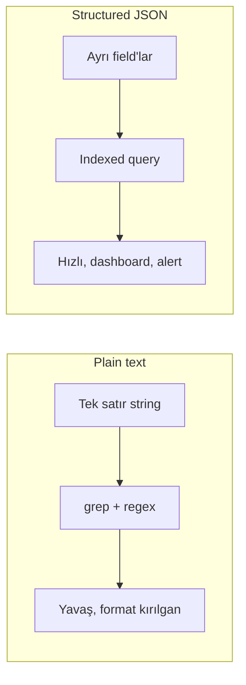
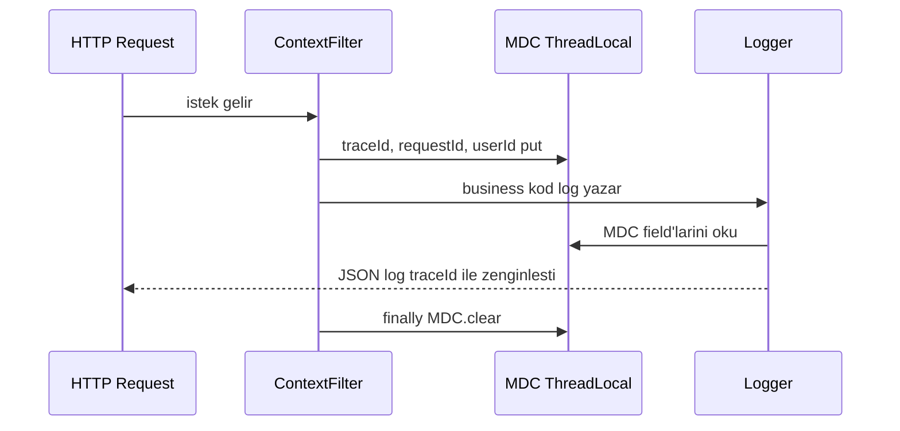
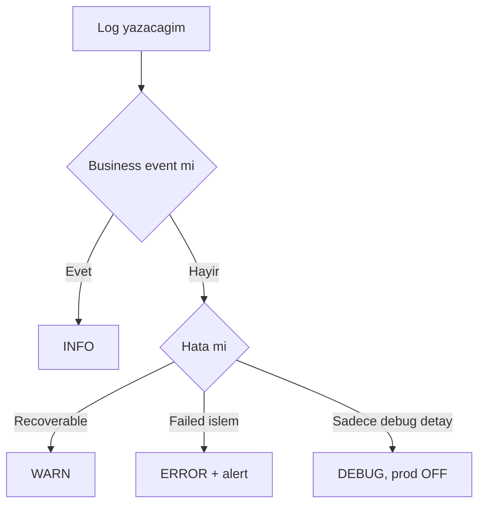
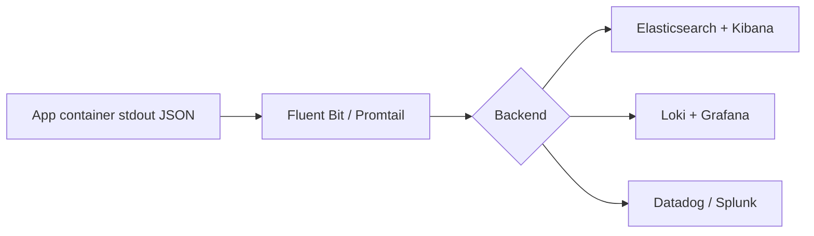

# Topic 9.1 — Structured Logging: Logback + SLF4J + JSON + MDC

```admonish info title="Bu bölümde"
- Plain text log neden aranamaz, structured JSON neden field-level query'lenebilir — production'da hangisi lazım
- SLF4J facade + parameterized logging lazy evaluation ve Logback JSON encoder konfigürasyonu
- MDC ile request context (traceId, userId, accountId) propagation ve thread-pool leak'ini önleyen `MDC.clear()`
- KVKK + PCI-DSS için sensitive data masking: TC kimlik, PAN, Bearer token, password redaction
- Async appender trade-off'ları, log aggregation (ELK / Loki / Datadog) ve banking retention kuralları
```

## Hedef

Banking sisteminin loglarını **production-grade structured JSON** formatına çevirmek. SLF4J + Logback ile JSON logging, MDC ile request context propagation, banking log level stratejisi, sensitive data redaction, log aggregation entegrasyonu (ELK / Loki / Datadog), async appender ile performans, retention. Hedefin: bir incident'te tek `traceId` ile 4 servisin logunu birleştirebilen, hiçbir PII sızdırmayan bir logging katmanı tasarlayabilmek.

## Süre

Okuma: 1.5-2 saat • Kendini Sına: 45 dk • Pratik (opsiyonel): 3-4 saat • Toplam: ~2.5 saat (+ pratik)

## Önbilgi

- SLF4J / Logback / Log4j2 farkını duydun
- JSON formatına aşinasın
- ELK / Loki'nin ne işe yaradığını kabaca biliyorsun

---

## Kavramlar

### 1. Niye structured logging?

Gece 03:00, bir müşteri "transferim gitmedi" diyor ve elinde sadece `grep` var — plain text log burada seni yarı yolda bırakır. Klasik satır şöyle görünür:

```
2024-05-12 10:30:45.123 INFO  c.b.t.TransferService - Transfer initiated for user 12345 from account 67890 amount 1000
```

Bunu aramak `grep "user 12345" app.log | grep "Transfer"` demektir: **yavaş** ve fragile — log format'ı bir gün değişirse bütün parse mantığın bozulur. **Structured JSON** ise her bilgiyi ayrı bir field'a koyar:

```json
{
  "timestamp": "2024-05-12T10:30:45.123Z",
  "level": "INFO",
  "logger": "com.bank.transfer.TransferService",
  "message": "Transfer initiated",
  "service": "transfer-service",
  "userId": "12345",
  "fromAccount": "67890",
  "amount": 1000.00,
  "currency": "TRY",
  "traceId": "abc-123"
}
```

Artık ELK veya Loki üzerinde **field-level query** yapabilirsin: `userId:12345 AND service:transfer-service AND amount:>500`. Farkı bir bakışta gör:



Banking'de fark hayati: bir dolandırıcılık incident'inde "son 5 dakikada 10000 TL üstü, başarısız, aynı IP'den" sorgusunu plain text'te yazmak imkânsıza yakınken, JSON'da tek satır query'dir.

### 2. SLF4J — abstraction layer ve parameterized logging

Kodun doğrudan Logback'e bağlanırsa yarın Log4j2'ye geçmek istediğinde her import'u değiştirmen gerekir; **SLF4J** bu yüzden bir **facade**'dır. Sen `org.slf4j.Logger`'a yazarsın, altta Logback, Log4j2 veya JUL çalışır:

```java
import org.slf4j.Logger;
import org.slf4j.LoggerFactory;

public class TransferService {
    private static final Logger log = LoggerFactory.getLogger(TransferService.class);

    public void transfer(String userId, BigDecimal amount) {
        log.info("Transfer initiated for user {} amount {}", userId, amount);
    }
}
```

Buradaki `{}` sadece okunabilirlik değil — **parameterized message** aynı zamanda **lazy evaluation** demek. Log level filtrelenip elenirse (ör. DEBUG kapalı) string birleştirme hiç çalışmaz:

```java
log.debug("Transfer details: " + transfer.toString());   // ❌ concat + toString HER ZAMAN çalışır
log.debug("Transfer details: {}", transfer);              // ✓ debug kapalıysa toString çağrılmaz
```

<mark>Log çağrılarında string concat yerine `{}` placeholder kullan — level elenirse argümanlar hiç değerlendirilmez.</mark> High-throughput banking'de bu, boşa yapılan milyonlarca `toString()` demektir.

```admonish tip title="İpucu"
Argümanların "pahalı" olduğunda (büyük nesne serialize, DB'den ekstra sorgu) parameterized form fark yaratır. Çok pahalıysa `if (log.isDebugEnabled())` guard'ı da ekleyebilirsin ama `{}` ile çoğu durumda gerek kalmaz.
```

### 3. Logback configuration — banking JSON

Structured JSON'u üretecek olan katman **encoder**'dır; Logstash'in `LogstashEncoder`'ı her log event'ini otomatik JSON'a çevirir. Önce cloud-native yaklaşımın kalbi olan console appender'ı görelim:

```xml
<appender name="JSON_STDOUT" class="ch.qos.logback.core.ConsoleAppender">
    <encoder class="net.logstash.logback.encoder.LogstashEncoder">
        <providers>
            <timestamp><timeZone>UTC</timeZone></timestamp>
            <logLevel/><loggerName/><threadName/><mdc/><message/>
            <pattern>
                <pattern>{"service":"${appName}","version":"${appVersion}","env":"${ENVIRONMENT:-dev}"}</pattern>
            </pattern>
        </providers>
    </encoder>
</appender>
```

Buradaki `<mdc/>` provider'ı kritik: MDC'ye koyduğun her context field'ını otomatik JSON'a enjekte eder (traceId, userId...). `<pattern>` ile de sabit enrichment field'ları (service, version, env) eklersin. Stack trace'i sınırlamak için `ShortenedThrowableConverter` eklenir — sonsuz derinlikte trace log'u boğmasın diye maxDepth ve maxLength verilir.

Synchronous logging her yazımda I/O'yu bloklar; production root'unu bir **async wrapper** ile sararsın:

```xml
<appender name="ASYNC_STDOUT" class="ch.qos.logback.classic.AsyncAppender">
    <appender-ref ref="JSON_STDOUT"/>
    <queueSize>10000</queueSize>
    <discardingThreshold>0</discardingThreshold>   <!-- asla drop etme -->
    <includeCallerData>false</includeCallerData>    <!-- caller data yavaş -->
    <neverBlock>false</neverBlock>                  <!-- queue dolarsa blokla -->
</appender>
```

Son olarak profile-based root: dev'de DEBUG + senkron console, production'da INFO + async, framework logger'ları WARN'a çekilir:

```xml
<springProfile name="production">
    <root level="INFO">
        <appender-ref ref="ASYNC_STDOUT"/>
    </root>
    <logger name="com.bank" level="INFO"/>
    <logger name="org.springframework" level="WARN"/>
    <logger name="org.hibernate.SQL" level="WARN"/>
</springProfile>
```

Bunun için tek bir dependency yeter:

```xml
<dependency>
    <groupId>net.logstash.logback</groupId>
    <artifactId>logstash-logback-encoder</artifactId>
    <version>7.4</version>
</dependency>
```

<details>
<summary>Tam kod: logback-spring.xml (~55 satır)</summary>

```xml
<?xml version="1.0" encoding="UTF-8"?>
<configuration>
    <springProperty scope="context" name="appName" source="spring.application.name"/>
    <springProperty scope="context" name="appVersion" source="info.app.version" defaultValue="unknown"/>

    <!-- JSON console appender (cloud-native) -->
    <appender name="JSON_STDOUT" class="ch.qos.logback.core.ConsoleAppender">
        <encoder class="net.logstash.logback.encoder.LogstashEncoder">
            <providers>
                <timestamp>
                    <timeZone>UTC</timeZone>
                </timestamp>
                <version/>
                <logLevel/>
                <loggerName/>
                <threadName/>
                <mdc/>
                <pattern>
                    <pattern>{
                        "service": "${appName}",
                        "version": "${appVersion}",
                        "env": "${ENVIRONMENT:-dev}"
                    }</pattern>
                </pattern>
                <message/>
                <stackTrace>
                    <throwableConverter class="net.logstash.logback.stacktrace.ShortenedThrowableConverter">
                        <maxDepthPerThrowable>30</maxDepthPerThrowable>
                        <maxLength>2048</maxLength>
                        <shortenedClassNameLength>30</shortenedClassNameLength>
                    </throwableConverter>
                </stackTrace>
            </providers>
        </encoder>
    </appender>

    <!-- File rolling for local dev / archival -->
    <appender name="FILE" class="ch.qos.logback.core.rolling.RollingFileAppender">
        <file>logs/${appName}.log</file>
        <rollingPolicy class="ch.qos.logback.core.rolling.SizeAndTimeBasedRollingPolicy">
            <fileNamePattern>logs/${appName}-%d{yyyy-MM-dd}.%i.log.gz</fileNamePattern>
            <maxFileSize>500MB</maxFileSize>
            <maxHistory>30</maxHistory>
            <totalSizeCap>20GB</totalSizeCap>
        </rollingPolicy>
        <encoder class="net.logstash.logback.encoder.LogstashEncoder"/>
    </appender>

    <!-- Async wrapper — non-blocking -->
    <appender name="ASYNC_STDOUT" class="ch.qos.logback.classic.AsyncAppender">
        <appender-ref ref="JSON_STDOUT"/>
        <queueSize>10000</queueSize>
        <discardingThreshold>0</discardingThreshold>
        <includeCallerData>false</includeCallerData>
        <neverBlock>false</neverBlock>
    </appender>

    <springProfile name="dev">
        <root level="DEBUG">
            <appender-ref ref="JSON_STDOUT"/>
        </root>
    </springProfile>

    <springProfile name="production">
        <root level="INFO">
            <appender-ref ref="ASYNC_STDOUT"/>
        </root>
        <logger name="com.bank" level="INFO"/>
        <logger name="org.springframework" level="WARN"/>
        <logger name="org.hibernate" level="WARN"/>
        <logger name="org.hibernate.SQL" level="WARN"/>
    </springProfile>
</configuration>
```

</details>

### 4. MDC — Mapped Diagnostic Context

Her log satırına elle `traceId` yazmak hem sıkıcı hem hataya açık; **MDC** (Mapped Diagnostic Context) per-thread bir key-value store'dur ve `<mdc/>` provider'ı sayesinde otomatik JSON'a inject edilir. Request'in başında bir filter context'i doldurur:

```java
public class RequestContextFilter extends OncePerRequestFilter {

    @Override
    protected void doFilterInternal(HttpServletRequest req, HttpServletResponse resp,
                                    FilterChain chain) throws ServletException, IOException {
        try {
            String traceId = req.getHeader("traceparent");
            if (traceId == null) traceId = UUID.randomUUID().toString();

            MDC.put("traceId", traceId);
            MDC.put("requestId", UUID.randomUUID().toString());
            MDC.put("requestPath", req.getRequestURI());
            chain.doFilter(req, resp);
        } finally {
            MDC.clear();   // ÇOK ÖNEMLİ — thread pool reuse
        }
    }
}
```

Bundan sonra `log.info("Transfer initiated amount={}", amount)` yazdığında JSON'da `traceId`, `requestId`, `requestPath` field'ları kendiliğinden çıkar — hiçbir ekstra kod olmadan. Akış şöyle işler:



Buradaki `finally` bloğu pazarlık konusu değil. Thread pool worker thread'lerini reuse eder; MDC bir ThreadLocal olduğu için temizlenmezse bir önceki request'in `userId`'si bir sonraki request'in loglarına sızar — banking'de bir müşterinin işlemi başka müşterinin adına loglanır.

<mark>MDC her zaman `finally` bloğunda temizlenmeli — thread pool reuse eski context'i yeni request'e sızdırır.</mark>

```admonish warning title="Thread pool leak — sessiz ve tehlikeli"
`MDC.clear()` unutulursa exception fırlamaz, test yeşil kalır — ama production'da yük altında context'ler karışır. Filter seviyesinde `try-finally` ile tüm request'i sar; servis içinde manuel `MDC.put` yaptıysan orada da `MDC.remove(key)` ile temizle.
```

### 5. Banking-specific MDC fields

Standart `traceId` / `userId`'nin ötesinde, banking domain'inin kendi context anahtarları vardır; bunları bir sabit sınıfında toplamak typo'ları önler:

```java
public final class BankingMdcKeys {
    public static final String TRACE_ID = "traceId";
    public static final String USER_ID = "userId";
    public static final String TENANT = "tenant";
    public static final String ACCOUNT_ID = "accountId";          // Banking
    public static final String TRANSACTION_ID = "transactionId";  // Banking
    public static final String CHANNEL = "channel";               // mobile/web/atm
    public static final String CORRELATION_ID = "correlationId";  // Saga
}
```

Servis method'unda transaction'a özel field'ları ekler, işin sonunda tek tek `remove` edersin (filter tüm request'i `clear` etse de, iç scope'ları erken temizlemek daha doğrudur):

```java
public void transfer(TransferRequest req) {
    MDC.put(BankingMdcKeys.TRANSACTION_ID, transactionId.toString());
    MDC.put(BankingMdcKeys.ACCOUNT_ID, req.fromAccount().toString());
    try {
        log.info("Transfer started amount={} to={}", req.amount(), req.toIban());
        // ... business logic ...
        log.info("Transfer completed");
    } finally {
        MDC.remove(BankingMdcKeys.TRANSACTION_ID);
        MDC.remove(BankingMdcKeys.ACCOUNT_ID);
    }
}
```

Böylece bir transferin tüm logları `transactionId` ile birbirine bağlanır; incident'te tek sorguyla o işlemin bütün yaşam döngüsünü çıkarırsın.

### 6. Log levels — banking strategy

Level seçimi "gürültü mü, sessizlik mi" dengesidir: her şeyi INFO'ya yazarsan storage patlar ve sinyal boğulur, her şeyi DEBUG'a çekersen production'da hem yavaşlar hem devasa hacim üretirsin. Banking pratiğinde her level'ın net bir yeri var:

| Level | Banking kullanımı | Production |
|---|---|---|
| TRACE | Adım adım debug | OFF |
| DEBUG | Detaylı akış bilgisi | OFF (incident'te selective ON) |
| INFO | Business event (transfer initiated, login) | ON |
| WARN | Recoverable (retry, fallback tetiklendi) | ON |
| ERROR | Başarısız işlem, exception | ON, alert |

Production root level **INFO**; Hibernate SQL ve Spring framework verbose oldukları için **WARN**'a çekilir; banking application logger'ı INFO'da kalır. Peki incident anında bir modülü DEBUG'a çekmek gerekirse restart mı? Hayır — Spring Actuator ile runtime'da değiştirilir:

```bash
curl -X POST http://localhost:8080/actuator/loggers/com.bank.transfer \
  -H "Content-Type: application/json" \
  -d '{"configuredLevel": "DEBUG"}'
```

Karar akışını basit bir soru zinciri olarak düşün:



```admonish tip title="Dynamic log level"
Incident sırasında `com.bank.transfer` paketini Actuator ile DEBUG'a çek, kök nedeni bul, sonra tekrar INFO'ya döndür. Bu sayede storage'ı sürekli DEBUG hacmiyle doldurmadan, sadece ihtiyaç anında derin görünürlük elde edersin.
```

### 7. Ne loglanır, ne loglanmaz

Banking'de logging aynı zamanda bir **audit** ve **regülasyon** aracıdır; neyin loglanacağı kadar neyin ASLA loglanmayacağı da kritiktir. Her zaman loglanması gerekenler audit izi bırakır:

- Login (success/fail) + IP + user-agent, logout
- Password change, MFA enroll/disable
- Transfer initiated/completed/failed, card block/unblock, limit değişiklikleri
- Admin actions, authorization failures (403), validation failures (400)
- External API call, saga state transitions

Diğer yanda, log'a yazılması KVKK + PCI-DSS ihlali olan alanlar var. Bunlar ya hiç yazılmaz ya da maskelenir:

| Alan | Kural |
|---|---|
| Şifre (plain/hashed) | Asla |
| TC kimlik no | Mask → `***-TC-***` |
| Card PAN | Mask → `4532-****-****-6467` |
| Card CVV / PIN | Asla |
| Authorization header | Mask → `Bearer ***` |
| Session token / cookie | Asla |
| Account balance | Kaçın, gerekirse mask |

<mark>TC kimlik, PAN, CVV, PIN ve şifre asla plain olarak log'a yazılmaz — bu KVKK ve PCI-DSS ihlalidir.</mark>

```admonish warning title="PII log'a sızarsa geri alınamaz"
Log bir kez ELK/Loki'ye aktığında replika'lara, backup'lara ve cold storage'a yayılır — tek satırı geri silmek pratikte imkânsızdır. Bu yüzden PII'yi kaynakta, encoder seviyesinde maskele; "sonra temizleriz" diye bir şey yoktur. Bir CVV'nin loglara düşmesi PCI-DSS denetiminde doğrudan bulgu (finding) demektir.
```

### 8. Sensitive data masking

Geliştiricinin her `log.info` çağrısında maskelemeyi hatırlamasını beklemek gerçekçi değil; doğru yer **encoder seviyesi** — tüm string field'lar merkezi olarak maskeden geçer. Önce regex tabanlı bir masker:

```java
private static final Pattern TC_KIMLIK = Pattern.compile("\\b\\d{11}\\b");
private static final Pattern PAN = Pattern.compile("\\b\\d{13,19}\\b");
private static final Pattern BEARER = Pattern.compile("(?i)Bearer\\s+[\\w.-]+");
private static final Pattern PASSWORD_QS = Pattern.compile("(?i)(password|pwd|pin)=([^&\\s,]+)");
```

`mask()` metodu her pattern'i sırayla uygular: PAN'ın ilk 4 + son 4 hanesini bırakır (`4532-****-****-6467`), Bearer token'ı `Bearer ***` yapar, password query string'ini `password=***` ile değiştirir. Bu masker'ı Logstash encoder'a bir `JsonGeneratorDecorator` olarak bağlarsın; böylece JSON'a yazılan her string otomatik geçer:

```xml
<encoder class="net.logstash.logback.encoder.LogstashEncoder">
    <jsonGeneratorDecorator class="com.bank.logging.MaskingJsonGeneratorDecorator"/>
</encoder>
```

Decorator, `JsonGenerator`'ın `writeString` çağrısını override eden bir delegate döndürür — tek noktadan tüm çıktıyı süzer:

```java
public class MaskingJsonGenerator extends JsonGeneratorDelegate {
    private static final SensitiveDataMasker MASKER = new SensitiveDataMasker();

    public MaskingJsonGenerator(JsonGenerator delegate) {
        super(delegate, false);
    }

    @Override
    public void writeString(String text) throws IOException {
        super.writeString(MASKER.mask(text));   // her string maskeden geçer
    }
}
```

<details>
<summary>Tam kod: SensitiveDataMasker + Decorator (~45 satır)</summary>

```java
@Component
public class SensitiveDataMasker {

    private static final Pattern TC_KIMLIK = Pattern.compile("\\b\\d{11}\\b");
    private static final Pattern PAN = Pattern.compile("\\b\\d{13,19}\\b");
    private static final Pattern BEARER = Pattern.compile("(?i)Bearer\\s+[\\w.-]+");
    private static final Pattern PASSWORD_QS = Pattern.compile("(?i)(password|pwd|pin)=([^&\\s,]+)");
    private static final Pattern EMAIL = Pattern.compile("\\b[\\w.-]+@[\\w.-]+\\.\\w+\\b");

    public String mask(String input) {
        if (input == null) return null;
        String result = input;
        result = TC_KIMLIK.matcher(result).replaceAll(m ->
            "***-" + m.group().substring(7) + "-***");
        result = PAN.matcher(result).replaceAll(m -> {
            String pan = m.group();
            return pan.substring(0, 4) + "-****-****-" + pan.substring(pan.length() - 4);
        });
        result = BEARER.matcher(result).replaceAll("Bearer ***");
        result = PASSWORD_QS.matcher(result).replaceAll("$1=***");
        result = EMAIL.matcher(result).replaceAll(m -> {
            String email = m.group();
            int at = email.indexOf('@');
            return email.charAt(0) + "***" + email.substring(at);
        });
        return result;
    }
}

public class MaskingJsonGeneratorDecorator implements JsonGeneratorDecorator {

    @Override
    public JsonGenerator decorate(JsonGenerator generator) {
        return new MaskingJsonGenerator(generator);
    }
}

public class MaskingJsonGenerator extends JsonGeneratorDelegate {

    private static final SensitiveDataMasker MASKER = new SensitiveDataMasker();

    public MaskingJsonGenerator(JsonGenerator delegate) {
        super(delegate, false);
    }

    @Override
    public void writeString(String text) throws IOException {
        super.writeString(MASKER.mask(text));
    }
}
```

</details>

### 9. StructuredArguments ve Markers

Mesaj string'ine gömülen değerler ("amount=1000") query'lenemez; `StructuredArguments.kv()` ile her değeri **ayrı bir JSON field** olarak yazarsın:

```java
import static net.logstash.logback.argument.StructuredArguments.*;

log.info("Transfer completed",
    kv("transferId", transferId),
    kv("amount", amount),
    kv("currency", "TRY"),
    kv("durationMs", elapsedMs));
```

Çıktıda `transferId`, `amount`, `currency`, `durationMs` ayrı field olur — `amount:>500` gibi sayısal query artık mümkün. **Marker**'lar ise logları kategoriye ayırıp farklı hedeflere yönlendirmeni sağlar; audit ayrı dosyaya, security SIEM'e gidebilir:

```java
private static final Marker AUDIT = MarkerFactory.getMarker("AUDIT");
private static final Marker SECURITY = MarkerFactory.getMarker("SECURITY");

log.info(AUDIT, "Transfer audit", kv("transferId", id));
log.warn(SECURITY, "Failed login attempt", kv("username", username), kv("ip", ip));
```

Logback config'inde marker'a göre filter tanımlayıp audit loglarını ayrı bir appender'a, security event'lerini SIEM entegrasyonuna yollarsın.

### 10. Async appender — performance

Synchronous logging her `log.info`'da bir I/O yazımını bekler; high-throughput banking'de bu tek başına latency yaratır. **AsyncAppender** log event'lerini bir kuyruğa atar, ayrı bir thread yazar. Ama kuyruk dolarsa ne olacağı bir trade-off'tur:

- `queueSize` küçük → hızlı ama burst'te log drop
- `discardingThreshold=0` → asla drop etme
- `neverBlock=false` → kuyruk dolarsa app bekler (log korunur, app yavaşlar)
- `neverBlock=true` → log drop edip app'i hızlı tutar (banking için tehlikeli)

<mark>Banking'de `neverBlock=false` seçilir — log kaybetmektense uygulamanın kısa süre yavaşlamasını tercih ederiz, çünkü audit izi regülasyon gereğidir.</mark>

```admonish warning title="Log drop = audit boşluğu"
`neverBlock=true` performansı korur ama burst anında — yani tam da en çok log'a ihtiyacın olan incident anında — kayıt düşürür. Banking'de bir audit log'un kaybolması denetimde açıklanamaz bir boşluktur. `queueSize`'ı yeterince büyük (10000) tut, `neverBlock=false` bırak. Daha yüksek throughput gerekiyorsa Log4j2'nin LMAX Disruptor tabanlı `AsyncLogger`'ı değerlendirilebilir.
```

### 11. Log aggregation — ELK / Loki / Datadog

Structured JSON'un asıl değeri, bir aggregation platformunda toplanınca ortaya çıkar. Cloud-native pattern basittir: uygulama **stdout'a JSON** yazar, altyapı gerisini halleder — kod hiçbir log backend'ini bilmez:



Platformlar farklı trade-off'lar sunar: **ELK** (Elasticsearch + Logstash + Kibana) güçlü arama + analytics verir ama storage ağırdır, banking'de yaygındır. **Loki** (Grafana) sadece label'ları indexler, storage ucuzdur, K8s-native'dir, LogQL sorgu dili PromQL'e benzer. **Datadog / Splunk** managed ve premium'dur, büyük organizasyonlarda tercih edilir.

Toplanan loglar üzerinde field-level query yaparsın — Kibana KQL veya LogQL ile:

```
service:transfer-service AND level:ERROR
userId:12345 AND action:LOGIN AND result:FAIL
traceId:"abc-123"
```

Son sorgu incident'in altın anahtarıdır: tek `traceId` ile 4 farklı servisin logunu tek zaman çizgisinde birleştirirsin.

### 12. Banking — log retention

Log ne kadar saklanacak sorusu banking'de teknik değil **regülasyon** kararıdır; BDDK audit logları için yıllarca saklama zorunluluğu getirir:

| Log tipi | Retention |
|---|---|
| Application info/debug | 30-90 gün |
| Application error | 1-2 yıl |
| Audit log | **5-10 yıl** (BDDK) |
| Security event | 5-10 yıl |
| Access log (load balancer) | 6-12 ay |

Bunu maliyet-etkin yönetmenin yolu **tiered storage**'dır: sıcak veri hızlı ama pahalı, eski veri ucuz ama yavaş katmanda tutulur. Hot: 7 gün (Elasticsearch, hızlı query) → Warm: 30 gün (ES warm tier) → Cold: 1 yıl (S3 Glacier) → Archive: 10 yıl (S3 Deep Archive, regülasyon). Böylece 10 yıllık audit yükümlülüğünü, sürekli sıcak indeks maliyetine katlanmadan karşılarsın.

### 13. Banking anti-pattern'leri

Mülakatta "bu logging kodunda ne yanlış?" sorusunun cephaneliği burasıdır. En sık görülenler:

**`System.out.println` / `printStackTrace`** — Log framework'e gitmez, format yok, MDC yok, aggregation yok. `e.printStackTrace()` yerine `log.error("...", e)`.

**String concat parameterized yerine** — `log.info("User " + u + " amount " + a)` lazy evaluation'ı kaçırır; `log.info("User {} amount {}", u, a)` kullan.

**PII unmasked** — TC, PAN, password log'da → KVKK + PCI-DSS ihlali. Encoder seviyesinde masking şart.

**`MDC.clear()` unutmak** — Thread pool reuse eski context'i sızdırır. Filter'da `try-finally`.

**Production'da plain text veya DEBUG level** — ELK/Loki'de plain text etkili değil; DEBUG storage'ı patlatır ve performansı düşürür. JSON + INFO.

**Stack trace silmek** — `log.error("Error happened")` exception'ı yutar; `log.error("Error happened", e)` ile exception object'i pass et, stack trace gitsin.

**Excessive log volume** — Her DB query'yi INFO ile loglamak storage'ı tüketir ve sinyal-gürültü oranını bozar. Bunları DEBUG/TRACE'e düşür.

**Log içinde side-effect** — `log.info("Sent to {}", emailService.send(...))` gibi kodda log statement bir yan etki tetikler; log kapalıysa mail gitmez. Log statement'ları side-effect free olmalı.

---

## Önemli olabilecek araştırma kaynakları

- Logback documentation ve SLF4J user manual
- Logstash Logback Encoder (net.logstash.logback)
- ELK / Loki / Datadog Logs dokümantasyonları
- OWASP Logging Cheat Sheet
- BDDK log retention gereksinimleri
- KVKK log masking rehberliği
- PCI-DSS logging requirements (Requirement 10)

---

## Kendini Sına

Aşağıdaki soruları önce **cevaba bakmadan** kendi cümlelerinle yanıtlamayı dene — hepsi TR bank mülakatlarında karşına çıkabilecek tarzda. Takıldığın soru olursa ilgili Kavramlar başlığına dön, sonra tekrar dene.

**S1. Structured JSON logging ile plain text logging arasındaki farkı banking incident açısından açıkla. Trade-off nedir?**

<details>
<summary>Cevabı göster</summary>

Plain text log tek bir string satırıdır; aramak için `grep` + regex gerekir, yavaştır ve format değişirse parse mantığı kırılır. Structured JSON her bilgiyi ayrı bir field'a koyar (userId, amount, traceId), böylece ELK/Loki üzerinde field-level query yapılabilir: `userId:12345 AND amount:>500`. Incident'te "son 5 dk, 10000 TL üstü, başarısız, aynı IP" gibi sorgular plain text'te neredeyse imkânsızken JSON'da tek satırdır.

Trade-off: JSON logları daha hacimli ve insan gözüyle okunması ham halde daha zordur; ayrıca encoder ve aggregation altyapısı (ELK/Loki) gerektirir. Ama banking'in denetlenebilirlik ve incident response ihtiyacı bu maliyeti fazlasıyla haklı çıkarır — production'da JSON standarttır.

</details>

**S2. MDC nedir, `traceId` gibi bir context field'ı her log satırına nasıl otomatik ekler? `MDC.clear()` neden hayati?**

<details>
<summary>Cevabı göster</summary>

MDC (Mapped Diagnostic Context) per-thread bir key-value store'dur; SLF4J'nin ThreadLocal tabanlı context'idir. Request'in başında bir `OncePerRequestFilter` içinde `MDC.put("traceId", ...)` yaparsın, Logback'in `<mdc/>` provider'ı bu field'ları otomatik JSON'a inject eder. Böylece business kod hiçbir ekstra parametre geçmeden her log satırında traceId, userId taşır.

`MDC.clear()` hayati çünkü thread pool worker thread'lerini reuse eder. MDC bir ThreadLocal olduğundan temizlenmezse bir önceki request'in context'i (ör. userId) bir sonraki request'in loglarına sızar — banking'de bir müşterinin işlemi başka müşteri adına loglanır. Bu yüzden filter'da `try-finally` bloğunda `MDC.clear()` çağrılır; exception fırlatmadığı için ancak test/gözlemle yakalanır.

</details>

**S3. TC kimlik no, PAN ve Bearer token'ın log'a yazılmasını nasıl engellersin? Neden `log.info` çağrısında elle maskelemek yeterli değil?**

<details>
<summary>Cevabı göster</summary>

En sağlam yol encoder seviyesinde merkezi masking'dir: `JsonGeneratorDecorator` ile `writeString` override edilir, JSON'a yazılan her string bir regex tabanlı `SensitiveDataMasker`'dan geçer. TC (11 haneli) `***-...-***`, PAN ilk 4 + son 4 bırakılıp `4532-****-****-6467`, Bearer token `Bearer ***`, `password=xyz` ise `password=***` olur.

Elle maskeleme yetersizdir çünkü tek bir `log.info` çağrısında geliştirici unutursa PII sızar ve log bir kez ELK/Loki'ye aktığında replika, backup ve cold storage'a yayılır — geri silmek pratikte imkânsızdır. Merkezi encoder-level masking, tüm log çıktısını tek noktadan garanti altına alır; bu KVKK ve PCI-DSS (Requirement 10) uyumu için zorunludur.

</details>

**S4. AsyncAppender'da `neverBlock=false` ile `neverBlock=true` arasındaki farkı ve banking'de hangisini neden seçtiğini açıkla.**

<details>
<summary>Cevabı göster</summary>

AsyncAppender log event'lerini bir kuyruğa atar, ayrı thread yazar. `neverBlock=false` ise kuyruk dolduğunda uygulama thread'i log yazılana kadar bekler — log korunur ama app kısa süre yavaşlar. `neverBlock=true` ise kuyruk doluysa log event'i drop edilir — app hızlı kalır ama kayıt düşer.

Banking'de `neverBlock=false` seçilir. Log drop tam da burst anında, yani en çok log'a ihtiyaç duyulan incident sırasında olur; bir audit log'un kaybolması denetimde açıklanamaz bir boşluktur. `discardingThreshold=0` (asla drop) + `queueSize=10000` + `neverBlock=false` kombinasyonu standarttır. Daha yüksek throughput gerekiyorsa Log4j2'nin LMAX Disruptor tabanlı AsyncLogger'ı düşünülür.

</details>

**S5. Production'da incident anında bir modülün log level'ını DEBUG'a çekmen gerekiyor ama uygulamayı restart edemezsin. Ne yaparsın?**

<details>
<summary>Cevabı göster</summary>

Spring Boot Actuator'ın `/actuator/loggers` endpoint'i ile runtime'da level değiştirilir — restart gerekmez. `POST /actuator/loggers/com.bank.transfer` body'sinde `{"configuredLevel": "DEBUG"}` ile sadece ilgili paketi DEBUG'a çekersin, kök nedeni bulursun, sonra tekrar INFO'ya döndürürsün.

Bu yaklaşımın değeri: production root'unu sürekli INFO tutup storage ve performansı korurken, sadece ihtiyaç anında ve dar scope'ta derin görünürlük elde edersin. Tüm sistemi DEBUG'a çekmek storage burst'ü ve performans düşüşü yaratır; selective + geçici DEBUG doğru pratiktir.

</details>

**S6. `log.debug("details: " + obj)` ile `log.debug("details: {}", obj)` arasındaki fark nedir? Neden ikincisi tercih edilir?**

<details>
<summary>Cevabı göster</summary>

Birincisinde string concat ve `obj.toString()` her zaman, DEBUG level kapalı olsa bile çalışır — çünkü argüman metoda geçmeden önce JVM tarafından değerlendirilir. İkincisi parameterized form'dur ve lazy evaluation sağlar: SLF4J önce level'ın aktif olup olmadığına bakar, DEBUG kapalıysa `toString()` hiç çağrılmaz.

Fark high-throughput banking'de anlamlıdır: milyonlarca boşa `toString()` çağrısı CPU ve GC baskısı yaratır, özellikle argüman pahalıysa (büyük nesne serialize, ekstra sorgu). Kural: her log çağrısında `{}` placeholder kullan. Argüman aşırı pahalıysa ek olarak `if (log.isDebugEnabled())` guard'ı da konabilir.

</details>

**S7. Banking'de audit log ile security event log'unu farklı hedeflere (ayrı dosya, SIEM) nasıl yönlendirirsin?**

<details>
<summary>Cevabı göster</summary>

SLF4J `Marker`'ları ile logları etiketlersin: `MarkerFactory.getMarker("AUDIT")` ve `"SECURITY"`. Log çağrısında marker'ı ilk argüman olarak geçersin: `log.info(AUDIT, "Transfer audit", kv("transferId", id))` ve `log.warn(SECURITY, "Failed login", kv("ip", ip))`. Böylece her log event'i hangi kategoriye ait olduğunu taşır.

Logback config'inde marker'a göre `EvaluatorFilter` tanımlayıp appender'lara yönlendirme yaparsın: AUDIT marker'lı loglar ayrı bir dosya appender'ına (uzun retention, BDDK için 5-10 yıl), SECURITY marker'lı loglar ise SIEM entegrasyonuna (Splunk/QRadar) akar. Ana application logu bunlardan bağımsız kendi akışında kalır — üç akış ayrı hedeflere, ayrı retention politikalarıyla gider.

</details>

**S8. StructuredArguments `kv()` kullanmakla değeri doğrudan mesaj string'ine gömmek arasındaki fark nedir?**

<details>
<summary>Cevabı göster</summary>

Değeri mesaja gömersen (`log.info("Transfer amount=" + amount)`) sonuç JSON'da tek bir `message` field'ı olur: `"message": "Transfer amount=1000"`. Bu string'in içinden `amount > 500` gibi sayısal bir sorgu yapamazsın — aggregation platformu onu sadece serbest metin olarak görür.

`StructuredArguments.kv("amount", amount)` ise `amount`'u JSON'da **ayrı, tipli bir field** olarak yazar: `"amount": 1000.00`. Artık `amount:>500 AND currency:TRY` gibi field-level, sayısal query'ler mümkün olur ve dashboard/alert kurulabilir. Banking'de queryable field'lar (transferId, durationMs, amount) `kv()` ile yazılır; serbest açıklama ise mesaj string'inde kalır.

</details>

---

## Tamamlama kriterleri

- [ ] "Kendini Sına" bölümündeki tüm soruları cevaba bakmadan açıklayabiliyorum
- [ ] Structured JSON vs plain text trade-off'unu bir banking incident senaryosuyla anlatabiliyorum
- [ ] SLF4J parameterized logging'in lazy evaluation avantajını 1 dakikada gösterebilirim
- [ ] MDC + `OncePerRequestFilter` ile traceId propagation ve `MDC.clear()` thread-leak'ini açıklayabiliyorum
- [ ] Banking-specific MDC key'lerini (transactionId, accountId, channel) sayabiliyorum
- [ ] Sensitive data masking'i encoder seviyesinde neden yaptığımızı ve TC/PAN/Bearer kurallarını biliyorum
- [ ] Banking log level stratejisini (prod INFO, framework WARN, Actuator ile dynamic DEBUG) anlatabilirim
- [ ] AsyncAppender queueSize + discardingThreshold + neverBlock trade-off'unu açıklayabiliyorum
- [ ] Log aggregation (ELK / Loki / Datadog) + stdout JSON + Fluent Bit K8s pattern'ini çizebilirim
- [ ] Banking retention kurallarını (audit 5-10 yıl BDDK) + tiered storage'ı biliyorum

---

## Defter notları

1. "Structured JSON vs plain text logging banking trade-off: ____."
2. "SLF4J parameterized logging lazy evaluation neden önemli: ____."
3. "MDC per-thread context + `OncePerRequestFilter` pattern: ____, `MDC.clear()` neden `finally`'de: ____."
4. "Banking-specific MDC key'leri (transactionId, accountId, channel): ____."
5. "Sensitive data masking encoder seviyesinde (TC, PAN, Bearer) neden merkezi: ____."
6. "Log level banking stratejisi (prod INFO, framework WARN, Actuator dynamic DEBUG): ____."
7. "StructuredArguments `kv()` explicit field vs mesaj string'ine gömme: ____."
8. "AsyncAppender queueSize + discardingThreshold + neverBlock trade-off, banking seçimi: ____."
9. "Log aggregation (ELK / Loki / Datadog) + stdout JSON + Fluent Bit K8s: ____."
10. "Banking log retention (audit 5-10 yıl BDDK) + tiered storage (hot/warm/cold): ____."

```admonish success title="Bölüm Özeti"
- Structured JSON logging plain text'in aksine field-level query'lenebilir — banking incident'inde `traceId` ile 4 servisin logunu tek zaman çizgisinde birleştirirsin
- SLF4J facade + `{}` parameterized logging lazy evaluation sağlar; Logback `LogstashEncoder` + `<mdc/>` provider ile JSON üretilir
- MDC per-thread context'i traceId/userId/accountId'yi otomatik enjekte eder; `MDC.clear()` `finally`'de olmazsa thread pool reuse context'i sızdırır
- Sensitive data (TC, PAN, Bearer, password) encoder seviyesinde merkezi maskelenir — KVKK + PCI-DSS için pazarlıksız kural
- Production'da async appender (`neverBlock=false`, `discardingThreshold=0`) log kaybını önler; incident'te Actuator ile dynamic DEBUG açılır
- Cloud-native pattern: uygulama stdout'a JSON yazar, Fluent Bit/Promtail toplar, ELK/Loki'ye akar; audit logları BDDK için 5-10 yıl tiered storage'da saklanır
```

---

## Pratik yapmak istersen

Kavramları koda dökmek istersen aşağıdaki iki ek hazır: test yazma rehberi JSON emit, MDC context, masking ve dynamic level için örnek testler içerir; Claude-verify prompt'u ile yazdığın logging katmanını banking-grade perspektiften denetletebilirsin. Uygulaman için önerilen bitiş çizgisi: Logback JSON encoder + RequestContextFilter + masking + async appender + Loki/ELK local stack ayakta ve 8+ integration test yeşil.

<details>
<summary>Test yazma rehberi</summary>

Spring Boot `@ExtendWith(OutputCaptureExtension.class)` ile stdout'u yakalayıp emit edilen JSON'u parse ederek assert edebilirsin. Anahtar testler: JSON format, MDC context, her masking kuralı ve Actuator dynamic level.

```java
@SpringBootTest
@ExtendWith(OutputCaptureExtension.class)
class StructuredLoggingTest {

    private static final Logger log = LoggerFactory.getLogger(StructuredLoggingTest.class);
    @Autowired ObjectMapper mapper;

    @Test
    void shouldEmitJsonLog(CapturedOutput output) throws Exception {
        log.info("Test message {}", "value");

        String json = output.getOut().lines()
            .filter(l -> l.contains("Test message"))
            .findFirst().orElseThrow();

        Map<String, Object> parsed = mapper.readValue(json, Map.class);
        assertThat(parsed).containsEntry("level", "INFO");
        assertThat(parsed).containsEntry("message", "Test message value");
    }

    @Test
    void shouldIncludeMdcContext(CapturedOutput output) {
        MDC.put("userId", "user-123");
        MDC.put("traceId", "trace-abc");
        try {
            log.info("Action");
        } finally {
            MDC.clear();
        }
        assertThat(output.getOut()).contains("\"userId\":\"user-123\"");
        assertThat(output.getOut()).contains("\"traceId\":\"trace-abc\"");
    }

    @Test
    void shouldMaskTcKimlik(CapturedOutput output) {
        log.info("Customer TC: 12345678901");
        assertThat(output.getOut()).doesNotContain("12345678901");
        assertThat(output.getOut()).contains("***-");
    }

    @Test
    void shouldMaskPan(CapturedOutput output) {
        log.info("Card processed: 4532148803436467");
        assertThat(output.getOut()).doesNotContain("4532148803436467");
        assertThat(output.getOut()).contains("4532-****");
    }

    @Test
    void shouldMaskBearerToken(CapturedOutput output) {
        log.info("Authorization: Bearer eyJhbGciOi...");
        assertThat(output.getOut()).doesNotContain("eyJhbGciOi");
        assertThat(output.getOut()).contains("Bearer ***");
    }
}
```

MVC katmanında ise iki davranışı ayrıca doğrula: request bittikten sonra MDC boş kalmalı (thread reuse) ve Actuator ile level değiştirilebilmeli.

```java
@Test
void mdcClearedOnRequestEnd() throws Exception {
    mockMvc.perform(get("/v1/accounts")).andExpect(status().isOk());
    // Request bitti, thread pool'a döndü — MDC boş olmalı
    assertThat(MDC.getCopyOfContextMap()).isNullOrEmpty();
}

@Test
void shouldChangeLogLevelViaActuator() throws Exception {
    mockMvc.perform(post("/actuator/loggers/com.bank")
        .contentType(MediaType.APPLICATION_JSON)
        .content("{\"configuredLevel\": \"DEBUG\"}"))
        .andExpect(status().isNoContent());

    mockMvc.perform(get("/actuator/loggers/com.bank"))
        .andExpect(jsonPath("$.configuredLevel").value("DEBUG"));
}
```

> Bonus — async performans gözlemi: aynı log çağrısını synchronous ve AsyncAppender ile 100000 kez çalıştırıp süreyi karşılaştır. Async'in throughput avantajını ve `queueSize` dolduğunda `neverBlock=false` ile app'in nasıl bloklandığını gözlemle.

> Bonus — Loki local stack: Docker Compose ile Loki + Grafana + Promtail ayağa kaldır. Uygulama stdout JSON üretir, Promtail toplar, Grafana'da LogQL ile sorgula: `{service="transfer-service"} |~ "Transfer initiated"`.

</details>

<details>
<summary>Claude-verify prompt</summary>

```
Structured logging implementation'ımı banking-grade kriterlere göre değerlendir.
Her madde için PASS / FAIL / EKSIK işaretle, kanıt göster, kod yazma:

1. JSON format:
   - Logstash encoder veya benzer JSON encoder?
   - timestamp, level, logger, thread, message standart field'lar?
   - service, version, env enrichment?

2. MDC context:
   - traceId, requestId, userId, tenant standart?
   - Banking-specific (transactionId, accountId, channel)?
   - OncePerRequestFilter setup?
   - MDC.clear() finally block'ta? Thread pool leak riski yok mu?

3. Log levels:
   - Production root INFO?
   - Hibernate SQL ve Spring framework WARN?
   - Actuator ile dynamic level?

4. Masking:
   - TC kimlik regex mask?
   - PAN regex mask (first 4 + last 4)?
   - Bearer token mask?
   - Password/PIN query string mask?
   - Encoder seviyesinde merkezi mi (dağınık elle değil)?

5. Banking content kuralları:
   - Login (success/fail), transfer state transition'ları loglanıyor?
   - Authorization failure'lar?
   - Plain password/CVV/PIN ASLA log'da yok?

6. Performance:
   - AsyncAppender?
   - includeCallerData false?
   - queueSize 5000-10000?
   - neverBlock false (banking — log koru)?

7. Markers:
   - AUDIT marker → ayrı appender / uzun retention?
   - SECURITY marker → SIEM?

8. StructuredArguments:
   - kv() ile explicit queryable field'lar?

9. Aggregation:
   - stdout JSON (cloud-native)?
   - Fluent Bit / Promtail / Filebeat?
   - ELK / Loki / Datadog?

10. Retention:
    - Application log 30-90 gün, audit log 5-10 yıl?
    - Tiered storage (hot/warm/cold)?

11. Anti-pattern:
    - System.out.println / printStackTrace YOK?
    - String concat YOK (parameterized {})?
    - PII unmasked YOK?
    - MDC.clear() unutulmuş YOK?
    - log.error'da stack trace (exception object) pass ediliyor?
```

</details>