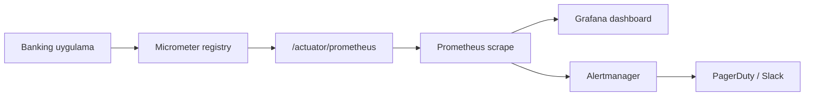
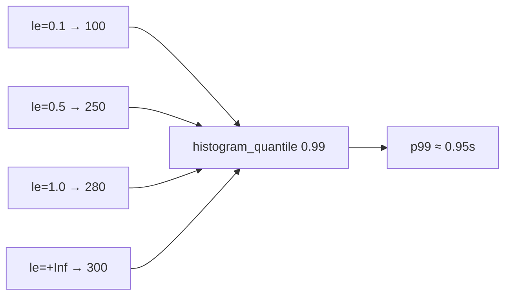
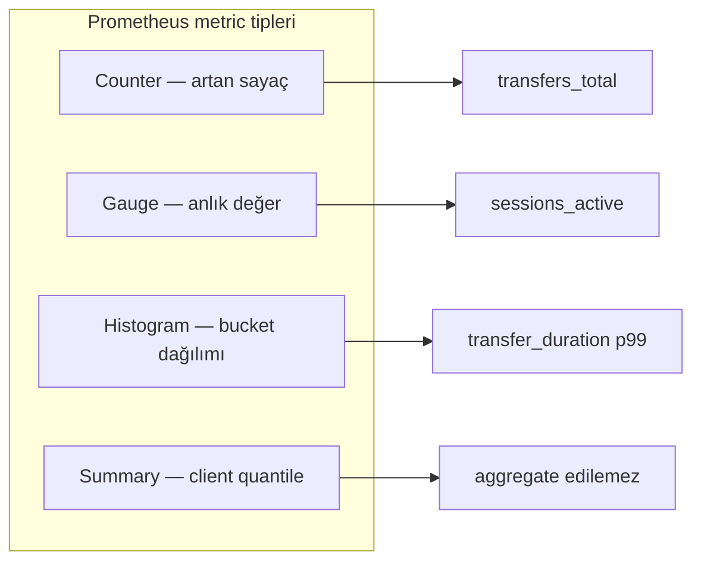
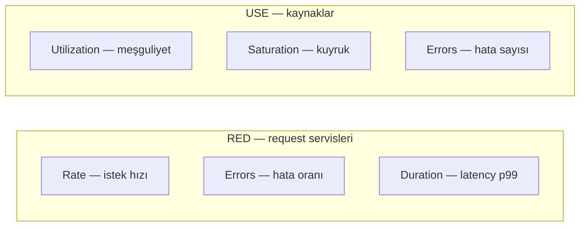

# Topic 9.2 — Metrics: Micrometer + Prometheus + Grafana

```admonish info title="Bu bölümde"
- 3 pillar (log/metric/trace) farkı ve Prometheus'un 4 metric tipi: counter, gauge, histogram, summary
- Micrometer facade ile banking metric yazma: dynamic tag, high-cardinality tuzağı, Timer + percentile histogram
- RED (request servisleri) ve USE (kaynaklar) methodolojisi — hangi metriği ne için ölçersin
- PromQL ile p99 latency, error rate, error budget burn rate; banking domain metrikleri (saga, outbox, kafka lag)
- SLI/SLO/SLA, Alertmanager rule'ları ve Grafana dashboard tasarımı — production-grade gözlemlenebilirlik
```

## Hedef

Banking servisinde **metric** ölçümünü production-grade kurmak: Micrometer abstraction, Prometheus scrape, Grafana dashboard, RED/USE methodolojisi, banking-specific business metric'leri, SLI/SLO/SLA ve alert rule'ları. Mülakatta "p99 latency'yi nasıl ölçersin", "userId'yi neden tag'lemezsin", "counter mı gauge mı" sorularını sebep–sonuç olarak yanıtlayabilmek.

## Süre

Okuma: 2 saat • Kendini Sına: 45 dk • Pratik (opsiyonel): 4 saat • Toplam: ~3 saat (+ pratik)

## Önbilgi

- Topic 9.1 (Structured Logging) bitti
- Prometheus ve Grafana'nın ne işe yaradığını duydun
- Quantile, percentile, histogram kavramlarını temelden biliyorsun

---

## Kavramlar

### 1. 3 pillar — log vs metric vs trace

Neden önemli: yanlış pillar'a yanlış soruyu sormak (metric'te full-text arama, log'da aggregation) hem pahalı hem sonuçsuzdur. Önce üçünün ne işe yaradığını ayır.

**Metric**, "ne kadar / ne sıklıkta / ne kadar süre" sorusunun time-series numeric cevabıdır. Log ile trace'in **özetidir**: tek tek olayları değil, onların toplamını sayar.

| | Log | Metric | Trace |
|---|---|---|---|
| **Veri tipi** | Event (discrete) | Time-series numeric | Distributed call chain |
| **Storage** | Yüksek (TB/gün) | Düşük (compact) | Orta |
| **Query** | Search (full-text) | Aggregation (rate, sum) | Waterfall |
| **Retention** | 30 gün - 10 yıl | 1-2 yıl | 7-30 gün |
| **Banking örnek** | "Transfer initiated for user X" | `transfer_count_total{result="success"} 1234` | "GET /transfers → DB query → Kafka publish" |

Metrik akışı uçtan uca şöyle işler — uygulama sayaçları Micrometer'da tutar, Prometheus bir HTTP endpoint'ten periyodik olarak "scrape" eder, Grafana çizer, Alertmanager uyarır:



Dikkat: Prometheus **pull** modeldir; uygulaman metrikleri push etmez, Prometheus gelip toplar. Kısa ömürlü batch job'lar bu modele uymaz — onlar için Pushgateway var (bkz. anti-pattern'ler).

### 2. Metric types — Prometheus 4 tip

Her tip farklı bir soruya cevap verir; yanlış tip seçmek (latency'yi counter'la ölçmek gibi) veriyi kullanılamaz yapar. Dört tipi banking örnekleriyle ayıralım.

**Counter** monotonik artan bir sayaçtır; sadece process restart'ta sıfırlanır. "Kaç kez oldu" sorusuna cevap verir.

```
http_requests_total{service="account", endpoint="/v1/accounts", status="200"} 12345
```

Banking örnekleri ve PromQL — ham değeri değil, `rate()` ile türevini kullanırsın:

```promql
rate(transfers_total[5m])                      # 5dk window'da TPS
sum(rate(transfers_total[5m])) by (tenant)     # tenant başına TPS
```

- `transfers_total{tenant="TR", currency="TRY", result="success"}`
- `logins_failed_total{reason="invalid_password"}`

**Gauge** yukarı-aşağı hareket eden anlık bir değerdir. "Şu an kaç tane" sorusuna cevap verir.

```
jvm_memory_used_bytes{area="heap"} 524288000
db_connections_active{pool="HikariCP"} 12
```

Banking: `account_balance_total{tenant="TR"}` (toplam bakiye), `loan_portfolio_value{currency="TRY"}`, `active_sessions_count`.

**Histogram** bir dağılımı bucket'lara böler; latency ölçümünün doğru aracıdır. Her `le` (less-or-equal) bucket'ı o eşiğin altındaki gözlem sayısını tutar:

```
http_request_duration_seconds_bucket{le="0.1"} 100
http_request_duration_seconds_bucket{le="0.5"} 250
http_request_duration_seconds_bucket{le="1.0"} 280
http_request_duration_seconds_bucket{le="+Inf"} 300
http_request_duration_seconds_sum 45.6
http_request_duration_seconds_count 300
```

<mark>p99 latency, histogram bucket'larından `histogram_quantile` ile server tarafında hesaplanır</mark> — istemci quantile publish etmesine gerek yoktur:

```promql
histogram_quantile(0.99, rate(http_request_duration_seconds_bucket[5m]))    # p99
```

Bucket'lar birer eşik; `histogram_quantile` bu eşikler arasında interpolasyon yaparak percentile'ı çıkarır:



Banking: `transfer_processing_duration_seconds`, `db_query_duration_seconds{query="account_lookup"}`, `external_api_call_duration_seconds{api="bkm"}`.

**Summary** quantile'leri istemci tarafında önceden hesaplar. Sorunu: <mark>birden fazla servisin quantile'leri matematiksel olarak toplanamaz, bu yüzden banking'de Histogram tercih edilir</mark> — histogram'lar server tarafında aggregate edilebilir.

```admonish warning title="Summary aggregate edilemez"
Üç pod'un p99'unu ortalayarak cluster p99'unu bulamazsın; percentile'lar toplanamaz. Summary tam olarak bunu yapmaya çalışır ve yanlış sonuç verir. Latency için her zaman `publishPercentileHistogram()` ile Histogram kullan; `histogram_quantile` bucket'ları önce toplar, sonra quantile hesaplar — doğru olan budur.
```

Tip özeti bir bakışta:



### 3. Micrometer — vendor-neutral metric facade

Neden önemli: kodun Prometheus'a değil bir abstraction'a bağlanmalı ki yarın Datadog'a geçtiğinde metric kodunu değiştirmeyesin. **Micrometer**, SLF4J'in metric dünyasındaki karşılığıdır — facade sen, backend değişir.

```xml
<dependency>
    <groupId>io.micrometer</groupId>
    <artifactId>micrometer-registry-prometheus</artifactId>
</dependency>
```

Spring Boot Actuator auto-config ile endpoint'i açar, SLO bucket'larını ve common tag'leri tanımlarsın:

```yaml
management:
  endpoints:
    web:
      exposure:
        include: health, info, prometheus, metrics
  metrics:
    distribution:
      percentiles-histogram:
        http.server.requests: true
      slo:
        http.server.requests: 100ms, 200ms, 500ms, 1s, 2s, 5s
    tags:
      application: ${spring.application.name}
      environment: ${ENV:dev}
      region: ${REGION:eu-central-1}
  prometheus:
    metrics:
      export:
        enabled: true
```

`GET /actuator/prometheus` çıktısı — Prometheus'un scrape ettiği düz metin:

```
http_server_requests_seconds_count{method="GET",status="200",uri="/v1/accounts"} 1234
http_server_requests_seconds_sum{method="GET",status="200",uri="/v1/accounts"} 45.6
http_server_requests_seconds_bucket{le="0.01", ...} 100
```

### 4. Micrometer code patterns

Metrikleri koda dökerken kalıp hep aynı: `MeterRegistry`'yi constructor'da al, meter'ı builder ile bir kez oluştur, iş anında `increment()` / `record()` çağır.

**Counter** — bir meter adı, farklı tag'lerle iki ayrı seri:

```java
public TransferService(MeterRegistry registry) {
    this.transfersSuccess = Counter.builder("banking.transfers")
        .description("Number of transfers processed")
        .tag("result", "success")
        .baseUnit("transfers")
        .register(registry);
    this.transfersFailed = Counter.builder("banking.transfers")
        .tag("result", "failed")
        .register(registry);
}
```

İş anında try/catch ile hangi sonuç olduysa o counter artırılır:

```java
public void transfer(...) {
    try {
        // ... business
        transfersSuccess.increment();
    } catch (Exception e) {
        transfersFailed.increment();
        throw e;
    }
}
```

<details>
<summary>Tam kod: TransferService counter (~28 satır)</summary>

```java
@Service
public class TransferService {

    private final Counter transfersSuccess;
    private final Counter transfersFailed;

    public TransferService(MeterRegistry registry) {
        this.transfersSuccess = Counter.builder("banking.transfers")
            .description("Number of transfers processed")
            .tag("result", "success")
            .baseUnit("transfers")
            .register(registry);
        this.transfersFailed = Counter.builder("banking.transfers")
            .tag("result", "failed")
            .register(registry);
    }

    public void transfer(...) {
        try {
            // ... business
            transfersSuccess.increment();
        } catch (Exception e) {
            transfersFailed.increment();
            throw e;
        }
    }
}
```

</details>

**Counter with dynamic tags** — buradaki tek kural kardinaliteyi düşük tutmak. Sadece sonlu değer alan alanları tag'le:

```java
Counter.Builder builder = Counter.builder("banking.transfers")
    .tag("currency", currency)    // OK: TRY, USD, EUR (low cardinality)
    .tag("type", type)            // OK: EFT, FAST, SWIFT
    .tag("tenant", tenant);       // OK: TR, DE
    // .tag("userId", userId)     // ❌ HIGH cardinality (millions)
```

Banking kardinalite bütçesi: `currency` ~10, `tenant` ~5, `transfer_type` ~5, `result` 2-3, `endpoint` ~50. <mark>`userId`, `accountId`, `transferId` gibi sınırsız alanlar asla tag olmaz — Prometheus bellek patlaması demektir.</mark>

```admonish warning title="High cardinality tuzağı"
Her benzersiz tag kombinasyonu Prometheus'ta ayrı bir time-series yaratır. `userId` tag'lersen milyonlarca seri oluşur; Prometheus RAM'i dolar, scrape yavaşlar, sorgular timeout olur. Rule of thumb: metric başına tag kombinasyonu < 100; banking'de < 10 hedefle. Yüksek kardinaliteli boyutlar (userId, IBAN, transferId) log ve trace'e ait — metric'e değil.
```

**Gauge** bir fonksiyona bağlanır ve **lazy evaluation** yapar; Prometheus scrape ettiği anda fonksiyon çalışır, o anki değeri okur:

```java
@Component
public class ActiveSessionGauge {

    private final SessionRepository sessionRepo;

    public ActiveSessionGauge(MeterRegistry registry, SessionRepository sessionRepo) {
        this.sessionRepo = sessionRepo;
        Gauge.builder("banking.sessions.active", this, g -> g.sessionRepo.countActive())
            .description("Currently active user sessions")
            .register(registry);
    }
}
```

**Timer + Histogram** — latency ölçmenin doğru yolu. Builder'da percentile histogram ve SLO bucket'larını banking workload'ına göre ayarlarsın:

```java
this.transferTimer = Timer.builder("banking.transfer.duration")
    .description("Transfer processing time")
    .publishPercentiles(0.5, 0.95, 0.99, 0.999)
    .publishPercentileHistogram()
    .serviceLevelObjectives(
        Duration.ofMillis(100), Duration.ofMillis(500),
        Duration.ofSeconds(1), Duration.ofSeconds(2))
    .minimumExpectedValue(Duration.ofMillis(1))
    .maximumExpectedValue(Duration.ofSeconds(30))
    .register(registry);
```

İş kodunu `record()` içine sararsın; timer süreyi otomatik ölçer:

```java
public Transfer transfer(...) {
    return transferTimer.record(() -> {
        // ... business
        return result;
    });
}
```

**`@Timed` annotation** ile aynı işi declarative yaparsın — endpoint'ler için pratik:

```java
@PostMapping("/transfers")
@Timed(value = "banking.transfer.api",
       description = "Transfer API duration",
       percentiles = {0.5, 0.95, 0.99})
public Transfer transfer(...) { ... }
```

```admonish tip title="Histogram bucket'ları workload'a göre"
SLO bucket'larını rastgele seçme; gerçek latency dağılımına oturt. Banking transfer'i 1-30 sn arası ise `[0.001, 0.01, 0.1, 1, 10, 100]` yanlıştır — çoğu gözlem tek bucket'a düşer, percentile çözünürlüğü kaybolur. Doğrusu SLO eşiklerini içeren bir dizi: `[0.01, 0.05, 0.1, 0.5, 1, 2, 5, 10, 30]`.
```

### 5. RED method — request-driven servisler

Neden önemli: her request servisi için "neyi izleyeyim" sorusunun standart cevabı RED'dir; üç metrik bir endpoint'in sağlığını özetler.

- **R**ate — saniyedeki istek
- **E**rrors — hata oranı
- **D**uration — latency (p50/p99)

Banking transfer endpoint'i için üçü de PromQL ile:

```promql
# Rate
rate(http_server_requests_seconds_count{uri="/v1/transfers"}[5m])

# Errors (5xx oranı)
rate(http_server_requests_seconds_count{uri="/v1/transfers", status=~"5.."}[5m])
/ rate(http_server_requests_seconds_count{uri="/v1/transfers"}[5m])

# Duration (p99)
histogram_quantile(0.99, rate(http_server_requests_seconds_bucket{uri="/v1/transfers"}[5m]))
```

### 6. USE method — resource-driven sistemler

RED istek akışını izler; **USE** ise altındaki kaynakları (DB pool, thread pool, CPU) izler. İkisi birbirini tamamlar.

- **U**tilization — % meşgul
- **S**aturation — kuyruk derinliği
- **E**rrors — hata sayısı



Banking DB pool ve thread pool için USE:

```promql
# DB pool
hikaricp_connections_active / hikaricp_connections_max     # Utilization
hikaricp_connections_pending                               # Saturation
rate(hikaricp_connections_timeout_total[5m])               # Errors

# Thread pool
executor_active_threads / executor_pool_max_threads
executor_queued_tasks
rate(executor_rejected_tasks_total[5m])
```

### 7. Banking domain metrics — RED/USE ötesi

RED/USE altyapıyı ölçer ama "kaç transfer başarısız oldu", "kaç saga takıldı" iş sorularını ölçmez. Bunlar için domain metric'leri tanımlarsın.

**Business metrics:**

```
banking_transfers_total{tenant, currency, type, result}
banking_transfer_amount_total{tenant, currency}    (sum of amounts — dikkat)
banking_logins_total{result, mfa_used}
banking_logins_failed_total{reason}
banking_mfa_challenges_total{method, result}
banking_cards_blocked_total{reason}
banking_password_reset_total{result}
banking_fraud_alerts_total{severity, type}
```

**Saga metrics** — distributed transaction sağlığı:

```
saga_started_total{saga_type}
saga_completed_total{saga_type, result}
saga_stuck_count{saga_type}    (gauge — X saniyeden fazla takılı)
saga_compensation_total{saga_type}
saga_duration_seconds{saga_type, result}
```

**Outbox metrics** — dual-write bütünlüğü:

```
outbox_pending_count
outbox_published_total
outbox_publish_duration_seconds
outbox_stale_count   (5 dk önce oluştu, hâlâ publish edilmedi — alert!)
```

**Kafka consumer metrics:**

```
kafka_consumer_lag{topic, group, partition}
kafka_consumer_committed_offset
kafka_consumer_records_consumed_total
kafka_consumer_rebalance_total
```

Bunları Prometheus Kafka exporter ya da `KafkaClientMetrics` ile alırsın.

**External API metrics:**

```
external_api_call_total{provider, endpoint, result}
external_api_call_duration_seconds{provider, endpoint}
external_api_circuit_breaker_state{provider}
external_api_circuit_breaker_calls_total{provider, state}
```

### 8. Spring Boot pre-built metrics

Çoğu şeyi elle yazmana gerek yok; Actuator out-of-the-box şunları expose eder:

- `http.server.requests` (endpoint başına timer)
- `jvm.memory.used`, `jvm.gc.pause`, `jvm.threads.live`
- `process.cpu.usage`, `system.cpu.usage`
- `hikaricp.connections.active/idle/max`
- `kafka.consumer.records-consumed-rate`
- `spring.security.filterchains` (Spring Security 6)
- `cache.gets/puts/evictions` (Spring Cache)

Minimal config bunların hepsini açar; sen sadece domain metric'lerini eklersin.

### 9. Prometheus setup

Prometheus'u docker-compose ile kaldırır, retention ve config reload'ı ayarlarsın:

```yaml
# docker-compose.yml
services:
  prometheus:
    image: prom/prometheus:latest
    ports: ['9090:9090']
    volumes:
      - ./prometheus.yml:/etc/prometheus/prometheus.yml
    command:
      - --config.file=/etc/prometheus/prometheus.yml
      - --storage.tsdb.retention.time=15d
      - --storage.tsdb.retention.size=10GB
      - --web.enable-lifecycle    # config reload via API
```

Config'in kalbi scrape ve alerting; K8s'te pod'ları annotation ile keşfedersin:

```yaml
# prometheus.yml — özet
global:
  scrape_interval: 15s
  external_labels:
    cluster: banking-prod
    region: eu-central-1

scrape_configs:
  - job_name: 'banking-services'
    metrics_path: /actuator/prometheus
    kubernetes_sd_configs:
      - role: pod
    relabel_configs:
      - source_labels: [__meta_kubernetes_pod_annotation_prometheus_io_scrape]
        action: keep
        regex: true
```

<details>
<summary>Tam kod: prometheus.yml (~30 satır)</summary>

```yaml
# prometheus.yml
global:
  scrape_interval: 15s
  evaluation_interval: 15s
  external_labels:
    cluster: banking-prod
    region: eu-central-1

rule_files:
  - "rules/*.yml"

alerting:
  alertmanagers:
    - static_configs:
        - targets: ['alertmanager:9093']

scrape_configs:
  - job_name: 'banking-services'
    metrics_path: /actuator/prometheus
    kubernetes_sd_configs:
      - role: pod
    relabel_configs:
      - source_labels: [__meta_kubernetes_pod_annotation_prometheus_io_scrape]
        action: keep
        regex: true
      - source_labels: [__meta_kubernetes_pod_label_app]
        target_label: service
```

</details>

Pod'ları scrape ettirmek için deployment'a annotation ekle:

```yaml
metadata:
  annotations:
    prometheus.io/scrape: "true"
    prometheus.io/port: "8080"
    prometheus.io/path: "/actuator/prometheus"
```

### 10. PromQL banking örnekleri

PromQL, metriklerden anlam çıkardığın sorgu dili. Sık kullanacağın banking sorguları:

```promql
# Transfer TPS son 5 dk
sum(rate(banking_transfers_total[5m]))

# Tenant başına
sum by (tenant) (rate(banking_transfers_total[5m]))

# Error rate %
sum(rate(banking_transfers_total{result="failed"}[5m]))
/ sum(rate(banking_transfers_total[5m])) * 100

# p99 transfer latency
histogram_quantile(0.99,
  sum by (le) (rate(banking_transfer_duration_seconds_bucket[5m])))

# Apdex score (200ms target, 800ms tolerable)
(
  sum(rate(http_server_requests_seconds_bucket{le="0.2"}[5m])) +
  sum(rate(http_server_requests_seconds_bucket{le="0.8"}[5m])) / 2
) / sum(rate(http_server_requests_seconds_count[5m]))

# DB pool exhaustion
hikaricp_connections_active / hikaricp_connections_max > 0.9

# Saga stuck — banking critical
saga_stuck_count > 0

# Outbox stale — dual-write issue
outbox_stale_count > 100

# Kafka consumer lag
sum by (topic, group) (kafka_consumer_lag)

# Top 5 slow endpoint
topk(5, histogram_quantile(0.95,
  sum by (uri, le) (rate(http_server_requests_seconds_bucket[5m]))))

# Geçen seneye göre transfer volume
sum(rate(banking_transfers_total[7d]))
/ sum(rate(banking_transfers_total[7d] offset 1y))
```

### 11. SLI / SLO / SLA — banking

Neden önemli: "performans iyi" subjektiftir; SLO onu ölçülebilir bir hedefe çevirir ve error budget ile ne zaman yavaşlaman gerektiğini söyler.

| | Anlam | Banking örnek |
|---|---|---|
| **SLI** (Indicator) | Ne ölçüyoruz | "Transfer p99 latency" |
| **SLO** (Objective) | Hedef | "p99 < 500 ms 30 günde" |
| **SLA** (Agreement) | Kontrat (penalty) | "99.9% uptime monthly, missed → service credit" |

Banking SLO örnekleri: Login p95 < 1s %99; Transfer p99 < 2s %99; Account balance p99 < 500ms %99.9; Availability monthly > 99.95%; Error rate < 0.1%.

**Error budget**, SLO'nun izin verdiği "hata payı"dır:

```
SLO: 99.9% availability monthly
Total minutes in month: 30 * 24 * 60 = 43200
Allowed downtime: 43200 * 0.001 = 43.2 min/month
→ Bu senin error budget'in
```

Budget'i ne hızla tükettiğini burn rate ile izlersin — 14x burn, budget'in çok hızlı erimesi demektir:

```promql
# Burn rate son 1 saat
(1 - (
  sum(rate(http_server_requests_seconds_count{status!~"5.."}[1h]))
  / sum(rate(http_server_requests_seconds_count[1h]))
)) / 0.001 > 14   # 14x burn → critical
```

### 12. Alertmanager rules — banking

Alert'ler PromQL sorgularının belli bir süre (`for`) eşiği aşmasına bağlanır. Tek bir alert'in anatomisi:

```yaml
- alert: HighErrorRate
  expr: |
    sum(rate(http_server_requests_seconds_count{status=~"5.."}[5m]))
    / sum(rate(http_server_requests_seconds_count[5m])) > 0.01
  for: 5m
  labels:
    severity: critical
    team: banking-backend
  annotations:
    summary: "Error rate > 1% for 5 minutes"
    runbook: "https://wiki.bank/runbook/high-error-rate"
```

`severity` label'ı yönlendirmeyi belirler: critical = page (PagerDuty), high = email, warning = dashboard. Banking için kritik alert seti aşağıda.

<details>
<summary>Tam kod: rules/banking-alerts.yml (~72 satır)</summary>

```yaml
# rules/banking-alerts.yml
groups:
  - name: banking-critical
    rules:
      - alert: HighErrorRate
        expr: |
          sum(rate(http_server_requests_seconds_count{status=~"5.."}[5m]))
          / sum(rate(http_server_requests_seconds_count[5m])) > 0.01
        for: 5m
        labels:
          severity: critical
          team: banking-backend
        annotations:
          summary: "Error rate > 1% for 5 minutes"
          description: "Service {{ $labels.service }} error rate: {{ $value | humanizePercentage }}"
          runbook: "https://wiki.bank/runbook/high-error-rate"

      - alert: TransferP99Slow
        expr: |
          histogram_quantile(0.99,
            sum by (le) (rate(banking_transfer_duration_seconds_bucket[5m]))) > 2
        for: 10m
        labels:
          severity: high
          team: banking-backend

      - alert: DbPoolExhausted
        expr: hikaricp_connections_active / hikaricp_connections_max > 0.95
        for: 2m
        labels:
          severity: high

      - alert: SagaStuck
        expr: saga_stuck_count > 0
        for: 5m
        labels:
          severity: critical
          team: banking-backend
        annotations:
          summary: "Saga stuck for > 5 minutes"

      - alert: OutboxStale
        expr: outbox_stale_count > 100
        for: 3m
        labels:
          severity: high

      - alert: KafkaConsumerLagHigh
        expr: sum by (topic, group) (kafka_consumer_lag) > 10000
        for: 5m
        labels:
          severity: high

      - alert: ErrorBudgetBurnRate
        expr: |
          (1 - (
            sum(rate(http_server_requests_seconds_count{status!~"5.."}[1h]))
            / sum(rate(http_server_requests_seconds_count[1h]))
          )) / 0.001 > 14
        for: 2m
        labels:
          severity: critical
          paging: true

      - alert: BruteForceAttack
        expr: rate(banking_logins_failed_total[1m]) > 50
        for: 1m
        labels:
          severity: critical
          team: security
```

</details>

Alertmanager bu alert'leri routing kurallarına göre Slack / PagerDuty / Opsgenie'ye iletir.

### 13. Grafana dashboards — banking

Dashboard'lar metrikleri role göre gruplar; bir SRE'nin baktığı ile bir risk ekibinin baktığı farklıdır. Banking'de dört tipik dashboard:

**Dashboard 1: Service overview** — Request rate (RED), error rate %, p50/p95/p99 latency, CPU/memory/threads, DB pool.

**Dashboard 2: Banking business** — Transfers TPS (tenant/currency/type), login success/fail, MFA challenges, active sessions, fraud alerts, card operations.

**Dashboard 3: Distributed system** — Saga stuck/completed/compensated, outbox pending/stale, Kafka lag, circuit breaker state, cross-service trace count.

**Dashboard 4: SLO** — Her SLO % vs target, error budget remaining, burn rate.

Dashboard'ları as-code yönetirsin — JSON dosyaları git'te version controlled:

```yaml
# dashboards.yml
apiVersion: 1
providers:
  - name: banking
    orgId: 1
    folder: 'Banking'
    type: file
    options:
      path: /var/lib/grafana/dashboards
```

### 14. Banking anti-pattern'leri

Mülakatta "bu metric setup'ta ne yanlış" sorusunun cephaneliği. On klasik:

**Anti-pattern 1: High cardinality tags** — `.tag("userId", userId)` milyonlarca seri, Prometheus memory patlar. Tag kardinalite < 100 (genel), < 10 (banking).

**Anti-pattern 2: Sensitive amount'u Prometheus'ta toplamak** — `amountCounter.increment(transferAmount.doubleValue())` tutarları görünür kılar ama PII/aggregable veriyi metric'e taşır. Banking'de tutar toplamı log/DB'de kalır; Prometheus'ta sadece **count + bucket**.

**Anti-pattern 3: Yanlış histogram bucket'ları** — 1-30 sn'lik transfer için `[0.001, 0.01, 0.1, 1, 10, 100]` yanlış; `[0.01, 0.05, 0.1, 0.5, 1, 2, 5, 10, 30]` doğru. Bucket'lar workload'a göre.

**Anti-pattern 4: Summary'i aggregate edilebilir sanmak** — Çok servisin quantile'i toplanamaz; Histogram + `histogram_quantile` kullan.

**Anti-pattern 5: Counter reset olmaz sanmak** — Process restart counter'ı sıfırlar. <mark>Ham counter farkını alma; `rate()` reset'i handle eder.</mark>

**Anti-pattern 6: Pushgateway misuse** — Pushgateway sadece short-lived job için; long-running servis pull model kullanır. Banking batch job → pushgateway OK.

**Anti-pattern 7: Tag set production'da değişir** — `.tag("env", System.getenv("ENV"))` bazen dev bazen prod → aynı metric, farklı tag, series chaos. Tag set sabit olmalı.

**Anti-pattern 8: Alert noise** — Critical/high/warning karışık. Banking: critical = page, high = email, warning = dashboard.

**Anti-pattern 9: SLO yok** — "Performance OK" subjektif; SLO + error budget = objective.

**Anti-pattern 10: Scrape interval çok kısa** — `scrape_interval: 1s` storage patlatır. Banking 15-30s tipik.

---

## Önemli olabilecek araştırma kaynakları

- Micrometer documentation
- Prometheus best practices
- Brendan Gregg — USE method
- Tom Wilkie — RED method
- Google SRE book — SLO/SLI
- Grafana documentation
- BDDK operasyonel risk yönetimi

---

## Kendini Sına

Aşağıdaki soruları önce **cevaba bakmadan** kendi cümlelerinle yanıtlamayı dene — hepsi banking mülakatlarında karşına çıkabilecek tarzda. Takıldığında ilgili Kavramlar başlığına dön, sonra tekrar dene.

**S1. Counter, gauge ve histogram arasındaki fark nedir? Her biri için bir banking metriği örneği ver.**

<details>
<summary>Cevabı göster</summary>

Counter monotonik artan bir sayaçtır, sadece "kaç kez oldu" sorusuna cevap verir ve process restart'ta sıfırlanır — örnek `banking_transfers_total`. Gauge yukarı-aşağı hareket eden anlık değerdir, "şu an kaç tane" sorusuna cevap verir — örnek `banking_sessions_active` veya `hikaricp_connections_active`. Histogram bir dağılımı `le` bucket'larına böler, latency gibi süre dağılımlarını ölçer — örnek `banking_transfer_duration_seconds`.

Kural: sayılan olaylar counter, anlık durum gauge, süre/boyut dağılımı histogram. Latency'yi asla counter veya gauge ile ölçme; percentile çıkaramazsın.

</details>

**S2. Metric tag'lerinde high cardinality neden problem? Hangi banking alanlarını tag'lemezsin?**

<details>
<summary>Cevabı göster</summary>

Her benzersiz tag kombinasyonu Prometheus'ta ayrı bir time-series yaratır. `userId` gibi sınırsız (unbounded) bir alanı tag'lersen milyonlarca seri oluşur; Prometheus RAM'i dolar, scrape yavaşlar, sorgular timeout olur — "cardinality explosion".

`userId`, `accountId`, `transferId`, `IBAN` gibi benzersiz değerler asla tag olmaz; bunlar log ve trace'e aittir. Sadece sonlu değer alan boyutları tag'le: `currency` (~10), `tenant` (~5), `result` (2-3), `type` (~5). Rule of thumb: metric başına tag kombinasyonu < 100, banking'de < 10.

</details>

**S3. p99 transfer latency'yi nasıl hesaplarsın? İstemci p99'u kendisi mi hesaplar?**

<details>
<summary>Cevabı göster</summary>

Histogram kullanırsın: uygulama süreleri `le` bucket'larına dağıtır (`..._bucket{le="0.5"}` gibi), Prometheus bu bucket'ları scrape eder. p99'u server tarafında `histogram_quantile` çıkarır — bucket eşikleri arasında interpolasyon yaparak:

```promql
histogram_quantile(0.99,
  sum by (le) (rate(banking_transfer_duration_seconds_bucket[5m])))
```

İstemci p99'u kendisi hesaplamaz; `publishPercentileHistogram()` ile bucket üretir, quantile hesabı Prometheus'ta yapılır. Bunun avantajı: birden fazla pod'un bucket'ları `sum by (le)` ile toplanabilir, sonra quantile alınır — cluster geneli p99 doğru çıkar.

</details>

**S4. Histogram ile Summary farkı nedir? Banking'de neden Histogram tercih edilir?**

<details>
<summary>Cevabı göster</summary>

Histogram gözlemleri bucket'lara dağıtır ve quantile'ı server tarafında (`histogram_quantile`) hesaplatır. Summary ise quantile'ı istemci tarafında önceden hesaplar ve öyle expose eder.

Kritik fark: percentile'lar matematiksel olarak toplanamaz. Üç pod'un Summary p99'unu ortalayarak cluster p99'unu bulamazsın — yanlış olur. Histogram'da bucket'lar toplanabilir olduğu için önce `sum by (le)` yapıp sonra quantile alırsın; bu doğru cluster-geneli percentile verir. Banking'de servisler çok replikalı çalıştığı için Histogram tercih edilir.

</details>

**S5. RED ve USE method nedir? Hangisini ne için kullanırsın?**

<details>
<summary>Cevabı göster</summary>

RED request-driven servisler için: **R**ate (saniyedeki istek), **E**rrors (hata oranı), **D**uration (latency p50/p99). Bir HTTP endpoint'in sağlığını üç metrikle özetler — "kullanıcı ne yaşıyor" sorusuna cevap verir.

USE resource-driven sistemler için: **U**tilization (% meşgul), **S**aturation (kuyruk derinliği), **E**rrors (hata sayısı). DB connection pool, thread pool, CPU gibi kaynakların durumunu ölçer — "kaynak tükeniyor mu" sorusuna cevap verir. İkisi tamamlayıcıdır: endpoint yavaşladığında RED semptomu, USE ise nedeni (örneğin `hikaricp_connections_pending` yüksek) gösterir.

</details>

**S6. Counter process restart'ta sıfırlanıyor. `rate()` neden gerekli, ham counter farkı almak neden yanlış?**

<details>
<summary>Cevabı göster</summary>

Counter monotonik artar ama process restart'ta 0'a döner. İki scrape arasındaki ham farkı (`counter_now - counter_before`) alırsan, arada bir restart olduğunda negatif veya anlamsız bir değer çıkar — örneğin 9000'den 50'ye düşmüş görünür.

`rate()` bu reset'i otomatik handle eder: sayacın azaldığını görünce bunu bir restart olarak yorumlar ve artışı doğru hesaplar, ayrıca sonucu saniye başına normalize eder (TPS gibi). Bu yüzden counter'ları her zaman `rate()` veya `increase()` ile sorgularsın, ham değerle değil.

</details>

**S7. SLI, SLO, SLA nedir ve error budget burn rate ne işe yarar?**

<details>
<summary>Cevabı göster</summary>

SLI ölçtüğün gösterge (transfer p99 latency), SLO bunun hedefi (p99 < 500ms, 30 günde), SLA ise müşteriyle kontrat ve ihlalinde penalty (99.9% uptime, aksi halde service credit). SLI ölçüm, SLO iç hedef, SLA dış taahhüt.

Error budget SLO'nun izin verdiği hata payıdır: %99.9 availability ayda ~43 dk downtime demektir. Burn rate bu bütçeyi ne hızla tükettiğini gösterir; 14x burn rate, bütçenin normalden 14 kat hızlı eridiğini söyler ve critical alert tetikler. Amaç: bütçe erimeden önce deploy'u durdurup güvenilirliğe odaklanmak.

</details>

---

## Tamamlama kriterleri

- [ ] 3 pillar (log/metric/trace) farkını ve her birinin ne için kullanıldığını anlatabiliyorum
- [ ] Counter/gauge/histogram/summary'i banking örnekleriyle ayırt edebiliyorum
- [ ] High cardinality problemini ve hangi alanların tag'lenmeyeceğini açıklayabiliyorum
- [ ] p99 latency'nin histogram bucket'larından `histogram_quantile` ile nasıl çıktığını biliyorum
- [ ] RED ve USE method'un ne için kullanıldığını ve banking PromQL örneklerini yazabiliyorum
- [ ] Histogram vs Summary tercihini (aggregate edilebilirlik) gerekçesiyle savunabiliyorum
- [ ] SLI/SLO/SLA ve error budget burn rate'i banking bağlamında açıklayabiliyorum
- [ ] Metric anti-pattern'lerinden en az 5'ini (cardinality, sensitive sum, counter reset, scrape interval, SLO yokluğu) sayabiliyorum
- [ ] (Opsiyonel) "Pratik yapmak istersen" bölümündeki testleri yazdım ve Claude-verify prompt'uyla doğrulattım

---

## Defter notları

1. "3 pillar log/metric/trace farkı + retention farkı: ____."
2. "Prometheus 4 metric type + Histogram vs Summary banking pick: ____."
3. "Counter tag banking (tenant, currency, result, type) cardinality budget + yasak alanlar: ____."
4. "Timer percentile_histogram + SLO bucket banking-tuned: ____."
5. "RED method (Rate, Errors, Duration) banking endpoint PromQL: ____."
6. "USE method (Util, Sat, Errors) DB pool + thread pool: ____."
7. "Banking domain metrics (transfers, logins, sagas, outbox, kafka_lag): ____."
8. "PromQL p99 latency + error rate + burn rate query: ____."
9. "SLO/SLI/SLA + error budget burn rate banking: ____."
10. "Alert critical/high/warning + Alertmanager → PagerDuty/Slack: ____."

```admonish success title="Bölüm Özeti"
- Metric, log ve trace'in numeric özetidir; Prometheus **pull** modelle `/actuator/prometheus`'tan scrape eder, Grafana çizer, Alertmanager uyarır
- 4 tip: counter (sayılan olay), gauge (anlık durum), histogram (latency dağılımı — banking tercihi), summary (aggregate edilemez, kaçın)
- Micrometer vendor-neutral facade'dır; kardinaliteyi düşük tut — `userId`/`accountId`/`transferId` asla tag olmaz, yoksa Prometheus memory patlar
- p99 latency histogram bucket'larından `histogram_quantile` ile server tarafında hesaplanır; percentile'lar toplanamaz, bu yüzden Histogram
- RED (Rate/Errors/Duration) request servislerini, USE (Utilization/Saturation/Errors) kaynakları ölçer — ikisi birbirini tamamlar
- SLO + error budget "performance OK"yu objektif hedefe çevirir; burn rate alert bütçe erimeden önce uyarır; counter'ları her zaman `rate()` ile sorgula
```

---

## Pratik yapmak istersen

Kavramları koda dökmek istersen aşağıdaki iki ek hazır: test yazma rehberi banking counter/timer/gauge, prometheus endpoint, percentile ve cardinality davranışları için örnek testler içerir; Claude-verify prompt'u ile yazdığın metric setup'ını banking-grade perspektiften denetletebilirsin.

**Süre:** Testleri yazıp çalıştırmak ~1 saat, tam pratik seti (Prometheus + Grafana + alert + dashboard) ~4 saat.

**Tamamlama kriterleri:**

- [ ] Micrometer + Prometheus actuator endpoint expose edilmiş
- [ ] Banking custom counter + timer + gauge (5+ metric), tag cardinality kontrollü (userId yok)
- [ ] Histogram bucket'ları banking workload'ına tune edilmiş
- [ ] Prometheus scrape config + Grafana dashboard (RED + USE + business + SLO)
- [ ] 5+ alert rule (HighErrorRate, TransferP99Slow, DbPool, Saga, OutboxStale)
- [ ] SLO tanımı + error budget burn rate query
- [ ] Kafka consumer lag metric + load test ile dashboard doğrulama
- [ ] 6+ integration test yeşil

<details>
<summary>Test yazma rehberi</summary>

Aşağıdaki testler `MeterRegistry`'yi inject edip metric'lerin doğru kaydolduğunu, percentile'ların publish edildiğini ve kardinalitenin düşük kaldığını doğrular.

```java
@SpringBootTest
class MetricsTest {

    @Autowired MeterRegistry registry;
    @Autowired TransferService transferService;

    @Test
    void shouldIncrementTransferCounter() {
        transferService.transfer(...);

        Counter counter = registry.find("banking.transfers")
            .tag("result", "success")
            .counter();
        assertThat(counter).isNotNull();
        assertThat(counter.count()).isEqualTo(1.0);
    }

    @Test
    void shouldRecordTransferDuration() {
        transferService.transfer(...);

        Timer timer = registry.find("banking.transfer.duration").timer();
        assertThat(timer.count()).isEqualTo(1);
        assertThat(timer.totalTime(TimeUnit.MILLISECONDS)).isGreaterThan(0);
    }

    @Test
    void shouldExposePrometheusEndpoint() throws Exception {
        mockMvc.perform(get("/actuator/prometheus"))
            .andExpect(status().isOk())
            .andExpect(content().string(containsString("http_server_requests_seconds")));
    }

    @Test
    void shouldHavePercentilePublished() throws Exception {
        for (int i = 0; i < 100; i++) transferService.transfer(...);

        mockMvc.perform(get("/actuator/prometheus"))
            .andExpect(content().string(containsString("quantile=\"0.99\"")));
    }

    @Test
    void shouldHaveLowCardinality() {
        // Farklı userId ile çok sayıda istek üret
        for (int i = 0; i < 100; i++) {
            transferService.transfer(userId: "user-" + i, ...);
        }

        // Metric user-1..user-100'ü label olarak TUTMAMALI
        Collection<Counter> counters = registry.find("banking.transfers").counters();
        assertThat(counters.size()).isLessThan(20);   // low cardinality
    }
}
```

> İpucu: `shouldHaveLowCardinality` en kritik testtir — kod review'da kimse fark etmese bile bu test, birinin `userId`'yi tag'lediği anda kırmızı yanar. Bunu CI'da tut.

</details>

<details>
<summary>Claude-verify prompt</summary>

```
Metric implementation'ımı banking-grade kriterlere göre değerlendir. Eksikleri
işaretle, kod yazma:

1. Setup:
   - Micrometer + Prometheus registry?
   - Actuator /actuator/prometheus exposed?
   - Common tags (application, environment, region)?

2. Metric types:
   - Counter (banking events)?
   - Gauge (active sessions, balance)?
   - Histogram + percentile_histogram (latency)?
   - Summary NOT preferred (aggregate edilemez)?

3. RED method (services):
   - Rate per endpoint?
   - Errors per endpoint per status?
   - Duration p50/p95/p99/p999?

4. USE method (resources):
   - DB pool utilization/saturation?
   - Thread pool utilization?
   - JVM heap, GC pause?

5. Banking business:
   - banking_transfers_total (tenant, currency, type, result)?
   - banking_logins_total (result, mfa_used)?
   - banking_logins_failed_total (reason)?
   - banking_mfa_challenges_total?
   - banking_fraud_alerts_total?

6. Distributed system:
   - saga_started/completed/stuck/compensation?
   - outbox_pending / outbox_stale?
   - kafka_consumer_lag?
   - external_api_call_duration?
   - circuit_breaker_state?

7. Cardinality:
   - userId/accountId/transferId TAG OLARAK YOK?
   - Tag cardinality < 100 per metric?

8. Histogram buckets:
   - Banking workload'a göre tune (ms ölçek)?
   - SLO bucket'ları include (100ms, 200ms, 500ms, 1s, 2s)?

9. Prometheus + Grafana:
   - K8s service discovery scrape?
   - Retention 15-30 gün?
   - Grafana dashboard (RED + USE + business + SLO)?

10. Alerts:
    - Critical (page) vs high (email) vs warning?
    - SLO error budget burn rate?
    - Saga stuck?
    - Brute force detection?
    - Outbox stale (dual-write break)?

11. SLI/SLO:
    - Tanımlı SLO doc?
    - Error budget tracking?
    - Burn rate alert?

12. Anti-pattern:
    - High cardinality tag YOK?
    - Sum sensitive amount in metric YOK?
    - Scrape interval < 5s YOK?
    - Wrong bucket'lar YOK?

Her madde için PASS / FAIL / EKSIK işaretle, kanıt göster, kod yazma.
```

</details>
