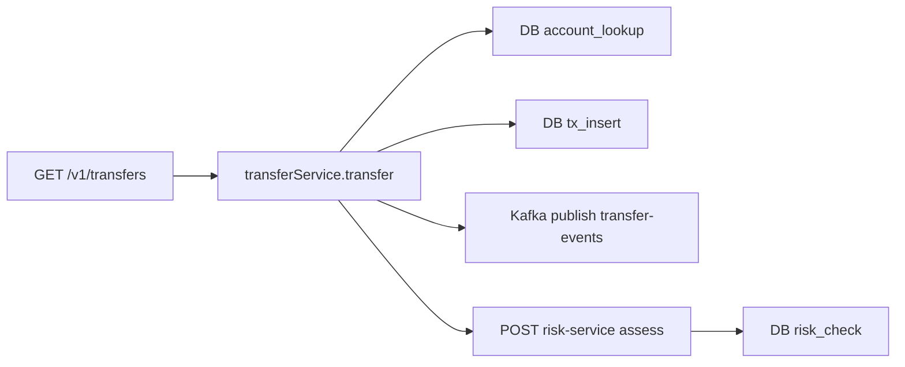
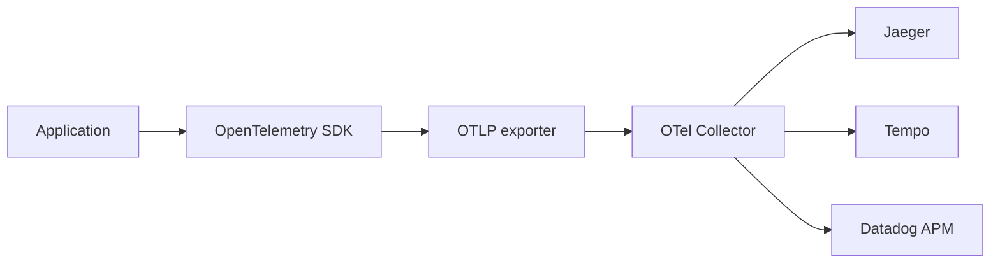
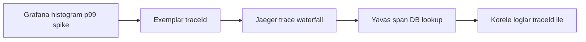
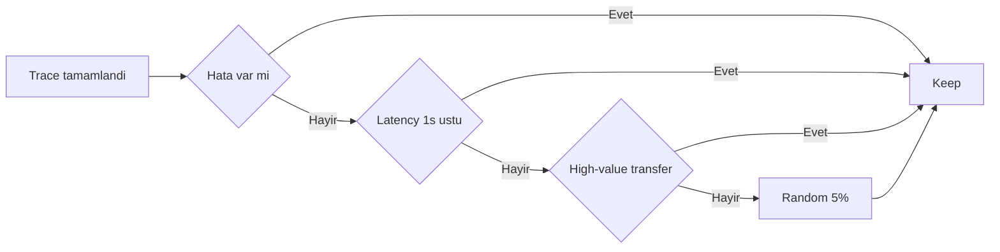

# Topic 9.3 — Distributed Tracing (Deep): OpenTelemetry + Exemplars

```admonish info title="Bu bölümde"
- OpenTelemetry SDK + Micrometer Tracing bridge ile bir Spring Boot servisini uçtan uca instrument etmek
- Banking domain'i için manual span, semantic attribute ve PII koruması — hangi veri trace'e girer, hangisi asla
- Exemplar ile metric → trace → log korelasyonu: Grafana'da p99 spike'ı görüp tek tıkla ilgili trace'e inmek
- Head-based vs tail-based sampling trade-off'u ve banking sampling stratejisi (errors + slow + high-value = %100)
- Kafka trace propagation, baggage ile business context taşıma, BatchSpanProcessor ile performans
```

## Hedef

Topic 7.6'daki distributed tracing temelinin üstüne bunu bir **observability stack** olarak kurmak. OpenTelemetry Java SDK'yı (manual + auto) Micrometer Tracing üzerinden Spring Boot'a bağlamak; custom span + attribute üretmek; **exemplar** ile metric ile trace'i birbirine linklemek; baggage propagation, head + tail sampling stratejileri, Kafka trace propagation, banking PII koruması ve trace storage (Jaeger / Tempo / Datadog APM) tarafını sebep–sonuç olarak kavramak. Odak: metric → trace → log korelasyonunu ve sampling kararını mülakatta hatasız anlatabilmek.

## Süre

Okuma: 2-2.5 saat • Kendini Sına: 45 dk • Pratik (opsiyonel): 4-5 saat • Toplam: ~3 saat (+ pratik)

## Önbilgi

- Topic 7.6 (Distributed Tracing temel) bitti — span / trace / context kavramları oturmuş
- Topic 9.1, 9.2 (Logging + Metrics) bitti — Prometheus histogram, Grafana panel biliniyor
- Spring Boot + Micrometer'ı gördün; `@Observed` / `ObservationRegistry` adını duydun

---

## Kavramlar

### 1. Recap — Trace anatomy

Derine inmeden önce tek bir resmi netleştirelim: bir **trace**, tek bir isteğin sistemdeki yolculuğudur; her adım bir **span**'dir ve span'ler bir ağaç oluşturur.

Bir trace tek bir `traceId` (16 byte hex) ile tanımlanır; her span'in kendi `spanId`'si ve bir `parentSpanId`'si vardır. Bir EFT isteği tetiklendiğinde span ağacı şöyle dallanır:



Önemli olan **context propagation**: HTTP üzerinde W3C `traceparent` header trace context'i taşır, böylece `risk-service`'te açılan span aynı trace'e bağlanır. Bu header olmadan her servis kendi izole trace'ini üretir ve uçtan uca resmi kaybedersin.

### 2. OpenTelemetry stack

**OpenTelemetry** (OTel) — vendor-neutral instrumentation standardı: API + SDK + wire protocol (OTLP). Uygulaman span üretir, OTLP ile export eder, backend seçimi sonradan değişebilir.

Spring Boot 3+ tarafında doğrudan OTel API yerine **Micrometer Tracing** kullanırsın — altında OpenTelemetry (veya Brave) çalışan bir abstraction. Akış tek yön:



Collector ortada durur; batch'ler, filtreler, sampler ve route eder — backend'i uygulamadan izole eden katman budur. Bağımlılıklar:

```xml
<dependency>
    <groupId>io.micrometer</groupId>
    <artifactId>micrometer-tracing-bridge-otel</artifactId>
</dependency>
<dependency>
    <groupId>io.opentelemetry</groupId>
    <artifactId>opentelemetry-exporter-otlp</artifactId>
</dependency>
<dependency>
    <groupId>net.ttddyy.observation</groupId>
    <artifactId>datasource-micrometer-spring-boot</artifactId>   <!-- DB query span -->
</dependency>
```

Konfigürasyon tarafında sampling oranı, propagation tipi ve OTLP endpoint'i tanımlanır:

```yaml
management:
  tracing:
    sampling:
      probability: 1.0   # dev için %100; prod %1-10
    propagation:
      type: w3c
  otlp:
    tracing:
      endpoint: http://otel-collector:4318/v1/traces
      compression: gzip
otel:
  resource:
    attributes:
      service.name: transfer-service
      service.version: 1.0.0
      deployment.environment: production
```

`service.name` ve `deployment.environment` resource attribute'ları kritik: her span'e otomatik iliştirilir, Jaeger'da servis bazlı filtreleme bunlara dayanır.

### 3. Auto-instrumentation — bedava gelen span'ler

Neden önemli: manuel yazmadan önce nelerin zaten geldiğini bilmezsen, aynı işi iki kez yapıp duplicate span üretirsin.

Micrometer + OTel starter'ları out-of-the-box span üretir: Spring Web (HTTP server + client), WebClient / RestTemplate, JDBC (datasource-micrometer), Spring Data, Kafka producer/consumer, Redis, gRPC ve Spring Security filter'ları.

Banking pratiği: **auto-instrumentation altyapıyı**, **manual span iş operasyonlarını** kapsar. `banking.transfer` gibi bir domain span'i auto gelmez — onu sen açarsın.

### 4. Manual span — banking domain

İş operasyonlarına anlam katmak için manuel span açarsın. Spring dünyasında tercih edilen yol `Observation` API'dir — hem metric hem trace'i tek noktadan besler.

```java
public Transfer transfer(TransferRequest req) {
    return Observation.createNotStarted("banking.transfer", observationRegistry)
        .lowCardinalityKeyValue("transfer.type", req.type().name())
        .lowCardinalityKeyValue("currency", req.currency())
        .lowCardinalityKeyValue("tenant", currentTenant())
        .highCardinalityKeyValue("transfer.id", req.transferId().toString())   // NO PII
        .observe(() -> {
            validateLimit(req);
            executeTransfer(req);
            publishEvent(req);
            return result;
        });
}
```

Dikkat: `lowCardinalityKeyValue` metric etiketine dönüşür (sınırlı değer kümesi), `highCardinalityKeyValue` sadece trace'e gider (transfer.id gibi eşsiz değerler). Bu ayrımı karıştırmak metric cardinality patlaması demektir. İç adımlar da kendi span'ini açabilir:

```java
private void validateLimit(TransferRequest req) {
    Observation.createNotStarted("banking.transfer.limit_check", observationRegistry)
        .lowCardinalityKeyValue("strategy", "rolling-window")
        .observe(() -> limitService.check(req));
}
```

Micrometer yerine doğrudan OTel API kullanacaksan span yaşam döngüsünü elle yönetirsin. Önce span'i attribute'larla kurup başlat:

```java
Span span = tracer.spanBuilder("banking.transfer")
    .setAttribute("transfer.type", req.type().name())
    .setAttribute("currency", req.currency())
    .setAttribute("amount.bucket", bucketOf(req.amount()))   // bucketed, not raw
    .setSpanKind(SpanKind.INTERNAL)
    .startSpan();
```

Sonra `try (Scope ...)` ile context'i current yap — try-with-resources burada şart, yoksa context leak olur (bkz. anti-pattern 6):

```java
try (Scope scope = span.makeCurrent()) {
    Transfer result = doTransfer(req);
    span.setStatus(StatusCode.OK);
    return result;
} catch (Exception e) {
    span.setStatus(StatusCode.ERROR, e.getMessage());
    span.recordException(e);
    throw e;
} finally {
    span.end();
}
```

`bucketOf` amount'u ham yazmak yerine kategoriye çevirir — PII/cardinality koruması. Tam kod:

<details>
<summary>Tam kod: OTel direct API TransferService (~40 satır)</summary>

```java
@Service
public class TransferService {

    private final Tracer tracer;

    public TransferService(OpenTelemetry openTelemetry) {
        this.tracer = openTelemetry.getTracer("com.bank.transfer", "1.0.0");
    }

    public Transfer transfer(TransferRequest req) {
        Span span = tracer.spanBuilder("banking.transfer")
            .setAttribute("transfer.type", req.type().name())
            .setAttribute("currency", req.currency())
            .setAttribute("amount.bucket", bucketOf(req.amount()))   // bucketed, not raw
            .setSpanKind(SpanKind.INTERNAL)
            .startSpan();

        try (Scope scope = span.makeCurrent()) {
            Transfer result = doTransfer(req);
            span.setStatus(StatusCode.OK);
            return result;
        } catch (Exception e) {
            span.setStatus(StatusCode.ERROR, e.getMessage());
            span.recordException(e);
            throw e;
        } finally {
            span.end();
        }
    }

    private String bucketOf(BigDecimal amount) {
        if (amount.compareTo(new BigDecimal("100")) < 0) return "small";
        if (amount.compareTo(new BigDecimal("10000")) < 0) return "medium";
        if (amount.compareTo(new BigDecimal("100000")) < 0) return "large";
        return "very_large";
    }
}
```

</details>

### 5. Span attributes — banking semantic conventions

Attribute'lar span'i aranabilir ve anlamlı yapar. OpenTelemetry standart attribute'ları verir; banking bunun üstüne domain attribute'ları ekler.

Standart (semantic conventions): `http.method`, `http.status_code`, `db.system`, `db.statement` (banking'de maskeli), `messaging.system`, `messaging.destination`, `rpc.method`, `exception.type`.

Banking custom: `tenant` (TR/DE/UK), `branch`, `transfer.type` (EFT/FAST/SWIFT), `currency`, `amount.bucket`, `saga.id` / `saga.step`, `transaction.id`, `idempotency.key`, `risk.score.bucket`, `channel` (mobile/web/branch/atm).

PII koruması bu bölümün en kritik kuralı. Trace backend'i genelde SIEM kadar sıkı korunmaz; oraya sızan bir TC kimlik veya kart numarası KVKK/PCI-DSS ihlalidir.

<mark>tc_kimlik ve card_pan asla span'e yazılmaz; email maskelenir, hesap ID hash'lenir, amount ham değil bucket olarak girer.</mark>

`user.id` gibi internal UUID'ler PII değildir ama high-cardinality'dir — span'e OK, ama span **adına** koyma.

### 6. Span events — anlık olaylar

Bir span süre kaplar; span **event**'i ise o süre içinde olan bir noktasal andır — span'e bağlı bir log satırı gibi.

```java
span.addEvent("limit_check_started");
span.addEvent("limit_check_completed", Attributes.of(
    AttributeKey.stringKey("result"), "approved",
    AttributeKey.longKey("duration_ms"), 45L
));
```

Banking örnekleri: `mfa_challenge_sent`, `fraud_score_calculated`, `saga_step_completed`, `retry_attempt`, `circuit_breaker_opened`. Fark şu: **attribute** span'in başında/sonunda bilinen bir gerçek, **event** span süresince olan bir andır. Exception de bir event'tir — `recordException(e)` bunu üretir.

### 7. Exemplars — metric ile trace'i linklemek

Bu bölümün kalbi burası. Sorun şu: Grafana'da "p99 latency 2 saniyeye fırladı" görürsün ama **hangi** istek yavaştı bilmezsin — metric bir aggregate'tir, tek isteği göstermez.

**Exemplar** bu boşluğu kapatır: her histogram bucket'ına, o bucket'a düşen örnek bir isteğin `traceId`'sini gömer. Böylece spike noktasına tıklayıp tam o yavaş isteğin trace'ine drill-down yaparsın.



Prometheus + Micrometer tarafında exemplar'ı açman gerekir:

```yaml
management:
  metrics:
    distribution:
      percentiles-histogram:
        http.server.requests: true
    export:
      prometheus:
        prometheus.exemplars: true   # exemplar'ı histogram'a gom
```

Prometheus'un kendisi de exemplar storage'ı desteklemeli:

```yaml
prometheus:
  storage:
    tsdb:
      exemplars-enabled: true
```

Grafana panelinde "Exemplars" toggle'ı açıldığında spike noktasında küçük elmaslar belirir — üstüne tıkla, `traceId` görünür, Jaeger/Tempo'ya atlar. Aynı `traceId` log'larda da olduğu için trace → log korelasyonu bedava gelir.

<mark>Metric → trace → log korelasyonunun tek anahtarı traceId'dir: metric'te exemplar, log'da MDC alanı olarak aynı traceId taşınır.</mark>

Banking pratiği: SLO breach alarmı → Grafana exemplar → Jaeger trace → root cause. Alarm ile root cause arasındaki mesafeyi dakikalardan saniyelere indirir.

### 8. Baggage — servisler arası business context

Trace context sadece kimlik (traceId/spanId) taşır. Bazen bir **business** değeri de (tenant, müşteri segmenti) tüm downstream servislere taşımak istersin — işte **baggage** budur.

Baggage bir W3C `baggage` header'ı olarak HTTP üzerinde propagate olur:

```java
Baggage.current().toBuilder()
    .put("tenant", "TR")
    .put("branch", "istanbul-1")
    .put("customer.tier", "premium")
    .build()
    .makeCurrent();
```

Downstream servis onu okur ve karar verir:

```java
String tier = Baggage.current().getEntryValue("customer.tier");
```

Banking kullanımı: `tenant` (multi-tenancy, her serviste aynı), `customer.segment` (pricing/routing), `feature.flag` (A/B variant), `incident.id` (bir soruşturmanın çağrılarını işaretleme).

```admonish warning title="Baggage tuzakları"
- Baggage her HTTP header'a yazılır ve tüm hop'lara yayılır — büyürse header overhead ve latency doğurur. Az ve küçük tut.
- PII'yi (TC, email, hesap no) baggage'a koymak, PII'yi tüm servislerin ağ trafiğine yaymak demektir. Asla.
```

### 9. Sampling stratejileri

Neden: production'da her trace'i saklamak storage ve maliyet patlamasıdır. **Sampling** hangi trace'lerin tutulacağına karar verir. İki temel yaklaşım var.

**Head-based sampling** — kararı request başlarken (root span) verir, cheap ve deterministik:

```java
SdkTracerProvider.builder()
    .setSampler(TraceIdRatioBasedSampler.create(0.1))   // %10
    .build();
```

Dezavantajı büyük: karar isteğin başında verildiği için, o istek sonradan hata verirse veya yavaşlarsa trace'i çoktan atmış olabilirsin — kritik trace kaybı.

**Tail-based sampling** — kararı trace tamamlandıktan sonra verir. Böylece "hatalıysa tut, yavaşsa tut, high-value ise tut" gibi kurallar kurabilirsin. OTel Collector'da yapılır:

```yaml
processors:
  tail_sampling:
    decision_wait: 10s
    policies:
      - name: errors
        type: status_code
        status_code: {status_codes: [ERROR]}
      - name: slow
        type: latency
        latency: {threshold_ms: 1000}
      - name: banking-high-value
        type: numeric_attribute
        numeric_attribute: {key: amount.value, min_value: 100000}
      - name: random
        type: probabilistic
        probabilistic: {sampling_percentage: 5}
```

Bedeli: Collector, karar için trace'in tüm span'lerini 10-30 saniye RAM'de tutmak zorunda — bellek ve karmaşıklık artışı. Karar ağacı şöyle işler:



Banking sampling stratejisi (tail-based önerilir): all errors %100, p99 slow (> 2s) %100, high-value transfer (> 100k TL) %100, saga compensation %100, fraud alert %100, login %10, account view %1, health check %0.

<mark>Production'da head-based %1-10 taban + tail-based ile errors/slow/high-value %100 birleşimi kullanılır; %100 sampling prod'da storage'ı tüketir.</mark>

### 10. Kafka trace propagation

HTTP dışında trace'in kopmaması için Kafka mesajlarında da context propagate edilmeli. Producer, context'i record header'ına inject eder:

```java
TextMapPropagator propagator = openTelemetry.getPropagators().getTextMapPropagator();
propagator.inject(Context.current(), record.headers(), HEADER_SETTER);
producer.send(record);
```

Consumer tarafı header'dan extract edip parent olarak set eder:

```java
Context parent = propagator.extract(Context.current(), record.headers(), HEADER_GETTER);
Span span = tracer.spanBuilder("kafka.consume")
    .setParent(parent)
    .setSpanKind(SpanKind.CONSUMER)
    .startSpan();
```

Spring Kafka auto-instrumentation bunu zaten yapar. Sonuç uçtan uca trace: REST API → DB → Kafka publish → (başka servis) Kafka consume → DB → REST response — hepsi tek `traceId`.

### 11. Trace storage backends

Backend seçimi cost/feature/openness üçgeninde bir karardır.

- **Jaeger** — open source, ElasticSearch/Cassandra storage, iyi UI, banking'de yaygın.
- **Tempo (Grafana)** — ucuz object storage (S3), tag-based arama sınırlı ama Grafana ile trace-to-metrics entegrasyonu mükemmel, cost-effective.
- **Datadog APM / New Relic / Honeycomb** — managed, yüksek sinyal, premium maliyet.

Banking trade-off: maliyet önceliğinde Tempo, feature önceliğinde Datadog, open-source zorunluluğunda Jaeger.

### 12. Trace analysis — banking patterns

Trace'in asıl değeri incident anında root cause'a inmektir. Üç tipik akış:

**Pattern 1 — Yavaş request:** Grafana'da p99 transfer spike → exemplar tıkla → Jaeger waterfall → `DB: account_lookup` span'i 2.5s (normal 50ms) → `hikaricp_connections_active` %100 → pool exhausted → root cause: connection leak.

**Pattern 2 — Cross-service hata:** "Transfer failed" raporu → Grafana error rate transfer-service %5 → exemplar → Jaeger: transfer-service → risk-service 503 → risk-service span'inde "DB connection refused" → root cause: risk-service DB down, circuit breaker tetiklenmeliydi ama tetiklenmedi.

**Pattern 3 — Saga stuck:** `saga_stuck_count > 0` alarmı → saga.id ile Jaeger arama → `callRemoteBank` span'i yanıtsız (timeout) → saga compensation'a geçmiş ama compensation banka yanıtına bağlı → sonsuz döngü → fix: timeout-bounded compensation.

Ortak iskelet hep aynı: alarm/metric → exemplar → trace waterfall → yavaş/hatalı span → correlated log/metric → root cause.

### 13. Performance impact

Tracing bedavaya gelmez ama iyi kurulunca ihmal edilebilir. Overhead kabaca: span creation ~1-10 μs, context propagation ~1 μs, sampling ~50 ns, network export async ve batched. Tipik etki: latency < %1, CPU < %5.

Optimizasyon kuralları: **BatchSpanProcessor** kullan (Simple değil), gRPC export (HTTP'den hızlı), head + tail sampling kombinasyonu, span başına attribute ve event sayısını sınırla (< 128).

<mark>Production'da SimpleSpanProcessor her span'i senkron export eder ve latency spike üretir — BatchSpanProcessor zorunludur.</mark>

### 14. Distributed tracing anti-pattern'leri

Mülakatta "bu tracing kodunda ne yanlış?" sorusunun cephaneliği burası.

**1 — PII span attribute'ta:** `span.setAttribute("user.tc_kimlik", ...)` veya `card.pan` → KVKK/PCI ihlali, trace backend SIEM değil.

**2 — Prod'da %100 sampling:** storage tükenir, maliyet patlar. Head %1-10 + tail errors/slow.

**3 — Span explosion:** 10k elemanlık loop'ta her elemana span açmak → 10k span → trace overload. Aggregate et veya sample'la.

**4 — High-cardinality attribute:** `span.setAttribute("request.body", req.toString())` → unbounded, trace size bloat. Bucketed/hashed değer kullan.

**5 — Template-style span adı:** `spanBuilder("/v1/accounts/12345/transfers/abc")` → her istekte eşsiz isim. Fix: route pattern `/v1/accounts/{id}/transfers/{txId}`.

**6 — Context leak:** `span.makeCurrent()` çağırıp `Scope`'u kapatmamak → span "current" olarak kalır, sonraki kod yanlış parent'a bağlanır. Fix: try-with-resources `Scope`.

**7 — Async context lost:** `CompletableFuture.supplyAsync(...)` içinde parent context yok. Fix: `Context.current().wrap(executor)` veya `Observation`.

**8 — Attribute vs event karışımı:** attribute span'in başında/sonunda bilinen, event span süresince olan an. Doğru ayır.

**9 — Auto check etmeden manuel span:** auto-instrumentation zaten üretiyorsa duplicate span çıkar. Önce neyin geldiğini gör.

**10 — Prod'da SimpleSpanProcessor:** senkron export, latency spike. BatchSpanProcessor kullan.

---

## Önemli olabilecek araştırma kaynakları

- OpenTelemetry Specification + Java SDK docs
- Micrometer Tracing reference
- W3C Trace Context + Baggage specs
- Jaeger / Tempo / Datadog APM dokümantasyonu
- "Distributed Systems Observability" — Cindy Sridharan
- Honeycomb best practices (high-cardinality observability)
- Banking PCI-DSS span attribute guidance

---

## Kendini Sına

Aşağıdaki soruları önce **cevaba bakmadan** kendi cümlelerinle yanıtlamayı dene — hepsi observability mülakatlarında karşına çıkabilecek tarzda. Takıldığında ilgili Kavramlar başlığına dön, sonra tekrar dene.

**S1. Exemplar nedir? Grafana'da bir p99 spike'tan başlayıp metric → trace → log korelasyonu nasıl işler?**

<details>
<summary>Cevabı göster</summary>

Metric bir aggregate olduğu için "p99 yavaş" der ama hangi isteğin yavaş olduğunu göstermez. Exemplar, her histogram bucket'ına o bucket'a düşen örnek bir isteğin `traceId`'sini gömerek bu boşluğu kapatır.

Akış: Grafana panelinde exemplar toggle'ı açıksın → spike noktasındaki elmasa tıkla → içindeki `traceId` görünür → Jaeger/Tempo'da o trace'in waterfall'ına atla → yavaş span'i bul. Aynı `traceId` log'larda MDC alanı olarak da bulunduğu için trace'ten log'a geçiş bedavadır. Tek anahtar `traceId`: metric'te exemplar, log'da MDC, trace'in kendisi — üçünü aynı id birbirine bağlar.

</details>

**S2. Head-based ve tail-based sampling arasındaki fark nedir? Banking için nasıl bir strateji kurarsın?**

<details>
<summary>Cevabı göster</summary>

Head-based karar isteğin başında (root span) verilir — cheap, deterministik, ama istek sonradan hata verir veya yavaşlarsa trace'i çoktan atmış olabilirsin (kritik trace kaybı). Tail-based karar trace tamamlandıktan sonra OTel Collector'da verilir; "hatalıysa tut, yavaşsa tut, high-value ise tut" gibi kurallar kurulabilir, ama Collector trace'in tüm span'lerini 10-30 sn RAM'de tutmak zorundadır (bellek + karmaşıklık).

Banking stratejisi ikisinin kombinasyonudur: head'de %1-10 taban örnekleme + tail-based ile all errors %100, slow (>2s) %100, high-value transfer (>100k) %100, saga compensation ve fraud %100, login %10, account view %1, health check %0. Prod'da düz %100 sampling storage'ı tüketir; asıl amaç ilginç trace'leri garanti tutarken gürültüyü örneklemektir.

</details>

**S3. Bir banking span'ine hangi attribute'lar konmaz ve neden? PII olmayan ama yine de dikkat gereken bir örnek ver.**

<details>
<summary>Cevabı göster</summary>

TC kimlik ve kart PAN'ı asla konmaz (KVKK/PCI-DSS); email maskelenir; hesap numarası ham değil hash'lenir; amount ham değil `amount.bucket` (small/medium/large) olarak girer. Sebep: trace backend'i genelde SIEM kadar sıkı korunmaz, oraya sızan PII bir data leak'tir.

PII olmayan ama dikkat gereken örnek: `user.id` internal UUID. Bu PII değildir ve span attribute olarak sorun değildir, ama high-cardinality'dir — özellikle span **adına** konursa metric cardinality'sini ve trace index'ini şişirir. Genel kural: eşsiz değerler attribute'ta olabilir ama span adında asla; span adı route pattern'i (`/v1/accounts/{id}`) olmalı.

</details>

**S4. Baggage nedir, trace context'ten farkı ve en büyük tehlikesi nedir?**

<details>
<summary>Cevabı göster</summary>

Trace context sadece kimlik taşır (traceId, spanId). Baggage ise bir business değerini — tenant, customer.tier, feature.flag, incident.id — tüm downstream servislere W3C `baggage` header'ı ile taşır; herhangi bir servis `Baggage.current().getEntryValue(...)` ile okur ve karar verir (routing, pricing).

İki tehlike: (1) Baggage her HTTP header'a yazılır ve tüm hop'lara yayılır — büyürse header overhead ve latency doğurur, o yüzden az ve küçük tutulur. (2) PII'yi (TC, email, hesap no) baggage'a koymak, o PII'yi tüm servislerin ağ trafiğine yaymaktır — asla yapılmaz.

</details>

**S5. Kafka üzerinden trace'in kopmaması için producer ve consumer tarafında ne yapılır?**

<details>
<summary>Cevabı göster</summary>

HTTP dışında trace'in devam etmesi için context Kafka mesajına taşınmalıdır. Producer, `TextMapPropagator` ile mevcut context'i record header'ına inject eder (`propagator.inject(Context.current(), record.headers(), HEADER_SETTER)`). Consumer aynı propagator ile header'dan extract edip bunu yeni span'in parent'ı olarak set eder (`.setParent(parent).setSpanKind(SpanKind.CONSUMER)`).

Spring Kafka auto-instrumentation bunu zaten yapar; elle uğraşman gereken tek durum düşük seviyeli producer/consumer kullanımıdır. Sonuç uçtan uca tek `traceId`: REST → DB → Kafka publish → (başka servis) consume → DB → response — waterfall'da tüm zincir tek trace altında görünür.

</details>

**S6. Manual span ne zaman gerekir, auto-instrumentation neyi kapsar ve duplicate span riski nereden çıkar?**

<details>
<summary>Cevabı göster</summary>

Auto-instrumentation altyapıyı kapsar: HTTP server/client, WebClient/RestTemplate, JDBC, Spring Data, Kafka producer/consumer, Redis, gRPC, Spring Security filter'ları. Bunlar için span yazmana gerek yoktur, bedava gelir. Manual span ise iş anlamı taşıyan operasyonlar içindir — `banking.transfer`, `banking.fraud_check` gibi domain span'leri auto gelmez.

Duplicate span riski, auto'nun zaten ürettiği bir şeyi elle tekrar sarınca çıkar: örneğin JDBC datasource-micrometer zaten query span üretiyorken bir de manuel "DB call" span'i açmak. Kural: önce neyin otomatik geldiğini gör (anti-pattern 9), manuel span'i sadece auto'nun görmediği business boundary'lere ekle. Spring'de tercih edilen yol `Observation` API'dir çünkü aynı noktadan hem metric hem trace besler.

</details>

**S7. Production'da tracing'in performans etkisi nedir ve BatchSpanProcessor ile SimpleSpanProcessor farkı neden önemlidir?**

<details>
<summary>Cevabı göster</summary>

İyi kurulmuş tracing'in etkisi ihmal edilebilir: span creation ~1-10 μs, context propagation ~1 μs, sampling ~50 ns, export async ve batched. Tipik toplam etki latency < %1, CPU < %5. Bu rakamlara ancak doğru processor ile ulaşılır.

SimpleSpanProcessor her span'i senkron export eder — yani her isteğin kritik yolunda bir ağ çağrısı belirir ve latency spike üretir; production'da felakettir. BatchSpanProcessor span'leri bufferlar ve arka planda toplu gönderir, kritik yolu bloklamaz. Ek optimizasyon: gRPC export (HTTP'den hızlı), head + tail sampling ile hacim azaltma, span başına attribute/event sayısını < 128 tutma.

</details>

---

## Tamamlama kriterleri

- [ ] "Kendini Sına" bölümündeki tüm soruları cevaba bakmadan açıklayabiliyorum
- [ ] OpenTelemetry + Micrometer Tracing bridge'in ne işe yaradığını ve OTLP → Collector → backend pipeline'ını çizebiliyorum
- [ ] Auto vs manual instrumentation ayrımını ve duplicate span riskini anlatabiliyorum
- [ ] Banking span attribute semantic convention'larını ve PII kurallarını (TC/PAN/email/amount) sayabiliyorum
- [ ] Exemplar ile metric → trace → log korelasyonunu (traceId anahtarı) uçtan uca anlatabiliyorum
- [ ] Head vs tail-based sampling trade-off'unu ve banking sampling stratejisini biliyorum
- [ ] Baggage'ın trace context'ten farkını ve iki tehlikesini açıklayabiliyorum
- [ ] Kafka trace propagation'ı (producer inject / consumer extract) ve BatchSpanProcessor gereğini biliyorum
- [ ] (Opsiyonel) "Pratik yapmak istersen" bölümündeki testleri yazdım ve Claude-verify prompt'uyla doğrulattım

---

## Defter notları

1. "OpenTelemetry + Micrometer Tracing bridge banking abstraction: ____."
2. "Auto vs manual instrumentation dengesi + manuel span ne zaman gerekir: ____."
3. "Banking span attribute semantic convention (tenant, currency, amount.bucket): ____."
4. "PII span attribute leak riski (TC, PAN) — trace backend SIEM olmayabilir: ____."
5. "Exemplar: Prometheus histogram + traceId → Jaeger drill-down + log korelasyonu: ____."
6. "Baggage cross-service business context (tenant, segment, feature_flag) + tehlikeleri: ____."
7. "Head vs tail-based sampling banking trade-off: ____."
8. "Tail-based policy: all errors + slow + high-value + low-cardinality random: ____."
9. "Kafka trace propagation producer inject / consumer extract (W3C): ____."
10. "Trace-based root cause workflow (alarm → exemplar → trace → fix): ____."

```admonish success title="Bölüm Özeti"
- OpenTelemetry SDK span üretir, Micrometer Tracing onu Spring'e köprüler; OTLP ile export edilip OTel Collector üzerinden Jaeger/Tempo/Datadog'a route edilir — backend değişse de uygulama aynı kalır
- Auto-instrumentation altyapıyı (HTTP, JDBC, Kafka) bedava kapsar; manual span sadece iş operasyonları içindir, gereksiz manuel sarma duplicate span üretir
- Exemplar metric ile trace'i traceId üzerinden linkler: Grafana'da p99 spike → exemplar → Jaeger trace → correlated log; alarm ile root cause arasını saniyelere indirir
- PII (tc_kimlik, card_pan, email) asla span attribute veya baggage'a girmez; amount raw değil bucket, hesap no hash — trace backend SIEM kadar korunmaz
- Sampling banking'de head %1-10 taban + tail-based errors/slow/high-value %100 kombinasyonudur; prod'da düz %100 storage'ı tüketir
- Kafka'da context header ile propagate edilir (producer inject / consumer extract) ve prod'da BatchSpanProcessor kullanılır — SimpleSpanProcessor senkron export ile latency spike üretir
```

---

## Pratik yapmak istersen

Kavramları koda dökmek istersen aşağıdaki iki ek hazır: test yazma rehberi span üretimi, PII audit, error recording, cross-service ve Kafka propagation için örnek testler içerir; Claude-verify prompt'u ile yazdığın tracing kurulumunu banking-grade perspektiften denetletebilirsin.

<details>
<summary>Test yazma rehberi</summary>

Süre: ~2-3 saat. Tamamlama hedefi: `InMemorySpanExporter` ile en az 5 test (span üretimi, PII-free audit, error recording, cross-service continuity, Kafka header propagation) yeşil.

`InMemorySpanExporter` testte üretilen span'leri toplar; assertion'ları bunun üzerinden yaparsın.

### Test 9.3.1 — Span üretimi ve attribute'lar

```java
@SpringBootTest
class TracingTest {

    @Autowired ObservationRegistry observationRegistry;
    InMemorySpanExporter exporter;   // TestConfig'te bean

    @Test
    void transferShouldCreateSpanWithAttributes() {
        transferService.transfer(testRequest());

        SpanData transferSpan = exporter.getFinishedSpanItems().stream()
            .filter(s -> s.getName().equals("banking.transfer"))
            .findFirst().orElseThrow();

        Map<AttributeKey<?>, Object> attrs = transferSpan.getAttributes().asMap();
        assertThat(attrs).containsEntry(AttributeKey.stringKey("tenant"), "TR");
        assertThat(attrs).containsEntry(AttributeKey.stringKey("currency"), "TRY");
    }
}
```

### Test 9.3.2 — PII-free audit

Her span'in serialize halinde TC/IBAN gibi ham PII olmadığını doğrula — regülasyon güvencesi:

```java
@Test
void spansShouldNotContainPii() {
    TransferRequest req = testRequest();
    transferService.transfer(req);

    exporter.getFinishedSpanItems().forEach(span -> {
        String all = span.toString();
        assertThat(all).doesNotContain("12345678901");        // No TC
        assertThat(all).doesNotContain(req.fromAccountIban()); // No raw IBAN
    });
}
```

### Test 9.3.3 — Error span'de exception recording

```java
@Test
void errorShouldRecordException() {
    when(externalApi.call()).thenThrow(new RuntimeException("simulated"));

    assertThatThrownBy(() -> transferService.transfer(req))
        .isInstanceOf(RuntimeException.class);

    SpanData span = exporter.getFinishedSpanItems().stream()
        .filter(s -> s.getStatus().getStatusCode() == StatusCode.ERROR)
        .findFirst().orElseThrow();

    assertThat(span.getEvents()).anyMatch(e -> e.getName().equals("exception"));
}
```

### Test 9.3.4 — Cross-service trace continuity

İki test servisini bağla; service2'nin span'inin service1 ile aynı `traceId`'yi taşıdığını doğrula:

```java
@Test
void traceShouldPropagateAcrossServices() {
    String traceId = service1.callService2();

    SpanData service2Span = exporter.getFinishedSpanItems().stream()
        .filter(s -> s.getName().contains("service2"))
        .findFirst().orElseThrow();

    assertThat(service2Span.getTraceId()).isEqualTo(traceId);   // aynı trace
}
```

### Test 9.3.5 — Kafka header propagation

Producer tarafında `traceparent` header'ının yazıldığını ve parent trace ID'yi içerdiğini doğrula:

```java
@Test
void kafkaShouldPropagateTraceHeader() {
    Span parent = tracer.spanBuilder("test.parent").startSpan();
    try (Scope s = parent.makeCurrent()) {
        kafkaProducer.send("topic", event);
    }
    parent.end();

    ConsumerRecord<?, ?> record = consumeOne("topic");
    Iterable<Header> headers = record.headers().headers("traceparent");
    assertThat(headers).isNotEmpty();

    String traceparent = new String(headers.iterator().next().value());
    assertThat(traceparent).contains(parent.getSpanContext().getTraceId());
}
```

### Bonus — Exemplar drill-down manuel doğrulama

Otomatik test'i zor olan bu akışı elle doğrula: metrics endpoint'te `prometheus.exemplars: true` aç, bir yavaş query simüle et, Grafana histogram panelinde exemplar toggle'ını aç, spike elmasına tıkla ve açılan `traceId` ile Jaeger'da doğru trace'e düştüğünü gör.

</details>

<details>
<summary>Claude-verify prompt</summary>

Süre: ~30 dk. Aşağıdaki prompt'u kendi tracing kurulumunla besleyip her maddeye PASS / FAIL / EKSIK işareti al.

> Aşağıdaki distributed tracing kurulumumu banking-grade kriterlere göre değerlendir. Eksikleri işaretle, kod yazma:
>
> 1. SDK + Backend: OpenTelemetry SDK + Micrometer Tracing bridge? OTLP exporter (gRPC/HTTP)? OTel Collector (batch + sample)? Jaeger/Tempo/Datadog backend?
> 2. Auto-instrumentation: HTTP server + client? JDBC? Kafka producer/consumer? Spring Security filter?
> 3. Manual span: banking domain (banking.transfer, banking.fraud_check)? Span kind doğru (INTERNAL/CLIENT/SERVER/PRODUCER/CONSUMER)? Low-cardinality attribute (tenant, currency, type)? High-cardinality değer span ADINDA değil?
> 4. Attributes: tenant, branch, transfer.type, currency, channel? amount.bucket (raw amount değil)? saga.id, transaction.id (UUID OK)? PII (TC, PAN, email) YOK?
> 5. Span events: punctual moment (mfa_sent, retry_attempt, cb_opened)? Error recordException()?
> 6. Exemplars: Prometheus exemplars enabled? Histogram metric + traceId link? Grafana panel exemplar toggle? Log MDC'de aynı traceId?
> 7. Baggage: tenant cross-service propagate? PII baggage'a YOK? Baggage boyutu küçük?
> 8. Sampling: head-based %1-10 prod? Tail-based all errors + slow + high-value? Health check %0?
> 9. Kafka propagation: producer header inject? Consumer header extract? End-to-end trace continuity?
> 10. Performance: BatchSpanProcessor (Simple değil)? Span attribute/event limit (< 128)? Async export? Sampling hacmi azaltıyor?
> 11. Anti-pattern: PII in span YOK? Span explosion (loop) YOK? High-cardinality attribute (request body) YOK? Template-style span name YOK? Context leak (Scope close) YOK? SimpleSpanProcessor prod YOK?
>
> Her madde için PASS / FAIL / EKSIK işaretle, kanıt göster, kod yazma.

</details>

---