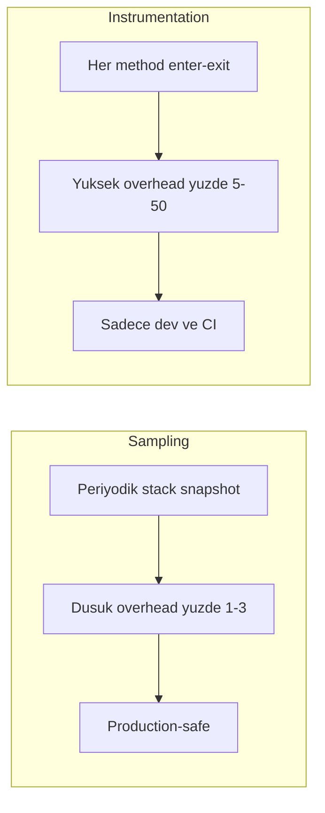
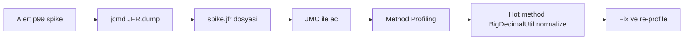
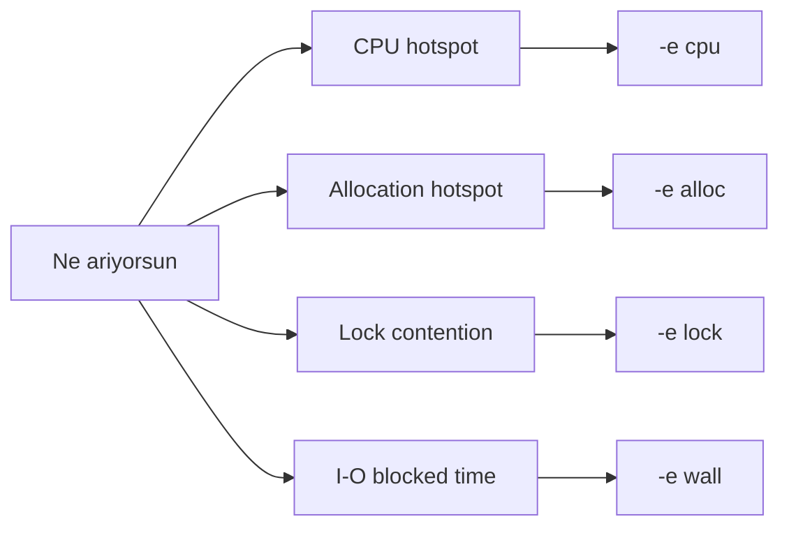
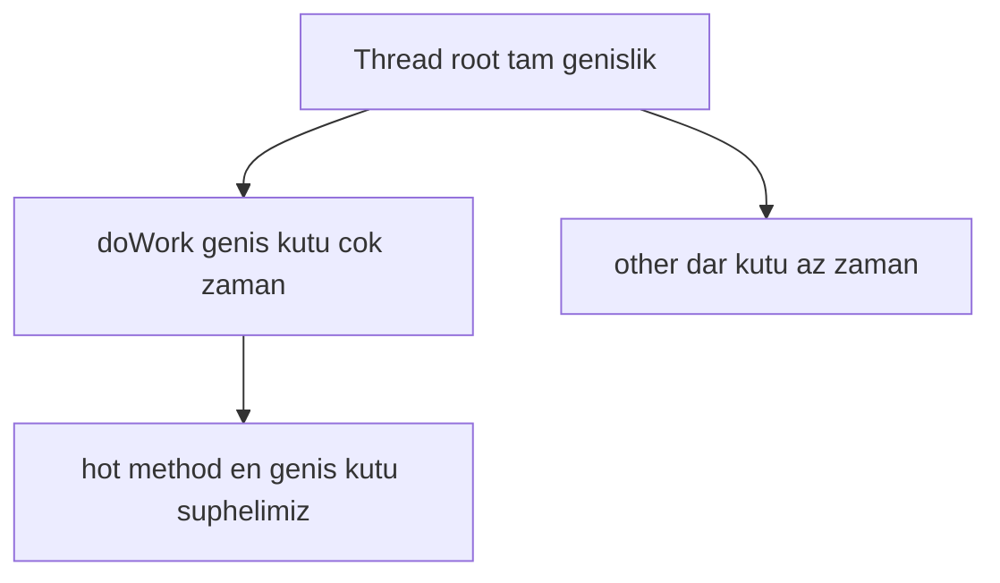

# Topic 9.4 — Profiling: JFR + async-profiler + Flame Graphs

```admonish info title="Bu bölümde"
- Metrics "yavaş var mı" der, profiling "neresi yavaş" der — ve production-safe profiling'in temel kuralı: sampling vs instrumentation
- JFR (JDK Flight Recorder) ile continuous kayıt + on-demand dump, JMC ile analiz pipeline'ı
- async-profiler'ın dört modu (CPU, alloc, lock, wall-clock) ve banking için neden wall-clock kritik
- Flame graph okuma mantığı — "geniş kutu = çok zaman" — ve banking hotspot pattern'leri (BigDecimal, logging, N+1, serialization)
- Continuous profiling (Pyroscope/Parca) + gerçek bir "slow transfer" incident'ini alert'ten root cause'a kadar çözmek
```

## Hedef

Banking serverlarında production-safe profiling yapabilmek: JVM Flight Recorder (JFR), async-profiler ve flame graph okuma. CPU hotspot, allocation hotspot ve lock contention'ı doğru araçla bulup yorumlayabilmek. Continuous profiling araçlarını (Pyroscope, Parca, Datadog Profiler) tanımak. Bir incident'i "metric alert → trace → profile → root cause → fix → verify" akışıyla çözebilmek.

## Süre

Okuma: ~2 saat • Kendini Sına: 45 dk • Pratik (opsiyonel): 3 saat • Toplam: ~2.5 saat (+ pratik)

## Önbilgi

- Topic 9.1-9.3 bitti — logging, metrics ve tracing üçlüsü oturdu
- JVM temeli: heap, stack, GC duyarlılığı
- Thread ve lock kavramı

---

## Kavramlar

### 1. Profiling vs Metrics — neden iki farklı araca ihtiyacın var

CPU %100'e vurdu, ama sebep kod tabanının neresinde? Metric bunu söylemez; işte profiling'in doğduğu boşluk burası.

**Metric** aggregate bir ölçümdür ("transfer p99 latency 1.5s"): bir problem olduğunu söyler ama nedenini göstermez. **Profiling** ise per-stack-frame çözünürlükte bakar: "1.2s'i `BigDecimal.divide()` çağrısında geçiriyor, ~%80 CPU `MathContext` setup'ında."

| | Metrics | Profiling |
|---|---|---|
| Granularity | Aggregate (timer p99) | Per-stack-frame |
| Soru | "What" — slow var mı? | "Why" — neresi slow? |
| Cost | Cheap | Medium |
| Production | Always-on | On-demand veya continuous |

Kısaca: metric alarmı çalar, profiling suçluyu bulur. İkisi birbirinin yerine geçmez; birlikte çalışır.

### 2. Sampling vs Instrumentation — production'da hangisi güvenli

Yanlış profiler seçersen çareyi hastalıktan beter yaparsın: bir profiler prod'da CPU'yu %50 artırırsa incident'i çözerken yenisini yaratırsın.

**Sampling profiler** periyodik olarak (~10-100 Hz) stack snapshot alır. Overhead düşüktür (%1-3), production-safe'tir. Örnekler: async-profiler, JFR, Datadog Profiler.

**Instrumentation profiler** bytecode inject eder; her method enter/exit'i kaydeder. Detay yüksektir ama overhead da yüksektir (%5-50) — production'da riskli. Örnekler: VisualVM (instrumentation mode), YourKit.



<mark>Banking pratiği: production'da her zaman sampling, instrumentation sadece dev/CI ortamında.</mark>

### 3. JFR — JDK'nın built-in uçuş kayıt cihazı

Ayrı bir ajan kurmadan, düşük overhead'le sürekli kayıt istiyorsan cevap JDK'nın içinde: **JFR (Java Flight Recorder)**. JDK 11+ ile ücretsizdir ve continuous çalışmak için tasarlanmıştır.

JVM'i başlatırken inline açabilir, veya çalışan bir process'e `jcmd` ile attach edebilirsin:

```bash
# Inline (JVM başlarken)
java -XX:StartFlightRecording=duration=60s,filename=app.jfr,settings=profile \
     -jar app.jar

# Çalışan JVM'e attach
jcmd <pid> JFR.start name=banking duration=60s filename=app.jfr settings=profile

# Dump ve stop
jcmd <pid> JFR.dump name=banking filename=app.jfr
jcmd <pid> JFR.stop name=banking
```

İki hazır settings profili var: `default` düşük overhead'li ve continuous içindir (~%0.5), `profile` ise daha detaylı ama kısa süreliktir (~%2-3).

JFR neyi kaydeder? CPU usage, method profiling (sampling), TLAB allocation, GC pause + stats, lock contention, I/O (file, socket), class loading, exception throw, network ve thread state. Banking için tipik kurulum: JFR sürekli `default` settings ile açık, incident anında `JFR.dump` ile son pencereyi al.

### 4. JFR analizi — JDK Mission Control (JMC)

JFR bir `.jfr` dosyası üretir ama içindeki milyonlarca event'i çıplak gözle okuyamazsın; **JMC (JDK Mission Control)** tam olarak bu dosyayı görselleştiren analiz UI'ıdır.

JMC dosyayı açtığında aspect'lere böler:

```
JMC opens app.jfr
  ├── Java Application
  │   ├── Method Profiling (hot methods)
  │   ├── Memory (allocation rate, TLAB)
  │   ├── GC (pause, throughput, generation)
  │   ├── Code (compilation, deoptimization)
  │   └── Threads (state, latency)
  └── JVM Internals
```

Tipik incident workflow'u — alert'ten fix'e kadar tek bir hat:



Somut örnek: alert p99 latency spike verdi → `jcmd <pid> JFR.dump filename=spike.jfr` → JMC'de Method Profiling → hot method `BigDecimalUtil.normalize` %40 CPU → drill down: her çağrıda `MathContext` allocation (anti-pattern) → fix: tek static `MathContext` instance.

### 5. async-profiler — production'ın gözdesi

JFR iyi ama allocation ve lock'ta bazen kör kalır; async-profiler production'da daha popülerdir çünkü tek araçla CPU + alloc + lock + wall-clock + cache-miss profili verir — hepsi sampling, hepsi low overhead.

Önce indir ve aç:

```bash
curl -L -o async-profiler.tar.gz \
  https://github.com/async-profiler/async-profiler/releases/download/v3.0/async-profiler-3.0-linux-x64.tar.gz
tar xf async-profiler.tar.gz
```

Sonra ne aradığına göre event tipini (`-e`) seç — dört ana mod bankacılığın dört ayrı sorusuna karşılık gelir:

```bash
# CPU profile — "neresi CPU yakıyor?"
./profiler.sh -d 60 -e cpu -f cpu.html <pid>

# Allocation profile — "kim young gen'i dolduruyor?"
./profiler.sh -d 60 -e alloc -f alloc.html <pid>

# Lock contention — "kim kimi bekletiyor?"
./profiler.sh -d 60 -e lock -f lock.html <pid>

# Wall-clock — "blocked thread'ler nerede bekliyor?" (banking I/O)
./profiler.sh -d 60 -e wall -f wall.html <pid>
```

Hangi mode ne bulur — seçim haritası:



<mark>Wall-clock profiling banking için özellikle değerlidir çünkü I/O ile blocked zamanı (DB query, external API) görür — CPU profile sadece running thread'leri sayar ve blocked bekleyişi kaçırır.</mark>

```admonish tip title="Continuous async-profiler"
Incident beklemeden arka planda sürekli profil almak istersen dosyaları zaman damgasıyla döndürebilirsin: `./profiler.sh -d 300 -f $(date +%s).html <pid>`. Her 5 dakikada bir ayrı HTML flame graph üretir; ama disk doluluğuna dikkat, rotate + limit koy.
```

### 6. Flame graph okuma — genişlik zamandır

Flame graph korkutucu görünür ama tek bir kuralı vardır; onu kavrayınca gerisi okumaya dönüşür.

Y ekseni stack frame derinliğidir (alttan üste çağrı zinciri), X ekseni ise zamandır. Bir kutunun **genişliği** o frame'de geçen toplam zamanı/CPU'yu gösterir — sıralama alfabetik değil, tamamen zaman ağırlıklıdır.



<mark>Flame graph okurken tek soru sor: en üstteki en geniş kutu hangisi — orası zamanın gittiği yerdir.</mark>

Banking transferinden gerçek bir flame graph (girinti = stack derinliği, yüzde = zaman):

```
[Tomcat:exec-5]
  → SpringDispatcher.doDispatch
    → TransferController.transfer
      → TransferService.transfer
        → AccountRepository.findById                   30%
          → Hibernate query                            20%
          → BigDecimal.setScale                        10%   ← neden setScale burada?
        → BalanceCalculator.calculate                  40%
          → BigDecimal.divide                          25%
            → MathContext.<init>                       15%   ← hot allocation!
            → division                                 10%
        → KafkaProducer.send                           20%
          → Serializer.serialize                       15%
```

`MathContext.<init>` %15 = her çağrıda hot allocation → fix hedefi belli.

### 7. CPU profiling — banking pattern'leri

CPU profile'ında aynı dört-beş suçlu tekrar tekrar çıkar; onları tanırsan flame graph'a bakar bakmaz teşhisi koyarsın.

**Pattern 1 — Hot method:** Tek bir method CPU'yu domine eder. Çözüm: sonucu cache'le veya hot path'i optimize et.

```
BigDecimalUtil.format     40% CPU
  ↓ çağıran
TransferController, AccountController, ...
```

**Pattern 2 — Excessive logging:** Debug log'u production'da açık kalmış, `expensiveToString()` her çağrıda çalışıyor. Debug level production'da kapalı olmalı (Topic 9.1).

```
Logback.encode               25% CPU
  ↓
TransferService.log.debug("...", expensiveToString())
```

**Pattern 3 — Inefficient SQL:** `ResultSet.next()` çok CPU yiyorsa büyük ihtimalle N+1 query var → EXPLAIN PLAN, JOIN FETCH (Phase 3).

```
Hibernate ResultSet.next()    35% CPU
```

**Pattern 4 — Serialization:** Jackson serialize, özellikle `BigDecimal.toPlainString` → banking için custom serializer yaz.

```
Jackson.serialize           20% CPU
  └── BigDecimal.toPlainString    8%
```

### 8. Allocation profiling — GC baskısının kaynağı

CPU normal ama GC sürekli tetikleniyorsa suçlu CPU profile'ında görünmez; allocation profile gerekir çünkü **allocation hotspot → GC pressure → pause time** zinciri buradan başlar.

```bash
./profiler.sh -e alloc -d 60 -f alloc.html <pid>
```

Banking örneği — saniyede yüz megabaytlar:

```
[TransferService.transfer]
  → BigDecimal.<init>(String)          200 MB/s allocation
  → ArrayList.<init>(emptyList)        50 MB/s
  → String.<init>                      150 MB/s
```

200 MB/s BigDecimal allocation → young gen hızla dolar → GC sıklaşır. Fix'ler: `BigDecimal.valueOf` (küçük değerler cache'li), `StringBuilder` reuse, ve nadiren object pool (banking'de genelde gerekmez).

### 9. Lock contention profiling — kim kimi bekletiyor

Latency yüksek ama CPU düşükse thread'ler koşmuyor, birbirini bekliyordur; bunu ancak lock profile gösterir.

```bash
./profiler.sh -e lock -d 60 -f lock.html <pid>
```

```
ReentrantLock@xyz   500 ms contention
  ↓ holder
  AccountService.transfer (200 ms tutuyor)
  ↓ waiters
  20 thread, ortalama 50 ms bekliyor
```

Bottleneck: `AccountService.transfer` lock'u çok geniş tutuyor. Fix: lock granularity'i düşür, optimistic locking (Phase 3.6).

### 10. Continuous profiling — Pyroscope / Parca / Datadog

On-demand profil incident anında işe yarar ama "dün de böyle miydi?" sorusuna cevap veremez; **continuous profiling** her saniye örnek saklayıp zaman pencerelerini karşılaştırmanı sağlar.

```yaml
# Pyroscope agent env
- PYROSCOPE_APPLICATION_NAME=transfer-service
- PYROSCOPE_SERVER_ADDRESS=http://pyroscope:4040
- PYROSCOPE_PROFILER_EVENT=itimer    # CPU
```

Java agent attach:

```bash
java -javaagent:pyroscope.jar -jar app.jar
```

Kazandırdıkları: dünkü baseline ile bugünü kıyaslama, deploy öncesi/sonrası differential, A/B perf karşılaştırması ve en önemlisi — incident'i beklemek zorunda kalmadan sürekli görünürlük. Banking'de Pyroscope ve Parca yaygın tercihtir.

### 11. Banking case study — yavaş transfer

Teoriyi tek bir gerçek incident'te bağlayalım: transfer p99 1.5s, oysa SLO 500ms. Suçluyu adım adım kıstıralım.

**Adım 1 — Metric ile daralt.** Alarm nereden geldi:

```promql
histogram_quantile(0.99,
  rate(banking_transfer_duration_seconds_bucket[5m]))
# = 1.5s
```

**Adım 2 — Trace ile drill down.** Exemplar trace hangi span'in yediğini gösterir:

```
[banking.transfer]                  1.5s
  ├── account_lookup                100 ms
  ├── balance_check                  50 ms
  ├── limit_check                   200 ms
  ├── fraud_score (external)        800 ms   ← suçlu
  └── kafka_publish                 100 ms
```

**Adım 3 — fraud-service'i profile et.** Suçlu span belli, şimdi o servisi JFR ile çek:

```bash
jcmd <pid> JFR.start duration=60s filename=fraud.jfr settings=profile
```

JMC method profiling hot path'i verir:

```
[FraudController.score]
  → FraudRules.evaluate                70% CPU
    → MlModel.predict                  50% CPU
      → DenseMatrix.multiply           45% CPU   ← hot
```

**Adım 4 — allocation profile.** CPU hot ama asıl mesele allocation'da mı:

```
DenseMatrix.<init>(int, int)    500 MB/s   ← her request'te yeni matrix
```

Her request'te taze matrix allocation → GC pressure → hem CPU hem pause time.

**Adım 5 — fix.** Matrix'i reuse et (object pool), model'i startup'ta warmup et, aynı kullanıcı için sonucu cache'le (5-dk TTL).

**Adım 6 — verify.** Deploy sonrası yeniden profile et: p99 200 ms. Ölçmeden "düzeldi" deme.

### 12. Profile'dan JVM tuning ipuçları

Profile sana sadece kod değil, JVM ayarı da söyler; semptomu doğru okursan doğru knob'a dokunursun.

- **Frequent GC:** allocation rate yüksekse allocation'ları azalt; heap küçükse `-Xmx` artır; young gen küçükse ratio config.
- **Long GC pauses (>1s):** G1GC'yi tune et (`-XX:MaxGCPauseMillis=200`), veya low-pause için ZGC/Shenandoah'a geç; heap çok büyükse uygulamayı böl.
- **High CPU sustained:** CPU profile al, infinite loop / thread spin ve excessive logging ara.
- **High allocation:** allocation profile al; klasik suçlular BigDecimal, String, primitive boxing.
- **Lock contention:** lock profile al, granularity düşür, lock-free veri yapısı düşün.

### 13. Banking — profiling anti-pattern'leri

Bu on tuzak "bu profiling setup'ında ne yanlış?" sorusunun cephaneliğidir.

**1 — Instrumenting profiler production'da:** latency spike + memory bloat. Sampling (async-profiler/JFR) kullan.

**2 — Sampling süresi çok kısa:** 5 saniye = statistical noise. Banking'de minimum 30-60 sn.

**3 — Multi-tenant JVM'i tek profile olarak yorumlamak:** farklı traffic pattern'leri karışır, tek profile yanıltır. Per-tenant veya per-endpoint profil al.

**4 — Profile'ı unattended bırakmak:** JFR dosyası disk doldurur. Rotate + limit koy.

**5 — Sensitive data leak:** JFR exception stack trace + argümanlar PII içerebilir. Banking'de profile dosyaları sıkı erişimli olmalı (S3 + IAM + encryption).

**6 — Sadece CPU profile, wall-clock yok:** banking I/O-heavy'dir (DB, external API). Wall-clock blocked time'ı görür, CPU profile blocked thread'leri kaçırır.

**7 — Ölçmeden optimize etmek:** "bence String yerine StringBuilder olur" → profile çıkmadan değişiklik. Önce ölç.

**8 — Dev environment'ta profile:** dev workload ≠ prod workload, hot path farklıdır. Staging veya controlled prod kullan.

**9 — Farklı load altında profile karşılaştırmak:** kıyaslama aynı load'da yapılmalı; bunun için JMH var (Topic 9.6).

**10 — Continuous profiling maliyetini görmezden gelmek:** Pyroscope storage + retention. Banking için tier'la (günlük detay, haftalık aggregate).

```admonish warning title="En sık yapılan iki hata"
İkisi de aynı kökten gelir — sabırsızlık. Biri "ölçmeden optimize etmek": profile çıkmadan kod değiştirmek, çoğu zaman yanlış yeri düzeltir. Diğeri "5 saniyelik sampling": istatistiksel gürültüyü gerçek hotspot sanmak. Banking'de her ikisi de production'da yanlış fix'e ve boşa deploy'a mal olur.
```

---

## Önemli olabilecek araştırma kaynakları

- JDK Flight Recorder docs
- JDK Mission Control
- async-profiler GitHub
- Brendan Gregg — Flame Graphs (origin)
- Pyroscope docs
- Datadog Continuous Profiler
- "Java Performance" — Scott Oaks

---

## Kendini Sına

Aşağıdaki soruları önce **cevaba bakmadan** kendi cümlelerinle yanıtlamayı dene — hepsi profiling odaklı bir SRE/backend mülakatında çıkabilecek tarzda. Takıldığın soru olursa ilgili Kavramlar başlığına dön, sonra tekrar dene.

**S1. Flame graph nasıl okunur? "Bu grafikte problem nerede" sorusuna nasıl cevap verirsin?**

<details>
<summary>Cevabı göster</summary>

Y ekseni stack derinliğidir (alttan üste çağrı zinciri), X ekseni zamandır. Kritik kural: bir kutunun genişliği o frame'de geçen toplam zamanı/CPU'yu gösterir — sıralama zaman ağırlıklıdır, alfabetik değil. Problemi bulmak için üstteki en geniş kutuya bakarsın: zamanın gittiği yer orasıdır.

Yükseklik tek başına kötü değildir (derin stack normaldir); asıl sinyal geniş kutulardır. Örneğin `MathContext.<init>` yatayda %15 yer kaplıyorsa, her çağrıda o allocation'a %15 zaman gidiyor demektir ve optimize edilecek nokta odur.

</details>

**S2. JFR neden bu kadar düşük overhead ile çalışabiliyor? Nasıl continuous açık bırakabiliyoruz?**

<details>
<summary>Cevabı göster</summary>

JFR sampling tabanlıdır ve JVM'in içine gömülüdür: her method çağrısını instrument etmek yerine periyodik olarak thread'lerin stack'inden snapshot alır ve event'leri verimli bir binary buffer'a yazar. `default` settings ile overhead ~%0.5 civarındadır, bu yüzden production'da sürekli açık bırakılabilir.

Continuous kullanım şudur: JFR `default` settings + `maxage`/`maxsize` limitleriyle sürekli döner (ring buffer gibi), incident anında `jcmd JFR.dump` ile son pencereyi diske alırsın. Daha detaylı ama daha pahalı `profile` settings'i (~%2-3) genelde kısa süreli, hedefli çekimlerde kullanılır.

</details>

**S3. async-profiler ile JFR arasında ne fark var? Ne zaman hangisini seçersin?**

<details>
<summary>Cevabı göster</summary>

İkisi de sampling ve low overhead'dir. JFR JDK'nın built-in'idir, kurulum gerektirmez, JMC ile zengin analiz sunar ve continuous kayıt için idealdir; ama allocation/lock detayında bazen daha sınırlıdır. async-profiler ayrı bir ajandır ama tek araçla CPU + alloc + lock + wall-clock + cache-miss verir ve doğrudan HTML flame graph üretir.

Pratikte: sürekli açık kalan continuous kayıt ve kurumsal analiz için JFR + JMC; hedefli, özellikle wall-clock veya allocation derinliği gereken ad-hoc profil için async-profiler. Banking'de ikisi bir arada bulunur — JFR baseline, async-profiler derin dalış.

</details>

**S4. Sampling ve instrumentation profiler arasındaki fark nedir? Banking'de hangisini, neden seçersin?**

<details>
<summary>Cevabı göster</summary>

Sampling profiler periyodik olarak (~10-100 Hz) stack snapshot alır; her method çağrısını görmez ama istatistiksel olarak hot path'i doğru bulur, overhead'i düşüktür (%1-3). Instrumentation profiler ise bytecode inject edip her method enter/exit'i kaydeder; tam çağrı sayısı verir ama overhead yüksektir (%5-50).

Banking'de production'da her zaman sampling kullanılır — canlı sistemde %50 overhead kabul edilemez, incident'i çözerken yenisini yaratır. Instrumentation sadece dev/CI'da, tam çağrı sayısı gerçekten gerektiğinde kullanılır.

</details>

**S5. Wall-clock profiling neden banking için özellikle kritik? CPU profile neyi kaçırır?**

<details>
<summary>Cevabı göster</summary>

CPU profile sadece CPU üzerinde koşan (running) thread'leri sampling'ler. Bir thread DB query'si veya external API çağrısı için blocked ise CPU harcamıyordur, dolayısıyla CPU profile'ında görünmez — ama request latency'sinin çoğu tam da o beklemede geçiyor olabilir.

Banking iş yükü I/O-heavy'dir (DB, SWIFT, fraud servisi, Kafka). Wall-clock profiling blocked zamanı da dahil eder, yani "800ms'i external fraud çağrısında bekliyoruz" gibi bir gerçeği ortaya çıkarır. Sadece CPU profile'a bakarsan bu bekleyişi tamamen kaçırır, yanlış yeri optimize edersin.

</details>

**S6. Prod'da bir endpoint yavaşladı, metric alert geldi. Root cause'a giden adımların neler?**

<details>
<summary>Cevabı göster</summary>

Akış: metric alert → trace → profile → root cause → fix → verify. Önce metric ile hangi endpoint/SLO ihlali olduğunu daraltırsın (p99 spike). Sonra exemplar trace ile latency'nin hangi span'de yandığını bulursun (ör. external fraud_score 800ms). O servisi hedef alıp profile çekersin (JFR dump veya async-profiler).

Profile'da hot method (CPU) ve gerekiyorsa allocation/lock modlarıyla asıl sebebi bulursun (ör. her request'te DenseMatrix allocation → GC pressure). Fix uygularsın (reuse/pool, warmup, cache) ve en kritik adım: deploy sonrası yeniden profile edip p99'un düştüğünü doğrularsın. Ölçmeden "düzeldi" denmez.

</details>

**S7. Allocation profiling neyi bulur? BigDecimal bir banking hotspot'u çıkarsa nasıl fixlersin?**

<details>
<summary>Cevabı göster</summary>

Allocation profiling (`-e alloc`) hangi call site'ın ne hızda (MB/s) heap allocate ettiğini gösterir. Amaç GC baskısının kaynağını bulmaktır: yüksek allocation → young gen hızla dolar → GC sıklaşır → CPU ve pause time artar. Örneğin `BigDecimal.<init>(String)` 200 MB/s allocate ediyorsa bu bir hotspot'tur.

Fix'ler: küçük/sık değerler için `BigDecimal.valueOf` (cache'li instance'lar), gereksiz String concat yerine `StringBuilder` reuse, ve gerçekten gerekiyorsa object pool (banking'de nadiren, genelde ilk iki yeter). Amaç per-request taze allocation'ı azaltmaktır.

</details>

**S8. Continuous profiling (Pyroscope/Parca) on-demand profiling'e göre ne kazandırır?**

<details>
<summary>Cevabı göster</summary>

On-demand profiling sadece incident anında, sen çektiğinde veri toplar; "dün de böyle miydi, hangi deploy bozdu?" sorularına cevap veremez. Continuous profiling her saniye örnek saklar, böylece zaman pencerelerini karşılaştırabilirsin: dünkü baseline vs bugün, deploy öncesi vs sonrası, A/B perf farkı.

En büyük kazanç incident'i beklemeden sürekli görünürlük — regresyon canlıda oturmadan fark edilir. Bedeli storage + retention maliyetidir; banking'de tier'lanarak yönetilir (günlük detay, haftalık aggregate).

</details>

---

## Tamamlama kriterleri

- [ ] Metric ile profiling farkını ("what" vs "why") bir cümlede anlatabiliyorum
- [ ] Sampling vs instrumentation farkını ve banking'in neden sampling seçtiğini biliyorum
- [ ] JFR'ı inline ve `jcmd` attach ile başlatıp dump alma komutlarını yazabiliyorum
- [ ] `default` vs `profile` settings farkını ve continuous kullanım kalıbını açıklayabiliyorum
- [ ] async-profiler'ın dört modunu (cpu/alloc/lock/wall) ne zaman kullanacağımı biliyorum
- [ ] Bir flame graph'a bakıp "genişlik = zaman" kuralıyla hotspot'u gösterebiliyorum
- [ ] Wall-clock profiling'in banking I/O için neden kritik olduğunu anlatabiliyorum
- [ ] "Slow transfer" incident'ini alert → trace → profile → fix → verify akışıyla çizebiliyorum
- [ ] (Opsiyonel) "Pratik yapmak istersen" bölümündeki senaryoları uyguladım

---

## Defter notları

1. "Metrics vs profiling: ____ (what vs why, granularity farkı)."
2. "Sampling vs instrumentation banking seçimi + overhead: ____."
3. "JFR continuous (default) + on-demand dump workflow: ____."
4. "JFR `default` vs `profile` settings ne zaman hangisi: ____."
5. "async-profiler 4 mode (cpu, alloc, lock, wall) banking kullanımı: ____."
6. "Flame graph okuma — genişlik = zaman, en geniş üst kutu: ____."
7. "Wall-clock profile (I/O blocked görünür) banking sebebi: ____."
8. "BigDecimal allocation hotspot + fix patterns (valueOf, reuse): ____."
9. "Lock contention reduce — granularity + optimistic locking: ____."
10. "Production incident workflow (alert → trace → profile → fix → verify): ____."

```admonish success title="Bölüm Özeti"
- Metric problemin varlığını, profiling nerede olduğunu söyler — biri alarmı çalar, diğeri suçluyu bulur; ikisi birlikte çalışır
- Production'da her zaman sampling profiler (JFR, async-profiler, %1-3 overhead); instrumentation sadece dev/CI çünkü %5-50 overhead canlıyı boğar
- JFR JDK built-in + low overhead: `default` settings continuous açık kalır, incident'te `jcmd JFR.dump` + JMC ile analiz
- async-profiler dört mod verir; wall-clock banking için kritiktir çünkü CPU profile'ın kaçırdığı I/O blocked zamanı (DB, external API) gösterir
- Flame graph tek kural: genişlik = zaman; üstteki en geniş kutu optimize edilecek yerdir
- Incident'i "metric alert → trace → profile → root cause → fix → verify" akışıyla çöz; ölçmeden optimize etme, 30-60 sn altı sampling'e güvenme
```

---

## Pratik yapmak istersen

Kavramları elinle denemek istersen aşağıdaki iki blok hazır: profiling lab senaryoları JFR/async-profiler'ı gerçek bir Spring Boot app üzerinde çalıştırmanı sağlar, Claude-verify prompt'u ise profiling stack'ini banking-grade perspektiften denetletir. Her biri kendi başlığı altında; süre gerektiren adımlarda toplam ~3 saatlik bir pratik hedefle.

<details>
<summary>Profiling lab senaryoları (~3 saat)</summary>

Aşağıdaki on senaryoyu sırayla uygula; her biri bir profiling aracının somut çıktısını görmeni sağlar. Tamamlanmış sayılman için her senaryonun sonunda elde edilen çıktıyı (flame graph HTML, JMC ekranı, Pyroscope timeline) yorumlayabiliyor olman yeterli.

**1 — JFR continuous recording:** Spring Boot app'i `-XX:StartFlightRecording=settings=default,maxage=1h,filename=app.jfr` ile başlat. JMC ile aç, aspect'leri gez.

**2 — Hot CPU method (JFR):** Banking app'e BigDecimal-heavy bir compute endpoint ekle. 60 sn JFR profile çek, JMC Method Profiling'de hot path'i identify et.

**3 — async-profiler CPU flame graph:** Aynı senaryo. `./profiler.sh -e cpu -d 60 -f cpu.html <pid>`. Browser'da flame graph'ı aç ve JFR sonucuyla karşılaştır.

**4 — Allocation profiling:** `-e alloc -d 60 -f alloc.html`. Banking BigDecimal allocation hotspot'unu bul (MB/s).

**5 — Lock contention:** Multi-thread test senaryosu (synchronized block). `-e lock -d 60`. Contention point'i belirle.

**6 — Wall-clock profile:** External API çağrısını 200ms delay ile mock'la. `-e wall -d 60`. CPU profile'da görünmeyen blocked time'ı wall-clock'ta gör.

**7 — Pyroscope/Parca local:** Pyroscope'u docker ile ayağa kaldır. Banking app'e agent attach et, UI'da continuous profile timeline'ını izle.

**8 — Diff profile:** Optimizasyon öncesi profil al. Fix uygula (cache result, static instance). Optimizasyon sonrası profil al, Pyroscope diff view ile karşılaştır.

**9 — JFR + JMC GC analizi:** GC pause distribution'a bak, long pause event'lerini incele. G1GC'yi `-XX:MaxGCPauseMillis=200` ile tune et, farkı gözlemle.

**10 — Production incident simülasyonu:** Slow endpoint senaryosu kur. Metric alert → trace exemplar → JFR dump → root cause → fix → verify akışını uçtan uca çalıştır.

> İpucu: Profiling test'lerini otomatikleştirmek istersen async-profiler'ın Java API'sini (`AsyncProfiler.getInstance()`) kullanabilirsin — `profiler.start("alloc", 1_000_000)` ile 1ms sampling başlat, hot path'i çalıştır, `profiler.stop()` çıktısını parse edip BigDecimal allocation byte'larını bir threshold'a karşı assert et. Aynı yaklaşım lock contention için `start("lock", ...)` ile çalışır.

</details>

<details>
<summary>Claude-verify prompt</summary>

```
Profiling stack'imi banking-grade kriterlere göre değerlendir. Eksikleri
işaretle, kod yazma:

1. Tooling:
   - JFR continuous (default settings) açık mı?
   - async-profiler mevcut mu?
   - Continuous profiling (Pyroscope/Parca/Datadog) var mı?

2. Profile tipleri:
   - CPU profile alınıyor mu?
   - Allocation profile?
   - Lock contention profile?
   - Wall-clock (banking I/O için kritik)?

3. Banking analizi:
   - Hot method identification yapıldı mı?
   - Allocation rate (BigDecimal, String) tarandı mı?
   - Lock contention (transfer service)?
   - GC pause distribution?

4. Workflow:
   - Metric alert → trace → profile → root cause akışı var mı?
   - Pre/post-fix differential profile?

5. Production-safe:
   - Sampling overhead < %3?
   - JFR sürekli on (default settings)?
   - Incident'te profile dump otomatik mi?

6. Banking domain kontrolleri:
   - BigDecimal allocation hotspot tarandı mı?
   - Logging overhead (Logback, JSON serialize)?
   - DB query hot path (Hibernate)?
   - Kafka serialization hot path?

7. JVM tuning:
   - G1GC MaxGCPauseMillis set mi?
   - Heap size + young gen ratio?
   - GC log enabled?
   - ZGC / Shenandoah low-pause için değerlendirildi mi?

8. Anti-pattern:
   - Instrumentation profiler prod'da YOK mu?
   - Sampling < 30 sn YOK mu?
   - PII profile leak koruması (S3 IAM + encryption)?
   - Farklı load altında profile karşılaştırma YOK mu?
   - Ölçmeden optimize etme YOK mu?

9. Dokümantasyon:
   - 1 case study walkthrough (slow transfer → fixed)?
   - Runbook: prod'da JFR nasıl dump edilir?

Her madde için PASS / FAIL / EKSIK işaretle, kanıt göster, kod yazma.
```

</details>
