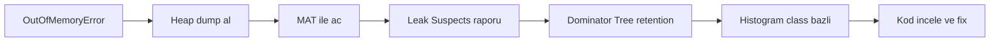
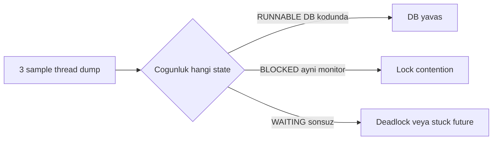
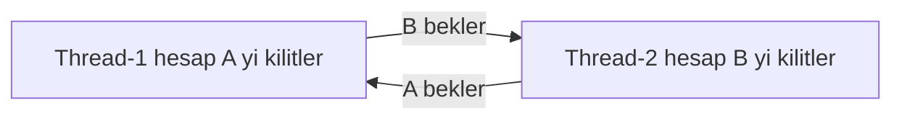
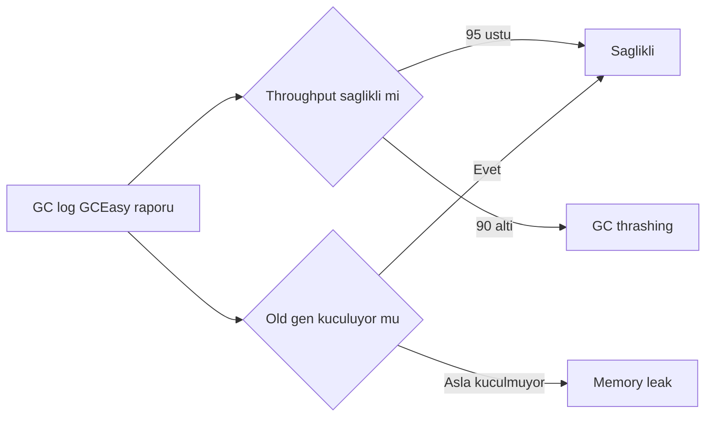

# Topic 9.5 — Heap & Thread Dump Analysis

```admonish info title="Bu bölümde"
- OutOfMemoryError geldiğinde heap dump alıp Eclipse MAT ile leak'i bulma: Leak Suspects → Dominator Tree → Histogram workflow'u
- 7 klasik Java memory leak pattern'i (unbounded cache, ThreadLocal, inner class, connection/stream leak) ve banking fix'leri
- Thread dump anatomisi: jstack ile deadlock, lock contention ve stuck thread tespiti
- GC log analizi (GCEasy/GCViewer) — throughput, pause, old gen büyümesi banking target'ları
- Production JVM ayarı: G1GC vs ZGC, HeapDumpOnOutOfMemoryError, native memory tracking
```

## Hedef

Production troubleshooting derinliği kazanmak: **heap dump** alıp Eclipse MAT ile analiz etmek, **thread dump** ile deadlock/contention teşhis etmek, **GC log** okuyup memory leak veya GC thrashing'i erken yakalamak. Bunları banking incident senaryolarıyla (OOM, deadlock, livelock, off-heap leak) bağlamak ve JVM internals'ı (Eden, Survivor, Old gen, Metaspace, native) günlük teşhiste kullanabilmek.

## Süre

Okuma: 2 saat • Kendini Sına: 30 dk • Pratik (opsiyonel): 3-4 saat • Toplam: ~2.5 saat (+ pratik)

## Önbilgi

- Topic 9.4 (Profiling) bitti — JFR, async-profiler, flame graph biliyorsun
- JVM heap model temel bilgisi
- Thread state'leri (Runnable, Blocked, Waiting, Timed_Waiting, Terminated) duydun

---

## Kavramlar

### 1. JVM memory layout — leak nerede?

Bir gece pod'lar `OutOfMemoryError` ile restart loop'a girer; ilk soru hep aynıdır: bellek nerede şişti? Cevabı bulmak için önce JVM'in process belleğini nasıl böldüğünü görmen gerekir.

```
Java Process Memory
├── Heap (managed)
│   ├── Young Generation
│   │   ├── Eden            (yeni allocate)
│   │   ├── S0 (Survivor)   (1. GC sonrası)
│   │   └── S1 (Survivor)
│   └── Old Generation       (long-lived)
├── Metaspace                (class metadata)
├── Code Cache               (JIT compiled)
├── Native Heap              (JNI, direct ByteBuffer)
├── Thread Stacks            (per thread ~1 MB)
├── Native Memory Tracking   (JVM internal)
└── Off-heap                 (Netty, Kafka direct)
```

OOM'un tipi doğrudan bölgeyi işaret eder — mesajı okumak teşhisin yarısıdır:

- `OutOfMemoryError: Java heap space` → heap leak (en sık)
- `OOM: Metaspace` → class leak (dynamic proxy, classloader sızıntısı)
- `OOM: GC overhead limit exceeded` → GC thrashing (heap dolu, GC boşuna dönüyor)
- `OOM: Direct buffer memory` → off-heap leak (Netty / Kafka native)
- `StackOverflowError` → deep recursion, stack'te

### 2. Heap dump — ne zaman, nasıl

**Heap dump**, belirli bir andaki tüm heap objelerinin diske yazılmış fotoğrafıdır; leak avında en güçlü kanıttır. OOM anında, kademeli bellek büyümesinde veya sürekli yüksek heap kullanımında alırsın.

En yaygın üç yöntem — production'da `jcmd` moderni, otomatik dump ise zorunlu:

```bash
# jmap — canlı (reachable) objeleri dump eder
jmap -dump:live,format=b,file=heap.hprof <pid>

# jcmd — modern alternatif
jcmd <pid> GC.heap_dump filename=heap.hprof

# OOM anında otomatik dump (production setup)
java -XX:+HeapDumpOnOutOfMemoryError \
     -XX:HeapDumpPath=/var/dumps/heap-%p-%t.hprof \
     -jar app.jar
```

Banking pratiğinde `HeapDumpPath` mounted bir volume (PVC) olur: OOM → dump volume'e düşer → pod restart olur → ops sakince analiz eder. <mark>HeapDumpOnOutOfMemoryError production'da her zaman açık olmalı</mark> — kapalıysa OOM'dan geriye hiç kanıt kalmaz, incident kör noktaya düşer.

```admonish warning title="jmap -dump:live stop-the-world tetikler"
`jmap -dump:live` çalışmadan önce **tam bir GC** yapar ve bu süre boyunca uygulamayı durdurur (stop-the-world). 4-8 GB'lık bir banking heap'inde bu birkaç saniye demektir — canlı trafikte p99 latency spike'ı ve timeout yaratabilir. Production'da tercih: OOM auto-dump'a güven, ya da canary/az trafikli pod'da elle al. `live` olmadan alırsan STW yok ama dump şişer (unreachable objeler de gelir).
```

### 3. Eclipse MAT — leak'i bulma workflow'u

Dump elinde ama 4 GB'lık binary; nereden başlarsın? **Eclipse MAT** (Memory Analyzer Tool, ücretsiz) tam bu iş için: `.hprof` dosyasını açar ve retention'ı analiz eder. Üç ana view'ı sırayla kullanırsın.

OOM'dan fix'e giden yol tek bir akıştır — her adım bir öncekini daraltır:



**Leak Suspects Report** MAT'ın otomatik tahminidir; büyük retention bloklarını gösterir. **Dominator Tree** ise asıl silahtır: hangi objenin başka ne kadar objeyi *canlı tuttuğunu* (retained size) gösterir — sadece kendi boyutunu değil. **Histogram** class bazında instance sayısı + size verir.

Somut bir caching leak vakası — 4 GB heap'in analizi:

```
Leak Suspects:
  Problem 1: 3.5 GB (87%) accumulated in HashMap
    Path: GlobalCache.cache → HashMap → ...

Dominator Tree:
  GlobalCache.cache holds 3.5 GB retained

Histogram by class:
  java.util.HashMap$Node   50,000,000 instances   1.2 GB
  com.bank.Account         25,000,000 instances   2.0 GB
```

Okuma: `GlobalCache` sınırsızca `Account` objesi biriktiriyor, **no eviction** → bellek durmadan büyüyor. Dominator Tree'nin gösterdiği `GlobalCache.cache → HashMap` retention path'i suçluyu tek bakışta verir.

**Fix:** TTL-based eviction (Caffeine), size limit veya cache value'ları için weak reference.

### 4. Java'nın 7 klasik leak pattern'i

Leak'lerin çoğu birkaç tekrar eden şablona iner; bunları tanırsan MAT'ta gördüğün retention path'i hemen kod hatasına eşlersin.

**Pattern 1 — Static collection growing.** Bir `static` Map sınırsız büyür; GC asla toplayamaz çünkü root'tan reachable.

```java
public class GlobalCache {
    private static final Map<UUID, Account> CACHE = new HashMap<>();   // ❌ unbounded
}
```

Fix: Caffeine / EHCache with `maximumSize` + `expireAfterWrite`.

**Pattern 2 — ThreadLocal leak.** Thread pool thread'leri yeniden kullanılır; `remove()` çağırmazsan eski context thread'e yapışık kalır ve içindeki user objeleri retained olur.

```java
public class Service {
    private static final ThreadLocal<UserContext> CONTEXT = new ThreadLocal<>();

    public void doWork(UserContext ctx) {
        CONTEXT.set(ctx);
        // ... no remove → thread pool reuse'da sızar
    }
}
```

Fix: her zaman `finally` bloğunda `CONTEXT.remove()`.

**Pattern 3 — Inner class captures outer.** Lambda/anonymous class dıştaki `this`'i yakalar; `Runnable` yaşadıkça `Service` ve dolayısıyla `HugeData` de pinned kalır.

```java
public class Service {
    private final HugeData data;

    public Runnable task() {
        return () -> System.out.println("hi");   // captures Service.this → HugeData
    }
}
```

**Pattern 4 — Cache without eviction.** Spring `@Cacheable` default'u sınırsız `ConcurrentHashMap`'tir — sessizce büyür.

```java
@Cacheable("accounts")   // Spring default = ConcurrentHashMap unbounded
public Account getAccount(UUID id) { ... }
```

Fix: Caffeine cache manager ile sınır koy.

```java
@Bean
public CacheManager cacheManager() {
    CaffeineCacheManager mgr = new CaffeineCacheManager();
    mgr.setCaffeine(Caffeine.newBuilder()
        .maximumSize(10_000)
        .expireAfterWrite(Duration.ofMinutes(15)));
    return mgr;
}
```

**Pattern 5 — Connection not closed.** Kapatılmayan `Connection`/`Statement` hem pool'u tüketir hem result set'i memory'de tutar.

```java
Connection conn = dataSource.getConnection();
PreparedStatement ps = conn.prepareStatement(...);
// ❌ no close → connection pinned + result set in memory
```

Fix: try-with-resources. (HikariCP leak detection threshold aşılınca uyarır.)

**Pattern 6 — Stream not closed.** `Files.lines` altında bir `FileChannel` tutar; kapatılmazsa native handle sızar.

```java
Stream<String> lines = Files.lines(path);
lines.forEach(...);   // ❌ underlying FileChannel pinned
```

Fix: try-with-resources.

**Pattern 7 — Listener not unregistered.** `eventBus.register(this)` yapıp `@PreDestroy`'da unregister etmezsen `this` sonsuza dek pinned.

```java
eventBus.register(this);
// ❌ no unregister → this pinned forever
```

Fix: `@PreDestroy` veya lifecycle hook'ta unregister.

```admonish tip title="Leak avında kestirme"
MAT'ta bir class'ın instance sayısı beklenenden absürt yüksekse (ör. 50M `HashMap$Node`), doğrudan Dominator Tree'de o class'ın retention path'ine bak. Path'in tepesindeki GC root genelde bir `static` field ya da bir thread pool thread'idir — yukarıdaki 7 pattern'den birine oturur.
```

### 5. Thread dump — ne zaman, nasıl

Heap dump bellek sorununu çözer; **thread dump** ise "uygulama takıldı / CPU %100 / deadlock" sorununu. CPU'yu yakan thread'i bulmak, hung uygulamada stuck thread'i görmek veya deadlock şüphesini doğrulamak için alırsın.

Tek dump bazen yalan söyler — bir thread o anda mı takılı yoksa hızlı mı geçiyor? Bunu ayırmak için **birkaç saniye arayla 3 sample** al:

```bash
# jstack
jstack <pid> > thread.dump

# 3 sample (iyi pratik — tekrar eden pattern'i görürsün)
for i in 1 2 3; do
  jstack <pid> > thread-$i.dump
  sleep 5
done

# jcmd
jcmd <pid> Thread.print > thread.dump

# kill -3 (dump'ı stdout/log'a basar)
kill -3 <pid>
```

### 6. Thread dump anatomisi

Her thread bloğunu okumayı öğren; incident'te tek tek tarayacaksın. Bir HTTP worker thread'i şöyle görünür:

```
"http-nio-8080-exec-5" #45 daemon prio=5 tid=0x7f3b3c012800 nid=0x4242 RUNNABLE
   java.lang.Thread.State: RUNNABLE
     at java.util.regex.Pattern$BmpCharProperty.match(Pattern.java:3962)
     at com.bank.IbanValidator.validate(IbanValidator.java:45)
     at com.bank.TransferService.transfer(TransferService.java:78)
   Locked ownable synchronizers:
     - <0x000000076b8a9b48> (a java.util.concurrent.locks.ReentrantLock$NonfairSync)
```

Dört bilgi taşır: thread adı + ID + native ID, **thread state** (RUNNABLE/BLOCKED/WAITING/TIMED_WAITING/TERMINATED), stack trace ve tuttuğu/beklediği lock'lar. State ve lock satırları teşhisin kalbidir.

### 7. Thread state'leri — banking yorumu

State tek başına bir sinyaldir; çok sayıda thread'in aynı state'te toplanması ise incident'in kendisidir.

| State | Anlam | Banking örnek |
|---|---|---|
| RUNNABLE | CPU üzerinde / IO yapıyor | DB query, network I/O, compute |
| BLOCKED | Monitor lock bekleniyor | Synchronized contention |
| WAITING | Object.wait, LockSupport.park | Future.get, thread pool idle |
| TIMED_WAITING | sleep, wait(timeout) | Sleep, retry wait |
| TERMINATED | Bitmiş | - |

Dump'ı state dağılımına göre okumak seni doğrudan kök nedene götürür:



Tüm `http-nio-*` thread'leri DB kodunda RUNNABLE ise DB yavaşlamıştır; çoğu aynı monitor üzerinde BLOCKED ise lock contention vardır; sonsuza dek WAITING kalanlar deadlock ya da stuck future işaretidir.

### 8. Deadlock tespiti

**Deadlock**, iki thread'in birbirinin tuttuğu lock'u beklemesiyle oluşan kalıcı kilitlenmedir. İyi haber: JVM Java-level deadlock'ları otomatik tespit eder ve dump'a yazar.

```
Found one Java-level deadlock:
=============================
"Thread-1":
  waiting to lock monitor (a java.lang.Object), which is held by "Thread-2"
"Thread-2":
  waiting to lock monitor (a java.lang.Object), which is held by "Thread-1"

"Thread-1":
        at com.bank.AccountService.method1(AccountService.java:50)
        - waiting to lock <0x...c00>
        - locked <0x...bd0>
"Thread-2":
        at com.bank.AccountService.method2(AccountService.java:75)
        - waiting to lock <0x...bd0>
        - locked <0x...c00>
```

Bu döngüsel bekleme banking'de neredeyse her zaman **lock ordering ihlalidir** — iki thread aynı iki hesabı ters sırayla kilitler:



Fix, lock'ları **her zaman aynı kanonik sırada** almaktır (ör. account ID'sine göre). <mark>İki lock alan her yol, lock'ları deterministik tek bir sıraya göre almalı</mark> — bu tek kural deadlock sınıfını tümüyle yok eder.

```java
// ❌ Inconsistent lock order — from/to sırası çağrıya göre değişir
public void transfer(Account from, Account to) {
    synchronized (from) {
        synchronized (to) { ... }
    }
}

// ✓ Canonical order — ID'ye göre sabit sıra
public void transfer(Account a, Account b) {
    Account first  = a.getId().compareTo(b.getId()) < 0 ? a : b;
    Account second = a.getId().compareTo(b.getId()) < 0 ? b : a;
    synchronized (first) {
        synchronized (second) { ... }
    }
}
```

### 9. Thread dump analiz araçları

jstack ham text verir; büyük dump'ları elle taramak yerine analiz araçları kullanırsın. **FastThread.io** banking ops'ta standart: browser'a dump yükler, thread state breakdown, deadlock detection, tekrar eden stack pattern'leri, thread pool exhaustion ve high-CPU thread tespitini rapor eder. Alternatifler: IBM TDA ve async-profiler'ın (Topic 9.4) thread state profili.

### 10. GC log analizi

**GC log**, incident sonrası "bellek nasıl davrandı?" sorusunun tek güvenilir kaynağıdır; banking'de her zaman açık ve rotasyonlu olmalı.

```bash
java -Xlog:gc*:file=/var/log/banking/gc.log:time,uptime,level,tags:filecount=10,filesize=100M \
     -jar app.jar
```

Tek bir satır bir GC olayını özetler — önce ve sonraki heap boyutu ile pause süresi:

```
[2024-05-12T10:30:45.123+0000][0.500s][info][gc] GC(0) Pause Young (Normal) 256M->128M(1024M) 12.345ms
```

Log'u elle değil araçla oku: **GCViewer** (open source, görsel), **GCEasy.io** (online rapor), JMC GC tab. GCEasy raporunu banking target'larıyla karşılaştırırsın:

```
Throughput: 98.5%         (target > 95%)
Avg pause: 25 ms
Max pause: 180 ms         (target p99 < 200 ms)
Old gen growth: 5 MB/min  (sonsuza büyürse endişe)
Full GC count: 2 in 24h   (kabul edilebilir)
```

İki soru raporu okumana yeter — throughput sağlıklı mı, old gen küçülüyor mu:



Red flag'ler: throughput < %90, p99 pause > 500 ms, sık full GC ve **old gen'in asla küçülmemesi** (klasik leak imzası).

### 11. JVM tuning — banking için G1GC

Doğru GC ayarı incident'i baştan önler. Banking default'u **G1GC**'dir; pause hedefli, büyük heap'lerde öngörülebilir:

```bash
java \
  -Xms4g -Xmx4g \                          # Min == max (resize pause yok)
  -XX:+UseG1GC \                            # G1 banking default
  -XX:MaxGCPauseMillis=200 \                # Hedef pause
  -XX:InitiatingHeapOccupancyPercent=45 \   # Concurrent cycle %45'te başlar
  -XX:G1HeapRegionSize=16M \
  -XX:+ParallelRefProcEnabled \
  -XX:+AlwaysPreTouch \                     # Heap'i startup'ta touch et (lazy alloc yok)
  -XX:+UseStringDeduplication \             # String memory düşür
  -Xlog:gc*:file=...
```

<mark>-Xms ile -Xmx her zaman eşit olmalı</mark>; farklı olursa JVM heap'i tembel commit eder ve GC anında resize pause'ları yer — banking'de öngörülemez latency demektir. FAST payments gibi ultra-düşük-latency servislerde **ZGC**'ye geçersin:

```bash
-XX:+UseZGC \                # Pause < 10 ms
-XX:+ZGenerational \
-Xms8g -Xmx8g
```

ZGC'nin pause'u G1'den çok daha düşüktür ama throughput biraz geride kalır — takas bilinçli olmalı.

### 12. Native memory tracking

Heap dump temiz ama process belleği yine de şişiyorsa şüpheli **off-heap**'tir (Netty direct buffer, Kafka, compressor). Bunu heap dump göremez; **Native Memory Tracking (NMT)** açman gerekir.

```bash
java -XX:NativeMemoryTracking=summary -jar app.jar

jcmd <pid> VM.native_memory summary
```

Çıktı belleği kategorilere böler; heap dışı büyümeyi burada görürsün:

```
Total: reserved=4524032KB, committed=1532812KB
-  Java Heap (reserved=4194304KB, committed=1234567KB)
-      Class (reserved=1048576KB, committed=80520KB)  classes #12345
-     Thread (reserved=204852KB,  committed=204852KB) threads #100
-         GC (...)
-       Code (...)
-   Internal (...)   ← direct buffer büyümesi burada belirir
```

Banking'de en sık off-heap suçlusu **direct buffer**'dır (Netty, Kafka client). Thread satırının şişmesi ise thread leak'e (kapatılmayan executor) işaret eder.

### 13. Banking case study — transfer service OOM

Teoriyi tek bir gerçek incident'te birleştirelim: transfer servisi restart loop'ta, log'da `OutOfMemoryError: Java heap space`.

**Adım 1 — heap dump otomatik toplandı.** `HeapDumpOnOutOfMemoryError` açık olduğu için `/var/dumps/heap-12345-...hprof` (3.8 GB) hazır.

**Adım 2 — MAT analizi.** Leak Suspects tek bir suçlu gösterdi:

```
Leak Suspects:
  Problem 1: 3.4 GB in ConcurrentHashMap retained by IdempotencyKeyCache
```

**Adım 3 — kod incelemesi.** Dominator path `IdempotencyKeyCache.cache`'i işaret etti:

```java
@Component
public class IdempotencyKeyCache {
    private final Map<String, IdempotencyRecord> cache = new ConcurrentHashMap<>();   // ❌ unbounded

    public void put(String key, IdempotencyRecord record) {
        cache.put(key, record);
    }
}
```

Eviction yok. Production'da günde 10M transfer → günde 10M entry → 4-5 günde heap dolar. Pattern 1 (static/unbounded collection).

**Adım 4 — fix.** TTL'li Caffeine, ama gerçek çözüm distributed idempotency:

```java
private final Cache<String, IdempotencyRecord> cache = Caffeine.newBuilder()
    .maximumSize(1_000_000)
    .expireAfterWrite(Duration.ofHours(24))   // 24h idempotency window
    .recordStats()
    .build();
// Daha iyisi: Redis (multi-instance shared, persistent — Topic 7.7 IdempotencyKeyFilter)
```

**Adım 5 — doğrulama.** Fix sonrası steady-state heap dump: 800 MB (önceki 3.5 GB). GC log'da old gen artık düz bir çizgi.

### 14. Banking heap/thread anti-pattern'leri

Mülakatta "bu kodda/config'de ne yanlış?" sorusunun cephaneliği. On klasik:

1. **Unbounded in-memory cache** — eviction'sız Map. Fix: Caffeine `maximumSize` + `expireAfterWrite`.
2. **ThreadLocal.remove() unutmak** — thread pool reuse → leak. Fix: `finally`'de remove.
3. **Lock without timeout** — `lock.lock()` sonsuz blok. Fix: `lock.tryLock(5, TimeUnit.SECONDS)`.
4. **Geniş scope synchronized** — `public synchronized void transfer(...)` tüm method'u kilitler → contention. Fix: dar scope veya finer lock.
5. **Future.get timeout'suz** — `future.get()` sonsuz bekler. Fix: `future.get(5, TimeUnit.SECONDS)`.
6. **GC log kapalı** — incident'te tek kanıt kaynağı; her zaman açık olmalı.
7. **-Xmx >> -Xms** — resize pause. Fix: eşitle.
8. **HeapDumpOnOutOfMemoryError yok** — OOM'da kanıtsız kalırsın; always on.
9. **Production thread dump ignore** — ops dump tutmuyor. Fix: periyodik capture script.
10. **Tomcat thread pool yetersiz** — default `server.tomcat.threads.max: 200`, blocking-I/O ağır banking'de yetmeyebilir. Fix: profile-based tune.

---

## Önemli olabilecek araştırma kaynakları

- Eclipse Memory Analyzer (MAT) docs
- FastThread.io — thread dump analyzer
- GCEasy.io — GC log analyzer
- "Java Performance" — Scott Oaks
- "Optimizing Java" — Benjamin Evans
- Plumbr leak detector (commercial)

---

## Kendini Sına

Aşağıdaki soruları önce **cevaba bakmadan** kendi cümlelerinle yanıtlamayı dene — hepsi production troubleshooting mülakatlarında karşına çıkabilecek tarzda. Takıldığın soruda ilgili Kavramlar başlığına dön, sonra tekrar dene.

**S1. `OutOfMemoryError: Java heap space` aldın. Adım adım nasıl teşhis edersin?**

<details>
<summary>Cevabı göster</summary>

Önce OOM mesajının tipine bakarım — "Java heap space" heap leak'i işaret eder (Metaspace/Direct buffer olsaydı başka yere bakardım). Heap dump'ı `HeapDumpOnOutOfMemoryError` ile otomatik alınmış `.hprof`'tan alırım; yoksa canlı pod'da `jmap -dump:live` ya da `jcmd GC.heap_dump` ile alırım (STW riskine dikkat).

Sonra Eclipse MAT ile açarım: Leak Suspects raporu büyük retention bloğunu tahmin eder, Dominator Tree hangi objenin ne kadar retained tuttuğunu gösterir, Histogram class bazında instance sayısını verir. Retention path'i (ör. `SomeCache.map → HashMap → Account`) kod hatasına eşler, fix'i yaparım (eviction/TTL), fix sonrası steady-state dump ile doğrularım.

</details>

**S2. MAT'ta memory leak'i tam olarak nasıl bulursun? Leak Suspects, Dominator Tree ve Histogram arasındaki fark nedir?**

<details>
<summary>Cevabı göster</summary>

Leak Suspects otomatik bir tahmindir; en büyük retention bloklarını "Problem 1/2" olarak listeler ve hızlı bir başlangıç noktası verir. Dominator Tree asıl analiz aracıdır: her objenin **retained size**'ını (o obje GC edilirse serbest kalacak toplam bellek) gösterir — yani bir objenin başka ne kadar objeyi *canlı tuttuğunu*. Shallow size yanıltır, retained size gerçeği söyler.

Histogram ise class bazında instance sayısı + toplam size verir; "50M tane `HashMap$Node` var" gibi anormallikleri yakalamak için iyidir. Workflow: Leak Suspects ile şüpheliyi bul → Dominator Tree'de retained size ve GC root'a giden retention path'i doğrula → Histogram ile hangi domain class'ının biriktiğini gör. Path'in tepesindeki root genelde bir `static` field ya da thread pool thread'idir.

</details>

**S3. Production'da `jmap -dump:live` çalıştırmanın riski nedir? Nasıl azaltırsın?**

<details>
<summary>Cevabı göster</summary>

`jmap -dump:live` dump'tan önce tam bir GC yapar ve bu süre boyunca uygulamayı **stop-the-world** ile durdurur. 4-8 GB'lık bir banking heap'inde bu birkaç saniye sürebilir; canlı trafikte doğrudan p99 latency spike'ı, timeout ve hatta health-check fail (pod restart) yaratır.

Azaltma: mümkünse elle almaktan kaçınıp `HeapDumpOnOutOfMemoryError` auto-dump'a güven. Elle gerekiyorsa load balancer'dan çıkarılmış bir pod'da, canary'de veya düşük trafik penceresinde al. `live` olmadan alırsan STW olmaz ama dump unreachable objelerle şişer. Alternatif olarak `jcmd GC.heap_dump` de aynı STW'yi yapar — kısayolu yok, planlı almak gerekir.

</details>

**S4. Thread dump'ta deadlock'u nasıl tespit edersin? jstack ne gösterir, fix nedir?**

<details>
<summary>Cevabı göster</summary>

jstack (veya `jcmd Thread.print`) alırım; JVM Java-level deadlock'ları otomatik tespit edip dump'ın başına `Found one Java-level deadlock` bloğu yazar. Bu blok döngüyü açıkça gösterir: "Thread-1, Thread-2'nin tuttuğu monitor'ü bekliyor; Thread-2, Thread-1'in tuttuğunu bekliyor" — her thread'in `waiting to lock` ve `locked` satırları hangi objede kilitlendiğini verir.

Banking'de kök neden neredeyse her zaman **lock ordering ihlalidir**: iki thread aynı iki hesabı ters sırada kilitler. Fix, lock'ları her zaman kanonik bir sıraya göre almaktır — örneğin account ID'sine `compareTo` uygulayıp küçük ID'yi önce kilitlemek. Ayrıca `tryLock(timeout)` kullanmak deadlock'u kalıcı blok yerine yakalanabilir bir hataya çevirir.

</details>

**S5. Thread state'lerini (RUNNABLE, BLOCKED, WAITING) production sinyali olarak nasıl yorumlarsın?**

<details>
<summary>Cevabı göster</summary>

Tek bir thread'in state'i değil, **dağılım** önemlidir — o yüzden 3 sample alırım. Tüm `http-nio-*` worker'ları DB kodunda RUNNABLE ise DB yavaşlamıştır (query/index sorunu). Çok sayıda thread aynı monitor üzerinde BLOCKED ise lock contention vardır — muhtemelen geniş scope bir `synchronized`.

Sonsuza dek WAITING kalan thread'ler stuck future ya da deadlock işaretidir. TIMED_WAITING çoğunlukla normaldir (sleep, retry, pool idle). Sinyalin gücü tekrar edilebilirlikten gelir: aynı stack 3 sample'da da aynı state'te görünüyorsa gerçekten takılıdır; sample'lar arası değişiyorsa thread hızlı geçiyordur, sorun değildir.

</details>

**S6. Klasik banking unbounded-cache leak'ini anlat: nasıl ortaya çıkar, MAT'ta nasıl görünür, nasıl fixlersin?**

<details>
<summary>Cevabı göster</summary>

Tipik senaryo: idempotency key'leri veya account'ları eviction'sız bir `ConcurrentHashMap`/`HashMap`'te tutmak (`@Cacheable` default'u da budur). Her istek yeni entry ekler, hiçbiri çıkmaz; günde milyonlarca istekte heap birkaç günde dolar ve OOM ile restart loop başlar. GC log'da imza net: old gen sürekli büyür, asla küçülmez.

MAT'ta Leak Suspects tek bir Map'i "%80+ retained" gösterir, Dominator Tree retention path'i cache field'ına kadar izler. Fix: Caffeine ile `maximumSize` + `expireAfterWrite` koymak. Multi-instance banking servisinde daha doğrusu cache'i Redis'e taşımak (shared, persistent, TTL'li) — böylece hem leak biter hem instance'lar tutarlı olur.

</details>

**S7. GC log'da hangi red flag'ler memory leak veya GC thrashing gösterir? Banking target'ları nedir?**

<details>
<summary>Cevabı göster</summary>

En güçlü leak sinyali **old gen'in her full GC sonrası asla küçülmemesi** — bellek kalıcı olarak birikiyor demektir. GC thrashing sinyali throughput'un düşmesidir (uygulama zamanının çok azı gerçek işe gidiyor); `GC overhead limit exceeded` OOM'u bunun son halidir. Sık ve uzun full GC'ler de kırmızı bayraktır.

Banking target'ları: throughput > %95, p99 pause < 200 ms (ultra-düşük-latency'de ZGC ile < 10 ms), full GC nadir (24 saatte birkaç). Red flag eşikleri: throughput < %90, p99 pause > 500 ms, sık full GC, sürekli büyüyen old gen. GCEasy.io veya GCViewer bu metrikleri otomatik çıkarır.

</details>

**S8. G1GC ile ZGC arasındaki banking trade-off nedir? `-Xms == -Xmx` neden önemli?**

<details>
<summary>Cevabı göster</summary>

G1GC banking default'udur: pause hedefli (`MaxGCPauseMillis`), büyük heap'lerde öngörülebilir, throughput iyi. ZGC ise pause'u < 10 ms'de tutar (concurrent, heap boyutundan bağımsız) ama throughput biraz geride kalır. Seçim latency hassasiyetine göre: normal servisler G1, FAST payments gibi ultra-düşük-latency akışlar ZGC.

`-Xms == -Xmx` kritiktir çünkü farklı olurlarsa JVM heap'i tembel commit eder ve büyüdükçe GC anında **resize pause**'ları yer — banking'de öngörülemez latency spike'ı. Eşitleyip `AlwaysPreTouch` eklemek heap'i startup'ta tümüyle commit eder, runtime'da sürpriz olmaz.

</details>

---

## Tamamlama kriterleri

- [ ] OOM tipini (heap space / Metaspace / Direct buffer / GC overhead) mesajından ayırt edebiliyorum
- [ ] Heap dump alma yollarını (jmap, jcmd, HeapDumpOnOutOfMemoryError) ve jmap STW riskini biliyorum
- [ ] MAT workflow'unu (Leak Suspects → Dominator Tree → Histogram) ve retained size mantığını anlatabiliyorum
- [ ] 7 leak pattern'ini tanıyıp fix'lerini söyleyebiliyorum
- [ ] Thread dump'ta deadlock'u ve lock contention'ı tespit edip lock ordering fix'ini yazabiliyorum
- [ ] Thread state dağılımını production sinyali olarak yorumlayabiliyorum
- [ ] GC log red flag'lerini ve banking target'larını (throughput, pause, old gen) biliyorum
- [ ] G1GC vs ZGC trade-off'unu ve `-Xms == -Xmx` gerekçesini açıklayabiliyorum
- [ ] (Opsiyonel) "Pratik yapmak istersen" bölümündeki lab'ları ve testleri denedim

---

## Defter notları

1. "JVM memory layout (heap, metaspace, native, off-heap) ve OOM tipi → bölge eşlemesi: ____."
2. "MAT workflow: Leak Suspects → Dominator Tree (retained size) → Histogram; retention path okuma: ____."
3. "Common leak pattern'ler (unbounded cache, ThreadLocal, inner class, connection/stream): ____."
4. "jmap -dump:live neden STW tetikler, production'da nasıl azaltılır: ____."
5. "Thread state (RUNNABLE, BLOCKED, WAITING) dağılımı → kök neden yorumu: ____."
6. "Deadlock tespiti (jstack auto + ThreadMXBean) + lock ordering fix (compareTo): ____."
7. "GC log red flag'leri (old gen küçülmüyor, throughput < %90) + banking target'lar: ____."
8. "G1GC vs ZGC trade-off (throughput vs pause) + -Xms == -Xmx gerekçesi: ____."
9. "Native memory tracking + Netty/Kafka direct buffer off-heap leak: ____."
10. "Banking idempotency cache OOM case study + Redis fix: ____."

```admonish success title="Bölüm Özeti"
- OOM'un tipi (heap space / Metaspace / Direct buffer / GC overhead) doğrudan hangi bellek bölgesinin şiştiğini söyler — teşhis mesajı okumakla başlar
- Heap dump → MAT workflow'unun bel kemiği: Leak Suspects otomatik tahmin, Dominator Tree retained size ile suçluyu, Histogram class bazında birikmeyi gösterir
- 7 leak pattern (unbounded cache, ThreadLocal, inner class, cache without eviction, kapatılmayan connection/stream, unregister edilmeyen listener) MAT'ta gördüğün retention path'i kod hatasına eşler
- Thread dump 3 sample ile okunur: JVM deadlock'u otomatik yazar, çözüm kanonik lock ordering; BLOCKED yığılması contention, RUNNABLE yığılması yavaş DB demektir
- GC log her zaman açık ve rotasyonlu; old gen'in asla küçülmemesi leak, throughput < %90 GC thrashing sinyalidir
- jmap -dump:live stop-the-world tetikler — production'da auto-dump'a güven; -Xms == -Xmx ve G1GC/ZGC seçimi latency'yi öngörülebilir kılar
```

---

## Pratik yapmak istersen

Kavramları koda dökmek istersen aşağıdaki iki ek hazır: test/lab rehberi intentional leak reproduce, deadlock reproduce ve regression test örnekleri içerir; Claude-verify prompt'u ile heap/thread readiness'ini banking-grade perspektiften denetletebilirsin.

<details>
<summary>Test ve lab rehberi</summary>

### Lab 1 — Intentional leak + heap dump + MAT

Eviction'sız bir `Map` cache yaz, JMeter/gatling ile flood et, `jmap -dump:live` ile dump al, MAT ile aç. Leak Suspects → Dominator Tree → Histogram'da `Account` retention path'ini izle, sonra Caffeine `maximumSize` ekleyip steady-state dump'ta farkı gör (birikme durur).

### Lab 2 — Deadlock reproduce + jstack

İki account arası transfer'de lock ordering'i bilinçli ters yaz, 2 thread'i karşılıklı transfer ettir → deadlock. `jstack` çıktısında "Found one Java-level deadlock" bloğunu oku, sonra `compareTo`-tabanlı canonical ordering ile fix'le ve tekrar dene.

### Lab 3 — Lock contention via thread dump

50 thread'i geniş scope `synchronized` bir transfer method'una gönder, 5 sn arayla 3 jstack al. Çoğu thread'in aynı monitor üzerinde BLOCKED olduğunu gör, lock granularity'sini daralt, contention'ın düştüğünü doğrula.

### Lab 4 — GC log + GCEasy

GC log'u aç, load test ile veri üret, `gc.log`'u GCEasy.io'ya yükle. Throughput, avg/max pause ve old gen growth'u banking target'larıyla karşılaştır; ardından `MaxGCPauseMillis=100` ve ZGC ile pause farkını gözlemle.

### Test 1 — No-leak regression

Aynı işlemi çok kez çağırıp heap büyümesinin sınırlı kaldığını doğrula (kaba bir smoke test; gerçek leak tespiti için MAT şarttır):

```java
@Test
void shouldNotLeakOnRepeatedCalls() throws Exception {
    long before = usedHeap();

    for (int i = 0; i < 10_000; i++) {
        transferService.transfer(testRequest);
    }

    System.gc();
    Thread.sleep(1000);

    long growth = usedHeap() - before;
    assertThat(growth).isLessThan(100 * 1024 * 1024);   // < 100 MB growth
}

private long usedHeap() {
    var rt = Runtime.getRuntime();
    return rt.totalMemory() - rt.freeMemory();
}
```

### Test 2 — No-deadlock regression

`ThreadMXBean.findDeadlockedThreads()` ile monitor thread kurup, fix'lenmiş concurrent transfer senaryosunun deadlock üretmediğini doğrula:

```java
@Test
void shouldNotDeadlock() throws Exception {
    var detected = new AtomicBoolean(false);
    var bean = ManagementFactory.getThreadMXBean();

    var monitor = new Thread(() -> {
        while (!Thread.currentThread().isInterrupted()) {
            long[] dl = bean.findDeadlockedThreads();
            if (dl != null && dl.length > 0) { detected.set(true); break; }
            try { Thread.sleep(100); } catch (InterruptedException e) { break; }
        }
    });
    monitor.setDaemon(true);
    monitor.start();

    runConcurrentTransfers();   // canonical lock ordering ile

    Thread.sleep(2000);
    monitor.interrupt();
    assertThat(detected.get()).isFalse();
}
```

### Bonus — Production runbook yaz

Markdown bir runbook hazırla: "Banking servisinde OOM nasıl teşhis edilir" — mesaj tipini oku, dump'ı bul/al, MAT adımları, deadlock için jstack adımları, GC log kontrolü. Her adıma somut komut ekle.

</details>

<details>
<summary>Claude-verify prompt</summary>

```
Heap/Thread dump readiness'imi banking-grade kriterlere göre değerlendir.
Her madde için PASS / FAIL / EKSIK işaretle, kanıt göster, kod yazma:

1. JVM flags:
   - HeapDumpOnOutOfMemoryError açık mı?
   - HeapDumpPath mounted volume (production) mı?
   - GC log açık + rotation var mı?
   - NativeMemoryTracking gerekiyorsa açık mı?

2. JVM tuning:
   - -Xms == -Xmx (resize pause yok) mu?
   - G1GC + MaxGCPauseMillis hedefi var mı?
   - Ultra-low-latency için ZGC değerlendirildi mi?
   - AlwaysPreTouch, StringDeduplication?

3. Memory anti-pattern audit:
   - Unbounded cache (HashMap/ConcurrentHashMap) var mı?
   - Caffeine maximumSize + expireAfterWrite kullanılmış mı?
   - ThreadLocal.remove() finally'de mi?
   - Listener unregister @PreDestroy'da mı?
   - Stream/connection try-with-resources mı?

4. Concurrency:
   - Lock ordering canonical (account compareTo) mı?
   - tryLock timeout'lu mu?
   - Future.get timeout'lu mu?
   - synchronized scope dar mı?

5. Production troubleshooting:
   - Heap dump capture prosedürü (jmap STW riski dahil) var mı?
   - Thread dump capture prosedürü (3 sample) var mı?
   - GC log analizi (GCEasy / GCViewer) yapılıyor mu?
   - FastThread.io workflow'u tanımlı mı?

6. Banking-specific:
   - Idempotency cache Redis'te mi (in-memory değil)?
   - HikariCP connection pool tuning?
   - Tomcat thread pool tuning?
   - Direct buffer leak kontrolü (Netty/Kafka)?

7. Runbook & test:
   - OOM / deadlock diagnosis dokümante mi?
   - No-leak ve no-deadlock regression test'i var mı?
```

</details>
