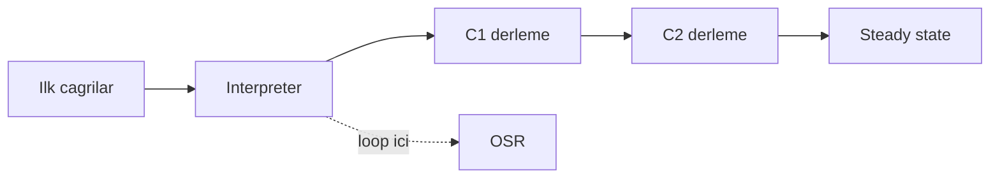
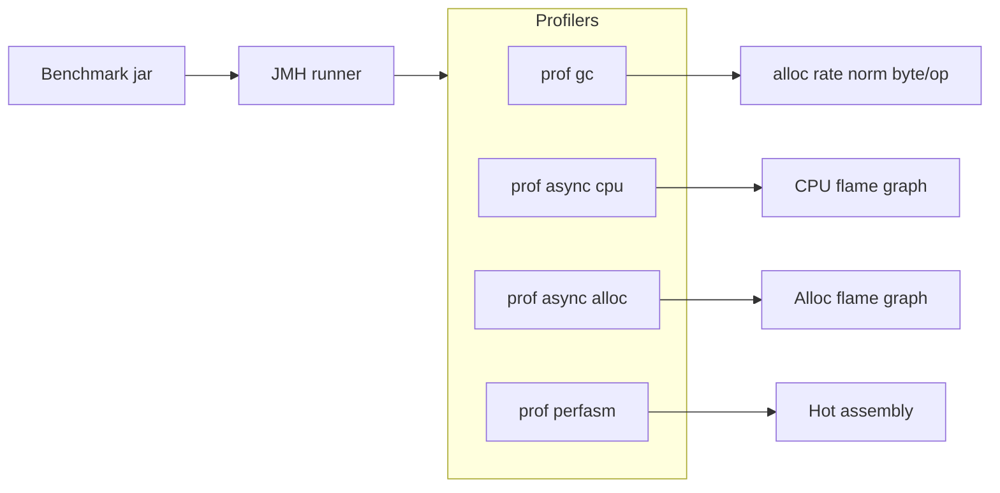
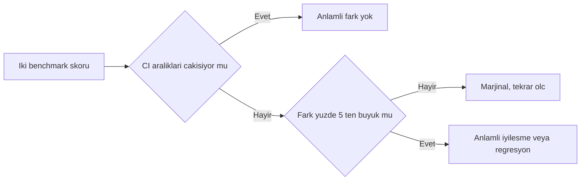
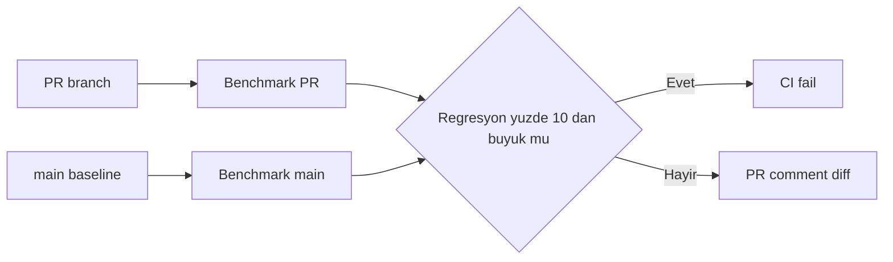

# Topic 9.6 — JMH Deep & CI Integration

```admonish info title="Bu bölümde"
- JIT compilation davranışını (interpreter → C1 → C2 → steady state, OSR) neden JMH'in ölçmek zorunda olduğunu
- Profiler entegrasyonunun derinliği: `-prof gc` (allocation rate), async-profiler (CPU + alloc flame graph), `-prof perfasm` (JIT assembly)
- State scope, Setup/TearDown level ve Blackhole'un DCE'yi nasıl bozduğunun iç mekaniği
- Benchmark sonucunu istatistiksel olarak yorumlama: `Score ± Error`, non-overlapping confidence interval kararı
- CI'da performance regression detection: dedicated runner, PR vs baseline, %10 regresyon eşiğiyle build fail
```

## Hedef

JMH'i banking-grade kullanmak: JIT davranışını, profiler entegrasyonunu (gc, async-profiler, perfasm), allocation rate ölçümünü, istatistiksel anlamlılığı ve CI'da regression detection'ı hatasız uygulamak. Odak, "ne kadar sürdü"den "neden bu kadar sürdü ve bu fark gerçek mi"ye geçmektir.

## Süre

Okuma: 1.5-2 saat • Kendini Sına: 45 dk • Pratik (opsiyonel): 4-5 saat • Toplam: ~2.5 saat (+ pratik)

## Önbilgi

- Faz 3.11 (JMH temeli) bitti — setup, `@Benchmark`, `@State`, `@Param`, Blackhole, `Score ± Error` biliyorsun
- Topic 9.4 (Profiling) bitti — flame graph okuyabiliyorsun
- JIT compiler temel kavramları (HotSpot, C1/C2)

---

## Kavramlar

### 1. Neden "deep"? JIT compilation davranışı

Faz 3'te "naive benchmark yalan söyler" dedik; burada **neden** yalan söylediğini JIT'in içine bakarak göreceğiz. Sebep tek: modern JVM kodu çalışırken agresifçe optimize eder ve bir mikro-benchmark yanlışlıkla bu optimizasyonları ölçer.

Klasik naive ölçüm neyin tuzağına düşer:

```java
long start = System.nanoTime();
for (int i = 0; i < 1_000_000; i++) {
    doSomething();                    // sonuç kullanılmıyor
}
long elapsed = System.nanoTime() - start;
```

**Dead code elimination (DCE):** JIT, sonucu kimse kullanmıyorsa çağrıyı komple siler. **Constant folding:** Girdi sabitse sonucu derleme anında hesaplar, ölçtüğün şey bir `return sabit` olur.

Asıl derin mesele **warmup**: HotSpot bir method'u önce interpreter'da çalıştırır, ~1500 çağrı sonra **C1** (hızlı, hafif optimizasyon), ~10000 çağrı sonra **C2** (agresif) ile derler. İlk ölçümlerin steady-state değil, karışık bir geçiş halidir.



Ek olarak **OSR (On-Stack Replacement)** uzun loop'ları loop ortasında yeniden derler; **inlining** caller context'e göre değişir; **loop unrolling** runtime'da farklı davranır. Bir de ölçüm penceresine düşen **GC pause** ve **CPU frequency scaling** (turbo boost / thermal throttle) var.

<mark>JMH bu sekiz faktörü de yönetir — bu yüzden mikro-benchmark için elle `System.nanoTime()` yazmak profesyonel bir hata sayılır.</mark>

```admonish warning title="Steady state olmadan ölçüm anlamsız"
Warmup iteration sayısını kısarsan C2 devreye girmeden ölçersin ve gerçekten 10x daha yavaş sonuçlar alırsın. Banking'de "prod'da hızlı ama benchmark'ta yavaş" şikayetlerinin büyük kısmı yetersiz warmup'tır. Minimum 3-5 warmup iteration, `@Fork` ile ayrı JVM.
```

### 2. Setup — dependency ve archetype

Deep kullanımda da temel bağımlılık aynı: `jmh-core` + annotation processor.

```xml
<dependency>
    <groupId>org.openjdk.jmh</groupId>
    <artifactId>jmh-core</artifactId>
    <version>1.37</version>
</dependency>
<dependency>
    <groupId>org.openjdk.jmh</groupId>
    <artifactId>jmh-generator-annprocess</artifactId>
    <version>1.37</version>
    <scope>provided</scope>
</dependency>
```

Sıfırdan proje için Maven archetype tek satırda uber-jar'lı iskelet üretir:

```bash
mvn archetype:generate -DinteractiveMode=false \
  -DarchetypeGroupId=org.openjdk.jmh \
  -DarchetypeArtifactId=jmh-java-benchmark-archetype \
  -DgroupId=com.bank.bench -DartifactId=banking-bench -Dversion=1.0
```

### 3. Benchmark anatomisi ve programatik runner

Deep tarafta önemli olan: benchmark parametrelerini annotation ile değil, **programatik `OptionsBuilder`** ile vermek — CI'da JVM flag'lerini, fork sayısını, profiler'ı tek yerden kontrol edebilmen için.

Önce annotation header'ı — mode, time unit, warmup/measurement/fork bu benchmark'ın "kontratı":

```java
@BenchmarkMode(Mode.AverageTime)
@OutputTimeUnit(TimeUnit.NANOSECONDS)
@State(Scope.Benchmark)
@Warmup(iterations = 5, time = 1)
@Measurement(iterations = 10, time = 1)
@Fork(value = 2, warmups = 1)
public class BigDecimalBenchmark {
    private BigDecimal a, b;

    @Setup(Level.Trial)
    public void setup() {
        a = new BigDecimal("1234.5678");
        b = new BigDecimal("9876.5432");
    }
}
```

Sonra ölçülen method'lar — her biri sonucu **return eder** ki JMH consumer'a versin ve DCE devreye girmesin:

```java
    @Benchmark public BigDecimal add()      { return a.add(b); }
    @Benchmark public BigDecimal multiply() { return a.multiply(b); }
    @Benchmark public BigDecimal divide()   { return a.divide(b, 4, RoundingMode.HALF_EVEN); }
```

Runner'ı programatik yazınca sonucu JSON'a döküp CI'da karşılaştırabilirsin:

```java
Options opt = new OptionsBuilder()
    .include(BigDecimalBenchmark.class.getSimpleName())
    .forks(2)
    .result("results.json")
    .resultFormat(ResultFormatType.JSON)
    .build();
new Runner(opt).run();
```

Çıktı `Score ± Error` formatındadır — bu satırları yorumlamak bu bölümün kalbi:

```
Benchmark                     Mode  Cnt    Score    Error  Units
BigDecimalBenchmark.add       avgt   20   45.234 ±  1.234  ns/op
BigDecimalBenchmark.multiply  avgt   20  120.456 ±  5.234  ns/op
BigDecimalBenchmark.divide    avgt   20  450.789 ± 15.234  ns/op
```

### 4. Mode seçimi — ne ölçtüğünü bilerek seç

**Mode**, JMH'in zamanı nasıl raporladığını belirler; yanlış mode banking SLO'sunu yanlış temsil eder.

| Mode | Anlam | Banking ne zaman |
|---|---|---|
| `Throughput` | Ops/sec | Throughput stress, kapasite planlama |
| `AverageTime` | Time/op | CPU-bound transfer compute latency |
| `SampleTime` | Dağılım p50, p99, p999 | Latency SLO — kuyruk davranışı |
| `SingleShotTime` | Tek atış, warmup yok | Cold start, setup overhead |
| `All` | Hepsi | Karşılaştırma |

SLO tartışması yapıyorsan `AverageTime` seni yanıltır: ortalama 2 ms olabilir ama p99 40 ms olabilir. <mark>Latency SLO'su konuşulan her yerde `SampleTime` kullan; banking'de p99/p999 kuyruğu ortalamadan daha kritiktir.</mark>

### 5. State scope ve Setup/TearDown level

**State scope**, benchmark durumunun thread'ler arasında nasıl paylaşıldığını belirler ve yanlış seçim ölçümü sessizce bozar.

| Scope | Anlam | Tuzak |
|---|---|---|
| `Scope.Benchmark` | Tüm thread'ler paylaşır | Mutable state → false sharing/contention ölçersin |
| `Scope.Thread` | Her thread'e ayrı instance | Paylaşılması gereken cache'i çoğaltırsın |
| `Scope.Group` | `@Group` başına — reader/writer ayrımı | Sadece `@Group` ile anlamlı |

```java
@State(Scope.Thread)
public class ThreadState {
    BigDecimal x;
    @Setup public void s() { x = new BigDecimal("100"); }
}
```

İkinci ekseni **`@Setup`/`@TearDown` level**'dır — kurulum ne sıklıkta çalışacak:

- `Level.Trial` — fork başına bir kez (pahalı, sabit kurulum: connection, dataset)
- `Level.Iteration` — her ölçüm iteration'ı başında (state'i tazelemek)
- `Level.Invocation` — her `@Benchmark` çağrısında (dikkat: ölçüm penceresine sızar, sadece zorunluysa)

`Level.Invocation` cazip görünür ama setup süresi ölçtüğün süreye karışabilir; hızlı bir operasyonu ölçüyorsan ölçümü tamamen bozar.

### 6. Blackhole ve DCE — iç mekanik

Faz 3'te "sonucu döndür ya da `bh.consume()` çağır" dedik; burada **neden** işe yaradığına bakalım. JIT bir değerin hiçbir gözlemlenebilir etkisi olmadığını kanıtlayabilirse hesaplamayı komple siler.

```java
@Benchmark
public void wrong() {
    BigDecimal r = a.add(b);      // r kullanılmıyor → JIT silebilir
}

@Benchmark
public BigDecimal correct() {
    return a.add(b);               // return → JMH consumer, silinemez
}
```

**Blackhole**, JIT'in "bu değer bir yere gidiyor" sanmasını sağlayan bir tüketicidir: değeri volatile bir alanla XOR'layıp saklar, böylece optimizer değeri canlı kabul eder ama gerçek bir yan etki maliyeti neredeyse sıfırdır. Tek çağrıda birden fazla sonucu tüketmen gerektiğinde şart:

```java
@Benchmark
public void multipleConsume(Blackhole bh) {
    bh.consume(a.add(b));
    bh.consume(a.multiply(b));     // ikisini de canlı tut
}
```

```admonish warning title="Blackhole'u atlarsan benchmark tamamen anlamsız"
Sonucu tüketmeyen bir benchmark "0.3 ns/op" gibi imkansız hızlı sonuçlar verir — bu, JIT'in kodu tamamen sildiğinin işaretidir. Şüphelen: ölçtüğün operasyondan çok daha hızlı bir sonuç görüyorsan DCE'ye yakalanmışsındır.
```

### 7. CompilerControl — inlining'i ölçmek

**`@CompilerControl`**, JIT'in bir method'u inline edip etmeyeceğini zorlar; method dispatch / inlining overhead'ini izole ölçmek için kullanılır.

```java
@CompilerControl(CompilerControl.Mode.DONT_INLINE)
private BigDecimal helper() { return a.add(b); }
```

Inline edilmiş bir çağrı ile edilmemiş bir çağrıyı karşılaştırınca method call overhead'ini görürsün — polymorphic dispatch'in maliyetini banking hot path'te tartışırken işe yarar.

### 8. Profiler entegrasyonu — "neden yavaş"ın cevabı

Buraya kadar "ne kadar sürdü"yü ölçtük; **profiler'lar "neden bu kadar sürdü"yü** açar. JMH'in gücü, profiler'ları benchmark'ın steady-state penceresine bağlamasıdır — flag'i eklersin, JMH her benchmark için ayrı profil çıkarır.



<mark>Profiler olmadan bir optimizasyonun neden işe yaradığını (veya yaramadığını) kanıtlayamazsın — sadece sayının değiştiğini görürsün, sebebini değil.</mark>

#### 8.1. `-prof gc` — allocation rate

En değerli profiler banking için budur. Latency'ye ek olarak **allocation** davranışını ölçer:

```bash
java -jar target/benchmarks.jar -prof gc BigDecimalBenchmark
```

```
BigDecimalBenchmark.add:gc.alloc.rate       8123 MB/sec
BigDecimalBenchmark.add:gc.alloc.rate.norm   168 B/op
```

`gc.alloc.rate.norm` = **operasyon başına allocate edilen byte**. `168 B/op` şu demek: `BigDecimal` immutable olduğu için her `add` yeni bir instance yaratıyor.

Bu sayı neden latency'den kritik olabilir: yüksek allocation rate → Eden hızlı dolar → sık minor GC → düzenli latency spike → p99 bozulur. Bir money operasyonu hot path'te saniyede milyonlarca kez çağrılıyorsa 168 B/op, GC baskısını sistem çapında hissedilir hale getirir.

```admonish tip title="Önce allocation, sonra latency"
Hot path'teki bir operasyonu değerlendirirken `gc.alloc.rate.norm` çoğu zaman `Score`'dan önemlidir. "0 B/op" hedefle: `long` tabanlı fixed-point aritmetik, `BigDecimal`'e göre hem daha hızlı hem sıfır allocation'dır — bu yüzden birçok banking core sistemi para için `long` minor-unit (kuruş) tutar.
```

#### 8.2. async-profiler — CPU ve alloc flame graph

`-prof gc` "ne kadar" der, async-profiler "**kim**" der. CPU ve allocation'ı flame graph olarak çıkarır:

```bash
java -jar target/benchmarks.jar \
  -prof async:event=cpu \
  -prof async:event=alloc \
  BigDecimalBenchmark
```

`event=cpu` en çok CPU yakan call stack'i, `event=alloc` allocation'ı kimin tetiklediğini gösterir. Banking pratiği: hot benchmark'ta beklenmedik bir allocation görürsen (ör. gizli autoboxing, `toString`, defensive copy) flame graph doğrudan satırı işaret eder.

```admonish warning title="async-profiler ortam gereksinimleri"
async-profiler perf event'lerine erişir; Linux'ta `perf_event_paranoid` ayarı ve genellikle yükseltilmiş yetki ister (`sysctl kernel.perf_event_paranoid=1`). Container içinde ek capability gerekebilir. macOS'ta kısıtlıdır — CI'da Linux runner tercih et.
```

#### 8.3. `-prof perfasm` — JIT assembly

En derin seviye: **`perfasm`**, C2'nin ürettiği asıl makine kodunu gösterir ve hot instruction'ları işaretler. "Bu döngü neden bu kadar yavaş" sorusunu assembly seviyesinde cevaplar.

```bash
java -jar target/benchmarks.jar -prof perfasm BigDecimalBenchmark
```

Çıktıda en çok sample toplayan assembly satırları yüzdeyle gösterilir — cache miss, bounds check, başarısız inline, beklenmedik `lock` prefix gibi şeyleri burada yakalarsın. Çalışması için JVM'e uygun `hsdis` (HotSpot disassembler) binary'si kurulu olmalı ve JVM'i `-XX:+UnlockDiagnosticVMOptions -XX:+PrintAssembly` ile açabilmelisin; hsdis kurulu değilse JMH sessizce boş assembly gösterir — önce onu doğrula.

`-prof jfr` de vardır: her benchmark için bir JDK Flight Recorder kaydı üretir; JMC ile sonradan derin analiz istersen bunu kullan.

### 9. Banking benchmark örnekleri

Deep tarafta örnekleri profiler gözüyle okuyacağız: hangi operasyon ne kadar allocate ediyor, hangisi lock contention'a giriyor.

#### Benchmark 1 — Money operasyonları ve allocation

`BigDecimal` operasyonlarını karşılaştırırken asıl mesele latency değil, her operasyonun yarattığı allocation ve `MathContext`'i her çağrıda yeniden kurmanın gizli maliyeti:

```java
@Benchmark public BigDecimal multiplyBigDecimal() { return amount.multiply(rate); }

@Benchmark public BigDecimal divideStatic()  { return amount.divide(rate, mc); }

@Benchmark public BigDecimal divideNewCtx()  {
    return amount.divide(rate, new MathContext(20, RoundingMode.HALF_EVEN));  // her çağrı yeni obje
}

@Benchmark public long longArithmetic() { return 123456L + 789012L; }   // fixed-point alternatifi
```

`-prof gc` ile bakınca beklenen tablo: `longArithmetic` ~1 ns / **0 B/op**, `add` ~50 ns, `divide` ~500 ns, `divideNewCtx` ise `MathContext` allocation'ı yüzünden `divideStatic`'ten belirgin fazla `B/op`. Bu, "`MathContext`'i field'da tut" kararını kanıtlar.

<details>
<summary>Tam kod: MoneyBenchmark (~40 satır)</summary>

```java
@BenchmarkMode(Mode.AverageTime)
@OutputTimeUnit(TimeUnit.NANOSECONDS)
@State(Scope.Thread)
public class MoneyBenchmark {

    private BigDecimal amount;
    private BigDecimal rate;
    private MathContext mc;

    @Setup
    public void setup() {
        amount = new BigDecimal("12345.6789");
        rate = new BigDecimal("1.0234");
        mc = new MathContext(20, RoundingMode.HALF_EVEN);
    }

    @Benchmark
    public BigDecimal addBigDecimal() {
        return amount.add(amount);
    }

    @Benchmark
    public BigDecimal multiplyBigDecimal() {
        return amount.multiply(rate);
    }

    @Benchmark
    public BigDecimal divideWithMathContext() {
        return amount.divide(rate, mc);
    }

    @Benchmark
    public BigDecimal newMathContextEveryCall() {
        return amount.divide(rate, new MathContext(20, RoundingMode.HALF_EVEN));
    }

    @Benchmark
    public long longArithmetic() {
        return 123456L + 789012L;   // BigDecimal alternatifi — fixed-precision
    }
}
```

</details>

#### Benchmark 2 — Concurrent map, reader/writer group

`Scope.Group` ve `@GroupThreads` gerçek prod yükünü taklit eder: çok okuma, az yazma. 3 reader + 1 writer aynı anda:

```java
@Benchmark @Group("readWrite") @GroupThreads(3)
public Account read() {
    return map.get(ThreadLocalRandom.current().nextLong(10_000));
}

@Benchmark @Group("readWrite") @GroupThreads(1)
public Account write() {
    return map.put(ThreadLocalRandom.current().nextLong(10_000), new Account());
}
```

`@Param({"HashMap", "ConcurrentHashMap", "Caffeine"})` ile üç map tipini aynı yük altında karşılaştırırsın — burada async-profiler CPU flame graph'i lock/CAS contention'ı görünür kılar.

#### Benchmark 3 — Serialization karşılaştırması

Bir `Transfer` nesnesini Jackson JSON vs Protobuf vs Avro ile serialize et; hem hız hem çıktı boyutu ölç:

```java
@Benchmark public byte[] jacksonSerialize()  throws Exception { return jackson.writeValueAsBytes(transfer); }
@Benchmark public byte[] protobufSerialize() { return protobuf.serialize(transfer); }
```

`-prof gc` burada belirleyicidir: JSON serialization genelde çok daha yüksek `B/op` üretir (string, buffer allocation) — Kafka throughput'unu düşüren gizli GC baskısının kaynağı çoğu zaman budur.

#### Benchmark 4 — Lock karşılaştırması

Balance güncellemesinde `synchronized` vs `ReentrantLock` vs `AtomicReference`'ı 8 thread contention altında karşılaştır. Buradaki asıl bulgu profiler'la gelir: hangi yaklaşım kaç CPU cycle'ını spin/park'ta harcıyor.

<details>
<summary>Tam kod: LockBenchmark (~34 satır)</summary>

```java
@State(Scope.Benchmark)
@Threads(8)
public class LockBenchmark {

    private final Object intrinsicLock = new Object();
    private final ReentrantLock reentrant = new ReentrantLock();
    private final StampedLock stamped = new StampedLock();
    private final AtomicReference<BigDecimal> atomic = new AtomicReference<>(BigDecimal.ZERO);

    private BigDecimal balance = BigDecimal.ZERO;

    @Benchmark
    public void synchronizedAdd() {
        synchronized (intrinsicLock) {
            balance = balance.add(BigDecimal.ONE);
        }
    }

    @Benchmark
    public void reentrantLockAdd() {
        reentrant.lock();
        try {
            balance = balance.add(BigDecimal.ONE);
        } finally {
            reentrant.unlock();
        }
    }

    @Benchmark
    public void atomicAdd() {
        atomic.updateAndGet(b -> b.add(BigDecimal.ONE));
    }
}
```

</details>

### 10. Sonuç yorumlama — istatistiksel anlamlılık

Bu bölümün en çok atlanan kısmı: iki sayının farklı görünmesi, farkın **gerçek** olduğu anlamına gelmez. `Score ± Error` içindeki **Error**, ~3σ güven aralığıdır (confidence interval).

İki benchmark'ı karşılaştır:

- A: `45 ± 2 ns` → gerçek değer 43-47 aralığında
- B: `50 ± 3 ns` → gerçek değer 47-53 aralığında

Aralıklar **çakışıyor** (47 civarı ortak) → bu fark **istatistiksel olarak anlamsız**; "A daha hızlı" diyemezsin.



Banking için pratik eşik: **non-overlapping CI + ≥ %5 fark** → anlamlı kabul et. Aksi halde daha çok fork/iteration ile Error'ı daralt, ya da farkı gürültü olarak bırak.

```admonish warning title="Overlap varsa iddia etme"
Mülakatta ve PR review'da en sık yapılan hata: `45 ns` ile `47 ns`'yi karşılaştırıp "optimizasyon işe yaradı" demek. Error margin'leri çakışıyorsa bu bir ölçüm gürültüsüdür. Önce Error'ı küçült (fork artır, ortamı sabitle), sonra karar ver.
```

### 11. Stabil benchmark ortamı

Error'ı büyüten şey ortam gürültüsüdür; ciddi ölçüm için makineyi sabitlersin. OS seviyesinde:

```bash
taskset -c 0,1 java -jar benchmarks.jar                              # CPU affinity
echo 1 | sudo tee /sys/devices/system/cpu/intel_pstate/no_turbo     # turbo boost kapat
sudo cpupower frequency-set -g performance                          # governor sabit
echo never | sudo tee /sys/kernel/mm/transparent_hugepage/enabled   # THP kapat
```

JVM seviyesinde ölçümü tekrarlanabilir yapan flag'ler:

```java
.jvmArgsAppend("-XX:-TieredCompilation")   // sadece C2, C1 gürültüsü yok
.jvmArgsAppend("-Xms4g", "-Xmx4g")          // heap sabit, resize yok
.forks(3).warmupIterations(5).measurementIterations(10)
```

`-XX:-TieredCompilation` C1'i devre dışı bırakır; ölçüm doğrudan C2 steady-state olur, tiered geçiş gürültüsü kalkar. Heap'i `Xms = Xmx` sabitlemek GC davranışını öngörülebilir yapar.

### 12. CI integration — performance regression detection

Bu topic'in "& CI Integration" kısmı: her PR'ı main baseline'ına karşı ölçüp regresyonu build fail'e çevirmek. İskelet, PR branch ve main'i aynı runner'da ölçüp karşılaştırır.

Önce iki ölçüm — PR branch ve baseline main, ikisi de JSON'a:

```yaml
      - name: Run benchmarks (this branch)
        run: |
          mvn clean package -DskipTests
          java -jar target/benchmarks.jar -rf json -rff branch-result.json -wi 3 -i 5 -f 2

      - name: Get baseline (main)
        run: |
          git checkout main && mvn clean package -DskipTests
          java -jar target/benchmarks.jar -rf json -rff main-result.json -wi 3 -i 5 -f 2
```

Sonra karşılaştırma — %10'dan büyük regresyon build'i düşürür:

```yaml
      - name: Compare
        run: |
          python compare.py main-result.json branch-result.json > diff.md
          python compare.py --threshold 0.10 main-result.json branch-result.json   # fail if > 10%
```

<mark>CI benchmark'ının tek şartı dedicated (izole) runner'dır — shared runner'ın gürültüsü sürekli false regression üretir ve ekip benchmark'a güvenmeyi bırakır.</mark>

<details>
<summary>Tam kod: perf.yml GitHub Actions workflow (~55 satır)</summary>

```yaml
# .github/workflows/perf.yml
name: Performance Benchmark

on:
  pull_request:
    paths:
      - 'src/main/java/com/bank/**'
      - 'pom.xml'

jobs:
  benchmark:
    runs-on: ubuntu-latest-cpu-isolated   # Dedicated runner — shared runner noise = false regression
    steps:
      - uses: actions/checkout@v4
      - uses: actions/setup-java@v4
        with:
          java-version: '21'
          distribution: 'temurin'

      - name: Run benchmarks (this branch)
        run: |
          mvn clean package -DskipTests
          java -jar target/benchmarks.jar \
            -rf json -rff branch-result.json \
            -wi 3 -i 5 -f 2

      - name: Get baseline (main)
        run: |
          git checkout main
          mvn clean package -DskipTests
          java -jar target/benchmarks.jar \
            -rf json -rff main-result.json \
            -wi 3 -i 5 -f 2

      - name: Compare
        run: |
          python compare.py main-result.json branch-result.json > diff.md
          cat diff.md
          # Fail if regression > 10%
          python compare.py --threshold 0.10 main-result.json branch-result.json

      - name: Comment PR
        uses: actions/github-script@v7
        with:
          script: |
            const diff = require('fs').readFileSync('diff.md', 'utf8');
            github.rest.issues.createComment({
              issue_number: context.issue.number,
              owner: context.repo.owner,
              repo: context.repo.repo,
              body: '## Benchmark Diff\n\n' + diff
            });
```

</details>

Regresyon karar kapısı görsel olarak:



Banking pratiği: para hareketi core kütüphaneleri için dedicated **bare-metal** runner; PR'a otomatik diff comment; nightly full-suite run.

### 13. JMH'i assertion olarak kullanma — Spring test entegrasyonu

Benchmark'ı JUnit içinden çağırıp bir eşiğe assert edebilirsin; böylece CI'da "bu method 1 ms'yi geçerse fail" garantisi kurarsın.

```java
@Test
void transferShouldBeFast() throws Exception {
    Options opt = new OptionsBuilder()
        .include("transferBenchmark")
        .warmupIterations(2).measurementIterations(3).forks(1)
        .build();

    RunResult r = new Runner(opt).run().iterator().next();
    double avgTime = r.getPrimaryResult().getScore();   // ns/op
    assertThat(avgTime).isLessThan(1_000_000);          // < 1 ms
}
```

Bu test'i normal suite'ten ayır (`@Tag("benchmark")` + surefire `excludedGroups`), sadece nightly çalıştır — yoksa her PR birkaç dakika benchmark'la yavaşlar.

### 14. Deep anti-pattern'ler

Faz 3'te temel anti-pattern'leri gördün; deep tarafın kendine has tuzakları şunlar:

- **Profilersiz iddia:** "X, Y'den hızlı" derken `-prof gc`/async-profiler kanıtı yok → sadece Score'a bakıp allocation/contention farkını kaçırırsın.
- **Overlapping CI'de sonuç ilan etmek:** Error margin'leri çakışırken "iyileşme var" demek. Önce Error'ı daralt.
- **Shared CI runner:** Gürültü false regression üretir; benchmark güvenilirliği ölür.
- **`Level.Invocation` setup'ı ölçüme sızdırmak:** Hızlı operasyonda setup maliyeti asıl ölçümü gölgeler.
- **I/O in `@Benchmark`:** DB/network mikro-benchmark'a girerse gürültü baskın olur; component'i izole ölç, prod trafiğini ayrıca profile et.
- **Premature optimization:** JMH bir farkı gösterse bile o kod prod bottleneck olmayabilir. Önce metric + profile (Topic 9.2, 9.4), sonra benchmark.
- **Benchmark'ı prod binary'de bırakmak:** JMH benchmark bir test artifact'tir, production jar'da bulunmamalı.

---

## Önemli olabilecek araştırma kaynakları

- JMH official docs + JMH samples (github) — özellikle `JMHSample_XX` serisi
- "Java Microbenchmarks Done Right" — Aleksey Shipilëv (JMH'in yazarı)
- Shipilëv blog — DCE, constant folding, false sharing yazıları
- async-profiler README — event tipleri, flame graph, perf_event ayarları
- "Optimizing Java" — Benjamin Evans (JIT + benchmark bölümleri)

---

## Kendini Sına

Aşağıdaki soruları önce **cevaba bakmadan** kendi cümlelerinle yanıtla — hepsi performance/benchmark odaklı TR bank mülakatlarında karşına çıkabilir. Takıldığında ilgili Kavramlar başlığına dön.

**S1. Naive `System.nanoTime()` loop'u ile mikro-benchmark neden yalan söyler? En az dört JIT/JVM faktörü say.**

<details>
<summary>Cevabı göster</summary>

Modern JVM kodu çalışırken agresif optimize eder ve naive ölçüm bu optimizasyonları ölçer. Dört ana faktör: dead code elimination (sonuç kullanılmıyorsa çağrı silinir), constant folding (sabit girdiyi derleme anında hesaplar), warmup/tiered compilation (interpreter → C1 → C2 geçişi; steady state'e ulaşmadan ölçmek yanıltır) ve GC interference (ölçüm penceresine düşen pause).

Ek olarak OSR (loop ortası yeniden derleme), inlining heuristics, loop unrolling ve CPU frequency scaling (turbo/throttle) vardır. JMH warmup, fork ve consumer mekanizmalarıyla bunların hepsini yönetir.

</details>

**S2. `-prof gc` ne ölçer? `gc.alloc.rate.norm` neden bazen `Score`'dan daha önemlidir?**

<details>
<summary>Cevabı göster</summary>

`-prof gc`, benchmark'ın steady-state penceresinde GC ve allocation davranışını ölçer. En kritik metriği `gc.alloc.rate.norm`: **operasyon başına allocate edilen byte** (B/op). Örneğin `BigDecimal.add` her çağrıda yeni immutable instance yarattığı için ~168 B/op üretir.

Bu sayı Score'dan önemli olabilir çünkü yüksek allocation rate → Eden hızlı dolar → sık minor GC → düzenli latency spike → p99 bozulur. Hot path'te "hızlı ama çöp üreten" bir operasyon sistemi GC baskısıyla yorar; bu yüzden birçok banking core sistemi para için `long` minor-unit tutup 0 B/op hedefler.

</details>

**S3. Blackhole tam olarak ne yapar ve onu atlarsan ne olur?**

<details>
<summary>Cevabı göster</summary>

Blackhole, JIT'in bir hesaplama sonucunu "canlı" (bir yere gidiyor) sanmasını sağlayan özel bir tüketicidir. `bh.consume(value)` değeri volatile bir alanla birleştirip saklar, böylece optimizer değeri ölü kabul edip silemez ama gerçek yan etki maliyeti neredeyse sıfır kalır. Tek çağrıda birden fazla sonuç üretiyorsan (return tek değer alabildiği için) Blackhole şarttır.

Atlarsan dead code elimination devreye girer: JIT sonucu kimse kullanmıyor görüp hesaplamayı komple siler. Belirtisi, ölçtüğün operasyondan imkansız derecede hızlı bir sonuçtur (ör. `add` için 0.3 ns/op). O sayıyı görürsen benchmark'ın DCE'ye yakalandığını anlarsın.

</details>

**S4. İki benchmark sonucunu nasıl doğru yorumlarsın? `45 ± 2 ns` ile `47 ± 3 ns` için "biri daha hızlı" diyebilir misin?**

<details>
<summary>Cevabı göster</summary>

Her sonucu `Score ± Error` olarak okursun; Error ~3σ confidence interval'dır. `45 ± 2` gerçek değerin 43-47, `47 ± 3` ise 44-50 aralığında olduğunu söyler. Bu iki aralık çakıştığı için fark istatistiksel olarak **anlamsızdır** — "biri daha hızlı" diyemezsin, bu ölçüm gürültüsü olabilir.

Anlamlı karar için iki koşul: confidence interval'lar çakışmamalı **ve** fark ≥ %5 olmalı. Çakışma varsa daha çok fork/iteration ile Error'ı daralt veya ortamı sabitle (turbo off, CPU affinity, `-XX:-TieredCompilation`), sonra tekrar ölç. PR review'da en sık hata, çakışan aralıklara bakıp "optimizasyon işe yaradı" demektir.

</details>

**S5. `Mode.AverageTime` ile `Mode.SampleTime` arasındaki fark nedir? Banking latency SLO'su için hangisi?**

<details>
<summary>Cevabı göster</summary>

`AverageTime` operasyon başına ortalama süreyi verir — tek bir sayı. `SampleTime` ise sürelerin dağılımını (p50, p90, p99, p999) örnekleyerek verir. Ortalama, kuyruk davranışını gizler: ortalama 2 ms olan bir operasyonun p99'u 40 ms olabilir.

Banking'de SLO'lar neredeyse her zaman percentile üzerinden konuşulur ("p99 < 50 ms"), ortalama üzerinden değil. Bu yüzden latency SLO'su ölçüyorsan `SampleTime` kullanırsın; kuyruk (tail latency) çoğu zaman ortalamadan daha kritiktir. `AverageTime` daha çok CPU-bound saf compute karşılaştırması içindir.

</details>

**S6. async-profiler ile `-prof gc` arasındaki fark nedir? Ne zaman hangisini kullanırsın?**

<details>
<summary>Cevabı göster</summary>

`-prof gc` "ne kadar allocate ediliyor"u sayısal verir (`gc.alloc.rate.norm` = B/op); toplam allocation baskısını görürsün ama kaynağını değil. async-profiler ise "**kim** allocate/CPU yakıyor"u flame graph olarak verir (`event=alloc`, `event=cpu`) — call stack'te tam satırı işaret eder.

Akış tipik olarak şöyle: önce `-prof gc` ile yüksek allocation'ı tespit edersin, sonra `-prof async:event=alloc` ile o allocation'ı kimin (gizli autoboxing, `toString`, defensive copy) tetiklediğini flame graph'te bulursun. En derin seviyede `-prof perfasm` C2'nin ürettiği assembly'yi gösterir; cache miss, bounds check, başarısız inline gibi şeyleri instruction seviyesinde yakalarsın (hsdis gerektirir).

</details>

**S7. CI'da benchmark koşarken neden "dedicated runner" şart? Regresyonu nasıl bir eşiğe bağlarsın?**

<details>
<summary>Cevabı göster</summary>

Shared CI runner'da diğer job'lar CPU, cache ve bellek için yarışır; bu gürültü benchmark Error'ını şişirir ve sürekli **false regression** üretir. Ekip birkaç yanlış alarmdan sonra benchmark'a güvenmeyi bırakır. Bu yüzden izole (ideal olarak bare-metal) runner şarttır; ayrıca turbo off, CPU affinity ve sabit heap ile ortamı deterministik yaparsın.

Regresyonu somut bir eşiğe bağlarsın: PR branch'ini main baseline'ına karşı ölç, farkı bir compare script'iyle hesapla ve ör. %10'dan büyük regresyonda build'i fail et. Sonucu PR'a otomatik comment olarak yaz ki geliştirici farkı hemen görsün. Eşik, ortamın gürültü tabanının üstünde olmalı — gürültü %5 ise %3 eşik anlamsızdır.

</details>

---

## Defter notları

1. "Naive benchmark neden yalan söyler (DCE, constant folding, warmup/tiered, GC, OSR): ____."
2. "JIT compilation lifecycle: interpreter → C1 → C2 → steady state, warmup neden şart: ____."
3. "`-prof gc` `gc.alloc.rate.norm` (B/op) ne ölçer, neden latency'den kritik olabilir: ____."
4. "async-profiler `event=cpu` vs `event=alloc` flame graph ne gösterir: ____."
5. "`-prof perfasm` JIT assembly, hsdis gereksinimi, ne zaman kullanılır: ____."
6. "Blackhole DCE'yi nasıl engeller, atlanınca belirti (imkansız hız): ____."
7. "State scope (Thread/Benchmark/Group) + Setup/TearDown level (Trial/Iteration/Invocation): ____."
8. "Mode seçimi: AverageTime vs SampleTime (p99), banking SLO için hangisi: ____."
9. "`Score ± Error` non-overlapping CI + ≥ %5 fark → anlamlılık kararı: ____."
10. "CI regression: dedicated runner + PR vs baseline + %10 eşik + PR comment: ____."

```admonish success title="Bölüm Özeti"
- Mikro-benchmark JIT'i (DCE, constant folding, warmup/tiered C1-C2, OSR) ölçer; JMH warmup + fork + consumer ile bunları yönetir — elle `System.nanoTime()` profesyonel hatadır
- Profiler entegrasyonu "neden yavaş"ı açar: `-prof gc` (allocation rate/norm), async-profiler (CPU + alloc flame graph, "kim"), `-prof perfasm` (JIT assembly, hsdis gerektirir)
- `gc.alloc.rate.norm` (B/op) hot path'te çoğu zaman Score'dan kritiktir: yüksek allocation → sık minor GC → p99 latency spike; banking core sık sık `long` minor-unit ile 0 B/op hedefler
- Sonuç yorumlama istatistikseldir: `Score ± Error` çakışan confidence interval'larda fark anlamsızdır; anlamlılık için non-overlapping CI + ≥ %5 fark gerekir
- CI regression detection: dedicated (izole) runner + sabit ortam + PR vs main baseline + %10 regresyon eşiği build fail + otomatik PR comment
- Mode'u SLO'ya göre seç (latency için `SampleTime`/p99), state scope ve Setup level'ı ölçümü bozmayacak şekilde kur, Blackhole'u asla atlama
```

---

## Pratik yapmak istersen

Kavramları koda dökmek istersen aşağıdaki iki ek hazır: test yazma rehberi profiler ve regresyon senaryoları için örnek iskeletler içerir; Claude-verify prompt'u ile yazdığın JMH setup'ını banking-grade perspektiften denetletebilirsin.

<details>
<summary>Test/deney yazma rehberi</summary>

### Deney 9.6.1 — JMH proje kurulumu

Maven archetype veya manuel dependency ile basit bir benchmark çalıştır (`BigDecimalBenchmark`). Uber-jar build olsun, `java -jar target/benchmarks.jar` çıktısını gör.

### Deney 9.6.2 — BigDecimal suite + allocation

`add`, `multiply`, `divide` (MathContext static vs per-call), `longArithmetic`. `-prof gc` ile çalıştır; `gc.alloc.rate.norm` sütununu karşılaştır. `longArithmetic`'in 0 B/op, `newMathContextEveryCall`'un fazladan B/op ürettiğini doğrula.

### Deney 9.6.3 — Parameter sweep cache benchmark

`@Param({"HashMap","ConcurrentHashMap","Caffeine"})` × 4 size matrisi. `read()` benchmark'ını `Scope.Benchmark @Threads(4)` ile koş, sonuç matrisini yorumla.

### Deney 9.6.4 — Serialization + GC profili

`Transfer` için Jackson vs Protobuf. Hem hız hem `-prof gc` B/op karşılaştır; JSON'un neden daha yüksek allocation ürettiğini flame graph ile göster.

### Deney 9.6.5 — Lock benchmark, contention profili

`synchronized` vs `ReentrantLock` vs `AtomicReference`, 1/4/8 thread. `-prof async:event=cpu` ile hangi yaklaşımın spin/park'ta ne kadar cycle harcadığını flame graph'te incele.

### Deney 9.6.6 — perfasm ile assembly

En hızlı benchmark'ı `-prof perfasm` ile koş (hsdis kurulu olmalı). En çok sample toplayan assembly satırlarını incele; başarılı inline / bounds check elimination olup olmadığını gör.

### Deney 9.6.7 — İstatistiksel anlamlılık

Aynı benchmark'ı üç kez koş. Error margin'lerin çakışıp çakışmadığını yorumla. Sonra fork sayısını 2'den 5'e çıkar, Error'ın daralıp daralmadığını gözlemle.

### Deney 9.6.8 — Spring test assertion

JUnit test'inde `OptionsBuilder` ile bir benchmark çalıştır, `RunResult.getPrimaryResult().getScore()` üzerinden bir eşiğe assert et. `@Tag("benchmark")` + surefire `excludedGroups` ile normal suite'ten ayır.

```java
@Test
@Tag("benchmark")
void bigDecimalAddShouldBeUnder100Ns() throws Exception {
    Options opt = new OptionsBuilder()
        .include(BigDecimalBenchmark.class.getSimpleName() + "\\.add")
        .warmupIterations(3).measurementIterations(5).forks(1)
        .build();
    RunResult r = new Runner(opt).run().iterator().next();
    assertThat(r.getPrimaryResult().getScore()).isLessThan(100.0);   // ns
}
```

### Deney 9.6.9 — CI regression gate

GitHub Actions workflow (yukarıdaki `perf.yml`). PR'da benchmark koşsun, main baseline'ıyla `compare.py` üzerinden karşılaştırsın, %10 regresyonda fail etsin, diff'i PR'a comment yazsın.

### Deney 9.6.10 — Production-tied real-world

Prod'da yavaş bir method seç (gerçek veya simüle). Topic 9.2/9.4 ile profile → suspect method'u JMH'la izole ölç → fix candidate'ı `-prof gc` + Score ile eskisine karşı karşılaştır → non-overlapping CI ile iyileşmeyi kanıtla.

</details>

<details>
<summary>Claude-verify prompt</summary>

```
JMH setup'ımı banking-grade kriterlere göre değerlendir. Eksikleri işaretle, kod yazma:

1. Setup:
   - jmh-core + annotation processor dependency?
   - Uber-jar build (benchmarks.jar)?
   - JUnit entegrasyonu (assertion threshold, @Tag ile ayrık)?

2. Benchmark design:
   - Mode SLO'ya uygun mu (latency için SampleTime/p99)?
   - State scope doğru mu (Thread vs Benchmark vs Group)?
   - Setup/TearDown level ölçüme sızmıyor mu (Invocation dikkat)?
   - Blackhole veya return ile DCE engellenmiş mi?
   - Forks >= 2, warmup >= 3 iteration?

3. Profiler integration:
   - -prof gc ile gc.alloc.rate.norm (B/op) okunuyor mu?
   - async-profiler event=cpu ve event=alloc kullanılmış mı?
   - -prof perfasm denenmiş mi (hsdis kurulu)?
   - Hot path'te allocation azaltma değerlendirilmiş mi (long vs BigDecimal)?

4. Statistical:
   - Score +/- Error raporlanıyor mu?
   - Karşılaştırmada non-overlapping CI kontrol ediliyor mu?
   - >= %5 fark "anlamlı" eşiği uygulanıyor mu?

5. Stable environment:
   - Dedicated runner CI?
   - CPU affinity (taskset), turbo/HT disable?
   - Sabit heap (Xms=Xmx), -XX:-TieredCompilation değerlendirilmiş mi?
   - Runlar arası aynı JVM flag'leri?

6. CI integration:
   - PR benchmark vs main baseline?
   - Regresyon > %10 build fail?
   - Diff PR comment olarak yazılıyor mu?

7. Anti-pattern:
   - Naive System.nanoTime() YOK?
   - I/O in @Benchmark YOK?
   - Result discard (Blackhole yok) YOK?
   - Single fork single run YOK?
   - Shared CI runner YOK?
   - Premature optimization (önce metric+profile) YOK?
   - Benchmark prod binary'de YOK?

Her madde için PASS / FAIL / EKSIK işaretle, kanıt göster, kod yazma.
```

</details>
