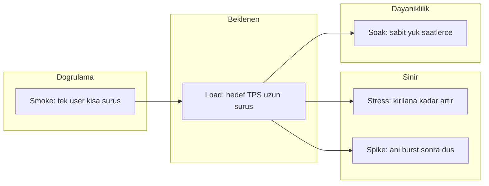
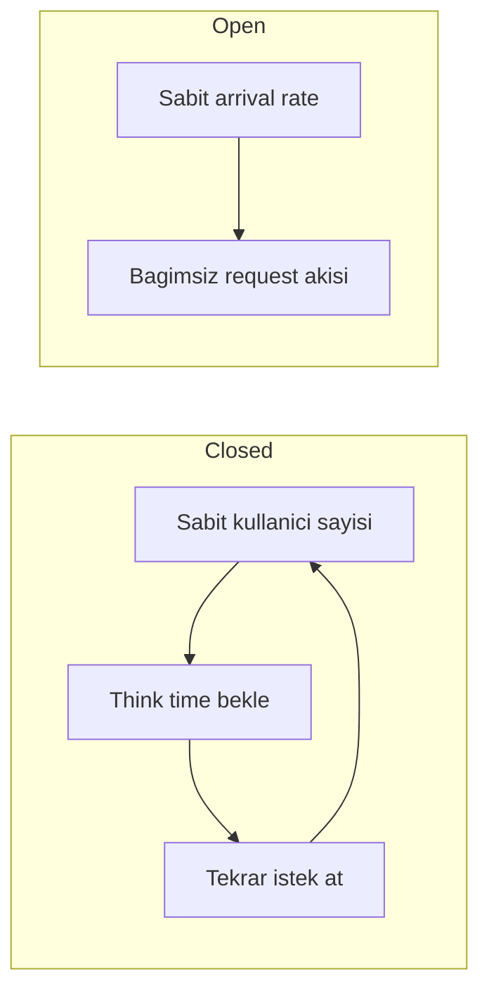
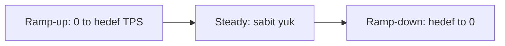
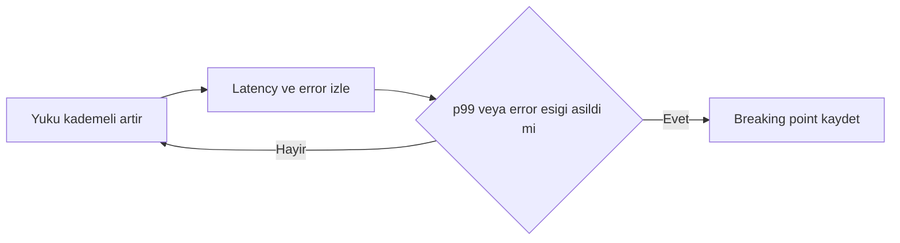

# Topic 9.7 — Load Testing: Gatling, k6, JMeter

```admonish info title="Bu bölümde"
- Beş test tipini (smoke, load, stress, spike, soak) ne zaman kullandığını ve banking karşılığını
- Breaking point'i nasıl bulacağını: yükü kademeli artır, latency izle, kırılma noktasını kaydet
- Gatling (Scala DSL) ve k6 (JavaScript) ile production-realistic banking simülasyonu yazmayı
- Open vs closed workload model, realistic endpoint mix ve think time modellemeyi
- Ortalama yerine neden mutlaka percentile'a (p95/p99) bakman gerektiğini
- Load test'i observability stack ile birleştirip root cause'a inmeyi
```

## Hedef

Banking endpoint'lerini production-realistic load test etmek: Gatling Scala DSL, k6 JavaScript, JMeter karşılaştırma. Test tipleri (smoke, load, stress, spike, soak), ramp-up/steady/ramp-down profili, banking workload modelleme, observability stack ile entegrasyon, breaking point analizi, capacity planning.

## Süre

Okuma: 2 saat • Kendini Sına: 30 dk • Pratik (opsiyonel): 3-4 saat • Toplam: ~2.5 saat (+ pratik)

## Önbilgi

- Topic 9.1-9.6 bitti (load test gerçek değer ancak observable system'de üretir)
- HTTP, REST, JSON rahat
- İstatistiksel p50/p95/p99'un ne anlama geldiği

---

## Kavramlar

### 1. Load test tipleri — hangi soruya cevap arıyorsun

Her test tipi ayrı bir soruya cevap verir; "sistem kaç TPS kaldırır" ile "8 saat ayakta kalır mı" bambaşka testlerdir. Önce hangi soruyu sorduğunu netleştir, tip ondan sonra gelir.

| Test tipi | Hedef | Süre | Banking use case |
|---|---|---|---|
| **Smoke** | Build doğrulama | 1-5 dk | CI/CD her PR |
| **Load** | Beklenen yük altında perf | 30-60 dk | Pre-release |
| **Stress** | Breaking point bul | 1-2 saat | Capacity planning |
| **Spike** | Ani burst (FAST kampanyası, maaş günü) | 5-15 dk | Resilience |
| **Soak** | Uzun süre, memory leak | 4-24 saat | Production-readiness |
| **Volume** | Big data input | Veri bağımlı | Batch (Phase 5) |
| **Chaos** | Failure injection | Değişken | Resilience (Phase 7) |

Bu tipleri yoğunluk ve amaç eksenine oturtunca ilişki netleşir:



Banking için <mark>soak test özellikle kritiktir</mark> — overnight batch periyotları ve memory leak ancak saatler süren sabit yükte kendini gösterir, kısa load test'te asla yakalanmaz.

### 2. Workload modeling — banking-realistic trafik

Yük üretmenin iki temel modeli var ve seçim sonuçları değiştirir. **Closed model** sabit sayıda kullanıcı tutar (login session), her kullanıcı think time bekleyip yeniden istek atar. **Open model** ise sabit bir request rate (per-second TPS) üretir; arrival'lar birbirinden bağımsızdır.



<mark>Production banking genelde open model'dir</mark> — REST API ve event-driven trafik, kullanıcı sayısından değil saniyedeki istek hızından beslenir. Closed model, sistem yavaşladığında yükü de kendiliğinden azaltır (kullanıcı yanıt bekler); bu gerçek TPS baskısını gizler.

Realistic endpoint mix, tek endpoint'i dövmekten çok daha değerlidir:

```
50% account.read (balance check)
20% transactions.read
15% transfer.write
10% card.read
3% login
2% other
```

Peak pattern'leri de modele katmalısın:

- Maaş günü (ayın 1-15. günü) → 5x TPS
- Festival arefesi (kurban bayramı) → spike
- 9-17 iş saatleri → off-hours'ın 3x'i
- Tax deadline → batch + interactive mix

### 3. Gatling — Scala DSL

Motivasyon: TR banking'de en yaygın tercihlerden biri, çünkü NIO tabanlı ve tek makineden yüksek TPS üretir. Test'i Scala DSL ile kod olarak yazarsın.

Önce HTTP protokolü ve kullanıcı feeder'ı — CSV'den login bilgisi besleniyor:

```scala
val httpProtocol = http
  .baseUrl("https://api.mavibank.com")
  .acceptHeader("application/json")
  .contentTypeHeader("application/json")
  .userAgentHeader("Gatling/Banking-LoadTest")

val authFeeder = csv("users.csv").circular   // username,password
```

Bir senaryo, gerçek bir kullanıcı akışını (login sonrası transfer + status check) temsil eder:

```scala
val transfer = scenario("Transfer")
  .exec(tokens)
  .exec(
    http("Initiate Transfer")
      .post("/v1/transfers")
      .header("Authorization", "Bearer ${token}")
      .header("X-Idempotency-Key", "${randomUuid()}")
      .body(StringBody("""{"fromAccount":"${fromAccount}","amount":"${randomFloat(100,5000)}","currency":"TRY"}"""))
      .check(status.in(200, 201))
      .check(jsonPath("$.transferId").saveAs("transferId"))
  )
  .pause(1, 5)
```

İşin kalbi injection profili: ramp-up (0'dan hedefe), steady (sabit) ve ramp-down üç fazı; ardından SLO assertion'ları:

```scala
setUp(
  accountRead.inject(
    rampUsersPerSec(0).to(200).during(60.seconds),
    constantUsersPerSec(200).during(5.minutes),
    rampUsersPerSec(200).to(0).during(30.seconds)
  ),
  transfer.inject(
    rampUsersPerSec(0).to(50).during(60.seconds),
    constantUsersPerSec(50).during(5.minutes)
  )
).protocols(httpProtocol)
  .assertions(
    global.responseTime.percentile3.lt(500),   // p95 < 500 ms
    global.responseTime.percentile4.lt(2000),  // p99 < 2000 ms
    global.failedRequests.percent.lt(0.5)       // error rate < 0.5%
  )
```

Bu ramp-up → steady → ramp-down profili neredeyse her load test'in iskeletidir:



<details>
<summary>Tam kod: BankingSimulation.scala (~80 satır)</summary>

```scala
// BankingSimulation.scala
import io.gatling.core.Predef._
import io.gatling.http.Predef._
import scala.concurrent.duration._

class BankingSimulation extends Simulation {
  
  val httpProtocol = http
    .baseUrl("https://api.mavibank.com")
    .acceptHeader("application/json")
    .contentTypeHeader("application/json")
    .userAgentHeader("Gatling/Banking-LoadTest")
  
  val authFeeder = csv("users.csv").circular
  // username,password
  
  val tokens = scenario("Login").exec(
    feed(authFeeder),
    http("Login")
      .post("/v1/auth/login")
      .body(StringBody("""{"username":"${username}","password":"${password}"}"""))
      .check(jsonPath("$.access_token").saveAs("token"))
  )
  
  val accountRead = scenario("Account Read")
    .exec(tokens)
    .repeat(10) {
      exec(
        http("Account Balance")
          .get("/v1/accounts/me/balance")
          .header("Authorization", "Bearer ${token}")
          .check(status.is(200))
          .check(jsonPath("$.balance").exists)
      ).pause(1, 3)
    }
  
  val transfer = scenario("Transfer")
    .exec(tokens)
    .exec(
      http("Initiate Transfer")
        .post("/v1/transfers")
        .header("Authorization", "Bearer ${token}")
        .header("X-Idempotency-Key", "${randomUuid()}")
        .body(StringBody("""{
          "fromAccount": "${fromAccount}",
          "toIban": "TR${randomNumeric(24)}",
          "amount": "${randomFloat(100,5000)}",
          "currency": "TRY",
          "description": "Load test"
        }"""))
        .check(status.in(200, 201))
        .check(jsonPath("$.transferId").saveAs("transferId"))
    )
    .pause(1, 5)
    .exec(
      http("Check Transfer Status")
        .get("/v1/transfers/${transferId}")
        .header("Authorization", "Bearer ${token}")
        .check(status.is(200))
    )
  
  setUp(
    accountRead.inject(
      // Ramp-up: 0 → 200 users in 60 seconds
      rampUsersPerSec(0).to(200).during(60.seconds),
      // Steady: 200 RPS for 5 minutes
      constantUsersPerSec(200).during(5.minutes),
      // Ramp-down
      rampUsersPerSec(200).to(0).during(30.seconds)
    ),
    transfer.inject(
      rampUsersPerSec(0).to(50).during(60.seconds),
      constantUsersPerSec(50).during(5.minutes)
    )
  ).protocols(httpProtocol)
    .assertions(
      global.responseTime.percentile3.lt(500),   // p95 < 500 ms
      global.responseTime.percentile4.lt(2000),  // p99 < 2000 ms
      global.failedRequests.percent.lt(0.5)      // error rate < 0.5%
    )
}
```

</details>

Çalıştırma ve çıktı:

```bash
mvn gatling:test
# veya
./gatling.sh -s BankingSimulation
```

Output: HTML report (response time'lar, distribution, error breakdown).

### 4. k6 — JavaScript DSL (modern favori)

Motivasyon: script-first yaklaşım; test JavaScript olduğu için versiyonlanır, review edilir, CI'a kolay girer. Threshold'lar tutmazsa k6 non-zero exit kodu verir — CI gate direkt buradan gelir.

Test tanımı `options` içinde yaşar; `ramping-arrival-rate` executor'ı open model'dir (TPS hedefler, VU değil):

```javascript
export const options = {
  scenarios: {
    account_read: {
      executor: 'ramping-arrival-rate',
      startRate: 0,
      timeUnit: '1s',
      preAllocatedVUs: 100,
      maxVUs: 500,
      stages: [
        { duration: '60s', target: 200 },
        { duration: '5m', target: 200 },
        { duration: '30s', target: 0 },
      ],
    },
  },
  thresholds: {
    http_req_duration: ['p(95)<500', 'p(99)<2000'],
    errors: ['rate<0.005'],
    transfer_duration: ['p(99)<3000'],
  },
};
```

Custom metric'ler (Trend, Rate, Counter) ile business-level ölçüm eklenir:

```javascript
const errorRate = new Rate('errors');
const transferDuration = new Trend('transfer_duration');
const transfersTotal = new Counter('transfers_total');
```

Session akışı gerçek kullanıcıyı taklit eder: login → account read → transfer, aralarda think time:

```javascript
export default function () {
  const token = login();
  const headers = { 'Authorization': `Bearer ${token}`, 'Content-Type': 'application/json' };

  group('account', () => {
    const balance = http.get(`${BASE}/v1/accounts/me/balance`, { headers });
    check(balance, { 'balance 200': r => r.status === 200 });
    errorRate.add(balance.status !== 200);
    sleep(1);
  });

  group('transfer', () => {
    const start = Date.now();
    const transfer = http.post(`${BASE}/v1/transfers`, body, {
      headers: { ...headers, 'X-Idempotency-Key': randomString(36) }
    });
    transferDuration.add(Date.now() - start);
    transfersTotal.add(1);
    check(transfer, { 'transfer 200/201': r => r.status === 200 || r.status === 201 });
    errorRate.add(transfer.status >= 400);
    sleep(2);
  });
}
```

<details>
<summary>Tam kod: banking-load.js (~95 satır)</summary>

```javascript
// banking-load.js
import http from 'k6/http';
import { check, group, sleep } from 'k6';
import { Trend, Rate, Counter } from 'k6/metrics';
import { randomString, randomIntBetween } from 'https://jslib.k6.io/k6-utils/1.4.0/index.js';

const errorRate = new Rate('errors');
const transferDuration = new Trend('transfer_duration');
const transfersTotal = new Counter('transfers_total');

export const options = {
  scenarios: {
    account_read: {
      executor: 'ramping-arrival-rate',
      startRate: 0,
      timeUnit: '1s',
      preAllocatedVUs: 100,
      maxVUs: 500,
      stages: [
        { duration: '60s', target: 200 },
        { duration: '5m', target: 200 },
        { duration: '30s', target: 0 },
      ],
    },
    transfer: {
      executor: 'ramping-arrival-rate',
      startRate: 0,
      timeUnit: '1s',
      preAllocatedVUs: 50,
      maxVUs: 200,
      stages: [
        { duration: '60s', target: 50 },
        { duration: '5m', target: 50 },
        { duration: '30s', target: 0 },
      ],
    },
  },
  thresholds: {
    http_req_duration: ['p(95)<500', 'p(99)<2000'],
    errors: ['rate<0.005'],
    transfer_duration: ['p(99)<3000'],
  },
};

const BASE = 'https://api.mavibank.com';

function login() {
  const res = http.post(`${BASE}/v1/auth/login`, JSON.stringify({
    username: 'user' + randomIntBetween(1, 1000),
    password: 'TestPass123!'
  }), { headers: { 'Content-Type': 'application/json' }});
  
  check(res, { 'login success': r => r.status === 200 });
  return res.json('access_token');
}

export default function () {
  const token = login();
  const headers = {
    'Authorization': `Bearer ${token}`,
    'Content-Type': 'application/json',
  };
  
  group('account', () => {
    const balance = http.get(`${BASE}/v1/accounts/me/balance`, { headers });
    check(balance, {
      'balance 200': r => r.status === 200,
      'balance has field': r => r.json('balance') !== undefined,
    });
    errorRate.add(balance.status !== 200);
    sleep(1);
  });
  
  group('transfer', () => {
    const start = Date.now();
    const body = JSON.stringify({
      fromAccount: 'acc-' + randomIntBetween(1, 1000),
      toIban: 'TR' + randomString(24, '0123456789'),
      amount: randomIntBetween(100, 5000),
      currency: 'TRY',
      description: 'Load test',
    });
    const transfer = http.post(`${BASE}/v1/transfers`, body, { 
      headers: { ...headers, 'X-Idempotency-Key': randomString(36) }
    });
    
    transferDuration.add(Date.now() - start);
    transfersTotal.add(1);
    
    check(transfer, {
      'transfer 200/201': r => r.status === 200 || r.status === 201,
      'has transferId': r => r.json('transferId') !== undefined,
    });
    errorRate.add(transfer.status >= 400);
    sleep(2);
  });
}
```

</details>

Çalıştırma ve output entegrasyonu:

```bash
k6 run banking-load.js

# Prometheus'a çıktı
k6 run --out experimental-prometheus-rw=http://prometheus:9090/api/v1/write banking-load.js

# Distributed (k6 cloud veya operator)
k6 cloud banking-load.js
```

### 5. JMeter — legacy ama her yerde

GUI-based (XML), Java tabanlı. Banking'de legacy sistemlerde hâlâ çok yaygın olduğu için tanıman gerekir.

**Güçlü yanları:** zengin plugin ekosistemi, distributed mode, görsel test plan.

**Zayıf yanları:** ağır memory kullanımı, GUI'nin load runner olarak kullanılmaması (CLI mode şart), JS DSL olmaması (her şey XML).

Modern tercih sıralaması: **k6 (script-first), Gatling (yüksek perf), JMeter (legacy uyumluluk)**.

### 6. Test senaryosu tasarımı — banking

Her tip için somut bir reçete lazım. **Smoke**, CI'da her PR'da build'i doğrular:

```
1 user, endpoint başına 1 request, 10 saniye
Assert: 200 OK, < 1s
Amaç: Build sanity
```

**Load**, pre-release'de performance regression'ı yakalar:

```
Ramp 0 → 500 RPS in 5 min
Steady 500 RPS for 30 min
Ramp 500 → 0 in 2 min
Assert: p95 < 500ms, error rate < 0.5%
```

**Stress**, kırılma noktasını arar:

```
Ramp 100 RPS → 5000 RPS over 1 hour
Devam et: error rate > 5% VEYA p99 > 10s olana dek
Kaydet: breaking point
Amaç: Capacity planning
```

**Spike**, ani burst'e dayanıklılığı ölçer:

```
Steady 100 RPS for 5 min
Spike to 2000 RPS for 1 min
Drop to 100 RPS for 5 min
Assert: 30s içinde recover, veri kaybı yok
Amaç: FAST kampanyası / maaş günü resilience
```

**Soak**, overnight çalışır ve memory leak'i açığa çıkarır:

```
Constant 200 RPS for 8 hours
İzle: Memory, GC, connection pool zamanla
Amaç: Memory leak detection (Topic 9.5)
```

```admonish tip title="Soak test'i asla atlama"
Kısa load test'ler "her şey yolunda" der ama slow memory leak, connection pool sızıntısı veya GC dejenerasyonu ancak saatlerce sabit yükte belirir. Banking'de production-readiness onayı vermeden önce en az bir 4-8 saatlik soak run şarttır; heap dump'ı Topic 9.5'teki baseline ile karşılaştır.
```

### 7. Breaking point'i bulmak

Stress test'in tek amacı sistemin nerede çöktüğünü sayısal olarak bilmek. Yöntem basit bir döngüdür: yükü kademeli artır, latency ve error'ı izle, bir eşik aşıldığında o TPS'i breaking point olarak kaydet.



<mark>Baseline ve breaking point olmadan "yeterince hızlı" tamamen subjektiftir</mark> — capacity planning ancak "sistem 3200 RPS'te p99'u 2s'yi aşıyor" gibi bir sayı ile yapılabilir.

### 8. Observability tie-in — sadece sayı değil, root cause

Load test tek başına sana bir sayı verir: "800 RPS'te p99 patladı." Bunun **neden** patladığını ancak observability stack söyler. İkisini birlikte çalıştırınca test bir teşhis aracına dönüşür:

```
Run k6 load test
   ↓
Live monitoring:
  - Grafana: TPS, error rate, p99 latency, CPU, memory, DB pool
  - Jaeger: trace exemplar (yavaş request'ler)
  - JFR: continuous profile (Topic 9.4)
   ↓
Bottleneck tespiti:
  - "p99 spike at 800 RPS"
  - Profile: BigDecimal.divide hot
  - Trace: DB query 1.5s
  - Metric: hikari pool exhausted
   ↓
Fix → re-run load test
```

```admonish warning title="Sayıya bakıp durma"
Load test'in en sık yapılan hatası, "p99 yüksek çıktı" deyip orada durmaktır. Metric bottleneck'i gösterir ama nedeni göstermez; trace exemplar'ı yavaş request'in hangi adımda takıldığını, JFR profile ise hangi metodun hot olduğunu verir. Bu üçlü olmadan capacity planning değil, tahmin yaparsın.
```

### 9. Banking-realistic data

Sentetik temiz veri gerçek davranışı gizler; 100k aynı kullanıcı = gerçekçi olmayan cache hit ratio. Önce production benzeri hacimde veri seed et:

```sql
-- 1M users
INSERT INTO customers SELECT generate_series, ... FROM generate_series(1, 1_000_000);
-- 5M accounts
INSERT INTO accounts ...;
-- 100M transactions (historical)
INSERT INTO transactions ...;
```

Kullanıcı feed'i (Gatling), önceden yaratılmış 100k gerçek kullanıcı:

```csv
# users.csv — username,password
user1,TestPass123!
user2,TestPass123!
```

Think time ve amount, uniform değil long-tail dağılmalı — gerçek kullanıcı böyle davranır:

```javascript
// k6 — exponential think time
function thinkTime() {
  return Math.random() < 0.7 ? randomIntBetween(1, 3) : randomIntBetween(5, 30);
  // 70% hızlı, 30% yavaş kullanıcı
}

// Banking amount distribution (long-tail)
function amount() {
  if (Math.random() < 0.6) return randomIntBetween(50, 500);      // 60% küçük
  if (Math.random() < 0.3) return randomIntBetween(500, 5000);    // 30% orta
  if (Math.random() < 0.09) return randomIntBetween(5000, 50000); // 9% büyük
  return randomIntBetween(50000, 200000);                          // 1% çok büyük
}
```

### 10. Banking-specific — idempotency under load

Load test performansı ölçer ama banking'de idempotency garantisini de yük altında sınayabilirsin. Aynı idempotency key ile ardışık retry, tek bir kayıt üretmeli:

```javascript
const idempotencyKey = randomString(36);

// Aynı request 3x (client retry simülasyonu)
for (let i = 0; i < 3; i++) {
  http.post(`${BASE}/v1/transfers`, body, {
    headers: { 'X-Idempotency-Key': idempotencyKey }
  });
}

// Doğrula: sadece 1 transfer kaydı oluştu
const res = http.get(`${BASE}/v1/transfers?idempotency_key=${idempotencyKey}`);
check(res, { 'exactly one transfer': r => r.json('count') === 1 });
```

### 11. Banking session lifecycle

Tek endpoint'i izole dövmek gerçekçi değildir; gerçek kullanıcı login olur, gezinir, ara sıra işlem yapar, çıkar. Senaryo bu akışı taklit etmeli:

```javascript
export default function () {
  const token = login();

  // Browse
  http.get('/accounts/me', { headers });
  sleep(2);
  http.get('/accounts/me/transactions', { headers });
  sleep(3);

  // Transfer
  http.post('/transfers', body, { headers });
  sleep(5);

  // Logout
  http.post('/auth/logout', null, { headers });
}
```

%100 transfer endpoint = gerçek dışı. Banking kullanıcısı önce gezinir, sonra ara sıra işlem yapar.

### 12. Sonuç yorumlama — ortalama yalan söyler

Load test raporunda ortalama response time'a bakmak en klasik hatadır: 100 ms ortalama, arkasında %1 kullanıcının 8 saniye beklediğini gizleyebilir. <mark>Mutlaka percentile'a (p95, p99) bak</mark>; banking'de kötü deneyimi yaşayan kuyruk (tail) kullanıcılardır, ortalama onları görünmez kılar.

Gatling raporu p50, p75, p95, p99, response time distribution histogramı, aktif kullanıcı ve error breakdown verir. Sinyalleri okumayı bilmek gerekir:

| Sinyal | Yorum |
|---|---|
| p50 stabil, p99 spike | Tail latency — GC pause, lock contention |
| Belli eşikten sonra error rate tırmanışı | Resource exhaustion (DB pool, thread) |
| Latency stabil ama TPS plateau | Throughput tavanı — vertical scale |
| Zamanla memory artışı | Memory leak (soak çalıştır) |
| GC frequency 10x | Allocation pressure (Topic 9.4) |
| 504 timeout | Upstream service yavaş |
| 503 | Service unavailable (deliberate veya kube eviction) |

### 13. CI entegrasyonu

Load test tek seferlik değil, sürekli bir gate olmalı; nightly çalışıp baseline ile karşılaştırıp regression'da alert vermeli. Önce schedule ve staging deploy adımı:

```yaml
# .github/workflows/load-test.yml
name: Nightly Load Test
on:
  schedule:
    - cron: '0 2 * * *'   # 02:00 UTC nightly
  workflow_dispatch:

jobs:
  load-test:
    runs-on: ubuntu-latest
    steps:
      - uses: actions/checkout@v4
      - name: Deploy to staging
        run: kubectl apply -k k8s/staging
      - name: Wait healthy
        run: kubectl wait --for=condition=ready pod -l app=banking-api --timeout=300s
```

Ardından k6 run, sonuç arşivi, baseline karşılaştırması ve fail'de Slack notify:

```yaml
      - name: Run k6 load test
        run: docker run --rm -v $(pwd):/scripts grafana/k6 run /scripts/banking-load.js
      - name: Upload result
        uses: actions/upload-artifact@v3
        with:
          name: load-test-result
          path: results/
      - name: Compare to baseline
        run: python compare_load.py baseline.json result.json
      - name: Slack notification
        if: failure()
        uses: 8398a7/action-slack@v3
```

### 14. Banking — load test anti-pattern'leri

Bu on madde, load test sonuçlarını değersizleştiren klasik hatalardır; mülakatta "bu setup'ta ne yanlış" sorusunun cephaneliği:

1. **Shared infrastructure'da test** — başka app'ler karışır. Banking için dedicated staging şart.
2. **Localhost load test** — NIC limitleri, network latency yok. Uzaktaki runner gerçekçi.
3. **Sentetik temiz veri** — 100k aynı kullanıcı, cache hit ratio gerçek değil. Realistic distribution kullan.
4. **Think time yok** — open hammer gerçek dışı. Banking kullanıcısı 2-30 sn düşünür.
5. **Tek endpoint hammer** — sadece `POST /transfers`. Gerçek kullanıcı önce gezinir.
6. **Bir kez çalıştır, bitti de** — varyans var. 3 run + istatistik.
7. **Observability'i yoksay** — sadece sayı. Profile/trace ile root cause.
8. **Koordinasyonsuz production load test** — banking için felaket: customer impact + chaos. Synthetic traffic marker'lı, izole path.
9. **Baseline yok** — karşılaştırmasız "yeterince hızlı" subjektif. Baseline + CI track.
10. **Load test = correctness test sanmak** — load test perf ölçer; correctness ayrı (integration test, Phase 12).

```admonish warning title="Production load test = koordinasyonsuz felaket"
Banking'de en tehlikeli anti-pattern koordinasyonsuz production load test'tir: gerçek müşteriler işlem yaparken sistemi zorlamak, ödeme kesintisi ve veri karışıklığı riski taşır. Production'da test gerekiyorsa synthetic traffic marker'ı, izole path ve ilgili tüm ekiplerle önceden koordinasyon zorunludur.
```

---

## Önemli olabilecek araştırma kaynakları

- Gatling docs
- k6 docs
- JMeter user manual
- "Web Scalability for Startup Engineers" — Artur Ejsmont
- Brendan Gregg load test metodolojisi
- Google SRE Workbook — load testing bölümü

---

## Kendini Sına

Aşağıdaki soruları önce **cevaba bakmadan** kendi cümlelerinle yanıtlamayı dene — hepsi TR bank mülakatlarında karşına çıkabilecek tarzda. Takıldığında ilgili Kavramlar başlığına dön, sonra tekrar dene.

**S1. Load, stress ve soak test arasındaki fark nedir? Her biri hangi soruya cevap verir?**

<details>
<summary>Cevabı göster</summary>

Load test "beklenen yük altında sistem SLO'ları tutuyor mu" sorusuna cevap verir — hedef TPS'te 30-60 dk çalışır, pre-release regression check'idir. Stress test "sistem nerede kırılır" der: yükü kademeli artırıp breaking point'i (error rate veya p99 eşiği aşıldığı TPS) bulur, capacity planning içindir. Soak test "sistem uzun süre ayakta kalır mı" sorusudur: sabit orta yükte 4-24 saat çalışır, memory leak, connection pool sızıntısı ve GC dejenerasyonunu açığa çıkarır.

Banking'de üçü de gerekir ama soak özellikle kritiktir, çünkü memory leak'ler kısa test'te asla görünmez, ancak saatlerce sabit yükte belirir.

</details>

**S2. Breaking point'i nasıl bulursun? Hangi metrikleri izlersin?**

<details>
<summary>Cevabı göster</summary>

Stress test ile: yükü kademeli artırırsın (örn. 100 RPS'ten 5000 RPS'e ramp), her adımda latency ve error rate'i izlersin. Önceden tanımlı bir eşik aşıldığında — tipik olarak error rate > %5 VEYA p99 > 10s — o anki TPS'i breaking point olarak kaydedersin.

İzlenecek metrikler: p99 latency (tail'in çöktüğü an), error rate (resource exhaustion sinyali), ve observability tarafında CPU, memory, DB connection pool doygunluğu. Sadece "kırıldı" demek yetmez; Grafana + trace + profile ile hangi kaynağın (DB pool, thread, CPU) önce tükendiğini de not edersin, çünkü capacity planning bu darboğaza göre yapılır.

</details>

**S3. Load test sonucunda ortalama response time yerine neden mutlaka percentile'a bakman gerekir?**

<details>
<summary>Cevabı göster</summary>

Ortalama, dağılımın kuyruğunu gizler. 100 ms ortalama response time, arkasında kullanıcıların %1'inin 8 saniye beklediğini saklıyor olabilir — çünkü hızlı çoğunluk ortalamayı aşağı çeker. Banking'de kötü deneyimi yaşayan tam da bu tail kullanıcılardır ve SLA'lar genelde p95/p99 üzerinden tanımlanır.

Bu yüzden threshold'ları p95 ve p99 üzerinden koyarsın (örn. p95 < 500ms, p99 < 2s). p50 stabil ama p99 spike yapıyorsa bu tail latency sinyalidir — GC pause veya lock contention. Ortalamaya baksan bu sorunu hiç görmezdin.

</details>

**S4. Open ve closed workload model arasındaki fark nedir? Banking için neden open model tercih edilir?**

<details>
<summary>Cevabı göster</summary>

Closed model sabit sayıda kullanıcı tutar; her kullanıcı bir istek atar, yanıt bekler, think time sonra tekrar ister. Open model ise sabit bir arrival rate (per-second TPS) üretir ve arrival'lar sistemin durumundan bağımsızdır.

Banking production trafiği (REST API, event-driven) open model'e uyar: gelen istek hızı kullanıcı sayısına değil dış talebe bağlıdır. Kritik nokta: closed model, sistem yavaşladığında kullanıcılar yanıt beklediği için yükü de otomatik düşürür — bu, gerçek TPS baskısını gizler ve sistemin gerçekte kaç request/saniye kaldırdığını göremezsin. Open model bu baskıyı gerçekçi tutar. k6'da `ramping-arrival-rate` executor'ı open model'dir.

</details>

**S5. Localhost'ta load test yapmak neden anti-pattern? Başka hangi klasik load test hatalarını sayarsın?**

<details>
<summary>Cevabı göster</summary>

Localhost'ta NIC limitleri ve gerçek network latency yoktur; ne client ne de server gerçekçi koşulda çalışır, sonuçlar yanıltıcı olur. Load test'i sistemden uzakta, dedicated bir runner'dan çalıştırmak gerçekçi latency'i modeller.

Diğer klasik hatalar: shared infrastructure'da test (başka app'ler karışır — dedicated staging şart), sentetik temiz veri (100k aynı kullanıcı, cache hit ratio gerçek değil), think time olmaması (open hammer gerçek dışı), tek endpoint hammer (gerçek kullanıcı gezinir), tek run ile karar (varyans var, 3 run + istatistik), observability'i yoksayma (sayı var ama root cause yok), ve baseline'sız "yeterince hızlı" demek (subjektif).

</details>

**S6. Load test'i observability ile birleştirmek neden değerlidir? Hangi araçları kullanırsın?**

<details>
<summary>Cevabı göster</summary>

Load test tek başına sadece bir sayı verir: "800 RPS'te p99 patladı." Nedenini söylemez. Observability, bu sayıyı bir teşhise dönüştürür — metric bottleneck'in nerede olduğunu, trace ve profile ise neden olduğunu gösterir.

Üçlü stack: Grafana (canlı TPS, error rate, p99, CPU, memory, DB pool doygunluğu), Jaeger (yavaş request'lerin trace exemplar'ı — hangi adımda takıldı), JFR continuous profile (hangi metod hot). Tipik akış: metric "hikari pool exhausted" der, trace "DB query 1.5s" gösterir, profile "BigDecimal.divide hot" der. Fix uygula, re-run. Bu döngü olmadan capacity planning değil tahmin yaparsın.

</details>

**S7. Idempotency'i yük altında nasıl test edersin? Neden bu önemli?**

<details>
<summary>Cevabı göster</summary>

Aynı `X-Idempotency-Key` ile ardışık (örn. 3x) aynı transfer request'ini gönderirsin — client retry senaryosunu simüle eder. Sonra o key ile sorgulayıp tam olarak 1 transfer kaydı oluştuğunu assert edersin.

Bu önemli çünkü yük altında client retry'lar, timeout'lar ve concurrent istekler artar; idempotency mantığı düşük yükte doğru çalışıp yüksek concurrency'de race condition yüzünden çift kayıt üretebilir. Banking'de çift kayıt = çift para hareketi demektir, bu yüzden idempotency garantisini sadece unit test'te değil, gerçekçi yük altında da sınamak gerekir.

</details>

**S8. Banking bir sistemde smoke, load ve soak test'i CI'da hangi sıklıkta çalıştırırsın?**

<details>
<summary>Cevabı göster</summary>

Smoke test her PR'da çalışır — 1 user, endpoint başına 1 request, birkaç saniye; build sanity'i doğrular ve hızlı olduğu için PR akışını yavaşlatmaz. Load test nightly çalışır (örn. cron 02:00): staging'e deploy, k6 run, sonucu baseline ile karşılaştır, regression varsa Slack notify. Soak test daha uzun olduğu için (4-8 saat) haftalık veya release öncesi çalıştırılır.

Kritik nokta baseline + regression detection'dır: her nightly run'ın sonucu arşivlenir ve önceki baseline ile karşılaştırılır ki "yeterince hızlı" subjektif kalmasın, sayısal bir gate olsun.

</details>

---

## Tamamlama kriterleri

- [ ] Beş test tipini (smoke, load, stress, spike, soak) ve banking use case'lerini açıklayabiliyorum
- [ ] Open vs closed workload model farkını ve banking'in neden open model olduğunu anlatabiliyorum
- [ ] Breaking point'i bulma yöntemini (yük artır → latency izle → eşik → kaydet) çizebiliyorum
- [ ] Ortalama yerine neden p95/p99'a bakılması gerektiğini örnekle söyleyebiliyorum
- [ ] Gatling injection profilini (ramp-up + steady + ramp-down) ve SLO assertion'larını okuyabiliyorum
- [ ] k6 ile realistic banking session (login → browse → transfer + think time) yazabiliyorum
- [ ] Idempotency-under-load senaryosunu ve neden önemli olduğunu açıklayabiliyorum
- [ ] Load test'i observability (Grafana + Jaeger + JFR) ile birleştirip root cause akışını çizebiliyorum
- [ ] En az 5 load test anti-pattern'ini sayabiliyorum
- [ ] (Opsiyonel) "Pratik yapmak istersen" bölümündeki testleri yazdım ve Claude-verify prompt'uyla doğrulattım

---

## Defter notları

1. "Load test tipleri (smoke/load/stress/spike/soak/volume) banking use case: ____."
2. "Open vs closed workload model + banking REST API neden open: ____."
3. "Realistic endpoint mix + think time + amount distribution banking: ____."
4. "Gatling Scala DSL strength + k6 JavaScript modern + JMeter legacy: ____."
5. "SLO threshold assertion CI gate (p95, p99, error rate): ____."
6. "Load test + observability tie (Grafana + Jaeger + JFR) neden: ____."
7. "Banking session lifecycle (login → browse → action → logout) realistic: ____."
8. "Idempotency under load (aynı key 3x = 1 kayıt) nasıl test edilir: ____."
9. "Stress breaking point + spike recovery + CB/autoscale verify: ____."
10. "CI integration nightly + baseline comparison + Slack notify: ____."

```admonish success title="Bölüm Özeti"
- Beş test tipi ayrı soruya cevap verir: smoke (build sanity, her PR), load (beklenen yükte SLO, pre-release), stress (breaking point, capacity), spike (burst resilience), soak (memory leak, saatlerce)
- Banking production open model'dir (sabit TPS); closed model sistem yavaşlayınca yükü gizler — realistic mix + think time + long-tail distribution şart
- Breaking point yöntemi: yükü kademeli artır, p99 ve error rate'i izle, eşik aşıldığı TPS'i kaydet; baseline olmadan "yeterince hızlı" subjektiftir
- Ortalama response time tail'i gizler — SLO'yu daima p95/p99 üzerinden koy; p50 stabil + p99 spike = tail latency (GC/lock)
- Load test tek başına sayı verir; Grafana + Jaeger trace exemplar + JFR profile üçlüsü olmadan bottleneck'in nedenine (root cause) inemezsin
- Anti-pattern'lerden kaçın: localhost test, sentetik temiz veri, think time yok, tek endpoint hammer, baseline yok, koordinasyonsuz production load test
```

---

## Pratik yapmak istersen

Kavramları koda dökmek istersen aşağıdaki iki ek hazır: test yazma rehberi k6 smoke, Gatling simulation ve CI invocation için örnek testler içerir; Claude-verify prompt'u ile kurduğun load testing setup'ını banking-grade perspektiften denetletebilirsin. Önerilen efor: rehberdeki smoke + load senaryolarını çalıştırıp bir stress run ile breaking point bulmak ~3-4 saat sürer.

<details>
<summary>Test yazma rehberi</summary>

### JUnit-driven k6/Gatling invocation (CI)

CI'da load test'i bir JUnit test'i olarak tetikleyip exit code üzerinden gate kurabilirsin. k6 threshold tutmazsa non-zero döner:

```java
@Test
@Tag("load")
void smokeTest() throws Exception {
    Process k6 = new ProcessBuilder("k6", "run", "smoke.js")
        .inheritIO()
        .start();
    int exitCode = k6.waitFor();
    assertThat(exitCode).isEqualTo(0);   // k6 threshold fail'de non-zero
}

@Test
@Tag("load")
void loadTestWithThresholds() throws Exception {
    // Gatling'i Maven plugin ile tetikle
    InvocationRequest req = new DefaultInvocationRequest();
    req.setPomFile(new File("pom.xml"));
    req.setGoals(List.of("gatling:test"));
    req.addArg("-Dgatling.simulationClass=com.bank.BankingLoadSimulation");

    Invoker invoker = new DefaultInvoker();
    InvocationResult result = invoker.execute(req);

    assertThat(result.getExitCode()).isEqualTo(0);
}
```

Çalıştırma:

```bash
mvn test -Dgroups=load
```

### Deney matrisi — önce tahmin et, sonra doğrula

Beş test tipini sırayla çalıştır ve beklediğin sonucu önce yaz, sonra raporla karşılaştır:

| Test | Setup | Beklenen sonuç |
|---|---|---|
| Smoke | 1 user, 10s | 200 OK, < 1s |
| Load | 500 RPS steady, 30 min | p95 < 500ms, error < 0.5% |
| Stress | 100 → 5000 RPS ramp | breaking point RPS kaydı |
| Spike | 100 → 2000 → 100 RPS | 30s içinde recovery |
| Soak | 200 RPS, 4-8 saat | memory grow yok |

> Not: Stress ve spike run'larını Grafana açıkken çalıştır; breaking point'te hangi kaynağın (DB pool, CPU, thread) önce tükendiğini not al. Soak sonunda heap dump'ı Topic 9.5 baseline'ı ile karşılaştır.

### Idempotency-under-load doğrulaması

Aynı `X-Idempotency-Key` ile 3x transfer gönder, sonra o key ile sorgula ve `count == 1` assert et. Concurrency'i artırdıkça (VU sayısı) hâlâ tek kayıt üretiliyor mu gözlemle — race condition tam burada ortaya çıkar.

</details>

<details>
<summary>Claude-verify prompt</summary>

```
Load testing setup'ımı banking-grade kriterlere göre değerlendir. Eksikleri 
işaretle, kod yazma:

1. Tool selection:
   - Gatling / k6 / JMeter pick rationale?
   - CI integration?

2. Test types:
   - Smoke (CI per PR)?
   - Load (pre-release)?
   - Stress (capacity planning)?
   - Spike (resilience)?
   - Soak (memory leak)?
   - Banking için tümü kapsanmış?

3. Workload modeling:
   - Realistic endpoint mix (50/20/15/10/5)?
   - Peak pattern (maaş günü, festival)?
   - Open model (TPS) banking için?
   - Think time exponential?
   - Amount distribution long-tail?

4. Banking specific:
   - Idempotency under load test?
   - Login → browse → action flow?
   - 100k pre-seeded users?
   - X-Idempotency-Key header?

5. SLO assertions:
   - p95 < 500ms threshold?
   - p99 < 2s threshold?
   - Error rate < 0.5%?
   - CI fail on regression?

6. Observability tie:
   - Live Grafana monitor during test?
   - Jaeger exemplar trace?
   - JFR continuous profile?
   - Root cause workflow documented?

7. Environment:
   - Dedicated staging (shared YOK)?
   - Realistic network latency (localhost YOK)?
   - Production-similar data volume?
   - CI runner dedicated?

8. CI integration:
   - Smoke per PR?
   - Load nightly?
   - Soak weekly?
   - Result archive + baseline diff?
   - Slack notification?

9. Stress / spike:
   - Breaking point recorded?
   - Recovery from spike measured?
   - Circuit breaker verify (Phase 7)?
   - Autoscale trigger verify?

10. Anti-pattern:
    - Localhost test YOK?
    - Synthetic clean data YOK?
    - No think time YOK?
    - Single endpoint hammer YOK?
    - Uncoordinated production load test YOK?
    - No baseline comparison YOK?

Her madde için PASS / FAIL / EKSIK işaretle.
```

</details>
