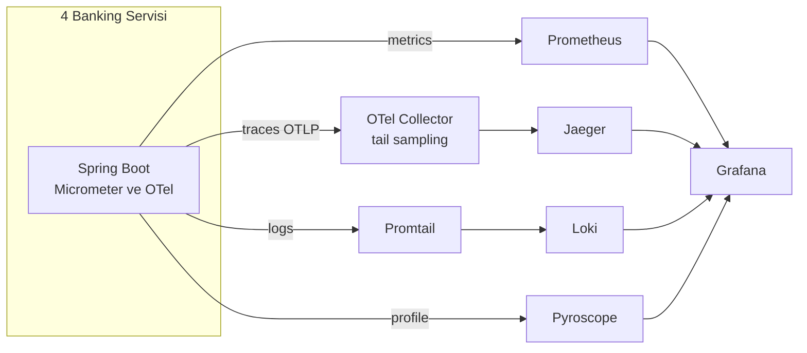
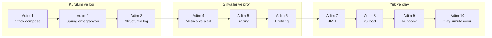
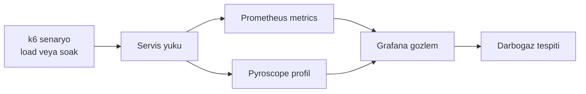
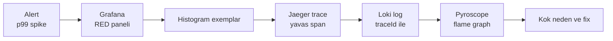

# Phase 9 Mini-Project — Banking Observability Stack (End-to-End)

```admonish info title="Bu projede"
- Phase 7-8'in banking microservice'lerine **full observability** ekliyorsun: structured logging + metrics + distributed tracing + profiling — dört sinyal tek stack'te
- Loki + Prometheus + Jaeger + Pyroscope + Grafana'yı docker-compose ile ayağa kaldırıp 4 servisi OTLP ile bağlıyorsun
- k6 ile yük üretip 10 banking runbook yazıyor, 5 arızayı **bilerek** kırıp metric → trace → log → profile zinciriyle teşhis ediyorsun
- Sonunda 3 AM'de alarm çaldığında self-service teşhis yapabilen production-grade bir gözlem katmanın oluyor
```

## Hedef

Phase 9'un 7 topic'inde logging, metrics, tracing, profiling, JMH ve load testing çalıştın. Bu projede hepsini **tek stack'te** birleştirip Phase 7-8 servislerine takıyorsun. Bu mini-project Phase 9'un **synthesis**'i — yeni teori yok, **operasyonel olgunluk** var: bir arızayı gösterip teşhis edene kadar takip etmek.

Projenin sonunda banking stack'in şunlara sahip olacak:

- Loki + Prometheus + Jaeger + Pyroscope + Grafana docker-compose stack'i
- 4 serviste JSON structured logging + MDC + masking + audit marker
- 4 serviste 10+ custom banking metric + 4 Grafana dashboard + 8+ alert
- Distributed tracing (auto + manuel span + baggage) + tail-based sampling
- Continuous profiling (Pyroscope + JFR) + JMH benchmark CI
- k6 load test suite + 10 incident runbook + 5 kasten kırma senaryosu

```admonish tip title="Süre ve önbilgi"
10-12 gün ayır (günde ~3 saat). Başlamadan önce: Phase 8 mini-project tamam, Phase 9'un 7 topic'i (9.1-9.7) bitmiş, defter notların yazılmış olmalı. Buradaki işin çoğu **entegrasyon** + 5 kasten kırma senaryosu; teorinin bir adımında takılırsan ilgili topic'e geri dön.
```

---

## Acceptance criteria (bitirme şartları)

Başlamadan bir kez oku, bitince tek tek işaretle.

### Stack ve entegrasyon

- [ ] Docker compose ayakta: Loki + Promtail + Prometheus + Alertmanager + Jaeger + OTel Collector + Pyroscope + Grafana
- [ ] 4 servis: JSON structured logging + MDC + sensitive-data masking
- [ ] 4 servis: distributed tracing + manuel span + baggage propagation
- [ ] 4 servis: Pyroscope continuous profile agent attach
- [ ] OTel Collector tail-based sampling (errors + slow + high-value)

### Metrics, dashboard, alert

- [ ] 4 servis: 10+ custom business metric (cardinality bütçesi içinde)
- [ ] Grafana banking dashboard 4 panel seti (RED + business + distributed + SLO)
- [ ] Alertmanager rules 8+ (HighErrorRate, P99Slow, DbPool, SagaStuck, OutboxStale, KafkaLag, ErrorBudget, BruteForce)
- [ ] Exemplars Prometheus histogram → Jaeger drill-down çalışıyor

### Performans ve olay

- [ ] JMH benchmark suite + CI regression check (PR vs main, > %10 fail)
- [ ] k6 load test scripts (smoke + load + stress + spike + soak)
- [ ] 10 incident runbook (banking-specific, markdown)
- [ ] 5 kasten kırma senaryosu: reproduce + diagnose + fix + verify kaydedilmiş
- [ ] BDDK + KVKK log retention (5-10 yıl) + tiered storage notları
- [ ] 15 defter notu tam

---

## Full observability stack (mimari)

Dört servis her sinyali (log, metric, trace, profile) ayrı yola verir; hepsi Grafana'da tek pencerede buluşur. Önce resmi gör: bir sinyal nereden çıkıp nereye akıyor.



## Adım adım build plan

On adım var: ilk üçü stack'i kurup log'u bağlar, sonraki üçü üç sinyali ve profili tamamlar, son dördü yükü ve olay müdahalesini kurar.



### Adım 1 — Observability stack docker-compose (0.5 gün)

**Ne yapacaksın:** Loki, Prometheus, Alertmanager, Jaeger, OTel Collector, Pyroscope ve Grafana'yı tek `docker-compose.observability.yml` ile ayağa kaldıracaksın. **Neden:** Servisleri bağlamadan önce hedef altyapı ayakta olmalı — sinyaller gidecek bir yer bulmalı. **Nasıl:** Her sinyal ailesine bir kutu: log (Loki + Promtail), metric (Prometheus + Alertmanager), trace (Jaeger + OTel Collector), profile (Pyroscope), görsel (Grafana).

Compose'un iskeleti dört sinyal + görselleştirme olarak gruplanır; Grafana hepsine `depends_on` ile bağlanır:

```yaml
services:
  loki:          # logs
    image: grafana/loki:2.9.0
  prometheus:    # metrics
    image: prom/prometheus:v2.51.0
  jaeger:        # traces UI + collector
    image: jaegertracing/all-in-one:1.55
  otel-collector:  # OTLP in, tail-sampling
    image: otel/opentelemetry-collector-contrib:0.97.0
  pyroscope:     # continuous profile
    image: grafana/pyroscope:1.5.0
  grafana:       # tek pencere
    image: grafana/grafana:10.4.0
    depends_on: [prometheus, loki, jaeger, pyroscope]
```

Jaeger'da `COLLECTOR_OTLP_ENABLED: "true"` ile OTLP girişini aç; Prometheus'ta `--enable-feature=exemplar-storage` bayrağı exemplar (histogram → trace linki) için şart. Tam compose aşağıda — port haritası, volume ve command'lar dahil.

<details>
<summary>Tam kod: docker-compose.observability.yml (~90 satır)</summary>

```yaml
# docker-compose.observability.yml
version: '3.8'

services:
  # Logs
  loki:
    image: grafana/loki:2.9.0
    ports: ['3100:3100']
    command: -config.file=/etc/loki/local-config.yaml
    volumes:
      - ./loki-config.yaml:/etc/loki/local-config.yaml
      - loki-data:/loki

  promtail:
    image: grafana/promtail:2.9.0
    volumes:
      - ./promtail-config.yaml:/etc/promtail/config.yaml
      - /var/log:/var/log
      - /var/lib/docker/containers:/var/lib/docker/containers:ro
    command: -config.file=/etc/promtail/config.yaml
    depends_on: [loki]

  # Metrics
  prometheus:
    image: prom/prometheus:v2.51.0
    ports: ['9090:9090']
    volumes:
      - ./prometheus.yml:/etc/prometheus/prometheus.yml
      - ./rules:/etc/prometheus/rules
      - prometheus-data:/prometheus
    command:
      - --config.file=/etc/prometheus/prometheus.yml
      - --storage.tsdb.retention.time=15d
      - --enable-feature=exemplar-storage
      - --web.enable-lifecycle

  alertmanager:
    image: prom/alertmanager:v0.27.0
    ports: ['9093:9093']
    volumes:
      - ./alertmanager.yml:/etc/alertmanager/config.yml
    command:
      - --config.file=/etc/alertmanager/config.yml

  # Traces
  jaeger:
    image: jaegertracing/all-in-one:1.55
    ports:
      - '16686:16686'   # UI
      - '14250:14250'   # gRPC
      - '14268:14268'   # HTTP collector
    environment:
      COLLECTOR_OTLP_ENABLED: "true"

  otel-collector:
    image: otel/opentelemetry-collector-contrib:0.97.0
    ports:
      - '4317:4317'   # OTLP gRPC
      - '4318:4318'   # OTLP HTTP
    volumes:
      - ./otel-collector-config.yaml:/etc/otelcol-contrib/config.yaml
    depends_on: [jaeger]

  # Profile
  pyroscope:
    image: grafana/pyroscope:1.5.0
    ports: ['4040:4040']
    volumes:
      - pyroscope-data:/var/lib/pyroscope

  # Visualization
  grafana:
    image: grafana/grafana:10.4.0
    ports: ['3000:3000']
    environment:
      GF_SECURITY_ADMIN_PASSWORD: admin
      GF_FEATURE_TOGGLES_ENABLE: traceqlEditor,traceToMetrics
    volumes:
      - ./grafana/datasources:/etc/grafana/provisioning/datasources
      - ./grafana/dashboards:/etc/grafana/provisioning/dashboards
      - grafana-data:/var/lib/grafana
    depends_on: [prometheus, loki, jaeger, pyroscope]

volumes:
  loki-data: {}
  prometheus-data: {}
  pyroscope-data: {}
  grafana-data: {}
```

</details>

Kontrol noktası: `docker compose up -d` sonrası Grafana (`:3000`), Prometheus (`:9090`) ve Jaeger (`:16686`) UI'ları açılıyor; Grafana'da 4 datasource (Prometheus, Loki, Jaeger, Pyroscope) yeşil.

### Adım 2 — Spring Boot entegrasyonu, 4 servis (1.5 gün)

**Ne yapacaksın:** Ortak bir `banking-observability` kütüphanesi kurup 4 servise logging + metrics + tracing + profile bağımlılıklarını ve tek `application.yml` gözlem bloğunu ekleyeceksin. **Neden:** Aynı config'i 4 kez elle yazmak drift üretir; ortak kütüphane tek kaynak olur. **Nasıl:** Micrometer registry (metrics), tracing bridge + OTLP exporter (trace), logstash encoder (JSON log), Pyroscope agent (profile) tek pom'da toplanır.

Bağımlılığın kalbi dört sinyalin köprüsüdür — Micrometer metric ve trace'i, OTLP exporter Jaeger'a taşımayı, Pyroscope agent profili sağlar:

```xml
<!-- Metrics -->
<dependency>
    <groupId>io.micrometer</groupId>
    <artifactId>micrometer-registry-prometheus</artifactId>
</dependency>
<!-- Tracing -->
<dependency>
    <groupId>io.micrometer</groupId>
    <artifactId>micrometer-tracing-bridge-otel</artifactId>
</dependency>
<dependency>
    <groupId>io.opentelemetry</groupId>
    <artifactId>opentelemetry-exporter-otlp</artifactId>
</dependency>
```

`application.yml` tarafında kritik üç ayar: `management.endpoints` prometheus'u expose eder, `tracing.sampling.probability: 0.1` head sampling'i %10'a çeker (kalanı Collector'da tail-based seçilir), `otlp.tracing.endpoint` trace'i Collector'a yollar.

```yaml
management:
  tracing:
    sampling:
      probability: 0.1   # head 10%; tail-based collector'da
    propagation:
      type: w3c
  otlp:
    tracing:
      endpoint: http://otel-collector:4318/v1/traces
      compression: gzip
```

<details>
<summary>Tam kod: pom bağımlılıkları + application.yml (~70 satır)</summary>

```xml
<dependencies>
    <!-- Logging -->
    <dependency>
        <groupId>net.logstash.logback</groupId>
        <artifactId>logstash-logback-encoder</artifactId>
        <version>7.4</version>
    </dependency>

    <!-- Metrics -->
    <dependency>
        <groupId>io.micrometer</groupId>
        <artifactId>micrometer-registry-prometheus</artifactId>
    </dependency>

    <!-- Tracing -->
    <dependency>
        <groupId>io.micrometer</groupId>
        <artifactId>micrometer-tracing-bridge-otel</artifactId>
    </dependency>
    <dependency>
        <groupId>io.opentelemetry</groupId>
        <artifactId>opentelemetry-exporter-otlp</artifactId>
    </dependency>
    <dependency>
        <groupId>net.ttddyy.observation</groupId>
        <artifactId>datasource-micrometer-spring-boot</artifactId>
    </dependency>

    <!-- Profile -->
    <dependency>
        <groupId>io.pyroscope</groupId>
        <artifactId>agent</artifactId>
        <version>0.13.0</version>
    </dependency>
</dependencies>
```

```yaml
spring:
  application:
    name: ${SERVICE_NAME}

management:
  endpoints:
    web:
      exposure:
        include: health, info, prometheus, loggers
  endpoint:
    health:
      probes:
        enabled: true
      show-details: when-authorized
  metrics:
    distribution:
      percentiles-histogram:
        http.server.requests: true
      slo:
        http.server.requests: 100ms, 200ms, 500ms, 1s, 2s
    tags:
      application: ${spring.application.name}
      environment: ${ENV:dev}
  prometheus:
    metrics:
      export:
        enabled: true
        prometheus.exemplars: true
  tracing:
    sampling:
      probability: 0.1   # head 10%; tail-based collector
    propagation:
      type: w3c
  otlp:
    tracing:
      endpoint: http://otel-collector:4318/v1/traces
      compression: gzip

logging:
  config: classpath:logback-spring.xml
```

</details>

Kontrol noktası: her servisin `/actuator/prometheus` endpoint'i metric döküyor; Prometheus Targets sayfasında 4 servis de `UP`.

### Adım 3 — Structured logging (1.5 gün)

**Ne yapacaksın:** 4 serviste ortak `logback-spring.xml` ile JSON log, `RequestContextFilter` ile MDC (traceId, tenant, requestId), masking ve async appender kuracaksın. **Neden:** Loki'de grep atılabilir tek sinyal JSON log'dur; PII sızarsa KVKK ihlali doğar. **Nasıl:** Logstash encoder JSON üretir, filter MDC'yi doldurur, custom converter masking yapar, Audit + Security markerları ayrı akış işaretler.

<mark>Trace attribute ve log alanlarına asla ham PII (IBAN, TCKN, kart no) yazma</mark> — masking converter bunu tek noktada garanti eder. Async appender log yazımını request thread'inden ayırır ki latency'yi log I/O boğmasın.

```admonish warning title="Trace ve log'da PII yok"
Banking'de log ve trace uzun süre saklanır ve geniş erişime açıktır. Kart numarası, IBAN, TCKN, e-posta, bakiye gibi alanlar ya maskelenir (`****1234`) ya da hiç yazılmaz. Masking'i tek converter'da topla; her log çağrısında elle maskelemeye güvenme — biri unutur.
```

Kontrol noktası: bir transfer isteği atınca Loki'de o log satırı JSON, içinde `traceId` var ve IBAN alanı maskeli görünüyor.

### Adım 4 — Banking metrics, dashboard ve alert (1.5 gün)

**Ne yapacaksın:** Her serviste 10+ custom business metric, 4 Grafana dashboard ve 8+ alert rule kuracaksın. **Neden:** RED/USE altyapı sinyalidir ama "kaç transfer, kaç fraud alarmı, saga takıldı mı" soruları business metric ister. **Nasıl:** Micrometer counter/timer/gauge ile metric üret, Grafana'da 4 panel seti kur, Prometheus rules + Alertmanager ile alarma bağla.

Custom metric seti (label'lar cardinality bütçesine göre seçili):

```
banking_transfers_total{tenant, currency, type, result}
banking_transfer_duration_seconds{tenant, currency, type}
banking_logins_total{result, mfa_used}
banking_card_operations_total{operation, result}
banking_fraud_alerts_total{severity}
banking_saga_completed_total{saga_type, result}
banking_saga_stuck_count{saga_type}     # gauge
outbox_pending_count                     # gauge
outbox_stale_count                       # gauge
```

```admonish warning title="Cardinality bütçesi"
Metric label'larına asla unbounded değer koyma: `accountId`, `customerId`, `email`, `iban` her yeni değerde yeni time-series üretir ve Prometheus'u dakikalar içinde şişirir. Label'lar sabit-küçük kümeden seçilir: `tenant` (10-20 değer), `currency` (TRY/USD/EUR), `result` (success/fail), `type`. Yüksek-kardinaliteli bağlamı trace'e koy, metric'e değil.
```

Grafana dashboard 4 panel seti: **Service Overview** (RED + USE), **Banking Business** (TPS, MFA stats), **Distributed System** (saga, outbox, Kafka lag), **SLO** (error budget kalanı + burn rate). Alert rules (Topic 9.2) 8 tanedir:

| Alert | Koşul |
|---|---|
| HighErrorRate | > %1, 5m |
| TransferP99Slow | > 2s, 10m |
| DbPoolExhausted | > %95, 2m |
| SagaStuck | > 0, 5m |
| OutboxStale | > 100, 3m |
| KafkaConsumerLagHigh | > 10k, 5m |
| ErrorBudgetBurnRate | 14x, 2m |
| BruteForceAttack | > 50 fail/dk |

Kontrol noktası: Grafana'da 4 dashboard canlı veri gösteriyor; bir alert'i test için tetikleyip Alertmanager'da göründüğünü doğruladın.

### Adım 5 — Distributed tracing (1 gün)

**Ne yapacaksın:** HTTP + JDBC + Kafka auto-instrumentation üstüne banking manuel span'leri, baggage ve tail-based sampling ekleyeceksin. **Neden:** Bir transfer 4 servise dokunur; tek trace olmadan "hangi hop yavaş" sorusu cevapsızdır. **Nasıl:** Auto-instrumentation temeli kurar, manuel span iş adımlarını işaretler, baggage bağlamı taşır, Collector tail-based sampling ile değerli trace'leri seçer.

- Manuel span: `banking.transfer`, `banking.fraud_check`, `banking.saga.step`
- Baggage: `tenant`, `customer.segment` (PII değil)
- Exemplars: Prometheus histogram → Jaeger drill-down
- Tail-based sampling: OTel Collector'da errors + slow + high-value trace'ler tutulur

Head sampling %10'du (Adım 2); tail-based sampling bunu tamamlar — hatalı ve yavaş trace'ler istatistiksel örneklemeye bırakılmadan **kesin** tutulur. Bağlamı zenginleştirmek için span attribute conventions kullan ama PII koyma.

Kontrol noktası: bir transfer isteğinin trace'i Jaeger'da 4 servisi tek waterfall'da gösteriyor; Grafana histogram panelindeki exemplar noktasına tıklayınca o trace açılıyor.

### Adım 6 — Profiling (1 gün)

**Ne yapacaksın:** Her servise Pyroscope agent attach edip continuous profiling ve JFR sürekli kaydını açacaksın. **Neden:** CPU/alloc darboğazı metric'te "yavaş" görünür ama **nerede** yavaş olduğunu sadece flame graph söyler. **Nasıl:** Pyroscope agent JVM'e takılır, JFR default ayarla sürekli döner, differential profile pre/post deploy karşılaştırması yapar.

<mark>Profiling production'da 1-2% overhead sınırında kalmalı</mark> — agent sampling frekansını bu bütçeye göre ayarla, aksi halde gözlem aracı bizzat latency kaynağı olur.

```admonish tip title="Production-safe profiling"
Continuous profiling korkutucu görünür ama doğru ayarla güvenlidir: Pyroscope async-profiler sampling'i ve JFR default profil ~%1-2 overhead üretir. Differential profile en değerli iş akışıdır — deploy öncesi ve sonrası flame graph'i üst üste koyup "hangi metod yeni CPU yiyor" sorusunu saniyede cevaplarsın. Regresyonu üretimde değil, karşılaştırmada yakalarsın.
```

Kontrol noktası: Grafana'da Pyroscope datasource üzerinden bir servisin flame graph'i canlı görünüyor; k6 yükü altında CPU-ağır metod tepede.

### Adım 7 — JMH benchmarks (1 gün)

**Ne yapacaksın:** `banking-benchmarks` Maven modülünde 4 mikro-benchmark yazıp CI'a regression check bağlayacaksın. **Neden:** "Hızlandı" iddiası ölçümsüz tahmindir; JMH warm-up + fork ile JIT gürültüsünü eleyip gerçek sayı verir. **Nasıl:** Kritik hot-path'leri izole benchmark'a al, CI'da PR'ı main ile karşılaştır, > %10 regresyonda fail et.

- `MoneyBenchmark` — BigDecimal ops
- `SerializationBenchmark` — Jackson vs Avro (event serileştirme)
- `LockBenchmark` — concurrent balance update
- `CacheBenchmark` — Caffeine vs Redis lookup

Kontrol noktası: `mvn -pl banking-benchmarks test` benchmark'ları koşturuyor; CI job PR'da regresyon > %10 olursa kırmızı dönüyor.

### Adım 8 — Load testing, k6 (1.5 gün)

**Ne yapacaksın:** k6 ile beş test profili (smoke, load, stress, spike, soak) ve gerçekçi banking senaryoları yazacaksın. **Neden:** Observability'yi kanıtlamanın yolu yük altında izlemektir — boşta her dashboard yeşildir. **Nasıl:** Her profil farklı soruyu sorar; senaryolar gerçek kullanıcı akışını (login → browse → transfer) taklit eder.

Yük profilinden çıkan sinyaller doğrudan gözlem katmanına akar; darboğazı metric + profile birlikte gösterir:



| Script | Amaç |
|---|---|
| `smoke.js` | CI per PR (1 user, 10s) |
| `load.js` | nightly (500 RPS, 30m) |
| `stress.js` | weekly (breakpoint bul) |
| `spike.js` | monthly (100 → 2000 → 100) |
| `soak.js` | release (200 RPS, 4h) |

Senaryolar: login → browse → transfer akışı, yük altında idempotency, gerçekçi tutar dağılımı, exponential think time.

Kontrol noktası: `load.js` koşarken Grafana'da TPS ve p99 yükseliyor, hiçbiri SLO eşiğini aşmıyor; soak testinde 4 saat boyunca heap düz (leak yok).

### Adım 9 — Incident response runbook (1 gün)

**Ne yapacaksın:** `runbooks/` altında 10 banking-specific runbook yazacaksın — her biri symptom → causes → investigation → resolution → post-mortem şablonuyla. **Neden:** 3 AM'de alarm çalınca hafızaya değil yazılı adıma güvenirsin; runbook teşhis süresini dakikalara indirir. **Nasıl:** Her alert bir runbook'a bağlanır; teşhis metric → trace → log → profile zincirini izler.

Runbook'ların teşhis omurgası hep aynı zincirdir — alarmdan kök nedene:



On runbook: `high-error-rate`, `latency-spike`, `db-pool-exhausted`, `oom-killed`, `deadlock`, `saga-stuck`, `outbox-stale`, `kafka-lag`, `brute-force`, `cascading-failure`. Her biri aşağıdaki şablonu izler.

<details>
<summary>Tam kod: runbook şablonu, high-error-rate.md (~34 satır)</summary>

````markdown
# Runbook: HighErrorRate

## Symptom
Error rate > 1% for 5 minutes on transfer-service.

## Likely causes
- Downstream service (risk, account) errors
- DB issue
- Recent deploy

## Investigation
1. Check Grafana dashboard "transfer-service Overview"
   - Error rate by status code
   - p99 latency
   - DB pool active/max
2. Sample errors from Loki:
   ```
   {service="transfer-service", level="ERROR"} |~ "Exception"
   ```
3. Trace exemplar from histogram panel → Jaeger
4. Profile if CPU/memory unusual

## Resolution paths
- Recent deploy → rollback (kubectl rollout undo)
- DB issue → reach DBA team
- Downstream service → check CB state
- Real customer impact → escalate to ops

## Post-mortem
After resolution:
- Add metric/alert if signal was late
- Add test if regression preventable
- Update this runbook
````

</details>

```admonish warning title="BDDK ve KVKK retention"
Banking log ve audit kayıtları regülasyon gereği 5-10 yıl saklanır. Bunu tek tier'da tutmak pahalıdır: sıcak veri (son 15-30 gün) Loki/hızlı storage'da, soğuk veri object storage'da (S3 + tiered) durur. Retention politikasını ve tiered storage planını runbook'larla birlikte dokümante et — denetimde bu belge istenir.
```

Kontrol noktası: 10 runbook markdown olarak `runbooks/` altında; her alert kuralının `annotations`'ında ilgili runbook linki var.

### Adım 10 — Production-like incident simulation (1 gün)

**Ne yapacaksın:** 5 arızayı **bilerek** kırıp gözlem katmanıyla teşhis edip düzelteceksin. **Neden:** Runbook'ları ve dashboard'ları ancak gerçek bir arıza doğrulatır — boşta hiçbir şey öğretmez. **Nasıl:** <mark>Her senaryoyu reproduce → diagnose → fix → verify döngüsüyle kapat</mark> ve teşhis akışını kaydet.

Her senaryonun teşhisini metric → trace → log → profile zinciriyle yap ve ekran görüntülerini `docs/incident-evidence/` altına koy — "yaptım" demekle kanıt göstermek arasındaki fark budur.

1. **Slow DB query** — account lookup'a `pg_sleep(2)` ekle → k6 yükü → Grafana p99 spike → Jaeger exemplar → DB span 2s → query'i geri al.
2. **Memory leak** — unbounded `HashMap` cache → 1 saat soak → Pyroscope alloc steady ama heap büyüyor → JFR/MAT ile HashMap retention → Caffeine `maxSize` ile fix.
3. **Deadlock** — tutarsız lock order (A→B vs B→A) → concurrent load → transfer'ler asılı → `jstack` "Found Java-level deadlock" → canonical lock order ile fix.
4. **Kafka lag** — consumer'a 500ms yapay gecikme → `kafka_consumer_lag` spike → alert → log + trace ile yavaş processor → parallel consumer / batch size ile fix.
5. **Cascading failure** — `risk-service`'i sil → transfer-service CB açılır → default risk score fallback → high fallback rate alert → trace CB fallback span'ini gösterir → resilience doğrula.

Kontrol noktası: 5 senaryonun her biri için reproduce → diagnose → fix → verify adımları ve ekran görüntüleri `docs/incident-evidence/` altında kayıtlı.

---

## Defter notları (15 madde)

Her maddeyi kendi kelimelerinle cevapla — mülakatta bu cümleleri **rahat** kurabilmelisin.

1. Banking observability stack (Loki + Prometheus + Jaeger + Pyroscope + Grafana) docker-compose: ____.
2. Spring Boot + Micrometer Tracing + OTLP exporter end-to-end: ____.
3. Structured logging masking + MDC + async appender + Markers: ____.
4. Banking metric set (10+ custom) cardinality budget: ____.
5. Grafana dashboards (4): RED, business, distributed, SLO + error budget: ____.
6. Alert rules + Alertmanager + Slack/PagerDuty integration: ____.
7. Exemplars Prometheus → Jaeger drill-down: ____.
8. Tail-based sampling OTel Collector (errors + slow + high-value): ____.
9. Pyroscope continuous profile + JFR auto-dump on incident: ____.
10. JMH benchmark CI (PR vs main, regression > 10% fail): ____.
11. k6 load test (smoke per PR, load nightly, soak weekly): ____.
12. 10 incident runbook (banking specific): ____.
13. 5 kasten kırma senaryosu reproduce + diagnose + fix + verify: ____.
14. BDDK + KVKK log retention 5-10 yıl + tiered storage: ____.
15. Production-like setup: dedicated CI runner + stable env + observability tie: ____.

---

## Önemli not

Phase 9 = observability **operational maturity**. Banking production'da olay 3 AM olur — gözlem katmanı self-service teşhis sağlar; audit + KVKK retention regülatördür; incident response time SLA'e (RTO/RPO) bağlıdır; capacity planning veriyle yapılır. Senior banking engineer için bu phase **tools mastery + workflow mastery** kombosudur.

Hepsi onaylı → Faz 9 PHASE_TEST'e geç → [PHASE_TEST.md](../PHASE_TEST.md)

```admonish success title="Proje Tamamlama Kriterleri"
- Docker compose ayakta: Loki + Promtail + Prometheus + Alertmanager + Jaeger + OTel Collector + Pyroscope + Grafana; Grafana'da 4 datasource yeşil
- 4 servis: JSON structured log + MDC + masking; distributed tracing + manuel span + baggage; Pyroscope continuous profile attach
- 10+ custom banking metric (cardinality bütçesi içinde) + 4 Grafana dashboard + 8+ Alertmanager rule; exemplar drill-down çalışıyor
- OTel Collector tail-based sampling aktif; JMH benchmark CI regresyonu yakalıyor; k6 suite (smoke + load + stress + spike + soak) koşuyor
- 10 incident runbook yazılmış; 5 kasten kırma senaryosu reproduce → diagnose → fix → verify kanıtıyla `docs/incident-evidence/` altında
- BDDK + KVKK retention + tiered storage notları ve 15 defter notu tam
```
