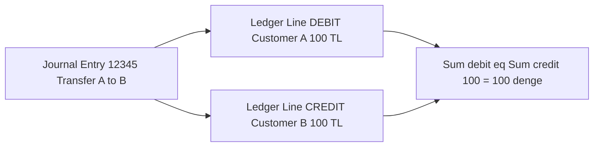
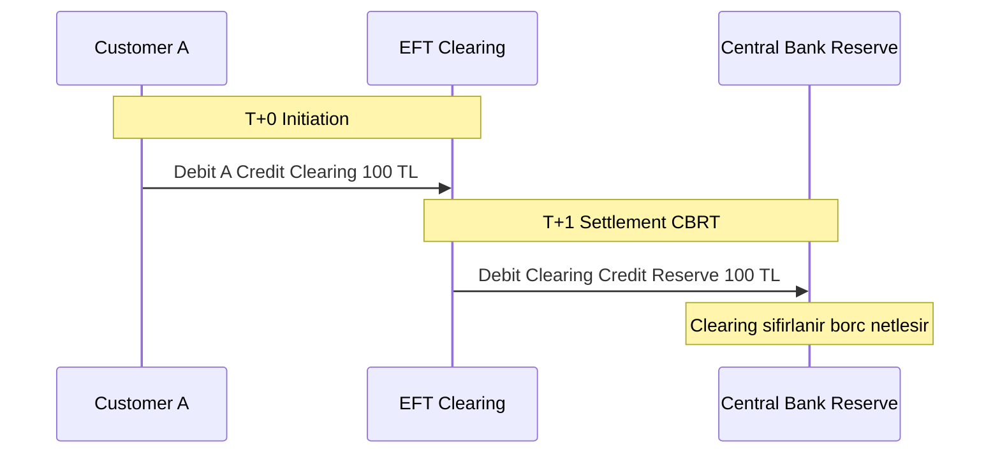
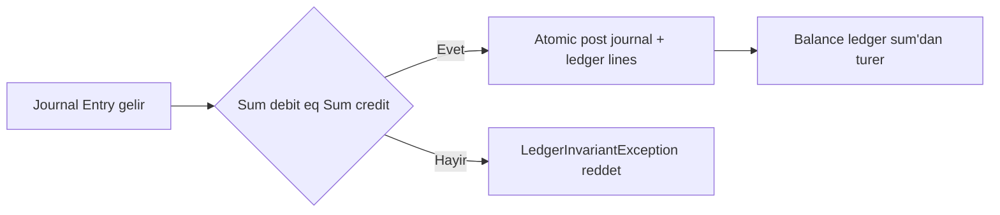

# Topic 10.1 — Double-Entry Accounting (Banking Deep)

```admonish info title="Bu bölümde"
- Double-entry'nin banking için neden ZORUNLU olduğu — single-entry'nin audit ve trial balance açığı
- Debit/credit kurallarını bank perspective'inden okuma; customer deposit neden liability
- Journal + ledger şeması, atomic posting ve `Sum(debit) = Sum(credit)` invariant'ının korunması
- Immutable ledger + reversal pattern (Stripe), multi-currency segregation, intermediate clearing account
- Balance hesaplamanın üç yöntemi, accrual vs cash basis, event sourcing ve 10 klasik anti-pattern
```

## Hedef

Phase 1'deki temel double-entry'i banking-grade derinlikte kavramak: T-account, debit/credit kuralları, Chart of Accounts (COA), journal vs ledger, trial balance, accrual vs cash basis, Stripe ledger pattern, immutable ledger tasarımı, event sourcing, multi-currency accounting ve intermediate clearing account'ları. Amacın ezber değil — bir para hareketinin "nereden geldi, nereye gitti" izini defterde eksiksiz kurabilmek.

## Süre

Okuma: 2.5 saat • Kendini Sına: 45 dk • Pratik (opsiyonel): 4-5 saat • Toplam: ~3.5 saat (+ pratik)

## Önbilgi

- Phase 1 temel accounting bitti
- BigDecimal money handling (HALF_EVEN rounding)
- Phase 3 JPA + transactional integrity (`@Transactional`, ACID)

---

## Kavramlar

### 1. Double-entry — banking için neden ZORUNLU

Bir bankada her kuruşun "nereden geldi, nereye gitti" sorusuna cevabı olmak zorundadır; **single-entry** (tek girişli, saymaca defter) bu izi tutamaz.

```
+100 (gelir)
-50  (gider)
=50  (bakiye)
```

Bu defterde bir rakam yanlış yazılırsa hata yakalanamaz, denge kontrolü yoktur, audit imkansızdır. Banking için asla yeterli değildir.

**Double-entry** (çift girişli) her işlemi en az iki kayda böler: bir hesap artarken karşılığında başka bir hesap azalır veya artar, ve iki tarafın toplamı her zaman eşittir.

```
Her transaction = en az 2 entry
Sum(debits) == Sum(credits)   (her zaman)
```

<mark>Her transaction'da Sum(debits) = Sum(credits) eşitliği asla bozulamaz</mark> — bu double-entry'nin tek ve değişmez invariant'ıdır; tüm banking ledger tasarımı bunun üzerine kurulur.

Somut örnek — A müşterisinden B'ye 100 TL transfer:

```
Entry 1: Debit  customer_A_account  100 TL    (A azaldı)
Entry 2: Credit customer_B_account  100 TL    (B arttı)

Sum debit = 100, Sum credit = 100 → denge
```

Bu yapıyı bir journal entry ile ona bağlı iki ledger line olarak görselleştirelim:



Tuzak: "iki kayıt" demek "aynı tabloya rastgele iki satır" demek değildir. İki satırın toplamı dengede olmalı ve ikisi tek bir atomic transaction içinde yazılmalı — yarım yazılan bir çift invariant'ı bozar.

### 2. T-account — debit solda, credit sağda

Bir hesabın hareketlerini görsel okumanın banking standardı T-account'tur.

**T-account**, bir hesabın debit ve credit hareketlerini iki sütunda gösteren klasik muhasebe görselidir: sol taraf **debit**, sağ taraf **credit**.

```
       Account: Customer A
      ──────────────────────
       Debit  │  Credit
       100    │
       50     │
              │  200
       ─────────────────
       Total: 150 D, 200 C
       Balance: 50 C
```

Burada debit ve credit "artı/eksi" değil, yalnızca "sol/sağ" demektir. Bir hareketin hesabı artırıp azaltmadığı ise hesabın tipine bağlıdır — sıradaki konu.

### 3. Debit / credit kuralları — bank perspective

Aynı "debit" kelimesi asset'te artış, liability'de azalış demek; karışıklığın kaynağı perspektiftir.

Debit/credit'in bir hesabı artırması mı azaltması mı, hesabın tipine göre değişir. Banking'de her zaman **bank perspektifinden** bakılır:

| Hesap tipi | Debit | Credit |
|---|---|---|
| **Asset** (varlık) — banka için müşteri borcu/nakit | ↑ | ↓ |
| **Liability** (borç) — banka için müşteri parası | ↓ | ↑ |
| **Equity** (özkaynak) | ↓ | ↑ |
| **Revenue** (gelir) | ↓ | ↑ |
| **Expense** (gider) | ↑ | ↓ |

Müşteri ATM'ye 100 TL yatırınca banka kitabında iki kayıt oluşur:

```
Vault cash (asset)        +100  Debit
Customer deposit (liab.)  +100  Credit
```

```admonish warning title="Customer deposit neden liability"
Müşterinin bakış açısı "param arttı"; bankanın bakış açısı "kasamda nakit arttı ama sana o kadar borçlandım". Para müşterinin çekme hakkında olduğu için banka için **liability**'dir — mülakatta en sık takılınan nokta budur. Asset (vault cash) ve liability (deposit) aynı anda 100 artar, denge korunur.
```

### 4. Chart of Accounts (COA) — banking

Her hareketin hangi hesaba işleneceğini bilmek için numaralı bir hesap planı gerekir.

**Chart of Accounts (COA)**, tüm hesapların hiyerarşik ve numaralı kataloğudur. Banking'de beş ana sınıf artı bir ara/clearing sınıfı bulunur:

```
1 ASSETS         — Banka varlıkları (vault cash, reserve, nostro, loans)
2 LIABILITIES    — Banka borçları (customer deposits, vostro, borrowings)
3 EQUITY         — Özkaynak (share capital, retained earnings, reserves)
4 REVENUE        — Gelir (interest income, fee income, FX gains)
5 EXPENSE        — Gider (interest expense, operating, provisions)
6 INTERMEDIATE   — Clearing hesapları (EFT, FAST, SWIFT settlement)
```

Her account benzersiz bir numaraya sahiptir (1101, 4201...). Özellikle **intermediate / clearing** hesapları (6100 EFT, 6200 FAST) banka içi geçiş için kritiktir; bunları Örnek 3'te kullanacağız.

<details>
<summary>Tam kod: banking Chart of Accounts (~50 satır)</summary>

```
1. ASSETS                    (Banka varlıkları)
   1100 Cash & Equivalents
     1101 Vault Cash
     1102 Central Bank Reserve
     1103 Nostro Accounts        (banka'nın başka bankada hesabı)
   1200 Loans Receivable
     1201 Consumer Loans
     1202 Mortgage Loans
     1203 Corporate Loans
   1300 Securities
   1400 Premises & Equipment

2. LIABILITIES               (Banka borçları)
   2100 Customer Deposits
     2101 Demand Deposits        (vadesiz)
     2102 Savings Deposits
     2103 Time Deposits          (vadeli)
     2104 Foreign Currency Deposits
   2200 Vostro Accounts          (başka banka'nın bizde hesabı)
   2300 Borrowings (interbank)
   2400 Subordinated Debt

3. EQUITY
   3100 Share Capital
   3200 Retained Earnings
   3300 Reserves

4. REVENUE
   4100 Interest Income
     4101 Loan Interest
     4102 Investment Interest
   4200 Fee Income
     4201 Transfer Fees
     4202 Card Fees
   4300 FX Gains

5. EXPENSE
   5100 Interest Expense
     5101 Deposit Interest
     5102 Borrowing Interest
   5200 Operating Expense
     5201 Salaries
     5202 IT Infrastructure
   5300 Provisions for Loan Loss
   5400 FX Losses

6. INTERMEDIATE / CLEARING
   6100 EFT Clearing
   6200 FAST Clearing
   6300 Card Network Clearing
   6400 SWIFT Settlement Pending
```

</details>

### 5. Journal vs Ledger + DB şeması

Aynı veriyi iki farklı açıdan görürüz — zaman sırasına göre ve hesap bazında.

**Journal** işlemlerin kronolojik listesidir; **ledger** ise her hesabın kendi bazında toplanmış halidir. Aynı journal entry, ilgili her hesabın ledger'ında bir satır olarak görünür.

```
Journal entry #12345 (2024-05-12 10:30:45):
  Debit:  Customer A (2101)    100.00 TL
  Credit: Customer B (2101)    100.00 TL

Ledger view Customer A:
  Date        | Desc     | Debit | Credit | Balance
  2024-05-12  | Transfer | 100   |        | X-100
```

Banking DB'de bu iki kavram iki tabloya karşılık gelir. Önce `journal_entry` — başlık/metadata:

```sql
CREATE TABLE journal_entry (
    id BIGSERIAL PRIMARY KEY,
    posted_at TIMESTAMPTZ NOT NULL,
    description TEXT,
    reference_type VARCHAR(50),    -- 'transfer', 'fee', 'interest', ...
    reference_id UUID,
    posted_by UUID,                 -- user or system
    reversal_of BIGINT REFERENCES journal_entry(id),
    immutable BOOLEAN DEFAULT TRUE  -- audit safeguard
);
```

`reference_type + reference_id` idempotency ve source linkleme için, `reversal_of` düzeltme kaydını orijinaline bağlar. Sonra `ledger_entry` — her debit/credit satırı:

```sql
CREATE TABLE ledger_entry (
    id BIGSERIAL PRIMARY KEY,
    journal_entry_id BIGINT REFERENCES journal_entry(id) NOT NULL,
    account_id BIGINT REFERENCES account(id) NOT NULL,
    debit_amount NUMERIC(19,4) NOT NULL DEFAULT 0,
    credit_amount NUMERIC(19,4) NOT NULL DEFAULT 0,
    currency CHAR(3) NOT NULL,
    posted_at TIMESTAMPTZ NOT NULL,
    CHECK (debit_amount >= 0 AND credit_amount >= 0),
    CHECK (debit_amount = 0 OR credit_amount = 0)   -- biri ya da diğeri, ikisi değil
);
```

İki CHECK kritik: tutarlar negatif olamaz, ve bir satır ya debit ya credit'tir (ikisi birden dolu olamaz). İki index de query performansı için:

```sql
CREATE INDEX idx_ledger_account_date ON ledger_entry(account_id, posted_at DESC);
CREATE INDEX idx_ledger_journal ON ledger_entry(journal_entry_id);
```

Her journal entry yazıldığında satırlarının dengede olduğu doğrulanır:

```sql
SELECT journal_entry_id,
       SUM(debit_amount) AS total_debit,
       SUM(credit_amount) AS total_credit
FROM ledger_entry
GROUP BY journal_entry_id
HAVING SUM(debit_amount) != SUM(credit_amount);
-- Dönen satır = INVARIANT BOZUK
```

```admonish warning title="Balanced check atlanamaz"
Journal'ın dengeli olduğu doğrulaması ya app seviyesinde ya DB trigger'ında **her posting'te** çalışmalı. Bir kez atlanırsa dengesiz bir çift DB'ye sızar ve trial balance'ı bozar. Banking'de bu invariant zorunludur, opsiyonel değil.
```

### 6. Stripe ledger pattern — immutable + idempotent

Yanlış yazılmış bir kaydı silmek audit'i bozar; büyük ledger sistemleri (Stripe) bunun yerine değişmezlik + düzeltme kaydı kullanır.

Stripe'ın public ledger tasarımından banking'e taşınan altı ilke:

1. **Immutable journal entries** — asla UPDATE, asla DELETE
2. **Reversal via offset** — yanlış kaydı silme, ters bir kayıt yaz
3. **Idempotency** — aynı `(reference_type, reference_id)` aynı sonucu verir
4. **Atomic posting** — bir journal'ın tüm ledger satırları tek transaction'da
5. **Balance derived** — bakiye ledger sum'dan hesaplanır, saklanmaz
6. **Currency segregation** — farklı currency farklı account

<mark>ledger_entry asla UPDATE veya DELETE edilmez; her düzeltme, orijinali nötrleyen bir reversal entry ile yapılır</mark>. Reverse pattern:

```
Entry #12345 (yanlış):
  Debit  A 100
  Credit B 100

Entry #12346 (reversal_of = 12345):
  Debit  B 100      (B'den geri al)
  Credit A 100      (A'ya geri ver)

Net etki: bakiyeler orijinal öncesi haline döner, iki kayıt da defterde kalır
```

Tuzak: reversal orijinali "iptal" etmez, üzerine ters bir kayıt ekler. Audit'te hem hatalı işlem hem düzeltmesi görünür — istenen davranış tam olarak budur.

### 7. Balance computation — üç yöntem

Bakiye saklanmaz, türetilir; ama milyonlarca satırda her seferinde toplamak pahalıdır.

En basit yöntem, ledger satırlarını toplamaktır:

```sql
SELECT SUM(credit_amount - debit_amount) AS balance
FROM ledger_entry
WHERE account_id = $1
  AND posted_at <= $2;
```

<mark>Balance her zaman ledger satırlarının sum'ından türetilir; hesap üzerinde direct balance UPDATE yapılmaz</mark>. Ama milyonlarca entry'de bu naive query pahalıdır — iki optimizasyon yöntemi var.

**Materialized view** (Topic 4): önceden hesaplanmış, periyodik refresh edilen bakiye tablosu.

```sql
CREATE MATERIALIZED VIEW account_balance AS
SELECT account_id, currency,
       SUM(credit_amount - debit_amount) AS balance,
       MAX(posted_at) AS last_posted_at
FROM ledger_entry
GROUP BY account_id, currency;

-- Refresh nightly veya event-driven
REFRESH MATERIALIZED VIEW CONCURRENTLY account_balance;
```

**Snapshot + delta**: EOD'de her hesabın bakiyesini snapshot'a yaz; online query en son snapshot artı o günün delta'larını toplar.

```sql
CREATE TABLE account_balance_snapshot (
    account_id BIGINT,
    as_of_date DATE,
    balance NUMERIC(19,4),
    PRIMARY KEY (account_id, as_of_date)
);
```

Trade-off: naive her zaman doğru ama yavaş; materialized view hızlı ama refresh gecikmesi taşır; snapshot online latency'i düşürür ve geçmiş bakiye sorgusunu ucuzlatır.

```admonish tip title="Banking pratiği"
Snapshot pattern banking'de EOD (end-of-day) sonrası çalışır: gece her hesabın bakiyesi snapshot'a yazılır, gün içi online sorgu "son snapshot + bugünün delta'ları" olarak hızlanır. Milyonlarca satırlık defterde naive full-scan yerine bu yöntem tercih edilir.
```

### 8. Banking transaction örnekleri — full posting

Kuralları altı gerçek banking işleminde görelim; her biri dengeli bir journal entry'dir.

#### Örnek 1: Customer deposit

```
Customer A şubede 1000 TL nakit yatırır:

Journal entry #1 — ATM/Branch deposit
  Debit:  Vault Cash (1101)              1000.00 TL
  Credit: Customer A Deposit (2101-A)    1000.00 TL
```

#### Örnek 2: Intra-customer transfer (aynı banka)

```
Customer A → Customer B 100 TL:

Journal entry
  Debit:  Customer A Deposit (2101-A)   100.00 TL
  Credit: Customer B Deposit (2101-B)   100.00 TL
```

Bankanın toplam liability'si değişmez — para banka içinde el değiştirdi.

#### Örnek 3: Inter-bank transfer (EFT) — clearing account ile

Başka bankadaki bir hesaba giden transferde para T+0'da anında çıkamaz; **intermediate clearing account** geçici olarak liability'yi tutar, CBRT ile settlement T+1'de olur.

```
Customer A → başka bankadaki Customer X, 100 TL:

Initiation (T+0):
  Debit:  Customer A Deposit (2101-A)        100.00 TL
  Credit: EFT Outgoing Clearing (6100)       100.00 TL

Settlement with CBRT (T+1):
  Debit:  EFT Outgoing Clearing (6100)       100.00 TL
  Credit: Central Bank Reserve (1102)        100.00 TL
```

İki fazlı akışı zaman çizgisinde gör — clearing hesabı T+0'da dolar, T+1'de sıfırlanır:



#### Örnek 4: Interest accrual

```
Kredi hesabı, %5 yıllık, aylık accrual:

Loan balance: 100,000 TL
Aylık faiz: 100,000 * 5% / 12 = 416.67 TL

Journal entry (ayın son günü)
  Debit:  Customer A Loan Receivable (1201-A)    416.67 TL
  Credit: Interest Income (4101)                 416.67 TL
```

Bu bir **accrual** kaydıdır — para henüz tahsil edilmedi ama gelir hak edildiği ay tanındı.

#### Örnek 5: FX transaction

```
Customer A, 32.50 TL/USD kurdan 100 USD alır:

Journal entry
  Debit:  Customer A TRY Deposit (2101-A-TRY)    3250.00 TL
  Credit: Bank FX Position TRY (1104-TRY)        3250.00 TL

  Debit:  Bank FX Position USD (1104-USD)         100.00 USD
  Credit: Customer A USD Deposit (2104-A-USD)     100.00 USD
```

İki ayrı entry — TRY ve USD. Her currency kendi içinde dengelidir (currency segregation); FX gain/loss bankanın internal position'ında tanınır.

#### Örnek 6: Fee charged

```
Transfer komisyonu 5 TL:

Journal entry (transfer ile birlikte)
  Debit:  Customer A Deposit                       5.00 TL
  Credit: Transfer Fee Income (4201)               5.00 TL
```

### 9. Atomic posting — DB transaction

Bir journal'ın tüm satırları ya birlikte yazılır ya hiç; ve yazmadan önce dengeli olduğu doğrulanır.

Posting akışı: önce balance ve idempotency doğrula, sonra journal artı tüm ledger satırlarını tek transaction'da yaz.



Servisin çekirdeği — `@Transactional(SERIALIZABLE)` ile atomic; önce doğrula, sonra journal'ı kaydet:

```java
@Transactional(isolation = Isolation.SERIALIZABLE)
public JournalEntry post(JournalEntryRequest req) {
    validateBalance(req);       // Sum debits == Sum credits
    validateIdempotency(req);

    JournalEntry journal = JournalEntry.builder()
        .postedAt(Instant.now())
        .description(req.description())
        .referenceType(req.referenceType())
        .referenceId(req.referenceId())
        .postedBy(currentUserId())
        .build();
    journalRepo.save(journal);
    // ... her ledger satırı persist edilir (tam kod aşağıda)
    return journal;
}
```

Denge doğrulaması currency bazında yapılır — her currency kendi içinde dengeli olmalı, TRY tarafı dengeliyken USD tarafı dengesiz kalamaz:

```java
private void validateBalance(JournalEntryRequest req) {
    Map<String, BigDecimal> debitsByCcy = req.entries().stream()
        .filter(e -> e.debitAmount() != null)
        .collect(groupingBy(LedgerEntryRequest::currency,
            reducing(ZERO, LedgerEntryRequest::debitAmount, BigDecimal::add)));

    Map<String, BigDecimal> creditsByCcy = req.entries().stream()
        .filter(e -> e.creditAmount() != null)
        .collect(groupingBy(LedgerEntryRequest::currency,
            reducing(ZERO, LedgerEntryRequest::creditAmount, BigDecimal::add)));

    if (!debitsByCcy.equals(creditsByCcy)) {
        throw new LedgerInvariantException(
            "Journal not balanced. Debits: " + debitsByCcy + ", Credits: " + creditsByCcy);
    }
}
```

<details>
<summary>Tam kod: LedgerService.post + validateBalance (~55 satır)</summary>

```java
@Service
public class LedgerService {

    private final EntityManager em;
    private final JournalEntryRepository journalRepo;

    @Transactional(isolation = Isolation.SERIALIZABLE)
    public JournalEntry post(JournalEntryRequest req) {
        validateBalance(req);   // Sum debits == Sum credits
        validateIdempotency(req);

        JournalEntry journal = JournalEntry.builder()
            .postedAt(Instant.now())
            .description(req.description())
            .referenceType(req.referenceType())
            .referenceId(req.referenceId())
            .postedBy(currentUserId())
            .build();
        journalRepo.save(journal);

        for (LedgerEntryRequest entry : req.entries()) {
            LedgerEntry ledger = LedgerEntry.builder()
                .journalEntry(journal)
                .accountId(entry.accountId())
                .debitAmount(entry.debitAmount() != null ? entry.debitAmount() : ZERO)
                .creditAmount(entry.creditAmount() != null ? entry.creditAmount() : ZERO)
                .currency(entry.currency())
                .postedAt(journal.getPostedAt())
                .build();
            em.persist(ledger);
        }

        em.flush();
        return journal;
    }

    private void validateBalance(JournalEntryRequest req) {
        Map<String, BigDecimal> debitsByCcy = req.entries().stream()
            .filter(e -> e.debitAmount() != null)
            .collect(groupingBy(LedgerEntryRequest::currency,
                reducing(ZERO, LedgerEntryRequest::debitAmount, BigDecimal::add)));

        Map<String, BigDecimal> creditsByCcy = req.entries().stream()
            .filter(e -> e.creditAmount() != null)
            .collect(groupingBy(LedgerEntryRequest::currency,
                reducing(ZERO, LedgerEntryRequest::creditAmount, BigDecimal::add)));

        if (!debitsByCcy.equals(creditsByCcy)) {
            throw new LedgerInvariantException(
                "Journal not balanced. Debits: " + debitsByCcy + ", Credits: " + creditsByCcy);
        }
    }
}
```

</details>

### 10. Trial balance

Tüm defterin sağlığını tek sorguda kontrol etmenin yolu.

**Trial balance**, tüm hesapların debit ve credit toplamlarını karşılaştırır; sağlıklı bir defterde fark her zaman sıfırdır.

```sql
SELECT SUM(debit_amount) AS total_debit,
       SUM(credit_amount) AS total_credit,
       SUM(debit_amount) - SUM(credit_amount) AS difference
FROM ledger_entry;
-- difference MUTLAKA 0
```

Banking'de EOD job trial balance çalıştırır; fark sıfır değilse reconciliation alarmı üretir. Bu fark genelde bir kod hatasının veya atlanmış balanced check'in ilk işaretidir.

### 11. Accrual vs cash basis

Faiz her gün birikir ama ayda bir tahsil edilir; ne zaman kaydedeceğin muhasebe temeline bağlıdır.

**Cash basis**: parayı görünce (giriş/çıkış anında) kaydet. **Accrual basis**: hak edildiği/oluştuğu anda kaydet, tahsilat beklenmeden.

Banking accrual kullanır:

- Faiz her gün accrue olur, tahsilat aylık
- Komisyon gelir charge anında recognize edilir
- Loan loss provisioning — potansiyel kayıp, henüz gerçekleşmemiş

Türk muhasebesi (TMS/TFRS, IFRS uyumlu) accrual-based'dir; BDDK da bunu zorunlu tutar.

```admonish tip title="Accrual örneği"
100.000 TL kredi, %5 yıllık faiz. Ayın son günü aylık accrual: 100.000 × 5% / 12 = 416,67 TL. Kayıt: Loan Receivable 416,67 debit, Interest Income 416,67 credit. Para henüz tahsil edilmedi ama gelir kazanıldığı ay tanınır — cash basis olsaydı tahsilat ayına kaydedilirdi.
```

### 12. Event sourcing pattern — banking ledger

Bakiye yerine olayları saklarsan, tüm geçmişi ve "ya şöyle olsaydı" senaryolarını yeniden oynatabilirsin.

**Event sourcing**'de mutable bir bakiye yerine değişmez olaylar saklanır; bakiye olayların replay'inden hesaplanır.

```sql
CREATE TABLE ledger_event (
    id BIGSERIAL PRIMARY KEY,
    aggregate_id UUID,
    event_type VARCHAR(50),
    payload JSONB,
    occurred_at TIMESTAMPTZ,
    sequence_no BIGINT
);
```

Event tipleri: `AccountOpened`, `DepositMade`, `WithdrawalMade`, `TransferInitiated`, `TransferCompleted`, `InterestAccrued`, `FeeCharged`. Bakiye event replay'inden gelir:

```java
BigDecimal balance = events.stream()
    .map(e -> switch (e.type()) {
        case "DepositMade" -> e.amount();
        case "WithdrawalMade" -> e.amount().negate();
        default -> ZERO;
    })
    .reduce(ZERO, BigDecimal::add);
```

Trade-off: tam audit ve replay imkanı sağlar (repair, what-if analizi) ama storage yıllarca büyür ve performans için snapshot gerektirir. Banking pratiği genelde karma: current balance materialized, event'ler audit için saklanır.

### 13. Immutable ledger tasarımı

"Asla UPDATE etme" kuralını insan disiplinine bırakmak yerine DB'ye zorlatmak.

Immutability yalnızca kod konvansiyonu değil, DB seviyesinde trigger ile zorlanır:

```sql
CREATE OR REPLACE FUNCTION prevent_ledger_modification()
RETURNS TRIGGER AS $$
BEGIN
    RAISE EXCEPTION 'ledger_entry is immutable. Use reversal pattern.';
END;
$$ LANGUAGE plpgsql;

CREATE TRIGGER ledger_no_update
BEFORE UPDATE OR DELETE ON ledger_entry
FOR EACH ROW EXECUTE FUNCTION prevent_ledger_modification();
```

App seviyesinde de Hibernate'e ipucu verilir:

```java
@Entity
@Immutable   // Hibernate hint
public class LedgerEntry { ... }
```

İki katman birlikte çalışır: DB trigger son savunma hattıdır, `@Immutable` ise erken uyarıdır.

### 14. Banking accounting anti-pattern'leri

Mülakatta "bu tasarımda ne yanlış?" sorusunun cephaneliği; on klasik hata.

**Anti-pattern 1: Direct balance UPDATE**

```sql
UPDATE account SET balance = balance + 100 WHERE id = ?;   -- ❌
```

Audit yok, double-entry yok. Banking'de asla — her zaman journal + ledger.

**Anti-pattern 2: Single-entry** — `transaction(account, amount, type)` tablosu. Denge kontrolü ve audit imkansız.

**Anti-pattern 3: Mutable ledger** — ledger_entry üzerinde UPDATE. Audit bozulur; reversal pattern kullan.

**Anti-pattern 4: Negative number tricks** — Debit pozitif, credit negatif olarak tek kolonda. Kafa karıştırıcı; banking konvansiyonu ayrı debit/credit kolonlarıdır.

**Anti-pattern 5: Cross-currency balance** — <mark>Farklı currency farklı account demektir; USD ve TRY satırları tek bir TRY bakiyesinde toplanamaz</mark>. Her currency ayrı hesap veya ayrı bakiye tutar.

**Anti-pattern 6: Floating point money** — `double balance`. Precision kaybı. **BigDecimal HALF_EVEN** (Phase 1).

**Anti-pattern 7: Balanced check atlama** — App veya DB seviyesinde invariant mandatory; atlanırsa dengesiz çift sızar.

**Anti-pattern 8: Async ledger posting** — Async = eventually consistent → balance race. Kritik para hareketi senkron + transaction.

**Anti-pattern 9: Intermediate clearing account yokluğu** — EFT outgoing'i direkt customer'dan CBRT'ye yazmak. T+1 settlement beklerken clearing account tutmalı.

**Anti-pattern 10: Soft delete on ledger** — `deleted=true` flag. Audit bozuk. Hard immutable + reversal.

---

## Önemli olabilecek araştırma kaynakları

- "Accounting for Computer Scientists" — Martin Kleppmann blog
- Stripe ledger engineering blog
- Square / Block ledger design docs
- IFRS / TFRS standards
- BDDK muhasebe rehberi
- "Double-Entry Bookkeeping" — Pacioli (1494, ilk kaynak)

---

## Kendini Sına

Aşağıdaki soruları önce **cevaba bakmadan** kendi cümlelerinle yanıtlamayı dene — hepsi TR bank mülakatlarında karşına çıkabilecek tarzda. Takıldığında ilgili Kavramlar başlığına dön, sonra tekrar dene.

**S1. Single-entry banking için neden yeterli değildir? Double-entry ne getirir?**

<details>
<summary>Cevabı göster</summary>

Single-entry sadece tek bir bakiye kolonuna artı/eksi yazar; denge kontrolü yoktur, bir rakam yanlış girilirse hata yakalanamaz ve audit imkansızdır. Double-entry her işlemi en az iki kayda böler (bir tarafta debit, diğerinde credit) ve `Sum(debits) = Sum(credits)` invariant'ını dayatır. Bu sayede hem her para hareketinin "nereden geldi, nereye gitti" izi çıkar, hem trial balance ile tüm defterin tutarlılığı tek sorguda doğrulanır. Banking'de regülatör ve audit gereklilikleri yüzünden double-entry zorunludur.

</details>

**S2. Double-entry'nin temel kuralı nedir ve `Sum(debit) = Sum(credit)` invariant'ı pratikte nasıl korunur?**

<details>
<summary>Cevabı göster</summary>

Temel kural: her transaction en az iki ledger satırı üretir ve her currency için debit toplamı credit toplamına eşittir. İnvariant iki katmanda korunur. Uygulama katmanında posting'ten önce `validateBalance` çalışır — currency bazında debit ve credit map'lerini karşılaştırır, eşit değilse `LedgerInvariantException` fırlatıp posting'i reddeder. DB katmanında `journal_entry_id` bazında `HAVING SUM(debit) != SUM(credit)` sorgusu veya trigger denge kontrolü yapar. Ayrıca EOD trial balance tüm defter üzerinde `SUM(debit) - SUM(credit) = 0` kontrolü ile son güvenlik ağıdır. Kontrol her posting'te çalışmalı; bir kez atlanırsa dengesiz çift sızar.

</details>

**S3. Müşteri bankaya 100 TL yatırdığında bu neden bankanın liability'sidir? Kayıt nasıl olur?**

<details>
<summary>Cevabı göster</summary>

Çünkü para müşterinin çekme hakkındadır — banka o parayı müşteriye borçludur, dolayısıyla banka için liability'dir. Kayıt bank perspektifinden çift taraflıdır: vault cash (asset) 100 debit ile artar, customer deposit (liability) 100 credit ile artar. Asset ve liability aynı anda 100 arttığı için denge korunur. Müşterinin bakışı "param arttı" olsa da bankanın bilançosunda bu bir borç kaydıdır; asset artışı kasadaki nakittir, liability artışı ise müşteriye olan yükümlülüktür.

</details>

**S4. Yanlış bir ledger kaydı DB'ye yazıldı. Neden UPDATE/DELETE etmezsin, doğru düzeltme nedir?**

<details>
<summary>Cevabı göster</summary>

ledger_entry immutable'dır — UPDATE veya DELETE audit izini bozar ve "kaydın hiç var olmadığı" izlenimi verir, ki bu regülatör için kabul edilemez. Doğru yöntem reversal pattern: orijinali nötrleyen ters bir journal entry yazarsın (debit ve credit yer değiştirir) ve `reversal_of` alanı ile orijinaline bağlarsın. Böylece bakiyeler orijinal öncesi haline döner ama hem hatalı işlem hem düzeltmesi defterde kalır. Immutability ayrıca DB trigger (`BEFORE UPDATE OR DELETE → RAISE EXCEPTION`) ile zorlanır, `@Immutable` ise erken uyarı verir.

</details>

**S5. Bir müşterinin hem USD hem TRY hesabı var. Bakiyeyi neden tek bir sayıda toplamıyorsun?**

<details>
<summary>Cevabı göster</summary>

Currency segregation ilkesi gereği farklı currency farklı account (veya currency başına ayrı bakiye) demektir. USD ve TRY satırlarını tek bir TRY bakiyesinde toplamak, dalgalanan bir FX kuruyla anlamsız ve yanlış bir rakam üretir; ayrıca hangi kurdan çevrildiği belirsizleşir. Double-entry invariant'ı da currency bazında kontrol edilir — bir journal'da TRY tarafı ve USD tarafı ayrı ayrı dengeli olmalıdır (bkz. FX örneği). FX gain/loss ise ayrı bir bank position hesabında tanınır; cross-currency toplama klasik bir anti-pattern'dir.

</details>

**S6. Balance hesaplamanın üç yöntemi nedir, trade-off'ları neler?**

<details>
<summary>Cevabı göster</summary>

Bir: naive sum — `SUM(credit - debit)` doğrudan ledger_entry üzerinden. Her zaman doğru ama milyonlarca satırda pahalı. İki: materialized view — önceden hesaplanmış bakiye tablosu, hızlı okuma ama refresh gecikmesi yüzünden anlık değil. Üç: snapshot + delta — EOD'de her hesabın bakiyesi snapshot'a yazılır, online sorgu "son snapshot + o günün delta'ları" olarak çalışır. Banking'de en yaygın snapshot'tır çünkü online latency'i düşürür ve geçmiş tarihli bakiye sorgusunu ucuzlatır. Ortak kural: bakiye her zaman türetilir, hesap üzerinde direct UPDATE yapılmaz.

</details>

**S7. Başka bankaya EFT transferinde neden intermediate clearing account kullanırsın?**

<details>
<summary>Cevabı göster</summary>

Çünkü para T+0'da müşteri hesabından çıkar ama karşı bankaya settlement CBRT üzerinden T+1'de gerçekleşir; bu aradaki yükümlülüğü bir yerde tutmak gerekir. Initiation'da customer deposit debit, EFT clearing (6100) credit yazılır — banka artık clearing hesabında bir borç taşır. Settlement'ta clearing debit, central bank reserve credit yazılır ve clearing sıfırlanır. Clearing account olmadan müşteriden doğrudan CBRT'ye yazmak, henüz gerçekleşmemiş bir settlement'ı gerçekleşmiş gibi gösterir ve iki fazlı gerçeği maskeler — bu bir anti-pattern'dir.

</details>

**S8. Accrual ve cash basis farkı nedir? Banking neden accrual kullanır?**

<details>
<summary>Cevabı göster</summary>

Cash basis parayı görünce (nakit giriş/çıkış anında) kaydeder; accrual basis ise geliri/gideri hak edildiği/oluştuğu anda tanır, tahsilatı beklemeden. Banking accrual kullanır çünkü faiz her gün birikir (accrue) ama aylık tahsil edilir, komisyon charge anında recognize edilir, loan loss ise henüz gerçekleşmemişken provision olarak ayrılır. Örneğin ayın son günü kredi faizi Loan Receivable debit / Interest Income credit ile kaydedilir — para henüz gelmemiştir ama gelir o ay tanınır. Türk muhasebesi (TMS/TFRS, IFRS uyumlu) ve BDDK accrual'ı zorunlu tutar.

</details>

---

## Tamamlama kriterleri

- [ ] Double-entry'nin single-entry'ye üstünlüğünü (audit, trial balance, denge invariant'ı) açıklayabiliyorum
- [ ] Debit/credit kurallarını bank perspective'inden okuyabiliyor, customer deposit'in neden liability olduğunu anlatabiliyorum
- [ ] Journal vs ledger ayrımını ve `Sum(debit) = Sum(credit)` invariant'ının app + DB katmanında nasıl korunduğunu biliyorum
- [ ] Immutable ledger + reversal pattern'i ve neden delete/update yapılmadığını açıklayabiliyorum
- [ ] Balance hesaplamanın üç yöntemini (naive, materialized view, snapshot) trade-off'larıyla sayabiliyorum
- [ ] Multi-currency segregation ve intermediate clearing account'un banking'deki rolünü anlatabiliyorum
- [ ] Accrual vs cash basis farkını ve banking'in neden accrual kullandığını biliyorum
- [ ] 10 anti-pattern'i (direct UPDATE, single-entry, float money, cross-currency sum, mutable ledger, ...) tanıyorum
- [ ] (Opsiyonel) "Pratik yapmak istersen" bölümündeki şema ve servisi kurdum, Claude-verify prompt'uyla doğrulattım

---

## Defter notları (10 madde)

1. "Double-entry vs single-entry banking için neden zorunlu (audit, trial balance): ____."
2. "Debit/credit kuralları bank perspective: asset ↑ debit, liability ↑ credit: ____."
3. "Customer deposit niye liability (bank borçludur): ____."
4. "Chart of Accounts hierarchy + intermediate clearing accounts (EFT, FAST): ____."
5. "Journal vs Ledger + atomic posting transaction: ____."
6. "Stripe immutable + reversal pattern banking adoption: ____."
7. "Balance compute (sum query / materialized view / snapshot) trade-off: ____."
8. "Multi-currency segregation FX banking pratik: ____."
9. "Accrual vs cash basis banking IFRS/TFRS uyumu: ____."
10. "Anti-pattern (direct balance UPDATE, float money, cross-currency sum): ____."

```admonish success title="Bölüm Özeti"
- Double-entry banking'de zorunludur: her transaction en az iki satır, `Sum(debit) = Sum(credit)` invariant'ı hiç bozulmaz — single-entry audit ve trial balance sağlayamaz
- Debit/credit her zaman bank perspektifinden okunur: customer deposit banka için liability'dir çünkü müşteri parayı çekme hakkına sahiptir
- Journal (kronolojik) + ledger (hesap bazında) iki tabloya karşılık gelir; balanced check her posting'te app veya DB katmanında çalışır ve posting atomic'tir
- Ledger immutable'dır: düzeltme UPDATE/DELETE ile değil reversal entry ile yapılır (Stripe pattern); farklı currency farklı account demektir
- Balance saklanmaz, türetilir: naive sum / materialized view / snapshot arasında trade-off vardır, banking'de EOD snapshot yaygındır
- Klasik anti-pattern'ler production'da para kaybettirir: direct balance UPDATE, float money, cross-currency sum, mutable/soft-delete ledger, async posting
```

---

## Pratik yapmak istersen

Kavramları koda dökmek istersen aşağıdaki iki ek hazır: test yazma rehberi balanced-journal, deposit, transfer, clearing, reversal, trial balance ve immutability için örnek testler içerir; Claude-verify prompt'u ile yazdığın ledger implementasyonunu banking-grade perspektiften denetletebilirsin. Şema + `LedgerService` + 6 banking işlemi + reversal + trial balance'ı kurup testleri yeşile çevirmek yaklaşık 4-5 saat sürer.

<details>
<summary>Test yazma rehberi</summary>

### Test 10.1.1 — Balanced journal entry zorlaması

```java
@Test
@Transactional
void shouldEnforceBalancedJournalEntry() {
    JournalEntryRequest unbalanced = JournalEntryRequest.builder()
        .description("test")
        .entry(of("CUSTOMER_A", debit(100), "TRY"))
        .entry(of("CUSTOMER_B", credit(50), "TRY"))   // mismatch
        .build();

    assertThatThrownBy(() -> ledgerService.post(unbalanced))
        .isInstanceOf(LedgerInvariantException.class)
        .hasMessageContaining("not balanced");
}
```

### Test 10.1.2 — Deposit posting

```java
@Test
@Transactional
void shouldPostDeposit() {
    JournalEntry entry = ledgerService.post(depositRequest(customerA, "1000", "TRY"));

    BigDecimal vaultBalance = balanceService.balanceOf(VAULT_CASH, "TRY");
    BigDecimal customerBalance = balanceService.balanceOf(customerA, "TRY");

    assertThat(vaultBalance).isEqualByComparingTo("1000.00");
    assertThat(customerBalance).isEqualByComparingTo("1000.00");
}
```

### Test 10.1.3 — Intra-customer transfer

```java
@Test
@Transactional
void shouldHandleTransferAcrossCustomers() {
    setupBalance(customerA, "TRY", "1000.00");
    setupBalance(customerB, "TRY", "500.00");

    ledgerService.post(transferRequest(customerA, customerB, "100", "TRY"));

    assertThat(balanceService.balanceOf(customerA, "TRY")).isEqualByComparingTo("900.00");
    assertThat(balanceService.balanceOf(customerB, "TRY")).isEqualByComparingTo("600.00");
}
```

### Test 10.1.4 — Interbank transfer clearing account

```java
@Test
@Transactional
void shouldUseClearingAccountForInterbankTransfer() {
    setupBalance(customerA, "TRY", "1000.00");

    JournalEntry initiate = ledgerService.post(
        eftOutgoingInitiateRequest(customerA, "100", recipientIban));

    assertThat(balanceService.balanceOf(customerA, "TRY")).isEqualByComparingTo("900.00");
    assertThat(balanceService.balanceOf(EFT_CLEARING, "TRY")).isEqualByComparingTo("100.00");

    JournalEntry settle = ledgerService.post(
        eftOutgoingSettleRequest(initiate.getId()));

    assertThat(balanceService.balanceOf(EFT_CLEARING, "TRY")).isEqualByComparingTo("0.00");
    assertThat(balanceService.balanceOf(CENTRAL_BANK_RESERVE, "TRY")).isEqualByComparingTo("-100.00");
}
```

### Test 10.1.5 — Reverse entry

```java
@Test
@Transactional
void shouldReverseEntry() {
    JournalEntry original = ledgerService.post(transferRequest(customerA, customerB, "100", "TRY"));

    JournalEntry reversal = ledgerService.reverse(original.getId(), "Customer dispute");

    assertThat(reversal.getReversalOf()).isEqualTo(original.getId());
    assertThat(balanceService.balanceOf(customerA, "TRY")).isEqualByComparingTo("1000.00");   // Restored
}
```

### Test 10.1.6 — Trial balance sıfır

```java
@Test
void trialBalanceShouldBeZero() {
    for (int i = 0; i < 1000; i++) {
        randomTransaction();
    }

    BigDecimal diff = trialBalanceService.calculate();
    assertThat(diff).isEqualByComparingTo("0.00");
}
```

### Test 10.1.7 — Immutable ledger

```java
@Test
void shouldRejectModificationOfLedgerEntry() {
    JournalEntry entry = ledgerService.post(depositRequest(customerA, "1000", "TRY"));
    LedgerEntry ledger = entry.getLedgerEntries().get(0);

    assertThatThrownBy(() -> {
        em.createNativeQuery("UPDATE ledger_entry SET debit_amount = 200 WHERE id = " + ledger.getId())
            .executeUpdate();
    }).hasMessageContaining("immutable");
}
```

</details>

<details>
<summary>Claude-verify prompt</summary>

```
Double-entry accounting implementation'ımı banking-grade kriterlere göre değerlendir:

1. Chart of Accounts:
   - Hierarchical (asset/liability/equity/revenue/expense/intermediate)?
   - Banking-realistic numbering?
   - Intermediate clearing accounts (EFT, FAST, SWIFT)?

2. Schema:
   - journal_entry + ledger_entry separate tables?
   - Debit/credit separate columns?
   - currency column?
   - immutable trigger?
   - reference_type + reference_id?
   - reversal_of FK?

3. Posting:
   - Atomic transaction (DB ACID)?
   - Balance check (sum debits == sum credits per currency)?
   - Idempotency (reference_type + reference_id unique)?
   - SERIALIZABLE or repeatable read?

4. Banking transactions:
   - Deposit/withdrawal?
   - Intra-customer transfer?
   - Inter-bank transfer with clearing account?
   - Interest accrual?
   - FX with currency segregation?
   - Fee charged?

5. Balance:
   - Computed from ledger sum (no direct balance UPDATE)?
   - Materialized view or snapshot for performance?
   - Per-currency balance?

6. Reversal:
   - Reverse entry pattern (offset, not delete)?
   - Reversal_of FK tracked?
   - Original immutable?

7. Audit:
   - posted_by tracked?
   - posted_at timestamp?
   - description meaningful?
   - reference linked to source?

8. Trial balance:
   - EOD job?
   - Sum debit == sum credit (across all accounts) check?
   - Alert if mismatch?

9. Multi-currency:
   - Each currency separate account or balance per currency?
   - FX gain/loss recognized?

10. Anti-pattern:
    - Direct balance UPDATE YOK?
    - Single-entry YOK?
    - Floating point money YOK?
    - Soft delete on ledger YOK?
    - Async ledger posting YOK?
    - Cross-currency sum YOK?

Her madde için PASS / FAIL / EKSIK işaretle.
```

</details>
