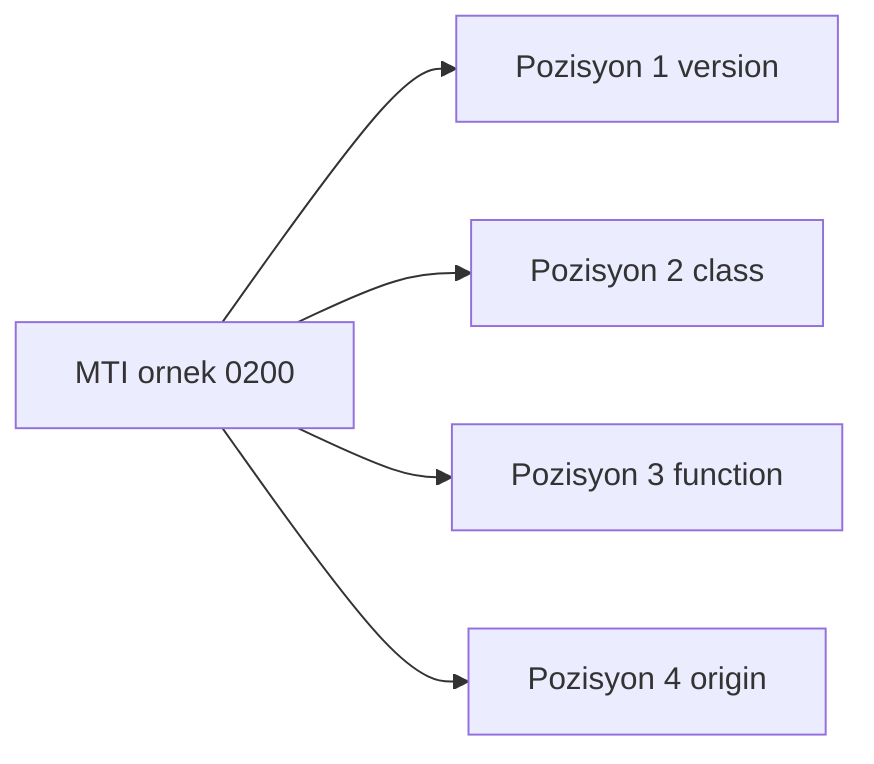
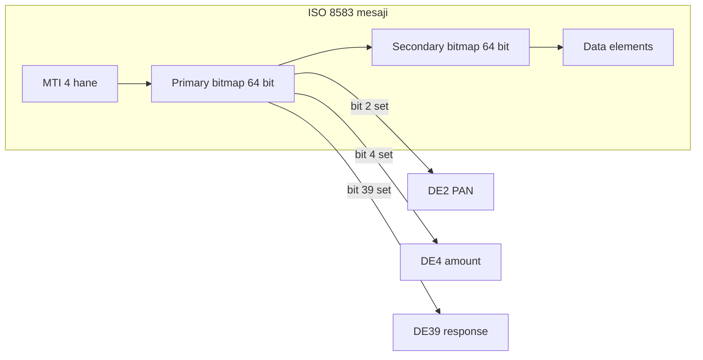
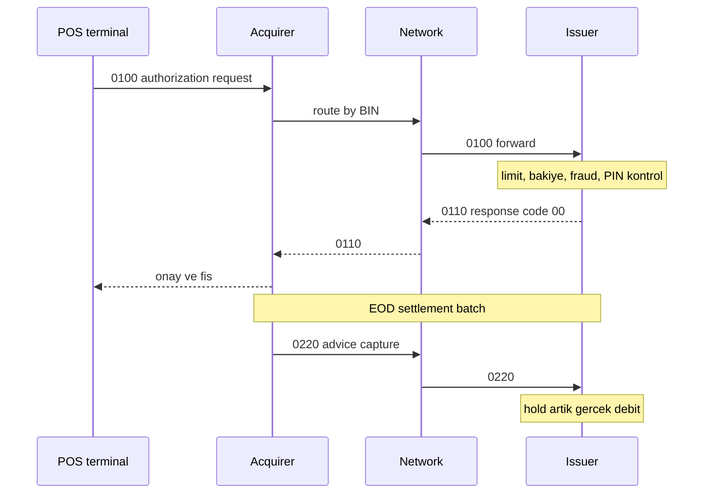

# Topic 10.2 — ISO 8583: Card Transaction Messaging

```admonish info title="Bu bölümde"
- Kart makinesinin bankaya gönderdiği mesajın anatomisi: **MTI** (4 hane) + **bitmap** (hangi alanlar var) + **data element**'ler
- `0100` authorization ile `0200` financial mesajlarının farkı ve authorization hold → capture → settlement döngüsü
- POS → acquirer → network → issuer uçtan uca akışı, BIN routing ve `< 2 saniye` hedefi
- Reversal'ın (0400) neden idempotent olması gerektiği, EMV cryptogram (ARQC) ile klon kart koruması
- Banking'in taviz vermediği katman: PCI-DSS — PAN maskeleme, track/CVV hiç saklanmama, tokenization
```

## Hedef

ISO 8583 kart işlem mesajlaşma standardını banking-grade derinlikte öğrenmek: MTI (Message Type Indicator), bitmap, data element'ler, transaction flow (authorization, capture, refund, reversal), POS/ATM acquirer-issuer akışı, BKM (Türk kart yapısı), Visa/Mastercard/Troy network entegrasyonu, EMV co-existence ve ISO 8583 → ISO 20022 migration.

## Süre

Okuma: 2.5 saat • Kendini Sına: 30 dk • Pratik (opsiyonel): 3-4 saat • Toplam: ~2.5 saat (+ pratik)

## Önbilgi

- Topic 10.1 (Double-entry accounting) bitti — debit/credit ve journal posting biliyorsun
- Kart işlemenin temel akışını (müşteri kartı okutur, banka onaylar) kabaca gördün
- Binary protokol ve bit-level düşünmek bonus

---

## Kavramlar

### 1. ISO 8583 — neden var, ne çözer

Kart makinesi bankaya bir mesaj göndermek zorunda: "şu kartla, şu tutarda, şu terminalden bir alışveriş yapılmak isteniyor — onaylıyor musun?". Bu mesajın formatı bankadan bankaya, ülkeden ülkeye farklı olsaydı hiçbir POS hiçbir bankaya bağlanamazdı. **ISO 8583** işte bu ortak dili tanımlayan *financial transaction card-originated message* standardıdır.

Üç ana sürümü var ve pratikte üçü de sahada dolaşır:

- ISO 8583:1987 — orijinal, hâlâ en yaygın (`ISO87` packager)
- ISO 8583:1993 — güncellenmiş
- ISO 8583:2003 — modern, XML-friendly

Standart tek bir işlem tipi için değil; kart ekosisteminin neredeyse tüm mesajlaşmasını taşır:

- POS terminal → acquirer → network (Visa/MC/Troy) → issuer
- ATM nakit çekme
- E-ticaret authorization (online doğrulama)
- Refund / void / reversal
- Card capture (batch settlement)

Ekosistemdeki oyuncular bir zincir oluşturur; **acquirer** işyerinin bankası, **issuer** kart sahibinin bankası, ortada da network switch vardır:


Müşteri kartını okuttuğunda bu tüm tur `< 2 saniye` içinde tamamlanmalıdır — hedef budur ve gecikme doğrudan kasa kuyruğuna yansır.

### 2. Message Type Indicator (MTI) — mesajın kimliği

Her ISO 8583 mesajı 4 haneli bir **MTI** ile başlar; bu dört hane mesajın "kim, ne, hangi yönde" sorularını tek bakışta cevaplar. Her pozisyon bağımsız bir anlam taşır:



Pozisyonların açılımı:

```
Position 1: Version
  0 — ISO 8583:1987
  1 — ISO 8583:1993
  2 — ISO 8583:2003

Position 2: Message class
  1 — Authorization
  2 — Financial
  3 — File actions
  4 — Reversal
  5 — Reconciliation
  6 — Administrative
  7 — Fee collection
  8 — Network management
  9 — Reserved

Position 3: Message function
  0 — Request
  1 — Request response
  2 — Advice
  3 — Advice response
  4 — Notification

Position 4: Message origin
  0 — Acquirer
  1 — Acquirer repeat
  2 — Issuer
  3 — Issuer repeat
  4 — Other
```

Örnek okuma: `0200` = ISO87 + Financial + Request + Acquirer, yani "acquirer'dan gelen bir financial istek". Sahada en çok karşılaşacağın MTI'lar:

| MTI | Anlam |
|---|---|
| `0100` | Authorization Request (online auth, ATM) |
| `0110` | Authorization Response |
| `0120` | Authorization Advice |
| `0200` | Financial Request (purchase, capture) |
| `0210` | Financial Response |
| `0220` | Financial Advice (offline forwarded) |
| `0400` | Reversal Request |
| `0410` | Reversal Response |
| `0500` | Reconciliation Request |
| `0800` | Network Management (echo, sign-on, sign-off) |
| `0810` | Network Management Response |

Bir tuzak: `0100` (authorization) ile `0200` (financial) sık karıştırılır. `0100` sadece "para var mı, kart geçerli mi" sorar ve **hold** koydurur; `0200` ise fonu gerçekten hareket ettiren financial mesajdır. Bu ayrımı Bölüm 6'da somutlaştıracağız.

### 3. Bitmap — hangi alanlar var

Bir ISO 8583 mesajı yüzlerce olası alan içerebilir ama her mesajda hepsi bulunmaz. **Bitmap** tam olarak "bu mesajda hangi data element'ler mevcut" sorusunu cevaplayan bit haritasıdır. Alıcı, önce bitmap'i okur, sonra sadece işaretli alanları parse eder.

Her mesajda 1-2 bitmap bulunur:

```
Primary bitmap (bits 1-64): zorunlu
Secondary bitmap (bits 65-128): primary'nin bit 1'i set ise var
```

Kural basit: **bit X set → field X mesajda mevcut**. Primary bitmap'in 1. biti bir "flag"tir; set ise ikinci bir 64-bitlik secondary bitmap daha gelir ve toplam 128 alana kadar çıkarsın.

Hex bir bitmap'in nasıl okunduğunu görelim — her hex hane 4 bit açar:

```
Hex bitmap:  7220000102C04822
Binary:      0111 0010 0010 0000 ...

Bit 2 set → PAN present
Bit 3 set → Processing code present
Bit 4 set → Amount, transaction present
...
```

Kavramı tek resimde toplayalım — wire üzerinde sıra MTI → bitmap → set edilmiş data element'ler şeklindedir:



Parse mantığının kalbi de bu sıradır: MTI'yı oku, bitmap'i çöz, ikincil varsa birleştir, sonra set olan her bit için ilgili alanı oku. Önce iskeleti görelim:

```java
public class IsoMessage {
    private String mti;
    private BitSet bitmap;
    private Map<Integer, String> fields;
```

Bitmap parse edilirken önce primary, ardından (bit 1 set ise) secondary alınır ve ikisi `or` ile birleştirilir; `offset` her adımda ilerler:

```java
    public void parse(byte[] data) {
        mti = readAscii(data, 0, 4);              // MTI ilk 4 char
        bitmap = parseBitmap(data, 4, 8);         // primary: 8 byte = 64 bit

        int offset = 12;
        if (bitmap.get(0)) {                       // bit 1 = secondary bitmap var
            BitSet secondary = parseBitmap(data, offset, 8);
            bitmap.or(secondary);                  // 128 bit toplam
            offset += 8;
        }
```

Son olarak 2'den 128'e kadar set olan her bit için, alanın tanımına (`FieldDefinition`) göre değeri okuyup `offset`'i o kadar ilerletirsin:

```java
        for (int i = 2; i <= 128; i++) {           // bit 1 bitmap gostergesi
            if (bitmap.get(i - 1)) {
                FieldDefinition def = FIELD_DEFS.get(i);
                String value = readField(data, offset, def);
                fields.put(i, value);
                offset += def.length(value);
            }
        }
    }
}
```

<details>
<summary>Tam kod: IsoMessage.parse (~30 satır)</summary>

```java
public class IsoMessage {
    private String mti;
    private BitSet bitmap;
    private Map<Integer, String> fields;

    public void parse(byte[] data) {
        // MTI first 4 chars (BCD or ASCII)
        mti = readAscii(data, 0, 4);

        // Primary bitmap: bytes 4-12 (8 bytes = 64 bits)
        bitmap = parseBitmap(data, 4, 8);

        int offset = 12;
        if (bitmap.get(0)) {   // bit 1 = secondary bitmap
            BitSet secondary = parseBitmap(data, offset, 8);
            bitmap.or(secondary);   // 128 total
            offset += 8;
        }

        for (int i = 2; i <= 128; i++) {   // bit 1 is bitmap indicator
            if (bitmap.get(i - 1)) {
                FieldDefinition def = FIELD_DEFS.get(i);
                String value = readField(data, offset, def);
                fields.put(i, value);
                offset += def.length(value);
            }
        }
    }
}
```

</details>

### 4. Data element'ler — en kritik alanlar

Bitmap "hangi alan var" der; data element'ler o alanların ne taşıdığıdır. Yüzden fazla tanımlı alan var ama banking'de günlük işin %90'ı aşağıdaki tabloyla döner. En önemlisi **DE2 = PAN** (Primary Account Number), yani kart numarası:

| Bit | Field | Format | Banking örnek |
|---|---|---|---|
| 2 | PAN (Primary Account Number) | n..19 LLVAR | "4532148803436467" |
| 3 | Processing code | n6 | "000000" (purchase), "010000" (cash withdrawal) |
| 4 | Amount, transaction | n12 | "000000010000" = 100.00 TL (2 decimal implicit) |
| 5 | Amount, settlement | n12 | (after FX) |
| 6 | Amount, cardholder billing | n12 | (multi-currency) |
| 7 | Transmission date+time | n10 (MMDDhhmmss) | "0512103045" |
| 11 | Systems trace audit number (STAN) | n6 | "123456" — cihaz başına unique |
| 12 | Local transaction time | n6 (hhmmss) | "103045" |
| 13 | Local transaction date | n4 (MMDD) | "0512" |
| 14 | Expiration date | n4 (YYMM) | "2512" |
| 18 | Merchant type / MCC | n4 | "5411" = grocery |
| 22 | POS entry mode | n3 | "012" = magnetic stripe, "051" = EMV chip |
| 25 | POS condition code | n2 | "00" = normal, "02" = customer not present |
| 32 | Acquiring institution ID | n..11 LLVAR | "987654321" |
| 35 | Track 2 data | z..37 LLVAR | "4532...=2512..." (deprecated, PCI-DSS) |
| 37 | Retrieval reference number (RRN) | an12 | "240512103045" |
| 38 | Authorization ID response | an6 | "123456" — issuer üretir |
| 39 | Response code | an2 | "00" = approved, "05" = decline |
| 41 | Card acceptor terminal ID | ans8 | "TERM0001" |
| 42 | Card acceptor ID | ans15 | "MERCHANT0000001" |
| 43 | Card acceptor name/location | ans40 | "MARKET A123 ISTANBUL TR" |
| 49 | Currency code, transaction | n3 | "949" = TRY |
| 52 | PIN data | b8 | encrypted block |
| 54 | Additional amounts | an..120 | (cash back, tax) |
| 55 | ICC data (EMV) | an..255 LLLVAR | TLV EMV chip data |
| 62 | Custom data | an..999 LLLVAR | Network-specific |

Format kodları alan uzunluğunu ve tipini söyler; `LLVAR`/`LLLVAR` değişken uzunluklu alanların başındaki uzunluk önekidir:

- `n` = numeric, `a` = alpha, `an` = alphanumeric, `ans` = alphanumeric + special
- `b` = binary, `z` = track 2
- `LLVAR` = 2 haneli uzunluk öneki, `LLLVAR` = 3 haneli uzunluk öneki

Dikkat edilecek nokta: **DE4 (amount)** implicit 2 decimal taşır — `000000010000` on iki hanelik sabit alan olup `100.00 TL` demektir. Ondalık nokta yoktur; kayan noktayı asla kullanma, tam sayı olarak işle.

### 5. Response code'lar — issuer'ın cevabı

Issuer kararını **DE39 (response code)** ile bildirir; `00` onay, geri kalan her şey bir tür ret veya yönlendirmedir. Spesifik kod seçmek UX ve operasyon açısından kritiktir — "insufficient funds" ile "expired card" müşteriye tamamen farklı şey söyler:

| Code | Anlam | Banking |
|---|---|---|
| `00` | Approved | Authorized |
| `01` | Refer to card issuer | Manual review |
| `04` | Pickup card | Stolen / blocked |
| `05` | Do not honor | Generic decline |
| `12` | Invalid transaction | Bad data |
| `13` | Invalid amount | Limit exceeded |
| `14` | Invalid card number | PAN invalid |
| `15` | No such issuer | Routing fail |
| `41` | Lost card | Card status |
| `43` | Stolen card | Card status |
| `51` | Insufficient funds | Balance |
| `54` | Expired card | Date check |
| `55` | Invalid PIN | PIN verify |
| `57` | Transaction not permitted | Card type/CVV |
| `61` | Activity amount limit exceeded | Daily limit |
| `62` | Restricted card | Country block |
| `65` | Activity count limit exceeded | TX count |
| `75` | PIN tries exceeded | Block |
| `91` | Issuer or switch inoperative | Timeout |
| `96` | System malfunction | Generic |

### 6. Authorization flow — uçtan uca örnek

Şimdi teoriyi tek bir alışverişte birleştirelim: müşteri kartını okuttu, ne oluyor? Akış yedi adımdan geçer; önce mesaj kurulur, sonra zincir boyunca ilerler.

**Adım 1 — POS mesajı kurar.** Kart okunduğunda POS bir `0100` inşa eder ve gerekli alanları doldurur:

```
MTI: 0100
Bit 2 (PAN): 4532148803436467
Bit 3 (Processing code): 000000 (purchase from primary account)
Bit 4 (Amount): 000000010000 (100.00 TL)
Bit 7 (Transmission): 0512103045
Bit 11 (STAN): 123456
Bit 12 (Local time): 103045
Bit 13 (Local date): 0512
Bit 14 (Expiry): 2512
Bit 22 (POS entry): 051 (EMV chip)
Bit 25 (POS cond): 00 (normal)
Bit 41 (Terminal ID): TERM0001
Bit 42 (Merchant ID): 0000001MARKETACME
Bit 49 (Currency): 949 (TRY)
Bit 55 (EMV chip data): <TLV EMV>
```

**Adım 2 — POS → Acquirer.** Acquirer mesaj formatını doğrular, işyerinin aktif olduğunu kontrol eder, fraud kurallarını (velocity, coğrafya) uygular ve network'e route eder.

**Adım 3 — Acquirer → Network → Issuer.** Yönlendirme **BIN (Bank Identification Number)** üzerinden yapılır; BIN, PAN'ın ilk 6-8 hanesidir:

```
PAN: 4532-1488-0343-6467
BIN: 453214 → "ABC Bank issuer"
```

Network, BIN'e bakıp mesajı doğru issuer'a iletir.

**Adım 4 — Issuer karar verir.** Kartı bulur (PAN içeride tokenize/encrypted), durum kontrolü (aktif mi, bloklu mu), velocity ve limit kontrolü, bakiye (debit) veya kullanılabilir kredi (credit) kontrolü, fraud skoru, e-ticarette 3D Secure, PIN/CVV doğrulaması yapar. Karar approve ise kartta **authorization hold** koyar — para henüz düşmez, ayrılır.

**Adım 5 — Issuer yanıt döner.** `0110` mesajında karar taşınır:

```
MTI: 0110
Bit 2-49: (echo)
Bit 38 (Auth ID): 123456 (issuer-generated)
Bit 39 (Response): 00 (approved) veya diğer
```

**Adım 6 — Geri dönüş.** Network → acquirer → POS. POS fişi basar, müşteri malını alır.

**Adım 7 — Settlement (sonra, batch).** Acquirer authorization'ları biriktirir (genelde EOD) ve `0220` advice ile network'e gönderir; issuer hold'u gerçek debit'e çevirir. Tüm bu akış zaman ekseninde şöyledir:



Buradaki kritik ayrım: `0100`/`0110` sadece parayı **ayırır** (hold), `0220` ise fonu **hareket ettirir** (capture). Authorization ile settlement arasında saatler olabilir.

### 7. Reversal flow — bir şey ters gidince

Her işlem temiz bitmez: POS timeout yer, işlem yarım kalır, müşteri iptal eder. Bu durumda ayrılan hold'un geri bırakılması gerekir — bunu **`0400` reversal request** yapar:

```
MTI: 0400 (Reversal Request)
Bit 90 (Original data elements): MTI + STAN + transmission date+time + acquirer ID + forwarding ID
Bit 39: (reason code)
```

**DE90 (original data elements)** hangi orijinal işlemin geri alındığını tanımlar — issuer bununla doğru hold'u bulup serbest bırakır. Reversal'ın banking'de üç değişmezi vardır:

<mark>Reversal idempotent olmak zorundadır: network aynı reversal'ı birçok kez retry edebilir ve hold tam olarak bir kez serbest bırakılmalıdır.</mark> Ayrıca 24 saatlik bir SLA penceresi vardır; geç reversal chargeback dis'una dönüşür.

```admonish warning title="Reversal olmadan olmaz"
POS timeout aldığında issuer belki authorization'ı onaylamıştır (hold koydu) ama POS yanıtı hiç görmedi. Reversal göndermezsen müşterinin parası "asılı" kalır — bakiyesi düşük görünür, şikayet gelir. Timeout = otomatik reversal, pazarlık yok.
```

### 8. EMV chip data — DE55

Manyetik şerit kopyalanabilir; EMV chip bunu çözmek için her işlemde dinamik bir kriptografik imza üretir. Bu chip verisi **DE55**'te TLV (Tag-Length-Value) formatında taşınır:

```
Tag-Length-Value:

9F1A 02 0840              # Terminal country code
5A   08 4532148803436467 # PAN
9F26 08 ABCD1234...      # Application Cryptogram (ARQC)
9F27 01 80               # Cryptogram Information Data
9F36 02 00FF             # Application Transaction Counter
```

İşin sırrı **ARQC (Application Request Cryptogram)**'dadır: kart, işlem detaylarını ve artan bir sayacı (ATC) kullanarak bu kriptogramı üretir. <mark>ARQC her işlemde değiştiği ve issuer'ın paylaşılan anahtarıyla doğrulandığı için replay ve klon kart saldırılarını engeller.</mark> Issuer kriptogramı doğrulayamazsa kart "gerçek" değildir.

### 9. Türk kart altyapısı — BKM ve Troy

Türkiye'de kart trafiği kendi switch'inden geçer; global network'lere ek olarak yerel bir katman vardır. Bunun merkezi **BKM (Bankalararası Kart Merkezi)**'dir:

- TR domestic card network
- Türk bankaları arasında switch
- ATM/POS routing
- Settlement koordinasyonu

**Troy**, BKM'nin işlettiği yerli chip-and-PIN kart markasıdır — domestic işlemlerde Visa/MC alternatifi.

TR'ye özgü akış kuralları da var ve mülakatta sorulur:

- Tüm POS trafiği regülasyon gereği BKM switch üzerinden
- Online işlemlerde 3D Secure zorunlu (BDDK gerekliliği)
- Kredi için KKB (Kredi Kayıt Bürosu) skor kontrolü onay öncesi

### 10. jPOS ile ISO 8583 — Java implementasyonu

Teoriyi koda dökerken tekerleği yeniden icat etmezsin; Java dünyasında en yaygın açık kaynak kütüphane **jPOS**'tur. Önce dependency:

```xml
<dependency>
    <groupId>org.jpos</groupId>
    <artifactId>jpos</artifactId>
    <version>2.1.10</version>
</dependency>
```

Mesaj kurmak `ISOMsg` ile alan-alan set etmektir; MTI ve bitmap'i jPOS senin yerine yönetir:

```java
ISOMsg msg = new ISOMsg();
msg.setMTI("0100");
msg.set(2, "4532148803436467");                 // PAN
msg.set(3, "000000");                           // Processing code
msg.set(4, "000000010000");                     // Amount 100.00 TL
msg.set(7, format(Instant.now(), "MMddHHmmss"));
msg.set(11, "123456");                          // STAN
msg.set(12, format(Instant.now(), "HHmmss"));
msg.set(13, format(Instant.now(), "MMdd"));
msg.set(22, "051");                             // EMV
msg.set(41, "TERM0001");                        // Terminal
msg.set(42, "MERCHANT0000001");
msg.set(49, "949");                             // TRY

// Pack to binary
ISOPackager packager = new ISO87BPackager();
msg.setPackager(packager);
byte[] data = msg.pack();
```

Gelen mesajı parse etmek de simetriktir — packager set edip `unpack`, sonra alanları oku:

```java
ISOMsg incoming = new ISOMsg();
incoming.setPackager(packager);
incoming.unpack(data);

String mti = incoming.getMTI();
String pan = incoming.getString(2);
String amount = incoming.getString(4);
String responseCode = incoming.getString(39);
```

### 11. ISO 8583 server — TCP socket

ISO 8583 HTTP değil, ham TCP socket üzerinde konuşur; kalıcı bağlantılar ve uzunluk-öneki framing gerektirir. jPOS'un **Q2** framework'ü bunu deklaratif XML ile kurar — bir channel-adaptor (giden) ve bir server (gelen):

```xml
<!-- q2 deploy file -->
<channel-adaptor name="acquirer-channel"
                 class="org.jpos.q2.iso.ChannelAdaptor">
    <channel class="org.jpos.iso.channel.ASCIIChannel"
             packager="org.jpos.iso.packager.ISO87BPackager">
        <property name="host" value="acquirer.bank.tr"/>
        <property name="port" value="9999"/>
    </channel>
    <in>send-queue</in>
    <out>receive-queue</out>
</channel-adaptor>

<server name="server" class="org.jpos.q2.iso.QServer">
    <attr name="port" type="java.lang.Integer">8000</attr>
    <channel class="org.jpos.iso.channel.NACChannel"
             packager="org.jpos.iso.packager.ISO87BPackager"/>
    <request-listener class="com.bank.iso.AuthRequestListener">
        <property name="space" value="space:default"/>
        <property name="queue" value="auth-queue"/>
    </request-listener>
</server>
```

Gelen `0100`'ler `AuthRequestListener`'a düşer; orada iş mantığını çalıştırıp `0110` dönersin.

### 12. Spring Boot'ta ISO 8583 — modern sarma

Modern banking servisinde ISO 8583'ü çıplak kullanmazsın; onu bir Spring service arkasına saklayıp domain-friendly bir API sunarsın. Servis, request'i `ISOMsg`'a çevirir, acquirer'a yollar, yanıtı domain nesnesine döndürür. İskelet:

```java
@Service
public class CardAuthorizationService {

    private final AcquirerClient acquirerClient;
```

Ana method request'i alıp mesajı kurar; processing code ve amount dönüşümleri domain'den ISO'ya köprüdür:

```java
    public AuthorizationResult authorize(AuthorizationRequest req) {
        ISOMsg msg = new ISOMsg();
        msg.setMTI("0100");
        msg.set(2, req.pan());
        msg.set(3, processingCode(req.transactionType()));
        msg.set(4, formatAmount(req.amount(), 2));   // 2 decimal implicit
        // ... fields
```

Mesaj gönderilir (timeout ile), yanıttan response code ve auth ID okunup domain sonucuna paketlenir:

```java
        ISOMsg response = acquirerClient.send(msg, Duration.ofSeconds(5));

        String rc = response.getString(39);
        String authId = response.getString(38);

        return AuthorizationResult.builder()
            .approved("00".equals(rc))
            .responseCode(rc)
            .authorizationId(authId)
            .build();
    }
```

Kritik detay `formatAmount`'tadır: `BigDecimal` tutarı DE4'ün 12 hanelik implicit-2-decimal formatına çevirir — `movePointRight` ile ondalığı kaydırıp sıfır-pad edersin:

```java
    private String formatAmount(BigDecimal amount, int decimals) {
        // 100.00 TL → "000000010000"
        BigDecimal scaled = amount.movePointRight(decimals);
        return String.format("%012d", scaled.toBigInteger());
    }
}
```

<details>
<summary>Tam kod: CardAuthorizationService (~32 satır)</summary>

```java
@Service
public class CardAuthorizationService {

    private final AcquirerClient acquirerClient;

    public AuthorizationResult authorize(AuthorizationRequest req) {
        ISOMsg msg = new ISOMsg();
        msg.setMTI("0100");
        msg.set(2, req.pan());
        msg.set(3, processingCode(req.transactionType()));
        msg.set(4, formatAmount(req.amount(), 2));   // 2 decimal implicit
        // ... fields

        ISOMsg response = acquirerClient.send(msg, Duration.ofSeconds(5));

        String rc = response.getString(39);
        String authId = response.getString(38);

        return AuthorizationResult.builder()
            .approved("00".equals(rc))
            .responseCode(rc)
            .authorizationId(authId)
            .build();
    }

    private String formatAmount(BigDecimal amount, int decimals) {
        // 100.00 TL → "000000010000"
        BigDecimal scaled = amount.movePointRight(decimals);
        return String.format("%012d", scaled.toBigInteger());
    }
}
```

</details>

### 13. PCI-DSS + ISO 8583 — pazarlıksız katman

ISO 8583 mesajı **cardholder data** taşır: PAN, expiry, track data, PIN. Bu, PCI-DSS'in tam sorumluluk alanıdır ve banking'de en sıkı denetlenen kısımdır. Temel gereksinimler:

- PAN at-rest encrypted (envelope encryption, Topic 8.6)
- PAN log'da maskeli (sadece ilk 6 + son 4)
- Track data authorization sonrası **asla** saklanmaz
- CVV **asla** saklanmaz
- In-transit encryption (mutual TLS)
- Tokenization tercih edilir (acquirer PAN yerine token tutar)

Log'a yazmadan önce hassas alanları maskeleyen bir helper standarttır — PAN kısmen maskelenir, track/PIN/EMV tamamen gizlenir:

```java
@Component
public class IsoMessageMasker {

    public String maskForLog(ISOMsg msg) {
        ISOMsg copy = (ISOMsg) msg.clone();
        if (copy.hasField(2)) {
            String pan = copy.getString(2);
            copy.set(2, pan.substring(0, 6) + "******" + pan.substring(pan.length() - 4));
        }
        if (copy.hasField(35)) copy.set(35, "***track2***");
        if (copy.hasField(52)) copy.set(52, "***pin***");
        if (copy.hasField(55)) copy.set(55, "***emv***");
        return copy.toString();
    }
}
```

```admonish warning title="PCI-DSS ihlali = para ve lisans"
PAN'ı düz metin loglamak, track data veya CVV'yi saklamak sadece kötü pratik değil; denetimde bulunursa ağır ceza ve kart kabul lisansı riski demektir. Kural mutlak: track ve CVV authorization anında geçer, işlem biter bitmez silinir — hiçbir yerde (DB, Kafka, log, cache) kalmaz.
```

### 14. ISO 8583 → ISO 20022 migration

Endüstri daha zengin, XML/JSON tabanlı **ISO 20022**'ye kayıyor; ama bu bir gecede olmuyor. Visa (Visa Token Service), Mastercard (MTN program) ve BKM kısmi/hibrit geçiş yapıyor.

Banking pratiğinde gerçeklik şudur: legacy ISO 8583 10+ yıl daha yaşayacak, yeni özellikler ISO 20022'de gelecek, arada bir **bridge/adapter pattern** çalışacak. Yani ikisini birden konuşan bir katman bankacılıkta uzun süre norm olacak.

```admonish tip title="Geçiş dönemi stratejisi"
İki standardı aynı anda desteklemek için domain'ini nötr tut: iç modelini (Authorization, Capture, Reversal) ISO 8583'e de ISO 20022'ye de bağımlı olmayacak şekilde tasarla, kenarlarda adapter'larla çevir. Böylece network hangi formatı isterse iç mantığın değişmez.
```

### 15. Banking anti-pattern'leri

"Bu kodda ne yanlış?" mülakat sorusunun cephaneliği burasıdır. On klasik:

**1 — PAN log'da plain.** `log.info("Authorization for PAN: {}", pan)` doğrudan PCI-DSS ihlalidir. Her zaman maskele.

**2 — Track data store.** Authorization sonrası track data saklamak yasaktır. Sadece işlem anında geçer.

**3 — CVV log/store.** CVV asla saklanmaz; authorization sırasında geçer, sonra silinir.

**4 — Sync POS terminal timeout.** POS 5+ saniye beklerse terminal kilitlenir. Async ack + sonradan reconcile gerekir.

**5 — Reversal yok / geç.** Timeout durumunda reversal şart; 24h SLA vardır.

**6 — STAN reuse.** STAN terminal başına unique olmalı; tekrar kullanımı duplicate transaction riski doğurur.

**7 — Field pozisyonları hardcoded.** Magic number'lar yerine packager + sabitler kullan.

**8 — ISO mesajını DB/Kafka'ya binary blob olarak yazmak.** Audit imkansızlaşır; parse et, structured ve maskeli sakla.

**9 — Generic issuer response code.** Spesifik kodlar (`51` insufficient, `54` expired, `61` limit) generic `05`'ten iyidir; UX etkisi büyük.

**10 — EMV cryptogram verify yok.** Magstripe-only akış klonlamaya açıktır; EMV ARQC doğrulaması şarttır.

```admonish tip title="STAN ve idempotency"
STAN (DE11) + transmission date+time + terminal ID birlikte bir işlemi benzersiz kılar. Bu üçlüyü idempotency anahtarı olarak kullanırsan network retry'larında (aynı 0100 iki kez gelirse) çift işlemi tespit edip tek onay dönebilirsin — banking'de bu bir tercih değil, zorunluluktur.
```

---

## Önemli olabilecek araştırma kaynakları

- ISO 8583 specification (paid)
- jPOS documentation
- "ISO 8583 Implementation Guide" — vendor docs
- BKM (Bankalararası Kart Merkezi) docs
- Visa/Mastercard operating regulations
- EMV books (4 cilt, EMVCo)
- PCI-DSS v4.0

---

## Kendini Sına

Aşağıdaki soruları önce **cevaba bakmadan** kendi cümlelerinle yanıtlamayı dene — hepsi kart/ödeme ekiplerinin mülakatlarında karşına çıkabilecek tarzda. Takıldığın soru olursa ilgili Kavramlar başlığına dön, sonra tekrar dene.

**S1. MTI nedir, 4 hanesi neyi kodlar ve `0200` mesajını nasıl decode edersin?**

<details>
<summary>Cevabı göster</summary>

MTI (Message Type Indicator) her ISO 8583 mesajının başındaki 4 haneli kimliktir. Pozisyon 1 = version (0=1987, 1=1993, 2=2003), pozisyon 2 = message class (1=authorization, 2=financial, 4=reversal, 8=network management), pozisyon 3 = function (0=request, 1=request response, 2=advice), pozisyon 4 = origin (0=acquirer, 2=issuer).

`0200` = version 1987 + financial + request + acquirer, yani "acquirer'dan gelen bir financial istek" (purchase/capture). Yanıtı `0210` olur (function 0→1). MTI'ı okuyabilmek, mesajın hangi akışa ait olduğunu tek bakışta anlamanı sağlar.

</details>

**S2. Bitmap ne işe yarar? Primary ve secondary bitmap arasındaki ilişki nedir?**

<details>
<summary>Cevabı göster</summary>

Bitmap, mesajda hangi data element'lerin mevcut olduğunu gösteren bit haritasıdır: bit X set ise field X mesajda vardır. Alıcı önce bitmap'i okur, sonra sadece işaretli alanları parse eder — yüzden fazla olası alanın hepsini her mesaja koymak zorunda kalmazsın.

Primary bitmap 64 bittir (alan 1-64) ve zorunludur. Primary'nin 1. biti bir flag'tir: set ise 64 bitlik bir secondary bitmap daha gelir (alan 65-128) ve toplam 128 alana çıkarsın. Parse ederken ikisini `or` ile birleştirip set olan her bit için ilgili alanı okursun.

</details>

**S3. PAN hangi data element'te taşınır, formatı nedir ve PCI-DSS gereği nasıl korunur?**

<details>
<summary>Cevabı göster</summary>

PAN (Primary Account Number, kart numarası) **DE2**'de taşınır. Formatı `n..19 LLVAR`: numeric, en fazla 19 hane, başında 2 haneli uzunluk öneki olan değişken uzunluklu alan.

PCI-DSS gereği PAN at-rest encrypted saklanır (envelope encryption), log'da sadece ilk 6 + son 4 hane görünecek şekilde maskelenir (`453214******6467`), in-transit ise mutual TLS ile korunur. Tercih edilen yaklaşım tokenization'dır: sistem PAN yerine bir token tutar, gerçek PAN sadece güvenli bir vault'ta yaşar. PAN'ın ilk 6-8 hanesi ayrıca BIN'dir ve routing için kullanılır.

</details>

**S4. `0100` ile `0200` mesajları arasındaki fark nedir?**

<details>
<summary>Cevabı göster</summary>

`0100` bir **authorization request**'tir: "bu kartta yeterli para/limit var mı, kart geçerli mi" sorar. Onaylanırsa issuer parayı düşürmez, sadece **authorization hold** koyar — fonu ayırır. ATM ve online auth'ta kullanılır.

`0200` bir **financial request**'tir ve fonu gerçekten hareket ettirir (purchase, capture). Authorization ile settlement arasında ayrım olmayan tek-adım işlemlerde `0200` doğrudan parayı taşır. Klasik kart akışında ise `0100` ile hold konur, sonra `0220` advice ile capture edilip hold gerçek debit'e çevrilir. Kısaca: `0100` ayırır, `0200`/`0220` taşır.

</details>

**S5. Authorization hold nedir ve capture/settlement ile ilişkisi nasıldır?**

<details>
<summary>Cevabı göster</summary>

Authorization hold, `0100` onaylandığında issuer'ın kart hesabında ilgili tutarı "ayırmasıdır" — para henüz düşmez ama kullanılabilir bakiyeden blokelenir. Böylece müşteri aynı parayı ikinci kez harcayamaz.

Capture (settlement) sonradan gelir: acquirer authorization'ları biriktirir ve genelde gün sonu (EOD) `0220` advice batch'iyle network'e gönderir. Issuer bu noktada hold'u gerçek debit'e çevirir ve ledger'a işler (Topic 10.1 double-entry). Hold ile capture arasında saatler geçebilir; capture hiç gelmezse hold bir süre sonra otomatik düşer.

</details>

**S6. Reversal (`0400`) neden idempotent olmak zorundadır ve DE90 ne işe yarar?**

<details>
<summary>Cevabı göster</summary>

Reversal, POS timeout / yarım işlem / iptal durumunda ayrılan hold'u geri bırakan `0400` mesajıdır. Network güvenilmez olduğu için aynı reversal'ı birçok kez retry edebilir; idempotent değilse hold birden fazla kez serbest bırakılır veya çift düzeltme olur — bakiye bozulur. Bu yüzden reversal tam olarak bir kez etki etmelidir.

DE90 (original data elements) hangi orijinal işlemin geri alındığını tanımlar: orijinal MTI + STAN + transmission date+time + acquirer ID + forwarding ID. Issuer bu bilgiyle doğru hold'u bulup serbest bırakır. Banking'de 24 saatlik bir reversal SLA'sı vardır; geç kalınan reversal chargeback dis'una döner.

</details>

**S7. EMV chip data DE55'te nasıl taşınır ve ARQC magnetik şeritten neden daha güvenlidir?**

<details>
<summary>Cevabı göster</summary>

EMV chip verisi DE55'te TLV (Tag-Length-Value) formatında taşınır: terminal country code, PAN, application cryptogram, cryptogram information data, application transaction counter gibi tag'ler.

Güvenliğin kalbi ARQC (Application Request Cryptogram)'dir: kart, işlem detaylarını ve her işlemde artan bir sayacı (ATC) kullanarak dinamik bir kriptogram üretir. Bu kriptogram her işlemde değişir ve issuer'ın paylaşılan anahtarıyla doğrulanır. Magnetik şeritteki statik veri kopyalanıp tekrar kullanılabilirken (klon kart, replay), ARQC dinamik olduğu için replay saldırısı işe yaramaz. Issuer kriptogramı doğrulayamazsa kart gerçek kabul edilmez.

</details>

**S8. TR kart altyapısında BKM, Troy ve 3D Secure'un rolü nedir?**

<details>
<summary>Cevabı göster</summary>

BKM (Bankalararası Kart Merkezi) Türkiye'nin domestic kart switch'idir: Türk bankaları arasında ATM/POS routing yapar ve settlement'i koordine eder. Regülasyon gereği tüm yerel POS trafiği BKM üzerinden geçer.

Troy, BKM'nin işlettiği yerli chip-and-PIN kart markasıdır — domestic işlemlerde Visa/Mastercard'a ulusal alternatif. 3D Secure ise online (card-not-present) işlemlerde BDDK gerekliliği olarak zorunludur; kart sahibini ek bir doğrulama adımıyla teyit eder. Kredi işlemlerinde ayrıca onay öncesi KKB (Kredi Kayıt Bürosu) skor kontrolü yapılır.

</details>

---

## Tamamlama kriterleri

- [ ] "Kendini Sına" bölümündeki tüm soruları cevaba bakmadan açıklayabiliyorum
- [ ] MTI'ın 4 hanesini decode edebiliyorum (`0100`/`0110`/`0200`/`0400`/`0800`)
- [ ] Bitmap'in (primary + secondary) hangi alanların var olduğunu nasıl gösterdiğini anlatabiliyorum
- [ ] Kritik data element'leri biliyorum: PAN (DE2), Amount (DE4), STAN (DE11), Response code (DE39), Auth ID (DE38)
- [ ] Authorization flow'u (`0100` → `0110` + hold) uçtan uca çizebiliyorum
- [ ] Capture/settlement (`0220` advice) ile ledger posting (Topic 10.1) ilişkisini kurabiliyorum
- [ ] Reversal'ın (`0400`) neden idempotent olduğunu ve DE90'ın rolünü açıklayabiliyorum
- [ ] EMV DE55 TLV ve ARQC cryptogram'ın klon koruması nasıl sağladığını anlatabiliyorum
- [ ] PCI-DSS kurallarını sayabiliyorum: PAN tokenization + log masking + track/CVV saklamama
- [ ] TR specifics'i (BKM switch + Troy + 3D Secure + KKB) biliyorum
- [ ] (Opsiyonel) "Pratik yapmak istersen" bölümündeki testleri yazdım ve Claude-verify prompt'uyla doğrulattım

---

## Defter notları

1. "ISO 8583 acquirer → network → issuer flow, banking ecosystem: ____."
2. "MTI 4-hane (version + class + function + origin) decode: ____."
3. "Bitmap primary + secondary 64+64 bit, field presence: ____."
4. "Kritik alanlar (PAN DE2, Amount DE4, STAN DE11, Response DE39, Auth ID DE38): ____."
5. "Authorization flow (0100 → 0110) + hold balance + EMV ARQC: ____."
6. "Capture (0220 advice) settlement + ledger posting Topic 10.1: ____."
7. "Reversal (0400) idempotent 24h SLA + DE90 original data: ____."
8. "PCI-DSS PAN tokenization + log masking + track/CVV saklamama: ____."
9. "TR specifics — BKM switch + Troy domestic + 3D Secure + KKB: ____."
10. "ISO 8583 → ISO 20022 migration, banking geçiş dönemi: ____."

```admonish success title="Bölüm Özeti"
- ISO 8583 kart ekosisteminin ortak dilidir: POS → acquirer → network → issuer zinciri `< 2 saniye` içinde bir `0100` gönderir, bir `0110` alır
- Her mesaj MTI (4 hane: version + class + function + origin) + bitmap (hangi alan var) + data element'ler yapısındadır; bitmap set olan bitler parse edilecek alanları söyler
- Kritik ayrım: `0100`/`0110` parayı sadece ayırır (authorization hold), `0200`/`0220` fonu hareket ettirir (capture/settlement) ve ledger'a işler
- Reversal (`0400`) idempotent olmak zorundadır ve DE90 orijinal işlemi tanımlar; 24h SLA içinde hold serbest bırakılır, geç reversal chargeback'e döner
- EMV DE55'teki ARQC her işlemde değişen dinamik kriptogramla klon/replay saldırısını engeller; magstripe statik veri olduğu için güvensizdir
- PCI-DSS pazarlıksız: PAN maskeli/tokenize, track ve CVV hiçbir yerde saklanmaz, in-transit mTLS — ihlali para ve lisans riskidir
```

---

## Pratik yapmak istersen

Kavramları koda dökmek istersen aşağıdaki iki ek hazır: test yazma rehberi jPOS roundtrip, authorization/decline, reversal idempotency ve PCI-DSS masking için örnek testler içerir; Claude-verify prompt'u ile yazdığın ISO 8583 kodunu banking-grade perspektiften denetletebilirsin.

> Süre beklentisi: testleri baştan sona yazıp yeşile çevirmek ~3-4 saat sürer. Tamamladığını şuradan anlarsın: `0100`/`0110` roundtrip geçiyor, insufficient funds `51` dönüyor, reversal iki kez çağrılınca hold tek kez düşüyor ve loglarda tam PAN hiçbir yerde görünmüyor.

<details>
<summary>Test yazma rehberi</summary>

Aşağıdaki testler jPOS ve authorization servisini banking senaryolarıyla sınar. Önce roundtrip: kurduğun mesaj pack/unpack sonrası aynı mı?

```java
@Test
void shouldBuildAuthorizationRequest() throws Exception {
    ISOMsg msg = new ISOMsg();
    msg.setMTI("0100");
    msg.set(2, "4532148803436467");
    msg.set(3, "000000");
    msg.set(4, "000000010000");
    msg.set(7, "0512103045");
    msg.set(11, "123456");
    msg.set(41, "TERM0001");
    msg.set(42, "MERCHANT0000001");
    msg.set(49, "949");

    ISOPackager packager = new ISO87BPackager();
    msg.setPackager(packager);
    byte[] packed = msg.pack();

    // Verify roundtrip
    ISOMsg parsed = new ISOMsg();
    parsed.setPackager(packager);
    parsed.unpack(packed);

    assertThat(parsed.getMTI()).isEqualTo("0100");
    assertThat(parsed.getString(2)).isEqualTo("4532148803436467");
    assertThat(parsed.getString(4)).isEqualTo("000000010000");
}
```

Geçerli bir authorization approve, yetersiz bakiye ise `51` dönmeli:

```java
@Test
void shouldApproveValidAuthorization() {
    AuthorizationRequest req = AuthorizationRequest.builder()
        .pan("4532148803436467")
        .amount(new BigDecimal("100.00"))
        .currency("TRY")
        .terminalId("TERM0001")
        .merchantId("MERCHANT0000001")
        .build();

    AuthorizationResult result = authService.authorize(req);

    assertThat(result.isApproved()).isTrue();
    assertThat(result.responseCode()).isEqualTo("00");
    assertThat(result.authorizationId()).isNotEmpty();
}

@Test
void shouldDeclineWhenInsufficientFunds() {
    cardRepo.setBalance("4532148803436467", new BigDecimal("50.00"));

    AuthorizationResult result = authService.authorize(
        AuthorizationRequest.builder().pan("4532...").amount(new BigDecimal("100.00")).build());

    assertThat(result.isApproved()).isFalse();
    assertThat(result.responseCode()).isEqualTo("51");
}
```

Reversal idempotency banking'in olmazsa olmazı — aynı reversal iki kez gelince hold tam bir kez düşmeli:

```java
@Test
void shouldHandleReversalIdempotently() {
    ISOMsg auth = sendAuthorization(...);

    ISOMsg reversal = sendReversal(auth);
    ISOMsg reversalRetry = sendReversal(auth);   // Same reversal

    // Hold released exactly once
    assertThat(cardRepo.getHoldCount(pan)).isEqualTo(0);
}
```

PCI-DSS masking ve track/CVV saklamama — loglarda tam PAN olmamalı, DB'de track/CVV null olmalı:

```java
@Test
void shouldMaskPanInLogs(CapturedOutput output) {
    sendAuthorization(...);

    assertThat(output.getOut()).doesNotContain("4532148803436467");
    assertThat(output.getOut()).contains("453214");
    assertThat(output.getOut()).contains("******");
    assertThat(output.getOut()).contains("6467");
}

@Test
void shouldNeverStoreTrackData() {
    sendAuthorization(...);   // with track 2 in field 35

    List<CardAuthorization> stored = authRepo.findAll();
    stored.forEach(a -> {
        assertThat(a.getTrack2()).isNull();
        assertThat(a.getCvv()).isNull();
        assertThat(a.getPan()).isNotEqualTo("4532148803436467");   // tokenized
    });
}
```

### Bonus — kendi başına deneyler

- **Bitmap parse:** Hex `7220000102C04822` bitmap'ini binary'e çevir, hangi bitlerin set olduğunu ve karşılık gelen alanları listele.
- **Field formatter:** `BigDecimal` tutarı → 12 haneli DE4 formatı, date format dönüşümleri, PAN length-prefix.
- **Network management:** `0800` echo request → `0810` response heartbeat akışını implement et.
- **Settlement batch:** authorized ama uncaptured işlemleri `0220` advice batch'e topla, ledger posting'i (Topic 10.1) tetikle.

</details>

<details>
<summary>Claude-verify prompt</summary>

```
ISO 8583 implementation'ımı banking-grade kriterlere göre değerlendir.
Eksikleri işaretle, kod yazma:

1. jPOS setup:
   - ISO87BPackager veya custom?
   - MTI builder + bitmap auto?
   - Q2 framework or standalone?

2. Message types:
   - 0100/0110 Authorization?
   - 0200/0210 Financial?
   - 0220 Advice?
   - 0400/0410 Reversal?
   - 0800/0810 Network Management?

3. Field handling:
   - PAN (bit 2) length-prefix?
   - Amount (bit 4) 12-digit fixed BigDecimal conversion?
   - Date/time format conversion?
   - STAN (bit 11) unique per terminal?
   - Response code (bit 39) specific?

4. Banking transaction flow:
   - POS → acquirer → network → issuer end-to-end test?
   - Hold balance on auth?
   - Release on settlement / reversal?
   - Ledger entry (Topic 10.1) posted?

5. Reversal:
   - 0400 request with original data?
   - Idempotent (retry safe)?
   - Bit 90 original data elements?
   - 24h SLA tracked?

6. EMV:
   - Bit 55 TLV parsing?
   - ARQC cryptogram verify?
   - Magstripe deprecated for new cards?

7. PCI-DSS:
   - PAN encrypted at rest (tokenization)?
   - PAN masked in logs (first 6 + last 4)?
   - Track data NEVER stored?
   - CVV NEVER stored?
   - mTLS transport?

8. Response codes:
   - 51 insufficient funds?
   - 54 expired?
   - 61 limit exceeded?
   - 91 issuer down (timeout vs explicit)?

9. TR specifics:
   - BKM routing?
   - 3D Secure mandatory for CNP?
   - KKB check for credit?

10. Anti-pattern:
    - PAN log plain YOK?
    - Track/CVV store YOK?
    - STAN reuse YOK?
    - EMV verify YOK?
    - Sync POS timeout > 5s YOK?
    - Late reversal YOK?

Her madde için PASS / FAIL / EKSIK işaretle, kanıt göster, kod yazma.
```

</details>
