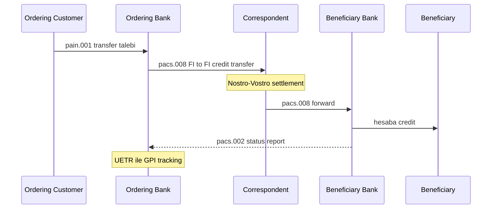
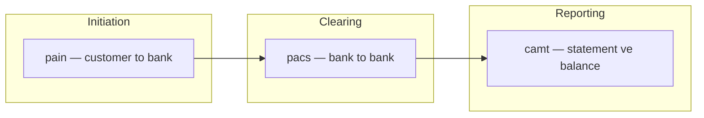
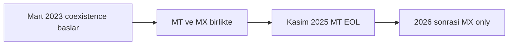
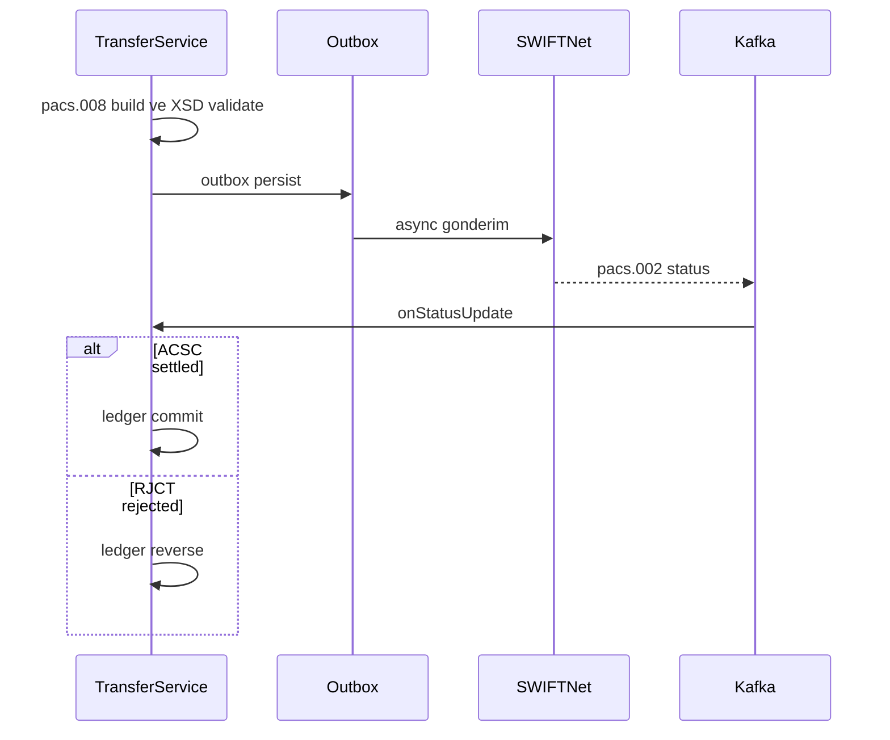

# Topic 10.3 — ISO 20022 & SWIFT MT

```admonish info title="Bu bölümde"
- SWIFT MT'nin (MT103, MT202) block-based mesaj yapısı ve field tag'leri (`:20:`, `:32A:`, `:50K:`, `:59:`)
- ISO 20022 mesaj aileleri: `pacs` / `pain` / `camt` ayrımı ve `{prefix}.{number}.{variant}.{version}` numaralandırması
- `pacs.008` cross-border FI-to-FI credit transfer XML'i; UETR + BIC + IBAN kritik alanları ve SWIFT GPI tracking
- SWIFT MT → ISO 20022 migration (Kasım 2025 EOL), MT/MX coexistence ve translator stratejisi
- Banking entegrasyonu: XSD validation, outbox + async SWIFT delivery, `pacs.002` status handling, KVKK/PII disiplini
```

## Hedef

Banking messaging'in iki büyük standardını derinlemesine öğrenmek: modern **ISO 20022** (XML/JSON) ve legacy **SWIFT MT**. `pacs.008`, `pain.001`, `camt.053` gibi mesaj tiplerini, SEPA'yı, cross-border payment akışını, SWIFT FIN ve SWIFT GPI'yı, real-time settlement'ı ve Kasım 2025 sonundaki ISO 20022 migration timeline'ını (coexistence end) hatasız anlatabilmek.

## Süre

Okuma: 2.5 saat • Kendini Sına: 45 dk • Pratik (opsiyonel): 2.5-3 saat • Toplam: ~3 saat (+ pratik)

## Önbilgi

- Topic 10.1, 10.2 bitti
- XML temel bilgisi var
- Cross-border payment kavramını duydun

---

## Kavramlar

### 1. Banking messaging landscape

Bir müşteri İstanbul'dan Berlin'e para gönderdiğinde iki banka birbiriyle konuşmak zorunda — ama hangi dilde? İşte o dili tanımlayan standardlar bunlar; her biri farklı bir kullanım için doğmuş.

| Standard | Use Case | Status |
|---|---|---|
| **ISO 8583** | Kart işlemleri (POS/ATM) | Active (Topic 10.2) |
| **SWIFT MT** | Cross-border wire | Legacy, EOL Nov 2025 |
| **SWIFT FIN** | SWIFT network layer | Active |
| **ISO 20022** | Modern universal | Active, growing |
| **SEPA** | EUR payments in Europe | Active (ISO 20022 subset) |
| **NACHA / ACH** | US domestic | Active (US-specific) |
| **TR EFT/FAST** | TR domestic | Active (TR-specific, ISO 20022 inspired) |

Uluslararası bir havalede tek bir mesaj yetmez; para birden fazla banka üzerinden zincirleme akar. Ordering bank → correspondent → beneficiary bank hattını görmek, sonraki mesaj tiplerini yerine oturtur:



### 2. SWIFT MT — Message Type (legacy)

**SWIFT MT** (Message Type) onlarca yıldır cross-border wire'ın taşıyıcısı; hâlâ her yerde görürsün, o yüzden yapısını bilmen şart. Her mesaj 3 haneli bir kodla anılır:

- `MT103` — Customer Credit Transfer (en yaygın retail wire)
- `MT202` — Bank-to-bank fund transfer
- `MT202 COV` — Cover payment (correspondent banking)
- `MT900/910` — Debit/Credit confirmation
- `MT940/950` — Statement
- `MT196/199` — Free format (queries, advice)

Yapısı **block-based plain text**'tir — XML değil, tag'lerle ayrılmış düz metin:

```
{1:F01BANKTRIS0XXX0000000000}
{2:I103OTHERBANKXXXXN}
{3:{108:MT103REF}}
{4:
:20:REF20240512001
:23B:CRED
:32A:240512TRY100000,00
:33B:TRY100000,00
:50K:/TR123456789012345678
JOHN DOE
ISTANBUL TR
:59:/DE987654321098765432
JANE SMITH
BERLIN DE
:70:INVOICE PAYMENT 12345
:71A:OUR
-}
{5:{CHK:ABCDEF123456}}
```

Mesaj beş block'a ayrılır ve mantık her zaman aynıdır:

- **Block 1:** Basic header (sender BIC, terminal ID, session)
- **Block 2:** Application header (msg type, receiver BIC)
- **Block 3:** User header (optional, reference)
- **Block 4:** Text block — finansal veri, en önemli kısım
- **Block 5:** Trailer (MAC checksum)

Block 4 içindeki field tag'leri paranın kimliğidir:

- `:20:` — Sender reference
- `:23B:` — Bank operation code
- `:32A:` — Value date, currency, amount (`240512TRY100000,00`)
- `:33B:` — Currency/instructed amount
- `:50K:` — Ordering customer
- `:59:` — Beneficiary
- `:70:` — Remittance info
- `:71A:` — Details of charges

Tuzak: MT'de amount ondalık ayırıcı **virgül**dür (`100000,00`), nokta değil — parsing sırasında en sık atlanan detay.

### 3. SWIFT MT charges (`:71A:`)

Uluslararası havalede masrafı kimin ödediği baştan belli olmalı; `:71A:` bunu üç harfle kodlar:

- `OUR` — Sender pays all charges (gönderen tüm masrafı öder)
- `BEN` — Beneficiary pays all charges (alıcı öder)
- `SHA` — Shared (gönderen kendi bankasını, alıcı alan bankayı öder)

Banking pratiği: TR çıkışlı çoğu transfer **SHA** kullanır (cost optimization). Bu alan ISO 20022'de `ChrgBr` olarak yaşamaya devam eder (`DEBT`/`CRED`/`SHAR`).

### 4. ISO 20022 — modern standard

SWIFT MT'nin datası fakir ve serbest metne dayalı; sanctions screening, structured remittance, otomatik reconciliation için yetmiyor. **ISO 20022** bu boşluğu XSD schema ile doğrulanan, yapılandırılmış XML (ve büyüyen JSON variant'ları) ile doldurur.

Mesajlar 4 harfli **prefix** ile kategorize edilir — hangi işin mesajı olduğunu prefix söyler:

| Prefix | Domain | Banking |
|---|---|---|
| `pacs` | Payments Clearing and Settlement | Inter-bank |
| `pain` | Payments Initiation | Customer → bank |
| `camt` | Cash Management | Statement, balance |
| `acmt` | Account Management | Open, close |
| `auth` | Authorities | Regulatory |
| `caaa` | Card / ATM | (overlap ISO 8583) |
| `tsmt` | Trade Services | Trade finance |
| `setr` | Securities | Securities |
| `colr` | Collateral | Repo |
| `fxtr` | FX Trade | FX |

Günlük banking'de en çok üç aileyle çalışırsın — biri müşteriden başlatır, biri bankalar arası akıtır, biri raporlar:



Mesaj adı `{prefix}.{number}.{variant}.{version}` şablonunu izler. En sık göreceklerin:

- `pacs.008.001.10` — Customer Credit Transfer (CCT)
- `pacs.002.001.12` — Payment Status Report
- `pacs.004.001.11` — Payment Return
- `pacs.009.001.10` — Financial Institution Credit Transfer
- `pain.001.001.11` — Customer Credit Transfer Initiation
- `pain.002.001.13` — Customer Status Report
- `camt.052.001.10` — Bank-to-Customer Account Report
- `camt.053.001.10` — Bank-to-Customer Statement
- `camt.054.001.10` — Bank-to-Customer Debit/Credit Notification
- `camt.056.001.10` — Payment Recall

### 5. ISO 20022 example — pacs.008

`pacs.008` (FI to FI Customer Credit Transfer) interbank transfer'in kalbidir; MT103'ün ISO 20022 karşılığı. XML uzun görünür ama iki mantıksal parçası var: mesaj başlığı (`GrpHdr`) ve tek tek işlemler (`CdtTrfTxInf`).

`GrpHdr` mesaj seviyesindeki metadata'yı taşır — kaç işlem, toplam tutar, settlement yöntemi:

```xml
<Document xmlns="urn:iso:std:iso:20022:tech:xsd:pacs.008.001.10">
    <FIToFICstmrCdtTrf>
        <GrpHdr>
            <MsgId>MAVEN-2024-05-12-001</MsgId>
            <CreDtTm>2024-05-12T10:30:45Z</CreDtTm>
            <NbOfTxs>1</NbOfTxs>
            <CtrlSum>100000.00</CtrlSum>
            <SttlmInf>
                <SttlmMtd>CLRG</SttlmMtd>
                <ClrSys><Cd>TRGT2</Cd></ClrSys>
            </SttlmInf>
        </GrpHdr>
```

İşlemin kimliği `PmtId` içindedir — özellikle `EndToEndId` (müşteri referansı) ve `UETR` (GPI tracking anahtarı) her ödemede olmalı:

```xml
        <CdtTrfTxInf>
            <PmtId>
                <InstrId>INSTR-001</InstrId>
                <EndToEndId>E2E-20240512-001</EndToEndId>
                <TxId>TX-MAVEN-20240512-001</TxId>
                <UETR>db8a3a6b-7e7d-4cad-94c4-d3eaa9c6e7b1</UETR>
            </PmtId>
            <IntrBkSttlmAmt Ccy="EUR">100000.00</IntrBkSttlmAmt>
            <IntrBkSttlmDt>2024-05-13</IntrBkSttlmDt>
            <ChrgBr>SHAR</ChrgBr>
```

Taraflar ise hesap (`IBAN`) ve banka (`BICFI`) çiftiyle tanımlanır — borçlu (`Dbtr`) ve alacaklı (`Cdtr`) simetriktir:

```xml
            <DbtrAcct><Id><IBAN>TR320010009999987654321098</IBAN></Id></DbtrAcct>
            <DbtrAgt><FinInstnId><BICFI>MAVNRIS0XXX</BICFI></FinInstnId></DbtrAgt>
            <CdtrAgt><FinInstnId><BICFI>OTHERBKDEFFXXX</BICFI></FinInstnId></CdtrAgt>
            <CdtrAcct><Id><IBAN>DE89370400440532013000</IBAN></Id></CdtrAcct>
```

Kritik alanları ezberle: `MsgId` (mesaj ID), `EndToEndId` (müşteri end-to-end referansı), `UETR` (SWIFT GPI izleme), `BICFI` (8 veya 11 karakter banka kodu), `IBAN` (uluslararası hesap), `ChrgBr` (charge bearer). Tam mesaj postal address'lerle birlikte aşağıda:

<details>
<summary>Tam kod: pacs.008.001.10 XML (~82 satır)</summary>

```xml
<?xml version="1.0" encoding="UTF-8"?>
<Document xmlns="urn:iso:std:iso:20022:tech:xsd:pacs.008.001.10">
    <FIToFICstmrCdtTrf>
        <GrpHdr>
            <MsgId>MAVEN-2024-05-12-001</MsgId>
            <CreDtTm>2024-05-12T10:30:45Z</CreDtTm>
            <NbOfTxs>1</NbOfTxs>
            <CtrlSum>100000.00</CtrlSum>
            <SttlmInf>
                <SttlmMtd>CLRG</SttlmMtd>
                <ClrSys>
                    <Cd>TRGT2</Cd>
                </ClrSys>
            </SttlmInf>
            <InstgAgt>
                <FinInstnId>
                    <BICFI>MAVNRIS0XXX</BICFI>
                </FinInstnId>
            </InstgAgt>
            <InstdAgt>
                <FinInstnId>
                    <BICFI>OTHERBKDEFFXXX</BICFI>
                </FinInstnId>
            </InstdAgt>
        </GrpHdr>
        <CdtTrfTxInf>
            <PmtId>
                <InstrId>INSTR-001</InstrId>
                <EndToEndId>E2E-20240512-001</EndToEndId>
                <TxId>TX-MAVEN-20240512-001</TxId>
                <UETR>db8a3a6b-7e7d-4cad-94c4-d3eaa9c6e7b1</UETR>
            </PmtId>
            <IntrBkSttlmAmt Ccy="EUR">100000.00</IntrBkSttlmAmt>
            <IntrBkSttlmDt>2024-05-13</IntrBkSttlmDt>
            <ChrgBr>SHAR</ChrgBr>
            <Dbtr>
                <Nm>John Doe</Nm>
                <PstlAdr>
                    <StrtNm>Atatürk Caddesi</StrtNm>
                    <BldgNb>15</BldgNb>
                    <PstCd>34000</PstCd>
                    <TwnNm>Istanbul</TwnNm>
                    <Ctry>TR</Ctry>
                </PstlAdr>
            </Dbtr>
            <DbtrAcct>
                <Id>
                    <IBAN>TR320010009999987654321098</IBAN>
                </Id>
            </DbtrAcct>
            <DbtrAgt>
                <FinInstnId>
                    <BICFI>MAVNRIS0XXX</BICFI>
                </FinInstnId>
            </DbtrAgt>
            <CdtrAgt>
                <FinInstnId>
                    <BICFI>OTHERBKDEFFXXX</BICFI>
                </FinInstnId>
            </CdtrAgt>
            <Cdtr>
                <Nm>Jane Smith</Nm>
                <PstlAdr>
                    <StrtNm>Friedrichstrasse</StrtNm>
                    <BldgNb>100</BldgNb>
                    <PstCd>10117</PstCd>
                    <TwnNm>Berlin</TwnNm>
                    <Ctry>DE</Ctry>
                </PstlAdr>
            </Cdtr>
            <CdtrAcct>
                <Id>
                    <IBAN>DE89370400440532013000</IBAN>
                </Id>
            </CdtrAcct>
            <RmtInf>
                <Ustrd>Invoice payment 12345</Ustrd>
            </RmtInf>
        </CdtTrfTxInf>
    </FIToFICstmrCdtTrf>
</Document>
```

</details>

### 6. UETR — SWIFT GPI tracking

Eskiden bir cross-border havale "kara kutu"ydu: gönderdin, günlerce nerede olduğunu bilemezdin. **UETR** (Unique End-to-end Transaction Reference) bunu bitirir — her ödemeye yapıştırılan 36 karakterlik bir UUID'dir ve zincirin her adımında aynı kalır.

```
GPI Tracker URL:
https://tracker.swift.com/track?uetr=db8a3a6b-7e7d-4cad-94c4-d3eaa9c6e7b1

Status:
- Initiated (sender bank)
- In transit (correspondent)
- Credited (beneficiary bank)
- Settled
- Returned
- Status SLA target: 80% < 30 minutes
```

SWIFT GPI modern correspondent banking'de artık zorunludur. Bu yüzden pratik kural nettir: <mark>yeni oluşturulan her ödeme mutlaka bir UETR taşımalı</mark> — sonradan izlenebilirlik eklemenin yolu yoktur.

```admonish tip title="UETR üretimi"
UETR'yi ödeme oluşturulurken bir kez üret (`UUID.randomUUID()`) ve DB'de sakla. Retry, translate veya status update sırasında aynı UETR'yi kullan; her seferinde yeni üretirsen GPI tracking zinciri kopar.
```

### 7. SEPA — Single Euro Payments Area

Avrupa'da EUR ödemelerini tek bir kurallar setiyle standartlaştırmak için **SEPA** doğdu; ISO 20022'nin EUR-only bir subset'idir. Üç ürünü var, hepsi aynı XML ailesini kullanır:

**SCT (SEPA Credit Transfer):** `pain.001` customer initiation, `pacs.008` interbank, D+1 settlement (max 1 iş günü).

**SCT Inst (Instant):** yüksek öncelikli `pacs.008`, 10 saniye hedef, 24/7/365 çalışır.

**SDD (SEPA Direct Debit):** `pain.008` initiation, `pacs.003` interbank, mandate-based recurring (otomatik ödeme talimatı).

SEPA'nın değişmezleri: IBAN+BIC zorunlu, charge her zaman `SHAR`, sadece EUR, 33 Avrupa ülkesi. Türkiye SEPA üyesi **değildir** (EUR area dışında), ama correspondent network üzerinden SEPA-compatible çalışan TR bankaları vardır.

### 8. ISO 20022 migration — banking 2025

Bu bölümdeki en kritik tarih: SWIFT MT → ISO 20022 migration **Kasım 2025 sonunda** tamamlanıyor. Coexistence dönemi bitiyor ve MT100 serisi emekliye ayrılıyor.



Timeline özet:

- **Mart 2023:** MX (ISO 20022) coexistence başladı
- **Kasım 2025:** MT100 series (MT103, MT202 vb.) **end-of-life**
- **2026+:** MX-only

Bunun anlamı doğrudan: <mark>Kasım 2025 sonrası gönderilen MT mesajı reject edilir, dolayısıyla migration planı opsiyonel değil zorunludur</mark>. Sektörün hazırlığı da bu yüzden kapsamlı: legacy bağlantılar için MT/MX translator, ISO 20022'nin daha zengin datasına uyum (rich data uplift), operational training, regulatory reporting'in yeni formata taşınması ve sanctions screening parser'larının güncellenmesi.

```admonish warning title="MT EOL — hazır olmak"
Kasım 2025 sadece "MT gönderemezsin" demek değil; karşı taraftan gelen MX mesajını parse edememek de reject demektir. Translator'ı iki yönlü test et, sanctions screening'i MX field yapısına göre yeniden kalibre et.
```

### 9. Java implementation — Prowide

Bu standardları elle string üretmek intihardır; Java tarafında de facto kütüphane **Prowide**'dır — hem SWIFT MT hem ISO 20022'yi kapsar.

```xml
<dependency>
    <groupId>com.prowidesoftware</groupId>
    <artifactId>pw-swift-core</artifactId>
    <version>SRU2024-9.5.5</version>
</dependency>
<dependency>
    <groupId>com.prowidesoftware</groupId>
    <artifactId>pw-iso20022</artifactId>
    <version>SRU2024-9.5.5</version>
</dependency>
```

SWIFT MT tarafında field'ları fluent API ile eklersin; `message()` block-based metni üretir:

```java
MT103 mt = new MT103()
    .append(new Field20("REF20240512001"))
    .append(new Field23B("CRED"))
    .append(new Field32A("240512", "EUR", "100000,00"))
    .append(new Field50K("/TR320010009999987654321098\nJOHN DOE\nISTANBUL TR"))
    .append(new Field59("/DE89370400440532013000\nJANE SMITH\nBERLIN DE"))
    .append(new Field70("INVOICE PAYMENT 12345"))
    .append(new Field71A("SHA"));

mt.setSender("MAVNRIS0");
mt.setReceiver("OTHERBKDEFF");

String swiftMessage = mt.message();
```

Parse tarafı simetriktir — field getter'ları ile değerleri geri okursun:

```java
MT103 parsed = MT103.parse(swiftMessage);
String reference = parsed.getField20().getValue();
String amount = parsed.getField32A().getAmount();
String currency = parsed.getField32A().getCurrency();
String beneficiaryName = parsed.getField59().getNameAndAddress().get(0);
```

ISO 20022 tarafında ise generated class'larla nesne ağacı kurar, sonuçta `MxParseUtils.write()` ile XML'e serialize edersin. Aşağıdaki parça `pacs.008`'in header + payment id + amount kısmını gösterir:

```java
Pacs00800110 pacs = new Pacs00800110();
FIToFICustomerCreditTransferV10 doc = new FIToFICustomerCreditTransferV10();

GroupHeader113 hdr = new GroupHeader113();
hdr.setMsgId("MAVEN-2024-05-12-001");
hdr.setCreDtTm(now());
hdr.setNbOfTxs("1");
hdr.setCtrlSum(new BigDecimal("100000.00"));
doc.setGrpHdr(hdr);

CreditTransferTransaction50 tx = new CreditTransferTransaction50();
PaymentIdentification7 pmtId = new PaymentIdentification7();
pmtId.setInstrId("INSTR-001");
pmtId.setEndToEndId("E2E-20240512-001");
pmtId.setUETR(UUID.randomUUID().toString());
tx.setPmtId(pmtId);
```

Kalan kısım (amount, debtor, creditor, agents) aynı pattern'le kurulur; tam listing:

<details>
<summary>Tam kod: pacs.008 build (~30 satır)</summary>

```java
Pacs00800110 pacs = new Pacs00800110();
FIToFICustomerCreditTransferV10 doc = new FIToFICustomerCreditTransferV10();

GroupHeader113 hdr = new GroupHeader113();
hdr.setMsgId("MAVEN-2024-05-12-001");
hdr.setCreDtTm(now());
hdr.setNbOfTxs("1");
hdr.setCtrlSum(new BigDecimal("100000.00"));
doc.setGrpHdr(hdr);

CreditTransferTransaction50 tx = new CreditTransferTransaction50();
PaymentIdentification7 pmtId = new PaymentIdentification7();
pmtId.setInstrId("INSTR-001");
pmtId.setEndToEndId("E2E-20240512-001");
pmtId.setUETR(UUID.randomUUID().toString());
tx.setPmtId(pmtId);

ActiveCurrencyAndAmount amt = new ActiveCurrencyAndAmount();
amt.setCcy("EUR");
amt.setValue(new BigDecimal("100000.00"));
tx.setIntrBkSttlmAmt(amt);

// ... debtor, creditor, agents

doc.getCdtTrfTxInf().add(tx);
pacs.setFIToFICstmrCdtTrf(doc);

String xml = MxParseUtils.write(pacs);
```

</details>

### 10. MT → MX translation (during migration)

Coexistence döneminde eski ve yeni sistemlerin konuşabilmesi için köprüye ihtiyaç var; Prowide bir translator sunar:

```java
// MT103 → pacs.008 translate
MT103 mt = MT103.parse(swiftMessage);
Pacs00800110 mx = MtMxTranslator.toMx(mt);

// Ters yön
Pacs00800110 mx2 = Pacs00800110.parse(xmlMessage);
MT103 mt2 = MtMxTranslator.toMt(mx2);
```

Trade-off'u bil: MT structured olarak fakir olduğu için MX'e çevirirken zengin bilgi **infer edilemez** — boş kalan alanlar boş kalır. Bu yüzden yeni implementation'da kural **MX-first**'tür; translator sadece legacy hattı ayakta tutmak için.

### 11. camt.053 — bank-to-customer statement

Müşteri veya kurumsal entegrasyon "bugün hesabımda ne oldu?" diye sorduğunda cevap **camt.053**'tür: EOD (end-of-day) bank-to-customer statement. Üç mantıksal parçası var — başlık + hesap, bakiyeler, hareketler.

Önce statement kimliği ve hesap:

```xml
<Document xmlns="urn:iso:std:iso:20022:tech:xsd:camt.053.001.10">
    <BkToCstmrStmt>
        <GrpHdr>
            <MsgId>STMT-20240512-001</MsgId>
            <CreDtTm>2024-05-12T23:59:00Z</CreDtTm>
        </GrpHdr>
        <Stmt>
            <Id>STMT-001</Id>
            <ElctrncSeqNb>1</ElctrncSeqNb>
            <Acct>
                <Id><IBAN>TR320010009999987654321098</IBAN></Id>
                <Ccy>TRY</Ccy>
            </Acct>
```

Sonra açılış ve kapanış bakiyeleri — `OPBD` (opening booked), `CLBD` (closing booked):

```xml
            <Bal>
                <Tp><CdOrPrtry><Cd>OPBD</Cd></CdOrPrtry></Tp>
                <Amt Ccy="TRY">10000.00</Amt>
                <CdtDbtInd>CRDT</CdtDbtInd>
            </Bal>
            <Bal>
                <Tp><CdOrPrtry><Cd>CLBD</Cd></CdOrPrtry></Tp>
                <Amt Ccy="TRY">10500.00</Amt>
                <CdtDbtInd>CRDT</CdtDbtInd>
            </Bal>
```

Her hareket bir `Ntry`'dir; `BkTxCd` işlemin türünü kodlar, `NtryDtls` referans ve remittance taşır. Tam mesaj:

<details>
<summary>Tam kod: camt.053.001.10 XML (~66 satır)</summary>

```xml
<Document xmlns="urn:iso:std:iso:20022:tech:xsd:camt.053.001.10">
    <BkToCstmrStmt>
        <GrpHdr>
            <MsgId>STMT-20240512-001</MsgId>
            <CreDtTm>2024-05-12T23:59:00Z</CreDtTm>
        </GrpHdr>
        <Stmt>
            <Id>STMT-001</Id>
            <ElctrncSeqNb>1</ElctrncSeqNb>
            <FrToDt>
                <FrDtTm>2024-05-12T00:00:00Z</FrDtTm>
                <ToDtTm>2024-05-12T23:59:59Z</ToDtTm>
            </FrToDt>
            <Acct>
                <Id>
                    <IBAN>TR320010009999987654321098</IBAN>
                </Id>
                <Ccy>TRY</Ccy>
            </Acct>
            <Bal>
                <Tp><CdOrPrtry><Cd>OPBD</Cd></CdOrPrtry></Tp>
                <Amt Ccy="TRY">10000.00</Amt>
                <CdtDbtInd>CRDT</CdtDbtInd>
                <Dt><Dt>2024-05-12</Dt></Dt>
            </Bal>
            <Bal>
                <Tp><CdOrPrtry><Cd>CLBD</Cd></CdOrPrtry></Tp>
                <Amt Ccy="TRY">10500.00</Amt>
                <CdtDbtInd>CRDT</CdtDbtInd>
                <Dt><Dt>2024-05-12</Dt></Dt>
            </Bal>
            <TxsSummry>
                <TtlNtries>
                    <NbOfNtries>3</NbOfNtries>
                </TtlNtries>
            </TxsSummry>
            <Ntry>
                <Amt Ccy="TRY">1000.00</Amt>
                <CdtDbtInd>CRDT</CdtDbtInd>
                <Sts><Cd>BOOK</Cd></Sts>
                <BookgDt><Dt>2024-05-12</Dt></BookgDt>
                <ValDt><Dt>2024-05-12</Dt></ValDt>
                <BkTxCd>
                    <Domn>
                        <Cd>PMNT</Cd>
                        <Fmly><Cd>RCDT</Cd><SubFmlyCd>BOOK</SubFmlyCd></Fmly>
                    </Domn>
                </BkTxCd>
                <NtryDtls>
                    <TxDtls>
                        <Refs>
                            <EndToEndId>E2E-20240512-001</EndToEndId>
                        </Refs>
                        <RltdPties>
                            <Dbtr><Pty><Nm>John Doe</Nm></Pty></Dbtr>
                        </RltdPties>
                        <RmtInf>
                            <Ustrd>Salary May 2024</Ustrd>
                        </RmtInf>
                    </TxDtls>
                </NtryDtls>
            </Ntry>
            <!-- more Ntry -->
        </Stmt>
    </BkToCstmrStmt>
</Document>
```

</details>

Bu statement ya müşteri tarafından indirilir ya da bir API entegrasyonuyla karşı sistemin muhasebesine akar.

### 12. ISO 20022 schema validation

ISO 20022'nin en büyük vaadi "yapılandırılmış ve doğrulanabilir" olması; bunu kullanmazsan MT'ye göre bir avantajın kalmaz. Her mesaj tipinin bir XSD schema'sı vardır (vendor sağlar, çoğu paid):

```java
SchemaFactory factory = SchemaFactory.newInstance(XMLConstants.W3C_XML_SCHEMA_NS_URI);
Schema schema = factory.newSchema(new File("schemas/pacs.008.001.10.xsd"));

Validator validator = schema.newValidator();
validator.validate(new StreamSource(new StringReader(xmlMessage)));
// Invalid mesajda SAXException fırlar
```

Kural kesin: <mark>ingestion pipeline'ında XSD validation zorunludur, invalid mesaj downstream'e asla geçmemeli</mark>. Aksi halde bir eksik alan, ilerideki reconcile aşamasında saatlerce süren bir sorun olarak geri döner.

### 13. Banking integration — pacs.008 transfer flow

Şimdi parçaları birleştirelim: gerçek bir cross-border transfer servisi neye benzer? Kritik nokta, SWIFT çağrısının **synchronous** yapılmaması — dakikalar/saatler sürebilir, o yüzden outbox pattern (Topic 6.6) ile async gider.

Servisin ilk yarısı: validation, sanctions screening, mesaj kurma, XSD validate ve outbox'a yazma — hepsi tek transaction içinde:

```java
@Transactional
public TransferResult initiate(CrossBorderTransferRequest req) {
    // 1. IBAN + BIC doğrula
    validateIban(req.creditorIban());
    String creditorBic = bicResolver.fromIban(req.creditorIban());

    // 2. Sanctions screening (Topic 10.6) — göndermeden ÖNCE
    sanctionsScreener.check(req.creditorName(), req.creditorCountry());

    // 3. pacs.008 kur + XSD validate
    Pacs00800110 message = buildPacs008(req, creditorBic);
    validateSchema(message);

    // 4. Outbox'a yaz (Topic 6.6 dual-write safe)
    outboxRepo.save(OutboxEvent.builder()
        .aggregate("transfer")
        .aggregateId(req.transferId().toString())
        .payload(MxParseUtils.write(message))
        .destination("swift")
        .build());
```

Ardından ledger'a debit/credit post edilir (Topic 10.1 — clearing account kullanılır) ve UETR'li bir `PENDING` sonuç döner. Gerçek gönderim outbox publisher tarafından yapılır. Karşılık olarak gelen `pacs.002` status report ise ayrı bir Kafka listener'da işlenir — `ACSC` ise settlement tamamlanır, `RJCT` ise ledger reverse edilir:



Tam servis, status handling dahil:

<details>
<summary>Tam kod: CrossBorderTransferService (~65 satır)</summary>

```java
@Service
public class CrossBorderTransferService {

    private final BicResolver bicResolver;
    private final SwiftConnector swiftConnector;
    private final LedgerService ledgerService;

    @Transactional
    public TransferResult initiate(CrossBorderTransferRequest req) {
        // 1. Validate IBAN, BIC
        validateIban(req.creditorIban());
        String creditorBic = bicResolver.fromIban(req.creditorIban());

        // 2. Sanctions screening (Topic 10.6)
        sanctionsScreener.check(req.creditorName(), req.creditorCountry());

        // 3. Construct pacs.008
        Pacs00800110 message = buildPacs008(req, creditorBic);

        // 4. Validate XSD
        validateSchema(message);

        // 5. Persist outbox (Topic 6.6 dual-write safe)
        outboxRepo.save(OutboxEvent.builder()
            .aggregate("transfer")
            .aggregateId(req.transferId().toString())
            .payload(MxParseUtils.write(message))
            .destination("swift")
            .build());

        // 6. Ledger post (Topic 10.1)
        ledgerService.post(
            JournalEntry.builder()
                .debit(req.debtorAccount(), req.amount(), req.currency())
                .credit(SWIFT_OUTGOING_CLEARING, req.amount(), req.currency())
                .build());

        // 7. Outbox publisher will send via SwiftConnector to SWIFTNet
        return TransferResult.builder()
            .uetr(message.getFIToFICstmrCdtTrf().getCdtTrfTxInf().get(0).getPmtId().getUETR())
            .status("PENDING")
            .build();
    }

    @KafkaListener(topics = "swift-status-updates")
    public void onStatusUpdate(SwiftStatusUpdate update) {
        // Receive pacs.002 status report
        Transfer t = transferRepo.findByUetr(update.uetr()).orElseThrow();

        if ("ACSC".equals(update.statusCode())) {   // AcceptedSettlementCompleted
            ledgerService.post(
                JournalEntry.builder()
                    .debit(SWIFT_OUTGOING_CLEARING, t.getAmount(), t.getCurrency())
                    .credit(NOSTRO_ACCOUNT_TARGET, t.getAmount(), t.getCurrency())
                    .build());
            t.markCompleted();
        } else if ("RJCT".equals(update.statusCode())) {
            // Rejected — refund debtor
            ledgerService.reverse(t.getInitialJournalId());
            t.markRejected(update.reasonCode());
        }
    }
}
```

</details>

```admonish warning title="Sync SWIFT call yapma"
SWIFT round-trip dakikalar/saatler sürebilir. Servis içinde `swiftConnector.send(...)` çağrısını beklersen connection pool tükenir, TX timeout patlar, mesaj yarı gönderilmiş kalır. Her zaman outbox + async publisher; status'u pacs.002 event'iyle geri al.
```

### 14. Banking — ISO 20022/SWIFT anti-pattern'leri

Mülakatta "bu implementasyonda ne yanlış?" sorusunun cephaneliği burası. On klasik hata:

**Anti-pattern 1: MT-only forever.** Kasım 2025 sonrası MT message reject edilir; migration plan zorunlu.

**Anti-pattern 2: XSD validation skip.** Production'da invalid message → downstream reject + reconcile chaos. Her zaman validate et.

**Anti-pattern 3: UETR generate yok.** GPI tracking için UETR şart; yeni ödeme her zaman UETR taşımalı.

**Anti-pattern 4: PII in `Ustrd` (remittance info).** Bu banking'in en sık düştüğü KVKK tuzağı — remittance alanı serbest metin diye TC kimlik, telefon, kart no yazılır:

```xml
<Ustrd>Payment to Jane Smith TC: 12345678901</Ustrd>   <!-- ❌ KVKK -->
```

Kural nettir: <mark>remittance info yalnızca invoice number veya reference içermeli, asla PII değil</mark>. Bu mesaj birden fazla banka ve ülkeden geçer.

**Anti-pattern 5: Charge bearer karışıklığı.** OUR/SHA/BEN trade-off'u müşteri onayında açık olmalı; UX kritik.

**Anti-pattern 6: BIC validation yok.** Invalid BIC → SWIFT reject + refund SLA gecikir. BIC validation library kullan (8 veya 11 karakter, chars 5-6 country code).

**Anti-pattern 7: IBAN check digit hesaplama yok.** IBAN MOD-97 check digit taşır; app-level validate et, DB write'tan önce.

**Anti-pattern 8: Synchronous SWIFT call.** SWIFT round-trip dakikalar/saatler; outbox pattern (Topic 6.6) + async.

**Anti-pattern 9: Idempotency yok.** Duplicate SWIFT gönderimi → double settlement. Her ödemeye idempotency key.

**Anti-pattern 10: Reconciliation eksik.** Sent SWIFT + status update mismatch → ledger drift. EOD reconciliation (Topic 10.7).

---

## Önemli olabilecek araştırma kaynakları

- ISO 20022 official (iso20022.org)
- SWIFT documentation (swift.com)
- Prowide library docs
- SWIFT MX migration guide 2025
- SEPA Rulebook (EBA Clearing)
- CBRT (TCMB) SWIFT operations rehberi

---

## Kendini Sına

Aşağıdaki soruları önce **cevaba bakmadan** kendi cümlelerinle yanıtlamayı dene — hepsi TR bank mülakatlarında karşına çıkabilecek tarzda. Takıldığın soru olursa ilgili Kavramlar başlığına dön, sonra tekrar dene.

**S1. MT103 ile pacs.008 arasındaki temel farklar nelerdir?**

<details>
<summary>Cevabı göster</summary>

Her ikisi de customer credit transfer taşır ama form ve zenginlik farkı büyük. MT103 legacy SWIFT MT'dir: block-based plain text, field tag'leri (`:20:`, `:32A:`, `:50K:`, `:59:`), fakir/serbest metin datası, amount virgüllü. pacs.008 ise ISO 20022 XML'idir: XSD ile doğrulanan yapılandırılmış ağaç, `EndToEndId` + `UETR` gibi zorunlu izleme alanları, structured postal address ve remittance.

En önemli pratik fark: MT103 Kasım 2025'te EOL olurken pacs.008 geleceğin standardıdır. MT'nin fakir datasından MX'in zengin alanları infer edilemez, bu yüzden yeni implementation MX-first yapılır.

</details>

**S2. ISO 20022'ye neden geçiliyor ve migration timeline nedir?**

<details>
<summary>Cevabı göster</summary>

Sebep: SWIFT MT'nin datası fakir ve serbest metne dayalı; sanctions screening, structured remittance, otomatik reconciliation ve regulatory reporting için yetmiyor. ISO 20022 XSD ile doğrulanan, zengin ve yapılandırılmış veri sunar.

Timeline: Mart 2023'te MX coexistence başladı; Kasım 2025 sonunda MT100 serisi (MT103, MT202) end-of-life olur; 2026+ MX-only. Coexistence döneminde MT/MX translator legacy hattı ayakta tutar ama Kasım 2025 sonrası gönderilen MT reject edilir — migration zorunlu.

</details>

**S3. UETR nedir ve SWIFT GPI ile ilişkisi nedir?**

<details>
<summary>Cevabı göster</summary>

UETR (Unique End-to-end Transaction Reference) her ödemeye yapıştırılan 36 karakterlik bir UUID'dir. Zincirin her adımında (initiated → in transit → credited → settled) aynı kalır ve cross-border payment'a end-to-end izlenebilirlik verir.

SWIFT GPI bu UETR üzerinden çalışır: tracker (`tracker.swift.com/track?uetr=...`) ödemenin hangi bankada olduğunu ve status'unu gösterir, SLA hedefi ödemelerin %80'inin 30 dakikadan kısa sürede güncellenmesidir. Modern correspondent banking'de GPI zorunlu, dolayısıyla her yeni ödemede UETR bir kez üretilir ve DB'de saklanır — retry/translate sırasında değişmez.

</details>

**S4. camt.053 ne işe yarar, hangi bilgileri taşır?**

<details>
<summary>Cevabı göster</summary>

camt.053 bank-to-customer statement'tır — EOD (end-of-day) hesap ekstresi. Müşteri veya kurumsal entegrasyon "bugün hesabımda ne oldu?" sorusunun standart cevabıdır; indirilir ya da API ile karşı muhasebeye akar.

Üç mantıksal parça taşır: hesap kimliği (`Acct` → IBAN, currency), bakiyeler (`Bal` → `OPBD` opening booked, `CLBD` closing booked) ve tek tek hareketler (`Ntry` → tutar, credit/debit indicator, `BkTxCd` işlem türü, `NtryDtls` içinde EndToEndId + remittance). Karşılaştırması: camt.052 intraday report, camt.054 debit/credit notification'dır.

</details>

**S5. BIC ve IBAN nedir, banking'de nasıl validate edilir?**

<details>
<summary>Cevabı göster</summary>

BIC (Bank Identifier Code) bankayı tanımlar, 8 veya 11 karakterdir; 5-6. karakterler ISO country code'dur (ör. `MAVNRIS0XXX` → TR). ISO 20022'de `BICFI` olarak geçer. IBAN ise hesabı uluslararası formatta tanımlar ve içinde bir MOD-97 check digit taşır (2-3. haneler).

Validation göndermeden önce yapılır: BIC için format + country code kontrolü (validation library), IBAN için MOD-97 algoritması — ülke kodu+check digit'i sona taşı, harfleri sayıya çevir, 97'ye böl, sonuç 1 olmalı. Invalid BIC/IBAN → SWIFT reject + refund SLA gecikmesi, bu yüzden app-level validate DB write'tan önce şart.

</details>

**S6. ChrgBr (charge bearer) OUR / SHA / BEN farkı nedir?**

<details>
<summary>Cevabı göster</summary>

Uluslararası havalede masrafı kimin ödediğini belirler. OUR: gönderen tüm masrafı öder (alıcı tam tutarı alır). BEN: alıcı tüm masrafı öder (gönderilen tutardan düşülür). SHA: paylaşımlı — gönderen kendi bankasının, alıcı alan bankanın masrafını öder.

MT'de `:71A:` field'ında, ISO 20022'de `ChrgBr` (`DEBT`/`CRED`/`SHAR`) olarak kodlanır. Banking pratiği: TR çıkışlı çoğu transfer SHA kullanır (cost optimization). Kritik nokta UX'tir — hangi modun seçildiği müşteri onayında açık olmalı, yoksa "beklediğimden az para gitti" şikayeti gelir.

</details>

**S7. SEPA'nın üç ürünü (SCT / SCT Inst / SDD) arasındaki fark nedir?**

<details>
<summary>Cevabı göster</summary>

SEPA, EUR ödemeleri için ISO 20022'nin bir subset'idir; IBAN+BIC zorunlu, charge her zaman SHAR, sadece EUR, 33 ülke. SCT (SEPA Credit Transfer): normal havale, `pain.001` + `pacs.008`, D+1 settlement. SCT Inst (Instant): yüksek öncelikli `pacs.008`, 10 saniye hedef, 24/7/365. SDD (SEPA Direct Debit): otomatik ödeme talimatı, `pain.008` + `pacs.003`, mandate-based recurring.

Türkiye SEPA üyesi değildir (EUR area dışında) ama correspondent network üzerinden SEPA-compatible çalışan TR bankaları vardır.

</details>

**S8. Cross-border pacs.008 gönderirken banking flow hangi adımlardan geçmeli?**

<details>
<summary>Cevabı göster</summary>

Sırasıyla: (1) IBAN MOD-97 + BIC validate, (2) sanctions screening göndermeden ÖNCE, (3) pacs.008 kur + UETR üret, (4) XSD validation — invalid mesaj downstream'e geçmez, (5) outbox'a persist (Topic 6.6 dual-write safe), (6) ledger'a debit/credit post et (clearing account ile), (7) outbox publisher async olarak SWIFTNet'e gönderir.

SWIFT çağrısı asla synchronous olmamalı — dakikalar/saatler sürer, sync beklersen pool tükenir. Karşılık gelen `pacs.002` status report ayrı bir listener'da işlenir: `ACSC` → settlement tamamla, `RJCT` → ledger reverse + refund. Idempotency key ile duplicate gönderim double settlement'ı engellenir.

</details>

---

## Tamamlama kriterleri

- [ ] "Kendini Sına" bölümündeki tüm soruları cevaba bakmadan açıklayabiliyorum
- [ ] MT103 block yapısını ve `pacs.008` XML karşılığını alan alan eşleştirebiliyorum
- [ ] `pacs` / `pain` / `camt` ailelerini ve `{prefix}.{number}.{variant}.{version}` numaralandırmasını anlatabiliyorum
- [ ] UETR + BICFI + IBAN'ın (MOD-97) neden zorunlu olduğunu ve nasıl validate edildiğini biliyorum
- [ ] Kasım 2025 migration timeline'ını ve MT/MX coexistence stratejisini açıklayabiliyorum
- [ ] Cross-border transfer flow'unu (sanctions → XSD → outbox → async → pacs.002) tahtada çizebiliyorum
- [ ] 10 anti-pattern'i tanıyıp her birinin production riskini söyleyebiliyorum
- [ ] (Opsiyonel) "Pratik yapmak istersen" testlerini yazdım ve Claude-verify prompt'uyla doğrulattım

---

## Defter notları

1. "SWIFT MT vs ISO 20022 banking 2025 migration timeline: ____."
2. "ISO 20022 prefix (pacs/pain/camt) + message numbering banking: ____."
3. "pacs.008 cross-border FI to FI customer credit transfer: ____."
4. "UETR SWIFT GPI tracking + end-to-end visibility: ____."
5. "BIC + IBAN MOD-97 validation banking pre-send: ____."
6. "SEPA SCT + SCT Inst + SDD EUR area harmonization: ____."
7. "ChrgBr OUR/SHA/BEN trade-off banking customer UX: ____."
8. "camt.053 bank-to-customer statement EOD daily: ____."
9. "Outbox pattern + async SWIFT delivery + status consume: ____."
10. "PII anti-pattern remittance info + sanctions screening before send: ____."

```admonish success title="Bölüm Özeti"
- SWIFT MT block-based legacy'dir: MT103 customer credit transfer, field tag'leri `:20:`/`:32A:`/`:50K:`/`:59:`, Kasım 2025'te EOL
- ISO 20022 XSD ile doğrulanan XML: `pacs` (interbank), `pain` (initiation), `camt` (reporting); ad şablonu `{prefix}.{number}.{variant}.{version}`
- `pacs.008` cross-border FI-to-FI credit transfer; UETR ile SWIFT GPI end-to-end tracking, `BICFI` + `IBAN` zorunlu
- Migration coexistence MT/MX translator ile köprülenir ama yeni implementation MX-first — MT'nin fakir datasından zengin bilgi infer edilemez
- Banking flow ezberi: BIC/IBAN validate + sanctions screening + XSD validation + outbox async delivery + `pacs.002` status handling + ledger post
- KVKK disiplini: remittance info'da PII yok, sadece invoice/reference; sanctions screening göndermeden önce; her ödemede UETR + idempotency
```

---

## Pratik yapmak istersen

Kavramları koda dökmek istersen aşağıdaki iki ek hazır: test yazma rehberi MT103 roundtrip, pacs.008 XSD validation, UETR uniqueness ve IBAN validation için örnek testler içerir; Claude-verify prompt'u ile yazdığın ISO 20022/SWIFT kodunu banking-grade perspektiften denetletebilirsin.

<details>
<summary>Test yazma rehberi</summary>

Aşağıdaki testler Prowide + JUnit 5 varsayar. Hedef: MT/MX build-parse roundtrip'i, XSD validation'ı, UETR uniqueness'ı ve IBAN/BIC validation'ı kanıtlamak.

```java
@Test
void shouldBuildMT103() {
    MT103 mt = new MT103()
        .append(new Field20("TEST123"))
        .append(new Field32A("240512", "EUR", "100000,00"))
        // ...
        ;

    String message = mt.message();

    MT103 parsed = MT103.parse(message);
    assertThat(parsed.getField20().getValue()).isEqualTo("TEST123");
    assertThat(parsed.getField32A().getAmount()).isEqualTo("100000,00");
}

@Test
void shouldBuildAndValidatePacs008() throws Exception {
    Pacs00800110 msg = buildTestPacs008();
    String xml = MxParseUtils.write(msg);

    SchemaFactory factory = SchemaFactory.newInstance(XMLConstants.W3C_XML_SCHEMA_NS_URI);
    Schema schema = factory.newSchema(getClass().getResource("/schemas/pacs.008.001.10.xsd"));
    Validator validator = schema.newValidator();
    validator.validate(new StreamSource(new StringReader(xml)));
    // No exception = valid
}

@Test
void shouldGenerateUniqueUetr() {
    Pacs00800110 msg1 = buildTestPacs008();
    Pacs00800110 msg2 = buildTestPacs008();

    String uetr1 = uetrOf(msg1);
    String uetr2 = uetrOf(msg2);

    assertThat(uetr1).isNotEqualTo(uetr2);
    assertThat(uetr1).matches("[a-f0-9]{8}-[a-f0-9]{4}-[a-f0-9]{4}-[a-f0-9]{4}-[a-f0-9]{12}");
}

@ParameterizedTest
@ValueSource(strings = {
    "TR320010009999987654321098",
    "DE89370400440532013000",
    "GB29NWBK60161331926819"
})
void shouldAcceptValidIban(String iban) {
    assertThat(IbanValidator.isValid(iban)).isTrue();
}

@ParameterizedTest
@ValueSource(strings = {
    "TR320010009999987654321099",   // Wrong checksum
    "TR3200100099998",                // Too short
    "XX320010009999987654321098"      // Invalid country
})
void shouldRejectInvalidIban(String iban) {
    assertThat(IbanValidator.isValid(iban)).isFalse();
}

@Test
void shouldNotIncludeSensitiveDataInRemittanceInfo() {
    CrossBorderTransferRequest req = ...;
    Pacs00800110 msg = service.buildMessage(req);

    String xml = MxParseUtils.write(msg);
    assertThat(xml).doesNotContain("12345678901");   // No TC
    assertThat(xml).doesNotContain(req.debtorCardPan());
}
```

> Pratik yol haritası: önce Prowide setup + MT103 build/parse roundtrip, sonra pacs.008 build + XSD validate, ardından UETR generate + tracking ve MT103 ↔ pacs.008 translator. Devamında camt.053 statement parse (entry list + balance), pacs.002 status handle (ACSC/RJCT ile ledger update), pain.001 customer initiation, IBAN MOD-97 + BIC validator ve son olarak outbox + async SWIFT delivery (mock SwiftConnector, status update consume). Tamamlama: MT103 roundtrip + pacs.008 XSD valid + UETR unique + MT↔MX translator + camt.053 parse + pacs.002 handle + IBAN/BIC validator + PII-free remittance audit + 8+ integration test.

</details>

<details>
<summary>Claude-verify prompt</summary>

```
ISO 20022 + SWIFT implementation'ımı banking-grade kriterlere göre değerlendir.
Eksikleri işaretle, kod yazma:

1. Library:
   - Prowide ISO 20022 / SWIFT?
   - XSD schema validation?
   - SRU (Standards Release Update) up to date?

2. Message types:
   - SWIFT MT103 customer credit transfer?
   - MT202 bank-to-bank?
   - ISO 20022 pacs.008 (FI to FI)?
   - ISO 20022 pain.001 (customer initiation)?
   - ISO 20022 camt.053 (statement)?
   - ISO 20022 pacs.002 (status report)?

3. Critical fields:
   - UETR generated for every transfer?
   - BIC validated (8 or 11 char)?
   - IBAN MOD-97 check digit validated?
   - ChrgBr (charge bearer) explicit?
   - EndToEndId customer reference?

4. Migration:
   - MT → MX translator for coexistence?
   - Kasım 2025 EOL aware?
   - New implementations MX-first?

5. Banking flow:
   - Cross-border transfer pacs.008 initiation?
   - Sanctions screening before send?
   - Outbox pattern (Topic 6.6)?
   - Ledger posting with clearing account?
   - Status update (pacs.002) consume?
   - Refund on rejection?

6. Schema validation:
   - XSD validation pipeline?
   - Reject invalid messages?

7. PII protection:
   - Remittance info no PII?
   - Customer data minimum required (KVKK)?

8. SWIFT GPI:
   - UETR tracking?
   - Status updates consume?

9. SEPA awareness:
   - SCT / SCT Inst / SDD differences?
   - EUR-only constraint?

10. Anti-pattern:
    - MT-only post-2025 YOK?
    - XSD validation skip YOK?
    - UETR yok YOK?
    - PII in remittance YOK?
    - Sync SWIFT call YOK?
    - Idempotency yok YOK?
    - Reconciliation eksik YOK?

Her madde için PASS / FAIL / EKSIK işaretle, kanıt göster, kod yazma.
```

</details>
