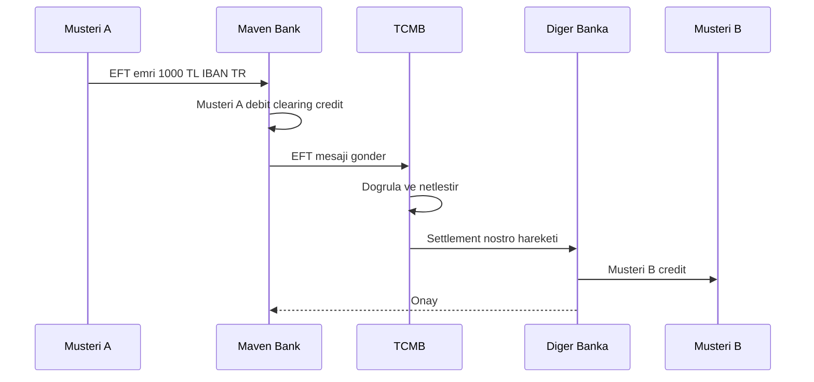
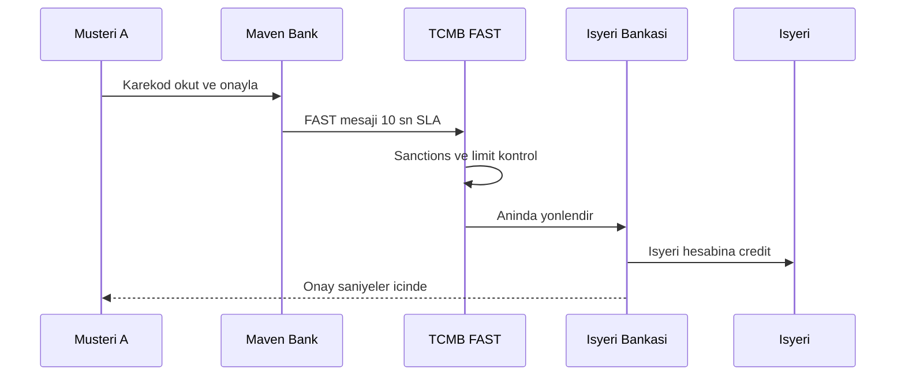
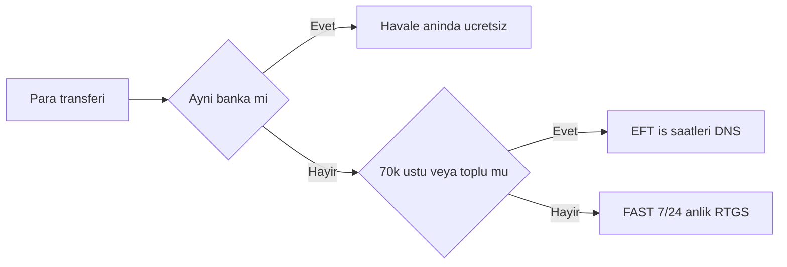
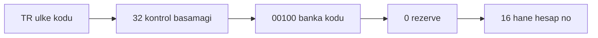

# Topic 10.4 — TR Payment Systems: EFT, FAST, BKM, Troy, TCMB

```admonish info title="Bu bölümde"
- Bir müşterinin parası başka bankaya nasıl gider: Havale, EFT ve FAST üçlüsünü working hours, tutar limiti, ücret ve settlement modeliyle ayırt etmek
- FAST'ın neden 7/24 çalışabildiği, EFT'nin neden iş saatlerine bağlı olduğu — DNS net settlement vs RTGS gross settlement farkı
- TR IBAN'ı MOD-97 ile doğrulama, banka kodu çıkarma ve FAST Karekod TLV formatı
- TR finansal ekosistemin rol matrisi: TCMB, BKM, KKB, Troy, BDDK, MASAK kim ne yapar
- Banking ops'un görünmez omurgası: iş günü takvimi, KYC/MERNIS, sanctions screening ve STR — TR mülakatlarının en sık domain sorusu
```

## Hedef

TR finansal ekosistem altyapısını **domain mühendisi gözüyle** öğrenmek: Havale (aynı banka içi), EFT (TCMB üzerinden bankalar arası batch), FAST (anlık 7/24), BKM (kart switch), Troy (yerli kart şeması) ve TCMB'nin rolü. Settlement window'ları, working hours ve bayram takvimi, ücret yapıları, IBAN formatı, FAST Karekod, KYC/MERNIS, MASAK sanctions/STR ve BDDK Open Banking konularını mülakatta hatasız anlatabilmek.

## Süre

Okuma: 2-2.5 saat • Kendini Sına: 45 dk • Pratik (opsiyonel): 3-4 saat • Toplam: ~3 saat (+ pratik)

## Önbilgi

- Topic 10.1-10.3 bitti — double-entry ledger, journal entry, nostro/clearing hesapları biliyorsun
- TR bankacılık temel kullanıcı tecrübesi: mobil uygulamadan havale/EFT gönderdin
- TCMB'nin merkez bankası olduğunu duydun ama "para hangi kurumdan geçiyor" diye düşünmedin

---

## Kavramlar

### 1. TR finansal ekosistem — kim ne yapar

Başka bankaya para gönderdiğinde parayı taşıyan tek bir sistem değil, birbirine bağlı bir kurum ağıdır; önce bu haritayı görmeden EFT/FAST'ı anlamak zor.

En tepede müşteriler ve kurumsallar var; altında bankalar ve PSP'ler (Garanti, Akbank, İş Bankası, YKB + Papara, İninal gibi); en altta ise switch/settlement kurumları. Her transfer türü bu switch'lerden birinden geçer.

| Kurum | Açılım | Rol |
|---|---|---|
| **TCMB** | Türkiye Cumhuriyet Merkez Bankası | EFT/FAST routing + settlement |
| **BKM** | Bankalararası Kart Merkezi | Kart switch, Troy şeması |
| **KKB** | Kredi Kayıt Bürosu | Findeks skoru, kredi geçmişi |
| **BDDK** | Bankacılık Düzenleme ve Denetleme Kurumu | Regülatör, lisans |
| **MASAK** | Mali Suçları Araştırma Kurulu | AML, sanctions |
| **TBB** | Türkiye Bankalar Birliği | Meslek odası |
| **SPK** | Sermaye Piyasası Kurulu | Sermaye piyasaları |

Bir transferin "hangi switch'ten geçtiği" onun karakterini belirler: aynı bankaysa hiçbir switch'e uğramaz, farklı bankaysa TCMB'ye gider, kart işlemiyse BKM'ye. Şimdi bu üç yolu tek tek açalım.

### 2. Havale — aynı banka içi transfer

Havale, ekosistemin en basit yolu: para hiç bankadan çıkmaz, o yüzden bir switch'e de ihtiyaç yoktur. **Havale**, aynı banka içindeki iki hesap arasındaki transferdir — clearing gerekmez, sadece internal book transfer yapılır.

Örnek: Maven Bank'taki Müşteri A, yine Maven Bank'taki Müşteri B'ye 1000 TL yolluyor. Banka içeride Müşteri A'yı debit, Müşteri B'yi credit eder ve tek bir internal journal entry atar (Topic 10.1).

Sonuç T+0, yani anlık; banka içi operasyon olduğu için **7/24 açıktır** ve genelde **ücretsizdir**. Dış dünyaya hiç mesaj gitmediği için working hours veya settlement window kavramı Havale'de yoktur.

### 3. EFT — Elektronik Fon Transferi (TCMB)

Para başka bankaya gidince artık iki bankanın hesaplarını uzlaştıran bir aracı gerekir; işte **EFT**, TCMB switch'i üzerinden yapılan bankalar arası, batch temelli transferdir. İki sınıfı vardır: **EFT-1** düşük tutar (limitsiz), **EFT-2** yüksek tutarlı kritik settlement (bankalar arası büyük hareketler).

EFT'nin karakterini belirleyen şey settlement modelidir: **DNS (Deferred Net Settlement)** — işlemler batch'lenir, multilateral netting ile toplulaştırılır ve window açıksa T+0 aynı gün sonuçlanır. Cut-off'tan sonra gönderilen işlem sıradaki iş gününe kayar.

EFT'nin **working hours**'a bağlı olmasının sebebi bu batch/netting modelidir:

- Pazartesi-Cuma: 08:30 - 17:30
- Cumartesi: 08:30 - 12:00 (kısıtlı)
- Pazar / resmi tatil: KAPALI
- Yılbaşı, bayram tatilleri: bank holiday calendar'a göre kapalı

Ücret yapısı iki katmanlıdır: TCMB bankalara küçük bir ücret keser (~0.10 TL), bankalar müşteriye yansıtır (~5-15 TL retail; kurumsal pakette çoğu zaman ücretsiz). Mesaj formatı legacy'de TCMB proprietary'ydi, yeni sistemde **ISO 20022 pacs.008**'e geçiş sürüyor.

Banka A → TCMB → Banka B akışını sequence olarak gör: gönderen banka debit + clearing yapar, TCMB netleştirir ve nostro hesapları üzerinden settle eder, alıcı banka müşteriyi credit eder.



Uçtan uca tipik olarak 30 dakikadan kısa sürer.

```admonish warning title="EFT cutoff tuzağı"
EFT window'a bağlıdır: Cuma 17:35'te gönderilen EFT o gün gitmez, sıradaki iş gününe kayar. Uygulama katmanında saat kontrolü yapmazsan müşteri "param neden gitmedi?" diye çağrı merkezini arar. Cut-off yaklaşırken UI'da uyarı göster veya FAST'a yönlendir.
```

### 4. FAST — Fonların Anlık Transferi

Peki müşteri Cuma gecesi ya da bayramda anlık para göndermek isterse? İşte **FAST**, TCMB'nin Ocak 2021'de devreye aldığı, UK Faster Payments / EU SCT Inst'in TR karşılığı olan anlık ödeme sistemidir.

Temel özellikleri EFT'den keskin biçimde ayrılır:

- **Anlık:** 10 saniye SLA, işlemlerin %99'u 30 sn altında
- **7/24/365:** pazar, gece, resmi tatil — hepsinde açık
- **İşlem başı limit:** 70.000 TL (2024)
- **Karekod:** QR kod ile başlatma
- **ISO 20022** pacs.008 tabanlı

<mark>FAST'ın 7/24 çalışabilmesinin sebebi settlement modelidir: EFT'nin DNS batch/netting'inin aksine FAST RTGS-benzeri gross real-time settlement yapar</mark> — her işlem tek tek, anında, brüt olarak sonuçlanır; batch penceresi beklemez, o yüzden takvimden bağımsızdır.

**FAST Karekod**, ödeme niyetini taşıyan bir QR koddur. **Static** (işyerinde sabit) veya **dynamic** (her ödeme için üretilen) olabilir. Karekod içeriği TLV-encoded'dır: alıcı IBAN, alıcı adı, tutar (opsiyonel, dynamic), referans ve expiry timestamp taşır.

Kullanıcı Karekod'u tarar, uygulama parse eder, onay ekranı gösterir ve kullanıcı "Öde" der. Aşağıdaki akış 10 saniye içinde tamamlanır:



Kullanım alanları: bireysel anlık transfer, e-ticaret ödemesi (Karekod), P2P (mobile-to-mobile) ve fatura ödeme. Banka ücreti 0-3 TL retail, çoğu zaman **ücretsiz** — regülatör adoption için ücretsizliği teşvik ediyor.

```admonish tip title="Havale, EFT, FAST'ı ne zaman seç"
Aynı bankaysa Havale (anlık, ücretsiz). Farklı banka + 70k altı + anlık isteniyorsa FAST. Farklı banka + yüksek tutar (70k üstü) veya kurumsal toplu ödemeyse EFT. FAST 24/7 olduğu için takvim etkilemez; EFT'de working hours ve cutoff kritiktir.
```

Üçünü bir arada karar ağacı olarak düşün:



```admonish warning title="FAST limit tuzağı"
70.000 TL üstü bir tutar FAST'a gönderilirse reddedilir. UI'da tutarı önceden kontrol et ve limit aşıldığında müşteriye EFT öner — aksi halde işlem son anda patlar ve kötü bir UX doğar.
```

### 5. IBAN — TR formatı ve doğrulama

Yanlış IBAN'a gönderilen EFT/FAST reddedilir ve refund SLA'sı doğar; o yüzden IBAN'ı **göndermeden önce** doğrulamak banking'in temel higienidir. TR IBAN **26 karakterdir** ve sabit bir yapıya sahiptir.



`TR320010009999987654321098` örneğini açalım: `TR` ülke kodu, `32` MOD-97 kontrol basamağı, `00100` 5 haneli banka kodu, `0` rezerve (hep 0), kalan 16 hane hesap numarası.

Doğrulamanın kalbi **MOD-97 algoritmasıdır**. Önce ilk 4 karakteri sona taşı ve temel format kontrolünü yap:

```java
public static boolean isValid(String iban) {
    iban = iban.replaceAll("\\s", "").toUpperCase();
    if (iban.length() != 26 || !iban.startsWith("TR")) return false;
    // İlk 4 karakteri sona taşı
    String rearranged = iban.substring(4) + iban.substring(0, 4);
    // ... harfleri sayıya çevir, mod 97 al
}
```

Sonra her harfi sayıya çevir (A=10, B=11, ..., R=27) ve elde edilen dev sayının 97'ye bölümünden kalan 1 ise IBAN geçerlidir:

```java
    StringBuilder numeric = new StringBuilder();
    for (char c : rearranged.toCharArray()) {
        if (Character.isLetter(c)) numeric.append(c - 'A' + 10);
        else numeric.append(c);
    }
    BigInteger ibanNumber = new BigInteger(numeric.toString());
    return ibanNumber.mod(BigInteger.valueOf(97)).equals(BigInteger.ONE);
```

Banka kodunu ve hesap numarasını substring ile çıkarabilirsin; banka kodu 5 haneli koddur, hesap numarası 10. karakterden sonrasıdır.

<details>
<summary>Tam kod: TurkishIbanValidator (~34 satır)</summary>

```java
public class TurkishIbanValidator {
    
    public static boolean isValid(String iban) {
        iban = iban.replaceAll("\\s", "").toUpperCase();
        
        if (iban.length() != 26 || !iban.startsWith("TR")) return false;
        
        // Move first 4 chars to end
        String rearranged = iban.substring(4) + iban.substring(0, 4);
        
        // Replace letters with numbers (A=10, B=11, ..., T=29, R=27)
        StringBuilder numeric = new StringBuilder();
        for (char c : rearranged.toCharArray()) {
            if (Character.isLetter(c)) {
                numeric.append(c - 'A' + 10);
            } else {
                numeric.append(c);
            }
        }
        
        // Mod 97 (big number)
        BigInteger ibanNumber = new BigInteger(numeric.toString());
        return ibanNumber.mod(BigInteger.valueOf(97)).equals(BigInteger.ONE);
    }
    
    public static String extractBankCode(String iban) {
        return iban.substring(4, 9);
    }
    
    public static String extractAccountNumber(String iban) {
        return iban.substring(10);
    }
}
```

</details>

Banka kodları TCMB/TBB tarafından atanır; sık görülen bir alt küme:

| Kod | Banka | Kod | Banka |
|---|---|---|---|
| `00010` | Türkiye İş Bankası | `00067` | Yapı Kredi |
| `00012` | TC Ziraat Bankası | `00111` | QNB Finansbank |
| `00046` | Akbank | `00134` | Denizbank |
| `00062` | Türkiye Garanti Bankası | `00203` | Albaraka Türk |
| `00064` | Türkiye İş Bankası (tarihsel) | `00205` | Kuveyt Türk |
| `00206` | Türkiye Finans | `00800` | Papara (PSP) |
| `00802` | İninal | | (Tam liste: TCMB / TBB) |

<mark>IBAN'ı göndermeden önce MOD-97 ile doğrula ve banka kodunu lookup et</mark> — bu tek adım, yanlış hesaba giden transferin doğurduğu refund SLA'sını ve müşteri şikayetini baştan keser.

### 6. BKM — Bankalararası Kart Merkezi

Para transferi TCMB'den geçiyorsa, kart işlemleri (POS/ATM) hangi switch'ten geçer? Cevap **BKM** — TR'nin yerli kart switch'idir. Bankalar arası POS/ATM işlemlerini yönlendirir, Troy kart şemasını işletir, issuer/acquirer standardizasyonunu sağlar ve aylık istatistik raporları yayımlar.

Banking entegrasyonu açısından: acquirer'lar BKM switch'ine bağlanır, iletişim **ISO 8583** mesajlarıyla leased line/VPN üzerinden yapılır, settlement **T+1**'dir (debit Maven, credit diğer banka) ve günlük settlement dosyasıyla NDC reconciliation koşulur.

**BKM Express** eski bir mobil cüzdandı; bugün büyük ölçüde FAST Karekod tarafından ikame edildi.

### 7. Troy — Türkiye'nin Ödeme Yöntemi

Troy, Visa/Mastercard'a yerli bir alternatif olarak **2016'da BKM tarafından** çıkarılan TR yerli kart markasıdır. Çoğu TR ATM ve POS terminalinde geçer, uluslararası kabulü sınırlıdır (bazı partnerler).

Teknik olarak EMV chip standardına uyar, contactless NFC destekler ve kabul altyapısı Visa/MC ile uyumludur. Bankalar için stratejik değeri üç başlıkta: TR domestic işlemlerde Visa/MC ücretlerinden kurtularak maliyet düşürme, regülasyonla hizalı egemenlik ve TR jurisdiction'ında data residency.

### 8. KKB — Kredi Kayıt Bürosu

Bir müşteriye kredi verirken riskini bilmen gerekir; **KKB**, TR'nin kredi bürosudur ve bunu **Findeks Skor** (FICO'nun TR karşılığı) ile sağlar. Kredi geçmişi sorgulama, risk raporlama ve KYC doğrulama desteği verir.

Banking entegrasyonunda kredi başvurusu → KKB sorgusu → skor dönüşü akışı real-time API ile çalışır; her sorgunun bir maliyeti vardır (bu yüzden cache kritik, ileride göreceğiz).

```java
@Service
public class KkbService {
    
    private final WebClient kkbClient;
    
    public CreditScoreResponse getScore(CreditScoreRequest req) {
        return kkbClient.post()
            .uri("/api/v1/findeks-score")
            .header("Authorization", "Bearer " + bankAuthToken)
            .bodyValue(req)
            .retrieve()
            .bodyToMono(CreditScoreResponse.class)
            .block();
    }
}

public record CreditScoreRequest(String tcKimlik, String fullName) {}

public record CreditScoreResponse(
    int score,           // 0-1900
    String category,     // VERY_LOW, LOW, MEDIUM, HIGH, VERY_HIGH
    List<CreditEvent> recentEvents
) {}
```

### 9. TCMB — Türkiye Cumhuriyet Merkez Bankası

EFT ve FAST'ın "settle" olduğu yer TCMB'dir; o yüzden merkez bankasının rolünü ayrı görmek gerekir. **TCMB** para politikası, para basımı, banka rezerv yönetimi, faiz kararı ve FX müdahalesinin yanında **EFT ve FAST operasyonlarını** yürütür.

Banking entegrasyonu açısından kritik nokta: her banka TCMB'de bir rezerv hesabı tutar ve EFT/FAST bu rezervler üzerinden settle olur. Bankalar TCMB'ye düzenli (haftalık, aylık) raporlama yapar; TCMB rezerv gereksinimi ve FX limitleri gibi makroihtiyati tedbirler uygular.

### 10. BDDK — Bankacılık Düzenleme ve Denetleme Kurumu

Bankaların "oyun kurallarını" koyan ve denetleyen kurum **BDDK**'dır. Banka lisansı ve M&A, sermaye yeterlilik oranı (CAR), risk yönetim standartları, IT regülasyonları (5411 sayılı kanun) ve Open Banking çerçevesi (2020 tebliği) yetkisindedir.

IT tarafındaki gereksinimler backend mühendisini doğrudan ilgilendirir: outsourcing bildirimi, datacenter'ın coğrafi olarak TR'de olması, disaster recovery (RTO/RPO), yıllık IT audit, yıllık penetration test ve ciddi kesintilerin incident olarak raporlanması.

**Open Banking (Açık Bankacılık)** BDDK 2020 tebliğiyle geldi; PSD2 benzeri, müşteri onayına (consent) dayalı veri paylaşımı öngörür. API standardizasyonunu BKM koordine eder ve üçüncü tarafların (TPP — Third-Party Provider) lisans alması gerekir.

### 11. MASAK — Mali Suçları Araştırma Kurulu

Her transferin arkasında görünmez bir kontrol vardır: kara para ve terör finansmanı taraması. **MASAK**, TR'nin AML (Anti-Money Laundering) regülatörüdür ve üç ana raporlama yükümlülüğü getirir: **STR** (Suspicious Transaction Report — şüpheli işlem bildirimi), **CTR** (Currency Transaction Report — yüksek tutarlı nakit) ve günlük güncellenen listelerle **sanctions screening**.

Banking pratiğinde sanctions database (OFAC, EU, MASAK national) tutulur, her işlemde real-time screening yapılır, müşteri onboarding'de KYC + sürekli izleme koşulur. Liste her gün güncellenir:

```java
@Service
public class MasakService {
    
    private final SanctionsListClient sanctionsClient;
    
    public ScreeningResult screen(ScreeningRequest req) {
        boolean nameMatch = sanctionsClient.searchByName(req.name());
        boolean tcKimlikMatch = sanctionsClient.searchById(req.tcKimlik());
        boolean addressMatch = sanctionsClient.searchByAddress(req.address());
        
        return new ScreeningResult(
            nameMatch || tcKimlikMatch || addressMatch,
            ...
        );
    }
    
    @Scheduled(cron = "0 0 6 * * *")   // Daily 06:00
    public void refreshSanctionsList() {
        sanctionsClient.downloadLatest();
        sanctionsRepo.replaceAll(sanctionsClient.parse());
    }
}
```

Şüpheli işlem tespit edildiğinde STR asenkron olarak MASAK'a gönderilir ve audit'e yazılır:

```java
@Async
public void submitStr(SuspiciousTransaction tx) {
    StrReport report = StrReport.builder()
        .customerId(tx.customerId())
        .tcKimlik(tx.tcKimlik())
        .transactionDetails(tx.details())
        .suspicionReason(tx.reason())
        .reportingPersonId(tx.reporterId())
        .build();
    
    masakApi.submit(report);
    auditRepo.save(StrAudit.from(report));
}
```

MASAK'a raporlamama cezaları banka için **çok yüksektir** — bu yüzden screening ve STR akışı audit + automation ile güvence altına alınır.

### 12. Müşteri onboarding — KYC (TR)

Bir müşteriyi kabul ederken kim olduğunu ve riskini kanıtlaman gerekir; TR'de KYC şu adımlardan geçer: kimlik (TC Kimlik No, e-Devlet), adres (beyan + ikametgah), gelir kaynağı, PEP screening (Politically Exposed Person), sanctions screening (MASAK) ve risk skoru (KKB + banka içi).

Kimlik doğrulamanın omurgası **MERNİS** entegrasyonudur: TC Kimlik, ad, soyad ve doğum yılı MERNİS'e sorulur.

```java
public boolean verifyIdentity(String tcKimlik, String name, String surname, int birthYear) {
    return mernisClient.verify(MernisRequest.builder()
        .tcKimlik(tcKimlik)
        .ad(name)
        .soyad(surname)
        .dogumYili(birthYear)
        .build()).isValid();
}
```

KYC seviyeleri riskle orantılıdır: **Basic** (düşük tutar < 5000 TL/ay, uzaktan açılış), **Standard** (normal limit) ve **Enhanced** (yüksek risk, corporate/PEP — şube ziyareti + belge incelemesi).

### 13. TR iş günü takvimi

Banking ops'ta "T+2 iş günü" hesabı EFT settlement, valör, kredi vadesi gibi her yerde karşına çıkar; o yüzden iş günü hesabı kritiktir. Pazar her zaman tatildir, cumartesi kısmi çalışabilir ve resmi tatiller (bayramlar dahil) takvimden çıkarılır:

```java
public boolean isBusinessDay(LocalDate date) {
    DayOfWeek dow = date.getDayOfWeek();
    if (dow == DayOfWeek.SUNDAY) return false;
    if (dow == DayOfWeek.SATURDAY) return isSaturdayActive(date);
    return !holidays.contains(date);
}

public LocalDate nextBusinessDay(LocalDate date) {
    LocalDate next = date.plusDays(1);
    while (!isBusinessDay(next)) next = next.plusDays(1);
    return next;
}
```

Tatil kümesi Ramazan ve Kurban bayramlarını da içerir — sadece Hristiyan/Gregoryen takvimi yeterli değildir. `addBusinessDays` ile T+N hesaplanır:

<details>
<summary>Tam kod: TrBusinessCalendar (~48 satır)</summary>

```java
@Service
public class TrBusinessCalendar {
    
    private final Set<LocalDate> holidays;
    
    @PostConstruct
    public void init() {
        holidays = Set.of(
            LocalDate.of(2024, 1, 1),     // Yılbaşı
            LocalDate.of(2024, 4, 10),    // Ramazan Bayramı 1. gün
            LocalDate.of(2024, 4, 11),    // Ramazan Bayramı 2. gün
            LocalDate.of(2024, 4, 12),    // Ramazan Bayramı 3. gün
            LocalDate.of(2024, 4, 23),    // Ulusal Egemenlik ve Çocuk Bayramı
            LocalDate.of(2024, 5, 1),     // Emek ve Dayanışma Günü
            LocalDate.of(2024, 5, 19),    // Atatürk'ü Anma, Gençlik ve Spor Bayramı
            LocalDate.of(2024, 6, 17),    // Kurban Bayramı 1. gün
            LocalDate.of(2024, 6, 18),    // Kurban Bayramı 2. gün
            LocalDate.of(2024, 6, 19),    // Kurban Bayramı 3. gün
            LocalDate.of(2024, 6, 20),    // Kurban Bayramı 4. gün
            LocalDate.of(2024, 7, 15),    // Demokrasi ve Milli Birlik Günü
            LocalDate.of(2024, 8, 30),    // Zafer Bayramı
            LocalDate.of(2024, 10, 29)    // Cumhuriyet Bayramı
        );
    }
    
    public boolean isBusinessDay(LocalDate date) {
        DayOfWeek dow = date.getDayOfWeek();
        if (dow == DayOfWeek.SUNDAY) return false;
        if (dow == DayOfWeek.SATURDAY) return isSaturdayActive(date);
        return !holidays.contains(date);
    }
    
    public LocalDate nextBusinessDay(LocalDate date) {
        LocalDate next = date.plusDays(1);
        while (!isBusinessDay(next)) next = next.plusDays(1);
        return next;
    }
    
    public LocalDate addBusinessDays(LocalDate date, int days) {
        LocalDate result = date;
        for (int i = 0; i < days; i++) {
            result = nextBusinessDay(result);
        }
        return result;
    }
}
```

</details>

Bağlamı hatırla: EFT cutoff 17:30 + cumartesi öğlen; cutoff sonrası → sıradaki iş günü. FAST ise 24/7 olduğu için bu takvimden etkilenmez.

```admonish tip title="Takvimi dinamik tut"
Holiday listesini geçmiş yıl için hardcode edip yıl dönümünde güncellemeyi unutmak klasik bir hatadır — yanlış iş günü hesabına yol açar. Resmi Gazete kaynaklı dinamik güncelleme kur; yarım gün cumartesi ve bayram tatillerini ayrıca modelle.
```

### 14. TR bankacılık anti-pattern'leri

Mülakatta "bu kodda ne yanlış?" sorusunun cephaneliği burasıdır; on klasik tuzak:

**1 — IBAN validation app-level yok:** Yanlış IBAN → EFT fail + refund SLA. Göndermeden önce validate et.

**2 — Working hours kontrolü yok:** EFT 17:35'te gönderilince "neden gitmiyor?" çağrısı doğar. UI'da saat kontrolü koy.

**3 — Holiday calendar hardcoded geçmiş yıl:** Yıl dönümünde güncelleme unutulur → yanlış iş günü. Resmi Gazete kaynaklı dinamik update.

**4 — MASAK screening sync block:** Onboarding 30 saniye bekletir. Async + sonradan doğrulama.

**5 — KKB query her login'de:** Maliyet + rate limit. Cache (TTL günler).

**6 — FAST limit ignore:** 70k üstü FAST reddedilir. UI'da önceden validate et, EFT öner.

**7 — BKM kart işleminde sync ledger update:** POS terminal timeout. Async ledger + reconcile.

**8 — Bank holiday sadece Hristiyan takvimi:** Kurban/Ramazan bayramı resmi tatildir. TR takvimi zorunlu.

**9 — TC Kimlik MERNIS doğrulaması yok:** Sahte kimlikle onboarding. MERNIS şart.

**10 — Open Banking BDDK uyumsuz custom API:** Üçüncü taraf entegrasyonları standart BDDK API'lerini kullanmalı; custom = uyumsuz.

---

## Önemli olabilecek araştırma kaynakları

- TCMB web (tcmb.gov.tr) — EFT/FAST dokümantasyonu
- BKM web (bkm.com.tr) — kart switch + istatistik
- KKB API dokümantasyonu — Findeks
- BDDK web (bddk.org.tr) — bankacılık mevzuatı, Open Banking tebliği
- MASAK web (masak.hmb.gov.tr) — AML rehberi
- TBB — Türkiye Bankalar Birliği
- 5411 sayılı Bankacılık Kanunu
- 6493 sayılı Ödeme Hizmetleri Kanunu

---

## Kendini Sına

Aşağıdaki soruları önce **cevaba bakmadan** kendi cümlelerinle yanıtlamayı dene — hepsi TR bank mülakatlarında bu tarzda karşına çıkar. Takıldığında ilgili Kavramlar başlığına dön, sonra tekrar dene.

**S1. Havale, EFT ve FAST arasındaki farkı working hours, tutar limiti, ücret ve settlement modeli açısından anlat.**

<details>
<summary>Cevabı göster</summary>

Havale aynı banka içi transferdir: switch'e uğramaz, internal book transfer + tek journal entry ile T+0 anlık, 7/24, genelde ücretsiz. EFT bankalar arası, TCMB üzerinden batch/DNS (deferred net settlement) çalışır; working hours'a bağlıdır (Hafta içi 08:30-17:30, cumartesi öğlene kadar, pazar/tatil kapalı), retail'de ~5-15 TL ücret, uçtan uca <30 dk. FAST da bankalar arasıdır ama RTGS-benzeri gross real-time settlement yapar; 7/24/365 anlık (10 sn SLA), 70k TL işlem limiti, çoğu zaman ücretsiz.

Özetle: aynı banka → Havale; farklı banka + anlık + 70k altı → FAST; farklı banka + yüksek tutar veya kurumsal toplu → EFT.

</details>

**S2. FAST neden 7/24/365 çalışabiliyor da EFT iş saatlerine bağlı? Sebebini settlement modeliyle açıkla.**

<details>
<summary>Cevabı göster</summary>

Fark settlement modelinden gelir. EFT DNS (Deferred Net Settlement) kullanır: işlemler batch'lenir, multilateral netting ile toplulaştırılır ve belirli window'larda TCMB rezervleri üzerinden settle edilir. Bu batch/netting döngüsü working hours ve cutoff gerektirir; cutoff sonrası işlem sıradaki iş gününe kayar.

FAST ise RTGS-benzeri gross real-time settlement yapar: her işlem tek tek, anında, brüt olarak sonuçlanır — batch penceresi beklemez. Batch olmadığı için takvime bağlı değildir, o yüzden gece, pazar ve bayramda da açık kalabilir.

</details>

**S3. EFT ile FAST'tan hangisi RTGS mantığında, hangisi net settlement? İkisinin banking'e etkisi ne?**

<details>
<summary>Cevabı göster</summary>

FAST RTGS-benzeri gross real-time settlement mantığındadır: her işlem anında, brüt, bağımsız settle olur. EFT ise DNS — deferred net settlement: işlemler netleştirilip window'da toplu settle olur (EFT-2 yüksek tutarlı kritik settlement sınıfıdır).

Banking'e etkisi: FAST anlık likidite hareketi ve 7/24 erişim sağlar ama işlem başı 70k limitiyle gelir. EFT batch'lediği için likiditeyi window'larda yönetir, yüksek/toplu tutarlar için uygundur ama cutoff'a takılır. Kod tarafında FAST clearing gerçek zamanlı, EFT clearing hesabı window kapanışında mutabakatla kapanır.

</details>

**S4. Elinde bir TR IBAN var. Onu nasıl doğrularsın ve banka kodunu nasıl çıkarırsın?**

<details>
<summary>Cevabı göster</summary>

Önce format: TR IBAN 26 karakterdir ve `TR` ile başlar; bu iki kontrol geçmezse geçersizdir. Sonra MOD-97: ilk 4 karakteri (TR + kontrol) sona taşı, her harfi sayıya çevir (A=10 ... R=27), oluşan dev sayıyı `BigInteger` ile tut ve 97'ye böl — kalan 1 ise IBAN geçerlidir.

Banka kodu 5-6. pozisyonlardaki 5 haneli koddur (substring ile çıkarılır) ve bir lookup tablosuyla banka adına çevrilir (00010 = İş Bankası, 00046 = Akbank ...). Kritik pratik: IBAN'ı transferi göndermeden önce doğrula ki yanlış hesaba giden işlemin refund SLA'sını baştan önle.

</details>

**S5. FAST Karekod nedir? Static ve dynamic QR farkı ile TLV içeriğini açıkla.**

<details>
<summary>Cevabı göster</summary>

FAST Karekod, ödeme niyetini taşıyan bir QR koddur; kullanıcı tarar, uygulama parse eder, onaylar ve FAST üzerinden 10 saniyede transfer gider. İçeriği TLV-encoded'dır (tag-length-value): alıcı IBAN, alıcı adı, tutar (opsiyonel), referans ve expiry timestamp taşır.

Static Karekod işyerinde sabittir — tutar taşımaz, müşteri tutarı kendi girer (örneğin masaya yapıştırılan kod). Dynamic Karekod her ödeme için üretilir ve tutarı içinde taşır (örneğin kasa ekranındaki tek seferlik kod). Parser her iki tipi de desteklemeli ve expiry'yi kontrol etmelidir.

</details>

**S6. TCMB, BKM, KKB, BDDK ve MASAK'ın rollerini birer cümleyle ayır.**

<details>
<summary>Cevabı göster</summary>

TCMB merkez bankasıdır; para politikası yanında EFT ve FAST operasyonlarını yürütür, bankalar rezervlerini TCMB'de tutar ve transferler bu rezervler üzerinden settle olur. BKM yerli kart switch'idir: POS/ATM inter-bank routing, Troy şeması, ISO 8583, T+1 kart settlement. KKB kredi bürosudur; Findeks skoru ve kredi geçmişi verir.

BDDK regülatördür: banka lisansı, sermaye yeterliliği (CAR), IT regülasyonları (5411, DR, audit, pentest) ve Open Banking çerçevesi. MASAK AML regülatörüdür: sanctions screening, STR (şüpheli işlem) ve CTR (yüksek nakit) raporlaması.

</details>

**S7. Müşteri cumartesi 18:00'de başka bankaya 5000 TL göndermek istiyor. Hangi sistemi önerirsin, neden? Ya 90.000 TL olsaydı?**

<details>
<summary>Cevabı göster</summary>

Cumartesi 18:00 EFT window'unun dışıdır (cumartesi sadece öğlene kadar, sonrası kapalı). 5000 TL, FAST'ın 70k limitinin altında olduğu için doğru öneri FAST'tır: 7/24 açık, anlık ve genelde ücretsiz — işlem hemen gider.

90.000 TL olsaydı FAST'ın işlem başı 70k limitini aşardı ve reddedilirdi. Bu durumda EFT gerekir ama EFT o an kapalı olduğu için işlem sıradaki iş gününe (pazartesi) kayar; müşteriye bunu UI'da bildirmek veya tutarı bölmesini önermek gerekir. İyi bir uygulama bu kararı otomatik router ile verir.

</details>

---

## Tamamlama kriterleri

- [ ] Havale, EFT ve FAST farkını (working hours, tutar, ücret, settlement modeli) tabloda anlatabiliyorum
- [ ] FAST'ın neden 7/24 çalıştığını RTGS gross vs DNS net settlement üzerinden açıklayabiliyorum
- [ ] TR IBAN'ı MOD-97 + 26 karakter kuralıyla doğrulayıp banka kodunu çıkarabiliyorum
- [ ] FAST Karekod TLV formatını ve static/dynamic farkını biliyorum
- [ ] TCMB, BKM, KKB, BDDK, MASAK rol matrisini söyleyebiliyorum
- [ ] MASAK STR/CTR + sanctions screening + daily refresh pratiğini açıklayabiliyorum
- [ ] TR iş günü takvimi + EFT cutoff + bayram tatili mantığını ve anti-pattern'lerini biliyorum
- [ ] (Opsiyonel) "Pratik yapmak istersen" bölümündeki IBAN validator, business calendar ve router'ı yazdım

---

## Defter notları

1. "TR finansal ekosistem (TCMB, BKM, KKB, BDDK, MASAK) rol matrisi: ____."
2. "Havale vs EFT vs FAST trade-off (working hours, tutar, fee, settlement modeli): ____."
3. "FAST neden 7/24 (RTGS gross) EFT neden window'a bağlı (DNS net): ____."
4. "TR IBAN format MOD-97 + 26 char + banka kodu extract: ____."
5. "FAST Karekod TLV format + static/dynamic QR + 10 sn SLA: ____."
6. "BKM kart switch (ISO 8583, T+1) + Troy yerli kart şeması stratejik değer: ____."
7. "TCMB EFT/FAST operation + rezerv üzerinden nostro settlement: ____."
8. "BDDK 5411 + Open Banking 2020 + IT regülasyon (DR, audit, pentest): ____."
9. "MASAK sanctions screening + STR (smurfing) + daily refresh banking pratiği: ____."
10. "TR business calendar (holidays, bayram) + EFT cutoff banking ops kritik: ____."

```admonish success title="Bölüm Özeti"
- Üç transfer yolu: Havale (aynı banka, internal book transfer, 7/24, ücretsiz), EFT (bankalar arası, TCMB, DNS net settlement, working hours'a bağlı), FAST (bankalar arası, RTGS gross, 7/24 anlık, 70k limit)
- FAST'ın 7/24 çalışmasının sebebi gross real-time settlement'tır; EFT batch/netting yaptığı için cutoff ve resmi tatile takılır
- TR IBAN 26 karakter + MOD-97 ile doğrulanır; banka kodu extract + lookup ile isim çözülür — göndermeden önce validate şart
- FAST Karekod TLV-encoded ödeme niyetidir (IBAN, ad, tutar, referans, expiry); static işyerinde sabit, dynamic her ödemede üretilir
- Ekosistemin görünmez omurgası: TCMB (settlement), BKM/Troy (kart), KKB/Findeks (skor), BDDK (regülasyon + Open Banking), MASAK (AML/sanctions/STR)
- Banking ops kritikleri: TR iş günü takvimi (bayram dahil), MERNIS KYC, sanctions daily refresh — ve on klasik anti-pattern (IBAN skip, working hours ignore, FAST limit ignore, MASAK sync block ...)
```

---

## Pratik yapmak istersen

Kavramları koda dökmek istersen aşağıdaki iki ek hazır: test yazma rehberi IBAN validation, holiday takvimi, EFT/FAST routing ve sanctions screening için örnek testler içerir; Claude-verify prompt'u ile yazdığın TR payment systems kodunu banking-grade perspektiften denetletebilirsin. Uygulama fikirleri: TR IBAN validator + banka kodu lookup, TR business calendar service, EFT vs FAST router, FAST Karekod TLV parser, MERNIS/KKB mock ve MASAK sanctions screening.

<details>
<summary>Test yazma rehberi</summary>

> Tamamlama kriteri: aşağıdaki testler yeşil olmalı — IBAN doğrulama (checksum + format), holiday tanıma, T+2 iş günü hesabı, non-business-hours'ta FAST önerisi, 70k üstü EFT önerisi ve sanctioned recipient bloklaması.

```java
@ParameterizedTest
@CsvSource({
    "TR320010009999987654321098, true",
    "TR320010009999987654321099, false",     // wrong checksum
    "TR3200100099998,            false",      // too short
    "DE89370400440532013000,     false"       // not TR
})
void shouldValidateIban(String iban, boolean expected) {
    assertThat(TurkishIbanValidator.isValid(iban)).isEqualTo(expected);
}

@Test
void shouldExtractBankCode() {
    String iban = "TR320010009999987654321098";
    String bankCode = TurkishIbanValidator.extractBankCode(iban);
    
    assertThat(bankCode).isEqualTo("00100");
}

@ParameterizedTest
@CsvSource({
    "2024-01-01, false",   // Yılbaşı
    "2024-01-02, true",    // Salı normal
    "2024-04-23, false",   // Ulusal egemenlik
    "2024-06-15, false",   // Cumartesi (assume off)
    "2024-06-17, false"    // Kurban Bayramı
})
void shouldRecognizeHolidays(LocalDate date, boolean isBusinessDay) {
    assertThat(calendar.isBusinessDay(date)).isEqualTo(isBusinessDay);
}

@Test
void shouldComputeT2BusinessDay() {
    LocalDate friday = LocalDate.of(2024, 5, 10);
    LocalDate t2 = calendar.addBusinessDays(friday, 2);
    
    assertThat(t2).isEqualTo(LocalDate.of(2024, 5, 14));   // Tuesday
}

@Test
void shouldSuggestFastDuringNonBusinessHours() {
    // Friday 18:00, EFT closed
    Clock clock = Clock.fixed(
        ZonedDateTime.of(2024, 5, 10, 18, 0, 0, 0, ZoneId.of("Europe/Istanbul")).toInstant(),
        ZoneId.of("Europe/Istanbul"));
    
    TransferRouter router = new TransferRouter(calendar, clock);
    Route route = router.suggest(amount: new BigDecimal("1000"), iban: validIban);
    
    assertThat(route.system()).isEqualTo("FAST");
}

@Test
void shouldRejectFastAboveLimit() {
    TransferRouter router = new TransferRouter(calendar, clock);
    Route route = router.suggest(amount: new BigDecimal("100000"), iban: validIban);
    
    assertThat(route.system()).isEqualTo("EFT");   // > 70k FAST limit
    assertThat(route.warning()).contains("FAST limit aşıldı");
}

@Test
void shouldBlockSanctionedRecipient() {
    sanctionsList.add(new SanctionedEntity("12345678901", "Sanctioned Person", null));
    
    TransferRequest req = TransferRequest.builder()
        .recipientName("Sanctioned Person")
        .recipientTcKimlik("12345678901")
        .build();
    
    assertThatThrownBy(() -> transferService.initiate(req))
        .isInstanceOf(SanctionsScreeningException.class);
}
```

</details>

<details>
<summary>Claude-verify prompt</summary>

```
TR payment systems implementation'ımı banking-grade kriterlere göre değerlendir:

1. IBAN:
   - MOD-97 validation?
   - TR format (26 char) check?
   - Bank code extract + lookup?
   - Real-time validation (pre-send)?

2. Business calendar:
   - TR holidays (resmi tatil) güncel?
   - isBusinessDay / addBusinessDays utility?
   - EFT cutoff (17:30) check?
   - FAST 24/7 awareness?

3. EFT vs FAST routing:
   - Working hours check?
   - Amount limit (FAST 70k) check?
   - Cost suggestion?
   - User UX (banking app guidance)?

4. FAST Karekod:
   - TLV parser?
   - Static + dynamic QR support?
   - Expiry check?

5. KYC integration:
   - MERNIS TC Kimlik verification?
   - KKB Findeks score?
   - Cache strategy (TTL günler)?
   - PEP screening?

6. MASAK / sanctions:
   - Sanctions list daily refresh?
   - Real-time screening at transfer?
   - STR detection rules (smurfing, large cash)?
   - STR report submit API?

7. BDDK:
   - Open Banking 2020 tebliği uyumlu?
   - IT regulations (DR, audit, pentest)?
   - Outsourcing notification?

8. Ledger integration:
   - EFT clearing account (Topic 10.1)?
   - FAST clearing real-time?
   - BKM card settlement T+1?

9. Bank holiday handling:
   - Resmi tatil dynamic update?
   - Yarım gün cumartesi?
   - Bayram tatilleri?

10. Anti-pattern:
    - IBAN validation skip YOK?
    - Working hours ignore YOK?
    - Hardcoded geçmiş yıl holidays YOK?
    - MASAK sync block YOK?
    - KKB query per request YOK?
    - FAST limit ignore YOK?
    - TC Kimlik MERNIS yok YOK?

Her madde için PASS / FAIL / EKSIK işaretle.
```

</details>
