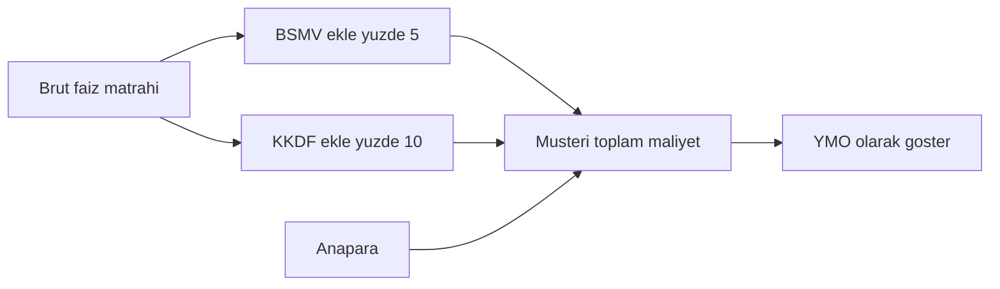
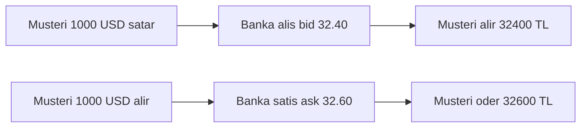
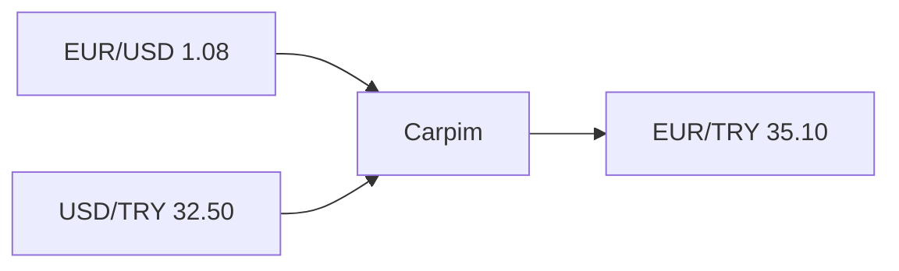
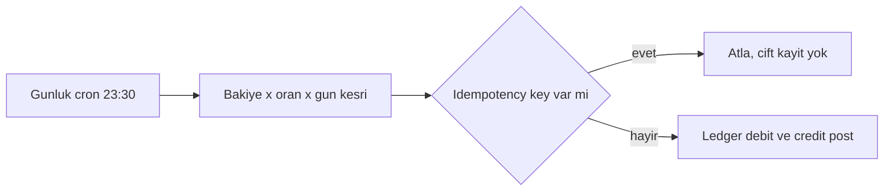

# Topic 10.5 — FX & Interest Calculations

```admonish info title="Bu bölümde"
- Faiz matematiği: simple vs compound, sürekli bileşik ve day count convention'ların (ACT/365, ACT/360, 30/360) aynı orandan neden farklı faiz ürettiği
- French amortization tablosu: eşit taksit formülü, faiz–anapara ayrışması ve son taksit artığının temizlenmesi
- TR bankacılığının vergi katmanı: mevduatta stopaj, kredide BSMV + KKDF ve müşteriye gösterilen YMO
- FX'in bel kemiği: bid/ask spread, cross rate, covered interest parity ile forward ve FX swap
- Günlük faiz tahakkuku: ledger'a idempotent journal, Europe/Istanbul cutoff ve artık yıl tuzakları
```

## Hedef

Banking finance hesaplamalarını "formülü ezberledim"den "neden bu formül, nerede yanlış giderse para kaybederim" seviyesine taşımak. Simple/compound interest, day count convention'lar, Yield to Maturity mantığı, kredi amortization, FX bid/ask + cross rate + forward/swap, TR'ye özgü BSMV/KKDF/stopaj ve double-entry ledger üzerinde günlük faiz tahakkuku — hepsini `BigDecimal` doğruluğunda kodlayabilmek.

## Süre

Okuma: ~2 saat • Kendini Sına: 45 dk • Pratik (opsiyonel): 2.5-3 saat • Toplam: ~2.5 saat (+ pratik)

## Önbilgi

- Topic 10.1 (Double-entry) bitti — journal, debit/credit, ledger post mantığını biliyorsun
- `BigDecimal` ile para tutma, `RoundingMode`, `MathContext` rahat kullanabiliyorsun
- Temel matematik: üs alma, logaritma, oran-orantı

---

## Kavramlar

### 1. Simple interest

Bir müşteri 90 günlük mevduata para koyduğunda ya da bir kredi bir gün açık kaldığında bankanın hesapladığı en temel büyüklük faizdir; her şey buradan başlar.

**Simple interest (basit faiz)** anaparaya, orana ve süreye orantılıdır — bileşiklenme yoktur, kazanılan faiz yeniden faiz getirmez.

```
I = P × r × t

I: interest (faiz)
P: principal (anapara)
r: annual rate (yıllık oran, %5 = 0.05)
t: time (yıl cinsinden süre)
```

**Banking örnek:** 100,000 TL, %5 yıllık, 90 gün (ACT/365):

```
t = 90 / 365 = 0.2466
I = 100,000 × 0.05 × 0.2466 = 1,232.88 TL
```

Java tarafında `int days` ve `int daysInYear`'ı ayrı parametre tutmak, day count convention'ı çağırana bırakır:

```java
public BigDecimal simpleInterest(BigDecimal principal, BigDecimal rate, int days, int daysInYear) {
    return principal
        .multiply(rate)
        .multiply(BigDecimal.valueOf(days))
        .divide(BigDecimal.valueOf(daysInYear), 10, RoundingMode.HALF_EVEN);
}
```

Buradaki tuzak sayı tipinde: <mark>para hesabında asla `double` kullanma; her zaman `BigDecimal` ve `HALF_EVEN` yuvarlama.</mark> `double interest = 100000 * 0.05 * 90 / 365` binlerce müşteride kuruş kaymaları biriktirir ve mutabakatı bozar.

### 2. Compound interest

Faiz kazanan bir mevduat bir sonraki dönemde önceki faizin de üzerinden faiz kazanıyorsa artık basit faiz yetmez; **compound interest (bileşik faiz)** devreye girer.

Formülde `n` yılda kaç kez bileşiklendiğini söyler — aylık için 12, günlük için 365:

```
A = P × (1 + r/n)^(n×t)

A: future value (gelecek değer)
P: principal
r: annual rate
n: yılda bileşiklenme sayısı
t: time (yıl)
```

**Banking örnek:** 100,000 TL, %5 yıllık, 5 yıl, aylık bileşik:

```
n = 12
A = 100,000 × (1 + 0.05/12)^(12×5)
A = 100,000 × (1.00417)^60
A = 128,335.87 TL
```

Java'da kritik nokta `MathContext` ile hassasiyeti explicit vermek; `pow` üs alma tamsayı periyot ister:

```java
public BigDecimal compoundFutureValue(
    BigDecimal principal, BigDecimal annualRate, int compoundPerYear, BigDecimal years) {
    MathContext mc = new MathContext(20, RoundingMode.HALF_EVEN);

    BigDecimal periodicRate = annualRate.divide(BigDecimal.valueOf(compoundPerYear), mc);
    BigDecimal base = BigDecimal.ONE.add(periodicRate);            // (1 + r/n)

    int totalPeriods = years.multiply(BigDecimal.valueOf(compoundPerYear))
        .setScale(0, RoundingMode.HALF_EVEN).intValue();          // n × t

    BigDecimal factor = base.pow(totalPeriods, mc);
    return principal.multiply(factor).setScale(2, RoundingMode.HALF_EVEN);
}
```

**Continuous compounding (sürekli bileşik):** Bileşiklenme sonsuza giderse `A = P × e^(r×t)` olur. Bankacılıkta nadir kullanılır (çoğunlukla teorik ve fixed income türev modellerinde), ama EAR mantığını anlamak için bilmen yeterli.

### 3. Day count conventions

Aynı oran, aynı süre, aynı anapara — ama iki farklı banka iki farklı faiz hesaplayabilir. Sebep **day count convention (gün sayım esası)**: bir dönemin kaç gün olduğunu ve yılın kaç gün sayıldığını belirleyen kural.

<mark>Oranı day count convention belirtmeden uygulama; aynı oran farklı convention'da farklı faiz üretir.</mark>

| Convention | Pay (gün) | Payda (yıl) | Kullanım |
|---|---|---|---|
| **ACT/365** | Gerçek gün | 365 | TR retail krediler |
| **ACT/365F (Fixed)** | Gerçek gün | 365 (artık yılda bile) | Bazı devlet tahvilleri |
| **ACT/360** | Gerçek gün | 360 | TRY para piyasası, USD kısa vade |
| **ACT/ACT** | Gerçek gün | Yılın gerçek günü (365/366) | EUR tahviller, US Treasury |
| **30/360** | Ay = 30 gün varsayımı | 360 | US corporate bond |
| **30E/360 (Eurobond)** | Ay = 30 gün (Avrupa) | 360 | Avrupa tahvilleri |

Farkı somut gör — 100,000 TL, %5, 90 gün:

```
ACT/365: 100,000 × 0.05 × 90/365 = 1,232.88 TL
ACT/360: 100,000 × 0.05 × 90/360 = 1,250.00 TL   ← daha yüksek
```

Payda 360'a inince faiz artar. **Banking pratiği:** TR retail krediler ACT/365, TRY para piyasası ACT/360, USD SOFR (eski LIBOR) ACT/360, EUR tahviller ACT/ACT.

Implementasyonu bir `enum` ile modellemek en temizi; her convention kendi `fraction` metodunu taşır. Önce sabit-payda olan ACT/365 ve ACT/360:

```java
public enum DayCountConvention {

    ACT_365 {
        public BigDecimal fraction(LocalDate from, LocalDate to) {
            long days = ChronoUnit.DAYS.between(from, to);
            return BigDecimal.valueOf(days)
                .divide(BigDecimal.valueOf(365), 10, RoundingMode.HALF_EVEN);
        }
    },
    ACT_360 {
        public BigDecimal fraction(LocalDate from, LocalDate to) {
            long days = ChronoUnit.DAYS.between(from, to);
            return BigDecimal.valueOf(days)
                .divide(BigDecimal.valueOf(360), 10, RoundingMode.HALF_EVEN);
        }
    },
```

30/360 farklıdır: gerçek günü değil, her ayı 30 kabul edip 30/31 uçlarını düzeltir. Ay-sonu kuralı (`d1 == 30 && to == 31 → 30`) klasik ISDA yaklaşımıdır:

```java
    THIRTY_360 {
        public BigDecimal fraction(LocalDate from, LocalDate to) {
            int d1 = Math.min(from.getDayOfMonth(), 30);
            int d2 = (d1 == 30 && to.getDayOfMonth() == 31)
                     ? 30 : Math.min(to.getDayOfMonth(), 30);
            int days = 360 * (to.getYear() - from.getYear())
                     + 30 * (to.getMonthValue() - from.getMonthValue())
                     + (d2 - d1);
            return BigDecimal.valueOf(days)
                .divide(BigDecimal.valueOf(360), 10, RoundingMode.HALF_EVEN);
        }
    };

    public abstract BigDecimal fraction(LocalDate from, LocalDate to);
}
```

ACT/ACT yıl sınırını geçince dönemleri bölmek gerektiği için daha karmaşıktır (ISDA convention); tam listing'de yerini iskelet olarak koruyoruz.

<details>
<summary>Tam kod: DayCountConvention enum (~42 satır)</summary>

```java
public enum DayCountConvention {

    ACT_365 {
        public BigDecimal fraction(LocalDate from, LocalDate to) {
            long days = ChronoUnit.DAYS.between(from, to);
            return BigDecimal.valueOf(days)
                .divide(BigDecimal.valueOf(365), 10, RoundingMode.HALF_EVEN);
        }
    },

    ACT_360 {
        public BigDecimal fraction(LocalDate from, LocalDate to) {
            long days = ChronoUnit.DAYS.between(from, to);
            return BigDecimal.valueOf(days)
                .divide(BigDecimal.valueOf(360), 10, RoundingMode.HALF_EVEN);
        }
    },

    ACT_ACT {
        public BigDecimal fraction(LocalDate from, LocalDate to) {
            // Karmaşık: yıl sınırı geçilirse dönemi böl
            // ... ISDA convention
            throw new UnsupportedOperationException("ISDA ACT/ACT split gerekli");
        }
    },

    THIRTY_360 {
        public BigDecimal fraction(LocalDate from, LocalDate to) {
            int d1 = Math.min(from.getDayOfMonth(), 30);
            int d2 = (d1 == 30 && to.getDayOfMonth() == 31)
                     ? 30 : Math.min(to.getDayOfMonth(), 30);

            int days = 360 * (to.getYear() - from.getYear())
                     + 30 * (to.getMonthValue() - from.getMonthValue())
                     + (d2 - d1);

            return BigDecimal.valueOf(days)
                .divide(BigDecimal.valueOf(360), 10, RoundingMode.HALF_EVEN);
        }
    };

    public abstract BigDecimal fraction(LocalDate from, LocalDate to);
}
```

</details>

```admonish warning title="Artık yıl ve hardcoded 365"
Şubat 29'lu bir yılda `t = days/365` yerine `days/366` gerekebilir (ACT/ACT). ACT/365F ise adı üstünde bilerek sabit 365 kullanır. "365'i her yere gömdüm" bir contract ACT/360 isteyince yanlış faiz demektir — convention'ı üründen türet, kodun içine gömme.
```

### 4. Loan amortization

Müşteri "60 ay eşit taksitle kredi" istediğinde her ay ne kadar ödeyeceğini ve bu taksitin ne kadarının faiz ne kadarının anapara olduğunu bankanın kuruşu kuruşuna bilmesi gerekir; bunu **amortization (itfa)** tablosu verir.

En yaygın yöntem **French amortization (eşit taksit)**: her ay ödenen toplam tutar sabittir, ama içindeki faiz–anapara oranı zamanla değişir.

```
PMT = P × (r / (1 - (1 + r)^(-n)))

P: anapara
r: dönemsel oran (aylık)
n: dönem sayısı
```

**Örnek:** 100,000 TL kredi, %15 yıllık, 60 ay:

```
r = 0.15 / 12 = 0.0125
n = 60
PMT = 100,000 × (0.0125 / (1 - (1.0125)^(-60)))
PMT = 2,378.99 TL (aylık)
```

Tabloda faiz her ay azalan bakiyeden hesaplandığı için başta yüksek, sonra düşük olur; anapara ise tam tersi:

| Ay | Başl. Bakiye | Taksit | Faiz | Anapara | Kalan |
|---|---|---|---|---|---|
| 1 | 100,000.00 | 2,378.99 | 1,250.00 | 1,128.99 | 98,871.01 |
| 2 | 98,871.01 | 2,378.99 | 1,235.89 | 1,143.10 | 97,727.91 |
| ... | | | | | |
| 60 | 2,348.50 | 2,378.99 | 29.36 | 2,349.63 | 0.00 |

Kural basit: `Faiz = Başl.Bakiye × r`, `Anapara = Taksit − Faiz`. Kodda önce PMT'yi hesaplarız:

```java
public List<Installment> generate(BigDecimal principal, BigDecimal annualRate, int months) {
    MathContext mc = new MathContext(20, RoundingMode.HALF_EVEN);
    BigDecimal r = annualRate.divide(BigDecimal.valueOf(12), mc);
    BigDecimal onePlusR = BigDecimal.ONE.add(r);
    BigDecimal denominator = BigDecimal.ONE.subtract(onePlusR.pow(-months, mc));
    BigDecimal pmt = principal.multiply(r).divide(denominator, 2, RoundingMode.HALF_EVEN);
    // ... döngü aşağıda
```

Sonra her ay için faiz/anapara ayrıştırılır; son taksitte yuvarlama artığını temizlemek için bakiyeyi doğrudan kapatırız (yoksa 60. ayda 0.00 yerine 0.03 kalabilir):

```java
    List<Installment> schedule = new ArrayList<>();
    BigDecimal balance = principal;
    for (int i = 1; i <= months; i++) {
        BigDecimal interest = balance.multiply(r).setScale(2, RoundingMode.HALF_EVEN);
        BigDecimal principalPaid = pmt.subtract(interest);
        if (i == months) {                       // son taksit → artığı temizle
            principalPaid = balance;
            pmt = principalPaid.add(interest);
        }
        BigDecimal endBalance = balance.subtract(principalPaid);
        schedule.add(new Installment(i, balance, pmt, interest, principalPaid, endBalance));
        balance = endBalance;
    }
    return schedule;
}
```

<details>
<summary>Tam kod: AmortizationSchedule.generate (~35 satır)</summary>

```java
public class AmortizationSchedule {

    public List<Installment> generate(
        BigDecimal principal,
        BigDecimal annualRate,
        int months
    ) {
        MathContext mc = new MathContext(20, RoundingMode.HALF_EVEN);
        BigDecimal r = annualRate.divide(BigDecimal.valueOf(12), mc);
        BigDecimal onePlusR = BigDecimal.ONE.add(r);
        BigDecimal denominator = BigDecimal.ONE.subtract(onePlusR.pow(-months, mc));
        BigDecimal pmt = principal.multiply(r).divide(denominator, 2, RoundingMode.HALF_EVEN);

        List<Installment> schedule = new ArrayList<>();
        BigDecimal balance = principal;

        for (int i = 1; i <= months; i++) {
            BigDecimal interest = balance.multiply(r).setScale(2, RoundingMode.HALF_EVEN);
            BigDecimal principalPaid = pmt.subtract(interest);

            if (i == months) {
                // Son taksit — artığı temizle
                principalPaid = balance;
                pmt = principalPaid.add(interest);
            }

            BigDecimal endBalance = balance.subtract(principalPaid);

            schedule.add(new Installment(i, balance, pmt, interest, principalPaid, endBalance));
            balance = endBalance;
        }

        return schedule;
    }
}
```

</details>

**Banking varyasyonlar:** eşit anapara (aynı anapara, azalan toplam ödeme), balon (son taksit büyük), faizsiz dönemli (ilk N ay sadece faiz), sabit vs değişken faiz (TR'de TLREF referanslı floating rate).

### 5. BSMV, KKDF ve stopaj — TR banking vergi

TR bankacılığı hesabı, uluslararası formülün üstüne bir vergi katmanı bindirir; bunları atlarsan müşteriye yanlış maliyet gösterir ve regülatör uyumsuzluğuna düşersin. İki taraf farklı çalışır: kredide vergi faizin üstüne eklenir, mevduatta faizden kesilir.

**Kredi tarafı — BSMV + KKDF (faizin üstüne):**

- **BSMV (Banka ve Sigorta Muameleleri Vergisi):** Banka işlemleri vergisi, kredi faiz gelirine %5. Kredi faizi, komisyon, FX kazancı, para piyasası gelirine uygulanır; banka tahsil edip devlete aylık yatırır.
- **KKDF (Kaynak Kullanımı Destekleme Fonu):** Tüketici kredisi faizine %10; konut/bazı taşıt kredilerinde %0; döviz endeksli tüketici kredisinde %15.

Her ikisi de brüt faiz matrahı üzerinden hesaplanır ve birbirinin üstüne binmez:

```
100,000 TL tüketici kredisi, saf faiz 17,250 TL (vade boyunca):
  BSMV = 17,250 × 0.05 = 862.50 TL
  KKDF = 17,250 × 0.10 = 1,725.00 TL
  Müşteriye toplam maliyet = 100,000 + 17,250 + 862.50 + 1,725 = 119,837.50 TL
```

**Mevduat tarafı — stopaj (faizden kesilir):** Müşteriye ödenen mevduat faizinden **stopaj (gelir vergisi tevkifatı)** kesilir. Oran vadeye göre kademelidir (kısa vade yüksek, uzun vade düşük — uzun vadeyi teşvik); güncel oranlar Cumhurbaşkanı kararıyla değişir, koda gömme, parametre tut. Akış: brüt faiz hesaplanır → stopaj kesilir → net faiz müşteriye ödenir.

```admonish tip title="YMO — müşteriye gerçek maliyet"
TBB düzenlemesi gereği müşteriye sadece "aylık %2.5" değil, BSMV + KKDF dahil **yıllık maliyet oranı (YMO)** gösterilmelidir. Beyan edilen oran (BKO) ile efektif maliyet arasındaki farkı saklamak hem güven kaybı hem de şikâyet sebebidir.
```

YMO hesabında her ay faiz + BSMV + KKDF toplanır. Aylık döngü:

```java
BigDecimal totalInterest = ZERO;
BigDecimal balance = principal;
for (int i = 0; i < months; i++) {
    BigDecimal monthlyInterest = balance.multiply(monthlyRate);
    BigDecimal bsmv = monthlyInterest.multiply(bsmvRate);   // 0.05
    BigDecimal kkdf = monthlyInterest.multiply(kkdfRate);   // 0.10 tüketici
    BigDecimal totalMonthly = monthlyInterest.add(bsmv).add(kkdf);
    totalInterest = totalInterest.add(totalMonthly);
    balance = balance.subtract(/* taksitin anapara kısmı */);
}
```

Sonra toplam maliyeti yıllıklandırıp yüzdeye çeviririz:

```java
// YMO = (toplam maliyet / anapara) × (12 / ay sayısı) × 100
return totalInterest
    .divide(principal, 10, RoundingMode.HALF_EVEN)
    .multiply(BigDecimal.valueOf(12))
    .divide(BigDecimal.valueOf(months), 4, RoundingMode.HALF_EVEN)
    .multiply(BigDecimal.valueOf(100));
```

<details>
<summary>Tam kod: calculateEffectiveAnnualCost (~28 satır)</summary>

```java
public BigDecimal calculateEffectiveAnnualCost(
    BigDecimal principal,
    BigDecimal monthlyRate,
    int months,
    BigDecimal bsmvRate,    // 0.05
    BigDecimal kkdfRate     // 0.10 tüketici
) {
    BigDecimal totalInterest = ZERO;
    BigDecimal balance = principal;

    for (int i = 0; i < months; i++) {
        BigDecimal monthlyInterest = balance.multiply(monthlyRate);
        BigDecimal bsmv = monthlyInterest.multiply(bsmvRate);
        BigDecimal kkdf = monthlyInterest.multiply(kkdfRate);
        BigDecimal totalMonthly = monthlyInterest.add(bsmv).add(kkdf);

        totalInterest = totalInterest.add(totalMonthly);
        balance = balance.subtract(/* taksitin anapara kısmı */);
    }

    // YMO = (toplam maliyet / anapara) × (12 / months) × 100
    return totalInterest
        .divide(principal, 10, RoundingMode.HALF_EVEN)
        .multiply(BigDecimal.valueOf(12))
        .divide(BigDecimal.valueOf(months), 4, RoundingMode.HALF_EVEN)
        .multiply(BigDecimal.valueOf(100));
}
```

</details>

Kredi maliyetinin katman katman büyümesini bir akışta gör:



### 6. APR vs APY (EAR)

Müşteri "yıllık %12" duyar ama bileşiklenme yüzünden cebinden çıkan farklıdır; bu ikisini karıştırmak hem güven hem uyum sorunudur.

**APR (Annual Percentage Rate)** nominal orandır, bileşiklenme yoktur — TR karşılığı BKO. **APY / EAR (Effective Annual Rate)** bileşiklenmeyi içerir — TR'de NKO ya da YMO.

```
EAR = (1 + APR/n)^n - 1

APR %12, aylık bileşik:
EAR = (1 + 0.12/12)^12 - 1 = %12.683
```

Banking pratiği: şeffaflık düzenlemesi gereği müşteriye hem APR hem EAR gösterilir. %12 nominal, %12.68 efektif — arayı gizlemek UMÇK şikâyeti demektir.

### 7. FX — bid/ask spread

Bir müşteri USD hesabından TL hesabına para çevirdiğinde ya da dövizini bozdurduğunda banka tek bir kur değil, iki kur kullanır; aradaki fark bankanın gelir ve risk tamponudur.

**Bid (alış):** bankanın dövizi aldığı kur. **Ask (satış):** bankanın dövizi sattığı kur. İkisinin ortası **mid**, farkı **spread**:

```
USD/TRY:
  Banka alır (bid):  32.40    (banka USD için TRY öder)
  Banka satar (ask): 32.60    (banka USD için TRY alır)
  Mid:               32.50
  Spread:            0.20 TRY (~62 bps)
```

Müşteri açısından: 1000 USD **satar** → 32,400 TL alır (banka bid'den alır); 1000 USD **alır** → 32,600 TL öder (banka ask'ten satar).

<mark>Müşteri döviz alırken ask, satarken bid kullan; mid-rate ile işlem bankaya zarar yazar.</mark>



Spread'i genişleten faktörler: parite (major dar, exotic geniş — USD/TRY, EUR/USD'den geniş), piyasa volatilitesi (stresde açılır), işlem büyüklüğü (büyük blok daha dar), günün saati (Asya kapanışında TRY geniş).

Serviste yön açık olmalı — müşterinin ne yaptığına göre bid/ask seçilir:

```java
@Service
public class FxRateService {

    private final FxRateRepository repo;

    public BigDecimal convertCustomerSellsForeign(BigDecimal foreignAmount, String ccy) {
        // Müşteri döviz satar → banka bid'den alır
        FxRate rate = repo.getRate(ccy, "TRY", FxSide.BID);
        return foreignAmount.multiply(rate.getRate()).setScale(2, RoundingMode.HALF_EVEN);
    }

    public BigDecimal convertCustomerBuysForeign(BigDecimal foreignAmount, String ccy) {
        // Müşteri döviz alır → banka ask'ten satar
        FxRate rate = repo.getRate(ccy, "TRY", FxSide.ASK);
        return foreignAmount.multiply(rate.getRate()).setScale(2, RoundingMode.HALF_EVEN);
    }
}
```

### 8. FX cross rate

Müşteri EUR'sunu TL'ye çevirmek ister ama bankanın doğrudan EUR/TRY kotasyonu her zaman olmayabilir; iki para arasında doğrudan piyasa yoksa **cross rate (çapraz kur)** ortak bir para (genelde USD) üzerinden türetilir.

İki kur da USD karşısında aynı yönde (USD quote) ise çarparız:

```
EUR/TRY = EUR/USD × USD/TRY
EUR/TRY = 1.08 × 32.50 = 35.10
```

Eğer kotasyonlar aynı base'e sahipse (ikisi de USD base, örn USD/EUR ve USD/TRY) bölme kullanılır: `EUR/TRY = (USD/TRY) / (USD/EUR)`. Yön karıştırılırsa kur tepetaklak çıkar.



```java
public BigDecimal crossRate(BigDecimal eurUsd, BigDecimal usdTry) {
    return eurUsd.multiply(usdTry).setScale(4, RoundingMode.HALF_EVEN);
}
```

```admonish warning title="Cross rate'te spread birikir"
Cross rate'i müşteriye verirken her iki bacağın da (EUR/USD ve USD/TRY) kendi bid/ask spread'i vardır. Müşteri aleyhine worst-case bacaklar seçilir; iki spread üst üste binince müşterinin gördüğü efektif spread tek pariteden geniş olur. Cross'u mid×mid ile hesaplayıp tek spread eklemek bankayı zarara sokar.
```

### 9. FX forward — future rate

Kurumsal bir müşteri 3 ay sonra USD ödeyecekse bugünden kuru kilitlemek isteyebilir; **forward** tam olarak budur — ileri tarihli, bugünden sabitlenmiş kur. **Spot** ise anlık işlemdir (standart T+2 valör).

Forward kuru **covered interest parity (CIP)** ile iki paranın faiz farkından türetilir:

```
F = S × (1 + r_TRY × t) / (1 + r_USD × t)

F: forward kur
S: spot kur
r_TRY: TRY faizi
r_USD: USD faizi
t: forward tarihine süre (yıl)
```

**Örnek:** Spot USD/TRY 32.50, TRY %50, USD %5, 3 ay:

```
t = 0.25
F = 32.50 × (1 + 0.50 × 0.25) / (1 + 0.05 × 0.25)
F = 32.50 × 1.125 / 1.0125
F = 36.11
```

Forward 36.11, spot'tan yüksek — yüksek faizli para (TRY) forward'da **discount** eder. Sezgi: yüksek TRY faizi zaten getiri sağlıyorsa, faiz farkı forward kura yansımalı ki arbitraj kalmasın. Kullanım: kurumsal FX ödemesini bugünden kilitleme, hedge, spekülatif pozisyon.

### 10. FX swap

Banka bilançosunda kısa süreli TRY likiditesine ihtiyaç duyduğunda döviz ile TRY arasında geçici takas yapar; **FX swap** = spot işlem + ters yönde forward işlem.

```
Gün 1: Banka spot USD alır @ 32.50, TRY satar
       Banka 3 ay forward USD satar @ 36.11, TRY alır

Net etki: Banka 3 ay TRY borçlanmış olur (farkı maliyet olarak öder)
          TRY para piyasası borçlanmasına eşdeğer
```

Bankacılıkta likidite yönetimi ve bilanço optimizasyonu için kullanılır — swap'ın maliyeti aslında iki paranın faiz farkıdır, yani forward primi/iskontosunun ta kendisidir.

### 11. Interest accrual — banking ledger

Bir kredi ya da mevduat sadece vade sonunda değil, **her gün** faiz üretir; banka bu faizi hak edildiği gün ledger'a yazmalı ki bilanço her gün doğru olsun ve müşteri erken kapatmak isterse tutar hazır olsun. Buna **daily accrual (günlük tahakkuk)** denir ve bankacılık standardıdır.

Tahakkuk bir zamanlanmış işle çalışır; her aktif kredi için günlük faiz hesaplanıp ledger'a post edilir:

```java
@Scheduled(cron = "0 30 23 * * *")   // her gün 23:30 Europe/Istanbul
public void accrueDailyInterest() {
    LocalDate today = LocalDate.now(zone);
    for (LoanAccount loan : loanRepo.findActiveLoans()) {
        BigDecimal dailyInterest = computeDailyInterest(loan, today);
        if (dailyInterest.signum() == 0) continue;
        postAccrual(loan, today, dailyInterest);
    }
}
```

Post ederken double-entry uygularız (loan receivable debit, interest income credit) ve kritik olarak idempotency key taşırız:

```java
ledgerService.post(JournalEntryRequest.builder()
    .description("Daily interest accrual " + loan.getId())
    .referenceType("interest_accrual")
    .referenceId(UUID.nameUUIDFromBytes(
        (loan.getId() + today).getBytes()).toString())            // idempotent
    .entry(LedgerEntryRequest.debit("loan_receivable_" + loan.getId(), dailyInterest, "TRY"))
    .entry(LedgerEntryRequest.credit("interest_income_4101", dailyInterest, "TRY"))
    .build());
```

<mark>Her günlük tahakkuku (loan, date) bazlı idempotency key ile yaz; yoksa job re-run çift faiz üretir.</mark> `referenceId = hash(loanId + date)` sayesinde aynı günün ikinci çalışması yeni kayıt açmaz.

Günlük faizin kendisi bakiye × oran × bir günlük day count fraction'dır:

```java
private BigDecimal computeDailyInterest(LoanAccount loan, LocalDate date) {
    BigDecimal balance = loan.getOutstandingBalance(date);
    BigDecimal annualRate = loan.getAnnualRate();
    DayCountConvention convention = loan.getDayCountConvention();
    BigDecimal fraction = convention.fraction(date.minusDays(1), date);  // 1 gün
    return balance.multiply(annualRate).multiply(fraction)
        .setScale(2, RoundingMode.HALF_EVEN);
}
```

<details>
<summary>Tam kod: InterestAccrualService (~40 satır)</summary>

```java
@Service
public class InterestAccrualService {

    private final LedgerService ledgerService;

    @Scheduled(cron = "0 30 23 * * *")   // Daily 23:30
    public void accrueDailyInterest() {
        LocalDate today = LocalDate.now(zone);

        List<LoanAccount> loans = loanRepo.findActiveLoans();

        for (LoanAccount loan : loans) {
            BigDecimal dailyInterest = computeDailyInterest(loan, today);

            if (dailyInterest.signum() == 0) continue;

            ledgerService.post(JournalEntryRequest.builder()
                .description("Daily interest accrual " + loan.getId())
                .referenceType("interest_accrual")
                .referenceId(UUID.nameUUIDFromBytes(
                    (loan.getId() + today).getBytes()).toString())   // Idempotent
                .entry(LedgerEntryRequest.debit(
                    "loan_receivable_" + loan.getId(), dailyInterest, "TRY"))
                .entry(LedgerEntryRequest.credit(
                    "interest_income_4101", dailyInterest, "TRY"))
                .build());
        }
    }

    private BigDecimal computeDailyInterest(LoanAccount loan, LocalDate date) {
        BigDecimal balance = loan.getOutstandingBalance(date);
        BigDecimal annualRate = loan.getAnnualRate();
        DayCountConvention convention = loan.getDayCountConvention();

        BigDecimal fraction = convention.fraction(date.minusDays(1), date);  // 1 day
        return balance.multiply(annualRate).multiply(fraction)
            .setScale(2, RoundingMode.HALF_EVEN);
    }
}
```

</details>

Akışı ve idempotency dallanmasını gör:



```admonish warning title="Zaman dilimi cutoff'u"
Günlük accrual cutoff'u UTC değil Europe/Istanbul olmalı. `LocalDate.now()` sunucu zaman dilimini alırsa gün kayması olur ve bir günlük faiz ya iki kez ya hiç yazılmaz. Zone'u explicit ver: `LocalDate.now(ZoneId.of("Europe/Istanbul"))`.
```

### 12. Banking interest products

Faiz matematiği hep aynı olsa da her ürün farklı kurallarla gelir; müşteriye doğru ürünü doğru faizle sunmak için haritayı bil.

- **Vadeli mevduat (time deposit):** Para vade boyunca (1/3/6/12 ay) kilitli, vadesizden yüksek faiz; erken bozum penaltı ya da faizsiz. Faizden stopaj kesilir.
- **Vadesiz mevduat (demand deposit):** İstediğin an çek, düşük/sıfır faiz; banka için ucuz fonlama.
- **Kredi (loan):** Müşteri borçlanır, faiz öder; BSMV + KKDF uygulanır.
- **Kredi kartı:** Revolving kredi, aylık asgari ödeme, yüksek oran (gecikme faizi BDDK ile tavanlı).
- **Konut kredisi (mortgage):** Uzun vade (5-30 yıl), düşük oran, teminat gayrimenkul, KKDF %0.
- **Taşıt kredisi:** Orta vade (3-5 yıl), teminat araç, KKDF değişken.

### 13. FX / interest anti-pattern'leri

Mülakatta "bu kodda ne yanlış?" cephaneliği; on klasik hata:

1. **`double` ile faiz:** `principal * rate * days / 365` → precision loss. `BigDecimal` + `HALF_EVEN`.
2. **Day count varsayımı:** "365 hardcoded" → ACT/360 contract için yanlış.
3. **BSMV/KKDF/stopaj atlama:** TR ürünlerinde müşteri şikâyeti, regülatör uyumsuzluğu.
4. **APR/APY karışıklığı:** Müşteri %12 duyar, efektif %13.5 → güven kaybı + şikâyet.
5. **FX mid-rate kullanma:** Bid/ask explicit değilse banka kaybeder.
6. **Günlük accrual yok:** Erken kapamada manuel hesap karmaşık; daily accrual baseline.
7. **Artık yıl ihmali:** Şubat 29 → 365 değil 366; ACT/365 vs ACT/365F farkı.
8. **Zaman dilimi hatası:** UTC vs Europe/Istanbul; accrual cutoff TR saatinde.
9. **Accrual'da idempotency yok:** Job re-run → çift faiz; key per (loan, date).
10. **FX forward stale rate:** Real-time rate yoksa market hareketi sonrası eski kurla işlem; refresh + expiry.

---

## Önemli olabilecek araştırma kaynakları

- ISDA day count conventions
- "Fixed Income Mathematics" — Fabozzi
- TCMB mevzuatı (mevduat, munzam karşılık)
- BSMV / KKDF / stopaj mevzuatı
- TBB Tüketici Kredisi Sözleşmesi rehberi
- BDDK tüketici kredisi tebliği
- TRLIBOR / TLREF referans oranları
- "Options, Futures, and Other Derivatives" — Hull

---

## Kendini Sına

Aşağıdaki soruları önce **cevaba bakmadan** kendi cümlelerinle yanıtlamayı dene — hepsi TR bank mülakatlarında finance/domain tarafında karşına çıkabilecek tarzda. Takıldığında ilgili Kavramlar başlığına dön, sonra tekrar dene.

**S1. Müşteri elindeki 1000 USD'yi bozdurmak istiyor. Banka hangi kuru kullanır, neden? Ya USD almak isteseydi?**

<details>
<summary>Cevabı göster</summary>

Müşteri dövizi **satıyor**, yani banka dövizi alıyor → **bid (alış)** kuru kullanılır. Bid 32.40 ise müşteri 32,400 TL alır. Müşteri USD **alsaydı** banka satıyor olurdu → **ask (satış)** kuru, örn 32.60 → müşteri 32,600 TL öderdi.

Aradaki 0.20 TRY spread bankanın gelir + risk tamponudur (settlement sırasındaki kur hareketi, operasyonel maliyet, kâr marjı). Kural: müşteri alırken ask, satarken bid; mid-rate ile işlem yaparsan banka her işlemde yarım spread kaybeder.

</details>

**S2. Bankada doğrudan EUR/TRY kotasyonu yok; elinde EUR/USD 1.08 ve USD/TRY 32.50 var. EUR/TRY cross rate'i nasıl bulursun? Kotasyonlar aynı base olsaydı?**

<details>
<summary>Cevabı göster</summary>

İki kur da USD karşısında aynı yönde (EUR/USD ve USD/TRY, USD ortada zincirleniyor) olduğu için **çarparız**: `EUR/TRY = EUR/USD × USD/TRY = 1.08 × 32.50 = 35.10`.

Eğer kotasyonlar aynı base'e sahip olsaydı (örn ikisi de USD base: USD/EUR ve USD/TRY) o zaman **bölme** gerekir: `EUR/TRY = (USD/TRY) / (USD/EUR)`. Cross'u müşteriye verirken her iki bacağın bid/ask spread'i üst üste biner, o yüzden müşteri aleyhine worst-case bacaklar seçilir — mid×mid ile tek spread eklemek bankayı zarara sokar.

</details>

**S3. 30/360 day count convention nasıl çalışır ve ACT/365'ten neden farklı sonuç verir? 100,000 TL %5 için üç convention'ı karşılaştır.**

<details>
<summary>Cevabı göster</summary>

30/360 her ayı 30 gün, yılı 360 gün kabul eder — gerçek takvimi değil, standart bir dönem uzunluğu kullanır (30/31 ay-sonu düzeltmesiyle: `d1=30 && d2=31 → d2=30`). Bu yüzden gerçek gün sayısı fark etmeksizin dönemleri düzgünleştirir; US corporate bond'larda yaygındır.

90 gün için karşılaştırma: ACT/365 → `100000 × 0.05 × 90/365 = 1,232.88 TL`; ACT/360 → `× 90/360 = 1,250.00 TL`; 30/360 → 90 gün tam 3 ay olduğundan yine `90/360 = 1,250.00 TL`. Payda 360'a inince faiz artar; convention'ı üründen türet, koda 365 gömme.

</details>

**S4. Bir tüketici kredisinde ve bir vadeli mevduatta vergi hangi sırayla, hangi tarafa uygulanır? BSMV ve KKDF birbirinin üstüne biner mi?**

<details>
<summary>Cevabı göster</summary>

İki taraf terstir. **Kredide** vergi faizin **üstüne eklenir**: brüt faiz matrahından BSMV %5 ve KKDF %10 (tüketici) ayrı ayrı, ikisi de aynı matrah üzerinden hesaplanır — birbirinin üstüne binmez. Müşteri maliyeti = anapara + faiz + BSMV + KKDF. **Mevduatta** ise faizden **stopaj kesilir**: brüt faiz → stopaj (gelir vergisi tevkifatı, vadeye göre kademeli) → net faiz müşteriye.

Yani kredide müşteri faizden fazlasını öder, mevduatta faizden azını alır. Oranlar (KKDF %0-15, stopaj kademeleri) Cumhurbaşkanı kararıyla değişir; koda gömmeyip parametre tutmak şart. Müşteriye BSMV+KKDF dahil YMO gösterilmesi TBB zorunluluğu.

</details>

**S5. APR ile APY/EAR farkı nedir? APR %12 aylık bileşiklenirse EAR kaç olur ve bu neden önemli?**

<details>
<summary>Cevabı göster</summary>

APR (nominal, TR'de BKO) bileşiklenmeyi yok sayar; APY/EAR (TR'de NKO/YMO) bileşiklenmeyi içerir, yani paranın gerçek yıllık getirisi/maliyetidir. Formül: `EAR = (1 + APR/n)^n − 1`. %12 aylık bileşik için `(1 + 0.12/12)^12 − 1 = %12.683`.

Önemi şeffaflık: müşteri "%12" duyup gerçekte %12.68 ödediğinde/aldığında fark güven kaybına ve UMÇK şikâyetine döner. Düzenleme gereği müşteriye hem nominal hem efektif oran gösterilir; ikisini karıştıran kod compliance açığıdır.

</details>

**S6. FX forward kuru CIP ile nasıl hesaplanır? TRY faizi USD'den çok yüksekken forward, spot'tan yüksek mi düşük mü çıkar ve neden?**

<details>
<summary>Cevabı göster</summary>

Covered interest parity: `F = S × (1 + r_TRY × t) / (1 + r_USD × t)`. Spot 32.50, TRY %50, USD %5, 3 ay (t=0.25) için `F = 32.50 × 1.125 / 1.0125 = 36.11`.

TRY faizi yüksek olduğu için forward **spot'tan yüksek** çıkar — yani yüksek faizli para (TRY) forward'da iskonto (discount) eder. Sezgi: TRY'de para tutmak yüksek faiz kazandırıyorsa, arbitrajın kapanması için bu faiz avantajı forward kura yansımalı; aksi halde "bugün USD sat, TRY'de faiz kazan, forward'dan USD geri al" ile risksiz kâr olurdu. FX swap'ın maliyeti de tam bu faiz farkıdır.

</details>

**S7. Günlük faiz tahakkuku (daily accrual) neden vade sonunu beklemez, ledger'a nasıl yazılır ve job iki kez çalışırsa ne olur?**

<details>
<summary>Cevabı göster</summary>

Bilanço her gün doğru olmalı ve müşteri krediyi/mevduatı herhangi bir gün kapatmak isterse o ana kadar hak edilmiş faiz hazır olmalı; bu yüzden faiz hak edildiği gün journal'a yazılır (loan receivable debit, interest income credit), vade sonu beklenmez. Günlük tutar = bakiye × yıllık oran × bir günlük day count fraction.

Job re-run tehlikelidir: idempotency yoksa aynı gün iki kez çalışınca çift faiz yazılır. Çözüm `referenceId = hash(loanId + date)` — aynı (loan, date) için ikinci post yeni kayıt açmaz. Ayrıca cutoff Europe/Istanbul olmalı, UTC değil; yoksa gün kayması bir günü çift ya da eksik yazar.

</details>

**S8. French amortization tablosunda ilk taksitte faiz neden yüksek anapara düşük, son taksitte tam tersi? Son taksitte neden özel bir düzeltme gerekir?**

<details>
<summary>Cevabı göster</summary>

Toplam taksit (PMT) sabittir ama faiz her ay **kalan bakiye** üzerinden hesaplanır (`faiz = bakiye × r`). Başta bakiye en yüksek olduğundan faiz payı büyük, anapara payı (`PMT − faiz`) küçük; bakiye eridikçe faiz azalır, anapara payı büyür. Yani sabit taksit içinde faiz→anapara kayması olur.

Son taksitte düzeltme gerekir çünkü her ay `setScale(2)` ile yapılan yuvarlamalar birikip 60. ayda bakiyeyi tam sıfıra getirmeyebilir (0.02-0.03 artık kalır). Bu yüzden son taksitte anaparayı doğrudan kalan bakiyeye eşitleyip taksiti buna göre ayarlarız — böylece kredi kuruşu kuruşuna kapanır.

</details>

---

## Tamamlama kriterleri

- [ ] Simple vs compound interest farkını ve continuous compounding'in nerede kullanıldığını açıklayabiliyorum
- [ ] ACT/365, ACT/360, 30/360 convention'larını ve aynı orandan neden farklı faiz çıktığını anlatabiliyorum
- [ ] French amortization tablosunda faiz–anapara kaymasını ve son taksit düzeltmesini çizebiliyorum
- [ ] Kredide BSMV+KKDF, mevduatta stopaj uygulama sırasını ve YMO'yu müşteriye neden gösterdiğimizi biliyorum
- [ ] APR ile APY/EAR farkını formülle açıklayıp örnek EAR hesaplayabiliyorum
- [ ] FX bid/ask yönünü (müşteri alır→ask, satar→bid) ve cross rate hesabını hatasız yapabiliyorum
- [ ] FX forward CIP formülünü ve TRY yüksek faiz senaryosunu (forward > spot) açıklayabiliyorum
- [ ] Daily interest accrual + ledger post + (loan, date) idempotency + Europe/Istanbul cutoff mantığını biliyorum
- [ ] (Opsiyonel) "Pratik yapmak istersen" bölümündeki testleri yazdım ve Claude-verify prompt'uyla doğrulattım

---

## Defter notları

1. "Simple vs compound interest banking ürünleri (mevduat vs kredi) eşlemesi: ____."
2. "Day count conventions (ACT/365, ACT/360, ACT/ACT, 30/360) ürün haritası: ____."
3. "French amortization formülü + faiz payının azalan paterni + son taksit düzeltmesi: ____."
4. "Kredide BSMV+KKDF (faiz üstüne) vs mevduatta stopaj (faizden kesme) + YMO: ____."
5. "APR (BKO) vs APY/EAR (YMO/NKO) + şeffaflık düzenlemesi: ____."
6. "FX bid/ask + müşteri alır→ask, satar→bid + cross rate spread birikmesi: ____."
7. "FX forward CIP formülü + TRY yüksek faiz → forward discount senaryosu: ____."
8. "Daily interest accrual + ledger (Topic 10.1) + (loan, date) idempotency: ____."
9. "Europe/Istanbul cutoff + artık yıl + accrual kararı: ____."
10. "TBB + BDDK tüketici düzenlemesi YMO + sözleşme uyumu: ____."

```admonish success title="Bölüm Özeti"
- Para hesabı her zaman `BigDecimal` + `HALF_EVEN`'dir; `double` binlerce müşteride kuruş kaymaları biriktirip mutabakatı bozar
- Day count convention faizi doğrudan değiştirir: aynı %5 ACT/365'te 1,232.88, ACT/360'ta 1,250.00 TL — convention'ı üründen türet, 365'i koda gömme
- TR vergi katmanı iki yönlüdür: kredide BSMV %5 + KKDF %10-15 faizin üstüne eklenir, mevduatta stopaj faizden kesilir; müşteriye BSMV/KKDF dahil YMO gösterilir
- FX'in bel kemiği bid/ask yönüdür (müşteri alır→ask, satar→bid, mid ile işlem yapma); doğrudan parite yoksa cross rate ortak para üzerinden türetilir, spread'ler birikir
- Forward CIP ile faiz farkından çıkar (yüksek TRY faizi → forward > spot, discount); FX swap = spot + ters forward, maliyeti faiz farkıdır
- Faiz her gün hak edilir: daily accrual ledger'a idempotent (loan, date) key ile yazılır, cutoff Europe/Istanbul olur, artık yıl ACT/365 vs ACT/365F ayrımını değiştirir
```

---

## Pratik yapmak istersen

Kavramları koda dökmek istersen aşağıdaki iki ek hazır: test yazma rehberi simple/compound interest, day count, amortization, BSMV/KKDF, FX bid/ask ve idempotent accrual için örnek testler içerir; Claude-verify prompt'u ile yazdığın finance kodunu banking-grade perspektiften denetletebilirsin. Süre olarak testleri yazmak ~2.5-3 saat sürer; hepsini bitirmek zorunda değilsin, en az simple interest + day count + amortization + FX bid/ask'i kendi elinle yazmayı hedefle.

<details>
<summary>Test yazma rehberi</summary>

### Simple + compound interest

```java
@Test
void shouldCalculateSimpleInterest() {
    BigDecimal interest = financeService.simpleInterest(
        new BigDecimal("100000"),
        new BigDecimal("0.05"),
        90,
        365);

    assertThat(interest).isEqualByComparingTo("1232.88");
}
```

Edge case'leri unutma: sıfır oran, sıfır anapara, çok uzun vade (overflow yok, `BigDecimal` sınırsız). Compound için aylık vs günlük vs continuous bileşiklenmeyi karşılaştır.

### Day count conventions

```java
@ParameterizedTest
@CsvSource({
    "365, ACT_365, 1232.88",
    "360, ACT_360, 1250.00",
    "365, THIRTY_360, 1250.00"   // 90 gün 30/360 = 90/360
})
void shouldUseDayCountConvention(int daysInYear, DayCountConvention convention, String expected) {
    BigDecimal interest = financeService.interest(
        new BigDecimal("100000"),
        new BigDecimal("0.05"),
        LocalDate.of(2024, 1, 1),
        LocalDate.of(2024, 4, 1),    // 91 gün
        convention);

    assertThat(interest.subtract(new BigDecimal(expected)).abs())
        .isLessThan(new BigDecimal("5"));
}
```

Artık yıl testini ekle: 2024 (artık) Şubat'ı içeren dönemi ACT/365 ve ACT/ACT ile karşılaştır.

### Loan amortization

```java
@Test
void shouldGenerateAmortizationSchedule() {
    List<Installment> schedule = financeService.amortize(
        new BigDecimal("100000"), new BigDecimal("0.15"), 60);

    assertThat(schedule).hasSize(60);

    Installment first = schedule.get(0);
    assertThat(first.getInstallment()).isEqualByComparingTo("2378.99");
    assertThat(first.getInterest()).isEqualByComparingTo("1250.00");

    Installment last = schedule.get(59);
    assertThat(last.getEndBalance()).isEqualByComparingTo("0.00");   // son taksit temizler

    BigDecimal totalPaid = schedule.stream()
        .map(Installment::getInstallment).reduce(ZERO, BigDecimal::add);
    assertThat(totalPaid).isGreaterThan(new BigDecimal("100000"));
}
```

### BSMV + KKDF efektif maliyet

```java
@Test
void shouldComputeEffectiveCostWithBsmvKkdf() {
    BigDecimal ymo = financeService.effectiveAnnualCost(
        new BigDecimal("100000"),   // principal
        new BigDecimal("0.025"),    // monthlyRate
        60,                         // months
        new BigDecimal("0.05"),     // bsmvRate
        new BigDecimal("0.10"));    // kkdfRate

    assertThat(ymo).isGreaterThan(new BigDecimal("30"));   // %30+ efektif
}
```

### FX bid/ask + cross rate

```java
@Test
void shouldUseAskRateForCustomerBuyingForeign() {
    fxRateRepo.save(new FxRate("USD", "TRY",
        new BigDecimal("32.40"), new BigDecimal("32.60")));

    BigDecimal tryToPay = fxService.convertCustomerBuysForeign(
        new BigDecimal("1000"), "USD");

    assertThat(tryToPay).isEqualByComparingTo("32600.00");   // ask kullanıldı
}

@Test
void shouldComputeCrossRate() {
    BigDecimal eurTry = fxService.crossRate(
        new BigDecimal("1.08"), new BigDecimal("32.50"));
    assertThat(eurTry).isEqualByComparingTo("35.10");
}
```

### Daily interest accrual idempotency

```java
@Test
void dailyInterestAccrualShouldBeIdempotent() {
    LoanAccount loan = createLoan(new BigDecimal("100000"), new BigDecimal("0.15"));

    interestService.accrueDailyInterest();
    interestService.accrueDailyInterest();   // re-run

    BigDecimal accrued = balanceService.balanceOf(loan.getInterestAccount(), "TRY");
    BigDecimal expectedOneDay = new BigDecimal("100000")
        .multiply(new BigDecimal("0.15"))
        .divide(new BigDecimal("365"), 2, RoundingMode.HALF_EVEN);

    assertThat(accrued).isEqualByComparingTo(expectedOneDay);   // tek gün, çift değil
}
```

</details>

<details>
<summary>Claude-verify prompt</summary>

```
Finance/FX hesaplama implementasyonumu banking-grade kriterlere göre değerlendir.
Eksikleri işaretle, kod yazma:

1. Money handling:
   - BigDecimal everywhere (double yok)?
   - HALF_EVEN rounding?
   - MathContext explicit?

2. Interest:
   - Simple + compound implementation?
   - Day count conventions enum (ACT/365, ACT/360, ACT/ACT, 30/360)?
   - Convention ürün bazında switchable?

3. Amortization:
   - French equal payment?
   - Eşit anapara varyantı?
   - Son taksit düzeltmesi (artık temizleme)?
   - Schedule tablosu üretimi?

4. TR specifics:
   - BSMV hesabı (kredi faiz geliri)?
   - KKDF hesabı (tüketici kredisi)?
   - Mevduatta stopaj (faizden kesme)?
   - YMO (efektif yıllık maliyet) gösterimi?

5. APR vs APY:
   - EAR formülü?
   - Müşteriye ikisi de gösteriliyor mu?

6. FX:
   - Bid/ask spread explicit?
   - Müşteri alır → ask, satar → bid?
   - Cross rate ortak para üzerinden + spread birikmesi?
   - Rate refresh / expiry stratejisi?
   - Forward CIP hesabı?

7. Accrual:
   - Daily accrual scheduled job?
   - Ledger posting (Topic 10.1)?
   - (loan, date) idempotency?
   - Europe/Istanbul zaman dilimi?

8. Edge cases:
   - Artık yıl handling?
   - Erken kapama (pre-mature payoff) hesabı?
   - Floating rate (TLREF) update?
   - Tatil günü skip vs accrue?

9. Compliance:
   - YMO müşteri gösterimi?
   - BDDK tüketici kredisi tebliği?
   - TBB sözleşme template?

10. Anti-pattern:
    - double money YOK?
    - Hardcoded 365 YOK?
    - BSMV/KKDF/stopaj skip YOK?
    - APR/APY karışıklığı YOK?
    - Mid-rate FX YOK?
    - Zaman dilimi hatası YOK?
    - Accrual'da idempotency eksikliği YOK?

Her madde için PASS / FAIL / EKSIK işaretle, kanıt göster, kod yazma.
```

</details>
