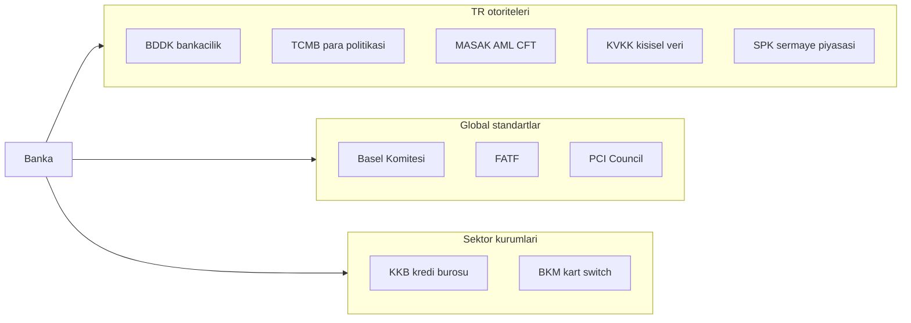
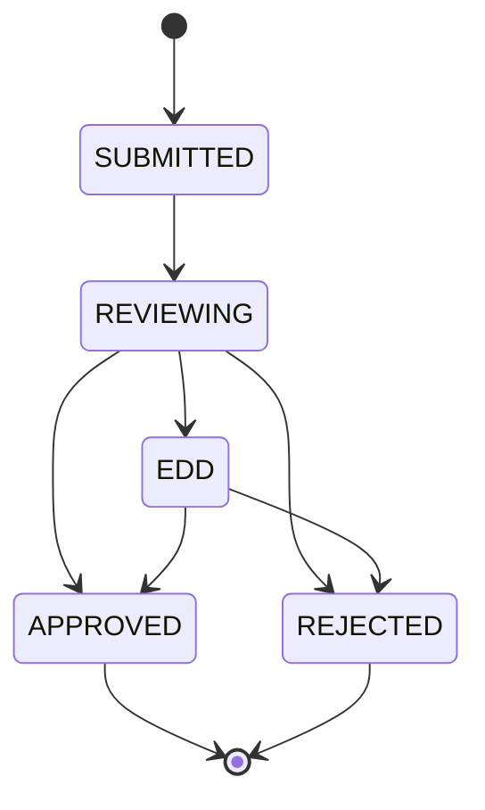
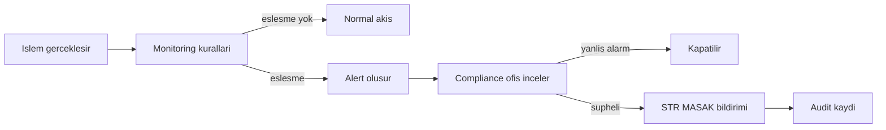
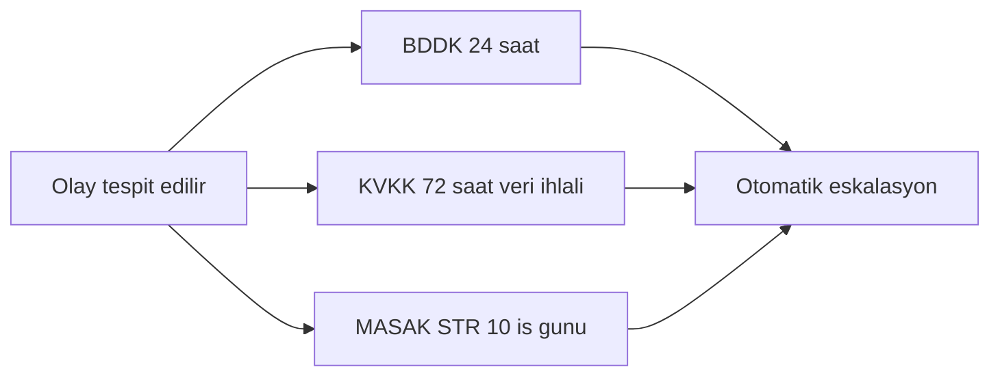

# Topic 10.6 — Regulatory: BDDK, MASAK, KVKK, PCI-DSS, KKB, GDPR

```admonish info title="Bu bölümde"
- TR + global regülatör haritası: BDDK, MASAK, KVKK, SPK, TCMB, KKB — kim neyi düzenler, backend'e ne dayatır
- MASAK AML/CFT: KYC/CDD onboarding, STR şüpheli işlem bildirimi, sanctions screening, smurfing tespiti — real-time rule engine
- KVKK 6698: açık rıza, aydınlatma, VERBİS, veri sahibi hakları ve right to be forgotten vs BDDK 10 yıl retention takası
- BDDK 5411 + Bilgi Sistemleri Tebliği: audit trail, retention, pentest, incident notification 24h; Basel III CAR/LCR/NSFR
- PCI-DSS scope reduction, KKB Findeks skor entegrasyonu ve cache stratejisi
```

## Hedef

TR + uluslararası banking regulatory landscape'i **implementation perspektifinden** öğrenmek: BDDK (bankacılık), MASAK (AML/CFT), KVKK (kişisel veri), PCI-DSS (kart), KKB (kredi bürosu), GDPR (AB veri), 5411 sayılı Kanun, 6493 Ödeme Hizmetleri Kanunu, Basel uyumu, AML compliance program, audit trail, retention, reporting, incident notification. Amaç mevzuatı ezberlemek değil; her düzenlemenin koda nasıl döküldüğünü — hangi tabloyu, hangi kuralı, hangi süreyi zorunlu kıldığını — görmek.

## Süre

Okuma: 2.5 saat • Kendini Sına: 45 dk • Pratik (opsiyonel): 3-4 saat • Toplam: ~3 saat (+ pratik)

## Önbilgi

- Topic 10.1-10.5 bitti
- Phase 8 security bitti (encryption, audit hash chain, PAN tokenization biliyorsun)
- TR mevzuat genel kavramı

---

## Kavramlar

### 1. Regulatory landscape — TR + global

Bir bankanın backend'i tek bir "compliance" kutusuna değil, birbirinden bağımsız birçok otoriteye karşı sorumludur; hangisinin neyi denetlediğini bilmeden doğru tabloyu bile tasarlayamazsın. Her regülatör senin koduna farklı bir yükümlülük sokar: BDDK audit retention, MASAK transaction monitoring, KVKK consent, PCI kart verisi.

Otoriteleri üç kümede topla — **TR otoriteleri**, **global standart organları** ve **sektör kurumları**:



Kısa referans: **BDDK** (Bankacılık Düzenleme ve Denetleme Kurumu), **TCMB** (Merkez Bankası), **MASAK** (Mali Suçları Araştırma Kurulu), **KVKK** (Kişisel Verileri Koruma Kurumu), **SPK** (Sermaye Piyasası Kurulu), **HMB** (Hazine ve Maliye Bakanlığı), **TBB** (Türkiye Bankalar Birliği). Global tarafta **BCBS** (Basel — sermaye/likidite), **FATF** (AML standart), **PCI Council** (kart), **SWIFT** (mesaj + sanctions). Sektör: **BKM** (kart switch), **KKB** (kredi bürosu).

### 2. BDDK — bankacılık regülatörü

BDDK bankanın var olma iznini verir; onun IT tebliğine uymadan production'a çıkamazsın, o yüzden backend kararlarının çoğu buraya dayanır. **Authority basis:** 5411 sayılı Bankacılık Kanunu (2005).

**Temel sorumluluk alanları:** banka lisansı ve M&A onayı, sermaye yeterliliği (**CAR** — Sermaye Yeterlilik Oranı, Basel III), likidite (LCR, NSFR), konsantrasyon limitleri, IT düzenlemeleri (Bilgi Sistemleri Yönetimi Tebliği), outsourcing bildirimi, kredi sınıflandırması (1-5 grupları), karşılık kuralları, yıllık stress test, Open Banking (2020 tebliği), tüketici koruması.

Backend'i asıl ilgilendiren kısım **Bilgi Sistemleri Yönetimi Tebliği** (2020 güncellemesi):

```
- Data residency: TR-located primary
- Disaster recovery: hot/warm site + RTO/RPO hedefleri
- Penetration test: yıllık + major change sonrası
- IT audit: yıllık external + internal continuous
- Incident reporting: significant için tespitten 24h sonra
- Change management dokümante
- Access control + segregation of duties
- Outsourcing bildirim + sözleşme şartları
- Backup + restore quarterly test
- Capacity planning dokümante
```

Bu tebliğin backend'e en somut yansıması **audit retention**: compliance kayıtları 10 yıl saklanmalı. Önce immutable audit entity:

```java
@Entity
public class AuditEvent {
    @Id
    private Long id;

    @Column(nullable = false, updatable = false)
    private Instant occurredAt;

    @Column(nullable = false)
    private UUID userId;

    @Column(nullable = false)
    private String action;

    @Column(columnDefinition = "jsonb")
    private String details;
    // ... immutable, hash chain (Topic 8.7)
}
```

Retention'ı da policy ile deklaratif tanımla — tier'lı arşivleme maliyeti düşürür (sıcak veri hızlı, eski veri glacier):

```java
@Bean
public RetentionPolicy auditRetention() {
    return RetentionPolicy.builder()
        .source("audit_event")
        .retention(Period.ofYears(10))
        .archiveAfter(Period.ofDays(90))
        .tier1Days(7).tier2Days(30).tier3Days(90)
        .archiveTier("s3-glacier")
        .build();
}
```

### 3. MASAK — AML/CFT

Şüpheli bir işlem tespit edildiğinde banka bunu MASAK'a bildirmek zorundadır; işte transaction monitoring ve STR mantığının tamamı bu yükümlülükten doğar. **Authority basis:** 5549 sayılı Suç Gelirlerinin Aklanmasının Önlenmesi Hakkında Kanun.

**Compliance program gereksinimleri:** atanmış compliance officer, yıllık risk assessment, dokümante policy & procedure, onboarding'de **Customer Due Diligence (CDD)**, high-risk için **Enhanced Due Diligence (EDD)**, ongoing monitoring, sanctions screening, raporlama (STR, CTR), yıllık eğitim, internal + external audit.

CDD onboarding'de bir state machine gibi ilerler; müşteri kaydı SUBMITTED'dan başlar, risk profiline göre EDD'ye sapabilir:



**STR (Şüpheli İşlem Bildirimi)** tetikleyici örnekleri: smurfing/structuring (ardarda eşiğin hemen altında küçük tutarlar), round-number transactions, coğrafi anomali, PEP büyük işlemleri, müşteri profiliyle uyumsuz hareket, anonim beneficiary, cash-heavy davranış, sanctions-listeli karşı taraf.

STR'nin en kritik kuralı gizliliktir: <mark>STR bildirimi yapıldığı işlem sahibi müşteriye asla haber verilmez — "tipping-off" suçtur</mark>. Bu yüzden alert ve STR akışı müşteriye görünen hiçbir kanaldan sızmamalıdır.

#### Transaction monitoring — rule engine

Her işlem bir kural setinden geçer; eşleşme olursa alert üretilir. Önce dinleyici iskeleti:

```java
@Service
public class TransactionMonitoringService {
    private final List<MonitoringRule> rules;

    @KafkaListener(topics = "transactions")
    public void onTransaction(TransactionEvent event) {
        for (MonitoringRule rule : rules) {
            RuleResult result = rule.evaluate(event);
            if (result.isMatch()) {
                createAlert(event, rule, result);
            }
        }
    }
}
```

Eşleşen kural bir `ComplianceAlert` üretir; CRITICAL severity anında compliance ops'a düşer:

```java
private void createAlert(TransactionEvent event, MonitoringRule rule, RuleResult result) {
    ComplianceAlert alert = ComplianceAlert.builder()
        .alertId(UUID.randomUUID())
        .transactionId(event.getId())
        .customerId(event.getCustomerId())
        .rule(rule.getName())
        .severity(result.getSeverity())
        .reason(result.getReason())
        .status("PENDING_REVIEW")
        .createdAt(Instant.now())
        .build();
    alertRepo.save(alert);
    if (result.getSeverity() == Severity.CRITICAL) {
        notifyComplianceOps(alert);
    }
}
```

Kuralların kendisi tekil `MonitoringRule` implementasyonlarıdır — smurfing tespiti son 24 saatteki işlemleri toplar:

```java
public class SmurfingDetectionRule implements MonitoringRule {
    public RuleResult evaluate(TransactionEvent event) {
        List<TransactionEvent> recent = txRepo.findByCustomerSince(
            event.getCustomerId(),
            event.getTimestamp().minus(24, ChronoUnit.HOURS));

        long countBelowThreshold = recent.stream()
            .filter(tx -> tx.getAmount().compareTo(new BigDecimal("10000")) < 0
                       && tx.getAmount().compareTo(new BigDecimal("9000")) > 0)
            .count();

        if (countBelowThreshold >= 5) {
            return RuleResult.match(Severity.HIGH,
                "Potential smurfing: " + countBelowThreshold + " tx just below threshold");
        }
        return RuleResult.noMatch();
    }
}
```

Diğer iki kural daha basit: büyük nakit ve sanctions-listeli karşı taraf.

<details>
<summary>Tam kod: monitoring service + 3 rule (~80 satır)</summary>

```java
@Service
public class TransactionMonitoringService {

    private final List<MonitoringRule> rules;

    @KafkaListener(topics = "transactions")
    public void onTransaction(TransactionEvent event) {
        for (MonitoringRule rule : rules) {
            RuleResult result = rule.evaluate(event);
            if (result.isMatch()) {
                createAlert(event, rule, result);
            }
        }
    }

    private void createAlert(TransactionEvent event, MonitoringRule rule, RuleResult result) {
        ComplianceAlert alert = ComplianceAlert.builder()
            .alertId(UUID.randomUUID())
            .transactionId(event.getId())
            .customerId(event.getCustomerId())
            .rule(rule.getName())
            .severity(result.getSeverity())
            .reason(result.getReason())
            .status("PENDING_REVIEW")
            .createdAt(Instant.now())
            .build();
        alertRepo.save(alert);

        if (result.getSeverity() == Severity.CRITICAL) {
            notifyComplianceOps(alert);
        }
    }
}

public class SmurfingDetectionRule implements MonitoringRule {

    public RuleResult evaluate(TransactionEvent event) {
        List<TransactionEvent> recent = txRepo.findByCustomerSince(
            event.getCustomerId(),
            event.getTimestamp().minus(24, ChronoUnit.HOURS));

        BigDecimal totalAmount = recent.stream()
            .map(TransactionEvent::getAmount)
            .reduce(ZERO, BigDecimal::add);

        long countBelowThreshold = recent.stream()
            .filter(tx -> tx.getAmount().compareTo(new BigDecimal("10000")) < 0
                       && tx.getAmount().compareTo(new BigDecimal("9000")) > 0)
            .count();

        if (countBelowThreshold >= 5 && totalAmount.compareTo(new BigDecimal("40000")) > 0) {
            return RuleResult.match(
                Severity.HIGH,
                "Potential smurfing: " + countBelowThreshold + " transactions just below threshold");
        }
        return RuleResult.noMatch();
    }
}

public class LargeCashRule implements MonitoringRule {
    public RuleResult evaluate(TransactionEvent event) {
        if ("CASH_DEPOSIT".equals(event.getType())
            && event.getAmount().compareTo(new BigDecimal("75000")) > 0) {
            return RuleResult.match(Severity.MEDIUM, "Large cash deposit");
        }
        return RuleResult.noMatch();
    }
}

public class SanctionedCounterpartyRule implements MonitoringRule {
    public RuleResult evaluate(TransactionEvent event) {
        if (sanctionsService.isOnList(event.getRecipientName(), event.getRecipientCountry())) {
            return RuleResult.match(Severity.CRITICAL, "Sanctioned counterparty");
        }
        return RuleResult.noMatch();
    }
}
```

</details>

#### Alert → STR akışı

Alert doğrudan MASAK'a gitmez; önce compliance ofisin incelemesinden geçer, gerçek şüphe varsa STR bildirilir:



STR MASAK e-bildirim sistemine `@Async` gönderilir; sonuç alert'e işlenir ve audit'lenir:

```java
@Async
public void submitStr(ComplianceAlert alert) {
    StrReport report = buildStrReport(alert);
    StrSubmissionResponse response = masakClient.submit(report);

    alert.setStrSubmittedAt(Instant.now());
    alert.setStrReportId(response.getReportId());
    alert.setStatus("STR_FILED");
    alertRepo.save(alert);

    auditService.log("STR_FILED", alert);
}
```

### 4. KVKK — kişisel veri

Bir müşteriye pazarlama SMS'i atmadan önce onun bu amaca rıza verip vermediğini bilmek zorundasın; işte consent management ihtiyacı bu yükümlülükten çıkar. **Authority basis:** 6698 sayılı Kişisel Verilerin Korunması Kanunu (2016).

**Banking PII kategorileri:** TC kimlik no, ad-soyad, adres, telefon/e-posta, doğum tarihi, mesleki bilgi, mali durum, sağlık (kredi sigortası için), biometric (face/fingerprint).

**KVKK gereksinimleri ve backend karşılıkları:**

1. **Açık rıza (explicit consent)** — her işleme amacı için ayrı
2. **Aydınlatma yükümlülüğü** — privacy notice gösterimi
3. **Veri minimizasyonu** — en az gerekli kadar
4. **Saklama süresi** — amaca uygun, sonra silinmeli
5. **Veri güvenliği** — encryption, access control
6. **Veri sorumlusu sicili** — VERBİS kayıt
7. **Veri ihlali bildirimi** — 72 saat KVKK + ilgililere
8. **Veri sahibi hakları** — erişim, düzeltme, silme, taşıma
9. **Yurtdışı aktarım kısıtı** — yeterli koruma + onay

Burada veri sorumlusu (data controller) bankanın kendisidir; işleme amaçlarını belirleyen odur, dolayısıyla rıza kaydını tutmak da onun yükümlülüğüdür. Consent'i amaç bazında entity olarak modelle:

```java
@Entity
public class CustomerConsent {
    @Id private UUID id;
    private UUID customerId;
    private String purpose;      // "marketing", "credit_check", "third_party_share"
    private boolean granted;
    private Instant grantedAt;
    private Instant revokedAt;
    private String legalBasis;   // KVKK Madde 5/2 (sözleşme/kanun), Madde 6 (açık rıza)
}
```

Servis rızayı kaydeder, sorgular ve geri çeker — her işlem audit'lenir:

```java
public boolean hasConsent(UUID customerId, String purpose) {
    return consentRepo.findActiveConsent(customerId, purpose).isPresent();
}

public void recordConsent(UUID customerId, String purpose, String legalBasis) {
    consentRepo.save(CustomerConsent.builder()
        .id(UUID.randomUUID()).customerId(customerId)
        .purpose(purpose).granted(true)
        .grantedAt(Instant.now()).legalBasis(legalBasis)
        .build());
    auditService.log("CONSENT_GRANTED", customerId, purpose);
}
```

Enforcement'ı elle her method'a serpiştirmek yerine bir aspect ile deklaratif yap — `@RequiresConsent` yoksa çağrı hiç geçmez:

```java
@Aspect
@Component
public class ConsentEnforcementAspect {
    @Around("@annotation(RequiresConsent)")
    public Object enforce(ProceedingJoinPoint pjp) throws Throwable {
        RequiresConsent annotation = /* method'tan oku */ null;
        UUID customerId = extractCustomerId(pjp);
        if (!consentService.hasConsent(customerId, annotation.purpose())) {
            throw new ConsentRequiredException(annotation.purpose());
        }
        return pjp.proceed();
    }
}
```

<details>
<summary>Tam kod: ConsentService + aspect + kullanım (~65 satır)</summary>

```java
@Entity
public class CustomerConsent {
    @Id private UUID id;
    private UUID customerId;
    private String purpose;            // "marketing", "credit_check", "third_party_share", ...
    private boolean granted;
    private Instant grantedAt;
    private Instant revokedAt;
    private String legalBasis;          // KVKK Madde 5/2 (sözleşme), Madde 5/2 (kanun), Madde 6 (açık rıza)
}

@Service
public class ConsentService {

    public boolean hasConsent(UUID customerId, String purpose) {
        return consentRepo.findActiveConsent(customerId, purpose).isPresent();
    }

    public void revoke(UUID customerId, String purpose) {
        consentRepo.findActiveConsent(customerId, purpose)
            .ifPresent(c -> {
                c.setRevokedAt(Instant.now());
                consentRepo.save(c);
            });
    }

    public void recordConsent(UUID customerId, String purpose, String legalBasis) {
        consentRepo.save(CustomerConsent.builder()
            .id(UUID.randomUUID())
            .customerId(customerId)
            .purpose(purpose)
            .granted(true)
            .grantedAt(Instant.now())
            .legalBasis(legalBasis)
            .build());

        auditService.log("CONSENT_GRANTED", customerId, purpose);
    }
}

@Aspect
@Component
public class ConsentEnforcementAspect {

    @Around("@annotation(RequiresConsent)")
    public Object enforce(ProceedingJoinPoint pjp) throws Throwable {
        RequiresConsent annotation = /* ... */ null;
        UUID customerId = extractCustomerId(pjp);

        if (!consentService.hasConsent(customerId, annotation.purpose())) {
            throw new ConsentRequiredException(annotation.purpose());
        }

        return pjp.proceed();
    }
}

@Service
public class MarketingService {

    @RequiresConsent(purpose = "marketing")
    public void sendCampaign(UUID customerId, Campaign campaign) {
        // ...
    }
}
```

</details>

En sık mülakat açığı örtük onaydır: <mark>"site kullanımı = onay" KVKK ihlalidir; her amaç için ayrı, açık checkbox şarttır</mark>.

#### Right to be forgotten (silinme hakkı)

Silme talebini gerçek DELETE ile karşılamak zorunda değilsin; **crypto-shred** ile şifreleme anahtarını yok edersen veri kalıcı olarak okunamaz hâle gelir (Topic 8.6):

```java
@Transactional
public void forgetMe(UUID customerId) {
    encryptionService.destroyCustomerKey(customerId);   // crypto-shred

    Customer c = customerRepo.findById(customerId).orElseThrow();
    c.setRequestedForgottenAt(Instant.now());
    c.setStatus("FORGOTTEN");
    customerRepo.save(c);

    // BDDK 10 yıl retention için residual purge planla
    forgetScheduler.scheduleResidualPurge(customerId, Period.ofYears(10));
    auditService.log("CUSTOMER_FORGOTTEN", customerId);
}
```

```admonish warning title="Silinme hakkı vs retention çelişkisi"
KVKK silinme hakkı ile BDDK 10 yıl audit retention doğrudan çatışır — müşteri "sil" der, mevzuat "10 yıl tut" der. Çözüm ikisini de tatmin eder: functional data silinir/anonymize edilir, audit trail ise pseudonymized olarak saklanır. Yani kişiyi tanımlayan alanlar okunamaz olur ama denetim izi kaybolmaz.
```

### 5. PCI-DSS — kart standartları

Temeli Topic 8.6'daydı; burada compliance perspektifi. TR bankaları genelde **Level 1** kabul edilir (> 6M kart işlemi/yıl): yıllık on-site QSA assessment, quarterly ASV scan, yıllık penetration test.

**Compliance gereksinimleri (6 hedef):** güvenli network (firewall, default password yok), cardholder data koruması (PAN encryption, tokenization, CVV saklama yok), vulnerability management (patch, AV), güçlü access control (RBAC, MFA, fiziksel erişim logları), network monitoring (IDS/IPS, FIM), dokümante güvenlik politikası.

En güçlü mimari kaldıraç **tokenization ile scope reduction**: PAN yalnız payment servisinde (PCI-DSS scope içi) tutulur, diğer servisler token kullanır. Böylece backend'in ~%95'i PCI scope dışına çıkar — denetim maliyeti ve saldırı yüzeyi dramatik düşer.

### 6. KKB — kredi bürosu

Bir kredi başvurusunu değerlendirmeden önce müşterinin geçmiş kredi davranışını bilmen gerekir; bunu sağlayan sektör kurumu KKB'dir. <mark>Kredi başvurusunda KKB Findeks skoru sorgusu zorunludur ve her sorgu ücretlendirilir</mark> — bu iki gerçek cache stratejini doğrudan belirler.

**Findeks Skor (300-1900):** onboarding ve kredi başvurusunda sorgulanır, score-based pricing + limit belirler, API real-time. Diğer KKB servisleri: **KRS** (Kredi Referans Sistemi — geçmiş kredi davranışı), çek raporu (bounced check history), GeoData (adres doğrulama), KKB Sandbox / API marketplace.

Sorgu ücretli olduğu için skoru cache'lersin (skor günlerce anlamlı değişmez):

```java
@Service
public class KkbService {
    @Cacheable(value = "kkb-score", key = "#tcKimlik", unless = "#result == null")
    public CreditScoreResponse getScore(String tcKimlik) {
        return kkbClient.post()
            .uri("/findeks/v3/score")
            .bodyValue(Map.of("tcKimlik", tcKimlik))
            .retrieve()
            .bodyToMono(CreditScoreResponse.class)
            .block();
    }
}
```

Cache TTL'i 7 gün gibi tut; expire sonrası tekrar sorgu:

```java
@Bean
public CacheManager kkbCacheManager() {
    return CaffeineCacheManager.builder()
        .caffeine(Caffeine.newBuilder()
            .maximumSize(100_000)
            .expireAfterWrite(Duration.ofDays(7))   // Skor 7 gün cache
            .recordStats())
        .build();
}
```

```admonish tip title="Cost optimization"
KKB sorgusu başına ücret ödediğin için iki katman koru: (1) 7 gün TTL cache, (2) business rule — yalnız kredi başvurusunda ve büyük tutar kart başvurusunda sorgula. Her login'de skor çekmek gereksiz maliyettir.
```

### 7. GDPR — AB veri koruma

TR bankası için GDPR şu durumlarda devreye girer: AB vatandaşı/mukimi müşteri, AB'de operasyon (şube), veya AB data residency gereği. GDPR ve KVKK büyük ölçüde paraleldir — KVKK zaten GDPR esinlidir: lawful basis, consent, data subject rights, DPO appointment, 72h breach notification, cross-border transfer kısıtı (AB'nin yeterli koruma değerlendirmesi). Pratikte KVKK'ya uygun tasarladığın sistem GDPR'ın büyük kısmını da karşılar.

### 8. Basel III — capital + liquidity

BDDK Basel III uygular; bu senin backend'ine EOD hesaplama ve regulatory reporting olarak yansır. **Banking metrikleri:**

- **CAR (Sermaye Yeterlilik Oranı):** (Tier 1 + Tier 2) / RWA ≥ %12 (TR minimum)
- **LCR (Liquidity Coverage Ratio):** HQLA / 30 günlük net cash outflow ≥ %100
- **NSFR (Net Stable Funding Ratio):** available / required stable funding ≥ %100
- **Leverage Ratio:** Tier 1 / Exposure ≥ %3

Bunların IT karşılığı: veri kalitesi + EOD hesaplama + regulatory reporting. Örnek günlük LCR hesaplama job'ı (HQLA'ya varlık tipine göre haircut uygular):

```sql
SELECT
    SUM(CASE WHEN asset_type IN ('cash', 'central_bank_reserve') THEN amount * 1.0
             WHEN asset_type = 'government_bond' THEN amount * 1.0
             WHEN asset_type = 'corporate_bond_aa' THEN amount * 0.85
             ELSE 0 END) AS hqla,
    SUM(CASE WHEN outflow_type = 'retail_deposit_stable' THEN balance * 0.05
             WHEN outflow_type = 'retail_deposit_less_stable' THEN balance * 0.10
             WHEN outflow_type = 'wholesale' THEN balance * 0.40
             ELSE 0 END) AS net_outflows
FROM regulatory_position
WHERE as_of_date = CURRENT_DATE;
```

Banking'de bu hesaplamalar için ayrı bir **regulatory reporting service** microservice'i yaygındır.

### 9. Reporting — BDDK, MASAK, TCMB

Regülatörlere farklı frekans ve formatlarda rapor gider; bunu ad-hoc kodla değil, dedicated reporting servisiyle üretirsin. **BDDK** günlük/haftalık/aylık: bilanço, sermaye yeterliliği, kredi-mevduat oranı, likidite oranları. **MASAK** aylık raporlar + ad-hoc STR/CTR. **TCMB:** aktif/pasif yapı, para arzı, FX pozisyonu, faiz. Format regülatöre özgüdür: XBRL, XML, CSV.

### 10. Incident notification

Bir güvenlik olayı veya veri ihlali olduğunda saatler içinde bildirim yapman gerekir; süreler farklı olduğu için tek bir manuel süreçle yönetemezsin. **BDDK:** significant outage/security incident için 24 saat. **KVKK:** veri ihlali için 72 saat. **MASAK:** STR için 10 iş günü.

Her regülatörün kendi saati işler; otomatik timer + eskalasyon şart:



### 11. Audit trail — banking critical

Compliance denetimi geldiğinde "kim, ne, ne zaman yaptı" sorusuna eksiksiz cevap verebilmelisin; bu yüzden audit trail bankacılıkta opsiyonel değildir. İyi bir kayıt şunları taşır: **WHO** (user ID + IP), **WHAT** (action + resource), **WHEN** (timestamp), **HOW** (kanal: mobile/web/branch/ATM), **RESULT** (success/fail + reason), **PRE/POST state** (veri değişikliklerinde).

```sql
CREATE TABLE compliance_audit (
    id BIGSERIAL PRIMARY KEY,
    occurred_at TIMESTAMPTZ NOT NULL DEFAULT now(),
    user_id UUID,
    customer_id UUID,
    action VARCHAR(100) NOT NULL,
    resource_type VARCHAR(50),
    resource_id VARCHAR(100),
    channel VARCHAR(20),
    ip_address INET,
    user_agent TEXT,
    result VARCHAR(20),
    reason TEXT,
    pre_state JSONB,
    post_state JSONB,
    trace_id VARCHAR(100),
    hash_prev CHAR(64),
    hash_curr CHAR(64)
);
```

En kritik özellik değişmezliktir: <mark>compliance audit log immutable olmalı — UPDATE/DELETE mümkünse tamper kanıtı çürür</mark>. Bu yüzden hash chain kullanılır (Topic 8.7): her satır bir öncekinin hash'ini taşır, tek bir değişiklik zinciri bozar.

**Zorunlu audit event'leri (BDDK + MASAK):** customer onboarding + KYC adımları, login (success/fail/lockout), logout, password change, MFA enroll/disable, profil değişiklikleri (KVKK), permission/role değişiklikleri, transfer initiated/completed/failed, kart operasyonları (block/unblock/limit), kredi başvuru + onay/red, hesap açma/kapama, büyük işlemler (BDDK threshold), cross-border transfer, sanctions hit, STR generated, admin actions, config değişiklikleri, veri export/extract (KVKK).

### 12. Banking regulatory anti-pattern'leri

Mülakatta "bu tasarımda ne yanlış?" sorusunun cephaneliği. On klasik:

1. **Audit log mutable** — UPDATE/DELETE mümkün → tamper. Çözüm: immutable + hash chain.
2. **Retention yetersiz** — application log 30 gün. Audit/compliance 5-10 yıl gerekir.
3. **PII export kontrolsüz** — bulk customer export → KVKK ihlali. Approval workflow + audit.
4. **Sanctions screening yalnız daily batch** — real-time gerek; daily list refresh + per-transaction screening.
5. **STR kuralları statik** — yeni tipoloji kaçar. Rule engine + tunable eşikler.
6. **Consent örtük** — "site kullanımı = onay" ihlal. Amaç bazında explicit checkbox.
7. **Cross-border aktarım kontrolsüz** — cloud AB → TR aktarım onay gerektirir. TR-hosted strateji yaygın.
8. **Incident notification manuel** — süre kaçar. Automated alerting + workflow.
9. **Compliance officer devrede değil** — material karar onun onayından geçmeli. Workflow approval gate.
10. **Pentest yıllık yapılmıyor** — BDDK requirement: yıllık + major change sonrası.

---

## Önemli olabilecek araştırma kaynakları

- 5411 sayılı Bankacılık Kanunu
- 6698 sayılı KVKK
- 5549 sayılı MASAK Kanunu
- 6493 Ödeme Hizmetleri Kanunu
- BDDK Bilgi Sistemleri Yönetimi Tebliği
- MASAK Tedbirler Yönetmeliği
- Basel III framework
- PCI-DSS v4.0
- GDPR full text
- BDDK Open Banking Tebliği (2020)
- TCMB Ödeme Sistemleri Genelgesi

---

## Kendini Sına

Aşağıdaki soruları önce **cevaba bakmadan** kendi cümlelerinle yanıtlamayı dene — hepsi TR bank mülakatlarında compliance/domain tarafında sık çıkar. Takıldığında ilgili Kavramlar başlığına dön, sonra tekrar dene.

**S1. MASAK STR nedir, KYC/CDD ile arasındaki fark nedir?**

<details>
<summary>Cevabı göster</summary>

KYC/CDD (Customer Due Diligence) müşteriyi **tanıma** sürecidir: onboarding'de kimlik doğrulama, risk sınıflandırma, high-risk için EDD. Amaç ilişki başlamadan önce müşterinin kim olduğunu ve risk profilini belirlemektir. STR (Şüpheli İşlem Bildirimi) ise ilişki devam ederken **davranışa** dayalı bir bildirimdir: bir işlem şüpheli bir tipolojiye (smurfing, sanctions, profil dışı hareket) uyarsa MASAK'a raporlanır.

Yani CDD "kapıda kimlik kontrolü", STR "içeride sürekli izleme"dir. Kritik fark: STR yapıldığı müşteriye asla bildirilmez (tipping-off suçtur), CDD ise müşteriyle açık yürütülen bir süreçtir.

</details>

**S2. BDDK backend'e somut olarak neyi dayatır? Bilgi Sistemleri Tebliği'nden 4 örnek ver.**

<details>
<summary>Cevabı göster</summary>

BDDK (5411 sayılı Kanun) bankacılık regülatörüdür; Bilgi Sistemleri Yönetimi Tebliği ile IT tarafına doğrudan yükümlülük getirir. Backend'e yansıyan somut örnekler: data residency (primary TR'de), disaster recovery (hot/warm site + RTO/RPO), yıllık penetration test + major change sonrası, incident reporting significant olay için 24 saat, audit retention 10 yıl, quarterly backup/restore testi, access control + segregation of duties.

En çok koda dokunanı retention'dır: compliance audit kayıtlarını 10 yıl saklaman gerekir, bu da immutable tablo + tier'lı arşivleme (sıcak → glacier) tasarımını zorunlu kılar.

</details>

**S3. KVKK'da veri sorumlusu kimdir? Açık rıza, aydınlatma ve VERBİS'i açıkla.**

<details>
<summary>Cevabı göster</summary>

Veri sorumlusu (data controller) kişisel verinin işleme amacını ve yöntemini belirleyen taraftır — bankacılıkta bu bankanın kendisidir. Dolayısıyla rızayı almak, aydınlatmayı yapmak, güvenliği sağlamak ve VERBİS'e kayıt olmak bankanın yükümlülüğüdür.

Açık rıza (explicit consent) her işleme amacı için ayrı ve özgür iradeyle alınır; "site kullanımı = onay" gibi örtük onay ihlaldir. Aydınlatma yükümlülüğü verinin hangi amaçla, hangi hukuki sebeple işlendiğinin müşteriye bildirilmesidir (privacy notice). VERBİS ise Veri Sorumluları Sicili'dir — belirli eşiği aşan veri sorumlusu bu sicile kayıt olmak zorundadır.

</details>

**S4. Müşteri "verimi sil" diyor ama BDDK 10 yıl retention istiyor. Bu çelişkiyi nasıl çözersin?**

<details>
<summary>Cevabı göster</summary>

KVKK silinme hakkı (right to be forgotten) ile BDDK 10 yıl audit retention doğrudan çatışır. Çözüm ikisini de tatmin edecek şekilde ayrıştırmaktır: functional/kişisel data silinir veya anonymize edilir, denetim izi (audit trail) ise pseudonymized olarak saklanır. Yani kişiyi tanımlayan alanlar okunamaz olur ama işlem kaydı kaybolmaz.

Teknik olarak en temiz yöntem crypto-shred'dir (Topic 8.6): müşterinin şifreleme anahtarını yok edersin, encrypted veri kalıcı olarak okunamaz hale gelir — fiziksel DELETE gerekmez. Kayıt "FORGOTTEN" olarak işaretlenir, residual purge 10 yıl sonrasına planlanır.

</details>

**S5. KKB Findeks skoru nedir, neden cache'lersin, cache stratejisi ne olmalı?**

<details>
<summary>Cevabı göster</summary>

Findeks skoru KKB'nin (Kredi Kayıt Bürosu) sağladığı 300-1900 aralığında bir kredi skorudur; kredi başvurusunda sorgusu zorunludur ve score-based pricing/limit belirler. KKB diğer servisleri de sunar: KRS (kredi referans sistemi), çek raporu, GeoData.

Cache'lemenin sebebi her sorgunun ücretli olmasıdır — skor günlerce anlamlı değişmez, o yüzden 7 gün gibi bir TTL ile cache'lersin. İki katmanlı koruma önerilir: (1) 7 gün TTL cache, (2) business rule — yalnız kredi başvurusunda ve büyük tutar kart başvurusunda sorgula. Her login'de skor çekmek gereksiz maliyettir.

</details>

**S6. Smurfing (structuring) nedir, backend'de nasıl tespit edilir?**

<details>
<summary>Cevabı göster</summary>

Smurfing, büyük bir tutarı raporlama eşiğinin (ör. 10.000) hemen altında çok sayıda küçük işleme bölerek eşik bildirimlerinden kaçma tekniğidir. Tek başına her işlem masum görünür ama toplamda kara para aklama sinyalidir.

Tespit için real-time transaction monitoring'de bir `MonitoringRule` yazarsın: müşterinin son 24 saatteki işlemlerini toplarsın, eşiğin hemen altında (ör. 9.000-10.000 arası) belli sayıda (ör. ≥5) işlem varsa ve toplam belli bir tutarı aşıyorsa HIGH severity alert üretirsin. Alert compliance ofisin incelemesine düşer, gerçek şüphe varsa STR bildirilir.

</details>

**S7. Sanctions screening neden daily batch yeterli değildir? Tipping-off nedir?**

<details>
<summary>Cevabı göster</summary>

Sanctions screening'in daily batch olması bir anti-pattern'dir çünkü yaptırım listesindeki bir karşı tarafa gün içinde para gidebilir ve batch akşam çalıştığında iş işten geçmiş olur. Doğrusu: liste günlük yenilenir ama tarama her işlemde (per-transaction) real-time yapılır — sanctioned counterparty'ye giden transfer anında CRITICAL alert üretip bloklanır.

Tipping-off, bir müşteriye hakkında STR düzenlendiğini veya soruşturma yürütüldüğünü sezdirmektir ve başlı başına suçtur. Bu yüzden alert/STR akışı müşteriye görünen hiçbir kanaldan (bildirim, hata mesajı, müşteri hizmetleri) sızmamalıdır.

</details>

**S8. Compliance audit log neden immutable olmalı ve hash chain nasıl yardımcı olur?**

<details>
<summary>Cevabı göster</summary>

Audit log tamper (sonradan değiştirme/silme) yapılabiliyorsa denetim değeri sıfırdır — kötü niyetli bir insider izini silebilir. BDDK ve MASAK bu yüzden immutable, 10 yıl saklanan audit trail bekler. Tabloda UPDATE/DELETE engellenir; kayıtlar yalnızca append edilir.

Hash chain (Topic 8.7) değişmezliği kriptografik olarak kanıtlar: her satır bir önceki satırın hash'ini (`hash_prev`) içerir ve kendi hash'ini (`hash_curr`) hesaplar. Tek bir satır bile değiştirilirse ondan sonraki tüm hash'ler tutarsız hale gelir; periyodik `verifyChain()` job'ı bu bozulmayı yakalar.

</details>

---

## Tamamlama kriterleri

- [ ] TR + global regülatör haritasını (BDDK, MASAK, KVKK, SPK, TCMB, KKB) kimin neyi düzenlediğiyle anlatabiliyorum
- [ ] MASAK STR ile KYC/CDD farkını ve tipping-off yasağını açıklayabiliyorum
- [ ] BDDK Bilgi Sistemleri Tebliği'nin backend'e dayattığı 4+ maddeyi (retention, DR, pentest, incident) sayabiliyorum
- [ ] KVKK'da veri sorumlusu, açık rıza, aydınlatma ve VERBİS'i tanımlayabiliyorum
- [ ] Right to be forgotten vs BDDK 10 yıl retention çelişkisini crypto-shred + pseudonymize ile çözebiliyorum
- [ ] Smurfing tespitini ve real-time sanctions screening gereğini gerekçesiyle anlatabiliyorum
- [ ] KKB Findeks skorunu, cache stratejisini (7 gün TTL) ve cost optimization'ı açıklayabiliyorum
- [ ] Basel III metriklerini (CAR, LCR, NSFR) ve compliance audit'in immutable + hash chain gereğini biliyorum

---

## Defter notları (10 madde)

1. "TR regulatory landscape (BDDK + MASAK + KVKK + TCMB + SPK) banking impact: ____."
2. "BDDK 5411 + Bilgi Sistemleri Tebliği IT compliance (DR, pentest, audit, retention): ____."
3. "MASAK STR + sanctions screening + 3 rule (smurfing, cash, sanctions): ____."
4. "KVKK 6698 + consent + right to be forgotten + crypto-shred: ____."
5. "PCI-DSS PAN tokenization + scope reduction + Level 1 compliance: ____."
6. "KKB Findeks score + cache 7 gün + cost optimization: ____."
7. "GDPR vs KVKK paralel uyum + cross-border transfer AB: ____."
8. "Basel III CAR + LCR + NSFR banking metric + daily computation: ____."
9. "Incident notification BDDK 24h + KVKK 72h automated workflow: ____."
10. "Audit trail 14+ event type + retention 10 yıl + hash chain tamper-proof: ____."

```admonish success title="Bölüm Özeti"
- Regülatör haritası: BDDK (bankacılık/sermaye/IT), MASAK (AML/CFT/STR), KVKK (kişisel veri), KKB (kredi bürosu) — her biri backend'e farklı yükümlülük dayatır
- MASAK: real-time transaction monitoring + rule engine (smurfing, large cash, sanctions), alert → compliance review → STR; STR müşteriye asla bildirilmez (tipping-off)
- KVKK: granular consent (`@RequiresConsent`) + right to be forgotten crypto-shred ile; silinme hakkı BDDK 10 yıl retention ile anonymize/pseudonymize takası
- Audit trail: separate table + immutable + hash chain + 10 yıl retention; WHO/WHAT/WHEN/HOW/RESULT + pre/post state
- Incident notification: BDDK 24h, KVKK 72h, MASAK STR 10 iş günü — automated timer + eskalasyon şart
- Basel III: CAR ≥ %12, LCR/NSFR ≥ %100; regulatory reporting ayrı microservice, XBRL/XML format
```

---

## Pratik yapmak istersen

Kavramları koda dökmek istersen aşağıdaki iki ek hazır: test yazma rehberi smurfing tespiti, consent enforcement, crypto-shred ve audit hash chain için örnek testler içerir; Claude-verify prompt'u ile yazdığın regulatory/compliance kodunu banking-grade perspektiften denetletebilirsin.

> Süre: testleri yazmak + Claude-verify ~3-4 saat. Tamamladığında şunları görmüş olmalısın: MASAK rule engine (3+ rule) real-time alert üretiyor, consent `@RequiresConsent` ile enforce ediliyor, right to be forgotten crypto-shred'liyor, audit chain tamper'ı yakalıyor.

<details>
<summary>Test yazma rehberi</summary>

### Test 10.6.1 — Smurfing tespiti

```java
@Test
void shouldDetectSmurfing() {
    UUID customerId = UUID.randomUUID();
    for (int i = 0; i < 5; i++) {
        txService.send(TransactionEvent.builder()
            .customerId(customerId)
            .amount(new BigDecimal("9500"))
            .timestamp(Instant.now().minus(i, ChronoUnit.HOURS))
            .build());
    }

    awaitForAlerts();

    List<ComplianceAlert> alerts = alertRepo.findByCustomer(customerId);
    assertThat(alerts).hasSize(1);
    assertThat(alerts.get(0).getRule()).isEqualTo("SmurfingDetection");
}
```

### Test 10.6.2 — Consent enforcement

```java
@Test
void shouldEnforceConsentBeforeMarketingCall() {
    UUID customerId = UUID.randomUUID();

    assertThatThrownBy(() -> marketingService.sendCampaign(customerId, campaign))
        .isInstanceOf(ConsentRequiredException.class);

    consentService.recordConsent(customerId, "marketing", "KVKK Madde 6");
    marketingService.sendCampaign(customerId, campaign);   // No exception
}

@Test
void shouldRevokeConsent() {
    UUID customerId = UUID.randomUUID();
    consentService.recordConsent(customerId, "marketing", "KVKK Madde 6");
    consentService.revoke(customerId, "marketing");

    assertThatThrownBy(() -> marketingService.sendCampaign(customerId, campaign))
        .isInstanceOf(ConsentRequiredException.class);
}
```

### Test 10.6.3 — Right to be forgotten (crypto-shred)

```java
@Test
@Transactional
void rightToBeForgottenCryptoShreds() {
    UUID customerId = createCustomer();
    Customer before = customerRepo.findById(customerId).orElseThrow();
    String tcBefore = before.getTcKimlik();

    forgetService.forgetMe(customerId);

    em.clear();
    Customer after = customerRepo.findById(customerId).orElseThrow();

    // tcKimlik unreadable after crypto-shred
    assertThatThrownBy(after::getTcKimlik)
        .isInstanceOf(EncryptionException.class);

    assertThat(after.getStatus()).isEqualTo("FORGOTTEN");
}
```

### Test 10.6.4 — Audit chain tamper tespiti

```java
@Test
void auditChainShouldDetectTamper() {
    auditService.log(userId, "LOGIN", null);
    auditService.log(userId, "TRANSFER", txId);
    auditService.log(userId, "LOGOUT", null);

    assertThat(auditService.verifyChain()).isTrue();

    // Tamper
    em.createNativeQuery("UPDATE compliance_audit SET action = 'FAKE' WHERE id = 2")
        .executeUpdate();

    assertThat(auditService.verifyChain()).isFalse();
}
```

### Test 10.6.5 — Sanctions screening

```java
@Test
void shouldFlagSanctionedRecipient() {
    sanctionsService.addToList(new SanctionedEntity("12345678901", "Sanctioned Person"));

    RuleResult result = sanctionsRule.evaluate(TransactionEvent.builder()
        .recipientName("Sanctioned Person")
        .recipientTcKimlik("12345678901")
        .build());

    assertThat(result.isMatch()).isTrue();
    assertThat(result.getSeverity()).isEqualTo(Severity.CRITICAL);
}
```

### Bonus — pratik hedefleri

Kavramları tam koda dökmek istersen şu adımları da tamamla: compliance audit table + hash chain, STR submission workflow (alert → compliance officer approve → MASAK mock API), sanctions list daily refresh + per-transfer screening, KVKK data export (right to access, JSON + PDF), regulatory reporting (daily LCR + CAR, XML output), incident notification workflow (BDDK 24h + KVKK 72h timer + otomatik eskalasyon), Grafana compliance dashboard (open alerts, pending STR, sanctions hits, consent grants/revokes).

</details>

<details>
<summary>Claude-verify prompt</summary>

```
Regulatory implementation'ımı banking-grade kriterlere göre değerlendir.
Eksikleri işaretle, kod yazma:

1. Audit trail:
   - Compliance audit table separate?
   - Immutable (no UPDATE/DELETE)?
   - Hash chain tamper detect?
   - 14+ audit event types (login, transfer, MFA, admin, ...)?
   - Retention 5-10 yıl (BDDK)?

2. MASAK / AML:
   - Real-time transaction monitoring?
   - 3+ rule (smurfing, large cash, sanctions)?
   - Sanctions daily refresh + per-transaction screening?
   - STR workflow (alert → review → submit)?
   - Compliance officer approval gate?
   - Tipping-off koruması (STR müşteriye sızmıyor)?

3. KVKK / GDPR:
   - Consent management (granular per purpose)?
   - @RequiresConsent aspect?
   - Right to be forgotten (crypto-shred)?
   - Data export (right to access)?
   - 72h breach notification workflow?
   - VERBİS kayıt?

4. PCI-DSS:
   - PAN tokenization (Topic 8.6)?
   - No CVV store?
   - Network segmentation?
   - Quarterly ASV scan automated?
   - Annual pentest scheduled?

5. KKB:
   - Findeks score integration?
   - Cache (7 days TTL)?
   - Score-based limit + cost optimization?

6. BDDK regulatory:
   - Daily LCR computation?
   - CAR calculation EOD?
   - XML/XBRL output format?
   - Submission workflow?

7. Basel III:
   - LCR + NSFR + CAR + Leverage tracked?
   - HQLA classification?

8. Incident notification:
   - 24h BDDK timer?
   - 72h KVKK timer?
   - Automated escalation?

9. Cross-border:
   - Data residency TR?
   - Cross-border consent?
   - Cloud provider AB → TR aktarım onayı?

10. Anti-pattern:
    - Audit mutable YOK?
    - Retention insufficient YOK?
    - PII export uncontrolled YOK?
    - Sanctions daily-only YOK?
    - Consent implicit YOK?
    - Pentest annual yok YOK?

Her madde için PASS / FAIL / EKSIK işaretle, kanıt göster, kod yazma.
```

</details>
