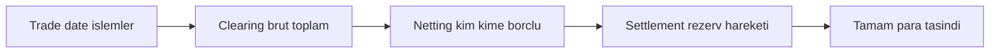
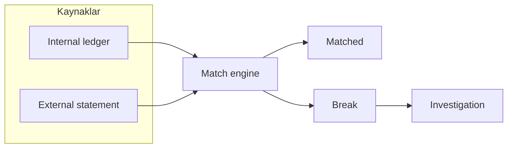
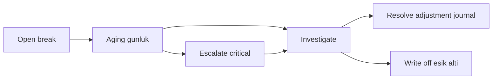

# Topic 10.7 — Reconciliation & Settlement

```admonish info title="Bu bölümde"
- Clearing ve settlement'ın kritik ayrımı + DNS / RTGS / DvP settlement modelleri
- Nostro / Vostro correspondent banking hesapları ve neden daily nostro recon zorunlu
- Reconciliation motorunun anatomisi: internal ledger vs external statement → match → break
- Match stratejileri (exact ref + fuzzy tolerance + multi-pass) ve 6 break tipi
- Break yaşam döngüsü: aging, severity ratchet, escalation, ledger üzerinden resolution
```

## Hedef

Banking reconciliation'ı derinlemesine kavramak: internal ledger ile external statement'ı eşleştirmek, **settlement** ile **clearing** ayrımını, Nostro/Vostro correspondent hesaplarını ve EOD reconciliation job pattern'ini oturtmak. **Break** (uyuşmazlık) yönetimini uçtan uca anlatabilmek: tespit, kategorize, aging, escalation, resolution. Card network, EFT/FAST, SWIFT ve internal kaynakları çoklu kaynak recon içinde birleştirmek. Phase 5 (Spring Batch) ile bağlantıyı kurmak.

## Süre

Okuma: ~2 saat • Kendini Sına: 45 dk • Pratik (opsiyonel): 4-5 saat • Toplam: ~3 saat (+ pratik)

## Önbilgi

- Topic 10.1 (Double-entry) bitti — journal entry, debit = credit invariant biliyorsun
- Topic 10.2-10.4 (ISO 8583, ISO 20022, TR payments) bitti
- Phase 5 (Spring Batch) bitti — chunk, restartable job kurabiliyorsun

---

## Kavramlar

### 1. Clearing vs Settlement — kritik ayrım

Bu iki kelime günlük dilde karışır ama bankacılıkta iki ayrı aşamadır; karıştırırsan settlement gününü ve likidite ihtiyacını yanlış hesaplarsın.

**Clearing (takas):** Bankalar arası işlemlerin toplanıp net pozisyonların hesaplanması — "kim kime ne kadar borçlu". Henüz para hareketi yok, sadece matematik.

**Settlement (mutabakat/ödeme):** Net pozisyonun gerçek para hareketiyle kapatılması — rezerv hesaplarında debit/credit. İşin fiilen bittiği an.

<mark>Clearing net pozisyonu hesaplar; settlement parayı fiilen hareket ettirir</mark> — biri hesap defteri, diğeri kasa.

Somut bir gün akışı, T+0'da hesap, T+1'de para:

```
T+0 (Trade date):
  Bank A → Bank B  1000 işlem, toplam +5M TL
  Bank B → Bank A   800 işlem, toplam +3M TL
  Clearing (net): Bank A, Bank B'ye 2M TL net borçlu

T+1 (Settlement date):
  TCMB: Bank A rezerv -2M, Bank B rezerv +2M
  Settlement tamam.
```

Zinciri baştan sona gör — trade'den net'e, net'ten fiili ödemeye:



**Settlement modelleri** — her biri farklı risk/hız takası:

- **DNS (Deferred Net Settlement):** Batch + multilateral netting, T+1 (örn. EFT). Netting sayesinde az likidite gerekir ama gün içi kredi riski taşır.
- **RTGS (Real Time Gross Settlement):** İşlem başına, anında, brüt (örn. FAST). Risk düşük, likidite ihtiyacı yüksek.
- **DvP (Delivery vs Payment):** Menkul kıymet ve ödemenin atomik takası — biri olmadan diğeri olmaz.

### 2. Nostro / Vostro / Loro

Yurt dışına döviz transferi yapan her banka bu hesapları tutar; isimler kafa karıştırır ama mantık basit: "kimin defterinden bakıyoruz?"

**Nostro** ("bizim" hesabımız başka bankada) — bizim için bir **asset**:

```
Maven Bank'ın JPMorgan New York'ta USD hesabı var
Maven'ın defterinde: "1103 Nostro - JPMorgan USD" — varlık
```

**Vostro** ("sizin" hesabınız bizde) — bizim için bir **liability**:

```
JPMorgan'ın Maven Bank'ta TRY hesabı var
Maven'ın defterinde: "2200 Vostro - JPMorgan TRY" — yükümlülük
```

**Loro** üçüncü taraf referansıdır ("onların hesabı bir başka bankada") ve pratikte nadirdir.

Uçtan uca bir döviz transferi birden fazla defteri ve correspondent ağını dolaşır:

```
Müşteri X (Maven) → Müşteri Y (Citi London) 1000 USD:

Maven Bank tarafı:
  Debit  Müşteri X (USD)            1000
  Credit Nostro - JPMorgan (USD)    1000   (Maven'ın USD pozisyonu kullanılır)

JPMorgan SWIFT ile Citi'ye iletir:
  Maven'ın Nostro'su JPM'de: -1000
  Citi'nin Nostro'su JPM'de: +1000

Citi London tarafı:
  Debit  Nostro - JPM              1000
  Credit Müşteri Y                 1000
```

Tek transferin arkasında birden fazla banka defteri, correspondent ağ ve SWIFT var — bu yüzden bu hesapların günlük mutabakatı hayati.

### 3. Reconciliation — ne + neden

Reconciliation, kendi defterinin dış dünyayla uyuşup uyuşmadığını kanıtlama işidir; kanıtlayamıyorsan para nerede kaybolduğunu bilemezsin.

**Amaç:** Internal ledger ile external statement'ı eşleştirmek. Uyuşmayan her kayıt bir **break**'tir (uyuşmazlık).

Motorun anatomisi tek cümlede: iki kaynağı bir match engine'e ver, eşleşenleri ayır, eşleşmeyenleri break olarak araştırmaya gönder:



**Recon kaynakları** (banking'de tipik olarak 5+):

- TCMB EFT statement (günlük)
- TCMB FAST settlement
- BKM card network NDC (Net Detail Concentrator) günlük dosyası
- SWIFT MT940 / camt.053 nostro statement
- Visa/Mastercard settlement dosyası
- Internal subsystem (ayrı microservice ledger sync)

**Reconciliation tipleri:**

- **Cash recon:** Banka hesap bakiyesi vs internal cash ledger
- **Card recon:** Card network expected vs internal posted
- **Securities recon:** Trade vs custodian
- **Inter-company:** Subsidiary bakiyeleri
- **Sub-ledger to GL:** Müşteri hesapları vs general ledger

### 4. EOD reconciliation job — Spring Batch (Phase 5)

EOD (end-of-day) recon büyük dosyalar üzerinde çalışır, bu yüzden Phase 5'te öğrendiğin chunk-oriented Spring Batch tam yerine oturur.

Job iskeleti üç adımdan oluşur: dış statement'ı yükle, eşleştir, kalan break'leri işle:

```java
@Bean
public Job cardReconciliationJob(JobRepository jobRepo,
                                 Step loadStatementStep,
                                 Step matchStep,
                                 Step exceptionStep) {
    return new JobBuilder("cardReconciliation", jobRepo)
        .start(loadStatementStep)
        .next(matchStep)
        .next(exceptionStep)
        .build();
}
```

Load adımı NDC dosyasını `FlatFileItemReader` ile okur; `|` delimiter'lı bir kayıt RRN, tutar, merchant gibi alanları taşır ve chunk'lar hâlinde external ledger'a yazılır:

```java
@Bean
@StepScope
public FlatFileItemReader<NetworkStatementRecord> networkStatementReader(
    @Value("#{jobParameters['statementFile']}") String filePath
) {
    return new FlatFileItemReaderBuilder<NetworkStatementRecord>()
        .name("networkStatementReader")
        .resource(new FileSystemResource(filePath))
        .delimited().delimiter("|")
        .names("rrn", "transmissionDateTime", "amount", "merchantId",
               "responseCode", "transactionType", "authId")
        .targetType(NetworkStatementRecord.class)
        .build();
}
```

Match adımı ise internal entry'leri okuyup match processor'dan geçirir ve `MatchResult` üretir. Tam config aşağıda katlanmış duruyor:

<details>
<summary>Tam kod: CardReconciliationJobConfig (~50 satır)</summary>

```java
@Configuration
@EnableBatchProcessing
public class CardReconciliationJobConfig {

    @Bean
    public Job cardReconciliationJob(JobRepository jobRepo,
                                     Step loadStatementStep,
                                     Step matchStep,
                                     Step exceptionStep) {
        return new JobBuilder("cardReconciliation", jobRepo)
            .start(loadStatementStep)
            .next(matchStep)
            .next(exceptionStep)
            .build();
    }

    @Bean
    public Step loadStatementStep(JobRepository repo, PlatformTransactionManager tm) {
        return new StepBuilder("loadStatement", repo)
            .<NetworkStatementRecord, ExternalLedgerEntry>chunk(500, tm)
            .reader(networkStatementReader())
            .processor(statementToLedgerProcessor())
            .writer(externalLedgerWriter())
            .build();
    }

    @Bean
    @StepScope
    public FlatFileItemReader<NetworkStatementRecord> networkStatementReader(
        @Value("#{jobParameters['statementFile']}") String filePath
    ) {
        return new FlatFileItemReaderBuilder<NetworkStatementRecord>()
            .name("networkStatementReader")
            .resource(new FileSystemResource(filePath))
            .delimited()
            .delimiter("|")
            .names("rrn", "transmissionDateTime", "amount", "merchantId",
                   "responseCode", "transactionType", "authId")
            .targetType(NetworkStatementRecord.class)
            .build();
    }

    @Bean
    public Step matchStep(JobRepository repo, PlatformTransactionManager tm) {
        return new StepBuilder("match", repo)
            .<InternalEntry, MatchResult>chunk(500, tm)
            .reader(internalEntryReader())
            .processor(matchingProcessor())
            .writer(matchResultWriter())
            .build();
    }
}
```

</details>

### 5. Matching algorithms

Match motoru tek bir kurala yaslanamaz: network kimi zaman referansı kırpar, banka kuruş yuvarlar. O yüzden kademeli (multi-pass) çalışırsın — kesinden gevşeğe.

Önce **exact match**: referans (RRN) ve tarih birebir aynıysa eşleştir. En güvenli, en hızlı:

```sql
SELECT i.id AS internal_id, e.id AS external_id
FROM internal_card_authorization i
INNER JOIN external_network_statement e
  ON i.rrn = e.rrn
  AND i.statement_date = e.statement_date;
```

Exact match tutmayanlar için **fuzzy match**: tutarda ±1 kuruş, zamanda ±1 dakika tolerans; ve zaten eşleşmişleri hariç tut:

```sql
SELECT i.id, e.id
FROM internal_card_authorization i
INNER JOIN external_network_statement e
  ON i.merchant_id = e.merchant_id
  AND i.amount BETWEEN e.amount - 0.01 AND e.amount + 0.01
  AND ABS(EXTRACT(EPOCH FROM (i.posted_at - e.posted_at))) < 60
  AND NOT EXISTS (SELECT 1 FROM matched WHERE matched.internal_id = i.id);
```

Kademeleri sırayla uygula; her pass bir öncekinden arta kalanı hedefler, en sonda kalan artık break'tir:


```admonish tip title="Fuzzy tolerans bilinçli olmalı"
Toleransı çok geniş tutarsan yanlış eşleşme (false match) üretir, gerçek break'i gizlersin. Çok darsa gereksiz break patlar. Kuruş ve dakika eşiklerini gerçek network davranışına bakarak kalibre et, sabit sanma.
```

### 6. Break management

Break bir kayıt değil, bir iş öğesidir: kim, ne zaman, ne kadar farkla, hangi tip. Bu yüzden zengin bir tablo gerekir.

Şemanın gövdesi — tip, severity, iki tarafın referans/tutarı ve resolution izi:

```sql
CREATE TABLE reconciliation_break (
    id BIGSERIAL PRIMARY KEY,
    recon_run_id UUID NOT NULL,
    recon_type VARCHAR(50),     -- 'card_network', 'eft', 'swift', ...
    break_type VARCHAR(50),     -- 'missing_internal', 'amount_mismatch', ...
    severity VARCHAR(20),       -- 'low', 'medium', 'high', 'critical'

    internal_ref VARCHAR(100),
    external_ref VARCHAR(100),
    internal_amount NUMERIC(19,4),
    external_amount NUMERIC(19,4),
    amount_difference NUMERIC(19,4),

    detected_at TIMESTAMPTZ DEFAULT now(),
    aged_days INT,

    status VARCHAR(20),         -- 'open', 'investigating', 'resolved', 'written_off'
    assigned_to VARCHAR(100),
    resolution_at TIMESTAMPTZ,
    resolution_journal_id BIGINT REFERENCES journal_entry(id),
    details JSONB
);
```

Sorguların hep "status + yaş" ve "tip" ekseninde geldiği için iki index kritik:

```sql
CREATE INDEX idx_break_status_aged ON reconciliation_break(status, aged_days DESC);
CREATE INDEX idx_break_type ON reconciliation_break(recon_type, break_type);
```

**Break tipleri** ve her birinin tipik sebebi — bu liste araştırmanın haritasıdır:

- `missing_internal` — External'da var, internal'da yok (kayıt düşmüş credit?)
- `missing_external` — Internal'da var, external sessiz (network reject?)
- `amount_mismatch` — Referans tutuyor ama tutar farklı (FX, fee)
- `date_mismatch` — Farklı tarihlerde postlanmış (cutoff'u kesen işlem)
- `duplicate_internal` — Internal iki kez postlamış (retry)
- `duplicate_external` — Network iki kez göndermiş (acquirer resend)

### 7. Aging + escalation

Açık bir break zamanla kötüleşir: her gün beklemek kayıp para ve fraud riskidir. Bu yüzden her break yaşlandırılır ve yaşı severity'yi otomatik yükseltir.

Günlük yaş artışı ve severity ratchet birkaç UPDATE ile kurulur:

```sql
UPDATE reconciliation_break
SET aged_days = aged_days + 1
WHERE status IN ('open', 'investigating');

UPDATE reconciliation_break SET severity = 'high'
WHERE status = 'open' AND aged_days >= 5;

UPDATE reconciliation_break SET severity = 'critical'
WHERE status = 'open' AND aged_days >= 10;
```

Kritik seviyeye çıkan break artık sessizce beklememeli — ops ve compliance'a haber gider, on-call sayfalanır:

```java
@Component
public class BreakEscalationService {

    @Scheduled(cron = "0 0 9 * * MON-FRI")
    public void escalateOpenBreaks() {
        List<ReconciliationBreak> critical =
            breakRepo.findByStatusAndSeverity("open", "critical");
        if (!critical.isEmpty()) {
            emailService.send("ops@bank.tr",
                "URGENT: " + critical.size() + " critical recon break > 10 gün",
                buildBreakReport(critical));
            opsgenie.alert(Severity.HIGH, "Critical recon breaks aged");
        }
        emailService.send("recon-team@bank.tr", "Daily Break Summary",
                          breakRepo.dailySummary());
    }
}
```

```admonish warning title="Aging olmadan recon eksiktir"
Aging + escalation yoksa 10 gün açık kalan bir break kimsenin dikkatini çekmeden kayıp paraya döner. Break'i tespit etmek yeterli değil; yaşlandırıp eşik aşınca insana ve pager'a taşımak zorundasın.
```

### 8. Resolution patterns

Her break aynı şekilde kapanmaz; sebebe göre dört tipik yol vardır.

**Pattern 1 — Auto-resolve (düşük severity, mekanizma biliniyor):** Geç gelen network update T+2'de eşleşir; kuruş farkı write-off eşiğinin altındaysa (< 0.10 TL) otomatik kapanır.

**Pattern 2 — Investigation:** Compliance officer inceler, Topic 9.3 distributed tracing ile kök nedene iner, kaynak tarafın verisini tazeler.

**Pattern 3 — Adjustment journal:** Farkı düzelten kayıt **her zaman ledger üzerinden** yazılır — asla bakiyeye elle UPDATE atılmaz:

```java
public void resolveAmountMismatch(Long breakId, BigDecimal adjustment) {
    ReconciliationBreak b = breakRepo.findById(breakId).orElseThrow();

    JournalEntry adj = ledgerService.post(JournalEntryRequest.builder()
        .description("Recon adjustment break #" + breakId)
        .referenceType("recon_adjustment")
        .referenceId(breakId.toString())
        .entry(LedgerEntryRequest.debit("recon_clearing", adjustment, "TRY"))
        .entry(LedgerEntryRequest.credit("recon_offset", adjustment, "TRY"))
        .build());

    b.setResolutionJournalId(adj.getId());
    b.setStatus("resolved");
    b.setResolutionAt(Instant.now());
    breakRepo.save(b);
    auditService.log("RECON_BREAK_RESOLVED", breakId);
}
```

<mark>Recon düzeltmesi her zaman ledger üzerinden yazılır; bakiyeye doğrudan UPDATE audit zincirini kırar</mark>.

**Pattern 4 — Write-off:** Araştırma imkânsızsa (eski, belgesiz), adjustment journal P&L'e (loss account) yazılır ve onay workflow'undan (manager + compliance) geçer.

Break'in tüm yaşam döngüsü tek resimde:



### 9. Card network reconciliation flow

Kart recon'ı somut bir günle görmek en iyisi — internal ile network'ün sayıları neden farklıdır?

```
Gün 1: Gün boyu POS işlemleri
  Internal: 10.000 card_authorization kaydı
Gün 1 EOD: Network NDC dosyası gönderir
  Dosya: 9.995 kayıt (network'ün görüşü)

Gün 2 sabah: Recon job çalışır → NDC yükle, internal ile eşleştir
  Matched: 9.990
  Missing internal: 5  (bizde var, network'te yok — network reject?)
  Missing external: 10 (network'te var, bizde yok — capture fail?)
  Amount mismatch: 3  (yuvarlama, FX)
  Duplicate internal: 2 (auto-retry)
  Açık break: 20

Gün 2-7: Investigation
  Gün 2: 10 auto-resolve (geç network confirm)
  Gün 3: 5 manual resolve (refund)
  Gün 4: 3 write-off (< 1 TL)
  Gün 7: 2 hâlâ açık → escalate, critical → page on-call
```

### 10. EFT reconciliation

EFT recon'da internal transfer tablonu TCMB EFT statement'ıyla EFT referans + tutar + valör üzerinden eşleştirirsin:

```
Internal: customer_transfer (başlatılan transferler)
External: TCMB EFT statement (günlük dosya)
Match key: EFT referans no + tutar + value date

Tipik break'ler:
- EFT failed (network reject) — internal "pending", external sessiz
- Late EFT (cross-cutoff) — internal gün N, external gün N+1
- Customer fee mismatch
- FX EFT (cross-currency)
```

### 11. SWIFT nostro reconciliation

Nostro recon, döviz pozisyonunun dış banka defteriyle uyuşup uyuşmadığını her gün kanıtlamaktır. camt.053 statement'ında açılış + hareketler + kapanış vardır; senin kapanışın onunkiyle tutmalı:

```
Maven Bank'ın JPMorgan New York nostro'su:
  Internal "1103 Nostro JPM USD" bakiye: 5.234.890,50 USD

JPMorgan camt.053 (T+1):
  Opening: 5.234.890,50 USD
  Hareketler: liste
  Closing:  4.891.420,30 USD

Recon: Internal closing = JPM closing → MATCH
Mismatch olursa:
  Missing entries (JPM'de olan incoming credit'i biz postlamamışız)
  Pending entries (biz postlamışız, JPM henüz confirm etmemiş)
```

<mark>Daily nostro reconciliation bankacılıkta zorunludur</mark> — döviz pozisyonundaki bir gün gecikme büyük tutarlarda telafisi zor risktir.

### 12. Multi-source recon — banking'in zoru

Tek bir transfer birçok sistemin defterine dokunur; her sistemin kendi görüşü vardır ve recon tüm bu görüşleri hizalamaktır.

```
Tek transfer şunlara dokunur:
- Internal transfer-service
- Internal account-service
- Internal ledger
- TCMB FAST
- Beneficiary bank (FAST üzerinden)

Her sistemin kendi view'ı → recon = tüm view'ları hizalamak
```

Büyük bankalarda recon takımı 10-50 kişidir ve dedicated yazılım kullanır — bu, işin ölçeğini gösterir.

### 13. Phase 5 (Batch) integration

EOD recon fiilen bir Spring Batch job'udur (Topic 5) ve batch'in tüm garantilerini ister: büyük dosyalar için chunk, hataya karşı skip + retry, idempotent restartable, paralel için partitioned, tek instance için ShedLock, üstüne trace + metric.

```java
@Bean
public Job cardReconJob(JobRepository repo) {
    return new JobBuilder("cardReconJob", repo)
        .start(downloadStatementStep())
        .next(loadStatementStep())
        .next(matchStep())
        .next(processBreaksStep())
        .next(notifyStep())
        .build();
}
```

```admonish tip title="ShedLock neden şart"
Recon job'ı iki instance aynı anda çalıştırırsa aynı kaydı iki kez matchler, çift adjustment journal yazar — para tablosunu bozar. ShedLock ile tek instance garantisi, restartable + idempotent tasarımla birlikte recon'ın olmazsa olmazıdır.
```

### 14. Reconciliation anti-pattern'leri

Mülakatta "bu recon setup'ında ne yanlış?" sorusunun cephaneliği; on klasik, her biri tek satır:

- **Manual Excel recon** — küçük ölçekte çalışır, scale etmez; otomatize zorunlu.
- **Daily recon yok** — birikim tespiti geciktirir, fraud riski; T+1 standart.
- **Break threshold yok** — 0,01 TL için manuel araştırma zaman israfı; eşik altı auto-write-off.
- **Adjustment ledger bypass** — bakiyeye elle UPDATE audit'i kırar; her zaman ledger (Topic 10.1).
- **Aging yok** — 10 gün açık break kayıp para; aging + escalate.
- **Single-source recon** — sadece kartı reconcile edip EFT/SWIFT'i atlamak drift üretir; holistic ol.
- **Recon geç çalışıyor** — ertesi gün 14:00'te recon ops'a araştırma vakti bırakmaz; erken sabah T+1.
- **Investigation izi yok** — "resolved" yazılmış ama kim ne yaptı belirsiz; workflow + audit.
- **Failed job sessiz** — job fail olduğunda dashboard suskun; alert + retry + escalate.
- **Compliance dışarıda** — yüksek tutar break compliance review ister; approval workflow.

---

## Önemli olabilecek araştırma kaynakları

- BIS (Bank for International Settlements) settlement dokümanları
- TCMB EFT/FAST operasyon kılavuzu
- BKM NDC dosya formatı dokümanı
- SWIFT MT940 / camt.053 spesifikasyonu
- "Cash Management" — bankacılık ders kitapları
- Phase 5 (Spring Batch) dokümantasyonu

---

## Kendini Sına

Aşağıdaki soruları önce **cevaba bakmadan** kendi cümlelerinle yanıtlamayı dene — hepsi TR bank mülakatlarında karşına çıkabilecek tarzda. Takıldığında ilgili Kavramlar başlığına dön, sonra tekrar dene.

**S1. Reconciliation nedir, bir bankada neden yapılır? "Break" ne demek?**

<details>
<summary>Cevabı göster</summary>

Reconciliation, kendi internal ledger'ındaki kayıtları dış bir kaynağın (network dosyası, TCMB statement, nostro camt.053) statement'ıyla eşleştirip iki tarafın uyuştuğunu kanıtlama işidir. Amaç: paranın nerede olduğunu her gün doğrulamak, kayıp/çift/hatalı kayıtları erken yakalamak.

Uyuşmayan her kayıt bir **break**'tir. Break tespit edilmezse para sessizce kaybolur, fraud gizlenir, regülatöre karşı defterin tutmaz. Bu yüzden recon bir "nice to have" değil, denetim ve operasyonel zorunluluktur.

</details>

**S2. Clearing ile settlement arasındaki fark nedir? DNS ve RTGS'i bir cümleyle ayır.**

<details>
<summary>Cevabı göster</summary>

Clearing, işlemlerin toplanıp net pozisyonların hesaplanmasıdır — "kim kime ne kadar borçlu", henüz para hareketi yok. Settlement ise bu net pozisyonun rezerv hesaplarında gerçek debit/credit ile kapanmasıdır — işin fiilen bittiği an. Biri defter, diğeri kasa.

DNS (Deferred Net Settlement): işlemler biriktirilip multilateral netlenir ve toplu (T+1) ödenir — az likidite, gün içi kredi riski (EFT). RTGS (Real Time Gross Settlement): her işlem tek tek, anında, brüt ödenir — düşük risk, yüksek likidite ihtiyacı (FAST).

</details>

**S3. Netting nedir, settlement'ı neden kolaylaştırır?**

<details>
<summary>Cevabı göster</summary>

Netting, iki (veya çok) taraf arasındaki karşılıklı borçları tek bir net tutara indirgemektir. Bank A, B'ye 5M borçlu, B de A'ya 3M borçluysa; brüt 8M yerine tek yönde 2M net hareketle kapanır.

Faydası: settlement'ta el değiştiren para ve dolayısıyla gerekli likidite dramatik düşer, sistemdeki hareket sayısı azalır. Bedeli: netleşme anına kadar taraflar birbirine gün içi kredi riski taşır — bu yüzden DNS sistemleri risk limitleri ve teminatla çalışır.

</details>

**S4. Bir break'i nasıl araştırırsın? Başlıca break tiplerini say.**

<details>
<summary>Cevabı göster</summary>

Önce break tipine bakarım, çünkü tip araştırmanın yönünü verir: `missing_internal` (external'da var bizde yok → kayıt düşmüş mü, network reject mi), `missing_external` (bizde var external'da yok → capture fail mi), `amount_mismatch` (referans tutuyor tutar farklı → FX/fee mi), `date_mismatch` (cutoff'u kesmiş), `duplicate_internal`/`duplicate_external` (retry/resend).

Sonra referansla (RRN, EFT ref, EndToEndId) her iki sistemin kaydını çekerim, Topic 9.3 distributed tracing ile işlemin uçtan uca izini sürerim, kök nedeni bulurum. Çözüm ise tipe göre: auto-resolve (geç confirm), adjustment journal (ledger üzerinden, asla elle bakiye UPDATE), veya araştırılamıyorsa onay workflow'uyla write-off. Her adım audit'lenir.

</details>

**S5. Nostro ile Vostro arasındaki fark nedir? Neden daily nostro recon zorunludur?**

<details>
<summary>Cevabı göster</summary>

Nostro "bizim başka bankadaki hesabımız"dır ve defterimizde asset olarak durur (Maven'ın JPMorgan'daki USD hesabı). Vostro "onların bizdeki hesabı"dır ve bizim için liability'dir (JPMorgan'ın Maven'daki TRY hesabı). Aynı ilişkinin iki taraftan görünümü.

Daily nostro recon zorunludur çünkü döviz pozisyonun correspondent bankanın camt.053 statement'ıyla her gün uyuşmalı: bir gün gecikme, büyük tutarlı bir missing/pending entry'yi geç fark etmek demektir — likidite ve pozisyon riski. Bu yüzden opening + hareketler + closing balance her gün karşılaştırılır.

</details>

**S6. Card recon'da match algoritmasını anlat — exact, fuzzy ve multi-pass neden gerekir?**

<details>
<summary>Cevabı göster</summary>

Tek kural yetmez çünkü network referansı kırpabilir, banka kuruş yuvarlar. Bu yüzden kademeli (multi-pass) çalışırım: Pass 1 exact — RRN + tarih birebir; en güvenli, çoğu kayıt burada eşleşir. Pass 2 authorization ID. Pass 3 fuzzy — tutar ±1 kuruş, zaman ±1 dakika, merchant aynı, ve zaten eşleşmiş olanları hariç tut.

Her pass bir öncekinden arta kalanı hedefler; en sonda kalan artık break'tir. Fuzzy toleransı bilinçli kalibre edilmeli: çok geniş tolerans false match üretip gerçek break'i gizler, çok dar tolerans gereksiz break patlatır.

</details>

**S7. Break resolution neden ledger üzerinden yapılır, doğrudan bakiye UPDATE'i neden yasak? Auto-write-off ne zaman devreye girer?**

<details>
<summary>Cevabı göster</summary>

Bakiyeye doğrudan UPDATE atmak double-entry invariant'ını ve audit zincirini kırar: sonradan "bu para neden değişti" sorusunun cevabı kalmaz. Bunun yerine farkı düzelten bir adjustment journal entry postlanır (Topic 10.1) — debit/credit dengeli, referansı break'e bağlı, izlenebilir. Break'in `resolution_journal_id`'si bu kayda işaret eder ve işlem audit'lenir.

Auto-write-off, çok küçük tutarlı (örn. < 0,10 TL yuvarlama farkı) break'ler için devreye girer: manuel araştırması maliyetli, tutarı önemsizdir, eşik altında otomatik loss account'a yazılır. Yüksek tutarlı break'ler ise auto-write-off değil, compliance approval workflow'undan geçer.

</details>

---

## Tamamlama kriterleri

- [ ] Clearing vs settlement farkını ve DNS / RTGS / DvP modellerini anlatabiliyorum
- [ ] Nostro / Vostro hesaplarını ve daily nostro recon zorunluluğunu açıklayabiliyorum
- [ ] 5 recon kaynağını (card, EFT, FAST, SWIFT, internal) ve recon tiplerini sayabiliyorum
- [ ] Match stratejilerini (exact ref + fuzzy tolerance + multi-pass) tahtada çizebilirim
- [ ] 6 break tipini ve her birinin muhtemel sebebini biliyorum
- [ ] Aging + severity ratchet + escalation akışını anlatabiliyorum
- [ ] Break resolution'ın neden ledger üzerinden yapıldığını ve auto-write-off eşiğini açıklayabiliyorum
- [ ] EOD recon'ın Spring Batch (Phase 5) + ShedLock + idempotent restartable ile nasıl kurulduğunu biliyorum
- [ ] (Opsiyonel) "Pratik yapmak istersen" testlerini yazdım ve Claude-verify prompt'uyla doğrulattım

---

## Defter notları

1. "Clearing vs Settlement ayrımı + DNS vs RTGS: ____."
2. "Nostro / Vostro correspondent banking hesapları: ____."
3. "Reconciliation 5 kaynak (card, EFT, FAST, SWIFT, internal): ____."
4. "Match algoritması (exact ref + fuzzy amount+merchant+time + multi-pass): ____."
5. "Break tipleri (missing internal/external, amount/date mismatch, duplicate): ____."
6. "Aging + severity ratchet + escalation ops workflow: ____."
7. "Break resolution adjustment journal (Topic 10.1) neden ledger üzerinden + audit: ____."
8. "Auto-write-off eşiği vs high-value compliance approval: ____."
9. "Spring Batch (Phase 5) + ShedLock + idempotent restartable: ____."
10. "Recon team 10-50 kişi + compliance dashboard + dedicated software: ____."

```admonish success title="Bölüm Özeti"
- Clearing net pozisyonu hesaplar, settlement parayı fiilen hareket ettirir; DNS az likidite + gün içi risk, RTGS düşük risk + yüksek likidite
- Nostro (bizim dış hesabımız, asset) ve Vostro (onların bizdeki hesabı, liability) correspondent banking'in temeli; daily nostro recon zorunlu
- Reconciliation = internal ledger vs external statement match; uyuşmayan her kayıt bir break, ve break bir iş öğesidir (tip, severity, aging)
- Match kademeli çalışır: exact ref → auth id → fuzzy tolerance → kalan break; tolerans bilinçli kalibre edilmeli
- Break yaşam döngüsü: tespit → aging → severity ratchet → escalation → resolution; düzeltme HER ZAMAN ledger üzerinden, asla elle bakiye UPDATE
- EOD recon bir Spring Batch job'udur: chunk + restartable + idempotent + ShedLock tek instance; manuel Excel, daily skip, single-source ve aging'siz recon anti-pattern'dir
```

---

## Pratik yapmak istersen

Kavramları koda dökmek istersen aşağıdaki iki ek hazır: test yazma rehberi exact/fuzzy match, missing-internal tespiti, aging/escalation ve resolution adjustment journal için örnek testler içerir; Claude-verify prompt'u ile yazdığın reconciliation kodunu banking-grade perspektiften denetletebilirsin.

<details>
<summary>Test yazma rehberi</summary>

> Öneri süre: 4-5 saat. Aşağıdaki testlerin çoğu Testcontainers + PostgreSQL ister; recon motorunu bir `reconService.run()` arkasında topla ki testler tek entry point'ten çalışsın.

### Test 10.7.1 — Exact match by RRN

```java
@Test
@Transactional
void exactMatchByRrn() {
    InternalAuthorization internal = createInternal("RRN-123", new BigDecimal("100.00"));
    ExternalStatement external = createExternal("RRN-123", new BigDecimal("100.00"));

    ReconciliationResult result = reconService.run();

    assertThat(result.getMatched())
        .contains(new MatchPair(internal.getId(), external.getId()));
}
```

### Test 10.7.2 — Fuzzy match by merchant + amount + time

```java
@Test
@Transactional
void fuzzyMatchByMerchantAndAmount() {
    InternalAuthorization i = createInternal("RRN-A", new BigDecimal("100.00"), "MERCH-1");
    i.setPostedAt(Instant.parse("2024-05-12T10:30:00Z"));
    ExternalStatement e = createExternal("RRN-B", new BigDecimal("100.00"), "MERCH-1");
    e.setPostedAt(Instant.parse("2024-05-12T10:30:30Z"));   // 30 sn sonra

    ReconciliationResult result = reconService.run();

    assertThat(result.getMatched()).hasSize(1);   // fuzzy match tuttu
}
```

### Test 10.7.3 — Missing internal break tespiti

```java
@Test
@Transactional
void shouldDetectMissingInternal() {
    ExternalStatement onlyExternal = createExternal("RRN-X", new BigDecimal("50.00"));

    ReconciliationResult result = reconService.run();

    assertThat(result.getBreaks()).hasSize(1);
    ReconciliationBreak b = result.getBreaks().get(0);
    assertThat(b.getBreakType()).isEqualTo("missing_internal");
    assertThat(b.getExternalRef()).isEqualTo("RRN-X");
}
```

### Test 10.7.4 — Aging + escalation

```java
@Test
@Transactional
void shouldAgeAndEscalate() {
    ReconciliationBreak b = createBreak();
    b.setAgedDays(11);
    breakRepo.save(b);

    escalationService.escalateOpenBreaks();

    ReconciliationBreak after = breakRepo.findById(b.getId()).orElseThrow();
    assertThat(after.getSeverity()).isEqualTo("critical");
}
```

### Test 10.7.5 — Resolution adjustment journal

```java
@Test
@Transactional
void resolutionShouldPostAdjustmentJournal() {
    ReconciliationBreak b = createAmountMismatchBreak(new BigDecimal("5.00"));

    breakResolutionService.resolveAmountMismatch(b.getId(), new BigDecimal("5.00"));

    ReconciliationBreak resolved = breakRepo.findById(b.getId()).orElseThrow();
    assertThat(resolved.getStatus()).isEqualTo("resolved");
    assertThat(resolved.getResolutionJournalId()).isNotNull();

    JournalEntry adj = journalRepo.findById(resolved.getResolutionJournalId()).orElseThrow();
    assertThat(adj.getReferenceType()).isEqualTo("recon_adjustment");
}
```

### Test 10.7.6 — Auto-write-off eşiği

```java
@Test
void autoWriteOffBelowThreshold() {
    ReconciliationBreak smallBreak = createAmountMismatchBreak(new BigDecimal("0.05"));

    reconService.autoResolveSmallBreaks();

    ReconciliationBreak after = breakRepo.findById(smallBreak.getId()).orElseThrow();
    assertThat(after.getStatus()).isEqualTo("written_off");
}
```

### Bonus — Nostro camt.053 balance check

Bir camt.053 parse edip (Topic 10.3) opening + entries toplamının closing balance'a eşit olduğunu, ve internal nostro ledger closing'iyle uyuştuğunu doğrula. Mismatch senaryosunda `missing_external` (JPM'de olan biz postlamamışız) ve `pending` (biz postladık JPM confirm etmedi) break'lerini üret.

</details>

<details>
<summary>Claude-verify prompt</summary>

```
Reconciliation implementation'ımı banking-grade kriterlere göre değerlendir.
Eksikleri işaretle, kod yazma:

1. Schema:
   - reconciliation_break table?
   - external_statement source table per recon type?
   - matched table separate?
   - aged_days + severity tracking?

2. Match algorithms:
   - Exact match by reference (RRN, EFT ref, EndToEndId)?
   - Fuzzy match (amount tolerance, time tolerance)?
   - Multi-pass strategy?

3. Break types:
   - missing_internal / missing_external?
   - amount_mismatch?
   - date_mismatch?
   - duplicate_internal / duplicate_external?

4. Aging + severity:
   - Daily aged_days increment?
   - Severity ratchet (low -> high -> critical)?
   - Auto-escalation > 10 gün?

5. Resolution:
   - Adjustment journal entry (Topic 10.1), ledger üzerinden mi?
   - Doğrudan bakiye UPDATE var mı (olmamalı)?
   - Auto-write-off small threshold?
   - High-value compliance approval?
   - Audit log?

6. Recon types covered:
   - Card network (NDC)?
   - EFT (TCMB)?
   - FAST (TCMB)?
   - SWIFT nostro (camt.053)?
   - Cross-service internal?

7. Spring Batch (Phase 5):
   - Chunk-oriented job?
   - Restartable + idempotent?
   - ShedLock single-instance?
   - Partitioned for parallel?

8. Operations:
   - Daily T+1 schedule?
   - Compliance dashboard?
   - Email + pager escalation?
   - Investigation workflow?

9. Audit:
   - Recon run audit?
   - Break resolution audit?
   - Adjustment journal audit (chain to Topic 10.1)?

10. Anti-pattern:
    - Manual Excel YOK?
    - Daily skip YOK?
    - Recon adjust direct balance UPDATE YOK?
    - Aging yok YOK?
    - Single-source recon YOK?
    - Failed job silent YOK?

Her madde için PASS / FAIL / EKSIK işaretle, kanıt göster, kod yazma.
```

</details>
