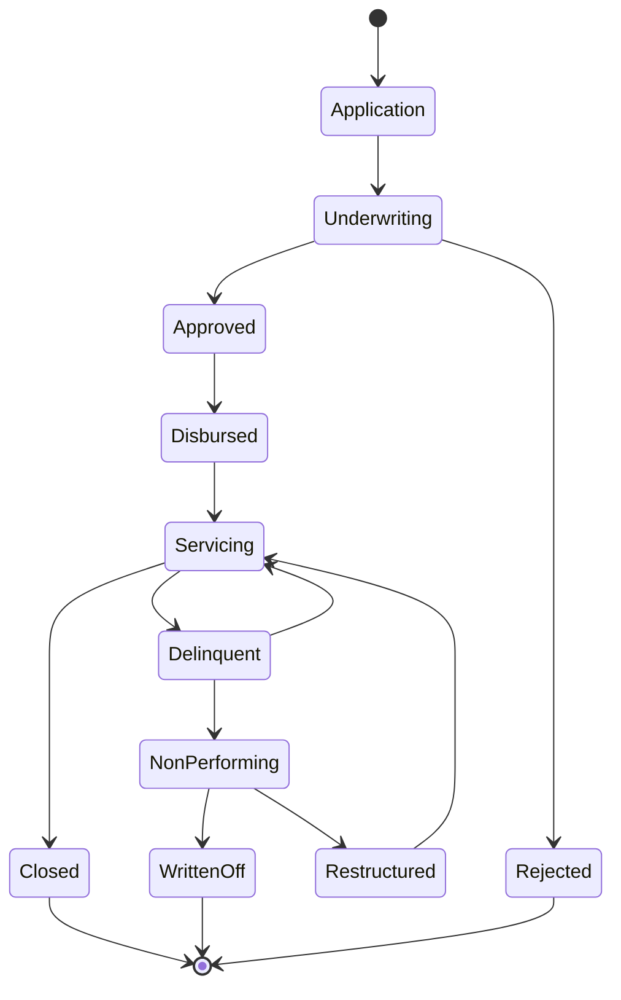
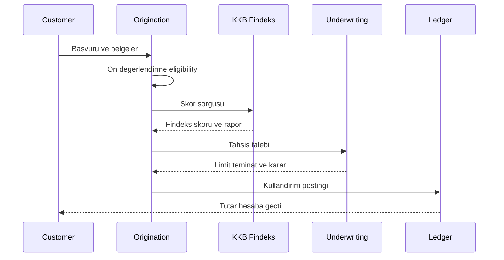
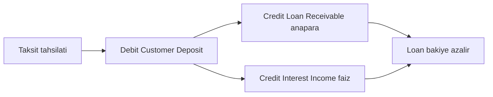
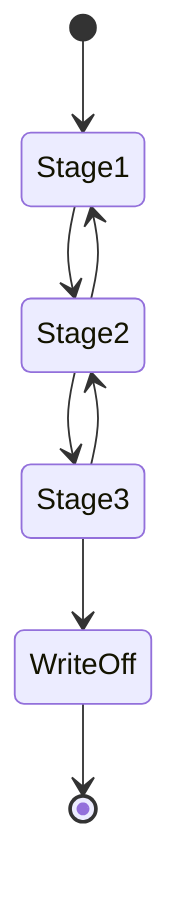

# Topic 10.8 — Lending & Credit: Kredi Yaşam Döngüsü

```admonish info title="Bu bölümde"
- Kredi türleri (ihtiyaç, konut, taşıt, KOBİ, ticari, rotatif) ve teminatlı/teminatsız ayrımının backend'e ne dayattığı
- Kredi yaşam döngüsünün bir state machine olarak modellenmesi: origination → underwriting → disbursement → servicing → closure/NPL
- Skorlama (KKB/Findeks, application vs behavioral), underwriting (limit, DTI, teminat, kefil) ve kullandırımın double-entry posting'i
- Geri ödeme planı (annuity vs eşit anapara), TR vergi katmanı (BSMV/KKDF), erken kapama ve faiz iadesi
- Gecikme → DPD → IFRS 9 Stage 1/2/3 → karşılık (ECL), tahsilat, yeniden yapılandırma, write-off/recovery ve BDDK sınıflandırması
```

## Hedef

Bir kredinin doğduğu andan (başvuru) kapandığı ana (tam ödeme veya aktiften silme) kadar geçen tüm yaşam döngüsünü backend perspektifinden kavramak: origination, skorlama, underwriting, kullandırım, servicing, gecikme, NPL, tahsilat ve write-off. Amaç ürün broşürü ezberlemek değil — her fazın hangi domain nesnesine, hangi double-entry kaydına, hangi regülasyona ve hangi risk hesabına karşılık geldiğini görmek. Bir "kredi" kelimesinin ardında yatan state machine'i ve para izini eksiksiz kurabilmek.

## Süre

Okuma: 2.5 saat • Kendini Sına: 45 dk • Pratik (opsiyonel): 4-5 saat • Toplam: ~3.5 saat (+ pratik)

## Önbilgi

- Topic 10.1 (Double-entry) bitti — journal entry, `Sum(debit) = Sum(credit)` invariant'ı ve immutable ledger biliyorsun
- Topic 10.5 (FX & Interest) bitti — French amortization, day count, BSMV/KKDF ve günlük faiz tahakkuku
- Topic 10.6 (Regulatory) bitti — BDDK, KKB, MASAK ve retention yükümlülükleri
- BigDecimal money handling (HALF_EVEN rounding) ve `@Transactional` (ACID)

---

## Kavramlar

### 1. Kredi türleri — teminatlı vs teminatsız

Bir kredinin türü, riskini ve dolayısıyla tüm underwriting sürecini belirler; bu yüzden her şey türle başlar.

**Kredi (loan/credit)**, bankanın müşteriye belirli bir vade ve faizle kullandırdığı, geri ödeme yükümlülüğü doğuran para tahsisidir. TR bankacılığında sık gördüğün türler:

| Tür | İngilizce | Teminat | Tipik vade |
|---|---|---|---|
| **İhtiyaç kredisi** | consumer/personal loan | teminatsız | 3-36 ay |
| **Konut kredisi** | mortgage | ipotek (teminatlı) | 60-120 ay |
| **Taşıt kredisi** | auto loan | araç rehni (teminatlı) | 12-48 ay |
| **KOBİ kredisi** | SME loan | çeşitli (kısmi teminat) | değişken |
| **Ticari kredi** | commercial loan | teminatlı/rotatif | değişken |
| **Rotatif / spot** | revolving / spot | genelde teminatsız | rotatif |

En kritik ayrım **teminatlı (secured)** ile **teminatsız (unsecured)** arasındadır. Teminatlıda geri ödenmezse banka teminata (ipotek, araç rehni) başvurur; teminatsızda ise tek güvence müşterinin kredi değerliliğidir, bu yüzden faiz daha yüksek ve underwriting daha sıkıdır.

Tuzak: "rotatif kredi" ile "taksitli kredi"yi karıştırma. Rotatif/spot (kredili mevduat hesabı, ticari rotatif) sabit taksit planı üretmez — limit dahilinde çekilir, kullanıldığı gün üzerinden faiz işler. Taksitli kredi ise baştan bir geri ödeme planı doğurur (Kavram 7).

### 2. Kredi yaşam döngüsü — bir state machine

Bir kredi rastgele değil, iyi tanımlı durumlar arasında yalnızca izinli geçişlerle ilerler; bunu bir state machine olarak modellemek tüm sistemin belkemiğidir.

Yaşam döngüsünün ana durumları: **origination** (başvuru), **underwriting** (değerlendirme/tahsis), **disbursement** (kullandırım), **servicing** (işleyen kredi), ve sonunda ya **closure** (tam ödeme ile kapanış) ya da gecikme üzerinden **NPL** (donuk alacak) ve **write-off**.



Bu modelin gücü, izinsiz geçişleri baştan yasaklamasıdır: `Rejected` bir kredi `Disbursed` olamaz, `Closed` bir kredi tekrar `Delinquent` olamaz. Her geçiş bir domain event üretir (`LoanDisbursed`, `LoanDelinquent`, `LoanWrittenOff`) ve genelde bir ledger posting'i tetikler.

```admonish tip title="Neden state machine"
Kredi durumunu bir string kolonda (`status`) tutup her yerde `if` ile kontrol etmek yerine, izinli geçişleri tek yerde tanımla. Böylece "kapanmış krediye gecikme faizi işledi" gibi bug'lar tasarım seviyesinde imkansızlaşır. Her geçiş loglanır ve audit trail'e (Topic 10.6) yazılır — regülatör "bu kredi ne zaman NPL oldu" diye sorduğunda cevabın hazır olur.
```

### 3. Başvuru (origination) — kanal, veri, ön değerlendirme

Kredi süreci, müşterinin bir kanaldan başvurup verisini bankaya vermesiyle başlar; buradaki hız ve doğruluk tüm huniyi etkiler.

**Origination**, başvurunun alınıp bir `LoanApplication` nesnesine dönüştürüldüğü fazdır. Başlıca kanallar: şube, mobil, internet bankacılığı, çağrı merkezi ve giderek artan oranda tamamen dijital anlık kredi akışları.

Toplanan veri üç kümeye ayrılır: kimlik/demografik (TCKN, gelir beyanı), talep (tutar, vade, ürün) ve türetilmiş (KKB skoru, mevcut banka ilişkisi). Bu aşamada bir **ön değerlendirme (pre-screening / eligibility)** çalışır: yaş, TCKN doğrulama, kara liste/MASAK sanctions kontrolü, minimum gelir gibi hard-knock kurallar. Ön elemeyi geçemeyen başvuru daha pahalı skorlama sorgusuna hiç gitmez.

Aşağıda origination'dan kullandırıma kadar uçtan uca akışı bir sequence olarak gör:



Tuzak: KKB sorgusu ücretli ve loglanan bir dış çağrıdır. Her sayfa yenilemesinde tekrar sorgulama — hem maliyet hem gereksiz sorgu müşterinin kredi geçmişini kirletir. Sonucu başvuru bazında cache'le (Topic 10.6 KKB cache stratejisi).

### 4. Kredi skorlama — KKB/Findeks, application vs behavioral

Krediyi vermeden önce "bu müşteri geri öder mi" sorusuna sayısal bir cevap gerekir; skorlama tam olarak bunu üretir.

TR'de dış referans **KKB (Kredi Kayıt Bürosu)** tarafından üretilen **Findeks kredi notudur** (1-1900 aralığı; yüksek = düşük risk). Findeks, müşterinin tüm bankalardaki kredi/kart geçmişini, gecikmelerini ve mevcut borçluluğunu özetler.

Skorlama iki temel türe ayrılır:

- **Application scoring** — başvuru anında, henüz müşteri değilken/yeni ürün için; ağırlıklı olarak dış veri (Findeks) ve beyan kullanılır.
- **Behavioral scoring** — mevcut müşterinin bankadaki davranışına (maaş yatması, bakiye, ödeme düzeni) dayanır; limit artışı ve rotatif yenilemede kullanılır.

Banka bunların üzerine kendi **internal scorecard**'ını kurar: değişkenleri puanlara çeviren, regülatöre açıklanabilir (explainable) bir model. Çıktı üç kararlı bir eşiğe bağlanır — **approve / refer / reject** (onay / manuel incelemeye yönlendir / ret).

```admonish warning title="Skor bir karar değil, girdidir"
Findeks skorunu tek başına "otomatik onay" tetikleyicisi yapma. Skor yüksek olsa bile borç/gelir oranı taşıyorsa, teminat yetersizse veya MASAK bayrağı varsa kredi reddedilmeli. Skor, underwriting'in girdilerinden biridir; kararın kendisi değildir. Ayrıca "refer" kararı için bir insan (kredi tahsis uzmanı) sürecin içinde kalmalı.
```

### 5. Underwriting & tahsis — limit, DTI, teminat, kefil

Skor ham risktir; underwriting bunu somut bir limite, teminata ve koşula çeviren fazdır.

**Underwriting (tahsis)**, başvurunun onaylanıp onaylanmayacağına ve hangi tutar/koşulla onaylanacağına karar verilen fazdır. Dört ana kaldıraç:

**1) Limit belirleme.** Müşteriye ne kadar kullandırılacağı; talep edilen tutar, gelir ve mevcut borçlulukla sınırlanır.

**2) Borç/gelir oranı (DTI, debt-to-income; borç servis oranı DSR).** Aylık toplam borç ödemesinin gelire oranı. Yüksek DTI, skor iyi olsa bile ret sebebidir — müşteri "ödeyebilir" olmalı, sadece "geçmişi temiz" değil.

**3) Teminat (collateral).** Teminatlı kredide bankanın güvencesi: konutta **ipotek (mortgage lien)**, taşıtta **araç rehni**, ticaride nakit/menkul rehni. Teminatın değeri ve LTV (loan-to-value) oranı limitin üst sınırını çizer.

**4) Kefil (guarantor).** Borçlu ödemezse sorumluluğu üstlenen üçüncü kişi; teminatı güçlendirir.

Tuzak: teminat değerini kullandırım anında dondurma. Konut/araç değeri zamanla değişir; NPL anında teminatın güncel değeri (recovery için) yeniden ekspertiz gerektirir. Kullandırımdaki ekspertiz değeri, üç yıl sonraki tahsilatı garanti etmez.

### 6. Kullandırım (disbursement) — double-entry posting

Onay soyut bir karardır; kullandırım ise paranın gerçekten müşteriye geçtiği ve defterin ilk kez hareket ettiği andır.

**Disbursement (kullandırım)**, onaylanan tutarın müşterinin mevduat hesabına aktarılmasıdır. Bu, kredinin ilk double-entry kaydıdır (Topic 10.1). Banka perspektifinden müşteriye kullandırılan kredi bir **asset** (loan receivable — banka alacaklı), müşterinin mevduatı ise bir **liability**'dir.

```
Müşteri A'ya 100.000 TL ihtiyaç kredisi kullandırımı:

Journal entry — Loan disbursement
  Debit:  Loan Receivable A (1201-A)      100.000,00 TL   (asset artar)
  Credit: Customer A Deposit (2101-A)     100.000,00 TL   (liability artar)
```

<mark>Kullandırımda loan receivable (asset) debit, customer deposit (liability) credit yazılır; ikisi aynı anda artar ve denge korunur</mark>. Müşteri parayı çekip harcadıkça deposit azalır ama loan receivable (borç) aynen durur — borç ancak geri ödeme ile azalır (Kavram 7).

Geri ödemede akış terstir: müşteri taksit öder, mevduatı azalır, kredi anaparası azalır ve faiz gelir olarak tanınır:



```admonish tip title="Masraf ve komisyon aynı journal'da"
Kullandırımda dosya masrafı/tahsis ücreti varsa aynı atomic journal'a ek satır olarak girer: müşteri deposit debit, fee income (4200) credit. Ayrı transaction'da postlama — kullandırım ve masrafın tek bir dengeli journal olması reconciliation'ı (Topic 10.7) basitleştirir. BSMV gibi vergiler de burada tanınır (Kavram 8).
```

### 7. Geri ödeme planı — annuity vs eşit anapara

Kullandırım anında kredinin geleceği bir tabloya dökülür: hangi ay ne kadar ödenecek; bu tablo hem müşterinin hem defterin yol haritasıdır.

**Repayment schedule (geri ödeme planı / itfa tablosu)**, kullandırım anında üretilen, her taksitin tarihi, tutarı ve faiz–anapara ayrışmasını içeren tablodur. TR tüketici kredilerinde standart yöntem **annuity (eşit taksit / French amortization)**: her ay ödenen taksit tutarı sabittir, ama içindeki faiz payı azalıp anapara payı artar.

Eşit taksit formülü (Topic 10.5'te türetildi):

```
Taksit = P * i * (1+i)^n / ((1+i)^n - 1)

P = anapara, i = aylık faiz, n = taksit sayısı
```

Alternatif **eşit anapara (equal principal)**: her ay anapara sabit ödenir, faiz azalan bakiye üzerinden hesaplandığı için toplam taksit ay ay düşer. TR'de daha çok ticari/KOBİ kredilerinde görülür.

Tuzak: son taksitte **kuruş artığı (residual)**. HALF_EVEN yuvarlamayla üretilen taksitlerin toplamı, anapara + toplam faize tam oturmayabilir; birkaç kuruşluk fark son taksite eklenerek plan sıfıra kapatılır (Topic 10.5). Bu düzeltmeyi atlarsan kredi hiç "tam kapanmaz", bakiyede kalıntı kalır.

<details>
<summary>Tam kod: annuity plan üretimi (~30 satır)</summary>

```java
public List<Installment> generateSchedule(
        BigDecimal principal, BigDecimal monthlyRate, int termMonths, LocalDate firstDue) {

    // Eşit taksit tutarı
    BigDecimal onePlusI = BigDecimal.ONE.add(monthlyRate);
    BigDecimal pow = onePlusI.pow(termMonths);
    BigDecimal payment = principal
        .multiply(monthlyRate).multiply(pow)
        .divide(pow.subtract(BigDecimal.ONE), 2, RoundingMode.HALF_EVEN);

    List<Installment> schedule = new ArrayList<>();
    BigDecimal remaining = principal;

    for (int k = 1; k <= termMonths; k++) {
        BigDecimal interest = remaining.multiply(monthlyRate)
            .setScale(2, RoundingMode.HALF_EVEN);
        BigDecimal principalPart = payment.subtract(interest);

        if (k == termMonths) {                 // son taksit: artığı temizle
            principalPart = remaining;
            payment = principalPart.add(interest);
        }
        remaining = remaining.subtract(principalPart);
        schedule.add(new Installment(k, firstDue.plusMonths(k - 1),
            payment, principalPart, interest, remaining));
    }
    return schedule;
}
```

</details>

### 8. Faiz + vergiler — akdi faiz, BSMV, KKDF, azami oran

Müşteriye gösterilen taksit sadece faizden ibaret değildir; TR'de faizin üzerine yasal vergiler biner ve toplam maliyeti belirler.

**Akdi faiz (contractual interest)**, sözleşmede yer alan aylık/yıllık faiz oranıdır. Ama TR tüketici kredisinde müşterinin gerçekte ödediği maliyet iki vergiyi de içerir (Topic 10.5):

- **BSMV (Banka ve Sigorta Muameleleri Vergisi)** — faiz tutarı üzerinden alınır (tüketici kredilerinde standart oran %5).
- **KKDF (Kaynak Kullanımını Destekleme Fonu)** — tüketici kredilerinde faiz üzerinden alınan fon kesintisi (%15). Ticari kredide ve konut kredisinde KKDF uygulanmaz — ürün türü vergiyi belirler.

Bu yüzden müşteriye **yıllık maliyet oranı (YMO / APR)** gösterilir: akdi faiz + BSMV + KKDF + masrafların dahil edildiği efektif oran. Müşteri "faiz %X" görse de ödediği YMO daha yüksektir.

Ayrıca bir tavan vardır: **azami faiz oranı**. TCMB/BDDK, özellikle kredi kartı ve KMH'de azami akdi ve gecikme faiz oranlarını periyodik ilan eder; banka bunun üzerinde faiz uygulayamaz.

```admonish warning title="Vergiyi ledger'da ayır"
Faiz gelirini (interest income) ve tahsil edip devlete aktaracağın BSMV/KKDF'yi asla tek kaleme yazma. BSMV ve KKDF banka geliri değildir — geçici bir yükümlülüktür (liability), sonra vergi dairesine/fona ödenir. Journal'da faiz income (revenue) ile BSMV/KKDF payable (liability) ayrı satırlar olmalı; aksi halde gelir tablon şişer ve vergi mutabakatın (Topic 10.7) tutmaz.
```

### 9. Erken kapama & ara ödeme — faiz iadesi

Müşteri her zaman planın sonuna kadar beklemez; erken ödeme hem müşteri hakkı hem de faizin yeniden hesaplanmasını gerektiren bir olaydır.

**Erken kapama (early repayment)**, müşterinin kalan borcun tamamını vadeden önce ödemesidir; **ara ödeme (partial prepayment)** ise bir kısmını erken kapatıp planı yeniden kurmaktır.

Kritik nokta **faiz iadesi (interest rebate)**: müşteri sadece parayı kullandığı süreye kadarki faizi öder. Erken kapamada, henüz tahakkuk etmemiş (gelecek taksitlerdeki) faiz tahsil edilmez — kalan anapara + o güne kadarki işlemiş faiz alınır. TR mevzuatı bunu tüketici lehine zorunlu tutar.

Ara ödemede plan **yeniden düzenlenir (re-amortization)**: kalan anapara üzerinden ya taksit tutarı düşürülür ya vade kısaltılır; müşteri seçebilir. Yeni bir `RepaymentSchedule` üretilir, eskisi tarihçe olarak saklanır.

Tuzak: erken kapamada erken ödeme ücreti (early repayment fee) uygularken mevzuat tavanını aşma. TR'de tüketici kredilerinde erken ödeme tazminatı sınırlıdır (kalan vadeye göre kalan anaparanın belirli bir yüzdesiyle sınırlı). Sınırı geçen ücret hem yasal risk hem itibar riskidir.

### 10. Gecikme & NPL — DPD, IFRS 9 Stage 1/2/3, karşılık

Krediler her zaman düzgün ödenmez; ödeme geciktiği andan itibaren kredi risk sınıfları arasında kaymaya başlar ve banka karşılık ayırmak zorunda kalır.

**DPD (days past due / gecikme günü)**, vadesi geçmiş taksitin kaç gün ödenmediğidir. Gecikme eşikleri risk sınıflandırmasını tetikler: 1-29, 30-59, 60-89 ve **90+ gün**. 90 günü aşan gecikme, kredinin **NPL (non-performing loan / donuk alacak)** sayılmasının uluslararası eşiğidir.

IFRS 9, krediyi beklenen kredi zararına (ECL) göre üç aşamaya (stage) böler:

- **Stage 1** — performing (sağlıklı). 12 aylık beklenen kredi zararı (12-month ECL) kadar karşılık.
- **Stage 2** — kredi riskinde önemli artış (SICR, ~30 DPD veya risk sinyali). Ömür boyu (lifetime) ECL kadar karşılık.
- **Stage 3** — credit-impaired (~90 DPD, NPL). Ömür boyu ECL, gelir tahakkuku durur (non-accrual).



<mark>90 günü aşan gecikme krediyi NPL (donuk alacak) yapar ve IFRS 9 Stage 3'e düşürür; bu aşamada faiz geliri tahakkuku durur</mark>. **ECL (expected credit loss / beklenen kredi zararı)** = PD × LGD × EAD (temerrüt olasılığı × temerrüt halinde kayıp oranı × temerrüt anındaki risk bakiyesi). Ayrılan karşılık (provision) bir gider (expense) olarak gelir tablosuna yansır.

```admonish warning title="Stage geçişi geri dönebilir ama simetrik değil"
Stage 2'ye düşen kredi düzelirse (cure) Stage 1'e dönebilir, ama regülatör bunun için gözlem süresi (probation) bekler — bir taksit ödendi diye anında sağlıklıya dönmez. Stage 3'ten çıkış daha da zordur. Bu "yapışkanlığı" state machine'inde modelle; aksi halde tek ödemeyle karşılığı serbest bırakıp bilançoyu yanlış gösterirsin.
```

### 11. Tahsilat (collections) — hatırlatma, yeniden yapılandırma, yasal takip

Kredi geciktiğinde banka pasif kalmaz; gecikmenin derinliğine göre giderek sertleşen bir tahsilat huniye girer.

**Collections (tahsilat)**, geciken alacağı geri kazanmak için yürütülen kademeli süreçtir. Kabaca üç kademe:

- **Erken tahsilat (soft collection)** — SMS/arama ile hatırlatma, ödeme kolaylığı; genelde 1-90 gün arası.
- **Yeniden yapılandırma (restructuring)** — müşteri ödeyemiyorsa borcun vadesi uzatılır, taksiti düşürülür veya faiz revize edilir. Yeni bir sözleşme ve plan doğar; eski borç kapanır (Kavram 9 re-amortization'a benzer ama risk sınıfı korunur).
- **Yasal takip (legal follow-up / enforcement)** — 90+ gün ve çözümsüz durumda icra/hukuki süreç, teminatlıda teminatın paraya çevrilmesi.

Tuzak: yeniden yapılandırmayı "iyileşme" gibi göstermek. Yapılandırılan bir NPL, yeni ödemeler düzenli gelene ve gözlem süresi dolana kadar risk sınıfını korur (forbearance). Yapılandırdım diye krediyi hemen Stage 1'e almak, karşılığı erken serbest bırakır ve regülatör denetiminde bulgu üretir.

### 12. Write-off (aktiften silme) & recovery

Bazı alacaklar tahsil edilemez hale gelir; write-off bu gerçeği muhasebeleştirir ama alacağın hukuken bittiği anlamına gelmez.

**Write-off (aktiften silme)**, tahsil kabiliyeti kalmamış bir alacağın bilançodan çıkarılmasıdır. Daha önce ayrılan karşılık (provision) kullanılarak loan receivable sıfırlanır:

```
Tamamı karşılık ayrılmış 100.000 TL kredinin write-off'u:

Journal entry — Write-off
  Debit:  Loan Loss Provision (2xxx contra)   100.000,00 TL
  Credit: Loan Receivable A (1201-A)          100.000,00 TL
```

<mark>Write-off yalnızca muhasebe kaydıdır; alacak hukuken silinmez, banka takibe ve tahsilata devam eder</mark>. Daha sonra bir kısmı tahsil edilirse buna **recovery (tahsilat sonrası geri kazanım)** denir ve gelir olarak tanınır:

```
Write-off sonrası 20.000 TL recovery:

Journal entry — Recovery
  Debit:  Customer Deposit / Cash              20.000,00 TL
  Credit: Recovery Income (4xxx)               20.000,00 TL
```

Tuzak: write-off ile faiz iadesini karıştırma. Write-off bankanın zararı kabul etmesidir (provision'dan mahsup); recovery ise beklenmedik geri dönüştür. İkisi ayrı ledger hesaplarında izlenir, aksi halde gerçek zarar oranın (net charge-off) yanlış çıkar.

### 13. Kredi domain modeli — aggregate ve ledger entegrasyonu

Tüm bu fazları tutarlı tutmak için, kredinin kendi kurallarını koruyan net bir domain modeli gerekir; dağınık tablolar yerine bir aggregate.

Kredi domaininde dört ana nesne bulunur: başvuru (`LoanApplication`), kredinin kendisi (`Loan` aggregate root), geri ödeme planı (`RepaymentSchedule` / `Installment`) ve muhasebe hesabı (`LoanAccount` — Topic 10.1 ledger'ıyla bağlanan).

```java
public class Loan {                       // aggregate root
    private LoanId id;
    private CustomerId customerId;
    private LoanType type;                 // CONSUMER, MORTGAGE, AUTO, SME...
    private Money principal;
    private BigDecimal annualRate;
    private int termMonths;
    private LoanStatus status;             // state machine (Kavram 2)
    private RepaymentSchedule schedule;
    private LoanAccountId ledgerAccountId; // double-entry hesabı
    private int daysPastDue;              // DPD (Kavram 10)
    private IfrsStage stage;              // STAGE_1 / STAGE_2 / STAGE_3
}
```

Durum geçişleri aggregate içinde korunur — izinsiz geçiş exception fırlatır:

```java
public void disburse(LedgerService ledger) {
    if (status != LoanStatus.APPROVED)
        throw new IllegalLoanTransition("Only APPROVED loan can be disbursed");

    ledger.post(JournalEntryRequest.builder()
        .description("Loan disbursement " + id)
        .referenceType("LOAN_DISBURSE").referenceId(id.value())
        .entry(debit(ledgerAccountId, principal))          // loan receivable ↑
        .entry(credit(customerDepositId, principal))       // customer deposit ↑
        .build());

    this.status = LoanStatus.DISBURSED;
    raise(new LoanDisbursed(id, principal, Instant.now()));
}
```

Şema tarafında `loan`, `installment` ve `loan_status_history` tabloları; ledger tarafı Topic 10.1'deki `journal_entry`/`ledger_entry`'ye `reference_type='LOAN_*'` ile bağlanır.

<details>
<summary>Tam kod: loan + installment şeması (~35 satır)</summary>

```sql
CREATE TABLE loan (
    id              UUID PRIMARY KEY,
    customer_id     UUID NOT NULL,
    loan_type       VARCHAR(20) NOT NULL,
    principal       NUMERIC(19,4) NOT NULL,
    annual_rate     NUMERIC(9,6) NOT NULL,
    term_months     INT NOT NULL,
    status          VARCHAR(20) NOT NULL,      -- state machine
    ifrs_stage      VARCHAR(10) NOT NULL DEFAULT 'STAGE_1',
    days_past_due   INT NOT NULL DEFAULT 0,
    ledger_account_id BIGINT NOT NULL,          -- FK to account (Topic 10.1)
    disbursed_at    TIMESTAMPTZ,
    closed_at       TIMESTAMPTZ,
    CHECK (principal > 0 AND term_months > 0)
);

CREATE TABLE installment (
    id              BIGSERIAL PRIMARY KEY,
    loan_id         UUID REFERENCES loan(id) NOT NULL,
    seq_no          INT NOT NULL,
    due_date        DATE NOT NULL,
    total_amount    NUMERIC(19,4) NOT NULL,
    principal_part  NUMERIC(19,4) NOT NULL,
    interest_part   NUMERIC(19,4) NOT NULL,
    remaining       NUMERIC(19,4) NOT NULL,
    paid_at         TIMESTAMPTZ,
    UNIQUE (loan_id, seq_no)
);

CREATE TABLE loan_status_history (
    id          BIGSERIAL PRIMARY KEY,
    loan_id     UUID REFERENCES loan(id) NOT NULL,
    from_status VARCHAR(20),
    to_status   VARCHAR(20) NOT NULL,
    changed_at  TIMESTAMPTZ NOT NULL,
    reason      TEXT
);

CREATE INDEX idx_installment_due ON installment(loan_id, due_date);
CREATE INDEX idx_loan_status ON loan(status, ifrs_stage);
```

</details>

### 14. Regülasyon — BDDK sınıflandırma & KKB bildirimi

Kredi tamamen banka içi bir konu değildir; BDDK nasıl sınıflandıracağını ve ne kadar karşılık ayıracağını, KKB de kimi bildireceğini zorunlu kılar.

**BDDK kredi sınıflandırma ve karşılık yönetmeliği**, kredileri risk düzeyine göre beş gruba ayırır:

| Grup | Ad | Durum | Karşılık |
|---|---|---|---|
| **1. Grup** | Standart | sağlıklı | genel karşılık |
| **2. Grup** | Yakın izleme | risk artışı | genel/özel |
| **3. Grup** | Tahsil imkanı sınırlı | NPL başlangıç | özel karşılık |
| **4. Grup** | Tahsili şüpheli | NPL | yüksek özel |
| **5. Grup** | Zarar | tahsil edilemez | tam karşılık |

3., 4. ve 5. gruplar **donuk alacak (NPL)** sayılır. Bu BDDK sınıflandırması, IFRS 9 stage'leriyle (Kavram 10) örtüşür ama birebir aynı değildir — banka her iki çerçeveyi de raporlar.

Ayrıca **KKB bildirimi**: bankalar kullandırdıkları kredileri, limitlerini, gecikmelerini ve kapanışlarını düzenli olarak KKB'ye bildirir (Topic 10.6). Senin bir müşterine kullandırdığın kredi, başka bankanın Findeks sorgusunda görünür — sistem karşılıklıdır. Gecikme ve NPL bildirimi, müşterinin tüm sektördeki kredi erişimini etkiler.

Tuzak: karşılık hesabını (provision) yalnızca defter içi bir gider gibi görme. BDDK karşılık oranları sermaye yeterliliğini (CAR, Topic 10.6 Basel III) doğrudan etkiler; yanlış sınıflandırma hem eksik karşılık (regülatör cezası) hem fazla karşılık (gereksiz sermaye bağlama) riskidir.

### 15. Lending anti-pattern'leri

Mülakatta "bu kredi tasarımında ne yanlış?" sorusunun cephaneliği; production'da para ve regülatör bulgusu üreten klasik hatalar.

**Anti-pattern 1: Kredi durumunu serbest string'de tutmak** — `status` kolonuna her yerden `if` ile yazmak. State machine yok → "kapalı krediye faiz işledi" tarzı geçersiz geçişler sızar.

**Anti-pattern 2: Kullandırımı ve geri ödemeyi direct balance UPDATE ile yapmak** — double-entry (Topic 10.1) yerine `UPDATE loan SET balance = ...`. Audit ve mutabakat imkansız.

**Anti-pattern 3: Faiz ve vergiyi tek kaleme yazmak** — BSMV/KKDF'yi interest income'a katmak. Gelir şişer, vergi mutabakatı tutmaz (Kavram 8).

**Anti-pattern 4: Floating point money** — taksit/faiz hesabında `double`. Kuruş kayması; **BigDecimal HALF_EVEN** zorunlu (Topic 10.5).

**Anti-pattern 5: Son taksit artığını temizlememek** — yuvarlama farkı yüzünden kredi tam kapanmaz, bakiyede kalıntı kalır (Kavram 7).

**Anti-pattern 6: Findeks skorunu tek başına otomatik onay yapmak** — DTI, teminat, MASAK'ı atlamak (Kavram 4). Skor girdidir, karar değil.

**Anti-pattern 7: KKB sorgusunu cache'lememek** — her sayfa yenilemede tekrar sorgu; maliyet + müşterinin sorgu geçmişini kirletme (Kavram 3).

**Anti-pattern 8: Stage geçişini simetrik saymak** — tek ödemeyle NPL'i Stage 1'e döndürüp karşılığı erken serbest bırakmak (Kavram 10, forbearance).

**Anti-pattern 9: Yeniden yapılandırmayı iyileşme gibi göstermek** — restructuring sonrası risk sınıfını hemen düşürmek; regülatör bulgusu (Kavram 11).

**Anti-pattern 10: Write-off'u alacağın bittiği sanmak** — takibi ve recovery izlemeyi durdurmak; net charge-off yanlış çıkar (Kavram 12).

---

## Önemli olabilecek araştırma kaynakları

- BDDK — Kredilerin Sınıflandırılması ve Karşılıklar Yönetmeliği
- IFRS 9 / TFRS 9 — Financial Instruments (expected credit loss modeli)
- KKB / Findeks — kredi notu ve bildirim dokümantasyonu
- TCMB — azami akdi ve gecikme faiz oranı duyuruları
- Tüketicinin Korunması Hakkında Kanun (6502) — erken ödeme, faiz iadesi
- Basel Committee — Credit Risk (PD/LGD/EAD, IRB) çerçevesi

---

## Kendini Sına

Aşağıdaki soruları önce **cevaba bakmadan** kendi cümlelerinle yanıtlamayı dene — hepsi TR bank mülakatlarında karşına çıkabilecek tarzda. Takıldığında ilgili Kavramlar başlığına dön, sonra tekrar dene.

**S1. Kredi yaşam döngüsünü bir state machine olarak modellemenin somut faydası nedir?**

<details>
<summary>Cevabı göster</summary>

Kredi durumunu string bir kolonda tutup her yerden `if` ile kontrol etmek yerine, izinli durum geçişlerini tek yerde tanımlarsın: örneğin `Rejected` bir kredi asla `Disbursed` olamaz, `Closed` bir kredi tekrar `Delinquent` olamaz. Böylece "kapanmış krediye gecikme faizi işledi" gibi geçersiz-geçiş bug'ları tasarım seviyesinde imkansızlaşır. Her geçiş bir domain event üretir (`LoanDisbursed`, `LoanDelinquent`) ve genelde bir ledger posting'i ile audit trail kaydı tetikler; bu da regülatörün "bu kredi ne zaman NPL oldu" sorusuna hazır cevap verir.

</details>

**S2. Müşteriye kredi kullandırıldığında double-entry kaydı nasıl olur ve neden loan receivable bir asset'tir?**

<details>
<summary>Cevabı göster</summary>

Kullandırımda loan receivable (asset — banka artık müşteriden alacaklı) debit ile artar, müşterinin mevduat hesabı (liability — banka müşteriye borçlu) credit ile artar; ikisi aynı anda arttığı için denge korunur (`Sum(debit) = Sum(credit)`). Loan receivable asset'tir çünkü kredi bankanın müşteriden tahsil edeceği bir alacaktır; mevduat ise liability'dir çünkü müşteri o parayı çekme hakkına sahiptir. Müşteri parayı harcadıkça deposit azalır ama borç (receivable) aynen durur — borç ancak geri ödeme ile azalır.

</details>

**S3. Annuity (eşit taksit) ile eşit anapara planı arasındaki fark nedir? TR'de hangisi nerede kullanılır?**

<details>
<summary>Cevabı göster</summary>

Annuity/French amortization'da her ay ödenen taksit tutarı sabittir; ama içindeki faiz payı zamanla azalıp anapara payı artar (başta çoğunlukla faiz ödenir). Eşit anaparada ise her ay sabit anapara ödenir, faiz azalan bakiye üzerinden hesaplandığından toplam taksit ay ay düşer. TR tüketici kredilerinde standart annuity'dir (sabit taksit müşteri için öngörülebilir); eşit anapara daha çok ticari/KOBİ kredilerinde görülür. Her iki planda da son taksitte yuvarlama artığı (residual) son taksite eklenerek plan sıfıra kapatılır.

</details>

**S4. Müşteriye "faiz %X" denmesine rağmen ödediği maliyet neden daha yüksektir?**

<details>
<summary>Cevabı göster</summary>

Çünkü TR tüketici kredisinde akdi faizin üzerine yasal vergiler biner: BSMV (faiz üzerinden %5) ve tüketici kredilerinde KKDF (%15). Bu yüzden müşteriye yıllık maliyet oranı (YMO/APR) gösterilir — akdi faiz + BSMV + KKDF + masrafları içeren efektif orandır. Ticari kredide ve konut kredisinde KKDF uygulanmaz, dolayısıyla ürün türü toplam maliyeti değiştirir. Ayrıca ledger'da faiz income (revenue) ile BSMV/KKDF payable (liability) ayrı satırlarda tutulmalıdır; BSMV/KKDF banka geliri değil, devlete/fona aktarılacak geçici bir yükümlülüktür.

</details>

**S5. DPD nedir ve IFRS 9 Stage 1/2/3 ile nasıl ilişkilidir? 90 gün neden kritik?**

<details>
<summary>Cevabı göster</summary>

DPD (days past due), vadesi geçmiş taksitin kaç gün ödenmediğidir. IFRS 9 krediyi beklenen kredi zararına göre üçe böler: Stage 1 (performing, 12 aylık ECL), Stage 2 (kredi riskinde önemli artış/SICR, ~30 DPD, lifetime ECL), Stage 3 (credit-impaired, ~90 DPD, lifetime ECL ve faiz tahakkuku durur). 90 gün kritiktir çünkü 90 günü aşan gecikme kredinin NPL (donuk alacak) sayılmasının uluslararası eşiğidir ve krediyi Stage 3'e düşürür. ECL = PD × LGD × EAD ile hesaplanır ve ayrılan karşılık bir gider olarak gelir tablosuna yansır.

</details>

**S6. Erken kapamada faiz iadesi neden gerekir ve ara ödeme planı nasıl değişir?**

<details>
<summary>Cevabı göster</summary>

Müşteri parayı yalnızca kullandığı süre için faiz ödemek zorundadır; erken kapamada henüz tahakkuk etmemiş (gelecek taksitlerdeki) faiz tahsil edilmez, sadece kalan anapara + o güne kadar işlemiş faiz alınır. TR mevzuatı bunu tüketici lehine zorunlu tutar. Ara ödemede (partial prepayment) ise plan yeniden düzenlenir (re-amortization): kalan anapara üzerinden ya taksit tutarı düşürülür ya vade kısaltılır (müşteri seçer), yeni bir RepaymentSchedule üretilir ve eskisi tarihçe olarak saklanır. Erken ödeme ücreti uygulanacaksa mevzuat tavanı aşılmamalıdır.

</details>

**S7. Yeniden yapılandırma (restructuring) yapılan bir NPL neden hemen Stage 1'e alınamaz?**

<details>
<summary>Cevabı göster</summary>

Yeniden yapılandırma, müşteri ödeyemediği için vadeyi uzatan/taksiti düşüren bir çözümdür; bu "iyileşme" değil, forbearance (tahammül) durumudur. Yapılandırılan bir NPL, yeni ödemeler düzenli gelene ve regülatörün beklediği gözlem/probation süresi dolana kadar risk sınıfını korur. Hemen Stage 1'e almak ayrılmış karşılığı erken serbest bırakır, bilançoyu olduğundan sağlıklı gösterir ve BDDK denetiminde bulgu üretir. Stage geçişleri simetrik değildir — düşüş kolay, çıkış yapışkandır.

</details>

**S8. Write-off ile recovery arasındaki fark nedir? Write-off alacağın bittiği anlamına gelir mi?**

<details>
<summary>Cevabı göster</summary>

Write-off (aktiften silme), tahsil kabiliyeti kalmamış alacağın bilançodan çıkarılmasıdır — daha önce ayrılmış karşılık kullanılarak loan receivable sıfırlanır (provision debit, receivable credit). Ama bu yalnızca muhasebe kaydıdır; alacak hukuken silinmez, banka takibe ve tahsilata devam eder. Sonradan bir kısmı tahsil edilirse buna recovery denir ve gelir olarak tanınır (cash/deposit debit, recovery income credit). İkisi ayrı ledger hesaplarında izlenir; aksi halde bankanın gerçek zararı (net charge-off = write-off − recovery) yanlış hesaplanır.

</details>

---

## Tamamlama kriterleri

- [ ] Kredi türlerini (ihtiyaç, konut, taşıt, KOBİ, ticari, rotatif) ve teminatlı/teminatsız ayrımını açıklayabiliyorum
- [ ] Kredi yaşam döngüsünü bir state machine olarak (origination → underwriting → disbursement → servicing → closure/NPL) çizebiliyorum
- [ ] Skorlamayı (Findeks, application vs behavioral, internal scorecard) ve approve/refer/reject kararını anlatabiliyorum
- [ ] Underwriting kaldıraçlarını (limit, DTI, teminat, kefil) ve kullandırımın double-entry kaydını biliyorum
- [ ] Annuity vs eşit anapara planını, BSMV/KKDF vergi katmanını ve erken kapama faiz iadesini açıklayabiliyorum
- [ ] DPD, IFRS 9 Stage 1/2/3, ECL ve karşılık mantığını (90 gün NPL eşiği dahil) biliyorum
- [ ] Tahsilat kademelerini, yeniden yapılandırmayı, write-off ve recovery'yi ayırt edebiliyorum
- [ ] Kredi domain modelini (Loan aggregate, RepaymentSchedule, LoanAccount) ve BDDK sınıflandırma + KKB bildirimini anlatabiliyorum
- [ ] 10 lending anti-pattern'ini (serbest status, direct UPDATE, faiz-vergi tek kalem, float money, ...) tanıyorum
- [ ] (Opsiyonel) "Pratik yapmak istersen" bölümündeki modeli kurdum, Claude-verify prompt'uyla doğrulattım

---

## Defter notları (10 madde)

1. "Kredi türleri + teminatlı/teminatsız ayrımı underwriting'e etkisi: ____."
2. "Kredi yaşam döngüsü state machine (origination→...→NPL/write-off): ____."
3. "Skorlama Findeks + application vs behavioral + approve/refer/reject: ____."
4. "Underwriting kaldıraçları (limit, DTI, teminat/ipotek, kefil): ____."
5. "Kullandırım double-entry (loan receivable debit, deposit credit): ____."
6. "Annuity vs eşit anapara + son taksit artığı (Topic 10.5): ____."
7. "Faiz + BSMV/KKDF + YMO + azami oran, ledger'da vergi ayrımı: ____."
8. "DPD + IFRS 9 Stage 1/2/3 + ECL (PD×LGD×EAD) + karşılık: ____."
9. "Tahsilat kademeleri + restructuring forbearance + write-off/recovery: ____."
10. "BDDK 5 grup sınıflandırma + KKB bildirimi + anti-pattern'ler: ____."

```admonish success title="Bölüm Özeti"
- Kredi türü (teminatlı/teminatsız) tüm underwriting'i belirler; kredi yaşam döngüsü bir state machine'dir ve izinsiz geçişler tasarımla yasaklanır
- Skorlama (Findeks + internal scorecard) bir girdidir, karar değil; underwriting limit, DTI, teminat ve kefil ile somutlaşır
- Kullandırım ilk double-entry kaydıdır: loan receivable (asset) debit, customer deposit (liability) credit; geri ödemede anapara ve faiz ayrı tanınır
- TR maliyeti akdi faiz + BSMV + KKDF (YMO) ile oluşur; vergiler ledger'da ayrı liability olarak tutulur, erken kapamada faiz iadesi zorunludur
- Gecikme DPD ile ölçülür; 90+ gün NPL/Stage 3 demektir, ECL kadar karşılık ayrılır ve stage geçişleri simetrik değildir (forbearance)
- Write-off muhasebe kaydıdır, alacağı bitirmez; BDDK 5 grup sınıflandırması ve KKB bildirimi krediyi banka dışına bağlar
```

---

## Pratik yapmak istersen

Kavramları koda dökmek istersen aşağıdaki iki ek hazır: test yazma rehberi state machine geçişleri, kullandırım posting'i, annuity plan, erken kapama, DPD/stage geçişi ve write-off/recovery için örnek testler içerir; Claude-verify prompt'u ile yazdığın lending implementasyonunu banking-grade perspektiften denetletebilirsin. Loan aggregate + RepaymentSchedule + LoanAccount (Topic 10.1 ledger'ına bağlı) + servicing/NPL akışını kurup testleri yeşile çevirmek yaklaşık 4-5 saat sürer.

<details>
<summary>Test yazma rehberi</summary>

### Test 10.8.1 — Geçersiz durum geçişi reddi

```java
@Test
void shouldRejectDisburseOnRejectedLoan() {
    Loan loan = newLoan().withStatus(LoanStatus.REJECTED);

    assertThatThrownBy(() -> loan.disburse(ledgerService))
        .isInstanceOf(IllegalLoanTransition.class)
        .hasMessageContaining("APPROVED");
}
```

### Test 10.8.2 — Kullandırım posting'i dengeli

```java
@Test
@Transactional
void shouldPostBalancedDisbursement() {
    Loan loan = approvedLoan(customerA, "100000", "TRY");

    loan.disburse(ledgerService);

    assertThat(balanceService.balanceOf(loan.ledgerAccountId(), "TRY"))
        .isEqualByComparingTo("100000.00");                  // receivable ↑
    assertThat(balanceService.balanceOf(customerA, "TRY"))
        .isEqualByComparingTo("100000.00");                  // deposit ↑
    assertThat(loan.status()).isEqualTo(LoanStatus.DISBURSED);
}
```

### Test 10.8.3 — Annuity plan tutar ve kapanış

```java
@Test
void shouldGenerateBalancedAnnuitySchedule() {
    List<Installment> plan = scheduler.generateSchedule(
        new BigDecimal("12000"), new BigDecimal("0.03"), 12, LocalDate.now());

    assertThat(plan).hasSize(12);
    // Son taksit sonrası kalan anapara sıfır
    assertThat(plan.get(11).remaining()).isEqualByComparingTo("0.00");
    // Tüm anapara paylarının toplamı = principal
    BigDecimal totalPrincipal = plan.stream()
        .map(Installment::principalPart).reduce(ZERO, BigDecimal::add);
    assertThat(totalPrincipal).isEqualByComparingTo("12000.00");
}
```

### Test 10.8.4 — Erken kapama faiz iadesi

```java
@Test
@Transactional
void shouldChargeOnlyAccruedInterestOnEarlyPayoff() {
    Loan loan = disbursedLoan("100000", "0.03", 12);
    payInstallments(loan, 3);                     // 3 taksit ödendi

    PayoffQuote quote = loan.earlyPayoffQuote(LocalDate.now());

    // Gelecek taksitlerin faizi tahsil edilmez
    assertThat(quote.futureInterest()).isEqualByComparingTo("0.00");
    assertThat(quote.total()).isEqualByComparingTo(loan.remainingPrincipal()
        .add(quote.accruedInterest()));
}
```

### Test 10.8.5 — DPD ve stage geçişi

```java
@Test
void shouldMoveToStage3After90DaysPastDue() {
    Loan loan = disbursedLoan("100000", "0.03", 12);

    loan.applyDaysPastDue(35);
    assertThat(loan.stage()).isEqualTo(IfrsStage.STAGE_2);

    loan.applyDaysPastDue(95);
    assertThat(loan.stage()).isEqualTo(IfrsStage.STAGE_3);
    assertThat(loan.status()).isEqualTo(LoanStatus.NON_PERFORMING);
}
```

### Test 10.8.6 — Write-off provision'dan mahsup

```java
@Test
@Transactional
void shouldWriteOffAgainstProvision() {
    Loan loan = nonPerformingLoan("100000", fullyProvisioned());

    loan.writeOff(ledgerService, "Uncollectible");

    assertThat(balanceService.balanceOf(loan.ledgerAccountId(), "TRY"))
        .isEqualByComparingTo("0.00");            // receivable sıfırlandı
    assertThat(loan.status()).isEqualTo(LoanStatus.WRITTEN_OFF);
}
```

### Test 10.8.7 — Recovery gelir olarak tanınır

```java
@Test
@Transactional
void shouldRecogniseRecoveryAsIncome() {
    Loan loan = writtenOffLoan("100000");

    loan.recover(ledgerService, new BigDecimal("20000"));

    assertThat(balanceService.balanceOf(RECOVERY_INCOME, "TRY"))
        .isEqualByComparingTo("20000.00");
}
```

</details>

<details>
<summary>Claude-verify prompt</summary>

```
Lending & credit implementation'ımı banking-grade kriterlere göre değerlendir:

1. Kredi türleri & model:
   - LoanType (consumer/mortgage/auto/SME/commercial/revolving)?
   - Teminatlı/teminatsız ayrımı ve teminat (collateral) modeli?
   - Loan aggregate root, invariant'ları koruyor mu?

2. State machine:
   - Yaşam döngüsü durumları (application→...→closed/NPL/write-off)?
   - Geçersiz geçişler exception fırlatıyor mu?
   - Her geçiş status_history + domain event üretiyor mu?

3. Origination & scoring:
   - Ön değerlendirme (eligibility) hard-knock kuralları?
   - Findeks/KKB sorgusu cache'leniyor mu?
   - Application vs behavioral ayrımı, approve/refer/reject?

4. Underwriting:
   - Limit + DTI/DSR hesabı?
   - Teminat (LTV) ve kefil modeli?
   - Skor tek başına otomatik onay DEĞİL mi?

5. Disbursement:
   - Double-entry (loan receivable debit, deposit credit)?
   - Atomic journal (Topic 10.1)?
   - Masraf/BSMV aynı journal'da?

6. Repayment:
   - Annuity + eşit anapara desteği?
   - Son taksit artığı temizleniyor mu?
   - BigDecimal HALF_EVEN?
   - Anapara/faiz ayrı ledger satırı?

7. Vergi:
   - BSMV/KKDF ürün türüne göre?
   - Faiz income vs vergi payable ayrı liability?
   - YMO/APR hesabı?

8. Delinquency & IFRS 9:
   - DPD hesabı?
   - Stage 1/2/3 geçişleri (90 gün NPL)?
   - ECL (PD×LGD×EAD) ve provision?
   - Stage geçişi asimetrik (forbearance)?

9. Collections & closure:
   - Restructuring risk sınıfını koruyor mu?
   - Write-off provision'dan mahsup?
   - Recovery ayrı income hesabı?

10. Regülasyon:
    - BDDK 5 grup sınıflandırma?
    - KKB bildirimi?
    - Audit trail + retention (Topic 10.6)?

Her madde için PASS / FAIL / EKSIK işaretle.
```

</details>
