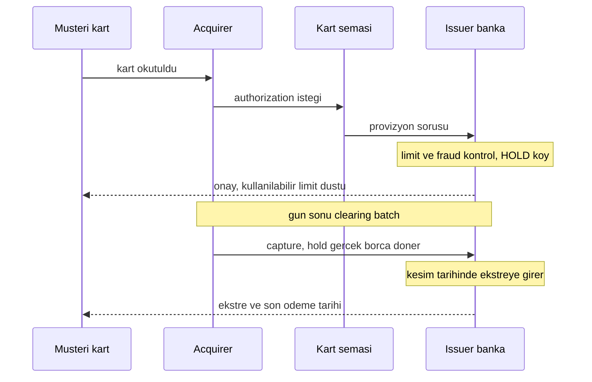
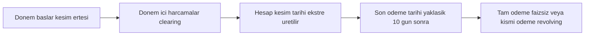
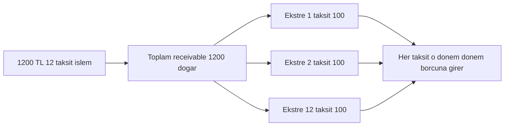
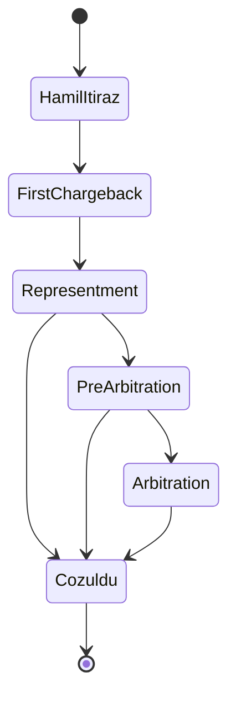

# Topic 10.9 — Card Products: Ekstre, Taksit, Chargeback, Revolving

```admonish info title="Bu bölümde"
- Kart *ürününün* anatomisi: debit / credit / prepaid / sanal / ticari kart farkı ve **issuing vs acquiring** tarafın ürün gözüyle ayrımı
- Bir işlemin **authorization hold → clearing → settlement → ekstre → ödeme** yaşam döngüsü ve `CardAccount` üzerinde kredi limitinin nasıl döndüğü
- Türkiye'ye özgü iki büyük konu: **taksitli işlem** (peşin fiyatına taksit, üye işyeri vs banka taksiti, BDDK sektör sınırları) ve **revolving** faiz (TCMB azami oranlar, asgari ödeme)
- **Chargeback / itiraz** yaşam döngüsü: hamil itirazı → issuer → reason code → representment → pre-arbitration → arbitration ve kart şeması süreleri
- Kart domain modeli (`Card`, `CardAccount`, `Statement`, `Installment`, `Dispute`), loyalty muhasebesi ve ürün anti-pattern'leri
```

## Hedef

Kredi/banka kartını bir *ürün* olarak banking-grade derinlikte öğrenmek: kart türleri ve issuing/acquiring rolü, kart hesabının mevduat hesabından farkı, işlem yaşam döngüsü (provizyon → clearing → settlement → ekstre), statement cycle (kesim/son ödeme), asgari ödeme ve revolving faiz (TCMB azami oranlar), Türkiye'ye özgü taksitli işlem mekaniği ve muhasebesi, nakit avans, chargeback/dispute süreci (Visa/Mastercard/Troy), loyalty muhasebesi, ücret/komisyon yapısı ve kart network reconciliation. 10.2 kart *mesajlaşmasını* anlatır; bu topic o mesajların arkasındaki *ürün ve iş akışını* anlatır.

## Süre

Okuma: 2.5 saat • Kendini Sına: 30 dk • Pratik (opsiyonel): 3-4 saat • Toplam: ~2.5 saat (+ pratik)

## Önbilgi

- Topic 10.1 (Double-entry accounting) bitti — debit/credit, journal posting, receivable/liability ayrımını biliyorsun
- Topic 10.2 (ISO 8583) bitti — `0100` authorization hold, `0220` capture, reversal ve response code'ları gördün; bu topic o akışın *ürün karşılığını* anlatır
- Topic 10.7 (Reconciliation & Settlement) bitti — clearing/settlement ayrımı ve mutabakat mantığını biliyorsun (bu topic'in son bölümü doğrudan buna bağlanır)
- Faiz hesabının temel mantığını (Topic 10.5) görmüş olmak bonus

---

## Kavramlar

### 1. Kart türleri — debit, credit, prepaid, sanal, ticari

Cebindeki plastik hep aynı görünse de arkasındaki *ürün* tamamen farklı çalışır; hangi para havuzuna dokunduğu ürünü belirler. **Debit kart** doğrudan senin mevduat hesabına bağlıdır — harcadığın anda kendi paran düşer. **Credit kart** ise bir *kredi limitine* bağlıdır: banka sana ödünç verir, sen sonra ödersin. **Prepaid (ön ödemeli) kart** önceden yüklenmiş bir bakiyeyi harcatır; ne mevduata ne krediye bağlıdır, kendi başına bir değer taşır.

Bunlara ek iki tür daha vardır: **sanal (virtual) kart** fiziksel plastiği olmayan, sadece online alışveriş için (çoğu zaman tek kullanımlık PAN ile) üretilen karttır; **ticari (kurumsal/business) kart** ise bir şirket adına açılır, harcama limitleri ve raporlaması kurum ihtiyaçlarına göre kurgulanır.

Ürün gözüyle en kritik ayrım **issuing vs acquiring** tarafıdır. **Issuing** tarafı kartı *çıkaran* bankadır (kart sahibiyle ilişki, limit, ekstre, faiz, ödül senin sorumluluğun); **acquiring** tarafı ise POS/işyerini *edinen* bankadır (üye işyeri, hakediş, komisyon). Bu topic ağırlıklı olarak **issuing ürününü** anlatır — çünkü ekstre, taksit, revolving ve chargeback'in müşteri tarafı orada yaşar.

**Tuzak:** "Kredi kartıyla debit kartı aynı akışta işlerim" demek. Debit'te fon *o an* düşer ve iade/chargeback doğrudan mevduata döner; credit'te fon bir *receivable* (alacak) olarak birikir ve faiz/asgari ödeme kuralları devreye girer. İkisini tek `Account` modeline sıkıştırmak ürünün yarısını kaybettirir.

### 2. Kart hesabı vs mevduat hesabı — kredi limiti ledger'da nasıl durur

Bir mevduat hesabı bankanın sana olan borcudur (**liability**): parayı sen yatırdın, banka sana borçlu. Kredi kartı hesabı ise tam tersidir — **asset (receivable)** tarafındadır: sen bankaya borçlusun. Bu yüzden `CardAccount` modelini mevduat hesabı gibi tasarlarsan double-entry (Topic 10.1) baştan bozulur.

Kredi kartı hesabının kalbi **kredi limiti**dir; bakiye değil, *kullanılabilir limit* döner. Üç sayıyı ayrı tutmak zorundasın: **kredi limiti** (toplam tavan), **güncel borç** (harcanan + faiz + ücret), **kullanılabilir limit** (`limit − borç − bekleyen provizyonlar`). Provizyon (authorization hold) henüz borç değildir ama kullanılabilir limiti düşürür — bunu 3. bölümde göreceğiz.

Motivasyon şu: kullanılabilir limiti yanlış hesaplarsan ya müşteriye hak etmediği harcamayı açarsın (banka riski) ya da parası/limiti varken kartı reddedersin (müşteri şikayeti). **Tuzak:** provizyonu borçtan saymak veya hiç saymamak. Doğrusu, provizyon ayrı bir "hold" kalemidir; kullanılabilir limiti azaltır ama muhasebe borcuna clearing'e kadar girmez.

### 3. İşlem yaşam döngüsü — provizyon, clearing, settlement, ekstre

Bir kart harcaması tek anlık bir olay değil, günlere yayılan bir zincirdir; her halkada kartın durumu değişir. Zincir dört ana adımdır: **authorization (provizyon)** ile fon *ayrılır* (hold), **clearing** ile işlem gün sonu batch'inde acquirer'dan issuer'a *taşınır* ve hold gerçek borca döner, **settlement** ile bankalar arası para el değiştirir (Topic 10.7), **ekstreye yansıma** ile borç dönem borcuna eklenir.

10.2 bunun mesaj tarafını (`0100`/`0110` hold, `0220` capture, reversal) anlatmıştı; burada odağımız *ürün etkisi*: provizyon anında kullanılabilir limit düşer ama ekstre borcu değişmez; clearing anında hold silinir, gerçek borç doğar; ekstre kesildiğinde bu borç bir *dönem borcuna* girer ve ödeme/faiz kuralları başlar.



**Tuzak:** provizyon ile clearing tutarının aynı olacağını varsaymak. Restoran/otel/akaryakıt gibi işlerde provizyon *tahminî* alınır (örneğin akaryakıtta önce 1 TL veya sabit tutar), clearing farklı gelir; ürün, hold'u clearing tutarıyla eşleştirip kapatmayı bilmeli.

### 4. Ekstre döngüsü (statement cycle) — kesim, son ödeme, faizsiz dönem

Kredi kartının ritmini **statement cycle** belirler; her müşterinin sabit bir *hesap kesim tarihi* vardır. Kesim tarihinde o döneme ait tüm clearing olmuş işlemler toplanıp bir **ekstre (statement)** üretilir: dönem borcu, asgari ödeme, son ödeme tarihi bu belgeyle netleşir. **Son ödeme tarihi** genelde kesimden ~10 gün sonradır ve bu aralık kritik bir avantaj taşır.

O avantaj **faizsiz dönem (grace period)**dir: dönem borcunun *tamamını* son ödeme tarihine kadar öderesen, alışverişlere hiç faiz işlemez. Kesime yakın yapılan harcama neredeyse hiç faizsiz dönem görmez, kesimden hemen sonraki harcama ise en uzun faizsiz dönemi yakalar — çünkü bir sonraki ekstreye girer.



<mark>Faizsiz dönem yalnızca alışveriş işlemleri için geçerlidir; nakit avans ve çoğu ücret çekildiği andan itibaren faiz işletir, grace period görmez.</mark>

**Tuzak:** ekstreyi "işlem tarihine" göre kesmek. Doğru kriter işlemin *clearing/muhasebeleşme* tarihidir. Kesim gününde henüz clearing olmamış (sadece provizyonlu) işlem bir sonraki ekstreye girer; bunu işlem tarihine bağlarsan ekstre tutmaz.

### 5. Asgari ödeme (minimum payment) — TR düzenlemesi

Ekstre kesildiğinde müşteriye iki sayı sunulur: **dönem borcu** (hepsi) ve **asgari ödeme tutarı** (en az bu kadar ödemelisin). Asgari ödeme, dönem borcunun düzenleyici tarafından belirlenmiş bir oranıdır ve Türkiye'de bunu **BDDK** (Banka Kartları ve Kredi Kartları Hakkında Yönetmelik) belirler — banka keyfî oran koyamaz.

Oran kart limitine göre kademelidir ve zaman içinde değişir; mantık "limiti yüksek olan daha fazla asgari ödesin" şeklindedir. Aşağıdaki tablo *mekanizmayı* gösterir, güncel oranı her zaman yürürlükteki BDDK/TCMB duyurusundan doğrula:

| Kredi limiti (örnek kademe) | Asgari ödeme oranı (illüstratif) |
|---|---|
| Düşük limitli kartlar | dönem borcunun ~%20-30'u |
| Orta limitli kartlar | dönem borcunun ~%30-40'ı |
| Yüksek limitli kartlar | dönem borcunun ~%40'ı |
| Yeni kart (ilk yıl) | genelde daha yüksek oran (~%40) |

Asgari ödemenin altında ödeme yapmanın iki sonucu vardır: (1) ödenmeyen kısım revolving'e döner ve **faiz** işler (6. bölüm), (2) asgari ödemenin *altında* ödeme yapılması **gecikme** sayılır — gecikme faizi başlar ve tekrarı kartın kredi bürosuna (KKB) gecikme olarak düşmesine, hatta kartın kapanmasına yol açar.

```admonish warning title="Asgari ödeme faizsizlik değildir"
Asgari ödemeyi yatırmak "gecikme yok" demektir; "faiz yok" demek değildir. Dönem borcunun tamamını ödemediğin an, kalan bakiyeye akdi faiz işler. Sadece asgari ödeyen müşteri her ay faiz öder ve borç uzun süre erimez — ürün ekranında bu ayrımı net göstermek regülasyonun da beklentisidir.
```

### 6. Revolving kredi ve faiz — akdi faiz, gecikme faizi, TCMB azami oranlar

Müşteri dönem borcunun tamamını ödemeyip bir kısmını "çevirdiğinde" (revolve) kalan bakiye bir **döner (revolving) kredi**ye dönüşür. Bu bakiyeye **akdi faiz** işler — sözleşmede tanımlı, kartın normal borç faizidir. Asgari ödemenin de altında kalınırsa, geciken kısma ayrıca **gecikme faizi** uygulanır; gecikme faizi akdi faizden yüksektir.

Türkiye'de bu faizlerin tavanını banka değil **TCMB** belirler: her ay kredi kartı işlemleri için TL ve döviz cinsinden **azami akdi faiz** ve **azami gecikme faizi** oranlarını ilan eder. Banka bu tavanın altında bir oran seçebilir, üstüne çıkamaz. Oranlar *aylık* ilan edilir (yıllık değil), çünkü kart faizi dönemsel işler.

Faiz hesap dönemi mantığı şöyledir: faiz genelde *kalan bakiye üzerinden günlük* işletilir ve bir sonraki ekstrede ayrı bir kalem olarak görünür. Örneğin dönem borcu 10.000 TL, asgari ödeme 4.000 TL yatırıldıysa, kalan 6.000 TL'ye akdi faiz işler; bu faiz bir sonraki ekstrenin dönem borcuna eklenir.

```admonish tip title="Faiz oranını asla koda gömme"
TCMB azami oranı aylık değişir. Faiz oranını sabit (`0.0425` gibi) koda yazarsan bir ay sonra ya müşteriyi fazla faizle mağdur edersin ya da regülasyonu aşarsın. Oranı zamana bağlı, tarihli bir `InterestRate` tablosundan (geçerlilik başlangıç/bitiş ile) çek ve her hesaplamada işlem/dönem tarihine göre seç.
```

**Tuzak:** faizi ay sonunda tek seferde "aylık oran × bakiye" ile hesaplamak. Bakiye dönem içinde ödeme/harcamayla değişir; doğrusu **günlük bakiye × günlük oran** toplamıdır (average daily balance yöntemi). Tek-atış hesap, müşteriyi ya lehte ya aleyhte yanıltır.

### 7. Taksitli işlem (installment) — Türkiye'ye özgü mekanik

Taksitli alışveriş Türkiye kart ürününün en ayırt edici özelliğidir; başka birçok ülkede bulunmayan biçimde yaygındır. Temel vaadi **peşin fiyatına taksit**tir: müşteri ürünü peşin fiyatına alır ama borcu N aya bölünür, her ay bir taksit ekstresine düşer. Ürünün fiyatı artmaz; taksit maliyetini kim üstlenir sorusu iki modeli doğurur.

**Üye işyeri taksiti (merchant installment):** taksit maliyetini *işyeri* üstlenir. Banka işyerine hakedişi valörlü/iskontolu öder, müşteriye faizsiz taksit sunulur. **Banka taksiti (issuer installment):** taksit maliyetini banka (dolayısıyla çoğu zaman müşteri, faiz/vade farkıyla) üstlenir; kampanyaya göre faizli veya "ekstra taksit" biçiminde olur. Ürün, bir işlemin hangi modelde taksitlendiğini bilmek zorundadır çünkü muhasebe ve komisyon farklıdır.

Taksit sayısına **BDDK sektör bazlı sınır** koyar: her mal/hizmet grubu (MCC bazlı) için azami taksit adedi düzenlenir ve bazı sektörlerde taksit tamamen yasaktır. Bu tablo sık sık güncellenir; mantığı görmen yeterli:

| Sektör (örnek) | Taksit durumu (illüstratif) |
|---|---|
| Beyaz eşya / elektronik | sınırlı sayıda taksit (örn. birkaç ay) |
| Giyim / mobilya | orta düzey taksit |
| Market / gıda, akaryakıt | genelde taksit yok |
| Kuyum / altın | taksit yok |
| Telekomünikasyon, yemek | düşük taksit veya yok |

**Taksit posting/muhasebe:** işlem anında işyerine ödeme genelde *peşin* yapılır (banka fonlar), müşteriye ise borç *taksitlere bölünerek* yansıtılır. Muhasebede tüm tutar bir **receivable** olarak doğar; her kesimde bir taksit o dönemin ekstre borcuna girer. Yani tek bir 1.200 TL / 12 taksit işlem, 12 ekstre boyunca ayda 100 TL olarak *posting* edilir.



**Tuzak:** taksitli işlemi tek kalem borç gibi ekstreye yazmak. O zaman asgari ödeme, faizsiz dönem ve erken kapama yanlış hesaplanır. Her taksit ayrı bir `Installment` satırıdır; kalan taksitler *bekleyen borç* (henüz ekstreye girmemiş) olarak ayrı izlenir ve limitten düşülür.

### 8. Nakit avans (cash advance) — alışverişten neden farklı

Kredi kartıyla ATM'den veya şubeden nakit çekmek bir **nakit avans**tır ve alışverişle aynı ürün *değildir*. En kritik fark faizde: alışverişte faizsiz dönem varken, nakit avansta faiz **çekildiği günden itibaren** işler — grace period yoktur. Üstüne genelde bir **nakit avans ücreti** (tutarın yüzdesi + sabit) eklenir.

Motivasyon şu: müşteri "kartımda limit var, faizsizim" sanıp nakit çeker, sonra ekstrede faiz + ücret görünce şikayet eder. Ürün, nakit avansı ayrı bir işlem tipi olarak işaretlemeli ve faiz/ücretini alışverişten farklı hesaplamalı. ISO 8583 tarafında bu, processing code ile ayrılır (10.2); ürün tarafında ayrı bir `TransactionType.CASH_ADVANCE`.

**Tuzak:** nakit avansı alışveriş gibi faizsiz döneme sokmak — hem gelir kaybı hem de faiz başlangıç tarihi hatası. Ayrıca taksitli nakit avans gibi ürünler ayrı kurallara tabidir; hepsini tek koda toplamak faiz hesabını bozar.

### 9. Chargeback / itiraz (dispute) yaşam döngüsü

Müşteri bir işleme itiraz ettiğinde (tanımıyorum, mal gelmedi, iki kez çekildi, iade yapılmadı) devreye **chargeback** süreci girer. Bu, kart şemasının (Visa/Mastercard/Troy) kurallarıyla yürüyen, taraflar arası bir *anlaşmazlık çözüm* mekanizmasıdır ve issuing bankanın operasyonunda önemli yer tutar.

Akış zincirleme ve süreli işler: **hamil itirazı** → issuer işlemi bir **reason code** ile geri çevirir (**first chargeback**) → acquirer/işyeri delille itiraza cevap verir (**representment / ikinci sunum**) → çözülmezse **pre-arbitration** → nihai olarak kart şemasının hakemliği (**arbitration**). Her adımın kart şemasınca tanımlı bir *süresi* vardır; süre kaçarsa taraf hakkını kaybeder.



**Reason code** anlaşmazlığın türünü kodlar ve süreleri/delil gereksinimini belirler. Visa, itirazları kategorilere ayırır (fraud, authorization, processing error, consumer dispute) ve Visa Claims Resolution akışını uygular; Mastercard kendi reason code setini (`4837`, `4853`, `4855` gibi) kullanır; Troy ise BKM kuralları altında yürür. Süreler tipik olarak işlem/ekstre tarihinden itibaren belirli günlerle (çoğu senaryoda ~120 gün, representment penceresi ~45 gün) sınırlıdır — kesin süreyi ilgili şema kuralından al.

```admonish warning title="Chargeback süresi kaçarsa hak yanar"
Chargeback bir SLA oyunudur. Issuer reason code'u süresinde girmezse itiraz açılamaz; acquirer/işyeri representment'ı süresinde yapmazsa parayı otomatik kaybeder. Bu yüzden dispute her aşamada bir *deadline* taşımalı ve süre dolmadan aksiyon alınmalı. "Sonra bakarız" chargeback'te doğrudan para kaybıdır.
```

**Tuzak:** chargeback'i basit bir "iade" gibi modellemek. Chargeback bir *durum makinesidir* (state machine): geri sarılabilir (representment kazanılırsa para işyerinde kalır), zaman sınırlı ve reason-code'a bağlıdır. Tek boolean `refunded` ile modellersen sürecin yarısını kaybedersin.

### 10. Ödül / puan (loyalty) — muhasebe liability tarafındadır

Türk kart pazarının rekabeti büyük ölçüde **ödül programları** üzerinden döner: bonus, mil, puan, "chip-para" gibi programlar müşteriyi harcamaya teşvik eder. Ürün gözüyle önemli olan puanın *nasıl kazanıldığı* değil, muhasebede nereye yazıldığıdır.

Puan bankanın müşteriye gelecekte vereceği bir değerdir; yani bir **yükümlülüktür (liability)**. Müşteri puan kazandığında banka bir gider/karşılık ayırır ve bilançoda bir liability tutar; müşteri puanı harcadığında (kullandığında) veya puan zaman aşımına uğradığında bu liability düşer. Bunu gelir gibi ya da hiç muhasebeleştirmemek bilançoyu yanıltır.

**Tuzak:** puanı sadece bir sayaç (`points += x`) olarak tutup muhasebeleştirmemek. Kazanılan ama harcanmamış puan bankanın *gerçek borcudur*; karşılık ayrılmazsa dönem karı olduğundan yüksek görünür. Ayrıca puanın TL karşılığı, son kullanma tarihi ve iade/chargeback'te geri alınması ayrı ele alınmalıdır.

### 11. Ücret ve komisyonlar — kartın gelir kalemleri

Kart ürününün gelirleri sadece faiz değildir; bir dizi **ücret ve komisyon** vardır ve çoğu Türkiye'de düzenlemeye tabidir. Bunları bilmek hem ürün hem de müşteri şikayeti tarafında kritiktir. Başlıca kalemler:

- **Yıllık kart aidatı (üyelik ücreti):** BDDK tarafından tavanı belirlenir; ayrıca müşterinin talebiyle *aidatsız kart* hakkı vardır — banka aidatsız bir kart seçeneği sunmak zorundadır.
- **Gecikme faizi/ücreti:** asgari ödeme geciktiğinde uygulanan faiz (TCMB tavanı).
- **Nakit avans ücreti:** nakit çekimlerde tutarın yüzdesi + sabit ücret.
- **Ekstre/dekont ücreti:** basılı ekstre talep edilirse; e-ekstre genelde ücretsiz.
- **Yurt dışı işlem/kur farkı komisyonu:** döviz işlemlerinde uygulanan işlem ücreti.

Motivasyon: ücretlerin çoğu regülasyonla sınırlı olduğu için "istediğim ücreti keserim" yaklaşımı hem yasal risk hem şikayet doğurur. **Tuzak:** ücretleri koda gömülü sabitler olarak tutmak; tıpkı faiz gibi ücret tavanları da değişir ve tarihli/parametrik yönetilmelidir. Ayrıca aidat, müşteri talebiyle iade edilebildiğinden ücret kalemleri tersine çevrilebilir (reversible) tasarlanmalı.

### 12. Kart fraud ve 3-D Secure — kısa bakış

Kart ürününün ayrılmaz bir parçası dolandırıcılık (fraud) korumasıdır; burada sadece ürün açısından değinelim, teknik derinliği 10.2 (EMV/ARQC) ve Faz 8 (Security) taşır. Fraud iki ana eksende olur: **card-present** (fiziksel kart, EMV chip ve ARQC dinamik kriptogramıyla klon koruması) ve **card-not-present / CNP** (online, kartın fiziksel olmadığı işlemler).

CNP tarafında Türkiye'nin ürün kuralı nettir: online kart işlemlerinde **3-D Secure** düzenleyici olarak zorunludur (BDDK). 3-D Secure, işlemi kart sahibinin ek bir doğrulama adımıyla (SMS OTP, banka uygulaması onayı) teyit eder; başarılı 3DS işleminde chargeback sorumluluğunun issuer'a kayması (liability shift) gibi ürün etkileri vardır. Fraud skorlama, velocity kuralları ve kural motorları ise authorization anında (10.2) devreye girer.

**Tuzak:** 3DS'i sadece bir "onay ekranı" sanıp liability shift'i göz ardı etmek. 3DS'in başarılı/başarısız olması, bir fraud chargeback'inde parayı kimin ödeyeceğini değiştirir; ürün bu bayrağı işlemde saklamalıdır.

### 13. Kart domain modeli — Card, CardAccount, Statement, Installment, Dispute

Şimdi kavramları bir domain modeline oturtalım; bu modeli okuyabilmek mülakatta doğrudan sorulur. Çekirdek varlıklar birbirine şöyle bağlanır: bir `CardAccount` (kredi limiti, borç) altında bir veya daha çok `Card` (fiziksel/sanal); işlemler `Transaction`; taksitler `Installment`; dönemsel `Statement`; itirazlar `Dispute`.

Önce kart hesabı — kredi limiti ve borcun yaşadığı yer:

```java
public class CardAccount {
    private Long id;
    private Long customerId;
    private BigDecimal creditLimit;      // toplam tavan
    private BigDecimal currentDebt;      // guncel borc
    private BigDecimal holdAmount;       // bekleyen provizyon toplami
    private BigDecimal availableLimit;   // limit - debt - hold

    public boolean canAuthorize(BigDecimal amount) {
        return amount.compareTo(availableLimit) <= 0;
    }
}
```

Kart, hesaba bağlı fiziksel veya sanal plastiktir; PAN'ı asla düz saklamazsın (PCI-DSS, 10.2), token/maskeli tutarsın:

```java
public class Card {
    private Long id;
    private Long cardAccountId;
    private String panToken;             // gercek PAN degil, token
    private String maskedPan;            // 453214******6467
    private CardType type;               // DEBIT, CREDIT, PREPAID, VIRTUAL, COMMERCIAL
    private YearMonth expiry;
    private CardStatus status;           // ACTIVE, BLOCKED, EXPIRED
}
```

Taksit, tek bir işlemin dönemlere bölünmüş her bir parçasıdır; kalan taksitler ayrı izlenir:

```java
public class Installment {
    private Long transactionId;
    private int installmentNo;           // 3/12 gibi
    private int totalInstallments;
    private BigDecimal amount;           // bu taksit tutari
    private LocalDate dueStatementDate;  // hangi ekstreye girecek
    private InstallmentStatus status;    // PENDING, BILLED, PAID
}
```

<details>
<summary>Tam model: Statement, Dispute, Transaction (~35 satır)</summary>

```java
public class Statement {
    private Long id;
    private Long cardAccountId;
    private LocalDate cycleStartDate;
    private LocalDate cutoffDate;         // hesap kesim tarihi
    private LocalDate dueDate;            // son odeme tarihi
    private BigDecimal periodDebt;        // donem borcu (tamami)
    private BigDecimal minimumPayment;    // asgari odeme
    private BigDecimal previousBalance;   // devir bakiyesi (revolving)
    private BigDecimal interestAccrued;   // isleyen akdi/gecikme faizi
}

public enum TransactionType {
    PURCHASE, INSTALLMENT_PURCHASE, CASH_ADVANCE, REFUND, FEE, INTEREST
}

public class Transaction {
    private Long id;
    private Long cardId;
    private TransactionType type;
    private BigDecimal amount;
    private String currency;             // 949 = TRY
    private LocalDateTime authTime;      // provizyon zamani
    private LocalDate clearingDate;      // clearing/muhasebe tarihi
    private String mcc;                  // merchant category code
    private boolean threeDSecure;        // liability shift bayragi
}

public class Dispute {
    private Long id;
    private Long transactionId;
    private String reasonCode;           // sema reason code
    private DisputeState state;          // FIRST_CHARGEBACK, REPRESENTMENT, PRE_ARBITRATION, ARBITRATION, RESOLVED
    private LocalDate deadline;          // sema SLA
    private BigDecimal disputedAmount;
}
```

</details>

Aynı yapıyı ilişkisel şemada da görmek istersen, kredi limiti hesapta, taksit işleme bağlı:

```sql
CREATE TABLE card_account (
    id            BIGSERIAL PRIMARY KEY,
    customer_id   BIGINT NOT NULL,
    credit_limit  NUMERIC(19,4) NOT NULL,
    current_debt  NUMERIC(19,4) NOT NULL DEFAULT 0,
    hold_amount   NUMERIC(19,4) NOT NULL DEFAULT 0
);

CREATE TABLE installment (
    id                 BIGSERIAL PRIMARY KEY,
    transaction_id     BIGINT NOT NULL REFERENCES card_transaction(id),
    installment_no     INT NOT NULL,
    total_installments INT NOT NULL,
    amount             NUMERIC(19,4) NOT NULL,
    due_statement_date DATE NOT NULL,
    status             VARCHAR(16) NOT NULL DEFAULT 'PENDING'
);
```

### 14. Kart network reconciliation — issuer/acquirer mutabakat ve interchange

Kart işlemi tek bir banka içinde bitmez; issuer, acquirer ve kart şeması arasında para ve veri akışı **mutabakatla** (reconciliation) kapanır — bu doğrudan Topic 10.7'ye bağlanır. Her gün kart şeması bir *clearing dosyası* üretir; issuer bu dosyadaki işlemleri kendi kayıtlarıyla karşılaştırır (işlem sayısı, tutar, komisyon) ve settlement tutarı üzerinde uzlaşır.

Bu akıştaki kilit kavram **interchange**tir: bir kart işleminde acquirer, issuer'a bir **interchange komisyonu** öder (kabaca kartı çıkaran bankaya, o kartı kabul ettiği için). Kart şeması da kendi *scheme fee*'sini alır. Yani işyeri komisyonunun (MSC) içinde interchange + scheme fee + acquirer marjı vardır. Mutabakat, bu üç kalemin net settlement'ını doğrular.

```admonish tip title="Reconciliation olmadan kart geliri güvenilmez"
Kart geliri (interchange, komisyon) ancak günlük mutabakatla kesinleşir. Issuer'ın gördüğü işlem ile şema clearing dosyasındaki kayıt tutmazsa (eksik/fazla işlem, komisyon farkı) bir *reconciliation exception* doğar ve elle çözülür. Topic 10.7'deki nostro/mutabakat mantığını kart tarafına uygularsan, gelir tablon güvenilir olur.
```

**Tuzak:** kendi authorization kaydını "kesin gerçek" saymak. Gerçek para hareketi *clearing/settlement* dosyasındadır; provizyon iptal olabilir, tutar değişebilir, komisyon farklı gelebilir. Mutabakatı issuer kayıtlarıyla değil, şema dosyasıyla yapmak zorundasın.

### 15. Kart ürünü anti-pattern'leri

"Bu kart sisteminde ne yanlış?" sorusunun cephaneliği:

**1 — Kredi kartı hesabını mevduat gibi liability modellemek.** Kart borcu receivable (asset) tarafındadır; ters modelleme double-entry'yi (10.1) baştan bozar.

**2 — Provizyonu (hold) borç saymak.** Hold henüz muhasebe borcu değildir; kullanılabilir limiti düşürür ama clearing'e kadar `currentDebt`'e girmez.

**3 — Ekstreyi işlem tarihine göre kesmek.** Doğru kriter clearing/muhasebe tarihidir; yoksa kesim gününde ekstre tutmaz.

**4 — Faiz/ücret/asgari oranını koda gömmek.** TCMB/BDDK oranları değişir; tarihli, parametrik bir tablodan çekilmeli.

**5 — Faizi tek-atış "aylık oran × bakiye" ile hesaplamak.** Dönem içi bakiye değişir; günlük bakiye yöntemi kullanılmalı.

**6 — Taksiti tek kalem borç yazmak.** Her taksit ayrı `Installment` satırıdır; kalan taksitler ayrı bekleyen borç olarak izlenmeli.

**7 — Nakit avansı alışveriş gibi faizsiz döneme sokmak.** Nakit avans çekildiği an faiz işler + ücret alınır; ayrı işlem tipi olmalı.

**8 — Chargeback'i boolean `refunded` ile modellemek.** Chargeback bir state machine'dir (reason code, deadline, representment); tek boolean süreci kaybeder.

**9 — Loyalty puanını muhasebeleştirmemek.** Kazanılmış puan bir liability'dir; karşılık ayrılmazsa dönem karı şişer.

**10 — Kart geliri için mutabakat yapmamak.** Gerçek para clearing dosyasındadır; authorization kaydını "kesin" saymak geliri yanıltır.

```admonish warning title="En pahalı iki hata: faiz ve chargeback"
Sahada en pahalıya patlayan iki anti-pattern, faizi yanlış (tek-atış veya gömülü oranla) hesaplamak ve chargeback'i basit iade sanmaktır. İlki denetimde regülasyon ihlali ve toplu müşteri iadesi doğurur; ikincisi kaçan SLA'larla doğrudan para kaybı. İkisini de baştan doğru modelle — sonradan düzeltmek migration ve müşteri düzeltmesi demektir.
```

---

## Önemli olabilecek araştırma kaynakları

- BDDK — Banka Kartları ve Kredi Kartları Hakkında Yönetmelik (asgari ödeme, aidat, taksit sınırları)
- TCMB — Kredi Kartı İşlemlerinde Uygulanacak Azami Faiz Oranları (aylık duyuru)
- BKM (Bankalararası Kart Merkezi) — Troy kuralları ve domestic clearing
- Visa Core Rules & Visa Claims Resolution (VCR) — dispute/reason code
- Mastercard Chargeback Guide — reason code'lar ve süreler
- EMVCo — 3-D Secure 2.x spesifikasyonu
- 5464 sayılı Banka Kartları ve Kredi Kartları Kanunu

---

## Kendini Sına

Aşağıdaki soruları önce **cevaba bakmadan** kendi cümlelerinle yanıtlamayı dene — hepsi kart/ödeme ekiplerinin mülakatlarında karşına çıkabilecek tarzda. Takıldığın soru olursa ilgili Kavramlar başlığına dön, sonra tekrar dene.

**S1. Kredi kartı hesabı ile mevduat hesabı muhasebede neden ters taraftadır ve kullanılabilir limit nasıl hesaplanır?**

<details>
<summary>Cevabı göster</summary>

Mevduat hesabı bankanın müşteriye borcudur (**liability**): parayı müşteri yatırmıştır. Kredi kartı hesabı ise müşterinin bankaya borcudur, yani banka açısından **asset/receivable** tarafındadır. Bu yüzden `CardAccount`'u mevduat gibi modellersen double-entry (10.1) baştan ters kurulur.

Kullanılabilir limit = `kredi limiti − güncel borç − bekleyen provizyonlar (hold)`. Provizyon henüz muhasebe borcu değildir ama kullanılabilir limiti düşürür; clearing olunca hold silinir ve gerçek borca döner. Bu üç sayıyı (limit, borç, hold) ayrı tutmak zorundasın.

</details>

**S2. Bir kart harcamasının provizyondan ekstreye kadarki yaşam döngüsünü anlat. Provizyon ile clearing tutarı neden farklı olabilir?**

<details>
<summary>Cevabı göster</summary>

Zincir: **authorization (provizyon)** fonu ayırır ve kullanılabilir limiti düşürür (hold); **clearing** gün sonu batch'inde işlemi acquirer'dan issuer'a taşır, hold silinir ve gerçek borç doğar; **settlement** ile bankalar arası para el değiştirir (10.7); **ekstre kesimi** ile bu borç dönem borcuna girer ve ödeme/faiz kuralları başlar.

Provizyon ve clearing tutarı, tahminî provizyon alınan işlerde farklı olabilir: akaryakıtta önce sabit/1 TL provizyon alınıp gerçek tutar clearing'de gelir; restoran/otelde bahşiş/ek tutar eklenebilir. Ürün, hold'u clearing tutarıyla eşleştirip kapatmayı bilmelidir.

</details>

**S3. Faizsiz dönem (grace period) nedir, hangi işlemleri kapsar ve asgari ödeme faizsizlik sağlar mı?**

<details>
<summary>Cevabı göster</summary>

Faizsiz dönem, hesap kesim tarihi ile son ödeme tarihi arasındaki, dönem borcunun *tamamı* ödenirse alışverişlere hiç faiz işlemeyen aralıktır. Sadece **alışveriş** işlemlerini kapsar; **nakit avans** ve çoğu ücret çekildiği andan itibaren faiz işletir, grace period görmez.

Asgari ödeme **faizsizlik sağlamaz**. Asgari ödemeyi yatırmak "gecikme yok" demektir, "faiz yok" demek değil. Dönem borcunun tamamı ödenmediği an kalan bakiye revolving'e döner ve akdi faiz işler. Sadece asgari ödeyen müşteri her ay faiz öder.

</details>

**S4. Türkiye'de kredi kartı faiz oranını kim belirler ve faizi neden tek-atış "aylık oran × bakiye" ile hesaplamak yanlıştır?**

<details>
<summary>Cevabı göster</summary>

Azami faiz oranlarını **TCMB** belirler: her ay kredi kartları için TL ve döviz cinsinden azami **akdi faiz** ve azami **gecikme faizi** oranlarını ilan eder. Banka bu tavanın altında kalabilir, üstüne çıkamaz. Oranlar aylık ilan edilir ve değişir; bu yüzden koda gömmek yerine tarihli bir oran tablosundan çekilmelidir.

Tek-atış hesap yanlıştır çünkü bakiye dönem içinde ödeme ve yeni harcamayla değişir. Doğrusu **günlük bakiye × günlük oran** toplamıdır (average daily balance). Tek seferde ay sonu bakiyesine oran uygulamak müşteriyi ya lehte ya aleyhte yanıltır.

</details>

**S5. Üye işyeri taksiti ile banka taksiti arasındaki fark nedir ve taksitli bir işlem muhasebede nasıl postlanır?**

<details>
<summary>Cevabı göster</summary>

**Üye işyeri taksiti**nde taksit maliyetini *işyeri* üstlenir: banka işyerine hakedişi valörlü/iskontolu öder, müşteriye faizsiz taksit sunulur. **Banka taksiti**nde maliyeti banka (çoğu zaman müşteriye faiz/vade farkıyla) üstlenir. Ürün, işlemin hangi modelde taksitlendiğini bilmek zorundadır çünkü komisyon ve muhasebe farklıdır.

Posting: işlem anında işyerine ödeme genelde peşin yapılır (banka fonlar) ve tüm tutar bir **receivable** olarak doğar; ardından her ekstre kesiminde bir taksit o dönemin dönem borcuna girer. Yani 1.200 TL / 12 taksit işlem, 12 ekstre boyunca ayda 100 TL olarak postlanır. Her taksit ayrı bir `Installment` satırıdır; kalan taksitler bekleyen borç olarak limitten düşülür. BDDK ayrıca sektör (MCC) bazında azami taksit sayısı koyar ve bazı sektörlerde taksit yasaktır.

</details>

**S6. Nakit avans, alışverişten hangi yönlerden farklıdır?**

<details>
<summary>Cevabı göster</summary>

En kritik fark faizde: alışverişte faizsiz dönem varken, nakit avansta faiz **çekildiği günden itibaren** işler — grace period yoktur. Ayrıca genelde tutarın yüzdesi + sabit tutar olarak bir **nakit avans ücreti** alınır. Bu yüzden nakit avans ayrı bir işlem tipi (`CASH_ADVANCE`) olarak işaretlenmeli ve faiz/ücreti alışverişten farklı hesaplanmalıdır. Müşteri "limitim var, faizsizim" sanıp nakit çekince ekstrede faiz + ücret görür.

</details>

**S7. Chargeback yaşam döngüsünü aşamalarıyla anlat. Neden basit bir `refunded` boolean'ıyla modellenemez?**

<details>
<summary>Cevabı göster</summary>

Akış: **hamil itirazı** → issuer işlemi bir **reason code** ile geri çevirir (**first chargeback**) → acquirer/işyeri delille cevap verir (**representment**) → çözülmezse **pre-arbitration** → nihai olarak kart şemasının hakemliği (**arbitration**). Her adımın kart şemasınca (Visa/Mastercard/Troy) tanımlı bir SLA süresi vardır; süre kaçarsa taraf hakkını kaybeder.

Boolean `refunded` yetmez çünkü chargeback bir **state machine**'dir: geri sarılabilir (representment kazanılırsa para işyerinde kalır), zaman sınırlıdır (her aşamada deadline), reason-code'a bağlıdır (delil gereksinimi ve süre koda göre değişir). Tek boolean bu durum geçişlerini ve süreleri kaybeder.

</details>

**S8. Loyalty puanı muhasebede nereye yazılır ve neden? Interchange nedir?**

<details>
<summary>Cevabı göster</summary>

Kazanılan puan bankanın müşteriye gelecekte vereceği bir değer olduğundan bir **liability**tir. Müşteri puan kazandığında banka gider/karşılık ayırıp bilançoda liability tutar; puan harcandığında veya zaman aşımına uğradığında liability düşer. Puanı sadece sayaç olarak tutup muhasebeleştirmezsen dönem karı olduğundan yüksek görünür.

**Interchange**, bir kart işleminde acquirer'ın issuer'a ödediği komisyondur (kartı çıkaran bankaya, kartını kabul ettiği için). Kart şeması da scheme fee alır. İşyeri komisyonunun (MSC) içinde interchange + scheme fee + acquirer marjı vardır ve bu kalemler günlük mutabakatla (10.7) kesinleşir.

</details>

---

## Tamamlama kriterleri

- [ ] "Kendini Sına" bölümündeki tüm soruları cevaba bakmadan açıklayabiliyorum
- [ ] Kart türlerini (debit/credit/prepaid/virtual/commercial) ve issuing vs acquiring ayrımını anlatabiliyorum
- [ ] Kredi kartı hesabının neden receivable (asset) olduğunu ve kullanılabilir limitin nasıl hesaplandığını biliyorum
- [ ] İşlem yaşam döngüsünü (provizyon → clearing → settlement → ekstre) uçtan uca çizebiliyorum
- [ ] Statement cycle'ı (kesim, son ödeme, faizsiz dönem) ve faizsiz dönemin sadece alışverişi kapsadığını anlatabiliyorum
- [ ] Asgari ödemenin BDDK düzenlemesi olduğunu ve faizsizlik sağlamadığını biliyorum
- [ ] Revolving faizin TCMB azami oranlarına bağlı olduğunu ve günlük bakiye yöntemini açıklayabiliyorum
- [ ] Taksitli işlemi (üye işyeri vs banka taksiti, BDDK sektör sınırı, taksit posting) anlatabiliyorum
- [ ] Nakit avansın alışverişten farkını (grace period yok, ücret) biliyorum
- [ ] Chargeback state machine'ini (reason code → representment → pre-arbitration → arbitration, SLA) çizebiliyorum
- [ ] Loyalty'nin liability muhasebesini ve kart reconciliation/interchange'i (10.7) açıklayabiliyorum
- [ ] Kart ürünü anti-pattern'lerini sayabiliyorum
- [ ] (Opsiyonel) "Pratik yapmak istersen" bölümündeki testleri yazdım ve Claude-verify prompt'uyla doğrulattım

---

## Defter notları

1. "Kart türleri (debit/credit/prepaid/virtual/commercial) + issuing vs acquiring: ____."
2. "Kredi kartı hesabı = receivable, kullanılabilir limit = limit − borç − hold: ____."
3. "İşlem yaşam döngüsü provizyon → clearing → settlement → ekstre: ____."
4. "Statement cycle: kesim + son ödeme + faizsiz dönem (sadece alışveriş): ____."
5. "Asgari ödeme BDDK oranı, faizsizlik değildir: ____."
6. "Revolving faiz TCMB azami akdi/gecikme, günlük bakiye yöntemi: ____."
7. "Taksit: üye işyeri vs banka, BDDK sektör sınırı, her taksit ayrı posting: ____."
8. "Nakit avans: grace period yok, ücret + hemen faiz: ____."
9. "Chargeback state machine: reason code → representment → arbitration + SLA: ____."
10. "Loyalty liability + reconciliation/interchange (10.7): ____."

```admonish success title="Bölüm Özeti"
- Kart bir *üründür*: debit kendi mevduatını, credit bir kredi limitini, prepaid yüklü bakiyeyi harcatır; issuing tarafı kartı çıkaran, acquiring tarafı işyerini edinen bankadır — bu topic issuing ürününü anlatır
- Kredi kartı hesabı receivable (asset) tarafındadır; kullanılabilir limit = `limit − borç − hold` ve provizyon henüz borç değil, sadece hold'dur
- İşlem provizyon (hold) → clearing (gerçek borç) → settlement → ekstre zincirinden geçer; ekstre clearing tarihine göre kesilir ve faizsiz dönem yalnızca alışverişi kapsar (nakit avans hariç)
- Asgari ödeme BDDK oranıdır ve faizsizlik sağlamaz; kalan bakiye revolving'e döner ve TCMB azami akdi/gecikme faizi (aylık, günlük bakiye yöntemiyle) işler
- Taksit Türkiye'ye özgüdür: peşin fiyatına taksit, üye işyeri vs banka taksiti farkı, BDDK sektör bazlı sınır ve her taksitin ayrı `Installment` olarak postlanması; nakit avans grace period görmez
- Chargeback bir state machine'dir (reason code → representment → pre-arbitration → arbitration, her adımda SLA); loyalty bir liability'dir ve kart geliri (interchange dahil) günlük reconciliation ile (10.7) kesinleşir
```

---

## Pratik yapmak istersen

Kavramları koda dökmek istersen aşağıdaki iki ek hazır: test yazma rehberi kullanılabilir limit, faizsiz dönem, revolving faiz, taksit posting ve chargeback state machine için örnek testler içerir; Claude-verify prompt'u ile yazdığın kart ürünü kodunu banking-grade perspektiften denetletebilirsin.

> Süre beklentisi: testleri baştan sona yazıp yeşile çevirmek ~3-4 saat sürer. Tamamladığını şuradan anlarsın: kullanılabilir limit hold ile doğru düşüyor, tam ödeme faizsiz kalıyor, kısmi ödeme revolving faiz işletiyor, 12 taksitlik işlem 12 ekstreye bölünüyor ve chargeback representment'la geri sarılabiliyor.

<details>
<summary>Test yazma rehberi</summary>

Aşağıdaki testler kart ürününü banking senaryolarıyla sınar. Önce kullanılabilir limit: provizyon (hold) borç olmadan limiti düşürmeli.

```java
@Test
void holdReducesAvailableLimitButNotDebt() {
    CardAccount acc = new CardAccount();
    acc.setCreditLimit(new BigDecimal("10000"));
    acc.setCurrentDebt(new BigDecimal("2000"));

    acc.placeHold(new BigDecimal("1500"));   // provizyon

    assertThat(acc.getAvailableLimit()).isEqualByComparingTo("6500"); // 10000-2000-1500
    assertThat(acc.getCurrentDebt()).isEqualByComparingTo("2000");    // borc degismedi
}
```

Faizsiz dönem: tam ödemede alışverişe faiz işlememeli, kısmi ödemede işlemeli.

```java
@Test
void fullPaymentMeansNoInterest() {
    Statement s = statementWith(new BigDecimal("3000")); // donem borcu
    InterestResult r = interestService.accrue(s, new BigDecimal("3000")); // tam odeme

    assertThat(r.getAccruedInterest()).isEqualByComparingTo("0");
}

@Test
void partialPaymentTriggersRevolvingInterest() {
    Statement s = statementWith(new BigDecimal("3000"));
    InterestResult r = interestService.accrue(s, new BigDecimal("1200")); // asgari ustu, tam alti

    assertThat(r.getRevolvingBalance()).isEqualByComparingTo("1800");
    assertThat(r.getAccruedInterest()).isGreaterThan(BigDecimal.ZERO);
}
```

Nakit avans grace period görmemeli — çekildiği andan faiz.

```java
@Test
void cashAdvanceAccruesInterestImmediately() {
    Transaction ca = tx(TransactionType.CASH_ADVANCE, new BigDecimal("1000"), LocalDate.of(2026,7,1));
    InterestResult r = interestService.accrueForTransaction(ca, LocalDate.of(2026,7,20));

    assertThat(r.getAccruedInterest()).isGreaterThan(BigDecimal.ZERO); // grace yok
}
```

Taksit: 1.200 TL / 12 taksit, 12 ayrı `Installment` ve doğru toplam.

```java
@Test
void installmentSplitsAcrossTwelveStatements() {
    Transaction tx = tx(TransactionType.INSTALLMENT_PURCHASE, new BigDecimal("1200"), 12);

    List<Installment> plan = installmentService.buildPlan(tx);

    assertThat(plan).hasSize(12);
    assertThat(plan).allMatch(i -> i.getAmount().compareTo(new BigDecimal("100")) == 0);
    BigDecimal total = plan.stream().map(Installment::getAmount).reduce(ZERO, BigDecimal::add);
    assertThat(total).isEqualByComparingTo("1200");
}
```

Chargeback state machine: representment kazanılınca çözülmeli, süre kaçınca hak yanmalı.

```java
@Test
void disputeCanBeReversedByRepresentment() {
    Dispute d = disputeService.open(txId, "13.1"); // reason code
    assertThat(d.getState()).isEqualTo(DisputeState.FIRST_CHARGEBACK);

    disputeService.submitRepresentment(d.getId(), evidence());
    assertThat(reload(d).getState()).isEqualTo(DisputeState.RESOLVED); // isyeri kazandi
}

@Test
void disputeMissedDeadlineForfeitsRight() {
    Dispute d = disputeWithDeadline(LocalDate.of(2026,7,1));
    assertThatThrownBy(() -> disputeService.submitRepresentment(d.getId(), evidence(), LocalDate.of(2026,7,20)))
        .isInstanceOf(DeadlineExceededException.class);
}
```

### Bonus — kendi başına deneyler

- **Asgari ödeme:** limit kademesine göre asgari ödeme oranını tarihli bir parametre tablosundan hesapla; oran değişince eski ekstreler etkilenmesin.
- **Günlük bakiye faizi:** dönem içi harcama + ödeme hareketlerinden average daily balance çıkarıp günlük TCMB oranıyla faiz hesapla.
- **Taksit erken kapama:** kalan taksitleri erken kapatınca bekleyen borç ve limit iadesini doğru güncelle.
- **Interchange mutabakat:** günlük şema clearing dosyasını issuer kayıtlarıyla karşılaştırıp reconciliation exception üret (10.7'ye bağla).

</details>

<details>
<summary>Claude-verify prompt</summary>

```
Kart ürünü (issuing) implementasyonumu banking-grade kriterlere göre değerlendir.
Eksikleri işaretle, kod yazma:

1. Kart hesabı modeli:
   - CardAccount receivable (asset) tarafinda mi, mevduat gibi liability mi (YANLIS)?
   - Kullanilabilir limit = limit - borc - hold dogru mu?
   - Hold ayri kalem, clearing'e kadar debt'e girmiyor mu?

2. Islem yasam dongusu:
   - Provizyon (hold) → clearing (gercek borc) → settlement → ekstre ayri mi?
   - Provizyon != clearing tutari senaryosu (akaryakit/otel) ele alinmis mi?
   - Ekstre clearing/muhasebe tarihine gore mi kesiliyor?

3. Statement cycle:
   - Kesim, son odeme, faizsiz donem hesabi dogru mu?
   - Faizsiz donem sadece alisverisi kapsiyor, nakit avans haric mi?

4. Asgari odeme:
   - BDDK oranindan (tarihli/parametrik) mi geliyor, gomulu mu (YANLIS)?
   - Asgari alti odeme gecikme faizi tetikliyor mu?

5. Revolving faiz:
   - TCMB azami akdi/gecikme orani tarihli tablodan mi?
   - Gunluk bakiye yontemi mi, tek-atis mi (YANLIS)?

6. Taksit:
   - Uye isyeri vs banka taksiti ayrimi var mi?
   - Her taksit ayri Installment satiri mi?
   - BDDK sektor (MCC) bazli taksit siniri uygulaniyor mu?
   - Kalan taksitler bekleyen borc olarak limitten dusuluyor mu?

7. Nakit avans:
   - Ayri islem tipi mi, grace period yok mu?
   - Nakit avans ucreti aliniyor mu?

8. Chargeback:
   - State machine mi (FIRST_CHARGEBACK/REPRESENTMENT/PRE_ARB/ARBITRATION)?
   - Reason code ve SLA deadline izleniyor mu?
   - Representment ile geri sarilabiliyor mu?

9. Loyalty:
   - Puan liability olarak muhasebelesiyor mu?
   - Kullanim/zaman asimi liability'yi dusuruyor mu?
   - Iade/chargeback'te puan geri aliniyor mu?

10. Reconciliation:
    - Kart geliri sema clearing dosyasiyla mutabik mi (10.7)?
    - Interchange + scheme fee ayristiriliyor mu?

11. PCI-DSS (10.2):
    - PAN token/maskeli mi saklaniyor?

Her madde icin PASS / FAIL / EKSIK isaretle, kanit goster, kod yazma.
```

</details>
