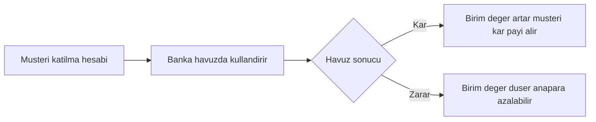
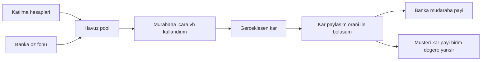
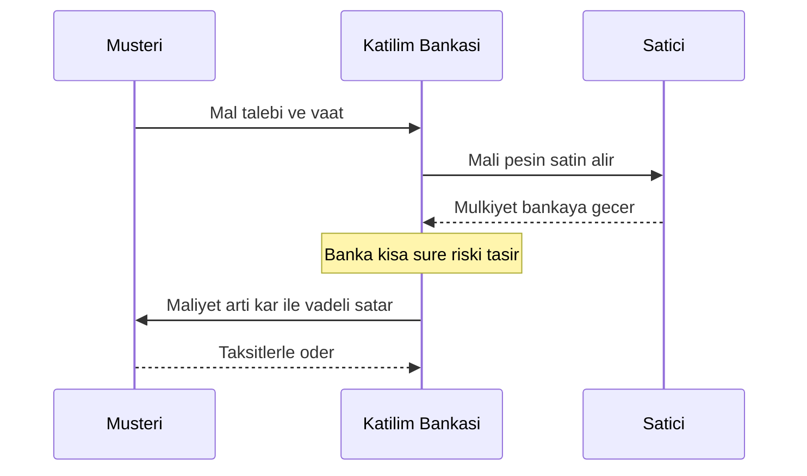
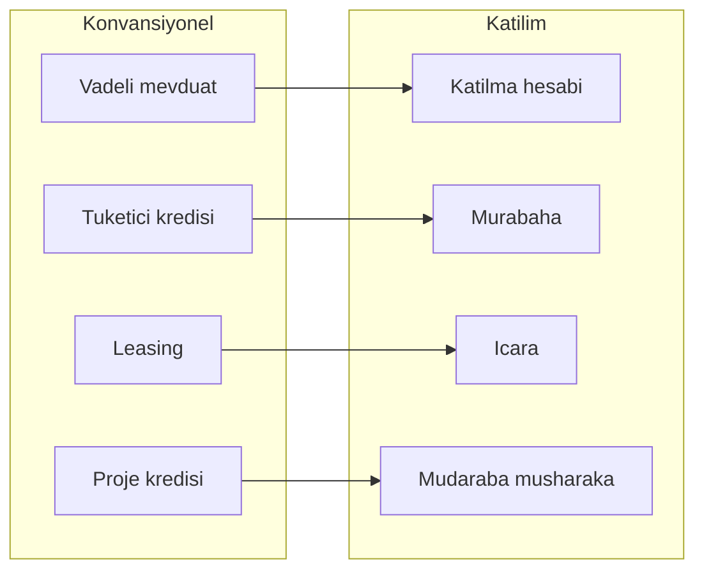

# Topic 10.10 — Participation (Faizsiz) Banking: Katılım Bankacılığı

```admonish info title="Bu bölümde"
- Katılım bankacılığının neden var olduğu — riba (faiz) yasağı, kâr/zarar ortaklığı ve varlığa dayalı finansmanın konvansiyonel bankadan farkı
- Fon toplama tarafı: cari hesap (emanet, getirisiz) vs katılma hesabı (profit/loss sharing) ve havuz-tabanlı kâr payı dağıtımı
- Fon kullandırma ürünleri: murabaha, mudaraba, musharaka, icara, istisna, selem, tavarruq — her birinin akışı ve tuzağı
- Katılım muhasebesinin double-entry (10.1) üzerine oturuşu ve faiz kaydından (10.5) postinglerle karşılaştırması
- Danışma Kurulu, AAOIFI, BDDK/TKBB regülasyonu, konvansiyonel↔katılım ürün eşlemesi ve katılım bankacılığı anti-pattern'leri
```

## Hedef

Katılım (faizsiz) bankacılığını "faiz yerine kâr payı diyorlar" seviyesinden, bir backend/domain mühendisinin sistemi doğru modelleyebileceği derinliğe taşımak. Riba yasağının pratikte ne getirdiğini, fon toplama (cari vs katılma hesabı) ve fon kullandırma (murabaha, mudaraba, musharaka, icara, istisna, selem, tavarruq) ürünlerinin akışlarını, kâr payının havuz sisteminde nasıl dağıtıldığını, katılım muhasebesinin double-entry (10.1) üzerine nasıl oturduğunu ve faiz kaydından (10.5) postinglerle nasıl ayrıldığını kavramak. Amacın ezber değil — bir katılım ürününü "hangi varlık el değiştirdi, kâr nereden doğdu, defterde nasıl izlenir" sorularına eksiksiz cevap verecek şekilde modelleyebilmek.

## Süre

Okuma: ~2 saat • Kendini Sına: 40 dk • Pratik (opsiyonel): 3-4 saat • Toplam: ~2.5 saat (+ pratik)

## Önbilgi

- Topic 10.1 (Double-entry) bitti — journal, debit/credit, ledger post ve `Sum(debit) = Sum(credit)` invariant'ını biliyorsun (bu bölümde karşılaştırma için gerekli)
- Topic 10.5 (FX & Interest) bitti — faiz tahakkuku (accrual), Interest Income kaydı ve day count mantığını biliyorsun (kâr payı ile karşılaştıracağız)
- Topic 10.6 (Regulatory) — BDDK, düzenleyici çerçeve ve raporlama zihniyeti (katılım düzenlemeleri buraya oturur)

---

## Kavramlar

### 1. Neden katılım bankacılığı — riba yasağı

Bazı müşteriler dini/etik nedenlerle faizli bir üründe para tutmak istemez; katılım bankacılığı bu talebi karşılamak için faizsiz bir işleyiş kurar.

**Katılım bankacılığı** (participation / faizsiz banking), İslami finans (Islamic finance) ilkelerine göre çalışan, temel yasağı **riba** (Arapça: faiz, önceden garanti edilmiş sabit getiri) olan bankacılık modelidir. Faiz yerine gerçek bir alım-satıma veya ortaklığa dayalı getiri üretir.

TR'de oyuncular iki grupta toplanır:

```
Özel:  Kuveyt Türk, Albaraka Türk, Türkiye Finans
Kamu:  Ziraat Katılım, Vakıf Katılım, Türkiye Emlak Katılım
```

Sektörün Türk bankacılık sistemindeki aktif payı yıllar içinde büyüyerek yaklaşık %8-9 bandına ulaşmıştır (kamu katılım bankalarının kurulmasıyla ivmelenmiştir). Yani niş değil, sistemik bir dikeydir.

Tuzak: "faizsiz" demek "getirisiz" demek değildir — katılma hesabı sahibi kâr payı alır. Fark, getirinin **önceden sabit ve garanti** (faiz) yerine **gerçekleşen kâra bağlı ve değişken** (kâr payı) olmasıdır.

### 2. Temel felsefe — kâr/zarar ortaklığı ve varlığa dayalı finansman

Faiz, parayı doğrudan "kiralayıp" zamanla sabit getiri üretmeye dayanır; katılım felsefesi bunu reddeder ve getiriyi gerçek ekonomik faaliyete bağlar.

Katılım bankacılığının üç köşe taşı vardır: **riba yasağı** (sabit garantili faiz yok), **kâr/zarar ortaklığı** (profit and loss sharing — getiri riskle birlikte paylaşılır) ve **varlığa dayalılık** (asset-backed — her finansman gerçek bir mal/hizmet alım-satımına veya ortaklığa bağlı olmalı, "paradan para" olmaz).

İki ek yasak akışı şekillendirir:

- **Gharar** (Arapça: aşırı belirsizlik/spekülasyon) — sözleşmenin konusu, fiyatı veya teslimi belirsiz olamaz; kumar benzeri kontratlar yasaktır.
- **Haram sektör yasağı** — alkol, kumar, domuz, silah, faizli finans gibi dinen yasak alanların finansmanı yapılmaz.

```admonish tip title="Faiz vs katılım — tek cümlelik ayrım"
Konvansiyonel banka **parayı ödünç verir ve sabit faiz alır** (getiri sözleşmede garantidir). Katılım bankası **bir malı alıp satar veya bir işe ortak olur**; getirisi bu ticaretin/ortaklığın gerçek sonucundan doğar. Bu yüzden katılım bankasının bilançosunda "loan" değil "murabaha alacağı", "ortaklık payı", "kira alacağı" gibi varlığa dayalı kalemler vardır.
```

### 3. Fon toplama — cari hesap vs katılma hesabı

Banka fon kullandırmadan önce fon toplamalı; ama faizsiz bir dünyada "mevduata faiz" diyemezsin, o yüzden iki farklı hesap tipi gerekir.

İki temel hesap vardır. **Cari hesap** (current account, Arapça kökeni *vedia* — emanet), paranın bankaya emanet edildiği, **getirisiz** ve anaparanın tam garanti edildiği hesaptır; konvansiyonel vadesiz mevduata benzer. **Katılma hesabı** (participation account), müşterinin parasını bankanın kâr amaçlı kullandırmasına vekâlet verdiği, getirinin gerçekleşen kâra/zarara bağlı olduğu hesaptır — profit/loss sharing.

Katılma hesabı **birim değer / birim hesap** mantığıyla işler: hesaba giren para o günkü *birim değer* üzerinden *birime* çevrilir (bir yatırım fonu payı gibi). Kâr dağıtımı birim değerini artırır; müşterinin bakiyesi = birim adedi × güncel birim değer.

```
Cari hesap:     anapara garanti, getiri = 0            (emanet)
Katılma hesabı: anapara garanti YOK, getiri = kâra bağlı (ortaklık)
```

<mark>Katılma hesabında anapara garanti edilmez — zarar durumunda birim değer düşebilir; bu, konvansiyonel mevduatın en temel farkıdır</mark>. Pratikte zarar nadirdir ama modelin ve sözleşmenin özü budur.

Katılma hesabının kâr/zarara ortak yapısını görelim:



Tuzak: cari hesabı "faizsiz mevduat" sanmak. Cari hesap zaten getiri vaat etmez; getiri isteyen müşteri katılma hesabına geçer ve karşılığında zarar riskini de üstlenir.

### 4. Kâr payı dağıtımı — havuz sistemi

Katılma hesabı sahiplerine "kim ne kadar kâr alacak" sorusunu adil ve faizsiz biçimde cevaplamak için havuz mantığı gerekir.

Katılma hesaplarından toplanan fonlar bir **havuza** (pool) girer; banka bu havuzu murabaha, icara vb. ile kullandırır ve dönem sonunda gerçekleşen kâr havuza döner. Dört terim dağıtımı yönetir:

- **Katılım oranı** (participation ratio) — havuzda müşteri fonu ile banka öz fonunun karışım oranı.
- **Kâr paylaşım oranı** (profit sharing ratio) — gerçekleşen kârın banka ile hesap sahipleri arasında paylaşım yüzdesi (örn. banka %20 emek payı / mudaraba oranı, müşteri %80).
- **Dağıtım dönemi** (distribution period) — kârın hesaplanıp dağıtıldığı periyot (genelde günlük birim-değer güncellemesi ile).
- **Kâr payı oranı** (profit rate) — dönem sonunda müşteriye yansıyan efektif getiri; *sonuç*tur, *vaat* değil.

Havuz dağıtım akışı:



```admonish warning title="Faiz mi, kâr payı mı — sınav sorusu"
Faiz **önceden** ve **sabit** olarak taahhüt edilir (P × r × t; sonuç ne olursa olsun ödenir). Kâr payı **sonradan** ve **değişken** olarak, gerçekleşen havuz kârından hesaplanır; zarar olursa hesap sahibi de zarara ortaktır. İkisini pratikte aynı görünen bir orana indirgemek (aynı gün aynı ekonomik sonuç) mümkündür, ama sözleşmesel ve muhasebesel doğaları taban tabana zıttır — bu ayrımı silmek doğrudan şer'i uyum ihlalidir.
```

Somut bir dönem hesabı — havuz kârı gerçekleşir, önce banka payı ayrılır, kalan hesap sahiplerine birim değer üzerinden yansır:

```
Toplam birim: 1.000.000 birim, eski birim değer: 1,000000
Dönem havuz kârı: 100.000 TL
Kâr paylaşım oranı: banka %20 (mudaraba/emek payı), müşteri %80

Bankaya: 100.000 × 0,20 = 20.000 TL
Hesap sahiplerine: 100.000 × 0,80 = 80.000 TL
Birim başına artış: 80.000 / 1.000.000 = 0,080000
Yeni birim değer: 1,000000 + 0,080000 = 1,080000

10.000 birimi olan müşteri: 10.000 × 1,080000 = 10.800 TL (önce 10.000 idi)
```

Zarar senaryosunda (havuz kârı negatif) aynı formül birim değeri **düşürür** — hesap sahibi anapara kaybına ortak olur; bu, katılma hesabını mevduattan ayıran özdür.

Tuzak: müşteriye "yıllık %X kâr payı garanti" demek. Bu bir faiz vaadidir ve modeli ihlal eder; ancak *beklenen/gösterge* kâr payı oranı paylaşılabilir.

### 5. Murabaha — maliyet + kâr ile vadeli satış

Müşteri bir mal (araç, konut, emtia) almak ister ama peşin parası yoktur; faizli kredi veremeyeceğin için bankanın malı gerçekten alıp satması gerekir.

**Murabaha** (Arapça: kârlı satış), bankanın müşterinin istediği malı **satıcıdan peşin alıp**, üzerine bilinen bir kâr ekleyerek müşteriye **vadeli sattığı** sözleşmedir. En yaygın fon kullandırma yöntemidir (TR katılım aktiflerinin büyük çoğunluğu). Kâr, satış anında açıkça bilinir ve sabittir — ama bu faiz değildir çünkü bir *mal alım-satımının* kârıdır.

Kritik nokta: bankanın malı, müşteriye satmadan önce **gerçekten mülkiyetine alması** ve (kısa süre de olsa) riskini taşımasıdır; mülkiyet devri olmadan işlem faizli krediye dönüşür.

```
Araç: 1.000.000 TL peşin fiyat, banka %20 kâr ile 12 ay vade
Satış fiyatı = 1.000.000 × 1.20 = 1.200.000 TL (12 taksitte 100.000 TL)
Banka kârı = 200.000 TL (satış anında sabit ve bilinir)
```

Murabaha akışını sequence ile görelim — banka satıcıdan alır, müşteriye vadeli satar:



Tuzak: bankanın malı hiç almadan, sadece parayı müşteriye verip "kâr" adı altında fazlasını istemesi. Bu **hile-i şer'iyye** (şeklen uyumlu ama özde faiz) olur; mülkiyet ve risk devri gerçek olmalıdır.

### 6. Mudaraba — emek-sermaye ortaklığı

Bazen taraflardan biri sermayeye, diğeri iş yapma becerisine sahiptir; ikisini faizsiz birleştirmek için ortaklık gerekir.

**Mudaraba** (Arapça: kâr ortaklığı), bir tarafın **sermayeyi** (rabb-ul mal), diğer tarafın **emeği/işi** (mudarib) koyduğu ortaklıktır. Kâr, önceden anlaşılan oranla paylaşılır; **zarar ise sadece sermaye sahibine** aittir (mudarib emeğini kaybeder, para koymaz — kusuru yoksa borçlanmaz).

Katılım bankacılığında mudaraba iki yönde çalışır:

- **Pasif tarafta:** hesap sahibi sermayedar, banka mudarib → banka fonu işletir, kârı paylaşır (katılma hesabının teorik temeli).
- **Aktif tarafta:** banka sermayedar, müşteri (girişimci) mudarib → banka projeye sermaye verir, kârı paylaşır.

```
Sermaye: banka 1.000.000 TL, emek: girişimci
Kâr paylaşımı: %70 girişimci / %30 banka (önceden anlaşıldı)
Dönem kârı 300.000 TL → banka 90.000, girişimci 210.000
Zarar olursa → parasal zarar bankanın (girişimci emeğini kaybeder)
```

Tuzak: mudaraba'da bankaya sabit getiri veya anapara garantisi koymak. Zararın sermayedara ait olması ortaklığın özüdür; garanti eklenirse faize dönüşür.

### 7. Musharaka — ortak sermaye ve azalan musharaka

Bazı finansmanlarda hem banka hem müşteri sermaye koyar ve varlığa birlikte ortak olur; bunun için ortak-sermaye modeli gerekir.

**Musharaka** (Arapça: ortaklık), tarafların **birlikte sermaye** koyduğu ortaklıktır; kâr anlaşılan oranla, **zarar ise sermaye payı oranında** paylaşılır (mudaraba'dan farkı: burada zararı da paylaşırlar çünkü ikisi de para koydu).

Konut finansmanında öne çıkan varyant **azalan musharaka** (diminishing musharaka / *müşareke-i mütenakısa*): banka ve müşteri bir varlığa (örn. konut) ortak olur; müşteri hem kira öder (bankanın payı için) hem de zamanla bankanın payını satın alarak ortaklığı azaltır — vade sonunda mülkiyet tamamen müşteriye geçer.

```
Konut 2.000.000 TL: banka %80 (1.600.000), müşteri %20 (400.000) ortak
Müşteri her ay: (a) bankanın payı için kira + (b) banka payından bir dilim satın alır
Zamanla banka payı %80 → %0, mülkiyet müşteriye geçer
```

Tuzak: azalan musharaka'yı "gizli faizli mortgage" gibi kurgulamak (kira = faiz taksidi). Kira, bankanın *gerçek mülkiyet payının* kullanım bedeli olmalı; ortaklık ve mülkiyet payları defterde gerçekten izlenmelidir.

### 8. Icara (ijara) — kiralama / finansal leasing

Müşteri bir ekipmanı/varlığı kullanmak ister ama sahip olmak zorunda değildir; faizsiz çözüm mülkiyeti bankada tutup kiralamaktır.

**Icara** (Arapça: kira, ijara), bankanın bir varlığı satın alıp müşteriye **kiraya verdiği** sözleşmedir; konvansiyonel **leasing**'in katılım karşılığıdır. Getiri kira bedelinden doğar. İki türü vardır: operasyonel kira (varlık bankada kalır) ve **icara muntehiye bittemlik** (mülkiyetle sonuçlanan kira — vade sonunda varlık müşteriye geçer, finansal leasing'in karşılığı).

Kritik fark: konvansiyonel leasing faiz temelli bir finansman kirasıdır; icara'da banka varlığın **mülkiyetini ve ana bakım/risk sorumluluğunu** kira süresince gerçekten taşır — mülkiyet riski bankada olmalıdır.

```
Ekipman 500.000 TL, 24 ay icara, aylık kira 25.000 TL
Banka varlığın mülkiyetini ve ana riskini taşır
Bittemlik ise: vade sonunda mülkiyet müşteriye devrolur
```

Tuzak: kira sözleşmesinde tüm mülkiyet risklerini (hasar, sigorta, ana bakım) müşteriye yıkmak. Bu, kirayı faizli finansmana çevirir; asli mülkiyet riski kiralayanda (bankada) kalmalıdır.

### 9. İstisna — imalata dayalı finansman

Henüz üretilmemiş/inşa edilmemiş bir varlığı (bina, gemi, fabrika) finanse etmek gerekir; ortada satın alınacak hazır mal yoktur.

**İstisna** (Arapça: imalat siparişi, istisna'a), henüz var olmayan bir malın **belirli spesifikasyon ve fiyatla imal/inşa ettirilmesi** için yapılan sözleşmedir; inşaat ve üretim finansmanının katılım aracıdır. Banka müşteri adına üreticiyle/müteahhitle anlaşır, teslimat aşamalı olabilir, ödeme peşin/taksitli/teslimde olabilir.

Genellikle **paralel istisna** kullanılır: banka müşteriyle bir istisna (satış) sözleşmesi, müteahhitle ikinci bir istisna (yaptırma) sözleşmesi kurar; ikisi arasındaki fark bankanın kârıdır.

```
Konut projesi: müşteri bankadan tamamlanmış daire ister (istisna 1: 3.000.000 TL vadeli)
Banka müteahhide yaptırır (istisna 2: 2.700.000 TL)
Banka kârı = 300.000 TL (imalat/koordinasyon üzerinden)
```

Tuzak: spesifikasyonu ve fiyatı belirsiz bırakmak — bu **gharar** (aşırı belirsizlik) yasağını ihlal eder. İstisna'da malın nitelikleri ve bedeli net tanımlanmalıdır.

### 10. Selem ve Tavarruq — peşin ödeme ve nakit temini

İki özel ihtiyaç vardır: üreticiye peşin sermaye sağlamak, ve müşteriye faizsiz yolla nakit sağlamak.

**Selem** (Arapça: peşin ödemeli vadeli teslim), bedelin **peşin** ödenip malın **ileri bir tarihte teslim** edildiği sözleşmedir (istisna'nın tersi zamanlaması). Klasik kullanımı tarımdır: banka çiftçiye peşin öder, hasatta standart nitelikte mahsulü teslim alır — üreticiye işletme sermayesi sağlar.

**Tavarruq** (teverrük, Arapça: gümüşe/nakde çevirme), müşterinin **nakit ihtiyacını** faizsiz karşılamak için kurgulanan çok adımlı işlemdir: banka bir emtiayı müşteriye vadeli satar, müşteri aynı emtiayı (banka dışında bir üçüncü tarafa) peşin satarak nakit elde eder. Sonuçta müşteri peşin nakit alır, bankaya vadeli borçlanır.

```
Tavarruq: banka emtiayı 105.000 TL'ye vadeli satar müşteriye
Müşteri emtiayı 100.000 TL'ye peşin satar (üçüncü tarafa) → 100.000 nakit
Müşteri bankaya vade sonunda 105.000 TL öder
```

```admonish warning title="Tavarruq neden tartışmalı"
Tavarruq şeklen tüm alım-satım adımlarını içerdiği için birçok Danışma Kurulu tarafından kabul edilir; ancak asıl amaç mal değil nakit olduğundan **organize tavarruq** (bankanın her iki bacağı da kurguladığı, malın gerçekte hiç el değiştirmediği hali) birçok âlim ve AAOIFI tarafından hile-i şer'iyye olarak eleştirilir. Kullanılıyorsa gerçek mülkiyet devri ve bağımsız üçüncü taraf şarttır. Selem ile karıştırma: selem üretici finansmanı, tavarruq nakit teminidir.
```

Tuzak: selem'i istisna ile karıştırmak. Selem'de **bedel peşin, mal vadeli** ve mal *standart/misli* olmalı (hasat gibi); istisna'da mal *imal edilen* bir şeydir ve ödeme esnektir.

### 11. Katılım muhasebesi — double-entry farkları ve posting'ler

Katılım bankası da her kuruşun izini tutmak zorundadır; double-entry (10.1) burada da geçerlidir, ama hesap isimleri ve kâr tanıma mantığı faizden (10.5) ayrılır.

Katılım muhasebesi de **double-entry** üzerine kurulur — `Sum(debit) = Sum(credit)` invariant'ı aynen geçerlidir (Topic 10.1). Fark hesap planında ve gelirin doğuş biçimindedir: faiz geliri yerine **kâr payı / satış kârı**, kredi yerine **murabaha alacağı** vardır. En önemli fark **ertelenmiş kâr** (deferred profit) kavramıdır: murabaha kârı satış anında toptan gelir yazılmaz; vadeye yayılarak tahakkuk eder.

Karşılaştırmalı posting — önce **faizli kredi** (Topic 10.5, referans):

```
Faizli kredi kullandırımı (konvansiyonel):
  Debit:  Loan Receivable (1201)          100.000 TL
  Credit: Customer Deposit / Cash         100.000 TL

Aylık faiz tahakkuku (accrual):
  Debit:  Loan Receivable (1201)              416,67 TL
  Credit: Interest Income (4101)              416,67 TL
```

Şimdi **murabaha** — mülkiyet devri iki adımdır (banka alır, sonra satar) ve kâr ertelenir:

```
1) Banka malı satıcıdan alır (envanter):
  Debit:  Murabaha Inventory (1210)       1.000.000 TL
  Credit: Cash / Vault (1101)             1.000.000 TL

2) Banka malı müşteriye vadeli satar (kâr ertelenir):
  Debit:  Murabaha Receivable (1211)      1.200.000 TL
  Credit: Murabaha Inventory (1210)       1.000.000 TL
  Credit: Deferred Murabaha Profit (2910) 200.000 TL

3) Aylık kâr tahakkuku (deferred → income, vadeye yayılır):
  Debit:  Deferred Murabaha Profit (2910)   16.666,67 TL
  Credit: Murabaha Profit Income (4110)     16.666,67 TL
```

Karşılaştırma için **icara** (kira) posting'i — banka varlığı alır, aylık kira geliri doğrudan tahakkuk eder (murabaha gibi ertelenmiş kâr yok, çünkü gelir dönemsel kiradır):

```
1) Banka varlığı satın alır (icara varlığı):
  Debit:  Icara Asset (1220)                500.000 TL
  Credit: Cash / Vault (1101)               500.000 TL

2) Aylık kira geliri tahakkuku:
  Debit:  Icara Rent Receivable (1221)       25.000 TL
  Credit: Icara Rent Income (4120)           25.000 TL

3) Aylık amortisman (mülkiyet bankada, risk bankada):
  Debit:  Depreciation Expense (5210)        18.000 TL
  Credit: Accumulated Depreciation (1229)    18.000 TL
```

Dikkat: icara'da amortisman kaydı olması, mülkiyetin ve risklerin gerçekten bankada olduğunun muhasebe kanıtıdır — konvansiyonel finansal leasing'de bu risk kiracıya geçtiği için bu kayıt kiralayanda görülmez.

```admonish tip title="Faiz tahakkuku vs kâr payı reeskontu"
Faizde gelir doğrudan **Interest Income**'a accrue olur (10.5). Murabaha'da satış kârı önce bir **kontra/ertelenmiş** kalem (Deferred Profit, liability niteliğinde) olarak park eder ve her dönem `Deferred Profit → Profit Income` reeskontuyla gelire çevrilir — henüz hak edilmemiş kâr bilançoda gelir gibi görünmez. Mekanik olarak double-entry aynı; ekonomik hikâye (faiz vs mal kârı) ve hesap adları farklıdır. Bu ayrımı silip murabaha kârını "faiz" hesabına yazmak hem muhasebe hem şer'i uyum hatasıdır.
```

<details>
<summary>Tam kod: MurabahaContract + posting (kısa Java, ~40 satır)</summary>

```java
public record MurabahaContract(
        UUID id,
        UUID customerId,
        String assetDescription,
        BigDecimal costPrice,       // banka alış (peşin)
        BigDecimal profitAmount,    // sabit kâr (satış anında bilinir)
        int termMonths,
        LocalDate saleDate) {

    public BigDecimal salePrice() {
        return costPrice.add(profitAmount);   // maliyet + kâr
    }

    public BigDecimal monthlyInstallment() {
        return salePrice().divide(
            BigDecimal.valueOf(termMonths), 2, RoundingMode.HALF_EVEN);
    }

    // Kâr vadeye eşit yayılır (basit doğrusal reeskont)
    public BigDecimal monthlyProfitAccrual() {
        return profitAmount.divide(
            BigDecimal.valueOf(termMonths), 2, RoundingMode.HALF_EVEN);
    }
}

// Satış anında journal: kâr ertelenir, gelir yazılmaz
JournalEntryRequest saleEntry = JournalEntryRequest.builder()
    .description("Murabaha sale " + contract.id())
    .entry(of(MURABAHA_RECEIVABLE, debit(contract.salePrice()), "TRY"))
    .entry(of(MURABAHA_INVENTORY, credit(contract.costPrice()), "TRY"))
    .entry(of(DEFERRED_MURABAHA_PROFIT, credit(contract.profitAmount()), "TRY"))
    .build();
ledgerService.post(saleEntry);   // Sum(debit) == Sum(credit) korunur
```

</details>

### 12. Danışma/uygunluk denetimi — Danışma Kurulu ve AAOIFI

Bir ürünün "faizsiz" olduğunu iddia etmek yetmez; bağımsız bir dini/teknik otoritenin uygunluğu onaylaması gerekir.

**Danışma Kurulu** (advisory board / *şer'i danışma kurulu*, uluslararası adıyla Sharia Supervisory Board), ürün ve işlemlerin İslami finans ilkelerine (şer'i uyum) uygunluğunu denetleyen bağımsız uzman kuruludur. Yeni ürünü onaylar (**fetva/uygunluk kararı**), işleyişi denetler ve uygunsuz gelirin **arındırılmasını** (purification — helal olmayan gelirin hayra aktarılması) yönetir.

**AAOIFI** (Accounting and Auditing Organization for Islamic Financial Institutions), İslami finans için muhasebe, denetim ve şer'i standartlar yayınlayan uluslararası kuruluştur; murabaha, icara vb. için standart muhasebe ve sözleşme çerçevesi sağlar (double-entry için IFRS ne ise, katılım için AAOIFI odur).

```admonish tip title="Danışma Kurulu ne yapar, mühendis neden umursar"
Danışma Kurulu bir ürünü reddederse o ürün canlıya çıkamaz — yani ürün tasarımı ve sistem modelin, Kurul'un onayladığı akışı (mülkiyet devri, risk taşıma, sözleşme sırası) birebir yansıtmak zorundadır. "Adımı atlarız, sonuç aynı" mühendislik kestirmesi burada uyum ihlalidir: sistemde mülkiyet devri gerçekten kaydedilmeli, sözleşme adımları gerçek sırayla işlenmelidir.
```

Tuzak: uygunluğu tek seferlik "onay damgası" sanmak. Şer'i uyum sürekli denetim (audit) ve gerektiğinde gelir arındırma gerektiren yaşayan bir süreçtir.

### 13. Regülasyon — BDDK, TKBB, Merkezi Danışma Kurulu

Katılım bankaları hem devletin bankacılık otoritesine hem de şer'i uyum çatısına bağlıdır; ikisi birlikte çerçeveyi kurar.

TR'de katılım bankaları da tüm bankalar gibi **BDDK** (Bankacılık Düzenleme ve Denetleme Kurumu) denetimindedir (Topic 10.6); sermaye yeterliliği, likidite ve raporlama kuralları geçerlidir, ancak katılıma özgü düzenlemeler (katılma hesabı, kâr payı, havuz muhasebesi) ayrıca tanımlıdır. **TKBB** (Türkiye Katılım Bankaları Birliği), sektörün çatı kuruluşudur; standart, eğitim ve koordinasyon sağlar. TKBB bünyesindeki **Merkezi Danışma Kurulu**, ulusal düzeyde şer'i standart birliği kurar — böylece her bankanın kendi kurulu farklı karar verse de ortak bir asgari çerçeve olur.

```
BDDK          → prudential regülasyon (sermaye, likidite, raporlama)
TKBB          → sektör çatı kuruluşu (standart, koordinasyon)
Merkezi DK    → ulusal şer'i standart birliği
Banka DK      → banka içi ürün onayı ve denetim
AAOIFI        → uluslararası muhasebe/şer'i standart
```

Tuzak: katılım bankasını "BDDK dışı, sadece dini kurallarla çalışan" bir yapı sanmak. Katılım bankası tam yetkili bir bankadır; BDDK denetimi ve mevduat sigortası (TMSF, cari + katılma hesapları için tanımlı sınırlarla) aynen geçerlidir.

### 14. Konvansiyonel ↔ katılım ürün eşlemesi

Konvansiyonel bankacılığı bilen bir mühendis, katılım ürünlerini en hızlı "hangisi neyin karşılığı" haritasıyla öğrenir.

Her konvansiyonel faizli ürünün bir katılım karşılığı vardır; mekanizma farklı olsa da ekonomik işlev benzerdir:

| Konvansiyonel (faizli) | Katılım (faizsiz) | Mekanizma farkı |
|---|---|---|
| Vadesiz mevduat | Cari hesap (vedia) | İkisi de getirisiz emanet |
| Vadeli mevduat | Katılma hesabı | Sabit faiz → değişken kâr payı, zarar riski |
| Tüketici/taşıt/konut kredisi | Murabaha | Nakit ödünç → mal alım-satımı |
| Konut kredisi (mortgage) | Azalan musharaka / icara | Faiz → ortaklık payı kirası veya kira |
| Leasing | Icara | Finansman kirası → mülkiyet-riskli kira |
| İşletme/proje kredisi | Mudaraba / musharaka | Faiz → kâr/zarar ortaklığı |
| İnşaat/imalat finansmanı | İstisna | Faiz → imalat sözleşmesi |
| Nakit/ihtiyaç kredisi | Tavarruq | Faiz → çok adımlı emtia alım-satımı |
| Tahvil (bond) | Sukuk | Faiz kuponu → varlık getirisine dayalı sertifika |

Eşlemeyi görsel olarak gruplayalım — pasif (fon toplama) ve aktif (fon kullandırma):



Tuzak: eşlemeyi "isim değişikliği" sanmak. Ekonomik işlev benzer olabilir ama sözleşme, mülkiyet devri, risk dağılımı ve muhasebe gerçekten farklıdır; sistemi "kredi tablosuna murabaha etiketi yapıştırarak" modellemek uyumu bozar (bkz. anti-pattern'ler).

### 15. Katılım bankacılığı anti-pattern'leri

Mülakatta ve gerçek tasarımda en kritik soru "bu ürün gerçekten faizsiz mi, yoksa faizi gizliyor mu?" — işte klasik hatalar.

**Anti-pattern 1: Hile-i şer'iyye** — şeklen uyumlu, özde faizli kurgu. Malın gerçekte el değiştirmediği, sadece nakit akışının faiz gibi işlediği yapı. Katılımın en temel ihlali.

**Anti-pattern 2: Mülkiyet/risk devrini atlamak** — murabaha'da bankanın malı hiç almadan parayı verip "kâr" alması. Mülkiyet ve (kısa da olsa) risk gerçekten bankada olmalı.

**Anti-pattern 3: Katılma hesabına sabit getiri garantisi** — "yıllık %X kâr payı garanti". Bu doğrudan faiz vaadidir; getiri gerçekleşen kâra bağlı ve değişken olmalı.

**Anti-pattern 4: Sistemde "faiz/interest" alanı kullanmak** — <mark>kâr payını `interest_rate` / `interest_income` kolonlarına yazmak muhasebeyi ve raporlamayı faizli ürünle karıştırır; katılım için ayrı alan ve hesap planı zorunludur</mark>. Domain modelinde `profitRate`, `MurabahaReceivable`, `DeferredProfit` gibi ayrı kavramlar olmalı.

**Anti-pattern 5: Deferred profit'i satışta toptan gelir yazmak** — murabaha kârının tamamını satış anında Income'a atmak. Kâr vadeye yayılıp reeskontla tanınmalı.

**Anti-pattern 6: Cari ve katılma fonlarını havuzda ayırmamak** — cari hesap (garanti, getiri yok) ile katılma fonu (riskli, kâr/zarar) tek havuzda karışırsa kâr dağıtımı ve garanti hesabı bozulur; havuz muhasebesi ayrı tutulmalı.

**Anti-pattern 7: Organize tavarruq'a dayanmak** — malın hiç el değiştirmediği, bankanın her iki bacağı kurguladığı nakit temini. Birçok Danışma Kurulu ve AAOIFI eleştirir.

**Anti-pattern 8: Haram sektör/gharar filtresini koymamak** — finanse edilen faaliyetin (alkol, kumar, aşırı belirsiz kontrat) uygunluk kontrolünden geçmemesi. Ürün akışında şer'i uyum kapısı olmalı.

**Anti-pattern 9: Gecikme faizi (temerrüt faizi) uygulamak** — geciken taksite faiz işletmek riba'dır. Katılımda gecikme için ancak *tazminat/ceza bağışı* (helal olmayan kısmı arındırılan) mekanizmaları kullanılır, faiz değil.

**Anti-pattern 10: Konvansiyonel ürünü etiket değiştirerek "katılım" sunmak** — faizli kredi tablosuna "murabaha" adı verip mülkiyet/sözleşme akışını kurmamak. Uyum, isimde değil gerçek akış ve muhasebededir.

---

## Önemli olabilecek araştırma kaynakları

- AAOIFI — Shari'ah Standards ve Financial Accounting Standards (murabaha, icara, mudaraba)
- TKBB (Türkiye Katılım Bankaları Birliği) — yayınlar, standart dokümanlar, sektör verileri
- BDDK — katılım bankacılığı ve katılma hesapları düzenlemeleri
- IFSB (Islamic Financial Services Board) — prudential standartlar
- "An Introduction to Islamic Finance" — Mufti Muhammad Taqi Usmani
- Türkiye Katılım bankalarının ürün sözleşmeleri ve faaliyet raporları (murabaha/icara/musharaka örnek akışları)

---

## Kendini Sına

Aşağıdaki soruları önce **cevaba bakmadan** kendi cümlelerinle yanıtlamayı dene — hepsi TR katılım bankası mülakatlarında karşına çıkabilecek tarzda. Takıldığında ilgili Kavramlar başlığına dön, sonra tekrar dene.

**S1. Faiz (interest) ile kâr payı (profit share) arasındaki temel fark nedir? İkisi de bir orana indirgenebiliyorsa neden aynı değildir?**

<details>
<summary>Cevabı göster</summary>

Faiz **önceden sabit ve garanti** edilmiş getiridir: sonuç ne olursa olsun `P × r × t` ödenir ve anapara garantidir (riba). Kâr payı ise **sonradan ve değişken**, gerçekleşen havuz kârından hesaplanır; zarar durumunda hesap sahibi de zarara ortaktır ve katılma hesabında anapara garanti edilmez. Aynı gün ekonomik sonuç sayısal olarak benzeyebilse de sözleşmesel ve muhasebesel doğaları zıttır: biri parayı ödünç verip sabit getiri alır (varlığa dayanmaz), diğeri gerçek bir ticaretin/ortaklığın riskini paylaşarak getiri üretir. Bu ayrımı silmek (kâr payını faiz gibi garanti etmek veya faiz hesabına yazmak) doğrudan şer'i uyum ihlalidir.

</details>

**S2. Cari hesap ile katılma hesabı arasındaki fark nedir? Hangisinde anapara garantidir?**

<details>
<summary>Cevabı göster</summary>

Cari hesap (vedia — emanet) getirisizdir ve anapara tam garantilidir; konvansiyonel vadesiz mevduatın karşılığıdır. Katılma hesabı ise müşterinin fonunu bankanın kâr amaçlı kullandırmasına vekâlet verdiği, getirisi gerçekleşen kâra/zarara bağlı hesaptır — profit/loss sharing. Katılma hesabında anapara garanti **edilmez**; zarar durumunda birim değer düşebilir. Katılma hesabı birim değer/birim mantığıyla işler: para birime çevrilir, kâr dağıtımı birim değerini artırır, bakiye = birim adedi × güncel birim değer. Getiri isteyen müşteri katılma hesabına geçer ve karşılığında zarar riskini üstlenir.

</details>

**S3. Murabaha nasıl işler ve neden faizli krediden farklıdır? Hangi adım atlanırsa hile-i şer'iyye olur?**

<details>
<summary>Cevabı göster</summary>

Murabaha'da banka, müşterinin istediği malı satıcıdan **peşin satın alır**, mülkiyetine geçirir ve (kısa süre de olsa) riskini taşır; sonra üzerine bilinen bir kâr ekleyip müşteriye **vadeli satar**. Getiri bir faiz değil, gerçek bir mal alım-satımının kârıdır ve satış anında sabit/bilinir. Faizli krediden farkı: kredide banka nakit ödünç verir, murabaha'da banka bir malı alıp satar — bilançoda "loan" değil "murabaha alacağı" ve "ertelenmiş kâr" oluşur. Bankanın malı gerçekten almadan, sadece parayı verip fazlasını "kâr" adıyla istemesi durumunda mülkiyet ve risk devri gerçekleşmez; bu **hile-i şer'iyye** olur (şeklen uyumlu, özde faiz).

</details>

**S4. Mudaraba ile musharaka arasındaki fark nedir? Zarar her ikisinde de kime aittir?**

<details>
<summary>Cevabı göster</summary>

Mudaraba emek-sermaye ortaklığıdır: bir taraf sermayeyi (rabb-ul mal), diğeri emeği/işi (mudarib) koyar; kâr anlaşılan oranla paylaşılır ama **parasal zarar sadece sermaye sahibine** aittir (mudarib kusursuzsa yalnızca emeğini kaybeder). Musharaka ise ortak-sermaye ortaklığıdır: taraflar **birlikte sermaye** koyar; kâr anlaşılan oranla, **zarar ise sermaye payı oranında** paylaşılır (ikisi de para koyduğu için ikisi de zarara ortaktır). Konut finansmanında öne çıkan azalan musharaka'da müşteri hem bankanın payı için kira öder hem zamanla o payı satın alır; vade sonunda mülkiyet müşteriye geçer.

</details>

**S5. Icara (katılım) ile konvansiyonel leasing arasındaki kritik fark nedir?**

<details>
<summary>Cevabı göster</summary>

İkisi de bir varlığı kiralama yoluyla finanse eder, ama icara'da banka varlığın **mülkiyetini ve asli bakım/mülkiyet riskini** kira süresince gerçekten taşımak zorundadır; getiri bu gerçek mülkiyetin kira bedelinden doğar. Konvansiyonel leasing ise özünde faize dayalı bir finansman kirasıdır ve mülkiyet riskleri büyük ölçüde kiracıya yıkılır. İcara'nın "icara muntehiye bittemlik" türünde vade sonunda mülkiyet müşteriye devrolur (finansal leasing karşılığı). Tüm mülkiyet risklerini müşteriye yıkmak icara'yı faizli finansmana çevirir — asli risk kiralayanda (bankada) kalmalıdır.

</details>

**S6. Murabaha kârı defterde neden satış anında toptan gelir yazılmaz? "Deferred profit" mekanizması nedir ve faiz tahakkukundan (10.5) farkı nedir?**

<details>
<summary>Cevabı göster</summary>

Çünkü satış kârı henüz hak edilmemiştir — vade boyunca hizmet/finansman devam eder, dolayısıyla kâr vadeye yayılarak tanınmalıdır (tahakkuk esası). Satış anında kâr, `Deferred Murabaha Profit` adlı ertelenmiş (kontra/liability niteliğinde) bir kaleme yazılır; her dönem `Deferred Profit → Murabaha Profit Income` reeskontuyla gelire çevrilir. Faiz tahakkukunda (10.5) gelir doğrudan `Interest Income`'a accrue olur ve ortada mal alım-satımı yoktur; murabaha'da önce bir varlık el değiştirir, kâr o satıştan doğar ve ertelenir. Mekanik olarak double-entry aynıdır (`Sum(debit)=Sum(credit)`), ama hesap adları (Murabaha Receivable, Deferred Profit, Profit Income) ve ekonomik hikâye farklıdır; kârı `interest` hesabına yazmak hem muhasebe hem uyum hatasıdır.

</details>

**S7. Katılma hesaplarına kâr payı nasıl dağıtılır? Havuz sistemindeki katılım oranı ve kâr paylaşım oranı ne işe yarar?**

<details>
<summary>Cevabı göster</summary>

Katılma hesaplarından toplanan fonlar (banka öz fonuyla birlikte) bir havuza girer; banka bu havuzu murabaha, icara vb. ile kullandırır ve dönem sonunda gerçekleşen kâr havuza döner. **Katılım oranı** havuzda müşteri fonu ile banka fonunun karışım oranını, **kâr paylaşım oranı** ise gerçekleşen kârın banka (mudaraba/emek payı) ile hesap sahipleri arasında paylaşım yüzdesini belirler. Kâr, kalan pay hesap sahiplerine dağıtılır ve genelde birim değerini artırarak yansıtılır; **kâr payı oranı** bu sürecin *sonucu*dur, önceden verilen bir *vaat* değildir. Zarar durumunda birim değer düşer. Cari hesap fonları (garanti, getirisiz) bu riskli havuzdan ayrı tutulmalıdır.

</details>

**S8. Bir mühendis olarak katılım bankası sistemi tasarlarken hangi anti-pattern'lerden kaçınırsın? En az dört tane say.**

<details>
<summary>Cevabı göster</summary>

(1) Hile-i şer'iyye: malın gerçekte el değiştirmediği, nakit akışının faiz gibi işlediği kurgu. (2) Mülkiyet/risk devrini atlamak: murabaha'da bankanın malı hiç almadan kâr alması. (3) Katılma hesabına sabit getiri garantisi vermek — bu bir faiz vaadidir. (4) Sistemde `interest_rate`/`interest_income` alanlarını katılım ürünü için kullanmak; katılıma ayrı `profitRate`, `MurabahaReceivable`, `DeferredProfit` kavramları ve ayrı hesap planı gerekir. Ek olarak: deferred profit'i satışta toptan gelir yazmak, cari ve katılma fonlarını havuzda ayırmamak, organize tavarruq'a dayanmak, haram sektör/gharar filtresi koymamak, gecikme faizi uygulamak, ve konvansiyonel ürünü sadece etiket değiştirerek "katılım" diye sunmak. Uyum isimde değil, gerçek sözleşme akışı ve muhasebededir.

</details>

---

## Tamamlama kriterleri

- [ ] Riba yasağını, kâr/zarar ortaklığını ve varlığa dayalı finansmanı; gharar ve haram sektör yasaklarını açıklayabiliyorum
- [ ] Cari hesap (emanet, getirisiz, garantili) ile katılma hesabı (P/L sharing, garantisiz, birim değer) farkını anlatabiliyorum
- [ ] Havuz sistemini, katılım oranı ve kâr paylaşım oranını; faiz ile kâr payının farkını net biçimde ayırt edebiliyorum
- [ ] Murabaha, mudaraba, musharaka (azalan dâhil), icara, istisna, selem ve tavarruq'un akışını ve tuzağını sayabiliyorum
- [ ] Katılım muhasebesinin double-entry (10.1) üzerine oturuşunu ve murabaha posting'ini faiz kaydından (10.5) ayırt edebiliyorum
- [ ] Deferred profit / kâr payı reeskontu mekanizmasını ve neden satışta toptan gelir yazılmadığını açıklayabiliyorum
- [ ] Danışma Kurulu, AAOIFI, BDDK, TKBB ve Merkezi Danışma Kurulu rollerini biliyorum
- [ ] Konvansiyonel↔katılım ürün eşlemesini kurabiliyor ve katılım anti-pattern'lerini (hile-i şer'iyye, faiz alanı, sabit garanti, ...) tanıyorum
- [ ] (Opsiyonel) "Pratik yapmak istersen" bölümündeki model ve posting'leri kurdum, Claude-verify prompt'uyla doğrulattım

---

## Defter notları (10 madde)

1. "Riba yasağı + kâr/zarar ortaklığı + varlığa dayalılık (asset-backed): ____."
2. "Cari hesap (emanet, getirisiz, garantili) vs katılma hesabı (P/L, garantisiz, birim değer): ____."
3. "Havuz sistemi: katılım oranı + kâr paylaşım oranı + kâr payı oranı sonuçtur, vaat değil: ____."
4. "Faiz (önceden sabit, garanti) vs kâr payı (sonradan, değişken, zarara ortak): ____."
5. "Murabaha: banka satıcıdan alır (mülkiyet+risk) → müşteriye vadeli satar; hile-i şer'iyye tuzağı: ____."
6. "Mudaraba (emek-sermaye, zarar sermayedara) vs musharaka (ortak sermaye, zarar payına göre): ____."
7. "Icara (mülkiyet-riskli kira) / istisna (imalat) / selem (peşin öde, vadeli teslim) / tavarruq (nakit): ____."
8. "Murabaha muhasebesi: Deferred Profit → Profit Income reeskontu; double-entry aynı, hesap farklı: ____."
9. "Danışma Kurulu + AAOIFI + BDDK + TKBB + Merkezi DK rolleri: ____."
10. "Anti-pattern: faiz alanı kullanma, sabit getiri garantisi, mülkiyet devrini atlama, etiket değiştirme: ____."

```admonish success title="Bölüm Özeti"
- Katılım bankacılığı riba (faiz) yasağı üzerine kurulur: getiri, parayı ödünç vermekten değil gerçek alım-satım veya kâr/zarar ortaklığından doğar; gharar ve haram sektör de yasaktır
- Fon toplamada iki hesap vardır: cari hesap (emanet, getirisiz, anapara garantili) ve katılma hesabı (P/L sharing, birim değer, anapara garantisiz) — getiri havuzda gerçekleşen kârdan dağıtılır
- Faiz önceden sabit ve garanti, kâr payı sonradan ve değişkendir; ikisini karıştırmak (sabit garanti vermek, aynı hesaba yazmak) doğrudan uyum ihlalidir
- Fon kullandırma ürünleri: murabaha (maliyet+kâr vadeli satış, en yaygın), mudaraba (emek-sermaye), musharaka (ortak sermaye, azalan konut), icara (kira), istisna (imalat), selem (peşin öde-vadeli teslim), tavarruq (nakit)
- Katılım muhasebesi double-entry (10.1) üzerine oturur; murabaha kârı satışta toptan değil, Deferred Profit → Profit Income reeskontuyla vadeye yayılarak tanınır — faiz tahakkukundan (10.5) hesap adı ve ekonomik hikâye ile ayrılır
- Uyum bağımsız Danışma Kurulu, AAOIFI standartları, BDDK/TKBB regülasyonu ile güvenceye alınır; hile-i şer'iyye, sabit getiri garantisi ve mülkiyet devrini atlama klasik anti-pattern'lerdir
```

---

## Pratik yapmak istersen

Kavramları koda dökmek istersen aşağıdaki iki ek hazır: test yazma rehberi murabaha satış/reeskont, katılma hesabı birim değer, kâr payı dağıtımı, cari-katılma ayrımı ve anti-pattern kontrolleri için örnek testler içerir; Claude-verify prompt'u ile yazdığın katılım implementasyonunu banking-grade ve şer'i-uyum perspektifinden denetletebilirsin. Model + `MurabahaContract` + `ParticipationAccount` + `ProfitDistribution` + posting'leri kurmak yaklaşık 3-4 saat sürer. Not: ledger altyapısı için Topic 10.1'deki `LedgerService`'i yeniden kullan — katılımda değişen hesap planı ve gelir tanıma mantığıdır, invariant değil.

<details>
<summary>Kısa model iskeleti: ParticipationAccount + ProfitDistribution (Java, ~35 satır)</summary>

```java
public enum AccountType { CURRENT, PARTICIPATION }   // cari vs katılma

public record ParticipationAccount(
        UUID id,
        UUID customerId,
        AccountType type,
        BigDecimal units,          // birim adedi (katılma için)
        String currency) {

    // Bakiye = birim adedi × güncel birim değer
    public BigDecimal balance(BigDecimal currentUnitValue) {
        if (type == AccountType.CURRENT) {
            return units;          // cari: birim değer = 1, getirisiz
        }
        return units.multiply(currentUnitValue)
                    .setScale(2, RoundingMode.HALF_EVEN);
    }
}

public record ProfitDistribution(
        LocalDate period,
        BigDecimal poolProfit,          // gerçekleşen havuz kârı (zarar ise negatif)
        BigDecimal bankShareRatio) {    // banka kâr paylaşım oranı, örn 0.20

    // Hesap sahiplerine kalan kâr havuzu
    public BigDecimal distributableToAccounts() {
        return poolProfit.multiply(BigDecimal.ONE.subtract(bankShareRatio));
    }

    // Yeni birim değer = eski + (dağıtılabilir kâr / toplam birim)
    public BigDecimal newUnitValue(BigDecimal oldUnitValue, BigDecimal totalUnits) {
        return oldUnitValue.add(
            distributableToAccounts().divide(totalUnits, 6, RoundingMode.HALF_EVEN));
    }
}
```

</details>

<details>
<summary>Test yazma rehberi</summary>

### Test 10.10.1 — Murabaha satışında kâr ertelenir (toptan gelir yazılmaz)

```java
@Test
@Transactional
void murabahaSaleShouldDeferProfit() {
    MurabahaContract c = new MurabahaContract(
        randomId(), customerA, "Vehicle",
        new BigDecimal("1000000"), new BigDecimal("200000"), 12, LocalDate.now());

    ledgerService.post(murabahaSaleEntry(c));

    assertThat(balanceService.balanceOf(MURABAHA_RECEIVABLE, "TRY"))
        .isEqualByComparingTo("1200000.00");
    assertThat(balanceService.balanceOf(DEFERRED_MURABAHA_PROFIT, "TRY"))
        .isEqualByComparingTo("200000.00");
    // Satış anında gelir HENÜZ sıfır olmalı
    assertThat(balanceService.balanceOf(MURABAHA_PROFIT_INCOME, "TRY"))
        .isEqualByComparingTo("0.00");
}
```

### Test 10.10.2 — Aylık kâr payı reeskontu (deferred → income)

```java
@Test
@Transactional
void monthlyProfitAccrualMovesDeferredToIncome() {
    setupMurabaha(new BigDecimal("1000000"), new BigDecimal("200000"), 12);

    ledgerService.post(monthlyProfitAccrualEntry());   // 200000 / 12

    assertThat(balanceService.balanceOf(MURABAHA_PROFIT_INCOME, "TRY"))
        .isEqualByComparingTo("16666.67");
    assertThat(balanceService.balanceOf(DEFERRED_MURABAHA_PROFIT, "TRY"))
        .isEqualByComparingTo("183333.33");
}
```

### Test 10.10.3 — Katılma hesabı birim değeri kâr ile artar

```java
@Test
void participationUnitValueRisesWithProfit() {
    ProfitDistribution d = new ProfitDistribution(
        LocalDate.now(), new BigDecimal("100000"), new BigDecimal("0.20"));

    BigDecimal newValue = d.newUnitValue(
        new BigDecimal("1.000000"), new BigDecimal("1000000"));

    // Dağıtılabilir = 100000 × 0.80 = 80000; /1.000.000 birim = +0.08
    assertThat(newValue).isEqualByComparingTo("1.080000");
}
```

### Test 10.10.4 — Katılma hesabı zararda birim değer düşer (anapara garantisi yok)

```java
@Test
void participationUnitValueFallsOnLoss() {
    ProfitDistribution loss = new ProfitDistribution(
        LocalDate.now(), new BigDecimal("-50000"), new BigDecimal("0.20"));

    BigDecimal newValue = loss.newUnitValue(
        new BigDecimal("1.000000"), new BigDecimal("1000000"));

    assertThat(newValue).isLessThan(new BigDecimal("1.000000"));
}
```

### Test 10.10.5 — Cari hesap getirisiz kalır (kâr dağıtımına girmez)

```java
@Test
void currentAccountEarnsNoProfit() {
    ParticipationAccount current = new ParticipationAccount(
        randomId(), customerA, AccountType.CURRENT,
        new BigDecimal("10000"), "TRY");

    // Herhangi bir birim değerde cari bakiye = anapara (garanti)
    assertThat(current.balance(new BigDecimal("1.080000")))
        .isEqualByComparingTo("10000");
}
```

### Test 10.10.6 — Anti-pattern: katılım ürününde faiz hesabı kullanılamaz

```java
@Test
void murabahaMustNotPostToInterestIncome() {
    JournalEntryRequest wrong = JournalEntryRequest.builder()
        .description("murabaha profit")
        .entry(of(DEFERRED_MURABAHA_PROFIT, debit("16666.67"), "TRY"))
        .entry(of(INTEREST_INCOME, credit("16666.67"), "TRY"))   // YANLIŞ hesap
        .build();

    assertThatThrownBy(() -> participationLedgerService.post(wrong))
        .isInstanceOf(ShariaComplianceException.class)
        .hasMessageContaining("interest account");
}
```

</details>

<details>
<summary>Claude-verify prompt</summary>

```
Katılım (faizsiz) bankacılığı implementasyonumu banking-grade ve şer'i-uyum kriterlerine göre değerlendir:

1. Fon toplama:
   - Cari hesap (getirisiz, anapara garantili, emanet) ayrı modellenmiş mi?
   - Katılma hesabı birim değer / birim adedi mantığıyla mı çalışıyor?
   - Katılma hesabında anapara garantisi YOK olarak mı tanımlı (zararda birim değer düşer)?
   - Cari ve katılma fonları havuzda ayrı mı tutuluyor?

2. Kâr payı dağıtımı:
   - Havuz (pool) sistemi var mı?
   - Katılım oranı + kâr paylaşım oranı ayrı parametre mi?
   - Kâr payı gerçekleşen kârdan mı hesaplanıyor (önceden sabit/garanti DEĞİL)?
   - Zarar birim değere doğru yansıyor mu?

3. Fon kullandırma ürünleri:
   - Murabaha: banka önce malı alıyor (mülkiyet+risk) sonra vadeli satıyor mu?
   - Mudaraba / musharaka (azalan dâhil) ortaklık modeli var mı?
   - Icara (mülkiyet-riskli kira), istisna, selem, tavarruq desteği?

4. Muhasebe (double-entry, Topic 10.1 uyumlu):
   - Sum(debit) == Sum(credit) invariant'ı korunuyor mu?
   - Murabaha satışında kâr ERTELENIYOR mu (Deferred Profit), toptan gelir yazılmıyor mu?
   - Aylık reeskont Deferred Profit → Profit Income olarak mı işliyor?
   - Katılım için AYRI hesap planı mı (Murabaha Receivable, Deferred Profit, Profit Income)?

5. Faiz vs kâr payı ayrımı:
   - Domain modelinde interest_rate / interest_income YOK, profitRate / profitIncome VAR mı?
   - Kâr payı asla "faiz" hesabına yazılmıyor mu?
   - Sabit getiri garantisi VERİLMİYOR mu?

6. Uyum ve regülasyon:
   - Haram sektör / gharar filtresi (uygunluk kapısı) var mı?
   - Gecikme faizi (temerrüt faizi) UYGULANMIYOR mu?
   - Danışma Kurulu onayına göre sözleşme adımları (mülkiyet devri sırası) gerçek mi?

7. Anti-pattern:
   - Hile-i şer'iyye (mal el değiştirmeden nakit akışı) YOK?
   - Mülkiyet/risk devrini atlama YOK?
   - Katılma hesabına sabit garanti YOK?
   - Deferred profit'i satışta toptan gelir yazma YOK?
   - Konvansiyonel ürünü etiket değiştirerek katılım sunma YOK?

Her madde için PASS / FAIL / EKSIK işaretle.
```

</details>
