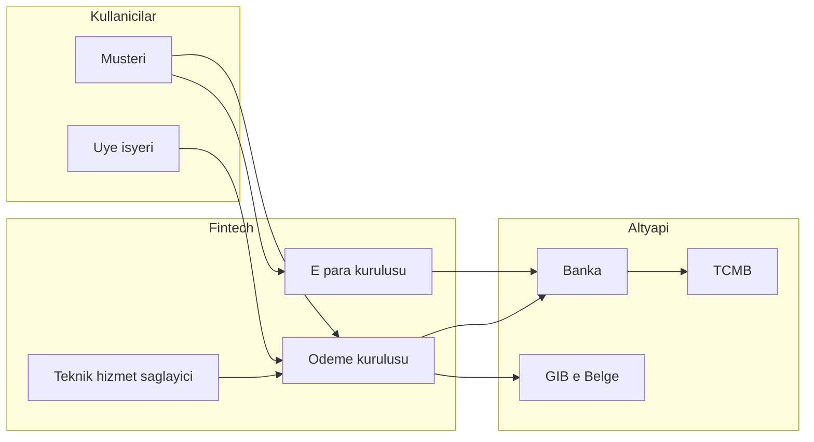
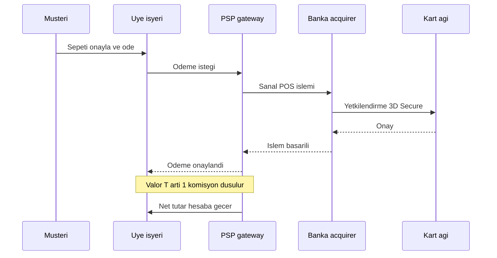
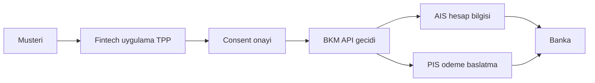
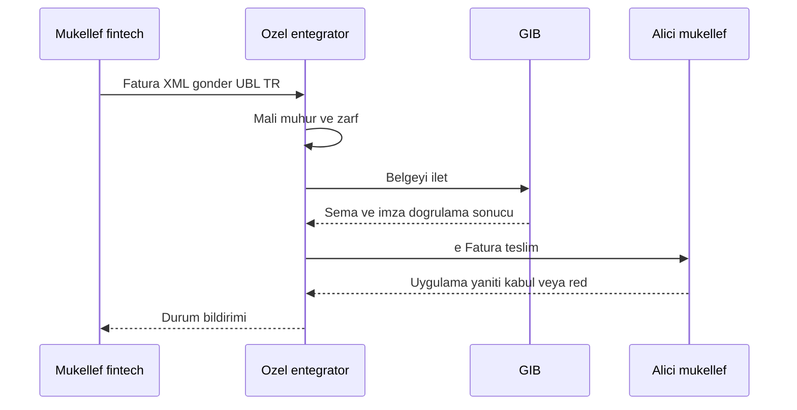

# Topic 10.11 — Fintech Ekosistemi (Fintech): Ödeme Kuruluşları, Açık Bankacılık, GİB e-Belge

```admonish info title="Bu bölümde"
- Bu topic çekirdek bankacılık DEĞİL, **banka dışı finansal oyuncuları** (ödeme kuruluşu, e-para kuruluşu, üye işyeri, e-ticaret, PSP) anlatır — bankanın core'unu değil, çevresindeki fintech ekosistemini öğreneceksin
- Ödeme kuruluşu vs elektronik para kuruluşu vs teknik hizmet sağlayıcı ayrımı: 6493 sayılı Kanun, TCMB lisansları, kim ne yapabilir/yapamaz
- Bir e-ticaret ödemesinin merchant → PSP → banka → hesaba geçiş yolu; sanal POS, ödeme geçidi, 3D Secure, valör ve komisyon
- Açık Bankacılık (AIS/PIS), consent yönetimi, güçlü kimlik doğrulama (SCA) ve PSD2 karşılaştırması
- GİB e-Belge dünyası: e-Fatura vs e-Arşiv, temel vs ticari fatura, UBL-TR 1.2, mali mühür, entegratör modelleri — fintech'in komisyon faturasını nasıl kestiği
```

## Hedef

Banka çekirdeğinin **dışındaki** finansal ekosistemi bir domain mühendisi gözüyle öğrenmek: ödeme kuruluşları ve elektronik para kuruluşları (6493 sayılı Kanun, TCMB düzenlemesi), dijital cüzdan ve saklı kart, üye işyeri/sanal POS/ödeme geçidi, ödeme akışı ve mutabakat, Açık Bankacılık (AIS/PIS) ile API güvenliği/consent, ve Türkiye'de e-ticaret/fintech için kritik olan GİB e-Belge sistemi (e-Fatura, e-Arşiv, temel/ticari fatura, UBL-TR 1.2, mali mühür, entegratör modelleri). Amaç: "iyzico ile Papara farkı ne?", "e-Arşiv ne zaman kesilir?", "float parası gelir midir?" gibi TR fintech mülakat sorularını hatasız yanıtlamak.

## Süre

Okuma: 2-2.5 saat • Kendini Sına: 45 dk • Pratik (opsiyonel): 3-4 saat • Toplam: ~3 saat (+ pratik)

## Önbilgi

- **Topic 10.1** bitti — double-entry ledger, journal entry mantığını biliyorsun (fintech'in float ve komisyon kayıtlarını buna bağlayacağız)
- **Topic 10.4** bitti — TR ödeme sistemleri (EFT, FAST, BKM, TCMB); bu topic o altyapının üzerine banka-dışı oyuncuları koyar
- **Topic 10.6** bitti — regülasyon zihniyeti (BDDK/MASAK/lisans); burada 6493 + TCMB ödeme regülasyonunu ekliyoruz
- **Topic 10.7** bitti — reconciliation/settlement; merchant mutabakatı ve valör bu bilgiye dayanır

---

## Kavramlar

### 1. Fintech nedir, banka ile ilişkisi (fintech)

Bir ödeme yaptığında arkada sadece "banka" yok; bankayla müşteri arasında duran bir sürü lisanslı fintech oyuncusu var — önce bu haritayı görmeden iyzico ile Papara'nın neden farklı şeyler olduğunu anlayamazsın.

**Fintech**, finansal hizmeti teknolojiyle sunan ama çoğu zaman **tam banka lisansı olmayan** kuruluştur. Üç temel katman vardır: (1) **düzenlenmiş banka** — mevduat toplar, kredi verir, TCMB'de rezerv tutar; (2) **ödeme/e-para kuruluşu** — 6493 sayılı Kanun altında TCMB lisanslıdır, ödeme hizmeti verir ama mevduat toplayamaz/kredi veremez; (3) **teknik hizmet sağlayıcı** — hiç lisansı yoktur, sadece yazılım/altyapı satar (örn. bir POS entegrasyon SDK'sı).

Örnek: bir e-ticaret sitesinde kartla ödeme yaptığında para bankada durur ama işlemi başlatan/yönlendiren iyzico gibi bir **ödeme kuruluşu**dur; bakiyeni Papara'da tuttuğunda ise para bir **e-para kuruluşunda** float olarak durur.

Tuzak: "fintech = banka" sanmak. Bir fintech mevduat toplayamaz; müşteri bakiyesi çoğu zaman bankadaki bir güvence/teminat hesabında tutulan **float**tır ve şirketin geliri değildir — bunu karıştırmak muhasebe ve regülasyon açısından ağır hata.

Dört oyuncunun yetki matrisini bir arada gör; hangi işi kimin yapabildiği lisans türünü belirler:

| Yetenek | Banka | Ödeme kuruluşu (PSP) | E-para kuruluşu (EMI) | Teknik hizmet sağlayıcı |
|---|---|---|---|---|
| Mevduat toplama | Evet | Hayır | Hayır | Hayır |
| Kredi verme | Evet | Hayır | Hayır | Hayır |
| Ödeme kabulü (acquiring) | Evet | Evet | Evet | Hayır |
| Para transferi aracılığı | Evet | Evet | Evet | Hayır |
| Bakiye/cüzdan (e-para) tutma | Evet | Hayır | Evet | Hayır |
| Lisans gerekir mi | BDDK banka lisansı | TCMB (6493) | TCMB (6493) | Lisans yok |



### 2. Ödeme kuruluşları — Payment Institution (fintech)

E-ticaret ödemesini kimin "taşıdığını" merak ettiysen cevap genelde bir ödeme kuruluşudur; bunlar bankanın işini bir dilimde devralan ama mevduat toplamayan lisanslı aracılardır.

**Ödeme kuruluşu**, 6493 sayılı Ödeme ve Menkul Kıymet Mutabakat Sistemleri Kanunu kapsamında, ödeme hizmeti vermek üzere lisanslı bir şirkettir. Denetim eskiden BDDK'daydı; **2020'den itibaren yetki TCMB'ye geçti**. Yapabildikleri: ödeme kabulü (acquiring), para transferi aracılığı, fatura ödeme, ödeme başlatma. Yapamadıkları: **mevduat toplayamaz, kredi veremez, faiz işletemez** (bunlar banka lisansı ister).

Örnek TR ödeme kuruluşları: **iyzico, PayTR, Paycell (Turkcell), Sipay, Param**. Bir online mağaza "sanal POS" almak yerine iyzico entegre eder; iyzico kartı çeker, bankalarla mutabık kalır, komisyonunu kesip parayı merchant'a aktarır.

Tuzak: lisanssız ödeme hizmeti vermek. "Kullanıcıların parasını toplayıp sonra dağıtan" bir platform kuruyorsan bu 6493 kapsamında ödeme hizmetidir; lisans almadan yapmak yasa dışıdır ve TCMB yaptırımı doğurur.

### 3. Elektronik para kuruluşları — E-Money Institution (fintech)

Papara'ya para yüklediğinde o para banka mevduatı değildir — peki nedir? İşte burada **elektronik para** ve onu ihraç eden kuruluş devreye girer.

**Elektronik para (e-para)**, önceden ödeme karşılığında ihraç edilen, ihraç eden dışındaki taraflarca da kabul edilen ve bir e-para kuruluşunda tutulan parasal değerdir. **Elektronik para kuruluşu (EMI)**, ödeme kuruluşunun yapabildiği her şeyi yapabilir **artı** e-para ihraç edebilir (yani bakiye/cüzdan tutabilir). Ödeme kuruluşundan farkı budur: PSP parayı taşır ama tutmaz; EMI bakiye tutabilir.

Örnek TR e-para kuruluşları: **Papara, ininal, Tosla (Akbank), Turkcell Paycell (e-para tarafı)**. Kullanıcı bakiyesinin tamamı, EMI'nin bir bankada tuttuğu **teminat/güvence hesabında float** olarak korunur — bu para asla şirketin geliri değildir; şirketin geliri sadece işlem komisyonu/ücretlerdir.

Tuzak: float'ı gelir sanıp harcamak (ya da ledger'da öz kaynak gibi tutmak). Float bir **yükümlülüktür** (kullanıcıya borç); double-entry'de (Topic 10.1) müşteri cüzdanı bir liability hesabıdır, karşılığı bankadaki teminat hesabıdır.

<mark>E-para float'ı asla gelir değil, kullanıcıya karşı bir yükümlülüktür (liability)</mark> — bu tek kural, fintech muhasebesinin en sık yapılan ve en pahalı hatasını baştan keser.

```admonish warning title="Float ve teminat tuzağı"
Kullanıcı bakiyesini şirket kasası gibi düşünmek klasik ve tehlikeli bir hatadır. E-para kuruluşunda müşteri bakiyesinin tamamı bir bankada teminat/güvence hesabında birebir korunmak zorundadır; bu para operasyonel harcamada kullanılamaz. Ledger'da müşteri cüzdanını liability, teminat hesabını asset olarak eşleştir ve ikisinin toplamının her an tuttuğunu mutabakatla (Topic 10.7) doğrula.
```

### 4. Dijital cüzdan & saklı kart (fintech)

Her ödemede kart numaranı yeniden girmiyorsan arkada ya bir cüzdan bakiyesi ya da saklı kart (card-on-file) çalışıyor demektir; ikisi teknik olarak çok farklı şeylerdir.

**Dijital cüzdan (wallet)**, kullanıcının bir EMI'de tuttuğu e-para bakiyesidir; ödeme cüzdan bakiyesinden düşülür (kart ağına gitmez). **Saklı kart (card-on-file / tokenization)** ise kart bilgisinin PAN yerine bir **token** olarak saklanmasıdır; ödeme yine kart ağından (Visa/MC/Troy) geçer ama kullanıcı 16 haneyi tekrar girmez.

Örnek: BKM Express eski bir cüzdan/saklı kart hizmetiydi; bugün büyük ölçüde FAST Karekod ve banka mobil cüzdanlarıyla ikame edildi. Bir e-ticaret "kartımı hatırla" dediğinde PAN'ı kendi DB'sinde tutmaz; PSP token'ı tutar, sonraki ödemede token gönderilir.

Tuzak: saklı kartı PCI-DSS kapsamı dışında saymak. Kartı token'la bile saklıyorsan tokenizasyon altyapısı PCI-DSS kapsamındadır; ham PAN'ı kendi veritabanında tutmak en ağır ihlallerden biridir.

### 5. Üye işyeri (merchant) & POS/sanal POS (e-ticaret/fintech)

Online mağazanın kartla ödeme alabilmesi için birinin "para tahsil etme" yetkisini ona açması gerekir; bu rol **acquiring** (üye işyeri edindirme) rolüdür.

**Üye işyeri (merchant)**, kart kabul eden işletmedir. **Acquiring**, bu işyerine kart tahsilatı yaptıran taraftır (banka veya ödeme kuruluşu). **Fiziksel POS** mağazadaki terminaldir; **sanal POS** ise e-ticarette bankanın/PSP'nin sunduğu online tahsilat servisidir. **Ödeme geçidi (payment gateway)**, merchant ile birden çok bankanın sanal POS'larını tek API altında toplayan katmandır (iyzico, PayTR tam da budur). **3D Secure**, kartlı online ödemede kart sahibini bankaya yönlendirip SMS/uygulama onayı alan güvenlik protokolüdür (sorumluluğu merchant'tan issuer'a kaydırır).

Örnek: merchant tek tek her bankayla sanal POS anlaşması yapmak yerine bir gateway entegre eder; gateway "hangi banka kartı gelirse o bankanın sanal POS'una" yönlendirir, 3D Secure akışını yönetir.

Tuzak: 3D Secure'suz (non-secure) işlem alıp chargeback riskini merchant'ta bırakmak. 3D'siz işlemde "ben yapmadım" itirazında (chargeback) sorumluluk merchant'ta kalır; yüksek riskli sektörde 3D zorunlu tutulmalı.

```admonish warning title="3D Secure ve chargeback"
Non-secure (3D'siz) işlem entegrasyon açısından daha kolaydır ama itiraz (chargeback) durumunda ispat yükü ve zarar merchant'ta kalır. 3D Secure ile kart sahibi bankasında (issuer) doğrulanır ve sorumluluk issuer'a kayar. Dijital ürün, yüksek tutar veya yüksek fraud riski taşıyan sektörlerde 3D'yi zorunlu tut; kolaylık için 3D'yi kapatmak kısa vadede dönüşümü artırsa da uzun vadede chargeback zararını büyütür.
```

### 6. Ödeme akışı & mutabakat (fintech)

Müşteri "ödedim" dediği an merchant'ın hesabına para geçmez — arada PSP, banka ve bir valör (settlement) gecikmesi vardır; bu gecikme ve komisyon fintech muhasebesinin kalbidir.

Akış şöyledir: müşteri kartla öder → **PSP** işlemi bankaya (acquirer) iletir → banka kart ağı üzerinden parayı çeker → PSP kendi komisyonunu keser → kalan tutar **valör** (örn. T+1) sonunda merchant'ın hesabına aktarılır. Bu süre boyunca para PSP'nin havuz hesabında bekler. Her gün PSP ile banka arasında bir **mutabakat (reconciliation)** koşar (Topic 10.7): "bugün şu kadar işlem, şu kadar komisyon, şu kadar merchant'a ödenecek".

Örnek: 100 TL'lik satışta PSP %2 komisyon kesip merchant'a 98 TL öder; ledger'da satış tutarı, komisyon geliri, merchant borcu ve valör alacağı ayrı ayrı kaydedilir. Netleştirme ve valör kapanışı Topic 10.7'deki settlement dosyasıyla eşleşir.

Tuzak: brüt tutarı gelir yazıp komisyonu unutmak veya valör alacağını "kasa" gibi göstermek. Merchant'a ödenecek tutar bir **liability**, PSP komisyonu **gelir**, henüz gelmemiş valör tutarı **alacaktır** — üçü karışırsa mutabakat tutmaz.



### 7. Ödeme yöntemleri (fintech)

Bir checkout ekranındaki her "ödeme seçeneği" arkada farklı bir raya ve farklı bir risk/komisyon profiline denk gelir; hepsini aynı sanmak yanlış entegrasyona yol açar.

Başlıca yöntemler: **kart** (kredi/banka, taksit imkânı — TR'ye özgü kredi kartı taksidi güçlüdür), **havale/EFT/FAST** (Topic 10.4; özellikle FAST Karekod ile anlık), **BKM/karekod** (QR ile başlatma), **taksitli ödeme** (issuer bankanın taksitlendirmesi) ve **BNPL — şimdi al sonra öde** (kartsız, kısa vadeli kredi/ötelemeli ödeme; TR'de ayrı bir lisans/regülasyon tartışması vardır).

| Yöntem | Hangi ray | Anlık mı | Tipik komisyon | Not |
|---|---|---|---|---|
| Kredi/banka kartı | Kart ağı (Visa/MC/Troy) | Yetki anlık, valör T+1 | %1.5-3 + BSMV | 3D Secure önerilir |
| Kart taksidi | Kart ağı (issuer) | Yetki anlık | Kart komisyonu + vade | TR'ye özgü güçlü |
| FAST / Karekod | TCMB FAST | Anlık 7/24 | Düşük/ücretsiz | 70k limit (10.4) |
| Havale/EFT | Banka içi / TCMB | Havale anlık, EFT window | Değişken | Bkz. Topic 10.4 |
| Cüzdan bakiyesi | EMI e-para | Anlık | Düşük | Kart ağına gitmez |
| BNPL | Kredi/ötelemeli | Anlık onay | Merchant/faiz | Kredi ürünü, risk skoru |

Örnek: bir checkout'ta "tek çekim / 3 taksit / FAST ile öde / cüzdan bakiyesiyle öde" seçenekleri farklı akışlardır — taksit kart ağından, FAST TCMB'den, cüzdan EMI bakiyesinden geçer.

Tuzak: BNPL'i "sadece bir ödeme butonu" sanmak. BNPL bir kredi/ötelemeli ödeme ürünüdür; risk skorlama, geri ödeme takibi ve regülasyon (kredi/ödeme sınırı) gerektirir — checkout entegrasyonu gibi hafife alınırsa temerrüt ve uyum riski doğar.

### 8. Açık Bankacılık — Open Banking (banka + fintech)

Bir bütçe uygulamasının tüm bankalardaki hesaplarını tek ekranda göstermesi ya da bir uygulamadan doğrudan ödeme başlatabilmesi tesadüf değil; bunu mümkün kılan şey **Açık Bankacılık**tır.

**Açık Bankacılık**, müşterinin **rızasıyla (consent)**, üçüncü tarafların (TPP — Third-Party Provider) bankadaki verisine/ödeme yeteneğine standart API'lerle erişmesidir. TR'de çerçeveyi TCMB/BKM koordine eder (BKM'nin API geçidi). İki temel yetenek vardır: **AIS (Account Information Service)** — hesap bilgisi okuma (bakiye, hareket); **PIS (Payment Initiation Service)** — müşteri adına ödeme başlatma. Avrupa'daki karşılığı **PSD2** direktifidir; TR düzenlemesi PSD2'ye benzer ama BKM merkezli ve TR'ye özgüdür.

Örnek: bir kişisel finans uygulaması AIS ile senin üç bankadaki harcamanı çeker ve kategorize eder; bir e-ticaret PIS ile "kartsız, doğrudan hesabından öde" akışı sunar (kart komisyonu olmadan).

Tuzak: consent'siz veya standart dışı custom API ile veri çekmek. TPP olmadan, müşteri onayı olmadan veri çekmek hem regülasyon ihlali hem güvenlik açığıdır; entegrasyon standart açık bankacılık API'lerinden geçmelidir.



### 9. API güvenliği & rıza — consent (banka + fintech)

Açık bankacılıkta "kime, neye, ne kadar süre" erişim verildiği yanlış yönetilirse tek bir token tüm hesabı açığa çıkarır; bu yüzden consent ve kimlik doğrulama katmanı işin kalbidir.

Temel taşlar: **OAuth 2.0 / OpenID Connect** (Topic 08.04) ile TPP yetkilendirmesi; her erişim bir **consent** kaydına bağlanır (kapsam/scope, süre, hesap listesi); ve **SCA (Strong Customer Authentication — güçlü kimlik doğrulama)** — en az iki bağımsız faktör (bildiğin + sahip olduğun + biyometrik). Consent yönetimi; verilen izinlerin listelenmesi, süre dolunca geçersiz kılınması ve müşteri tarafından **geri çekilebilmesi (revoke)** demektir.

Örnek: müşteri "bu uygulama 90 gün boyunca sadece vadesiz hesabımın hareketlerini görsün" der; consent scope=account-transactions, süre=90 gün olarak kaydedilir, token bununla sınırlanır ve müşteri istediğinde iptal edebilir.

Consent'i basit bir domain modeliyle düşün: her erişim bu kaydın hâlâ geçerli (aktif + süresi dolmamış + scope içeriyor) olduğunu kontrol eder:

```java
public enum ConsentScope { ACCOUNT_INFO, TRANSACTIONS, PAYMENT_INITIATION }
public enum ConsentStatus { ACTIVE, EXPIRED, REVOKED }

public record Consent(
    String id,
    String customerId,
    String tppId,                 // erişen üçüncü taraf
    Set<ConsentScope> scopes,     // sadece verilen kapsam
    List<String> allowedAccounts, // sadece izin verilen hesaplar
    Instant grantedAt,
    Instant expiresAt,            // süre sonu (örn. +90 gün)
    ConsentStatus status
) {
    public boolean permits(ConsentScope scope, String accountId) {
        return status == ConsentStatus.ACTIVE
            && Instant.now().isBefore(expiresAt)
            && scopes.contains(scope)
            && allowedAccounts.contains(accountId);
    }
}
```

Tuzak: sınırsız/süresiz scope vermek veya consent'i saklamamak. "Tüm hesaplara sonsuza kadar" izni hem regülasyona aykırı hem de sızıntı durumunda felakettir; scope daraltılmalı, süre sonlandırılmalı, revoke desteklenmeli.

### 10. GİB e-Belge sistemine giriş (e-ticaret/fintech)

TR'de bir e-ticaret veya fintech şirketi kurduğunda ilk çarpacağın duvar Gelir İdaresi'nin **e-Belge** zorunluluğudur; kâğıt fatura artık istisna, elektronik belge kuraldır.

**GİB (Gelir İdaresi Başkanlığı)**, TR'nin vergi idaresidir ve **e-Dönüşüm** kapsamında belgelerin elektronik üretilip saklanmasını zorunlu kılar. Şemsiye başlıklar: **e-Fatura, e-Arşiv Fatura, e-İrsaliye, e-SMM (serbest meslek makbuzu), e-Defter, e-Müstahsil**. Zorunluluk **ciro/sektör eşiklerine** bağlıdır (ör. belirli yıllık ciro üstündeki firmalar e-Fatura'ya geçmek zorunda; e-ticaret ve aracı hizmet sağlayıcılar için eşik daha düşüktür ve zaman içinde düşürülmüştür).

Örnek: bir marketplace/aracı hizmet sağlayıcı (fintech dahil) belirli ciroyu aşınca e-Fatura ve e-Arşiv mükellefi olur; artık kestiği her komisyon/hizmet faturasını elektronik üretmek zorundadır.

Tuzak: "biz küçüğüz, kâğıt fatura yeter" demek. Eşikler her yıl düşüyor ve e-ticaret/aracı hizmet sağlayıcılara özel eşikler var; zorunluluğu kaçırmak GİB cezası doğurur — güncel eşiği her yıl kontrol et.

### 11. e-Fatura vs e-Arşiv fatura (e-ticaret/fintech)

En sık karıştırılan konu budur: aynı satış için bazen e-Fatura, bazen e-Arşiv kesersin — ikisini karıştırmak reddedilen belge ve mutabakatsızlık demektir.

**e-Fatura**, GİB e-Fatura sistemine **kayıtlı iki mükellef arasında** kesilen faturadır; alıcı da sistemde kayıtlıdır ve belge GİB üzerinden alıcıya elektronik iletilir (kağıt/e-posta değil, sistem-içi). **e-Arşiv Fatura**, alıcı e-Fatura sistemine **kayıtlı DEĞİLSE** (kayıtsız firma veya **nihai tüketici**) kesilen elektronik faturadır; GİB'e raporlanır, alıcıya e-posta/kâğıt çıktı olarak verilir.

Örnek: bir fintech, e-Fatura mükellefi bir kurumsal müşteriye komisyon faturası kesiyorsa **e-Fatura**; bireysel bir son kullanıcıya kesiyorsa **e-Arşiv**. Doğru seçim için önce alıcının GİB'de kayıtlı olup olmadığı sorgulanır (mükellef sorgusu).

Tuzak: alıcı e-Fatura'ya kayıtlı olmadığı halde e-Fatura kesmeye çalışmak (belge iletilemez/reddedilir) veya kayıtlı alıcıya e-Arşiv kesmek (kurala aykırı). Fatura tipini **alıcının mükellefiyet durumuna göre** runtime'da belirle, sabit varsayma.

<mark>Fatura tipini (e-Fatura mı e-Arşiv mi) her zaman alıcının mükellef sorgusuna göre runtime'da belirle, kodda sabitleme</mark> — tip seçimini varsaymak reddedilen belge ve mutabakat farkı üretir.

```admonish tip title="Fatura tipini mükellef sorgusuyla seç"
e-Fatura mı e-Arşiv mi kararını her belge üretiminde alıcının GİB mükellefiyet durumunu (kullanıcı listesi/mükellef sorgusu) kontrol ederek ver. Mükellef listesi güncel tutulmalı çünkü bir firma e-Fatura'ya sonradan geçebilir; dünkü "kayıtsız" bugün "kayıtlı" olabilir. Bu sorguyu makul bir TTL ile cache'le ama tümüyle sabitleme.
```

### 12. Temel fatura vs ticari fatura (fintech/muhasebe)

e-Fatura'nın içinde bile iki senaryo vardır ve aralarındaki fark "alıcı bu faturayı reddedebilir mi?" sorusuyla ilgilidir — bunu bilmezsen iade/itiraz akışını kodlayamazsın.

**Temel fatura (TEMELFATURA)** senaryosunda alıcı faturayı sistem üzerinden **resmi olarak reddedemez**; itirazını sistem dışı yollarla (harici) yapar. **Ticari fatura (TICARIFATURA)** senaryosunda alıcı, faturayı GİB sistemi üzerinden **kabul veya red** edebilir; TR Ticaret Kanunu'na göre faturaya **8 gün** içinde itiraz hakkı vardır ve bu itiraz belge akışına (kabul/red/iade yanıtı) yansır.

Örnek: bir B2B hizmet faturasını ticari senaryoda kesersen, alıcı 8 gün içinde "red" yanıtı gönderebilir; sistemin bu red yanıtını dinleyip faturayı iptal/düzeltme akışına sokması gerekir.

Tuzak: her faturayı temel senaryoda kesip alıcının red/iade hakkını göz ardı etmek, ya da ticari senaryoda gelen red yanıtını işlememek. Senaryo tipini iş kuralına göre seç ve ticari senaryoda **yanıt (application response)** akışını mutlaka handle et.

Dört durumu tek tabloda topla; "hangi belge + hangi senaryo" kararı bu matristen çıkar:

| Alıcı | Belge tipi | Senaryo | Red/kabul yanıtı | Örnek |
|---|---|---|---|---|
| e-Fatura mükellefi kurumsal | e-Fatura | TEMEL | Sistem-içi red yok | B2B, iade beklenmeyen |
| e-Fatura mükellefi kurumsal | e-Fatura | TİCARİ | 8 gün kabul/red var | B2B, iade olası |
| Kayıtsız firma | e-Arşiv | — | Sistem-içi yanıt yok | Küçük işletme müşteri |
| Nihai tüketici (birey) | e-Arşiv | — | Sistem-içi yanıt yok | E-ticaret son kullanıcı |

### 13. UBL-TR 1.2 & teknik akış (fintech)

e-Fatura "PDF" değildir; makine-okur bir XML'dir ve GİB bunun formatını **UBL-TR** olarak katı biçimde tanımlar — formatı bilmezsen ürettiğin belge şema hatasından reddedilir.

**UBL-TR 1.2**, GİB'in benimsediği, uluslararası **UBL (Universal Business Language)** standardının TR yerelleştirmesidir; fatura bir XML dokümanıdır. Belgeye geçerlilik kazandıran şey **mali mühür / e-imza**dır (tüzel kişide mali mühür, gerçek kişide e-imza) — XML'e XAdES imzası eklenir. Belge bir **zarf (envelope)** içinde GİB'e/entegratöre iletilir; GİB şema ve imza doğrulaması yapar.

Aşağıda çok kısaltılmış bir UBL-TR fatura iskeleti var (gerçekte çok daha fazla zorunlu alan vardır):

<details>
<summary>Örnek: kısaltılmış UBL-TR fatura XML iskeleti</summary>

```xml
<Invoice xmlns="urn:oasis:names:specification:ubl:schema:xsd:Invoice-2"
         xmlns:cbc="urn:oasis:names:specification:ubl:schema:xsd:CommonBasicComponents-2"
         xmlns:cac="urn:oasis:names:specification:ubl:schema:xsd:CommonAggregateComponents-2">
  <cbc:UBLVersionID>2.1</cbc:UBLVersionID>
  <cbc:CustomizationID>TR1.2</cbc:CustomizationID>
  <cbc:ProfileID>TICARIFATURA</cbc:ProfileID>
  <cbc:ID>MVN2026000000123</cbc:ID>
  <cbc:UUID>f47ac10b-58cc-4372-a567-0e02b2c3d479</cbc:UUID>
  <cbc:IssueDate>2026-07-19</cbc:IssueDate>
  <cbc:InvoiceTypeCode>SATIS</cbc:InvoiceTypeCode>
  <cbc:DocumentCurrencyCode>TRY</cbc:DocumentCurrencyCode>
  <cac:AccountingSupplierParty>
    <cac:Party>
      <cac:PartyName><cbc:Name>Maven Fintech A.S.</cbc:Name></cac:PartyName>
      <cac:PartyTaxScheme><cbc:CompanyID>1234567890</cbc:CompanyID></cac:PartyTaxScheme>
    </cac:Party>
  </cac:AccountingSupplierParty>
  <cac:AccountingCustomerParty>
    <cac:Party>
      <cac:PartyName><cbc:Name>Ornek Musteri Ltd.</cbc:Name></cac:PartyName>
      <cac:PartyTaxScheme><cbc:CompanyID>9876543210</cbc:CompanyID></cac:PartyTaxScheme>
    </cac:Party>
  </cac:AccountingCustomerParty>
  <cac:TaxTotal>
    <cbc:TaxAmount currencyID="TRY">20.00</cbc:TaxAmount>
  </cac:TaxTotal>
  <cac:LegalMonetaryTotal>
    <cbc:LineExtensionAmount currencyID="TRY">100.00</cbc:LineExtensionAmount>
    <cbc:PayableAmount currencyID="TRY">120.00</cbc:PayableAmount>
  </cac:LegalMonetaryTotal>
  <cac:InvoiceLine>
    <cbc:ID>1</cbc:ID>
    <cbc:InvoicedQuantity unitCode="C62">1</cbc:InvoicedQuantity>
    <cbc:LineExtensionAmount currencyID="TRY">100.00</cbc:LineExtensionAmount>
    <cac:Item><cbc:Name>Odeme hizmeti komisyonu</cbc:Name></cac:Item>
  </cac:InvoiceLine>
</Invoice>
```

</details>

Tuzak: UBL-TR'de zorunlu alanları (UUID, ETTN, profil, vergi satırları) eksik/yanlış üretmek veya imzayı atlamak. Şemaya veya imzaya uymayan belge GİB tarafından reddedilir; XML üretimini kütüphane/entegratör şablonuyla yap, elle string birleştirme.

### 14. Gönderim modelleri (fintech)

e-Belge'yi GİB'e "nasıl" ilettiğin bir mimari karardır ve şirketin ölçeğine göre değişir; yanlış model ya aşırı maliyet ya da ölçeklenememe demektir.

Üç temel model: (1) **GİB Portalı** — GİB'in web arayüzünden manuel; düşük hacim için, entegrasyon yok. (2) **Özel Entegratör** — GİB'den yetki almış bir aracı firma (örn. çok sayıda e-dönüşüm firması); sen entegratörün API'sine belge yollarsın, o GİB'e iletir ve mali mühür/saklama/raporlamayı üstlenir — çoğu fintech/e-ticaret bunu seçer. (3) **Doğrudan Entegrasyon** — kendi sistemini GİB'e bağlarsın; en çok kaynak ve uyumluluk yükü ister, çok yüksek hacimli kurumlar seçer. Aynı mantık **e-Defter, e-İrsaliye, e-SMM** için de geçerlidir.

Örnek: aylık on binlerce komisyon faturası kesen bir PSP genelde bir özel entegratörün API'sini kullanır; belgeyi kendi ledger'ından üretip entegratöre POST eder, entegratör mali mühür + GİB iletimi + 10 yıllık saklamayı yapar.

Tuzak: hacim büyürken portalda manuel devam etmek ya da doğrudan entegrasyonu hafife alıp uyum yükünü küçümsemek. Model seçimini **hacim + iç ekip kapasitesi + saklama/raporlama yükümlülüğü**ne göre yap; çoğu fintech için entegratör en dengeli seçenektir.

```admonish tip title="Entegratör kullanıyorsun diye sorumluluk kalkmıyor"
Özel entegratör mali mühür, iletim ve saklamayı operasyonel olarak üstlense de yasal mükellef sensin: e-Belgelerin 10 yıl saklanması, e-Arşiv'in GİB'e raporlanması ve belge doğruluğu senin sorumluluğunda. Entegratör kesintisine karşı bir failover/retry stratejisi kur ve ürettiğin belgelerin kopyasını kendi tarafında da tut; "entegratör hallediyordur" varsayımı bir denetimde seni açıkta bırakır.
```



### 15. Fintech & GİB bağlamı (fintech)

Şimdi iki dünyayı birleştirelim: bir fintech'in kestiği komisyon faturası hem GİB belgesi hem de ledger kaydıdır — ikisini aynı domain modelinde tutarlı tutmak işin özüdür.

Bir PSP/EMI müşterisinden komisyon aldığında iki şey olur: (1) GİB'e bir **hizmet/komisyon faturası** (e-Fatura veya e-Arşiv) üretilir; (2) double-entry'de (Topic 10.1) komisyon geliri ve KDV yükümlülüğü kaydedilir. Ay sonu **mutabakatta** (Topic 10.7) kesilen faturaların toplamı ledger'daki komisyon geliriyle ve GİB'e raporlanan e-Arşiv toplamıyla eşleşmelidir. Domain modelinde tipik olarak `Invoice` (tip: E_FATURA / E_ARSIV, senaryo: TEMEL / TICARI, durum: DRAFT/SENT/ACCEPTED/REJECTED), satırlar ve GİB'e özgü alanlar (UUID/ETTN) tutulur.

<details>
<summary>Örnek: sadeleştirilmiş Invoice domain modeli (Java)</summary>

```java
public enum InvoiceKind { E_FATURA, E_ARSIV }
public enum InvoiceScenario { TEMEL, TICARI }
public enum InvoiceStatus { DRAFT, SIGNED, SENT, ACCEPTED, REJECTED, CANCELLED }

public record InvoiceLine(String description, BigDecimal netAmount, BigDecimal vatRate) {
    public BigDecimal vatAmount() {
        return netAmount.multiply(vatRate);
    }
}

public record Invoice(
    String id,               // MVN2026000000123 - insan-okur seri no
    UUID ettn,               // GİB için tekil kimlik (ETTN/UUID)
    InvoiceKind kind,        // alıcı kayıtlıysa E_FATURA, değilse E_ARSIV
    InvoiceScenario scenario,
    String supplierVkn,
    String customerIdentifier,   // VKN veya TCKN
    List<InvoiceLine> lines,
    InvoiceStatus status,
    LocalDate issueDate
) {
    public BigDecimal netTotal() {
        return lines.stream().map(InvoiceLine::netAmount)
                    .reduce(BigDecimal.ZERO, BigDecimal::add);
    }
    public BigDecimal payableTotal() {
        BigDecimal vat = lines.stream().map(InvoiceLine::vatAmount)
                    .reduce(BigDecimal.ZERO, BigDecimal::add);
        return netTotal().add(vat);
    }
}
```

</details>

Tuzak: fatura numarasını (seri) domain kodunda business key olarak kullanıp GİB'in tekil kimliğini (UUID/ETTN) atlamak. GİB tarafında belgenin tekilliği ETTN/UUID ile sağlanır; insan-okur seri numarasını (MVN2026...) birincil anahtar sanmak mükerrer/çakışan belgeye yol açar.

### 16. Fintech & GİB anti-pattern'leri (fintech)

Bu bölüm, fintech + e-belge dünyasının "bu kodda/mimaride ne yanlış?" cephaneliğidir; on klasik tuzak:

**1 — Fatura numarasını koda gömmek:** Seri/sıra numarasını hardcode etmek veya UUID/ETTN yerine kullanmak → mükerrer belge. Tekilliği ETTN/UUID ile sağla.

**2 — e-Arşiv yerine e-Fatura kesmek (veya tersi):** Alıcının mükellefiyetine bakmadan sabit tip → belge reddedilir. Runtime'da mükellef sorgusuyla belirle.

**3 — Float parasını gelir sanmak:** Kullanıcı bakiyesi (e-para float) şirket geliri değil, **liability**tir. Ledger'da müşteri cüzdanını yükümlülük hesapla.

**4 — Lisanssız ödeme hizmeti vermek:** Kullanıcı parası toplayıp dağıtmak 6493 kapsamında ödeme/e-para hizmetidir; TCMB lisansı olmadan yapmak yasa dışı.

**5 — Saklı kartı PCI-DSS dışı tutmak:** Ham PAN'ı DB'de tutmak veya tokenizasyonu kapsam dışı saymak → ağır ihlal. Token + PCI-DSS altyapısı şart.

**6 — 3D Secure'suz işlemde chargeback riskini görmezden gelmek:** Non-secure işlemde sorumluluk merchant'ta. Riskli sektörde 3D zorunlu.

**7 — Consent'siz/sınırsız scope ile açık bankacılık erişimi:** Süresiz, tüm-hesap izni → regülasyon ihlali + güvenlik riski. Scope daralt, süre sınırla, revoke destekle.

**8 — Ticari faturada red/iade yanıtını işlememek:** Alıcının 8 günlük itiraz/red hakkını dinlememek → muhasebe tutmaz. Application response akışını handle et.

**9 — Komisyon brütünü gelir yazıp valör/liability'yi atlamak:** Merchant'a ödenecek tutar liability, valör tutarı alacak, komisyon gelirdir — üçünü ayır, yoksa mutabakat patlar.

**10 — e-Belge saklama/raporlama yükümlülüğünü unutmak:** e-Belgeler yasal süre (10 yıl) saklanır ve e-Arşiv GİB'e raporlanır. Entegratör kullanıyorsan bile sorumluluğun sende olduğunu unutma.

---

## Önemli olabilecek araştırma kaynakları

- GİB e-Belge portalı (ebelge.gib.gov.tr) — e-Fatura/e-Arşiv/e-Defter kılavuzları ve UBL-TR paketleri
- 6493 sayılı Ödeme ve Menkul Kıymet Mutabakat Sistemleri Kanunu — ödeme/e-para kuruluşu tanımları
- TCMB ödeme sistemleri (tcmb.gov.tr) — ödeme kuruluşu/EMI lisans listeleri ve düzenlemeleri
- BKM (bkm.com.tr) — Açık Bankacılık API geçidi ve kart standartları
- PSD2 (EU) — Açık Bankacılık/SCA karşılaştırması için AB direktifi
- UBL 2.1 (OASIS) ve UBL-TR 1.2 kılavuzu — XML şeması, profil (TEMEL/TICARI) tanımları
- PCI-DSS standardı — saklı kart/tokenizasyon uyumu
- Vergi Usul Kanunu genel tebliğleri (e-dönüşüm zorunluluk eşikleri)

---

## Kendini Sına

Aşağıdaki soruları önce **cevaba bakmadan** kendi cümlelerinle yanıtlamayı dene — hepsi TR fintech/e-ticaret mülakatlarında bu tarzda karşına çıkar. Takıldığında ilgili Kavramlar başlığına dön, sonra tekrar dene.

**S1. Ödeme kuruluşu, elektronik para kuruluşu ve teknik hizmet sağlayıcıyı ayır. iyzico ile Papara hangisidir ve fark nedir?**

<details>
<summary>Cevabı göster</summary>

Üçü de 6493 bağlamında farklı rollerdir. **Ödeme kuruluşu (PSP)** ödeme hizmeti verir (acquiring, transfer aracılığı) ama mevduat/kredi yapamaz ve bakiye tutmaz — iyzico buna örnektir. **Elektronik para kuruluşu (EMI)** PSP'nin yaptığı her şeyi yapabilir artı **e-para ihraç edip bakiye/cüzdan tutabilir** — Papara buna örnektir. **Teknik hizmet sağlayıcı** hiç lisansı olmayan, sadece yazılım/altyapı satan taraftır.

Yani iyzico parayı taşır ama tutmaz; Papara kullanıcı bakiyesini (float) tutar. İkisi de mevduat toplayamaz ve kredi veremez — bu banka lisansı ister. Denetim 2020'den beri TCMB'dedir (eskiden BDDK).

</details>

**S2. Bir kullanıcının Papara bakiyesi şirketin geliri midir? Ledger'da nasıl durur?**

<details>
<summary>Cevabı göster</summary>

Hayır. Kullanıcı bakiyesi **e-para float**udur ve şirketin kullanıcıya borcudur — yani bir **liability (yükümlülük)**tir, gelir değil. Bu paranın tamamı bir bankada tutulan teminat/güvence hesabında korunur.

Double-entry'de (Topic 10.1) müşteri cüzdanı bir liability hesabı, karşılığı bankadaki teminat hesabı (asset) olarak kaydedilir. Şirketin geliri yalnızca işlem komisyonları/ücretleridir. Float'ı gelir sanıp harcamak hem muhasebe hem regülasyon ihlalidir.

</details>

**S3. Bir e-ticaret ödemesinde para müşteriden merchant'a nasıl ulaşır? Valör ve komisyon nereye girer?**

<details>
<summary>Cevabı göster</summary>

Müşteri kartla öder → PSP/gateway işlemi banka (acquirer) üzerinden kart ağına iletir (3D Secure ile yetkilendirme) → işlem onaylanır → PSP komisyonunu keser → kalan net tutar **valör** (örn. T+1) sonunda merchant hesabına aktarılır. Bu süre boyunca para PSP'nin havuz hesabında bekler.

Ledger'da üç kalem ayrışır: merchant'a ödenecek tutar **liability**, henüz gelmemiş valör tutarı **alacak (asset)**, PSP komisyonu **gelir**. Her gün PSP ile banka arasında mutabakat (Topic 10.7) koşar ve valör kapanışı settlement dosyasıyla eşleşir.

</details>

**S4. e-Fatura ile e-Arşiv fatura arasındaki fark nedir? Hangi durumda hangisi kesilir?**

<details>
<summary>Cevabı göster</summary>

Fark alıcının GİB e-Fatura sistemine kayıtlı olup olmamasıdır. **e-Fatura**, sisteme **kayıtlı iki mükellef arasında** kesilir ve GİB üzerinden alıcıya sistem-içi iletilir. **e-Arşiv Fatura**, alıcı e-Fatura sistemine **kayıtlı DEĞİLSE** (kayıtsız firma veya nihai tüketici) kesilir; GİB'e raporlanır ve alıcıya e-posta/kâğıt çıktı verilir.

Doğru tipi seçmek için önce alıcının mükellefiyeti sorgulanır. Kayıtlı alıcıya e-Arşiv veya kayıtsız alıcıya e-Fatura kesmek kurala aykırıdır ve belge iletilemez/reddedilir; bu yüzden tip runtime'da belirlenir, sabit varsayılmaz.

</details>

**S5. Temel fatura ile ticari fatura arasındaki fark nedir? 8 gün kuralı neyle ilgili?**

<details>
<summary>Cevabı göster</summary>

**Temel fatura (TEMELFATURA)** senaryosunda alıcı faturayı sistem üzerinden resmi olarak reddedemez; itirazını sistem dışı yapar. **Ticari fatura (TICARIFATURA)** senaryosunda alıcı GİB sistemi üzerinden faturaya **kabul veya red** yanıtı gönderebilir.

8 gün, TR Ticaret Kanunu'na göre alıcının faturaya itiraz süresidir; ticari senaryoda bu itiraz belge akışına (application response — kabul/red/iade) yansır. Sistem, ticari faturada gelen red yanıtını dinleyip faturayı iptal/düzeltme akışına sokmalıdır; bunu işlememek klasik bir hatadır.

</details>

**S6. Açık Bankacılıkta AIS ve PIS nedir? Consent ve SCA neden kritik?**

<details>
<summary>Cevabı göster</summary>

**AIS (Account Information Service)** hesap bilgisi okumadır (bakiye, hareket); **PIS (Payment Initiation Service)** müşteri adına ödeme başlatmadır. Erişim üçüncü taraflara (TPP) müşterinin **rızasıyla (consent)** ve standart API'lerle (TR'de BKM geçidi) verilir; AB karşılığı PSD2'dir.

**Consent** her erişimi kapsam (scope), süre ve hesap listesiyle sınırlar ve müşteri tarafından geri çekilebilir (revoke). **SCA (güçlü kimlik doğrulama)** en az iki bağımsız faktör ister. Kritiktir çünkü sınırsız/süresiz scope veya consent'siz erişim hem regülasyon ihlali hem de tek token'la tüm hesabı açığa çıkaran güvenlik riskidir.

</details>

**S7. Bir fintech, aylık on binlerce komisyon faturası kesecek. Hangi GİB gönderim modelini seçersin ve neden?**

<details>
<summary>Cevabı göster</summary>

Bu hacimde **özel entegratör** modeli en dengeli seçimdir. GİB Portalı manueldir ve sadece çok düşük hacim için uygundur; doğrudan entegrasyon en yüksek kaynak ve uyum yükünü (mali mühür, şema, saklama, raporlama) getirir ve genelde çok büyük kurumlar seçer.

Özel entegratör GİB'den yetkilidir; fintech belgeyi kendi ledger'ından UBL-TR olarak üretip entegratörün API'sine POST eder, entegratör mali mühür + zarf + GİB iletimi + 10 yıllık saklama + e-Arşiv raporlamasını üstlenir. Yine de yasal saklama/raporlama sorumluluğunun mükellefte kaldığı unutulmamalı.

</details>

**S8. Saklı kart (card-on-file) ile dijital cüzdan bakiyesi teknik olarak nasıl farklıdır? PCI-DSS açısından risk nerede?**

<details>
<summary>Cevabı göster</summary>

**Dijital cüzdan** ödemesi kullanıcının EMI'deki e-para bakiyesinden düşülür; kart ağına gitmez. **Saklı kart** ise kart bilgisinin PAN yerine **token** olarak saklanmasıdır; ödeme yine kart ağından (Visa/MC/Troy) geçer ama kullanıcı kart numarasını tekrar girmez.

PCI-DSS riski saklı kart tarafındadır: token kullansan bile tokenizasyon altyapısı PCI-DSS kapsamındadır ve ham PAN'ı kendi veritabanında tutmak en ağır ihlallerden biridir. Doğru pratik PAN'ı PSP/token servisinde tutmak, kendi tarafında yalnızca token'ı saklamaktır.

</details>

---

## Tamamlama kriterleri

- [ ] Ödeme kuruluşu, e-para kuruluşu ve teknik hizmet sağlayıcı ayrımını (6493, TCMB, yapabilir/yapamaz) anlatabiliyorum
- [ ] Float parasının neden gelir değil liability olduğunu ledger'a bağlayarak açıklayabiliyorum
- [ ] Bir e-ticaret ödeme akışını (merchant → PSP → banka → valör) ve komisyon/liability/alacak ayrımını çizebiliyorum
- [ ] 3D Secure, sanal POS, ödeme geçidi ve chargeback ilişkisini biliyorum
- [ ] Açık Bankacılıkta AIS/PIS, consent, SCA ve PSD2 karşılaştırmasını yapabiliyorum
- [ ] e-Fatura vs e-Arşiv ve temel vs ticari fatura (8 gün) farkını hangisi ne zaman kesilir diye söyleyebiliyorum
- [ ] UBL-TR 1.2, mali mühür ve gönderim modellerini (portal/entegratör/doğrudan) ayırt edebiliyorum
- [ ] Fintech & GİB anti-pattern'lerini (fatura no, e-Arşiv/e-Fatura, float, lisans, PCI-DSS ...) sayabiliyorum

---

## Defter notları

1. "Fintech katmanları (banka vs ödeme kuruluşu vs e-para kuruluşu vs teknik hizmet sağlayıcı): ____."
2. "Ödeme kuruluşu ne yapar/yapamaz + 6493 + TCMB (eski BDDK) + örnekler (iyzico, PayTR, Paycell): ____."
3. "E-para kuruluşu farkı (bakiye tutar) + float = liability + örnekler (Papara, ininal, Tosla): ____."
4. "Merchant/sanal POS/ödeme geçidi/3D Secure + chargeback sorumluluğu: ____."
5. "Ödeme akışı merchant → PSP → banka → valör + komisyon/liability/alacak (10.7): ____."
6. "Açık Bankacılık AIS vs PIS + consent + SCA + PSD2 karşılaştırma: ____."
7. "e-Fatura (kayıtlı) vs e-Arşiv (kayıtsız/nihai tüketici) ne zaman hangisi: ____."
8. "Temel vs ticari fatura + 8 günlük red/kabul/iade akışı: ____."
9. "UBL-TR 1.2 + mali mühür + zarf + gönderim modeli (portal/entegratör/doğrudan): ____."
10. "Fintech & GİB anti-pattern (fatura no, tip seçimi, float, lisans, PCI-DSS, consent): ____."

```admonish success title="Bölüm Özeti"
- Bu topic bankanın core'unu değil, çevresindeki **fintech ekosistemini** anlatır: ödeme kuruluşu (PSP, taşır-tutmaz), e-para kuruluşu (EMI, bakiye tutar) ve teknik hizmet sağlayıcı — hepsi 6493 altında, TCMB denetiminde, mevduat/kredi yapamaz
- Kullanıcı bakiyesi (e-para float) şirketin geliri değil **liability**tir; şirket geliri sadece komisyon/ücrettir — bunu ledger'da (10.1) doğru modellemek şart
- E-ticaret ödemesi merchant → PSP/gateway → banka → kart ağı yolunu izler; 3D Secure sorumluluğu issuer'a kaydırır, valör (T+1) ve komisyon mutabakatta (10.7) ayrışır
- Açık Bankacılık müşteri rızasıyla (consent) AIS (hesap bilgisi) ve PIS (ödeme başlatma) sunar; SCA + scope + revoke kritiktir, AB karşılığı PSD2'dir
- GİB e-Belge: alıcı kayıtlıysa **e-Fatura**, kayıtsız/nihai tüketiciyse **e-Arşiv**; temel senaryoda red yok, ticari senaryoda 8 günlük kabul/red hakkı vardır
- Teknik omurga UBL-TR 1.2 XML + mali mühür + gönderim modeli (portal/entegratör/doğrudan); fintech komisyon faturasını buradan üretir ve on klasik anti-pattern'e (fatura no, tip seçimi, float, lisans, PCI-DSS, consent) düşmez
```

---

## Pratik yapmak istersen

Kavramları koda dökmek istersen aşağıdaki iki ek hazır: test yazma rehberi fatura tipi seçimi, float/liability muhasebesi, komisyon/valör ayrımı ve UBL-TR üretimi için örnek testler içerir; Claude-verify prompt'u ile yazdığın fintech/e-belge kodunu banking-grade ve GİB-uyum perspektifinden denetletebilirsin. Uygulama fikirleri: fatura tipi belirleyici (e-Fatura/e-Arşiv seçimi), Invoice domain modeli + UBL-TR üretimi, PSP ödeme/valör ledger kaydı, e-para float muhasebesi ve açık bankacılık consent yönetimi.

<details>
<summary>Test yazma rehberi</summary>

> Tamamlama kriteri: aşağıdaki testler yeşil olmalı — alıcı mükellefiyetine göre doğru fatura tipi, ticari faturada red yanıtı işleme, float'ın liability olarak kaydı, komisyon/valör ayrımı ve fatura toplamı hesabı.

```java
@ParameterizedTest
@CsvSource({
    "true,  E_FATURA",     // alıcı e-Fatura sistemine kayıtlı
    "false, E_ARSIV"       // kayıtsız / nihai tüketici
})
void shouldChooseInvoiceKindByRegistration(boolean registered, InvoiceKind expected) {
    InvoiceKind kind = invoiceTypeResolver.resolve(registered);
    assertThat(kind).isEqualTo(expected);
}

@Test
void shouldComputePayableTotalWithVat() {
    Invoice inv = new Invoice(
        "MVN2026000000123", UUID.randomUUID(),
        InvoiceKind.E_FATURA, InvoiceScenario.TICARI,
        "1234567890", "9876543210",
        List.of(new InvoiceLine("Komisyon", new BigDecimal("100.00"), new BigDecimal("0.20"))),
        InvoiceStatus.DRAFT, LocalDate.of(2026, 7, 19));

    assertThat(inv.netTotal()).isEqualByComparingTo("100.00");
    assertThat(inv.payableTotal()).isEqualByComparingTo("120.00");
}

@Test
void shouldHandleCommercialInvoiceRejection() {
    Invoice inv = commercialInvoice(InvoiceStatus.SENT);

    invoiceService.applyResponse(inv.id(), ApplicationResponse.REJECTED);

    assertThat(invoiceRepo.find(inv.id()).status()).isEqualTo(InvoiceStatus.REJECTED);
}

@Test
void shouldRecordWalletTopUpAsLiability() {
    // Kullanıcı cüzdanına 500 TL yükleme: müşteri cüzdanı (liability) + teminat hesabı (asset)
    JournalEntry entry = walletService.topUp("user-1", new BigDecimal("500"));

    assertThat(entry.creditAccount().type()).isEqualTo(AccountType.LIABILITY); // müşteri cüzdanı
    assertThat(entry.debitAccount().type()).isEqualTo(AccountType.ASSET);      // teminat hesabı
    assertThat(entry.isBalanced()).isTrue();
}

@Test
void shouldSplitPspSettlementIntoCommissionAndPayable() {
    // 100 TL satış, %2 komisyon: 98 TL merchant liability, 2 TL komisyon geliri
    Settlement s = pspService.settle(new BigDecimal("100.00"), new BigDecimal("0.02"));

    assertThat(s.merchantPayable()).isEqualByComparingTo("98.00");  // liability
    assertThat(s.commissionRevenue()).isEqualByComparingTo("2.00"); // gelir
}
```

</details>

<details>
<summary>Claude-verify prompt</summary>

```
Fintech + GİB e-Belge implementation'ımı banking-grade ve GİB-uyum kriterlerine göre değerlendir:

1. Kuruluş tipi & lisans:
   - Ödeme kuruluşu vs e-para kuruluşu ayrımı doğru modellenmiş mi?
   - Float müşteri bakiyesi liability olarak mı tutuluyor (gelir değil)?
   - Lisanssız ödeme hizmeti riski var mı?

2. Ödeme akışı:
   - merchant → PSP → banka → valör akışı net mi?
   - Komisyon (gelir) / merchant payable (liability) / valör (alacak) ayrımı?
   - 3D Secure ve chargeback sorumluluğu ele alınmış mı?

3. Saklı kart / cüzdan:
   - PAN yerine token mı saklanıyor (PCI-DSS)?
   - Cüzdan bakiyesi ile saklı kart ayrımı doğru mu?

4. Açık Bankacılık:
   - AIS / PIS ayrımı?
   - Consent (scope, süre, revoke) yönetimi?
   - SCA (güçlü kimlik doğrulama)?
   - Standart API (custom değil)?

5. Fatura tipi seçimi:
   - Alıcı mükellefiyetine göre e-Fatura / e-Arşiv runtime seçimi?
   - Temel vs ticari senaryo?
   - Ticari faturada red/kabul (application response) akışı?

6. UBL-TR & gönderim:
   - UBL-TR 1.2 zorunlu alanlar (UUID/ETTN, profil, vergi)?
   - Mali mühür / imza?
   - Gönderim modeli (portal/entegratör/doğrudan) hacme uygun mu?
   - Saklama (10 yıl) ve e-Arşiv raporlama?

7. Ledger entegrasyonu:
   - Komisyon faturası ledger'a (10.1) yansıyor mu?
   - Mutabakat (10.7) ile fatura toplamı eşleşiyor mu?
   - KDV yükümlülüğü kaydı?

8. Anti-pattern:
   - Fatura no / ETTN karışıklığı YOK?
   - Yanlış fatura tipi (e-Fatura/e-Arşiv) YOK?
   - Float'ı gelir sayma YOK?
   - Ham PAN saklama YOK?
   - Consent'siz/sınırsız scope YOK?
   - Ticari red yanıtı işlememe YOK?

Her madde için PASS / FAIL / EKSIK işaretle.
```

</details>
