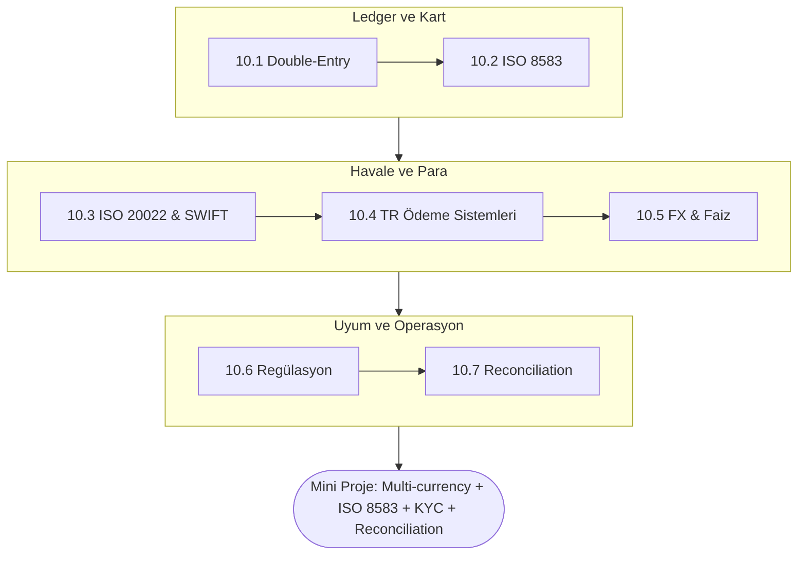

<div class="phase-cover-kicker">Onuncu Bölüm</div>

# Faz 10 — Domain Mastery (Banking Domain Bilgisi)

<div class="phase-cover-meta">
<div><strong>Süre</strong> ~3 hafta</div>
<div><strong>Topic</strong> 7 konu + mini proje</div>
<div><strong>Çıktı</strong> Domain bilen developer</div>
<div><strong>Ön koşul</strong> Faz 1-9 tamamlandı</div>
</div>

```admonish info title="Bu fazda ne öğreneceksin?"
Teknik beceriyi **banking domain bilgisiyle** taçlandıracaksın — TR bankasında junior'ı
öne çıkaran şey bu. Double-entry accounting, ISO 8583 (kart), ISO 20022/SWIFT (havale),
TR ödeme sistemleri (EFT/FAST/Havale), FX & faiz (stopaj/BSMV), regülasyon (BDDK/MASAK/KVKK)
ve reconciliation. "Teknik bilen junior çoktur; domain bilen junior nadir."
```

## Fazın haritası



## Bu faz neden en kritik

Phase 1–9 boyunca **teknik** beceri inşa ettin: hexagonal mimari, JPA internals, concurrency, SQL, batch, messaging, microservices, security, observability. Bunlar **her sektörde** mid-level Java backend dev'in bilmesi gereken şeyler.

Phase 10 farklı. Bu faz **banking domain bilgisi**. Bu faz olmadan bir banka mülakatında:

- "Double-entry accounting'in temel kuralı nedir?" → tutuluyorsun
- "ISO 8583 mesajı içinde MTI nereye düşer?" → tutuluyorsun
- "FAST ile EFT arasında ne fark var, hangisi 7/24?" → tutuluyorsun
- "BSMV nedir, mevduat faiz hesabında nereden gelir?" → tutuluyorsun
- "MASAK STR nedir, KYC'den nasıl ayrılır?" → tutuluyorsun

Yeterince teknik bilen junior çoktur. **Domain bilen junior nadir.** TR bankasında orta-üst seviyeye geçmenin en hızlı yolu domain bilgisidir. Bir takım liderine "bu işi anlıyor, sadece kod yazmıyor" dedirten şey budur.

Bu faz teorik gibi görünür ama:
- Her topic'in sonunda **kodda** uygulayacaksın (mini-project'te ISO 8583 parser, FX servisi, KYC workflow, reconciliation report yazacaksın)
- Domain'i bilirken kodun da farklılaşacak — naming (Eft vs Transfer), error mesajlar, validation kuralları daha "bankacı" olacak
- Mülakatta "PR review'da ne gördüğünde önce ne sorardın?" sorusuna düzgün cevap verebileceksin

## Bu faz bitiminde neyi söyleyebileceksin

- "Double-entry accounting kuralı: her transaction en az iki ledger entry yaratır; toplam debit = toplam credit. Bu invariant'ı SQL CHECK constraint veya domain assertion ile koruyorum."
- "ISO 8583 mesajı MTI + bitmap + DE'lerden oluşur. MTI 0100 authorization, 0200 financial, 0220 advice. PAN DE 2, processing code DE 3, amount DE 4..."
- "MT103 legacy SWIFT customer credit transfer. MX pacs.008 onun ISO 20022 XML karşılığı. TR bankaları 2025 itibariyle MX'e geçişi tamamlama yolunda."
- "EFT TCMB üzerinden, iş saatleri sınırlı, batch netting var. FAST 7/24 anlık, RTGS benzeri, TCMB FAST. Havale aynı banka içi instant. TROY yerli kart şeması."
- "TRY mevduat faizinde stopaj ve BSMV var. Stopaj %15 (vade 1 yıla kadar). 30/360 day count konvansiyonu çok yaygın TR mevduatta."
- "BDDK regülatör, MASAK AML, KVKK kişisel veri, KKB kredi geçmişi, Findeks skor. PCI-DSS kart datası için, banking-wide ISO 27001 de var."
- "Reconciliation: kendi defterimdeki (internal ledger) tutarın dış kaynaktaki (örn. SWIFT statement, MT940 / camt.053) tutarla eşleştiği günlük kontrol. Mismatch → break → araştırma."

## Topic listesi ve süre tahminleri

| # | Topic | Süre (saat) | Önem |
|---|-------|------------|------|
| 1 | Double-Entry Accounting | 6 | Kritik — ledger temel |
| 2 | ISO 8583 (Kart Mesajları) | 7 | Kritik — kart bankası rolündeyse |
| 3 | ISO 20022 & SWIFT (Wire Transfer) | 6 | Kritik — havale/EFT/swift dünyası |
| 4 | TR Ödeme Sistemleri (EFT, FAST, Havale) | 5 | Çok kritik — TR-spesifik, ezberlemen lazım |
| 5 | FX & Faiz Hesapları | 6 | Önemli — multi-currency, mevduat |
| 6 | Regülasyon (BDDK, MASAK, KVKK) | 5 | Önemli — compliance |
| 7 | Reconciliation & Settlement | 5 | Önemli — operasyon ekibiyle çalışırken |
| MP | Mini-project (multi-currency + ISO 8583 + KYC + reconciliation) | 15–20 | Birleştirme |
| TEST | PHASE_TEST | 1 | Self-assessment |

**Toplam tahmin: 55–65 saat (~3 hafta günde 2–3 saatten)**

## Hangi sırayla?

1. Önce **Topic 1 (Double-Entry)**. Bu Phase 1'de yüzeysel gördüğünün derinleşmiş hâli. Her topic'in altında double-entry'ye atıf var.
2. Sonra **Topic 4 (TR Ödeme Sistemleri)**. EFT/FAST/Havale TR mülakatında ilk 3 sorudan biri. Erken öğren, üstüne inşa et.
3. Sonra **Topic 3 (ISO 20022/SWIFT)**. Wire transfer dünyası; Topic 4 ile bağlantılı.
4. Sonra **Topic 5 (FX & Faiz)**. Topic 1.3'ün uygulamalı hâli + mevduat matematiği.
5. Sonra **Topic 2 (ISO 8583)**. Kart bankası perspektifi. Mini-project'te parser yazacağız.
6. Sonra **Topic 6 (Regülasyon)** ve **Topic 7 (Reconciliation)**. Operasyonel/compliance konular.
7. **Mini-project**'i tüm topic'leri birleştirerek yap.
8. **PHASE_TEST** ile kendini sına.

## Bu fazda yapacaklarımız (mini-project)

`core-banking` projesine şu eklemeler:

- **Multi-currency support** — Account'ta currency, transfer'da source/target currency, FX rate ile conversion
- **FX rate service** — TCMB API entegrasyonu (veya mock), `ExchangeRate` cache, daily snapshot
- **ISO 8583 parser/builder** — minimal subset (MTI + bitmap + DE 2, 3, 4, 7, 11, 41, 49); authorization → capture → refund mock flow
- **KYC workflow** — state machine (`SUBMITTED → REVIEWING → APPROVED/REJECTED`), domain event'leri
- **Interest accrual job** — daily compound TL mevduat faizi (BSMV/stopaj dahil)
- **Reconciliation report** — internal journal vs external CSV (MT940 benzeri) diff, "break" listesi

## Önemli notlar

**Bu faz'da daha çok okuyacaksın.** Phase 1–9'da kod ağırlıklıydı. Burada **anlama** ağırlıklı; ama her topic'in mini-task'lerinde **kodda** uygulayacaksın.

**Türkçe banking terminolojisi.** Bankada Türkçe konuşulur, ama dokümantasyon ve API'lar genelde İngilizce. Hem TR terimini hem EN karşılığını öğren:
- Hesap → Account
- Havale → Money Transfer (intra-bank)
- EFT → Electronic Funds Transfer (TCMB üzerinden, inter-bank)
- Defter → Ledger
- Bakiye → Balance
- Mahsup → Offset / netting
- Mutabakat → Reconciliation
- Takas → Clearing
- Tasfiye → Settlement
- Vade → Maturity
- Vergi mukimi → Tax resident
- Şüpheli işlem → Suspicious transaction

**AI'ya kod yazdırmak yerine sor.** Bu faz'da sorman gereken sorular daha çok kavramsal:
- "Türkiye'de FAST sisteminin RTGS olarak sınıflandırılma sebebi nedir?"
- "ISO 8583 0420 mesaj tipinin 0400'den farkı nedir?"
- "Stopaj ve BSMV mevduat faizinde nasıl hesaplanır, hangi sırayla?"

## Sonra ne var?

Bu faz bittiğinde sen sadece "Java backend bilen junior" değil, "Java backend + banking domain bilen junior" konumundasın. CV'ne, LinkedIn'ne yansıyacak. Mülakat sorusu cevapların değişecek.

Faz 11 DevOps (CI/CD, containerization, deploy) ve Faz 12 Testing'in derinleşmiş hâli olacak. Domain bilgisi onları renklendirecek — "Bu pipeline'da Flyway migration sırasında bir AML rule update nasıl rollout edilir?" gibi soruları rahat cevaplayacaksın.

```admonish success title="Başla"
İlk durak: [Topic 10.1 — Double-Entry Accounting](./01-double-entry-accounting/index.md).
Bu faz okuma ağırlıklı ama her topic'i kodda uygula — mini projede ISO 8583 parser, FX servisi,
KYC workflow ve reconciliation report yazacaksın.
```
