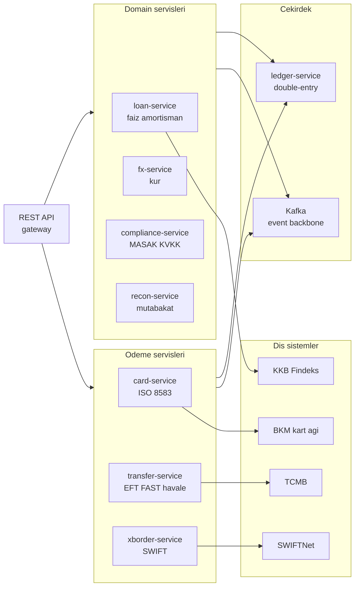
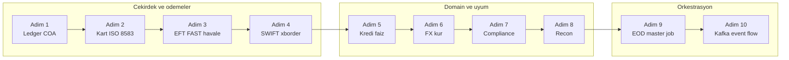
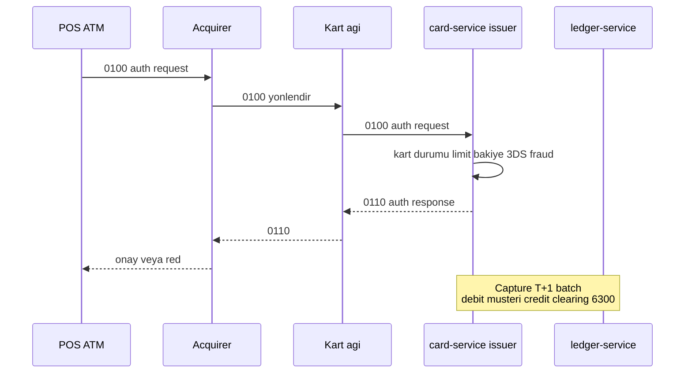
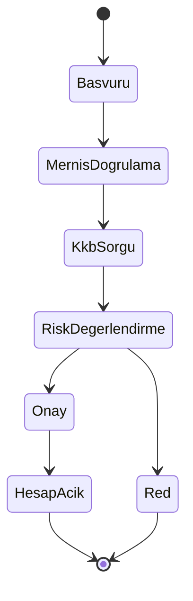

# Phase 10 Mini-Project — TR Banking Domain Integration

```admonish info title="Bu projede"
- Phase 7-9'un microservice + observability + security iskeletine **TR banking domain**'i entegre edip mini bir banka backend'i inşa ediyorsun
- Double-entry ledger'ı çekirdek gerçek kaynağı yapıyor; kart (ISO 8583), EFT/FAST/havale, SWIFT (ISO 20022), kredi ve FX servislerini bu ledger'a bağlıyorsun
- MASAK/KVKK/BDDK uyumunu (sanctions, STR, consent, crypto-shred, audit chain) kod seviyesinde uyguluyorsun
- 5 kaynaklı reconciliation + EOD master job + Kafka event backbone ile bankanın gece kapanışını ve servisler arası akışı kuruyorsun
- 7 production-like senaryoyu uçtan uca reproduce edip domain + tech stack birleşimini ispatlıyorsun
```

## Hedef

Phase 10'un 7 topic'inde TR bankacılık ekosistemini çalıştın; bu projede hepsini **tek bir sistemde** birleştiriyorsun. Yeni teori yok — **synthesis** var: her servis öğrendiğin bir topic'in domain karşılığı. Bir adımda takılırsan ilgili topic'e dön, oku, düzelt. Sonunda elinde TCMB/BKM/BDDK/MASAK/KKB ile konuşan, muhasebe etkisi doğru işleyen bir **TR banka backend'i** olacak.

```admonish tip title="Süre ve önbilgi"
15-20 gün ayır (günde ~3 saat). Başlamadan önce Phase 9 mini-project bitmiş, Topic 10.1-10.7 tamamlanmış ve defter notların yazılmış olmalı. Buradaki işin çoğu **domain'i tech stack'e giydirmek** — mikroservis, Kafka, security altyapın hazır kabul ediliyor.
```

## Sistem mimarisi

Mimarinin merkezinde **ledger-service** var: <mark>para hareketi yapan her servis buraya dengeli bir double-entry journal yazmadan işlemi kapatamaz</mark>. Servisler birbirleriyle doğrudan değil, **Kafka event backbone** üzerinden konuşur; dış sistemlere (TCMB, BKM, SWIFTNet, KKB) her servis kendi adaptöründen bağlanır.



```admonish warning title="Ledger tek gerçek kaynağıdır"
Bakiyeyi hiçbir servis kendi tablosunda tutmaz; bakiye her zaman ledger'dan türetilir. Her journal entry'de debit toplamı credit toplamına eşit olmak zorunda — bu invariant sağlanmadan hiçbir işlem commit edilmez. Ledger satırları immutable: düzeltme yalnızca ters kayıt (reversal) ile yapılır.
```

## Build plan

On adımda ilerle: ilk dördü çekirdek + ödeme rayını kurar, ortadaki dördü domain + uyumu ekler, son ikisi orkestrasyon ve event akışını bağlar.



---

### Adım 1 — Ledger service: Chart of Accounts + journal (1.5 gün)

**Ne yapacaksın:** `ledger-service`'i Chart of Accounts (COA) hiyerarşisi ve immutable journal/ledger tabloları ile kuracaksın (Topic 10.1). **Neden:** Sonraki her servis para hareketini buraya yazar — ledger olmadan hiçbir işlemin muhasebe etkisi yoktur. **Nasıl:** Önce hesap planını seed'le; asset/liability/income/intermediate tipleri ve currency segregation'ı kur, müşteri hesabını `2101` altında subaccount olarak modelle.

<details>
<summary>Referans: Chart of Accounts seed (~22 satır)</summary>

```sql
-- COA seed (50+ hesap)
INSERT INTO account (code, name, parent_code, account_type, currency) VALUES
('1', 'ASSETS', NULL, 'asset', NULL),
('1100', 'Cash & Equivalents', '1', 'asset', NULL),
('1101', 'Vault Cash', '1100', 'asset', 'TRY'),
('1102', 'Central Bank Reserve TRY', '1100', 'asset', 'TRY'),
('1103', 'Nostro JPMorgan USD', '1100', 'asset', 'USD'),
('1104', 'Nostro Deutsche Bank EUR', '1100', 'asset', 'EUR'),
('1200', 'Loans Receivable', '1', 'asset', NULL),
('1201', 'Consumer Loans', '1200', 'asset', NULL),
('1202', 'Mortgage Loans', '1200', 'asset', NULL),
-- ... 50+ accounts
('6100', 'EFT Outgoing Clearing', '6', 'intermediate', NULL),
('6200', 'FAST Outgoing Clearing', '6', 'intermediate', NULL),
('6300', 'Card Network Clearing', '6', 'intermediate', NULL),
('6400', 'SWIFT Outgoing Clearing', '6', 'intermediate', NULL);

-- Müşteri hesabı = 2101 subaccount'u (müşteri başına)
-- account.parent_code = '2101', account.code = '2101-' || customer_id
```

</details>

`LedgerService` API'si beş metod sunar; hepsi tek para birimi içinde çalışır ve atomicdir:

```java
post(JournalEntryRequest)              // atomic + balance check
reverse(journalId)                     // offset (ters) kayıt
balanceOf(accountId, asOfDate)         // sum / snapshot
trialBalance()                         // global debit vs credit
transactionHistory(accountId, from, to)
```

Immutable trigger ile ledger satırlarının UPDATE/DELETE'ini DB seviyesinde engelle. Multi-currency hesapları asla karıştırma.

Kontrol noktası: bir deposit journal'ı post et, `trialBalance()` global debit = credit dönsün; aynı journal'a `reverse` çağır, bakiye başlangıca dönsün.

### Adım 2 — Card service: ISO 8583 authorization (2 gün)

**Ne yapacaksın:** POS/ATM/e-ticaret authorization + capture + reversal + refund akışını `card-service`'te kuracaksın (Topic 10.2). **Neden:** Kart, bankanın en yüksek hacimli işlem kanalı; authorization sırasında verilen kararlar (limit, bakiye, 3DS, fraud) gerçek zamanlı olmalı. **Nasıl:** REST API simülasyon katmanı + internal jPOS server ile ISO 8583 mesaj tiplerini işle.

Aşağıdaki authorization akışı, POS'tan issuer'a kadar 0100/0110 mesaj yolculuğunu ve ledger'a hold'un neden bu aşamada yazılMAdığını gösterir:



REST uçları ve jPOS mesaj tipleri:

```
POST /v1/cards/authorize   -> 0100/0110 auth
POST /v1/cards/capture     -> 0220 advice (T+1 batch)
POST /v1/cards/reverse     -> 0400/0410 reversal
POST /v1/cards/refund      -> capture'ın tersi
```

Authorization mantığı sırayla: kart durumu, limit (günlük/aylık), bakiye (debit kart), 3D Secure (e-ticaret), fraud kuralları, KKB (kredi kartı başvurusu). <mark>Ham PAN sisteme girer girmez tokenize edilir, hiçbir log veya event'te plaintext dolaşmaz.</mark> Ledger etkisi ise aşamalara yayılır:

```
Authorization : Hold (journal YOK)
Capture (T+1) : Debit  Customer Card Account / Credit Card Network Clearing (6300)
Settlement(T+2): Debit  Card Network Clearing (6300) / Credit Nostro
Refund        : capture'ın reversal'ı
```

```admonish warning title="PCI-DSS scope ve PAN tokenization"
Ham PAN'ı sisteme sokma: giriş noktasında tokenize et (Topic 8.6). PAN hiçbir yerde plaintext loglanmaz veya saklanmaz — log, event ve DB'de yalnızca token dolaşır. Bu, PCI-DSS scope'unu tokenization servisine daraltmanın tek yolu.
```

Kontrol noktası: bir authorize → capture → settlement zinciri koştur; ledger'da hold aşamasında journal olmadığını, capture'da 6300 clearing'e credit düştüğünü doğrula.

### Adım 3 — Transfer service: TR EFT/FAST/havale (2 gün)

**Ne yapacaksın:** `transfer-service`'te üç TR ödeme tipini (EFT, FAST, havale) IBAN validasyonu, working-hours ve limit kontrolleriyle kuracaksın (Topic 10.4). **Neden:** EFT/FAST/havale TR retail bankacılığının bel kemiği; her birinin routing, çalışma saati ve limit kuralları farklı. **Nasıl:** IBAN MOD-97 doğrula, bank code çöz, kurala göre routing yap ve TCMB entegrasyonunu outbox pattern ile async kur (Topic 6.6). <mark>Para yurt dışına ya da başka bankaya çıkmadan önce sanctions screening'den geçmek zorunda.</mark>

Uçlar ve iş kuralları:

```
POST /v1/transfers/eft      GET /v1/transfers/{id}/status
POST /v1/transfers/fast
POST /v1/transfers/havale

Kurallar: IBAN MOD-97 · bank code resolve · EFT working-hours / FAST 24-7
         · FAST limit 70k TL · MASAK sanctions screening · müşteri limiti · BSMV
```

Ledger etkisi tipe göre değişir; intra-bank havale tek adımda kapanır, EFT clearing hesabından geçer:

```
Havale : Debit Customer A / Credit Customer B
EFT out: Initiate  Debit Customer A / Credit EFT Outgoing Clearing (6100)
         Settle    Debit 6100 / Credit Central Bank Reserve (1102)   [T+0/T+1 TCMB]
FAST   : EFT ile aynı, fakat gerçek zamanlı (~10 sn)
```

```admonish warning title="Sanctions ve idempotency para çıkışının ön koşuludur"
Her para çıkışında MASAK sanctions screening zorunlu ve tüm transfer işlemleri idempotent olmalı: TCMB'ye giden outbox mesajı bir kez üretilir, tüketici tekrar tetiklenirse ikinci kez para hareketi doğmaz.
```

Kontrol noktası: FAST ile 71k TL dene — limit reddi al; 50k TL FAST'i initiate et, outbox kaydının yazıldığını ve settlement sonrası 6100 clearing'in kapandığını doğrula.

### Adım 4 — Cross-border service: SWIFT pacs.008 (1.5 gün)

**Ne yapacaksın:** `xborder-service`'te ISO 20022 pacs.008 ile yurt dışı transfer kur (Topic 10.3). **Neden:** Kasım 2025 MT EOL sonrası cross-border artık MX-first; UETR takibi ve correspondent (nostro/vostro) routing bilmeden yurt dışı ödeme yapılamaz. **Nasıl:** BIC çöz, Prowide ile pacs.008 üret, XSD valide et, UETR ata, FX dönüşümü uygula (Topic 10.5) ve pacs.002 status update'ini consume et.

```
POST /v1/transfers/swift

Akış: BIC resolve · pacs.008 build (Prowide) · XSD validate · UETR generate
     · sanctions screening · currency conversion · correspondent routing

Ledger: Initiate Debit Customer A USD / Credit SWIFT Outgoing Clearing (6400-USD)
        Settle   Debit 6400-USD / Credit Nostro JPMorgan USD (1103)   [T+1]
```

pacs.002 status update geldiğinde işlemi completion veya rejection olarak kapat.

Kontrol noktası: 1000 USD transfer başlat, üretilen pacs.008'i XSD'ye karşı valide et, UETR'in event'lerde taşındığını ve pacs.002 "settled" sonrası nostro'nun (1103) borçlandığını doğrula.

### Adım 5 — Loan service: faiz + amortizasyon (1 gün)

**Ne yapacaksın:** `loan-service`'te başvuru, amortisman tablosu, günlük faiz tahakkuku ve erken kapama kur (Topic 10.5). **Neden:** Kredi, bankanın ana gelir kalemi; TR'ye özgü BSMV/KKDF vergileri ve YMO açıklaması regülasyon gereği. **Nasıl:** KKB Findeks skoru ile risk-based pricing yap, Fransız amortismanı üret, günlük accrual job'ı scheduled olarak koştur.

```
POST /v1/loans/apply       GET /v1/loans/{id}/schedule
POST /v1/loans/{id}/early-payoff

Mantık: KKB Findeks · risk-based pricing · Fransız amortisman
       · BSMV + KKDF · YMO disclosure
```

Günlük faiz tahakkuku idempotent bir scheduled job olmalı — aynı gün iki kez koşarsa çift kayıt üretmemeli:

```java
@Scheduled(cron = "0 30 23 * * *")
public void accrueDailyInterest() {
    // Ledger: Debit Loan Receivable / Credit Interest Income (4101)
}
```

BSMV'yi aylık recognize edip devlete karşı liability olarak yaz.

Kontrol noktası: 100k / 60 ay kredi için amortisman üret, son taksitte residual farkının kapandığını gör; accrual job'ı iki kez koştur, ledger'da tek kayıt olduğunu doğrula.

### Adım 6 — FX service (1 gün)

**Ne yapacaksın:** `fx-service`'te bid/ask rate board, müşteri dönüşümü ve forward kontrat kur (Topic 10.5). **Neden:** FX hem müşteri işlemi hem de cross-border'ın alt bileşeni; spread ve bank FX position doğru muhasebeleşmeli. **Nasıl:** TCMB rate feed mock'unu 5 dakikada bir refresh et, currency pair başına bid/ask spread uygula, stres senaryosunda spread'i genişlet.

```
GET  /v1/fx/rates       POST /v1/fx/convert       POST /v1/fx/forward
```

Müşteri USD alımı iki bacaklı bir journal üretir — TRY tarafı ve USD tarafı ayrı, bank FX position üzerinden:

```
Müşteri 32.60'tan 1000 USD alır:
  Debit  Customer A TRY        32600.00 / Credit Bank FX Position TRY  32600.00
  Debit  Bank FX Position USD   1000.00 / Credit Customer A USD         1000.00
```

Kontrol noktası: rate board'u refresh et, bir convert işlemi yap ve dört ledger satırının (2 TRY + 2 USD) dengede olduğunu doğrula.

### Adım 7 — Compliance service: MASAK + KVKK + audit (1.5 gün)

**Ne yapacaksın:** `compliance-service`'te real-time monitoring, sanctions screening, STR workflow, consent ve audit hash chain kur (Topic 10.6). **Neden:** Uyum bir eklenti değil, bankanın lisans şartı; MASAK ve KVKK ihlali para cezası ve lisans riskidir. **Nasıl:** Kafka consumer ile işlemleri canlı izle, KYC/onboarding'i state machine olarak modelle, right-to-be-forgotten'ı crypto-shred ile çöz (Topic 8.6).

Müşteri onboarding, KYC state machine üzerinden ilerler; MERNIS + KKB doğrulaması geçmeden hesap açılmaz:



Compliance kapsamı iki ayağa oturur — izleme kuralları ve veri hakları:

```
Monitoring : real-time (Kafka consumer) · sanctions screening
             · STR workflow (alert -> review -> submit)
Kurallar   : smurfing · large cash · sanctions counterparty · PEP · xborder anomaly
Sanctions  : OFAC SDN · EU · MASAK national (günlük refresh)
KVKK       : consent management · right to be forgotten (crypto-shred)
             · audit hash chain (Topic 8.7)
```

Crypto-shred ile müşteri anahtarı silinse bile audit hash chain bozulmaz: işlem geçmişi pseudonymized olarak kalır, regülasyon gereği 10 yıl saklanır. Silme, kişisel veriyi okunamaz kılmaktır — kaydı yok etmek değil.

Kontrol noktası: 24 saatte 50k'ya ulaşan küçük işlemler üret — smurfing kuralı alert doğursun; bir consent revoke et, ilgili anahtarı crypto-shred'le ve audit chain'in hâlâ valide ettiğini doğrula.

### Adım 8 — Reconciliation service (1.5 gün)

**Ne yapacaksın:** `recon-service`'te 5 kaynaklı (kart, EFT, FAST, SWIFT, internal) EOD mutabakatı kur (Topic 10.7). **Neden:** Mutabakat bankanın "hesaplar tutuyor mu?" kontrolü; break'ler yakalanmazsa kayıp/dolandırıcılık görünmez kalır. **Nasıl:** Spring Batch (chunk + restart + ShedLock) ile match et, break'leri kategorize + yaşlandır, çözümü adjustment journal ile ledger'a yaz.

```
EOD jobs: Card NDC · EFT (TCMB statement) · FAST · SWIFT nostro (camt.053 parse)
Batch   : chunk + restart + ShedLock · match (exact ref + fuzzy)
         · break categorize · aging + escalation · resolution adjustment journal
Dashboard: open breaks · aged breaks · critical alerts
```

Kontrol noktası: kart NDC dosyasına internal'da olmayan 100 TL fazla koy — break kritik olarak açılsın; adjustment journal ile çöz, break'in kapandığını ve ledger'ın dengelendiğini doğrula.

### Adım 9 — EOD master job (1 gün)

**Ne yapacaksın:** Gece kapanışını orkestre eden master job'ı kuracaksın. **Neden:** Banka her gece deterministik bir sırayla kapanır; faiz tahakkuku recon'dan önce, statement recon'dan sonra gelmeli. **Nasıl:** Her adımı Spring Batch + ShedLock + retry + audit ile sarmala.

<details>
<summary>Referans: EOD master job sırası (23:30 - 02:00)</summary>

```
1. Online trafiği graceful durdur
2. Faiz tahakkuku (Topic 10.5)
3. BSMV/KKDF aylık kapanış (ayın son günü)
4. Statement üret (camt.053)
5. MASAK raporlarını gönder
6. Reconciliation'lar (kart, EFT, SWIFT)
7. Regulatory metrikler (CAR, LCR)
8. Ledger snapshot backup
9. Online trafiği yeniden başlat
```

</details>

Kontrol noktası: master job'ı test verisiyle koştur; adım sırasının korunduğunu, bir adım fail edince retry + audit kaydının düştüğünü ve ShedLock ile ikinci instance'ın aynı job'ı çalıştırmadığını doğrula.

### Adım 10 — Kafka event flow (1 gün)

**Ne yapacaksın:** Servisler arası event backbone'u 8+ topic ile kur. **Neden:** Servisler doğrudan çağrıyla birbirine bağlanırsa coupling ve cascade failure doğar; event-driven yapı gevşek bağlı ve dayanıklıdır. **Nasıl:** Her serviste outbox pattern (Topic 6.6) kullan, tüm consumer'ları idempotent yap. <mark>Kafka en-az-bir-kez teslim eder; aynı event iki kez gelirse ledger'a ikinci kez dokunulmamalı.</mark>

```
customer-events · card-events · transfer-events · loan-events
fx-events · compliance-events · recon-events · ledger-events
```

```admonish warning title="Outbox + idempotent consumer şart"
Event'i doğrudan publish etme: DB transaction'ı ile aynı commit'te outbox tablosuna yaz, ayrı bir relay Kafka'ya taşısın. Consumer tarafında her event idempotent işlenmeli — Kafka en-az-bir-kez teslim eder, aynı event iki kez gelirse ikinci kez ledger'a dokunulmamalı.
```

Kontrol noktası: bir transfer tamamla, `transfer-events` ve `ledger-events`'in düştüğünü gör; aynı event'i consumer'a iki kez ver, bakiyenin değişmediğini doğrula.

---

## Doğrulama senaryoları

Servisler ayakta olunca, bunları **uçtan uca reproduce et ve gözünle doğrula** — banking'de "yaptım" demek değil, akışı çalışır göstermek geçerlidir. Her senaryoyu koştururken log'u ve ledger'ı izle, audit trail'in tam olduğunu kontrol et, kritik ekranların screenshot'ını al. Mülakatta bu 7 akışı anlatabilmek, Phase 10'u bitirdiğinin somut kanıtıdır.

<details>
<summary>7 production-like senaryonun tam adımları</summary>

```
Senaryo 1 — Customer journey (onboarding -> ilk transfer)
1. Başvuru -> KYC (MERNIS + KKB) -> hesap aç
2. 10.000 TL nakit yatır -> ledger posting
3. Kart bas + aktive et
4. 500 TL online alışveriş -> auth -> settlement T+1 -> recon match
5. 1000 TL EFT -> TCMB -> alıcı banka -> completed
6. Audit trail tam

Senaryo 2 — Cross-border transfer + FX
1. 1000 USD Almanya transferi
2. FX 32.50 -> 32.500 TL debit
3. Sanctions screening pass
4. pacs.008 + UETR üretilir
5. SWIFT outbox -> mock SWIFTNet
6. pacs.002 -> settled
7. Ledger + SWIFT nostro recon match

Senaryo 3 — Fraud alert
1. 24h'te 50k'ya ulaşan küçük işlemler -> smurfing
2. MASAK kuralı tetiklenir
3. Compliance officer review -> STR draft
4. Onay -> STR submit
5. Hesap flag -> restrict + audit

Senaryo 4 — Loan lifecycle
1. 100k TL kredi başvurusu
2. KKB Findeks 1500 -> eligible
3. Onay + amortisman (60 ay)
4. YMO disclosure
5. Günlük accrual posting
6. Aylık otomatik taksit
7. 24. ayda erken kapama -> outstanding calc
8. Kredi kapanır -> ledger sıfır bakiye

Senaryo 5 — Recon break resolution
1. Kart NDC 100 TL fazla (internal eksik)
2. Break kritik, 5 gün aged
3. Kök neden: outbox lag ile eksik capture
4. Adjustment journal
5. Recon resolution + audit

Senaryo 6 — EOD master job
1. Online trafik dur
2. 50k kredi faiz tahakkuku
3. 500k müşteri günlük statement
4. MASAK aylık batch
5. Kart recon T-1 settle + SWIFT nostro recon
6. CAR/LCR + BDDK raporu
7. Hepsi 2.5 saatte tamamlanır

Senaryo 7 — KVKK right to be forgotten
1. Müşteri silme talebi
2. Müşteri anahtarını crypto-shred
3. Audit trail korunur (pseudonymized)
4. İşlem geçmişi için 10 yıl retention sürer
5. Marketing consent revoke + confirmation
```

</details>

## Defter notları

Her başlığı kendi cümlenle tamamla — bu 20 madde Phase 10'un domain özeti.

<details>
<summary>20 defter notu başlığı</summary>

```
1.  Double-entry ledger 6 tip transaction (deposit, transfer, EFT, interest, FX, fee)
2.  COA hierarchy + intermediate clearing accounts banking design
3.  ISO 8583 card auth (0100/0110) + EMV ARQC + PCI-DSS scope
4.  PAN tokenization + acquirer/issuer/network rolleri
5.  TR EFT/FAST/havale routing + working hours + limits
6.  TR IBAN MOD-97 + 5 haneli bank code + 26 char format
7.  SWIFT pacs.008 xborder + UETR + correspondent (nostro/vostro)
8.  ISO 20022 migration Kasım 2025 EOL + MX-first
9.  FX bid/ask spread + müşteri perspektifi + forward CIP
10. BSMV %5 + KKDF %10 consumer loan TR vergileri
11. YMO (efektif yıllık maliyet) BDDK + TBB disclosure
12. Day count conventions (ACT/365, ACT/360, ACT/ACT, 30/360)
13. Fransız amortisman + son taksit residual
14. Günlük faiz accrual + ledger idempotency + time zone
15. MASAK STR + sanctions screening + smurfing
16. KVKK consent + right to be forgotten + crypto-shred + retention
17. BDDK 5411 + Bilgi Sistemleri + 10 yıl retention + 24h incident
18. Reconciliation 5 kaynak + break aging
19. EOD master job orchestration
20. Senior banking engineer mind-map: domain + tech stack birleştirme
```

</details>

---

## Tamamlama kriterleri

Başlamadan bir kez oku, bitince tek tek işaretle.

- [ ] `ledger-service` — COA + immutable journal/ledger, trial balance dengede
- [ ] `card-service` — ISO 8583 0100/0210/0220/0400 + PAN tokenization
- [ ] `transfer-service` — EFT/FAST/havale + IBAN + working hours + sanctions
- [ ] `xborder-service` — SWIFT pacs.008 + UETR + nostro recon
- [ ] `loan-service` — KKB + amortisman + BSMV/KKDF + günlük accrual
- [ ] `fx-service` — rate board + müşteri dönüşümü + forward
- [ ] `compliance-service` — MASAK kuralları + STR + consent + audit chain
- [ ] `recon-service` — 5 kaynak recon + Spring Batch + break aging
- [ ] EOD master job orchestration (sıra + ShedLock + retry + audit)
- [ ] Kafka event flow (8+ topic) + outbox + idempotent consumer
- [ ] 7 senaryo uçtan uca reproduce + verify
- [ ] 20 defter notu yazıldı
- [ ] Architecture diagram + flow diagram'lar hazır

---

## Önemli not

Phase 10 = **banking domain expert** geçişi. Bu mini-project'i bitiren; TR banking ekosistemini (TCMB, BKM, BDDK, MASAK, KKB) uçtan uca anlamış, işlem lifecycle'ını muhasebe etkisiyle birlikte biliyor, regulatory compliance'ı kod seviyesinde uygulayabiliyor ve cross-border modernizasyonu (ISO 20022) takip ediyor olur.

Salt teknik (Phase 1-9) + domain (Phase 10) = TR bankası **mülakatına hazır**, mid+/senior backend engineer için **ayırt edici** bir profil. Phase 11 (DevOps) + Phase 12 (Testing) ile production deploy ve quality assurance'ı tamamlayacaksın.

```admonish success title="Proje Tamamlama Kriterleri"
- `ledger-service` immutable double-entry ile ayakta; trial balance global debit = credit dönüyor ve reversal çalışıyor
- Kart (ISO 8583), EFT/FAST/havale, SWIFT (pacs.008 + UETR) ve FX servisleri ledger'a doğru journal yazıyor
- `compliance-service` MASAK sanctions + STR + KVKK crypto-shred + audit hash chain'i kod seviyesinde uyguluyor
- `recon-service` 5 kaynağı mutabık kılıyor, break aging + adjustment journal çalışıyor; EOD master job sırayı ShedLock ile orkestre ediyor
- Kafka event flow 8+ topic + outbox + idempotent consumer ile gevşek bağlı çalışıyor
- 7 production-like senaryo uçtan uca reproduce edildi, audit trail tam ve 20 defter notu yazıldı
```

Hepsi onaylı → Faz 10 PHASE_TEST'e geç → [PHASE_TEST.md](../PHASE_TEST.md)
