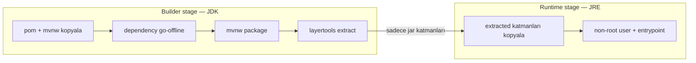
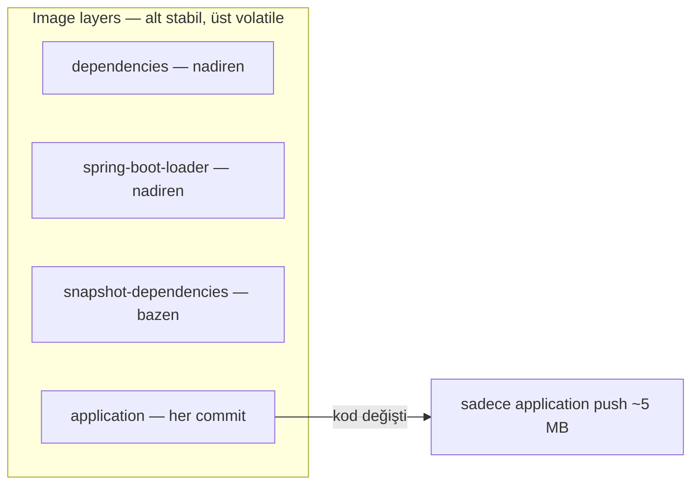
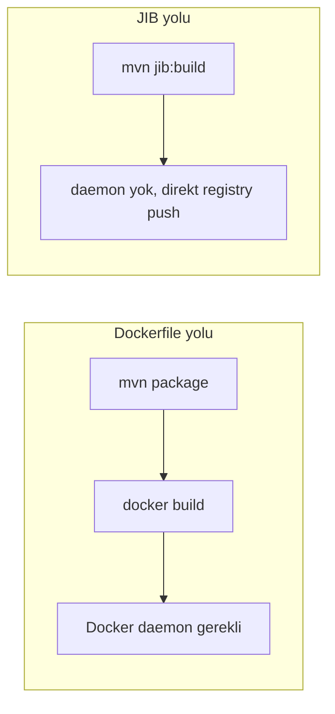

# Topic 11.1 — Docker for Java

```admonish info title="Bu bölümde"
- Naive 700 MB'lık image'ı multi-stage build + JRE-only runtime ile ~250 MB'a indirmek
- Spring Boot layered jar ile Docker cache'i sömürmek: her commit'te 250 MB değil ~5 MB push
- Base image seçimi — Eclipse Temurin vs Distroless vs Alpine — ve banking trade-off'ları
- Non-root user, healthcheck, K8s liveness/readiness probe, production banking JVM flag'leri
- Supply chain güvenliği: Trivy scan + SBOM + Cosign imzalama zinciri
```

## Hedef

Production-grade bir Java/Spring Boot Docker image'ı **elle üretebilmek**. Multi-stage build ile builder ve runtime katmanlarını ayırmak, Spring Boot layered jar ile cache'i optimize etmek, JIB plugin'i ile Dockerfile'sız reproducible build almak. Base image seçimini (Temurin, Distroless, Alpine) banking bağlamında gerekçelendirmek; non-root user, healthcheck, banking JVM flag'leri ve K8s probe'larıyla image'ı sertleştirmek. Son olarak Trivy scan, SBOM ve Cosign imzalama ile supply chain bütünlüğünü kurmak.

## Süre

Okuma: 2-2.5 saat • Kendini Sına: 45 dk • Pratik (opsiyonel): 3-4 saat • Toplam: ~3 saat (+ pratik)

## Önbilgi

- Linux temel (dosya sistemi, kullanıcı/grup, environment variable)
- Docker konsepti — image vs container farkını biliyorsun
- Spring Boot fat jar yapısı ve Maven build lifecycle

---

## Kavramlar

### 1. Docker image — anatomi

Bir image'ı optimize etmenin ilk şartı, onun **tek bir blok değil katmanlı** olduğunu görmek. Image, üst üste binmiş read-only filesystem snapshot'larından oluşur; container ise bu katmanların üstüne yazılabilir bir katman ekleyen çalışan bir instance'tır.

```
Image     = read-only layered filesystem snapshot
Container = running instance + writable layer
```

Tipik bir Java image'ı alttan üste şu katmanlardan oluşur:

```
1. Base OS (Ubuntu, Alpine)
2. JRE/JDK
3. App dependencies (Spring Boot libs)
4. App code (kendi class'ların)
5. Config + entrypoint
```

Optimizasyonun altın kuralı **layer ordering**: sık değişenler üstte, stabil olanlar altta. Docker değişmeyen katmanları cache'ten yeniden kullanır — yani sadece bir class değiştiğinde tüm image'ı değil, sadece üstteki ince katmanı yeniden inşa eder.

### 2. Naive Dockerfile — neden yetmez

En kısa Dockerfile üç satırdır ve çalışır; sorun bunun production'da 700 MB'lık bir yük ve bir güvenlik açığı olması.

```dockerfile
FROM openjdk:21-jdk
COPY target/banking-service-1.0.jar /app.jar
CMD ["java", "-jar", "/app.jar"]
```

Bu image neyi yanlış yapar:

- **700+ MB** — full Ubuntu + JDK (build araçları dahil) taşınır
- App tek layer'da — jar'ın herhangi bir bitini değiştirsen tüm katman yeniden push edilir
- **Root user** olarak çalışır (güvenlik açığı)
- Healthcheck yok, banking JVM flag'i yok
- JRE yerine JDK — runtime'a `javac`, `jdb` gibi build/debug araçları gereksiz yere girer

Kalan bölümler bu altı sorunu tek tek çözecek.

### 3. Multi-stage build — doğrusu

Build araçlarını (Maven, JDK, kaynak kod) production image'ına taşımak hem ~400 MB gereksiz yük hem de attack surface demektir. **Multi-stage build** bunu ikiye böler: bir *builder* stage'i derler, ayrı bir *runtime* stage'i sadece üretilen artifact'ı kopyalar.



Builder stage'i JDK üzerinde derler ve Spring Boot jar'ını katmanlara ayırır. Dikkat: `pom.xml` önce kopyalanır ki dependency indirme adımı kaynak kod değişse bile cache'ten gelsin.

```dockerfile
# Stage 1: Build
FROM eclipse-temurin:21-jdk-jammy AS builder
WORKDIR /build

# Maven dependency'lerini cache'le — pom önce, layer cache dostu
COPY pom.xml ./
COPY .mvn/ .mvn/
COPY mvnw ./
RUN ./mvnw dependency:go-offline -B

# Kaynağı kopyala + derle
COPY src ./src
RUN ./mvnw package -DskipTests -B

# Spring Boot layer'larını çıkar
RUN java -Djarmode=layertools -jar target/banking-service-*.jar extract --destination extracted/
```

Runtime stage'i **sadece JRE** kullanır, non-root user oluşturur ve extracted katmanları least→most volatile sırasında kopyalar. <mark>Runtime image'ına asla JDK değil, JRE koy — javac ve build araçları çalışan serviste sadece attack surface büyütür.</mark>

```dockerfile
# Stage 2: Runtime — sadece JRE
FROM eclipse-temurin:21-jre-jammy
LABEL maintainer="banking-platform@mavibank.com"

# Non-root user
RUN groupadd --gid 1000 banking && \
    useradd --uid 1000 --gid banking --shell /bin/bash --create-home banking
USER banking:banking
WORKDIR /app

# Katman sırası: least → most volatile
COPY --from=builder --chown=banking:banking /build/extracted/dependencies/ ./
COPY --from=builder --chown=banking:banking /build/extracted/spring-boot-loader/ ./
COPY --from=builder --chown=banking:banking /build/extracted/snapshot-dependencies/ ./
COPY --from=builder --chown=banking:banking /build/extracted/application/ ./
```

Kalan kısım JVM banking config'i, port'lar, healthcheck ve entrypoint'i ekler. Sonuç: **~250 MB** (önceki 700+ MB'dan). Tam Dockerfile aşağıda:

<details>
<summary>Tam kod: Multi-stage Dockerfile (~50 satır)</summary>

```dockerfile
# Stage 1: Build
FROM eclipse-temurin:21-jdk-jammy AS builder
WORKDIR /build

# Cache Maven dependencies
COPY pom.xml ./
COPY .mvn/ .mvn/
COPY mvnw ./
RUN ./mvnw dependency:go-offline -B

# Copy + build
COPY src ./src
RUN ./mvnw package -DskipTests -B

# Extract Spring Boot layers
RUN java -Djarmode=layertools -jar target/banking-service-*.jar extract --destination extracted/

# Stage 2: Runtime
FROM eclipse-temurin:21-jre-jammy
LABEL maintainer="banking-platform@mavibank.com"
LABEL version="1.0.0"

# Non-root user
RUN groupadd --gid 1000 banking && \
    useradd --uid 1000 --gid banking --shell /bin/bash --create-home banking
USER banking:banking

WORKDIR /app

# Copy in layer order (least → most volatile)
COPY --from=builder --chown=banking:banking /build/extracted/dependencies/ ./
COPY --from=builder --chown=banking:banking /build/extracted/spring-boot-loader/ ./
COPY --from=builder --chown=banking:banking /build/extracted/snapshot-dependencies/ ./
COPY --from=builder --chown=banking:banking /build/extracted/application/ ./

# JVM banking config
ENV JAVA_OPTS="-Xms512m -Xmx2g -XX:+UseG1GC -XX:MaxGCPauseMillis=200 \
    -XX:+HeapDumpOnOutOfMemoryError -XX:HeapDumpPath=/dumps \
    -Xlog:gc*:file=/var/log/banking/gc.log:time,uptime,level,tags:filecount=10,filesize=100M \
    -XX:+UseStringDeduplication -XX:+AlwaysPreTouch \
    -Djava.security.egd=file:/dev/./urandom \
    -Duser.timezone=Europe/Istanbul"

EXPOSE 8080 8081

HEALTHCHECK --interval=30s --timeout=10s --start-period=60s --retries=3 \
    CMD curl -fsS http://localhost:8081/actuator/health/liveness || exit 1

ENTRYPOINT ["sh", "-c", "java $JAVA_OPTS org.springframework.boot.loader.launch.JarLauncher"]
```

</details>

### 4. Spring Boot layered jar — cache'in kalbi

Fat jar'ı tek katman olarak kopyalarsan, tek bir satır kod değişince 250 MB'ın tamamı yeniden push edilir. Spring Boot 2.3+ jar'ı **değişim sıklığına göre katmanlara** ayırabilir — böylece Docker cache'i gerçekten çalışır.

```
extracted/
├── dependencies/             (nadiren değişir — kütüphaneler)
├── spring-boot-loader/       (nadiren değişir — Spring Boot iç kod)
├── snapshot-dependencies/    (bazen — SNAPSHOT sürümler)
└── application/              (sık değişir — senin kodun)
```

Katmanlar en stabilden en değişkene doğru dizilir; bir commit sadece `application/` katmanını (~5 MB) etkiler, altındaki dev bağımlılık katmanı cache'ten gelir.



Bunun build performansına etkisi dramatik:

```
Layered YOK: commit başına 250 MB push (~30 sn)
Layered VAR: commit başına ~5 MB push (~3 sn)
```

CI'da her PR image build ediyorsan, bu fark günde saatler kazandırır.

### 5. JIB plugin — Dockerfile'sız build

Dockerfile bakımı istemiyorsan veya CI runner'ında Docker daemon yoksa, Google'ın **JIB** plugin'i image'ı doğrudan Maven'dan üretir — layered yapıyı da otomatik kurar.



Plugin'in çekirdeği `from` (base image) ve `to` (hedef registry) tanımıdır:

```xml
<plugin>
    <groupId>com.google.cloud.tools</groupId>
    <artifactId>jib-maven-plugin</artifactId>
    <version>3.4.0</version>
    <configuration>
        <from>
            <image>eclipse-temurin:21-jre-jammy</image>
        </from>
        <to>
            <image>registry.mavibank.com/banking/${project.artifactId}:${project.version}</image>
            <auth>
                <username>${env.REGISTRY_USER}</username>
                <password>${env.REGISTRY_PASSWORD}</password>
            </auth>
        </to>
    </configuration>
</plugin>
```

`container` bloğu ise JVM flag'leri, port'lar, non-root user (`1000:1000`) ve timezone gibi runtime ayarlarını taşır — Dockerfile'daki `ENV` ve `USER` direktiflerinin karşılığı. Tam config aşağıda:

<details>
<summary>Tam kod: JIB plugin container config (~42 satır)</summary>

```xml
<plugin>
    <groupId>com.google.cloud.tools</groupId>
    <artifactId>jib-maven-plugin</artifactId>
    <version>3.4.0</version>
    <configuration>
        <from>
            <image>eclipse-temurin:21-jre-jammy</image>
        </from>
        <to>
            <image>registry.mavibank.com/banking/${project.artifactId}:${project.version}</image>
            <auth>
                <username>${env.REGISTRY_USER}</username>
                <password>${env.REGISTRY_PASSWORD}</password>
            </auth>
        </to>
        <container>
            <jvmFlags>
                <jvmFlag>-Xms512m</jvmFlag>
                <jvmFlag>-Xmx2g</jvmFlag>
                <jvmFlag>-XX:+UseG1GC</jvmFlag>
                <jvmFlag>-XX:+HeapDumpOnOutOfMemoryError</jvmFlag>
                <jvmFlag>-Djava.security.egd=file:/dev/./urandom</jvmFlag>
                <jvmFlag>-Duser.timezone=Europe/Istanbul</jvmFlag>
            </jvmFlags>
            <ports>
                <port>8080</port>
                <port>8081</port>
            </ports>
            <labels>
                <maintainer>banking-platform@mavibank.com</maintainer>
                <version>${project.version}</version>
            </labels>
            <user>1000:1000</user>
            <environment>
                <TZ>Europe/Istanbul</TZ>
            </environment>
        </container>
        <containerizingMode>packaged</containerizingMode>
    </configuration>
</plugin>
```

</details>

Build komutları hedefe göre değişir:

```bash
mvn compile jib:build         # doğrudan registry'ye push
mvn compile jib:dockerBuild   # local Docker daemon'a (registry olmadan)
mvn compile jib:buildTar      # tar dosyasına
```

JIB'in banking için cazip yanları: Dockerfile bakımı yok, **reproducible build** (aynı input → aynı image hash), paralel layer push ile hızlı ve daemon gerektirmediği için CI-dostu. Dezavantajı ise esneklik: bazı Dockerfile pattern'leri yok ve custom `apt-get` paketleri zor. Çoğu banking servisi için JIB idealdir; sistem paketi gerektiren özel image'lar için Dockerfile'a düşersin.

### 6. Base image seçimi

Base image seçimi boyut, güvenlik ve uyumluluk arasında bir takas — banking'de her üçü de önemli.

| Base | Boyut | Banking notu |
|---|---|---|
| `eclipse-temurin:21-jre-jammy` (Ubuntu) | ~250 MB | Standart, glibc, debug araçları var |
| `eclipse-temurin:21-jre-alpine` | ~80 MB | Küçük ama musl libc (bazı JNI'de sorun) |
| `gcr.io/distroless/java21-debian12` | ~150 MB | Shell yok — maksimum güvenlik |
| `bellsoft/liberica-runtime-container:jre-21` | ~150 MB | BellSoft NIK ile tune edilmiş |
| `azul/zulu-openjdk:21-jre` | ~200 MB | Azul destekli |
| `amazoncorretto:21-alpine-jre` | ~90 MB | AWS, Alpine |

Banking pratiğinde üç isim öne çıkar: **Eclipse Temurin** (open source, iyi test edilmiş, güvenli update ritmi — standart tercih), **Distroless** (debug shell yok, kritik servisler için) ve **BellSoft Liberica** (NIK ile daha hızlı startup).

```admonish warning title="Alpine'a dikkat"
Alpine küçük ve hızlı başlar ama `musl libc` kullanır, glibc değil. Banking'de bunun bedeli olabilir: bazı native kütüphaneler uyumsuz, Bouncy Castle FIPS modunda sorun çıkarabilir, JNI köprüleri beklenmedik şekilde patlayabilir. Kritik para servislerinde glibc tabanlı bir base (Temurin veya Distroless) daha güvenli tercihtir.
```

### 7. Distroless — güvenlik önce

En agresif attack surface küçültme yöntemi, işletim sistemini neredeyse tamamen atmaktır. **Distroless** image'ında shell, paket yöneticisi veya coreutils yoktur — sadece Java, glibc ve tzdata bulunur.

```dockerfile
FROM eclipse-temurin:21-jdk-jammy AS builder
# ... build steps
RUN java -Djarmode=layertools -jar target/banking-service-*.jar extract

FROM gcr.io/distroless/java21-debian12
COPY --from=builder /build/dependencies/ /app/
COPY --from=builder /build/spring-boot-loader/ /app/
COPY --from=builder /build/snapshot-dependencies/ /app/
COPY --from=builder /build/application/ /app/

USER nonroot:nonroot
EXPOSE 8080

ENTRYPOINT ["java", "-XX:+UseG1GC", "-jar", "/app/spring-boot-loader/org/springframework/boot/loader/launch/JarLauncher.class"]
```

Ne yok: bash/sh/ash (shell yok), paket yöneticisi yok, `ls`/`cat` gibi coreutils yok. Attack surface minimum — banking'in kritik servisleri için tercih edilir.

```admonish tip title="Distroless'te debug"
Shell olmadığı için `kubectl exec ... -- sh` çalışmaz. Çözüm: `kubectl debug` ile ephemeral debug container ekle — asıl container'a araç bulaştırmadan yanına geçici bir shell'li container mount edersin. Böylece güvenlik ödünü vermeden sorun ararsın.
```

### 8. Non-root user + hardening

Container root olarak çalışırsa, bir escape açığı doğrudan host'ta root demektir. <mark>Banking'de non-root user mandatory'dir — UID en az 1000, tercihen 10001 gibi yüksek bir değer.</mark>

```dockerfile
# Non-root user (UID > 1000 banking standardı)
RUN groupadd --gid 10001 banking && \
    useradd --uid 10001 --gid 10001 --shell /sbin/nologin --no-create-home banking

USER 10001:10001

# Read-only root filesystem (K8s securityContext de set edebilir)
# Yazılabilir dizinleri volume olarak mount et
VOLUME /tmp /var/log/banking /dumps

# Capability'leri düşür
# (K8s securityContext.capabilities.drop: ["ALL"])
```

Banking image güvenlik checklist'i:

- USER non-root (UID ≥ 1000), `--shell /sbin/nologin`
- SETUID binary yok, SSH server yok
- Minimum paket seti
- Health endpoint ayrı port'ta (management)
- Image içinde secret yok
- CI'da image scan zorunlu

### 9. .dockerignore

Build context'e neyi göndermediğin, build hızını ve cache boyutunu doğrudan etkiler. `.dockerignore` gereksiz her şeyi dışarıda tutar.

```
# .dockerignore
.git
.gitignore
target/
!target/banking-service-*.jar    # JIB dışında build ediyorsan
*.md
.idea/
.vscode/
*.log
node_modules/
.env*
docker-compose*.yml
Dockerfile*
.dockerignore
.github/
docs/
```

Minimum context → daha hızlı build + daha küçük cache. `.env*` satırını atlamak, yanlışlıkla secret'ları image'a sokmanın en kolay yoludur.

### 10. Banking JVM flag'leri — production

Bir banking servisini prod'a alırken JVM'i default'a bırakamazsın: GC davranışı, heap dump, GC log ve JFR gibi observability'i baştan kurmalısın.

```bash
JAVA_OPTS="
  -Xms2g -Xmx2g                                       # Aynı heap (resize pause'u önle)
  -XX:+UseG1GC                                         # Modern collector
  -XX:MaxGCPauseMillis=200                             # Hedef pause
  -XX:InitiatingHeapOccupancyPercent=45                # Concurrent start
  -XX:+ParallelRefProcEnabled
  -XX:+AlwaysPreTouch                                  # Heap'i startup'ta dokun
  -XX:+UseStringDeduplication                          # String memory azalt
  -XX:+HeapDumpOnOutOfMemoryError
  -XX:HeapDumpPath=/dumps/heap-%p-%t.hprof
  -Xlog:gc*:file=/var/log/banking/gc.log:time,uptime,level,tags:filecount=10,filesize=100M
  -XX:NativeMemoryTracking=summary
  -XX:+StartFlightRecording=duration=0s,filename=/var/log/banking/flight.jfr,settings=default,maxage=1h
  -XX:+UnlockDiagnosticVMOptions
  -XX:+DebugNonSafepoints
  -Dfile.encoding=UTF-8
  -Duser.timezone=Europe/Istanbul
  -Djava.security.egd=file:/dev/./urandom
  -Dspring.profiles.active=production
  -Dotel.service.name=transfer-service
  -Dotel.exporter.otlp.endpoint=http://otel-collector:4317
"
```

Ultra-low-latency banking (örneğin FAST altyapısı) için G1 yerine ZGC'ye geç:

```bash
-XX:+UseZGC -XX:+ZGenerational
```

Kritik bir K8s ayrıntısı: heap'i `-Xmx2g` ile sabitlersen, K8s memory limit'i değiştiğinde flag'in tutarsız kalır. <mark>Container'da heap'i mutlak MB yerine `-XX:MaxRAMPercentage=75.0` ile ver — JVM böylece pod'un memory limit'ini algılar ve otomatik ölçeklenir.</mark>

### 11. Healthcheck — banking

Orkestratörün (Docker Swarm, K8s) bir container'ı ne zaman restart edeceğini bilmesi için sağlık sinyaline ihtiyacı var. Dockerfile seviyesinde `HEALTHCHECK` bunu tanımlar.

```dockerfile
HEALTHCHECK --interval=30s --timeout=10s --start-period=60s --retries=3 \
    CMD curl -fsS http://localhost:8081/actuator/health/liveness || exit 1
```

Spring Boot Actuator iki soruyu ayırır: `/actuator/health/liveness` (proses ayakta mı?) ve `/actuator/health/readiness` (trafik almaya hazır mı?). K8s bunları üç probe'a eşler — liveness restart tetikler, readiness trafik yönlendirmesini keser, startup ise yavaş başlayan servislere zaman tanır.

```yaml
livenessProbe:
  httpGet:
    path: /actuator/health/liveness
    port: management
  initialDelaySeconds: 60
  periodSeconds: 30
  failureThreshold: 3

readinessProbe:
  httpGet:
    path: /actuator/health/readiness
    port: management
  initialDelaySeconds: 30
  periodSeconds: 10
  failureThreshold: 3
```

`startupProbe`, yavaş başlayan JVM servisleri için ayrı bir güvenlik penceresidir — `failureThreshold: 30` ile ~5 dakikalık startup toleransı tanır ve bu süre boyunca liveness'in erken restart tetiklemesini engeller.

<details>
<summary>Tam kod: K8s startupProbe dahil 3 probe (~28 satır)</summary>

```yaml
livenessProbe:
  httpGet:
    path: /actuator/health/liveness
    port: management
  initialDelaySeconds: 60
  periodSeconds: 30
  timeoutSeconds: 10
  failureThreshold: 3

readinessProbe:
  httpGet:
    path: /actuator/health/readiness
    port: management
  initialDelaySeconds: 30
  periodSeconds: 10
  timeoutSeconds: 5
  failureThreshold: 3

startupProbe:
  httpGet:
    path: /actuator/health/liveness
    port: management
  initialDelaySeconds: 30
  periodSeconds: 10
  failureThreshold: 30   # 5 dk startup penceresi banking için
```

</details>

### 12. Image scan — güvenlik

Image build ettin diye güvenli değil; base image ve bağımlılıklar zamanla CVE biriktirir. **Trivy** açık kaynak, popüler bir scanner'dır.

```bash
trivy image registry.mavibank.com/banking/transfer-service:1.0.0
```

Çıktı, severity seviyelerine göre gruplanmış CVE listesi verir:

```
banking/transfer-service:1.0.0 (debian 12.5)
  Total: 23 (UNKNOWN: 0, LOW: 15, MEDIUM: 5, HIGH: 2, CRITICAL: 1)

CVE-2024-XXXX  CRITICAL  openssl 3.0.11 → 3.0.13
CVE-2024-YYYY  HIGH      curl 8.5.0 → 8.6.0
```

Banking'de scan bir öneri değil, CI gate'idir: CRITICAL/HIGH bulunursa build fail olur.

```yaml
- name: Scan image
  uses: aquasecurity/trivy-action@master
  with:
    image-ref: registry.mavibank.com/banking/transfer-service:${{ github.sha }}
    severity: 'CRITICAL,HIGH'
    exit-code: '1'   # CRITICAL/HIGH'da build fail
```

Alternatifler: **Grype** (`grype banking/transfer-service:1.0.0`) ve ticari **Snyk** (iyi bakımlı CVE veritabanı).

### 13. SBOM — Software Bill of Materials

Image'ın içinde tam olarak hangi kütüphanelerin olduğunu regülatöre kanıtlaman gerekir; **SBOM** bu envanteri makine-okunur formatta üretir.

```bash
syft banking/transfer-service:1.0.0 -o spdx-json=sbom.json
# veya
trivy sbom banking/transfer-service:1.0.0 --output sbom.json --format spdx-json
```

Banking için SBOM sadece iyi pratik değil, **regulatory** bir gereklilik — supply chain şeffaflığı PCI-DSS v4'te zorunludur.

### 14. Image imzalama — Cosign

Registry'deki bir image'ın senin CI'ın tarafından, değiştirilmeden üretildiğini kanıtlamak için **Cosign** ile imzalarsın.

```bash
# Keypair üret
cosign generate-key-pair

# Image imzala (CI'da başarılı build sonrası)
cosign sign --key cosign.key registry.mavibank.com/banking/transfer-service:1.0.0

# Doğrula (K8s admission control)
cosign verify --key cosign.pub registry.mavibank.com/banking/transfer-service:1.0.0
```

K8s tarafında bir admission controller (Sigstore policy controller) yalnızca imzalı image'ların cluster'a girmesine izin verir. Supply chain bütünlüğü için banking'de kritik bir halka.

### 15. Banking Docker anti-pattern'leri

Mülakatta "bu Dockerfile'da ne yanlış?" sorusunun cephaneliği burası. On klasik hata ve kısa gerekçeleri:

1. **Root user** (`USER root`) — banking'de non-root mandatory.
2. **`latest` tag** (`FROM openjdk:latest`) — reproducibility yok; spesifik sürüm (`21-jre-jammy`) kullan.
3. **Runtime'da JDK** (`FROM eclipse-temurin:21-jdk`) — JRE yeterli; JDK build araçlarını taşır, attack surface büyür.
4. **Image'da secret** (`ENV DB_PASSWORD=secret`) — `docker inspect` = leak. K8s Secret veya Vault kullan.
5. **Tek layer fat jar** (`COPY target/app.jar /app.jar`) — kod değişince tüm jar yeniden push. Layered jar kullan.
6. **Healthcheck yok** — orkestratörün auto-restart'ı için `HEALTHCHECK` şart.
7. **Runtime'da build araçları** (`RUN apt-get install -y maven git`) — multi-stage build kullan.
8. **Image'da default DEBUG log** (`ENV LOG_LEVEL=DEBUG`) — production INFO; deploy'da env ile override et.
9. **Image scan yok** — CVE'ler birikir; Trivy scan CI'da zorunlu.
10. **Hardcoded JVM heap** (`ENV JAVA_OPTS="-Xmx2g"`) — K8s memory limit ile tutarsız; `-XX:MaxRAMPercentage=75.0` kullan.

---

## Önemli olabilecek araştırma kaynakları

- Spring Boot Docker reference
- Google JIB documentation
- "Docker for Java Developers" — Arun Gupta
- Eclipse Temurin images
- Distroless project (Google)
- Trivy / Grype / Snyk docs
- Cosign + Sigstore
- "The Twelve-Factor App"

---

## Kendini Sına

Aşağıdaki soruları önce **cevaba bakmadan** kendi cümlelerinle yanıtlamayı dene — hepsi TR bank ve DevOps mülakatlarında karşına çıkabilecek tarzda. Takıldığın soruda ilgili Kavramlar başlığına dön, sonra tekrar dene.

**S1. Multi-stage build neden gereklidir? Tek stage Dockerfile'ın somut zararı nedir?**

<details>
<summary>Cevabı göster</summary>

Tek stage Dockerfile, image'ı build etmek için gereken her şeyi (Maven, JDK, kaynak kod, build cache) çalışan production image'ına da taşır. Bu hem ~700 MB'lık gereksiz boyut hem de attack surface demektir — `javac`, `git`, `mvn` gibi araçlar runtime'da bulunmaz ama saldırgan için birer araçtır.

Multi-stage build işi ikiye böler: bir builder stage JDK üzerinde derler ve Spring Boot jar'ını katmanlara ayırır; ayrı bir runtime stage sadece JRE kullanır ve `COPY --from=builder` ile yalnızca üretilen artifact'ları alır. Build araçları runtime image'ına hiç girmez, sonuç ~250 MB'a iner ve saldırı yüzeyi minimuma düşer.

</details>

**S2. Docker layer cache nasıl çalışır ve Spring Boot layered jar bunu nasıl sömürür?**

<details>
<summary>Cevabı göster</summary>

Docker image katmanlıdır ve her katmanı içeriğinin hash'iyle cache'ler; bir katman ve altındakiler değişmediyse yeniden build/push edilmez. Kural: sık değişenler üstte, stabil olanlar altta olmalı ki değişiklik en az katmanı etkilesin.

Fat jar'ı tek `COPY` ile alırsan bu tek katmandır — bir satır kod değişince 250 MB'ın tamamı yeniden push edilir. Spring Boot layered jar (`layertools extract`) jar'ı değişim sıklığına göre dört katmana böler: `dependencies` (nadiren), `spring-boot-loader` (nadiren), `snapshot-dependencies` (bazen), `application` (her commit). Dockerfile bunları least→most volatile sırasında kopyalar; bir kod değişikliği sadece ~5 MB'lık `application` katmanını yeniden push eder, dev bağımlılık katmanı cache'ten gelir.

</details>

**S3. Runtime image'ında JDK yerine neden JRE kullanmalısın?**

<details>
<summary>Cevabı göster</summary>

JDK, çalışan bir servisin ihtiyaç duymadığı build ve debug araçlarını içerir: `javac` (derleyici), `jdb`, `jstack` gibi araçlar, ek kütüphaneler. Runtime'da sadece bytecode'u çalıştırmak için JRE yeterlidir.

JDK'yı runtime'a koymak iki maliyet getirir: boyut (yüzlerce MB fazla) ve güvenlik (her ekstra binary saldırgan için potansiyel bir araçtır). Multi-stage build tam da bunu çözer — builder stage JDK kullanır (derleme için gerekli), runtime stage `21-jre-jammy` gibi JRE-only bir base kullanır. Distroless java image'ları bunu daha da ileri götürüp shell'i bile atar.

</details>

**S4. Distroless image nedir, ne zaman tercih edilir ve trade-off'u nedir?**

<details>
<summary>Cevabı göster</summary>

Distroless, işletim sistemini neredeyse tamamen atan bir base image'dır: shell (bash/sh) yok, paket yöneticisi yok, `ls`/`cat` gibi coreutils yok — sadece Java runtime, glibc ve tzdata var. Amaç attack surface'i minimuma indirmek.

Banking'in kritik para servislerinde tercih edilir çünkü içeride çalıştırılabilecek araç neredeyse kalmaz — bir escape açığı bile shell bulamaz. Trade-off ise debug zorluğu: shell olmadığı için `kubectl exec -- sh` çalışmaz. Çözüm `kubectl debug` ile ephemeral bir debug container mount etmektir; böylece asıl image'a araç bulaştırmadan sorun ararsın.

</details>

**S5. Banking'de bir container image'ını sertleştirmek için hangi güvenlik önlemlerini alırsın?**

<details>
<summary>Cevabı göster</summary>

En temeli non-root user: UID ≥ 1000 (tercihen 10001), `--shell /sbin/nologin` ve `--no-create-home` ile. Root çalışan bir container'da escape açığı doğrudan host'ta root demektir. Buna ek olarak read-only root filesystem (yazılabilir dizinler volume olarak), K8s securityContext ile tüm capability'lerin drop edilmesi ve SETUID binary'lerin olmaması gelir.

Image içeriği tarafında: secret asla image'a gömülmez (K8s Secret / Vault), health endpoint ayrı management port'unda, minimum paket seti, SSH server yok. Son olarak CI'da Trivy scan (CRITICAL/HIGH'da fail), SBOM üretimi ve Cosign imzalama supply chain'i kapatır.

</details>

**S6. `-Xmx2g` gibi sabit heap yerine `-XX:MaxRAMPercentage=75.0` neden tercih edilir?**

<details>
<summary>Cevabı göster</summary>

Sabit `-Xmx2g`, JVM'in heap'ini image build zamanında dondurur. K8s'te pod'un memory limit'i değiştiğinde (örneğin autoscaling veya farklı ortam) bu değer tutarsız kalır: limit 4 GB'a çıksa heap yine 2 GB'da kalır, ya da limit düşse OOMKill riski doğar.

`-XX:MaxRAMPercentage=75.0`, JVM'e "container'a ayrılan memory'nin %75'ini heap yap" der. JVM cgroup limitini runtime'da okur, böylece pod limiti neyse heap otomatik onunla ölçeklenir. Bu, image'ı memory limitinden bağımsız ve taşınabilir kılar — aynı image farklı limit'lerle farklı ortamlarda doğru davranır.

</details>

**S7. JIB ile Dockerfile arasındaki farklar nelerdir? Banking CI'ında hangisini seçersin?**

<details>
<summary>Cevabı göster</summary>

Dockerfile yolu bir Docker daemon gerektirir: `mvn package` sonrası `docker build` daemon'a bağlanır. JIB ise image'ı doğrudan Maven'dan üretir — daemon gerektirmez, layered yapıyı otomatik kurar, paralel layer push yapar ve reproducible build verir (aynı input → aynı image hash).

Banking CI'ında JIB çoğu servis için idealdir: daemon-less olması güvenli CI runner'larıyla uyumlu, reproducible build denetim için değerli, hız kazandırıcı. Dezavantajı esneklik — bazı Dockerfile pattern'leri ve custom `apt-get` paketleri desteklenmez. Sistem paketi gerektiren özel image'larda Dockerfile'a düşersin; onun dışında JIB standart tercihtir.

</details>

**S8. Bir banking image'ının supply chain bütünlüğünü hangi araç zinciriyle kurarsın?**

<details>
<summary>Cevabı göster</summary>

Üç halka var. Trivy (veya Grype/Snyk) ile image scan: base image ve bağımlılıklardaki CVE'leri tespit eder, CI'da CRITICAL/HIGH bulunursa `exit-code 1` ile build'i fail eder. SBOM (syft veya `trivy sbom`, SPDX-JSON formatında): image'ın tam bağımlılık envanterini makine-okunur üretir — PCI-DSS v4 gereği.

Üçüncü halka Cosign imzalama: CI başarılı build sonrası image'ı özel anahtarla imzalar, K8s tarafında bir admission controller (Sigstore policy controller) sadece imzalı image'ların cluster'a girmesine izin verir. Böylece "image gerçekten bizim CI'ımızdan mı çıktı, değiştirildi mi?" sorusu garantiye alınır.

</details>

---

## Tamamlama kriterleri

- [ ] Multi-stage build'in build araçlarını runtime'dan neden çıkardığını ve boyut/güvenlik etkisini anlatabiliyorum
- [ ] Spring Boot layered jar'ın 4 katmanını ve cache mantığını çizebiliyorum
- [ ] Runtime'da JRE vs JDK farkını ve neden JRE seçtiğimizi biliyorum
- [ ] Distroless'in attack surface avantajını ve `kubectl debug` trade-off'unu açıklayabiliyorum
- [ ] Non-root user, healthcheck ve K8s liveness/readiness/startup probe'larını sayabiliyorum
- [ ] Banking JVM flag'lerini ve `MaxRAMPercentage` K8s-aware ayarını biliyorum
- [ ] Trivy scan + SBOM + Cosign supply chain zincirini anlatabiliyorum
- [ ] 10 Docker anti-pattern'ini (root, latest, JDK runtime, secret, single layer) tanıyorum
- [ ] (Opsiyonel) "Pratik yapmak istersen" bölümündeki testleri yazdım ve Claude-verify prompt'uyla doğrulattım

---

## Defter notları

1. "Multi-stage build builder + runtime ayrımı + boyut düşüşü: ____."
2. "Spring Boot layered jar (dependencies/loader/snapshot/application) cache optimizasyonu: ____."
3. "JIB plugin Dockerfile'sız + reproducible build banking CI: ____."
4. "Base image (Eclipse Temurin / Distroless / Alpine) banking seçimi: ____."
5. "Non-root USER UID 10001 + read-only root + drop capabilities: ____."
6. "Banking JVM flag'leri (G1GC + heap dump + JFR + Istanbul TZ + UTF-8): ____."
7. "Healthcheck liveness/readiness/startup K8s probe pattern: ____."
8. "Trivy scan + SBOM + Cosign imzalama banking supply chain bütünlüğü: ____."
9. "MaxRAMPercentage K8s memory limit tutarlılığı: ____."
10. "Anti-pattern (root user, latest tag, secret in image, single layer): ____."

```admonish success title="Bölüm Özeti"
- Naive tek stage image 700+ MB ve root çalışır; multi-stage build (builder JDK + runtime JRE) boyutu ~250 MB'a indirir, build araçlarını runtime'dan atar
- Spring Boot layered jar jar'ı değişim sıklığına göre 4 katmana böler; bir commit tüm image'ı değil ~5 MB'lık application katmanını yeniden push eder
- Base image bir takas: Temurin (standart, glibc), Distroless (shell yok, kritik servisler), Alpine (küçük ama musl libc riski)
- Hardening: non-root user (UID ≥ 1000), healthcheck + K8s liveness/readiness/startup probe, `MaxRAMPercentage` ile K8s-aware heap
- Banking JVM flag'leri G1GC/ZGC + heap dump + GC log + JFR + Istanbul TZ + UTF-8 ile observability ve doğru davranışı baştan kurar
- Supply chain zinciri: Trivy scan (CRITICAL/HIGH fail) + SBOM (SPDX, PCI-DSS) + Cosign imzalama + K8s admission control
```

---

## Pratik yapmak istersen

Kavramları koda dökmek istersen aşağıdaki iki ek hazır: test yazma rehberi image'ın boyut, non-root, healthcheck ve layer sayısını doğrulayan örnek testler içerir; Claude-verify prompt'u ile yazdığın Dockerfile veya JIB config'ini banking-grade perspektiften denetletebilirsin.

<details>
<summary>Test yazma rehberi</summary>

Aşağıdaki adımlar bir Docker image'ının banking kriterlerini otomatik doğrular. Kavramları uygulamalı görmek için ideal — süre kısıtı yok, kendi ritminde ilerle.

### Adım 1 — Build + scan + boyut

```bash
# build + scan
docker build -t banking/transfer-service:test .
trivy image --severity HIGH,CRITICAL --exit-code 1 banking/transfer-service:test

# boyut kontrolü (< 300 MB)
size=$(docker image inspect banking/transfer-service:test --format='{{.Size}}')
test $size -lt 300000000
```

### Adım 2 — Non-root + healthcheck + layer sayısı

```bash
# user kontrolü
docker run --rm banking/transfer-service:test id
# beklenen: uid=10001(banking) gid=10001(banking)

# healthcheck
docker run -d --name btest banking/transfer-service:test
sleep 60
status=$(docker inspect --format='{{.State.Health.Status}}' btest)
test "$status" = "healthy"
docker rm -f btest

# layer sayısı — tek fat jar değil, layered olmalı
docker history banking/transfer-service:test | wc -l   # ~10 layer beklenir
```

### Adım 3 — Testcontainers ile JUnit doğrulaması

```java
@Testcontainers
class DockerImageTest {

    @Container
    static GenericContainer<?> banking = new GenericContainer<>(
        DockerImageName.parse("banking/transfer-service:test"))
        .withExposedPorts(8080, 8081)
        .waitingFor(Wait.forHttp("/actuator/health/liveness")
            .forPort(8081)
            .withStartupTimeout(Duration.ofMinutes(2)));

    @Test
    void shouldRunAsNonRoot() throws Exception {
        Container.ExecResult result = banking.execInContainer("id", "-u");
        assertThat(result.getStdout().trim()).isEqualTo("10001");
    }

    @Test
    void shouldHaveCorrectTimezone() throws Exception {
        Container.ExecResult result = banking.execInContainer("cat", "/etc/timezone");
        assertThat(result.getStdout()).contains("Europe/Istanbul");
    }

    @Test
    void healthEndpointShouldBeUp() throws Exception {
        String url = "http://" + banking.getHost() + ":" + banking.getMappedPort(8081)
            + "/actuator/health";
        // HTTP GET → "UP" bekle
    }
}
```

> Not: Distroless image'ında `id` ve `cat` çalışmaz (coreutils yok). Distroless test ederken non-root doğrulamasını `kubectl debug` ephemeral container ile veya image metadata'sı (`docker inspect --format='{{.Config.User}}'`) üzerinden yap.

**Tamamlama kriterleri:** image < 300 MB, `id` çıktısı 10001, healthcheck 60 sn sonra `healthy`, `docker history` ~10 layer gösteriyor, Testcontainers testleri geçiyor.

</details>

<details>
<summary>Claude-verify prompt</summary>

```
Docker image'imi banking-grade kriterlere göre değerlendir. Eksikleri işaretle, kod yazma:

1. Build approach:
   - Multi-stage build veya JIB?
   - Layered jar extraction (Spring Boot)?
   - Reproducible (locked versions)?

2. Base image:
   - Specific version (no latest)?
   - JRE (not JDK) runtime?
   - Eclipse Temurin / Distroless / BellSoft — seçim gerekçesi var mı?

3. Size:
   - < 300 MB hedefi?
   - Build context minimum (.dockerignore)?

4. Security:
   - Non-root USER (UID >= 1000)?
   - Image'da secret yok?
   - Read-only root FS desteği?
   - Drop capabilities (K8s)?
   - Trivy scan CI'da HIGH/CRITICAL'da fail?
   - SBOM üretiliyor?
   - Cosign imzalı?

5. JVM:
   - G1GC + MaxGCPauseMillis?
   - HeapDumpOnOOM + path?
   - GC log + rotation?
   - JFR continuous?
   - MaxRAMPercentage (K8s memory limit aware)?
   - Time zone Europe/Istanbul, file.encoding UTF-8?

6. Healthcheck:
   - HEALTHCHECK directive (Dockerfile)?
   - K8s liveness + readiness + startup probe?
   - Ayrı management port (8081)?

7. Layer efficiency:
   - Dependencies layer (nadiren değişir)?
   - Application layer (sık değişir)?
   - Cache reuse ile hızlı rebuild?

8. Observability:
   - Otel agent / env var?
   - Log volume mount?
   - Heap dump volume mount?

9. CI integration:
   - PR'da build trigger?
   - Git SHA + version tag?
   - Private registry push?
   - Pipeline'da sign + scan?

10. Anti-pattern:
    - Root USER YOK?
    - latest tag YOK?
    - JDK runtime YOK?
    - Image'da secret YOK?
    - Single fat jar layer YOK?
    - Healthcheck eksik DEĞİL?
    - Scan eksik DEĞİL?
    - Hardcoded heap YOK?

Her madde için PASS / FAIL / EKSIK işaretle, kanıt göster, kod yazma.
```

</details>
