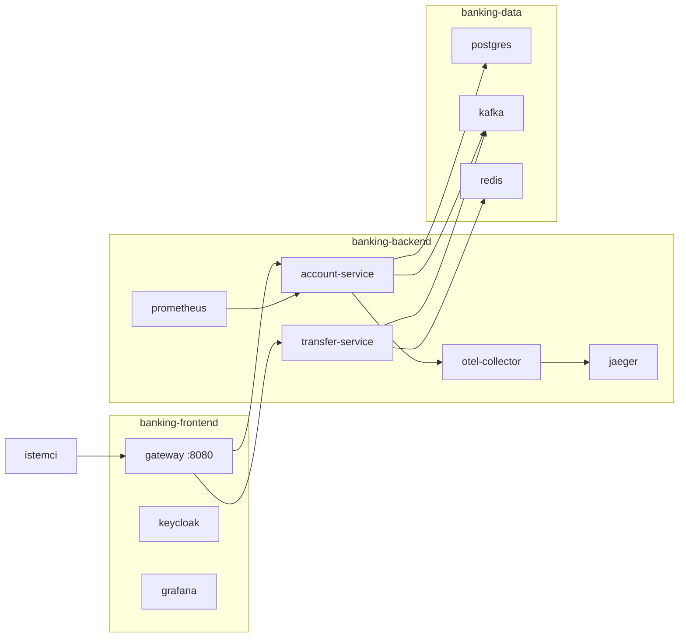
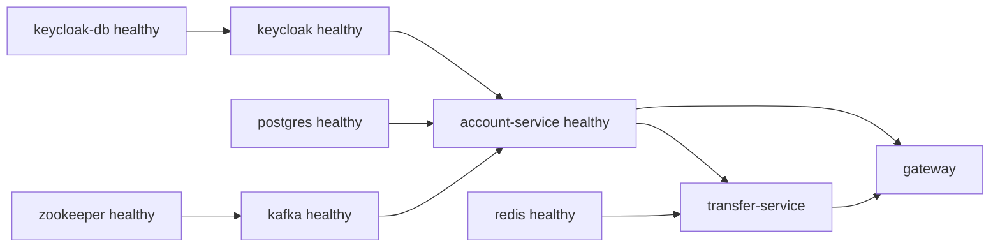
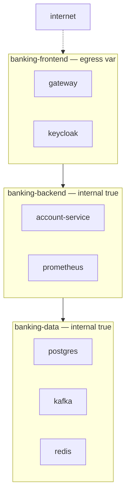
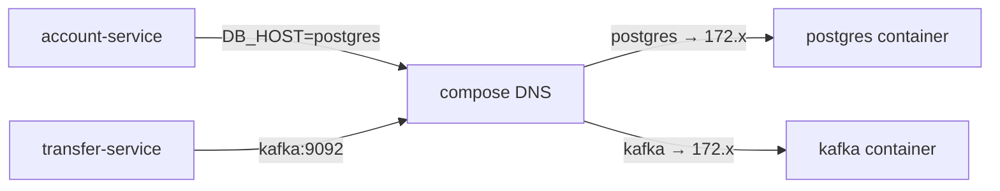

# Topic 11.2 — Docker Compose: Banking Local Stack

```admonish info title="Bu bölümde"
- Tüm banking stack'i (Postgres + Kafka + Keycloak + Vault + Redis + observability) **tek komutla** ayağa kaldırmak
- `depends_on` + `healthcheck` ile başlatma sırasını doğru kurmak — `service_started` neden yetmez, `service_healthy` neden şart
- 3 katmanlı network (`frontend` / `backend` / `data`) + `internal: true` ile PCI-vari izolasyon
- File-based secret, profile-based partial startup, override file katmanları ve resource limit
- Compose'un dev/CI için ideal, production için neden K8s'e bırakıldığı ayrımı
```

## Hedef

**Docker Compose** ile production-mirror bir local development environment kurmak: banking microservice'ler + tüm bağımlılıkları (Postgres, Kafka, Keycloak, Vault, Redis, observability stack) tek dosyada. Service dependency, healthcheck, network isolation, secret yönetimi, volume, profile-based startup ve override file'ları — dev → CI → staging parity'sini bozmadan — kavramak.

## Süre

Okuma: 1.5 saat • Kendini Sına: 30 dk • Pratik (opsiyonel): 3-4 saat • Toplam: ~2 saat (+ pratik)

## Önbilgi

- Topic 11.1 (Docker for Java) bitti — image, container, JRE runtime, healthcheck biliyorsun
- Phase 7-9 (microservice, security, observability) bitti — Kafka, Keycloak, Prometheus/Grafana/Jaeger gördün

---

## Kavramlar

### 1. Compose v2 — tüm stack tek komutla

Bir banking servisini local'de çalıştırmak için Postgres, Kafka, Keycloak ve daha fazlasına ihtiyacın var; bunları tek tek `docker run` ile ayağa kaldırmak saatler alır. **Docker Compose** tüm bu topolojiyi tek YAML dosyasında tanımlar ve tek komutla yönetir.

Compose v2 artık Go ile yeniden yazıldı ve `docker` CLI'ının içine gömüldü — ayrı `docker-compose` binary'si yerine `docker compose`:

```bash
docker compose up -d           # tüm stack'i başlat (detached)
docker compose down            # durdur + kaldır
docker compose logs -f account-service
docker compose ps              # servis durumları
```

Eski `docker-compose.yml` dosyalarındaki top-level `version:` alanı artık **deprecated**; Compose spec sürümü CLI'a bağlı, dosyaya yazmıyoruz.

### 2. Banking full stack — ne kuruyoruz

Kavrama girmeden önce hedefi gör: local'de production'ın küçük bir kopyasını istiyoruz — bir gateway, iki banking servisi, güvenlik katmanı, veri katmanı ve gözlemlenebilirlik. Servisler birbirine container adıyla bağlanır (**service discovery** bölüm 6'da).

Aşağıdaki topoloji, hangi servisin hangi network'te durduğunu ve kimin kime bağlandığını özetler:



Compose dosyasının iskeleti üç blokla başlar: `name`, `networks`, `volumes`. Network'leri ayırıyoruz ve veri/backend katmanlarını `internal: true` ile internete kapatıyoruz:

```yaml
name: banking-stack

networks:
  banking-frontend:
    driver: bridge
  banking-backend:
    driver: bridge
    internal: true       # dışarı çıkış yok (security)
  banking-data:
    driver: bridge
    internal: true

volumes:
  postgres-data:
  kafka-data:
  keycloak-data:
  redis-data:
  prometheus-data:
  grafana-data:
```

Tekrarı azaltmak için YAML **anchor** kullanıyoruz: ortak `restart`, `logging` ve `deploy` ayarlarını bir kez tanımlayıp banking servislerine `<<:` ile bindiriyoruz.

```yaml
x-banking-service: &banking-service-defaults
  restart: unless-stopped
  logging:
    driver: json-file
    options:
      max-size: "100m"     # disk log ile dolmasın
      max-file: "5"
  deploy:
    resources:
      limits:
        memory: 1G
        cpus: '1.0'
```

Bir veri servisini tam haliyle görelim — Postgres. Dikkat edilecek dört nokta: parola file-based **secret** olarak veriliyor, veri kalıcı **volume**'da, init SQL mount'lu ve bir **healthcheck** tanımlı:

```yaml
services:
  postgres:
    image: postgres:16-alpine
    environment:
      POSTGRES_DB: banking
      POSTGRES_USER: ${DB_USER:-banking}
      POSTGRES_PASSWORD_FILE: /run/secrets/db_password
    secrets:
      - db_password
    volumes:
      - postgres-data:/var/lib/postgresql/data
      - ./init-db.sql:/docker-entrypoint-initdb.d/01-init.sql:ro
    networks: [banking-data]
    healthcheck:
      test: ["CMD-SHELL", "pg_isready -U $${POSTGRES_USER}"]
      interval: 10s
      timeout: 5s
      retries: 5
```

Kafka, Zookeeper'a sağlıklı olduğunda başlar — `depends_on` ile healthcheck koşulu birlikte. Bu, bölüm 3'ün kalbi:

```yaml
  kafka:
    image: confluentinc/cp-kafka:7.5.1
    depends_on:
      zookeeper:
        condition: service_healthy
    healthcheck:
      test: ["CMD", "kafka-topics", "--bootstrap-server", "localhost:9092", "--list"]
      interval: 15s
      start_period: 30s        # broker ısınması için tolerans
```

Banking servisi ise data + security katmanının tümü sağlıklı olduğunda başlar. `<<:` ile ortak ayarları alır, üç network'e birden bağlanır ve bağımlılıklarını `service_healthy` ile bekler:

```yaml
  account-service:
    <<: *banking-service-defaults
    image: banking/account-service:${VERSION:-latest}
    depends_on:
      postgres: { condition: service_healthy }
      kafka: { condition: service_healthy }
      keycloak: { condition: service_healthy }
    environment:
      DB_HOST: postgres              # service discovery: container adı
      KAFKA_BOOTSTRAP_SERVERS: kafka:9092
      KEYCLOAK_ISSUER: http://keycloak:8080/realms/banking
      OTEL_EXPORTER_OTLP_ENDPOINT: http://otel-collector:4317
    networks: [banking-frontend, banking-backend, banking-data]
```

Bu parçaların hepsi tek dosyada birleşir. Full listing katlanmış duruyor — Vault, Redis, tüm observability stack, transfer-service, gateway ve secret tanımları dahil:

<details>
<summary>Tam kod: banking full stack docker-compose.yml (~400 satır)</summary>

```yaml
# docker-compose.yml
name: banking-stack

networks:
  banking-frontend:
    driver: bridge
  banking-backend:
    driver: bridge
    internal: true       # No outbound (security)
  banking-data:
    driver: bridge
    internal: true

volumes:
  postgres-data:
  kafka-data:
  zk-data:
  keycloak-data:
  vault-data:
  redis-data:
  prometheus-data:
  grafana-data:
  loki-data:

x-banking-service: &banking-service-defaults
  restart: unless-stopped
  logging:
    driver: json-file
    options:
      max-size: "100m"
      max-file: "5"
  deploy:
    resources:
      limits:
        memory: 1G
        cpus: '1.0'
      reservations:
        memory: 512M

services:
  # ─── Data layer ─────────────────────────────────

  postgres:
    image: postgres:16-alpine
    container_name: banking-postgres
    environment:
      POSTGRES_DB: banking
      POSTGRES_USER: ${DB_USER:-banking}
      POSTGRES_PASSWORD_FILE: /run/secrets/db_password
    secrets:
      - db_password
    volumes:
      - postgres-data:/var/lib/postgresql/data
      - ./init-db.sql:/docker-entrypoint-initdb.d/01-init.sql:ro
    networks:
      - banking-data
    ports:
      - "5432:5432"   # Dev only — production internal
    healthcheck:
      test: ["CMD-SHELL", "pg_isready -U $${POSTGRES_USER}"]
      interval: 10s
      timeout: 5s
      retries: 5
    deploy:
      resources:
        limits:
          memory: 2G

  redis:
    image: redis:7-alpine
    container_name: banking-redis
    command:
      - redis-server
      - --requirepass
      - ${REDIS_PASSWORD:-redispass}
      - --maxmemory
      - 512mb
      - --maxmemory-policy
      - allkeys-lru
      - --appendonly
      - "yes"
    volumes:
      - redis-data:/data
    networks:
      - banking-data
    ports:
      - "6379:6379"
    healthcheck:
      test: ["CMD", "redis-cli", "--raw", "ping"]
      interval: 10s
      timeout: 5s
      retries: 3

  zookeeper:
    image: confluentinc/cp-zookeeper:7.5.1
    container_name: banking-zk
    environment:
      ZOOKEEPER_CLIENT_PORT: 2181
      ZOOKEEPER_TICK_TIME: 2000
    volumes:
      - zk-data:/var/lib/zookeeper
    networks:
      - banking-data
    healthcheck:
      test: ["CMD-SHELL", "echo ruok | nc localhost 2181 | grep imok"]
      interval: 10s
      timeout: 5s
      retries: 5

  kafka:
    image: confluentinc/cp-kafka:7.5.1
    container_name: banking-kafka
    depends_on:
      zookeeper:
        condition: service_healthy
    environment:
      KAFKA_BROKER_ID: 1
      KAFKA_ZOOKEEPER_CONNECT: zookeeper:2181
      KAFKA_LISTENERS: PLAINTEXT://0.0.0.0:9092,EXTERNAL://0.0.0.0:9094
      KAFKA_ADVERTISED_LISTENERS: PLAINTEXT://kafka:9092,EXTERNAL://localhost:9094
      KAFKA_LISTENER_SECURITY_PROTOCOL_MAP: PLAINTEXT:PLAINTEXT,EXTERNAL:PLAINTEXT
      KAFKA_INTER_BROKER_LISTENER_NAME: PLAINTEXT
      KAFKA_OFFSETS_TOPIC_REPLICATION_FACTOR: 1
      KAFKA_TRANSACTION_STATE_LOG_REPLICATION_FACTOR: 1
      KAFKA_TRANSACTION_STATE_LOG_MIN_ISR: 1
      KAFKA_AUTO_CREATE_TOPICS_ENABLE: "false"   # Banking — explicit topics
      KAFKA_DELETE_TOPIC_ENABLE: "true"
      KAFKA_LOG_RETENTION_HOURS: 168              # 7 days
      KAFKA_NUM_PARTITIONS: 3
    volumes:
      - kafka-data:/var/lib/kafka/data
    networks:
      - banking-backend
      - banking-data
    ports:
      - "9094:9094"     # External (dev)
    healthcheck:
      test: ["CMD", "kafka-topics", "--bootstrap-server", "localhost:9092", "--list"]
      interval: 15s
      timeout: 10s
      retries: 5
      start_period: 30s

  # ─── Security ──────────────────────────────────

  keycloak-db:
    image: postgres:16-alpine
    container_name: banking-keycloak-db
    environment:
      POSTGRES_DB: keycloak
      POSTGRES_USER: keycloak
      POSTGRES_PASSWORD_FILE: /run/secrets/keycloak_db_password
    secrets:
      - keycloak_db_password
    volumes:
      - keycloak-data:/var/lib/postgresql/data
    networks:
      - banking-backend
    healthcheck:
      test: ["CMD-SHELL", "pg_isready -U keycloak"]
      interval: 10s
      timeout: 5s
      retries: 5

  keycloak:
    image: quay.io/keycloak/keycloak:24.0
    container_name: banking-keycloak
    depends_on:
      keycloak-db:
        condition: service_healthy
    command: start --optimized
    environment:
      KC_DB: postgres
      KC_DB_URL: jdbc:postgresql://keycloak-db:5432/keycloak
      KC_DB_USERNAME: keycloak
      KC_DB_PASSWORD_FILE: /run/secrets/keycloak_db_password
      KC_HOSTNAME: auth.mavibank.local
      KC_HTTP_ENABLED: "true"
      KC_HOSTNAME_STRICT: "false"
      KC_PROXY: edge
      KEYCLOAK_ADMIN: admin
      KEYCLOAK_ADMIN_PASSWORD_FILE: /run/secrets/keycloak_admin_password
    secrets:
      - keycloak_db_password
      - keycloak_admin_password
    volumes:
      - ./keycloak-realm.json:/opt/keycloak/data/import/banking-realm.json:ro
    networks:
      - banking-frontend
      - banking-backend
    ports:
      - "8180:8080"
    healthcheck:
      test: ["CMD", "curl", "-f", "http://localhost:8080/health/ready"]
      interval: 30s
      timeout: 10s
      retries: 5
      start_period: 60s

  vault:
    image: hashicorp/vault:1.15
    container_name: banking-vault
    cap_add:
      - IPC_LOCK
    environment:
      VAULT_DEV_ROOT_TOKEN_ID_FILE: /run/secrets/vault_token
      VAULT_DEV_LISTEN_ADDRESS: 0.0.0.0:8200
    secrets:
      - vault_token
    volumes:
      - vault-data:/vault/file
    networks:
      - banking-backend
    ports:
      - "8200:8200"
    healthcheck:
      test: ["CMD", "vault", "status"]
      interval: 30s
      timeout: 10s
      retries: 3

  # ─── Observability ──────────────────────────────

  prometheus:
    image: prom/prometheus:v2.51.0
    container_name: banking-prometheus
    volumes:
      - ./observability/prometheus.yml:/etc/prometheus/prometheus.yml:ro
      - ./observability/rules:/etc/prometheus/rules:ro
      - prometheus-data:/prometheus
    networks:
      - banking-backend
    ports:
      - "9090:9090"
    command:
      - --config.file=/etc/prometheus/prometheus.yml
      - --storage.tsdb.retention.time=15d
      - --enable-feature=exemplar-storage
      - --web.enable-lifecycle

  grafana:
    image: grafana/grafana:10.4.0
    container_name: banking-grafana
    depends_on:
      prometheus:
        condition: service_started
    environment:
      GF_SECURITY_ADMIN_PASSWORD_FILE: /run/secrets/grafana_password
      GF_FEATURE_TOGGLES_ENABLE: traceqlEditor,traceToMetrics
    secrets:
      - grafana_password
    volumes:
      - ./observability/grafana/datasources:/etc/grafana/provisioning/datasources:ro
      - ./observability/grafana/dashboards:/etc/grafana/provisioning/dashboards:ro
      - grafana-data:/var/lib/grafana
    networks:
      - banking-frontend
      - banking-backend
    ports:
      - "3000:3000"

  jaeger:
    image: jaegertracing/all-in-one:1.55
    container_name: banking-jaeger
    environment:
      COLLECTOR_OTLP_ENABLED: "true"
    networks:
      - banking-backend
      - banking-frontend
    ports:
      - "16686:16686"
      - "14268:14268"

  otel-collector:
    image: otel/opentelemetry-collector-contrib:0.97.0
    container_name: banking-otel
    depends_on:
      jaeger:
        condition: service_started
    volumes:
      - ./observability/otel-collector.yaml:/etc/otelcol-contrib/config.yaml:ro
    networks:
      - banking-backend
    ports:
      - "4317:4317"
      - "4318:4318"

  loki:
    image: grafana/loki:2.9.0
    container_name: banking-loki
    command: -config.file=/etc/loki/local-config.yaml
    volumes:
      - ./observability/loki-config.yaml:/etc/loki/local-config.yaml:ro
      - loki-data:/loki
    networks:
      - banking-backend
    ports:
      - "3100:3100"

  # ─── Banking services ────────────────────────────

  account-service:
    <<: *banking-service-defaults
    image: banking/account-service:${VERSION:-latest}
    container_name: banking-account
    depends_on:
      postgres:
        condition: service_healthy
      kafka:
        condition: service_healthy
      keycloak:
        condition: service_healthy
    environment:
      SPRING_PROFILES_ACTIVE: docker
      DB_HOST: postgres
      DB_PORT: 5432
      DB_NAME: banking
      DB_USER_FILE: /run/secrets/db_password
      KAFKA_BOOTSTRAP_SERVERS: kafka:9092
      KEYCLOAK_ISSUER: http://keycloak:8080/realms/banking
      OTEL_EXPORTER_OTLP_ENDPOINT: http://otel-collector:4317
      OTEL_SERVICE_NAME: account-service
      JAVA_TOOL_OPTIONS: "-XX:MaxRAMPercentage=75 -Duser.timezone=Europe/Istanbul"
    secrets:
      - db_password
    networks:
      - banking-frontend
      - banking-backend
      - banking-data
    ports:
      - "8081:8080"
      - "9091:8081"
    healthcheck:
      test: ["CMD", "curl", "-f", "http://localhost:8081/actuator/health/liveness"]
      interval: 30s
      timeout: 10s
      retries: 3
      start_period: 60s

  transfer-service:
    <<: *banking-service-defaults
    image: banking/transfer-service:${VERSION:-latest}
    container_name: banking-transfer
    depends_on:
      account-service:
        condition: service_healthy
      kafka:
        condition: service_healthy
      redis:
        condition: service_healthy
    environment:
      SPRING_PROFILES_ACTIVE: docker
      ACCOUNT_SERVICE_URL: http://account-service:8080
      KAFKA_BOOTSTRAP_SERVERS: kafka:9092
      REDIS_HOST: redis
      KEYCLOAK_ISSUER: http://keycloak:8080/realms/banking
      OTEL_EXPORTER_OTLP_ENDPOINT: http://otel-collector:4317
      OTEL_SERVICE_NAME: transfer-service
    secrets:
      - db_password
    networks:
      - banking-frontend
      - banking-backend
      - banking-data
    ports:
      - "8082:8080"
      - "9092:8081"

  # ─── Gateway ────────────────────────────────────

  gateway:
    <<: *banking-service-defaults
    image: banking/gateway:${VERSION:-latest}
    container_name: banking-gateway
    depends_on:
      account-service:
        condition: service_healthy
      transfer-service:
        condition: service_healthy
    environment:
      SPRING_PROFILES_ACTIVE: docker
      KEYCLOAK_ISSUER: http://keycloak:8080/realms/banking
      OTEL_EXPORTER_OTLP_ENDPOINT: http://otel-collector:4317
    networks:
      - banking-frontend
      - banking-backend
    ports:
      - "8080:8080"

secrets:
  db_password:
    file: ./secrets/db_password.txt
  keycloak_db_password:
    file: ./secrets/keycloak_db_password.txt
  keycloak_admin_password:
    file: ./secrets/keycloak_admin_password.txt
  vault_token:
    file: ./secrets/vault_token.txt
  grafana_password:
    file: ./secrets/grafana_password.txt
```

</details>

### 3. Healthcheck + depends_on — başlatma sırası

Compose default olarak servisleri paralel başlatır; `account-service` Postgres henüz hazır değilken ayağa kalkabilir ve connection error'la çöker. **`depends_on`** başlatma sırasını zorlar, **`healthcheck`** ise "hazır mı" sorusunu yanıtlar.

Kritik ayrım: `condition: service_started` (default) sadece container'ın *başladığını* bekler — Postgres process ayakta ama henüz bağlantı kabul etmiyor olabilir. <mark>Banking'de bir dependency'nin başlamış olması değil, sağlıklı olması beklenir; bu yüzden depends_on her zaman condition: service_healthy ile yazılır.</mark>

```yaml
depends_on:
  postgres:
    condition: service_healthy
  kafka:
    condition: service_healthy
```

Bu koşul zinciri bir başlatma topolojisi oluşturur: Zookeeper → Kafka, Postgres/Kafka/Keycloak → account-service, account-service → transfer-service → gateway.



Ağır servisler (Kafka, Keycloak) ilk saniyelerde henüz cevap veremez; `start_period` bu ısınma süresince başarısız healthcheck'leri "unhealthy" saymaz. Keycloak için 60s tipiktir.

```admonish warning title="depends_on'un görmediği şey"
`depends_on: service_healthy` yalnızca **başlatma anını** garanti eder. Stack ayaktayken Postgres bir an düşerse Compose account-service'i otomatik beklemez — bu yüzden uygulama tarafında da retry/circuit-breaker (Phase 8) şarttır. Compose'un healthcheck'i orchestration için, uygulama resilience'ının yerine geçmez.
```

### 4. Network isolation — 3 katman

Tüm servisleri tek network'e koymak, bir servis ele geçirildiğinde saldırganın doğrudan veritabanına ulaşması demektir. Banking'de trafiği **network** katmanında böleriz: frontend (dışarı açık), backend (servisler arası), data (DB/Kafka/Redis).

```yaml
networks:
  banking-frontend:      # gateway, load balancer erişebilir
  banking-backend:       # service-to-service
    internal: true       # internete çıkış yok
  banking-data:          # DB, Redis, Kafka
    internal: true
```

`internal: true` olan bir network'teki container'ın internet egress'i yoktur. <mark>Data tier her zaman internal: true ile internete kapatılır; bir breach durumunda veri dışarı sızamaz.</mark>



Bir servis birden fazla network'e üye olabilir: gateway hem frontend hem backend'de, account-service üçünde de. Böylece gateway dışarıya açıkken data tier'a doğrudan giden yol yoktur.

### 5. Secrets management — file-based

Parolayı `environment: DB_PASSWORD: secret123` diye yazmak; `docker inspect`, log ve process listesinde plaintext sızıntı demektir. Compose **secret** mekanizması parolayı dosyadan okur ve container içinde `/run/secrets/` altına mount eder.

```bash
mkdir -p secrets
echo "MyDbPass123!" > secrets/db_password.txt
chmod 600 secrets/db_password.txt
```

<mark>Parolalar asla compose'a plaintext environment olarak yazılmaz — file-based secret kullanılır.</mark> Uygulama tarafında Postgres'in `POSTGRES_PASSWORD_FILE` gibi `_FILE` konvansiyonunu ya da Spring Boot'un `SPRING_CONFIG_IMPORT=file:/run/secrets/db_password` import'unu kullanırsın.

```admonish tip title="Dev mirror, prod değil"
Compose secret'ları dev'de production'ın Vault / Kubernetes Secret akışını *taklit eder* — kod parolayı env yerine dosyadan okumaya alışır. Production'da aynı `_FILE` deseni Vault Agent veya K8s mounted secret ile beslenir; uygulama kodu hiç değişmez. Bu "read from file" alışkanlığı asıl kazanımdır.
```

### 6. Service discovery — compose DNS

Compose her network için gömülü bir DNS sunar: container'lar birbirine **service adıyla** ulaşır, IP hardcode etmezsin. `DB_HOST: postgres` yazarsın, Compose bunu Postgres container'ının güncel IP'sine çözer.



Bu yüzden env'lerde `KAFKA_BOOTSTRAP_SERVERS: kafka:9092` ve `KEYCLOAK_ISSUER: http://keycloak:8080/...` görürsün — hepsi service adı. Aynı isim K8s'te Service DNS'ine karşılık gelir; kod taşınırken değişmez.

### 7. Profile-based startup — kısmi ayağa kaldırma

Her zaman tüm 15 servisi çalıştırmak istemezsin: bazen sadece bağımlılıkları istersin (servisleri IDE'de debug ederken), bazen sadece observability. Compose **profile** ile servisleri gruplara ayırır.

```yaml
services:
  account-service:
    profiles: ["banking", "all"]
  prometheus:
    profiles: ["observability", "all"]
  grafana:
    profiles: ["observability", "all"]
```

```bash
docker compose --profile banking up -d          # sadece banking
docker compose --profile observability up -d    # sadece gözlemlenebilirlik
docker compose --profile all up -d              # her şey
```

Banking dev flow'unun kalbi budur: Postgres + Kafka + Keycloak'ı compose'da çalıştırır, üzerinde geliştirdiğin account-service'i IDE'de debug modunda koşarsın. Profile'sız (default) tanımlanan servisler her `up`'ta başlar — bu yüzden bağımlılıkları profile'a koyarken dikkatli ol.

### 8. Override file — katmanlı config

Aynı stack'in dev, CI ve production-mirror varyantları arasındaki fark küçüktür (debug portu, hot reload, log seviyesi). Bunu tek dosyayı şişirerek değil, **override file** katmanlayarak çözersin.

```
docker-compose.yml          # Base (production-like)
docker-compose.dev.yml      # Dev override (debug, hot reload)
docker-compose.ci.yml       # CI varyantı
```

`-f` ile üst üste bindirilen dosyalar birleşir; sonraki dosya öncekini override eder:

```bash
docker compose -f docker-compose.yml -f docker-compose.dev.yml up
```

Dev override sadece farkı taşır — base'i tekrar etmez. Remote debugger portu, DEBUG log ve hot reload volume'u eklenir:

```yaml
# docker-compose.dev.yml
services:
  account-service:
    environment:
      LOGGING_LEVEL_COM_BANK: DEBUG
      SPRING_DEVTOOLS_RESTART_ENABLED: "true"
    volumes:
      - ./account-service/target:/app:rw   # hot reload
    ports:
      - "5005:5005"                        # remote debugger
    command:
      - sh
      - -c
      - |
        java -agentlib:jdwp=transport=dt_socket,server=y,suspend=n,address=*:5005 \
             $JAVA_OPTS -jar /app/spring-boot-loader/...
```

### 9. Resource limits + init scripts

Tek bir servisin memory sızıntısı, limit yoksa tüm host'u OOM ile öldürür. `deploy.resources` ile her servise memory/CPU tavanı koyarsın — K8s'in requests/limits modelinin local karşılığı.

```yaml
deploy:
  resources:
    limits:
      memory: 2G
      cpus: '2.0'
    reservations:
      memory: 1G
      cpus: '0.5'
```

Postgres entrypoint'i `/docker-entrypoint-initdb.d/` altındaki `*.sql` dosyalarını ilk boot'ta sırayla çalıştırır — banking için chart of accounts, demo müşteri ve örnek transaction seed'ini buraya **init script** olarak mount edersin.

```yaml
postgres:
  volumes:
    - ./init-db.sql:/docker-entrypoint-initdb.d/01-init.sql:ro
    - ./seed-data.sql:/docker-entrypoint-initdb.d/02-seed.sql:ro
```

```admonish warning title="Init script idempotency"
Init script'ler yalnızca volume boşken (ilk boot'ta) çalışır; ama seed SQL'ini elle tekrar çalıştırırsan duplicate kayıt üretir. Seed'i her zaman `INSERT ... ON CONFLICT DO NOTHING` ile yaz. Ayrıca `docker compose down -v` volume'u siler — kalıcı olması gereken veriyi kaybetmemek için `-v`'yi bilinçli kullan.
```

### 10. Banking — compose anti-pattern'leri

Mülakatta "bu compose dosyasında ne yanlış?" sorusunun cephaneliği. On klasik:

**1. Hardcoded secret** — `environment: DB_PASSWORD: secret123`. `docker inspect`'te sızar; file-based secret kullan.

**2. Tek network** — Data tier izolasyonu yok. Frontend/backend/data ayır, data'yı `internal: true` yap.

**3. Healthcheck'siz depends_on** — Servis dependency hazır olmadan başlar, connection error. `condition: service_healthy` şart.

**4. `latest` tag** — Reproducibility ölür; iki makinede farklı image. <mark>Image tag'leri her zaman sabit bir sürüme pinlenir, latest kullanılmaz.</mark>

**5. Resource limit yokluğu** — Tek servis OOM ile host'u düşürür. Servis başına memory + CPU limiti.

**6. Compose ile production** — Compose dev/CI için ideal; production tek host, no self-healing, no rolling update. Production = K8s (Topic 11.3).

**7. Production-mirror'da source mount** — `./target:/app` hot reload dev'e özel; production-like compose'da kaynak mount'lama.

**8. Idempotent olmayan init script** — Tekrar çalıştırma = duplicate data. `ON CONFLICT DO NOTHING`.

**9. Profile + default servis karışımı** — Profile'sız servis her `up`'ta başlar; banking dev'de bağımlılıkları profile'a koy ki IDE workflow'u bozulmasın.

**10. Logging driver config yokluğu** — Diskler log ile dolar. `max-size: "100m"` + `max-file: "5"`.

```admonish warning title="Compose production'a taşınmaz"
Compose tek host'ta çalışır: node ölürse stack ölür, otomatik rescheduling yoktur, rolling update ve horizontal autoscaling desteklenmez. "Küçük stack, tek sunucu yeter" tuzağına düşme — banking'de HA ve self-healing zorunludur, o yüzden production Kubernetes'e gider. Compose'un işi dev → CI parity'sini sağlamaktır, production'ı değil.
```

---

## Önemli olabilecek araştırma kaynakları

- Docker Compose v2 reference & Compose specification
- "Compose-spec" YAML reference (networks, volumes, secrets, deploy)
- Docker docs — Compose file secrets & healthcheck
- Testcontainers — Docker Compose module

---

## Kendini Sına

Aşağıdaki soruları önce **cevaba bakmadan** kendi cümlelerinle yanıtlamayı dene — hepsi TR bank / DevOps mülakatlarında karşına çıkabilecek tarzda. Takıldığın soruda ilgili Kavramlar başlığına dön, sonra tekrar dene.

**S1. `depends_on` altında `condition: service_started` ile `condition: service_healthy` arasındaki fark nedir? Banking'de hangisini neden seçersin?**

<details>
<summary>Cevabı göster</summary>

`service_started` (default) sadece dependency container'ının *başladığını* bekler — process ayakta ama Postgres henüz bağlantı kabul etmiyor, Kafka broker henüz ısınmamış olabilir. `service_healthy` ise o servisin tanımlı `healthcheck`'i "healthy" dönene kadar bekler; yani gerçekten hazır olduğunu doğrular.

Banking'de account-service Postgres olmadan başlarsa connection error'la çöker veya yarım başlar; bu yüzden her kritik dependency `service_healthy` ile beklenir. Ek olarak ağır servisler için healthcheck'e `start_period` (ör. Keycloak 60s) koyarsın ki ısınma süresindeki başarısız probe'lar "unhealthy" sayılmasın.

</details>

**S2. Compose'da neden 3 ayrı network kurarsın ve `internal: true` ne işe yarar? Hangi tier'a koyarsın?**

<details>
<summary>Cevabı göster</summary>

Tüm servisleri tek network'e koymak, bir servis ele geçirildiğinde saldırganın doğrudan DB'ye ulaşması demektir. Trafiği katmanlara böleriz: `banking-frontend` (gateway, dışarı açık), `banking-backend` (servisler arası), `banking-data` (Postgres, Kafka, Redis). Gateway frontend + backend'de olur ama data tier'a doğrudan yolu yoktur.

`internal: true` o network'teki container'ların internet egress'ini kapatır. Bunu her zaman data ve backend tier'a koyarsın: bir breach olsa bile veri dışarı sızamaz, container dışarıya veri exfiltrate edemez. Bu, PCI-DSS'in network segmentation gereksiniminin local karşılığıdır.

</details>

**S3. Compose'da parola yönetimini nasıl yaparsın? `environment: DB_PASSWORD: secret` neden yanlış?**

<details>
<summary>Cevabı göster</summary>

Plaintext `environment` parolası `docker inspect`, `docker compose config`, container env listesi ve loglarda görünür — sızıntı garantidir. Bunun yerine file-based **secret** kullanılır: parola `./secrets/db_password.txt` dosyasında (chmod 600) durur, `secrets:` bloğu ile tanımlanır ve container içinde `/run/secrets/db_password` altına mount edilir.

Uygulama parolayı dosyadan okur — Postgres'in `POSTGRES_PASSWORD_FILE` konvansiyonu ya da Spring Boot'un `SPRING_CONFIG_IMPORT=file:...` import'u ile. Bu desen dev'de production'ın Vault / K8s Secret akışını taklit eder; kod "env'den değil dosyadan oku" alışkanlığını kazanır ve production'a taşınırken hiç değişmez.

</details>

**S4. Profile-based startup nedir ve banking dev workflow'unda nasıl kullanılır?**

<details>
<summary>Cevabı göster</summary>

Compose `profiles` ile servisleri gruplara ayırırsın (`banking`, `observability`, `all`); `--profile <ad>` verilmeden o gruptaki servisler başlamaz. Böylece her seferinde 15 servisin tümünü değil, sadece ihtiyacın olan alt kümeyi ayağa kaldırırsın: `docker compose --profile observability up -d` sadece Prometheus/Grafana/Jaeger'i getirir.

Banking dev workflow'unun kalbi budur: Postgres + Kafka + Keycloak gibi bağımlılıkları compose'da çalıştırır, üzerinde geliştirdiğin servisi IDE'de debug modunda koşarsın. Dikkat: profile atanmamış servisler her `up`'ta başlar, o yüzden bağımlılıkları da bilinçli olarak bir profile'a koyman gerekir.

</details>

**S5. Override file mekanizması nedir? `-f base.yml -f dev.yml` nasıl birleşir?**

<details>
<summary>Cevabı göster</summary>

Base dosya production-like tanımı taşır; dev/CI gibi varyantlar yalnızca **farkı** ayrı override dosyasında tutar (debug portu, DEBUG log, hot reload volume). `docker compose -f docker-compose.yml -f docker-compose.dev.yml up` iki dosyayı üst üste bindirir: aynı servisin alanları merge edilir, çakışan skalar değerler için sonraki dosya öncekini ezer.

Bu yaklaşım tek dev-şişkin dosyadan iyidir çünkü base tek kaynak kalır; dev override'da sadece `SPRING_DEVTOOLS_RESTART_ENABLED`, `5005:5005` debugger portu ve `./target:/app` mount gibi dev'e özel eklentiler durur. Böylece dev → CI → staging parity'sini bozmadan ortama göre ince farklar bindirilir.

</details>

**S6. Compose ile production'a çıkmanın neden yanlış olduğunu, Compose'un asıl yerini açıkla.**

<details>
<summary>Cevabı göster</summary>

Compose tek host'ta çalışır: node ölürse tüm stack ölür, otomatik rescheduling/self-healing yoktur, rolling update ve horizontal autoscaling desteklenmez, multi-node scheduling yoktur. Banking'de HA, zero-downtime deploy ve autoscaling zorunlu olduğundan bu eksiklikler kabul edilemez; production Kubernetes'e (Topic 11.3) gider.

Compose'un asıl değeri **dev → CI parity**'sidir: geliştiricinin makinesinde ve CI pipeline'ında production'a çok benzeyen bir stack'i tek komutla, aynı image'larla, aynı env ve secret desenleriyle ayağa kaldırır. Yani Compose production'ın yerini almaz, production'a hazırlığın local aynasıdır.

</details>

**S7. Volume kalıcılığı nasıl çalışır ve init script idempotency'si neden önemli?**

<details>
<summary>Cevabı göster</summary>

Named volume (`postgres-data`) container silinse bile veriyi korur; `docker compose up` tekrar bağlanır. Ancak `docker compose down -v` volume'u da siler — kalıcı olması gereken veriyi kaybetmemek için `-v`'yi bilinçli kullanmak gerekir. Postgres init script'leri (`/docker-entrypoint-initdb.d/*.sql`) yalnızca volume boşken, yani ilk boot'ta çalışır.

Idempotency önemlidir çünkü seed SQL'ini elle veya farklı ortamlarda tekrar çalıştırma ihtimali vardır; `INSERT ... ON CONFLICT DO NOTHING` yazmazsan chart of accounts veya demo müşteri kayıtları duplicate olur. Banking'de seed (COA, demo müşteri, örnek transaction) her zaman idempotent yazılır.

</details>

**S8. Neden her servise `deploy.resources` ile memory/CPU limiti koyarsın? Bu neyin local karşılığı?**

<details>
<summary>Cevabı göster</summary>

Limit yoksa tek bir servisin memory sızıntısı ya da runaway process'i tüm host RAM'ini tüketir ve OOM killer rastgele container'ları (belki Postgres'i) öldürür — tek servisin hatası tüm stack'i düşürür. `deploy.resources.limits` ile servis başına memory + CPU tavanı koyarsın; sızıntı o servisi öldürür, host'u değil.

Bu, Kubernetes'in `requests`/`limits` modelinin local karşılığıdır: `reservations` requests'e, `limits` limits'e benzer. Böylece servisin production'da alacağı kaynak bütçesini local'de test eder, "1G yeter mi" sorusunu deploy'dan önce yanıtlarsın. Ayrıca `logging` `max-size`/`max-file` ile log rotation da bir tür kaynak sınırıdır — disk dolmasını önler.

</details>

---

## Tamamlama kriterleri

- [ ] "Kendini Sına" bölümündeki tüm soruları cevaba bakmadan açıklayabiliyorum
- [ ] `docker compose up -d` ile full stack'i (data + security + observability + banking) ayağa kaldırabiliyorum
- [ ] `depends_on` + `service_healthy` + `start_period` ile başlatma sırasını doğru kurabiliyorum
- [ ] 3 network (frontend/backend/data) + `internal: true` data tier izolasyonunu kurabiliyorum
- [ ] File-based secret (`secrets/` + chmod 600 + `/run/secrets/`) desenini uygulayabiliyorum
- [ ] Init script ile idempotent seed (COA + demo müşteri) yazabiliyorum
- [ ] Profile-based partial startup (banking / observability / all) yapabiliyorum
- [ ] `docker-compose.dev.yml` override ile debug + hot reload ekleyebiliyorum
- [ ] Servis başına memory/CPU resource limit koyabiliyorum
- [ ] Compose'un neden dev/CI için ideal, production için K8s gerektiğini anlatabiliyorum

---

## Defter notları

1. "Compose v2 `docker compose` komutu + top-level `version:` deprecated: ____."
2. "`depends_on` `service_started` vs `service_healthy` farkı + `start_period` ne zaman: ____."
3. "3 network (frontend/backend/data) + `internal: true` data tier: ____."
4. "File-based secret + chmod 600 + `_FILE` / `SPRING_CONFIG_IMPORT`: ____."
5. "Service discovery: compose DNS container adını çözer, `kafka:9092` neden çalışır: ____."
6. "Profile-based partial startup + banking dev IDE workflow: ____."
7. "Override file (base + dev + CI) `-f` merge + override kuralı: ____."
8. "Init script `/docker-entrypoint-initdb.d/` + idempotency `ON CONFLICT DO NOTHING`: ____."
9. "`deploy.resources` limits/reservations = K8s requests/limits local karşılığı: ____."
10. "Compose dev/CI parity vs production K8s (HA, self-healing, rolling update) ayrımı: ____."

```admonish success title="Bölüm Özeti"
- Docker Compose tüm banking stack'i (data + security + observability + banking servisleri) tek YAML'de tanımlar ve `docker compose up -d` ile tek komutla ayağa kaldırır
- `depends_on: condition: service_healthy` + healthcheck başlatma sırasını doğru kurar; `service_started` yetmez çünkü sadece process'in başladığını, hazır olduğunu değil, garanti eder
- 3 katmanlı network (frontend/backend/data) + `internal: true` ile veri katmanı internete kapatılır — bir breach'in yayılmasını sınırlayan PCI-vari segmentation
- File-based secret parolayı env'den değil `/run/secrets/`'ten okutur ve production'ın Vault / K8s Secret akışını dev'de taklit eder; service discovery ise container adını DNS ile çözer
- Profile-based partial startup + override file'lar dev/CI/production-mirror varyantlarını tek base üzerine katmanlar; resource limit'ler K8s requests/limits'in local aynasıdır
- Compose dev → CI parity için idealdir ama production'a taşınmaz: tek host, no self-healing, no rolling update — production Kubernetes'e (Topic 11.3) gider
```

---

## Pratik yapmak istersen

Kavramları koda dökmek istersen aşağıdaki iki ek hazır: smoke test rehberi `compose up → wait healthy → login → transfer → down` uçtan uca akışını ve Testcontainers ile entegrasyon testini içerir; Claude-verify prompt'u ile yazdığın compose setup'ını banking-grade perspektiften denetletebilirsin.

<details>
<summary>Smoke test + entegrasyon test rehberi</summary>

Süre: ~1-1.5 saat. Amaç: stack'i tek komutla ayağa kaldırıp uçtan uca (login + transfer) doğrulayan tekrar edilebilir bir script yazmak. Tamamlandı sayılır: script `compose up`'tan `compose down`'a kadar hatasız geçiyor ve smoke assertion'ları yeşil.

### Smoke test script

Stack'i başlatır, tüm kritik servisler healthy olana kadar bekler, login + transfer dener ve sonunda temizler:

```bash
#!/bin/bash
set -euo pipefail

echo "Starting stack..."
docker compose up -d

echo "Waiting for healthy..."
for service in postgres kafka keycloak account-service transfer-service gateway; do
  echo "  Waiting for $service..."
  timeout 180 sh -c "until [ \"\$(docker inspect --format='{{.State.Health.Status}}' banking-$service)\" = 'healthy' ]; do sleep 5; done"
done

echo "Running smoke tests..."
# Login
TOKEN=$(curl -sf -X POST http://localhost:8180/realms/banking/protocol/openid-connect/token \
  -d "client_id=banking-web" \
  -d "username=ahmet" \
  -d "password=test" \
  -d "grant_type=password" | jq -r '.access_token')

# Get accounts
curl -fsS -H "Authorization: Bearer $TOKEN" \
  http://localhost:8080/v1/accounts/me > /dev/null

# Initiate transfer
curl -fsS -X POST -H "Authorization: Bearer $TOKEN" \
  -H "Content-Type: application/json" \
  -H "X-Idempotency-Key: smoke-$(date +%s)" \
  -d '{"toIban":"TR320010009999987654321098","amount":"100","currency":"TRY"}' \
  http://localhost:8080/v1/transfers/havale > /dev/null

echo "All smoke tests passed."

echo "Cleanup..."
docker compose down -v
```

### JUnit Testcontainers ile compose entegrasyon testi

Aynı compose dosyasını CI'da JUnit'ten kaldırıp gateway'e HTTP smoke atarsın:

```java
@Testcontainers
class BankingStackIntegrationTest {

    @Container
    static DockerComposeContainer<?> stack = new DockerComposeContainer<>(
        new File("docker-compose.yml"),
        new File("docker-compose.test.yml"))
        .withExposedService("gateway", 8080, Wait.forHttp("/actuator/health").forStatusCode(200))
        .withExposedService("keycloak", 8080)
        .withLocalCompose(true);

    @Test
    void transferEndpointShouldBeAccessible() {
        Integer port = stack.getServicePort("gateway", 8080);
        String url = "http://localhost:" + port + "/actuator/health";
        // HTTP GET → 200
    }
}
```

> İpucu: healthy bekleme mantığını script'te `timeout` ile sınırla; takılan bir servis CI'ı sonsuza kadar bloklamasın. Testcontainers tarafında `Wait.forHttp(...)` aynı işi JUnit için yapar.

</details>

<details>
<summary>Claude-verify prompt</summary>

Aşağıdaki prompt'u yazdığın compose setup'ıyla birlikte Claude'a ver; her maddeyi PASS / FAIL / EKSIK olarak işaretletip eksikleri kapat.

```
Compose setup'ımı banking-grade kriterlere göre değerlendir, kod yazma:

1. Stack content:
   - Postgres + Kafka + Keycloak + Redis + Vault?
   - Prometheus + Grafana + Jaeger + Loki + OTel?
   - 3+ banking microservice + gateway?

2. Health checks:
   - Her servis healthcheck?
   - depends_on with service_healthy?
   - start_period banking için 60s+ (ağır servisler)?

3. Network:
   - frontend / backend / data ayrı?
   - data (ve backend) internal:true?
   - Banking PCI scope segmented?

4. Secrets:
   - File-based secrets/?
   - chmod 600?
   - No env var plain password?

5. Volumes:
   - Persistent data volume?
   - Init script idempotent seed data?

6. Profiles:
   - banking / observability / all?
   - Partial startup possible?

7. Override files:
   - dev.yml debug + hot reload?
   - test.yml / ci.yml varyant?

8. Resources:
   - Memory + CPU limits per service?
   - K8s-realistic budget?

9. Logging:
   - max-size + max-file?
   - JSON driver?

10. Anti-pattern:
    - Hardcoded secret YOK?
    - Single network YOK?
    - depends_on plain (no condition) YOK?
    - latest tag YOK?
    - No resource limit YOK?
    - Production compose YOK (K8s olmalı)?
    - Source code mount production-mirror YOK?

Her madde için PASS / FAIL / EKSIK işaretle, kanıt göster, kod yazma.
```

</details>
