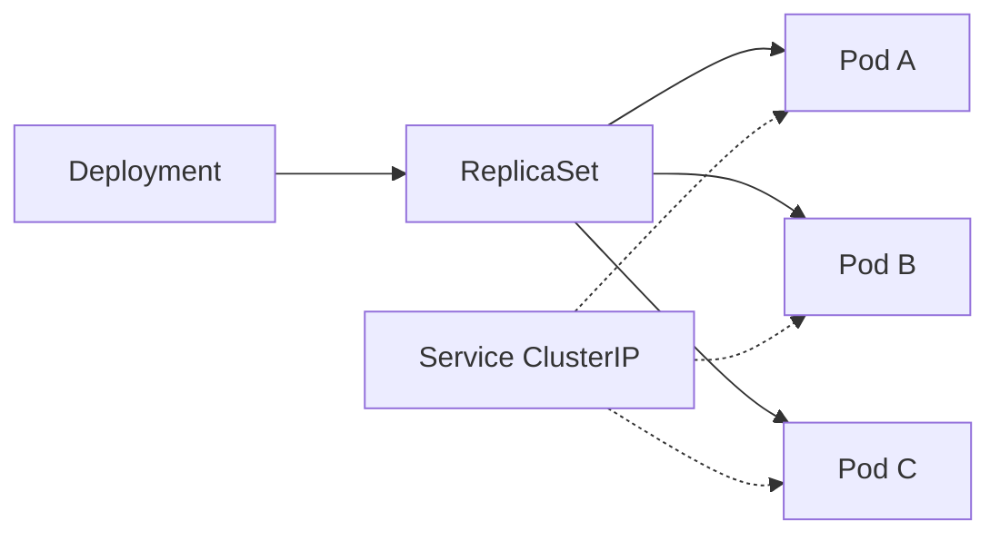
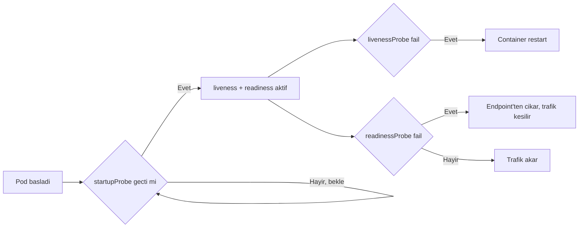
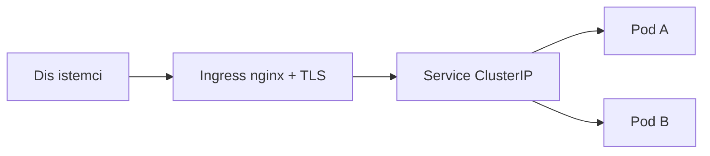
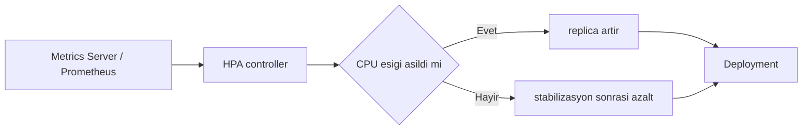

# Topic 11.3 — Kubernetes Basics for Banking

```admonish info title="Bu bölümde"
- K8s core objeleri banking derinliğinde: Pod, Deployment, StatefulSet, Service, Ingress, ConfigMap, Secret
- Üç probe'un (liveness, readiness, startup) farkı ve yanlış konfigürasyonun neden cascade restart'a yol açtığı
- Resource requests vs limits, security context, HPA autoscale ve PodDisruptionBudget ile zero-downtime
- NetworkPolicy ile PCI segmentasyonu, RBAC ile minimum privilege, Vault CSI ile secret yönetimi
- Banking deploy stratejileri (rolling, blue-green, canary) ve GitOps (ArgoCD) ile denetlenebilir dağıtım
```

## Hedef

K8s core objects banking-grade derinlikte: Pod, Deployment, StatefulSet, Service, Ingress, ConfigMap, Secret, ServiceAccount, RBAC, NetworkPolicy, PVC, HPA, PDB. Banking deployment patterns: rolling, blue-green, canary, namespace strategy, multi-region, GitOps (ArgoCD/Flux), service mesh (Istio/Linkerd), pod security standards, BDDK uyumlu deploy stratejisi.

## Süre

Okuma: 3 saat • Kendini Sına: 45 dk • Pratik (opsiyonel): 4 saat • Toplam: ~8 saat

## Önbilgi

- Topic 11.1-11.2 bitti
- Docker container kavramı
- YAML

---

## Kavramlar

### 1. K8s mental model

Bir pod gece 03:00'te öldü — onu kim ayağa kaldıracak? K8s'in cevabı basit: sen değil, cluster. **Kubernetes** deklaratif bir sistemdir; sen "istediğim son durum bu" dersin, cluster o duruma sürekli yakınsar.

Cluster iki katmandan oluşur: kararları veren **control plane** ve iş yükünü koşturan **worker node**'lar. Control plane çökse bile mevcut pod'lar çalışmaya devam eder — sadece yeni kararlar duraksar.

```
Cluster
├── Control plane (master)
│   ├── kube-apiserver      # tek giriş kapısı, tüm API buradan
│   ├── etcd                # cluster state store (tek gerçek kaynak)
│   ├── scheduler           # pod'u hangi node'a koyacağına karar verir
│   └── controller-manager  # istenen state ile gerçek state'i eşitler
└── Worker nodes (compute)
    ├── kubelet             # node agent, pod'ları ayakta tutar
    ├── kube-proxy          # network kuralları
    └── container runtime   # containerd, image'ı çalıştırır
```

Objeleri deklaratif tanımlarsın; her biri bir sorumluluk taşır:

```
- Pod          # 1+ container, ephemeral (kısa ömürlü)
- Deployment   # replica sayısı + rollout yönetimi
- Service      # kararlı network endpoint
- ConfigMap    # config, Secret # gizli config
- Ingress      # HTTP routing
- PVC          # kalıcı storage
- StatefulSet  # kimlikli, sıralı pod'lar (DB gibi)
```

Kural olarak aklında tut: <mark>K8s'te hiçbir şeyi elle "yaratıp bırakmazsın" — her objeyi bir controller'a yönettirirsin, yoksa öldüğünde geri gelmez</mark>.

### 2. Pod — temel birim

**Pod**, K8s'in en küçük dağıtım birimidir: bir veya birden fazla container'ı, aynı network ve storage namespace'ini paylaşacak şekilde sarar. Pratikte "bir uygulama = bir container = bir pod" diye düşünebilirsin.

```yaml
apiVersion: v1
kind: Pod
metadata:
  name: account-service
  labels:
    app: account-service
spec:
  containers:
    - name: app
      image: banking/account-service:1.0.0
      ports:
        - name: http
          containerPort: 8080
        - name: management
          containerPort: 8081
```

Kritik nokta: pod **ephemeral**'dır — öldüğünde yeniden yaratılmaz, IP'si de gider. O yüzden banking'de pod'u doğrudan yaratmazsın; onu bir Deployment'a doğurttururursun ki ölünce geri gelsin.

### 3. Deployment — banking standardı

Pod tek başına kırılgan; ölürse kimse ayağa kaldırmaz. **Deployment** araya girer: bir **ReplicaSet** üzerinden N tane özdeş pod'u ayakta tutar, image güncellenince kademeli rollout yapar. İlişki tek yönlü bir zincirdir — sen Deployment'ı değiştirirsin, gerisi otomatik akar.



Banking Deployment'ı katman katman kurulur. Önce metadata ve rollout stratejisi — banking'de sıfır kesintili güncelleme için `maxUnavailable: 0` zorunludur:

```yaml
apiVersion: apps/v1
kind: Deployment
metadata:
  name: account-service
  namespace: banking
spec:
  replicas: 3
  strategy:
    type: RollingUpdate
    rollingUpdate:
      maxSurge: 1
      maxUnavailable: 0   # Banking — no downtime
  selector:
    matchLabels:
      app: account-service
```

Pod-level **security context** güvenlik temelini kurar: root olmayan kullanıcı, seccomp profili. Bunlar Pod Security Standards'ın "restricted" seviyesinin çekirdeğidir:

```yaml
      securityContext:
        runAsNonRoot: true
        runAsUser: 10001
        runAsGroup: 10001
        fsGroup: 10001
        seccompProfile:
          type: RuntimeDefault
```

Pod'ları zone'lara ve node'lara dağıtmak fault tolerance sağlar: `topologySpreadConstraints` zonlara yayar, `podAntiAffinity` aynı node'a yığılmayı engeller. Bir zone çökse bile servis ayakta kalır:

```yaml
      topologySpreadConstraints:
        - maxSkew: 1
          topologyKey: topology.kubernetes.io/zone
          whenUnsatisfiable: ScheduleAnyway
          labelSelector:
            matchLabels:
              app: account-service
```

Container düzeyinde image, port'lar ve config injection tanımlanır. Konfig ConfigMap'ten, şifre Secret'tan gelir — asla image'a gömülmez:

```yaml
          env:
            - name: SPRING_PROFILES_ACTIVE
              value: production
            - name: DB_HOST
              valueFrom:
                configMapKeyRef:
                  name: banking-config
                  key: db.host
            - name: DB_PASSWORD
              valueFrom:
                secretKeyRef:
                  name: banking-secrets
                  key: db.password
```

Container security context minimum privilege'ı zorlar: yetki yükseltme kapalı, root filesystem salt-okunur, tüm Linux capability'leri düşürülmüş:

```yaml
          securityContext:
            allowPrivilegeEscalation: false
            readOnlyRootFilesystem: true
            capabilities:
              drop:
                - ALL
```

Tam manifest resources, üç probe, volume ve affinity'yi bir arada içerir — banking-grade referans:

<details>
<summary>Tam kod: account-service Deployment (~120 satır)</summary>

```yaml
apiVersion: apps/v1
kind: Deployment
metadata:
  name: account-service
  namespace: banking
  labels:
    app: account-service
    tier: backend
    domain: banking
spec:
  replicas: 3
  strategy:
    type: RollingUpdate
    rollingUpdate:
      maxSurge: 1
      maxUnavailable: 0   # Banking — no downtime
  selector:
    matchLabels:
      app: account-service
  template:
    metadata:
      labels:
        app: account-service
      annotations:
        prometheus.io/scrape: "true"
        prometheus.io/port: "8081"
        prometheus.io/path: "/actuator/prometheus"
    spec:
      serviceAccountName: account-service

      # Security context — pod level
      securityContext:
        runAsNonRoot: true
        runAsUser: 10001
        runAsGroup: 10001
        fsGroup: 10001
        seccompProfile:
          type: RuntimeDefault

      # Topology — distribute across zones
      topologySpreadConstraints:
        - maxSkew: 1
          topologyKey: topology.kubernetes.io/zone
          whenUnsatisfiable: ScheduleAnyway
          labelSelector:
            matchLabels:
              app: account-service

      containers:
        - name: app
          image: registry.mavibank.com/banking/account-service:1.0.0
          imagePullPolicy: IfNotPresent

          ports:
            - name: http
              containerPort: 8080
            - name: management
              containerPort: 8081

          env:
            - name: SPRING_PROFILES_ACTIVE
              value: production
            - name: JAVA_TOOL_OPTIONS
              value: "-XX:MaxRAMPercentage=75 -XX:+UseG1GC -XX:MaxGCPauseMillis=200 -Duser.timezone=Europe/Istanbul"
            - name: KEYCLOAK_ISSUER
              valueFrom:
                configMapKeyRef:
                  name: banking-config
                  key: keycloak.issuer
            - name: DB_HOST
              valueFrom:
                configMapKeyRef:
                  name: banking-config
                  key: db.host
            - name: DB_PASSWORD
              valueFrom:
                secretKeyRef:
                  name: banking-secrets
                  key: db.password
            - name: OTEL_EXPORTER_OTLP_ENDPOINT
              value: http://otel-collector.observability:4317
            - name: OTEL_SERVICE_NAME
              value: account-service
            - name: POD_NAME
              valueFrom:
                fieldRef:
                  fieldPath: metadata.name
            - name: NODE_NAME
              valueFrom:
                fieldRef:
                  fieldPath: spec.nodeName

          resources:
            requests:
              memory: 1Gi
              cpu: 500m
            limits:
              memory: 2Gi
              cpu: 2000m

          # Container security context
          securityContext:
            allowPrivilegeEscalation: false
            readOnlyRootFilesystem: true
            capabilities:
              drop:
                - ALL

          livenessProbe:
            httpGet:
              path: /actuator/health/liveness
              port: management
            initialDelaySeconds: 60
            periodSeconds: 30
            timeoutSeconds: 10
            failureThreshold: 3

          readinessProbe:
            httpGet:
              path: /actuator/health/readiness
              port: management
            initialDelaySeconds: 30
            periodSeconds: 10
            timeoutSeconds: 5
            failureThreshold: 3

          startupProbe:
            httpGet:
              path: /actuator/health/liveness
              port: management
            periodSeconds: 10
            failureThreshold: 30   # 5 min startup window

          volumeMounts:
            - name: tmp
              mountPath: /tmp
            - name: gc-log
              mountPath: /var/log/banking
            - name: dumps
              mountPath: /dumps
            - name: secrets-vault
              mountPath: /secrets
              readOnly: true

      volumes:
        - name: tmp
          emptyDir:
            sizeLimit: 100Mi
        - name: gc-log
          emptyDir:
            sizeLimit: 500Mi
        - name: dumps
          emptyDir:
            sizeLimit: 4Gi   # Heap dump space
        - name: secrets-vault
          csi:
            driver: secrets-store.csi.k8s.io
            readOnly: true
            volumeAttributes:
              secretProviderClass: banking-vault

      affinity:
        podAntiAffinity:
          preferredDuringSchedulingIgnoredDuringExecution:
            - weight: 100
              podAffinityTerm:
                labelSelector:
                  matchLabels:
                    app: account-service
                topologyKey: kubernetes.io/hostname

      terminationGracePeriodSeconds: 60
```

</details>

Banking değerlendirme kriterleri, bir manifesti gözden geçirirken kontrol listendir:

- `maxUnavailable: 0` — zero downtime zorunlu
- `runAsNonRoot` + `readOnlyRootFilesystem` — güvenlik temeli
- `drop: ALL` capabilities — minimum privilege
- `topologySpreadConstraints` + `podAntiAffinity` — fault tolerance
- Resources requests + limits ikisi de set
- 3 probe tipi (liveness, readiness, startup)
- `terminationGracePeriodSeconds: 60` — graceful shutdown

### 4. Probe'lar — liveness vs readiness vs startup

Üç probe üç farklı soruya cevap verir ve karıştırmak production'da felakete yol açar. Kısaca: **startupProbe** "açıldı mı?", **livenessProbe** "hâlâ yaşıyor mu?", **readinessProbe** "trafik alabilir mi?" sorusunu sorar.



**livenessProbe** başarısız olursa kubelet container'ı **restart** eder. Amaç: deadlock'a giren, kendini toparlayamayan process'i öldürüp yeniden başlatmak. Bu yüzden liveness sadece "process içeride tıkandı mı" sorusuna bakmalı — DB'ye, Kafka'ya değil.

**readinessProbe** başarısız olursa pod restart edilmez; sadece Service'in endpoint listesinden **çıkarılır**, yani trafik kesilir. DB bağlantısı koptuysa pod ölmemeli, sadece "şu an isteğe hazır değilim" demeli.

<mark>livenessProbe'u asla DB veya downstream servis kontrolüne bağlama; DB kısa süreli düşerse tüm pod'lar aynı anda restart olur ve cascade failure çıkar</mark>. Bu ayrım Spring Boot'ta `/health/liveness` ve `/health/readiness` endpoint'leriyle hazır gelir.

**startupProbe** yavaş açılan uygulamalar içindir. JVM ısınması 2-3 dakika sürebilir; startupProbe geçene kadar liveness ve readiness devreye girmez. Böylece yavaş başlangıç, "öldü" sanılıp erkenden restart edilmez.

```yaml
          startupProbe:
            httpGet:
              path: /actuator/health/liveness
              port: management
            periodSeconds: 10
            failureThreshold: 30   # 10s * 30 = 5 dk startup penceresi
```

```admonish warning title="Yanlış probe konfigürasyonu = kendini vuran cluster"
İki klasik hata: (1) livenessProbe'u DB'ye bakan bir endpoint'e bağlamak — DB bir saniye takılınca bütün replica'lar restart olur, servis komple çöker. (2) `initialDelaySeconds`'ı çok kısa tutup startupProbe koymamak — JVM daha açılırken liveness fail olur, pod sonsuz restart döngüsüne (CrashLoopBackOff) girer. Kural: liveness dar ve içsel, readiness bağımlılık-farkında, yavaş açılışta startupProbe şart.
```

### 5. Resource requests ve limits

Scheduler bir pod'u nereye koyacağını bilmek zorunda; bunu **requests** ile söylersin. **limits** ise tavanı belirler — pod bunun ötesine geçemez.

```yaml
          resources:
            requests:
              memory: 1Gi     # scheduler bu kadar boş yer arar
              cpu: 500m        # 0.5 çekirdek garanti
            limits:
              memory: 2Gi     # bu sınırı aşarsa OOMKilled
              cpu: 2000m       # CPU throttle edilir, öldürülmez
```

Fark kritik: CPU limit'i aşılınca pod **throttle** edilir (yavaşlar ama yaşar); memory limit'i aşılınca pod **OOMKilled** edilir (öldürülür). O yüzden memory request ile limit'i birbirine yakın tutmak, CPU'da ise limit'i daha cömert bırakmak yaygın bir pratiktir.

<mark>Requests'siz pod deploy etme — scheduler ne kadar yer gerektiğini bilemez, node'u aşırı doldurur ve komşu pod'lar OOM olur</mark>. Banking'de requests ve limits ikisi de her zaman set edilir; bu aynı zamanda "guaranteed" QoS sınıfı için gereklidir.

```admonish tip title="MaxRAMPercentage ile limit'i JVM'e bildir"
JVM, container memory limit'ini otomatik görmez; `-XX:MaxRAMPercentage=75` ile heap'i limit'in %75'ine sabitle. Yoksa JVM host'un tüm RAM'ini sanır, heap'i limit'in üstüne çıkarır ve düzenli OOMKilled yersin. Kalan %25 metaspace, thread stack ve off-heap içindir.
```

### 6. Service — kararlı endpoint

Pod'lar ölüp yeniden doğdukça IP'leri değişir; kimse değişken IP'ye bağlanamaz. **Service** araya kararlı bir isim ve sanal IP koyar; arkasındaki pod'ları label selector ile bulur ve trafiği aralarında dağıtır.

```yaml
apiVersion: v1
kind: Service
metadata:
  name: account-service
  namespace: banking
spec:
  type: ClusterIP   # Internal only
  selector:
    app: account-service
  ports:
    - name: http
      port: 8080
      targetPort: http
```

Service tipleri farklı erişim modelleri sunar:

- **ClusterIP** — sadece cluster içi (banking standardı)
- **NodePort** — node üzerinde port açar (dev/test)
- **LoadBalancer** — cloud provider LB'si oluşturur
- **ExternalName** — DNS alias

Banking'de dış trafik doğrudan LoadBalancer ile değil, **Ingress** üzerinden girer — çünkü Ingress TLS, rate limit ve security header'ları tek noktada toplar. Direkt pod erişimi gereken nadir durumlar için (örneğin StatefulSet) `clusterIP: None` ile headless service kullanılır.

### 7. Ingress — HTTP routing

Dışarıdan gelen bir istek pod'a nasıl ulaşır? Cevap bir zincirdir: istek önce **Ingress**'e (nginx) çarpar, oradan Service'e, Service'ten sağlıklı bir pod'a iner.



**Ingress** HTTP/HTTPS trafiğini host ve path'e göre doğru servise yönlendirir. Banking'de Ingress sadece routing değil; TLS sonlandırma, security header ve rate limit'in de kapısıdır:

```yaml
apiVersion: networking.k8s.io/v1
kind: Ingress
metadata:
  name: banking-api
  namespace: banking
  annotations:
    cert-manager.io/cluster-issuer: letsencrypt-prod
    nginx.ingress.kubernetes.io/force-ssl-redirect: "true"
    nginx.ingress.kubernetes.io/rate-limit: "100"
    nginx.ingress.kubernetes.io/proxy-body-size: "5m"
```

Security header'ları (HSTS, X-Frame-Options, X-Content-Type-Options) annotation ile enjekte edilir; path'ler farklı servislere yönlendirilir:

<details>
<summary>Tam kod: banking-api Ingress (~40 satır)</summary>

```yaml
apiVersion: networking.k8s.io/v1
kind: Ingress
metadata:
  name: banking-api
  namespace: banking
  annotations:
    cert-manager.io/cluster-issuer: letsencrypt-prod
    nginx.ingress.kubernetes.io/ssl-redirect: "true"
    nginx.ingress.kubernetes.io/force-ssl-redirect: "true"
    nginx.ingress.kubernetes.io/rate-limit: "100"
    nginx.ingress.kubernetes.io/proxy-body-size: "5m"
    nginx.ingress.kubernetes.io/configuration-snippet: |
      more_set_headers "X-Frame-Options: DENY";
      more_set_headers "X-Content-Type-Options: nosniff";
      more_set_headers "Strict-Transport-Security: max-age=31536000; includeSubDomains; preload";
spec:
  ingressClassName: nginx
  tls:
    - hosts:
        - api.mavibank.com
      secretName: api-mavibank-tls
  rules:
    - host: api.mavibank.com
      http:
        paths:
          - path: /v1/accounts
            pathType: Prefix
            backend:
              service:
                name: account-service
                port:
                  number: 8080
          - path: /v1/transfers
            pathType: Prefix
            backend:
              service:
                name: transfer-service
                port:
                  number: 8080
```

</details>

Banking Ingress'i özetle: TLS + security header + rate limit + body size limit + WAF entegrasyonu (annotation ile). Bunların hepsi ayrı ayrı servislere yazılmaz, tek kapıda toplanır.

### 8. ConfigMap + Secret

Konfigürasyonu image'a gömersen her ortam için ayrı image build etmen gerekir — bu yanlış. **ConfigMap** hassas olmayan config'i (host, port, feature flag), **Secret** ise gizli veriyi (şifre, token) tutar; ikisi de pod'a env veya dosya olarak enjekte edilir.

```yaml
apiVersion: v1
kind: ConfigMap
metadata:
  name: banking-config
  namespace: banking
data:
  db.host: "postgres.banking-data.svc.cluster.local"
  db.port: "5432"
  kafka.bootstrap: "kafka.banking-data:9092"
  keycloak.issuer: "https://auth.mavibank.com/realms/banking"
```

Secret aynı şekle benzer ama içerik gizlidir:

```yaml
apiVersion: v1
kind: Secret
metadata:
  name: banking-secrets
  namespace: banking
type: Opaque
stringData:
  db.password: ${DB_PASSWORD}
  jwt.secret: ${JWT_SECRET}
```

<mark>Şifreyi asla ConfigMap'e koyma — ConfigMap base64 bile değildir, düz metindir ve çoğu RBAC rolüne, log'a, describe çıktısına açıktır</mark>. Secret dahi tek başına yeterli güvenlik değildir: K8s Secret'ları etcd'de varsayılan olarak sadece base64 (şifresiz) tutulur.

```admonish warning title="K8s Secret güvenli sanma tuzağı"
"Secret" ismi yanıltıcıdır: etcd'de encryption-at-rest ayarı yapılmazsa Secret'lar düz saklanır ve etcd'ye erişen herkes okur. Banking'de gerçek çözüm dışarıda yönetilen secret'tır: HashiCorp Vault + Secrets Store CSI Driver veya External Secrets Operator. Pod, secret'ı mount eder; Vault dinamik olarak kısa ömürlü credential üretir, git'e hiçbir şifre yazılmaz.
```

Vault CSI ile secret, git'te değil Vault'ta yaşar ve pod'a mount edilir:

```yaml
apiVersion: secrets-store.csi.x-k8s.io/v1
kind: SecretProviderClass
metadata:
  name: banking-vault
spec:
  provider: vault
  parameters:
    vaultAddress: "https://vault.banking-platform"
    roleName: "banking-account-service"
    objects: |
      - objectName: "db-password"
        secretPath: "secret/data/banking/account-service"
        secretKey: "db_password"
```

### 9. StatefulSet — kimlikli, kalıcı pod'lar

Deployment pod'ları birbirinin yerine geçebilen, isimsiz kopyalardır — bir web servisi için ideal. Ama PostgreSQL, Kafka veya Redis gibi **stateful** sistemlerde her pod'un sabit bir kimliği ve kendi kalıcı diski olmalı. İşte **StatefulSet** bunun içindir.

StatefulSet üç garanti sunar: kararlı network kimliği (`pod-0`, `pod-1` gibi sıralı, sabit isimler), pod başına ayrı **PersistentVolumeClaim**, ve sıralı başlatma/kapatma (önce `pod-0`, sonra `pod-1`).

```yaml
apiVersion: apps/v1
kind: StatefulSet
metadata:
  name: postgres
  namespace: banking-data
spec:
  serviceName: postgres-headless
  replicas: 3
  selector:
    matchLabels:
      app: postgres
  template:
    metadata:
      labels:
        app: postgres
    spec:
      containers:
        - name: postgres
          image: postgres:16
          ports:
            - containerPort: 5432
          volumeMounts:
            - name: data
              mountPath: /var/lib/postgresql/data
  volumeClaimTemplates:
    - metadata:
        name: data
      spec:
        accessModes: ["ReadWriteOnce"]
        resources:
          requests:
            storage: 100Gi
```

`volumeClaimTemplates` her pod için ayrı disk yaratır — `postgres-0` kendi diskine, `postgres-1` kendininkine yazar. Pod ölüp geri geldiğinde aynı isimle gelir ve aynı diske yeniden bağlanır; veri kaybolmaz. Banking pratiğinde stateful sistemler çoğu zaman managed servis (RDS, Cloud SQL) olarak alınır; cluster içi StatefulSet çalıştırıyorsan backup (Velero) ve replikasyonu ciddiye al.

### 10. NetworkPolicy — banking PCI segmentasyonu

Varsayılan olarak cluster'daki her pod her pod'la konuşabilir — banking için bu bir PCI ihlalidir. **NetworkPolicy** bir güvenlik duvarı gibi çalışır: pod'a kimin ulaşabileceğini (ingress) ve pod'un kime ulaşabileceğini (egress) beyaz liste ile sınırlar.

Ingress kuralı: account-service'e sadece gateway ve Prometheus erişebilir, başkası hayır:

```yaml
  ingress:
    - from:
        - namespaceSelector:
            matchLabels:
              name: banking-gateway
          podSelector:
            matchLabels:
              app: gateway
      ports:
        - port: 8080
```

Egress kuralı: account-service sadece DNS, Postgres, Kafka ve OTel'e çıkabilir — internete asla:

<details>
<summary>Tam kod: account-service NetworkPolicy (~78 satır)</summary>

```yaml
apiVersion: networking.k8s.io/v1
kind: NetworkPolicy
metadata:
  name: account-service-policy
  namespace: banking
spec:
  podSelector:
    matchLabels:
      app: account-service
  policyTypes:
    - Ingress
    - Egress

  ingress:
    # From gateway only
    - from:
        - namespaceSelector:
            matchLabels:
              name: banking-gateway
          podSelector:
            matchLabels:
              app: gateway
      ports:
        - port: 8080
    # Prometheus scrape
    - from:
        - namespaceSelector:
            matchLabels:
              name: observability
          podSelector:
            matchLabels:
              app: prometheus
      ports:
        - port: 8081

  egress:
    # DNS
    - to:
        - namespaceSelector:
            matchLabels:
              name: kube-system
          podSelector:
            matchLabels:
              k8s-app: kube-dns
      ports:
        - port: 53
          protocol: UDP
    # Postgres
    - to:
        - namespaceSelector:
            matchLabels:
              name: banking-data
          podSelector:
            matchLabels:
              app: postgres
      ports:
        - port: 5432
    # Kafka
    - to:
        - namespaceSelector:
            matchLabels:
              name: banking-data
          podSelector:
            matchLabels:
              app: kafka
      ports:
        - port: 9092
    # OTel collector
    - to:
        - namespaceSelector:
            matchLabels:
              name: observability
          podSelector:
            matchLabels:
              app: otel-collector
      ports:
        - port: 4317
```

</details>

Banking PCI kapsamında NetworkPolicy kart servisini izole eder: sadece yetkili servisler erişebilir, diğer her şey sessizce düşer. Egress whitelist'i unutma — sadece ingress kısıtlarsan pod hâlâ dış dünyaya veri sızdırabilir.

### 11. RBAC — pod izinleri

Bir pod'un K8s API'sine erişimi de sınırlanmalı; yoksa ele geçirilen bir container tüm cluster'ı okur. **RBAC** üç parçadan oluşur: **ServiceAccount** (pod'un kimliği), **Role** (izin kümesi), **RoleBinding** (kimliği izne bağlayan köprü).

```yaml
apiVersion: rbac.authorization.k8s.io/v1
kind: Role
metadata:
  name: account-service-role
  namespace: banking
rules:
  - apiGroups: [""]
    resources: ["configmaps", "secrets"]
    resourceNames: ["banking-config", "banking-secrets"]
    verbs: ["get"]
```

Rol minimumu ister: sadece kendi ConfigMap ve Secret'ını, sadece `get` ile. RoleBinding bunu ServiceAccount'a bağlar:

<details>
<summary>Tam kod: ServiceAccount + Role + RoleBinding (~34 satır)</summary>

```yaml
apiVersion: v1
kind: ServiceAccount
metadata:
  name: account-service
  namespace: banking

---
apiVersion: rbac.authorization.k8s.io/v1
kind: Role
metadata:
  name: account-service-role
  namespace: banking
rules:
  - apiGroups: [""]
    resources: ["configmaps", "secrets"]
    resourceNames: ["banking-config", "banking-secrets"]
    verbs: ["get"]

---
apiVersion: rbac.authorization.k8s.io/v1
kind: RoleBinding
metadata:
  name: account-service-binding
  namespace: banking
subjects:
  - kind: ServiceAccount
    name: account-service
    namespace: banking
roleRef:
  kind: Role
  name: account-service-role
  apiGroup: rbac.authorization.k8s.io
```

</details>

Banking kuralı: her deployment kendi ServiceAccount'unu kullanır, `default` SA production'da asla. Ve `cluster-admin` binding'i bir servise vermek felakettir — namespace'e sıkışmış minimal Role tercih edilir.

### 12. HPA — Horizontal Pod Autoscaler

Öğle molasında yük on katına çıktı — pod'ları kim çoğaltacak? **HPA**, metriklere (CPU, memory, custom) bakıp replica sayısını otomatik ayarlar: yük artınca scale-up, azalınca scale-down.



Temel metrikler CPU ve memory hedefidir; banking'de RPS gibi custom metrik de eklenir:

```yaml
  minReplicas: 3
  maxReplicas: 20
  metrics:
    - type: Resource
      resource:
        name: cpu
        target:
          type: Utilization
          averageUtilization: 70
```

`behavior` bloğu asıl banking inceliğini taşır: yük gelince hızlı büyü, yük düşünce yavaş küçül. Ani scale-down, gelen trafik dalgasında servisi çökertir:

<details>
<summary>Tam kod: account-service HPA (~46 satır)</summary>

```yaml
apiVersion: autoscaling/v2
kind: HorizontalPodAutoscaler
metadata:
  name: account-service
  namespace: banking
spec:
  scaleTargetRef:
    apiVersion: apps/v1
    kind: Deployment
    name: account-service
  minReplicas: 3
  maxReplicas: 20
  metrics:
    - type: Resource
      resource:
        name: cpu
        target:
          type: Utilization
          averageUtilization: 70
    - type: Resource
      resource:
        name: memory
        target:
          type: Utilization
          averageUtilization: 80
    - type: Pods
      pods:
        metric:
          name: http_server_requests_seconds_count_rate
        target:
          type: AverageValue
          averageValue: "100"   # 100 req/s per pod
  behavior:
    scaleDown:
      stabilizationWindowSeconds: 300
      policies:
        - type: Percent
          value: 25
          periodSeconds: 60
    scaleUp:
      stabilizationWindowSeconds: 60
      policies:
        - type: Pods
          value: 4
          periodSeconds: 30
```

</details>

```admonish tip title="Scale-up fast, scale-down slow"
Banking'de `scaleUp` stabilizasyon penceresi kısa (60 sn), `scaleDown` uzun (300 sn) tutulur. Sebep: peak load'a anında yetiş, ama trafik dalgalanınca pod'ları hemen kısıp bir sonraki dalgada yeniden ısınmaya zorlama. HPA'nın çalışması için resources.requests şart — CPU yüzdesi request'e göre hesaplanır.
```

### 13. PDB — Pod Disruption Budget

Bir node bakım için drain edilecek — üstündeki pod'lar tahliye olur. Peki hepsi aynı anda giderse? **PodDisruptionBudget** gönüllü kesintiler (node drain, upgrade) sırasında minimum kaç pod'un ayakta kalması gerektiğini garanti eder.

```yaml
apiVersion: policy/v1
kind: PodDisruptionBudget
metadata:
  name: account-service
  namespace: banking
spec:
  minAvailable: 2     # veya maxUnavailable: 1
  selector:
    matchLabels:
      app: account-service
```

Node drain sırasında en az 2 pod hep açık kalır; K8s tahliyeyi buna göre sıraya sokar. PDB olmadan bir upgrade tüm replica'ları aynı anda tahliye edip cluster çapında kesintiye yol açabilir — banking zero-downtime için kritik.

### 14. Namespace stratejisi

**Namespace**'ler cluster'ı mantıksal bölgelere ayırır: isim çakışmasını önler, RBAC ve NetworkPolicy sınırı çizer, kaynak kotası uygular. Banking'de namespace'ler güven sınırlarına göre kurulur — data tier (PCI kapsamı) uygulamalardan ayrılır.

```
banking            # Banking microservices
banking-data       # Postgres, Kafka, Redis (PCI scope)
banking-gateway    # API Gateway
banking-auth       # Keycloak, IdP
observability      # Prometheus, Grafana, Loki, Jaeger
vault              # HashiCorp Vault
ingress-nginx      # Ingress controller
argocd             # GitOps
```

Banking'de sık görülen model, ortamları ayrı cluster'lara koymaktır (dev, staging, prod ayrı) — namespace izolasyonu tek başına regülatif ayrım için yeterli sayılmaz.

### 15. Deployment stratejileri

Yeni versiyonu production'a nasıl geçireceğin risk toleransına bağlıdır. Üç ana strateji var; banking'de üçü de senaryoya göre kullanılır.

**Rolling Update** (varsayılan): pod'lar teker teker yenilenir, eski ve yeni bir süre yan yana çalışır. `maxUnavailable: 0` ile kesintisizdir ve banking standardıdır.

```yaml
strategy:
  type: RollingUpdate
  rollingUpdate:
    maxSurge: 1
    maxUnavailable: 0
```

**Blue-Green**: yeni versiyon (green) tam kapasite ayağa kaldırılır, test edilir, sonra Service selector bir anda blue'dan green'e çevrilir. Eski blue rollback için bekletilir. Yüksek riskli, regülatif sürümler için idealdir.

**Canary** (Argo Rollouts / Flagger): yeni versiyon önce trafiğin %10'unu alır, metrikler izlenir; iyiyse %50'ye, %100'e yükselir, kötüyse otomatik geri alınır. Kademeli risk için feature flag ile birlikte kullanılır.

### 16. GitOps — ArgoCD / Flux

Elle `kubectl apply` yapmak denetlenemez ve geri alınamaz — kim, ne zaman, neyi değiştirdi belli değil. **GitOps**'ta git deposu tek gerçek kaynaktır: sen PR açarsın, merge olunca ArgoCD farkı algılar ve cluster'ı git'e eşitler.

```yaml
apiVersion: argoproj.io/v1alpha1
kind: Application
metadata:
  name: banking-account-service
  namespace: argocd
spec:
  source:
    repoURL: https://github.com/mavibank/banking-k8s
    path: services/account-service/overlays/prod
    targetRevision: main
  destination:
    server: https://kubernetes.default.svc
    namespace: banking
  syncPolicy:
    automated:
      prune: true
      selfHeal: true
```

`selfHeal: true` cluster'da elle yapılan bir değişikliği (drift) otomatik geri alır — git'te ne yazıyorsa o geçerlidir. Banking'de GitOps'un asıl değeri denetimdir: her değişiklik bir git commit'i olduğu için tam audit trail (kim, ne zaman, neden) ücretsiz gelir.

### 17. Banking — K8s anti-pattern'leri

Mülakatta "bu manifeste ne yanlış?" sorusunun cephaneliği burasıdır:

- **latest tag** — hangi versiyonun çalıştığı belirsizleşir, rollback imkânsızlaşır. Her zaman sabit versiyon.
- **default ServiceAccount** — izinler default SA'ya düşer. Her deployment kendi SA'sı.
- **resource requests yok** — scheduler yanlış yerleştirir, node OOM olur. Her zaman requests + limits.
- **privileged container** — host'u ele geçirme kapısı. Banking'de asla.
- **hostPath volume** — node compromise riski. emptyDir veya PVC kullan.
- **PodDisruptionBudget yok** — node drain cluster çapında kesinti yapar.
- **hostNetwork** — pod host ağını görür, izolasyon çöker. Banking'de yasak.
- **cluster-admin binding** — ele geçirilen bir SA tüm cluster'ı yönetir. Minimal Role.
- **NetworkPolicy yok** — varsayılan "herkes herkesle konuşur", PCI ihlali.
- **backup yok** — etcd bozulursa cluster gider. Velero veya managed K8s.

---

## Önemli olabilecek araştırma kaynakları

- Kubernetes documentation
- "Kubernetes Patterns" — Bilgin Ibryam
- "Production Kubernetes" — Josh Rosso
- CNCF Cloud Native Trail Map
- Pod Security Standards (NIST)
- BDDK IT regulations
- ArgoCD docs

---

## Kendini Sına

Aşağıdaki soruları önce **cevaba bakmadan** kendi cümlelerinle yanıtlamayı dene — hepsi TR bank mülakatlarında karşına çıkabilecek tarzda. Takıldığın soru olursa ilgili Kavramlar başlığına dön, sonra tekrar dene.

**S1. livenessProbe, readinessProbe ve startupProbe arasındaki fark nedir? Yanlış konfigürasyon neden cascade failure'a yol açar?**

<details>
<summary>Cevabı göster</summary>

startupProbe "uygulama açıldı mı?" sorusunu sorar; geçene kadar diğer iki probe devreye girmez — yavaş açılan JVM'i erken restart'tan korur. livenessProbe "process hâlâ yaşıyor mu?" sorusunu sorar; fail olursa kubelet container'ı **restart** eder. readinessProbe "trafik alabilir mi?" sorusunu sorar; fail olursa pod restart edilmez, sadece Service endpoint'inden **çıkarılır**.

Klasik hata livenessProbe'u DB veya downstream servise bağlamaktır: DB bir saniye takılınca tüm replica'ların liveness'ı aynı anda fail olur, hepsi restart olur ve servis komple çöker (cascade failure). Doğrusu: liveness dar ve içsel olsun (process ayakta mı), bağımlılık kontrolü readiness'a bırakılsın.

</details>

**S2. Resource requests ile limits arasındaki fark nedir? CPU limit'i aşmakla memory limit'i aşmak arasında ne fark var?**

<details>
<summary>Cevabı göster</summary>

**requests** scheduler'a "bu pod'u yerleştirmek için en az bu kadar boş kaynak ara" der ve garanti edilen minimumdur. **limits** ise tavandır — pod bunun ötesine geçemez. Scheduler yerleştirme kararını requests'e göre verir.

Aşım davranışı ikisinde farklıdır: CPU limit'i aşılınca pod **throttle** edilir, yani yavaşlar ama yaşamaya devam eder. Memory limit'i aşılınca pod **OOMKilled** edilir, yani öldürülür ve restart olur. Bu yüzden memory'de request ile limit'i yakın tutmak, CPU'da limit'i daha cömert bırakmak yaygındır. requests hiç verilmezse scheduler node'u aşırı doldurur ve komşu pod'lar OOM olur.

</details>

**S3. Neden şifre ConfigMap'e konmaz? K8s Secret gerçekten güvenli midir?**

<details>
<summary>Cevabı göster</summary>

ConfigMap düz metindir — base64 bile değildir. Çoğu RBAC rolüne, `kubectl describe` çıktısına ve log'lara açıktır; şifreyi oraya koymak onu herkese göstermektir. Secret en azından ayrı bir obje tipidir ve RBAC ile ayrıca kısıtlanabilir.

Ama Secret de tek başına "güvenli" değildir: K8s Secret'ları etcd'de varsayılan olarak sadece base64 ile (şifrelenmeden) saklanır; encryption-at-rest ayarlanmazsa etcd'ye erişen okur. Banking'de gerçek çözüm dışarıda yönetilen secret'tır — HashiCorp Vault + Secrets Store CSI Driver veya External Secrets Operator. Pod secret'ı mount eder, Vault kısa ömürlü credential üretir ve git'e hiçbir şifre yazılmaz.

</details>

**S4. Deployment ile StatefulSet arasındaki fark nedir? Hangi durumda hangisini kullanırsın?**

<details>
<summary>Cevabı göster</summary>

Deployment pod'ları birbirinin yerine geçebilen, isimsiz ve rastgele isimli kopyalardır; hepsi aynı image'ı çalıştırır, kalıcı kimlik veya kişisel disk gerektirmez. Web servisi, REST API, stateless microservice için idealdir.

StatefulSet ise üç şey garanti eder: kararlı ve sıralı network kimliği (`postgres-0`, `postgres-1`), pod başına ayrı PersistentVolumeClaim (`volumeClaimTemplates` ile), ve sıralı başlatma/kapatma. PostgreSQL, Kafka, Redis, Zookeeper gibi her düğümün kendi verisi ve sabit kimliği olan **stateful** sistemler için kullanılır. Pratikte banking bu sistemleri çoğu zaman managed servis olarak alır; cluster içinde çalıştırıyorsan backup ve replikasyon şarttır.

</details>

**S5. NetworkPolicy neden banking'de kritik? Sadece ingress kısıtlamak yeterli mi?**

<details>
<summary>Cevabı göster</summary>

Varsayılan olarak cluster'daki her pod her pod'la konuşabilir. Banking'de kart/hesap servisleri PCI kapsamındadır ve yalnızca yetkili servislerin erişmesi gerekir; NetworkPolicy bu segmentasyonu sağlar — bir pod'a kimin ulaşabileceğini (ingress) beyaz liste ile sınırlar, gerisi sessizce düşer.

Sadece ingress kısıtlamak yeterli değildir. Egress'i de whitelist'lemelisin: pod yalnızca DNS, kendi DB'si, Kafka ve OTel collector'a çıkabilmeli. Aksi halde ele geçirilen bir container dış dünyaya (internet) veri sızdırabilir. Banking NetworkPolicy'si hem ingress hem egress'i beyaz liste ile kapatır.

</details>

**S6. HPA nasıl çalışır? Banking'de neden scale-up hızlı, scale-down yavaş yapılır?**

<details>
<summary>Cevabı göster</summary>

HPA, Metrics Server veya Prometheus'tan gelen metriklere (CPU, memory, custom RPS) bakıp Deployment'ın replica sayısını `minReplicas` ve `maxReplicas` arasında otomatik ayarlar. CPU hedefi requests'e göre yüzde olarak hesaplandığı için resources.requests set edilmiş olmalıdır.

`behavior` bloğunda scale-up stabilizasyon penceresi kısa (örneğin 60 sn), scale-down uzun (300 sn) tutulur. Sebep: peak load geldiğinde anında pod ekleyip isteğe yetişmek gerekir; ama trafik dalgalanınca pod'ları hemen kısarsan bir sonraki dalgada tekrar sıfırdan ısınma (JVM warmup) yaşarsın. Yavaş scale-down istikrar sağlar, ani düşüşte servisi çökertmez.

</details>

**S7. Rolling update, blue-green ve canary deploy stratejilerini karşılaştır. Banking'de hangisi ne zaman?**

<details>
<summary>Cevabı göster</summary>

Rolling update pod'ları teker teker yeniler; `maxUnavailable: 0` ile kesintisizdir ve günlük banking standardıdır. Blue-green yeni versiyonu (green) ayrı ve tam kapasite ayağa kaldırır, test eder, sonra Service selector'ı bir anda çevirir — eski blue rollback için bekler; yüksek riskli, regülatif sürümler için tercih edilir. Canary yeni versiyona önce trafiğin küçük bir dilimini (%10) verir, metrikleri izler, iyiyse kademeli yükseltir, kötüyse otomatik geri alır.

Seçim risk toleransına bağlıdır: rutin değişiklik rolling, geri dönüşü anında olması gereken kritik sürüm blue-green, gerçek trafikte kademeli doğrulama isteyen özellik canary. Canary genelde Argo Rollouts veya Flagger ile feature flag'lere eşlik eder.

</details>

**S8. PodDisruptionBudget ne işe yarar? Node drain sırasında olmazsa ne olur?**

<details>
<summary>Cevabı göster</summary>

PDB, gönüllü kesintiler (node drain, cluster upgrade, node ölçekleme) sırasında minimum kaç pod'un ayakta kalması gerektiğini garanti eder. `minAvailable: 2` dersen, K8s tahliyeyi hep en az 2 pod açık kalacak şekilde sıraya sokar; gerekirse yeni pod başka node'da ayağa kalkana kadar bekletir.

PDB olmadan bir node drain veya rolling node upgrade tüm replica'ları aynı anda tahliye edebilir — o an servis tamamen düşer. Banking zero-downtime hedefi için PDB, HPA ve `maxUnavailable: 0` ile birlikte üçlü güvenlik kemeridir. Not: PDB yalnızca gönüllü kesintileri kapsar; node'un aniden çökmesi (istem dışı kesinti) bu garantiye tabi değildir.

</details>

---

```admonish success title="Bölüm Özeti"
- K8s deklaratiftir: sen istenen state'i yazarsın, controller'lar gerçek state'i ona yakınsar; hiçbir objeyi elle yaratıp bırakma, bir controller'a (Deployment, StatefulSet) yönettir
- Üç probe üç ayrı işe yarar: startup açılışı korur, liveness ölü process'i restart eder, readiness bağımlılık düşünce trafiği keser — liveness'ı asla DB'ye bağlama
- Resources requests + limits her zaman ikisi birden; CPU aşımı throttle, memory aşımı OOMKilled; requests'siz pod scheduler'ı yanıltır
- Şifre ConfigMap'e girmez, K8s Secret bile etcd'de base64'tür; banking'de Vault CSI veya External Secrets ile git'e sıfır şifre
- NetworkPolicy ingress + egress beyaz listesiyle PCI segmentasyonu; RBAC per-deployment SA + minimal Role; ikisi de minimum privilege
- Zero-downtime üçlüsü: rolling update `maxUnavailable: 0` + HPA (scale-up fast, scale-down slow) + PDB minAvailable; dağıtım GitOps ile denetlenir
```

---

## Pratik yapmak istersen

Kavramları koda dökmek istersen aşağıdaki üç ek hazır: adım adım task listesi ile local cluster üzerinde banking-grade bir dağıtım kurarsın, smoke test rehberi manifestlerini doğrular, Claude-verify prompt'u ise yazdığın manifestleri banking-grade perspektiften denetletir.

Tamamlama kriterleri (kendi ortamında işaretle): local kind cluster ayakta; 3 replica + üç probe + security context + resources içeren Deployment healthy; per-deployment ServiceAccount + minimal RBAC; ConfigMap + Secret (tercihen Vault CSI); ingress + egress whitelist'li NetworkPolicy; TLS + security header + rate limit'li Ingress; custom metrikli HPA; minAvailable'lı PDB; zero-downtime rolling update doğrulandı; ArgoCD ile GitOps; Helm chart paketlendi; 8+ smoke test geçiyor.

<details>
<summary>Adım adım pratik task listesi</summary>

Her adım kendi başına test edilebilir bir çıktı üretir; sırayla ilerle, her birinin sonunda `kubectl get` ile doğrula.

1. **Local K8s (kind / minikube).** `kind create cluster --name banking`. Doğrula: `kubectl get nodes`.
2. **Namespace + RBAC.** `banking`, `banking-data`, `observability` namespace'leri. ServiceAccount + Role + RoleBinding.
3. **Deployment account-service.** Banking-grade Deployment YAML'ı apply et. Pod'un healthy olduğunu doğrula.
4. **Service + Ingress.** ClusterIP service. Nginx Ingress + TLS (dev için self-signed). Dış erişimi doğrula.
5. **ConfigMap + Secret.** Banking config + secret. Pod env injection.
6. **NetworkPolicy.** Account-service yalnızca Postgres'e; interneti blokla. Debug pod ile test et.
7. **HPA.** CPU + custom metric (Prometheus adapter). Load test → scale up gözlemle.
8. **PDB.** `minAvailable=2`. Node drain simüle et.
9. **Rolling update.** Image versiyonu bump et, apply, rollout'u izle, zero-downtime doğrula.
10. **ArgoCD setup.** ArgoCD kur. Application CR. Auto-sync.
11. **Vault Secrets CSI.** Vault dev mode. SecretProviderClass. Pod secret mount eder.
12. **Helm chart packaging.** `helm create banking-service`, values.yaml, `helm install`.

</details>

<details>
<summary>Smoke test rehberi</summary>

Manifestleri apply ettikten sonra bu smoke testler banking-grade garantileri doğrular: deployment ready, NetworkPolicy bloklama, non-root çalışma, salt-okunur filesystem.

```bash
#!/bin/bash
kubectl apply -k k8s/overlays/dev

# Wait deployments ready
kubectl wait --for=condition=available --timeout=300s deployment --all -n banking

# Verify replicas
[[ $(kubectl get deploy account-service -n banking -o jsonpath='{.status.readyReplicas}') -ge 2 ]]

# Verify NetworkPolicy — default'tan erişim timeout olmalı
kubectl run debug --rm -it --image=curlimages/curl -n default -- \
  curl -m 5 http://account-service.banking.svc/actuator/health
# Expected: timeout (NetworkPolicy blocks)

# Verify from authorized pod — 200 dönmeli
kubectl run debug --rm -it --image=curlimages/curl -n banking-gateway --labels="app=gateway" -- \
  curl -m 5 http://account-service.banking.svc/actuator/health
# Expected: 200

# Verify non-root
USER=$(kubectl exec -n banking deploy/account-service -- id -u)
[[ "$USER" = "10001" ]]

# Verify read-only FS
kubectl exec -n banking deploy/account-service -- touch /test 2>&1 | grep "Read-only"
```

Helm manifest doğrulaması:

```bash
helm install --dry-run --debug banking-account ./helm/banking-service
helm template ./helm/banking-service | kubeval -
```

</details>

<details>
<summary>Claude-verify prompt</summary>

```
K8s manifests'ımı banking-grade kriterlere göre değerlendir. Her madde için
PASS / FAIL / EKSIK işaretle, kanıt göster, kod yazma:

1. Deployment:
   - replicas >= 3?
   - rollingUpdate maxUnavailable: 0?
   - 3 probe (liveness, readiness, startup)?
   - terminationGracePeriodSeconds 30+?

2. Security context:
   - runAsNonRoot?
   - readOnlyRootFilesystem?
   - drop: ALL capabilities?
   - allowPrivilegeEscalation: false?
   - seccompProfile RuntimeDefault?

3. Resources:
   - requests + limits both?
   - K8s-realistic numbers?

4. Topology:
   - podAntiAffinity (different node)?
   - topologySpreadConstraints (different zone)?

5. ServiceAccount + RBAC:
   - Per-deployment SA (not default)?
   - Minimal Role permission?
   - No cluster-admin binding?

6. ConfigMap + Secret:
   - Vault Secrets CSI for prod?
   - No plain Secret password in git?
   - External secrets pattern?

7. NetworkPolicy:
   - Ingress whitelist?
   - Egress whitelist (DNS, DB, Kafka, OTel)?
   - Banking PCI segment?

8. Ingress:
   - TLS cert-manager?
   - Security headers (HSTS, XFO, XCT)?
   - Rate limit?
   - WAF integration?

9. HPA + PDB:
   - HPA min/max replica + CPU + custom metric?
   - PDB minAvailable 2+?
   - Scale-up fast / scale-down slow?

10. GitOps:
    - ArgoCD/Flux declarative?
    - Git as source of truth?
    - Kustomize / Helm overlay?

11. Anti-pattern:
    - latest tag YOK?
    - default SA YOK?
    - privileged YOK?
    - hostPath YOK?
    - hostNetwork YOK?
    - No NetworkPolicy YOK?
    - No PDB YOK?
```

</details>
