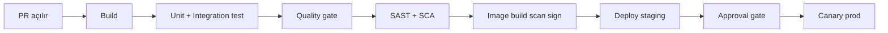
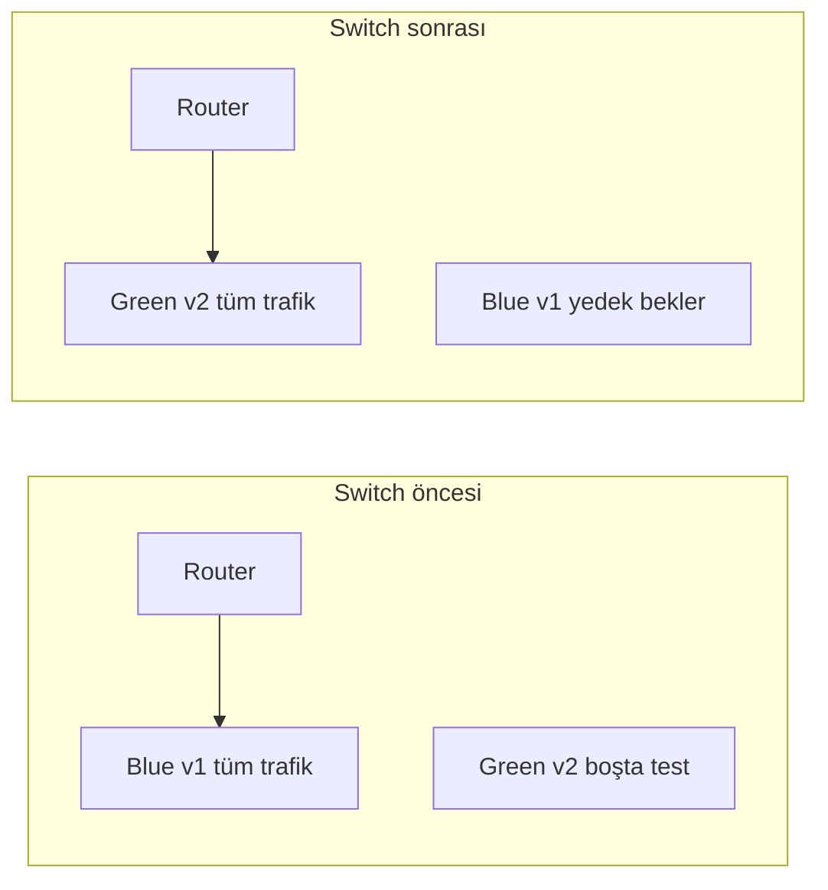
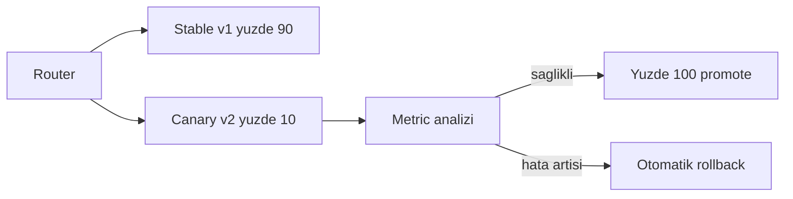
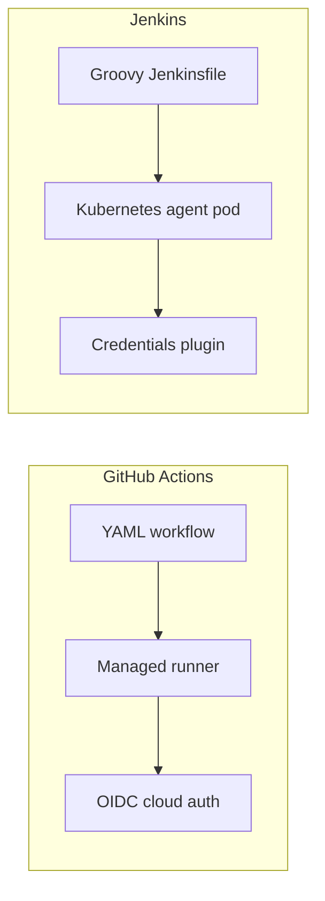

# Topic 11.4 — CI/CD: GitHub Actions, Jenkins, GitOps

```admonish info title="Bu bölümde"
- CI ile CD arasındaki fark ve banking pipeline'ının 6 aşaması: build, test, quality, security, image, deploy
- Aynı pipeline'ı GitHub Actions (modern) ve Jenkins (TR banking yaygın) ile kurmak — hangisi ne zaman
- Deployment stratejileri: rolling, blue-green, canary + Argo Rollouts metric analizi ile auto-rollback
- Supply chain güvenliği: SonarQube quality gate, Trivy image scan, Cosign imzalama, SBOM attest
- Banking gate'leri: branch protection, 2 reviewer, OIDC secrets, production manual approval + ITSM ticket
```

## Hedef

Banking-grade bir CI/CD pipeline'ını uçtan uca kurabilmek: build, test, quality gate (SonarQube), SAST (FindSecBugs), SCA (OWASP dependency-check/Snyk), DAST (ZAP), image build/scan/sign ve GitOps ile deploy. GitHub Actions'ı ve Jenkins'i aynı akış üzerinden okuyup yazabilmek. Branch protection, code review, secrets management ve regulatory approval gate'in neden banking'de zorunlu olduğunu savunabilmek.

## Süre

Okuma: ~1.5-2 saat • Kendini Sına: 45 dk • Pratik (opsiyonel): ~3 saat • Toplam: ~2.5 saat (+ pratik)

## Önbilgi

- Topic 11.1-11.3 bitti (container, Kubernetes temeli)
- Git temel akışı (branch, PR, merge) rahat
- Unit/integration test kavramını biliyorsun (Phase 12 detayı henüz gerekmez)

---

## Kavramlar

### 1. CI/CD büyük resim — CI vs CD

Kod merge'lendi; peki prod'a nasıl güvenle gider? İşte bu sorunun otomatikleştirilmiş cevabı CI/CD'dir. İki ayrı disiplini ayırmak önemli, çünkü mülakatta ilk sorulan budur.

**Continuous Integration (CI)** her push ve PR'da kodu derler, test eder, kalite ve güvenlik taramasından geçirir. Amaç: "bozuk kod main'e hiç yaklaşmasın." **Continuous Delivery/Deployment (CD)** ise geçen kodu image'a paketleyip registry'ye push eder ve ortamlara deploy eder. CI kodu **doğrular**, CD onu **taşır**.

Banking'de tipik akış altı aşamalıdır: build → test → quality → security → image → deploy. Her aşama bir öncekinin çıktısına güvenir; herhangi biri fail ederse zincir durur.



Banking pratiğinde hangi aracın nerede oturduğu:

- **CI:** GitHub Actions, GitLab CI, Jenkins
- **CD (deploy):** ArgoCD / Flux (GitOps)
- **Artifact registry:** Harbor / Nexus / Artifactory
- **SAST:** SonarQube, FindSecBugs, Semgrep
- **SCA:** Snyk, OWASP dependency-check, Renovate
- **DAST:** OWASP ZAP, Burp
- **Image scan:** Trivy, Grype
- **Sign:** Cosign

Tuzak: CI ve CD'yi tek dev script'e yığmak. Banking'de bu ikisi ayrı sorumluluk, ayrı yetki (developer CI'yı tetikler, release manager CD'yi onaylar) ve ayrı audit trail ister.

### 2. Deployment stratejileri — rolling, blue-green, canary

Yeni versiyonu prod'a koymanın "eski pod'u öldür, yenisini aç" dışında yolları vardır; çünkü kesinti ve geri alınabilirlik banking'de pazarlık konusu değildir.

**Rolling update** pod'ları azar azar yeni sürümle değiştirir — Kubernetes default'u, basit ama anlık geri dönüş yavaştır. **Blue-green** ise iki tam ortam tutar: canlı olan **blue**, yeni sürüm **green**'e deploy edilir, smoke test geçince router tüm trafiği tek hamlede green'e çevirir. Sorun çıkarsa router'ı blue'ya geri almak saniyeler sürer.



**Canary** daha da temkinlidir: yeni sürüme önce trafiğin küçük bir dilimi (%10) verilir, metrikler izlenir, sağlıklıysa kademeli olarak %100'e çıkarılır. Hata oranı veya latency eşiği aşarsa otomatik rollback tetiklenir. Banking'de para hareketleri için tercih edilen budur — kör bir switch yerine ölçülerek ilerleme.



Kubernetes'te canary'i elle yönetmek zordur; **Argo Rollouts** bunu declarative yapar: adım adım trafik artışı, Prometheus metric analizi ve eşik aşımında otomatik geri dönüş. Tuzak: metric analizi olmadan canary sadece "yavaş blue-green"dir — asıl değer, kararın insana değil ölçüye bağlanmasıdır.

### 3. GitHub Actions — banking pipeline

En sık karşılaşacağın modern CI, YAML tabanlı GitHub Actions'tır. Workflow bir tetikleyici ve bir dizi job'dan oluşur; önce ne zaman çalışacağını ve ortak değişkenleri tanımlarız.

```yaml
# .github/workflows/banking-ci.yml
on:
  pull_request:
    branches: [main, develop]
  push:
    branches: [main, develop]

env:
  REGISTRY: registry.mavibank.com
  IMAGE_NAME: banking/transfer-service
  JAVA_VERSION: '21'
```

`build-test` job'u işin kalbidir. Dikkat: `runs-on` **dedicated banking runner** kullanır (shared değil), ve entegrasyon testleri için gerçek bir Postgres'i `services` ile ayağa kaldırır.

```yaml
jobs:
  build-test:
    runs-on: ubuntu-latest-banking   # dedicated runner, shared değil
    timeout-minutes: 30
    services:
      postgres:
        image: postgres:16-alpine
        env: { POSTGRES_DB: banking_test, POSTGRES_USER: test, POSTGRES_PASSWORD: test }
        ports: ['5432:5432']
```

Adımlar sırayla derleme, test ve güvenlik taramasını çalıştırır. SCA burada `-DfailBuildOnCVSS=7` ile CVSS 7 üzeri bir CVE bulursa build'i düşürür — yani güvenlik açığı merge'i bloklar.

```yaml
      - name: Unit Tests
        run: ./mvnw -B test
      - name: Integration Tests
        run: ./mvnw -B verify -Pintegration
      - name: SAST — SpotBugs + FindSecBugs
        run: ./mvnw -B com.github.spotbugs:spotbugs-maven-plugin:check
      - name: SCA — OWASP Dependency Check
        run: ./mvnw -B org.owasp:dependency-check-maven:check -DfailBuildOnCVSS=7
```

Quality gate SonarQube'a bağlanır. Kritik parametre `-Dsonar.qualitygate.wait=true`: analiz biter bitmez SonarQube'un quality gate sonucunu bekler ve fail ise adımı düşürür.

```yaml
      - name: SonarQube Analysis
        env:
          SONAR_TOKEN: ${{ secrets.SONAR_TOKEN }}
          SONAR_HOST_URL: ${{ secrets.SONAR_HOST_URL }}
        run: ./mvnw -B sonar:sonar -Dsonar.qualitygate.wait=true
```

```admonish warning title="Quality/security gate'i atlama"
Yaklaşan bir release baskısı altında en çok istenen kısayol "gate'i şimdilik geç, sonra düzeltiriz"dir. Bu quality debt'i faiziyle biriktirir: taranmamış CVE'ler ve düşük coverage prod'a sızar. Gate `wait=true` + `abortPipeline: true` ile merge'i bloklamalı; istisna banking'de yoktur.
```

Ayrı bir `image-build` job'u yalnızca `main`/`develop`'a push'ta çalışır (PR'da değil). Image'ı JIB ile üretip push ettikten sonra Trivy ile tarar; `exit-code: '1'` HIGH/CRITICAL bulguda job'u düşürür.

```yaml
      - name: Scan image — Trivy
        uses: aquasecurity/trivy-action@master
        with:
          image-ref: ${{ env.REGISTRY }}/${{ env.IMAGE_NAME }}:sha-${GITHUB_SHA::7}
          severity: 'CRITICAL,HIGH'
          exit-code: '1'   # bulguda fail
```

Supply chain'in kilit adımı imzalama ve SBOM'dur. <mark>Her image production'a çıkmadan önce Cosign ile imzalanmalı ve bir SBOM ile ilişkilendirilmelidir</mark>; aksi halde admission controller'ın "bu image'ı kim, neyle üretti" sorusuna cevabı yoktur.

```yaml
      - name: Sign image
        env:
          COSIGN_PASSWORD: ${{ secrets.COSIGN_PASSWORD }}
        run: |
          echo "${{ secrets.COSIGN_KEY }}" > cosign.key
          cosign sign --yes --key cosign.key \
            ${{ env.REGISTRY }}/${{ env.IMAGE_NAME }}@${{ steps.build.outputs.digest }}
```

Deploy job'ları GitOps mantığıyla çalışır: CI doğrudan cluster'a `kubectl apply` yapmaz; ayrı bir k8s repo'sundaki image tag'ini günceller ve commit'ler, ArgoCD gerisini senkronize eder. Production job'u ise `environment: production` sayesinde required reviewer onayı bekler.

```yaml
  deploy-production:
    needs: [image-build, deploy-staging]
    if: github.ref == 'refs/heads/main' && github.event_name == 'push'
    environment:
      name: production      # required reviewers + wait timer
      url: https://api.mavibank.com
```

Production'da önce canary overlay güncellenir, Argo Rollouts sağlık metriklerini 15 dakika izler, eşik aşılmazsa promote edilir.

```yaml
      - name: Wait canary health (15 min)
        run: kubectl argo rollouts get rollout transfer-service -n banking --watch --timeout 15m
      - name: Promote canary
        run: kubectl argo rollouts promote transfer-service -n banking
```

Bir de PR'larda çalışan `benchmark` job'u vardır: JMH ile PR ve main baseline'ı ölçer, %10'dan fazla regresyonu fail sayar ve sonucu PR'a comment olarak yazar. Tüm parçaların bir araya geldiği tam workflow aşağıda.

<details>
<summary>Tam workflow: banking-ci.yml (~200 satır)</summary>

```yaml
# .github/workflows/banking-ci.yml
name: Banking Service CI

on:
  pull_request:
    branches: [main, develop]
  push:
    branches: [main, develop]

env:
  REGISTRY: registry.mavibank.com
  IMAGE_NAME: banking/transfer-service
  JAVA_VERSION: '21'

jobs:
  build-test:
    name: Build & Test
    runs-on: ubuntu-latest-banking   # Dedicated runner (security)
    timeout-minutes: 30

    services:
      postgres:
        image: postgres:16-alpine
        env:
          POSTGRES_DB: banking_test
          POSTGRES_USER: test
          POSTGRES_PASSWORD: test
        ports: ['5432:5432']
        options: >-
          --health-cmd "pg_isready -U test"
          --health-interval 10s
          --health-timeout 5s
          --health-retries 5

    steps:
      - name: Checkout
        uses: actions/checkout@v4
        with:
          fetch-depth: 0   # SonarQube needs git history

      - name: Set up Java 21
        uses: actions/setup-java@v4
        with:
          java-version: ${{ env.JAVA_VERSION }}
          distribution: 'temurin'
          cache: 'maven'

      - name: Cache SonarQube
        uses: actions/cache@v4
        with:
          path: ~/.sonar/cache
          key: ${{ runner.os }}-sonar

      - name: Build
        run: ./mvnw -B clean compile

      - name: Unit Tests
        run: ./mvnw -B test

      - name: Integration Tests
        run: ./mvnw -B verify -Pintegration
        env:
          DB_HOST: localhost
          DB_PORT: 5432
          DB_NAME: banking_test
          DB_USER: test
          DB_PASSWORD: test

      - name: SAST — SpotBugs + FindSecBugs
        run: ./mvnw -B com.github.spotbugs:spotbugs-maven-plugin:check

      - name: SCA — OWASP Dependency Check
        run: ./mvnw -B org.owasp:dependency-check-maven:check -DfailBuildOnCVSS=7

      - name: Code Coverage Report
        run: ./mvnw -B jacoco:report

      - name: SonarQube Analysis
        env:
          SONAR_TOKEN: ${{ secrets.SONAR_TOKEN }}
          SONAR_HOST_URL: ${{ secrets.SONAR_HOST_URL }}
        run: |
          ./mvnw -B sonar:sonar \
            -Dsonar.projectKey=banking-transfer-service \
            -Dsonar.qualitygate.wait=true

      - name: Upload coverage
        uses: actions/upload-artifact@v4
        with:
          name: coverage
          path: target/site/jacoco/

  benchmark:
    name: JMH Benchmark
    runs-on: ubuntu-latest-benchmark   # Dedicated benchmark runner
    needs: build-test
    if: github.event_name == 'pull_request'

    steps:
      - uses: actions/checkout@v4
      - uses: actions/setup-java@v4
        with:
          java-version: ${{ env.JAVA_VERSION }}
          distribution: 'temurin'

      - name: Run benchmarks (PR)
        run: |
          ./mvnw -B clean package -DskipTests
          java -jar target/benchmarks.jar -rf json -rff pr-result.json -wi 3 -i 5 -f 2

      - name: Get baseline (main)
        run: |
          git fetch origin main
          git checkout origin/main
          ./mvnw -B clean package -DskipTests
          java -jar target/benchmarks.jar -rf json -rff main-result.json -wi 3 -i 5 -f 2

      - name: Compare + comment PR
        run: |
          python scripts/compare-benchmark.py main-result.json pr-result.json > diff.md

      - uses: actions/github-script@v7
        with:
          script: |
            const diff = require('fs').readFileSync('diff.md', 'utf8');
            github.rest.issues.createComment({
              issue_number: context.issue.number,
              owner: context.repo.owner,
              repo: context.repo.repo,
              body: '## Benchmark\n\n' + diff
            });

  image-build:
    name: Build & Push Image
    runs-on: ubuntu-latest-banking
    needs: [build-test]
    if: github.event_name == 'push' && (github.ref == 'refs/heads/main' || github.ref == 'refs/heads/develop')
    permissions:
      contents: read
      packages: write
      id-token: write   # For OIDC signing

    outputs:
      image-digest: ${{ steps.build.outputs.digest }}
      image-tag: ${{ steps.meta.outputs.tags }}

    steps:
      - uses: actions/checkout@v4
      - uses: actions/setup-java@v4
        with:
          java-version: ${{ env.JAVA_VERSION }}
          distribution: 'temurin'
          cache: 'maven'

      - name: Set up Docker Buildx
        uses: docker/setup-buildx-action@v3

      - name: Login to registry
        uses: docker/login-action@v3
        with:
          registry: ${{ env.REGISTRY }}
          username: ${{ secrets.REGISTRY_USER }}
          password: ${{ secrets.REGISTRY_PASSWORD }}

      - name: Generate tags
        id: meta
        uses: docker/metadata-action@v5
        with:
          images: ${{ env.REGISTRY }}/${{ env.IMAGE_NAME }}
          tags: |
            type=ref,event=branch
            type=sha,prefix=sha-,format=short
            type=semver,pattern={{version}}
            type=raw,value=latest,enable=${{ github.ref == 'refs/heads/main' }}

      - name: Build & push
        id: build
        run: |
          ./mvnw -B compile jib:build \
            -Djib.to.image=${{ env.REGISTRY }}/${{ env.IMAGE_NAME }}:sha-${GITHUB_SHA::7} \
            -Djib.to.tags=${{ steps.meta.outputs.tags }} \
            -Djib.to.auth.username=${{ secrets.REGISTRY_USER }} \
            -Djib.to.auth.password=${{ secrets.REGISTRY_PASSWORD }}

          DIGEST=$(docker buildx imagetools inspect ${{ env.REGISTRY }}/${{ env.IMAGE_NAME }}:sha-${GITHUB_SHA::7} --raw | sha256sum | awk '{print $1}')
          echo "digest=sha256:${DIGEST}" >> $GITHUB_OUTPUT

      - name: Generate SBOM
        run: |
          curl -sSfL https://raw.githubusercontent.com/anchore/syft/main/install.sh | sh -s -- -b /usr/local/bin
          syft ${{ env.REGISTRY }}/${{ env.IMAGE_NAME }}:sha-${GITHUB_SHA::7} -o spdx-json=sbom.json

      - name: Upload SBOM
        uses: actions/upload-artifact@v4
        with:
          name: sbom
          path: sbom.json

      - name: Scan image — Trivy
        uses: aquasecurity/trivy-action@master
        with:
          image-ref: ${{ env.REGISTRY }}/${{ env.IMAGE_NAME }}:sha-${GITHUB_SHA::7}
          format: 'sarif'
          output: 'trivy-results.sarif'
          severity: 'CRITICAL,HIGH'
          exit-code: '1'   # Fail on findings

      - name: Upload Trivy results
        if: always()
        uses: github/codeql-action/upload-sarif@v3
        with:
          sarif_file: 'trivy-results.sarif'

      - name: Install Cosign
        uses: sigstore/cosign-installer@v3

      - name: Sign image
        env:
          COSIGN_PASSWORD: ${{ secrets.COSIGN_PASSWORD }}
        run: |
          echo "${{ secrets.COSIGN_KEY }}" > cosign.key
          cosign sign --yes --key cosign.key \
            ${{ env.REGISTRY }}/${{ env.IMAGE_NAME }}@${{ steps.build.outputs.digest }}

      - name: Attest SBOM
        env:
          COSIGN_PASSWORD: ${{ secrets.COSIGN_PASSWORD }}
        run: |
          cosign attest --yes --key cosign.key \
            --predicate sbom.json --type spdx \
            ${{ env.REGISTRY }}/${{ env.IMAGE_NAME }}@${{ steps.build.outputs.digest }}

  deploy-staging:
    name: Deploy Staging
    needs: image-build
    runs-on: ubuntu-latest-banking
    if: github.ref == 'refs/heads/develop'
    environment:
      name: staging
      url: https://staging.mavibank.com

    steps:
      - uses: actions/checkout@v4
        with:
          repository: mavibank/banking-k8s   # GitOps repo
          token: ${{ secrets.GITOPS_TOKEN }}

      - name: Update image tag
        run: |
          cd services/transfer-service/overlays/staging
          sed -i "s|image: .*|image: ${{ env.REGISTRY }}/${{ env.IMAGE_NAME }}:sha-${GITHUB_SHA::7}|" kustomization.yaml

      - name: Commit + push
        run: |
          git config user.email "ci@mavibank.com"
          git config user.name "Banking CI"
          git add .
          git commit -m "deploy: transfer-service to staging sha-${GITHUB_SHA::7}"
          git push

      - name: Wait ArgoCD sync
        run: |
          argocd app sync banking-transfer-service-staging --grpc-web
          argocd app wait banking-transfer-service-staging --timeout 300

  deploy-production:
    name: Deploy Production
    needs: [image-build, deploy-staging]
    runs-on: ubuntu-latest-banking
    if: github.ref == 'refs/heads/main' && github.event_name == 'push'
    environment:
      name: production
      url: https://api.mavibank.com

    steps:
      - name: Wait for approval
        # Environment "production" has required reviewers (CR Committee)
        run: echo "Production deploy approved"

      - uses: actions/checkout@v4
        with:
          repository: mavibank/banking-k8s
          token: ${{ secrets.GITOPS_TOKEN }}

      - name: Update image tag (canary first)
        run: |
          cd services/transfer-service/overlays/prod-canary
          sed -i "s|image: .*|image: ${{ env.REGISTRY }}/${{ env.IMAGE_NAME }}:sha-${GITHUB_SHA::7}|" kustomization.yaml

      - name: Commit + push
        run: |
          git config user.email "ci@mavibank.com"
          git config user.name "Banking CI"
          git add .
          git commit -m "deploy: transfer-service to prod-canary sha-${GITHUB_SHA::7}"
          git push

      - name: Wait canary health (15 min)
        run: |
          # Argo Rollouts metric watch
          # If error rate / latency exceeds threshold → auto rollback
          kubectl argo rollouts get rollout transfer-service -n banking --watch --timeout 15m

      - name: Promote canary
        run: |
          kubectl argo rollouts promote transfer-service -n banking
```

</details>

### 4. Quality gate — SonarQube banking

Quality gate, "kod çalışıyor" ile "kod merge edilebilir" arasındaki objektif sınırdır; insan inisiyatifini eşiklere çevirir. SonarQube proje ayarını basit bir properties dosyası tanımlar.

```properties
# sonar-project.properties
sonar.projectKey=banking-transfer-service
sonar.sources=src/main
sonar.tests=src/test
sonar.coverage.jacoco.xmlReportPaths=target/site/jacoco/jacoco.xml
sonar.qualitygate.wait=true
```

Banking için tipik gate kriterleri sıkıdır ve yeni koda odaklanır (legacy'i bir gecede düzeltemezsin, ama yeni yazdığın her satır temiz olmalı):

- New code coverage > %80
- Code smells: 0 blocker, 0 critical
- Bugs: 0, Vulnerabilities: 0
- Security hotspots: reviewed
- Cognitive complexity per method < 15
- Duplication < %3

Tuzak: gate'i sadece "toplam coverage" üzerinden kurmak. Eski proje %40'ta takılıyken yeni PR mükemmel olsa bile toplam yavaş yükselir; "new code coverage" metriği bu yüzden banking'de standarttır.

### 5. Jenkins — TR banking'de yaygın

Birçok TR bankası yıllardır Jenkins kullanır; modern GitHub Actions'a geçseler bile mevcut Jenkinsfile'ları okuyabilmen gerekir. Jenkins, Groovy DSL ile pipeline tanımlar ve agent'ı bir Kubernetes pod olarak ayağa kaldırabilir.

```groovy
    agent {
        kubernetes {
            yaml '''
                spec:
                  serviceAccountName: jenkins-banking
                  containers:
                    - name: maven
                      image: maven:3.9-eclipse-temurin-21
                    - name: docker
                      image: docker:24-cli
            '''
        }
    }
```

Test stage'i paralel çalıştırma Jenkins'in güçlü yanıdır — unit ve integration testleri aynı anda koşar, süre kısalır.

```groovy
        stage('Test') {
            parallel {
                stage('Unit') { steps { container('maven') { sh 'mvn -B test' } } }
                stage('Integration') { steps { container('maven') { sh 'mvn -B verify -Pintegration' } } }
            }
        }
```

Quality gate Jenkins'te `waitForQualityGate abortPipeline: true` ile kurulur; SonarQube webhook sonucu gelene kadar bekler ve fail ise pipeline'ı düşürür. GitHub Actions'taki `qualitygate.wait=true`'nun karşılığıdır.

```groovy
        stage('Quality Gate') {
            steps {
                container('maven') {
                    withSonarQubeEnv('banking-sonar') { sh 'mvn -B sonar:sonar' }
                    timeout(time: 5, unit: 'MINUTES') {
                        waitForQualityGate abortPipeline: true
                    }
                }
            }
        }
```

Production deploy'da Jenkins'in `input` step'i insan onayı ister; `submitter` ile sadece belirli bir grubun onaylayabilmesini zorlar. Bu GitHub environment'ın required reviewers'ının Jenkins karşılığıdır.

```groovy
        stage('Deploy Production') {
            when { branch 'main' }
            input {
                message 'Deploy to production?'
                submitter 'banking-release-managers'
            }
            steps {
                bankingDeploy(env: 'prod-canary', service: 'transfer-service', tag: env.BUILD_NUMBER)
            }
        }
```

İki aracın kavramsal haritası aynıdır; farklı olan sözdizimi ve runner modelidir.



<details>
<summary>Tam Jenkinsfile (~150 satır)</summary>

```groovy
// Jenkinsfile
@Library('banking-shared-lib') _

pipeline {
    agent {
        kubernetes {
            yaml '''
                apiVersion: v1
                kind: Pod
                spec:
                  serviceAccountName: jenkins-banking
                  containers:
                    - name: maven
                      image: maven:3.9-eclipse-temurin-21
                      command: [sleep]
                      args: [infinity]
                      resources:
                        limits:
                          memory: 4Gi
                          cpu: 4
                    - name: docker
                      image: docker:24-cli
                      command: [sleep]
                      args: [infinity]
                '''
        }
    }

    environment {
        REGISTRY = 'registry.mavibank.com'
        IMAGE_NAME = 'banking/transfer-service'
        SONAR_TOKEN = credentials('sonar-token')
        REGISTRY_CREDS = credentials('registry-creds')
    }

    stages {
        stage('Build') {
            steps {
                container('maven') {
                    sh 'mvn -B clean compile'
                }
            }
        }

        stage('Test') {
            parallel {
                stage('Unit') {
                    steps {
                        container('maven') {
                            sh 'mvn -B test'
                        }
                    }
                    post {
                        always {
                            junit 'target/surefire-reports/*.xml'
                        }
                    }
                }
                stage('Integration') {
                    steps {
                        container('maven') {
                            sh 'mvn -B verify -Pintegration'
                        }
                    }
                }
            }
        }

        stage('Quality Gate') {
            steps {
                container('maven') {
                    withSonarQubeEnv('banking-sonar') {
                        sh 'mvn -B sonar:sonar'
                    }
                    timeout(time: 5, unit: 'MINUTES') {
                        waitForQualityGate abortPipeline: true
                    }
                }
            }
        }

        stage('Security') {
            parallel {
                stage('SAST') {
                    steps {
                        container('maven') {
                            sh 'mvn -B com.github.spotbugs:spotbugs-maven-plugin:check'
                        }
                    }
                }
                stage('SCA') {
                    steps {
                        container('maven') {
                            sh 'mvn -B org.owasp:dependency-check-maven:check -DfailBuildOnCVSS=7'
                        }
                    }
                }
            }
        }

        stage('Image') {
            when { branch 'main' }
            steps {
                container('maven') {
                    sh """
                        mvn -B compile jib:build \\
                          -Djib.to.image=${REGISTRY}/${IMAGE_NAME}:${BUILD_NUMBER} \\
                          -Djib.to.auth.username=${REGISTRY_CREDS_USR} \\
                          -Djib.to.auth.password=${REGISTRY_CREDS_PSW}
                    """
                }
                container('docker') {
                    sh "trivy image --severity CRITICAL,HIGH --exit-code 1 ${REGISTRY}/${IMAGE_NAME}:${BUILD_NUMBER}"
                }
            }
        }

        stage('Deploy Staging') {
            when { branch 'develop' }
            steps {
                bankingDeploy(env: 'staging', service: 'transfer-service', tag: env.BUILD_NUMBER)
            }
        }

        stage('Deploy Production') {
            when { branch 'main' }
            input {
                message 'Deploy to production?'
                submitter 'banking-release-managers'
            }
            steps {
                bankingDeploy(env: 'prod-canary', service: 'transfer-service', tag: env.BUILD_NUMBER)

                // Wait + promote
                sleep(time: 15, unit: 'MINUTES')
                input {
                    message 'Promote canary to production?'
                    submitter 'banking-release-managers'
                }
                bankingDeploy(env: 'prod', service: 'transfer-service', tag: env.BUILD_NUMBER)
            }
        }
    }

    post {
        failure {
            slackSend(
                channel: '#banking-ci',
                color: 'danger',
                message: "Failed: ${env.JOB_NAME} #${env.BUILD_NUMBER}\n${env.BUILD_URL}"
            )
        }
        always {
            cleanWs()
        }
    }
}
```

</details>

### 6. Branch protection — main'i koru

Pipeline ne kadar iyi olursa olsun, biri `main`'e doğrudan push edebiliyorsa gate'lerin hepsi baypas edilebilir; bu yüzden ilk savunma branch protection'dır.

GitHub'da `main` için tipik banking kuralları: her değişiklik PR ile gelir, en az 2 reviewer + CODEOWNERS onayı ister, tüm status check'ler (CI, SonarQube, Trivy, dependency-check) yeşil olmalı, commit'ler imzalı olmalı ve doğrudan/force push kilitlidir.

```
- Require pull request before merging
  - Required approvers: 2 (banking PR review)
  - Require code owners review (CODEOWNERS)
- Require status checks to pass
  - CI Build & Test, Integration Tests
  - SonarQube Quality Gate, Trivy Image Scan, OWASP Dependency Check
- Require signed commits (supply chain)
- Require linear history (no merge commits)
- Lock branch (no direct push, no force push)
- Restrict who can push (banking release engineers)
```

Tuzak: status check'leri "required" yapmayı unutmak. Check tanımlı ama zorunlu değilse kırmızıyken bile merge açık kalır — protection bir işe yaramaz.

### 7. Secrets management — CI'da sır tutmak

Pipeline registry'ye, DB'ye, cloud'a erişir; bu erişimleri sağlayan sırların kod içinde asla görünmemesi gerekir. En sık hata, parolayı YAML'a gömmektir.

```yaml
env:
  DB_PASSWORD: hardcoded   # ❌ repo'ya sızan sır = anında rotasyon
```

Doğrusu iki katmanlıdır. Statik sırlar için GitHub Secrets (veya Vault); cloud erişimi için ise hiç uzun ömürlü key tutmadan OIDC. <mark>CI'da uzun ömürlü cloud key saklama; OIDC ile her koşuda kısa ömürlü bir token al</mark> — böylece sızsa bile dakikalar içinde geçersiz olur.

```yaml
- name: AWS credentials
  uses: aws-actions/configure-aws-credentials@v4
  with:
    role-to-assume: arn:aws:iam::123456789012:role/banking-ci
    aws-region: eu-central-1
    # Uzun ömürlü key yok — OIDC kısa ömürlü token
```

Dinamik sırlar için Vault entegrasyonu, DB parolası gibi değerleri çalışma anında enjekte eder ve TTL sonunda otomatik geçersiz kılar.

```yaml
- name: Vault secrets
  uses: hashicorp/vault-action@v3
  with:
    url: https://vault.banking.com
    method: jwt
    role: banking-ci
    secrets: |
      secret/data/banking/ci db_password | DB_PASSWORD ;
      secret/data/banking/ci registry_token | REGISTRY_TOKEN
```

### 8. Banking deployment approval gate

Bir bankada "kod merge oldu, otomatik prod'a gitti" cümlesi denetimde soru işaretidir; production'a çıkış bilinçli, kayıtlı ve onaylı bir karar olmalıdır.

<mark>Banking'de production deploy asla merge ile otomatik tetiklenmez</mark>; en az bir insan onayı ve bir change management kaydı arasından geçer. Production deploy için tipik ön koşullar: code review onaylı, quality gate geçti, image imzalı+taranmış, staging testi başarılı, release manager + ops manuel onayı, ITSM (Jira/ServiceNow) ticket'ı linkli, bakım penceresi hizalı ve rollback planı yazılı.

GitHub Actions'ta bu, `environment` üzerinden required reviewers ve wait timer ile kurulur:

```yaml
deploy-production:
  environment:
    name: production
    url: https://api.mavibank.com
  # GitHub UI: required reviewers + wait timer
```

Tuzak: onayı sadece Slack mesajıyla almak. BDDK denetiminde "kim, ne zaman, hangi ticket'la onayladı" audit trail'i aranır; onay platformun içinde kayıtlı olmalı.

### 9. Rollback stratejisi

Deploy'un yarısı geri alabilmektir; canary sağlıklı görünüp beş dakika sonra bozulabilir, o an "nasıl geri döneriz" sorusuna hazır cevabın olmalı.

**Otomatik:** Argo Rollouts metric analysis error rate veya latency sıçramasını görürse canary'i kendiliğinden geri alır. **Manuel:** GitOps repo'sunda revert commit, ArgoCD UI'dan rollback, veya son çare `kubectl rollout undo deployment/transfer-service`.

Banking pratiği: canary fazında auto-rollback, tam prod'da ise commit revert ile manuel onaylı rollback — ve her durumda audit trail zorunlu. Tuzak: rollback'i ilk kez gerçek bir olay sırasında denemek; pre-prod'da provası yapılmamış rollback, kriz anında çalışmaz.

### 10. Banking CI/CD anti-pattern'leri

Mülakatta "bu pipeline'da ne yanlış?" sorusunun cephaneliği burasıdır; on klasik hata:

1. **Shared CI runner** — noisy neighbor ve sır sızıntısı riski. Banking dedicated runner kullanır.
2. **Long-lived credentials** — GitHub Secret'taki AWS access key sızarsa felaket. OIDC short-lived token.
3. **CI'dan `kubectl apply`** — cluster git state'inden drift eder. ArgoCD/Flux GitOps.
4. **Güvenlik taraması yok** — CVE sessizce birikir. Trivy + dependency-check zorunlu.
5. **İmzasız image** — supply chain saldırısına açık. Cosign + admission policy.
6. **Main'e doğrudan push** — branch protection PR'ı zorunlu kılmalı, istisnasız.
7. **Quality gate atlama** — "geç teslim, gate sonra" quality debt biriktirir. Merge'i blokla.
8. **Merge'de otomatik prod deploy** — banking manuel approval gate ister.
9. **Rollback provası yok** — prod rollback ilk kez gerçek hatada denenir. Pre-prod'da test et.
10. **Change management entegrasyonu yok** — BDDK için ITSM ticket linki zorunlu.

```admonish tip title="GitOps'un can alıcı avantajı"
CI'dan `kubectl apply` yaparsan cluster'ın gerçek hali repo'daki YAML'dan sessizce ayrışır (drift) ve "prod'da tam olarak ne çalışıyor" sorusunun tek doğru cevabı kalmaz. GitOps'ta git repo tek gerçek kaynaktır: ArgoCD sürekli karşılaştırır, drift'i gösterir ve istersen otomatik düzeltir. Denetim, geri alma ve "kim değiştirdi" hepsi git history'de.
```

---

## Önemli olabilecek araştırma kaynakları

- GitHub Actions documentation
- Jenkins official docs
- ArgoCD / Argo Rollouts docs
- "Continuous Delivery" — Jez Humble
- "The DevOps Handbook" — Gene Kim
- OWASP DevSecOps maturity model
- BDDK IT change management

---

## Kendini Sına

Aşağıdaki soruları önce **cevaba bakmadan** kendi cümlelerinle yanıtlamayı dene — hepsi TR bank mülakatlarında karşına çıkabilecek tarzda. Takıldığında ilgili Kavramlar başlığına dön.

**S1. CI ile CD arasındaki fark nedir? Banking'de bu ikisini neden ayrı tutarız?**

<details>
<summary>Cevabı göster</summary>

CI (Continuous Integration) her push ve PR'da kodu derler, test eder, quality ve security taramasından geçirir — amacı bozuk kodun main'e yaklaşmasını engellemek, yani kodu doğrulamak. CD (Continuous Delivery/Deployment) ise geçen kodu image'a paketleyip registry'ye push eder ve ortamlara deploy eder — kodu taşır.

Banking'de ayrı tutmanın sebebi sorumluluk ve yetki ayrımıdır: developer CI'yı tetikler ama production CD'sini bir release manager onaylar. Ayrıca ayrı audit trail ister; BDDK denetiminde "kod ne zaman geçti" ile "prod'a kim onayladı" iki farklı kayıttır.

</details>

**S2. Blue-green ile canary deployment arasındaki fark nedir? Banking'de hangisini ne zaman seçersin?**

<details>
<summary>Cevabı göster</summary>

Blue-green iki tam ortam tutar: canlı blue, yeni sürüm green'e deploy edilir, smoke test geçince router tüm trafiği tek hamlede green'e çevirir. Geri dönüş router'ı blue'ya almakla saniyeler sürer ama switch anı "hep ya da hiç"tir. Canary ise yeni sürüme önce trafiğin küçük bir dilimini (%10) verir, metrikleri izler, sağlıklıysa kademeli %100'e çıkarır; eşik aşılırsa otomatik rollback.

Banking'de kritik para hareketleri için canary tercih edilir çünkü karar kör bir switch'e değil ölçüye bağlanır — Argo Rollouts + Prometheus metric analysis ile hata oranı/latency izlenip otomatik geri alınabilir. Blue-green ise anlık tam geçiş ve hızlı toplu rollback istenen, metrik izlemenin zor olduğu durumlarda iyidir.

</details>

**S3. Banking bir CI pipeline'ında hangi gate'ler bulunmalı ve neden her biri build'i fail edebilmeli?**

<details>
<summary>Cevabı göster</summary>

Sırasıyla: build (derleme), unit + integration test, quality gate (SonarQube), SAST (SpotBugs+FindSecBugs), SCA (OWASP dependency-check), image scan (Trivy). Her biri fail edebilmelidir çünkü gate'in tek anlamı "geçemezsen ilerleyemezsin"dir — uyarı verip devam eden bir gate, gate değildir.

Somut örnek: SonarQube `qualitygate.wait=true` ile new code coverage %80 altındaysa veya blocker smell varsa merge'i bloklar; dependency-check `-DfailBuildOnCVSS=7` ile CVSS 7+ bir CVE bulursa build'i düşürür; Trivy `exit-code: 1` ile HIGH/CRITICAL image açığında job'u fail eder. Bunları uyarıya çevirmek quality/security debt'i sessizce prod'a taşır.

</details>

**S4. Image scan (Trivy) ve image sign (Cosign) neden banking'de mutlaka olmalı? Biri diğerinin yerine geçer mi?**

<details>
<summary>Cevabı göster</summary>

İkisi farklı tehdide bakar, biri diğerinin yerine geçmez. Trivy image içindeki bilinen CVE'leri tarar (base image, kütüphaneler) ve HIGH/CRITICAL bulursa build'i düşürür — "bu image'da açık var mı" sorusu. Cosign ise image'ı özel anahtarla imzalar; admission controller cluster'a girerken imzayı doğrular — "bu image'ı bizim güvendiğimiz pipeline mı üretti, sonradan değiştirilmiş mi" sorusu.

Supply chain saldırısında saldırgan temiz görünen ama zehirli bir image'ı registry'ye koyabilir; tarama onu yakalamayabilir ama imza doğrulaması "bu bizim imzamız değil" diyerek reddeder. SBOM attest ile birlikte, image'ın içindekiler ve kaynağı denetlenebilir hale gelir. Banking'de üçü birlikte zorunludur.

</details>

**S5. GitOps (ArgoCD) neden CI'dan doğrudan `kubectl apply` yapmaktan daha iyi?**

<details>
<summary>Cevabı göster</summary>

CI'dan `kubectl apply` yaparsan cluster'ın gerçek hali git repo'sundaki YAML'dan zamanla sessizce ayrışır (drift); "prod'da tam olarak ne çalışıyor" sorusunun güvenilir tek cevabı kalmaz. GitOps'ta git repo tek gerçek kaynaktır: CI yalnızca k8s repo'sundaki image tag'ini commit'ler, ArgoCD/Flux repo ile cluster'ı sürekli karşılaştırır ve senkronize eder.

Faydası banking için kritik: her değişiklik git history'de kim/ne zaman/hangi commit olarak durur (audit trail), rollback bir revert commit'tir, drift otomatik tespit edilir ve istenirse düzeltilir. Ayrıca CI'ya cluster'a doğrudan yazma yetkisi vermek zorunda kalmazsın — saldırı yüzeyi küçülür.

</details>

**S6. Banking'de production deploy neden manuel approval ve change management ticket ister? Bunu teknik olarak nasıl zorlarsın?**

<details>
<summary>Cevabı göster</summary>

Çünkü BDDK ve iç denetim, prod'a giden her değişikliğin bilinçli, onaylı ve kayıtlı olmasını ister — "merge oldu, otomatik gitti" denetimde kabul edilmez. Onay zinciri tipik olarak release manager + ops onayı, staging testi başarısı, imzalı+taranmış image, bakım penceresi ve yazılı rollback planını kapsar.

Teknik olarak GitHub Actions'ta `environment: production` üzerine required reviewers + wait timer konur; onay verilmeden job başlamaz ve onay platformda kayıtlı kalır. Jenkins'te karşılığı `input { message ...; submitter 'banking-release-managers' }` step'idir. ITSM entegrasyonu ile deploy, ilgili Jira/ServiceNow ticket'ına linklenir — audit trail tamamlanır.

</details>

**S7. CI'da secrets yönetiminde OIDC short-lived token'ı long-lived cloud key'e göre neden tercih ederiz?**

<details>
<summary>Cevabı göster</summary>

Long-lived bir AWS access key GitHub Secret'ta dursa bile sızma riski taşır: log'a düşebilir, bir action'a leak olabilir, ve sızdığında manuel rotasyona kadar geçerli kalır. OIDC'de ise CI, cloud'a kendi kimliğiyle (OIDC token) başvurur ve `configure-aws-credentials` bir IAM rolünü üstlenerek dakikalar geçerli kısa ömürlü bir token alır — saklanan kalıcı bir sır yoktur.

Sonuç: sızsa bile token kısa sürede geçersiz olur, saldırı penceresi minimuma iner. Statik sırlar (DB parolası gibi) için de tercih Vault dinamik secret'larıdır: çalışma anında enjekte edilir, TTL sonunda otomatik geçersiz olur. Kod içine sır gömmek (`DB_PASSWORD: hardcoded`) ise anında rotasyon gerektiren bir olaydır.

</details>

**S8. Rollback stratejinde otomatik ve manuel yaklaşımlar nasıl ayrışır? Banking'de hangisi nerede?**

<details>
<summary>Cevabı göster</summary>

Otomatik rollback canary fazında devreye girer: Argo Rollouts metric analysis error rate veya latency sıçramasını görürse yeni sürümü kendiliğinden geri alır — insan reaksiyonundan hızlıdır. Manuel rollback ise tam prod'da tercih edilir: GitOps repo'sunda revert commit, ArgoCD UI'dan rollback veya son çare `kubectl rollout undo`.

Banking pratiği ikisini birleştirir: canary'de auto-rollback (ölçüye bağlı, hızlı), tam prod'da onaylı manuel rollback (revert commit, audit trail'li). Kritik nokta: rollback'in provası pre-prod'da yapılmış olmalı — ilk kez gerçek bir olay sırasında denenen rollback genellikle çalışmaz.

</details>

---

## Defter notları

1. "CI vs CD ayrımı: CI kodu ____, CD onu ____; banking'de neden ayrı yetki: ____."
2. "Banking pipeline 6 aşama (build, test, quality, security, image, deploy) akışı: ____."
3. "Quality gate SonarQube `wait=true` + new code coverage %80 + merge block: ____."
4. "SAST + SCA + DAST + image scan defense-in-depth, her biri fail edebilmeli çünkü: ____."
5. "Image supply chain: Trivy scan + SBOM (Syft) + Cosign sign/attest — hangisi hangi tehdide: ____."
6. "Blue-green vs canary: switch modeli farkı ____, banking use case ____."
7. "Canary Argo Rollouts + metric analysis + auto-rollback: ____."
8. "GitOps ArgoCD tek gerçek kaynak + CI no kubectl apply + drift detect: ____."
9. "Production approval gate + change management ticket banking BDDK: ____."
10. "Secrets OIDC short-lived vs long-lived key + Vault dynamic: ____."

```admonish success title="Bölüm Özeti"
- CI kodu doğrular (build, test, quality, security), CD onu taşır (image, deploy); banking'de ayrı yetki ve ayrı audit trail ister
- Banking pipeline'ının 6 aşamasındaki her gate fail edebilmeli: `qualitygate.wait=true`, `failBuildOnCVSS=7`, Trivy `exit-code: 1` merge'i bloklar
- Deployment stratejileri: rolling (default), blue-green (anlık switch + hızlı toplu rollback), canary (kademeli + metric analysis + auto-rollback); banking para hareketlerinde canary
- Supply chain üçlüsü ayrı tehditlere bakar: Trivy CVE tarar, Cosign kaynağı imzalar, SBOM içeriği belgeler — biri diğerinin yerine geçmez
- GitOps (ArgoCD) git'i tek gerçek kaynak yapar; CI kubectl apply yapmaz, sadece k8s repo'sunu commit'ler — drift, rollback ve audit git history'de
- Banking gate'leri: branch protection (2 reviewer + CODEOWNERS + signed commit), OIDC short-lived secrets, production manuel approval + ITSM ticket — hepsi denetim için zorunlu
```

---

## Pratik yapmak istersen

Kavramları koda dökmek istersen aşağıdaki iki ek hazır: test/doğrulama rehberi pipeline bileşenlerini yerelde çalıştırmak için komutlar ve bir JMH regression testi içerir; Claude-verify prompt'u ile yazdığın pipeline'ı banking-grade perspektiften denetletebilirsin.

<details>
<summary>Test ve doğrulama rehberi</summary>

Süre: ~1 saat. Amaç: pipeline'ın kritik gate'lerini (build, quality, image scan, sign) yerelde tetikleyip yeşil/kırmızı davranışını gözlemlemek.

Workflow'u yerelde `act` ile koşabilir, tek tek pipeline bileşenlerini elle çalıştırabilirsin:

```bash
# Local Act (GitHub Actions'ı yerelde çalıştır)
act -W .github/workflows/banking-ci.yml -j build-test

# Pipeline bileşen testleri
./mvnw -B clean verify -Pintegration
./mvnw -B sonar:sonar -Dsonar.qualitygate.wait=true
trivy image banking/transfer-service:test --severity HIGH,CRITICAL --exit-code 1
cosign verify --key cosign.pub banking/transfer-service:test
```

JMH regression gate'ini bir test olarak da ifade edebilirsin: yeni koddaki transfer latency'si main baseline'ın %10 üzerine çıkarsa fail.

```java
@Test
@Tag("ci-validate")
void shouldNotIntroduceRegressionInTransferLatency() throws Exception {
    Options opt = new OptionsBuilder()
        .include("transferBenchmark")
        .warmupIterations(3)
        .measurementIterations(5)
        .forks(1)
        .build();

    RunResult r = new Runner(opt).run().iterator().next();
    double score = r.getPrimaryResult().getScore();

    double baseline = readBaseline();   // main baseline artifact'tan

    assertThat(score)
        .as("Transfer latency regression")
        .isLessThan(baseline * 1.10);   // < %10 regresyon
}
```

Tamamlama kriterleri:

- `act` ile `build-test` job'unu yerelde yeşil çalıştırdım
- Trivy'i bilerek açıklı bir image'a çalıştırıp `exit-code 1` ile fail ettiğini gördüm
- SonarQube quality gate'i `wait=true` ile bir kez geçirdim, bir kez (düşük coverage ile) blokladım
- JMH regression testini main baseline'a karşı çalıştırıp fail/pass davranışını gözlemledim

</details>

<details>
<summary>Claude-verify prompt</summary>

Süre: ~30 dk. Yazdığın pipeline'ı aşağıdaki prompt ile banking-grade kriterlere göre denetlet; her madde için PASS/FAIL/EKSIK işaretlet, kanıt istet, kod yazdırma.

```
CI/CD pipeline'ımı banking-grade kriterlere göre değerlendir, kod yazma:

1. CI build:
   - Java 21 + Maven + cache?
   - Unit + integration test (services veya Testcontainers)?
   - Code coverage Jacoco + Surefire/Failsafe reports?

2. Quality gate:
   - SonarQube integration + qualitygate.wait + fail?
   - New code coverage > %80, 0 blocker / critical?

3. Security:
   - SAST (SpotBugs + FindSecBugs)?
   - SCA (OWASP dependency-check / Snyk), fail on CVSS > 7?
   - DAST (ZAP) post-deploy?

4. Image:
   - JIB / Docker reproducible build, multi-tag (sha + version)?
   - Trivy scan fail HIGH/CRITICAL?
   - SBOM generate (Syft) + Cosign sign + attest?

5. Performance:
   - JMH benchmark PR vs main, regression > %10 fail, PR comment?

6. Deployment:
   - GitOps (ArgoCD/Flux), CI kubectl apply YAPMIYOR?
   - Canary (Argo Rollouts) metric analysis + auto-rollback?

7. Approval gates:
   - PR review 2+ approver + CODEOWNERS + branch protection?
   - Production manuel approval (GitHub environment)?
   - Change management ticket link (ITSM)?

8. Secrets:
   - GitHub Secrets / Vault, OIDC short-lived?
   - Uzun ömürlü AWS key YOK?

9. Runner:
   - Dedicated banking runner (shared değil)?

10. Notifications:
    - Slack on fail, ITSM ticket update?

11. Anti-pattern kontrolü:
    - Shared runner / long-lived credential / kubectl apply from CI YOK?
    - Security scan var, image sign var, direct push main YOK?
    - Auto prod deploy YOK, change management var?

Her madde için PASS / FAIL / EKSIK işaretle, kanıt göster.
```

</details>

---

## Tamamlama kriterleri

- [ ] CI ile CD arasındaki farkı ve banking pipeline'ının 6 aşamasını anlatabiliyorum
- [ ] GitHub Actions workflow'unda build + test + quality + security akışını okuyup açıklayabiliyorum
- [ ] Blue-green ile canary farkını ve hangisini ne zaman seçeceğimi biliyorum
- [ ] Quality gate + SAST + SCA + image scan'in neden fail etmesi gerektiğini savunabiliyorum
- [ ] Image supply chain zincirini (Trivy + SBOM + Cosign sign/attest) ve her birinin hangi tehdide baktığını çizebiliyorum
- [ ] GitOps'un neden CI'dan `kubectl apply`'a üstün olduğunu açıklayabiliyorum
- [ ] Branch protection + production approval + ITSM gate'lerini banking bağlamında sayabiliyorum
- [ ] OIDC short-lived token'ın long-lived cloud key'e neden tercih edildiğini anlatabiliyorum
- [ ] Otomatik ve manuel rollback'in nerede kullanıldığını (canary auto vs prod revert) açıklayabiliyorum
- [ ] (Opsiyonel) "Pratik yapmak istersen" rehberini uyguladım ve Claude-verify prompt'uyla doğrulattım

---
