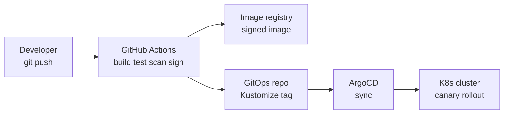
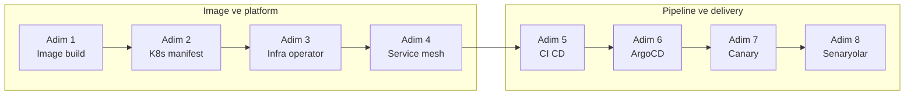
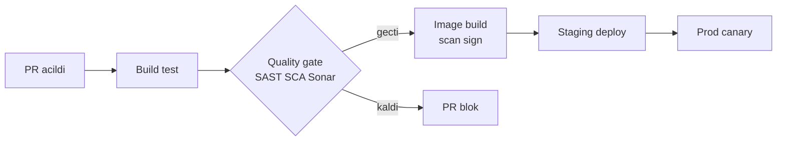
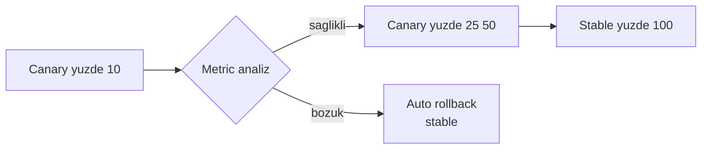

# Phase 11 Mini-Project — Banking Production Deployment Pipeline

```admonish info title="Bu projede"
- Phase 7-10'un 10 banking microservice'ini JIB ile image'a alıp her build'de Trivy scan + Cosign sign'dan geçiriyorsun
- Kustomize base + 3 overlay ile K8s manifest'leri (security + observability + autoscale) yazıyor, PostgreSQL + Kafka operator ve Vault Secrets CSI ile platformu kuruyorsun
- GitHub Actions matrix CI/CD + ArgoCD GitOps + Argo Rollouts canary ile progressive delivery pipeline'ı uçtan uca bağlıyorsun
- Opsiyonel Istio service mesh ile mTLS STRICT + canary routing ekliyorsun
- 6 production senaryosunu (deploy / rollback / security gate / hotfix / drift / DR) reproduce edip pipeline'ının davranışını ispatlıyorsun
```

## Hedef

Phase 11'in 4 topic'inde Docker, docker compose, Kubernetes ve CI/CD öğrendin; bu projede hepsini birleştirip Phase 7-10 banking microservice'lerini **production-grade** deploy ediyorsun. Yeni teori yok — **synthesis** var: image build, K8s security, GitOps ve progressive delivery tek pipeline'da buluşuyor. Bir adımda takılırsan ilgili topic'e dön, oku, düzelt.

Projenin sonunda elinde şunlar olacak: signed + scanned image üreten CI, Kustomize'lı GitOps repo, operator'larla ayakta duran veri katmanı ve metric bozulunca kendini geri alan canary rollout. Bu, TR bankalarında **DevOps / Platform Engineer** rolünün istediği tam paket.

```admonish tip title="Süre ve önbilgi"
10-12 gün ayır (günde ~3 saat). Başlamadan önce Phase 10 mini-project bitmiş, Topic 11.1-11.4 ([Docker](../01-docker-for-java/index.md), [Compose](../02-docker-compose/index.md), [K8s](../03-kubernetes-basics/index.md), [CI/CD](../04-ci-cd/index.md)) tamamlanmış olmalı. Buradaki işin çoğu **deploy strategy + pipeline design** — servislerin kendisi hazır kabul ediliyor.
```

## Deployment mimarisi

Sistemin belkemiği tek yönlü bir akış: developer kod push eder, CI image üretip imzalar, GitOps repo'ya tag yazılır, ArgoCD cluster'ı git state'e senkronlar. <mark>Cluster'a hiçbir şey `kubectl apply` ile elle girmez</mark> — tek gerçek kaynağı git'tir, drift otomatik geri alınır.



```admonish warning title="Signed image olmadan deploy yok"
Banking'de provenance zorunlu: her image build'inde Trivy HIGH/CRITICAL bulursa build kırılır, Cosign imzası olmayan image cluster'a admission almaz. BDDK change management için audit trail = git commit history + signed image digest. Bu iki kural gevşetilirse phase'in banking değeri sıfırlanır.
```

## Build plan

Sekiz adım var: ilk dördü image + platform katmanını kurar, son dördü pipeline ve progressive delivery'yi bağlar.



### Adım 1 — Banking image build: JIB + scan + sign (1.5 gün)

**Ne yapacaksın:** 10 service'i JIB ile image'a alıp her build'de Trivy scan + Cosign sign uygulayacaksın. **Neden:** JIB, Dockerfile'sız, daemonsuz ve reproducible layer'lı image üretir; scan + sign ise supply-chain güvenliğinin banking şartıdır.

Kapsamdaki 10 service: `account`, `transfer`, `card`, `xborder`, `loan`, `fx`, `compliance`, `recon`, `gateway`, `ledger`.

JIB config'in kritik parçası container güvenliği — non-root UID ve memory-aware JVM flag'leri:

```xml
<container>
    <user>10001:10001</user>
    <jvmFlags>
        <jvmFlag>-XX:MaxRAMPercentage=75.0</jvmFlag>
        <jvmFlag>-XX:+UseG1GC</jvmFlag>
        <jvmFlag>-XX:+HeapDumpOnOutOfMemoryError</jvmFlag>
    </jvmFlags>
    <ports><port>8080</port><port>8081</port></ports>
</container>
```

Registry hedefi `registry.mavibank.com/banking/${artifactId}`, tag'ler `${version}` + `latest`. Build sonrası zinciri: `trivy image` HIGH/CRITICAL'da exit 1, `cosign sign` ile imza.

<details>
<summary>Tam kod: JIB plugin config (~33 satır)</summary>

```xml
<plugin>
    <groupId>com.google.cloud.tools</groupId>
    <artifactId>jib-maven-plugin</artifactId>
    <configuration>
        <from>
            <image>eclipse-temurin:21-jre-jammy</image>
        </from>
        <to>
            <image>registry.mavibank.com/banking/${project.artifactId}</image>
            <tags>
                <tag>${project.version}</tag>
                <tag>latest</tag>
            </tags>
        </to>
        <container>
            <user>10001:10001</user>
            <jvmFlags>
                <jvmFlag>-XX:MaxRAMPercentage=75.0</jvmFlag>
                <jvmFlag>-XX:+UseG1GC</jvmFlag>
                <jvmFlag>-XX:MaxGCPauseMillis=200</jvmFlag>
                <jvmFlag>-XX:+HeapDumpOnOutOfMemoryError</jvmFlag>
                <jvmFlag>-XX:HeapDumpPath=/dumps</jvmFlag>
                <jvmFlag>-Duser.timezone=Europe/Istanbul</jvmFlag>
                <jvmFlag>-Dfile.encoding=UTF-8</jvmFlag>
            </jvmFlags>
            <ports>
                <port>8080</port>
                <port>8081</port>
            </ports>
        </container>
    </configuration>
</plugin>
```

</details>

Kontrol noktası: 10 service'in her biri multi-tag image üretiyor; Trivy raporu temiz, Cosign imzası `cosign verify` ile doğrulanıyor.

### Adım 2 — K8s manifests: Kustomize base + overlays (2 gün)

**Ne yapacaksın:** Her service için banking-grade Deployment template'i yazıp Kustomize base + 3 overlay (dev/staging/prod) yapısına oturtacaksın. **Neden:** Environment farklarını (replica, resource, image tag) patch'le yönetmek copy-paste'ten güvenli; base tek yerde, overlay sadece farkı taşır.

Deployment template'inin banking şartları:

- 3 replica, `maxUnavailable: 0` (zero-downtime)
- Non-root + `readOnlyRootFilesystem` + `drop: [ALL]` capabilities
- Resources requests **ve** limits; liveness + readiness + startup probe
- `topologySpreadConstraints` (zone) + `podAntiAffinity` (host)
- PDB `minAvailable: 2`, HPA CPU + custom RPS
- Vault Secrets CSI + NetworkPolicy ingress/egress whitelist

GitOps repo'nun iskeleti base / overlays / shared / infrastructure olarak ayrılır:

<details>
<summary>Tam referans: GitOps repo dizin yapısı (~38 satır)</summary>

```
banking-k8s/
├── base/
│   ├── account-service/
│   │   ├── deployment.yaml
│   │   ├── service.yaml
│   │   ├── configmap.yaml
│   │   ├── serviceaccount.yaml
│   │   ├── networkpolicy.yaml
│   │   ├── hpa.yaml
│   │   ├── pdb.yaml
│   │   ├── secretproviderclass.yaml
│   │   └── kustomization.yaml
│   ├── transfer-service/ ...
│   ├── ... 8 more services
│   └── gateway/
├── overlays/
│   ├── dev/
│   │   ├── kustomization.yaml
│   │   └── patches/
│   ├── staging/
│   └── prod/
│       ├── kustomization.yaml
│       ├── patches/
│       └── argocd-rollout.yaml   # Canary config
├── shared/
│   ├── namespaces.yaml
│   ├── rbac.yaml
│   ├── networkpolicy-default-deny.yaml
│   ├── pod-security-standards.yaml
│   ├── ingress.yaml
│   └── cert-manager/
└── infrastructure/
    ├── postgres/
    ├── kafka/
    ├── keycloak/
    ├── vault/
    └── observability/
```

</details>

```admonish warning title="Default-deny önce gelir"
`shared/networkpolicy-default-deny.yaml` namespace'e tüm ingress/egress'i kapatır; her service ancak kendi `networkpolicy.yaml`'ında ihtiyacı olan trafiği (DB, Kafka, ArgoCD) açar. PCI/BDDK segmentasyonu bunun üstüne kurulur — <mark>bir service'in DB'ye erişimi açıkça izinlenmediyse erişemez</mark>.
```

Kontrol noktası: `kustomize build overlays/prod` hatasız render ediyor; render edilen Deployment'ta non-root, probe'lar ve PDB görünüyor.

### Adım 3 — Infrastructure: operator'larla veri katmanı (1.5 gün)

**Ne yapacaksın:** PostgreSQL (Zalando) ve Kafka (Strimzi) operator'larını, ardından Keycloak + Vault + observability stack'i manifest'le kuracaksın. **Neden:** Stateful sistemleri elle yönetmek banking'de kabul edilemez; operator failover, backup ve replica'yı deklaratif hale getirir.

PostgreSQL'de kritik satırlar: 3 instance + fast-ssd storage + connection/memory parametreleri.

```yaml
spec:
  teamId: "banking"
  numberOfInstances: 3
  volume:
    size: 100Gi
    storageClass: fast-ssd
  postgresql:
    version: "16"
    parameters:
      max_connections: "200"
      shared_buffers: "2GB"
```

Kafka'da banking dayanıklılığı `min.insync.replicas: 2` + `replication.factor: 3` ile gelir — bir broker düşse bile veri kaybı olmaz.

<details>
<summary>Tam referans: Postgres + Kafka operator manifest'leri (~65 satır)</summary>

```yaml
apiVersion: acid.zalan.do/v1
kind: postgresql
metadata:
  name: banking-pg
  namespace: banking-data
spec:
  teamId: "banking"
  volume:
    size: 100Gi
    storageClass: fast-ssd
  numberOfInstances: 3
  users:
    banking:
      - superuser
      - createdb
  databases:
    banking: banking
  postgresql:
    version: "16"
    parameters:
      max_connections: "200"
      shared_buffers: "2GB"
      work_mem: "16MB"
  resources:
    requests:
      cpu: 1
      memory: 4Gi
    limits:
      cpu: 4
      memory: 8Gi
```

```yaml
apiVersion: kafka.strimzi.io/v1beta2
kind: Kafka
metadata:
  name: banking-kafka
  namespace: banking-data
spec:
  kafka:
    version: 3.7.0
    replicas: 3
    listeners:
      - name: plain
        port: 9092
        type: internal
      - name: tls
        port: 9093
        type: internal
        tls: true
    config:
      offsets.topic.replication.factor: 3
      transaction.state.log.replication.factor: 3
      transaction.state.log.min.isr: 2
      default.replication.factor: 3
      min.insync.replicas: 2
      log.retention.hours: 168
    storage:
      type: persistent-claim
      size: 200Gi
      class: fast-ssd
  zookeeper:
    replicas: 3
    storage:
      type: persistent-claim
      size: 10Gi
```

</details>

Aynı yöntemle Keycloak operator, Vault ve observability stack'i (Prometheus operator, Loki, Tempo, Grafana) kur.

Kontrol noktası: `kubectl get postgresql,kafka -n banking-data` üç instance READY gösteriyor; bir Kafka broker'ı sildiğinde topic erişilebilir kalıyor.

### Adım 4 — Service mesh: Istio (opsiyonel) (1 gün)

**Ne yapacaksın:** Istio kurup namespace'e sidecar injection, mTLS STRICT ve canary VirtualService routing ekleyeceksin. **Neden:** Servisler arası trafiği şifrelemek (mTLS) ve canary trafiğini header/weight ile yönlendirmek uygulama koduna dokunmadan mesh katmanında yapılır. Bu adım opsiyonel — atlayabilirsin, ama canary trafik yönlendirmesi Adım 7'de mesh'e yaslanır.

Namespace'i `istio-injection: enabled` label'ıyla işaretle, sonra mesh içi tüm trafiği zorunlu mTLS'e al:

```yaml
apiVersion: security.istio.io/v1beta1
kind: PeerAuthentication
metadata:
  name: default
  namespace: banking
spec:
  mtls:
    mode: STRICT
```

Canary routing header (`x-canary: true`) ile explicit, geri kalan trafik 90/10 weight ile stable/canary'ye dağılır.

<details>
<summary>Tam referans: IstioOperator + VirtualService canary (~45 satır)</summary>

```yaml
apiVersion: install.istio.io/v1alpha1
kind: IstioOperator
metadata:
  name: banking-istio
spec:
  profile: default
  meshConfig:
    accessLogFile: /dev/stdout
    defaultConfig:
      tracing:
        sampling: 10.0
        zipkin:
          address: zipkin.istio-system:9411
  components:
    pilot:
      k8s:
        resources:
          requests:
            cpu: 500m
            memory: 2Gi
```

```yaml
apiVersion: networking.istio.io/v1beta1
kind: VirtualService
metadata:
  name: transfer-service
  namespace: banking
spec:
  hosts:
    - transfer-service
  http:
    - match:
        - headers:
            x-canary:
              exact: "true"
      route:
        - destination:
            host: transfer-service
            subset: canary
    - route:
        - destination:
            host: transfer-service
            subset: stable
          weight: 90
        - destination:
            host: transfer-service
            subset: canary
          weight: 10
```

</details>

Kontrol noktası: `istioctl proxy-config` sidecar'ları enjekte ediyor; iki pod arası plaintext bağlantı reddediliyor (mTLS STRICT çalışıyor).

### Adım 5 — GitHub Actions CI/CD pipeline (1.5 gün)

**Ne yapacaksın:** Sadece değişen service'leri build eden matrix pipeline yazacaksın: build + test + quality gate + image build/scan/sign + environment deploy. **Neden:** 10 service'i her push'ta baştan build etmek israf; path filter + matrix ile yalnızca dokunulan service çalışır.

Pipeline'ın omurgası dört aşama — quality gate her katmanda defense-in-depth kurar:



`detect-changes` job'ı `dorny/paths-filter` ile hangi service'in değiştiğini çıkarır, `ci` job'ı bunu matrix olarak alır. Kritik quality gate adımları:

```yaml
- name: SCA
  run: ./mvnw -B org.owasp:dependency-check-maven:check -DfailBuildOnCVSS=7
- name: SonarQube
  env:
    SONAR_TOKEN: ${{ secrets.SONAR_TOKEN }}
  run: ./mvnw -B sonar:sonar -Dsonar.qualitygate.wait=true
```

`deploy-staging` develop branch'te otomatik, `deploy-prod` main branch'te <mark>environment: production ile zorunlu reviewer onayı</mark> ister — GitOps repo'da tag güncellenip ArgoCD sync beklenir.

<details>
<summary>Tam referans: Banking CI/CD workflow (~108 satır)</summary>

```yaml
name: Banking Services CI/CD

on:
  push:
    branches: [main, develop]
  pull_request:
    branches: [main, develop]

jobs:
  detect-changes:
    runs-on: ubuntu-latest
    outputs:
      services: ${{ steps.changes.outputs.services }}
    steps:
      - uses: actions/checkout@v4
      - uses: dorny/paths-filter@v3
        id: changes
        with:
          filters: |
            account-service:
              - 'services/account-service/**'
            transfer-service:
              - 'services/transfer-service/**'
            # ... all services

  ci:
    needs: detect-changes
    strategy:
      matrix:
        service: ${{ fromJson(needs.detect-changes.outputs.services) }}
    runs-on: banking-runner
    steps:
      - uses: actions/checkout@v4
      - uses: actions/setup-java@v4
        with:
          java-version: '21'
          distribution: 'temurin'
          cache: 'maven'
      - name: Build & test
        working-directory: services/${{ matrix.service }}
        run: ./mvnw -B clean verify
      - name: SAST
        working-directory: services/${{ matrix.service }}
        run: ./mvnw -B com.github.spotbugs:spotbugs-maven-plugin:check
      - name: SCA
        working-directory: services/${{ matrix.service }}
        run: ./mvnw -B org.owasp:dependency-check-maven:check -DfailBuildOnCVSS=7
      - name: SonarQube
        working-directory: services/${{ matrix.service }}
        env:
          SONAR_TOKEN: ${{ secrets.SONAR_TOKEN }}
        run: ./mvnw -B sonar:sonar -Dsonar.qualitygate.wait=true
      - name: Build image (JIB)
        if: github.event_name == 'push'
        working-directory: services/${{ matrix.service }}
        run: |
          ./mvnw -B compile jib:build \
            -Djib.to.image=${{ env.REGISTRY }}/banking/${{ matrix.service }}:sha-${GITHUB_SHA::7} \
            -Djib.to.tags=sha-${GITHUB_SHA::7},${{ github.ref_name }}
      - name: Scan + sign
        if: github.event_name == 'push'
        run: |
          trivy image --severity HIGH,CRITICAL --exit-code 1 \
            ${{ env.REGISTRY }}/banking/${{ matrix.service }}:sha-${GITHUB_SHA::7}
          syft ${{ env.REGISTRY }}/banking/${{ matrix.service }}:sha-${GITHUB_SHA::7} \
            -o spdx-json=sbom.json
          cosign sign --yes --key cosign.key \
            ${{ env.REGISTRY }}/banking/${{ matrix.service }}:sha-${GITHUB_SHA::7}

  deploy-staging:
    needs: ci
    if: github.ref == 'refs/heads/develop'
    runs-on: banking-runner
    environment: staging
    steps:
      - uses: actions/checkout@v4
        with:
          repository: mavibank/banking-k8s
          token: ${{ secrets.GITOPS_TOKEN }}
      - name: Update tags + push
        run: |
          for service in ${{ join(needs.detect-changes.outputs.services, ' ') }}; do
            cd overlays/staging/$service
            sed -i "s|newTag: .*|newTag: sha-${GITHUB_SHA::7}|" kustomization.yaml
            cd -
          done
          git add -A
          git commit -m "deploy(staging): sha-${GITHUB_SHA::7}"
          git push
      - name: Wait ArgoCD
        run: argocd app wait banking-staging --timeout 600

  deploy-prod:
    needs: ci
    if: github.ref == 'refs/heads/main'
    runs-on: banking-runner
    environment: production   # Required reviewers
    steps:
      # Similar, with canary rollout via Argo Rollouts
```

</details>

Kontrol noktası: tek service'e dokunan PR sadece o service'in job'ını tetikliyor; CVSS≥7 dependency ekleyince build kırılıyor.

### Adım 6 — ArgoCD ApplicationSet (0.5 gün)

**Ne yapacaksın:** 10 service × 3 environment'ı tek ApplicationSet ile üretecek, prod sync'i manuele bırakacaksın. **Neden:** 30 Application'ı elle yazmak yerine matrix generator service × env kombinasyonunu otomatik üretir; dev/staging self-heal ile otomatik, prod kontrollü kalır.

Template `automated: { prune, selfHeal }` ile drift'i geri alır; prod list elemanında `syncPolicy.manual: true` ile prod deploy'u insan onayına bağlar.

<details>
<summary>Tam referans: ArgoCD ApplicationSet (~52 satır)</summary>

```yaml
apiVersion: argoproj.io/v1alpha1
kind: ApplicationSet
metadata:
  name: banking-services
  namespace: argocd
spec:
  generators:
    - matrix:
        generators:
          - list:
              elements:
                - service: account-service
                - service: transfer-service
                - service: card-service
                - service: xborder-service
                - service: loan-service
                - service: fx-service
                - service: compliance-service
                - service: recon-service
                - service: ledger-service
                - service: gateway-service
          - list:
              elements:
                - env: dev
                  cluster: banking-dev
                - env: staging
                  cluster: banking-staging
                - env: prod
                  cluster: banking-prod
                  syncPolicy:
                    manual: true   # Prod manual approval
  template:
    metadata:
      name: '{{service}}-{{env}}'
    spec:
      project: banking
      source:
        repoURL: https://github.com/mavibank/banking-k8s
        path: overlays/{{env}}/{{service}}
        targetRevision: main
      destination:
        name: '{{cluster}}'
        namespace: banking
      syncPolicy:
        automated:
          prune: true
          selfHeal: true
        retry:
          limit: 5
```

</details>

Kontrol noktası: `argocd app list` 30 application gösteriyor; dev/staging Synced+Healthy, prod OutOfSync (manuel bekliyor).

### Adım 7 — Canary rollout: Argo Rollouts + metric analiz (1 gün)

**Ne yapacaksın:** transfer-service'i Argo Rollouts ile canary'ye çevirip Prometheus metric analiziyle otomatik promote/rollback kuracaksın. **Neden:** Yeni sürümü %100 açmak riskli; trafiği kademeli artırıp her adımda success-rate ve latency ölçmek, kötü sürümü müşteriye yayılmadan yakalar.

Rollout adımlarının davranışı: her `setWeight` sonrası `pause` + `analysis` çalışır; metric fail ederse rollout durur ve stable'a döner.



Analiz şablonu Prometheus'a sorar: success-rate `>= 0.99`, `failureLimit: 3`. <mark>Ölçüm eşiği aşılırsa canary otomatik geri alınır</mark> — insan müdahalesi gerekmez.

```yaml
successCondition: result[0] >= 0.99
failureLimit: 3
provider:
  prometheus:
    address: http://prometheus.observability:9090
```

<details>
<summary>Tam referans: Rollout + AnalysisTemplate (~85 satır)</summary>

```yaml
apiVersion: argoproj.io/v1alpha1
kind: Rollout
metadata:
  name: transfer-service
  namespace: banking
spec:
  replicas: 5
  selector:
    matchLabels:
      app: transfer-service
  template:
    # ... Deployment template
  strategy:
    canary:
      canaryService: transfer-service-canary
      stableService: transfer-service-stable
      trafficRouting:
        istio:
          virtualService:
            name: transfer-service
          destinationRule:
            name: transfer-service
            canarySubsetName: canary
            stableSubsetName: stable
      steps:
        - setWeight: 10
        - pause: { duration: 5m }
        - analysis:
            templates:
              - templateName: success-rate
              - templateName: latency-p99
            args:
              - name: service-name
                value: transfer-service-canary
        - setWeight: 25
        - pause: { duration: 10m }
        - analysis: { ... }
        - setWeight: 50
        - pause: { duration: 15m }
        - analysis: { ... }
        - setWeight: 100

---
apiVersion: argoproj.io/v1alpha1
kind: AnalysisTemplate
metadata:
  name: success-rate
spec:
  args:
    - name: service-name
  metrics:
    - name: success-rate
      interval: 1m
      successCondition: result[0] >= 0.99
      failureLimit: 3
      provider:
        prometheus:
          address: http://prometheus.observability:9090
          query: |
            sum(rate(http_server_requests_seconds_count{service="{{args.service-name}}",status!~"5.."}[5m]))
            / sum(rate(http_server_requests_seconds_count{service="{{args.service-name}}"}[5m]))

---
apiVersion: argoproj.io/v1alpha1
kind: AnalysisTemplate
metadata:
  name: latency-p99
spec:
  args:
    - name: service-name
  metrics:
    - name: p99
      interval: 1m
      successCondition: result[0] <= 1.0   # 1 second
      failureLimit: 3
      provider:
        prometheus:
          address: http://prometheus.observability:9090
          query: |
            histogram_quantile(0.99, sum(rate(http_server_requests_seconds_bucket{service="{{args.service-name}}"}[5m])) by (le))
```

</details>

Kontrol noktası: sağlıklı sürüm %10→25→50→100 promote oluyor; latency'yi bilerek bozunca rollout %10'da durup stable'a dönüyor.

### Adım 8 — Production-like senaryolar (1 gün)

**Ne yapacaksın:** Pipeline'ı 6 gerçek senaryoyla sınayıp beklenen davranışı gözlemleyeceksin. **Neden:** "Pipeline hazır" demek yetmez — happy path'in yanında rollback, security gate, hotfix, drift ve DR yollarının da doğru tepki verdiğini kanıtlaman gerekir.

Her senaryoyu koştur, log/ekran görüntüsüyle kanıtla:

1. **Successful deploy** — PR → CI + quality gate pass → image sign → staging → smoke test → main manuel onay → canary 10→25→50→100 → prod stable.
2. **Auto-rollback canary** — regression (latency spike) CI'yı geçer ama canary analiz p99 > 1s'de fail → stable'a otomatik dönüş + Slack alert.
3. **Security gate fail** — vulnerable dependency (CVE 9.8) OWASP check'te yakalanır → build fail → PR blok.
4. **Production hotfix** — main'den hotfix branch, hotfix label ile 1 approver, ara adımlar atlanıp hızlı canary 100%, sonra monitor.
5. **GitOps drift** — birileri elle `kubectl apply` yapar → ArgoCD drift'i görür → self-heal git state'e döner → alert.
6. **Disaster recovery** — region down → ArgoCD ikincil cluster'ı git'ten bootstrap eder → DB failover → RTO < 1 saat, RPO < 5 dakika.

```admonish tip title="Kanıt topla"
Her senaryonun **beklenen** davranışını önceden yaz, sonra çalıştırıp gözlemini karşılaştır — özellikle Senaryo 2 (rollback) ve 5 (drift) otomasyonun kalbidir. Screenshot + log'ları `docs/deploy-scenarios/` altına koy; mülakatta "pipeline'ım kötü sürümü kendi yakalar" cümlesinin kanıtı budur.
```

### Adım 9 — Defter notları (15 madde)

Her maddeyi kendi kelimelerinle, projedeki dosya/komut kanıtına bağlayarak tamamla:

1. "JIB build banking 10 service multi-tag + Cosign sign: ____."
2. "K8s manifests Kustomize base + overlays (dev/staging/prod): ____."
3. "Banking Deployment template (3 replica + security + probe + resource + topology): ____."
4. "NetworkPolicy default-deny + namespace + egress whitelist banking PCI: ____."
5. "Vault Secrets CSI + SecretProviderClass dynamic credential: ____."
6. "PostgreSQL Zalando operator + replica + storage class: ____."
7. "Kafka Strimzi operator + 3 replica + min-ISR 2: ____."
8. "Istio service mesh + mTLS STRICT + VirtualService canary routing: ____."
9. "GitHub Actions matrix CI per service + path filter: ____."
10. "Quality gate (SonarQube + SAST + SCA + image scan) defense-in-depth: ____."
11. "ArgoCD ApplicationSet multi-env + manual prod sync: ____."
12. "Argo Rollouts canary + Prometheus metric analysis + auto-rollback: ____."
13. "6 senaryo (deploy / rollback / security gate / hotfix / drift / DR) banking: ____."
14. "Banking IT compliance (BDDK change management + signed image + audit trail): ____."
15. "DevOps maturity banking (manual → CI/CD → GitOps → progressive delivery): ____."

---

## Tamamlama kriterleri (kendine sor)

Başlamadan bir kez oku, bitince tek tek işaretle.

- [ ] 10 banking service Docker image (JIB + Trivy scan + Cosign sign)
- [ ] K8s manifests Kustomize (base + 3 overlay), `kustomize build` hatasız
- [ ] Banking Deployment template (security + observability + autoscale) render'da görünüyor
- [ ] NetworkPolicy default-deny + service-specific allow
- [ ] Vault Secrets CSI integration çalışıyor
- [ ] PostgreSQL + Kafka operator READY, failover doğrulandı
- [ ] Istio service mesh (opsiyonel) mTLS STRICT
- [ ] GitHub Actions CI/CD matrix, path filter + quality gate çalışıyor
- [ ] ArgoCD ApplicationSet 10 service × 3 env, prod manuel
- [ ] Argo Rollouts canary + metric analiz + auto-rollback doğrulandı
- [ ] 6 senaryo reproduce + kanıt (`docs/deploy-scenarios/`)
- [ ] 15 defter notu tam
- [ ] Cevabı **rahatça** verebileceğim sorular: "Image nasıl imzalanıyor?", "Prod deploy neden manuel?", "Canary kötü sürümü nasıl yakalıyor?", "Drift'i ne geri alıyor?"

Hepsi onaylı → Faz 11 PHASE_TEST'e geç → [PHASE_TEST.md](../PHASE_TEST.md)

---

## Bu mini-project'in seviye işareti

Phase 11 = **production deployment maturity**. Banking için bu, BDDK IT regülasyonlarına uyumlu, zero-downtime, audit trail'li (git + signed image), DR-capable ve compliance gate'li bir deploy demek. TR bankalarında **DevOps / Platform Engineer** rolleri tam bu skill setini istiyor.

Bunu bitiren senior backend engineer artık "deploy nasıl yapılıyor" değil **"deploy strategy + pipeline design"** perspektifinden konuşur. Phase 12 (Testing) ile quality assurance boyutunu da kapatınca **complete banking engineer** profilin tamamlanır.

```admonish success title="Proje Tamamlama Kriterleri"
- 10 banking service JIB ile image'a alınıyor; her build Trivy HIGH/CRITICAL'da kırılıyor, Cosign imzası `cosign verify` ile doğrulanıyor
- Kustomize base + 3 overlay `kustomize build` ile hatasız render ediliyor; Deployment'ta non-root + probe + PDB + NetworkPolicy default-deny aktif
- PostgreSQL (Zalando) + Kafka (Strimzi) operator'ları READY; broker/instance kaybında veri erişilebilir kalıyor
- GitHub Actions matrix CI path filter + quality gate (SAST + SCA + Sonar + scan) ile çalışıyor; prod deploy zorunlu onay istiyor
- ArgoCD ApplicationSet 10 service × 3 env üretiyor (prod manuel); Argo Rollouts canary metric bozulunca stable'a otomatik dönüyor
- 6 senaryo (deploy / rollback / security gate / hotfix / drift / DR) reproduce edilip `docs/deploy-scenarios/` altında kanıtlanmış; 15 defter notu tam
```
