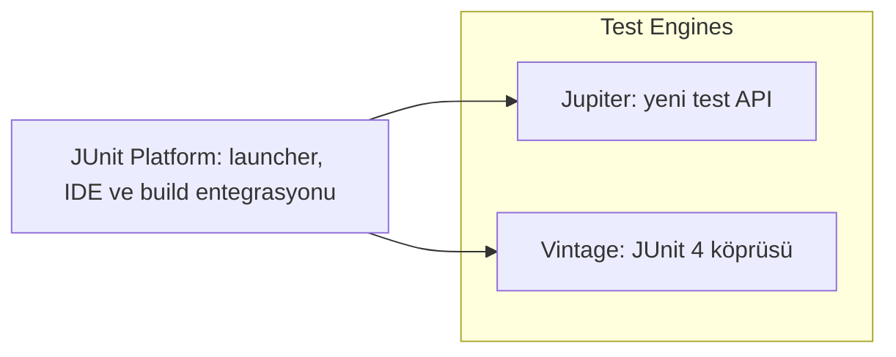
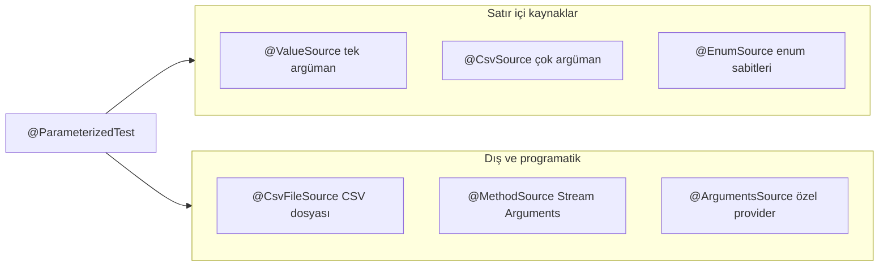
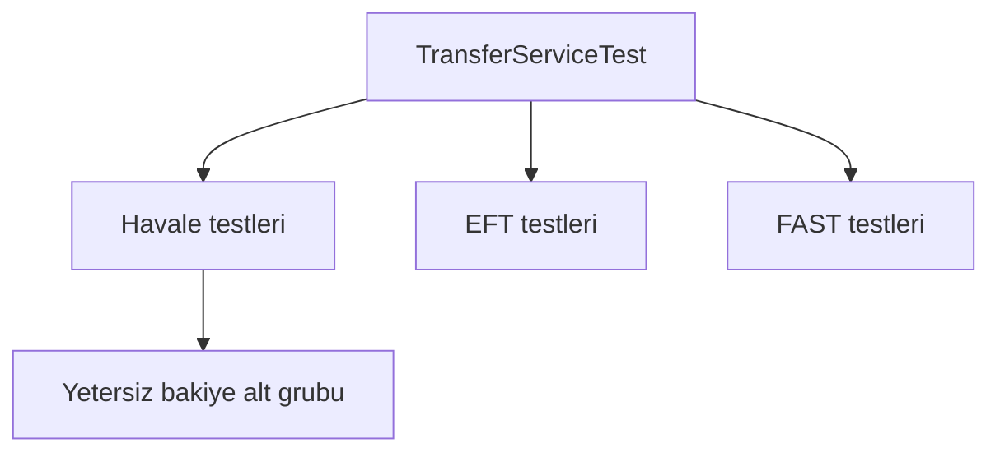

# Topic 12.1 — JUnit 5 Advanced

```admonish info title="Bu bölümde"
- Parametric test'in beş kaynağı (`@ValueSource` / `@CsvSource` / `@CsvFileSource` / `@MethodSource` / `@ArgumentsSource`) ve hangisinin ne zaman doğru olduğu
- `@TestFactory` ile runtime'da üretilen dynamic test'ler — kayıtlı her banka, aktif her currency
- `@Nested` + `@DisplayName` ile okunabilir test ağacı ve `@DisplayNameGeneration`
- Lifecycle sırası (`@BeforeAll` → `@BeforeEach` → test → `@AfterEach` → `@AfterAll`) ve PER_CLASS vs PER_METHOD kararı
- AssertJ + custom domain assertion, parallel execution, tagging ve TR bank ortamında JUnit anti-pattern'leri
```

## Hedef

JUnit 5 (Jupiter) framework'ünü banking-grade kullanım derinliğine getirmek: parametric tests (`@CsvSource`, `@MethodSource`, `ArgumentsProvider`), dynamic tests, `@Nested` organizasyon, lifecycle (`@BeforeAll`/`@BeforeEach` + per-class), execution order + parallel, custom extensions, assumptions, conditional tests. Hepsini banking domain örnekleriyle bağlayacağız: IBAN validation matrisi, day count convention matrisi, MASAK smurfing senaryoları, ledger invariant'ları. Assertion tarafında AssertJ ve custom domain assertion'ları standart hale getireceğiz.

## Süre

Okuma: 2 saat • Kendini Sına: 45 dk • Pratik (opsiyonel): 3-4 saat • Toplam: ~2.5 saat (+ pratik)

## Önbilgi

- JUnit 4 → 5 farkını duydun
- AssertJ ile basit assertion yazdın
- Temel `@Test` method'ları yazabiliyorsun

---

## Kavramlar

### 1. JUnit 5 architecture

Framework'ün üç parçalı olduğunu bilmek, "hangi bağımlılığı neden ekliyorum" sorusunu netleştirir. JUnit 5 tek bir jar değil, üç modülün toplamıdır: **JUnit Platform** (test launcher, IDE/build entegrasyonu), **Jupiter** (yeni test API — `@Test`, `@ParameterizedTest`), ve **Vintage** (eski JUnit 4 testlerini aynı platformda koşturan köprü).



Pratikte tek bir aggregator dependency yeter; AssertJ'i de fluent assertion için ekliyoruz:

```xml
<dependency>
    <groupId>org.junit.jupiter</groupId>
    <artifactId>junit-jupiter</artifactId>
    <version>5.10.2</version>
    <scope>test</scope>
</dependency>
<dependency>
    <groupId>org.assertj</groupId>
    <artifactId>assertj-core</artifactId>
    <version>3.25.3</version>
    <scope>test</scope>
</dependency>
```

### 2. Lifecycle annotations

Test'in setup ve cleanup adımlarının ne zaman koştuğunu bilmek, sızan state kaynaklı flaky testlerin önünü keser. Dört lifecycle hook var: `@BeforeAll`/`@AfterAll` sınıf başına bir kez, `@BeforeEach`/`@AfterEach` her test için tekrar çalışır.

```java
class BankingServiceTest {

    @BeforeAll
    static void setupAll() {
        // Sınıf başına bir kez — ağır setup (DB schema, container)
    }

    @BeforeEach
    void setUp() {
        // Her test öncesi — taze state
    }

    @Test
    void singleTest() { ... }

    @AfterEach
    void tearDown() { ... }

    @AfterAll
    static void tearDownAll() { ... }
}
```

Akışı görselleştirince sıra netleşir — her test için `@BeforeEach`/`@AfterEach` tekrarlanır, `@BeforeAll`/`@AfterAll` uçlarda birer kez:


Default'ta `@BeforeAll`/`@AfterAll` **static** olmak zorundadır, çünkü JUnit her test method'u için sınıftan yeni bir instance yaratır (PER_METHOD lifecycle). `@TestInstance(PER_CLASS)` verirsen tek instance kullanılır ve bu metodlar non-static olabilir:

```java
@TestInstance(TestInstance.Lifecycle.PER_CLASS)
class BankingServiceTest {

    @BeforeAll
    void setupAll() {   // static değil — PER_CLASS sayesinde OK
        // Testler arası paylaşılan instance
    }
}
```

Banking pratiği: default PER_METHOD kalsın (her test taze state ile başlar, izolasyon kuvvetli); sadece pahalı setup'ı (Testcontainers, büyük fixture) paylaşmak istediğinde PER_CLASS'a geç.

### 3. Parameterized tests — yüksek kaldıraç

Aynı test mantığını onlarca farklı input ile koşturmak banking'de en çok işe yarayan tekniktir; IBAN, fee, day count gibi kural tabloları doğal olarak matris halindedir. <mark>Bir kuralı bir kez yaz, girdileri veri olarak besle</mark> — kod tekrarı sıfıra iner, yeni bir edge case eklemek tek satırdır.

Beş kaynağı, en basitten en programatiğe doğru gruplayalım:



#### @ValueSource — tek argüman

En basit hali: tek tip değerlerin listesi. Geçerli TR IBAN'ları tek tek besleyip hepsinin valide olduğunu doğrula.

```java
@ParameterizedTest
@ValueSource(strings = {
    "TR320010009999987654321098",
    "TR430010009999987654321097",
    "TR540010009999987654321096"
})
void shouldValidateTrIban(String iban) {
    assertThat(IbanValidator.isValid(iban)).isTrue();
}
```

#### @CsvSource — çok argüman

Girdi + beklenen çıktı birlikte gerektiğinde CSV satırları kullan; `name` template'i ile her satır okunur bir isim alır.

```java
@ParameterizedTest(name = "IBAN {0} → bank code {1}")
@CsvSource({
    "TR320010009999987654321098, 00100",
    "TR430000209999987654321097, 00002"
})
void shouldExtractBankCode(String iban, String expectedBank) {
    assertThat(IbanValidator.extractBankCode(iban)).isEqualTo(expectedBank);
}
```

#### @CsvFileSource — dosya bazlı

Vaka sayısı büyüyünce (50+ transfer senaryosu) satırları koda değil resources altındaki CSV'ye taşı; `numLinesToSkip` başlık satırını atlar.

```
// resources/test-data/transfer-scenarios.csv
// fromAccount,toAccount,amount,currency,expectedStatus,expectedFee
ACC001,ACC002,100,TRY,SUCCESS,5.00
ACC001,ACC003,5000,TRY,SUCCESS,15.00
ACC001,ACC004,100000,TRY,FAILED,0.00
```

```java
@ParameterizedTest
@CsvFileSource(resources = "/test-data/transfer-scenarios.csv", numLinesToSkip = 1)
void shouldExecuteTransferScenarios(
    String from, String to, BigDecimal amount, String currency,
    String expectedStatus, BigDecimal expectedFee
) {
    TransferRequest req = new TransferRequest(from, to, amount, currency);
    TransferResult result = transferService.execute(req);

    assertThat(result.status()).isEqualTo(expectedStatus);
    assertThat(result.fee()).isEqualByComparingTo(expectedFee);
}
```

#### @MethodSource — programatik

String'e sığmayan zengin tipler (`LocalDate`, `BigDecimal`, enum) gerektiğinde argümanları bir method üretsin; her satır bir `Arguments.of(...)`. Test metodu argümanları alır:

```java
@ParameterizedTest(name = "[{index}] {0}")
@MethodSource("dayCountFractionScenarios")
void shouldComputeDayCountFraction(
    String description,
    DayCountConvention convention,
    LocalDate from,
    LocalDate to,
    BigDecimal expectedFraction
) {
    BigDecimal actual = convention.fraction(from, to);
    assertThat(actual).isEqualByComparingTo(expectedFraction);
}
```

Kaynak method `static` bir `Stream<Arguments>` döner; day count convention matrisi tam da bu kalıba oturur — leap year ve month-end edge case'leri açıkça isimlendirilir:

```java
static Stream<Arguments> dayCountFractionScenarios() {
    return Stream.of(
        Arguments.of("90 days ACT/365",
            ACT_365, LocalDate.of(2024,1,1), LocalDate.of(2024,4,1),
            new BigDecimal("0.2493150685")),
        Arguments.of("90 days ACT/360",
            ACT_360, LocalDate.of(2024,1,1), LocalDate.of(2024,4,1),
            new BigDecimal("0.2527777778")),
        Arguments.of("Leap year Feb 28-29 ACT/365",
            ACT_365, LocalDate.of(2024,2,28), LocalDate.of(2024,2,29),
            new BigDecimal("0.0027397260")),
        Arguments.of("30/360 month end edge case",
            THIRTY_360, LocalDate.of(2024,1,31), LocalDate.of(2024,2,28),
            new BigDecimal("0.0777777778"))
    );
}
```

#### @EnumSource — enum sabitleri

Bir enum'un tümünü veya seçili sabitlerini gezmek için; her transfer tipinin ücreti olduğunu doğrula.

```java
@ParameterizedTest
@EnumSource(value = TransferType.class, names = {"EFT", "FAST", "SWIFT"})
void shouldHaveFee(TransferType type) {
    assertThat(feeService.getFee(type)).isGreaterThan(ZERO);
}
```

#### @ArgumentsSource — özel provider

Senaryoların üretimi mantık gerektirdiğinde (rastgele transaction üret, threshold'un altında dizi kur) `ArgumentsProvider` implement et. Kullanımı sade — provider sınıfını gösterirsin:

```java
@ParameterizedTest
@ArgumentsSource(MasakSmurfingScenarioProvider.class)
void shouldDetectSmurfingScenarios(SmurfingScenario scenario) {
    boolean detected = monitoringService.detectSmurfing(scenario.transactions());
    assertThat(detected).isEqualTo(scenario.expectedDetection());
}
```

Provider, MASAK smurfing (yapılandırma) senaryolarını üretir: 10k eşiğinin hemen altında 5 işlem = şüpheli, rastgele tutarlar = temiz. Her senaryo beklenen tespit sonucuyla eşlenir:

```java
public class MasakSmurfingScenarioProvider implements ArgumentsProvider {

    @Override
    public Stream<? extends Arguments> provideArguments(ExtensionContext context) {
        return Stream.of(
            Arguments.of(scenario("5 tx just below 10k threshold",
                generateTransactions(5, 9500, ofHours(1)), true)),
            Arguments.of(scenario("Random amounts, no pattern",
                generateRandomTransactions(10), false)),
            Arguments.of(scenario("Single large legitimate transfer",
                List.of(new Tx(150000)), false)),
            Arguments.of(scenario("3 tx below threshold (less than 5)",
                generateTransactions(3, 9500, ofMinutes(30)), false))
        );
    }
}
```

### 4. Dynamic tests — runtime'da üretilen

Test setleri derleme anında sabit değilse (kaç banka kayıtlı, kaç currency aktif) `@TestFactory` devreye girer; parametric test'in aksine test sayısı ve içeriği çalışma anında belirlenir. Bir `Stream<DynamicTest>` dönersin, her eleman bir isim + çalıştırılabilir bloktur:

```java
@TestFactory
Stream<DynamicTest> shouldValidateAllRegisteredBanks() {
    List<BankCode> registered = bankCodeRepo.findAll();

    return registered.stream()
        .map(bank -> dynamicTest(
            "Validate " + bank.getName() + " (" + bank.getCode() + ")",
            () -> {
                String testIban = generateTestIban(bank.getCode());
                assertThat(IbanValidator.isValid(testIban))
                    .as("IBAN with bank %s", bank.getName())
                    .isTrue();
            }));
}
```

`dynamicContainer` ile hiyerarşi de kurabilirsin — currency başına bir container, her birinde debit=credit invariant'ı:

```java
@TestFactory
Collection<DynamicNode> ledgerInvariants() {
    return List.of(
        dynamicContainer("Debit-credit balance per currency",
            ledgerRepo.findAllCurrencies().stream()
                .map(ccy -> dynamicTest(
                    ccy + " balanced",
                    () -> {
                        BigDecimal debits = ledgerRepo.sumDebits(ccy);
                        BigDecimal credits = ledgerRepo.sumCredits(ccy);
                        assertThat(debits).isEqualByComparingTo(credits);
                    }))),
        dynamicTest("Trial balance overall zero",
            () -> {
                BigDecimal diff = trialBalance.computeOverall();
                assertThat(diff).isEqualByComparingTo(ZERO);
            })
    );
}
```

```admonish tip title="Dynamic test ne zaman şart"
Test kümesi veriden türüyorsa dynamic test kaçınılmazdır: "kayıtlı her banka", "aktif her currency", "her müşteri segmenti" gibi. Girdiler sabit ve elle sayılabilirse `@ParameterizedTest` daha okunur; küme runtime'da keşfediliyorsa `@TestFactory` kullan.
```

### 5. @Nested — test organizasyonu

Bir servisin onlarca testi düz bir listede boğulur; `@Nested` ile testleri iç sınıflara gruplayıp IDE'de ağaç şeklinde görürsün. Dış sınıf servisi, iç sınıflar senaryo ailelerini, daha derin iç sınıflar da alt-durumları temsil eder:

```java
class TransferServiceTest {

    @Nested
    @DisplayName("Same-bank transfers (havale)")
    class HavaleTests {

        @Test
        void shouldDebitSourceAndCreditDestination() { ... }

        @Nested
        @DisplayName("with insufficient balance")
        class InsufficientBalance {
            @Test
            void shouldThrowAndNotModifyLedger() { ... }
        }
    }
}
```

Yapı, senaryoyu üç seviyeli bir ağaç olarak okutur: transfer tipi → başarı/başarısızlık → sebep.



Her `@Nested` sınıfının kendi `@BeforeEach`'i olabilir; alt grubun ortak setup'ını oraya koyarsın. Tam yapı üç transfer tipini ve iç senaryoları içerir:

<details>
<summary>Tam kod: @Nested üç seviyeli organizasyon (~50 satır)</summary>

```java
class TransferServiceTest {

    @Nested
    @DisplayName("Same-bank transfers (havale)")
    class HavaleTests {

        @Test
        void shouldDebitSourceAndCreditDestination() { ... }

        @Test
        void shouldSucceedWith24x7Availability() { ... }

        @Nested
        @DisplayName("with insufficient balance")
        class InsufficientBalance {

            @Test
            void shouldThrowAndNotModifyLedger() { ... }

            @Test
            void shouldAuditFailedAttempt() { ... }
        }
    }

    @Nested
    @DisplayName("EFT outgoing")
    class EftTests {

        @Test
        void shouldHoldInClearingAccount() { ... }

        @Test
        void shouldRejectOutsideWorkingHours() { ... }

        @Test
        void shouldApplyBsmv() { ... }
    }

    @Nested
    @DisplayName("FAST instant")
    class FastTests {

        @Test
        void shouldComplete10Seconds() { ... }

        @Test
        void shouldReject70kPlus() { ... }
    }
}
```

</details>

### 6. @DisplayName + @DisplayNameGeneration

Test isimleri raporda ve IDE'de birer cümle gibi okunmalı; camelCase method adları bunu zorlaştırır. `@DisplayName` her teste serbest metin (Türkçe kabul kriteri dahil) verir; `@DisplayNameGeneration` ise tüm sınıfa otomatik dönüşüm uygular.

```java
@DisplayNameGeneration(DisplayNameGenerator.ReplaceUnderscores.class)
class BankingTest {

    @Test
    void shouldDebitCustomerOnTransfer() { }
    // Display: "should Debit Customer On Transfer"

    @Test
    @DisplayName("Müşteri yetersiz bakiyede transfer reddedilmeli")
    void rejectInsufficientBalance() { }
    // Display: Türkçe açıklama
}
```

Banking'de acceptance test'lerini Türkçe display name ile yazmak, analistin ve denetçinin de okuyabildiği yaşayan bir spec üretir.

### 7. Assertions strategy

Doğru assertion, test başarısız olduğunda "neyin neden yanlış olduğunu" tek bakışta söyler; banking'de bu fark bir defect'i dakikalar yerine saatlerde bulmak demektir. Built-in `assertEquals`/`assertNotNull` yeterli okunabilirliği vermez:

```java
assertEquals(expected, actual);
assertNotNull(obj);
```

**AssertJ** fluent zincir ve zengin matcher sunar — para, koleksiyon, header hepsi tek akışta doğrulanır. Banking'de AssertJ artık standarttır:

```java
assertThat(transfer.amount())
    .isPositive()
    .isLessThanOrEqualTo(new BigDecimal("100000"))
    .isEqualByComparingTo(expectedAmount);

assertThat(ledgerEntries)
    .hasSize(2)
    .extracting(LedgerEntry::accountCode)
    .containsExactly("2101-A", "2101-B");

assertThat(response.headers())
    .containsKey("X-Idempotency-Key")
    .containsEntry("Content-Type", "application/json");
```

Domain kuralları (ledger dengeli mi, fee doğru mu, işlem idempotent mi) tekrar tekrar assert ediliyorsa **custom assertion** yaz; `AbstractAssert` extend edip anlamlı isimli metodlar eklersin. Çekirdek, hata mesajını domain diliyle veren bir metod:

```java
public TransferAssert isBalanced() {
    isNotNull();
    BigDecimal debits = actual.ledgerEntries().stream()
        .map(LedgerEntry::debit).reduce(ZERO, BigDecimal::add);
    BigDecimal credits = actual.ledgerEntries().stream()
        .map(LedgerEntry::credit).reduce(ZERO, BigDecimal::add);
    if (debits.compareTo(credits) != 0) {
        failWithMessage("Expected balanced (D == C) but D=%s, C=%s", debits, credits);
    }
    return this;
}
```

Kullanımda test neredeyse bir spec gibi okunur — zincirleme domain iddiaları:

```java
TransferAssert.assertThat(result)
    .isBalanced()
    .hasFeeOf(new BigDecimal("5.00"))
    .wasIdempotent();
```

<details>
<summary>Tam kod: TransferAssert custom assertion (~45 satır)</summary>

```java
public class TransferAssert extends AbstractAssert<TransferAssert, Transfer> {

    public TransferAssert(Transfer actual) {
        super(actual, TransferAssert.class);
    }

    public static TransferAssert assertThat(Transfer actual) {
        return new TransferAssert(actual);
    }

    public TransferAssert isBalanced() {
        isNotNull();
        BigDecimal debits = actual.ledgerEntries().stream()
            .map(LedgerEntry::debit).reduce(ZERO, BigDecimal::add);
        BigDecimal credits = actual.ledgerEntries().stream()
            .map(LedgerEntry::credit).reduce(ZERO, BigDecimal::add);
        if (debits.compareTo(credits) != 0) {
            failWithMessage("Expected balanced (D == C) but D=%s, C=%s", debits, credits);
        }
        return this;
    }

    public TransferAssert hasFeeOf(BigDecimal expected) {
        isNotNull();
        if (actual.fee().compareTo(expected) != 0) {
            failWithMessage("Expected fee %s but was %s", expected, actual.fee());
        }
        return this;
    }

    public TransferAssert wasIdempotent() {
        // Audit log'da duplicate request kontrolü
        ...
        return this;
    }
}

// Kullanım
TransferAssert.assertThat(result)
    .isBalanced()
    .hasFeeOf(new BigDecimal("5.00"))
    .wasIdempotent();
```

</details>

### 8. Assumptions — koşullu çalışma

Assumption, assertion'dan farklıdır: koşul sağlanmazsa test **fail olmaz, atlanır** (skip). "Bu test sadece DB varsa anlamlı" gibi ortama bağlı durumlarda kullanılır:

```java
@Test
void integrationTestRequiresDatabase() {
    assumeTrue(isDatabaseAvailable(), "Database not available, skipping");
    // DB gerektiren test
    ...
}
```

Conditional annotation'lar ise testi hiç başlatmadan ortama göre etkinleştirir/devre dışı bırakır — işletim sistemi, environment variable veya özel koşula göre:

```java
@Test
@DisabledOnOs(OS.WINDOWS)
void unixOnly() { ... }

@Test
@EnabledIfEnvironmentVariable(named = "RUN_INTEGRATION", matches = "true")
void integrationTest() { ... }
```

### 9. @TestMethodOrder + @Order

Testler default'ta deterministik ama kasıtlı olmayan bir sırada koşar; sırayı garantilemek istediğinde `@TestMethodOrder` + `@Order` kullanılır. Tipik meşru kullanım bir happy-path onboarding demosunu adım adım göstermektir:

```java
@TestMethodOrder(MethodOrderer.OrderAnnotation.class)
class OnboardingFlowTest {

    @Test @Order(1)
    void shouldCreateCustomer() { ... }

    @Test @Order(2)
    void shouldVerifyMernis() { ... }

    @Test @Order(3)
    void shouldQueryKkb() { ... }

    @Test @Order(4)
    void shouldOpenAccount() { ... }
}
```

```admonish warning title="Order bağımlılığı genelde anti-pattern"
Bir test diğerinin bıraktığı state'e bağlıysa, biri değişince zincir kırılır ve hata kaynağını bulmak kabusa döner. `@Order`'ı yalnızca bağımsız testlerden oluşan bir akışı okunur sırayla sunmak için kullan; testler arasında veri taşımak için değil.
```

### 10. Parallel execution

Test suite'i büyüdükçe seri koşum CI'ı yavaşlatır; JUnit 5 testleri paralel çalıştırabilir. Etkinleştirmek `junit-platform.properties` ile yapılır:

```properties
# junit-platform.properties
junit.jupiter.execution.parallel.enabled=true
junit.jupiter.execution.parallel.mode.default=concurrent
junit.jupiter.execution.parallel.mode.classes.default=concurrent
junit.jupiter.execution.parallel.config.strategy=dynamic
junit.jupiter.execution.parallel.config.dynamic.factor=2
```

<mark>Paralel çalışmada test isolation şarttır</mark> — paylaşılan DB state, MDC, static field'lar aynı anda koşan testler arasında sızarsa sonuçlar rastgeleleşir. Thread-safe olmayan testi `SAME_THREAD` ile işaretleyip diğerlerini concurrent bırakabilirsin:

```java
@Execution(ExecutionMode.SAME_THREAD)
class GlobalStateMutatingTest { ... }

@Execution(ExecutionMode.CONCURRENT)
class StatelessTest { ... }
```

Banking pratiği: Testcontainers'ı sınıflar arası paylaşacaksan REUSABLE option ile; global static mutasyon yapan legacy testleri `SAME_THREAD`'e al, gerisini concurrent koştur.

### 11. Tagging — seçici koşum

Her testi her koşuda çalıştırmak istemezsin: PR başına hızlı unit testler, gece integration ve slow testler. `@Tag` ile testleri etiketleyip build'de seçersin:

```java
@Tag("unit")
class UnitTest { }

@Tag("integration")
@Tag("slow")
class IntegrationTest { }

@Tag("banking-domain")
class LedgerTest { }
```

Maven tarafında Surefire (test fazı, unit) ve Failsafe (verify fazı, integration) etiketlere göre ayrışır:

```xml
<plugin>
    <artifactId>maven-surefire-plugin</artifactId>
    <configuration>
        <groups>unit</groups>
        <excludedGroups>slow</excludedGroups>
    </configuration>
</plugin>
<plugin>
    <artifactId>maven-failsafe-plugin</artifactId>
    <configuration>
        <groups>integration</groups>
    </configuration>
</plugin>
```

```bash
# Sadece unit (hızlı, PR başına CI)
mvn test

# Integration (verify, nightly)
mvn verify -Pintegration

# Belirli tag
mvn test -Dgroups="banking-domain"
```

### 12. Custom extensions

Birden çok test sınıfında tekrarlayan cross-cutting davranış (ledger seed'le, invariant doğrula, MDC temizle) için `Extension` yazılır; JUnit 5'in extension model'i JUnit 4 rule'larının yerini alır. Callback interface'lerini implement edip lifecycle'a bağlanırsın:

```java
public class BankingLedgerExtension implements
    BeforeEachCallback, AfterEachCallback {

    @Override
    public void beforeEach(ExtensionContext context) {
        // COA seed + ledger temizle
        LedgerSeed.cleanAndSeed();
    }

    @Override
    public void afterEach(ExtensionContext context) {
        // Ledger invariant doğrula
        BigDecimal diff = trialBalance.compute();
        if (diff.compareTo(ZERO) != 0) {
            throw new AssertionError("Trial balance violation after test: " + diff);
        }
    }
}

@ExtendWith(BankingLedgerExtension.class)
class TransferServiceTest { ... }
```

Banking'de tipik domain extension'ları: `LedgerInvariantExtension` (trial balance kontrolü), `AuditChainExtension` (hash chain doğrulama), `MdcCleanupExtension` (Topic 9.1), `TimeFreezeExtension` (deterministik tarihler).

### 13. Banking — JUnit anti-pattern'leri

Mülakatta "bu test kodunda ne yanlış" sorusunun cephaneliği burasıdır; <mark>her test birbirinden bağımsız, tekrarlanabilir ve okunur olmalı</mark>. On klasik tuzak:

**1 — Test sıraya bağımlı:** `test2`, `test1`'in yarattığı `customer`'a bağlıysa sıra değişince kırılır. Her test kendi state'ini `@BeforeEach`'te kursun.

**2 — Paylaşılan mutable static state:**
```java
static List<Transaction> transactions = new ArrayList<>();
```
Paralel + sıra problemi doğurur; taze state için `@BeforeEach`.

**3 — Magic number:** `assertThat(result).isEqualTo(123.45)` — 123.45 ne? İsimli sabit kullan: `EXPECTED_FEE_WITH_BSMV`.

**4 — İlgisiz çoklu assertion:** Tek testte amount + email + balance doğrulamak; failure'da hangisi patladı belirsiz. Odaklı testlere böl.

**5 — Açıklayıcı olmayan isim:** `test1()`, `doStuff()` yerine `shouldXxxWhenYyy` kalıbı.

**6 — Mesajsız `assertTrue`:** `assertTrue(service.isAllowed(req))` fail olunca "expected true got false" der. AssertJ + `.as("...")` kullan.

**7 — Test içinde sleep:**
```java
triggerEvent();
Thread.sleep(5000);   // flaky
assertThat(...);
```
Awaitility veya düzgün async bekleme kullan.

**8 — `System.out.println` ile debug:** Print yerine logger; çoğu zaman AssertJ mesajı zaten yeter.

**9 — Sahibi olmadığın tipi mock'lamak:** `@Mock LocalDate` gibi. Dışarıyı adapter'a sar, adapter'ı mock'la — veya `Clock` inject et.

**10 — Domain'e özel assertion eksikliği:** Ledger dengesi, BSMV doğruluğu, MASAK tetiği gibi semantik kontrolleri custom assertion'a sar.

---

## Önemli olabilecek araştırma kaynakları

- JUnit 5 user guide
- AssertJ documentation
- "Effective Software Testing" — Maurício Aniche
- "Growing Object-Oriented Software, Guided by Tests" — Freeman/Pryce
- xUnit Test Patterns — Gerard Meszaros

---

## Kendini Sına

Aşağıdaki soruları önce **cevaba bakmadan** kendi cümlelerinle yanıtlamayı dene — hepsi test mühendisliği mülakatlarında karşına çıkabilecek tarzda. Takıldığın yerde ilgili Kavramlar başlığına dön, sonra tekrar dene.

**S1. `@ParameterizedTest` için beş kaynak var: `@ValueSource`, `@CsvSource`, `@CsvFileSource`, `@MethodSource`, `@ArgumentsSource`. Hangisini ne zaman seçersin?**

<details>
<summary>Cevabı göster</summary>

`@ValueSource` tek argümanlı basit listeler için (geçerli IBAN'lar). `@CsvSource` girdi + beklenen çıktı birlikte gerektiğinde, satır sayısı az ve kodda tutulabiliyorsa. `@CsvFileSource` vaka sayısı büyüyünce (50+ transfer senaryosu) veriyi resources altındaki CSV'ye taşımak için. `@MethodSource` String'e sığmayan zengin tipler (`LocalDate`, `BigDecimal`, enum) veya hesaplanmış argümanlar gerektiğinde. `@ArgumentsSource` ise senaryo üretimi mantık istiyorsa (rastgele transaction, threshold altı diziler — MASAK smurfing) `ArgumentsProvider` yazarak. Enum'un tüm/seçili sabitlerini gezmek içinse `@EnumSource`.

</details>

**S2. `@Nested` ne işe yarar, ne zaman kullanılır?**

<details>
<summary>Cevabı göster</summary>

`@Nested`, testleri iç sınıflara gruplayarak IDE ve raporda ağaç yapısı üretir; düz bir listede boğulan onlarca testi "transfer tipi → başarı/başarısızlık → sebep" gibi okunur hiyerarşiye dönüştürür. Her iç sınıfın kendi `@BeforeEach`'i olabildiği için ortak setup'ı ilgili gruba yakın tutarsın. `@DisplayName` ile birlikte kullanılınca test raporu neredeyse bir spec dokümanı gibi okunur. Bir servisin çok sayıda senaryosunu organize etmek istediğinde tercih edilir.

</details>

**S3. Lifecycle hook'larının çalışma sırası nedir? PER_CLASS ile PER_METHOD arasındaki fark ne?**

<details>
<summary>Cevabı göster</summary>

Sıra: `@BeforeAll` (sınıf başına bir kez) → her test için [`@BeforeEach` → `@Test` → `@AfterEach`] → `@AfterAll` (bir kez). Default lifecycle PER_METHOD'dur: JUnit her test method'u için sınıftan yeni bir instance yaratır, bu yüzden `@BeforeAll`/`@AfterAll` static olmak zorundadır. `@TestInstance(PER_CLASS)` verirsen tek instance tüm testlerde paylaşılır ve bu metodlar non-static olabilir. Banking'de default PER_METHOD tercih edilir (taze state, kuvvetli izolasyon); yalnızca pahalı setup'ı (Testcontainers, büyük fixture) paylaşmak için PER_CLASS'a geçilir.

</details>

**S4. Dynamic test (`@TestFactory`) ne zaman `@ParameterizedTest` yerine mutlaka gerekir?**

<details>
<summary>Cevabı göster</summary>

Test kümesi derleme anında bilinmiyor, runtime'da veriden keşfediliyorsa dynamic test şarttır: "kayıtlı her banka", "aktif her currency", "her müşteri segmenti" gibi sayısı ve içeriği çalışma anında belirlenen setler. `@TestFactory` bir `Stream<DynamicTest>` (veya `dynamicContainer` ile hiyerarşi) döner, her eleman bir isim + çalıştırılabilir bloktur. Girdiler sabit ve elle sayılabilirse `@ParameterizedTest` daha okunurdur; küme dinamik olarak keşfediliyorsa dynamic test kullanılır.

</details>

**S5. Neden built-in assertion yerine AssertJ ve custom domain assertion kullanılır?**

<details>
<summary>Cevabı göster</summary>

Built-in `assertTrue`/`assertEquals` fail olduğunda az bilgi verir ("expected true got false"); AssertJ fluent zincir + zengin matcher ile para, koleksiyon, header'ı tek akışta ve `.as(...)` ile anlamlı mesajla doğrular. Domain kuralları tekrar tekrar kontrol ediliyorsa (ledger dengeli mi, fee doğru mu, idempotent mi) `AbstractAssert` extend edip `isBalanced()`, `hasFeeOf(...)` gibi metodlar yazarsın. Böylece test bir spec gibi okunur ve failure mesajı domain diliyle (`D=... C=...`) çıkar, defect'i bulmak hızlanır.

</details>

**S6. Parallel execution'da nelere dikkat edilir? `@Execution(SAME_THREAD)` ne zaman gerekir?**

<details>
<summary>Cevabı göster</summary>

Paralel koşumda test isolation kritiktir: paylaşılan DB state, MDC, static field aynı anda koşan testler arasında sızarsa sonuçlar deterministik olmaktan çıkar (flaky). Paralellik `junit-platform.properties` ile açılır (`parallel.enabled=true`, dynamic strategy). Thread-safe olmayan, global static mutasyon yapan testleri `@Execution(ExecutionMode.SAME_THREAD)` ile serileştirip diğerlerini `CONCURRENT` bırakırsın. Testcontainers'ı sınıflar arası paylaşacaksan REUSABLE option kullanılır.

</details>

**S7. `@Tag` + Maven ile testleri nasıl seçici koşarsın?**

<details>
<summary>Cevabı göster</summary>

Testleri `@Tag("unit")`, `@Tag("integration")`, `@Tag("slow")`, `@Tag("banking-domain")` gibi etiketlersin. Maven'da Surefire (test fazı) unit testleri koşar ve slow'u dışlar (`<groups>`, `<excludedGroups>`); Failsafe (verify fazı) integration testleri koşar. Böylece PR başına hızlı unit testler, gece integration/slow testler çalışır. CLI'dan da `mvn test -Dgroups="banking-domain"` ile belirli etiketi hedefleyebilirsin.

</details>

**S8. Banking test'lerinde en kritik üç anti-pattern hangisi ve neden tehlikeli?**

<details>
<summary>Cevabı göster</summary>

Bir: sıraya bağımlı testler ve paylaşılan mutable static state — biri değişince zincir kırılır, paralel koşumda sonuçlar rastgeleleşir; her test `@BeforeEach`'te kendi taze state'ini kurmalı. İki: test içinde `Thread.sleep` — CI'ı yavaşlatır ve flaky yapar; Awaitility veya düzgün async bekleme kullanılır. Üç: domain'e özel assertion eksikliği ve magic number — ledger dengesi/BSMV/MASAK gibi semantik kontroller custom assertion'a sarılmalı, `123.45` gibi sabitler isimlendirilmeli ki test okunur ve failure mesajı anlamlı olsun.

</details>

---

## Tamamlama kriterleri

- [ ] "Kendini Sına" bölümündeki tüm soruları cevaba bakmadan açıklayabiliyorum
- [ ] JUnit 5'in üç parçasını (Platform + Jupiter + Vintage) ve rollerini anlatabilirim
- [ ] Beş parametric kaynağı ve her birinin doğru kullanım anını sayabiliyorum
- [ ] `@TestFactory` dynamic test'in `@ParameterizedTest`'ten ne zaman ayrıldığını biliyorum
- [ ] Lifecycle sırasını ve PER_CLASS vs PER_METHOD kararını gerekçelendirebiliyorum
- [ ] `@Nested` + `@DisplayName` ile okunur test ağacı kurabilirim
- [ ] AssertJ fluent + custom domain assertion (TransferAssert, LedgerAssert) yazabilirim
- [ ] Parallel execution isolation risklerini ve `@Execution(SAME_THREAD)` çözümünü açıklayabiliyorum
- [ ] `@Tag` + Maven Surefire/Failsafe ile seçici koşumu kurabilirim
- [ ] On JUnit anti-pattern'ini (order dep, shared static, sleep, magic number) tanıyıp düzeltebiliyorum
- [ ] (Opsiyonel) "Pratik yapmak istersen" bölümündeki testleri yazdım ve Claude-verify prompt'uyla doğrulattım

---

## Defter notları

1. "JUnit 5 architecture (Platform + Jupiter + Vintage) ve Jupiter API: ____."
2. "Parametric 5 kaynak (Value/Csv/CsvFile/Method/ArgumentsSource) hangisi ne zaman: ____."
3. "`@TestFactory` dynamic test runtime-discovered banking senaryosu: ____."
4. "`@Nested` + `@DisplayName` test organizasyonu ve okunabilirlik: ____."
5. "AssertJ fluent + custom domain assertion (TransferAssert) pattern: ____."
6. "`@BeforeAll`/`@BeforeEach` lifecycle sırası + PER_CLASS vs PER_METHOD: ____."
7. "Custom extension (LedgerInvariant, AuditChain, MdcCleanup) cross-cutting: ____."
8. "Parallel execution config + `@Execution(SAME_THREAD)` non-thread-safe: ____."
9. "`@Tag` unit/integration/slow + Maven Surefire/Failsafe seçici koşum: ____."
10. "Banking test anti-pattern (order dep, sleep, magic number, shared static): ____."

```admonish success title="Bölüm Özeti"
- JUnit 5 tek jar değil üç parçadır: Platform (launcher), Jupiter (yeni API), Vintage (JUnit 4 köprüsü)
- Parametric test'in beş kaynağı vardır; seçim veriye göre: `@ValueSource`/`@CsvSource` inline, `@CsvFileSource` büyük CSV, `@MethodSource` zengin tip, `@ArgumentsSource` üretilmiş senaryo
- Test kümesi runtime'da keşfediliyorsa (her banka, her currency) `@TestFactory` dynamic test; girdiler sabitse `@ParameterizedTest`
- Lifecycle sırası `@BeforeAll` → [`@BeforeEach` → test → `@AfterEach`] → `@AfterAll`; default PER_METHOD taze state verir, PER_CLASS pahalı setup'ı paylaşır
- `@Nested` + `@DisplayName` test'i okunur ağaca çevirir; AssertJ + custom domain assertion failure mesajını domain diliyle söyler
- Paralel koşumda isolation şart; `@Tag` + Surefire/Failsafe seçici koşumu verir; order-dependency, shared static, sleep ve magic number banking'de flaky test üreten anti-pattern'lerdir
```

---

## Pratik yapmak istersen

Kavramları koda dökmek istersen aşağıdaki iki ek hazır: test yazma rehberi parametric matris, dynamic test, `@Nested` ve custom assertion/extension için iskelet bir banking test sınıfı içerir; Claude-verify prompt'u ile yazdığın JUnit 5 setup'ını banking-grade perspektiften denetletebilirsin.

<details>
<summary>Test yazma rehberi</summary>

Aşağıdaki `TransferServiceTest` iskeleti bir sınıfta parametric test, custom AssertJ assertion, custom extension, dynamic test ve tagging'i bir arada gösterir; kendi banking servisin için başlangıç noktası olarak kullan.

```java
@DisplayName("TransferService — banking transfer scenarios")
@TestMethodOrder(MethodOrderer.DisplayName.class)
class TransferServiceTest {

    @RegisterExtension
    static BankingLedgerExtension ledger = new BankingLedgerExtension();

    static TransferService service;

    @BeforeAll
    static void setupOnce() {
        service = new TransferService(...);
    }

    @Nested
    @DisplayName("Same-bank havale")
    class HavaleTests {

        @ParameterizedTest(name = "{0} TL transfer between same-bank customers")
        @ValueSource(strings = {"100", "1000", "10000", "100000"})
        @DisplayName("Various amount sizes")
        void shouldTransferSameBank(String amountStr) {
            BigDecimal amount = new BigDecimal(amountStr);
            TransferResult result = service.havale(testRequest(amount));

            TransferAssert.assertThat(result)
                .isBalanced()
                .isCompleted();
        }

        @Test
        @DisplayName("Reject when insufficient balance")
        void shouldRejectInsufficient() {
            setupAccountBalance(customerA, new BigDecimal("50.00"));

            assertThatThrownBy(() -> service.havale(transferOf(customerA, "100.00")))
                .isInstanceOf(InsufficientBalanceException.class)
                .hasMessageContaining("50.00")
                .hasMessageContaining("100.00");

            // Ledger değişmemiş olmalı
            assertThat(balanceService.balanceOf(customerA, "TRY"))
                .isEqualByComparingTo("50.00");
        }
    }

    @TestFactory
    @DisplayName("Day count conventions accuracy")
    Stream<DynamicTest> shouldComputeAllDayCountConventions() {
        return Stream.of(DayCountConvention.values())
            .map(convention -> dynamicTest(
                convention.name() + " for 90-day standard period",
                () -> {
                    BigDecimal fraction = convention.fraction(
                        LocalDate.of(2024, 1, 1),
                        LocalDate.of(2024, 4, 1));
                    assertThat(fraction)
                        .as("Fraction for %s", convention)
                        .isBetween(new BigDecimal("0.24"), new BigDecimal("0.26"));
                }));
    }

    @Test
    @Tag("integration")
    @Tag("slow")
    void fullEndToEndWithLedger() {
        // Kapsamlı senaryo
    }
}
```

> Pratik hedefleri: dört parametric source türünü kullan; `@TestFactory` ile dynamic banking test yaz; `@Nested` 2+ seviye kur; custom AssertJ (TransferAssert, LedgerAssert) ve custom extension (LedgerInvariantExtension) ekle; CSV test data dosyası oluştur; ArgumentsProvider ile MASAK senaryoları üret; parallel config + SAME_THREAD gereken yerde; `@Tag` unit/integration/slow + Maven profile; Türkçe DisplayName. Bunları yazdıysan bu bölümü koda dökmüş sayılırsın.

</details>

<details>
<summary>Claude-verify prompt</summary>

```
JUnit 5 test setup'ımı banking-grade kriterlere göre değerlendir. Eksikleri 
işaretle, kod yazma:

1. Parametric tests:
   - @ValueSource / @CsvSource / @MethodSource / @CsvFileSource banking matrix?
   - @ArgumentsProvider custom banking scenario (MASAK)?
   - Display name template ({0}, {1}) readable?

2. Dynamic tests:
   - @TestFactory runtime scenarios?
   - dynamicContainer hierarchy?

3. Organization:
   - @Nested logical grouping (2+ level)?
   - @DisplayName Türkçe veya readable?
   - @DisplayNameGeneration?

4. Assertions:
   - AssertJ fluent?
   - Custom domain assertions (TransferAssert, LedgerAssert)?
   - .as() failure message banking context?
   - Multiple assertions split?

5. Lifecycle:
   - @BeforeAll / @BeforeEach proper scope?
   - PER_METHOD vs PER_CLASS rationale?
   - @AfterEach cleanup?

6. Extensions:
   - Custom extensions banking domain?
   - LedgerInvariantExtension?
   - MdcCleanupExtension?

7. Tagging:
   - @Tag unit/integration/slow?
   - Maven profile separate run?

8. Parallel:
   - junit-platform.properties enabled?
   - @Execution SAME_THREAD non-thread-safe?
   - Testcontainers reusable?

9. Banking-specific:
   - IBAN validation matrix?
   - Day count convention matrix?
   - MASAK rule scenarios?
   - Ledger invariants?

10. Anti-pattern:
    - Order dependency YOK?
    - Shared mutable static YOK?
    - Magic numbers YOK?
    - Multi-assertion unrelated YOK?
    - test1/doStuff name YOK?
    - Sleep in test YOK?
    - Mocking what you don't own YOK?

Her madde için PASS / FAIL / EKSIK işaretle, kanıt göster, kod yazma.
```

</details>
