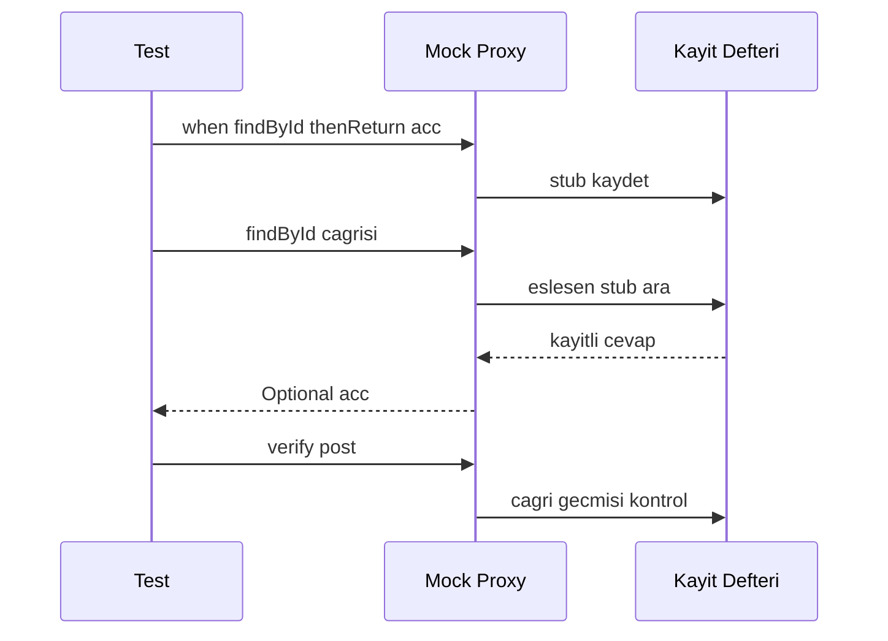
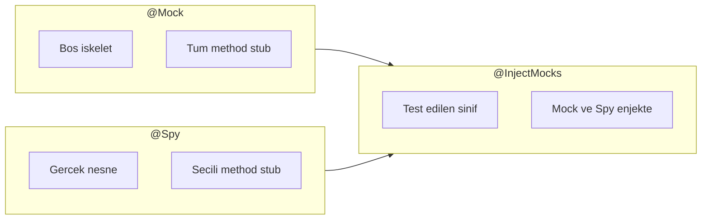
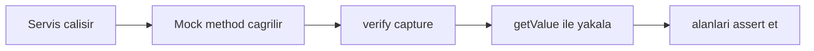
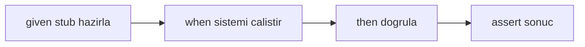

# Topic 12.2 — Mockito Deep

```admonish info title="Bu bölümde"
- Test double ailesi (Dummy / Stub / Mock / Spy / Fake) ve Mockito'nun proxy tabanlı çalışma mantığı
- `@Mock` vs `@Spy` vs `@InjectMocks` farkı ve `@InjectMocks`'ın injection sırası
- Stubbing (`when/thenReturn/thenThrow/thenAnswer`, `doXxx`), ArgumentMatcher all-or-nothing kuralı, ArgumentCaptor ile payload assertion
- `verify`/`InOrder`, BDDMockito given/willReturn, `MockedStatic` + `MockedConstruction`, `STRICT_STUBS`
- 5 banking senaryosu (MASAK, KKB cache, circuit breaker, saga compensation, idempotency) ve 10 klasik anti-pattern
```

## Hedef

Mockito'yu banking-grade derinlikte kullanmak: `@Mock/@Spy/@Captor/@InjectMocks` ayrımını, `when/thenReturn/thenThrow/thenAnswer` stubbing varyantlarını, `verify` ile interaction testing'i, ArgumentCaptor ile published event/journal payload assertion'ını, ArgumentMatcher all-or-nothing kuralını, BDDMockito given/when/then okunabilirliğini, `MockedStatic`/`MockedConstruction` son çareleri ve `STRICT_STUBS` disiplinini hatasız anlatabilmek. Fraud rule mock, KKB stub, MASAK alert verify gibi domain senaryolarını ve 10 anti-pattern'i tanımak.

## Süre

Okuma: 2 saat • Kendini Sına: 45 dk • Pratik (opsiyonel): 2.5-3 saat • Toplam: ~3 saat (+ pratik)

## Önbilgi

- JUnit 5 (Topic 12.1) bitti — `@Test`, `@ExtendWith`, AssertJ rahat kullanabiliyorsun
- Spring dependency injection kavramını (constructor injection) biliyorsun
- Mock vs Stub vs Fake ayrımını en azından duydun

---

## Kavramlar

### 1. Test double — beş kardeş

Servisin davranışını test etmek istiyorsun ama gerçek DB'ye, KKB'ye veya SWIFT'e gitmek yavaş, kırılgan ve pahalı. Çözüm: gerçek bağımlılığın yerine kontrol ettiğin bir **test double** koymak. "Test double" bir şemsiye terim; altında beş farklı kardeş var ve mülakatta bu ayrımı isterler.

| Tür | Anlam | Banking örnek |
|---|---|---|
| **Dummy** | Hiçbir şey yapmaz, sadece parametreyi doldurur | unused parameter |
| **Stub** | Önceden ayarlanmış cevap döner | KKB 1500 skor döner |
| **Mock** | Etkileşimi (çağrıldı mı) doğrular | MASAK alert çağrıldı mı |
| **Spy** | Gerçek nesne + seçili method'u yakala | Gerçek `LedgerService`'i sar |
| **Fake** | Çalışan ama basitleştirilmiş implementasyon | In-memory repo |

Aradaki en kritik ayrım niyet: **Stub** state doğrular ("dönen değer doğru mu"), **Mock** ise interaction doğrular ("doğru method doğru argümanla çağrıldı mı"). Mockito pratikte **Stub + Mock + Spy** üçlüsünü kapsar; Fake'i genelde elle bir sınıf yazarak kurarsın.

### 2. Kurulum ve Mockito'nun proxy mantığı

Mockito neden `null` yerine akıllı cevaplar dönebiliyor? Çünkü `mock()` çağrısı gerçek class'ı kullanmaz; **runtime'da bir dinamik subclass (proxy)** üretir ve her method çağrısını yakalar. Stub tanımın ("şu argümanla çağrılırsan şunu dön") bu proxy'nin içindeki bir kayıt defterine yazılır; çağrı geldiğinde eşleşen kaydı bulup döner, ayrıca çağrıyı `verify` için geçmişe not eder.



Bu yüzden Mockito `final` class'ları eskiden mock'layamazdı (subclass üretilemez); `mockito-inline` bytecode manipülasyonuyla bunu çözdü. Bağımlılıklar:

```xml
<dependency>
    <groupId>org.mockito</groupId>
    <artifactId>mockito-core</artifactId>
    <version>5.10.0</version>
    <scope>test</scope>
</dependency>
<dependency>
    <groupId>org.mockito</groupId>
    <artifactId>mockito-junit-jupiter</artifactId>
    <version>5.10.0</version>
    <scope>test</scope>
</dependency>
```

`@ExtendWith(MockitoExtension.class)` JUnit 5'e annotation'ları (`@Mock`, `@InjectMocks`, `@Captor`) işlemesini söyler. Önce mock'ları alanlarda tanımlarsın:

```java
@ExtendWith(MockitoExtension.class)
class TransferServiceTest {

    @Mock AccountRepository accountRepo;
    @Mock LedgerService ledgerService;
    @Mock KafkaTemplate<String, Object> kafkaTemplate;
    @Mock SanctionsService sanctionsService;

    @InjectMocks TransferService transferService;

    @Captor ArgumentCaptor<JournalEntryRequest> journalCaptor;
```

Sonra klasik **given / when / then** akışıyla testi yazarsın — stub kur, sistemi çalıştır, doğrula:

```java
    @Test
    void shouldDebitAndCreditOnTransfer() {
        // given
        when(accountRepo.findById(any())).thenReturn(Optional.of(testAccount()));

        // when
        transferService.transfer(testRequest());

        // then
        verify(ledgerService).post(journalCaptor.capture());
        assertThat(journalCaptor.getValue().description()).contains("Transfer");
    }
}
```

### 3. `@Mock` vs `@Spy` vs `@InjectMocks`

Bu üçlüyü karıştırmak en sık yapılan hata, bu yüzden ayrımı netleştirelim. **`@Mock`** boş bir iskelet üretir: tüm method'lar default (null, 0, boş collection) döner, sen `when` ile davranış verirsin. **`@Spy`** gerçek bir nesneyi sarar: sardığın method'lar dışında hepsi gerçek çalışır. **`@InjectMocks`** ise test edilen asıl sınıfı yaratır ve yukarıdaki `@Mock`/`@Spy` alanlarını ona enjekte eder.



`@InjectMocks` injection'ı belirli bir sırayla dener: önce **constructor injection** (en büyük constructor'ı seçip mock'ları tip eşleşmesiyle doldurur), olmazsa setter injection, o da olmazsa field injection. Constructor injection tercih edilir çünkü final field'larla ve immutability ile uyumludur.

```admonish warning title="@InjectMocks tuzakları"
- Aynı tipten iki mock varsa (`@Mock AccountRepository a; @Mock AccountRepository b;`) Mockito tip yerine **alan adıyla** eşleştirmeye çalışır; isim tutmazsa yanlış mock enjekte edilir. Karışıklıkta constructor'ı elle çağırıp mock'ları explicit ver.
- `@InjectMocks` bir mock enjekte edemezse sessizce `null` bırakır — testte `NullPointerException` görürsün. Eksik `@Mock` var mı diye kontrol et.
```

### 4. Stubbing — cevabı sen belirle

Stubbing "bu method şu argümanla çağrılırsa şunu dön" demektir; test double'ın kalbidir. Temel form `when().thenReturn()`, ama banking'de negatif senaryolar (servis down, yetersiz bakiye) için `thenThrow`, dinamik hesaplama için `thenAnswer` da gerekir.

```java
// Basit
when(accountRepo.findById(accountId)).thenReturn(Optional.of(account));

// Ardışık çağrılar — her seferinde farklı cevap
when(kkbService.getScore("12345678901"))
    .thenReturn(1500)
    .thenReturn(1600)   // 2. çağrı
    .thenThrow(new ServiceUnavailableException("KKB down"));   // 3. çağrı

// Exception fırlat
when(sanctionsService.check(any()))
    .thenThrow(new SanctionsHitException("OFAC match"));

// Dinamik cevap (Answer) — argümana göre hesapla
when(feeService.calculateFee(any()))
    .thenAnswer(invocation -> {
        TransferRequest req = invocation.getArgument(0);
        return req.amount().multiply(new BigDecimal("0.001"));
    });
```

`void` method'ları veya spy'ları stub'larken `when()` işe yaramaz (dönüş değeri yok / gerçek method çalışır). O zaman `doXxx().when()` formunu kullanırsın:

```java
doNothing().when(notificationService).send(any());
doThrow(new NotificationException()).when(notificationService).send(any());
doAnswer(inv -> { /* ... */ return null; }).when(notificationService).send(any());
```

### 5. ArgumentMatchers — hangi argümanla eşleşsin

Bazen tam değeri değil, argümanın bir özelliğini eşleştirmek istersin: "herhangi bir UUID", "ambargolu bir ülke", "10000'den büyük tutar". ArgumentMatchers bunu sağlar.

```java
// any() — her şeye eşleşir
when(accountRepo.findById(any())).thenReturn(Optional.of(account));
when(accountRepo.findById(any(UUID.class))).thenReturn(Optional.of(account));

// eq() — belirli değer
when(accountRepo.findById(eq(accountId))).thenReturn(Optional.of(account));

// argThat() — özel koşul (banking'in gücü buradan gelir)
when(sanctionsService.check(argThat(req ->
    req.country().equals("IR") || req.country().equals("KP"))))
    .thenReturn(SanctionsResult.hit());
```

Kritik kural: bir çağrıda matcher kullanmaya başladıysan tüm argümanlar matcher olmak zorunda. <mark>Matcher ile literal'i aynı çağrıda karıştıramazsın — ya hepsi matcher, ya hiçbiri</mark>. Literal bir değeri matcher'a çevirmek için `eq()` ile sar:

```java
when(repo.find(eq(1L), "x"));       // ❌ karışık — InvalidUseOfMatchers
when(repo.find(eq(1L), eq("x")));   // ✓ hepsi matcher
```

### 6. `verify` — etkileşim testi

Bazen dönen değer değil, "doğru method çağrıldı mı, kaç kez, hiç çağrılmadı mı" önemlidir. Banking'de "bloklu müşteriye asla ledger post edilmemeli" gibi negatif garantiler kritiktir ve bunlar ancak `verify` ile test edilir.

```java
@Test
void shouldNotifyOnHighValueTransfer() {
    TransferRequest req = TransferRequest.builder()
        .amount(new BigDecimal("500000"))
        .build();

    transferService.transfer(req);

    verify(notificationService).sendHighValueAlert(any());
    verify(complianceService, atLeastOnce()).recordTransaction(any());
}
```

Negatif garanti `never()` ile ifade edilir — bloklu müşteride hiçbir para hareketi olmamalı:

```java
@Test
void shouldNeverCallBlockedCustomer() {
    when(customerRepo.findById(any())).thenReturn(Optional.of(blockedCustomer));

    assertThatThrownBy(() -> transferService.transfer(req))
        .isInstanceOf(CustomerBlockedException.class);

    verify(ledgerService, never()).post(any());
    verify(kafkaTemplate, never()).send(anyString(), any());
}
```

Tam izolasyon için iki araç var: `verifyNoInteractions(mock)` (mock'a hiç dokunulmadı) ve `verifyNoMoreInteractions(mock)` (verify ettiklerin dışında başka çağrı yok). Rollback senaryosunda external API'ye hiç gidilmediğini böyle kanıtlarsın:

```java
verifyNoInteractions(externalApiClient);
// veya doğruladıkların dışında çağrı olmadığını iddia et:
verifyNoMoreInteractions(externalApiClient);
```

### 7. ArgumentCaptor — payload'ı yakala ve deş

`verify(mock).post(any())` sadece "çağrıldı" der; ama banking'de asıl soru "**hangi payload'la** çağrıldı" — journal dengeli mi, event doğru tutarı taşıyor mu? ArgumentCaptor mock'a giden argümanı yakalar, sen de alanlarını tek tek assert edersin.



Double-entry journal'ın dengeli olduğunu (toplam debit = toplam credit) yakalayıp doğrulamak captor'ın klasik banking kullanımıdır:

```java
@Test
void shouldPostBalancedJournalEntry() {
    transferService.transfer(buildRequest(customerA, customerB, "100", "TRY"));

    verify(ledgerService).post(journalCaptor.capture());
    JournalEntryRequest captured = journalCaptor.getValue();

    assertThat(captured.entries())
        .hasSize(2)
        .extracting(LedgerEntryRequest::accountCode)
        .containsExactly("2101-CustomerA", "2101-CustomerB");

    BigDecimal totalDebit = captured.entries().stream()
        .map(LedgerEntryRequest::debit).filter(Objects::nonNull)
        .reduce(ZERO, BigDecimal::add);
    BigDecimal totalCredit = captured.entries().stream()
        .map(LedgerEntryRequest::credit).filter(Objects::nonNull)
        .reduce(ZERO, BigDecimal::add);

    assertThat(totalDebit).isEqualByComparingTo(totalCredit);
}
```

Aynı şekilde Kafka'ya basılan event payload'ını yakalayıp içeriğini denetlersin:

```java
@Test
void shouldEmitTransferEventWithCorrectPayload() {
    transferService.transfer(testRequest);

    ArgumentCaptor<TransferInitiatedEvent> eventCaptor =
        ArgumentCaptor.forClass(TransferInitiatedEvent.class);
    verify(kafkaTemplate).send(eq("transfer-events"), eventCaptor.capture());

    TransferInitiatedEvent event = eventCaptor.getValue();
    assertThat(event.transferId()).isEqualTo(testRequest.transferId());
    assertThat(event.amount()).isEqualByComparingTo(testRequest.amount());
    assertThat(event.timestamp()).isAfter(Instant.now().minusSeconds(10));
}
```

```admonish tip title="Captor mı argThat mı"
İkisi de argümana bakar ama amaçları farklı: `argThat()` **stubbing/eşleştirme** anında koşul kontrol eder ("bu argümanla çağrılırsan böyle dön"), captor ise çağrı olduktan **sonra** yakalayıp zengin assertion yapmanı sağlar. Çok alanlı payload doğrulaması için captor daha okunabilir ve hata mesajı daha nettir.
```

### 8. `@Spy` — kısmi mock

Bazen bir nesnenin çoğu method'u gerçek çalışsın, sadece biri (yavaş bir DB sorgusu, external call) stub'lansın istersin. `@Spy` bunu sağlar: gerçek nesneyi sarar, seçtiğin method'u override edersin.

```java
@Spy
LedgerService ledgerService = new LedgerService(realDependencies);

@Test
void shouldUseRealMethodButStubOne() {
    doReturn(BigDecimal.ZERO)
        .when(ledgerService)
        .balanceOf(anyString(), anyString());

    // Diğer method'lar gerçek çalışır
    ledgerService.post(realJournalRequest);
}
```

Buradaki incelik şu: `when(spy.balanceOf(...)).thenReturn(...)` yazarsan, `spy.balanceOf(...)` argümanı hazırlanırken **gerçek method çalışır** (belki yavaş sorgu atar, belki patlar), sonra üzerine stub yazılır. <mark>Spy stub'larken `doReturn().when()` formunu kullan — gerçek method'u hiç çağırmadan güvenle override eder</mark>. Banking'de tipik kullanım: gerçek `LedgerService`'i kullan ama yavaş `balanceOf`'u stub'la.

### 9. BDDMockito — given/when/then diliyle oku

Aynı davranışı `when`/`verify` yerine iş dilinde ("given ... when ... then ...") ifade edebilirsin. BDDMockito sadece isimlendirmeyi değiştirir ama testi bir spesifikasyon gibi okunur kılar — mülakatta ve code review'da fark yaratır.



```java
import static org.mockito.BDDMockito.*;

@Test
void givenSufficientBalance_whenTransfer_thenSucceed() {
    // given
    given(accountRepo.findById(accountA)).willReturn(Optional.of(account));
    given(account.getBalance()).willReturn(new BigDecimal("1000"));

    // when
    TransferResult result = transferService.transfer(testRequest);

    // then
    then(ledgerService).should().post(any());
    then(kafkaTemplate).should().send(eq("transfer-events"), any());
    assertThat(result.status()).isEqualTo("COMPLETED");
}
```

`when(...).thenReturn(...)` → `given(...).willReturn(...)`, `verify(mock).method()` → `then(mock).should().method()`. İşlevsel olarak aynıdır; okunabilirlik için tercih edilir.

### 10. `MockedStatic` — statik method mock

Statik method'lar (`Instant.now()`, `UUID.randomUUID()`) test edilebilirliğin baş belasıdır çünkü enjekte edilemezler. `MockedStatic` bunları geçici olarak mock'lar; ama scope'u try-with-resources ile sınırlıdır, aksi halde diğer testlere sızar.

```java
@Test
void shouldUseFrozenClockInTest() {
    Instant frozen = Instant.parse("2024-05-12T10:30:00Z");

    try (MockedStatic<Instant> mocked = mockStatic(Instant.class)) {
        mocked.when(Instant::now).thenReturn(frozen);

        Transfer t = transferService.transfer(req);
        assertThat(t.createdAt()).isEqualTo(frozen);
    }
}
```

```admonish tip title="Statik mock son çaredir"
`MockedStatic`'e gitmeden önce tasarımı düzelt: zamanı `Clock` olarak enjekte et, `Instant.now(clock)` kullan. O zaman testte sabit bir `Clock.fixed(...)` verirsin, statik mock hiç gerekmez. Statik mock'u sadece değiştiremediğin legacy kod için sakla.
```

```java
public class TransferService {
    private final Clock clock;   // ✓ enjekte edilebilir

    public Transfer transfer(/* ... */) {
        Instant now = Instant.now(clock);   // test edilebilir
        // ...
    }
}
```

### 11. `MockedConstruction` — `new` ile yaratılan nesneyi mock'la

Bazen bir sınıf bağımlılığını enjekte etmez, method içinde `new` ile yaratır (`new HttpClient()`, `new PdfGenerator()`). Enjekte edemediğin için normal mock işe yaramaz; `MockedConstruction` scope içinde `new` ile üretilen **her** nesneyi otomatik mock'a çevirir.

```java
@Test
void shouldMockConstructedClient() {
    try (MockedConstruction<PdfGenerator> mocked =
             mockConstruction(PdfGenerator.class,
                 (mock, context) -> when(mock.generate(any())).thenReturn(new byte[]{1, 2, 3}))) {

        // Servis içinde new PdfGenerator() çağrılınca mock döner
        byte[] pdf = statementService.export(accountId);

        assertThat(pdf).isNotEmpty();
        assertThat(mocked.constructed()).hasSize(1);   // bir kez yaratıldı
    }
}
```

`MockedStatic` gibi bu da son çaredir ve `try` scope'una hapsedilir. Doğru çözüm yine bağımlılığı bir factory/dependency olarak enjekte etmektir; `MockedConstruction`'ı değiştiremediğin kod için kullan.

### 12. Strict stubbing — banking kalite disiplini

Kullanılmayan bir stub (`when(...)` yazdın ama o çağrı hiç olmadı) sessiz bir bug'dır: ya testin yanlış şeyi test ediyor, ya production kodu değişmiş. Strict stubbing bunu fail-fast hataya çevirir.

```java
@ExtendWith(MockitoExtension.class)
@MockitoSettings(strictness = Strictness.STRICT_STUBS)   // Mockito 5'te zaten default
class TransferTest { /* ... */ }
```

Strict stubbing iki şeyi yakalar: kullanılmayan stub (`UnnecessaryStubbingException`) ve argüman uyumsuzluğunda net hata mesajı. <mark>Banking'de `STRICT_STUBS` standarttır — ölü stub bırakmayan, production-grade sıkılık sağlar</mark>. `MockitoExtension` bunu zaten default uygular; loose stubbing'e sadece bilinçli özel durumlarda dönersin.

### 13. Banking domain — Mockito senaryoları

Şimdi öğrendiğimiz araçları gerçek banking problemlerine uygulayalım. Her senaryo bir mülakat sorusunun koda dökülmüş halidir.

**Senaryo 1 — MASAK alert doğrulama:** Smurfing (parçalı işlem) paterni tespit edildiğinde alert kaydedilmeli ve compliance ekibine haber gitmeli. Captor ile alert alanlarını, `verify` ile bildirimi doğrularız.

```java
@Test
void shouldRaiseMasakAlertOnSmurfingPattern() {
    List<Transaction> smurfingTxs = generateSmurfingPattern(customerA);
    when(transactionRepo.findByCustomerSince(any(), any())).thenReturn(smurfingTxs);

    transactionMonitor.onTransaction(currentTx);

    ArgumentCaptor<ComplianceAlert> alertCaptor = ArgumentCaptor.forClass(ComplianceAlert.class);
    verify(alertRepo).save(alertCaptor.capture());

    ComplianceAlert alert = alertCaptor.getValue();
    assertThat(alert.getRule()).isEqualTo("SmurfingDetection");
    assertThat(alert.getSeverity()).isEqualTo(Severity.HIGH);
    verify(complianceOpsNotifier).notify(any());
}
```

**Senaryo 2 — KKB cache hit:** Aynı skor üç kez sorulsa da external KKB'ye sadece bir kez gidilmeli. `times(1)` bunu kanıtlar.

```java
@Test
void shouldCacheKkbScore() {
    when(kkbClient.getScore("12345678901")).thenReturn(new ScoreResponse(1500));

    kkbService.getScore("12345678901");
    kkbService.getScore("12345678901");
    kkbService.getScore("12345678901");

    verify(kkbClient, times(1)).getScore(any());   // 1. çağrıdan sonra cache
}
```

**Senaryo 3 — Circuit breaker fallback:** Risk servisi düştüğünde exception fırlatılır; servis çökmemeli, güvenli bir fallback skoruna düşmeli ve metrik saymalı.

```java
@Test
void shouldUseFallbackWhenRiskServiceDown() {
    when(riskClient.assess(any()))
        .thenThrow(new ResourceAccessException("Connection refused"));

    RiskAssessment result = riskService.assess(req);

    assertThat(result.score()).isEqualTo(DEFAULT_HIGH_RISK_SCORE);   // fallback
    verify(metricsCounter).increment("risk_service_fallback");
}
```

**Senaryo 4 — Saga compensation:** 3 adımlı saga'da 3. adım patlarsa, tamamlanan adımlar **ters sırada** telafi edilmeli. `InOrder` bu sıra garantisini test eder.

```java
@Test
void shouldTriggerCompensationOnPartialFailure() {
    doReturn(SagaStep.completed("debit")).when(accountStep).execute(any());
    doReturn(SagaStep.completed("publish")).when(kafkaStep).execute(any());
    doThrow(new RuntimeException("External error")).when(remoteBankStep).execute(any());

    SagaResult result = sagaOrchestrator.run(testSaga);

    assertThat(result.status()).isEqualTo("COMPENSATED");

    // Telafi sırası: tamamlanan adımların tersi
    InOrder inOrder = inOrder(kafkaStep, accountStep);
    inOrder.verify(kafkaStep).compensate(any());
    inOrder.verify(accountStep).compensate(any());
}
```

**Senaryo 5 — Idempotency:** Aynı idempotency key ile ikinci çağrı gelirse mevcut sonuç dönmeli, ledger'a ikinci kez post edilmemeli.

```java
@Test
void shouldReturnExistingResultOnDuplicateIdempotencyKey() {
    String idempotencyKey = "key-abc";
    Transfer existing = createTestTransfer();
    when(idempotencyRepo.findByKey(idempotencyKey)).thenReturn(Optional.of(existing));

    Transfer result = transferService.transferWithIdempotency(req, idempotencyKey);

    assertThat(result.id()).isEqualTo(existing.id());   // aynı cevap
    verify(ledgerService, never()).post(any());          // ikinci posting yok
}
```

### 14. Banking — Mockito anti-pattern'leri

Mülakatta "bu testte ne yanlış?" sorusunun cephaneliği burası. On klasik tuzak:

**1. Value object mock'lamak** — `@Mock BigDecimal amount;` saçmadır; value object'ler basit constructor'lıdır, gerçeğini kullan.

**2. Sahibi olmadığın tipi mock'lamak** — `@Mock LocalDate date;` veya JDK/third-party sınıfları. <mark>Sahibi olmadığın tipi mock'lama — onu bir adapter'ın arkasına sar ve kendi adapter'ını mock'la</mark>.

**3. Overspecified verification** — Aynı çağrıyı hem `verify(repo).save(captor.capture())` hem `verify(repo, times(1)).save(any())` ile doğrulamak, üstüne `verifyNoMoreInteractions` eklemek testi kırılganlaştırır. Sadece business-relevant çağrıları doğrula.

**4. Her yere `when()`** — `account.getId()`, `getBalance()`, `getOwner()` hepsini stub'lamak. Gerçek nesne daha okunabilir; her şeyi mock'lamak test smell'idir.

**5. Setup > test logic** — 30 satır setup + 2 satır assertion over-mocking işaretidir; genelde production kodun refactor'a ihtiyacı var demektir.

**6. Private method mock'lamak** — PowerMock yolu; girme. Method'u public/package-private'a çıkararak refactor et.

**7. Aşırı statik mock** — `MockedStatic` legacy için tamam; yeni kodda `Clock`/dependency enjekte et.

**8. `final` class için PowerMock** — Gereksiz; `mockito-inline` final class'ları destekler.

**9. Test'in production mantığını tekrarlaması** — `when(feeCalc.compute(a)).thenReturn(a.multiply(0.001))` test'i "fee değeri doğru mu"yu değil "servis fee calc'ı çağırdı mı"yı doğrulamalı; gerçek fee calc'ı kullan.

**10. Strict stubbing yok** — Loose stub'lar testte ölü kod bırakır; default olarak strict kal.

---

## Önemli olabilecek araştırma kaynakları

- Mockito documentation ve FAQ / wiki
- "Pragmatic Unit Testing in Java 8 with JUnit" — Hunt / Thomas
- "Effective Software Testing" — Maurício Aniche
- Baeldung — Mockito serisi (ArgumentCaptor, MockedStatic, spy)

---

## Kendini Sına

Aşağıdaki soruları önce **cevaba bakmadan** kendi cümlelerinle yanıtlamayı dene — hepsi TR bank mülakatlarında çıkabilecek tarzda. Takıldığın soruda ilgili Kavramlar başlığına dön.

**S1. `@Mock` ile `@Spy` arasındaki fark nedir? `@Spy`'da `when().thenReturn()` neden tehlikeli olabilir?**

<details>
<summary>Cevabı göster</summary>

`@Mock` boş bir iskelet üretir: tüm method'lar default değer (null, 0, boş collection) döner ve sen `when` ile davranış verirsin. `@Spy` ise gerçek bir nesneyi sarar; stub'lamadığın method'lar gerçek implementasyonu çalıştırır — yani "kısmi mock"tur. Çoğu method gerçek çalışsın, sadece yavaş/riskli bir tanesi stub'lansın istediğinde spy kullanırsın.

Tehlike şu: `when(spy.balanceOf(...)).thenReturn(...)` yazarsan, argüman değerlendirilirken gerçek `balanceOf` **çalışır** (yavaş sorgu atabilir veya exception fırlatabilir), sonra stub yazılır. Bu yüzden spy'da her zaman `doReturn(...).when(spy).balanceOf(...)` formunu kullan — bu form gerçek method'u hiç çağırmadan override eder.

</details>

**S2. `@InjectMocks` nasıl çalışır? Injection sırası nedir ve ne zaman sessizce başarısız olur?**

<details>
<summary>Cevabı göster</summary>

`@InjectMocks` test edilen asıl sınıfı yaratır ve aynı test class'ındaki `@Mock`/`@Spy` alanlarını ona enjekte eder. Sırayla dener: önce **constructor injection** (en büyük constructor'ı seçip mock'ları tip eşleşmesiyle doldurur), olmazsa setter injection, o da olmazsa field injection. Constructor injection tercih edilir çünkü final field ve immutability ile uyumludur.

Sessiz başarısızlık iki şekilde olur: (1) enjekte edilecek bir bağımlılık için `@Mock` tanımlamadıysan Mockito o alanı `null` bırakır ve testte NPE alırsın; (2) aynı tipten iki mock varsa Mockito tip yerine alan adıyla eşleştirmeye çalışır, isim tutmazsa yanlış mock enjekte edilir. Karışıklıkta constructor'ı elle çağırıp mock'ları explicit vermek en güvenlisi.

</details>

**S3. ArgumentMatcher kullanırken "all-or-nothing" kuralı nedir? Bir örnekle açıkla.**

<details>
<summary>Cevabı göster</summary>

Bir stub veya verify çağrısında matcher (`any()`, `eq()`, `argThat()`) kullanmaya başladıysan, o çağrıdaki **tüm** argümanlar matcher olmak zorundadır; matcher ile literal değeri karıştıramazsın. `when(repo.find(eq(1L), "x"))` derleme hatası vermez ama runtime'da `InvalidUseOfMatchersException` fırlatır çünkü ilk argüman matcher, ikinci literal.

Sebep, Mockito'nun matcher'ları bir stack üzerinden eşleştirmesi; literal karışınca stack tutarsız kalır. Çözüm literal'i `eq()` ile sarmak: `when(repo.find(eq(1L), eq("x")))`. Yani ya hepsi matcher, ya hiçbiri.

</details>

**S4. ArgumentCaptor ne zaman kullanılır? `argThat()` yerine neden captor tercih edersin?**

<details>
<summary>Cevabı göster</summary>

Captor'ı, bir mock'a **giden argümanı yakalayıp** üzerinde zengin assertion yapmak istediğinde kullanırsın. Banking'de tipik: `ledgerService.post(journal)` çağrısındaki journal'ı yakalayıp double-entry'nin dengeli olduğunu (toplam debit = toplam credit) doğrulamak, veya Kafka'ya basılan event'in doğru transferId/amount taşıdığını denetlemek. `verify(mock).post(captor.capture())` sonra `captor.getValue()` ile payload'a erişirsin.

`argThat()` da argümana bakar ama amacı farklı: eşleştirme/stubbing anında bir boolean koşul döner. Çok alanlı bir payload'ı `argThat` içinde kontrol edersen, koşul `false` olduğunda hata mesajı "no matching invocation" gibi belirsiz olur. Captor ise çağrı olduktan sonra AssertJ ile alan alan assert etmene izin verir; hata mesajı hangi alanın yanlış olduğunu net gösterir.

</details>

**S5. `verify(mock, never())`, `times(n)` ve `InOrder` ne işe yarar? Bir saga compensation senaryosunda hangisini kullanırsın?**

<details>
<summary>Cevabı göster</summary>

`never()` bir çağrının hiç yapılmadığını garanti eder (bloklu müşteride `ledger.post` çağrılmamalı), `times(n)` tam çağrı sayısını doğrular (KKB cache'te external'a `times(1)`), `InOrder` ise birden fazla çağrının **sırasını** kanıtlar. Ek olarak `verifyNoInteractions`/`verifyNoMoreInteractions` tam izolasyonu doğrular.

Saga compensation'da `InOrder` kritiktir: 3 adımlı saga'da 3. adım patlarsa, tamamlanan adımlar ters sırada telafi edilmeli. `InOrder inOrder = inOrder(kafkaStep, accountStep); inOrder.verify(kafkaStep).compensate(...); inOrder.verify(accountStep).compensate(...)` ile "önce kafka, sonra account telafi edildi" sırasını doğrularsın — sadece "çağrıldı" yetmez, sıra yanlışsa saga bozuktur.

</details>

**S6. `MockedStatic` ne zaman ve nasıl kullanılır? Neden son çare sayılır, alternatifi nedir?**

<details>
<summary>Cevabı göster</summary>

`MockedStatic`, enjekte edilemeyen statik method'ları (`Instant.now()`, `UUID.randomUUID()`) test için geçici mock'lar. Kullanımı try-with-resources ile scope'lanır: `try (MockedStatic<Instant> m = mockStatic(Instant.class)) { m.when(Instant::now).thenReturn(frozen); ... }`. Scope dışında mock kalkar, aksi halde diğer testlere sızar ve flaky yapar.

Son çare sayılır çünkü tasarım kokusudur: statik bağımlılık test edilebilirliği kırar. Doğru çözüm zamanı `Clock` olarak enjekte etmek — `Instant.now(clock)` yazıp testte `Clock.fixed(...)` vermek; statik mock hiç gerekmez. `MockedStatic`'i yalnızca değiştiremediğin legacy kod için sakla. Aynı mantık `new` ile yaratılan nesneler için `MockedConstruction`'a da uygulanır.

</details>

**S7. `STRICT_STUBS` (strict stubbing) neyi yakalar ve banking'de neden default olmalı?**

<details>
<summary>Cevabı göster</summary>

Strict stubbing iki şeyi fail-fast yapar: (1) kullanılmayan stub — `when(...)` yazdın ama o çağrı hiç olmadıysa `UnnecessaryStubbingException` fırlar; (2) argüman uyumsuzluğunda belirsiz null yerine net hata mesajı. Mockito 5'te `MockitoExtension` bunu zaten default uygular.

Banking'de default olmalı çünkü kullanılmayan bir stub sessiz bir sinyaldir: ya test yanlış şeyi doğruluyor, ya production kodu değişmiş ve test güncellenmemiş. Loose stubbing bu ölü kodu görünmez bırakır; strict stubbing testleri dürüst ve bakımı kolay tutar — production-grade rigor budur.

</details>

**S8. BDDMockito `given/willReturn/then/should` klasik `when/verify`'dan işlevsel olarak farklı mı? Neden tercih edilir?**

<details>
<summary>Cevabı göster</summary>

İşlevsel olarak aynıdır; BDDMockito sadece isimlendirmeyi değiştirir: `when(...).thenReturn(...)` → `given(...).willReturn(...)`, `verify(mock).method()` → `then(mock).should().method()`. Altta aynı Mockito motoru çalışır.

Tercih sebebi okunabilirlik: test Behavior-Driven Development'ın "given (ön koşul) / when (aksiyon) / then (beklenti)" yapısına birebir oturur ve bir spesifikasyon gibi okunur. Banking'de karmaşık senaryoları (given yeterli bakiye, when transfer, then ledger post + event publish) iş diliyle ifade etmek code review ve mülakatta netlik sağlar.

</details>

---

## Tamamlama kriterleri

- [ ] "Kendini Sına" sorularını cevaba bakmadan açıklayabiliyorum
- [ ] `@Mock` / `@Spy` / `@InjectMocks` farkını ve injection sırasını anlatabiliyorum
- [ ] Stubbing varyantlarını (`thenReturn/thenThrow/thenAnswer`, `doXxx`) yerinde kullanıyorum
- [ ] ArgumentMatcher all-or-nothing kuralını biliyorum
- [ ] ArgumentCaptor ile journal + event payload alan-seviyesi assertion yazabiliyorum
- [ ] `verify` (`never/times/InOrder`) ve `verifyNoInteractions`'ı banking senaryolarında kullanıyorum
- [ ] `@Spy` kısmi mock + `doReturn().when()` güvenli formunu biliyorum
- [ ] `MockedStatic`/`MockedConstruction`'ın son çare olduğunu, `Clock` enjeksiyonunu tercih ettiğimi açıklayabiliyorum
- [ ] `STRICT_STUBS`'ın ne yakaladığını ve neden default olduğunu biliyorum
- [ ] 5 banking senaryosunu (MASAK, KKB cache, circuit breaker, saga, idempotency) çizebiliyorum
- [ ] (Opsiyonel) "Pratik yapmak istersen" bölümündeki testleri yazdım ve Claude-verify prompt'uyla doğrulattım

---

## Defter notları

1. "Test double ailesi (Dummy / Stub / Mock / Spy / Fake) banking ayrımı: ____."
2. "`@Mock` vs `@Spy` vs `@InjectMocks` farkı + `@InjectMocks` injection sırası: ____."
3. "Stubbing varyantları `when/thenReturn/thenThrow/thenAnswer` + `void`/spy için `doXxx`: ____."
4. "ArgumentMatcher all-or-nothing kuralı + literal'i `eq()` ile sarma: ____."
5. "ArgumentCaptor banking journal + event payload alan-seviyesi assert, captor vs argThat: ____."
6. "`verify` (`times/never/atLeastOnce`) + `InOrder` saga compensation + `verifyNoInteractions`: ____."
7. "`@Spy` kısmi mock + neden `doReturn().when()` (gerçek method çalışmasın): ____."
8. "BDDMockito `given/willReturn/then/should` okunabilirlik: ____."
9. "`MockedStatic` + `MockedConstruction` legacy son çare, `Clock`/dependency enjekte tercih: ____."
10. "`STRICT_STUBS` neyi yakalar + 10 anti-pattern (value object, sahip olmadığın tip, overspecified verify, over-mock): ____."

```admonish success title="Bölüm Özeti"
- Test double bir şemsiye terim; Mockito **Stub + Mock + Spy** üçlüsünü kapsar ve `mock()` runtime'da bir proxy üretip çağrıları yakalar
- `@Mock` boş iskelet, `@Spy` gerçek nesne + seçili stub, `@InjectMocks` ise ikisini test edilen sınıfa (önce constructor) enjekte eder
- Stubbing `when/thenReturn/thenThrow/thenAnswer`; `void`/spy için `doXxx().when()`; matcher kullanınca **tüm** argümanlar matcher olmalı (literal'i `eq()` ile sar)
- ArgumentCaptor payload'ı yakalayıp alan-seviyesi assert için, `verify` (`never/times/InOrder`) etkileşim ve sıra için — banking journal, event, saga compensation testlerinin bel kemiği
- `MockedStatic`/`MockedConstruction` son çaredir; doğru çözüm `Clock`/dependency enjekte etmek. `STRICT_STUBS` ölü stub'ı yakalar ve banking'de default'tur
- Anti-pattern'lerden kaç: value object'i, sahibi olmadığın tipi, private method'u mock'lama; over-mock ve overspecified verify testi kırılganlaştırır
```

---

## Pratik yapmak istersen

Kavramları koda dökmek istersen aşağıdaki iki ek hazır: test yazma rehberi tek bir `TransferServiceTest` üzerinden `@Mock/@InjectMocks/@Captor`, BDDMockito ve negatif senaryoları gösterir; Claude-verify prompt'u ile yazdığın Mockito setup'ını banking-grade perspektiften denetletebilirsin. Kavramlar bölümündeki senaryoları (MASAK, KKB, saga, idempotency) kendi projende yeniden yazmayı hedefle; 10+ test ve en az 5 banking domain senaryosu iyi bir tamamlama işaretidir.

<details>
<summary>Test yazma rehberi</summary>

Aşağıdaki iskelet bir transfer servisini banking-grade kurar: `STRICT_STUBS`, `@Mock/@InjectMocks/@Captor`, BDDMockito given/then, positive + negative + idempotency testleri.

```java
@ExtendWith(MockitoExtension.class)
@MockitoSettings(strictness = Strictness.STRICT_STUBS)
class TransferServiceTest {

    @Mock AccountRepository accountRepo;
    @Mock LedgerService ledgerService;
    @Mock SanctionsService sanctionsService;
    @Mock KafkaTemplate<String, Object> kafkaTemplate;
    @Mock IdempotencyRepository idempotencyRepo;

    @InjectMocks TransferService transferService;

    @Captor ArgumentCaptor<JournalEntryRequest> journalCaptor;
    @Captor ArgumentCaptor<TransferInitiatedEvent> eventCaptor;

    @Test
    void shouldExecuteValidTransfer() {
        // given
        Account fromAccount = createAccount(customerA, new BigDecimal("1000"));
        Account toAccount = createAccount(customerB, new BigDecimal("500"));
        TransferRequest req = TransferRequest.builder()
            .fromAccount(fromAccount.getId())
            .toAccount(toAccount.getId())
            .amount(new BigDecimal("100"))
            .currency("TRY")
            .build();

        given(accountRepo.findById(fromAccount.getId()))
            .willReturn(Optional.of(fromAccount));
        given(accountRepo.findById(toAccount.getId()))
            .willReturn(Optional.of(toAccount));
        given(sanctionsService.check(any())).willReturn(SanctionsResult.clear());
        given(idempotencyRepo.findByKey(any())).willReturn(Optional.empty());

        // when
        TransferResult result = transferService.transfer(req);

        // then
        assertThat(result.status()).isEqualTo("COMPLETED");

        then(ledgerService).should().post(journalCaptor.capture());
        JournalEntryRequest journal = journalCaptor.getValue();
        assertThat(journal.entries()).hasSize(2);

        then(kafkaTemplate).should().send(eq("transfer-events"), eventCaptor.capture());
        TransferInitiatedEvent event = eventCaptor.getValue();
        assertThat(event.amount()).isEqualByComparingTo("100");
    }

    @Test
    void shouldRejectWhenSanctioned() {
        given(sanctionsService.check(any()))
            .willReturn(SanctionsResult.hit("OFAC list"));

        assertThatThrownBy(() -> transferService.transfer(req))
            .isInstanceOf(SanctionsViolationException.class)
            .hasMessageContaining("OFAC");

        then(ledgerService).should(never()).post(any());
        then(kafkaTemplate).should(never()).send(anyString(), any());
    }

    @Test
    void shouldReturnExistingOnDuplicateIdempotencyKey() {
        Transfer existing = Transfer.builder().id(UUID.randomUUID()).build();
        given(idempotencyRepo.findByKey("key-abc"))
            .willReturn(Optional.of(existing));

        Transfer result = transferService.transferWithKey(req, "key-abc");

        assertThat(result.id()).isEqualTo(existing.id());
        then(ledgerService).should(never()).post(any());
    }
}
```

Tamamlama sinyalleri: `@ExtendWith(MockitoExtension.class)` + `STRICT_STUBS`, `@Mock`+`@InjectMocks` pattern, `@Captor` ile journal + event capture, BDDMockito given/willReturn/then/should, `@Spy` kısmi mock + `doReturn`, `MockedStatic` + `Clock` alternatifi, 5 banking senaryosu (MASAK, KKB, circuit breaker, saga, idempotency), `InOrder` ve `verifyNoInteractions` kullanımı, 10+ test.

</details>

<details>
<summary>Claude-verify prompt</summary>

> Aşağıdaki prompt'u yazdığın Mockito test kodunun tamamıyla birlikte Claude'a ver; her maddeyi PASS / FAIL / EKSIK olarak işaretlemesini iste.

```
Mockito test setup'ımı banking-grade kriterlere göre değerlendir:

1. Setup:
   - @ExtendWith(MockitoExtension.class)?
   - @MockitoSettings strictness=STRICT_STUBS?
   - @Mock/@InjectMocks/@Spy/@Captor proper usage?

2. Stubbing:
   - when().thenReturn() basic?
   - thenThrow for negative scenarios?
   - thenAnswer for dynamic responses?
   - doReturn/doThrow for void or spy?

3. Verification:
   - verify() interaction count?
   - verify(never()) negative?
   - InOrder for sequence?
   - verifyNoInteractions for isolation?

4. ArgumentCaptor:
   - Banking journal entry capture?
   - Event payload capture?
   - Field-level assertion?

5. ArgumentMatcher:
   - any() / eq() / argThat() correctly?
   - All-or-nothing rule respected?

6. Banking scenarios:
   - MASAK alert verify?
   - KKB cache verify?
   - Circuit breaker fallback?
   - Saga compensation InOrder?
   - Idempotency check?

7. @Spy:
   - Partial mock real method + stub specific?
   - doReturn().when() for spy?

8. BDDMockito:
   - given/willReturn/then/should?
   - Banking readability?

9. MockedStatic / MockedConstruction:
   - Only legacy / Clock injection preferred?

10. Anti-pattern:
    - Mocking value objects YOK?
    - Mocking what you don't own YOK?
    - Overspecified verification YOK?
    - Mock everywhere (no real obj) YOK?
    - Test repeats production logic YOK?
    - Mock private/static excessive YOK?
    - No strict stubs YOK?

Her madde için PASS / FAIL / EKSIK işaretle.
```

</details>
