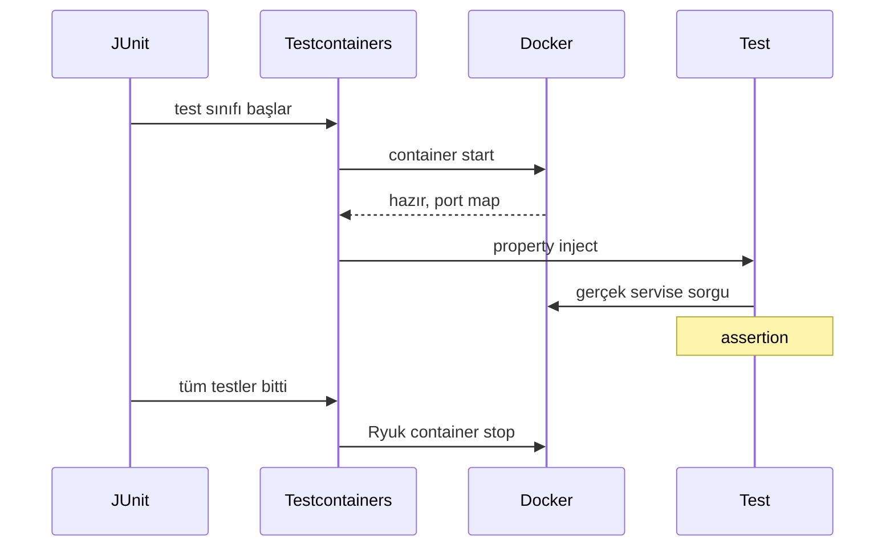
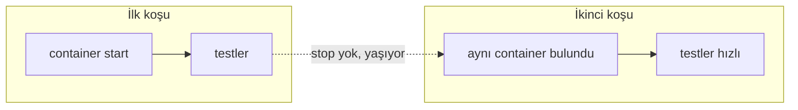

# Topic 12.3 — Testcontainers

```admonish info title="Bu bölümde"
- Container-based test: `@Container` + `@DynamicPropertySource` ile gerçek PostgreSQL/Kafka/Keycloak'ı test'te ayağa kaldırmak
- `@ServiceConnection` ile Spring Boot 3.1+ otomatik konfigürasyon — boilerplate'in tamamen kalkması
- Performans: singleton container + `withReuse(true)` reuse mode, local vs CI ayrımı
- Wait strategy tuzağı: "TCP portu açık" ile "uygulama hazır" arasındaki fark
- Banking full-stack: postgres + kafka + keycloak ile end-to-end transfer test'i, ledger invariant doğrulaması
```

## Hedef

Testcontainers ile **real services in Docker** test'lerde kullanmak. PostgreSQL, Kafka, Keycloak, Redis, LocalStack (AWS mock), Vault üzerinden banking-grade integration test pattern'leri: shared vs per-test container, reuse mode, network setup, `@ServiceConnection` ile Spring Boot entegrasyonu, wait strategy, CI optimizasyonu ve ledger invariant doğrulaması.

## Süre

Okuma: 2 saat • Kendini Sına: 45 dk • Pratik (opsiyonel): 3-4 saat • Toplam: ~2.5 saat (+ pratik)

## Önbilgi

- Topic 12.1, 12.2 bitti — unit test, mock, test slice biliyorsun
- Docker temel: image, container, port mapping kavramları
- Spring Boot test slice'ları (`@SpringBootTest`, `@DataJpaTest`) rahat

---

## Kavramlar

### 1. Testcontainers — neden gerçek servis?

Integration test'in tek işi vardır: kodun production'daki gerçek altyapıyla çalıştığını kanıtlamak — sahte bir altyapı bunu kanıtlamaz.

**Testcontainers**, testin başında Docker'da gerçek bir servis (Postgres, Kafka, Keycloak…) ayağa kaldırıp bittiğinde yok eden bir kütüphanedir. Üç yaklaşımı karşılaştıralım:

| | Mock | H2 / Embedded | Testcontainers |
|---|---|---|---|
| Production parity | Düşük | Orta (H2 = Postgres değil) | Yüksek |
| Speed | Çok hızlı | Hızlı | Orta (Docker start) |
| Banking için | Unit OK | Integration risky | Integration ideal |
| Setup complexity | Düşük | Düşük | Orta (Docker gerekli) |
| CI cost | Sıfır | Düşük | Orta |

H2 hızlıdır ama Postgres değildir: SQL dialect, lock davranışı, partitioning, `ON CONFLICT` gibi özellikler farklıdır. <mark>Integration test'te H2 kullanmak, production'da hiç koşmayacak bir DB'yi test etmektir</mark> — geçen test, prod'da patlayan koddur.

Banking'de kanıtlanmış değer: Postgres'in lock ve dialect davranışı H2'de yok; Kafka consumer group ve transaction'ı embedded kafka'da eksik; Keycloak realm + token format'ı mock'ta kırılgan. Bu üçünü de Testcontainers gerçek image'la test eder.

Container'ın yaşam döngüsü basittir: test sınıfı başlar, container start olur, portlar map'lenip Spring'e enjekte edilir, testler koşar, en sonunda **Ryuk** adlı temizlik daemon'ı container'ı durdurur.



### 2. Setup — bağımlılıklar

Testcontainers modülerdir: çekirdek + JUnit köprüsü + her servis için ayrı modül. Test scope'unda eklenir:

```xml
<dependency>
    <groupId>org.testcontainers</groupId>
    <artifactId>testcontainers</artifactId>
    <version>1.19.7</version>
    <scope>test</scope>
</dependency>
<dependency>
    <groupId>org.testcontainers</groupId>
    <artifactId>junit-jupiter</artifactId>
    <version>1.19.7</version>
    <scope>test</scope>
</dependency>
<dependency>
    <groupId>org.testcontainers</groupId>
    <artifactId>postgresql</artifactId>
    <version>1.19.7</version>
    <scope>test</scope>
</dependency>
<dependency>
    <groupId>org.testcontainers</groupId>
    <artifactId>kafka</artifactId>
    <version>1.19.7</version>
    <scope>test</scope>
</dependency>
```

### 3. İlk container: PostgreSQL

Bir servisi test'e bağlamanın klasik yolu iki parçadır: container'ı tanımla, portunu Spring'e söyle.

`@Testcontainers` sınıfı işaretler, **`@Container`** container yaşam döngüsünü JUnit'e bağlar. Static olduğunda container sınıftaki tüm testler arasında paylaşılır (her test için değil, bir kez start):

```java
@Testcontainers
class LedgerRepositoryTest {

    @Container
    static PostgreSQLContainer<?> postgres = new PostgreSQLContainer<>("postgres:16-alpine")
        .withDatabaseName("banking_test")
        .withUsername("test")
        .withPassword("test")
        .withInitScript("db/init-banking-schema.sql");
```

Container'ın portu dinamiktir (Docker rastgele host portu map'ler). Bu yüzden hostname/port hardcode edilemez; **`@DynamicPropertySource`** ile runtime'da alınıp Spring property'lerine yazılır:

```java
    @DynamicPropertySource
    static void datasourceProps(DynamicPropertyRegistry registry) {
        registry.add("spring.datasource.url", postgres::getJdbcUrl);
        registry.add("spring.datasource.username", postgres::getUsername);
        registry.add("spring.datasource.password", postgres::getPassword);
    }

    @Autowired LedgerRepository repo;

    @Test
    void shouldPersistJournalEntry() {
        JournalEntry entry = repo.save(testEntry());
        assertThat(entry.getId()).isNotNull();
    }
}
```

`getJdbcUrl()` mapped port'u içeren gerçek URL'i döner — asla `localhost:5432` yazma, container'ın portu her koşuda değişir.

### 4. `@ServiceConnection` — Spring Boot otomatik konfigürasyon

`@DynamicPropertySource` çalışır ama her servis için elle property yazmak sıkıcı ve hataya açıktır; Spring Boot 3.1 bunu bitirir.

**`@ServiceConnection`** container'ı görür, tipini tanır ve ilgili tüm Spring property'lerini (`spring.datasource.*`, `spring.kafka.*` …) otomatik üretir. Postgres için tek satır yeterlidir:

```java
@Container
@ServiceConnection
static PostgreSQLContainer<?> postgres = new PostgreSQLContainer<>("postgres:16-alpine");
```

<mark>`@ServiceConnection` ile `@DynamicPropertySource` boilerplate'i tamamen kalkar</mark> — Spring Boot, container tipinden hangi property'lerin gerektiğini kendi bilir.


```admonish tip title="Ne zaman ServiceConnection, ne zaman DynamicPropertySource"
`@ServiceConnection` sadece Spring Boot'un tanıdığı container tipleri için çalışır (PostgreSQL, Kafka, Redis, MongoDB…). Keycloak, Vault, LocalStack gibi özel property isteyen servislerde hâlâ `@DynamicPropertySource` yazarsın. İkisi aynı test sınıfında rahatça birlikte durur.
```

### 5. Shared container ve reuse — performans

Container start ucuz değildir: ≥ 5 saniye × 100 test = 500 saniye. Her test için yeniden başlatmak suite'i öldürür; çözüm container'ı paylaşmaktır.

**Pattern 1 — singleton container (JVM başına bir kez).** Static bir alanı manuel `start()` edip tüm test sınıflarının kalıtımla paylaştığı bir base class'a bağlarsın:

```java
public class SharedContainers {

    public static final PostgreSQLContainer<?> POSTGRES =
        new PostgreSQLContainer<>("postgres:16-alpine")
            .withDatabaseName("banking_test")
            .withUsername("test")
            .withPassword("test")
            .withReuse(true);

    static {
        POSTGRES.start();   // JVM'de bir kez
    }
}
```

Base class bu container'ı Spring'e bağlar; tüm integration test'ler bundan extend eder:

```java
@SpringBootTest
@Import(BankingTestConfig.class)
abstract class AbstractIntegrationTest {

    @DynamicPropertySource
    static void registerProps(DynamicPropertyRegistry r) {
        r.add("spring.datasource.url", SharedContainers.POSTGRES::getJdbcUrl);
        r.add("spring.datasource.username", SharedContainers.POSTGRES::getUsername);
        r.add("spring.datasource.password", SharedContainers.POSTGRES::getPassword);
    }
}
```

**Pattern 2 — reuse mode.** Singleton container yine de her JVM (yani her test koşusu) başında yeniden başlar. `withReuse(true)` + kullanıcı ayarı, container'ı test koşuları arasında **ayakta bırakır**: ikinci koşuda aynı container bulunur, start maliyeti sıfırlanır.

`~/.testcontainers.properties`:

```
testcontainers.reuse.enable=true
```



Reuse local geliştirmede süper hızlıdır ama kirli state taşır (önceki koşunun verisi durur). <mark>`withReuse` local'de hızlandırır, CI'da mutlaka kapalı olmalı</mark> — CI her build'de temiz state ister.

```admonish tip title="Reuse local'de, temizlik CI'da"
Reuse ile hızlanırsın ama her test kendi state'ini garanti etmelidir: `@Sql` clean script veya `@Transactional` rollback ile test başında DB'yi bilinen bir noktaya çek. Reuse'a güvenip "önceki test veriyi hazırladı" varsaymak, bir sonraki bölümdeki en sinsi anti-pattern'dir.
```

### 6. Wait strategy — "port açık" ≠ "hazır"

Container start etti demek, içindeki uygulama isteğe cevap veriyor demek değildir; bu farkı görmezden gelmek flaky test'in bir numaralı sebebidir.

**Wait strategy**, Testcontainers'ın "container hazır" kararını nasıl verdiğidir. Default `Wait.forListeningPort()` sadece TCP portunun açıldığını kontrol eder. <mark>`forListeningPort` "TCP açık" der, "uygulama hazır" demez</mark> — Keycloak portu açar ama realm'i yüklemesi 10 saniye daha sürebilir.

Doğrusu uygulamanın kendi health endpoint'ini beklemektir:

```java
@Container
static DockerComposeContainer<?> stack = new DockerComposeContainer<>(
    new File("src/test/resources/docker-compose-test.yml"))
    .withExposedService("postgres", 5432, Wait.forListeningPort())
    .withExposedService("kafka", 9092)
    .withExposedService("keycloak", 8080,
        Wait.forHttp("/health/ready").forStatusCode(200));
```

Postgres için `forListeningPort` yeterlidir (port açıldığında hazırdır), ama Keycloak gibi ağır başlayan servislerde `Wait.forHttp(...)` ile gerçek hazırlığı beklemelisin.

### 7. Diğer servisler — Kafka, Keycloak, Redis, LocalStack, Vault

Her servis kendi container class'ıyla gelir; pattern hep aynıdır: container tanımla, property'yi (dynamic veya ServiceConnection) bağla, gerçek API'ye karşı test et.

**Kafka** — gerçek broker; embedded kafka'nın kaçırdığı consumer group ve transaction davranışını test eder:

```java
@Container
static KafkaContainer kafka = new KafkaContainer(
    DockerImageName.parse("confluentinc/cp-kafka:7.5.1"))
    .withEmbeddedZookeeper();

@DynamicPropertySource
static void kafkaProps(DynamicPropertyRegistry r) {
    r.add("spring.kafka.bootstrap-servers", kafka::getBootstrapServers);
}

@Test
void shouldPublishTransferEvent() {
    transferService.transfer(req);

    ConsumerRecord<String, String> record = KafkaTestUtils.getSingleRecord(
        testConsumer, "transfer-events", Duration.ofSeconds(5));

    assertThat(record.value()).contains(req.transferId().toString());
}
```

**Keycloak** — realm import edip gerçek JWT ile secured endpoint test eder; token format'ı mock etmenin kırılganlığını ortadan kaldırır:

```java
@Container
static KeycloakContainer keycloak = new KeycloakContainer("quay.io/keycloak/keycloak:24.0")
    .withRealmImportFile("/banking-realm.json");

@DynamicPropertySource
static void keycloakProps(DynamicPropertyRegistry r) {
    r.add("spring.security.oauth2.resourceserver.jwt.issuer-uri",
        () -> keycloak.getAuthServerUrl() + "/realms/banking");
}

@Test
void shouldAuthorizeWithValidJwt() {
    String token = obtainAccessToken("ahmet", "test123", "banking-web");

    mockMvc.perform(get("/v1/accounts/me")
            .header("Authorization", "Bearer " + token))
        .andExpect(status().isOk());
}
```

**Redis** — özel bir container class'ı yoktur, genel `GenericContainer` + exposed port ile kurulur:

```java
@Container
static GenericContainer<?> redis = new GenericContainer<>("redis:7-alpine")
    .withExposedPorts(6379);

@DynamicPropertySource
static void redisProps(DynamicPropertyRegistry r) {
    r.add("spring.data.redis.host", redis::getHost);
    r.add("spring.data.redis.port", () -> redis.getMappedPort(6379));
}
```

**LocalStack** — AWS servislerini (KMS, S3, SQS) lokalde taklit eder; banking encryption'ı gerçek KMS API surface'i üzerinden test edersin:

```java
@Container
static LocalStackContainer localstack = new LocalStackContainer(
    DockerImageName.parse("localstack/localstack:3.0"))
    .withServices(KMS, S3, SQS);

@DynamicPropertySource
static void awsProps(DynamicPropertyRegistry r) {
    r.add("aws.kms.endpoint", () -> localstack.getEndpointOverride(KMS).toString());
    r.add("aws.s3.endpoint", () -> localstack.getEndpointOverride(S3).toString());
    r.add("aws.region", localstack::getRegion);
    r.add("aws.access-key", localstack::getAccessKey);
    r.add("aws.secret-key", localstack::getSecretKey);
}

@Test
void shouldEncryptViaKms() {
    String encrypted = encryptionService.encrypt("sensitive data");
    String decrypted = encryptionService.decrypt(encrypted);

    assertThat(decrypted).isEqualTo("sensitive data");
}
```

**Vault** — transit engine ile encryption-as-a-service; init command ile key hazırlanır:

```java
@Container
static VaultContainer<?> vault = new VaultContainer<>("hashicorp/vault:1.15")
    .withVaultToken("test-root-token")
    .withInitCommand("secrets enable transit",
                     "write -f transit/keys/banking-pii");

@DynamicPropertySource
static void vaultProps(DynamicPropertyRegistry r) {
    r.add("spring.cloud.vault.uri", () ->
        "http://" + vault.getHost() + ":" + vault.getMappedPort(8200));
    r.add("spring.cloud.vault.token", () -> "test-root-token");
}
```

### 8. Network isolation — çok container'lı senaryo

Bazı test'ler container'ların birbiriyle konuşmasını gerektirir (app → db); bunun için ortak bir Docker **network** ve alias tanımlarsın.

Container'lar aynı `Network`'e bağlanınca birbirini alias üzerinden (host değil) bulur — tıpkı production'daki service discovery gibi:

```java
@Container
static Network network = Network.newNetwork();

@Container
static PostgreSQLContainer<?> postgres = new PostgreSQLContainer<>("postgres:16")
    .withNetwork(network)
    .withNetworkAliases("banking-db");

@Container
static GenericContainer<?> app = new GenericContainer<>("banking/transfer-service:test")
    .withNetwork(network)
    .withEnv("DB_HOST", "banking-db")
    .dependsOn(postgres);
```

Banking PCI scope: NetworkPolicy davranışını bu şekilde emüle edebilirsin.

### 9. Docker Compose — tüm stack tek dosyada

Container'ları tek tek Java'da tanımlamak yerine mevcut bir `docker-compose.yml`'i doğrudan kaldırabilirsin — full stack integration test için pratiktir:

```java
@Container
static DockerComposeContainer<?> stack = new DockerComposeContainer<>(
    new File("src/test/resources/docker-compose-test.yml"))
    .withExposedService("postgres", 5432, Wait.forListeningPort())
    .withExposedService("kafka", 9092)
    .withExposedService("keycloak", 8080,
        Wait.forHttp("/health/ready").forStatusCode(200));
```

Her `withExposedService` için doğru wait strategy vermeyi unutma (Bölüm 6) — aksi halde Keycloak hazır olmadan test başlar.

### 10. Database state yönetimi

Paylaşılan container hızlıdır ama tehlikelidir: testler aynı DB'yi paylaşır, biri diğerinin verisini görür. Her test bilinen bir state'ten başlamalıdır.

Üç strateji vardır; banking'de ledger invariant'ları yüzünden per-test clean tercih edilir:

```java
@SpringBootTest
@Testcontainers
class TransferIntegrationTest extends AbstractIntegrationTest {

    @BeforeEach
    @Sql(scripts = "/db/clean-banking-state.sql",
         executionPhase = Sql.ExecutionPhase.BEFORE_TEST_METHOD)
    void cleanDb() {
        // her test öncesi SQL clean
    }

    // VEYA @Transactional + rollback
}
```

- **Per-test rollback** (hızlı): test method'una `@Transactional`, commit hiç olmaz
- **Per-test SQL clean** (yavaş ama net): her test öncesi clean script
- **Per-class fresh schema** (en pahalı, en izole): sınıf başına yeni şema

Banking: ledger invariant'ları (debit = credit) için per-test clean önerilir — kirli state bir testte gizlenen bug'ı diğerinde patlatır.

### 11. Banking — full-stack end-to-end test

Şimdi hepsini birleştiriyoruz: postgres + kafka `@ServiceConnection` ile, keycloak dynamic property ile, ve gerçek bir HTTP transfer akışını uçtan uca doğrulayan bir test.

Container'ları tanımlayarak başlıyoruz — Postgres ve Kafka `@ServiceConnection` sayesinde tek satırda bağlanır:

```java
@SpringBootTest
@Testcontainers
@AutoConfigureMockMvc
class BankingFullStackTest {

    @Container
    @ServiceConnection
    static PostgreSQLContainer<?> postgres = new PostgreSQLContainer<>("postgres:16-alpine")
        .withInitScript("db/init.sql");

    @Container
    @ServiceConnection
    static KafkaContainer kafka = new KafkaContainer(
        DockerImageName.parse("confluentinc/cp-kafka:7.5.1"));
```

Keycloak `@ServiceConnection` desteklemediği için issuer-uri'yi elle bağlarız; sonra test bağımlılıklarını inject ederiz:

```java
    @Container
    static KeycloakContainer keycloak = new KeycloakContainer()
        .withRealmImportFile("/banking-realm.json");

    @DynamicPropertySource
    static void keycloakProps(DynamicPropertyRegistry r) {
        r.add("spring.security.oauth2.resourceserver.jwt.issuer-uri",
            () -> keycloak.getAuthServerUrl() + "/realms/banking");
    }

    @Autowired MockMvc mockMvc;
    @Autowired LedgerService ledger;
    @Autowired KafkaTestConsumer kafkaConsumer;
```

Test gövdesi tam akışı doğrular: token al, transfer başlat, HTTP cevabını, ledger bakiyesini ve yayınlanan Kafka event'ini kontrol et:

```java
    @Test
    void endToEndTransferFlow() throws Exception {
        String token = obtainToken("ahmet", "test123");

        mockMvc.perform(post("/v1/transfers/havale")
                .header("Authorization", "Bearer " + token)
                .header("X-Idempotency-Key", UUID.randomUUID().toString())
                .contentType(MediaType.APPLICATION_JSON)
                .content("""
                    {"fromAccount":"acc-A","toAccount":"acc-B","amount":"100","currency":"TRY"}
                    """))
            .andExpect(status().isCreated())
            .andExpect(jsonPath("$.status").value("COMPLETED"));

        assertThat(ledger.balanceOf("acc-A", "TRY")).isEqualByComparingTo("900");
        assertThat(ledger.balanceOf("acc-B", "TRY")).isEqualByComparingTo("600");

        ConsumerRecord<String, String> event = kafkaConsumer.pollOne(
            "transfer-events", Duration.ofSeconds(5));
        assertThat(event.value()).contains("acc-A").contains("acc-B");
    }
}
```

Bu test HTTP, security, DB ve messaging katmanlarının hepsini gerçek servislerle birlikte kanıtlar — mock'ların asla veremeyeceği güven.

<details>
<summary>Tam kod: BankingFullStackTest (~57 satır)</summary>

```java
@SpringBootTest
@Testcontainers
@AutoConfigureMockMvc
class BankingFullStackTest {

    @Container
    @ServiceConnection
    static PostgreSQLContainer<?> postgres = new PostgreSQLContainer<>("postgres:16-alpine")
        .withInitScript("db/init.sql");

    @Container
    @ServiceConnection
    static KafkaContainer kafka = new KafkaContainer(
        DockerImageName.parse("confluentinc/cp-kafka:7.5.1"));

    @Container
    static KeycloakContainer keycloak = new KeycloakContainer()
        .withRealmImportFile("/banking-realm.json");

    @DynamicPropertySource
    static void keycloakProps(DynamicPropertyRegistry r) {
        r.add("spring.security.oauth2.resourceserver.jwt.issuer-uri",
            () -> keycloak.getAuthServerUrl() + "/realms/banking");
    }

    @Autowired MockMvc mockMvc;
    @Autowired LedgerService ledger;
    @Autowired KafkaTestConsumer kafkaConsumer;

    @Test
    void endToEndTransferFlow() throws Exception {
        String token = obtainToken("ahmet", "test123");

        // Initiate transfer
        mockMvc.perform(post("/v1/transfers/havale")
                .header("Authorization", "Bearer " + token)
                .header("X-Idempotency-Key", UUID.randomUUID().toString())
                .contentType(MediaType.APPLICATION_JSON)
                .content("""
                    {"fromAccount":"acc-A","toAccount":"acc-B","amount":"100","currency":"TRY"}
                    """))
            .andExpect(status().isCreated())
            .andExpect(jsonPath("$.status").value("COMPLETED"));

        // Verify ledger
        assertThat(ledger.balanceOf("acc-A", "TRY"))
            .isEqualByComparingTo("900");
        assertThat(ledger.balanceOf("acc-B", "TRY"))
            .isEqualByComparingTo("600");

        // Verify event published
        ConsumerRecord<String, String> event = kafkaConsumer.pollOne(
            "transfer-events", Duration.ofSeconds(5));
        assertThat(event.value()).contains("acc-A").contains("acc-B");
    }
}
```

</details>

`@ServiceConnection` (Spring Boot 3.1+) Postgres ve Kafka için tüm property'leri otomatik kurar; sadece Keycloak elle kalır.

### 12. CI optimization

Local'de reuse hız verir; CI'da öncelik temizlik ve tekrarlanabilirliktir. İki ayarı bilinçli ters çevirirsin: reuse kapalı, Ryuk açık.

```yaml
# GitHub Actions
- name: Cache Testcontainers
  uses: actions/cache@v4
  with:
    path: ~/.testcontainers
    key: tc-${{ runner.os }}

- name: Run integration tests
  env:
    TESTCONTAINERS_RYUK_DISABLED: "false"   # container temizliği
    TESTCONTAINERS_REUSE_ENABLE: "false"     # CI: temiz state
  run: ./mvnw -B verify -Pintegration
```

Banking CI pratiği: dedicated runner (Docker-in-Docker maliyetli), yavaş integration suite'i ayrı split'te paralel çalıştır.

### 13. Banking — Testcontainers anti-pattern'leri

Mülakatta "bu test setup'ında ne yanlış?" sorusunun cephaneliği. On klasik:

**1 — H2 for integration tests:** Postgres SQL dialect, lock, partitioning farklı. Banking integration için Testcontainers.

**2 — Per-test container start:** Yavaş. Singleton + per-test clean state.

**3 — Hardcoded host/port:** Mapped port dinamiktir. `getJdbcUrl()`, `getMappedPort()` kullan.

**4 — No container cleanup:** Ryuk daemon otomatik temizler; disable etme.

**5 — Container in `@BeforeEach`:** Start maliyeti × test sayısı. Class-level static kullan.

**6 — Production image in test:** Test resmi lightweight official image kullanır; production custom image ayrı.

**7 — No init script:** Boş DB → kırılgan test. Schema + seed init et.

**8 — Test depends on previous test state:** Per-test clean state; banking ledger invariant'ları buna bağlı.

**9 — Testcontainers + Spring `@AutoConfigureTestDatabase` karışımı:** H2 auto-config Testcontainers'ı ezer.

```admonish warning title="H2 auto-config sessizce devralır"
`spring-boot-starter-test` sınıf yolunda H2 varsa, `@DataJpaTest` default olarak gömülü H2'ye geçer ve Testcontainers'ını yok sayar — testin yeşil geçer ama gerçek Postgres'e hiç dokunmaz. `@AutoConfigureTestDatabase(replace = Replace.NONE)` ile bu devralmayı kapat.
```

**10 — Wrong wait strategy:** `Wait.forListeningPort()` "TCP açık" der, "uygulama hazır" demez. Health endpoint bekle (Bölüm 6).

```admonish warning title="Flaky test genelde wait strategy'dir"
Bir integration test bazen geçip bazen kalıyorsa ilk şüphelin container hazır olmadan başlayan test'tir. Keycloak, Kafka gibi ağır servislerde `Wait.forHttp("/health/ready")` ile gerçek hazırlığı bekle; `Thread.sleep` ile "biraz bekleyelim" yamaları hem yavaş hem kırılgandır.
```

---

## Önemli olabilecek araştırma kaynakları

- Testcontainers documentation
- Spring Boot Testcontainers integration (`@ServiceConnection`)
- "Practical Test-Driven Development" — Edward Garson
- LocalStack docs (AWS mock)

---

## Kendini Sına

Aşağıdaki soruları önce **cevaba bakmadan** kendi cümlelerinle yanıtlamayı dene — hepsi TR bank mülakatlarında karşına çıkabilecek tarzda. Takıldığın soru olursa ilgili Kavramlar başlığına dön, sonra tekrar dene.

**S1. Integration test'te H2 yerine Testcontainers ile gerçek Postgres kullanmayı savun. H2'nin somut riski nedir?**

<details>
<summary>Cevabı göster</summary>

H2 hızlıdır ama Postgres değildir: SQL dialect, lock davranışı, partitioning, `ON CONFLICT`, JSON tipleri, sequence semantiği farklıdır. H2'de yeşil geçen bir sorgu production Postgres'inde patlayabilir — çünkü test hiç koşmayacak bir DB'yi doğrulamıştır. Testcontainers gerçek `postgres:16` image'ını kaldırdığı için production parity yüksektir.

Banking'de bu fark kritik: pessimistic lock (`SELECT ... FOR UPDATE`), advisory lock, partition'lı ledger tabloları H2'de ya yok ya farklı davranır. Karşılığında Testcontainers Docker start maliyeti getirir (birkaç saniye), ama singleton + reuse ile bu maliyet suite başına bir kereye iner.

</details>

**S2. `@ServiceConnection` nedir? `@DynamicPropertySource`'a göre ne kazandırır, ne zaman hâlâ `@DynamicPropertySource` gerekir?**

<details>
<summary>Cevabı göster</summary>

`@ServiceConnection` (Spring Boot 3.1+) container'ın tipini tanıyıp ilgili tüm Spring property'lerini (`spring.datasource.*`, `spring.kafka.*`…) otomatik üretir. `@DynamicPropertySource`'ta her URL/user/password satırını elle yazarken, ServiceConnection ile container alanının üstüne tek annotation yeter — boilerplate ve copy-paste hatası ortadan kalkar.

Sınırı: sadece Spring Boot'un tanıdığı tipler için çalışır (PostgreSQL, Kafka, Redis, MongoDB, RabbitMQ…). Keycloak, Vault, LocalStack gibi özel property isteyen servislerde hâlâ `@DynamicPropertySource` yazarsın. İkisi aynı test sınıfında birlikte kullanılır: Postgres/Kafka ServiceConnection, Keycloak dynamic property.

</details>

**S3. Container reuse nasıl çalışır? Singleton container'dan farkı nedir ve CI'da neden kapatılır?**

<details>
<summary>Cevabı göster</summary>

Singleton container JVM başına bir kez start olur (static blokta `start()`), sınıflar arası paylaşılır — ama her yeni test koşusu (yeni JVM) yeniden başlatır. Reuse mode (`withReuse(true)` + `~/.testcontainers.properties` içinde `testcontainers.reuse.enable=true`) container'ı koşular arasında da ayakta bırakır: ikinci `./mvnw test`'te aynı container bulunur, start maliyeti tamamen sıfırlanır.

CI'da kapatılır çünkü reuse kirli state taşır — önceki koşunun verisi durur. CI her build'de temiz, tekrarlanabilir bir başlangıç ister; `TESTCONTAINERS_REUSE_ENABLE=false`. Reuse local geliştirme döngüsünü hızlandırmak içindir; her iki durumda da testler kendi state'ini `@Sql` clean veya `@Transactional` rollback ile garanti etmelidir.

</details>

**S4. `Wait.forListeningPort()` ile `Wait.forHttp("/health/ready")` arasındaki fark nedir? Yanlış seçim neye yol açar?**

<details>
<summary>Cevabı göster</summary>

`Wait.forListeningPort()` sadece TCP portunun açıldığını kontrol eder — "port açık" demektir, "uygulama isteğe cevap veriyor" demez. Keycloak portu saniyeler içinde açar ama realm import + hazır olması 10+ saniye sürebilir. Bu aralıkta başlayan test, servis hazır olmadığı için bağlantı/timeout hatasıyla kalır: klasik flaky test.

`Wait.forHttp("/health/ready").forStatusCode(200)` uygulamanın kendi health endpoint'i 200 dönene kadar bekler — gerçek hazırlığı ölçer. Kural: hafif servisler (Postgres) için `forListeningPort` yeterli, ağır başlayan servisler (Keycloak, Kafka, custom app) için health endpoint bekle. `Thread.sleep` ile "biraz bekle" yaması hem yavaş hem kırılgandır.

</details>

**S5. Paylaşılan (singleton) bir container'da testler birbirinin verisini görüyor. State izolasyonunu nasıl sağlarsın, banking'de hangisini seçersin?**

<details>
<summary>Cevabı göster</summary>

Üç strateji var: (1) per-test `@Transactional` rollback — commit hiç olmaz, en hızlı; (2) per-test `@Sql` clean script — her test öncesi DB'yi temizler, yavaş ama net; (3) per-class fresh schema — sınıf başına yeni şema, en pahalı ama en izole.

Banking'de per-test SQL clean önerilir çünkü ledger invariant'ları (debit = credit) rollback'in gizleyebileceği bug'ları açığa çıkarmalı, ayrıca Kafka/dış sistem gibi rollback'e tabi olmayan yan etkiler işin içine girer. Kritik nokta: reuse veya singleton kullandığında "önceki test veriyi hazırladı" varsaymak anti-pattern'dir — her test bilinen, temiz bir state'ten başlamalıdır.

</details>

**S6. Banking full-stack e2e test'te trial balance (ledger invariant) doğrulamasını nasıl kurarsın?**

<details>
<summary>Cevabı göster</summary>

Her testten sonra çift taraflı defterin dengede olduğunu (`toplam debit - toplam credit = 0`) kontrol eden bir `@AfterEach` (veya JUnit extension) yazarsın:

```java
@AfterEach
void verifyLedgerInvariant() {
    assertThat(trialBalanceService.compute())
        .as("Trial balance violation")
        .isEqualByComparingTo(ZERO);
}
```

Bu, her transfer test'inin double-entry invariant'ı bozup bozmadığını otomatik yakalar. Extension'a çevirirsen tüm integration test sınıflarına tek `@ExtendWith` ile uygulanır. Testcontainers gerçek Postgres kullandığı için bu invariant gerçek constraint ve lock davranışıyla test edilir — H2'de aynı garantiyi veremezsin.

</details>

**S7. LocalStack ve Vault container'larını banking'de ne için kullanırsın? Neden gerçek servis mock'tan iyi?**

<details>
<summary>Cevabı göster</summary>

LocalStack AWS servislerini (KMS, S3, SQS) lokalde taklit eder; banking envelope encryption'ı gerçek KMS API surface'i üzerinden test edersin — encrypt/decrypt roundtrip, key referansları, IAM davranışı. Vault ise transit engine ile encryption-as-a-service sağlar: `withInitCommand` ile transit key hazırlanır, PII şifreleme dış servise karşı test edilir.

Mock yerine bunları kullanmanın değeri: gerçek API sözleşmesini (endpoint, error kodları, response format) doğrularsın. Mock'ta "benim varsaydığım" davranışı test edersin; LocalStack/Vault'ta servisin gerçek davranışını. Banking'de KMS entegrasyonu para/PII koruması olduğu için bu fark denetim açısından kritiktir.

</details>

---

## Tamamlama kriterleri

- [ ] `@Container` + `@DynamicPropertySource` ile bir servisi test'e bağlamayı anlatabiliyorum
- [ ] `@ServiceConnection`'ın ne yaptığını ve `@DynamicPropertySource`'a göre farkını açıklayabiliyorum
- [ ] Singleton container + `withReuse(true)` reuse mode'un çalışmasını ve local/CI ayrımını biliyorum
- [ ] `Wait.forListeningPort()` ile `Wait.forHttp()` farkını ve flaky test bağlantısını anlatabiliyorum
- [ ] Container state izolasyonu için üç stratejiyi (rollback / SQL clean / fresh schema) sayabiliyorum
- [ ] Postgres + Kafka + Keycloak ile full-stack e2e test'in iskeletini çizebiliyorum
- [ ] Ledger invariant'ı `@AfterEach` ile doğrulamayı biliyorum
- [ ] En az 5 Testcontainers anti-pattern'ini (H2, per-test container, hardcoded port, wrong wait…) sayabiliyorum
- [ ] (Opsiyonel) "Pratik yapmak istersen" bölümündeki testleri yazdım ve Claude-verify prompt'uyla doğrulattım

---

## Defter notları

1. "Testcontainers vs H2/Mock — production parity banking sebebi: ____."
2. "Singleton + withReuse + @ServiceConnection performance optimization: ____."
3. "Per-test state clean (SQL or @Transactional rollback) banking ledger: ____."
4. "Banking ledger invariant @AfterEach trial balance check: ____."
5. "Keycloak realm import + token obtain + secured endpoint test: ____."
6. "LocalStack KMS banking encryption integration test pattern: ____."
7. "Vault transit engine encryption-as-a-service test: ____."
8. "@ServiceConnection Spring Boot 3.1+ auto-config vs @DynamicPropertySource: ____."
9. "Wait.forHttp + health-ready vs Wait.forListeningPort fragility: ____."
10. "CI Testcontainers cache + reuse off + dedicated runner banking: ____."

```admonish success title="Bölüm Özeti"
- Testcontainers testin başında gerçek servisi (Postgres, Kafka, Keycloak…) Docker'da kaldırır; H2/mock'ın kaçırdığı production parity'yi verir — integration test'in asıl amacı budur
- `@Container` + `@DynamicPropertySource` klasik bağlama yoludur; Spring Boot 3.1+ `@ServiceConnection` bu boilerplate'i tanınan tipler için tamamen kaldırır
- Performans üçlüsü: static `@Container` (sınıf içi paylaşım), singleton (JVM içi), `withReuse(true)` (koşular arası) — reuse local'de hızlandırır, CI'da kapalı olmalı
- Wait strategy hayatidir: `forListeningPort` "TCP açık" der, "hazır" demez; ağır servislerde `Wait.forHttp("/health/ready")` flaky test'i önler
- State izolasyonu her testin sorumluluğudur: per-test SQL clean veya `@Transactional` rollback; banking'de ledger invariant'ı `@AfterEach` ile doğrula
- Anti-pattern'ler para kaybettirir: H2 for integration, per-test container start, hardcoded port, no init script, yanlış wait strategy — hepsi sessizce yeşil geçen ama yanıltan test üretir
```

---

## Pratik yapmak istersen

Kavramları koda dökmek istersen aşağıdaki iki ek hazır: test yazma rehberi PostgreSQL, Kafka, Keycloak, LocalStack, Vault ve full-stack senaryoları için örnek testler ve mini alıştırmalar içerir; Claude-verify prompt'u ile yazdığın Testcontainers setup'ını banking-grade perspektiften denetletebilirsin.

<details>
<summary>Test yazma rehberi</summary>

> Süre önerisi: her senaryo 30-60 dk. Sırayla ilerle; ilk üçü temel (PostgreSQL, singleton/reuse, Kafka), sonrakiler banking-specific servisler.

### 1 — PostgreSQL container basic

`@Container` + `@DynamicPropertySource` (veya `@ServiceConnection`). Repository test'i: save/find roundtrip, `getId()` not null. Tamamlanınca: gerçek Postgres'e karşı en az bir persist doğrulandı.

### 2 — Singleton + reuse

Shared static container'ı bir base class'a taşı, tüm test'ler extend etsin. `withReuse(true)` + `~/.testcontainers.properties` ayarını yap, iki kez koşup start süresini karşılaştır. Tamamlanınca: ikinci koşuda container start maliyeti gözle görülür şekilde düştü.

### 3 — Kafka container + full-stack template

Aşağıdaki iskelet Postgres + Kafka'yı `@ServiceConnection` ile bağlar, per-test clean ve ledger invariant içerir — kendi transfer test'ini bunun üstüne kur:

```java
@SpringBootTest
@Testcontainers
class BankingIntegrationTest {

    @Container
    @ServiceConnection
    static PostgreSQLContainer<?> postgres = new PostgreSQLContainer<>("postgres:16-alpine")
        .withInitScript("db/init-banking.sql")
        .withReuse(true);

    @Container
    @ServiceConnection
    static KafkaContainer kafka = new KafkaContainer(
        DockerImageName.parse("confluentinc/cp-kafka:7.5.1"));

    @BeforeEach
    @Sql(scripts = "/db/clean.sql")
    void cleanState() {}

    @AfterEach
    void verifyLedgerInvariant() {
        BigDecimal diff = trialBalanceService.compute();
        assertThat(diff)
            .as("Trial balance violation")
            .isEqualByComparingTo(ZERO);
    }

    @Test
    void completeBankingTransferFlow() {
        // ... full e2e test: transfer başlat, bakiye + event doğrula
    }
}
```

Publish event + consume verify: transfer sonrası `transfer-events` topic'inden `KafkaTestUtils.getSingleRecord(...)` ile event'i çekip içeriğini assert et.

### 4 — Keycloak realm import

`KeycloakContainer` + `banking-realm.json`. Token obtain edip secured endpoint'e (`/v1/accounts/me`) `Authorization: Bearer` header ile vur, `200` bekle. Tamamlanınca: gerçek JWT ile en az bir authorization test'i geçti.

### 5 — Redis / LocalStack / Vault

- **Redis:** `GenericContainer` + exposed port; cache hit doğrula (Caffeine + Redis).
- **LocalStack KMS:** envelope encrypt + decrypt roundtrip, `decrypted == plaintext`.
- **Vault transit:** `withInitCommand` ile transit key, encryption-as-a-service roundtrip.

### 6 — Full stack (postgres + kafka + keycloak)

Bölüm 11'deki `BankingFullStackTest`'i kur: token → transfer → ledger bakiyesi → Kafka event doğrulaması, hepsi tek testte.

### 7 — Network isolation

Custom `Network` + postgres alias + app container; app DB'ye alias üzerinden bağlansın. Tamamlanınca: iki container network üzerinden konuştu.

### 8 — Bonus: wait strategy deneyi

Keycloak'ı önce `Wait.forListeningPort()` ile, sonra `Wait.forHttp("/health/ready")` ile başlat; ilkinde test'in ara sıra flaky olduğunu gözlemle, ikincide stabilleştiğini gör.

</details>

<details>
<summary>Claude-verify prompt</summary>

```
Testcontainers setup'ımı banking-grade kriterlere göre değerlendir. 
Her madde için PASS / FAIL / EKSIK işaretle, kanıt göster, kod yazma:

1. Container types:
   - PostgreSQL banking DB?
   - Kafka transactions/events?
   - Keycloak auth?
   - Redis cache/idempotency?
   - LocalStack KMS/S3?
   - Vault transit (banking encryption)?

2. Optimization:
   - Shared (singleton) container?
   - withReuse(true) local?
   - @ServiceConnection (Spring Boot 3.1+)?
   - CI reuse off / local on?

3. State management:
   - Per-test clean SQL veya @Transactional rollback?
   - Init script seed?
   - Banking ledger invariant @AfterEach?

4. Wait strategy:
   - Wait.forHttp("/health/ready") application-ready?
   - Ağır servislerde Wait.forListeningPort (TCP only) kullanılmıyor mu?

5. Network:
   - Multi-container için custom Network?
   - Alias'lar?

6. Spring integration:
   - @DynamicPropertySource sadece gerektiğinde (Keycloak/Vault)?
   - @ServiceConnection auto-config tanınan tiplerde?

7. Banking-specific:
   - Realm import Keycloak?
   - Banking schema init?
   - Demo customer seed?
   - KMS key setup?

8. CI:
   - Dedicated runner?
   - Cache strategy?
   - Parallel suite split?

9. Cleanup:
   - Ryuk enabled (disable edilmemiş)?
   - Container leak yok?

10. Anti-pattern:
    - H2 for integration YOK?
    - Per-test container start YOK?
    - Hardcoded host/port YOK?
    - No init script YOK?
    - Test state dependency YOK?
    - Wrong wait strategy YOK?
    - @AutoConfigureTestDatabase ile H2 override YOK?
```

</details>
