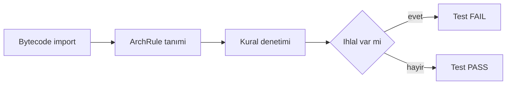
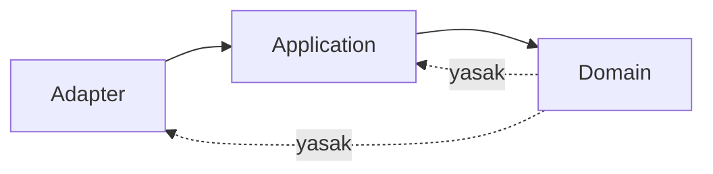
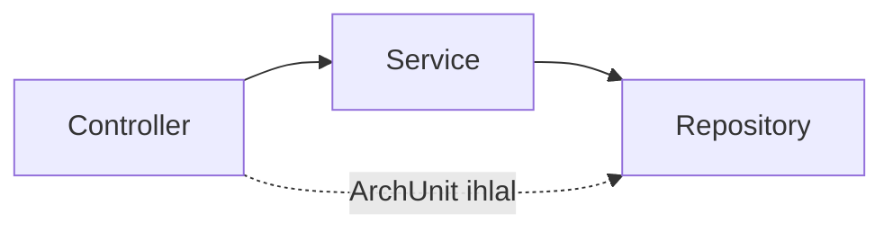

# Topic 12.4 — ArchUnit: Architecture Tests

```admonish info title="Bu bölümde"
- Mimari kuralları **JUnit testi** olarak enforce etmek: code review'in gözden kaçırdığını CI otomatik yakalar
- Hexagonal dependency direction — domain katmanı neden ne infrastructure'a ne de Spring'e bağlanabilir
- Naming conventions + banking-specific kurallar: money `BigDecimal`, PII `@Convert`, ledger erişim kısıtı, PAN sınırı
- Cyclic dependency, module boundary ve custom predicate + condition ile kendi mimari kuralını yazmak
- ArchUnit anti-pattern'leri: `DoNotIncludeTests` eksikliği, hardcoded class isimleri, tek mega test class
```

## Hedef

ArchUnit ile architecture rules'ı **JUnit test olarak** enforce etmek. Hexagonal layers, naming conventions, dependency direction, package structure ve banking-specific kurallar (balance için direct DB UPDATE yok, DTO'da PAN yok, KVKK PII sınırı). Amaç: compile-time'da yakalanmayan, code review'a kalan mimari ihlallerini otomatik yakalamak.

## Süre

Okuma: 1.5 saat • Kendini Sına: 30 dk • Pratik (opsiyonel): 3-4 saat • Toplam: ~2 saat (+ pratik)

## Önbilgi

- JUnit 5 (Topic 12.1) bitti
- Hexagonal architecture (Phase 2)
- Banking domain (Phase 10)

---

## Kavramlar

### 1. ArchUnit — mimari kuralı kim korur?

Her mimaride yazılı olmayan kurallar vardır: "domain infrastructure'a bağlanmaz", "controller repository'ye doğrudan gitmez". Bu kuralları bugün ekipteki herkes bilir; altı ay sonra yeni gelen bilmez, code review'da gözden kaçar, mimari sessizce çürür.

**ArchUnit**, bu kuralları **JUnit testi** olarak yazmanı sağlayan bir kütüphanedir. Kuralı bir kez `ArchRule` olarak tanımlarsın; bir sonraki ihlalde build kırmızı olur. Böylece kural insan hafızasına değil, bytecode analizine dayanır.

Code review manuel enforcement'ın zayıf halkasıdır: bireysel, zaman alıcı ve insan hatasına açık. ArchUnit ise deterministik, tekrarlanabilir ve CI'da otomatiktir.



```admonish tip title="ArchUnit ne değildir"
ArchUnit **statik yapısal** analiz yapar: paket, bağımlılık, isim, annotation. "Method X şunu yapmalı" gibi davranışsal kuralları buraya sokma — o iş unit/integration testinin. ArchUnit mimarinin şeklini korur, davranışını değil.
```

### 2. Setup

ArchUnit'in JUnit 5 entegrasyonu tek dependency ile gelir:

```xml
<dependency>
    <groupId>com.tngtech.archunit</groupId>
    <artifactId>archunit-junit5</artifactId>
    <version>1.2.1</version>
    <scope>test</scope>
</dependency>
```

Kuralları taşıyan class'ı `@AnalyzeClasses` ile işaretlersin; `DoNotIncludeTests` test class'larını analiz dışında bırakır:

```java
@AnalyzeClasses(packages = "com.bank", importOptions = ImportOption.DoNotIncludeTests.class)
public class BankingArchitectureTest { ... }
```

### 3. Hexagonal architecture rules — dependency direction

Hexagonal mimarinin kalbi **bağımlılık yönüdür**: dış katmanlar içe bağlanabilir, iç katman dışa asla. <mark>Domain katmanı ne infrastructure'a ne de framework'e bağlanabilir</mark> — saf iş kuralı olarak kalmalı.



Kural 1 — domain, infrastructure ve adapter paketlerine bağlanamaz:

```java
@ArchTest
static final ArchRule domainShouldNotDependOnInfrastructure =
    noClasses().that().resideInAPackage("..domain..")
        .should().dependOnClassesThat().resideInAnyPackage(
            "..infrastructure..", "..adapter..", "..persistence..", "..rest..", "..kafka..");
```

Kural 2 — domain framework'e (Spring, JPA, Servlet) bağlanamaz. Bu, domain'i test edilebilir ve teknolojiden bağımsız tutar:

```java
@ArchTest
static final ArchRule domainShouldNotDependOnSpring =
    noClasses().that().resideInAPackage("..domain..")
        .should().dependOnClassesThat().resideInAnyPackage(
            "org.springframework..", "jakarta.persistence..", "jakarta.servlet..", "org.hibernate..");
```

Kural 3 — application katmanı adapter'ları görmez; port'lar üzerinden konuşur:

```java
@ArchTest
static final ArchRule applicationShouldNotDependOnAdapters =
    noClasses().that().resideInAPackage("..application..")
        .should().dependOnClassesThat().resideInAnyPackage(
            "..adapter.in..", "..adapter.out..", "..rest..", "..persistence..");
```

Tek tek `noClasses()` kuralları yerine tüm katman ilişkisini `layeredArchitecture()` DSL'iyle bir yerde tanımlayabilirsin — hangi katmana kimin erişebileceğini deklaratif olarak yazar:

```java
@ArchTest
static final ArchRule layeredArchitecture = layeredArchitecture()
    .consideringAllDependencies()
    .layer("Domain").definedBy("..domain..")
    .layer("Application").definedBy("..application..")
    .layer("Adapter").definedBy("..adapter..")
    .layer("Infrastructure").definedBy("..infrastructure..")
    .whereLayer("Adapter").mayOnlyBeAccessedByLayers("Infrastructure")
    .whereLayer("Application").mayOnlyBeAccessedByLayers("Adapter", "Infrastructure")
    .whereLayer("Domain").mayOnlyBeAccessedByLayers("Application", "Adapter", "Infrastructure");
```

<details>
<summary>Tam kod: TransferHexagonalArchTest (~46 satır)</summary>

```java
@AnalyzeClasses(packages = "com.bank.transfer", importOptions = DoNotIncludeTests.class)
class TransferHexagonalArchTest {

    @ArchTest
    static final ArchRule domainShouldNotDependOnInfrastructure =
        noClasses().that().resideInAPackage("..domain..")
            .should().dependOnClassesThat().resideInAnyPackage(
                "..infrastructure..",
                "..adapter..",
                "..persistence..",
                "..rest..",
                "..kafka.."
            );

    @ArchTest
    static final ArchRule domainShouldNotDependOnSpring =
        noClasses().that().resideInAPackage("..domain..")
            .should().dependOnClassesThat().resideInAnyPackage(
                "org.springframework..",
                "jakarta.persistence..",
                "jakarta.servlet..",
                "org.hibernate.."
            );

    @ArchTest
    static final ArchRule applicationShouldNotDependOnAdapters =
        noClasses().that().resideInAPackage("..application..")
            .should().dependOnClassesThat().resideInAnyPackage(
                "..adapter.in..",
                "..adapter.out..",
                "..rest..",
                "..persistence.."
            );

    @ArchTest
    static final ArchRule layeredArchitecture = layeredArchitecture()
        .consideringAllDependencies()
        .layer("Domain").definedBy("..domain..")
        .layer("Application").definedBy("..application..")
        .layer("Adapter").definedBy("..adapter..")
        .layer("Infrastructure").definedBy("..infrastructure..")
        .whereLayer("Adapter").mayOnlyBeAccessedByLayers("Infrastructure")
        .whereLayer("Application").mayOnlyBeAccessedByLayers("Adapter", "Infrastructure")
        .whereLayer("Domain").mayOnlyBeAccessedByLayers("Application", "Adapter", "Infrastructure");
}
```

</details>

### 4. Naming conventions

İsim kuralları hem okunabilirliği hem de diğer ArchUnit kurallarının paket/annotation eşleşmesini sağlamlaştırır. Controller/Repository/Service suffix'leri deterministik olsun:

```java
@ArchTest
static final ArchRule controllersShouldBeNamedXxxController =
    classes().that().resideInAPackage("..adapter.in.rest..")
        .and().areAnnotatedWith(RestController.class)
        .should().haveSimpleNameEndingWith("Controller");

@ArchTest
static final ArchRule repositoriesShouldBeNamedXxxRepository =
    classes().that().resideInAPackage("..adapter.out.persistence..")
        .and().areAnnotatedWith(Repository.class)
        .should().haveSimpleNameEndingWith("Repository");

@ArchTest
static final ArchRule servicesShouldBeNamedXxxService =
    classes().that().resideInAPackage("..application.service..")
        .should().haveSimpleNameEndingWith("Service");
```

Hexagonal'a özgü iki isim kuralı: port interface'leri `Port`/`UseCase`, domain event'leri `Event` ile bitmeli:

```java
@ArchTest
static final ArchRule portInterfacesShouldEndWithPort =
    classes().that().resideInAPackage("..application.port..")
        .and().areInterfaces()
        .should().haveSimpleNameEndingWith("Port")
        .orShould().haveSimpleNameEndingWith("UseCase");

@ArchTest
static final ArchRule eventsShouldEndWithEvent =
    classes().that().resideInAPackage("..domain.event..")
        .and().haveSimpleNameNotContaining("Test")
        .should().haveSimpleNameEndingWith("Event");
```

### 5. Banking-specific rules

Generic hexagonal kurallar iyidir; ama asıl değeri **banking-domain kuralları** yaratır — çünkü bunlar para ve regülasyon hatalarını compile öncesi yakalar.

En kritiği para tipi: <mark>banking'de para alanları her zaman `BigDecimal` olmalı, `double` veya `float` asla</mark>. Float aritmetiği kuruş kaybettirir.

```java
@ArchTest
static final ArchRule moneyMustBeBigDecimal =
    fields().that().haveNameMatching(".*[aA]mount.*|.*[bB]alance.*|.*[fF]ee.*")
        .and().areDeclaredInClassesThat().resideInAPackage("..domain..")
        .should().haveRawType(BigDecimal.class)
        .as("Money fields MUST be BigDecimal (Phase 1)");

@ArchTest
static final ArchRule noDoubleForMoney =
    noFields().that().haveNameMatching(".*[aA]mount.*|.*[bB]alance.*|.*[fF]ee.*")
        .should().haveRawType(double.class)
        .orShould().haveRawType(Double.class)
        .orShould().haveRawType(float.class);
```

Ledger bütünlüğü ve PII sınırları: balance değişimi yalnız `LedgerService` üzerinden geçmeli, journal repository'ye erişim kısıtlı olmalı, PAN yalnız card modülünde bulunmalı:

```java
@ArchTest
static final ArchRule noDirectBalanceUpdate =
    noClasses().should().callMethod(JdbcTemplate.class, "update")
        .orShould().callMethod(EntityManager.class, "createNativeQuery")
        .as("All balance changes must go through LedgerService (Topic 10.1)");

@ArchTest
static final ArchRule onlyLedgerServiceCanInsertJournalEntry =
    classes().that().haveSimpleName("JournalEntryRepository")
        .should().onlyBeAccessed().byClassesThat()
            .haveSimpleName("LedgerService")
            .or().haveSimpleName("LedgerEntryListener");

@ArchTest
static final ArchRule noPanInDtoExceptCardService =
    noClasses().that().resideInAPackage("..adapter.in.rest.dto..")
        .and().resideOutsideOfPackage("..card.adapter.in.rest.dto..")
        .should().haveSimpleNameContaining("Pan")
        .orShould().haveSimpleNameContaining("CardNumber");
```

REST katmanı ve audit için yapısal kurallar da eklenir — controller'lar `ResponseEntity`/`ProblemDetail` döndürmeli, audit `@Immutable` olmalı, transfer endpoint'i idempotency taşımalı:

```java
@ArchTest
static final ArchRule restControllersMustReturnResponseEntity =
    methods().that().areAnnotatedWith(GetMapping.class)
        .or().areAnnotatedWith(PostMapping.class)
        .or().areAnnotatedWith(PutMapping.class)
        .or().areAnnotatedWith(DeleteMapping.class)
        .and().areDeclaredInClassesThat().areAnnotatedWith(RestController.class)
        .should().haveRawReturnType(ResponseEntity.class)
        .orShould().haveRawReturnType(ProblemDetail.class);

@ArchTest
static final ArchRule auditLogShouldBeImmutable =
    classes().that().haveSimpleName("AuditEvent")
        .should().beAnnotatedWith(Immutable.class)
        .as("Audit log immutable (Topic 8.7)");
```

<details>
<summary>Tam kod: banking-specific rules (~65 satır)</summary>

```java
@ArchTest
static final ArchRule noDirectBalanceUpdate =
    noClasses().should().callMethod(JdbcTemplate.class, "update")
        .orShould().callMethod(EntityManager.class, "createNativeQuery")
        .as("All balance changes must go through LedgerService (Topic 10.1)");

@ArchTest
static final ArchRule onlyLedgerServiceCanInsertJournalEntry =
    classes().that().haveSimpleName("JournalEntryRepository")
        .should().onlyBeAccessed().byClassesThat()
            .haveSimpleName("LedgerService")
            .or().haveSimpleName("LedgerEntryListener");

@ArchTest
static final ArchRule noPanInDtoExceptCardService =
    noClasses().that().resideInAPackage("..adapter.in.rest.dto..")
        .and().resideOutsideOfPackage("..card.adapter.in.rest.dto..")
        .should().haveSimpleNameContaining("Pan")
        .orShould().haveSimpleNameContaining("CardNumber");

@ArchTest
static final ArchRule sensitiveDataMustUseEncryptedConverter =
    fields().that().areAnnotatedWith(Sensitive.class)
        .should().beAnnotatedWith(Convert.class);

@ArchTest
static final ArchRule moneyMustBeBigDecimal =
    fields().that().haveNameMatching(".*[aA]mount.*|.*[bB]alance.*|.*[fF]ee.*")
        .and().areDeclaredInClassesThat().resideInAPackage("..domain..")
        .should().haveRawType(BigDecimal.class)
        .as("Money fields MUST be BigDecimal (Phase 1)");

@ArchTest
static final ArchRule noDoubleForMoney =
    noFields().that().haveNameMatching(".*[aA]mount.*|.*[bB]alance.*|.*[fF]ee.*")
        .should().haveRawType(double.class)
        .orShould().haveRawType(Double.class)
        .orShould().haveRawType(float.class);

@ArchTest
static final ArchRule restControllersMustReturnResponseEntity =
    methods().that().areAnnotatedWith(GetMapping.class)
        .or().areAnnotatedWith(PostMapping.class)
        .or().areAnnotatedWith(PutMapping.class)
        .or().areAnnotatedWith(DeleteMapping.class)
        .and().areDeclaredInClassesThat().areAnnotatedWith(RestController.class)
        .should().haveRawReturnType(ResponseEntity.class)
        .orShould().haveRawReturnType(ProblemDetail.class);

@ArchTest
static final ArchRule auditLogShouldBeImmutable =
    classes().that().haveSimpleName("AuditEvent")
        .should().beAnnotatedWith(Immutable.class)
        .as("Audit log immutable (Topic 8.7)");

@ArchTest
static final ArchRule transferShouldUseIdempotency =
    methods().that().areAnnotatedWith(PostMapping.class)
        .and().areDeclaredInClassesThat().haveSimpleNameContaining("Transfer")
        .should().haveAnnotationThatMatches(method -> {
            return Arrays.stream(method.getParameterAnnotations())
                .flatMap(Arrays::stream)
                .anyMatch(a -> a.annotationType().getSimpleName().equals("IdempotencyKey"));
        });
```

</details>

### 6. KVKK + PCI-DSS rules

Regülasyon kuralları da yapısaldır: PII alanları (`tcKimlik`, `email`, `phone`) entity'lerde `@Convert` ile şifrelenmeli, log'lara sensitive veri yazan çağrılar yasak olmalı, PAN tokenize edilmeli. Bu kurallar KVKK/PCI-DSS uyumunu code review'a bırakmaz.

```java
@ArchTest
static final ArchRule piiFieldsShouldUseEncryptedConverter =
    fields().that().haveName("tcKimlik")
        .or().haveName("email")
        .or().haveName("phone")
        .and().areDeclaredInClassesThat().areAnnotatedWith(Entity.class)
        .should().beAnnotatedWith(Convert.class);

@ArchTest
static final ArchRule noLogStatementWithSensitive =
    noMethods().should().callMethodWhere(target ->
        target.getOwner().getSimpleName().equals("Logger")
        && Arrays.asList("info", "debug", "warn", "error", "trace").contains(target.getName())
        && callerCodeContains(target, "tcKimlik", "pan", "cvv", "pin"));

@ArchTest
static final ArchRule cardServiceMustUseTokenization =
    fields().that().haveName("pan")
        .and().areDeclaredInClassesThat().resideInAPackage("..card..")
        .should().haveRawType(String.class)
        .andShould().beAnnotatedWith(Tokenized.class);
```

### 7. Package structure rules

Paket yapısı kuralları modülerliği korur. Cyclic dependency, kod tabanının en sinsi çürümesidir — `slices()` ile döngüsüzlüğü, ayrıca modüller-arası servis çağrısı yasağını enforce et:

```java
@ArchTest
static final ArchRule noCyclicDependencies =
    slices().matching("com.bank.(*)..")
        .should().beFreeOfCycles();

@ArchTest
static final ArchRule serviceLayersShouldNotCallEachOther =
    noClasses().that().resideInAPackage("com.bank.transfer.application..")
        .should().dependOnClassesThat().resideInAnyPackage(
            "com.bank.account.application..",
            "com.bank.card.application..",
            "com.bank.loan.application.."
        )
        .as("Service-to-service via REST/event only");
```

Modül sınırlarını `layeredArchitecture()` ile de tanımlayıp her modülün diğerine erişimini kapatabilirsin (modüller yalnız REST/event ile konuşur):

```java
@ArchTest
static final ArchRule moduleBoundaryRespect =
    layeredArchitecture()
        .consideringAllDependencies()
        .layer("Transfer").definedBy("com.bank.transfer..")
        .layer("Account").definedBy("com.bank.account..")
        .layer("Card").definedBy("com.bank.card..")
        .layer("Common").definedBy("com.bank.common..")
        .whereLayer("Transfer").mayNotAccessAnyOtherLayer()
        .whereLayer("Account").mayNotAccessAnyOtherLayer()
        .whereLayer("Card").mayNotAccessAnyOtherLayer();
```

### 8. Spring Boot specific

Spring anti-pattern'lerini de yapısal olarak yakalayabilirsin. Controller repository'ye doğrudan gitmemeli, `@Transactional` service katmanında olmalı:

```java
@ArchTest
static final ArchRule controllersShouldNotUseRepositoriesDirect =
    noClasses().that().areAnnotatedWith(RestController.class)
        .should().dependOnClassesThat().areAnnotatedWith(Repository.class)
        .as("Controller → Service → Repository");

@ArchTest
static final ArchRule transactionalOnServicesNotRepositories =
    classes().that().areAnnotatedWith(Transactional.class)
        .should().beAnnotatedWith(Service.class)
        .orShould().resideInAPackage("..application.service..");
```

Field injection ve yetkisiz endpoint iki klasik güvenlik/kalite tuzağıdır — constructor injection zorunlu, sensitive endpoint'ler `@PreAuthorize` taşımalı:

```java
@ArchTest
static final ArchRule noFieldInjection =
    noFields().should().beAnnotatedWith(Autowired.class)
        .as("Constructor injection only (immutable + testable)");

@ArchTest
static final ArchRule preAuthorizeOnSensitiveEndpoints =
    methods().that().areAnnotatedWith(PostMapping.class)
        .or().areAnnotatedWith(DeleteMapping.class)
        .and().areDeclaredInClassesThat().areAnnotatedWith(RestController.class)
        .and().areDeclaredInClassesThat().haveSimpleNameNotContaining("Public")
        .should().beAnnotatedWith(PreAuthorize.class)
        .as("All sensitive endpoints have explicit authorization");
```

Controller'ın repository'yi bypass etme ihlali tam olarak şuna benzer — ArchUnit kesikli oku yakalar:



### 9. Custom predicate + condition

Hazır DSL yetmediğinde kendi `DescribedPredicate` ve `ArchCondition`'ını yazarsın. Aşağıda "public banking endpoint'leri `@Audited` olmalı" kuralı — predicate hedefi seçer, condition doğrular:

```java
@ArchTest
static final ArchRule customPredicate =
    methods().that(new DescribedPredicate<JavaMethod>("are public banking endpoints") {
        @Override
        public boolean test(JavaMethod method) {
            return method.getOwner().isAnnotatedWith(RestController.class)
                && method.getModifiers().contains(JavaModifier.PUBLIC)
                && !method.getOwner().getSimpleName().contains("Public");
        }
    })
    .should(new ArchCondition<JavaMethod>("be auditable") {
        @Override
        public void check(JavaMethod method, ConditionEvents events) {
            boolean hasAudit = method.isAnnotatedWith(Audited.class);
            if (!hasAudit) {
                events.add(SimpleConditionEvent.violated(method,
                    method.getFullName() + " is not @Audited"));
            }
        }
    });
```

### 10. Banking — ArchUnit anti-pattern'leri

ArchUnit'i yanlış kullanmak, kural yokmuş kadar tehlikelidir. On klasik hata:

**Anti-pattern 1 — Test class'larını analize dahil etmek.** `@AnalyzeClasses(packages = "com.bank")` test'leri de kapsar; `DoNotIncludeTests.class` import option'ı şart. <mark>`DoNotIncludeTests` olmadan test class'ları da kurala girer</mark> ve yanlış ihlaller üretir.

**Anti-pattern 2 — Hardcoded class isimleri.** `.haveSimpleName("AccountService")` rename'de kırılır; predicate veya annotation ile eşle.

**Anti-pattern 3 — Kuralı `@Ignore` ile susturmak.** İhlal bulununca geçici ignore edilir ve unutulur; ignore'a TODO + ticket referansı yaz.

**Anti-pattern 4 — All-or-nothing kurallar.** Legacy kod migrate ederken çok katı kural tüm testleri kırar. Phased rollout kullan:

```java
.allowEmptyShould(true)
.ignoreDependencyByExclusion("com.bank.legacy..")
```

**Anti-pattern 5 — Banking-domain kuralı olmaması.** Generic hexagonal kurallar iyidir; ama no-double-for-money, audit immutable, PII converter gibi banking kuralları çok daha değerlidir.

**Anti-pattern 6 — Testi CI dışında bırakmak.** ArchUnit testi CI'da çalışmıyorsa mimari kaçınılmaz olarak drift eder.

**Anti-pattern 7 — Actionable olmayan hata mesajı.** İhlal generic "rule X violated" der. `.as("...")` ile net açıklama + düzeltme yönü ver.

**Anti-pattern 8 — Reflection ile kural yazmak.** Yavaştır; ArchUnit zaten statik bytecode analizi yapar, onu kullan.

**Anti-pattern 9 — Kuralın business logic yazması.** "Method X, Y'yi çağırmalı" tartışmalıdır — mimari yapısaldır, davranış değil.

**Anti-pattern 10 — Tek mega test class.** Kuralları kategorize et: Hexagonal, Naming, Banking-Domain, Security, KVKK ayrı test class'ları.

```admonish warning title="En sık iki hata"
`DoNotIncludeTests` eksikliği ve `.as()` olmayan hata mesajı, sahada en çok görülen ikilidir. Birincisi false-positive üretir ve ekibin ArchUnit'e güvenini kırar; ikincisi ihlali bulur ama nasıl düzeltileceğini söylemez. İkisini de baştan doğru yap.
```

---

## Önemli olabilecek araştırma kaynakları

- ArchUnit user guide
- "Building Evolutionary Architectures" — Neal Ford
- Hexagonal architecture references
- Banking domain DDD references

---

## Kendini Sına

Aşağıdaki soruları önce **cevaba bakmadan** kendi cümlelerinle yanıtlamayı dene — hepsi mimari enforcement üzerine mülakatlarda karşına çıkabilecek tarzda. Takıldığın soru olursa ilgili Kavramlar başlığına dön, sonra tekrar dene.

**S1. ArchUnit tam olarak neyi enforce eder ve code review'dan farkı nedir?**

<details>
<summary>Cevabı göster</summary>

ArchUnit mimarinin **statik yapısal** kurallarını enforce eder: paket bağımlılıkları, dependency yönü, isim konvansiyonları, annotation kullanımı ve erişim kısıtları. Kuralı bir kez `ArchRule` olarak yazarsın, JUnit testi gibi çalışır, ihlalde build kırılır.

Code review manuel ve zayıftır: bireysel, zaman alıcı, insan hatasına açık ve gözden kaçabilir. ArchUnit deterministik, tekrarlanabilir ve CI'da otomatiktir; kural bir kez yazıldığında sonsuza dek korur. ArchUnit davranışı değil, mimarinin şeklini test eder.

</details>

**S2. Domain katmanı neden ne infrastructure'a ne de Spring'e bağlanabilir? Bunu hangi kurallarla enforce edersin?**

<details>
<summary>Cevabı göster</summary>

Hexagonal'ın kalbi bağımlılık yönüdür: dış katmanlar içe bağlanır, iç katman dışa asla. Domain saf iş kuralıdır; infrastructure'a (persistence, rest, kafka) veya framework'e (Spring, JPA, Hibernate) bağlanırsa teknolojiyle çakılır, test edilemez ve değiştirilemez hale gelir.

İki kuralla enforce edilir: `domainShouldNotDependOnInfrastructure` (`..infrastructure..`, `..adapter..`, `..persistence..` gibi paketleri yasaklar) ve `domainShouldNotDependOnSpring` (`org.springframework..`, `jakarta.persistence..`, `org.hibernate..` yasaklar). İkisini birden `layeredArchitecture()` DSL'iyle `whereLayer("Domain").mayOnlyBeAccessedByLayers(...)` şeklinde de yazabilirsin.

</details>

**S3. `layeredArchitecture()` DSL'i ile tek tek `noClasses()` kuralları arasındaki fark nedir? Bir banking projesinde hangi mimari kurallar mutlaka olmalı?**

<details>
<summary>Cevabı göster</summary>

`noClasses()` tek bir bağımlılık yasağını noktasal olarak ifade eder; okuması kolaydır ama çok sayıda katman ilişkisini ayrı ayrı yazmak gerekir. `layeredArchitecture()` ise tüm katmanları ve kimin kime erişebileceğini tek deklaratif blokta tanımlar — bütünsel ve bakımı kolaydır.

Mutlaka olması gerekenler: domain isolation (infrastructure + framework yok), application → adapter yasağı, layered access kuralı, cyclic dependency check (`slices().beFreeOfCycles()`), module boundary respect, ve banking-domain kuralları (money BigDecimal, PII @Convert, ledger erişim kısıtı).

</details>

**S4. Banking'de para alanları için hangi ArchUnit kuralları şart? Neden `double` bu kadar tehlikeli?**

<details>
<summary>Cevabı göster</summary>

İki kural şart: `moneyMustBeBigDecimal` (domain'deki `amount`/`balance`/`fee` alanları `BigDecimal` olmalı) ve `noDoubleForMoney` (aynı isim kalıbında `double`/`Double`/`float` yasak). İsim eşleşmesi regex ile yapılır, tip kontrolü `haveRawType` ile.

`double` binary floating-point'tir; `0.1 + 0.2` gibi ondalıklar tam temsil edilemez ve her işlemde kuruş kayması birikir. Bankada bu, mutabakat farkları ve regülatör cezası demektir. `BigDecimal` ondalığı tam tutar. Bu kural code review'a bırakılamayacak kadar kritiktir, o yüzden ArchUnit'e yazılır.

</details>

**S5. Ledger/journal entry erişimini ve PAN'i ArchUnit ile nasıl sınırlarsın? KVKK/PCI-DSS için hangi kurallar var?**

<details>
<summary>Cevabı göster</summary>

Ledger için: `onlyLedgerServiceCanInsertJournalEntry` kuralı `JournalEntryRepository`'ye yalnız `LedgerService` ve `LedgerEntryListener`'ın erişmesine izin verir (`onlyBeAccessed().byClassesThat()`). Ayrıca `noDirectBalanceUpdate` ile `JdbcTemplate.update` ve native query üzerinden direkt balance değişimi yasaklanır — tüm hareketler ledger üzerinden geçer.

PAN için `noPanInDtoExceptCardService` DTO paketlerinde `Pan`/`CardNumber` içeren isimleri yasaklar, yalnız card modülüne izin verir. KVKK için `piiFieldsShouldUseEncryptedConverter` (`tcKimlik`/`email`/`phone` entity alanları `@Convert` taşımalı), sensitive log yasağı ve `cardServiceMustUseTokenization` (PAN `@Tokenized` olmalı) kuralları vardır.

</details>

**S6. `@AnalyzeClasses`'ta `DoNotIncludeTests` neden şarttır ve hardcoded class ismi neden anti-pattern?**

<details>
<summary>Cevabı göster</summary>

`DoNotIncludeTests` olmadan ArchUnit test class'larını da analize dahil eder. Test'ler doğal olarak birçok katmana ve framework'e bağlanır; bu kurallara girince false-positive ihlaller üretir ve ekibin ArchUnit'e güveni kırılır. Import option olarak `ImportOption.DoNotIncludeTests.class` verilir.

Hardcoded class ismi (`.haveSimpleName("AccountService")`) rename edildiği anda sessizce kırılır veya kuralı boşa düşürür. Bunun yerine annotation (`areAnnotatedWith(Service.class)`) veya paket/predicate ile eşleme yapılır — böylece kural yeniden adlandırmaya dayanıklı olur.

</details>

**S7. ArchUnit testleri neden CI'da olmalı ve `.as()` neden önemli?**

<details>
<summary>Cevabı göster</summary>

ArchUnit testi CI'da çalışmıyorsa mimari zamanla kaçınılmaz olarak drift eder: kurallar yerel makinede atlanır, ihlaller merge olur, mimari çürür. Kuralın değeri ancak her PR'da otomatik çalışıp ihlalde build'i kırmasıyla ortaya çıkar; `mvn test` içinde olmalı ve ihlal PR'ı bloklamalı.

`.as("...")` ihlal mesajını actionable yapar. Onsuz ArchUnit generic "rule X violated" der; geliştirici neyi neden düzelteceğini bilemez. `.as("All balance changes must go through LedgerService")` gibi net açıklama hem kuralın niyetini hem düzeltme yönünü verir.

</details>

---

## Tamamlama kriterleri

- [ ] Hexagonal layer kurallarını (domain isolation + dependency direction) yazabiliyorum
- [ ] Naming convention kurallarını (Controller/Repository/Service/Port suffix) açıklayabiliyorum
- [ ] Banking domain kurallarını (money BigDecimal, no double, PII @Convert, ledger erişim) sayabiliyorum
- [ ] Security kurallarını (@PreAuthorize, no field injection, audit immutable) biliyorum
- [ ] Cyclic dependency check ve module boundary kuralını yazabiliyorum
- [ ] En az 1 custom predicate + condition tanımlayabiliyorum
- [ ] ArchUnit'i CI'a entegre etmenin ve `.as()` ile actionable mesajın önemini anlatabiliyorum
- [ ] 10 anti-pattern'den en az DoNotIncludeTests, hardcoded name ve mega test class tuzağını açıklayabiliyorum
- [ ] (Opsiyonel) "Pratik yapmak istersen" bölümündeki testleri yazdım ve Claude-verify prompt'uyla doğrulattım

---

## Defter notları

1. "ArchUnit code review automation + architecture rule enforcement, code review'dan farkı: ____."
2. "Hexagonal layer kuralları (domain isolation + dependency direction): ____."
3. "Naming convention kuralları (Controller/Repository/Service/Port suffix): ____."
4. "Banking money BigDecimal kuralı ve double neden yasak: ____."
5. "PII @Convert + ledger erişim kısıtı (onlyBeAccessed) banking: ____."
6. "Cyclic dependency check (slices beFreeOfCycles) + module boundary: ____."
7. "Custom predicate + condition banking-domain specific ne zaman gerekir: ____."
8. "Test kategorizasyonu (Hexagonal/Naming/Domain/Security/KVKK ayrı class): ____."
9. "Actionable failure mesajı `.as()` clear fix direction: ____."
10. "CI integration + DoNotIncludeTests + PR block on violation: ____."

```admonish success title="Bölüm Özeti"
- ArchUnit mimari kuralları JUnit testi olarak enforce eder: kural bir kez yazılır, her ihlalde build kırılır — code review'in unuttuğunu CI yakalar
- Hexagonal'ın kalbi bağımlılık yönü: domain ne infrastructure'a ne Spring'e bağlanır, application adapter'ları görmez, port üzerinden konuşur
- Banking-specific kurallar generic kurallardan daha değerli: money BigDecimal + no double, PII @Convert, ledger erişim kısıtı, PAN yalnız card modülünde
- Cyclic dependency (`slices().beFreeOfCycles()`), module boundary ve custom predicate/condition ile yapısal kuralları tamamlarsın
- Anti-pattern'lerden kaç: `DoNotIncludeTests` şart, hardcoded isim yerine annotation/predicate, `.as()` ile actionable mesaj, tek mega class yerine kategorize et
- ArchUnit testi CI'da çalışmalı; olmazsa mimari zamanla kaçınılmaz olarak drift eder
```

---

## Pratik yapmak istersen

Kavramları koda dökmek istersen aşağıdaki iki ek hazır: test yazma rehberi banking-grade bir mimari test class'ının iskeletini içerir; Claude-verify prompt'u ile yazdığın ArchUnit kurallarını banking kriterlerine göre denetletebilirsin.

<details>
<summary>Test yazma rehberi</summary>

Aşağıdaki class, en kritik banking kurallarını tek bir kategorize edilebilir örnekte toplar. Gerçek projede bunu Hexagonal / Naming / Banking-Domain / Security / KVKK olarak ayrı class'lara böl (Anti-pattern 10). `DoNotIncludeTests` ve `.as()` kullanımına dikkat et:

```java
@AnalyzeClasses(
    packages = "com.bank",
    importOptions = {ImportOption.DoNotIncludeTests.class, ImportOption.DoNotIncludeJars.class}
)
class BankingArchitectureTest {

    @ArchTest
    static final ArchRule domainIsIsolated = noClasses()
        .that().resideInAPackage("..domain..")
        .should().dependOnClassesThat()
            .resideInAnyPackage("..infrastructure..", "..adapter..", "..rest..", "..persistence..",
                              "org.springframework..", "jakarta.persistence..")
        .as("Domain layer must be infrastructure-agnostic");

    @ArchTest
    static final ArchRule moneyIsBigDecimal = fields()
        .that().haveNameMatching(".*[aA]mount.*|.*[bB]alance.*|.*[fF]ee.*")
        .and().areDeclaredInClassesThat().resideInAPackage("..domain..")
        .should().haveRawType(BigDecimal.class)
        .as("Banking money fields MUST be BigDecimal");

    @ArchTest
    static final ArchRule noDirectBalanceMutation = noClasses()
        .that().resideOutsideOfPackage("..ledger..")
        .should().callMethodWhere(target ->
            target.getOwner().getName().endsWith("JournalEntryRepository")
            && target.getName().startsWith("save"))
        .as("Only ledger module may persist journal entries (audit + invariant safety)");

    @ArchTest
    static final ArchRule piiFieldsEncrypted = fields()
        .that().haveName("tcKimlik").or().haveName("phone").or().haveName("email")
        .and().areDeclaredInClassesThat().areAnnotatedWith(Entity.class)
        .should().beAnnotatedWith(Convert.class)
        .as("PII fields MUST use AttributeConverter (KVKK)");
}
```

> Tamamlama için hedef: hexagonal + naming + banking-domain (money, PII, ledger) + security + cyclic + module boundary kuralları, en az 1 custom predicate/condition ve toplamda 15+ kural. Kuralları kategoriye göre ayrı class'lara böl ve `mvn test` ile CI'da çalıştır.

</details>

<details>
<summary>Claude-verify prompt</summary>

```
ArchUnit rules'larımı banking-grade kriterlere göre değerlendir:

1. Hexagonal:
   - Domain isolation (no infrastructure dep)?
   - Application no adapter dep?
   - Layered architecture rule?

2. Naming:
   - Controller/Repository/Service/Port suffix?
   - Event/Command/Query naming?

3. Banking domain:
   - Money fields BigDecimal only?
   - No double for money?
   - PII fields @Convert?
   - Ledger access only via LedgerService?
   - PAN restricted to card module?

4. Security:
   - No field injection (@Autowired)?
   - Sensitive endpoints @PreAuthorize?
   - Audit immutable?

5. Spring:
   - @Transactional on services?
   - Controllers don't use Repository directly?

6. Package structure:
   - No cyclic dependencies?
   - Module boundary respect?
   - Service-to-service via REST/event only?

7. Custom rules:
   - Banking-domain custom predicate?
   - Actionable failure messages (.as)?

8. Test categorization:
   - Hexagonal / Naming / Domain / Security / KVKK separate?

9. CI integration:
   - ArchUnit in mvn test?
   - Fail PR on violation?

10. Anti-pattern:
    - DoNotIncludeTests VAR mı?
    - Hardcoded class names YOK mu?
    - All-or-nothing strict legacy YOK mu?
    - Behavioral rules (not structural) YOK mu?
    - One mega test class YOK mu?

Her madde için PASS / FAIL / EKSIK işaretle, kanıt göster, kod yazma.
```

</details>
